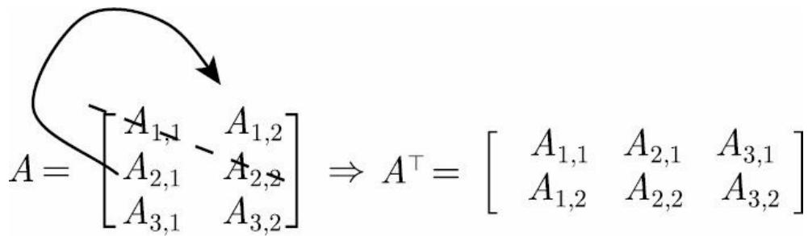
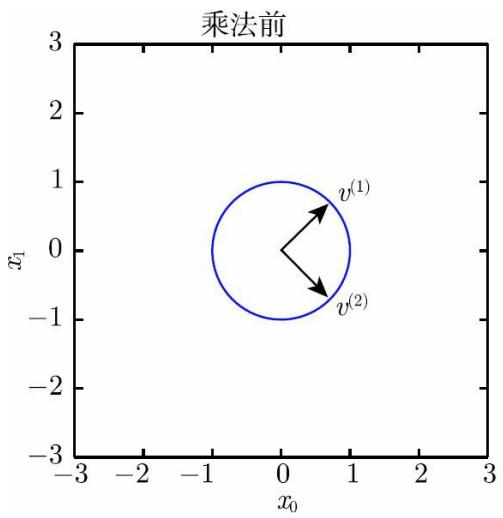
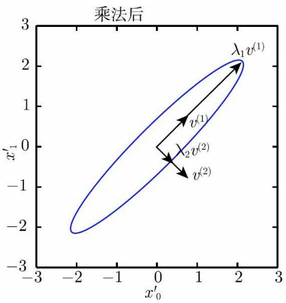

## 第1部分 应用数学与机器学习基础

## 第2章 线性代数

线性代数作为数学的一个分支，广泛应用于科学和工程中。然而，因为线性代数主要是面向连续数学，而非离散数学，所以很多计算机科学家很少接触它。掌握好线性代数对于理解和从事机器学习算法相关工作是很有必要的，尤其对于深度学习算法而言。因此，在开始介绍深度学习之前，我们集中探讨一些必备的线性代数知识。

如果你已经很熟悉线性代数，那么可以轻松地跳过本章。如果你已经了解这些概念，但是需要一份索引表来回顾一些重要公式，那么我们推荐The Matrix Cookbook （Petersen and Pedersen，2006）。如果你没有接触过线性代数，那么本章将告诉你本书所需的线性代数知识，不过我们仍然强烈建议你参考其他专门讲解线性代数的文献，例如Shilov（1977）。最后，本章略去了很多重要但是对于理解深度学习非必需的线性代数知识。

## 2.1 标量、向量、矩阵和张量

学习线性代数，会涉及以下几个数学概念：

标量 （scalar）：一个标量就是一个单独的数，它不同于线性代数中研究的其他大部分对象（通常是多个数的数组）。我们用斜体表示标量。标量通常被赋予小写的变量名称。在介绍标量时，我们会明确它们是哪种类型的数。比如，在定义实数标量时，我们可能会说“令 $s \in$ 可能会说“令 $\bar { n } \in \mathbb { N }$ 表示元素的数目”。

向量 （vector）：一个向量是一列数。这些数是有序排列的。通过次序中的索引，我们可以确定每个单独的数。通常我们赋予向量粗体的小写变量名称，比如x。向量中的元素可以通过带脚标的斜体表示。向量x的第一个元素是 $\textbf { X } _ { 1 }$ ，第二个元素是 $\mathbf { x } _ { 2 }$ ，等等。我们也会注明存储在向量中的元素是什么类型的。如果每个元素都属于$\mathbb { R }$ ，并且该向量有n个元素，那么该向量属于实数集 $\mathbb { R }$ 的n次笛卡儿乘积构成的集合，记为 $\mathbb { R } ^ { n }$ 。当需要明确表示向量中的元素时，我们会将元素排列成一个方括号包围的纵列：

$$
\boldsymbol {x} = \left[ \begin{array}{c} x _ {1} \\ x _ {2} \\ \vdots \\ x _ {n} \end{array} \right]\tag{2.1}
$$

我们可以把向量看作空间中的点，每个元素是不同坐标轴上的坐标。

有时我们需要索引向量中的一些元素。在这种情况下，我们定义一个包含这些元素索引的集合，然后将该集合写在脚标处。比如，指定 $\mathbf { X } _ { \mathrm { ~ l ~ } } \setminus \mathrm { ~ \bf ~ X ~ } _ { 3 }$ 和x ，我们定义集合 $^ 6$ $s { = } \{ 1 , ~ 3 , ~ 6 \}$ ，然后写作x 。我们 $\mathrm { S }$ 用符号－表示集合的补集中的索引。比如x 表示x中除 $^ { - 1 }$ $\textbf { X } _ { 1 }$ 外的所有元素， $\Chi _ { - \mathrm { S } }$ 表示x中除 $\mathrm { ~ \bf ~ X ~ } _ { 1 } \setminus \mathrm { ~ \bf ~ X ~ } _ { 3 } \setminus \mathrm { ~ \bf ~ X ~ } _ { 6 }$ 外所有元素构成的向量。

矩阵 （matrix）：矩阵是一个二维数组，其中的每一个元素由两个索引（而非一个）所确定。我们通常会赋予矩阵粗体的大写变量名称，比如 A 。如果一个实数矩阵高度为m，宽度为n，那么我们说$A \in \mathbb { R } ^ { m \times n }$ 。我们在表示矩阵中的元素时，通常以不加粗的斜体形式使用其名称，索引用逗号间隔。比如， $\mathrm { ~ A ~ } _ { 1 , \mathrm { ~ 1 ~ } }$ 表示 A 左上的元素， $\mathrm { A } _ { \mathrm { ~ m ~ , ~ } \mathrm { ~ n ~ } }$ 表示 A 右下的元素。我们通过用“：”表示水平坐标，以表示垂直坐标i中的所有元素。比如， $\textit { \textbf { A } } _ { i , \textit { \textbf { i } } }$ 表示 A 中垂直坐标i上的一横排元素。这也被称为 A 的第i行 （row）。同样地，$A \ , \ i$ 表示 A 的第i列 （column）。当需要明确表示矩阵中的元素时，我们将它们写在用方括号括起来的数组中：

$$
\left[ \begin{array}{c c} A _ {1, 1} & A _ {1, 2} \\ A _ {2, 1} & A _ {2, 2} \end{array} \right]\tag{2.2}
$$

有时我们需要矩阵值表达式的索引，而不是单个元素。在这种情况下，我们在表达式后面接下标，但不必将矩阵的变量名称小写化。

比如， $\operatorname { f } ( A ) _ { \mathrm { i , j } }$ 表示函数f作用在A上输出的矩阵的第i行第j列元素。

张量 （tensor）：在某些情况下，我们会讨论坐标超过两维的数组。一般的，一个数组中的元素分布在若干维坐标的规则网格中，我们称之为张量。我们使用字体 $\pmb { \mathsf { A } }$ 来表示张量“A”。张量 $\pmb { \mathsf { A } }$ 中坐标为 $( \mathrm { i , j , k } )$ 的元素记作 $\mathrm { A _ { i , j , k } }$ k 。

转置 （transpose）是矩阵的重要操作之一。矩阵的转置是以对角线为轴的镜像，这条从左上角到右下角的对角线被称为主对角线 （maindiagonal）。图2.1显示了这个操作。我们将矩阵 A 的转置表示为 $A ^ { \intercal }$ ，定义如下

$$
(\boldsymbol {A} ^ {\top}) _ {i, j} = A _ {j, i}\tag{2.3}
$$

向量可以看作只有一列的矩阵。对应地，向量的转置可以看作只有一行的矩阵。有时，我们通过将向量元素作为行矩阵写在文本行中，然后使用转置操作将其变为标准的列向量，来定义一个向量，比如$\pmb { x } = [ x _ { 1 } , x _ { 2 } , x _ { 3 } ] ^ { \top }$ o

  
图2.1 矩阵的转置可以看作以主对角线为轴的一个镜像

标量可以看作只有一个元素的矩阵。因此，标量的转置等于它本身，$a = a ^ { \top }$

只要矩阵的形状一样，我们可以把两个矩阵相加。两个矩阵相加是指对应位置的元素相加，比如 $\scriptstyle { C = A \ + \ B }$ ，其中 ${ C _ { i , j } } \mathrm { { = } } { A _ { i , j } } \mathrm { { \Omega } } + { B _ { i , j } }$ o

标量和矩阵相乘，或是和矩阵相加时，我们只需将其与矩阵的每个元素相乘或相加，比如 $\scriptstyle D = a \cdot B + c$ ，其中 $D _ { i , j } { = } a \cdot B _ { i , j } + c$ 0

在深度学习中，我们也使用一些不那么常规的符号。我们允许矩阵和向量相加，产生另一个矩阵： $C = A \ + \ b$ ，其中 ${ C _ { \ i , j } } = { A _ { \ i , j } } \ + \ { b _ { \ j } }$ 。换言之，向量b和矩阵A的每一行相加。这个简写方法使我们无须在加法操作前定义一个将向量 b 复制到每一行而生成的矩阵。这种隐式地复制向量b到很多位置的方式，称为广播 （broadcasting）。

## 2.2 矩阵和向量相乘

矩阵乘法是矩阵运算中最重要的操作之一。两个矩阵 A 和 B 的矩阵乘积 （matrix product）是第三个矩阵 C 。为了使乘法可被定义，矩阵 A的列数必须和矩阵 B 的行数相等。如果矩阵 A 的形状是m×n，矩阵 B的形状是n×p，那么矩阵 C 的形状是m×p。我们可以通过将两个或多个矩阵并列放置以书写矩阵乘法，例如

$$
C = A B\tag{2.4}
$$

具体地，该乘法操作定义为

$$
C _ {i, j} = \sum_ {k} A _ {i, k} B _ {k, j}\tag{2.5}
$$

需要注意的是，两个矩阵的标准乘积不是指两个矩阵中对应元素的乘积。不过，那样的矩阵操作确实是存在的，称为元素对应乘积（element-wise product）或者Hadamard乘积 （Hadamard product），记为 $A \odot B$

两个相同维数的向量 x 和 y 的点积 （dot product）可看作矩阵乘积$x ^ { \mid } y$ 。我们可以把矩阵乘积 $C = A B$ 中计算 $\mathrm { i } _ { \mathrm { j } }$ 的步骤看作 A 的第i行和B的第j列之间的点积。

矩阵乘积运算有许多有用的性质，从而使矩阵的数学分析更加方便。比如，矩阵乘积服从分配律：

$$
\boldsymbol {A} (\boldsymbol {B} + \boldsymbol {C}) = \boldsymbol {A B} + \boldsymbol {A C}\tag{2.6}
$$

矩阵乘积也服从结合律：

$$
\boldsymbol {A} (\boldsymbol {B C}) = (\boldsymbol {A B}) \boldsymbol {C}\tag{2.7}
$$

不同于标量乘积，矩阵乘积并不满足交换律（ $\pmb { A } \pmb { B } { = } \pmb { B } \pmb { A }$ 的情况并非总是满足）。然而，两个向量的点积 满足交换律：

$$
\boldsymbol {x} ^ {\top} \boldsymbol {y} = \boldsymbol {y} ^ {\top} \boldsymbol {x}\tag{2.8}
$$

矩阵乘积的转置有着简单的形式：

$$
(\boldsymbol {A} \boldsymbol {B}) ^ {\top} = \boldsymbol {B} ^ {\top} \boldsymbol {A} ^ {\top}\tag{2.9}
$$

利用两个向量点积的结果是标量、标量转置是自身的事实，我们可以证明式（2.8）：

$$
\boldsymbol {x} ^ {\top} \boldsymbol {y} = \left(\boldsymbol {x} ^ {\top} \boldsymbol {y}\right) ^ {\top} = \boldsymbol {y} ^ {\top} \boldsymbol {x}\tag{2.10}
$$

由于本书的重点不是线性代数，我们并不想展示矩阵乘积的所有重要性质，但读者应该知道矩阵乘积还有很多有用的性质。

现在我们已经知道了足够多的线性代数符号，可以表达下列线性方程组：

$$
A x = b\tag{2.11}
$$

其中 $A \in \mathbb { R } ^ { m \times n }$ 是一个已知矩阵， $\pmb { b } \in \mathbb { R } ^ { m }$ 是一个已知向量， $\boldsymbol { x } \in \mathbb { R } ^ { n }$ 是一个我们要求解的未知向量。向量 x 的每一个元素$\mathbf { X } _ { \mathrm { ~ i ~ } }$ 都是未知的。矩阵 A 的每一行和b中对应的元素构成一个约束。我们可以把式（2.11）重写为

$$
\boldsymbol {A} _ {1,:} \boldsymbol {x} = b _ {1}\tag{2.12}
$$

$$
\boldsymbol {A} _ {2,:} \boldsymbol {x} = b _ {2}\tag{2.13}
$$

(2.14)

$$
\boldsymbol {A} _ {m,:} \boldsymbol {x} = b _ {m}\tag{2.15}
$$

或者，更明确地，写作

$$
\boldsymbol {A} _ {1, 1} x _ {1} + \boldsymbol {A} _ {1, 2} x _ {2} + \dots + \boldsymbol {A} _ {1, n} x _ {n} = b _ {1}\tag{2.16}
$$

$$
\boldsymbol {A} _ {2, 1} x _ {1} + \boldsymbol {A} _ {2, 2} x _ {2} + \dots + \boldsymbol {A} _ {2, n} x _ {n} = b _ {2}\tag{2.17}
$$

(2.18)

$$
\boldsymbol {A} _ {m, 1} x _ {1} + \boldsymbol {A} _ {m, 2} x _ {2} + \dots + \boldsymbol {A} _ {m, n} x _ {n} = b _ {m}\tag{2.19}
$$

矩阵向量乘积符号为这种形式的方程提供了更紧凑的表示。

## 2.3 单位矩阵和逆矩阵

线性代数提供了称为矩阵逆 （matrix inversion）的强大工具。对于大多数矩阵A，我们都能通过矩阵逆解析地求解式（2.11）。

为了描述矩阵逆，我们首先需要定义单位矩阵 （identity matrix）的概念。任意向量和单位矩阵相乘，都不会改变。我们将保持n维向量不变的单位矩阵记作 $I _ { n }$ 。形式上， $\pmb { I } _ { n } \in \mathbb { R } ^ { n \times n }$ ，

$$
\forall \boldsymbol {x} \in \mathbb {R} ^ {n}, \boldsymbol {I} _ {n} \boldsymbol {x} = \boldsymbol {x}\tag{2.20}
$$

单位矩阵的结构很简单：所有沿主对角线的元素都是1，而其他位置的所有元素都是0，如图2.2所示。

$$
\left[ \begin{array}{c c c} 1 & 0 & 0 \\ 0 & 1 & 0 \\ 0 & 0 & 1 \end{array} \right]
$$

图2.2 单位矩阵的一个样例：这是 $I _ { 3 }$

矩阵A的矩阵逆 记作 $A ^ { - l }$ ，其定义的矩阵满足如下条件：

$$
\boldsymbol {A} ^ {- 1} \boldsymbol {A} = \boldsymbol {I} _ {n}\tag{2.21}
$$

现在我们可以通过以下步骤求解式（2.11）：

$$
A x = b\tag{2.22}
$$

$$
\pmb {A} ^ {- 1} \pmb {A x} = \pmb {A} ^ {- 1} \pmb {b}\tag{2.23}
$$

$$
\pmb {I} _ {n} \pmb {x} = \pmb {A} ^ {- 1} \pmb {b}\tag{2.24}
$$

$$
\pmb {x} = \pmb {A} ^ {- 1} \pmb {b}\tag{2.25}
$$

当然，这取决于我们能否找到一个逆矩阵 $A ^ { - I }$ 。在接下来的章节中，我们会讨论逆矩阵 $A ^ { - I }$ 存在的条件。

当逆矩阵 $A ^ { - I }$ 存在时，有几种不同的算法都能找到它的闭解形式。理论上，相同的逆矩阵可用于多次求解不同向量b的方程。然而，逆矩阵 A−1 主要是作为理论工具使用的，并不会在大多数软件应用程序中实际使用。这是因为逆矩阵 $A ^ { - l }$ 在数字计算机上只能表现出有限的精度，有效使用向量b的算法通常可以得到更精确的x。

## 2.4 线性相关和生成子空间

如果逆矩阵 $A ^ { - I }$ 存在，那么式（2.11）肯定对于每一个向量 b 恰好存在一个解。但是，对于方程组而言，对于向量 b 的某些值，有可能不存在解，或者存在无限多个解。存在多于一个解但是少于无限多个解的情况是不可能发生的；因为如果x和y 都是某方程组的解，则

$$
\boldsymbol {z} = \alpha \boldsymbol {x} + (1 - \alpha) \boldsymbol {y}\tag{2.26}
$$

（其中α取任意实数）也是该方程组的解。

为了分析方程有多少个解，我们可以将 A 的列向量看作从原点（origin）（元素都是零的向量）出发的不同方向，确定有多少种方法可以到达向量 $\pmb { b } _ { \mathrm { ~ \circ ~ } }$ 在这个观点下，向量 x 中的每个元素表示我们应该沿着这些方向走多远，即 $\boldsymbol { x } _ { i }$ 表示我们需要沿着第i个向量的方向走多远：

$$
\boldsymbol {A} \boldsymbol {x} = \sum_ {i} x _ {i} \boldsymbol {A} _ {:, i}\tag{2.27}
$$

一般而言，这种操作称为线性组合 （linear combination）。形式上，一组向量的线性组合，是指每个向量乘以对应标量系数之后的和，即

$$
\sum_ {i} c _ {i} \pmb {v} ^ {(i)}\tag{2.28}
$$

一组向量的生成子空间 （span）是原始向量线性组合后所能抵达的点的集合。

确定Ax=b 是否有解，相当于确定向量 b 是否在 A 列向量的生成子空间中。这个特殊的生成子空间被称为 A 的列空间 （column space）或者 A的值域 （range）。

为了使方程 Ax=b 对于任意向量 $\pmb { b } \in \mathbb { R } ^ { m }$ 都存在解，我们要求 A的列空间构成整个 $\mathbb { R } ^ { m }$ 。如果 $\mathbb { R } ^ { \bar { m } }$ 中的某个点不在 A 的列空间中，那么该点对应的 b 会使得该方程没有解。矩阵 A 的列空间是整个的要求，意味着 A 至少有m列，即 $n \geqslant m$ 。否则， A 列空间的维数会小于m。例如，假设A 是一个3×2的矩阵。目标 b 是3维的，但是 x 只有2维。所以无论如何修改 x 的值，也只能描绘出 $\mathbb { R } ^ { 3 }$ 空间中的二维平面。当且仅当向量b在该二维平面中时，该方程有解。

不等式 $n \geqslant m$ 仅是方程对每一点都有解的必要条件。这不是一个充分条件，因为有些列向量可能是冗余的。假设有一个 $\mathbb { R } ^ { 2 \times 2 }$ 中的矩阵，它的两个列向量是相同的。那么它的列空间和它的一个列向量作为矩阵的列空间是一样的。换言之，虽然该矩阵有2列，但是它的列空间仍然只是一条线，不能涵盖整个 $\mathbb { R } ^ { 2 }$ 空间。

正式地说，这种冗余称为线性相关 （linear dependence）。如果一组向量中的任意一个向量都不能表示成其他向量的线性组合，那么这组向量称为线性无关 （linearly independent）。如果某个向量是一组向量中某些向量的线性组合，那么我们将这个向量加入这组向量后不会增加这组向量的生成子空间。这意味着，如果一个矩阵的列空间涵盖整个，那么该矩阵必须包含至少一组m个线性无关的向量。这是式（2.11）对于每一个向量 b 的取值都有解的充分必要条件。值得注意的是，这个条件是说该向量集恰好有m个线性无关的列向量，而不是至少m个。不存在一个m维向量的集合具有多于m个彼此线性不相关的列向量，但是一个有多于m个列向量的矩阵有可能拥有不止一个大小为m的线性无关向量集。

要想使矩阵可逆，我们还需要保证式（2.11）对于每一个 b 值至多有一个解。为此，我们需要确保该矩阵至多有m个列向量。否则，该方程会有不止一个解。

综上所述，这意味着该矩阵必须是一个方阵 （square），即m=n，并且所有列向量都是线性无关的。一个列向量线性相关的方阵被称为奇异的（singular）。

如果矩阵 A 不是一个方阵或者是一个奇异的方阵，该方程仍然可能有解。但是我们不能使用矩阵逆去求解。

目前为止，我们已经讨论了逆矩阵左乘。我们也可以定义逆矩阵右乘：

$$
A A ^ {- 1} = I\tag{2.29}
$$

对于方阵而言，它的左逆和右逆是相等的。

## 2.5 范数

有时我们需要衡量一个向量的大小。在机器学习中，我们经常使用称为范数 （norm）的函数来衡量向量大小。形式上， $\mathrm { ~ L ~ } ^ { \mathfrak { p } }$ 范数定义如下

$$
\| \boldsymbol {x} \| _ {p} = \left(\sum_ {i} | x _ {i} | ^ {p}\right) ^ {\frac {1}{p}}\tag{2.30}
$$

其中 $p \in \mathbb { R } , \ p \geqslant 1$

范数（包括L p 范数）是将向量映射到非负值的函数。直观上来说，向量 x 的范数衡量从原点到点 x 的距离。更严格地说，范数是满足下列性质的任意函数：

$$
\begin{array}{l} \bullet f (\boldsymbol {x}) = 0 \Rightarrow \boldsymbol {x} = \mathbf {0}; \\ \bullet f (\boldsymbol {x} + \boldsymbol {y}) \leqslant f (\boldsymbol {x}) + f (\boldsymbol {y}) \quad (\text {三角不等式} \quad (\text {triangle} \\ \text {inequality)}); \\ \bullet \forall \alpha \in \mathbb {R}, f (\alpha \boldsymbol {x}) = | \alpha | f (\boldsymbol {x}). \end{array}
$$

当p=2时， $\mathrm { ~ L ~ } ^ { 2 }$ 范数称为欧几里得范数 （Euclidean norm）。它表示从原点出发到向量 x 确定的点的欧几里得距离。 $\mathrm { ~ L ~ } ^ { 2 }$ 范数在机器学习中出现得十分频繁，经常简化表示为 $| x | |$ ，略去了下标2。平方 $\mathrm { ~ \cdot ~ } \mathrm { ~ L ~ } ^ { 2 }$ 范数也经常用来衡量向量的大小，可以简单地通过点积 $\mathbf { \Psi } _ { x } ^ { \prime } \mathbf { \Psi } _ { x }$ 计算。

平方 $\mathrm { ~ \cdot ~ } \mathrm { ~ L ~ } ^ { 2 }$ 范数在数学和计算上都比L2 范数本身更方便。例如，平方 $\mathrm { ~ \cdot ~ } \mathrm { ~ L ~ } ^ { 2 }$ 范数对 x 中每个元素的导数只取决于对应的元素，而L $^ 2$ 范数对每个元素的导数和整个向量相关。但是在很多情况下，平方L 2 范数也可能不受欢迎，因为它在原点附近增长得十分缓慢。在某些机器学习应用中，区分恰好是零的元素和非零但值很小的元素是很重要的。在这些情况下，我们转而使用在各个位置斜率相同，同时保持简单的数学形式的函数：$\mathrm { ~ L ~ } ^ { 1 }$ 范数。 $\mathrm { ~ L ~ } ^ { 1 }$ 范数可以简化如下

$$
\left\| \boldsymbol {x} \right\| _ {1} = \sum_ {i} \left| x _ {i} \right|\tag{2.31}
$$

当机器学习问题中零和非零元素之间的差异非常重要时，通常会使用 $\mathrm { ~ L ~ } ^ { 1 }$ 范数。每当x中某个元素从0增加 $F$ ，对应的L1 范数也会增加 $F$

有时候我们会统计向量中非零元素的个数来衡量向量的大小。有些作者将这种函数称为“L 0 范数”，但是这个术语在数学意义上是不对的。向量的非零元素的数目不是范数，因为对向量缩放α倍不会改变该向量非零元素的数目。因此，L 1 范数经常作为表示非零元素数目的替代函数。

另外一个经常在机器学习中出现的范数是L ∞ 范数，也被称为最大范数（maxnorm）。这个范数表示向量中具有最大幅值的元素的绝对值：

$$
\| \boldsymbol {x} \| _ {\infty} = \max _ {i} | x _ {i} |\tag{2.32}
$$

有时候我们可能也希望衡量矩阵的大小。在深度学习中，最常见的做法是使用Frobenius范数 （Frobenius norm），即

$$
\| \boldsymbol {A} \| _ {F} = \sqrt {\sum_ {i , j} A _ {i , j} ^ {2}}\tag{2.33}
$$

其类似于向量的L2 范数。

两个向量的点积 可以用范数来表示，具体如下

$$
\boldsymbol {x} ^ {\top} \boldsymbol {y} = \| \boldsymbol {x} \| _ {2} \| \boldsymbol {y} \| _ {2} \cos \theta\tag{2.34}
$$

其中θ表示 x 和 y 之间的夹角。

## 2.6 特殊类型的矩阵和向量

有些特殊类型的矩阵和向量是特别有用的。

对角矩阵 （diagonal matrix）只在主对角线上含有非零元素，其他位置都是零。形式上，矩阵 D 是对角矩阵，当且仅当对于所有的$i \neq j , D _ { i , j } = 0$ 。我们已经看到过一个对角矩阵：单位矩阵，其对角元素全部是1。我们用diag(ν)表示对角元素由向量ν中元素给定的一个对角方阵。对角矩阵受到关注的部分原因是对角矩阵的乘法计算很高效。计算乘法diag(ν)x，我们只需要将 x 中的每个元素 $\mathbf { \dot { X } } \mathbf { \dot { i } }$ 放大ν 倍。换言之， $\mathrm { d i a g } ( { \pmb v } ) { \pmb x } = { \pmb v } \odot { \pmb x }$ 。计算对角方阵的逆矩阵也很高效。对角方阵的逆矩阵存在，当且仅当对角元素都是非零值，在这种情况下， $\mathrm { d i a g } ( \pmb { v } ) ^ { - 1 } = \mathrm { d i a g } ( [ 1 / v _ { 1 } , \cdots , 1 / v _ { n } ] ^ { \top } )$ 。在很多情况下，我们可以根据任意矩阵导出一些通用的机器学习算法，但通过将一些矩阵限制为对角矩阵，我们可以得到计算代价较低的（并且简明扼要的）算法。

并非所有的对角矩阵都是方阵。长方形的矩阵也有可能是对角矩阵。非方阵的对角矩阵没有逆矩阵，但我们仍然可以高效地计算它们的乘法。对于一个长方形对角矩阵 D 而言，乘法 Dx 会涉及 x 中每个元素的缩放，如果 D 是瘦长型矩阵，那么在缩放后的末尾添加一些零；如果 D是胖宽型矩阵，那么在缩放后去掉最后一些元素。

对称 （symmetric）矩阵是转置和自己相等的矩阵，即

$$
\boldsymbol {A} = \boldsymbol {A} ^ {\top}\tag{2.35}
$$

当某些不依赖参数顺序的双参数函数生成元素时，对称矩阵经常会出现。例如，如果 A 是一个距离度量矩阵， $\textit { \textbf { A } } _ { i , j }$ 表示点i到点j的距离，那么 $A _ { i , j } { = } A _ { j , i }$ ，因为距离函数是对称的。

单位向量 （unitvector）是具有单位范数 （unitnorm）的向量，即

$$
\| \boldsymbol {x} \| _ {2} = 1\tag{2.36}
$$

如果 $\mathbf { x } ^ { \top } y = 0$ ，那么向量 x 和向量 y 互相正交 （orthogonal）。如果两个向量都有非零范数，那么这两个向量之间的夹角是90◦。在 $\mathbb { R } ^ { n }$ 中，至多有n个范数非零向量互相正交。如果这些向量不但互相正交，而且范数都为1，那么我们称它们是标准正交 （orthonormal）。

正交矩阵 （orthogonal matrix）指行向量和列向量是分别标准正交的方阵，即

$$
\boldsymbol {A} ^ {\top} \boldsymbol {A} = \boldsymbol {A} \boldsymbol {A} ^ {\top} = \boldsymbol {I}\tag{2.37}
$$

这意味着

$$
\boldsymbol {A} ^ {- 1} = \boldsymbol {A} ^ {\top}\tag{2.38}
$$

正交矩阵受到关注是因为求逆计算代价小。我们需要注意正交矩阵的定义。违反直觉的是，正交矩阵的行向量不仅是正交的，还是标准正交的。对于行向量或列向量互相正交但不是标准正交的矩阵，没有对应的专有术语。

## 2.7 特征分解

许多数学对象可以通过将它们分解成多个组成部分或者找到它们的一些属性来更好地理解。这些属性是通用的，而不是由我们选择表示它们的方式所产生的。

例如，整数可以分解为质因数。我们可以用十进制或二进制等不同方式表示整数12，但是 $1 2 { = } 2 { \times } 3 { \times } 3$ 永远是对的。从这个表示中我们可以获得一些有用的信息，比如12不能被5整除，或者12的倍数可以被3整除。

正如我们可以通过分解质因数来发现整数的一些内在性质，我们也可以通过分解矩阵来发现矩阵表示成数组元素时不明显的函数性质。

特征分解 （eigendecomposition）是使用最广的矩阵分解之一，即我们将矩阵分解成一组特征向量和特征值。

方阵 A 的特征向量 （eigenvector）是指与 A 相乘后相当于对该向量进行缩放的非零向量ν：

$$
\boldsymbol {A} \boldsymbol {v} = \lambda \boldsymbol {v}\tag{2.39}
$$

其中标量λ称为这个特征向量对应的特征值 （eigenvalue）。（类似地，我们也可以定义左特征向量 （left eigenvector） $v ^ { \top } A = \lambda v ^ { \top }$ 但是通常我们更关注右特征向量 （right eigenvector））。

如果 ν 是 A 的特征向量，那么任何缩放后的向量$s v \ \left( s \in \right.$ R， $s \neq 0 )$ 也是A的特征向量。此外，sν和 ν 有相同的特征值。基于这个原因，通常我们只考虑单位特征向量。

假设矩阵 A 有n个线性无关的特征向量 $\{ \pmb { v } ^ { ( 1 ) } , \cdots , \pmb { v } ^ { ( n ) } \}$ ，对应着特征值 $\{ \lambda _ { 1 } , \cdots , \lambda _ { n } \}$ 。我们将特征向量连接成一个矩阵，使得每一列是一个特征向量： $\pmb { V } = [ \pmb { v } ^ { ( 1 ) } , \cdots , \pmb { v } ^ { ( n ) } ]$ 。类似地，我们也可以将特征值连接成一个向量 $\lambda = [ \lambda _ { 1 } , \cdots , \lambda _ { n } ] ^ { \top }$ 。因此 A 的特征分解（eigendecomposition）可以记作

$$
\boldsymbol {A} = \boldsymbol {V} \mathrm{diag} (\boldsymbol {\lambda}) \boldsymbol {V} ^ {- 1}\tag{2.40}
$$

我们已经看到了构建具有特定特征值和特征向量的矩阵，能够使我们在目标方向上延伸空间。然而，我们也常常希望将矩阵分解（decompose）成特征值和特征向量。这样可以帮助我们分析矩阵的特定性质，就像质因数分解有助于我们理解整数。

不是每一个矩阵都可以分解成特征值和特征向量。在某些情况下，特征分解存在，但是会涉及复数而非实数。幸运的是，在本书中，我们通常只需要分解一类有简单分解的矩阵。具体来讲，每个实对称矩阵都可以分解成实特征向量和实特征值：

$$
\boldsymbol {A} = \boldsymbol {Q} \boldsymbol {\Lambda} \boldsymbol {Q} ^ {\top}\tag{2.41}
$$

其中 $\varrho$ 是 A 的特征向量组成的正交矩阵， Λ 是对角矩阵。特征值 $\Lambda _ { \mathrm { ~ i ~ } }$ 对应的特征向量是矩阵 $\varrho$ 的第i列，记作 $\textit { \textbf { Q } } , \textit { \textbf { i } } ^ { \mathrm { ~ } }$ 因为 $\varrho$ 是正交矩阵，我们可以将A看作沿方向 $\nu ^ { ( i ) }$ 延展 $\lambda _ { \mathrm { i } }$ 倍的空间，如图2.3所示。

  
图2.3 特征向量和特征值的作用效果。特征向量和特征值的作用效果的一个实例。在这里，矩阵 A 有两个标准正交的特征向量，对应特征值为λ 的 $_ { \nu } ( I )$ 以及对应特征值为 $\forall \lambda _ { 2 }$ 的 $_ { \nu } \left( 2 \right)$ 0

$$
\boldsymbol {u} \in \mathbb {R} ^ {2}
$$

$$
\nu^ {(i)}
$$

$$
\lambda_ {\mathrm{i}}
$$

虽然任意一个实对称矩阵 A 都有特征分解，但是特征分解可能并不唯一。如果两个或多个特征向量拥有相同的特征值，那么在由这些特征向量产生的生成子空间中，任意一组正交向量都是该特征值对应的特征向量。因此，我们可以等价地从这些特征向量中构成 $\varrho$ 作为替代。按照惯例，我们通常按降序排列Λ的元素。在该约定下，特征分解唯一，当且仅当所有的特征值都是唯一的。

矩阵的特征分解给了我们很多关于矩阵的有用信息。矩阵是奇异的，当且仅当含有零特征值。实对称矩阵的特征分解也可以用于优化二次方程$f ( \mathbf { } x ) = x ^ { \top } A x$ ，其中限制 $| { \boldsymbol { x } } | | _ { 2 } = 1$ 。当 x 等于 A 的某个特征向量时，f将返回对应的特征值。在限制条件下，函数f的最大值是最大特征值，最小值是最小特征值。

所有特征值都是正数的矩阵称为正定 （positive definite）；所有特征值都是非负数的矩阵称为半正定 （positive semidefinite）。同样地，所有特征值都是负数的矩阵称为负定 （negative definite）；所有特征值都是非正数的矩阵称为半负定 （negative semidefinite）。半正定矩阵受到关注是因为它们保证 $\forall x , x ^ { \top } A x \geqslant 0$ 。此外，正定矩阵还保证$x ^ { \top } A x = 0 \Rightarrow x = 0$ o

## 2.8 奇异值分解

在第2.7节，我们探讨了如何将矩阵分解成特征向量和特征值。还有另一种分解矩阵的方法，称为奇异值分解 （singular value decomposition，SVD），是将矩阵分解为奇异向量 （singular vector）和奇异值（singular value）。通过奇异值分解，我们会得到一些与特征分解相同类型的信息。然而，奇异值分解有更广泛的应用。每个实数矩阵都有一个奇异值分解，但不一定都有特征分解。例如，非方阵的矩阵没有特征分解，这时我们只能使用奇异值分解。

回想一下，我们使用特征分解去分析矩阵A时，得到特征向量构成的矩阵V和特征值构成的向量λ，我们可以重新将A写作

$$
\boldsymbol {A} = \boldsymbol {V} \mathrm{diag} (\boldsymbol {\lambda}) \boldsymbol {V} ^ {- 1}\tag{2.42}
$$

奇异值分解是类似的，只不过这回我们将矩阵 A 分解成三个矩阵的乘积：

$$
\boldsymbol {A} = \boldsymbol {U} \boldsymbol {D} \boldsymbol {V} ^ {\top}\tag{2.43}
$$

假设 A 是一个m×n的矩阵，那么 U 是一个m×m的矩阵， D 是一个m×n的矩阵，V是一个n×n矩阵。

这些矩阵中的每一个经定义后都拥有特殊的结构。矩阵 U 和 V 都定义为正交矩阵，而矩阵 D 定义为对角矩阵。注意，矩阵 D 不一定是方阵。

对角矩阵 D 对角线上的元素称为矩阵 A 的奇异值 （singular value）。矩阵 U 的列向量称为左奇异向量 （left singular vector），矩阵 V 的列向量称右奇异向量 （right singular vector）。

事实上，我们可以用与 A 相关的特征分解去解释 A 的奇异值分解。 A的左奇异向量 （left singular vector）是 $A A ^ { \top }$ 的特征向量。 A 的右奇异向量 （right singular vector）是 $A$ T 的特征向量。 A 的非零奇异值是 $A ^ { \top } A$ 特征值的平方根，同时也是 $\hat { A } A ^ { \top }$ 特征值的平方根。

SVD最有用的一个性质可能是拓展矩阵求逆到非方矩阵上。我们将在下一节中探讨。

## 2.9 Moore-Penrose伪逆

对于非方矩阵而言，其逆矩阵没有定义。假设在下面的问题中，我们希望通过矩阵A的左逆B来求解线性方程：

$$
A x = y\tag{2.44}
$$

等式两边左乘左逆B后，我们得到

$$
x = B y\tag{2.45}
$$

取决于问题的形式，我们可能无法设计一个唯一的映射将 A 映射到 B

如果矩阵 A 的行数大于列数，那么上述方程可能没有解。如果矩阵 A的行数小于列数，那么上述矩阵可能有多个解。

Moore-Penrose伪逆 （Moore-Penrose pseudoinverse）使我们在这类问题上取得了一定的进展。矩阵 A 的伪逆定义为

$$
\boldsymbol {A} ^ {+} = \lim _ {a \searrow 0} (\boldsymbol {A} ^ {\top} \boldsymbol {A} + \alpha \boldsymbol {I}) ^ {- 1} \boldsymbol {A} ^ {\top}\tag{2.46}
$$

计算伪逆的实际算法没有基于这个定义，而是使用下面的公式

$$
\boldsymbol {A} ^ {+} = \boldsymbol {V} \boldsymbol {D} ^ {+} \boldsymbol {U} ^ {\top}\tag{2.47}
$$

其中，矩阵 U、D 和 V 是矩阵 A 奇异值分解后得到的矩阵。对角矩阵D的伪逆 $D ^ { + }$ 是其非零元素取倒数之后再转置得到的。

当矩阵A的列数多于行数时，使用伪逆求解线性方程是众多可能解法中的一种。特别地， $x = A ^ { + } y$ 是方程所有可行解中欧几里得范数$\| \mathbf { \boldsymbol { x } } \| _ { 2 }$ 最小的一个。

当矩阵A的行数多于列数时，可能没有解。在这种情况下，通过伪逆得到的x使得Ax 和y的欧几里得距离 $\| A x - y \| _ { 2 }$ 最小。

## 2.10 迹运算

迹运算返回的是矩阵对角元素的和：

$$
\operatorname{Tr} (\boldsymbol {A}) = \sum_ {i} \boldsymbol {A} _ {i, i}.\tag{2.48}
$$

迹运算因为很多原因而有用。若不使用求和符号，有些矩阵运算很难描述，而通过矩阵乘法和迹运算符号可以清楚地表示。例如，迹运算提供了另一种描述矩阵Frobenius范数的方式：

$$
\| A \| _ {F} = \sqrt {\operatorname{Tr} (\boldsymbol {A} \boldsymbol {A} ^ {\top})}\tag{2.49}
$$

用迹运算表示表达式，我们可以使用很多有用的等式巧妙地处理表达式。例如，迹运算在转置运算下是不变的：

$$
\operatorname{Tr} (\boldsymbol {A}) = \operatorname{Tr} (\boldsymbol {A} ^ {\top})\tag{2.50}
$$

多个矩阵相乘得到的方阵的迹，和将这些矩阵中的最后一个挪到最前面之后相乘的迹是相同的。当然，我们需要考虑挪动之后矩阵乘积依然定义良好：

$$
\operatorname{Tr} (\boldsymbol {A B C}) = \operatorname{Tr} (\boldsymbol {C A B}) = \operatorname{Tr} (\boldsymbol {B C A})\tag{2.51}
$$

或者更一般地，

$$
\operatorname{Tr} \left(\prod_ {i = 1} ^ {n} \boldsymbol {F} ^ {(i)}\right) = \operatorname{Tr} \left(\boldsymbol {F} ^ {(n)} \prod_ {i = 1} ^ {n - 1} \boldsymbol {F} ^ {(i)}\right)\tag{2.52}
$$

即使循环置换后矩阵乘积得到的矩阵形状变了，迹运算的结果依然不变。例如，假设矩阵 $A \in \mathbb { R } ^ { m \times n }$ ，矩阵 $B \in \mathbb { R } ^ { n \times m }$ ，我们可以得到

$$
\operatorname{Tr} (\boldsymbol {A B}) = \operatorname{Tr} (\boldsymbol {B A})\tag{2.53}
$$

尽管 $\pmb { A } \pmb { B } \in \mathbb { R } ^ { m \times m } \neq \mathbb { 1 } \ B \pmb { A } \in \mathbb { R } ^ { n \times n }$ o

另一个有用的事实是标量在迹运算后仍然是它自己： $\mathsf { a { = } T r } ( \mathsf { a } )$

## 2.11 行列式

行列式，记作det( A )，是一个将方阵 A 映射到实数的函数。行列式等于矩阵特征值的乘积。行列式的绝对值可以用来衡量矩阵参与矩阵乘法后空间扩大或者缩小了多少。如果行列式是0，那么空间至少沿着某一维完全收缩了，使其失去了所有的体积；如果行列式是1，那么这个转换保持空间体积不变。

## 2.12 实例：主成分分析

主成分分析 （principal components analysis，PC A ）是一个简单的机器学习算法，可以通过基础的线性代数知识推导。

假设在 $\mathbb { R } ^ { n }$ 空间中有m个点 $\{ \pmb { x } ^ { ( 1 ) } , \cdots , \pmb { x } ^ { ( m ) } \}$ ，我们希望对这些点进行有损压缩。有损压缩表示我们使用更少的内存，但损失一些精度去存储这些点。我们希望损失的精度尽可能少。

编码这些点的一种方式是用低维表示。对于每个点 $\pmb { x } ^ { ( i ) } \in \mathbb { R } ^ { n }$ ，会有一个对应的编码向量 $\boldsymbol { c } ^ { ( i ) } \in \mathbb { R } ^ { l }$ 。如果l比n小，那么我们便使用了更少的内存来存储原来的数据。我们希望找到一个编码函数，根据输入返回编码，f( $\scriptstyle { \textbf { \em x } } ) = \mathbf { c }$ ；我们也希望找到一个解码函数，给定编码重构输入，$\operatorname { x } { \approx } \operatorname { g } ( \operatorname { f } ( x ) )$ 。

PCA由我们选择的解码函数而定。具体来讲，为了简化解码器，我们使用矩阵乘法将编码映射回 $\mathbb { R } ^ { n }$ ， $\pounds \| _ { g } \left( c \ \right) = D c$ ，其中 $D \in \mathbb { R } ^ { n \times l }$ 是定义解码的矩阵。

到目前为止，所描述的问题可能会有多个解。因为如果我们按比例地缩小所有点对应的编码向量 $\mathrm { \Delta } \cdot \mathrm { \Delta } \mathrm { c } _ { \mathrm { \scriptsize ~ i } }$ ，那么只需按比例放大 $D _ { : , i }$ ，即可保持结果不变。为了使问题有唯一解，我们限制 D 中所有列向量都有单位范数。

计算这个解码器的最优编码可能是一个困难的问题。为了使编码问题简单一些，PCA限制 D 的列向量彼此正交（注意，除非l=n，否则严格意义上D不是一个正交矩阵）。

为了将这个基本想法变为我们能够实现的算法，首先我们需要明确如何根据每一个输入x得到一个最优编码 $\mathfrak { c } ^ { * }$ 。一种方法是最小化原始输入向量 x 和重构向量 $\mathrm { \cdot } \mathrm { g } ( \mathrm { c } ^ { \mathrm { \scriptsize ~ * } }$ )之间的距离。我们使用范数来衡量它们之间的距离。在PCA算法中，我们使用 $\mathrm { ~ L ~ } ^ { 2 }$ 范数

$$
\boldsymbol {c} ^ {*} = \underset {\boldsymbol {c}} {\arg \min} \| \boldsymbol {x} - g (\boldsymbol {c}) \| _ {2}\tag{2.54}
$$

我们可以用平方 $\mathrm { ~ L ~ } ^ { 2 }$ 范数替代 $\therefore \mathtt { L } ^ { 2 }$ 范数，因为两者在相同的值c上取得最小值。这是因为L 2 范数是非负的，并且平方运算在非负值上是单调递增的。

$$
\boldsymbol {c} ^ {*} = \arg \min _ {\boldsymbol {c}} \| \boldsymbol {x} - g (\boldsymbol {c}) \| _ {2} ^ {2}\tag{2.55}
$$

该最小化函数可以简化成

$$
\left(\boldsymbol {x} - g (\boldsymbol {c})\right) ^ {\top} \left(\boldsymbol {x} - g (\boldsymbol {c})\right)\tag{2.56}
$$

（式（2.30）中 $\mathrm { ~ L ~ } ^ { 2 }$ 范数的定义）

$$
= \boldsymbol {x} ^ {\top} \boldsymbol {x} - \boldsymbol {x} ^ {\top} g (\boldsymbol {c}) - g (\boldsymbol {c}) ^ {\top} \boldsymbol {x} + g (\boldsymbol {c}) ^ {\top} g (\boldsymbol {c})\tag{2.57}
$$

（分配律）

$$
= \boldsymbol {x} ^ {\top} \boldsymbol {x} - 2 \boldsymbol {x} ^ {\top} g (\boldsymbol {c}) + g (\boldsymbol {c}) ^ {\top} g (\boldsymbol {c})\tag{2.58}
$$

（因为标量 $g ( c ) ^ { \intercal } x$ 的转置等于自己）。

因为第一项 ${ \boldsymbol { x } } ^ { \intercal } { \boldsymbol { x } }$ 不依赖于c，所以我们可以忽略它，得到如下的优化

目标：

$$
\boldsymbol {c} ^ {*} = \underset {\boldsymbol {c}} {\arg \min} - 2 \boldsymbol {x} ^ {\top} g (\boldsymbol {c}) + g (\boldsymbol {c}) ^ {\top} g (\boldsymbol {c})\tag{2.59}
$$

更进一步，代入g(c)的定义：

$$
\boldsymbol {c} ^ {*} = \underset {\boldsymbol {c}} {\arg \min} - 2 \boldsymbol {x} ^ {\top} \boldsymbol {D} \boldsymbol {c} + \boldsymbol {c} ^ {\top} \boldsymbol {D} ^ {\top} \boldsymbol {D} \boldsymbol {c}\tag{2.60}
$$

$$
= \underset {c} {\arg \min} - 2 x ^ {\top} D c + c ^ {\top} I _ {l} c\tag{2.61}
$$

（矩阵D的正交性和单位范数约束）

$$
= \underset {c} {\arg \min} - 2 \boldsymbol {x} ^ {\top} \boldsymbol {D} \boldsymbol {c} + \boldsymbol {c} ^ {\top} \boldsymbol {c}\tag{2.62}
$$

我们可以通过向量微积分来求解这个最优化问题（如果你不清楚怎么做，请参考第4.3节）。

$$
\nabla_ {c} (- 2 \boldsymbol {x} ^ {\top} \boldsymbol {D} \boldsymbol {c} + \boldsymbol {c} ^ {\top} \boldsymbol {c}) = 0\tag{2.63}
$$

$$
- 2 \pmb {D} ^ {\top} \pmb {x} + 2 \pmb {c} = 0\tag{2.64}
$$

$$
\boldsymbol {c} = \boldsymbol {D} ^ {\top} \boldsymbol {x}\tag{2.65}
$$

这使得算法很高效：最优编码 x 只需要一个矩阵-向量乘法操作。为了编码向量，我们使用编码函数

$$
f (\boldsymbol {x}) = \boldsymbol {D} ^ {\top} \boldsymbol {x}\tag{2.66}
$$

进一步使用矩阵乘法，我们也可以定义PCA重构操作：

$$
r (\boldsymbol {x}) = g (f (\boldsymbol {x})) = \boldsymbol {D} \boldsymbol {D} ^ {\top} \boldsymbol {x}\tag{2.67}
$$

接下来，我们需要挑选编码矩阵 D 。要做到这一点，先来回顾最小化输入和重构之间L 2 距离的这个想法。因为用相同的矩阵 D 对所有点进行解码，我们不能再孤立地看待每个点。反之，我们必须最小化所有维数和所有点上的误差矩阵的Frobenius范数：

$$
\boldsymbol {D} ^ {*} = \underset {\boldsymbol {D}} {\arg \min} \sqrt {\sum_ {i , j} \left(\boldsymbol {x} _ {j} ^ {(i)} - r (\boldsymbol {x} ^ {(i)}) _ {j}\right) ^ {2}} \text { subject   to } \boldsymbol {D} ^ {\top} \boldsymbol {D} = \boldsymbol {I} _ {l}\tag{2.68}
$$

为了推导用于寻求 $\pmb { D } ^ { \mathrm { ~ * ~ } }$ 的算法，我们首先考虑l=1的情况。在这种情况下， D 是一个单一向量 $\pmb { d }$ 。将式（2.67）代入式（2.68），简化 D 为 $\mathbf { \delta } _ { d }$ ，问题简化为

$$
\boldsymbol {d} ^ {*} = \underset {\boldsymbol {d}} {\arg \min} \sum_ {i} \left\| \boldsymbol {x} ^ {(i)} - \boldsymbol {d} \boldsymbol {d} ^ {\top} \boldsymbol {x} ^ {(i)} \right\| _ {2} ^ {2} \text {   subject   to   } \| \boldsymbol {d} \| _ {2} = 1\tag{2.69}
$$

上述公式是直接代入得到的，但不是表述上最美观的方式。在上述公式中，我们将标量 $\mathbf { \bar { \mathbf { \Phi } } } d ^ { \top } \mathbf { x } ^ { ( i ) }$ 放在向量 d 的右边。将该标量放在左边的写法更为传统。于是我们通常写作

$$
\boldsymbol {d} ^ {*} = \underset {\boldsymbol {d}} {\arg \min} \sum_ {i} \left\| \boldsymbol {x} ^ {(i)} - \boldsymbol {d} ^ {\top} \boldsymbol {x} ^ {(i)} \boldsymbol {d} \right\| _ {2} ^ {2} \text {   subject   to   } \| \boldsymbol {d} \| _ {2} = 1\tag{2.70}
$$

或者，考虑到标量的转置和自身相等，我们也可以写作

$$
\boldsymbol {d} ^ {*} = \underset {\boldsymbol {d}} {\arg \min} \sum_ {i} \left\| \boldsymbol {x} ^ {(i)} - \boldsymbol {x} ^ {(i) \top} \boldsymbol {d} \boldsymbol {d} \right\| _ {2} ^ {2} \text {   subject   to   } \| \boldsymbol {d} \| _ {2} = 1\tag{2.71}
$$

读者应该对这些重排写法慢慢熟悉起来。

此时，使用单一矩阵来重述问题，比将问题写成求和形式更有帮助。这有助于我们使用更紧凑的符号。将表示各点的向量堆叠成一个矩阵，记为 $\pmb { X } \in \mathbb { R } ^ { m \times n }$ ，其中 $\pmb { X } _ { i , : } = \pmb { x } ^ { ( i ) ^ { \top } }$ 。原问题可以重新表述为

$$
\boldsymbol {d} ^ {*} = \underset {\boldsymbol {d}} {\arg \min} \left\| \boldsymbol {X} - \boldsymbol {X} \boldsymbol {d} \boldsymbol {d} ^ {\top} \right\| _ {F} ^ {2} \text { subject   to } \boldsymbol {d} ^ {\top} \boldsymbol {d} = 1\tag{2.72}
$$

暂时不考虑约束，我们可以将Frobenius范数简化成下面的形式：

$$
\underset {d} {\arg \min} \left\| \boldsymbol {X} - \boldsymbol {X} d \boldsymbol {d} ^ {\top} \right\| _ {F} ^ {2}\tag{2.73}
$$

$$
= \underset {d} {\arg \min} \operatorname{Tr} \left(\left(\boldsymbol {X} - \boldsymbol {X} d \boldsymbol {d} ^ {\top}\right) ^ {\top} \left(\boldsymbol {X} - \boldsymbol {X} d \boldsymbol {d} ^ {\top}\right)\right)\tag{2.74}
$$

（式（2.49））

$$
= \underset {d} {\arg \min} \operatorname{Tr} \left(\boldsymbol {X} ^ {\top} \boldsymbol {X} - \boldsymbol {X} ^ {\top} \boldsymbol {X} d \boldsymbol {d} ^ {\top} - d \boldsymbol {d} ^ {\top} \boldsymbol {X} ^ {\top} \boldsymbol {X} + d \boldsymbol {d} ^ {\top} \boldsymbol {X} ^ {\top} \boldsymbol {X} d \boldsymbol {d} ^ {\top}\right)\tag{2.75}
$$

$$
= \underset {d} {\arg \min} \operatorname{Tr} (\boldsymbol {X} ^ {\top} \boldsymbol {X}) - \operatorname{Tr} (\boldsymbol {X} ^ {\top} \boldsymbol {X} d \boldsymbol {d} ^ {\top}) - \operatorname{Tr} (d \boldsymbol {d} ^ {\top} \boldsymbol {X} ^ {\top} \boldsymbol {X}) + \operatorname{Tr} (d \boldsymbol {d} ^ {\top} \boldsymbol {X} ^ {\top} \boldsymbol {X} d \boldsymbol {d} ^ {\top})\tag{2.76}
$$

$$
= \underset {d} {\arg \min} - \operatorname{Tr} (\boldsymbol {X} ^ {\top} \boldsymbol {X} d \boldsymbol {d} ^ {\top}) - \operatorname{Tr} (d \boldsymbol {d} ^ {\top} \boldsymbol {X} ^ {\top} \boldsymbol {X}) + \operatorname{Tr} (d \boldsymbol {d} ^ {\top} \boldsymbol {X} ^ {\top} \boldsymbol {X} d \boldsymbol {d} ^ {\top})\tag{2.77}
$$

（因为与d无关的项不影响arg min）

$$
= \underset {d} {\arg \min} - 2 \operatorname{Tr} \left(\boldsymbol {X} ^ {\top} \boldsymbol {X} d \boldsymbol {d} ^ {\top}\right) + \operatorname{Tr} \left(d \boldsymbol {d} ^ {\top} \boldsymbol {X} ^ {\top} \boldsymbol {X} d \boldsymbol {d} ^ {\top}\right)\tag{2.78}
$$

（因为循环改变迹运算中相乘矩阵的顺序不影响结果，如式（2.52）所示）

$$
= \underset {d} {\arg \min} - 2 \operatorname{Tr} \left(\boldsymbol {X} ^ {\top} \boldsymbol {X} d \boldsymbol {d} ^ {\top}\right) + \operatorname{Tr} \left(\boldsymbol {X} ^ {\top} \boldsymbol {X} d \boldsymbol {d} ^ {\top} d \boldsymbol {d} ^ {\top}\right)\tag{2.79}
$$

（再次使用上述性质）。

此时，我们再来考虑约束条件

$$
\begin{array}{r l} & \underset {d} {\arg \min} - 2 \mathrm{Tr} (\boldsymbol {X} ^ {\top} \boldsymbol {X} d \boldsymbol {d} ^ {\top}) + \mathrm{Tr} (\boldsymbol {X} ^ {\top} \boldsymbol {X} d \boldsymbol {d} ^ {\top} d \boldsymbol {d} ^ {\top}) \text {subject to} \boldsymbol {d} ^ {\top} \boldsymbol {d} = 1 \\ & = \underset {d} {\arg \min} - 2 \mathrm{Tr} (\boldsymbol {X} ^ {\top} \boldsymbol {X} d \boldsymbol {d} ^ {\top}) + \mathrm{Tr} (\boldsymbol {X} ^ {\top} \boldsymbol {X} d \boldsymbol {d} ^ {\top}) \text {subject to} \boldsymbol {d} ^ {\top} \boldsymbol {d} = 1 \end{array}\tag{2.80}
$$

(2.81)

（因为约束条件）

$$
= \underset {d} {\arg \min} - \operatorname{Tr} (\boldsymbol {X} ^ {\top} \boldsymbol {X} d \boldsymbol {d} ^ {\top}) \text {   subject   to   } \boldsymbol {d} ^ {\top} \boldsymbol {d} = 1\tag{2.82}
$$

$$
= \underset {d} {\arg \max} \operatorname{Tr} (\boldsymbol {X} ^ {\top} \boldsymbol {X} d \boldsymbol {d} ^ {\top}) \text {   subject   to   } \boldsymbol {d} ^ {\top} \boldsymbol {d} = 1\tag{2.83}
$$

$$
= \underset {d} {\arg \max} \operatorname{Tr} (\boldsymbol {d} ^ {\top} \boldsymbol {X} ^ {\top} \boldsymbol {X} \boldsymbol {d}) \text {   subject   to   } \boldsymbol {d} ^ {\top} \boldsymbol {d} = 1\tag{2.84}
$$

这个优化问题可以通过特征分解来求解。具体来讲，最优的 d 是$X ^ { \top } X$ 最大特征值对应的特征向量。

以上推导特定于l=1的情况，仅得到了第一个主成分。更一般地，当我们希望得到主成分的基时，矩阵 D 由前l个最大的特征值对应的特征向量组成。这个结论可以通过归纳法证明，我们建议将此证明作为练习。

线性代数是理解深度学习所必须掌握的基础数学学科之一。另一门在机

器学习中无处不在的重要数学学科是概率论，我们将在下一章探讨。
