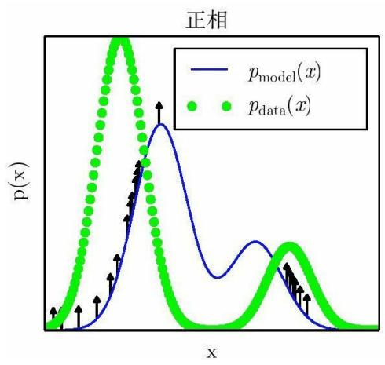
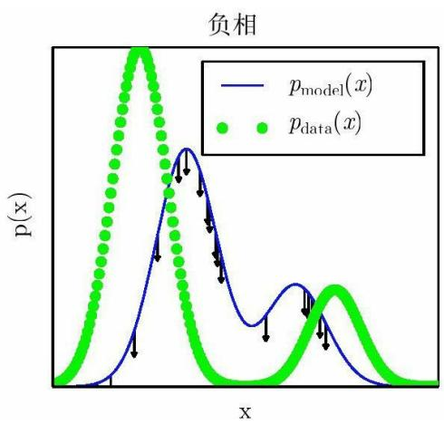
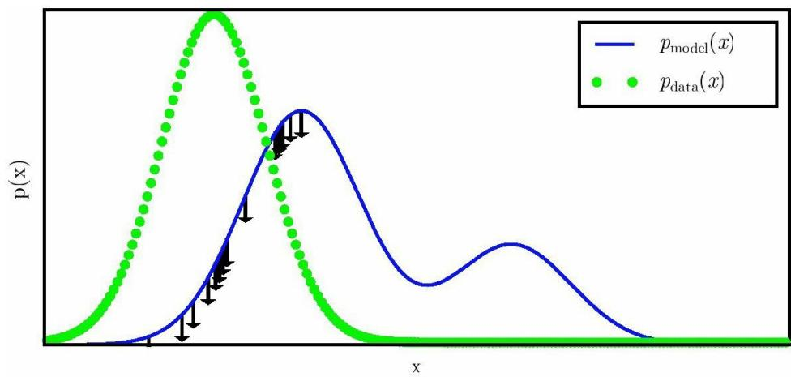

## 第3部分 深度学习研究

## 第18章 直面配分函数

在第16.2.2节中，我们看到许多概率模型（通常是无向图模型）由一个未归一化的概率分布 $\widetilde { p } ( \mathbf { x } , \theta )$ 定义。我们必须通过除以配分函数Z( θ )来归一化 $\tilde { p }$ ，以获得一个有效的概率分布：

$$
p (\mathbf {x}; \boldsymbol {\theta}) = \frac {1}{Z (\boldsymbol {\theta})} \tilde {p} (\mathbf {x}; \boldsymbol {\theta})\tag{18.1}
$$

配分函数是未归一化概率所有状态的积分（对于连续变量）或求和（对于离散变量）：

$$
\int \tilde {p} (\boldsymbol {x}) d \boldsymbol {x}\tag{18.2}
$$

或者

$$
\sum_ {\boldsymbol {x}} \tilde {p} (\boldsymbol {x})\tag{18.3}
$$

对于很多有趣的模型而言，以上积分或求和难以计算。

正如我们将在第20章看到的，有些深度学习模型被设计成具有一个易于处理的归一化常数，或被设计成能够在不涉及计算p（x ）的情况下使用。然而，其他一些模型会直接面对难以计算的配分函数的挑战。在本章中，我们会介绍用于训练和评估那些具有难以处理的配分函数的模型的技术。

## 18.1 对数似然梯度

通过最大似然学习无向模型特别困难的原因在于配分函数依赖于参数。对数似然相对于参数的梯度具有一项对应于配分函数的梯度：

$$
\nabla_ {\boldsymbol {\theta}} \log p (\mathbf {x}; \boldsymbol {\theta}) = \nabla_ {\boldsymbol {\theta}} \log \tilde {p} (\mathbf {x}; \boldsymbol {\theta}) - \nabla_ {\boldsymbol {\theta}} \log Z (\boldsymbol {\theta})\tag{18.4}
$$

这是机器学习中非常著名的正相 （positive phase）和负相 （negativephase）的分解。

对于大多数感兴趣的无向模型而言，负相是困难的。没有潜变量或潜变量之间很少相互作用的模型通常会有一个易于计算的正相。RBM的隐藏单元在给定可见单元的情况下彼此条件独立，是一个典型的具有简单正相和困难负相的模型。正相计算困难，潜变量之间具有复杂相互作用的情况将主要在第19章中讨论。本章主要探讨负相计算中的难点。

让我们进一步分析logZ的梯度：

$$
\nabla_ {\theta} \log Z\tag{18.5}
$$

$$
= \frac {\nabla_ {\theta} Z}{Z}\tag{18.6}
$$

$$
= \frac {\nabla_ {\theta} \sum_ {\mathbf {x}} \tilde {p} (\mathbf {x})}{Z}\tag{18.7}
$$

$$
= \frac {\sum_ {\mathbf {x}} \nabla_ {\boldsymbol {\theta}} \tilde {p} (\mathbf {x})}{Z}\tag{18.8}
$$

对于保证所有的x 都有p（x ） ${ } > 0$ 的模型，我们可以用exp(logp(x))代替 $\tilde { p } ( { \bf x } )$

$$
\frac {\sum_ {\mathbf {x}} \nabla_ {\boldsymbol {\theta}} \exp (\log \tilde {p} (\mathbf {x}))}{Z}\tag{18.9}
$$

$$
= \frac {\sum_ {\mathbf {x}} \exp (\log \tilde {p} (\mathbf {x})) \nabla_ {\boldsymbol {\theta}} \log \tilde {p} (\mathbf {x})}{Z}\tag{18.10}
$$

$$
= \frac {\sum_ {\mathbf {x}} \tilde {p} (\mathbf {x}) \nabla_ {\boldsymbol {\theta}} \log \tilde {p} (\mathbf {x})}{Z}\tag{18.11}
$$

$$
= \sum_ {\mathbf {x}} p (\mathbf {x}) \nabla_ {\boldsymbol {\theta}} \log \tilde {p} (\mathbf {x})\tag{18.12}
$$

$$
= \mathbb {E} _ {\mathbf {x} \sim p (\mathbf {x})} \nabla_ {\boldsymbol {\theta}} \log \tilde {p} (\mathbf {x})\tag{18.13}
$$

上述推导对离散的 x 进行求和，对连续的 x 进行积分也可以得到类似结果。在连续版本的推导中，使用在积分符号内取微分的莱布尼兹法则可以得到等式

$$
\nabla_ {\pmb {\theta}} \int \tilde {p} (\mathbf {x}) d \pmb {x} = \int \nabla_ {\pmb {\theta}} \tilde {p} (\mathbf {x}) d \pmb {x}\tag{18.14}
$$

该等式只适用于 $\tilde { p }$ 和 $\nabla _ { \boldsymbol { \theta } } \tilde { p } ( \mathbf { x } )$ 上的一些特定规范条件。在测度论术语中，这些条件是：（1）对每一个 θ 而言，未归一化分布 $\tilde { p }$ 必须是 x 的勒贝格可积函数。（2）对于所有的θ 和几乎所有x，梯度 $\nabla _ { \boldsymbol { \theta } } \tilde { p } ( \mathbf x )$ 必须存在。（3）对于所有的 θ 和几乎所有的 x ，必须存在一个可积函数R( x )使得 $\begin{array} { r } { \operatorname* { m a x } _ { i } | \frac { \partial } { \partial \theta _ { i } } \tilde { p } ( \mathbf { x } ) | \leqslant R ( \pmb { x } ) } \end{array}$ 。幸运的是，大多数感兴趣的机器学习模型都具有这些性质。

等式

$$
\nabla_ {\pmb {\theta}} \log Z = \mathbb {E} _ {\mathbf {x} \sim p (\mathbf {x})} \nabla_ {\pmb {\theta}} \log \tilde {p} (\mathbf {x})\tag{18.15}
$$

是使用各种蒙特卡罗方法近似最大化（具有难计算配分函数模型的）似然的基础。

蒙特卡罗方法为学习无向模型提供了直观的框架，我们能够在其中考虑正相和负相。在正相中，我们增大从数据中采样得到的 $\log \tilde { p } ( { \bf x } )$ 。在负相中，我们通过降低从模型分布中采样的 $\log \tilde { p } ( { \bf x } )$ 来降低配分函数。

在深度学习文献中，经常会看到用能量函数（式（16.7））来参数化$\log \tilde { p }$ 。在这种情况下，正相可以解释为压低训练样本的能量，负相可以解释为提高模型抽出的样本的能量，如图18.1所示。

## 18.2 随机最大似然和对比散度

实现式（18.15）的一个朴素方法是，每次需要计算梯度时，磨合随机初始化的一组马尔可夫链。当使用随机梯度下降进行学习时，这意味着马尔可夫链必须在每次梯度步骤中磨合。这种方法引导下的训练过程如算法18.1所示。内循环中磨合马尔可夫链的计算代价过高，导致这个过程在实际中是不可行的，但是这个过程是其他更加实际的近似算法的基础。

我们可以将最大化似然的MCMC方法视为在两种力之间平衡，一种力拉高数据出现时的模型分布，一种拉低模型采样出现时的模型分布。图18.1展示了这个过程。这两种力分别对应最大化 $\log \tilde { p }$ 和最小化log$Z _ { \circ }$ 对于负相会有一些近似方法。这些近似都可以被理解为使负相更容易计算，但是也可能将其推向错误的位置。

算法18.1 一种朴素的MCMC算法，使用梯度上升最大化具有难以计算配

分函数的对数似然。

设步长 $E$ 为一个小正数。

设吉布斯步数k大到足以允许磨合。在小图像集上训练一个RBM大致设为100。

## while 不收敛do

从训练集中采包含m个样本 $\{ \mathbf { x } ^ { ( 1 ) } , . . . , \mathbf { x } ^ { ( \mathbf { m } ) } \}$ 的小批量。

$$
\mathbf {g} \leftarrow \frac {1}{m} \sum_ {i = 1} ^ {m} \nabla_ {\boldsymbol {\theta}} \log \tilde {p} (\mathbf {x} ^ {(i)}; \boldsymbol {\theta}).
$$

初始化m个样本 $\{ \tilde { \mathbf { x } } ^ { ( 1 ) } , \cdots , \tilde { \mathbf { x } } ^ { ( m ) } \}$ 为随机值（例如，从均匀或正态分布中采，或大致与模型边缘分布匹配的分布）。

<div class="mineru-algorithm" style="white-space: pre-wrap; font-family:monospace;">
for i=1 to k do
    for j=1 to m do
 $\tilde{\mathbf{x}}^{(j)} \leftarrow \text{gibbs\_update}(\tilde{\mathbf{x}}^{(j)})$ .
end for
end for
 $g \leftarrow g - \frac{1}{m} \sum_{i=1}^{m} \nabla_{\theta} \log \tilde{p}(\tilde{\mathbf{x}}^{(i)}; \boldsymbol{\theta})$ .
 $\theta \leftarrow \theta + \epsilon g$ .
end while
</div>



  
图18.1 算法18.1角度的“正相”和“负相”。（左）在正相中，我们从数据分布中采样，然后推高它们未归一化的概率。这意味着概率越高的数据点，未归一化的概率被推高得越多。（右）在负相中，我们从模型分布中采样，然后压低它们未归一化的概率。这与正相的倾向相反，给未归一化的概率处处添加了一个大常数。当数据分布和模型分布相等时，正相推高数据点和负相压低数据点的机会相等。此时，不再有任何的梯度（期望上说），训练也必须停止

因为负相涉及从模型分布中抽样，所以我们可以认为它在找模型信任度很高的点。因为负相减少了这些点的概率，它们一般被认为代表了模型不正确的信念。在文献中，它们经常被称为“幻觉”或“幻想粒子”。事实上，负相已经被作为人类和其他动物做梦的一种可能解释（Crick andMitchison，1983）。这个想法是说，大脑维持着世界的概率模型，并且在醒着经历真实事件时会遵循 的梯度，在睡觉时会遵循的负梯度最小化log Z，其经历的样本采样自当前的模型。这个视角解释了具有正相和负相的大多数算法，但是它还没有被神经科学实验证明是正确的。在机器学习模型中，通常有必要同时使用正相和负相，而不是按不同时间阶段分为清醒和REM睡眠时期。正如我们将在第19.5节中看到的，一些其他机器学习算法出于其他原因从模型分布中采样，这些算法也能提供睡觉做梦的解释。

这样理解学习正相和负相的作用之后，我们设计了一个比算法18.1计算代价更低的替代算法。简单的MCMC算法的计算成本主要来自每一步的随机初始化磨合马尔可夫链。一个自然的解决方法是初始化马尔可夫链为一个非常接近模型分布的分布，从而大大减少磨合步骤。

算法18.2对比散度算法，使用梯度上升作为优化过程。

设步长 为一个小正数。

设吉布斯步数k大到足以让从 $\mathrm { \nabla \cdot p _ { \ d a t a } }$ 初始化并从p（x ； θ ）采样的马尔可夫链混合。在小图像集上训练一个RBM大致设为1∼20。

```txt
while 不收敛do
```

从训练集中采包含m个样本 $\{ \mathbf { x } ^ { ( 1 ) } , . . . , \mathbf { x } ^ { ( \mathbf { m } ) } \}$ 的小批量。

<div class="mineru-algorithm" style="white-space: pre-wrap; font-family:monospace;">
$\mathbf{g} \leftarrow \frac{1}{m} \sum_{i=1}^{m} \nabla_{\theta} \log \tilde{p}(\mathbf{x}^{(i)}; \boldsymbol{\theta})$.

for i=1 to m do

$\tilde{\mathbf{x}}^{(i)} \leftarrow \mathbf{x}^{(i)}$.

end for

for i=1 to k do

for j=1 to m do

$\tilde{\mathbf{x}}^{(j)} \leftarrow \text{gibbs\_update}(\tilde{\mathbf{x}}^{(j)})$.

end for

end for

$\mathbf{g} \leftarrow \mathbf{g} - \frac{1}{m} \sum_{i=1}^{m} \nabla_{\theta} \log \tilde{p}(\tilde{\mathbf{x}}^{(i)}; \boldsymbol{\theta})$.

$\theta \leftarrow \theta + \epsilon \mathbf{g}$.

end while
</div>

对比散度 （CD，或者是具有k个Gibbs步骤的CD-k）算法在每个步骤中

初始化马尔可夫链为采样自数据分布中的样本（Hinton，2000，

2010），如算法18.2所示。从数据分布中获取样本是计算代价最小的，因为它们已经在数据集中了。初始时，数据分布并不接近模型分布，因此负相不是非常准确。幸运的是，正相仍然可以准确地增加数据的模型概率。进行正相阶段一段时间之后，模型分布会更接近于数据分布，并且负相开始变得准确。

当然，CD仍然是真实负相的一个近似。CD未能定性地实现真实负相的主要原因是，它不能抑制远离真实训练样本的高概率区域。这些区域在模型上具有高概率，但是在数据生成区域上具有低概率，被称为虚假模态 （spurious modes）。图18.2解释了这种现象发生的原因。基本上，除非k非常大，模型分布中远离数据分布的峰值不会被使用训练数据初始化的马尔可夫链访问到。

Carreira-Perpiñan and Hinton（2005）实验上证明CD估计偏向于RBM和完全可见的玻尔兹曼机，因为它会收敛到与最大似然估计不同的点。他们认为，由于偏差较小，CD可以作为一种计算代价低的方式来初始化模型，之后可以通过计算代价高的MCMC方法进行精调。Bengio andDelalleau（2009）表明，CD可以被理解为去掉了正确MCMC梯度更新中的最小项，这解释了偏差的由来。

在训练诸如RBM的浅层网络时CD是很有用的。反过来，这些可以堆叠起来初始化更深的模型，如DBN或DBM。但是CD并不直接有助于训练更深的模型。这是因为在给定可见单元样本的情况下，很难获得隐藏单元的样本。由于隐藏单元不包括在数据中，所以使用训练点初始化无法解决这个问题。即使我们使用数据初始化可见单元，我们仍然需要磨合在给定这些可见单元的隐藏单元条件分布上采样的马尔可夫链。



图18.2 一个虚假模态。说明对比散度（算法18.2）的负相为何无法抑制虚假模态的例子。一个虚假模态指的是一个在模型分布中出现数据分布中却不存在的模式。由于对比散度从数据点中初始化它的马尔可夫链然后仅仅运行了几步马尔可夫链，不太可能到达模型中离数据点较远的模式。这意味着从模型中采样时，我们有时候会得到一些与数据并不相似的样本。这也意味着由于在这些模式上浪费了一些概率质量，模型很难把较高的概率质量集中于正确的模式上。出于可视化的目的，这个图使用了某种程度上更加简单的距离的概念——在 的数轴上虚假模与正确的模式有很大的距离。这对应着基于局部移动 上的单个变量x的马尔可夫链。对于大部分深度概率模型来说，马尔可夫链是基于Gibbs采样的，并且对于单个变量产生非局部的移动但是无法同时移动所有的变量。对于这些问题来说，考虑编辑距离比欧式距离通常更好。然而，高维空间的编辑距离很难在二维空间作图展示

CD算法可以被理解为惩罚某类模型，这类模型的马尔可夫链会快速改变来自数据的输入。这意味着使用CD训练从某种程度上说类似于训练自编码器。即使CD估计比一些其他训练方法具有更大偏差，但是它有助于预训练之后会堆叠起来的浅层模型。这是因为堆栈中最早的模型会受激励复制更多的信息到其潜变量，使其可用于随后的模型。这应该更多地被认为是CD训练中经常可利用的副产品，而不是主要的设计优势。

Sutskever and Tieleman（2010）表明，CD的更新方向不是任何函数的梯度。这使得CD可能存在永久循环的情况，但在实践中这并不是一个严重的问题。

另一个解决CD中许多问题的不同策略是，在每个梯度步骤中初始化马尔可夫链为先前梯度步骤的状态值。这个方法首先被应用数学和统计学社群发现，命名为随机最大似然 （SML）（Younes，1998），后来又在深度学习社群中以名称持续性对比散度 （PCD，或者每个更新中具有k个Gibbs步骤的PCD-k）被独立地重新发现（Tieleman，2008）。具体可以参考算法18.3。这种方法的基本思想是，只要随机梯度算法得到的步长很小，那么前一步骤的模型将类似于当前步骤的模型。因此，来自先前模型分布的样本将非常接近来自当前模型分布的客观样本，用这些样本初始化的马尔可夫链将不需要花费很多时间来完成混合。

因为每个马尔可夫链在整个学习过程中不断更新，而不是在每个梯度步骤中重新开始，马尔可夫链可以自由探索很远，以找到模型的所有峰值。因此，SML比CD更不容易形成具有虚假模态的模型。此外，因为可以存储所有采样变量的状态，无论是可见的还是潜在的，SML为隐藏单元和可见单元都提供了初始值。CD只能为可见单元提供初始化，因此深度模型需要进行磨合步骤。SML能够高效地训练深度模型。Marlin$e t a l .$ （2010）将SML与本章中提出的许多其他标准方法进行比较。他们发现，SML在RBM上得到了最佳的测试集对数似然，并且如果RBM的隐藏单元被用作SVM分类器的特征，那么SML会得到最好的分类精度。

算法18.3 随机最大似然/持续性对比散度算法，使用梯度上升作为优化过程。

设步 $E F$ 为一个小正数。

设吉布斯步数k大到足以让从 $p ( \mathbf { x } ; \pmb { \theta } + \epsilon \mathbf { g } )$ 采样的马尔可夫链磨合（从采自 $\mathrm { p } ( \mathbf { x } ~ ; ~ { \pmb \theta } ~ )$ 的样本开始）。在小图像集上训练一个RBM大致设为1，对于更复杂的模型如深度玻尔兹曼机可能要设为5∼50。

初始化m个样本 $\{ \tilde { \mathbf { x } } ^ { ( 1 ) } , \cdots , \tilde { \mathbf { x } } ^ { ( m ) } \}$ 为随机值（例如，从均匀或正态分布中采，或大致与模型边缘分布匹配的分布）。

while 不收敛do

从训练集中采包含m个样本 $\{ \mathbf { x } ^ { ( 1 ) } , . . . , \mathbf { x } ^ { ( \mathbf { m } ) } \}$ 的小批量。

$$
\mathbf {g} \leftarrow \frac {1}{m} \sum_ {i = 1} ^ {m} \nabla_ {\boldsymbol {\theta}} \log \tilde {p} (\mathbf {x} ^ {(i)}; \boldsymbol {\theta}).
$$

<div class="mineru-algorithm" style="white-space: pre-wrap; font-family:monospace;">
for i=1 to k do
    for j=1 to m do
 $\tilde{\mathbf{x}}^{(j)} \leftarrow \text{gibbs\_update}(\tilde{\mathbf{x}}^{(j)})$ .
end for
end for
 $g \leftarrow g - \frac{1}{m} \sum_{i=1}^{m} \nabla_{\theta} \log \tilde{p}(\tilde{\mathbf{x}}^{(i)}; \boldsymbol{\theta})$ .
 $\theta \leftarrow \theta + \epsilon g.$ 
end while
</div>

在k太小或太大时，随机梯度算法移动模型的速率比马尔可夫链在迭代步中混合更快，此时SML容易变得不准确。不幸的是，这些值的容许范围高度依赖于具体问题。现在还没有方法能够正式地测试马尔可夫链是否能够在迭代步骤之间成功混合。主观地，如果对于Gibbs步骤数目而言学习率太大的话，那么梯度步骤中负相采样的方差会比不同马尔可夫链中负相采样的方差更大。例如，一个MNIST模型在一个步骤中只采样得到了7。然后学习过程将会极大降低7对应的峰值，在下一个步骤中，模型可能会只采样得到9。

从使用SML训练的模型中评估采样必须非常小心。在模型训练完之后，有必要从一个随机起点初始化的新马尔可夫链抽取样本。用于训练的连续负相链中的样本受到了模型最近几个版本的影响，会使模型看起来具有比其实际更大的容量。

Berglund and Raiko（2013）进行了实验来检验由CD和SML进行梯度估计带来的偏差和方差。结果证明CD比基于精确采样的估计具有更低的方差。而SML有更高的方差。CD方差低的原因是，其在正相和负相中使用了相同的训练点。如果从不同的训练点来初始化负相，那么方差会比基于精确采样的估计的方差更大。

所有基于MCMC从模型中抽取样本的方法在原则上几乎可以与MCMC的任何变体一起使用。这意味着诸如SML这样的技术可以使用第17章中描述的任何增强MCMC的技术（例如并行回火）来加以改进（Desjardins et al. ，2010；Cho et al. ，2010b）。

一种在学习期间加速混合的方法是，不改变蒙特卡罗采样技术，而是改变模型的参数化和代价函数。快速持续性对比散度 （fast persistentcontrastive divergence），或者FPCD（Tieleman and Hinton，2009）使用如下表达式去替换传统模型的参数θ

$$
\pmb {\theta} = \pmb {\theta} ^ {(\mathrm{slow})} + \pmb {\theta} ^ {(\mathrm{fast})}\tag{18.16}
$$

现在的参数是以前的两倍多，将其逐个相加以定义原始模型的参数。快速复制参数可以使用更大的学习率来训练，从而使其快速响应学习的负相，并促使马尔可夫链探索新的区域。这能够使马尔可夫链快速混合，尽管这种效应只会发生在学习期间快速权重可以自由改变的时候。通常，在短时间地将快速权重设为大值并保持足够长时间，使马尔可夫链改变峰值之后，我们会对快速权重使用显著的权重衰减，促使它们收敛到较小的值。

本节介绍的基于MCMC的方法，一个关键优点是它们提供了log Z梯度的估计，因此我们可以从本质上将问题分解为 $\log \tilde { p }$ 和log Z两块。然后可以使用任何其他的方法来处理 $\log \tilde { p } \left( \mathbf { x } \mid \right)$ ，只需将我们的负相梯度加到其他方法的梯度中。特别地，这意味着正相可以使用那些仅提供$\tilde { p }$ 下限的方法。然而，本章介绍处理log Z的大多数其他方法都和基于边界的正相方法是不兼容的。

## 18.3 伪似然

蒙特卡罗近似配分函数及其梯度需要直接处理配分函数。有些其他方法通过训练不需要计算配分函数的模型来绕开这个问题。这些方法大多数都基于以下观察：无向概率模型中很容易计算概率的比率。这是因为配分函数同时出现在比率的分子和分母中，互相抵消：

$$
\frac {p (\mathbf {x})}{p (\mathbf {y})} = \frac {\frac {1}{Z} \tilde {p} (\mathbf {x})}{\frac {1}{Z} \tilde {p} (\mathbf {y})} = \frac {\tilde {p} (\mathbf {x})}{\tilde {p} (\mathbf {y})}\tag{18.17}
$$

伪似然正是基于条件概率可以采用这种基于比率的形式，因此可以在没有配分函数的情况下进行计算。假设我们将x 分为a、b 和c ，其中a 包含我们想要的条件分布的变量，b 包含我们想要条件化的变量，c 包含除此之外的变量：

$$
p (\mathbf {a} \mid \mathbf {b}) = \frac {p (\mathbf {a} , \mathbf {b})}{p (\mathbf {b})} = \frac {p (\mathbf {a} , \mathbf {b})}{\sum_ {\mathbf {a} , \mathbf {c}} p (\mathbf {a} , \mathbf {b} , \mathbf {c})} = \frac {\tilde {p} (\mathbf {a} , \mathbf {b})}{\sum_ {\mathbf {a} , \mathbf {c}} \tilde {p} (\mathbf {a} , \mathbf {b} , \mathbf {c})}\tag{18.18}
$$

以上计算需要边缘化a，假设a和c 包含的变量并不多，那么这将是非常高效的操作。在极端情况下，a 可以是单个变量，c 可以为空，那么该计算仅需要估计与单个随机变量值一样多的 $\tilde { p }$

不幸的是，为了计算对数似然，我们需要边缘化很多变量。如果总共有n个变量，那么我们必须边缘化n−1个变量。根据概率的链式法则，我们有

$$
\log p (\mathbf {x}) = \log p (x _ {1}) + \log p (x _ {2} \mid x _ {1}) + \dots + \log p (x _ {n} \mid \mathbf {x} _ {1: n - 1})\tag{18.19}
$$

在这种情况下，我们已经使a 尽可能小，但是c 可以大到x 。如果我 ${ \bf 2 } { \bf : n }$ 们简单地将c 移到b 中以减少计算代价，那么会发生什么呢？这便产生了伪似然 （pseudolikelihood）（Besag，1975）目标函数，给定所有其他特征 $\mathbf { X - i }$ ，预测特征 $\mathbf { X _ { i } }$ 的值：

$$
\sum_ {i = 1} ^ {n} \log p (x _ {i} \mid \boldsymbol {x} _ {- i})\tag{18.20}
$$

如果每个随机变量有k个不同的值，那么计算 $\tilde { p }$ 需要k×n次估计，而计算配分函数需要k<sup>n</sup> 次估计。

这看起来似乎是一个没有道理的策略，但可以证明最大化伪似然的估计是渐近一致的（Mase，1995）。当然，在数据集不趋近于大采样极限的情况下，伪似然可能表现出与最大似然估计不同的结果。

我们可以使用广义伪似然估计 （generalized pseudolikelihood estimator）来权衡计算复杂度和最大似然表现的偏差（Huang and Ogata，2002）。广义伪似然估计使用m个不同的集合 $\begin{array} { r } { \mathbb { S } ^ { ( i ) } \ , \ \mathrm { i } { = } 1 , \ \dots , } \end{array}$ m作为变量的指标出现在条件棒的左侧。在m＝1和 $\mathbb { S } ^ { ( 1 ) } = 1 , . . . ,$ n的极端情况下，广义伪似然估计会变为对数似然。在 $\mathrm { m } { = } \mathrm { n } \bar { \mathcal { F } } { \mathbb { H } } \mathbb { S } ^ { ( i ) } = \{ i \}$ 的极端情况下，广义伪似然会恢复为伪似然。广义伪似然估计目标函数如下所示

$$
\sum_ {i = 1} ^ {m} \log p (\mathbf {x} _ {\mathbb {S} ^ {(i)}} \mid \mathbf {x} _ {- \mathbb {S} ^ {(i)}})\tag{18.21}
$$

基于伪似然的方法的性能在很大程度上取决于模型是如何使用的。对于完全联合分布p(x )模型的任务（例如密度估计和采样），伪似然通常效果不好。对于在训练期间只需要使用条件分布的任务而言，它的效果比最大似然更好，例如填充少量的缺失值。如果数据具有规则结构，使得S 索引集可以被设计为表现最重要的相关性质，同时略去相关性可忽略的变量，那么广义伪似然策略将会非常有效。例如，在自然图像中，空间中相隔很远的像素也具有弱相关性，因此广义伪似然可以应用于每个 集是小的局部空间窗口的情况。

伪似然估计的一个弱点是它不能与仅在 $\tilde { p } ( { \bf x } )$ 上提供下界的其他近似一起使用，例如第19章中介绍的变分推断。这是因为 $\tilde { p }$ 出现在了分母中。分母的下界仅提供了整个表达式的上界，然而最大化上界没有什么意义。这使得我们难以将伪似然方法应用于诸如深度玻尔兹曼机的深度模型，因为变分方法是近似边缘化互相作用的多层隐藏变量的主要方法之一。尽管如此，伪似然仍然可以用在深度学习中，它可以用于单层模型，或使用不基于下界的近似推断方法的深度模型中。

伪似然比SML在每个梯度步骤中的计算代价要大得多，这是由于其对所有条件进行显式计算。但是，如果每个样本只计算一个随机选择的条件，那么广义伪似然和类似标准仍然可以很好地运行，从而使计算代价降低到和SML差不多的程度（Goodfellow et al. ，2013d）。

虽然伪似然估计没有显式地最小化log Z，但是我们仍然认为它具有类似负相的效果。每个条件分布的分母会使得学习算法降低所有仅具有一个

变量不同于训练样本的状态的概率。

读者可以参考Marlin and de Freitas（2011）了解伪似然渐近效率的理论分析。

## 18.4 得分匹配和比率匹配

得分匹配（Hyvärinen，2005b）提供了另一种训练模型而不需要估计Z或其导数的一致性方法。对数密度关于参数的导数 $\nabla _ { x } \log p ( { \pmb x } )$ ，被称为其得分 （score），得分匹配这个名称正是来自这样的术语。得分匹配采用的策略是，最小化模型对数密度和数据对数密度关于输入的导数之间的平方差期望：

$$
L (\boldsymbol {x}, \boldsymbol {\theta}) = \frac {1}{2} \| \nabla_ {\boldsymbol {x}} \log p _ {\mathrm{model}} (\boldsymbol {x}; \boldsymbol {\theta}) - \nabla_ {\boldsymbol {x}} \log p _ {\mathrm{data}} (\boldsymbol {x}) \| _ {2} ^ {2}\tag{18.22}
$$

$$
J (\pmb {\theta}) = \frac {1}{2} \mathbb {E} _ {p _ {\mathrm{data}} (\pmb {x})} L (\pmb {x}, \pmb {\theta})\tag{18.23}
$$

$$
\boldsymbol {\theta} ^ {*} = \min _ {\boldsymbol {\theta}} J (\boldsymbol {\theta})\tag{18.24}
$$

该目标函数避免了微分配分函数Z带来的难题，因为Z不是 x 的函数，所以 $\nabla _ { \mathbf { x } } Z = 0$ 。最初，得分匹配似乎有一个新的困难：计算数据分布的得分需要知道生成训练数据的真实分布 $\mathrm { \dot { \ p } _ { \ d a t a } }$ 。幸运的是，最小化$\operatorname { L } ( \boldsymbol { \textbf { \em x } } , \quad \boldsymbol { \theta } )$ 的期望等价于最小化下式的期望

$$
\tilde {L} (\boldsymbol {x}, \boldsymbol {\theta}) = \sum_ {j = 1} ^ {n} \left(\frac {\partial^ {2}}{\partial x _ {j} ^ {2}} \log p _ {\text { model }} (\boldsymbol {x}; \boldsymbol {\theta}) + \frac {1}{2} \left(\frac {\partial}{\partial x _ {j}} \log p _ {\text { model }} (\boldsymbol {x}; \boldsymbol {\theta})\right) ^ {2}\right)\tag{18.25}
$$

其中n是 x 的维度。

因为得分匹配需要关于x 的导数，所以它不适用于具有离散数据的模型，但是模型中的潜变量可以是离散的。

类似于伪似然，得分匹配只有在我们能够直接估计 $\log \tilde { p } ( { \bf x } )$ 及其导数的时候才有效。它与对 $\log \tilde { p } ( { \bf x } )$ 仅提供下界的方法不兼容，因为得分匹配需要 $\log \tilde { p } ( { \bf x } )$ 的导数和二阶导数，而下限不能传达关于导数的任何信息。这意味着得分匹配不能应用于隐藏单元之间具有复杂相互作用的模型估计，例如稀疏编码模型或深度玻尔兹曼机。虽然得分匹配可以用于预训练较大模型的第一个隐藏层，但是它没有被用于预训练较大模型的较深层网络。这可能是因为这些模型的隐藏层通常包含一些离散变量。

虽然得分匹配没有明确显示具有负相信息，但是它可以被视为使用特定类型马尔可夫链的对比散度的变种（Hyvärinen，2007a）。在这种情况下，马尔可夫链并没有采用Gibbs采样，而是采用一种由梯度引导局部更新的不同方法。当局部更新的大小接近于0时，得分匹配等价于具有这种马尔可夫链的对比散度。

Lyu（2009）将得分匹配推广到离散的情况（但是推导有误，后由Marlin et al. （2010）修正）。Marlin et al. （2010）发现，广义得分匹配 （generalized score matching，GSM）在许多样本观测概率为0的高维离散空间中不起作用。

一种更成功地将得分匹配的基本想法扩展到离散数据的方法是比率匹配（ratio matching）（Hyvärinen，2007b）。比率匹配特别适用于二值数据。比率匹配最小化以下目标函数在样本上的均值：

$$
L ^ {(\mathrm{RM})} (\boldsymbol {x}, \boldsymbol {\theta}) = \sum_ {j = 1} ^ {n} \left(\frac {1}{1 + \frac {p _ {\mathrm{model}} (\boldsymbol {x} ; \boldsymbol {\theta})}{p _ {\mathrm{model}} (f (\boldsymbol {x}) , j ; \boldsymbol {\theta})}}\right) ^ {2}\tag{18.26}
$$

其中f( $\textbf { \em x } , \mathbf { j } )$ 返回j处位值取反的x 。比率匹配使用了与伪似然估计相同的策略来绕开配分函数：配分函数会在两个概率的比率中抵消掉。Marlinet al. （2010）发现，训练模型给测试集图像去噪时，比率匹配的效果要优于SML、伪似然和GSM。

类似于伪似然估计，比率匹配对每个数据点都需要n个 $\tilde { p }$ 的估计，因此每次更新的计算代价大约比SML的计算代价高出n倍。

与伪似然估计一样，我们可以认为比率匹配减小了所有只有一个变量不同于训练样本的状态的概率。由于比率匹配特别适用于二值数据，这意味着在与数据的汉明距离为1内的所有状态上，比率匹配都是有效的。

比率匹配还可以作为处理高维稀疏数据（例如词计数向量）的基础。这类稀疏数据对基于MCMC的方法提出了挑战，因为以密集格式表示数据是非常消耗计算资源的，而只有在模型学会表示数据分布的稀疏性之后，MCMC采样才会产生稀疏值。Dauphin and Bengio（2013）设计了比率匹配的无偏随机近似来解决这个问题。该近似只估计随机选择的目标子集，不需要模型生成完整的样本。

读者可以参考Marlin and de Freitas（2011）了解比率匹配渐近效率的理论分析。

## 18.5 去噪得分匹配

某些情况下，我们希望拟合以下分布来正则化得分匹配

$$
p _ {\mathrm{smoothed}} (\boldsymbol {x}) = \int p _ {\mathrm{data}} (\boldsymbol {y}) q (\boldsymbol {x} \mid \boldsymbol {y}) d \boldsymbol {y}\tag{18.27}
$$

而不是拟合真实分布 $\mathrm { \textbf { \text p } } _ { \mathrm { d a t a } }$ 。分布 $\mathfrak { q } ( \textbf { \em x } \mid \textbf { \em y } )$ 是一个损坏过程，通常在形成x的过程中会向y 中添加少量噪声。

去噪得分匹配非常有用，因为在实践中，通常我们不能获取真实的p <sub>data</sub>，而只能得到其样本确定的经验分布。给定足够容量，任何一致估计都会使p $\mathrm { \ m o d e l { \it 1 } }$ 成为一组以训练点为中心的Dirac分布。考虑在第5.4.5节介绍的渐近一致性上的损失，通过q来平滑有助于缓解这个问题。Kingmaand LeCun（2010b）介绍了平滑分布q为正态分布噪声的正则化得分匹配。

回顾第14.5.1节，有一些自编码器训练算法等价于得分匹配或去噪得分匹配。因此，这些自编码器训练算法也是解决配分函数问题的一种方式。

## 18.6 噪声对比估计

具有难求解的配分函数的大多数模型估计都没有估计配分函数。SML和CD只估计对数配分函数的梯度，而不是估计配分函数本身。得分匹配和伪似然避免了和配分函数相关的计算。

噪声对比估计 （noise-contrastive estimation，NCE）（Gutmann andHyvarinen，2010）采取了一种不同的策略。在这种方法中，模型估计的概率分布被明确表示为

$$
\log p _ {\mathrm{model}} (\mathbf {x}) = \log \tilde {p} _ {\mathrm{model}} (\mathbf {x}; \pmb {\theta}) + c\tag{18.28}
$$

其中c是−log Z( θ )的近似。噪声对比估计过程将c视为另一参数，使用相同的算法同时估计 $\pmb \theta$ 和c，而不是仅仅估计 $\pmb \theta$ 。因此，所得到的log p(x )可能并不完全对应有效的概率分布，但随着c估计的改进，它将变得越来越接近有效值<sup>(1)</sup> 。

这种方法不可能使用最大似然作为估计的标准。最大似然标准可以设置c为任意大的值，而不是设置c以创建一个有效的概率分布。

NCE将估计p(x )的无监督学习问题转化为学习一个概率二元分类器，其中一个类别对应模型生成的数据。该监督学习问题中的最大似然估计定义了原始问题的渐近一致估计。

具体地说，我们引入第二个分布，噪声分布 （noise distribution）p <sub>noise</sub>(x )。噪声分布应该易于估计和从中采样。我们现在可以构造一个联合x和新二值变量y的模型。在新的联合模型中，我们指定

$$
p _ {\mathrm{joint}} (y = 1) = \frac {1}{2}\tag{18.29}
$$

$$
p _ {\mathrm{joint}} (\mathbf {x} \mid y = 1) = p _ {\mathrm{model}} (\mathbf {x})\tag{18.30}
$$

和

$$
p _ {\mathrm{joint}} (\mathbf {x} \mid y = 0) = p _ {\mathrm{noise}} (\mathbf {x})\tag{18.31}
$$

换言之，y是一个决定我们从模型还是从噪声分布中生成x 的开关变量。

我们可以在训练数据上构造一个类似的联合模型。在这种情况下，开关变量决定是从数据 还是从噪声分布中抽取x 。正式地，

$$
\begin{array}{l} p _ {\text {train}} (y = 1) = \frac {1}{2}, p _ {\text {train}} (\mathbf {x} \mid y = 1) = p _ {\text {data}} (\mathbf {x}) \\ \text {, 和} p _ {\text {train}} (\mathbf {x} \mid y = 0) = p _ {\text {noise}} (\mathbf {x}) 。 \end{array}
$$

现在我们可以应用标准的最大似然学习拟合 $\mathrm { \bf p } _ { \mathrm { \ j o i n t } }$ 到p $\operatorname { t r a i n }$ 的监督 学习问题：

$$
\boldsymbol {\theta}, c = \underset {\boldsymbol {\theta}, c} {\arg \max} \mathbb {E} _ {\mathbf {x}, \mathrm{y} \sim p _ {\text { train }}} \log p _ {\text { joint }} (y \mid \mathbf {x})\tag{18.32}
$$

分布 $\mathrm { ~ \dot { ~ p ~ } ~ } _ { \mathrm { j o i n t } }$ 本质上是将逻辑回归模型应用于模型和噪声分布之间的对数概率之差：

$$
p _ {\mathrm{joint}} (y = 1 \mid \mathbf {x}) = \frac {p _ {\mathrm{model}} (\mathbf {x})}{p _ {\mathrm{model}} (\mathbf {x}) + p _ {\mathrm{noise}} (\mathbf {x})}\tag{18.33}
$$

$$
= \frac {1}{1 + \frac {p _ {\mathrm{noise}} (\mathbf {x})}{p _ {\mathrm{model}} (\mathbf {x})}}\tag{18.34}
$$

$$
= \frac {1}{1 + \exp \left(\log \frac {p _ {\text { noise }} (\mathbf {x})}{p _ {\text { model }} (\mathbf {x})}\right)}\tag{18.35}
$$

$$
= \sigma \left(- \log \frac {p _ {\mathrm{noise}} (\mathbf {x})}{p _ {\mathrm{model}} (\mathbf {x})}\right)\tag{18.36}
$$

$$
= \sigma (\log p _ {\text { model }} (\mathbf {x}) - \log p _ {\text { noise }} (\mathbf {x}))\tag{18.37}
$$

因此，只要 $\log \tilde { p } _ { \mathrm { m o d e l } }$ 易于反向传播，并且如上所述， $\mathfrak { p } _ { \mathrm { { n o i s e } } }$ 应易于估计（以便评估p $\mathrm { j o i n t }$ ）和采样（以生成训练数据），那么NCE就易于使用。

NCE能够非常成功地应用于随机变量较少的问题，但即使随机变量有很多可以取的值时，它也很有效。例如，它已经成功地应用于给定单词上下文建模单词的条件分布（Mnih and Kavukcuoglu，2013）。虽然单词可以采样自一个很大的词汇表，但是只能采样一个单词。

当NCE应用于具有许多随机变量的问题时，其效率会变得较低。当逻辑回归分类器发现某个变量的取值不大可能时，它会拒绝这个噪声样本。这意味着在 $\mathrm { ~ p ~ } _ { \mathrm { m o d e l } }$ 学习了基本的边缘统计之后，学习进程会大大减慢。

想象一个使用非结构化高斯噪声作为p $\mathrm { n o i s e }$ 来学习面部图像的模型。如果 $\mathrm { \bf ~ p ~ } _ { \mathrm { m o d e l } }$ 学会了眼睛，就算没有学习任何其他面部特征，比如嘴，它也会拒绝几乎所有的非结构化噪声样本。

噪声分布 $\mathrm { ~ { ~ \bf ~ p ~ } ~ } _ { \mathrm { n o i s e } }$ 必须是易于估计和采样的约束可能是过于严格的限制。当 $\mathrm { ~ p ~ } _ { \mathrm { { \scriptsize ~ n o i s e } } }$ 比较简单时，大多数采样可能与数据有着明显不同，而不会迫使 $\mathrm { { \dot { \bf p } } } _ { \mathrm { m o d e l } }$ 进行显著改进。

类似于得分匹配和伪似然，如果 $\tilde { p }$ 只有下界，那么NCE不会有效。这样的下界能够用于构建 ${ \textbf { p } } _ { \mathrm { j o i n t } } ~ ( \mathrm { y } = 1 \mid { \textbf { x } } )$ 的下界，但是它只能用于构建p$\operatorname { i o i n t } \ ( \mathrm { y } = 0 \mid \textbf { x } )$ （出现在一半的NCE对象中）的上界。同样地， $\mathrm { { \tt ~ p } } _ { \mathrm { n o i s e } }$ 的下界也没有用，因为它只提供了 $\dot { \mathrm { \bf ~ p } } _ { \mathrm { j o i n t } } ( \mathrm { y } = 1 \mid \mathrm { \bf ~ x } )$ 的上界。

在每个梯度步骤之前，模型分布被复制来定义新的噪声分布时，NCE定义了一个被称为自对比估计 （self-contrastive estimation）的过程，其梯度期望等价于最大似然的梯度期望（Goodfellow，2014）。特殊情况的NCE（噪声采样由模型生成）表明，最大似然可以被解释为使模型不断学习以将现实与自身发展的信念区分的过程，而噪声对比估计通过让模型区分现实和固定的基准（噪声模型），我们降低了计算成本。

在训练样本和生成样本（使用模型能量函数定义分类器）之间进行分类以得到模型的梯度的方法，已经在更早的时候以各种形式提出来（Welling et al. ，2003b；Bengio，2009）。

噪声对比估计是基于良好生成模型应该能够区分数据和噪声的想法。一个密切相关的想法是，良好的生成模型能够生成分类器无法将其与数据区分的样本。这个想法诞生了生成式对抗网络（第20.10.4节）。

## 18.7 估计配分函数

尽管本章中的大部分内容都在避免计算与无向图模型相关的难以计算的配分函数Z（ θ ），但在本节中我们将会讨论几种直接估计配分函数的方法。

估计配分函数可能会很重要，当希望计算数据的归一化似然时，我们会需要它。在评估模型、监控训练性能和比较模型时，这通常是很重要的。

例如，假设我们有两个模型：概率分布为

$$
\begin{array}{r l} & {{p _ {A} (\mathbf {x}; \pmb {\theta} _ {A}) = \frac {1}{Z _ {A}} \tilde {p} _ {A} (\mathbf {x}; \pmb {\theta} _ {A}) ^ {\mathrm{的模型}} \mathcal {M} _ {A}}} \\ & {{\mathrm{和概率分布为} p _ {B} (\mathbf {x}; \pmb {\theta} _ {B}) = \frac {1}{Z _ {B}} \tilde {p} _ {B} (\mathbf {x}; \pmb {\theta} _ {B})}} \end{array}
$$

的模型 $\mathcal { M } _ { B }$ 。比较模型的常用方法是评估和比较两个模型分配给独立同分布测试数据集的似然。假设测试集含m个样本 $\{ \textbf { \em x } ^ { ( I ) } ~ , ~ . . . , ~ x ^ { ( m ) }$ }。如果 $\begin{array} { r } { \prod _ { i } p _ { A } ( \mathbf { x } ^ { ( i ) } ; \pmb { \theta } _ { A } ) > \prod _ { i } p _ { B } ( \mathbf { x } ^ { ( i ) } ; \pmb { \theta } _ { B } ) } \end{array}$ ，或等价地，如果

$$
\sum_ {i} \log p _ {A} (\mathrm{x} ^ {(i)}; \boldsymbol {\theta} _ {A}) - \sum_ {i} \log p _ {B} (\mathrm{x} ^ {(i)}; \boldsymbol {\theta} _ {B}) > 0\tag{18.38}
$$

那么我们说 $\mathcal { M } _ { A }$ 是一个比 $\mathcal { M } _ { B }$ 更好的模型（或者，至少可以说，它在测试集上是一个更好的模型），这是指它有一个更好的测试对数似然。不幸的是，测试这个条件是否成立需要知道配分函数。式

（13.38）看起来需要估计模型分配给每个点的对数概率，因而需要估计配分函数。我们可以通过将式（18.38）重新转化为另一种形式来简化情况，在该形式中我们只需要知道两个模型的配分函数的比率 ：

$$
\sum_ {i} \log p _ {A} (\mathbf {x} ^ {(i)}; \boldsymbol {\theta} _ {A}) - \sum_ {i} \log p _ {B} (\mathbf {x} ^ {(i)}; \boldsymbol {\theta} _ {B}) = \sum_ {i} \left(\log \frac {\tilde {p} _ {A} (\mathbf {x} ^ {(i)} ; \boldsymbol {\theta} _ {A})}{\tilde {p} _ {B} (\mathbf {x} ^ {(i)} ; \boldsymbol {\theta} _ {B})}\right) - m \log \frac {Z (\boldsymbol {\theta} _ {A})}{Z (\boldsymbol {\theta} _ {B})}\tag{18.39}
$$

因此，我们可以在不知道任一模型的配分函数，而只知道它们比率的情况下，判断模型 $\mathcal { M } _ { A }$ 是否比模型 $\mathcal { M } _ { B }$ 更优。正如我们将很快看到的，在两个模型相似的情况下，我们可以使用重要采样来估计比率。

然而，如果我们想要计算测试数据在 $\mathcal { M } _ { A }$ 或 $\mathcal { M } _ { B }$ 上的真实概率，我们需要计算配分函数的真实值。如果我们知道两个配分函数的比率，$\begin{array} { r } { r = \frac { Z ( \pmb { \theta } _ { B } ) } { Z ( \pmb { \theta } _ { A } ) } } \end{array}$ ，并且知道两者中一个的实际值，比如说 $\mathbf { \Omega } _ { Z ( \theta _ { A } ) }$ ，那么我们可以计算另一个的值：

$$
Z (\pmb {\theta} _ {B}) = r Z (\pmb {\theta} _ {A}) = \frac {Z (\pmb {\theta} _ {B})}{Z (\pmb {\theta} _ {A})} Z (\pmb {\theta} _ {A})\tag{18.40}
$$

一种估计配分函数的简单方法是使用蒙特卡罗方法，例如简单重要采样。以下用连续变量积分来表示该方法，也可以替换积分为求和，很容易将其应用到离散变量的情况。我们使用提议分布

$\begin{array} { r } { p _ { 0 } ( \mathbf { x } ) = \frac { 1 } { Z _ { 0 } } \tilde { p } _ { 0 } ( \mathbf { x } ) } \end{array}$ ，其在配分函数 $Z _ { 0 }$ 和未归一化分布$\tilde { p } _ { 0 } ( { \bf x } )$ 上易于采样和估计。

$$
Z _ {1} = \int \tilde {p} _ {1} (\mathbf {x}) d \mathbf {x}\tag{18.41}
$$

$$
= \int \frac {p _ {0} (\mathbf {x})}{p _ {0} (\mathbf {x})} \tilde {p} _ {1} (\mathbf {x}) d \mathbf {x}\tag{18.42}
$$

$$
= Z _ {0} \int p _ {0} (\mathbf {x}) \frac {\tilde {p} _ {1} (\mathbf {x})}{\tilde {p} _ {0} (\mathbf {x})} d \mathbf {x}\tag{18.43}
$$

$$
\hat {Z} _ {1} = \frac {Z _ {0}}{K} \sum_ {k = 1} ^ {K} \frac {\tilde {p} _ {1} (\mathbf {x} ^ {(k)})}{\tilde {p} _ {0} (\mathbf {x} ^ {(k)})} \qquad \mathrm{s.t.:} \mathbf {x} ^ {(k)} \sim p _ {0}\tag{18.44}
$$

在最后一行，我们使用蒙特卡罗估计，使用从 $\boldsymbol { \mathbf { \rho } } _ { \perp } \mathbf { \rho } _ { 0 } \left( \mathbf { x \rho } \right)$ 中抽取的采样计算积分 $\hat { Z } _ { 1 }$ ，然后用未归一化的 $\tilde { p } _ { 1 }$ 和提议分布p $0$ 的比率对每个采样加权。

这种方法使得我们可以估计配分函数之间的比率：

$$
\frac {1}{K} \sum_ {k = 1} ^ {K} \frac {\tilde {p} _ {1} (\mathbf {x} ^ {(k)})}{\tilde {p} _ {0} (\mathbf {x} ^ {(k)})} \qquad \mathrm{s.t.:} \mathbf {x} ^ {(k)} \sim p _ {0}\tag{18.45}
$$

然后该值可以直接比较式（18.39）中的两个模型。

如果分布p 接近p ，那么式（18.44）能够有效地估计配分函数（Minka，2005）。不幸的是，大多数时候 $_ { \mathrm { ~ p ~ } _ { 1 } }$ 都很复杂（通常是多峰值的），并且定义在高维空间中。很难找到一个易求解的p $0$ ，既能易于评估，又能充分接近 $\boldsymbol { \mathrm { ~ p ~ } } _ { 1 }$ 以保持高质量的近似。如果 ${ \mathfrak { p } } _ { 0 }$ 和 $\textsf { p } _ { 1 }$ 不接近，那么 $\textsf { p } _ { 0 }$ 的大多数采样将在p 中具有较低的概率，从而在式（18.44）的求 $\textsf { p } _ { 1 }$

和中产生（相对的）可忽略的贡献。

如果求和中只有少数几个具有显著权重的样本，那么将会由于高方差而导致估计的效果很差。这可以通过估计 $\hat { Z } _ { 1 }$ 的方差来定量地理解：

$$
\hat {\operatorname{Var}} \left(\hat {Z} _ {1}\right) = \frac {Z _ {0}}{K ^ {2}} \sum_ {k = 1} ^ {K} \left(\frac {\tilde {p} _ {1} (\mathbf {x} ^ {(k)})}{\tilde {p} _ {0} (\mathbf {x} ^ {(k)})} - \hat {Z} _ {1}\right) ^ {2}\tag{18.46}
$$

当重要性权重 $\frac { \tilde { p } _ { 1 } ( \mathbf { x } ^ { ( k ) } ) } { \tilde { p } _ { 0 } ( \mathbf { x } ^ { ( k ) } ) }$ 存在显著偏差时，上式的值是最大的。

我们现在关注两个解决高维空间复杂分布上估计配分函数的方法：退火重要采样和桥式采样。两者都始于上面介绍的简单重要采样方法，并且都试图通过引入缩小 $\boldsymbol { \cdot } \boldsymbol { \mathrm { p } } _ { 0 }$ 和 ${ \mathfrak { p } } _ { 1 }$ 之间差距的中间分布，来解决 $\mathtt { p } _ { 0 }$ 远离 $\dot { \mathrm { ~ p ~ } } _ { 1 }$ 的问题。

## 18.7.1 退火重要采样

在 $\mathrm { D } _ { \mathrm { K L } } ( { \bf p } _ { 0 } \| { \bf p } _ { 1 }$ )很大的情况下（即 ${ \mathfrak { p } } _ { 0 }$ 和 $\mathsf { I p } _ { 1 }$ 之间几乎没有重叠），一种称为退火重要采样 （annealed importance sampling，AIS）的方法试图通过引入中间分布来缩小这种差距（Jarzynski，1997；Neal，2001）。考虑分布序列 $p _ { \eta _ { 0 } } , \cdots , p _ { \eta _ { n } }$ ，其中$0 = \eta _ { 0 } < \eta _ { 1 } < \cdots < \eta _ { n - 1 } < \eta _ { n } = 1$ ，分布序列中的第一个和最后一个分别是 ${ \bf p } _ { 0 }$ 和 $\mathsf { I p } _ { 1 }$ 。

这种方法使我们能够估计定义在高维空间多峰分布（例如训练RBM时定义的分布）上的配分函数。我们从一个已知配分函数的简单模型（例如，权重为零的RBM）开始，估计两个模型配分函数之间的比率。该比率的估计基于许多个相似分布的比率估计，例如在零和学习到的权重之间插值一组权重不同的RBM。

现在我们可以将比率 $\frac { Z _ { 1 } } { Z _ { 0 } }$ 写作

$$
\frac {Z _ {1}}{Z _ {0}} = \frac {Z _ {1}}{Z _ {0}} \frac {Z _ {\eta_ {1}}}{Z _ {\eta_ {1}}} \dots \frac {Z _ {\eta_ {n - 1}}}{Z _ {\eta_ {n - 1}}}\tag{18.47}
$$

$$
= \frac {Z _ {\eta_ {1}}}{Z _ {0}} \frac {Z _ {\eta_ {2}}}{Z _ {\eta_ {1}}} \dots \frac {Z _ {\eta_ {n - 1}}}{Z _ {\eta_ {n - 2}}} \frac {Z _ {1}}{Z _ {\eta_ {n - 1}}}\tag{18.48}
$$

$$
= \prod_ {j = 0} ^ {n - 1} \frac {Z _ {\eta_ {j + 1}}}{Z _ {\eta_ {j}}}\tag{18.49}
$$

如果对于所有的 $0 \leqslant j \leqslant n - 1$ ，分布 $p _ { \eta _ { j } }$ 和 $p _ { \eta _ { j + 1 } }$ 足够接近，那么我们能够使用简单的重要采样来估计每个因子 $\frac { Z _ { \eta _ { j + 1 } } } { Z _ { \eta _ { j } } }$ ，然后使用这些得到 $\frac { Z _ { 1 } } { Z _ { 0 } }$ 的估计。

这些中间分布是从哪里来的呢？正如最先的提议分布 $\mathrm { ~ \textbf ~ { ~ p ~ } ~ } _ { 0 }$ 是一种设计选择，分布序列 $p _ { \eta _ { 1 } } \ldots p _ { \eta _ { n - 1 } }$ 也是如此。也就是说，它们可以被特别设计为特定的问题领域。中间分布的一个通用和流行选择是使用目标分布 $\dot { \mathrm { ~ p ~ } } _ { 1 }$ 的加权几何平均，起始分布（其配分函数是已知的）为p $0$ ：

$$
p _ {\eta_ {j}} \propto p _ {1} ^ {\eta_ {j}} p _ {0} ^ {1 - \eta_ {j}}\tag{18.50}
$$

为了从这些中间分布中采样，我们定义了一组马尔可夫链转移函数T ( $\mathfrak { n } \mathrm { i }$ $\textbf { \textit { x } } ^ { \prime } \textbf { \textit { | x | } }$ ，定义了给定 x 转移到 $\textbf { \em x } ^ { \prime }$ ＇的条件概率分布。转移算子T $\mathfrak { n } \mathrm { i }$ ( x$\textbf  \textit  \textbf  \textsf { \textsf { \textsf { \textsf { \textsf { \textsf } { \textsf { \textsf \textsf { \textsf { \textsf \textsf { \textsf \textsf { \textsf \textsf { \textsf \textsf { \textsf \textsf { \textsf \textsf { \textsf \textsf } { \textsf \textsf { \textsf \textsf { \textsf \textsf { \textsf \textsf } { \textsf \textsf { \textsf \textsf { \textsf \textsf } { \textsf \textsf { \textsf \textsf \textsf { \textsf \textsf { \textsf \textsf \textsf { \textsf \textsf } { \textsf \textsf \textsf { \textsf \textsf \textsf { \textsf \textsf \textsf { \textsf \textsf \textsf { \textsf \textsf \textsf } { \textsf \textsf \textsf { \textsf \textsf \textsf } { \textsf \textsf \textsf { \textsf \textsf \textsf { \textsf \textsf \textsf } { \textsf \textsf \textsf } { \textsf \textsf \textsf { \textsf \textsf \textsf \ } { \textsf \textsf \textsf } { \textsf \textsf \textsf \ { \textsf \textsf \textsf \ } { \textsf \textsf \ } } { \textsf \textsf \{ \textsf \textsf \textsf \ } { \textsf \textsf \{ \textsf \textsf \textsf \ \ } } { \textsf \{ \textsf \textsf \textsf \{ \textsf \textsf \textsf \ \ } } { \textsf \{ \textsf \textsf \textsf \ \{ \textsf \textsf \ \textsf \ } } } } } } } } } } } } } } } } } } } } } } } } } } } } }$ 定义如下，保持 ${ \mathfrak { p } } _ { \mathfrak { \eta } { \mathfrak { j } } } ( x )$ 不变：

$$
p _ {\eta_ {j}} (\boldsymbol {x}) = \int p _ {\eta_ {j}} (\boldsymbol {x} ^ {\prime}) T _ {\eta_ {j}} (\boldsymbol {x} \mid \boldsymbol {x} ^ {\prime}) d \boldsymbol {x} ^ {\prime}\tag{18.51}
$$

这些转移可以被构造为任何马尔可夫链蒙特卡罗方法（例如，Metropolis-Hastings，Gibbs），包括涉及多次遍历所有随机变量或其他迭代的方法。

然后，AIS采样方法从 $\mathrm { ~ p ~ } _ { 0 }$ 开始生成样本，并使用转移算子从中间分布顺序地生成采样，直到我们得到目标分布 ${ \mathfrak { p } } _ { 1 }$ 的采样。

· 对于 $k = 1 \cdots K$

-采样 $\pmb { x } _ { \eta _ { 1 } } ^ { ( k ) } \sim p _ { 0 } ( \mathbf { x } )$

-采样 $\pmb { x } _ { \eta _ { 2 } } ^ { ( k ) } \sim T _ { \eta _ { 1 } } ( \mathbf { x } _ { \eta _ { 2 } } ^ { ( k ) } \mid x _ { \eta _ { 1 } } ^ { ( k ) } )$

-采样 $\pmb { x } _ { \eta _ { n - 1 } } ^ { ( k ) } \sim T _ { \eta _ { n - 2 } } ( \mathbf { x } _ { \eta _ { n - 1 } } ^ { ( k ) } \mid \mathbf { x } _ { \eta _ { n - 2 } } ^ { ( k ) } )$

-采样 $\pmb { x } _ { \eta _ { n } } ^ { ( k ) } \sim T _ { \eta _ { n - 1 } } ( \mathbf { x } _ { \eta _ { n } } ^ { ( k ) } \mid \mathbf { x } _ { \eta _ { n - 1 } } ^ { ( k ) } )$

· 结束。

对于采样k，通过连接式（18.49）给出的中间分布之间的重要性权重，我们可以导出目标重要性权重：

$$
w ^ {(k)} = \frac {\tilde {p} _ {\eta_ {1}} (\boldsymbol {x} _ {\eta_ {1}} ^ {(k)})}{\tilde {p} _ {0} (\boldsymbol {x} _ {\eta_ {1}} ^ {(k)})} \frac {\tilde {p} _ {\eta_ {2}} (\boldsymbol {x} _ {\eta_ {2}} ^ {(k)})}{\tilde {p} _ {\eta_ {1}} (\boldsymbol {x} _ {\eta_ {2}} ^ {(k)})} \dots \frac {\tilde {p} _ {1} (\boldsymbol {x} _ {1} ^ {(k)})}{\tilde {p} _ {\eta_ {n - 1}} (\boldsymbol {x} _ {\eta_ {n}} ^ {(k)})}\tag{18.52}
$$

为了避免诸如上溢的数值问题，最佳方法可能是通过加法或减法计算$\log { \bf w } ^ { ( \mathrm { k } ) }$ ，而不是通过概率乘法和除法计算 $\mathbf { \dot { w } } ^ { ( \mathrm { k } ) }$

利用由此定义的采样过程和式（18.52）中给出的重要性权重，配分函数的比率估计如下所示：

$$
\frac {Z _ {1}}{Z _ {0}} \approx \frac {1}{K} \sum_ {k = 1} ^ {K} w ^ {(k)}\tag{18.53}
$$

为了验证该过程定义的重要采样方案是否有效，我们可以展示（Neal，2001）AIS过程对应着扩展状态空间上的简单重要采样，其中数据点采样自乘积空间 $[ { \pmb x } _ { \eta _ { 1 } } , \cdots , { \pmb x } _ { \eta _ { n - 1 } } , { \pmb x } _ { 1 } ]$ 。为此，我们将扩展空间上的分布定义为

$$
\begin{array}{l} \tilde {p} (\boldsymbol {x} _ {\eta_ {1}}, \dots , \boldsymbol {x} _ {\eta_ {n - 1}}, \boldsymbol {x} _ {1}) \\ = \tilde {p} _ {1} (\boldsymbol {x} _ {1}) \tilde {T} _ {\eta_ {n - 1}} (\boldsymbol {x} _ {\eta_ {n - 1}} \mid \boldsymbol {x} _ {1}) \tilde {T} _ {\eta_ {n - 2}} (\boldsymbol {x} _ {\eta_ {n - 2}} \mid \boldsymbol {x} _ {\eta_ {n - 1}}) \dots \tilde {T} _ {\eta_ {1}} (\boldsymbol {x} _ {\eta_ {1}} \mid \boldsymbol {x} _ {\eta_ {2}}) \end{array}\tag{18.54}
$$

(18.55)

其中 $\tilde { \cal T } _ { a }$ 是由 $\mathrm { ~ T ~ } _ { \mathfrak { a } }$ 定义的转移算子的逆（应用贝叶斯规则）：

$$
\tilde {T} _ {a} (\pmb {x} ^ {\prime} \mid \pmb {x}) = \frac {p _ {a} (\pmb {x} ^ {\prime})}{p _ {a} (\pmb {x})} T _ {a} (\pmb {x} \mid \pmb {x} ^ {\prime}) = \frac {\tilde {p} _ {a} (\pmb {x} ^ {\prime})}{\tilde {p} _ {a} (\pmb {x})} T _ {a} (\pmb {x} \mid \pmb {x} ^ {\prime})\tag{18.56}
$$

将以上代入到式（18.55）给出的扩展状态空间上的联合分布中，我们得到

$$
\tilde {p} (\boldsymbol {x} _ {\eta_ {1}}, \dots , \boldsymbol {x} _ {\eta_ {n - 1}}, \boldsymbol {x} _ {1})\tag{18.57}
$$

$$
= \tilde {p} _ {1} (\boldsymbol {x} _ {1}) \frac {\tilde {p} _ {\eta_ {n - 1}} (\boldsymbol {x} _ {\eta_ {n - 1}})}{\tilde {p} _ {\eta_ {n - 1}} (\boldsymbol {x} _ {1})} T _ {\eta_ {n - 1}} (\boldsymbol {x} _ {1} \mid \boldsymbol {x} _ {\eta_ {n - 1}}) \prod_ {i = 1} ^ {n - 2} \frac {\tilde {p} _ {\eta_ {i}} (\boldsymbol {x} _ {\eta_ {i}})}{\tilde {p} _ {\eta_ {i}} (\boldsymbol {x} _ {\eta_ {i + 1}})} T _ {\eta_ {i}} (\boldsymbol {x} _ {\eta_ {i + 1}} \mid \boldsymbol {x} _ {\eta_ {i}})\tag{18.58}
$$

$$
= \frac {\tilde {p} _ {1} (\boldsymbol {x} _ {1})}{\tilde {p} _ {\eta_ {n - 1}} (\boldsymbol {x} _ {1})} T _ {\eta_ {n - 1}} (\boldsymbol {x} _ {1} \mid \boldsymbol {x} _ {\eta_ {n - 1}}) \tilde {p} _ {\eta_ {1}} (\boldsymbol {x} _ {\eta_ {1}}) \prod_ {i = 1} ^ {n - 2} \frac {\tilde {p} _ {\eta_ {i + 1}} (\boldsymbol {x} _ {\eta_ {i + 1}})}{\tilde {p} _ {\eta_ {i}} (\boldsymbol {x} _ {\eta_ {i + 1}})} T _ {\eta_ {i}} (\boldsymbol {x} _ {\eta_ {i + 1}} \mid \boldsymbol {x} _ {\eta_ {i}})\tag{18.59}
$$

通过上面给定的采样方案，现在我们可以从扩展样本上的联合提议分布q上生成采样，联合分布如下：

$$
q \left(\boldsymbol {x} _ {\eta_ {1}}, \dots , \boldsymbol {x} _ {\eta_ {n - 1}}, \boldsymbol {x} _ {1}\right) = p _ {0} \left(\boldsymbol {x} _ {\eta_ {1}}\right) T _ {\eta_ {1}} \left(\boldsymbol {x} _ {\eta_ {2}} \mid \boldsymbol {x} _ {\eta_ {1}}\right) \dots T _ {\eta_ {n - 1}} \left(\boldsymbol {x} _ {1} \mid \boldsymbol {x} _ {\eta_ {n - 1}}\right)\tag{18.60}
$$

式（18.59）给出了扩展空间上的联合分布。将

$q ( \pmb { x } _ { \eta _ { 1 } } , \cdots , \pmb { x } _ { \eta _ { n - 1 } } , \pmb { x } _ { 1 } )$ 作为扩展状态空间上的提议分布（我们会从中抽样），重要性权重如下：

$$
w ^ {(k)} = \frac {\tilde {p} (\boldsymbol {x} _ {\eta_ {1}} , \cdots , \boldsymbol {x} _ {\eta_ {n - 1}} , \boldsymbol {x} _ {1})}{q (\boldsymbol {x} _ {\eta_ {1}} , \cdots , \boldsymbol {x} _ {\eta_ {n - 1}} , \boldsymbol {x} _ {1})} = \frac {\tilde {p} _ {1} (\boldsymbol {x} _ {1} ^ {(k)})}{\tilde {p} _ {\eta_ {n - 1}} (\boldsymbol {x} _ {\eta_ {n - 1}} ^ {(k)})} \dots \frac {\tilde {p} _ {\eta_ {2}} (\boldsymbol {x} _ {\eta_ {2}} ^ {(k)})}{\tilde {p} _ {\eta_ {1}} (\boldsymbol {x} _ {\eta_ {1}} ^ {(k)})} \frac {\tilde {p} _ {\eta_ {1}} (\boldsymbol {x} _ {\eta_ {1}} ^ {(k)})}{\tilde {p} _ {0} (\boldsymbol {x} _ {0} ^ {(k)})}\tag{18.61}
$$

这些权重和AIS上的权重相同。因此，我们可以将AIS解释为应用于扩展状态上的简单重要采样，其有效性直接来源于重要采样的有效性。

退火重要采样首先由Jarzynski（1997）发现，然后由Neal（2001）再次独立发现。目前它是估计无向概率模型的配分函数的最常用方法。其原因可能与一篇有影响力的论文（Salakhutdinov and Murray，2008）有关，该论文并没有讨论该方法相对于其他方法的优点，而是介绍了将其应用于估计受限玻尔兹曼机和深度信念网络的配分函数。

关于AIS估计性质（例如，方差和效率）的讨论，请参看Neal（2001）。

## 18.7.2 桥式采样

类似于AIS，桥式采样（Bennett，1976）是另一种处理重要采样缺点的方法。并非将一系列中间分布连接在一起，桥式采样依赖于单个分布 $\mathrm { \tt { p } }$ ∗（被称为桥），在已知配分函数的分布 $\textsf { p } _ { 0 }$ 和分布 $\dot { \mathrm { ~ p ~ } } _ { 1 }$ （我们试图估计其配分函数 $\mathbf { \boldsymbol { Z } } _ { 1 } \mathbf { \boldsymbol { ) } }$ ）之间插值。

桥式采样估计比率Z ${ } _ { 1 } / Z _ { 0 } : \tilde { p } _ { 0 }$ 和 $\tilde { p } _ { * }$ 之间重要性权重期望与 $\tilde { p } _ { 1 }$ 和$\tilde { p } _ { * }$ 之间重要性权重的比率，

$$
\frac {Z _ {1}}{Z _ {0}} \approx \sum_ {k = 1} ^ {K} \frac {\tilde {p} _ {*} (\boldsymbol {x} _ {0} ^ {(k)})}{\tilde {p} _ {0} (\boldsymbol {x} _ {0} ^ {(k)})} / \sum_ {k = 1} ^ {K} \frac {\tilde {p} _ {*} (\boldsymbol {x} _ {1} ^ {(k)})}{\tilde {p} _ {1} (\boldsymbol {x} _ {1} ^ {(k)})}\tag{18.62}
$$

如果仔细选择桥式采样 $\boldsymbol { \mathrm { p } } _ { \ast }$ ，使其与 ${ \mathrm { ~ p ~ } } _ { 0 }$ 和 $\dot { \mathrm { ~ p ~ } } _ { 1 }$ 都有很大重合的话，那么桥式采样能够允许两个分布（或更正式地， $\mathsf { D } _ { \mathrm { \tiny ~ K L } } ( \mathsf { p } _ { \mathrm { \tiny ~ 0 } } \| \mathsf { p } _ { \mathrm { \tiny ~ 1 } } ) )$ 之间有较大差距（相对标准重要采样而言）。

可以表明，最优的桥式采样是 $\begin{array} { r } { p _ { * } ^ { ( o p t ) } ( \mathbf { x } ) \propto \frac { \tilde { p } _ { 0 } ( \mathbf { x } ) \tilde { p } _ { 1 } ( \mathbf { x } ) } { r \tilde { p } _ { 0 } ( \mathbf { x } ) + \tilde { p } _ { 1 } ( \mathbf { x } ) } } \end{array}$ ，其中 $\mathrm { \Delta } \mathrm { r } { = } Z _ { \mathrm { ~ 1 ~ } } / Z _ { \mathrm { ~ 0 ~ } }$ 。这似乎是一个不可行的解决方案，因为它似乎需要我们估计数值Z $\mathbf { \Sigma } _ { 1 } \mathbf { \Lambda } ^ { \prime } Z \mathbf { \Lambda } _ { 0 }$ 。然而，可以从粗糙的r开始估计，然后使用得到的桥式采样逐步迭代以改进估计（Neal，2005）。也就是说，我们会迭代地重新估计比率，并使用每次迭代更新r的值。

链接重要采样 AIS和桥式采样各有优点。如果D $ \mathbf { \Sigma } _ { \mathrm { K L } } \ ( \mathbf { p } _ { \mathrm { ~ 0 ~ } } \Vert \mathbf { p } _ { \mathrm { ~ 1 ~ } }$ )不太大（由于 ${ \mathfrak { p } } _ { 0 }$ 和 $\boldsymbol { { \mathrm { I p } } } _ { 1 }$ 足够接近）的话，那么桥式采样能比AIS更高效地估计配分函数比率。然而，如果对于单个分布 $\mathrm { ~ p ~ } _ { \ast }$ 而言，两个分布相距太远难以桥接差距，那么AIS至少可以使用许多潜在中间分布来跨越 $\dot { \mathbb { P } } _ { 0 }$ 和 ${ \mathfrak { p } } _ { 1 }$ 之间的差距。Neal（2005）展示链接重要采样方法如何利用桥式采样的优点，桥接AIS中使用的中间分布，并且显著改进了整个配分函数的估计。

在训练期间估计配分函数 虽然AIS已经被认为是用于估计许多无向模型配分函数的标准方法，但是它在计算上代价很高，以致其在训练期间仍然不很实用。研究者探索了一些在训练过程中估计配分函数的替代方法。

使用桥式采样、短链AIS和并行回火的组合，Desjardins et al. （2011）设计了一种在训练过程中追踪RBM配分函数的方法。该策略的基础是，在并行回火方法操作的每个温度下，RBM配分函数的独立估计会一直保持。作者将相邻链（来自并行回火）的配分函数比率的桥式采样估计和跨越时间的AIS估计组合起来，提出一个在每次迭代学习时估计配分函数的（且方差较小的）方法。

本章中描述的工具提供了许多不同的方法，以解决难处理的配分函数问题，但是在训练和使用生成模型时，可能会存在一些其他问题，其中最重要的是我们接下来会遇到的难以推断的问题。

(1) NCE也适用于具有易于处理的、不需要引入额外参数c的配分函数问题。它已经是最令人感兴趣的、估计具有复杂配分函数模型的方法。
