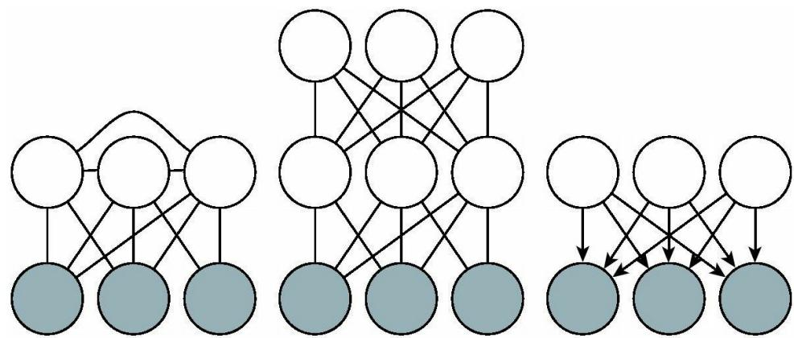
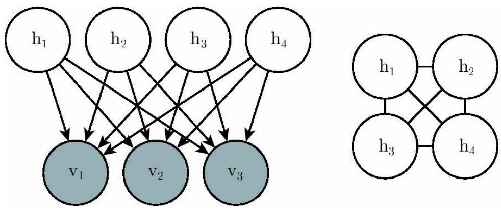

## 第3部分 深度学习研究

## 第19章 近似推断

许多概率模型很难训练的原因是很难进行推断。在深度学习中，通常我们有一系列可见变量 ν 和一系列潜变量 h 。推断困难通常是指难以计算p( h ｜ ν )或其期望。而这样的操作在一些诸如最大似然学习的任务中往往是必需的。

许多仅含一个隐藏层的简单图模型会定义成易于计算p( h｜ν)或其期望的形式，例如受限玻尔兹曼机和概率PCA。不幸的是，大多数具有多层隐藏变量的图模型的后验分布都很难处理。对于这些模型而言，精确推断算法需要指数量级的运行时间。即使一些只有单层的模型，如稀疏编码，也存在着这样的问题。

在本章中，我们将会介绍几个用来解决这些难以处理的推断问题的技巧。稍后，在第20章中，我们还将描述如何将这些技巧应用到训练其他方法难以奏效的概率模型中，如深度信念网络、深度玻尔兹曼机。

在深度学习中难以处理的推断问题通常源于结构化图模型中潜变量之间的相互作用。读者可以参考图19.1的几个例子。这些相互作用既可能是无向模型的直接相互作用，也可能是有向模型中同一个可见变量的共同祖先之间的“相消解释”作用。

  
图19.1 深度学习中难以处理的推断问题通常是由于结构化图模型中潜变量的相互作用。这些相互作用产生于一个潜变量与另一个潜变量或者当V-结构的子节点可观察时与更长的激活路径相连。（左）一个隐藏单元存在连接的 半受限波尔兹曼机 （semi-restrictedBoltzmann

Machine）（Osindero and Hinton，2008）。由于存在大量潜变量的团，潜变量的直接连接使得后验分布难以处理。（中）一个深度玻尔兹曼机，被分层从而使得不存在层内连接，由于层之间的连接其后验分布仍然难以处理。（右）当可见变量可观察时这个有向模型的潜变量之间存在相互作用，因为每两个潜变量都是共父。即使拥有上图中的某一种结构，一些概率模型依然能够获得易于处理的关于潜变量的后验分布。如果我们选择条件概率分布来引入相对于图结构描述的额外的独立性这种情况也是可能出现的。举个例子，概率PCA的图结构如右图所示，然而由于其条件分布的特殊性质（带有相互正交基向量的线性高斯条件分布）依然能够进行简单的推断

## 19.1 把推断视作优化问题

精确推断问题可以描述为一个优化问题，有许多方法正是由此解决了推断的困难。通过近似这样一个潜在的优化问题，我们往往可以推导出近似推断算法。

为了构造这样一个优化问题，假设有一个包含可见变量 ν 和潜变量 h 的概率模型。我们希望计算观察数据的对数概率 $\log { \mathfrak { p } } ( { \textbf { \em p } } ; { \textbf { \em \theta } } )$ 。有时候如果边缘化消去 h 的操作很费时，会难以计算 $\log { \mathfrak { p } } ( { \textbf { \em p } } ; { \textbf { \em \theta } } )$ 。作为替代，我们可以计算一个log p( ν ； θ )的下界 $\mathcal { L } ( v , \theta , q )$ 。这个下界被称为证据下界 （evidence lower bound，ELBO）。这个下界的另一个常用名称是负变分自由能 （variational free energy）。具体地，这个证据下界是这样定义的：

$$
\mathcal {L} (\boldsymbol {v}, \boldsymbol {\theta}, q) = \log p (\boldsymbol {v}; \boldsymbol {\theta}) - D _ {\mathrm{KL}} (q (\boldsymbol {h} \mid \boldsymbol {v}) \| p (\boldsymbol {h} \mid \boldsymbol {v}; \boldsymbol {\theta}))\tag{19.1}
$$

其中 $^ { \small { \sf I } } { \sf q }$ 是关于h的一个任意概率分布。

因为log p( ν )和 $\mathcal { L } ( v , \theta , q )$ 之间的距离是由KL散度来衡量的，且KL散度总是非负的，我们可以发现 $\mathcal { L }$ 总是小于等于所求的对数概率。当且仅当分布q完全相等于 $\mathbb { p } ( { \pmb h } \ \lvert \textbf { \nu \nu } )$ )时取到等号。

令人吃惊的是，对于某些分布q，计算 $\mathcal { L }$ 可以变得相当简单。通过简单的代数运算我们可以把 $\mathcal { L }$ 重写成一个更加简单的形式：

$$
\mathcal {L} (\boldsymbol {v}, \boldsymbol {\theta}, q) = \log p (\boldsymbol {v}; \boldsymbol {\theta}) - D _ {\mathrm{KL}} (q (\boldsymbol {h} \mid \boldsymbol {v}) \| p (\boldsymbol {h} \mid \boldsymbol {v}; \boldsymbol {\theta}))\tag{19.2}
$$

$$
= \log p (\boldsymbol {v}; \boldsymbol {\theta}) - \mathbb {E} _ {\mathbf {h} \sim q} \log \frac {q (\boldsymbol {h} \mid \boldsymbol {v})}{p (\boldsymbol {h} \mid \boldsymbol {v})}\tag{19.3}
$$

$$
= \log p (\boldsymbol {v}; \boldsymbol {\theta}) - \mathbb {E} _ {\mathbf {h} \sim q} \log \frac {q (\boldsymbol {h} \mid \boldsymbol {v})}{\frac {p (\boldsymbol {h} , \boldsymbol {v} ; \boldsymbol {\theta})}{p (\boldsymbol {v} ; \boldsymbol {\theta})}}\tag{19.4}
$$

$$
= \log p (\boldsymbol {v}; \boldsymbol {\theta}) - \mathbb {E} _ {\mathbf {h} \sim q} [ \log q (\boldsymbol {h} \mid \boldsymbol {v}) - \log p (\boldsymbol {h}, \boldsymbol {v}; \boldsymbol {\theta}) + \log p (\boldsymbol {v}; \boldsymbol {\theta}) ]\tag{19.5}
$$

$$
= - \mathbb {E} _ {\mathbf {h} \sim q} [ \log q (\boldsymbol {h} \mid \boldsymbol {v}) - \log p (\boldsymbol {h}, \boldsymbol {v}; \boldsymbol {\theta}) ]\tag{19.6}
$$

这也给出了证据下界的标准定义：

$$
\mathcal {L} (\boldsymbol {v}, \boldsymbol {\theta}, q) = \mathbb {E} _ {\mathbf {h} \sim q} [ \log p (\boldsymbol {h}, \boldsymbol {v}) ] + H (q)\tag{19.7}
$$

对于一个选择的合适分布q来说， $\mathcal { L }$ 是容易计算的。对任意分布q的选择来说， $\mathcal { L }$ 提供了似然函数的一个下界。越好地近似 $\mathfrak { p } ( \pmb { h } \ \mid \ \pmb { \nu } )$ 的分布$\ P ( \pmb { h } \ | \ \pmb { \nu } )$ ，得到的下界就越紧，换言之，就是与 $\log { \mathfrak { p } } ( \pmb { \nu } )$ 更加接近。当$\mathfrak { q } ( \textbf { \textit { \textbf { h } } } | \textbf { \textit { \textbf { \nu } } } ) { = } \mathfrak { p } ( \textbf { \textit { \textbf { h } } } | \textbf { \textit { \textbf { \nu } } } )$ )时，这个近似是完美的，也意味着$\mathcal { L } ( v , \pmb { \theta } , q ) = \log p ( \pmb { v } ; \pmb { \theta } )$

因此我们可以将推断问题看作找一个分布q使得 $\mathcal { L }$ 最大的过程。精确推断能够在包含分布 $\mathfrak { p } ( \textbf { \textit { h } } \mid \textbf { \textit { v } } )$ 的函数族中搜索一个函数，完美地最大化$\mathcal { L }$ 。在本章中，我们将会讲到如何通过近似优化寻找分布q的方法来推导出不同形式的近似推断。我们可以通过限定分布q的形式或者使用并不彻底的优化方法来使得优化的过程更加高效（却更粗略），但是优化的结果是不完美的，不求彻底地最大化 $\mathcal { L }$ ，而只要显著地提升 $\mathcal { L }$

无论我们选择什么样的分布q， $\mathcal { L }$ 始终是一个下界。我们可以通过选择一个更简单或更复杂的计算过程来得到对应的更松或更紧的下界。通过一个不彻底的优化过程或者将分布q做很强的限定（并且使用一个彻底的优化过程），我们可以获得一个很差的分布q，但是降低了计算开销。

## 19.2 期望最大化

我们介绍的第一个最大化下界 $\mathcal { L }$ 的算法是期望最大化 （expectationmaximization，EM）算法。在潜变量模型中，这是一个非常常见的训练算法。在这里我们描述Neal and Hinton（1999）所提出的EM算法。与大多数我们在本章中介绍的其他算法不同的是，EM并不是一个近似推断算法，而是一种能够学到近似后验的算法。

EM算法由交替迭代，直到收敛的两步运算组成。

E步 （expectation step）：令 $\theta ^ { \mathrm { ~ } ( \theta ) }$ 表示在这一步开始时的参数值。对任何我们想要训练的（对所有的或者小批量数据均成立）索引为i的训练样本 $\nu ^ { ( i ) }$ ，令 $\mathrm { q } ( \textbf { \textit { h } } ^ { ( i ) } \mid \textbf { \textit { v } } ) = \mathrm { p } ( \textbf { \textit { h } } ^ { ( i ) } \mid \textbf { \textit { v } } ^ { ( i ) } ; \textbf { \textit { \theta } } ^ { ( 0 ) } )$ 。通过这个定义，我们认为q在当前参数 $\pmb { \theta } ^ { ( \pmb { \theta } ) }$ 下定义。如果我们改变 θ ，那么$\mathfrak { p } ( \textbf { \textit { h } } | \textbf { \textit { p } } ; \textbf { \textit { \theta } } )$ 将会相应地变化，但是 ${ \sf q } ( \pmb { h } \ \backslash \ \pmb { \nu } )$ 还是不变并且等于p($\pmb { h } \ \mid \ \pmb { \nu } \ ; \quad \pmb { \theta } ^ { ( \pmb { \theta } ) } )$

M步 （maximization step）：使用选择的优化算法完全地或者部分地关于 $\pmb \theta$ 最大化

$$
\sum_ {i} \mathcal {L} (\boldsymbol {v} ^ {(i)}, \boldsymbol {\theta}, q)\tag{19.8}
$$

这可以被看作通过坐标上升算法来最大化 $\mathcal { L }$ 。在第一步中，我们更新分布q来最大化 $\mathcal { L }$ ，而在另一步中，我们更新 $\pmb \theta$ 来最大化 $\mathcal { L }$ C

基于潜变量模型的随机梯度上升可以被看作一个EM算法的特例，其中M步包括了单次梯度操作。EM算法的其他变种可以实现多次梯度操作。对一些模型族来说，M步甚至可以直接推出解析解，不同于其他方法，在给定当前q的情况下直接求出最优解。

尽管E步采用的是精确推断，我们仍然可以将EM算法视作是某种程度上的近似推断。具体地说，M步假设一个分布q可以被所有的 $\pmb \theta$ 值分享。当M步越来越远离E步中的 $\pmb { \theta } ^ { ( 0 ) }$ 时，这将会导致 $\mathcal { L }$ 和真实的log p( ν )之间出现差距。幸运的是，在进入下一个循环时，E步把这种差距又降到了0。

EM算法还包含一些不同的见解。首先，它包含了学习过程的一个基本框架，就是我们通过更新模型参数来提高整个数据集的似然，其中缺失变量的值是通过后验分布来估计的。这种特定的性质并非EM算法独有的。例如，使用梯度下降来最大化对数似然函数的方法也有相同的性质。计算对数似然函数的梯度需要对隐藏单元的后验分布求期望。EM算法另一个关键的性质是当我们移动到另一个 $\pmb \theta$ 时，我们仍然可以使用旧的分布 $\mathsf { \Pi } _ { \mathsf { q } \circ \mathsf { \Lambda } }$ 。在传统机器学习中，这种特有的性质在推导大M步更新时候得到了广泛的应用。在深度学习中，大多数模型太过于复杂以至于在最优大M步更新中很难得到一个简单的解。所以EM算法的第二个特质，更多为其所独有，较少被使用。

## 19.3 最大后验推断和稀疏编码

我们通常使用推断 （inference）这个术语来指代给定一些其他变量的情况下计算某些变量概率分布的过程。当训练带有潜变量的概率模型时，我们通常关注于计算 $\mathbf { p } ( \pmb { h } \ \Vdash \pmb { \nu } )$ 。另一种可选的推断形式是计算一个缺失变量的最可能值来代替在所有可能值的完整分布上的推断。在潜变量模型中，这意味着计算

$$
\boldsymbol {h} ^ {*} = \underset {\boldsymbol {h}} {\arg \max} p (\boldsymbol {h} \mid \boldsymbol {v})\tag{19.9}
$$

这被称作最大后验 （Maximum A Posteriori）推断，简称MAP推断。

MAP推断并不被视作一种近似推断，它只是精确地计算了最有可能的一个 $\pmb { h } ^ { * }$ 。然而，如果我们希望设计一个最大化 $\mathcal { L } \left( \nu , \pmb { h } , \mathbb { q } \right)$ 的学习过程，那么把MAP推断视作是输出一个 $\mathbf { \bar { q } }$ 值的学习过程是很有帮助的。在这种情况下，我们可以将MAP推断视作是近似推断，因为它并不能提供一个

最优的 $\mathsf { q }$ 。

我们回过头来看看第19.1节中所描述的精确推断，它指的是关于一个在无限制的概率分布族中的分布 $\mathsf { \Pi } _ { \mathsf { q } ^ { \prime } }$ 使用精确的优化算法来最大化

$$
\mathcal {L} (\boldsymbol {v}, \boldsymbol {\theta}, q) = \mathbb {E} _ {\mathbf {h} \sim q} [ \log p (\boldsymbol {h}, \boldsymbol {v}) ] + H (q)\tag{19.10}
$$

我们通过限定分布 $\mathsf { \Pi } _ { \mathsf { q } , \mathsf { m } }$ 属于某个分布族，能够使得MAP推断成为一种形式的近似推断。具体地说，我们令分布 $\mathrm { \dot { \mathbf { q } } }$ 满足一个Dirac分布：

$$
q (\boldsymbol {h} \mid \boldsymbol {v}) = \delta (\boldsymbol {h} - \boldsymbol {\mu})\tag{19.11}
$$

这也意味着现在我们可以通过 $\pmb { \mu }$ 来完全控制分布 $\mathsf { \check { q } }$ 。将 $\mathcal { L }$ 中不随 $\pmb { \mu }$ 变化的项丢弃，我们只需解决一个优化问题：

$$
\boldsymbol {\mu} ^ {*} = \underset {\boldsymbol {\mu}} {\arg \max} \log p (\boldsymbol {h} = \boldsymbol {\mu}, \boldsymbol {v})\tag{19.12}
$$

这等价于MAP推断问题

$$
\iota^ {*} = \underset {h} {\arg \max} p (\boldsymbol {h} \mid \boldsymbol {v})\tag{19.13}
$$

因此我们能够证明一种类似于EM算法的学习算法，其中我们轮流迭代两步，一步是用MAP推断估计出 $\pmb { h } ^ { * }$ ，另一步是更新 $\pmb \theta$ 来增大log p( $\pmb { h } ^ { \ * }$ ， ν )。从EM算法角度来看，这也是对 $\mathcal { L }$ 的一种形式的坐标上升，交替迭代时通过推断来优化关于 $\mathsf { \Pi } _ { \mathsf { q } }$ 的 $\mathcal { L }$ 以及通过参数更新来优化关于 $\pmb \theta$ 的$\mathcal { L }$ 。作为一个整体，这个算法的正确性可以得到保证，因为 $\mathcal { L }$ 是logp( ν )的下界。在MAP推断中，这个保证是无效的，因为Dirac分布的微分熵趋近于负无穷，使得这个界会无限地松。然而，人为加入一些 $\pmb { \mu }$ 的噪声会使得这个界又有了意义。

MAP推断作为特征提取器以及一种学习机制被广泛地应用在了深度学习中。它主要用于稀疏编码模型中。

我们回过头来看第13.4节中的稀疏编码。稀疏编码是一种在隐藏单元上加上了诱导稀疏性的先验知识的线性因子的模型。一个常用的选择是可分解的Laplace先验，表示为

$$
p (h _ {i}) = \frac {\lambda}{2} \exp (- \lambda | h _ {i} |)\tag{19.14}
$$

可见的节点是由一个线性变化加上噪声生成的：

$$
p (\boldsymbol {v} \mid \boldsymbol {h}) = \mathcal {N} (\boldsymbol {v}; \boldsymbol {W h} + \boldsymbol {b}, \beta^ {- 1} \boldsymbol {I})\tag{19.15}
$$

分布p( h ｜ ν )难以计算，甚至难以表达。每一对h ， $\mathrm { i }$ $\mathbf { h } _ { \mathrm { ~ j ~ } }$ 变量都是 ν 的母节点。这也意味着当ν 可被观察时，图模型包含了一条连接 $\mathrm { h _ { i } }$ 和h 的 $\mathrm { ~ j ~ }$ 活跃路径。因此p( h ｜ ν )中所有的隐藏单元都包含在了一个巨大的团中。如果是高斯模型，那么这些相互作用关系可以通过协方差矩阵来高效地建模。然而稀疏型先验使得这些相互作用关系并不服从高斯分布。

分布p( $\textbf { \textit { x } } \mid \textbf { \textit { h } }$ )的难处理性导致了对数似然及其梯度也很难得到。因此我们不能使用精确的最大似然估计来进行学习。取而代之的是，我们通过MAP推断以及最大化由以 h 为中心的Dirac分布所定义而成的ELBO来学习模型参数。

如果我们将训练集中所有的向量 h 拼成矩阵 H ，并将所有的向量 ν 拼起来组成矩阵V，那么稀疏编码问题意味着最小化

$$
J (\boldsymbol {H}, \boldsymbol {W}) = \sum_ {i, j} | H _ {i, j} | + \sum_ {i, j} \left(\boldsymbol {V} - \boldsymbol {H} \boldsymbol {W} ^ {\top}\right) _ {i, j} ^ {2}\tag{19.16}
$$

为了避免如极端小的 H 和极端大的 W 这样的病态的解，大多数稀疏编码的应用包含了权重衰减或者对H列范数的限制。

我们可以通过交替迭代，分别关于 H 和 W 最小化J的方式来最小化J。且两个子问题都是凸的。事实上，关于 W 的最小化问题就是一个线性回归问题。然而关于这两个变量同时最小化J的问题通常并不是凸的。

关于 H 的最小化问题需要某些特别设计的算法，例如特征符号搜索方法（Lee et al. ，2007）。

## 19.4 变分推断和变分学习

我们已经说明过了为什么证据下界 $\mathcal { L } ( \boldsymbol { \nu } , \boldsymbol { \theta } , \boldsymbol { \mathrm { q } } )$ 是 $\log { \mathfrak { p } } ( { \textbf { \em p } } ; { \textbf { \em \theta } } )$ 的一个下界，如何将推断看作关于分布q最大化 $\mathcal { L }$ 的过程，以及如何将学习看作关于参数 $\pmb \theta$ 最大化 $\mathcal { L }$ 的过程。我们也讲到了EM算法在给定了分布q的条件下能够进行大学习步骤，而基于MAP推断的学习算法则是学习一个p( h｜ν)的点估计而非推断整个完整的分布。在这里我们介绍一些变分学习中更加通用的算法。

变分学习的核心思想就是在一个关于 $\mathsf { \Delta q }$ 的有约束的分布族上最大化 $\mathcal { L }$ 选择这个分布族时应该考虑到计算 ${ } _ { \ d { q } } \log p ( \boldsymbol { h } , \boldsymbol { v } )$ 的难易度。一个典型的方法就是添加分布q如何分解的假设。

一种常用的变分学习的方法是加入一些限制使得 $\mathbf { q }$ 是一个因子分布：

$$
q (\boldsymbol {h} \mid \boldsymbol {v}) = \prod_ {i} q (h _ {i} \mid \boldsymbol {v})\tag{19.17}
$$

这被称为均值场 （mean-field）方法。更一般地说，我们可以通过选择分布q的形式来选择任何图模型的结构，通过选择变量之间相互作用的多少来灵活地决定近似程度的大小。这种完全通用的图模型方法被称为结构化变分推断 （structured variational inference）（Saul and Jordan，1996）。

变分方法的优点是，我们不需要为分布q设定一个特定的参数化形式。我们设定它如何分解，之后通过解决优化问题来找出在这些分解限制下最优的概率分布。对离散型潜变量来说，这意味着我们使用传统的优化技巧来优化描述分布q的有限个变量。对连续型潜变量来说，这意味着我们使用一个被称为变分法的数学分支工具来解决函数空间上的优化问题。然后决定哪一个函数来表示分布 $\mathsf { \check { q } }$ 。变分法是“变分学习”或者“变分推断”这些名字的来因，尽管当潜变量是离散时变分法并没有用武之地。当遇到连续型潜变量时，变分法不需要过多地人工选择模型，是一种很有用的工具。我们只需要设定分布q如何分解，而不需要去猜测一个特定的能够精确近似原后验分布的分布 $\mathsf { \Pi } _ { \mathsf { q } } .$ 。

因为 $\mathcal { L } \left( \nu , \pmb { \theta } , \mathbf { q } \right)$ 被定义成log $\mathrm { p } ( \textbf { \textit { \textbf { \nu } } } ; \pmb { \theta } ) - \mathrm { D } _ { \mathrm { \ K L } } \left( \mathrm { q } ( \textbf { \textit { \textbf { h } } } | \textbf { \textit { \textbf { \nu } } } ) \| \mathrm { p } ( \textbf { \textit { h } } | \textbf { \textit { \textbf { \nu } } } ; \pmb { \theta } ) \right)$ 我们可以认为关于 $\mathbf { \bar { q } }$ 最大化 $\mathcal { L }$ 的问题等价于（关于q）最小化D $\mathrm { K L }$ (q( h$| \mathrm { ~ \pmb ~ { ~ \nu ~ } ~ } ) | \mathrm { p } ( \pmb { \ h } \mathrm { ~ \pmb ~ { ~ \nu ~ } ~ } ) )$ 。在这种情况下，我们要用 $\mathsf { \Pi } _ { \mathsf { q } } ^ { \mathsf { i } }$ 来拟合 $\mathrm { \Delta p }$ 。然而，与以前的方法不同，我们使用KL散度的相反方向来拟合一个近似。当我们使用最大似然估计来用模型拟合数据时，我们最小化 $\mathrm { { D } _ { \mathrm { { K L } } } ( p _ { \ d a t a } \| p _ { \ m o d e l } ) }$ 。如图3.6所示，这意味着最大似然鼓励模型在每一个数据达到高概率的地方达到高概率，而基于优化的推断则鼓励了q在每一个真实后验分布概率低的地方概率较小。这两种基于KL散度的方法都有各自的优点与缺点。选择哪一种方法取决于在具体每一个应用中哪一种性质更受偏好。在基于优化的推断问题中，从计算角度考虑，我们选择使用 $\mathrm { ~ D ~ } _ { \mathrm { K L } }$ (q( h$| \textrm { \pmb { \nu } } ) \mathrm { p } ( \pmb { h } \ | \ \pmb { \nu } ) )$ 。具体地说，计算 $\mathrm { D } _ { \mathrm { \tiny ~ K L } } ( { \mathrm { q } } ( \pmb { h } \ | \ \textbf { \nu } ) { \mathrm { p } } ( \pmb { h } \ | \ \textbf { \nu } ) )$ 涉及计算分布q下的期望。所以通过将分布q设计得较为简单，我们可以简化求所需要的期望的计算过程。KL散度的相反方向需要计算真实后验分布下的期望。因为真实后验分布的形式是由模型的选择决定的，所以我们不能设计出一种能够精确计算 $\mathrm { ~ \bf ~ D ~ } _ { \mathrm { K L } } ( \mathrm { p } ( \pmb { h } \ | \ \textbf { \nu } ) \mathrm { q } ( \pmb { h } \ | \textbf { \nu } \mathbf { \nu } ) )$ 的开销较小的方法。

## 19.4.1 离散型潜变量

关于离散型潜变量的变分推断相对来说比较直接。我们定义一个分布q，通常分布q的每个因子都由一些离散状态的可查询表格定义。在最简单的情况中， h 是二值的并且我们做了均值场假定，分布q可以根据每一个 $\cdot \mathrm { h _ { \mathrm { ~ i ~ } } }$ 分解。在这种情况下，我们可以用一个向量 $\hat { h }$ 来参数化分布 $\mathsf { \check { q } }$ ，$\hat { h }$ 的每一个元素都代表一个概率，即 $q ( h _ { i } = 1 \mid \pmb { v } ) = \hat { h } _ { i }$

在确定了如何表示分布 $\mathsf { q }$ 以后，我们只需要优化它的参数。在离散型潜变量模型中，这是一个标准的优化问题。基本上分布 $\mathsf { \check { q } }$ 的选择可以通过任何优化算法解决，比如梯度下降算法。

因为它在许多学习算法的内循环中出现，所以这个优化问题必须可以很快求解。为了追求速度，我们通常使用特殊设计的优化算法。这些算法通常能够在极少的循环内解决一些小而简单的问题。一个常见的选择是使用不动点方程，换句话说，就是解关于 $\hat { h } _ { i }$ 的方程

$$
\frac {\partial}{\partial \hat {h} _ {i}} \mathcal {L} = 0\tag{19.18}
$$

我们反复地更新 $\hat { h }$ 不同的元素直到满足收敛准则。

为了具体化这些描述，我们接下来会讲如何将变分推断应用到二值稀疏编码 （binary sparse coding）模型（这里我们所描述的模型是Henniges$e t a l .$ （2010）提出的，但是我们采用了传统、通用的均值场方法，而原文作者采用了一种特殊设计的算法）中。数学推导过程非常详细，为希望完全了解我们描述过的变分推断和变分学习高级概念描述的读者所准备。而对于并不计划推导或者实现变分学习算法的读者来说，可以放心跳过，直接阅读下一节，这并不会遗漏新的高级概念。建议那些从事二值稀疏编码研究的读者可以重新看一下第3.10节中描述的一些经常在概率模型中出现的有用的函数性质。我们在推导过程中随意地使用了这些性质，并没有特别强调它们。

在二值稀疏编码模型中，输入 $v \in \mathbb { R } ^ { n }$ ，是由模型通过添加高斯噪声到m个或有或无的不同成分的和而生成的。每一个成分可以是开或者关的，对应着隐藏单元 $\pmb { h } \in \{ 0 , \ 1 \} ^ { \mathrm { ~ m ~ } }$

$$
p (h _ {i} = 1) = \sigma (b _ {i})\tag{19.19}
$$

$$
p (\boldsymbol {v} \mid \boldsymbol {h}) = \mathcal {N} (\boldsymbol {v}; \boldsymbol {W h}, \boldsymbol {\beta} ^ {- 1})\tag{19.20}
$$

其中 b 是一个可以学习的偏置集合， W 是一个可以学习的权值矩阵，β是一个可以学习的对角精度矩阵。

使用最大似然来训练这样一个模型需要对参数进行求导。我们考虑对其中一个偏置进行求导的过程：

$$
\frac {\partial}{\partial b _ {i}} \log p (\boldsymbol {v})\tag{19.21}
$$

$$
= \frac {\frac {\partial}{\partial b _ {i}} p (\boldsymbol {v})}{p (\boldsymbol {v})}\tag{19.22}
$$

$$
= \frac {\frac {\partial}{\partial b _ {i}} \sum_ {h} p (\boldsymbol {h} , \boldsymbol {v})}{p (\boldsymbol {v})}\tag{19.23}
$$

$$
= \frac {\frac {\partial}{\partial b _ {i}} \sum_ {\boldsymbol {h}} p (\boldsymbol {h}) p (\boldsymbol {v} \mid \boldsymbol {h})}{p (\boldsymbol {v})}\tag{19.24}
$$

$$
= \frac {\sum_ {h} p (\boldsymbol {v} \mid \boldsymbol {h}) \frac {\partial}{\partial b _ {i}} p (\boldsymbol {h})}{p (\boldsymbol {v})}\tag{19.25}
$$

$$
= \sum_ {h} p (\boldsymbol {h} \mid \boldsymbol {v}) \frac {\frac {\partial}{\partial b _ {i}} p (\boldsymbol {h})}{p (\boldsymbol {h})}\tag{19.26}
$$

$$
= \mathbb {E} _ {\mathbf {h} \sim p (h | v)} \frac {\partial}{\partial b _ {i}} \log p (\pmb {h})\tag{19.27}
$$

这需要计算p( h ｜ ν )下的期望。不幸的是，p( h ｜ ν )是一个很复杂的分布。关于p( h，ν)和p(h｜ ν )的图结构可以参考图19.2。隐藏单元的后验分布对应的是关于隐藏单元的完全图，所以相对于暴力算法，变量消去算法并不能有助于提高计算期望的效率。

  
图19.2 包含4个隐藏单元的二值稀疏编码的图结构。（左）p( h , ν )的图结构。要注意边是有向的，每两个隐藏单元都是每个可见单元的共父。（右）p( h, ν)的图结构。为了解释共父之间的活跃路径，后验分布所有隐藏单元之间都有边

取而代之的是，我们可以应用变分推断和变分学习来解决这个难点。

我们可以做一个均值场近似：

$$
q (\boldsymbol {h} \mid \boldsymbol {v}) = \prod_ {i} q (h _ {i} \mid \boldsymbol {v})\tag{19.28}
$$

二值稀疏编码中的潜变量是二值的，所以为了表示可分解的 $\mathsf { \check { q } }$ 我们假设对m个Bernoulli分布 ${ \mathfrak { q } } ( { \mathfrak { h } } _ { \mathrm { ~ i ~ } } \mid \nu _ { \mathrm { ~  ~ } } )$ 建模。表示Bernoulli分布的一种很自然的方法是使用一个概率向量 $\hat { h }$ ，满足 $q ( h _ { i } \mid \pmb { v } ) = \hat { h } _ { i }$ 。为了避免计算中的误差，比如说计算 $\log { \hat { h } } _ { i }$ 时，我们对 $\hat { h } _ { i }$ 添加一个约束，即 $\hat { h } _ { i }$ 不等于0

或者1。

我们将会看到变分推断方程理论上永远不会赋予 $\hat { h } _ { i }$ 为0或者1。然而在软件实现过程中，机器的舍入误差会导致0或者1的值。在二值稀疏编码的软件实现中，我们希望使用一个没有限制的变分参数向量z以及通过关系 $\hat { h } ^ { \mathbf { \nu } }$ 来获得 h 。因此通过使用等式 $\log _ { \sigma } ( z _ { \mathrm { ~ i ~ } } ) { = } { - } \zeta ( - z _ { \mathrm { ~ i ~ } } )$ 来建立sigmoid函数和softplus函数的关系，我们可以放心地在计算机上计算log $\hat { h } _ { i }$

在开始二值稀疏编码模型中变分学习的推导时，我们首先说明了均值场近似的使用可以使得学习过程更加简单。

证据下界可以表示为

$$
\mathcal {L} (\boldsymbol {v}, \boldsymbol {\theta}, q)\tag{19.29}
$$

$$
= \mathbb {E} _ {\mathbf {h} \sim q} [ \log p (\boldsymbol {h}, \boldsymbol {v}) ] + H (q)\tag{19.30}
$$

$$
= \mathbb {E} _ {\mathbf {h} \sim q} [ \log p (\boldsymbol {h}) + \log p (\boldsymbol {v} \mid \boldsymbol {h}) - \log q (\boldsymbol {h} \mid \boldsymbol {v}) ]\tag{19.31}
$$

$$
= \mathbb {E} _ {\mathbf {h} \sim q} \Big [ \sum_ {i = 1} ^ {m} \log p (h _ {i}) + \sum_ {i = 1} ^ {n} \log p (v _ {i} \mid \boldsymbol {h}) - \sum_ {i = 1} ^ {m} \log q (h _ {i} \mid \boldsymbol {v}) \Big ]\tag{19.32}
$$

$$
= \sum_ {i = 1} ^ {m} \left[ \hat {h} _ {i} (\log \sigma (b _ {i}) - \log \hat {h} _ {i}) + (1 - \hat {h} _ {i}) (\log \sigma (- b _ {i}) - \log (1 - \hat {h} _ {i})) \right]\tag{19.33}
$$

$$
+ \mathbb {E} _ {\mathbf {h} \sim q} \left[ \sum_ {i = 1} ^ {n} \log \sqrt {\frac {\beta_ {i}}{2 \pi}} \exp \left(- \frac {\beta_ {i}}{2} \left(v _ {i} - \boldsymbol {W} _ {i,:} \boldsymbol {h}\right) ^ {2}\right) \right]\tag{19.34}
$$

$$
= \sum_ {i = 1} ^ {m} \left[ \hat {h} _ {i} (\log \sigma (b _ {i}) - \log \hat {h} _ {i}) + (1 - \hat {h} _ {i}) (\log \sigma (- b _ {i}) - \log (1 - \hat {h} _ {i})) \right]\tag{19.35}
$$

$$
+ \frac {1}{2} \sum_ {i = 1} ^ {n} \left[ \log \frac {\beta_ {i}}{2 \pi} - \beta_ {i} \left(v _ {i} ^ {2} - 2 v _ {i} \boldsymbol {W} _ {i,:} \hat {\boldsymbol {h}} + \sum_ {j} \left[ W _ {i, j} ^ {2} \hat {h} _ {j} + \sum_ {k \neq j} W _ {i, j} W _ {i, k} \hat {h} _ {j} \hat {h} _ {k} \right]\right) \right]\tag{19.36}
$$

尽管这些方程从美学观点来看有些不尽如人意。它们展示了 $\mathcal { L }$ 可以被表示为少量简单的代数运算。因此，证据下界 $\mathcal { L }$ 是易于处理的。我们可以把 $\mathcal { L }$ 看作难以处理的对数似然函数的一个替代。

原则上说，我们可以使用关于 ν 和 h 的梯度上升。这会成为一个推断和学习算法的完美组合。但是，由于两个原因，我们往往不这么做。第一点，对每一个 ν 我们需要存储 $\hat { h }$ 。我们通常更加偏向于那些不需要为每一个样本都准备内存的算法。如果我们需要为每一个样本都存储一个动态更新的向量，使得算法很难处理几十亿的样本。第二个原因就是为了能够识别 ν 的内容，我们希望能够有能力快速提取特征 $\hat { h }$ 。在实际应用场景中，我们需要在有限时间内计算出 $\hat { h }$ 。

由于以上两个原因，我们通常不会采用梯度下降来计算均值场参数 $\hat { h }$ 。取而代之的是，我们使用不动点方程来快速估计。

不动点方程的核心思想是，我们寻找一个关于 h 的局部极大点，满足$\nabla _ { h } \mathcal { L } ( v , \theta , h ) = 0$ 。我们无法同时高效地计算所有 $\hat { h }$ 的元素。然而，我们可以解决单个变量的问题：

$$
\frac {\partial}{\partial \hat {h} _ {i}} \mathcal {L} (\boldsymbol {v}, \boldsymbol {\theta}, \hat {\boldsymbol {h}}) = 0\tag{19.37}
$$

我们可以迭代地将这个解应用到i＝1，…，m，然后重复这个循环直到我们满足了收敛准则。常见的收敛准则包含了当整个循环所改进的L不超过预设的容差量时停止，或者是循环中改变的 $\hat { h }$ 不超过某个值时停止。

在很多不同的模型中，迭代的均值场不动点方程是一种能够提供快速变分推断的通用算法。为了使它更加具体，我们详细地讲一下如何推导出二值稀疏编码模型的更新过程。

首先，我们给出了对 $\hat { h } _ { i }$ 的导数表达式。为了得到这个表达式，我们将式（19.36）代入到式（19.37）的左边：

$$
\frac {\partial}{\partial \hat {h} _ {i}} \mathcal {L} (\boldsymbol {v}, \boldsymbol {\theta}, \hat {\boldsymbol {h}})\tag{19.38}
$$

$$
= \frac {\partial}{\partial \hat {h} _ {i}} \left[ \sum_ {j = 1} ^ {m} \left[ \hat {h} _ {j} (\log \sigma (b _ {j}) - \log \hat {h} _ {j}) + (1 - \hat {h} _ {j}) (\log \sigma (- b _ {j}) - \log (1 - \hat {h} _ {j})) \right] \right.\tag{19.39}
$$

$$
+ \frac {1}{2} \sum_ {j = 1} ^ {n} \left[ \log \frac {\beta_ {j}}{2 \pi} - \beta_ {j} \left(v _ {j} ^ {2} - 2 v _ {j} \boldsymbol {W} _ {j,:} \hat {\boldsymbol {h}} + \sum_ {k} \left[ W _ {j, k} ^ {2} \hat {h} _ {k} + \sum_ {l \neq k} W _ {j, k} W _ {j, l} \hat {h} _ {k} \hat {h} _ {l} \right]\right) \right] \Bigg ]\tag{19.40}
$$

$$
= \log \sigma (b _ {i}) - \log \hat {h} _ {i} - 1 + \log (1 - \hat {h} _ {i}) + 1 - \log \sigma (- b _ {i})\tag{19.41}
$$

$$
+ \sum_ {j = 1} ^ {n} \left[ \beta_ {j} \left(v _ {j} W _ {j, i} - \frac {1}{2} W _ {j, i} ^ {2} - \sum_ {k \neq i} \boldsymbol {W} _ {j, k} \boldsymbol {W} _ {j, i} \hat {h} _ {k}\right) \right]\tag{19.42}
$$

$$
= b _ {i} - \log \hat {h} _ {i} + \log (1 - \hat {h} _ {i}) + \boldsymbol {v} ^ {\top} \boldsymbol {\beta} \boldsymbol {W} _ {:, i} - \frac {1}{2} \boldsymbol {W} _ {:, i} ^ {\top} \boldsymbol {\beta} \boldsymbol {W} _ {:, i} - \sum_ {j \neq i} \boldsymbol {W} _ {:, j} ^ {\top} \boldsymbol {\beta} \boldsymbol {W} _ {:, i} \hat {h} _ {j}\tag{19.43}
$$

为了应用固定点更新的推断规则，我们通过令式（19.43）等于0来解 $\hat { h } _ { i }$

$$
\hat {h} _ {i} = \sigma \left(b _ {i} + \boldsymbol {v} ^ {\top} \boldsymbol {\beta} \boldsymbol {W} _ {:, i} - \frac {1}{2} \boldsymbol {W} _ {:, i} ^ {\top} \boldsymbol {\beta} \boldsymbol {W} _ {:, i} - \sum_ {j \neq i} \boldsymbol {W} _ {:, j} ^ {\top} \boldsymbol {\beta} \boldsymbol {W} _ {:, i} \hat {h} _ {j}\right)\tag{19.44}
$$

此时，我们可以发现图模型中的推断和循环神经网络之间存在着紧密的联系。具体地说，均值场不动点方程定义了一个循环神经网络。这个神经网络的任务就是完成推断。我们已经从模型描述的角度介绍了如何推导这个网络，但是直接训练这个推断网络也是可行的。有关这种思路的一些想法在第20章中有所描述。

在二值稀疏编码模型中，我们可以发现式（19.44）中描述的循环网络连接包含了根据相邻隐藏单元变化值来反复更新当前隐藏单元的操作。输入层通常给隐藏单元发送一个固定的信息 $v ^ { \top } \beta W$ ，然而隐藏单元不断地更新互相传送的信息。具体地说，当 $\hat { h } _ { i }$ 和 $\hat { h } _ { j }$ 两个单元的权重向量平行时，它们会互相抑制。这也是一种形式的竞争——两个解释输入的隐藏单元之间，只有一个解释得更好的才被允许继续保持活跃。在二值稀疏编码的后验分布中，均值场近似试图捕获到更多的相消解释相互作用，从而产生了这种竞争。事实上，相消解释效应会产生一个多峰值的后验分布，以至于如果我们从后验分布中采样，一些样本在一个单元是活跃的，其他的样本在另一个单元活跃，只有很少的样本能够两者都处于活跃状态。不幸的是，相消解释作用无法通过均值场中因子分布q来建模，因此建模时均值场近似只能选择一个峰值。这个现象的一个例子可以参考图3.6。

我们将式（19.44）重写成等价的形式来揭示一些深层的含义：

$$
\hat {h} _ {i} = \sigma \left(b _ {i} + \left(\boldsymbol {v} - \sum_ {j \neq i} \boldsymbol {W} _ {:, j} \hat {h} _ {j}\right) ^ {\top} \boldsymbol {\beta} \boldsymbol {W} _ {:, i} - \frac {1}{2} \boldsymbol {W} _ {:, i} ^ {\top} \boldsymbol {\beta} \boldsymbol {W} _ {:, i}\right)\tag{19.45}
$$

在这种新的形式中，我们可以将 $\begin{array} { r } { \pmb { v } - \sum _ { j \neq i } \pmb { W } _ { : , j } \hat { h } _ { j } } \end{array}$ 看作输入，而不是 ν。因此，我们可以把第i个单元视作给定其他单元编码时给 ν 中的剩余误差编码。由此我们可以将稀疏编码视作一个迭代的自编码器，将输入反复地编码解码，试图在每一轮迭代后都能修复重构中的误差。

在这个例子中，我们已经推导出了每一次更新单个结点的更新规则。如果能够同时更新更多的结点，那会更令人满意。某些图模型，比如深度玻尔兹曼机，我们可以同时解出 $\hat { h }$ 中的许多元素。不幸的是，二值稀疏编码并不适用这种块更新。取而代之的是，我们使用一种被称为衰减（damping）的启发式技巧来实现块更新。在衰减方法中，对 $\hat { h }$ 中的每一个元素我们都可以解出最优值，然后对于所有的值都在这个方向上移动一小步。这个方法不能保证每一步都能增加 $\mathcal { L }$ ，但是对于许多模型都很有效。关于在信息传输算法中如何选择同步程度以及使用衰减策略可以参考Koller and Friedman（2009）。

## 19.4.2 变分法

在继续介绍变分学习之前，我们有必要简单地介绍一种变分学习中重要的数学工具：变分法 （calculus of variations）。

许多机器学习的技巧是基于寻找一个输入向量 $\pmb { \theta } \in \mathbb { R } ^ { n }$ 来最小化函数J( θ )，使得它取到最小值。这个步骤可以利用多元微积分以及线性代数的知识找到满足 $\nabla _ { \theta } J ( \theta ) = 0$ 的临界点来完成。在某些情况下，我们希望能够解一个函数f( x )，比如当我们希望找到一些随机变量的概率密度函数时。正是变分法能够让我们完成这个目标。

函数f的函数被称为泛函 （functional）J[f]。正如许多情况下对一个函数求关于以向量的元素为变量的偏导数一样，我们可以使用泛函导数（functional derivative），即在任意特定的 x 值，对一个泛函J[f]求关于函数f( x )的导数，这也被称为变分导数 （variational derivative）。泛函J的关于函数f在点x处的泛函导数被记作 ${ \frac { \delta } { \delta f ( x ) } } J$

完整正式的泛函导数的推导不在本书的范围之内。对于我们的目标而言，了解可微分函数f( x )以及带有连续导数的可微分函数 $\cdot \bf { g } ( \bf { y } , \pmb { x } )$ 就足够了：

$$
\frac {\delta}{\delta f (\pmb {x})} \int g (f (\pmb {x}), \pmb {x}) d \pmb {x} = \frac {\partial}{\partial y} g (f (\pmb {x}), \pmb {x})\tag{19.46}
$$

为了使上述等式更加直观，我们可以把f( x )看作一个有着无穷不可数多元素的向量，由一个实数向量 x 表示。在这里（看作一个不完全的介绍），这种关系式中描述的泛函导数和向量 $\pmb { \theta } \in \mathbb { R } ^ { n }$ 的导数相同：

$$
\frac {\partial}{\partial \theta_ {i}} \sum_ {j} g (\theta_ {j}, j) = \frac {\partial}{\partial \theta_ {i}} g (\theta_ {i}, i)\tag{19.47}
$$

在其他机器学习文献中的许多结果则使用了更为通用的欧拉—拉格朗日方程 （Euler-Lagrange Equation），它能够使得g不仅依赖于f的导数，而且也依赖于f的值。但是在本书中我们不需要这个通用版本。

为了关于一个向量优化某个函数，我们求出了这个函数关于这个向量的梯度，然后找这个梯度中每一个元素都为0的点。类似地，我们可以通过寻找一个函数使得泛函导数的每个点都等于0，从而来优化一个泛函。

下面介绍一个该过程如何运行的例子，我们考虑寻找一个定义在$x \in \mathbb { R }$ 上的有最大微分熵的概率密度函数。我们回过头来看一下一个概率分布 $\mathrm { P } ( \mathrm { x } )$ 的熵，定义如下：

$$
H [ p ] = - \mathbb {E} _ {x} \log p (x)\tag{19.48}
$$

对于连续的值，这个期望可以被看作一个积分：

$$
H [ p ] = - \int p (x) \log p (x) d x\tag{19.49}
$$

我们不能简单地仅仅关于函数P(x)最大化H[p]，因为那样的话结果可能不是一个概率分布。为了解决这个问题，我们需要使用一个拉格朗日乘子来添加一个分布 $\mathrm { P } ( \mathrm { x } )$ 积分值为1的约束。同样地，当方差增大时，熵也会无限制地增加。因此，寻找哪一个分布有最大熵这个问题是没有意义的。但是，在给定固定的方差 $\sigma ^ { \mathrm { ~ 2 ~ } }$ 时，我们可以寻找一个最大熵的分布。最后，这个问题还是欠定的，因为在不改变熵的条件下一个分布可以被随意地改变。为了获得一个唯一的解，我们再加一个约束：分布的均值必须为 ${ \mathfrak { M } }$ 。那么这个问题的拉格朗日泛函如下：

$$
\begin{array}{l} \mathcal {L} [ p ] = \lambda_ {1} \Big (\int p (x) d x - 1 \Big) + \lambda_ {2} (\mathbb {E} [ x ] - \mu) + \lambda_ {3} (\mathbb {E} [ (x - \mu) ^ {2} ] - \sigma^ {2}) + H [ p ] \\ = \int \Big (\lambda_ {1} p (x) + \lambda_ {2} p (x) x + \lambda_ {3} p (x) (x - \mu) ^ {2} - p (x) \log p (x) \Big) d x - \lambda_ {1} - \mu \lambda_ {2} - \sigma^ {2} \lambda_ {3} \end{array}\tag{19.50}
$$

(19.51)

为了关于 $\mathbf { p }$ 最小化拉格朗日乘子，我们令泛函导数等于0：

$$
\forall x, \frac {\delta}{\delta p (x)} \mathcal {L} = \lambda_ {1} + \lambda_ {2} x + \lambda_ {3} (x - \mu) ^ {2} - 1 - \log p (x) = 0\tag{19.52}
$$

这个条件告诉我们 $\left| \mathrm { P } ( \mathbf { x } ) \right|$ 的泛函形式。通过代数运算重组上述方程，我们可以得到

$$
p (x) = \exp \left(\lambda_ {1} + \lambda_ {2} x + \lambda_ {3} (x - \mu) ^ {2} - 1\right)\tag{19.53}
$$

我们并没有直接假设 $\mathrm { P } ( \mathbf { x } )$ 取这种形式，而是通过最小化泛函从理论上得到了这个 $\mathrm { \ P } ( \mathrm { x } )$ 的表达式。为了解决这个最小化问题，我们需要选择λ的值来确保所有的约束都能够满足。我们有很大的自由去选择λ。因为只要满足约束，拉格朗日关于λ这个变量的梯度就为0。为了满足所有的约束，我们可以令

$$
\begin{array}{l} {\lambda_ {1} = 1 - \log \sigma \sqrt {2 \pi}, \lambda_ {2} = 0, \lambda_ {3} = - \frac {1}{2 \sigma^ {2}}} \\ {\text {，从而得到}} \end{array}
$$

$$
p (x) = \mathcal {N} (x; \mu , \sigma^ {2})\tag{19.54}
$$

这也是当我们不知道真实的分布时，总是使用正态分布的一个原因。因为正态分布拥有最大的熵，我们通过这个假定来保证了最小可能量的结构。

当寻找熵的拉格朗日泛函的临界点并且给定一个固定的方差时，我们只能找到一个对应最大熵的临界点。那最小化熵的概率密度函数是什么样的呢？为什么我们无法发现对应着极小点的第二个临界点呢？原因是没有一个特定的函数能够达到最小的熵值。当函数把越多的概率密度加到$\mathtt { x } = \mu + \sigma$ 和 ${ \bf { X } } ^ { = } \mu ^ { - } \sigma$ 两个点上，越少的概率密度到其他点上时，它们的熵值会减少，而方差却不变。然而任何把所有的权重都放在这两点的函数的积分都不为1，不是一个有效的概率分布。所以不存在一个最小熵的概率密度函数，就像不存在一个最小的正实数一样。然而，我们发现存在一个收敛的概率分布的序列，收敛到权重都在两个点上。这种情况能够退化为混合Dirac分布。因为Dirac分布并不是一个单独的概率密度函数，所以Dirac分布或者混合Dirac分布并不能对应函数空间的一个点。所以对我们来说，当寻找一个泛函导数为0的函数空间的点时，这些分布是不可见的。这就是这种方法的局限之处。诸如Dirac分布这样的分布可以通过其他方法被找到，比如可以先猜测一个解，然后证明它是满足条件的。

## 19.4.3 连续型潜变量

当我们的图模型包含连续型潜变量时，仍然可以通过最大化 $\mathcal { L }$ 进行变分推断和变分学习。然而，我们需要使用变分法来实现关于 ${ \sf q } ( { \pmb h } \ { \bf / } \ { \pmb \nu } )$ )最大化 $\mathcal { L }$

在大多数情况下，研究者并不需要解决任何变分法的问题。取而代之的是，均值场固定点迭代更新有一个通用的方程。如果我们做了均值场近似：

$$
q (\boldsymbol {h} \mid \boldsymbol {v}) = \prod_ {i} q (h _ {i} \mid \boldsymbol {v})\tag{19.55}
$$

并且对任何的j≠i固定 ${ \mathfrak { q } } ( { \mathfrak { h } } _ { \mathrm { ~ i ~ } } \mid \mathbf { \Delta } \nu )$ ，那么只需要满足分布p中任何联合分布变量的概率值不为0，我们就可以通过归一化下面这个未归一的分布

$$
\tilde {q} (h _ {i} \mid \boldsymbol {v}) = \exp \left(\mathbb {E} _ {\mathbf {h} _ {- i} \sim q (\mathbf {h} _ {- i} | \boldsymbol {v})} \log \tilde {p} (\boldsymbol {v}, \boldsymbol {h})\right)\tag{19.56}
$$

来得到最优的 ${ \mathfrak { q } } ( \mathtt { h } _ { \mathrm { ~ i ~ } } \mid \nu )$ 。在这个方程中计算期望就能得到正确的 $\mathsf { q } ( \mathsf { h } _ { \mathrm { ~ i ~ } } \mid$ ν )的表达式。我们只有在希望提出一种新形式的变分学习算法时才需要使用变分法来直接推导q的函数形式。式（19.56）给出了适用于任何概率模型的均值场近似。

式（19.56）是一个不动点方程，对每一个i它都被迭代地反复使用直到收敛。然而，它还包含着更多的信息。它还包含了最优解取到的泛函形式，无论我们是否能够通过不动点方程来解出它。这意味着我们可以利用方程中的泛函形式，把其中一些值当成参数，然后通过任何我们想用的优化算法来解决这个问题。

我们拿一个简单的概率模型作为例子，其中潜变量满足 $\boldsymbol { h } \in \mathbb { R } ^ { 2 }$ ，可见变量只有一个ν。假设 $p ( h ) = \mathcal { N } ( h ; 0 , I )$ 以及$p ( v \mid h ) = \mathcal { N } ( v ; w ^ { \top } h ; 1 )$ ，我们可以积掉 h 来简化这个模型，结果是关于ν的高斯分布。这个模型本身并不有趣。只是为了说明变分法如何应用在概率建模之中，我们才构造了这个模型。

忽略归一化常数时，真实的后验分布如下：

$$
p (\boldsymbol {h} \mid \boldsymbol {v})\tag{19.57}
$$

$$
\propto p (\boldsymbol {h}, \boldsymbol {v})\tag{19.58}
$$

$$
= p (h _ {1}) p (h _ {2}) p (\boldsymbol {v} \mid \boldsymbol {h})\tag{19.59}
$$

$$
\propto \exp \left(- \frac {1}{2} [ h _ {1} ^ {2} + h _ {2} ^ {2} + (v - h _ {1} w _ {1} - h _ {2} w _ {2}) ^ {2} ]\right)\tag{19.60}
$$

$$
= \exp \left(- \frac {1}{2} [ h _ {1} ^ {2} + h _ {2} ^ {2} + v ^ {2} + h _ {1} ^ {2} w _ {1} ^ {2} + h _ {2} ^ {2} w _ {2} ^ {2} - 2 v h _ {1} w _ {1} - 2 v h _ {2} w _ {2} + 2 h _ {1} w _ {1} h _ {2} w _ {2} ]\right)\tag{19.61}
$$

在上式中，我们发现由于带有 $\mathrm { ~ h ~ } _ { 1 } \setminus \mathrm { ~ h ~ } _ { 2 }$ 乘积项的存在，真实的后验并不能关 $\operatorname { F h } _ { 1 } , \operatorname { h } _ { 2 }$ 分解。

应用式（19.56），我们可以得到

$$
\tilde {q} (h _ {1} \mid \boldsymbol {v})\tag{19.62}
$$

$$
= \exp \left(\mathbb {E} _ {\mathrm{h} _ {2} \sim q (\mathrm{h} _ {2} | \boldsymbol {v})} \log \tilde {p} (\boldsymbol {v}, \boldsymbol {h})\right)\tag{19.63}
$$

$$
= \exp \Big (- \frac {1}{2} \mathbb {E} _ {\mathrm{h} _ {2} \sim q (\mathrm{h} _ {2} | v)} [ h _ {1} ^ {2} + h _ {2} ^ {2} + v ^ {2} + h _ {1} ^ {2} w _ {1} ^ {2} + h _ {2} ^ {2} w _ {2} ^ {2}\tag{19.64}
$$

$$
\left. \left. - 2 v h _ {1} w _ {1} - 2 v h _ {2} w _ {2} + 2 h _ {1} w _ {1} h _ {2} w _ {2} \right]\right)\tag{19.65}
$$

从这里，我们可以发现其中我们只需要从 $\cdot { \sf q } ( { \sf h } _ { \mathrm { ~ 2 ~ } } { \mathrm { ~  ~ \ l ~ } } \nu \mathrm { ~  ~ ) ~ }$ 中获得两个有效值： $\mathbb { E } _ { \mathrm { h } _ { 2 } \sim q ( \mathrm { h } | v ) } [ h _ { 2 } ]$ 和 $\mathrm { h } _ { 2 } \sim q ( \mathrm { h } | v )  \big [ h _ { 2 } ^ { 2 } \big ]$ 。把这两项记作 $\left. h _ { 2 } \right.$ 和 $| \langle h _ { 2 } ^ { 2 } \rangle$ ，我们可以得到：

$$
\tilde {q} (h _ {1} \mid \boldsymbol {v}) = \exp (- \frac {1}{2} [ h _ {1} ^ {2} + \langle h _ {2} ^ {2} \rangle + v ^ {2} + h _ {1} ^ {2} w _ {1} ^ {2} + \langle h _ {2} ^ {2} \rangle w _ {2} ^ {2}\tag{19.66}
$$

$$
\left. - 2 v h _ {1} w _ {1} - 2 v \langle h _ {2} \rangle w _ {2} + 2 h _ {1} w _ {1} \langle h _ {2} \rangle w _ {2} ]\right)\tag{19.67}
$$

从这里，我们可以发现 $\tilde { q }$ 的泛函形式满足高斯分布。因此，我们可以得到 $\scriptstyle { \mathrm { q } } ( \pmb { h } \ | \ \textbf { \nu } ) = \mathcal { N } ( \pmb { h } ; \pmb { \mu } , \beta ^ { - 1 } )$ ，其中 $\pmb { \mu }$ 和对角的 $\beta \mathrm { : }$ 是变分参数，我们可以使用任何方法来优化它。有必要再强调一下，我们并没有假设q是一个高斯分布，这个高斯的形式是使用变分法来关于分布q最大化 $\mathcal { L }$ 而推导出来的。在不同的模型上应用相同的方法可能会得到不同泛函形式的分布 $\mathsf { \check { q } }$ 。

当然，上述模型只是为了说明情况的一个简单例子。深度学习中关于变分学习中连续型变量的实际应用可以参考Goodfellowetal.（2013f）。

## 19.4.4 学习和推断之间的相互作用

在学习算法中使用近似推断会影响学习的过程，反过来学习的过程也会影响推断算法的准确性。

具体来说，训练算法倾向于朝使得近似推断算法中的近似假设变得更加真实的方向来适应模型。当训练参数时，变分学习增加

$$
\mathbb {E} _ {\mathbf {h} \sim q} \log p (\boldsymbol {v}, \boldsymbol {h})\tag{19.68}
$$

对于一个特定的 ν ，对于 $\ P ( \pmb { h } \ | \ \pmb { \nu } )$ 中概率很大的 h ，它增加 ${ \overline { { \int } } } \mathfrak { p } ( \textbf { \textit { h } } \mid \textbf { \textit { v } }$ )；对于 $\dot { \mathbf { \mu } } _ { \mathrm { ~ \normalfont ~ q ( } h \mathrm { ~ \normalfont ~  ~ | ~ } \nu \mathrm { ~ ) ~ } }$ 中概率很小的h，它减小了 $\mathfrak { p } ( \pmb { h } \ \backslash \ \pmb { \nu } )$ 。

这种行为使得我们做的近似假设变得合理。如果我们用单峰值近似后验来训练模型，那么所得具有真实后验的模型会比我们使用精确推断训练模型获得的模型更接近单峰值。

因此，估计变分近似对模型的破坏程度是很困难的。存在几种估计logp( ν )的方式。通常我们在训练模型之后估计log p( $\nu : \begin{array} { r l } { \pmb { \theta } } \end{array} )$ ，然后发现它和 $\mathcal { L } \left( \textbf { \em { \em { \em { \em { \phi } } } } } , \pmb { \theta } \mathrm { \lrcorner } \right)$ 的差距是很小的。从这里我们可以得出结论，对于特定的从学习过程中获得的 θ 来说，变分近似是很准确的。然而我们无法直接得到变分近似普遍很准确或者变分近似几乎不会对学习过程产生任何负面影响这样的结论。为了准确衡量变分近似带来的危害，我们需要知道 $\begin{array} { r l } { \pmb { \theta } ^ { * } = \operatorname* { m a x } _ { \pmb { \theta } } \log p ( \pmb { v } ; \pmb { \theta } ) } & { \circ ~ \mathcal { L } ( \pmb { v } , \pmb { \theta } , q ) ~ \approx \log p ( \pmb { v } ; \pmb { \theta } ) } \end{array}$ 和$\log p ( v ; \theta ) \ll \log p ( v ; \theta ^ { * } )$ 同时成立是有可能的。如果存在$\operatorname* { m a x } _ { q } \mathcal { L } ( v , \theta ^ { * } , q ) \ \ll$ ，即在 $\pmb { \theta } ^ { * }$ 点处后验分布太过复杂使得q分布族无法准确描述，那么学习过程永远无法到达 $\pmb \theta ^ { \ast }$ 。这样的一类问题是很难发现的，因为只有在我们有一个能够找到 $\pmb \theta ^ { \ast }$ 的较好的学习算法时，才能确定进行上述的比较。

## 19.5 学成近似推断

我们已经看到了推断可以被视作一个增加函数 $\mathcal { L }$ 值的优化过程。显式地通过迭代方法（比如不动点方程或者基于梯度的优化算法）来进行优化的过程通常是代价很高且耗时巨大的。通过学习一个近似推断，许多推断算法避免了这种代价。具体地说，我们可以将优化过程视作将一个输入ν投影到一个近似分布 $\mathrm {  ~ q ~ } ^ { * } = \arg \operatorname* { m a x } _ { \mathrm {  ~ q ~ } } \mathcal { L } \left( \nu \ , \ q \right)$ 的一个f的函数。一旦我们将多步的迭代优化过程看作一个函数，我们可以用一个近似函数为 $\hat { f } ( v ; \theta )$ 的神经网络来近似它。

## 19.5.1 醒眠算法

训练一个可以用 ν 来推断 h 的模型的一个主要难点在于我们没有一个监督训练集来训练模型。给定一个 ν ，我们无法获知一个合适的 h 。从 ν到h的映射依赖于模型族的选择，并且在学习过程中随着 θ 的改变而变化。醒眠 （wake sleep）算法（Hinton et al. ，1995b；Frey et al. ，1996）通过从模型分布中抽取 ν 和 h 的样本来解决这个问题。例如，在有向模型中，这可以通过执行从 h 开始并在 ν 结束的原始采样来高效地完成。然后这个推断网络可以被训练来执行反向的映射：预测哪一个 h产生了当前的 ν 。这种方法的主要缺点是，我们将只能在那些在当前模型上有较高概率的 ν 值上训练推断网络。在学习早期，模型分布与数据分布偏差较大，因此推断网络将不具有在类似数据的样本上学习的机会。

在第18.2节中，我们看到睡眠做梦在人类和动物中作用的一个可能解释是，做梦可以提供蒙特卡罗训练算法用于近似无向模型中对数配分函数负梯度的负相样本。生物做梦的另一个可能解释是它提供来自p(h，ν)的样本，这可以用于训练推断网络在给定 ν 的情况下预测 h 。在某些意义上，这种解释比配分函数的解释更令人满意。如果蒙特卡罗算法仅使用梯度的正相运行几个步骤，然后仅对梯度的负相运行几个步骤，那么结果通常不会很好。人类和动物通常连续清醒几个小时，然后连续睡着几个小时。这个时间表如何支持无向模型的蒙特卡罗训练尚不清楚。然而，基于最大化 $\mathcal { L }$ 的学习算法可以通过长时间调整改进q和长期调整 $\pmb \theta$ 来实现。如果生物做梦的作用是训练网络来预测 $\mathsf { q }$ ，那么这解释了动物如何能够保持清醒几个小时（它们清醒的时间越长， $\mathcal { L }$ 和log p( ν )之间的差距越大，但是 $\mathcal { L }$ 仍然是下限），并且睡眠几个小时（生成模型本身在睡眠期间不被修改），而不损害它们的内部模型。当然，这些想法纯粹是猜测性的，没有任何确定的证据表明做梦实现了这些目标之一。做梦也可以通过从动物的过渡模型（用来训练动物策略）采样合成经验来服务于强化学习而不是概率建模。也许睡眠可以服务于一些机器学习社区尚未发现的其他目的。

## 19.5.2 学成推断的其他形式

这种学成近似推断策略已经被应用到了其他模型中。Salakhutdinov andLarochelle（2010）证明了在学成推断网络中的单遍传递相比于在深度玻尔兹曼机中的迭代均值场不动点方程能够得到更快的推断。其训练过程是基于运行推断网络的，然后运行一步均值场来改进其估计，并训练推断网络来输出这个更精细的估计以代替其原始估计。

我们已经在第14.8节中看到，预测性的稀疏分解模型训练一个浅层编码器网络，从而预测输入的稀疏编码。这可以被看作自编码器和稀疏编码之间的混合。为模型设计概率语义是可能的，其中编码器可以被视为执行学成近似MAP推断。由于其浅层的编码器，PSD不能实现我们在均值场推断中看到的单元之间的那种竞争。然而，该问题可以通过训练深度编码器实现学成近似推断来补救，如ISTA技术（Gregor and LeCun，2010b）。

近来学成近似推断已经成为变分自编码器形式的生成模型中的主要方法之一（Kingma，2013；Rezende et al. ，2014）。在这种优美的方法中，不需要为推断网络构造显式的目标。反之，推断网络仅仅被用来定义L，然后调整推断网络的参数来增大 $\mathcal { L }$ 。我们将在第20.10.3节中详细介绍这种模型。

我们可以使用近似推断来训练和使用很多不同的模型。其中许多模型将在下一章中描述。
