## 第3部分 深度学习研究

## 第20章 深度生成模型

在本章中，我们介绍几种具体的生成模型，这些模型可以使用第16章至第19章中出现的技术构建和训练。所有这些模型在某种程度上都代表了多个变量的概率分布。有些模型允许显式地计算概率分布函数。其他模型则不允许直接评估概率分布函数，但支持隐式获取分布知识的操作，如从分布中采样。这些模型中的一部分使用第16章中的图模型语言，从图和因子的角度描述为结构化概率模型。其他的不能简单地从因子角度描述，但仍然代表概率分布。

## 20.1 玻尔兹曼机

玻尔兹曼机最初作为一种广义的“联结主义”引入，用来学习二值向量上的任意概率分布（Fahlman et al. ，1983；Ackley et al. ，1985；Hinton etal. ，1984b；Hinton and Sejnowski，1986）。玻尔兹曼机的变体（包含其他类型的变量）早已超过了原始玻尔兹曼机的流行程度。在本节中，我们简要介绍二值玻尔兹曼机并讨论训练模型和进行推断时出现的问题。

我们在d维二值随机向量 $\boldsymbol { x } ~ \in \{ 0 , ~ 1 \} ^ { \mathrm { ~ d ~ } }$ 上定义玻尔兹曼机。玻尔兹曼机是一种基于能量的模型（第16.2.4节），意味着我们可以使用能量函数定义联合概率分布：

$$
P (\pmb {x}) = \frac {\exp (- E (\pmb {x}))}{Z}\tag{20.1}
$$

其中E( x )是能量函数，Z是确保 $\textstyle \sum _ { x } P ( x ) = 1$ 的配分函数。玻尔兹曼机的能量函数如下给出：

$$
E (\boldsymbol {x}) = - \boldsymbol {x} ^ {\top} \boldsymbol {U} \boldsymbol {x} - \boldsymbol {b} ^ {\top} \boldsymbol {x},\tag{20.2}
$$

其中U是模型参数的“权重”矩阵，b是偏置向量。

在一般设定下，给定一组训练样本，每个样本都是n维的。式（20.1）描述了观察到的变量的联合概率分布。虽然这种情况显然可行，但它限制了观察到的变量和权重矩阵描述的变量之间相互作用的类型。具体来说，这意味着一个单元的概率由其他单元值的线性模型（逻辑回归）给出。

当不是所有变量都能被观察到时，玻尔兹曼机变得更强大。在这种情况下，潜变量类似于多层感知机中的隐藏单元，并模拟可见单元之间的高阶交互。正如添加隐藏单元将逻辑回归转换为MLP，导致MLP成为函数的万能近似器，具有隐藏单元的玻尔兹曼机不再局限于建模变量之间的线性关系。相反，玻尔兹曼机变成了离散变量上概率质量函数的万能近似器（Le Rou x and Bengio，2008）。

正式地，我们将单元 x 分解为两个子集：可见单元 ν 和潜在（或隐藏）单元h。能量函数变为

$$
E (\boldsymbol {v}, \boldsymbol {h}) = - \boldsymbol {v} ^ {\top} \boldsymbol {R} \boldsymbol {v} - \boldsymbol {v} ^ {\top} \boldsymbol {W} \boldsymbol {h} - \boldsymbol {h} ^ {\top} \boldsymbol {S} \boldsymbol {h} - \boldsymbol {b} ^ {\top} \boldsymbol {v} - \boldsymbol {c} ^ {\top} \boldsymbol {h}\tag{20.3}
$$

玻尔兹曼机的学习 玻尔兹曼机的学习算法通常基于最大似然。所有玻尔兹曼机都具有难以处理的配分函数，因此最大似然梯度必须使用第18章中的技术来近似。

玻尔兹曼机有一个有趣的性质，当基于最大似然的学习规则训练时，连接两个单元的特定权重的更新仅取决于这两个单元在不同分布下收集的统计信息： $\mathrm { \bf P } _ { \mathrm { m o d e l } } ( \boldsymbol { \nu } )$ 和 $\hat { P } _ { \mathrm { d a t a } } ( \pmb { v } ) P _ { \mathrm { m o d e l } } \left( \pmb { h } \ \lvert \ \nu \right)$ 。网络的其余部分参与塑造这些统计信息，但权重可以在完全不知道网络其余部分或这些统计信息如何产生的情况下更新。这意味着学习规则是“局部”的，这使得玻尔兹曼机的学习似乎在某种程度上是生物学合理的。我们可以设想每个神经元都是玻尔兹曼机中随机变量的情况，那么连接两个随机变量的轴突和树突只能通过观察与它们物理上实际接触细胞的激发模式来学习。特别地，正相期间，经常同时激活的两个单元之间的连接会被加强。这是Hebbian学习规则（Hebb，1949）的一个例子，经常总结为好记的短语——“fire together，wire together”。Hebbian学习规则是生物系统学习中最古老的假设性解释之一，直至今天仍然有重大意义（Giudiceet al. ，2009）。

不仅仅使用局部统计信息的其他学习算法似乎需要假设更多的学习机制。例如，对于大脑在多层感知机中实现的反向传播，似乎需要维持一个辅助通信的网络，并借此向后传输梯度信息。已经有学者（Hinton，2007a；Bengio，2015）提出生物学上可行（和近似）的反向传播实现方案，但仍然有待验证，Bengio（2015）还将梯度的反向传播关联到类似于玻尔兹曼机（但具有连续潜变量）的能量模型中的推断。

从生物学的角度看，玻尔兹曼机学习中的负相阶段有点难以解释。正如第18.2节所主张的，人类在睡眠时做梦可能是一种形式的负相采样。尽管这个想法更多的只是猜测。

## 20.2 受限玻尔兹曼机

受限玻尔兹曼机以簧风琴 （harmonium）之名（Smolensky，1986）面世之后，成为了深度概率模型中最常见的组件之一。我们之前在第16.7.1节简要介绍了RBM。在这里我们回顾以前的内容并探讨更多的细节。RBM是包含一层可观察变量和单层潜变量的无向概率图模型。RBM可以堆叠起来（一个在另一个的顶部）形成更深的模型。图20.1展示了一些例子。特别地，图20.1（a）显示RBM本身的图结构。它是一个二分图，观察层或潜层中的任何单元之间不允许存在连接。

我们从二值版本的受限玻尔兹曼机开始，但如我们之后所见，这还可以扩展为其他类型的可见和隐藏单元。

更正式地说，令观察层由一组n 个二值随机变量组成，我们统称为向量v。我们将 $\cdot \mathtt { n _ { h } }$ 个二值随机变量的潜在或隐藏层记为h。

就像普通的玻尔兹曼机，受限玻尔兹曼机也是基于能量的模型，其联合概率分布由能量函数指定：

$$
P (\mathbf {v} = \boldsymbol {v}, \mathbf {h} = \boldsymbol {h}) = \frac {1}{Z} \exp (- E (\boldsymbol {v}, \boldsymbol {h}))\tag{20.4}
$$

RBM的能量函数由下给出

$$
E (\boldsymbol {v}, \boldsymbol {h}) = - \boldsymbol {b} ^ {\top} \boldsymbol {v} - \boldsymbol {c} ^ {\top} \boldsymbol {h} - \boldsymbol {v} ^ {\top} \boldsymbol {W h}\tag{20.5}
$$

其中Z是被称为配分函数的归一化常数：

$$
Z = \sum_ {v} \sum_ {h} \exp \{- E (\boldsymbol {v}, \boldsymbol {h}) \}\tag{20.6}
$$

从配分函数Z的定义显而易见，计算Z的朴素方法（对所有状态进行穷举求和）计算上可能是难以处理的，除非有巧妙设计的算法可以利用概率分布中的规则来更快地计算Z。在受限玻尔兹曼机的情况下，Longand Servedio（2010）正式证明配分函数Z是难解的。难解的配分函数Z意味着归一化联合概率分布P(ν)也难以评估。

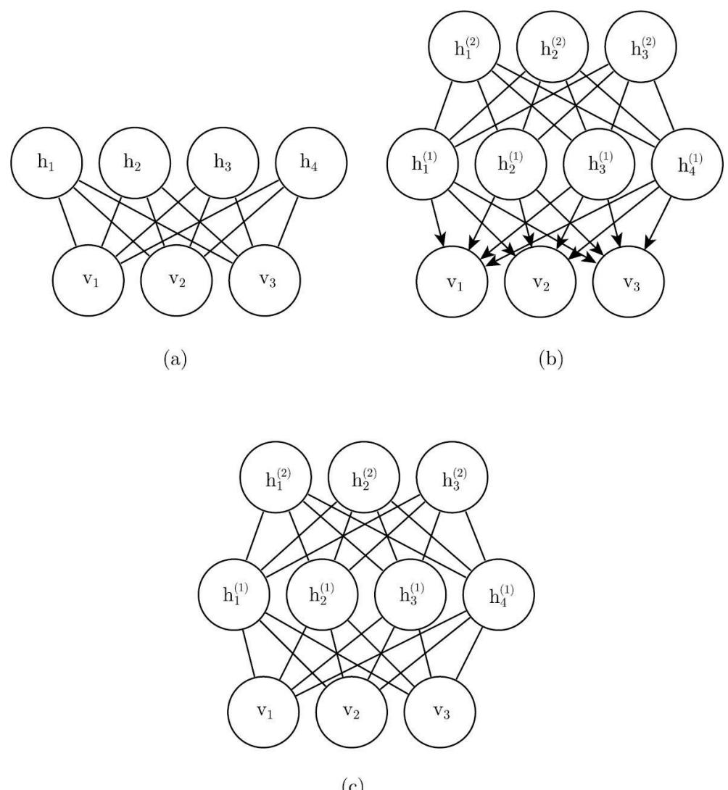  
(c)  
图20.1 可以用受限玻尔兹曼机构建的模型示例。（a）受限玻尔兹曼机本身是基于二分图的无向图模型，图的一部分具有可见单元，另一部分具有隐藏单元。可见单元之间没有连接，隐藏单元之间也没有任何连接。通常每个可见单元连接到每个隐藏单元，但也可以构造稀疏连接的RBM，如卷积RBM。（b）深度信念网络是涉及有向和无向连接的混合图模型。与RBM一样，它也没有层内连接。然而，DBN具有多个隐藏层，因此隐藏单元之间的连接在分开的层中。深度信念网络所需的所有局部条件概率分布都直接复制RBM的局部条件概率分布。或者，我们也可以用完全无向图表示深度信念网络，但是它需要层内连接来捕获父节点间的依赖关系。（c）深度玻尔兹曼机是具有几层潜变量的无向图模型。与RBM和DBN一样，DBM也缺少层内连接。DBM与RBM的联系不如DBN紧密。当从RBM堆栈初始化DBM时，有必要对RBM的参数稍作修改。某些种类的DBM可以直接训练，而不用先训练一组RBM

## 20.2.1 条件分布

虽然P (ν)难解，但RBM的二分图结构具有非常特殊的性质，其条件分布 $P \left( \mathbf { h } \mid \mathbf { v } \right)$ 和 $P \left( \mathbf { v } \mid \mathbf { h } \right)$ 是因子的，并且计算和采样是相对简单的。

从联合分布中导出条件分布是直观的：

$$
P (\boldsymbol {h} \mid \boldsymbol {v}) = \frac {P (\boldsymbol {h} , \boldsymbol {v})}{P (\boldsymbol {v})}\tag{20.7}
$$

$$
= \frac {1}{P (\boldsymbol {v})} \frac {1}{Z} \exp \left\{\boldsymbol {b} ^ {\top} \boldsymbol {v} + \boldsymbol {c} ^ {\top} \boldsymbol {h} + \boldsymbol {v} ^ {\top} \boldsymbol {W h} \right\}\tag{20.8}
$$

$$
= \frac {1}{Z ^ {\prime}} \exp \left\{\boldsymbol {c} ^ {\top} \boldsymbol {h} + \boldsymbol {v} ^ {\top} \boldsymbol {W} \boldsymbol {h} \right\}\tag{20.9}
$$

$$
= \frac {1}{Z ^ {\prime}} \exp \left\{\sum_ {j = 1} ^ {n _ {h}} \boldsymbol {c} _ {j} ^ {\top} \boldsymbol {h} _ {j} + \sum_ {n _ {h}} ^ {j = 1} \boldsymbol {v} ^ {\top} \boldsymbol {W} _ {:, j} \boldsymbol {h} _ {j} \right\}\tag{20.10}
$$

$$
= \frac {1}{Z ^ {\prime}} \prod_ {j = 1} ^ {n _ {h}} \exp \left\{\boldsymbol {c} _ {j} ^ {\top} \boldsymbol {h} _ {j} + \boldsymbol {v} ^ {\top} \boldsymbol {W} _ {:, j} \boldsymbol {h} _ {j} \right\}\tag{20.11}
$$

由于我们相对可见单元v 计算条件概率，相对于分布P (h | v )我们可以将它们视为常数。条件分布 $P \left( \mathbf { h } \mid \mathbf { v } \right)$ 因子相乘的本质，我们可以将向量h 上的联合概率写成单独元素h 上（未归一化）分布的乘积。现在原问 $\mathrm { j }$ 题变成了对单个二值 $\mathrm { h _ { j } }$ 上的分布进行归一化的简单问题。

$$
P (h _ {j} = 1 \mid \boldsymbol {v}) = \frac {\tilde {P} (h _ {j} = 1 \mid \boldsymbol {v})}{\tilde {P} (h _ {j} = 0 \mid \boldsymbol {v}) + \tilde {P} (h _ {j} = 1 \mid \boldsymbol {v})}\tag{20.12}
$$

$$
= \frac {\exp \left\{c _ {j} + \boldsymbol {v} ^ {\top} \boldsymbol {W} _ {: , j} \right\}}{\exp \{0 \} + \exp \left\{c _ {j} + \boldsymbol {v} ^ {\top} \boldsymbol {W} _ {: , j} \right\}}\tag{20.13}
$$

$$
= \sigma (c _ {j} + \boldsymbol {v} ^ {\top} \boldsymbol {W} _ {:, j})\tag{20.14}
$$

现在我们可以将关于隐藏层的完全条件分布表达为因子形式：

$$
P (\boldsymbol {h} \mid \boldsymbol {v}) = \prod_ {j = 1} ^ {n _ {h}} \sigma \big ((2 \boldsymbol {h} - 1) \odot (\boldsymbol {c} + \boldsymbol {W} ^ {\top} \boldsymbol {v}) \big) _ {j}\tag{20.15}
$$

类似的推导将显示我们感兴趣的另一个条件分布， $P \ ( \pmb { \nu } \mid \pmb { h } )$ 也是因子形式的分布：

$$
P (\boldsymbol {v} \mid \boldsymbol {h}) = \prod_ {i = 1} ^ {n _ {v}} \sigma \big ((2 \boldsymbol {v} - 1) \odot (\boldsymbol {b} + \boldsymbol {W h}) \big) _ {i}\tag{20.16}
$$

## 20.2.2 训练受限玻尔兹曼机

因为RBM允许高效计算 $\tilde { P } ( v )$ 的估计和微分，并且还允许高效地（以块吉布斯采样的形式）进行MCMC采样，所以我们很容易使用第18章中训练具有难以计算配分函数模型的技术来训练RBM。这包括CD、SML（PCD）、比率匹配等。与深度学习中使用的其他无向模型相比，RBM可以相对直接地训练，因为我们可以以闭解形式计算P (h | ν )。其他一些深度模型，如深度玻尔兹曼机，同时具备难处理的配分函数和难以推断的难题。

## 20.3 深度信念网络

深度信念网络 （deep belief network，DBN）是第一批成功应用深度架构训练的非卷积模型之一（Hinton et al. ，2006a；Hinton，2007b）。2006年深度信念网络的引入开始了当前深度学习的复兴。在引入深度信念网络之前，深度模型被认为太难以优化。具有凸目标函数的核机器引领了研究前沿。深度信念网络在MNIST数据集上表现超过内核化支持向量机，以此证明深度架构是能够成功的（Hinton et al. ，2006a）。尽管现在与其他无监督或生成学习算法相比，深度信念网络大多已经失去了青睐并很少使用，但它们在深度学习历史中的重要作用仍应该得到承认。

深度信念网络是具有若干潜变量层的生成模型。潜变量通常是二值的，而可见单元可以是二值或实数。尽管构造连接比较稀疏的DBN是可能的，但在一般的模型中，每层的每个单元连接到每个相邻层中的每个单元（没有层内连接）。顶部两层之间的连接是无向的。而所有其他层之间的连接是有向的，箭头指向最接近数据的层。见图20.1（b）的例子。

具有l个隐藏层的DBN包含l个权重矩阵： $\boldsymbol { W } ^ { ( 1 ) } , \cdots , \boldsymbol { W } ^ { ( l ) }$ ，同时也包含l＋1个偏置向量： $\pmb { b } ^ { ( 0 ) } , \cdots , \pmb { b } ^ { ( l ) }$ ，其中 $\mid b _ { \mathrm { ~ \it ~ ( 0 ) ~ } }$ 是可见层的偏置。DBN表示的概率分布由下式给出：

$$
P \left(\boldsymbol {h} ^ {(l)}, \boldsymbol {h} ^ {(l - 1)}\right) \propto \exp \left(\boldsymbol {b} ^ {(l) ^ {\top}} \boldsymbol {h} ^ {(l)} + \boldsymbol {b} ^ {(l - 1) ^ {\top}} \boldsymbol {h} ^ {(l - 1)} + \boldsymbol {h} ^ {(l - 1) ^ {\top}} \boldsymbol {W} ^ {(l)} \boldsymbol {h} ^ {(l)}\right),\tag{20.17}
$$

$$
P (h _ {i} ^ {(k)} = 1 \mid \boldsymbol {h} ^ {(k + 1)}) = \sigma \left(b _ {i} ^ {(k)} + \boldsymbol {W} _ {:, i} ^ {(k + 1) ^ {\top}} \boldsymbol {h} ^ {(k + 1)}\right) \forall i, \forall k \in 1, \dots , l - 2,\tag{20.18}
$$

$$
P (v _ {i} = 1 \mid \boldsymbol {h} ^ {(1)}) = \sigma \left(b _ {i} ^ {(0)} + \boldsymbol {W} _ {:, i} ^ {(1) ^ {\top}} \boldsymbol {h} ^ {(1)}\right) \forall i\tag{20.19}
$$

在实值可见单元的情况下，替换

$$
\mathbf {v} \sim \mathcal {N} (\boldsymbol {v}; \boldsymbol {b} ^ {(0)} + \boldsymbol {W} ^ {(1) ^ {\top}} \boldsymbol {h} ^ {(1)}, \beta^ {- 1})\tag{20.20}
$$

为便于处理， $\beta$ 为对角形式。至少在理论上，推广到其他指数族的可见单元是直观的。只有一个隐藏层的DBN只是一个RBM。

为了从DBN中生成样本，我们先在顶部的两个隐藏层上运行几个Gibbs采样步骤。这个阶段主要从RBM（由顶部两个隐藏层定义）中采一个样本。然后，我们可以对模型的其余部分使用单次原始采样，以从可见单元绘制样本。

深度信念网络引发许多与有向模型和无向模型同时相关的问题。

由于每个有向层内的相消解释效应，并且由于无向连接的两个隐藏层之间的相互作用，深度信念网络中的推断是难解的。评估或最大化对数似然的标准证据下界也是难以处理的，因为证据下界基于大小等于网络宽度的团的期望。

评估或最大化对数似然，不仅需要面对边缘化潜变量时难以处理的推断问题，而且还需要处理顶部两层无向模型内难处理的配分函数问题。

为训练深度信念网络，我们可以先使用对比散度或随机最大似然方法训练RBM以最大化 $\mathbf { \sigma } _ { \mathbf { v } \sim p _ { \mathrm { d a t a } } } \log p ( \mathbf { \sigma } _ { v } )$ 。RBM的参数定义了DBN第一层的参数。然后，第二个RBM训练为近似最大化

$$
\mathbb {E} _ {\mathbf {v} \sim p _ {\mathrm{data}}} \mathbb {E} _ {\mathbf {h} ^ {(1)} \sim p ^ {(1)} (\boldsymbol {h} ^ {(1)} | \boldsymbol {v})} \log p ^ {(2)} (\boldsymbol {h} ^ {(1)})\tag{20.21}
$$

其中p(1) 是第一个RBM表示的概率分布， $\mathfrak { p } ^ { ( 2 ) }$ 是第二个RBM表示的概率分布。换句话说，第二个RBM被训练为模拟由第一个RBM的隐藏单元采样定义的分布，而第一个RBM由数据驱动。这个过程能无限重复，从而向DBN添加任意多层，其中每个新的RBM对前一个RBM的样本建模。每个RBM定义DBN的另一层。这个过程可以被视为提高数据在

DBN下似然概率的变分下界（Hinton et al. ，2006a）。

在大多数应用中，对DBN进行贪心逐层训练后，不需要再花工夫对其进行联合训练。然而，使用醒眠算法对其进行生成精调是可能的。

训练好的DBN可以直接用作生成模型，但是DBN的大多数兴趣来自它们改进分类模型的能力。我们可以从DBN获取权重，并使用它们定义MLP：

$$
\boldsymbol {h} ^ {(1)} = \sigma \big (b ^ {(1)} + \boldsymbol {v} ^ {\top} \boldsymbol {W} ^ {(1)} \big),\tag{20.22}
$$

$$
\boldsymbol {h} ^ {(l)} = \sigma \left(b _ {i} ^ {(l)} + \boldsymbol {h} ^ {(l - 1) ^ {\top}} \boldsymbol {W} ^ {(l)}\right) \forall l \in 2, \dots , m\tag{20.23}
$$

利用DBN的生成训练后获得的权重和偏置初始化该MLP之后，我们可以训练该MLP来执行分类任务。这种MLP的额外训练是判别性精调的示例。

与第19章中从基本原理导出的许多推断方程相比，这种特定选择的MLP有些随意。这个MLP是一个启发式选择，似乎在实践中效果不错，并在文献中一贯使用。许多近似推断技术是由它们在一些约束下，并在对数似然上找到最大紧变分下界的能力所驱动的。我们可以使用DBN中MLP定义的隐藏单元的期望，构造对数似然的变分下界，但这对于隐藏单元上的任何概率分布都是如此，并没有理由相信该MLP提供了一个特别的紧界。特别地，MLP忽略了DBN图模型中许多重要的相互作用。MLP将信息从可见单元向上传播到最深的隐藏单元，但不向下或侧向传播任何信息。DBN图模型解释了同一层内所有隐藏单元之间的相互作用以及层之间的自顶向下的相互作用。

虽然DBN的对数似然是难处理的，但它可以使用AIS近似

（Salakhutdinov and Murray，2008）。通过近似，可以评估其作为生成模型的质量。

术语“深度信念网络”通常不正确地用于指代任意种类的深度神经网络，甚至没有潜变量意义的网络。这个术语应特指最深层中具有无向连接，而在所有其他连续层之间存在向下有向连接的模型。

这个术语也可能导致一些混乱，因为术语“信念网络”有时指纯粹的有向模型，而深度信念网络包含一个无向层。深度信念网络也与动态贝叶斯网络（dynamic Bayesian networks）（Dean and Kanazawa，1989）共享首字母缩写DBN，动态贝叶斯网络表示马尔可夫链的贝叶斯网络。

## 20.4 深度玻尔兹曼机

深度玻尔兹曼机 （Deep Boltzmann Machine，DBM）（Salakhutdinovand Hinton，2009a）是另一种深度生成模型。与深度信念网络（DBN）不同的是，它是一个完全无向的模型。与RBM不同的是，DBM有几层潜变量（RBM只有一层）。但是像RBM一样，每一层内的每个变量是相互独立的，并条件于相邻层中的变量，见图20.2中的图结构。深度玻尔兹曼机已经被应用于各种任务，包括文档建模（Srivastava et al. ，2013）。

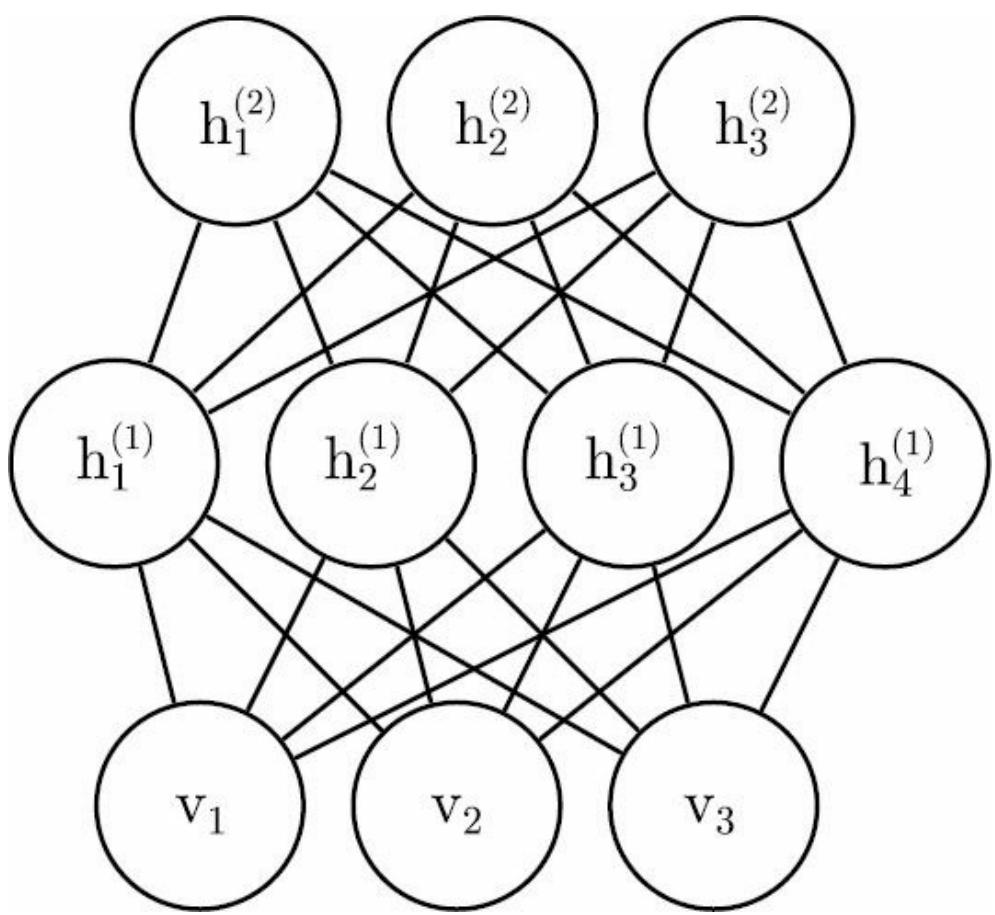  
图20.2 具有一个可见层（底部）和两个隐藏层的深度玻尔兹曼机的图模型。仅在相邻层的单元之间存在连接，没有层内连接

与RBM和DBN一样，DBM通常仅包含二值单元（正如我们为简化模型

的演示而假设的），但很容易就能扩展到实值可见单元。

DBM是基于能量的模型，这意味着模型变量的联合概率分布由能量函数E参数 $\mu _ { \circ }$ 。在一个深度玻尔兹曼机包含一个可见层 ν 和3个隐藏层$\boldsymbol { h } ^ { ( 1 ) } , \boldsymbol { h } ^ { ( 2 ) }$ 和 $h ^ { ( 3 ) }$ 的情况下，联合概率由下式给出：

$$
P (\pmb {v}, \pmb {h} ^ {(1)}, \pmb {h} ^ {(2)}, \pmb {h} ^ {(3)}) = \frac {1}{Z (\pmb {\theta})} \exp \big (- E (\pmb {v}, \pmb {h} ^ {(1)}, \pmb {h} ^ {(2)}, \pmb {h} ^ {(3)}; \pmb {\theta}) \big)\tag{20.24}
$$

为简化表示，式（20.25）省略了偏置参数。DBM能量函数定义如下：

$$
E (\boldsymbol {v}, \boldsymbol {h} ^ {(1)}, \boldsymbol {h} ^ {(2)}, \boldsymbol {h} ^ {(3)}; \boldsymbol {\theta}) = - \boldsymbol {v} ^ {\top} \boldsymbol {W} ^ {(1)} \boldsymbol {h} ^ {(1)} - \boldsymbol {h} ^ {(1) ^ {\top}} \boldsymbol {W} ^ {(2)} \boldsymbol {h} ^ {(2)} - \boldsymbol {h} ^ {(2) ^ {\top}} \boldsymbol {W} ^ {(3)} \boldsymbol {h} ^ {(3)}\tag{20.25}
$$

与RBM的能量函数（式（20.5））相比，DBM能量函数以权重矩阵（W$( 2 )$ 和 $W _ { ( 4 ) }$ 的形式表示隐藏单元（潜变量）之间的连接。正如我们将看到的，这些连接对模型行为以及我们如何在模型中进行推断都有重要的影响。

与全连接的玻尔兹曼机（每个单元连接到其他每个单元）相比，DBM提供了类似于RBM的一些优点。

具体来说，如图20.3所示，DBM的层可以组织成一个二分图，其中奇数层在一侧，偶数层在另一侧。容易发现，当我们条件于偶数层中的变量时，奇数层中的变量变得条件独立。当然，当我们条件于奇数层中的变量时，偶数层中的变量也会变得条件独立。

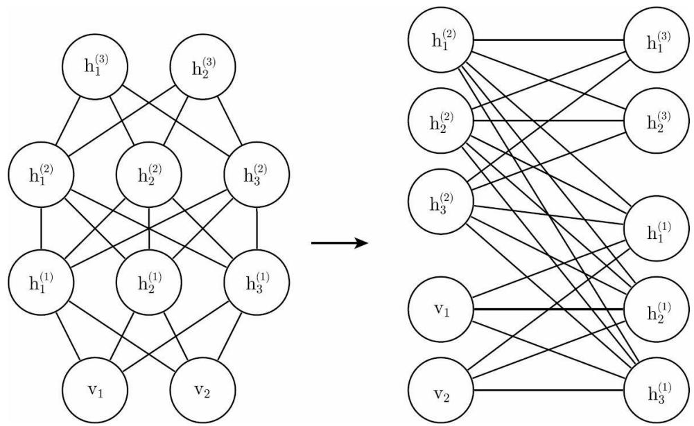  
图20.3 深度玻尔兹曼机，重新排列后显示为二分图结构

DBM的二分图结构意味着，我们可以应用之前用于RBM条件分布的相同式子来确定DBM中的条件分布。在给定相邻层值的情况下，层内的单元彼此条件独立，因此二值变量的分布可以由Bernoulli参数（描述每个单元的激活概率）完全描述。在具有两个隐藏层的示例中，激活概率由下式给出：

$$
P (v _ {i} = 1 \mid \boldsymbol {h} ^ {(1)}) = \sigma \big (\boldsymbol {W} _ {i,:} ^ {(1)} \boldsymbol {h} ^ {(1)} \big),\tag{20.26}
$$

$$
P (h _ {i} ^ {(1)} = 1 \mid \boldsymbol {v}, \boldsymbol {h} ^ {(2)}) = \sigma (\boldsymbol {v} ^ {\top} \boldsymbol {W} _ {:, i} ^ {(1)} + \boldsymbol {W} _ {i,:} ^ {(2)} \boldsymbol {h} ^ {(2)})\tag{20.27}
$$

和

$$
P (h _ {k} ^ {(2)} = 1 \mid \boldsymbol {h} ^ {(1)}) = \sigma (\boldsymbol {h} ^ {(1) \top} \boldsymbol {W} _ {:, k} ^ {(2)})\tag{20.28}
$$

二分图结构使Gibbs采样能在深度玻尔兹曼机中高效采样。Gibbs采样的方法是一次只更新一个变量。RBM允许所有可见单元以一个块的方式更新，而所有隐藏单元在另一个块上更新。我们可以简单地假设具有l层的DBM需要l＋1次更新，每次迭代更新由某层单元组成的块。然而，我们可以仅在两次迭代中更新所有单元。Gibbs采样可以将更新分成两个块，一块包括所有偶数层（包括可见层），另一个包括所有奇数层。由于DBM二分连接模式，给定偶数层，关于奇数层的分布是因子的，因此可以作为块同时且独立地采样。类似地，给定奇数层，可以同时且独立地将偶数层作为块进行采样。高效采样对使用随机最大似然算法的

训练尤其重要。

## 20.4.1 有趣的性质

深度玻尔兹曼机具有许多有趣的性质。

DBM在DBN之后开发。与DBN相比，DBM的后验分布P ( h | ν ) 更简单。有点违反直觉的是，这种后验分布的简单性允许更加丰富的后验近似。在DBN的情况下，我们使用启发式的近似推断过程进行分类，其中我们可以通过MLP（使用sigmoid激活函数并且权重与原始DBN相同）中的向上传播猜测隐藏单元合理的均匀场期望值。任何分布Q ( h )可用于获得对数似然的变分下界。因此这种启发式的过程让我们能够获得这样的下界。但是，该界没有以任何方式显式优化，所以该界可能是远远不紧的。特别地，Q的启发式估计忽略了相同层内隐藏单元之间的相互作用，以及更深层中隐藏单元对更接近输入的隐藏单元自顶向下的反馈影响。因为DBN中基于启发式MLP的推断过程不能考虑这些相互作用，所以得到的Q想必远不是最优的。DBM中，在给定其他层的情况下，层内的所有隐藏单元都是条件独立的。这种层内相互作用的缺失使得通过不动点方程优化变分下界，并找到真正最佳的均匀场期望（在一些数值容差内）变得可能的。

使用适当的均匀场允许DBM的近似推断过程捕获自顶向下反馈相互作用的影响。这从神经科学的角度来看是有趣的，因为根据已知，人脑使用许多自上而下的反馈连接。由于这个性质，DBM已被用作真实神经科学现象的计算模型（Series et al. ，2010；Reichert et al. ，2011）。

DBM一个不理想的特性是从中采样是相对困难的。DBN只需要在其顶部的一对层中使用MCMC采样。其他层仅在采样过程末尾涉及，并且只需在一个高效的原始采样过程。要从DBM生成样本，必须在所有层中使用MCMC，并且模型的每一层都参与每个马尔可夫链转移。

## 20.4.2 DBM均匀场推断

给定相邻层，一个DBM层上的条件分布是因子的。在有两个隐藏层的DBM的示例中，这些分布是 $P ( \nu | \pmb { h } _ { ( I ) } ) , P ( \pmb { h } _ { ( I ) } ) | \nu , \pmb { h } _ { ( 2 ) }$ )和 $P \left( \pmb { h } _ { ( 2 ) } | \pmb { h } _ { ( I ) } \right.$ )。因为层之间的相互作用，所有隐藏层上的分布通常不是因子的。在有两个隐藏层的示例中，由于 $\textbf { \em h } _ { ( I ) }$ 和 $\textbf { \textit { h } } _ { ( 2 ) }$ 之间的交互权重 $W _ { ( 2 ) }$ 使得这些变量相互依赖， $P \left( \pmb { h } _ { ( I ) } | \mathrm { v } , \pmb { h } _ { ( 2 ) } \right.$ )不是因子的。

与DBN的情况一样，我们还是要找出近似DBM后验分布的方法。然而，与DBN不同，DBM在其隐藏单元上的后验分布（复杂的）很容易用变分近似来近似（如第19.4节所讨论），具体是一个均匀场近似。均匀场近似是变分推断的简单形式，其中我们将近似分布限制为完全因子的分布。在DBM的情况下，均匀场方程捕获层之间的双向相互作用。在本节中，我们推导出由Salakhutdinov and Hinton（2009a）最初引入的迭代近似推断过程。

在推断的变分近似中，我们通过一些相当简单的分布族近似特定目标分布——在这里指给定可见单元时隐藏单元的后验分布。在均匀场近似的情况下，近似族是隐藏单元条件独立的分布集合。

我们现在为具有两个隐藏层的示例推导均匀场方法。令 $\mathcal { Q } ( \pmb { h } _ { ( l ) } , \pmb { h } _ { ( 2 ) } | \nu )$ 为 $P \left( \pmb { h } _ { ( I ) } , \pmb { h } _ { ( 2 ) } | \mathrm { \pmb { v } } \right)$ 的近似。均匀场假设意味着

$$
Q (\boldsymbol {h} ^ {(1)}, \boldsymbol {h} ^ {(2)} \mid \boldsymbol {v}) = \prod_ {j} Q (h _ {j} ^ {(1)} \mid \boldsymbol {v}) \prod_ {k} Q (\boldsymbol {h} _ {k} ^ {(2)} \mid \boldsymbol {v})\tag{20.29}
$$

均匀场近似试图找到这个分布族中最适合真实后验 $P \left( \textbf { \em h } _ { ( I ) } , \pmb { h } _ { ( 2 ) } \left| \mathrm { v } \right. \right)$ 的成员。重要的是，每次我们使用 ν 的新值时，必须再次运行推断过程以找到不同的分布 $\mathrm { \Delta Q }$ 。

我们可以设想很多方法来衡量 $\boldsymbol { Q } \left( \boldsymbol { h } \mid \boldsymbol { v } \right)$ 与 $P \left( h \mid \mathsf { v } \right)$ 的拟合程度。均匀场方法是最小化

$$
\operatorname{KL} (Q \mid | P) = \sum_ {h} Q \left(\boldsymbol {h} ^ {(1)}, \boldsymbol {h} ^ {(2)} \mid \boldsymbol {v}\right) \log \left(\frac {Q \left(\boldsymbol {h} ^ {(1)} , \boldsymbol {h} ^ {(2)} \mid \boldsymbol {v}\right)}{P \left(\boldsymbol {h} ^ {(1)} , \boldsymbol {h} ^ {(2)} \mid \boldsymbol {v}\right)}\right)\tag{20.30}
$$

一般来说，除了要保证独立性假设，我们不必提供参数形式的近似分布。变分近似过程通常能够恢复近似分布的函数形式。然而，在二值隐藏单元（我们在这里推导的情况）的均匀场假设的情况下，不会由于预先固定模型的参数而损失一般性。

我们将Q作为Bernoulli分布的乘积进行参数化，即我们将 $\textbf { \textit { h } } _ { ( l ) }$ 每个元素的概率与一个参数相关联。具体来说，对于每个j， $\hat { h } _ { j } ^ { ( 1 ) } = Q ( h _ { j } ^ { ( 1 ) } = 1 \mid v )$ ，其中 $\hat { h } _ { j } ^ { ( 1 ) } \in [ 0 , 1 ]$ 。另外，对于每个k， $\hat { h } _ { k } ^ { ( 2 ) } = Q ( h _ { k } ^ { ( 2 ) } = 1 \mid v )$ ，其中$\hat { h } _ { k } ^ { ( 2 ) } \in [ 0 , 1 ] \cdot$ 。因此，我们有以下近似后验：

$$
\begin{array}{l} Q (\boldsymbol {h} ^ {(1)}, \boldsymbol {h} ^ {(2)} \mid \boldsymbol {v}) = \prod_ {j} Q (h _ {j} ^ {(1)} \mid \boldsymbol {v}) \prod_ {k} Q (h _ {k} ^ {(2)} \mid \boldsymbol {v}) \\ = \prod_ {j} (\hat {h} _ {j} ^ {(1)}) ^ {h _ {j} ^ {(1)}} (1 - \hat {h} _ {j} ^ {(1)}) ^ {(1 - h _ {j} ^ {(1)})} \times \prod_ {k} (\hat {h} _ {k} ^ {(2)}) ^ {h _ {k} ^ {(2)}} (1 - \hat {h} _ {k} ^ {(2)}) ^ {(1 - h _ {k} ^ {(2)})} \end{array}\tag{20.31}
$$

(20.32)

当然，对于具有更多层的DBM，近似后验的参数化可以通过明显的方式扩展，即利用图的二分结构，遵循Gibbs采样相同的调度，同时更新所有偶数层，然后同时更新所有奇数层。

现在我们已经指定了近似分布Q的函数族，但仍然需要指定用于选择该函数族中最适合P的成员的过程。最直接的方法是使用式（19.56）指定的均匀场方程。这些方程是通过求解变分下界导数为零的位置而导出，它们以抽象的方式描述如何优化任意模型的变分下界（只需对Q求期望）。

应用这些一般的方程，我们得到以下更新规则（再次忽略偏置项）：

$$
h _ {j} ^ {(1)} = \sigma \left(\sum_ {i} v _ {i} \boldsymbol {W} _ {i, j} ^ {(1)} + \sum_ {k ^ {\prime}} \boldsymbol {W} _ {j, k ^ {\prime}} ^ {(2)} \hat {h} _ {k ^ {\prime}} ^ {(2)}\right), \forall j\tag{20.33}
$$

$$
\hat {h} _ {k} ^ {(2)} = \sigma \left(\sum_ {j ^ {\prime}} \boldsymbol {W} _ {j ^ {\prime}, k} ^ {(2)} \hat {h} _ {j ^ {\prime}} ^ {(1)}\right), \forall k\tag{20.34}
$$

在该方程组的不动点处，我们具有变分下界 $\mathcal { L } ( Q )$ 的局部最大值。因此，这些不动点更新方程定义了迭代算法，其中我们交替更新 ${ \bf \ddot { \boldsymbol { h } } } _ { j } ^ { ( 1 ) }$ （使用式（20.33））和 ${ \mathfrak { I } } _ { h _ { k } } ^ { ( 2 ) }$ （使用式（20.34））。对于诸如MNIST的小问题，少至10次迭代就足以找到用于学习的近似正相梯度，而50次通常足以获得要用于高精度分类的单个特定样本的高质量表示。将近似变分推断扩展到更深的DBM是直观的。

## 20.4.3 DBM的参数学习

DBM中的学习必须面对难解配分函数的挑战（使用第18章中的技术），以及难解后验分布的挑战（使用第19章中的技术）。

如第20.4.2节中所描述的，变分推断允许构建近似难处理的 $P \ ( \pmb { h } \ | \nu )$ 的分布 $\mathcal { Q } \left( \pmb { h } \ | \nu \right)$ 。然后通过最大化 $\mathcal { L } ( v , Q , \theta )$ （难处理的对数似然的变分下界 $P ( v ; \theta ) )$ ）学习。

对于具有两个隐藏层的深度玻尔兹曼机， $\mathcal { L }$ 由下式给出

$$
\mathcal {L} (Q, \boldsymbol {\theta}) = \sum_ {i} \sum_ {j ^ {\prime}} v _ {i} W _ {i, j ^ {\prime}} ^ {(1)} \hat {h} _ {j ^ {\prime}} ^ {(1)} + \sum_ {j ^ {\prime}} \sum_ {k ^ {\prime}} \hat {h} _ {j ^ {\prime}} ^ {(1)} W _ {j ^ {\prime}, k ^ {\prime}} ^ {(2)} \hat {h} _ {k ^ {\prime}} ^ {(2)} - \log Z (\boldsymbol {\theta}) + \mathcal {H} (Q)\tag{20.35}
$$

该表达式仍然包含对数配分函数 $\log Z ( \theta )$ 。由于深度玻尔兹曼机包含受限玻尔兹曼机作为组件，用于计算受限玻尔兹曼机的配分函数和采样的困难同样适用于深度玻尔兹曼机。这意味着评估玻尔兹曼机的概率质量函数需要近似方法，如退火重要采样。同样，训练模型需要近似对数配分函数的梯度，见第18章对这些方法的一般性描述。DBM通常使用随机最大似然训练。第18章中描述的许多其他技术都不适用。诸如伪似然的技术需要评估非归一化概率的能力，而不是仅仅获得它们的变分下界。对于深度玻尔兹曼机，对比散度是缓慢的，因为它们不能在给定可见单元时对隐藏单元进行高效采样——反而，每当需要新的负相样本时，对比散度将需要磨合一条马尔可夫链。

非变分版本的随机最大似然算法已经在第18.2节讨论过。算法20.1给出了应用于DBM的变分随机最大似然算法。回想一下，我们描述的是DBM的简化变体（缺少偏置参数），很容易推广到包含偏置参数的情况。

## 20.4.4 逐层预训练

不幸的是，随机初始化后使用随机最大似然训练（如上所述）的DBM通常导致失败。在一些情况下，模型不能学习如何充分地表示分布。在其他情况下，DBM可以很好地表示分布，但是没有比仅使用RBM获得更高的似然。除第一层之外，所有层都具有非常小权重的DBM与RBM表示大致相同的分布。

如第20.4.5节所述，目前已经开发了允许联合训练的各种技术。然而，克服DBM的联合训练问题最初和最流行的方法是贪心逐层预训练。在该方法中，DBM的每一层被单独视为RBM进行训练。第一层被训练为对输入数据进行建模。每个后续RBM被训练为对来自前一RBM后验分布的样本进行建模。在以这种方式训练了所有RBM之后，它们可以被组合成DBM。然后可以用PCD训练DBM。通常，PCD训练将仅使模型的参数、由数据上的对数似然衡量的性能、区分输入的能力发生微小的变化，见图20.4展示的训练过程。

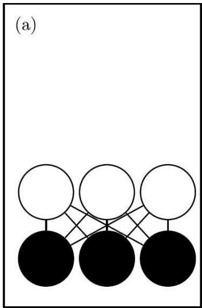

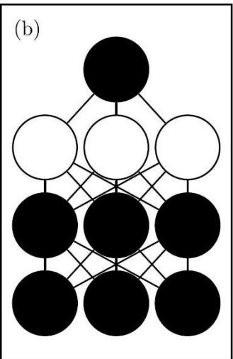

(c)  
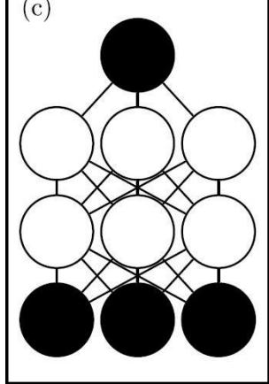

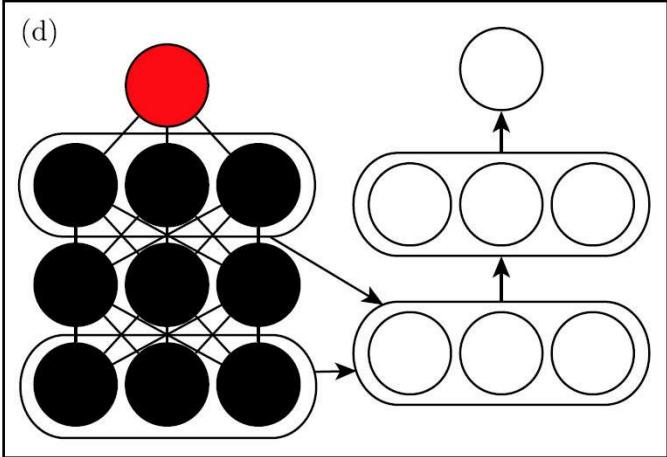  
图20.4 用于分类MNIST数据集的深度玻尔兹曼机训练过程（Salakhutdinov and Hinton，2009a；Srivastava et al. ，2014）。（a）使用CD近似最大化log P( ν )来训练RBM。（b）训练第二个RBM，使用CD-k近似最大化 $\log \mathrm { P } ( \boldsymbol { h } ^ { ( I ) } , \mathrm { y } )$ 来建模 $_ h ^ { ( l ) }$ 和目标类y，其中 $_ h ^ { ( l ) }$ 采自第一个RBM条件于数据的后验。在学习期间将k从1增加到20。（c）将两个RBM组合为DBM。使用k＝5的随机最大似然训练，近似最大化logP( v ,y)。（d）将y从模型中删除。定义新的一组特征$( l )$ 和 $\mathbf { \Omega } _ { h } \left( 2 \right)$ ，可在缺少y的模型中运行均匀场推断后获得。使用这些特征作为MLP的输入，其结构与均匀场的额外轮相同，并且具有用于估计y的额外输出层。初始化MLP的权重与DBM的权重相同。使用随机梯度下降和Dropout训练MLP近似最大化log P(y｜ v )。图来自Goodfellow et al.（2013d）

算法20.1 用于训练具有两个隐藏层的DBM的变分随机最大似然算法。

设步长 $E$ 一个小正数

设定吉布斯步数k，大到足以让 $p ( \boldsymbol { v } , \boldsymbol { h } ^ { ( 1 ) } , \boldsymbol { h } ^ { ( 2 ) } ; \pmb { \theta } + \epsilon \Delta _ { \theta } )$ 的马尔可夫链能磨合（从来自 $p ( \boldsymbol { v } , h ^ { ( 1 ) } , h ^ { ( 2 ) } ; \theta )$ 的样本开始）。

初始化3个矩阵， $\tilde { V } , \tilde { H } ^ { ( 1 ) }$ 和 $\tilde { \pmb { H } } ^ { ( 2 ) }$ 每个都将m行设为随机值（例如，来自Bernoulli分布，边缘分布大致与模型匹配）。

## while 没有收敛（学习循环）do

从训练数据采包含m个样本的小批量，并将它们排列为设计矩阵 V的行。

初始化矩阵 $\hat { \pmb { H } } ^ { ( 1 ) }$ 和 $\hat { \pmb { H } } ^ { ( 2 ) }$ ，使其大致符合模型的边缘分布。

while没有收敛（均匀场推断循环）do

$$
\hat {\boldsymbol {H}} ^ {(1)} \leftarrow \text { sigmoid } \left(\boldsymbol {V}   \boldsymbol {W} ^ {(1)} + \hat {\boldsymbol {H}} ^ {(2)}   \boldsymbol {W} ^ {(2) \top}\right).
$$

$$
\hat {\boldsymbol {H}} ^ {(2)} \leftarrow \text { sigmoid } \left(\hat {\boldsymbol {H}} ^ {(1)} \boldsymbol {W} ^ {(2)}\right)
$$

end while

$$
\Delta_ {\boldsymbol {W} ^ {(1)}} \leftarrow \frac {1}{m} \boldsymbol {V} ^ {\top} \hat {\boldsymbol {H}} ^ {(1)}
$$

$$
\Delta_ {\boldsymbol {W} ^ {(2)}} \leftarrow \frac {1}{m} \hat {\boldsymbol {H}} ^ {(1) \top} \hat {\boldsymbol {H}} ^ {(2)}
$$

for 1=1 to k (Gibbs采样) do
    Gibbs block 1:
∀i, j,  $\tilde{V}_{i,j}$  采自  $P(\tilde{V}_{i,j}=1)=\text{sigmoid}\left(\boldsymbol{W}_{j,:}^{(1)}\left(\tilde{\boldsymbol{H}}_{i,:}^{(1)}\right)^{\top}\right)$ .
∀i, j,  $\tilde{H}_{i,j}^{(2)}$  采自  $P(\tilde{H}_{i,j}^{(2)}=1)=\text{sigmoid}\left(\tilde{\boldsymbol{H}}_{i,:}^{(1)}\boldsymbol{W}_{:,j}^{(2)}\right)$ .
Gibbs block 2:
∀i, j,  $\tilde{H}_{i,j}^{(1)}$  采自  $P(\tilde{H}_{i,j}^{(1)}=1)=\text{sigmoid}\left(\tilde{V}_{i,:}\boldsymbol{W}_{:,j}^{(1)}+\tilde{\boldsymbol{H}}_{i,:}^{(2)}\boldsymbol{W}_{j,:}^{(2)\top}\right)$ .
end for
 $\Delta_{W^{(1)}}\leftarrow\Delta_{W^{(1)}}-\frac{1}{m}V^{\top}\tilde{H}^{(1)}$ $\Delta_{W^{(2)}}\leftarrow\Delta_{W^{(2)}}-\frac{1}{m}\tilde{H}^{(1)\top}\tilde{H}^{(2)}$ $W^{(1)}\leftarrow W^{(1)}+\epsilon\Delta_{W^{(1)}}$  （这是大概的描述，实践中使用的算法更高效，如具有衰减学习率的动量）
 $W^{(2)}\leftarrow W^{(2)}+\epsilon\Delta_{W^{(2)}}$ 
end while

这种贪心逐层训练过程不仅仅是坐标上升，因为我们在每个步骤优化参数的一个子集，它与坐标上升具有一些传递相似性。这两种方法是不同的，因为贪心逐层训练过程中，我们在每个步骤都使用了不同的目标函数。

DBM的贪心逐层预训练与DBN的贪心逐层预训练不同。每个单独的RBM的参数可以直接复制到相应的DBN。在DBM的情况下，RBM的参数在包含到DBM中之前必须修改。RBM栈的中间层仅使用自底向上的输入进行训练，但在栈组合形成DBM后，该层将同时具有自底向上和自顶向下的输入。为了解释这种效应，Salakhutdinov andHinton（2009a）提倡在将其插入DBM之前，将所有RBM（顶部和底部RBM除外）的权重除2。另外，必须使用每个可见单元的两个“副本”来训练底部RBM，并且两个副本之间的权重约束为相等。这意味着在向上传播时，权重能有效地加倍。类似地，顶部RBM应当使用最顶层的两个副本来训练。

为了使用深度玻尔兹曼机获得最好结果，我们需要修改标准的SML算法，即在联合PCD训练步骤的负相期间使用少量的均匀场（Salakhutdinov and Hinton，2009a）。具体来说，应当相对于其中所有单元彼此独立的均匀场分布来计算能量梯度的期望。这个均匀场分布的参数应该通过运行一次均匀场不动点方程获得。Goodfellow et al（2013d）比较了在负相中使用和不使用部分均匀场的中心化DBM的性能。

## 20.4.5 联合训练深度玻尔兹曼机

经典DBM需要贪心无监督预训练，并且为了更好的分类，需要在它们提取的隐藏特征之上，使用独立的基于MLP的分类器。这种方法有一些不理想的性质，因为我们不能在训练第一个RBM时评估完整DBM的属性，所以在训练期间难以跟踪性能。因此，直到相当晚的训练过程，我们都很难知道我们的超参数表现如何。DBM的软件实现需要很多不同的模块，如用于单个RBM的CD训练、完整DBM的PCD训练以及基于反向传播的MLP训练。最后，玻尔兹曼机顶部的MLP失去了玻尔兹曼机概率模型的许多优点，例如当某些输入值丢失时仍能够进行推断的优点。

主要有两种方法可以处理深度玻尔兹曼机的联合训练问题。第一个是中心化深度玻尔兹曼机 （centered deep Boltzmann machine）（Montavonand Muller，2012），通过重参数化模型使其在开始学习过程时代价函数的Hessian具有更好的条件数。这个模型不用经过贪心逐层预训练阶段就能训练。这个模型在测试集上获得出色的对数似然，并能产生高质量的样本。不幸的是，作为分类器，它仍然不能与适当正则化的MLP竞争。联合训练深度玻尔兹曼机的第二种方式是使用多预测深度玻尔兹曼机 （multi-prediction deep Boltzmann machine，MP-DBM）（Goodfellowet al. ，2013d）。该模型的训练准则允许反向传播算法，以避免使用

MCMC估计梯度的问题。不幸的是，新的准则不会导致良好的似然性或样本，但是相比MCMC方法，它确实会导致更好的分类性能和良好的推断缺失输入的能力。

如果我们回到玻尔兹曼机的一般观点，即包括一组权重矩阵 U 和偏置 b的单元 x ，玻尔兹曼机中心化技巧是最容易描述的。回顾式（20.2） ，能量函数由下式给出

$$
E (\boldsymbol {x}) = - \boldsymbol {x} ^ {\top} \boldsymbol {U} \boldsymbol {x} - \boldsymbol {b} ^ {\top} \boldsymbol {x}\tag{20.36}
$$

在权重矩阵 U 中使用不同的稀疏模式，我们可以实现不同架构的玻尔兹曼机，如RBM或具有不同层数的DBM。将 x 分割成可见和隐藏单元，并将 $U$ 中不相互作用的单元归零可以实现这些架构。中心化玻尔兹曼机引入了一个向量 $\pmb { \mu }$ ，并从所有状态中减去：

$$
E ^ {\prime} (\boldsymbol {x}; \boldsymbol {U}, \boldsymbol {b}) = - (\boldsymbol {x} - \boldsymbol {\mu}) ^ {\top} \boldsymbol {U} (\boldsymbol {x} - \boldsymbol {\mu}) - (\boldsymbol {x} - \boldsymbol {\mu}) ^ {\top} \boldsymbol {b}\tag{20.37}
$$

通常 $\pmb { \mu }$ 在开始训练时固定为一个超参数。当模型初始化时，通常选择为${ \pmb x } - { \pmb \mu } \approx 0$ 。这种重参数化不改变模型可表示的概率分布的集合，但它确实改变了应用于似然的随机梯度下降的动态。具体来说，在许多情况下，这种重参数化导致更好条件数的Hessian矩阵。Melchior et al.（2013）通过实验证实了Hessian矩阵条件数的改善，并观察到中心化技巧等价于另一个玻尔兹曼机学习技术——增强梯度 （enhancedgradient）（Cho et al. ，2011）。即使在困难的情况下，例如训练多层的深度玻尔兹曼机，Hessian矩阵条件数的改善也能使学习成功。

联合训练深度玻尔兹曼机的另一种方法是多预测深度玻尔兹曼机（MP-DBM），它将均匀场方程视为定义一系列用于近似求解每个可能推断问题的循环网络（Goodfellow et al. ，2013d）。模型被训练为使每个循环网络获得对相应推断问题的准确答案，而不是训练模型来最大化似然。训练过程如图20.5所示，它包括随机采一个训练样本，随机采样推断网络的输入子集，然后训练推断网络来预测剩余单元的值。

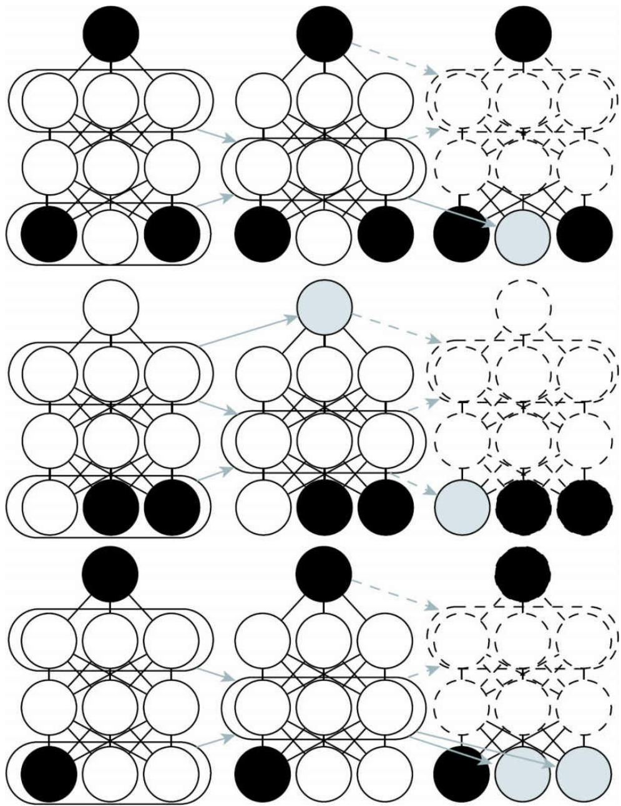

图20.5 深度玻尔兹曼机多预测训练过程的示意图。每一行指示相同训练步骤内小批量中的不同样本。每列表示均匀场推断过程中的时间步。对于每个样本，我们对数据变量的子集进行采样，作为推断过程的输入。这些变量以黑色阴影表示条件。然后我们运行均匀场推断过程，箭头指示过程中的哪些变量会影响其他变量。在实际应用中，我们将均匀场展开为几个步骤。在此示意图中，我们只展开为两个步骤。虚线箭头表示获得更多步骤需要如何展开该过程。未用作推断过程输入的数据变量成为目标，以灰色阴影表示。我们可以将每个样本的推断过程视为循环网络。为了使其在给定输入后能产生正确的目标，我们使用梯度下降和反向传播训练这些循环网络。这可以训练MP-DBM均匀场过程产生准确的估计。图改编自Goodfellow etal.（2013d）

这种用于近似推断，通过计算图进行反向传播的一般原理已经应用于其他模型（Stoyanov et al. ，2011；Brakel et al. ，2013）。在这些模型和MP-DBM中，最终损失不是似然的下界。相反，最终损失通常基于近似推断网络对缺失值施加的近似条件分布。这意味着这些模型的训练有些启发式。如果我们检查由MP-DBM学习出来的玻尔兹曼机表示p（ ν），在Gibbs采样产生较差样本的意义下，它倾向于有些缺陷。

通过推断图的反向传播有两个主要优点。首先，它以模型真正使用的方式训练模型——使用近似推断。这意味着在MP-DBM中，进行如填充缺失的输入或执行分类（尽管存在缺失的输入）的近似推断比在原始DBM中更准确。原始DBM不会自己做出准确的分类器，使用原始DBM的最佳分类结果是基于DBM提取的特征训练独立的分类器，而不是通过使用DBM中的推断来计算关于类标签的分布。MP-DBM中的均匀场推断作为分类器，不需要进行特殊修改就获得良好的表现。通过近似推断反向传播的另一个优点是反向传播计算损失的精确梯度。对于优化而言，比SML训练中具有偏差和方差的近似梯度更好。这可能解释了为什么MP-DBM可以联合训练，而DBM需要贪心逐层预训练。近似推断图反向传播的缺点是它不提供一种优化对数似然的方法，而提供广义伪似然的启发式近似。

MP-DBM启发了对NADE框架的扩展NADE-k（Raiko et al. ，2014） ，我们将在第20.10.10节中描述。

MP-DBM与Dropout有一定联系。Dropout在许多不同的计算图之间共享相同的参数，每个图之间的差异是包括还是排除每个单元。MP-DBM还在许多计算图之间共享参数。在MP-DBM的情况下，图之间的差异是每个输入单元是否被观察到。当没有观察到单元时，MP-DBM不会像Dropout那样将其完全删除。相反，MP-DBM将其视为要推断的潜变量。我们可以想象将Dropout应用到MP-DBM，即额外去除一些单元而不是将它们变为潜变量。

## 20.5 实值数据上的玻尔兹曼机

虽然玻尔兹曼机最初是为二值数据而开发的，但是许多应用，例如图像和音频建模似乎需要表示实值上概率分布的能力。在一些情况下，我们可以将区间[0，1]中的实值数据视为表示二值变量的期望。例如，Hinton（2000）将训练集中灰度图像的像素值视为定义[0，1]间的概率值。每个像素定义二值变量为1的概率，并且二值像素的采样都彼此独立。这是评估灰度图像数据集上二值模型的常见过程。然而，这种方法理论上并不特别令人满意，并且以这种方式独立采样的二值图像具有噪声表象。在本节中，我们介绍概率密度定义在实值数据上的玻尔兹曼机。

## 20.5.1 Gaussian-Bernoulli RBM

受限玻尔兹曼机可以用于许多指数族的条件分布（ $\mathrm { ( W e l l i n g ) } e t a l .$ 2005）。其中，最常见的是具有二值隐藏单元和实值可见单元的RBM，其中可见单元上的条件分布是高斯分布（均值为隐藏单元的函数）。

有很多方法可以参数化Gaussian-Bernoulli RBM。首先，我们可以选择协方差矩阵或精度矩阵来参数化高斯分布。这里，我们介绍选择精度矩阵的情况。我们可以通过简单的修改获得协方差的形式。我们希望条件分布为

$$
p (\boldsymbol {v} \mid \boldsymbol {h}) = \mathcal {N} (\boldsymbol {v}; \boldsymbol {W h}, \boldsymbol {\beta} ^ {- 1})\tag{20.38}
$$

通过扩展未归一化的对数条件分布可以找到需要添加到能量函数中的项：

$$
\log \mathcal {N} (\boldsymbol {v}; \boldsymbol {W h}, \boldsymbol {\beta} ^ {- 1}) = - \frac {1}{2} (\boldsymbol {v} - \boldsymbol {W h}) ^ {\top} \boldsymbol {\beta} (\boldsymbol {v} - \boldsymbol {W h}) + f (\boldsymbol {\beta})\tag{20.39}
$$

此处f封装所有的参数，但不包括模型中的随机变量。因为f的唯一作用是归一化分布，并且我们选择的任何可作为配分函数的能量函数都能起到这个作用，所以我们可以忽略f。

如果我们在能量函数中包含式（20.39）中涉及ν 的所有项（其符号被翻转），并且不添加任何其他涉及 ν 的项，那么我们的能量函数就能表示想要的条件分布 $\dot { p } \left( \vee \vert h \right)$ 。

其他条件分布比较自由，如 $\mathbb { J } p \left( \pmb { h } | \mathbb { v } \right)$ 。注意式（20.39）包含一项

$$
\frac {1}{2} \boldsymbol {h} ^ {\top} \boldsymbol {W} ^ {\top} \beta \boldsymbol {W} \boldsymbol {h}\tag{20.40}
$$

因为该项包含h $\mathrm { _ i h _ { j } }$ 项，它不能被全部包括在内。这些对应于隐藏单元之间的边。如果我们包括这些项，将得到一个线性因子模型，而不是受限玻尔兹曼机。当设计我们的玻尔兹曼机时，简单地省略这些h h 交叉 $\mathrm { j }$ 项。省略这些项不改变条件分布 $\dot { p } \ ( \nu | \ \pmb { h } )$ ，因此式（20.39）仍满足。然而，我们仍然可以选择是否包括仅涉及单个h 的项。如果假设精度矩阵 $\mathrm { i }$ 是对角的，就能发现对于每个隐藏单元 $\ln _ { \mathrm { i } }$ ，我们有一项

$$
\frac {1}{2} h _ {i} \sum_ {j} \beta_ {j} W _ {j, i} ^ {2}\tag{20.41}
$$

在上面，我们使用了 $h _ { i } ^ { 2 } = h _ { i }$ 的事实（因为h $\mathrm { ~ \ i ~ } \in \{ 0 , \ 1 \} \ )$ 。如果我们在能量函数中包含此项（符号被翻转），则当该单元的权重较大且以高精度连接到可见单元时，偏置 $\mathrm { h _ { i } }$ 将自然被关闭。是否包括该偏置项不影响模型可以表示的分布族（假设我们包括隐藏单元的偏置参数），但是它确实会影响模型的学习动态。包括该项可以帮助隐藏单元（即使权重在幅度上快速增加时）保持合理激活。

因此，在Gaussian-Bernoulli RBM上定义能量函数的一种方式：

$$
E (\boldsymbol {v}, \boldsymbol {h}) = \frac {1}{2} \boldsymbol {v} ^ {\top} (\boldsymbol {\beta} \odot \boldsymbol {v}) - (\boldsymbol {v} \odot \boldsymbol {\beta}) ^ {\top} \boldsymbol {W} \boldsymbol {h} - \boldsymbol {b} ^ {\top} \boldsymbol {h}\tag{20.42}
$$

但我们还可以添加额外的项或者通过方差而不是精度参数化能量。

在这个推导中，我们没有在可见单元上添加偏置项，但添加这样的偏置是容易的。Gaussian-Bernoulli RBM参数化一个最终变化的来源是如何处理精度矩阵的选择。它可以被固定为常数（可能基于数据的边缘精度估计）或学习出来。它也可以是标量乘以单位矩阵，或者是一个对角矩阵。在此情况下，由于一些操作需要对矩阵求逆，我们通常不允许非对角的精度矩阵，因为高斯分布的一些操作需要对矩阵求逆，一个对角矩阵可以非常容易地被求逆。在接下来的章节中，我们将看到其他形式的玻尔兹曼机，它们允许对协方差结构建模，并使用各种技术避免对精度矩阵求逆。

## 20.5.2 条件协方差的无向模型

虽然高斯RBM已成为实值数据的标准能量模型，Ranzato

（2010a）认为高斯RBM感应偏置不能很好地适合某些类型的实值数据中存在的统计变化，特别是自然图像。问题在于自然图像中的许多信息内容嵌入于像素之间的协方差而不是原始像素值中。换句话说，图像中的大多数有用信息在于像素之间的关系，而不是其绝对值。由于高斯RBM仅对给定隐藏单元的输入条件均值建模，所以它不能捕获条件协方差信息。为了回应这些评论，已经有学者提出了替代模型，设法更好地考虑实值数据的协方差。这些模型包括均值和协方差RBM （meanand covariance RBM，mcRBM） (1) 、学生t分布均值乘积 （meanproduct of Student t-distribution，mPoT）模型和尖峰和平板RBM （spikeand slab RBM，ssRBM）

均值和协方差RBM mcRBM使用隐藏单元独立地编码所有可观察单元的条件均值和协方差。mcRBM的隐藏层分为两组单元：均值单元和协方差单元。建模条件均值的那组单元是简单的高斯RBM。另一半是协方差RBM （covariance RBM，cRBM）（Ranzato et al. ，2010a），对条件协方差的结构进行建模（如下所述）。

具体来说，在二值均值的单元 $\textbf { \textit { h } } ^ { ( m ) }$ 和二值协方差单元 $\pmb { h } ^ { \ ( c ) }$ 的情况下，mcRBM模型被定义为两个能量函数的组合：

$$
E _ {\mathrm{mc}} (\boldsymbol {x}, \boldsymbol {h} ^ {(m)}, \boldsymbol {h} ^ {(c)}) = E _ {\mathrm{m}} (\boldsymbol {x}, \boldsymbol {h} ^ {(m)}) + E _ {\mathrm{c}} (\boldsymbol {x}, \boldsymbol {h} ^ {(c)})\tag{20.43}
$$

其中 $\mathrm { E } _ { \mathrm { m } }$ 为标准的Gaussian-Bernoulli RBM能量函数 (2) ，

$$
E _ {\mathrm{m}} (\boldsymbol {x}, \boldsymbol {h} ^ {(m)}) = \frac {1}{2} \boldsymbol {x} ^ {\top} \boldsymbol {x} - \sum_ {j} \boldsymbol {x} ^ {\top} \boldsymbol {W} _ {:, j} h _ {j} ^ {(m)} - \sum_ {j} b _ {j} ^ {(m)} h _ {j} ^ {(m)}\tag{20.44}
$$

$\mathrm { E _ { c } }$ 是cRBM建模条件协方差信息的能量函数：

$$
E _ {\mathrm{c}} (\boldsymbol {x}, \boldsymbol {h} ^ {(c)}) = \frac {1}{2} \sum_ {j} h _ {j} ^ {(c)} \big (\boldsymbol {x} ^ {\top} \boldsymbol {r} ^ {(j)} \big) ^ {2} - \sum_ {j} b _ {j} ^ {(c)} h _ {j} ^ {(c)}\tag{20.45}
$$

参数 $r ^ { \mathit { ( j ) } }$ 与 ${ \bf \ddot { \boldsymbol { h } } } _ { j } ^ { ( c ) }$ 关联的协方差权重向量对应， $\textit { \textbf { b } } ^ { ( c ) }$ 是一个协方差偏置向量。组合后的能量函数定义联合分布，

$$
p _ {\mathrm{mc}} (\boldsymbol {x}, \boldsymbol {h} ^ {(m)}, \boldsymbol {h} ^ {(c)}) = \frac {1}{Z} \exp \left\{- E _ {\mathrm{mc}} (\boldsymbol {x}, \boldsymbol {h} ^ {(m)} \boldsymbol {h} ^ {(c)}) \right\}\tag{20.46}
$$

以及给定 $\textbf { \textit { h } } ^ { ( m ) }$ 和 $\pmb { h } ^ { \ ( c ) }$ 后，关于观察数据相应的条件分布（为一个多元高斯分布）：

$$
p _ {\mathrm{mc}} (\boldsymbol {x} \mid \boldsymbol {h} ^ {(m)}, \boldsymbol {h} ^ {(c)}) = \mathcal {N} \left(\boldsymbol {x}; \boldsymbol {C} _ {\boldsymbol {x} | h} ^ {\mathrm{mc}} \left(\sum_ {j} \boldsymbol {W} _ {:, j} h _ {j} ^ {(m)}\right), \boldsymbol {C} _ {\boldsymbol {x} | h} ^ {\mathrm{mc}}\right)\tag{20.47}
$$

注意协方差矩阵 $\begin{array} { r } { \mathbf { \phi } ^ { } \mathbf { C } _ { x | h } ^ { \mathrm { m c } } = \left( \sum _ { j } h _ { j } ^ { ( c ) } \mathbf { r } ^ { ( j ) } \mathbf { r } ^ { ( j ) T } + \mathbf { I } \right) ^ { - 1 } } \end{array}$ 是非对角的，且 $W$ 是与建模条件均值的高斯RBM相关联的权重矩阵。由于非对角的条件协方差结构，难以通过对比散度或持续性对比散度来训练mcRBM。CD和PCD需要从 x 、 $\pmb { h } ^ { ( m ) }$ $\pmb { h } ^ { ( c ) }$ 的联合分布中采样，这在标准RBM中可以通过Gibbs采样在条件分布上采样实现。但是，在mcRBM中，从 $p _ { \mathrm { m c } } ( \boldsymbol { x } \mid h ^ { ( m ) } , h ^ { ( c ) } )$ 中抽样需要在学习的每个迭代计算 $( \textbf { } C ^ { \mathrm { ~ m c ~ } } )$ −1 。这对于更大的观察数据可能是不切实际的计算负担。Ranzato andHinton（2010）通过使用mcRBM自由能上的哈密尔顿（混合）蒙特卡罗（Neal，1993）直接从边缘p( x )采样，避免了直接从条件$p _ { \mathrm { m c } } ( \boldsymbol { x } \mid \boldsymbol { h } ^ { ( m ) } , \boldsymbol { h } ^ { ( c ) } )$ 抽样。

学生t分布均值乘积 学生t分布均值乘积（mPoT）模型（Ranzato et al.，2010b）以类似mcRBM扩展cRBM的方式扩展PoT模型（Welling et al.，2003a），通过添加类似高斯RBM中隐藏单元的非零高斯均值来实现。与mcRBM一样，观察值上的PoT条件分布是多元高斯（具有非对角的协方差）分布。然而，不同于mcRBM，隐藏变量的互补条件分布是由条件独立的Gamma分布给出。Gamma分布 $\mathcal { G } ( k , \theta )$ 是关于正实数且均值为kθ的概率分布。我们只需简单地了解Gamma分布就足以理解mPoT模型的基本思想。

mPoT的能量函数为

$$
\begin{array}{l} E _ {\mathrm{mPoT}} (\boldsymbol {x}, \boldsymbol {h} ^ {(m)}, \boldsymbol {h} ^ {(c)}) \\ = E _ {\mathrm{m}} (\boldsymbol {x}, \boldsymbol {h} ^ {(m)}) + \sum_ {j} \left(h _ {j} ^ {(c)} (1 + \frac {1}{2} (\boldsymbol {r} ^ {(j) T} \boldsymbol {x}) ^ {2}) + (1 - \gamma_ {j}) \log h _ {j} ^ {(c)}\right) \end{array}\tag{20.48}
$$

(20.49)

其中 $r ^ { \mathbf { \alpha } ( j ) }$ 是与单元 $h _ { j } ^ { ( c ) }$ 相关联的协方差权重向量， $E _ { m } ( \pmb { x } , \pmb { h } ^ { ( m ) } )$ 如式（20.44）所定义。

正如mcRBM一样，mPoT模型能量函数指定一个多元高斯分布，其中关于 x 的条件分布具有非对角的协方差。mPoT模型中的学习（也像mcRBM）由于无法从非对角高斯条件分布 $p _ { \mathrm { m P o T } } ( \pmb { x } \mid \pmb { h } ^ { ( m ) } , \pmb { h } ^ { ( c ) } )$ 采样而变得复杂。因此Ranzato et al. （2010b）也倡导通过哈密尔顿（混合）蒙特卡罗（Neal，1993）直接采样p( x)。

尖峰和平板RBM 尖峰和平板RBM（spike and slab RBM，ssRBM）（Courville et al. ，2011b）提供对实值数据的协方差结构建模的另一种方法。与mcRBM相比，ssRBM具有既不需要矩阵求逆也不需要哈密尔顿蒙特卡罗方法的优点。就像mcRBM和mPoT模型，ssRBM的二值隐藏单元通过使用辅助实值变量来编码跨像素的条件协方差。

尖峰和平板RBM有两类隐藏单元：二值尖峰 （spike）单元h 和实值平板 （slab）单元s 。条件于隐藏单元的可见单元均值由 $( h \odot s ) W ^ { \top }$ 给出。换句话说，每一列 $W _ { : , i }$ 定义当h $_ \mathrm { ~ i ~ } = 1$ 时可出现在输入中的分量。相应的尖峰变量 $\mathrm { \hbar _ { h _ { i } } }$ 确定该分量是否存在。如果存在的话，相应的平板变量s 确定该分量的强度。当尖峰变量激活时，相应的平板变量将沿着$W _ { : , i }$ 定义的轴的输入增加方差。这允许我们对输入的协方差建模。幸运的是，使用Gibbs采样的对比散度和持续性对比散度仍然适用。此处无须对任何矩阵求逆。

形式上，ssRBM模型通过其能量函数定义：

$$
\begin{array}{l} E _ {\mathrm{ss}} (\boldsymbol {x}, \boldsymbol {s}, \boldsymbol {h}) = - \sum_ {i} \boldsymbol {x} ^ {\top} \boldsymbol {W} _ {:, i} s _ {i} h _ {i} + \frac {1}{2} \boldsymbol {x} ^ {\top} \left(\boldsymbol {\Lambda} + \sum_ {i} \boldsymbol {\Phi} _ {i} h _ {i}\right) \boldsymbol {x} \\ \quad + \frac {1}{2} \sum_ {i} \alpha_ {i} s _ {i} ^ {2} - \sum_ {i} \alpha_ {i} \mu_ {i} s _ {i} h _ {i} - \sum_ {i} b _ {i} h _ {i} + \sum_ {i} \alpha_ {i} \mu_ {i} ^ {2} h _ {i} \end{array}\tag{20.50}
$$

(20.51)

其中 $\mathbf { b } _ { \textrm { i } }$ 是尖峰h 的偏置，Λ 是观测值 x 上的对角精度矩阵。参数 $\mathrm { i }$ ${ \mathfrak { a } } _ { \mathrm { i } } > 0$ 是实值平板变量 $\mathbf { \dot { S } } _ { \textrm { i } }$ 的标量精度参数。参数 $\Phi _ { \mathbf { i } }$ 是定义 x 上的 h 调制二次惩罚的非负对角矩阵。每个 ${ \mu } _ { \mathrm { i } }$ 是平板变量 $\mathbf { \dot { S } } _ { \textrm { i } }$ 的均值参数。

利用能量函数定义的联合分布，能相对容易地导出ssRBM条件分布。例如，通过边缘化平板变量 s ，给定二值尖峰变量 h ，关于观察量的条件分布由下式给出

$$
p _ {\mathrm{ss}} (\boldsymbol {x} \mid \boldsymbol {h}) = \frac {1}{P (\boldsymbol {h})} \frac {1}{Z} \int \exp \{- E (\boldsymbol {x}, \boldsymbol {s}, \boldsymbol {h}) \} d \boldsymbol {s}\tag{20.52}
$$

$$
= \mathcal {N} \left(\boldsymbol {x}; C _ {\boldsymbol {x} | h} ^ {\mathrm{ss}} \sum_ {i} \boldsymbol {W} _ {:, i} \mu_ {i} h _ {i}, C _ {\boldsymbol {x} | h} ^ {\mathrm{ss}}\right)\tag{20.53}
$$

其中 $\begin{array} { r } { C _ { x | h } ^ { \mathrm { { s s } } } = ( \Lambda + \sum _ { i } \Phi _ { i } h _ { i } - \sum _ { i } \alpha _ { i } ^ { - 1 } h _ { i } W _ { : , i } W _ { : , i } ^ { \top } ) ^ { - 1 } } \end{array}$ 。最后的等式只有在协方差矩阵 $C _ { x | h } ^ { \mathrm { s s } }$ 正定时成立。

尖峰变量选通意味着h ⊙s 上的真实边缘分布是稀疏的。这不同于稀疏编码，其中来自模型的样本在编码中“几乎从不”（在测度理论意义上）包含零，并且需要MAP推断来强加稀疏性。

相比mcRBM和mPoT模型，ssRBM以明显不同的方式参数化观察量的条件协方差。mcRBM和mPoT都通过 $\begin{array} { r } { \left( \sum _ { j } h _ { j } ^ { ( c ) } r ^ { ( j ) } r ^ { ( j ) \top } + I \right) ^ { - 1 } } \end{array}$ 建模观察量的协方差结构，使用 $\pmb { h } _ { j } > 0$ 的隐藏单元的激活来对方向 $r ^ { \mathit { ( j ) } }$ 的条件协方差施加约束。相反，ssRBM使用隐藏尖峰激活h $_ \mathrm { ~ i ~ } = 1$ 来指定观察结果的条件协方差，以沿着由相应权重向量指定的方向捏合精度矩阵。ssRBM条件协方差与一个不同模型给出的类似：概率主成分分析的乘积（PoPPCA）（Williams and Agakov，2002）。在过完备的设定下，ssRBM参数化的稀疏激活仅允许在稀疏激活h 的所选方向上有显著方差（高于由 $\boldsymbol { \Lambda } ^ { \mathrm { ~ - 1 ~ } }$ 给出的近似方差）。在mcRBM或mPoT模型中，过完备的表示意味着，捕获观察空间中特定方向上的变化需要在该方向上的正交投影下去除潜在的所有约束。这表明这些模型不太适合于过完备设定。

尖峰和平板RBM的主要缺点是，参数的一些设置会对应于非正定的协方差矩阵。这种协方差矩阵会在离均值更远的值上放置更大的未归一化概率，导致所有可能结果上的积分发散。通常这个问题可以通过简单的启发式技巧来避免。理论上还没有任何令人满意的解决方法。使用约束优化来显式地避免概率未定义的区域（不过分保守是很难做到的），并且这还会阻止模型到达参数空间的高性能区域。

定性地，ssRBM的卷积变体能产生自然图像的优秀样本。图16.1中展示了一些样例。

ssRBM允许几个扩展，包括平板变量的高阶交互和平均池化（Courville$e t a l .$ ，2014）使得模型能够在标注数据稀缺时为分类器学习到出色的特征。向能量函数添加一项能防止配分函数在稀疏编码模型下变得不确定，如尖峰和平板稀疏编码（Goodfellow et al. ，2013g），也称为S3C。

## 20.6 卷积玻尔兹曼机

如第9章所示，超高维度输入（如图像）会对机器学习模型的计算、内存和统计要求造成很大的压力。通过使用小核的离散卷积来替换矩阵乘法是解决具有空间平移不变性或时间结构的输入问题的标准方式。Desjardins and Bengio（2008）表明这种方法应用于RBM时效果很好。

深度卷积网络通常需要池化操作，使得每个连续层的空间大小减小。前馈卷积网络通常使用池化函数，例如池化元素的最大值。目前尚不清楚如何将其推广到基于能量的模型的设定中。我们可以在n个二值检测器单元d上引入二值池化单元p，强制 $\mathrm { \tt p } { = } \mathrm { m a x _ { \mathrm { ~ i ~ } } d _ { \mathrm { ~ i ~ } } }$ ，并且当违反约束时将能量函数设置为∞。因为它需要评估2 n 个不同的能量设置来计算归一化常数，这种方式不能很好地扩展。对于小的3×3池化区域，每个池化单元需要评估29 ＝512个能量函数！

Lee et al. （2009）针对这个问题，开发了一个称为概率最大池化（probabilistic max pooling）的解决方案（不要与“随机池化”混淆，“随机池化”是用于隐含地构建卷积前馈网络集成的技术）。概率最大池化背后的策略是约束检测器单元，使得一次最多只有一个可以处于活动状态。这意味着仅存在n＋1个总状态（n个检测器单元中某一个状态为开和一个对应于所有检测器单元关闭的附加状态）。当且仅当检测器单元中的一个开启时，池化单元打开。所有单元的状态关闭时，能量被分配为0。我们可以认为这是在用包含n＋1个状态的单个变量来描述模型，或者等价地具有n＋1个变量的模型，除了n＋1个联合分配的变量之外的能量赋为∞。

虽然高效的概率最大池化确实能强迫检测器单元互斥，这在某些情景下可能是有用的正则化约束，而在其他情景下是对模型容量有害的限制。它也不支持重叠池化区域。从前馈卷积网络获得最佳性能通常需要重叠的池化区域，因此这种约束可能大大降低了卷积玻尔兹曼机的性能。

Lee et al. （2009）证明概率最大池化可以用于构建卷积深度玻尔兹曼机(3) 。该模型能够执行诸如填补输入缺失部分的操作。虽然这种模型在理论上有吸引力，让它在实践中工作是具有挑战性的，作为分类器通常不如通过监督训练的传统卷积网络。

许多卷积模型对于许多不同空间大小的输入同样有效。对于玻尔兹曼机，由于各种原因很难改变输入尺寸。配分函数随着输入大小的改变而改变。此外，许多卷积网络按与输入大小成比例地缩放池化区域来实现尺寸不变性，但缩放玻尔兹曼机池化区域是不优雅的。传统的卷积神经网络可以使用固定数量的池化单元，并且动态地增加它们池化区域的大小，以此获得可变大小输入的固定尺寸的表示。对于玻尔兹曼机，大型池化区域的计算成本比朴素方法高很多。Lee et al. （2009）的方法使得每个检测器单元在相同的池化区域中互斥，解决了计算问题，但仍然不允许大小可变的池化区域。例如，假设我们在学习边缘检测器时，检测器单元上具有2×2的概率最大池化，这强制约束在每个2×2的区域中只能出现这些边中的一条。如果我们随后在每个方向上将输入图像的大小增加50％，则期望边缘的数量会相应地增加。相反，如果我们在每个方向上将池化区域的大小增加50％到3×3，则互斥性约束现在指定这些边中的每一个在3×3区域中仅可以出现一次。当我们以这种方式增长模型的输入图像时，模型会生成密度较小的边。当然，这些问题只有在模型必须使用可变数量的池化，以便产出固定大小的输出向量时才会出现。只要模型的输出是可以与输入图像成比例缩放的特征图，使用概率最大池化的模型仍然可以接受可变大小的输入图像。

图像边界处的像素也带来一些困难，由于玻尔兹曼机中的连接是对称的事实而加剧。如果我们不隐式地补零输入，则将会导致比可见单元更少的隐藏单元，并且图像边界处的可见单元将不能被良好地建模，因为它们位于较少隐藏单元的接受场中。然而，如果我们隐式地补零输入，则边界处的隐藏单元将由较少的输入像素驱动，并且可能在需要时无法激活。

## 20.7 用于结构化或序列输出的玻尔兹曼机

在结构化输出场景中，我们希望训练可以从一些输入 x 映射到一些输出y 的模型， y 的不同条目彼此相关，并且必须遵守一些约束。例如，在语音合成任务中， y 是波形，并且整个波形听起来必须像连贯的发音。

表示y 中的条目之间关系的自然方式是使用概率分布 $\mathbf { p } ( \pmb { y } \mid \pmb { x } )$ 。扩展到建模条件分布的玻尔兹曼机可以支持这种概率模型。

使用玻尔兹曼机条件建模的相同工具不仅可以用于结构化输出任务，还可以用于序列建模。在后一种情况下，模型必须估计变量序列上的概率分布 $p ( \mathbf { x } ^ { ( 1 ) } , \cdots , \mathbf { x } ^ { ( \tau ) } )$ ，而不仅仅是将输入x 映射到输出 y 。为完成这个任务，条件玻尔兹曼机可以表示 $\mathbf { \dot { \phi } } p ( \mathbf { x } ^ { ( \tau ) } \mid \mathbf { x } ^ { ( 1 ) } , \cdots , \mathbf { x } ^ { ( \tau - 1 ) } )$ 形式的因子。

视频游戏和电影工业中一个重要序列建模任务是建模用于渲染3-D人物骨架关节角度的序列。这些序列通常通过记录角色移动的运动捕获系统收集。人物运动的概率模型允许生成新的（之前没见过的）但真实的动画。为了解决这个序列建模任务，Taylor et al. （2007）针对小的m引入了条件RBM建模 $p ( \pmb { x } ^ { ( t ) } \mid \pmb { x } ^ { ( t - 1 ) } , \cdots , \pmb { x } ^ { ( t - m ) } )$ 。该模型是 $p ( \boldsymbol { x } ^ { ( t ) } )$ 上的RBM，其偏置参数是 x 前面m个值的线性函数。当我们条件于 x （t−1）的不同值和更早的变量时，我们会得到一个关于x的新RBM。RBM关于x 的权重不会改变，但是条件于不同的过去值，我们可以改变RBM中的不同隐藏单元处于活动状态的概率。通过激活和去激活隐藏单元的不同子集，我们可以对x 上诱导的概率分布进行大的改变。条件RBM的其他变体（Mnih et al. ，2011）和使用条件RBM进行序列建模的其他变体是可能的（Taylor and Hinton，2009；Sutskever et al. ，2009；Boulanger-Lewandowski et al. ，2012）。

另一个序列建模任务是对构成歌曲音符序列的分布进行建模。

Boulanger-Lewandowski et al. （2012）引入了RNN-RBM 序列模型并应用于这个任务。RNN-RBM由RNN（产生用于每个时间步的RBM参数）组成，是帧序列 $x ^ { ( t ) }$ 的生成模型。与之前只有RBM的偏置参数会在一个时间步到下一个发生变化的方法不同，RNN-RBM使用RNN来产生RBM的所有参数（包括权重）。为了训练模型，我们需要能够通过RNN反向传播损失函数的梯度。损失函数不直接应用于RNN输出。相反，它应用于RBM。这意味着我们必须使用对比散度或相关算法关于RBM参数进行近似的微分。然后才可以使用通常的通过时间反向传播算法通过RNN反向传播该近似梯度。

## 20.8 其他玻尔兹曼机

玻尔兹曼机的许多其他变种是可能的。

玻尔兹曼机可以用不同的训练准则扩展。我们专注于训练为大致最大化生成标准log p( ν )的玻尔兹曼机。相反，旨在最大化log p(y｜ ν )来训练判别的RBM也是有可能的（Larochelle and Bengio，2008a）。当使用生成性和判别性标准的线性组合时，该方法通常表现最好。不幸的是，至少使用现有的方法来看，RBM似乎并不如MLP那样的监督学习器强大。

在实践中使用的大多数玻尔兹曼机在其能量函数中仅具有二阶相互作用，意味着它们的能量函数是许多项的和，并且每个单独项仅包括两个随机变量之间的乘积。这种项的一个例子是 $\boldsymbol { \cdot } \mathrm { v } _ { \mathrm { i } } \mathrm { W } _ { \mathrm { i , j } } \mathrm { h } _ { \mathrm { j } }$ 。我们还可以训练高阶玻尔兹曼机（Sejnowski，1987），其中能量函数项涉及许多变量的乘积。隐藏单元和两个不同图像之间的三向交互可以建模从一个视频帧到下一个帧的空间变换（Memisevic and Hinton，2007，2010）。通过one-hot类别变量的乘法可以根据存在哪个类来改变可见单元和隐藏单元之间的关系（Nair and Hinton，2009）。使用高阶交互的一个最近的示例是具有两组隐藏单元的玻尔兹曼机，一组同时与可见单元 ν 和类别标签y交互，另一组仅与输入值 ν 交互（Luo et al. ，2011）。这可以被解释为鼓励一些隐藏单元学习使用与类相关的特征来建模输入，而且还学习额外的隐藏单元（不需要根据样本类别，学习逼真 ν 样本所需的繁琐细节）。高阶交互的另一个用途是选通一些特征。Sohn et al. （2013）介绍了一个带有三阶交互的玻尔兹曼机，以及与每个可见单元相关的二进制掩码变量。当这些掩码变量设置为0时，它们消除可见单元对隐藏单元的影响。这允许将与分类问题不相关的可见单元从估计类别的推断路径中移除。

更一般地说，玻尔兹曼机框架是一个丰富的模型空间，允许比迄今为止已经探索的更多的模型结构。开发新形式的玻尔兹曼机相比于开发新的神经网络层需要更多细心和创造力，因为它通常很难找到一个能保持玻尔兹曼机所需的所有不同条件分布的可解性的能量函数。尽管这需要努力，该领域仍对创新开放。

## 20.9 通过随机操作的反向传播

传统的神经网络对一些输入变量 x 施加确定性变换。当开发生成模型时，我们经常希望扩展神经网络以实现 x 的随机变换。这样做的一个直接方法是使用额外输入 $z$ （从一些简单的概率分布采样得到，如均匀或高斯分布）来增强神经网络。神经网络在内部仍可以继续执行确定性计算，但是函数f( x , z )对于不能访问 $z$ 的观察者来说将是随机的。假设f是连续可微的，我们可以像往常一样使用反向传播计算训练所需的梯度。

作为示例，让我们考虑从均值 ${ . \mu }$ 和方差 $\sigma ^ { 2 }$ 的高斯分布中采样y的操作：

$$
\mathrm{y} \sim \mathcal {N} (\mu , \sigma^ {2})\tag{20.54}
$$

因为y的单个样本不是由函数产生的，而是由一个采样过程产生，它的输出会随我们的每次查询发生变化，所以取 $\cdot \mathbf { y }$ 相对于其分布的参数 $\mu$ 和 $| \sigma ^ { 2 }$ 的导数似乎是违反直觉的。然而，我们可以将采样过程重写，对基本随机变量 $\mathbf { \dot { z } } \sim \mathcal { N } ( z ; 0 , 1 )$ 进行转换以从期望的分布获得样本：

$$
y = \mu + \sigma z\tag{20.55}
$$

现在我们将其视为具有额外输入z的确定性操作，可以通过采样操作来反向传播。至关重要的是，额外输入是一个随机变量，其分布不是任何我们想对其计算导数的变量的函数。如果我们可以用相同的z值再次重复采样操作，结果会告诉我们 $\mu$ 或σ的微小变化将会如何改变输出。

能够通过该采样操作反向传播允许我们将其并入更大的图中。我们可以在采样分布的输出之上构建图元素。例如，我们可以计算一些损失函数$\operatorname { J } ( \operatorname { y } )$ 的导数。我们还可以构建这样的图元素，其输出是采样操作的输入或参数。例如，我们可以通过 $\mu = f (  { \boldsymbol { { x } } } ;  { \boldsymbol { \theta } } )$ 和 $\sigma = g ( \boldsymbol { x } ; \boldsymbol { \theta } )$ 构建更大的图。在这个增强图中，我们可以通过这些函数的反向传播导出$\nabla _ { \theta } J ( y )$ o

在该高斯采样示例中使用的原理能更广泛地应用。我们可以将任何形为p(y; θ )或 $\operatorname { p } ( \mathrm { y } \mid \textbf { \em x } ; \pmb \theta$ )的概率分布表示为 $p ( \mathrm { y } \mid \omega )$ ，其中 $\omega$ 是同时包含参数 θ 和输入 x 的变量（如果适用的话）。给定从分布 $p ( \mathrm { y } \mid \omega )$ 采样的值y（其中 $\omega$ 可以是其他变量的函数），我们可以将

$$
\mathbf {y} \sim p (\mathbf {y} \mid \boldsymbol {\omega})\tag{20.56}
$$

重写为

$$
\boldsymbol {y} = f (\boldsymbol {z}; \omega)\tag{20.57}
$$

其中 $z$ 是随机性的来源。只要f是几乎处处连续可微的，我们就可以使用传统工具（例如应用于f的反向传播算法）计算y相对于 $\omega$ 的导数。至关重要的是， $\omega$ 不能是 $z$ 的函数，且z 不能是 的函数。这种技术 $\omega$ 通常被称为重参数化技巧 （reparametrization trick）、随机反向传播（stochastic back-propagation）或扰动分析 （perturbation analysis）。

要求f是连续可微的，当然需要 y 是连续的。如果我们希望通过产生离散值样本的采样过程进行反向传播，则可以使用强化学习算法（如REINFORCE算法（Williams，1992）的变体）来估计 $\omega$ 上的梯度，这将在第20.9.1节中讨论。

在神经网络应用中，我们通常选择从一些简单的分布中采样 $z$ ，如单位均匀分布或单位高斯分布，并通过网络的确定性部分重塑其输入来实现更复杂的分布。

通过随机操作扩展梯度或优化的想法可追溯到20世纪中叶（Price，1958；Bonnet，1964），并且首先在强化学习（Williams，1992）的情景下用于机器学习。最近，它已被应用于变分近似（Opper andArchambeau，2009）和随机生成神经网络（Bengio et al. ，2013b；Kingma，2013；Kingma and Welling，2014b，a；Rezende et al. ，2014；Goodfellow et al. ，2014c）。许多网络，如去噪自编码器或使用Dropout的正则化网络，也被自然地设计为将噪声作为输入，而不需要任何特殊的重参数化就能使噪声独立于模型。

## 20.9.1 通过离散随机操作的反向传播

当模型发射离散变量 y 时，重参数化技巧不再适用。假设模型采用输入x 和参数 θ ，两者都封装在向量 $\omega$ 中，并且将它们与随机噪声 z 组合以产生 y ：

$$
\boldsymbol {y} = f (\boldsymbol {z}; \omega)\tag{20.58}
$$

因为 y 是离散的，f必须是一个阶跃函数。阶跃函数的导数在任何点都是没用的。在每个阶跃边界，导数是未定义的，但这是一个小问题。大问题是导数在阶跃边界之间的区域几乎处处为零。因此，任何代价函数J(y)的导数无法给出如何更新模型参数θ的任何信息。

REINFORCE算法（REward Increment ＝ nonnegative Factor×OffsetReinforcement×Characteristic Eligibility）提供了定义一系列简单而强大解决方案的框架（Williams，1992）。其核心思想是，即使

${ \cal J } ( f ( z ; \omega ) )$ 是具有无用导数的阶跃函数，期望代价$\mathbb { E } _ { \mathbf { z } \sim p ( \mathbf { z } ) } J ( f ( z ; \omega ) )$ 通常是服从梯度下降的光滑函数。虽然当 y 是高维（或者是许多离散随机决策组合的结果）时，该期望通常是难解的，但我们可以使用蒙特卡罗平均进行无偏估计。梯度的随机估计可以与SGD或其他基于随机梯度的优化技术一起使用。

通过简单地微分期望成本，我们可以推导出REINFORCE最简单的版本：

$$
\mathbb {E} _ {z} [ J (\pmb {y}) ] = \sum_ {\pmb {y}} J (\pmb {y}) p (\pmb {y})\tag{20.59}
$$

$$
\frac {\partial \mathbb {E} [ J (\boldsymbol {y}) ]}{\partial \omega} = \sum_ {\boldsymbol {y}} J (\boldsymbol {y}) \frac {\partial p (\boldsymbol {y})}{\partial \omega}\tag{20.60}
$$

$$
= \sum_ {y} J (\boldsymbol {y}) p (\boldsymbol {y}) \frac {\partial \log p (\boldsymbol {y})}{\partial \omega}\tag{20.61}
$$

$$
\approx \frac {1}{m} \sum_ {\boldsymbol {y} ^ {(i)} \sim p (\boldsymbol {y}), i = 1} ^ {m} J (\boldsymbol {y} ^ {(i)}) \frac {\partial \log p (\boldsymbol {y} ^ {(i)})}{\partial \boldsymbol {\omega}}\tag{20.62}
$$

式（20.60）依赖于J不直接引用 $\omega$ 的假设。放松这个假设来扩展该方法是简单的。式（20.61）利用对数的导数规则，

$\begin{array} { r } { \frac { \partial \log p ( y ) } { \partial \omega } = \frac { 1 } { p ( y ) } \frac { \partial p ( y ) } { \partial \omega } } \end{array}$ 。式（20.62）给出了该梯度的无偏蒙

特卡罗估计。

在本节中我们写的 $p ( y )$ ，可以等价地写成 $p ( \boldsymbol { y } \mid \boldsymbol { x } )$ 。这是因为$p ( y )$ 由 $\omega$ 参数化，并且如果x存在，则 $\omega$ 包含 $\pmb \theta$ 和x两者。

简单REINFORCE估计的一个问题是其具有非常高的方差，需要采 y 的许多样本才能获得对梯度的良好估计，或者等价地，如果仅绘制一个样本，则SGD将收敛得非常缓慢并将需要较小的学习率。通过使用方差减小 （variance reduction）方法（Wilson，1984；L'Ecuyer，1994），可以地减少该估计的方差。想法是修改估计量，使其预期值保持不变，但方差减小。在REINFORCE的情况下提出的方差减小方法，涉及计算用于偏移J( y )的基线 （baseline）。注意，不依赖于 $\boldsymbol { y }$ 的任何偏移b( w )都不会改变估计梯度的期望，因为

$$
E _ {p (\boldsymbol {y})} \left[ \frac {\partial \log p (\boldsymbol {y})}{\partial \boldsymbol {\omega}} \right] = \sum_ {\boldsymbol {y}} p (\boldsymbol {y}) \frac {\partial \log p (\boldsymbol {y})}{\partial \boldsymbol {\omega}}\tag{20.63}
$$

$$
= \sum_ {y} \frac {\partial p (\boldsymbol {y})}{\partial \omega}\tag{20.64}
$$

$$
= \frac {\partial}{\partial \pmb {\omega}} \sum_ {\pmb {y}} p (\pmb {y}) = \frac {\partial}{\partial \pmb {\omega}} 1 = 0\tag{20.65}
$$

这意味着

$$
\begin{array}{r l} E _ {p (\boldsymbol {y})} \left[ (J (\boldsymbol {y}) - b (\boldsymbol {\omega})) \frac {\partial \log p (\boldsymbol {y})}{\partial \boldsymbol {\omega}} \right] & = E _ {p (\boldsymbol {y})} \left[ J (\boldsymbol {y}) \frac {\partial \log p (\boldsymbol {y})}{\partial \boldsymbol {\omega}} \right] - b (\boldsymbol {\omega}) E _ {p (\boldsymbol {y})} \left[ \frac {\partial \log p (\boldsymbol {y})}{\partial \boldsymbol {\omega}} \right] \\ & = E _ {p (\boldsymbol {y})} \left[ J (\boldsymbol {y}) \frac {\partial \log p (\boldsymbol {y})}{\partial \boldsymbol {\omega}} \right] \end{array}\tag{20.66}
$$

(20.67)

此外，我们可以通过计算 $\begin{array} { r } { ( J ( \pmb { y } ) - b ( \pmb { \omega } ) ) \frac { \partial \log p ( \pmb { y } ) } { \partial \pmb { \omega } } } \end{array}$ 关于 $ { \mathbf { p } } (  { \boldsymbol { \mathbf { \mathit { y } } } } )$ 的方差，并关于 $b ( \omega )$ 最小化获得最优 $b ( \omega )$ 。我们发现这个最佳基线 $b ^ { * } ( \omega ) _ { i }$ 对于向量 $\omega$ 的每个元素 ${ \mathfrak { O } } _ { \mathrm { i } }$ 是不同的：

$$
b ^ {*} (\boldsymbol {\omega}) _ {i} = \frac {E _ {p (\boldsymbol {y})} \left[ J (\boldsymbol {y}) \frac {\partial \log p (\boldsymbol {y}) ^ {2}}{\partial \omega_ {i}} \right]}{E _ {p (\boldsymbol {y})} \left[ \frac {\partial \log p (\boldsymbol {y}) ^ {2}}{\partial \omega_ {i}} \right]}\tag{20.68}
$$

相对 $\mp \omega _ { \mathrm { i } }$ 的梯度估计则变为

$$
(J (\boldsymbol {y}) - b (\boldsymbol {\omega}) _ {i}) \frac {\partial \log p (\boldsymbol {y})}{\partial \omega_ {i}}\tag{20.69}
$$

其中 $b ( \omega ) _ { i }$ 估计上述 $b ^ { * } ( \omega ) _ { i }$ 。获得估计b通常需要将额外输出添加到神经网络，并训练新输出对 的每个元素估计$\begin{array} { r } { E _ { p ( y ) } [ J ( \pmb { y } ) \frac { \partial \log p ( \pmb { y } ) ^ { 2 } } { \partial \omega _ { i } } ] } \end{array}$ 和 $E _ { p ( y ) } [ \frac { \partial \log p ( y ) ^ { 2 } } { \partial \omega _ { i } } ]$ 。这些额外的输出可以用均方误差目标训练，对于给定的 $( 0 )$ ，从p( y )采样 y 时，分别用 $\begin{array} { r } { J ( \pmb { y } ) \frac { \partial \log p ( \pmb { y } ) ^ { 2 } } { \partial \omega _ { i } } } \end{array}$ 和 $\frac { \partial \log p ( y ) ^ { 2 } } { \partial \omega _ { i } }$ 作目标。然后可以将这些估计代入式（20.68）就能恢复估计b。Mnih andGregor（2014）倾向于使用通过目标J( y )训练的单个共享输出（跨越的所有元素i），并使用 $b ( \omega ) \approx \dot { E } _ { p ( y ) } [ J ( y ) ]$ 作为基线。

在强化学习背景下引入的方差减小方法（Sutton et al. ，2000；Weaverand Tao，2001），Dayan（1990）推广了二值奖励的前期工作。可以参考Bengio et al. （2013b）、Mnih and Gregor（2014）、Ba et al.（2014）、Mnih et al. （2014）或Xu et al. （2015）中在深度学习的背景下使用减少方差的REINFORCE算法的现代例子。除了使用与输入相关的基线 $b ( \omega )$ ，Mnih and Gregor（2014）发现可以在训练期间调整$( J ( \pmb { y } ) - \dot { b } ( \pmb { \omega } ) )$ 的尺度（即除以训练期间的移动平均估计的标准差），即作为一种适应性学习率，可以抵消训练过程中该量大小发生的重要变化的影响。Mnih and Gregor（2014）称之为启发式方差归一化（variance normalization）。

基于REINFORCE的估计器可以被理解为将 y 的选择与J( y )的对应值相关联来估计梯度。如果在当前参数化下不太可能出现 y 的良好值，则可能需要很长时间来偶然获得它，并且获得所需信号的配置应当被加强。

## 20.10 有向生成网络

如第16章所讨论的，有向图模型构成了一类突出的图模型。虽然有向图模型在更大的机器学习社群中非常流行，但在较小的深度学习社群中，大约直到2013年它们都掩盖在无向模型（如RBM）的光彩之下。

在本节中，我们回顾一些传统上与深度学习社群相关的标准有向图模型。

我们已经描述过部分有向的模型——深度信念网络。我们还描述过可以被认为是浅度有向生成模型的稀疏编码模型。尽管在样本生成和密度估计方面表现不佳，在深度学习的背景下它们通常被用作特征学习器。我们接下来描述多种深度完全有向的模型。

## 20.10.1 sigmoid信念网络

sigmoid信念网络（Neal，1990）是一种具有特定条件概率分布的有向图模型的简单形式。一般来说，我们可以将sigmoid信念网络视为具有二值向量的状态s，其中状态的每个元素都受其祖先影响：

$$
p (s _ {i}) = \sigma \left(\sum_ {j <   i} W _ {j, i} s _ {j} + b _ {i}\right)\tag{20.70}
$$

sigmoid信念网络最常见的结构是被分为许多层的结构，其中原始采样通过一系列多个隐藏层进行，然后最终生成可见层。这种结构与深度信念网络非常相似，但它们在采样过程开始时的单元彼此独立，而不是从受限玻尔兹曼机采样。这种结构由于各种原因而令人感兴趣。一个原因是该结构是可见单元上概率分布的通用近似，即在足够深的情况下，可以任意良好地近似二值变量的任何概率分布（即使各个层的宽度受限于可见层的维度）（Sutskever and Hinton，2008）。

虽然生成可见单元的样本在sigmoid信念网络中是非常高效的，但是其他大多数操作不是很高效。给定可见单元，对隐藏单元的推断是难解的。因为变分下界涉及对包含整个层的团求期望，均匀场推断也是难以处理的。这个问题一直困难到足以限制有向离散网络的普及。

在sigmoid信念网络中执行推断的一种方法是构造专用于sigmoid信念网络的不同下界（Saul et al. ，1996）。这种方法只适用于非常小的网络。另一种方法是使用学成推断机制，如第19.5节中描述的。Helmholtz机（Dayan et al. ，1995；Dayan and Hinton，1996）结合了一个sigmoid信念网络与一个预测隐藏单元上均匀场分布参数的推断网络。sigmoid信念网络的现代方法（Gregor et al. ，2014；Mnih and Gregor，2014）仍然使用这种推断网络的方法。因为潜变量的离散本质，这些技术仍然是困难的。人们不能简单地通过推断网络的输出反向传播，而必须使用相对不可靠的机制即通过离散采样过程进行反向传播（如第20.9.1节所述）。最近基于重要采样、重加权的醒眠（Bornschein and Bengio，2015）或双向Helmholtz机（Bornschein et al. ，2015）的方法使得我们可以快速训练sigmoid信念网络，并在基准任务上达到最好的表现。

sigmoid信念网络的一种特殊情况是没有潜变量的情况。在这种情况下学习是高效的，因为没有必要将潜变量边缘化到似然之外。一系列称为自回归网络的模型将这个完全可见的信念网络泛化到其他类型的变量（除二值变量）和其他结构（除对数线性关系）的条件分布。自回归网络将在第20.10.7节中描述。

## 20.10.2 可微生成器网络

许多生成模型基于使用可微生成器网络 （generator network）的想法。这种模型使用可微函数 $\cdot g ( z ; \theta ^ { ( g ) } )$ 将潜变量z 的样本变换为样本x 或样本x 上的分布，可微函数通常可以由神经网络表示。这类模型包括将生成器网络与推断网络配对的变分自编码器，将生成器网络与判别器网络配对的生成式对抗网络，以及孤立地训练生成器网络的技术。

生成器网络本质上仅是用于生成样本的参数化计算过程，其中的体系结构提供了从中采样的可能分布族以及选择这些族内分布的参数。

作为示例，从具有均值 $\pmb { \mu }$ 和协方差Σ 的正态分布绘制样本的标准过程是将来自零均值和单位协方差的正态分布的样本 z 馈送到非常简单的生成器网络中。这个生成器网络只包含一个仿射层：

$$
\boldsymbol {x} = g (\boldsymbol {z}) = \boldsymbol {\mu} + L \boldsymbol {z}\tag{20.71}
$$

其中 L 由Σ 的Cholesky分解给出。

伪随机数发生器也可以使用简单分布的非线性变换。例如，逆变换采样（inverse transform sampling）（Devroye，2013）从U(0,1)中采一个标量z，并且对标量x应用非线性变换。在这种情况下，g(z)由累积分布函数$\begin{array} { r } { F ( x ) = \int _ { - \infty } ^ { x } p ( v ) d v } \end{array}$ 的反函数给出。如果我们能够指定P(x)，在x上积分，并取所得函数的反函数，我们不用通过机器学习就能从P(x)进行采样。

为了从更复杂的分布（难以直接指定、难以积分或难以求所得积分的反函数）中生成样本，我们使用前馈网络来表示非线性函数g的参数族，并使用训练数据来推断参数以选择所期望的函数。

我们可以认为g提供了变量的非线性变化，将z 上的分布变换成x 上想要的分布。

回顾式（3.47），对于可求反函数的、可微的、连续的g，

$$
p _ {z} (\boldsymbol {z}) = p _ {x} (g (\boldsymbol {z})) \left| \det \left(\frac {\partial g}{\partial \boldsymbol {z}}\right) \right|\tag{20.72}
$$

这隐含地对x施加概率分布：

$$
p _ {x} (\boldsymbol {x}) = \frac {p _ {z} (g ^ {- 1} (\boldsymbol {x}))}{| \det (\frac {\partial g}{\partial z}) |}\tag{20.73}
$$

当然，取决于g的选择，这个公式可能难以评估，因此我们经常需要使用间接学习g的方法，而不是直接尝试最大化log p( x )。

在某些情况下，我们使用g来定义 x 上的条件分布，而不是使用g直接提供 x 的样本。例如，我们可以使用一个生成器网络，其最后一层由sigmoid输出组成，可以提供Bernoulli分布的平均参数：

$$
p (\mathbf {x} _ {i} = 1 \mid z) = g (z) _ {i}\tag{20.74}
$$

在这种情况下，我们使用g来定义p( x ｜z )时，通过边缘化 z 来对 x 施加分布：

$$
p (\boldsymbol {x}) = \mathbb {E} _ {\boldsymbol {z}} p (\boldsymbol {x} \mid \boldsymbol {z})\tag{20.75}
$$

两种方法都定义了一个分布p ${ \bf \Pi } _ { \mathrm { g } } \left( \pmb { x } \right)$ ，并允许我们使用第20.9节中的重参数化技巧来训练 ${ \mathfrak { p } } _ { \mathrm { g } }$ 的各种评估准则。

表示生成器网络的两种不同方法（发出条件分布的参数相对直接发射样品）具有互补的优缺点。当生成器网络在 x 上定义条件分布时，它不但能生成连续数据，也能生成离散数据。当生成器网络直接提供采样时，它只能产生连续的数据（我们可以在前向传播中引入离散化，但这样做意味着模型不再能够使用反向传播进行训练）。直接采样的优点是，我们不再被迫使用条件分布（可以容易地写出来并由人类设计者进行代数操作的形式）。

基于可微生成器网络的方法是由分类可微前馈网络中梯度下降的成功应用而推动的。在监督学习的背景中，基于梯度训练学习的深度前馈网络在给定足够的隐藏单元和足够的训练数据的情况下，在实践中似乎能保证成功。这个同样的方案能成功转移到生成式建模上吗？

生成式建模似乎比分类或回归更困难，因为学习过程需要优化难以处理的准则。在可微生成器网络的情况中，准则是难以处理的，因为数据不指定生成器网络的输入 z 和输出 x 。在监督学习的情况下，输入 x 和输出 y 同时给出，并且优化过程只需学习如何产生指定的映射。在生成建模的情况下，学习过程需要确定如何以有用的方式排布 z 空间，以及额外的如何从z映射到x。

Dosovitskiy et al. （2015）研究了一个简化问题，其中 z 和 x 之间的对应关系已经给出。具体来说，训练数据是计算机渲染的椅子图。潜变量z 是渲染引擎的参数，描述了椅子模型的选择、椅子的位置以及影响图像渲染的其他配置细节。使用这种合成的生成数据，卷积网络能够学习将图像内容的描述 z 映射到渲染图像的近似 x 。这表明当现代可微生成器网络具有足够的模型容量时，足以成为良好的生成模型，并且现代优化算法具有拟合它们的能力。困难在于当每个 x 的 z 的值不是固定的且在每次训练前是未知时，如何训练生成器网络。

在接下来的章节中，我们讨论仅给出 x 的训练样本，训练可微生成器网络的几种方法。

## 20.10.3 变分自编码器

变分自编码器 （variational auto-encoder，VAE）（Kingma，2013；Rezende et al. ，2014）是一个使用学好的近似推断的有向模型，可以纯

粹地使用基于梯度的方法进行训练。

为了从模型生成样本，VAE首先从编码分布 $p _ { \mathrm { m o d e l } } ( z )$ 中采样 z 。然后使样本通过可微生成器网络g( z )。最后，从分布$p _ { \mathrm { m o d e l } } ( { \pmb x } ; g ( z ) ) = p _ { \mathrm { m o d e l } } ( { \pmb x } \mid z )$ 中采样 x 。然而在训练期间，近似推断网络（或编码器） $q ( z \mid x )$ 用于获得 z ，而$p _ { \mathrm { m o d e l } } ( \pmb { x } \mid z )$ 则被视为解码器网络。

变分自编码器背后的关键思想是，它们可以通过最大化与数据点 x 相关联的变分下界 $\mathcal { L } ( q )$ 来训练：

$$
\mathcal {L} (q) = \mathbb {E} _ {\boldsymbol {z} \sim q (\boldsymbol {z} | \boldsymbol {x})} \log p _ {\mathrm{model}} (\boldsymbol {z}, \boldsymbol {x}) + \mathcal {H} (q (\boldsymbol {z} \mid \boldsymbol {x}))\tag{20.76}
$$

$$
= \mathbb {E} _ {\boldsymbol {z} \sim q (\boldsymbol {z} | \boldsymbol {x})} \log p _ {\mathrm{model}} (\boldsymbol {x} \mid \boldsymbol {z}) - D _ {\mathrm{KL}} (q (\boldsymbol {z} \mid \boldsymbol {x}) | | p _ {\mathrm{model}} (\boldsymbol {z}))\tag{20.77}
$$

$$
\leqslant \log p _ {\mathrm{model}} (\boldsymbol {x})\tag{20.78}
$$

在式（20.76）中，我们将第一项视为潜变量的近似后验下可见和隐藏变量的联合对数似然性（正如EM一样，不同的是我们使用近似而不是精确后验）。第二项则可视为近似后验的熵。当q被选择为高斯分布，其中噪声被添加到预测平均值时，最大化该熵项促使该噪声标准偏差的增加。更一般地，这个熵项鼓励变分后验将高概率质量置于可能已经产生 x 的许多 z 值上，而不是坍缩到单个估计最可能值的点。在式（20.77）中，我们将第一项视为在其他自编码器中出现的重构对数似然，第二项试图使近似后验分布 $\mathfrak { q } ( \textbf { \em z } \mid \textbf { \em x } )$ 和模型先验 $p _ { \mathrm { m o d e l } } ( z )$ 彼此接近。

变分推断和学习的传统方法是通过优化算法推断q，通常是迭代不动点方程（第19.4节）。这些方法是缓慢的，并且通常需要以闭解形式计算$\mathbb { E } _ { \mathbf { z } \sim q } \log p _ { \mathrm { m o d e l } } ( z , x )$ 。变分自编码器背后的主要思想是训练产生 $\mathrm { . } \mathrm { q } \mathrm { : }$ 参数的参数编码器（有时也称为推断网络或识别模型）。只要 $z$ 是连续变量，我们就可以通过从 $\cdot q ( z \mid x ) = q ( z ; f ( x ; \pmb { \theta } ) )$ 中采样$z$ 的样本反向传播，以获得相对于 $\pmb \theta$ 的梯度。学习则仅包括相对于编码器和解码器的参数最大化 $\mathcal { L } \circ \mathcal { L }$ 中的所有期望都可以通过蒙特卡罗采样来近似。

变分自编码器方法是优雅的，理论上令人愉快的，并且易于实现。它也获得了出色的结果，是生成式建模中的最先进方法之一。它的主要缺点是从在图像上训练的变分自编码器中采样的样本往往有些模糊。这种现象的原因尚不清楚。一种可能性是，模糊性是最大似然的固有效应，因为我们需要最小化 $D _ { \mathrm { K L } } ( p _ { \mathrm { d a t a } } | | p _ { \mathrm { m o d e l } } )$ 。如图3.6所示，这意味着模型将为训练集中出现的点分配高的概率，但也可能为其他点分配高的概率。还有其他原因可以导致模糊图像。模型选择将概率质量置于模糊图像而不是空间的其他部分的部分原因是，实际使用的变分自编码器通常在 $p _ { \mathrm { m o d e l } } ( \pmb { x } ; \boldsymbol { g } ( \pmb { z } ) )$ 使用高斯分布。最大化这种分布似然性的下界与训练具有均方误差的传统自编码器类似，这意味着它倾向于忽略由少量像素表示的特征或其中亮度变化微小的像素。如Theis et $a l .$ （2015）和Huszar（2015）指出的，该问题不是VAE特有的，而是与优化对数似然或 $D _ { \mathrm { K L } } ( p _ { \mathrm { d a t a } } | | p _ { \mathrm { m o d e l } } )$ 的生成模型共享的。现代VAE模型另一个麻烦的问题是，它们倾向于仅使用 $z$ 维度中的小子集，就像编码器不能够将具有足够局部方向的输入空间变换到边缘分布与分解前匹配的空间。

VAE框架可以直接扩展到大范围的模型架构。相比玻尔兹曼机，这是关键的优势，因为玻尔兹曼机需要非常仔细地设计模型来保持易解性。

VAE可以与广泛的可微算子族一起良好工作。一个特别复杂的VAE是深度循环注意写者 （DRAW）模型（Gregor et al. ，2015）。DRAW使用一个循环编码器和循环解码器并结合注意力机制。DRAW模型的生成过程包括顺序访问不同的小图像块并绘制这些点处的像素值。我们还可以通过在VAE框架内使用循环编码器和解码器定义变分RNN（Chung et al.，2015b）来扩展VAE以生成序列。从传统RNN生成样本仅在输出空间涉及非确定性操作。而变分RNN还具有由VAE潜变量捕获的潜在更抽象层的随机变化性。

VAE框架已不仅仅扩展到传统的变分下界，还有重要加权自编码器（importance-weighted autoencoder）（Burda et al. ，2015）的目标：

$$
\mathcal {L} _ {k} (\boldsymbol {x}, q) = \mathbb {E} _ {\mathbf {z} ^ {(1)}, \dots , \mathbf {z} ^ {(k)} \sim q (\boldsymbol {z} | \boldsymbol {x})} \left[ \log \frac {1}{k} \sum_ {i = 1} ^ {k} \frac {p _ {\text { model }} (\boldsymbol {x} , \boldsymbol {z} ^ {(i)})}{q (\boldsymbol {z} ^ {(i)} \mid \boldsymbol {x})} \right]\tag{20.79}
$$

这个新的目标在k＝1时等同于传统的下界 $\mathcal { L }$ 。然而，它也可以被解释为基于提议分布 $q ( z \mid x )$ 中 z 的重要采样而形成的真实log $p _ { \mathrm { m o d e l } } ( x )$ 估计。重要加权自编码器目标也是 $p _ { \mathrm { m o d e l } } ( x )$ 的下界，并且随着k增加而变得更紧。

变分自编码器与MP-DBM和其他涉及通过近似推断图的反向传播方法有一些有趣的联系（Goodfellow et al. ，2013d；Stoyanov et al. ，2011；Brakeletal. ，2013）。这些以前的方法需要诸如均匀场不动点方程的推断过程来提供计算图。变分自编码器被定义为任意计算图，这使得它能适用于更广泛的概率模型族，因为它不需要将模型的选择限制到具有易处理的均匀场不动点方程的那些模型。变分自编码器还具有增加模型对数似然边界的优点，而MP-DBM和相关模型的准则更具启发性，并且除了使近似推断的结果准确外很少有概率的解释。变分自编码器的一个缺点是它仅针对一个问题学习推断网络，即给定 x 推断 z 。较老的方法能够在给定任何其他变量子集的情况下对任何变量子集执行近似推断，因为均匀场不动点方程指定如何在所有这些不同问题的计算图之间共享参数。

变分自编码器的一个非常好的特性是，同时训练参数编码器与生成器网络的组合迫使模型学习一个编码器可以捕获的可预测的坐标系。这使得它成为一个优秀的流形学习算法。图20.6展示了由变分自编码器学到的低维流形的例子。图中所示的情况之一，算法发现了存在于面部图像中两个独立的变化因素：旋转角和情绪表达。

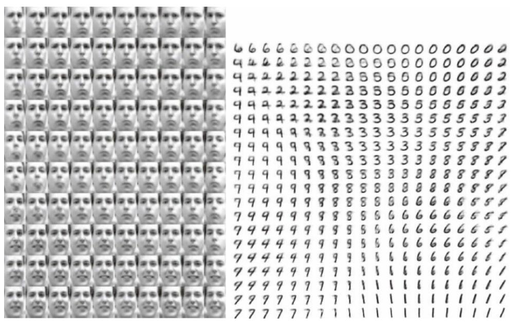  
图20.6 由变分自编码器学习的高维流形在二维坐标系中的示例（Kingma and Welling，

2014a）。我们可以在纸上直接绘制两个可视化的维度，因此可以使用二维潜在编码训练模型来了解模型的工作原理（即使我们认为数据流形的固有维度要高得多）。图中所示的图像不是来自训练集的样本，而是仅仅通过改变二维“编码” z，由模型 $\mathbf { p } ( \textbf { \em x } \mid \textbf { \em z } )$ )实际生成的图像 x（每个图像对应于“编码” z位于二维均匀网格的不同选择）。（左）Frey人脸流形的二维映射。其中一个维度（水平）已发现大致对应于面部的旋转，而另一个（垂直）对应于情绪表达。（右）MNIST流形的二维映射

## 20.10.4 生成式对抗网络

生成式对抗网络 （generative adversarial network，GAN）（Goodfellowet al. ，2014c）是基于可微生成器网络的另一种生成式建模方法。

生成式对抗网络基于博弈论场景，其中生成器网络必须与对手竞争。生成器网络直接产生样本 $\pmb { x } = g ( \pmb { z } ; \pmb { \theta } ^ { ( g ) } )$ 。其对手，判别器网络（discriminator network）试图区分从训练数据抽取的样本和从生成器抽取的样本。判别器发出由 $d ( \boldsymbol { x } ; \boldsymbol { \theta } ^ { ( d ) } )$ 给出的概率值，指示 x 是真实训练样本而不是从模型抽取的伪造样本的概率。

形式化表示生成式对抗网络中学习的最简单方式是零和游戏，其中函数$v ( { \pmb \theta } ^ { ( g ) } , { \pmb \theta } ^ { ( d ) } )$ 确定判别器的收益。生成器接收 $- v ( { \pmb \theta } ^ { ( g ) } , { \pmb \theta } ^ { ( d ) } )$ 作为它自己的收益。在学习期间，每个玩家尝试最大化自己的收益，因此收敛在

$$
g ^ {*} = \underset {g} {\arg \min} \underset {d} {\max} v (g, d)\tag{20.80}
$$

v的默认选择是

$$
v (\boldsymbol {\theta} ^ {(g)}, \boldsymbol {\theta} ^ {(d)}) = \mathbb {E} _ {\mathbf {x} \sim p _ {\mathrm{data}}} \log d (\boldsymbol {x}) + \mathbb {E} _ {\boldsymbol {x} \sim p _ {\mathrm{model}}} \log (1 - d (\boldsymbol {x}))\tag{20.81}
$$

这驱使判别器试图学习将样品正确地分类为真的或伪造的。同时，生成器试图欺骗分类器以让其相信样本是真实的。在收敛时，生成器的样本与实际数据不可区分，并且判别器处处都输出 $\frac 1 2$ 。然后就可以丢弃判别器。

设计GAN的主要动机是学习过程既不需要近似推断，也不需要配分函数梯度的近似。当 $\operatorname* { m a x } _ { \textrm { d } } \mathrm { v } ( g \ , d )$ 在 $\pmb { \theta } \left( \pmb { g } \right)$ 中是凸的（例如，在概率密度函数的空间中直接执行优化的情况）时，该过程保证收敛并且是渐近一致

的。

不幸的是，在实践中由神经网络表示的g和d以及max ν(g ,d) 不凸时，GAN中的学习可能是困难的。Goodfellow（2014）认为不收敛可能会引起GAN的欠拟合问题。一般来说，同时对两个玩家的成本梯度下降不能保证达到平衡。例如，考虑价值函数ν(a,b)＝ab，其中一个玩家控制a并产生成本ab，而另一玩家控制b并接收成本−ab。如果我们将每个玩家建模为无穷小的梯度步骤，每个玩家以另一个玩家为代价降低自己的成本，则a和b进入稳定的圆形轨迹，而不是到达原点处的平衡点。注意，极小极大化游戏的平衡不是ν的局部最小值。相反，它们是同时最小化的两个玩家成本的点。这意味着它们是ν的鞍点，相对于第一个玩家的参数是局部最小值，而相对于第二个玩家的参数是局部最大值。两个玩家可以永远轮流增加然后减少ν，而不是正好停在玩家没有能力降低其成本的鞍点。目前不知道这种不收敛的问题会在多大程度上影响GAN。

Goodfellow（2014）确定了另一种替代的形式化收益公式，其中博弈不再是零和，每当判别器最优时，具有与最大似然学习相同的预期梯度。因为最大似然训练收敛，这种GAN博弈的重述在给定足够的样本时也应该收敛。不幸的是，这种替代的形式化似乎并没有提高实践中的收敛，可能是由于判别器的次优性或围绕期望梯度的高方差。

在真实实验中，GAN博弈的最佳表现形式既不是零和，也不等价于最大似然，而是Good-fellow et al. （2014c）引入的带有启发式动机的不同形式化。在这种最佳性能的形式中，生成器旨在增加判别器发生错误的对数概率，而不是旨在降低判别器进行正确预测的对数概率。这种重述仅仅是观察的结果，即使在判别器确信拒绝所有生成器样本的情况下，它也能导致生成器代价函数的导数相对于判别器的对数保持很大。

稳定GAN学习仍然是一个开放的问题。幸运的是，当仔细选择模型架构和超参数时，GAN学习效果很好。Radford et al. （2015）设计了一个深度卷积GAN（DCGAN），在图像合成的任务上表现非常好，并表明其潜在的表示空间能捕获到变化的重要因素，如图15.9所示。图20.7展示了DCGAN生成器生成的图像示例。

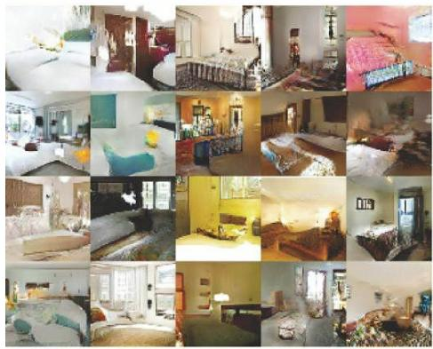

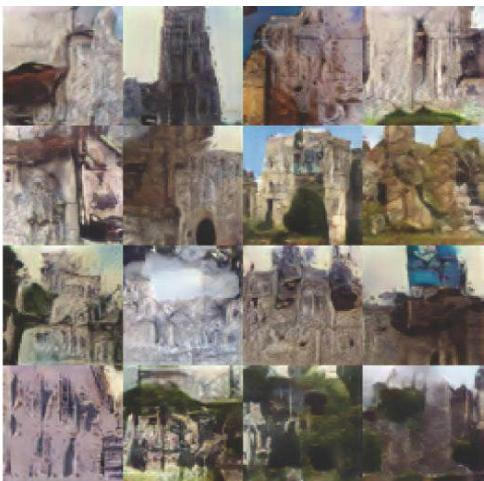  
图20.7在LSUN数据集上训练后，由GAN生成的图像。（左）由DCGAN模型生成的卧室图像，经Radford et al. （2015）许可转载。（右）由LAPGAN模型生成的教堂图像，经Denton et al.（2015）许可转载

GAN学习问题也可以通过将生成过程分成许多级别的细节来简化。我们可以训练有条件的GAN（Mirza and Osindero，2014），并学习从分布p(x ｜ y )中采样，而不是简单地从边缘分布p( x )中采样。Denton et al.（2015）表明一系列的条件GAN可以被训练为首先生成非常低分辨率的图像，然后增量地向图像添加细节。由于使用拉普拉斯金字塔来生成包含不同细节水平的图像，这种技术被称为LAPGAN模型。LAPGAN生成器不仅能够欺骗判别器网络，而且能够欺骗人类观察者，实验主体将高达40％的网络输出识别为真实数据。请看图20.7中LAPGAN生成器生成的图像示例。

GAN训练过程中一个不寻常的能力是它可以拟合向训练点分配零概率的概率分布。生成器网络学习跟踪特定点在某种程度上类似于训练点的流形，而不是最大化该点的对数概率。有点矛盾的是，这意味着模型可以将负无穷大的对数似然分配给测试集，同时仍然表示人类观察者判断为能捕获生成任务本质的流形。这不是明显的优点或缺点，并且只要向生成器网络最后一层所有生成的值添加高斯噪声，就可以保证生成器网络向所有点分配非零概率。以这种方式添加高斯噪声的生成器网络从相同分布中采样，即，从使用生成器网络参数化条件高斯分布的均值所获得的分布中采样。

Dropout似乎在判别器网络中很重要。特别地，在计算生成器网络的梯度时，单元应当被随机地丢弃。使用权重除以二的确定性版本的判别器其梯度似乎不是那么有效。同样，从不使用Dropout似乎会产生不良的结果。

虽然GAN框架被设计为用于可微生成器网络，但是类似的原理可以用于训练其他类型的模型。例如，自监督提升 （self-supervised boosting）可以用于训练RBM生成器以欺骗逻辑回归判别器（Welling et al.2002）。

## 20.10.5 生成矩匹配网络

生成矩匹配网络 （generative moment matching network）（Li et $a l .$ 2015；Dziugaite et al. ，2015）是另一种基于可微生成器网络的生成模型。与VAE和GAN不同，它们不需要将生成器网络与任何其他网络配对，例如不需要与用于VAE的推断网络配对，也不需要与GAN的判别器网络配对。

生成矩匹配网络使用称为矩匹配 （moment matching）的技术训练。矩匹配背后的基本思想是以如下的方式训练生成器——令模型生成的样本的许多统计量尽可能与训练集中的样本相似。在此情景下，矩

（moment）是对随机变量不同幂的期望。例如，第一矩是均值，第二矩是平方值的均值，以此类推。多维情况下，随机向量的每个元素可以被升高到不同的幂，因此使得矩可以是任意数量的形式

$$
\mathbb {E} _ {\boldsymbol {x}} \prod_ {i} x _ {i} ^ {n _ {i}}\tag{20.82}
$$

其中 $\pmb { n } = [ n _ { 1 } , n _ { 2 } , \cdots , n _ { d } ] ^ { \top }$ 是一个非负整数的向量。

在第一次检查时，这种方法似乎在计算上是不可行的。例如，如果我们想匹配形式为x x 的所有矩，那么我们需要最小化在x的维度上是二次 $\mathrm { i } ^ { \mathbf { X } } \mathrm { j }$ 的多个值之间的差。此外，甚至匹配所有第一和第二矩将仅足以拟合多变量高斯分布，其仅捕获值之间的线性关系。我们使用神经网络的野心是捕获复杂的非线性关系，这将需要更多的矩。GAN通过使用动态更新的判别器避免了穷举所有矩的问题，该判别器自动将其注意力集中在生成器网络最不匹配的统计量上。

相反，我们可以通过最小化一个被称为最大平均偏差 （maximum meandiscrepancy，MMD）（Schölkopf and Smola，2002；Gretton et al. ，2012）的代价函数来训练生成矩匹配网络。该代价函数通过向核函数定义的特征空间隐式映射，在无限维空间中测量第一矩的误差，使得对无限维向量的计算变得可行。当且仅当所比较的两个分布相等时，MMD代价为零。

从可视化方面看，来自生成矩匹配网络的样本有点令人失望。幸运的是，它们可以通过将生成器网络与自编码器组合来改进。首先，训练自编码器以重构训练集。接下来，自编码器的编码器用于将整个训练集转换到编码空间。然后训练生成器网络以生成编码样本，这些编码样本可以经解码器映射到视觉上令人满意的样本。

与GAN不同，代价函数仅关于一批同时来自训练集和生成器网络的实例定义。我们不可能将训练更新作为一个训练样本或仅来自生成器网络的一个样本的函数，这是因为必须将矩计算为许多样本的经验平均值。当批量大小太小时，MMD可能低估采样分布的真实变化量。有限的批量大小都不足以大到完全消除这个问题，但是更大的批量大小减少了低估的量。当批量大小太大时，训练过程就会慢得不可行，因为计算单个小梯度步长必须一下子处理许多样本。

与GAN一样，即使生成器网络为训练点分配零概率，也可以使用MMD训练生成器网络。

## 20.10.6 卷积生成网络

当生成图像时，将卷积结构引入生成器网络通常是有用的（见

Goodfellow et al. （2014c）或Dosovitskiy et al. （2015）的例子）。为此，我们使用卷积算子的“转置”，如第9.5节所述。这种方法通常能产生更逼真的图像，并且比不使用参数共享的全连接层使用更少的参数。

用于识别任务的卷积网络具有从图像到网络顶部的某些概括层（通常是类标签）的信息流。当该图像通过网络向上流动时，随着图像的表示变得对于有害变换保持不变，信息也被丢弃。在生成器网络中，情况恰恰相反。要生成图像的表示通过网络传播时必须添加丰富的详细信息，最后产生图像的最终表示，这个最终表示当然是带有所有细节的精细图像本身（具有对象位置、姿势、纹理以及明暗）。在卷积识别网络中丢弃信息的主要机制是池化层，而生成器网络似乎需要添加信息。由于大多数池化函数不可逆，我们不能将池化层求逆后放入生成器网络。更简单的操作是仅仅增加表示的空间大小。似乎可接受的方法是使用Dosovitskiy et al. （2015）引入的“去池化”。该层对应于某些简化条件下最大池化的逆操作。首先，最大池化操作的步幅被约束为等于池化区域的宽度。其次，每个池化区域内的最大输入被假定为左上角的输入。最后，假设每个池化区域内所有非最大的输入为零。这些是非常强和不现实的假设，但它们允许我们对最大池化算子求逆。去池化的逆操作分配一个零张量，然后将每个值从输入的空间坐标i复制到输出的空间坐标i×k。整数值k定义池化区域的大小。即使驱动去池化算子定义的假设是不现实的，后续层也能够学习补偿其不寻常的输出，所以由整体模型生成的样本在视觉上令人满意。

## 20.10.7 自回归网络

自回归网络是没有潜在随机变量的有向概率模型。这些模型中的条件概率分布由神经网络表示（有时是极简单的神经网络，例如逻辑回归）。这些模型的图结构是完全图。它们可以通过概率的链式法则分解观察变量上的联合概率，从而获得形如 $P ( x _ { d } \mid x _ { d - 1 } , \cdots , x _ { 1 } )$ 条件概率的乘积。这样的模型被称为完全可见的贝叶斯网络 （fully-visible Bayesnetworks，FVBN），并成功地以许多形式使用——首先是对每个条件分布逻辑回归（Frey，1998），然后是带有隐藏单元的神经网络（Bengio and Bengio，2000b；Larochelle and Murray，2011）。在某些形式的自回归网络中，例如在第20.10.10中描述的NADE（Larochelleand Murray，2011），我们可以引入参数共享的一种形式，它能带来统计优点（较少的唯一参数）和计算优势（较少计算量）。这是深度学习中反复出现的主题——特征重用的另一个实例。

## 20.10.8 线性自回归网络

自回归网络的最简单形式是没有隐藏单元、没有参数或特征共享的形式。每个 $P ( x _ { i } \mid x _ { i - 1 } , \cdots , x _ { 1 } )$ 被参数化为线性模型（对于实值数据的线性回归，对于二值数据的逻辑回归，对于离散数据的softmax回归）。这个模型由Frey（1998）引入，当有d个变量要建模时，该模型

有 $\mathcal { O } ( d ^ { 2 } )$ 个参数，如图20.8所示。

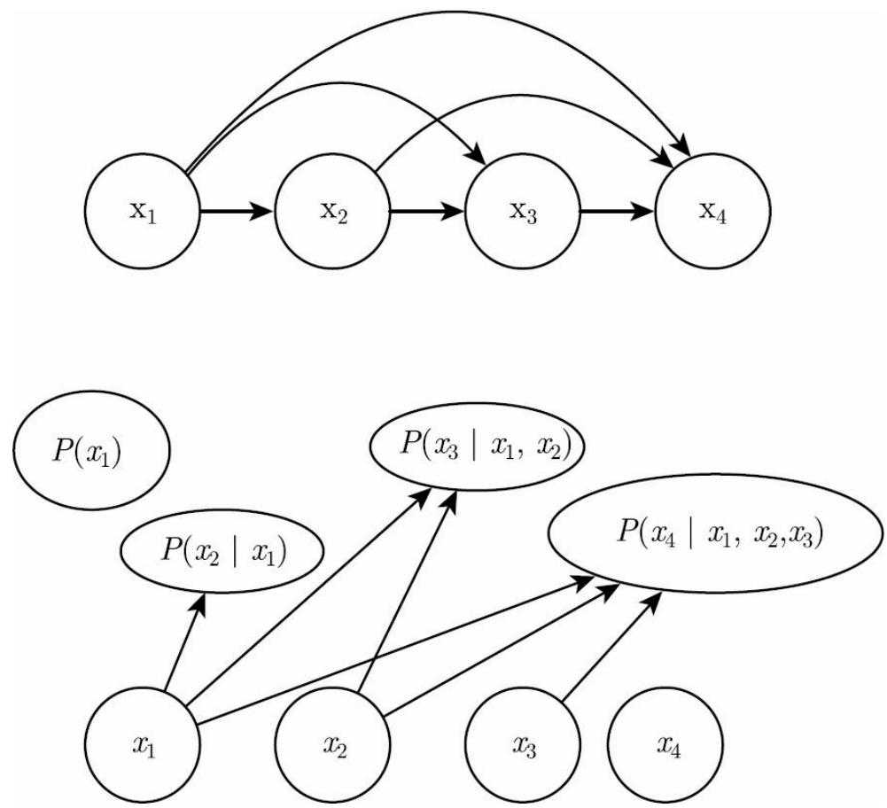  
图20.8 完全可见的信念网络从前i−1个变量预测第i个变量。（上）FVBN的有向图模型。（下）对数FVBN相应的计算图，其中每个预测由线性预测器作出

如果变量是连续的，线性自回归网络只是表示多元高斯分布的另一种方式，只能捕获观察变量之间线性的成对相互作用。

线性自回归网络本质上是线性分类方法在生成式建模上的推广。因此，它们具有与线性分类器相同的优缺点。像线性分类器一样，它们可以用凸损失函数训练，并且有时允许闭解形式（如在高斯情况下）。像线性分类器一样，模型本身不提供增加其容量的方法，因此必须使用其他技术（如输入的基扩展或核技巧）来提高容量。

## 20.10.9 神经自回归网络

神经自回归网络（Bengio and Bengio，2000a，b）具有与逻辑自回归网络相同的从左到右的图模型（见图20.8），但在该图模型结构内采用不同的条件分布参数。新的参数化更强大，它可以根据需要随意增加容量，并允许近似任意联合分布。新的参数化还可以引入深度学习中常见的参数共享和特征共享原理来改进泛化能力。设计这些模型的动机是避免传统表格图模型引起的维数灾难，并与图20.8共享相同的结构。在表格离散概率模型中，每个条件分布由概率表表示，其中所涉及的变量的每个可能配置都具有一个条目和一个参数。通过使用神经网络，可以获得两个优点。

（1）通过具有(i−1)×k个输入和k个输出的神经网络（如果变量是离散的并有k个值，使用one-hot编码）参数化每个 $P ( x _ { i } \mid x _ { i - 1 } , \cdots , x _ { 1 } )$ ，让我们不需要指数量级参数（和样本）的情况下就能估计条件概率，然而仍然能够捕获随机变量之间的高阶依赖性。

（2）不需要对预测每个x 使用不同的神经网络，如图20.9所示的从左到右连接，允许将所有神经网络合并成一个。等价地，它意味着为预测$\textbf { X } _ { \mathrm { i } }$ 所计算的隐藏层特征可以重新用于预测 $\mathrm { ~ \bf ~ x ~ } _ { \mathrm { i + k } } \mathrm { ~ \bf ~ ( ~ k > 0 ) ~ }$ 。因此隐藏单元被组织成第i组中的所有单元仅依赖于输入值x $\mathrm { ~  ~ \rho ~ } _ { 1 } \ \cdot \ \cdot \ \cdot \ \ \mathrm { ~ \bf ~ X ~ } \ \mathrm { ~  ~ i ~ }$ 的特定的组。用于计算这些隐藏单元的参数被联合优化以改进对序列中所有变量的预测。这是重用原理的一个实例，这是从循环和卷积网络架构到多任务和迁移学习的场景中反复出现的深度学习原理。

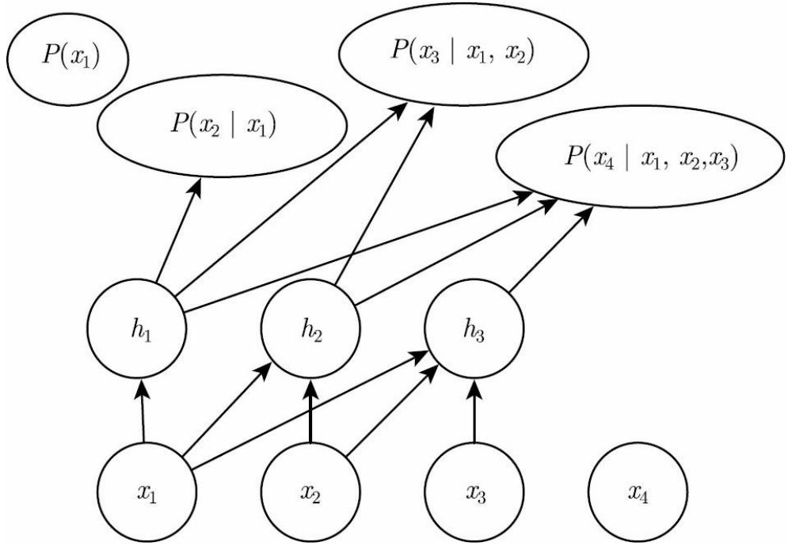

图20.9 神经自回归网络从前i−1个变量预测第i个变量 $\mathbf { x } _ { \mathrm { ~ i ~ } }$ ，但经参数化后，作为x $\mathbf { \psi } _ { 1 } , \dots , \mathbf { \psi } _ { \mathrm { ~ i ~ } }$ 函数的特征（表示为h $^ { 1 \mathrm { i } }$ 的隐藏单元的组）可以在预测所有后续变量x $\mathrm { i } { + } 1 \ , \ \mathrm { x } _ { \mathrm { i } + 2 } \ , \ \ldots , \ \mathrm { x } _ { \mathrm { d } }$ 时重用

如在第6.2.2.1节中讨论的，使神经网络的输出预测 $\textbf { X } _ { \mathrm { i } }$ 条件分布的参数，每个 $P ( x _ { i } | \ x _ { i - 1 } , \cdots , x _ { 1 } )$ 就可以表示一个条件分布。虽然原始神经自回归网络最初是在纯粹离散多变量数据（带有sigmoid输出的Bernoulli变量或softmax输出的Multinoulli变量）的背景下评估，但我们可以自然地将这样的模型扩展到连续变量或同时涉及离散和连续变量的联合分布。

## 20.10.10 NADE

神经自回归密度估计器 （neural auto-regressive density estimator，NADE）是最近非常成功的神经自回归网络的一种形式（Larochelle andMurray，2011）。与Bengio and Bengio（2000b）的原始神经自回归网络中的连接相同，但NADE引入了附加的参数共享方案，如图20.10所示。不同组j的隐藏单元的参数是共享的。

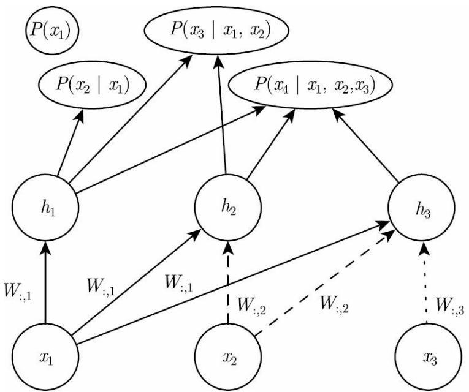  
图20.10 神经自回归密度估计器（NADE）的示意图。隐藏单元被组织在组 $_ h ^ { ( j ) }$ 中，使得只有输 $\lambda { \bf x } _ { 1 } , . . . , \mathrm { ~ x ~ } _ { \mathrm { i } }$ 参与计算 $\mathbf { \Omega } _ { h } \left( \dot { \mathbf { \Omega } } \right)$ 和预测 $P ( x _ { j } \mid x _ { j - 1 } , \cdot \cdot \cdot , x _ { 1 } )$ （对于j＞i）。NADE用特定的权重共享模式区别于早期的神经自回归网络： $W _ { j , k , i } ^ { ' } = W _ { k , i }$ 被共享于所有从 $. \mathrm { ~ x ~ i ~ }$ 到任

何j≥i组中第k个单元的权重（在图中使用相同的线型表示复制权重的每个实例）。注意向量$( W _ { 1 , i } , W _ { 2 , i } , \cdots , W _ { n , i } )$ 记为 $W$ :, i

从第i个输入 $\mathbf { \nabla } _ { X } \mathbf { _ { i } }$ 到第j组隐藏单元的第k个元素 $h _ { k } ^ { ( j ) } \left( j \geqslant i \right)$ 的权重 $\boldsymbol { W } _ { j , \boldsymbol { k } , i } ^ { \prime }$ 是组内共享的：

$$
W _ {j, k, i} ^ {\prime} = W _ {k, i}\tag{20.83}
$$

其余 $\mathrm { j } { < } \mathrm { i }$ 的权重为0。

Larochelle and Murray（2011）选择了这种共享方案，使得NADE模型中的正向传播与在均匀场推断中执行的计算大致相似，以填充RBM中缺失的输入。这个均匀场推断对应于运行具有共享权重的循环网络，并且该推断的第一步与NADE中的相同。使用NADE的唯一区别是，连接隐藏单元到输出的输出权重独立于连接输入单元和隐藏单元的权重进行参数化。在RBM中，隐藏到输出的权重是输入到隐藏权重的转置。NADE架构可以扩展为不仅仅模拟均匀场循环推断的一个时间步，而是k步。这种方法称为NADE-k（Raiko et al. ，2014）。

如前所述，自回归网络可以被扩展成处理连续数据。用于参数化连续密度的特别强大和通用的方法是混合权重为 ${ \sf I d }$ （组i的系数或先验概率），每组条件均值为 $\mu _ { \mathrm { ~ i ~ } }$ 和每组条件方差为 $\sigma _ { i } ^ { 2 }$ 的高斯混合体。一个称为RNADE的模型（Uria et al. ，2013）使用这种参数化将NADE扩展到实值。与其他混合密度网络一样，该分布的参数是网络的输出，由softmax单元产生混合的权量概率以及参数化的方差，因此可使它们为正的。由于条件均值 $\overset { \cdot } { \mu }$ 和条件方差 $\cdot \sigma _ { i } ^ { 2 }$ 之间的相互作用，随机梯度下降在数值上可能会表现不好。为了减少这种困难，Uria et al. （2013）在后向传播阶段使用伪梯度代替平均值上的梯度。

另一个非常有趣的神经自回归架构的扩展摆脱了为观察到的变量选择任意顺序的需要（Murray and Larochelle，2014）。在自回归网络中，该想法是训练网络能够通过随机采样顺序来处理任何顺序，并将信息提供给指定哪些输入被观察的隐藏单元（在条件条的右侧），以及哪些是被预测并因此被认为是缺失的（在条件条的左侧）。这是不错的性质，因为它允许人们非常高效地使用训练好的自回归网络来执行任何推断问题（即从给定任何变量的子集，从任何子集上的概率分布预测或采样）。

最后，由于变量的许多顺序是可能的（对于n个变量是n!），并且变量的每个顺序 $\mathbf { \vec { 0 } } \mathbf { \vec { \Gamma } } ^ { \bullet }$ 生不同的 $\ p ( \textbf { x } \mid \mathbf { \sigma } _ { 0 } )$ ，我们可以组成许多o值模型的集成：

$$
p _ {\mathrm{ensemble}} (\mathbf {x}) = \frac {1}{k} \sum_ {i = 1} ^ {k} p (\mathbf {x} \mid o ^ {(i)})\tag{20.84}
$$

这个集成模型通常能更好地泛化，并且为测试集分配比单个排序定义的单个模型更高的概率。

在同一篇文章中，作者提出了深度版本的架构，但不幸的是，这立即使计算成本像原始神经自回归网络一样高（Bengio and Bengio，2000b）。第一层和输出层仍然可以在 $\mathcal { O } ( n h )$ 的乘法-加法操作中计算，如在常规NADE中，其中h是隐藏单元的数量（图20.10和图20.9中的组 $\mathrm { ~ h ~ } _ { \mathrm { i } }$ 的大小），而它在Bengio and Bengio（2000b）中是 $O ( n ^ { 2 } h )$ 然而，对于其他隐藏层的计算量是 $\mathcal { O } ( n ^ { 2 } h ^ { 2 } )$ （假设在每个层存在n组h个隐藏单元，且在l层的每个“先前”组参与预测l＋1层处的“下一个”组）。如在Murray and Larochelle（2014）中，使l＋1层上的第i个组仅取决于第i个组，l层处的计算量将减少到 $\mathcal { O } ( n h ^ { 2 } )$ ，但仍然比常规NADE差h倍。

## 20.11 从自编码器采样

在第14章中，我们看到许多种学习数据分布的自编码器。得分匹配、去噪自编码器和收缩自编码器之间有着密切的联系。这些联系表明某些类型的自编码器以某些方式学习数据分布。我们还没有讨论如何从这样的模型中采样。

某些类型的自编码器，例如变分自编码器，明确地表示概率分布并且允许直接的原始采样。而大多数其他类型的自编码器则需要MCMC采样。

收缩自编码器被设计为恢复数据流形切面的估计。这意味着使用注入噪声的重复编码和解码将引起沿着流形表面的随机游走（Rifai et al. ，2012；Mesnil $e t a l .$ ，2012）。这种流形扩散技术是马尔可夫链的一种。

更一般的马尔可夫链还可以从任何去噪自编码器中采样。

## 20.11.1 与任意去噪自编码器相关的马尔可夫链

上述讨论留下了一个开放问题——注入什么噪声和从哪获得马尔可夫链（可以根据自编码器估计的分布生成样本）。Bengio et al. （2013c）展示了如何构建这种用于广义去噪自编码器 （generalized denoisingautoencoder）的马尔可夫链。广义去噪自编码器由去噪分布指定，给定损坏输入后，对干净输入的估计进行采样。

根据估计分布生成的马尔可夫链的每个步骤由以下子步骤组成，如图20.11所示。

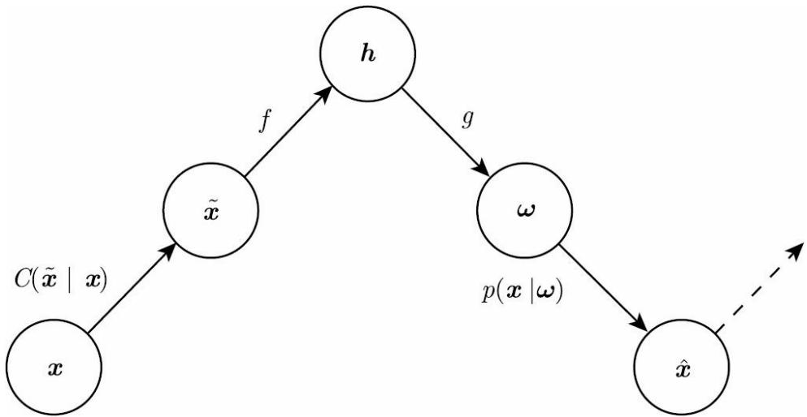  
图20.11 马尔可夫链的每个步骤与训练好的去噪自编码器相关联，根据由去噪对数似然准则隐式训练的概率模型生成样本。每个步骤包括：（a）通过损坏过程C向状态 x注入噪声产生 $\tilde { x }$ （b）用函数f对其编码，产生 $h = f ( { \tilde { x } } )$ ；（c）用函数g解码结果，产生用于重构分布的参数 $w$ ；（d）给定 $w$ ，从重构分布 $p ( \mathbf { x } \mid \omega = g ( f ( \tilde { \mathbf { x } } ) ) )$ 采样新状态。在典型的方重构误差情况下， $g ( h ) = \hat { x }$ ，并估计 $\mathbb { E } [ \boldsymbol { x } \mid \tilde { \boldsymbol { x } } ]$ ，损坏包括添加高斯噪声，并且从$p ( \mathbf { x } | \boldsymbol { \omega } )$ 的采样包括第二次向重构 $\hat { \boldsymbol { x } }$ 添加高斯噪声。后者的噪声水平应对应于重构的均方误差，而注入的噪声是控制混合速度以及估计器平滑经验分布程度的超参数（Vincent，2011）。在所示的例子中，只有C和p条件是随机步骤（f和 $\mathbf { l } _ { \mathbf { \mathbf { g } } }$ 是确定性计算），我们也可以在自编码器内部注入噪声，如生成随机网络（Bengio etal.，2014）

（1）从先前状态x开始，注入损坏噪声，从 $C ( \tilde { \boldsymbol { x } } \mid \boldsymbol { x } )$ 中采样 $\tilde { \mathbfit { x } }$ 。

（2）将 $\tilde { \mathbfit { x } }$ 编码为 $h = f ( \tilde { \boldsymbol { x } } )$ o

（3）解码h以获得 $p ( \mathbf { x } \mid \omega = g ( \boldsymbol { h } ) ) = p ( \mathbf { x } \mid \tilde { \boldsymbol { x } } )$ $\omega = g ( h )$

的参数

（4）从 $p ( \mathbf { x } \mid \omega = g ( \pmb { h } ) ) = p ( \mathbf { x } \mid \tilde { \pmb { x } } )$ 采样下一状态 x 。

Bengio et al. （2014）表明，如果自编码器 $p ( \mathbf { x } \mid \tilde { \mathbf { x } } )$ 形成对应真实条件分布的一致估计量，则上述马尔可夫链的平稳分布形成数据生成分布x的一致估计量（虽然是隐式的）。

## 20.11.2 夹合与条件采样

与玻尔兹曼机类似，去噪自编码器及其推广（例如下面描述的GSN）可用于从条件分布 $p ( \mathbf { x } _ { f } \mid \mathbf { x } _ { o } )$ 中采样，只需夹合观察单元x 并在给定x和采好的潜变量（如果有的话）下仅重采样自由单元x 。例如，MP-DBM可以被解释为去噪自编码器的一种形式，并且能够采样丢失的输入。GSN随后将MP-DBM中的一些想法推广以执行相同的操作（Bengioet al. ，2014）。Alain et al. （2015）从Bengio et al. （2014）的命题1中发现了一个缺失条件，即转移算子（由从链的一个状态到下一个状态的随机映射定义）应该满足细致平衡 （detailed balance）的属性，表明无论转移算子正向或反向运行，马尔可夫链都将保持平衡。

在图20.12中展示了夹合一半像素（图像的右部分）并在另一半上运行马尔可夫链的实验。

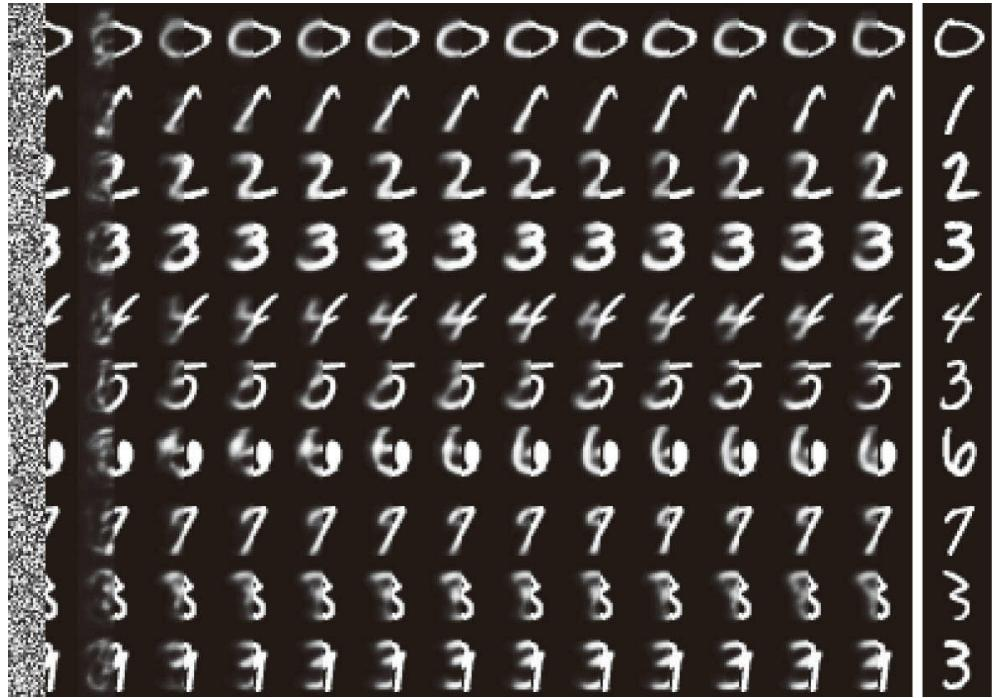  
图20.12 在每步仅重采样左半部分，夹合图像的右半部分并运行马尔可夫链的示意图。这些样本来自重构MNIST数字的GSN（每个时间步使用回退过程）

## 20.11.3 回退训练过程

回退训练过程由Bengio et al. （2013c）等人提出，作为一种加速去噪自编码器生成训练收敛的方法。不像执行一步编码-解码重建，该过程有代替的多个随机编码-解码步骤组成（如在生成马尔可夫链中），以训练样本初始化（正如在第18.2节中描述的对比散度算法），并惩罚最后的概率重建（或沿途的所有重建）。

训练k个步骤与训练一个步骤是等价的（在实现相同稳态分布的意义上），但是实际上可以更有效地去除来自数据的伪模式。

## 20.12 生成随机网络

生成随机网络 （generative stochastic network，GSN）（Bengio et al. ，2014）是去噪自编码器的推广，除可见变量（通常表示为x ）之外，在生成马尔可夫链中还包括潜变量h。

GSN由两个条件概率分布参数化，指定马尔可夫链的一步。

（1） $p ( \mathbf { x } ^ { ( k ) } \mid \mathbf { h } ^ { ( k ) } )$ 指示在给定当前潜在状态下如何产生下一个可见变量。这种“重建分布”也可以在去噪自编码器、RBM、DBN和DBM中找到。

（2） $p ( \mathbf { h } ^ { ( k ) } \mid \mathbf { h } ^ { ( k - 1 ) } , \mathbf { x } ^ { ( k - 1 ) } )$ 指示在给定先前的潜在状态和可见变量下如何更新潜在状态变量。

去噪自编码器和GSN不同于经典的概率模型（有向或无向），它们自己参数化生成过程，而不是通过可见和潜变量的联合分布的数学形式。相反，后者如果存在则隐式地定义为生成马尔可夫链的稳态分布。存在稳态分布的条件是温和的，并且需要与标准MCMC方法相同的条件（见第17.3节）。这些条件是保证链混合的必要条件，但它们可能被某些过渡分布的选择（例如，如果它们是确定性的）所违反。

我们可以想象GSN不同的训练准则。由Bengio et al. （2014）提出和评估的只对可见单元上对数概率的重建，如应用于去噪自编码器。通过将 ${ \bf \nabla } \cdot { \bf x } \left(                0 \right) = x$ 夹合到观察到的样本并且在一些后续时间步处使生成 x 的概率最大化，即最大化 $\log p ( \mathbf { x } ^ { ( k ) } = x \mid \mathbf { h } ^ { ( k ) } )$ ，其中给定 $\mathbf { x } ^ { ( 0 ) } = x$ 后，h (k) 从链中采样。为了估计相对于模型其他部分的$\log p ( \mathbf { x } ^ { ( k ) } = x \mid \mathbf { h } ^ { ( k ) } )$ 的梯度，Bengio et al. （2014）使用了在第20.9节中介绍的重参数化技巧。

回退训练过程（在第20.11.3节中描述）可以用来改善训练GSN的收敛性（Bengio et al. ，2014）。

## 20.12.1 判别性GSN

GSN的原始公式（Bengio et al. ，2014）用于无监督学习和对观察数据x的p(x )的隐式建模，但是我们可以修改框架来优化p(y ｜ x )。

例如，Zhou and Troyanskaya（2014）以如下方式推广GSN：只反向传播输出变量上的重建对数概率，并保持输入变量固定。他们将这种方式成功应用于建模序列（蛋白质二级结构），并在马尔可夫链的转换算子中引入（一维）卷积结构。重要的是要记住，对于马尔可夫链的每一步，我们需要为每个层生成新序列，并且该序列用于在下一时间步计算其他层的值（例如下面一个和上面一个）的输入。

因此，马尔可夫链确实不只是输出变量（与更高层的隐藏层相关联），并且输入序列仅用于条件化该链，其中反向传播使得它能够学习输入序列如何条件化由马尔可夫链隐含表示的输出分布。因此这是在结构化输出中使用GSN的一个例子。

Zöhrer and Pernkopf（2014）引入了一个混合模型，通过简单地添加（使用不同的权重）监督和非监督成本即y 和x 的重建对数概率，组合了监督目标（如上面的工作）和无监督目标（如原始的GSN）。

Larochelle and Bengio（2008a）以前在RBM中就提出了这样的混合标准，他们展示了在这种方案下分类性能的提升。

## 20.13 其他生成方案

目前为止我们已经描述的方法，使用MCMC采样、原始采样或两者的一些混合来生成样本。虽然这些是生成式建模中最流行的方法，但它们绝不是唯一的方法。

Sohl-Dickstein et al. （2015）开发了一种基于非平衡热力学学习生成模型的扩散反演 （diffusion inversion）训练方案。该方法基于我们希望从中采样的概率分布具有结构的想法。这种结构会被递增地使概率分布具有更多熵的扩散过程逐渐破坏。为了形成生成模型，我们可以反过来运行该过程，通过训练模型逐渐将结构恢复到非结构化分布。通过迭代地应用使分布更接近目标分布的过程，我们可以逐渐接近该目标分布。在涉及许多迭代以产生样本的意义上，这种方法类似于MCMC方法。然而，模型被定义为由链的最后一步产生的概率分布。在这个意义上，没有由迭代过程诱导的近似。Sohl-Dickstein et al. （2015）介绍的方法也非常接近于去噪自编码器的生成解释（第20.11.1节）。与去噪自编码器一样，扩散反演训练一个尝试概率撤销添加噪声效果的转移算子。不同之处在于，扩散反演只需要消除扩散过程的一个步骤，而不是一直返回到一个干净的数据点。这解决了去噪自编码器的普通重建对数似然目标中存在的以下两难问题：小噪声的情况下学习者只能看到数据点附近的配置，而在大噪声的情况下，去噪自编码器被要求做几乎不可能的工作（因为去噪分布是高度复杂和多峰值的）。利用扩散反演目标，学习者可以更精确地学习数据点周围的密度形状，以及去除可能在远离数据点

处出现的假性模式。

样本生成的另一种方法是近似贝叶斯计算 （approximate Bayesiancomputation，ABC）框架（Rubin et al. ，1984）。在这种方法中，样本被拒绝或修改以使样本选定函数的矩匹配期望分布的那些矩。虽然这个想法与矩匹配一样使用样本的矩，但它不同于矩匹配，因为它修改样本本身，而不是训练模型来自动发出具有正确矩的样本。Bachman andPrecup（2015）展示了如何在深度学习的背景下使用ABC中的想法，即使用ABC来塑造GSN的MCMC轨迹。

我们期待更多等待发现的其他生成式建模方法。

## 20.14 评估生成模型

研究生成模型的研究者通常需要将一个生成模型与另一个生成模型比较，通常是为了证明新发明的生成模型比之前存在的模型更能捕获一些分布。

这可能是一个困难且微妙的任务。通常，我们不能实际评估模型下数据的对数概率，但仅可以评估一个近似。在这些情况下，重要的是思考和沟通清楚正在测量什么。例如，假设我们可以评估模型A对数似然的随机估计和模型B对数似然的确定性下界。如果模型A得分高于模型B，哪个更好？如果我们关心确定哪个模型具有分布更好的内部表示，我们实际上不能说哪个更好，除非我们有一些方法来确定模型B的边界有多松。然而，如果我们关心在实践中该模型能用得多好，例如执行异常检测，则基于特定于感兴趣的实际任务的准则，可以公平地说模型是更好的，例如基于排名测试样例和排名标准，如精度和召回率。

评估生成模型的另一个微妙之处是，评估指标往往是自身困难的研究问题。可能很难确定模型是否被公平比较。例如，假设我们使用AIS来估计log Z，以便为我们刚刚发明的新模型计算 $\log \tilde { p } ( \pmb { x } ) - \log Z$ AIS计算经济的实现可能无法找到模型分布的几种模式并低估Z，这将导致我们高估 $\log p ( { \pmb x } )$ 。因此可能难以判断高似然估计是否是良好模型或不好的AIS实现导致的结果。

机器学习的其他领域通常允许在数据预处理中有一些变化。例如，当比较对象识别算法的准确性时，通常可接受的是对每种算法略微不同地预处理输入图像（基于每种算法具有何种输入要求）。而因为预处理的变化，会导致生成式建模的不同，甚至非常小和微妙的变化也是完全不可接受的。对输入数据的任何更改都会改变要捕获的分布，并从根本上改变任务。例如，将输入乘以0.1将人为地将概率增加10倍。

预处理的问题通常在基于MNIST数据集上的生成模型产生，MNIST数据集是非常受欢迎的生成式建模基准之一。MNIST由灰度图像组成。一些模型将MNIST图像视为实向量空间中的点，而其他模型将其视为二值。还有一些将灰度值视为二值样本的概率。我们必须将实值模型仅与其他实值模型比较，二值模型仅与其他二值模型进行比较。否则，测量的似然性不在相同的空间。对于二值模型，对数似然可以最多为零，而对于实值模型，它可以是任意高的，因为它是关于密度的测度。在二值模型中，比较使用完全相同的二值化模型是重要的。例如，我们可以将0.5设为阈值后，将灰度像素二值化为0或1，或者通过由灰度像素强度给出样本为1的概率来采一个随机样本。如果我们使用随机二值化，我们可能将整个数据集二值化一次，或者我们可能为每个训练步骤采不同的随机样例，然后采多个样本进行评估。这三个方案中的每一个都会产生极不相同的似然数，并且当比较不同的模型时，两个模型使用相同的二值化方案来训练和评估是重要的。事实上，应用单个随机二值化步骤的研究者共享包含随机二值化结果的文件，使得基于二值化步骤的不同输出的结果没有差别。

因为从数据分布生成真实样本是生成模型的目标之一，所以实践者通常通过视觉检查样本来评估生成模型。在最好的情况下，这不是由研究人员本身，而是由不知道样品来源的实验受试者完成（Denton et al. ，2015）。不幸的是，非常差的概率模型可能会产生非常好的样本。验证模型是否仅复制一些训练示例的常见做法如图16.1所示。该想法是根据在 x 空间中的欧几里得距离，为一些生成的样本显示它们在训练集中的最近邻。此测试旨在检测模型过拟合训练集并仅再现训练实例的情况。甚至可能同时欠拟合和过拟合，但仍然能产生单独看起来好的样本。想象一下，生成模型用狗和猫的图像训练时，但只是简单地学习来重现狗的训练图像。这样的模型明显过拟合，因为它不能产生不在训练集中的图像，但是它也欠拟合，因为它不给猫的训练图像分配概率。然而，人类观察者将判断狗的每个个体图像都是高质量的。在这个简单的例子中，对于能够检查许多样本的人类观察者来说，确定猫的不存在是容易的。在更实际的设定中，在具有数万个模式的数据上训练后的生成模型可以忽略少数模式，并且人类观察者不能容易地检查或记住足够的图像以检测丢失的变化。

由于样本的视觉质量不是可靠的标准，所以当计算可行时，我们通常还评估模型分配给测试数据的对数似然。不幸的是，在某些情况下，似然性似乎不可能测量我们真正关心的模型的任何属性。例如，MNIST的实值模型可以将任意低的方差分配给从不改变的背景像素，获得任意高的似然。即使这不是一个非常有用的事情，检测这些常量特征的模型和算法也可以获得无限的奖励。实现接近负无穷代价的可能性存在于任何实值的最大似然问题中，但是对于MNIST的生成模型问题尤为严重，因为许多输出值是不需要预测的。这强烈地表明需要开发评估生成模型的其他方法。

Theis et al. （2015）回顾了评估生成模型所涉及的许多问题，包括上述的许多想法。他们强调了生成模型有许多不同的用途，并且指标的选择必须与模型的预期用途相匹配。例如，一些生成模型更好地为大多数真实的点分配高概率，而其他生成模型擅长于不将高概率分配给不真实的点。这些差异可能源于生成模型是设计为最小化

$D _ { \mathrm { K L } } ( p _ { \mathrm { d a t a } } | | p _ { \mathrm { m o d e l } } )$ 还是 $D _ { \mathrm { K L } } ( p _ { \mathrm { m o d e l } } | | p _ { \mathrm { d a t a } } )$ ，如图3.6所示。不幸的是，即使我们将每个指标的使用限制在最适合的任务上，目前使用的所有指标仍存在严重的缺陷。因此，生成式建模中最重要的研究课题之一，不仅仅是如何提升生成模型，事实上还包括了设计新的技术来衡量我们的进步。

## 20.15 结论

为了让模型理解基于给定训练数据表示的大千世界，训练具有隐藏单元的生成模型是一种有力方法。通过学习模型 $p _ { \mathrm { m o d e l } } ( x )$ 和表示$p _ { \mathrm { m o d e l } } ( h \mid x )$ ，生成模型可以解答x输入变量之间关系的许多推断问题，并且可以在不同层对h求期望来提供表示 x 的许多不同方式。生成模型可以为AI系统提供它们所要理解的、各种不同概念的框架，让它们有能力在面对不确定性的情况下推理这些概念。我们希望读者能够找到增强这些方法的新途径，并继续探究智能和学习背后原理的旅程。

## 参考文献

Abadi，M.，Agarwal，A.，Barham，P.，Brevdo，E.，Chen，Z.， Citro，C.，Corrado，G. S.，Davis，A.，Dean，J.，Devin，M.， Ghemawat，S.，Goodfellow，I.，Harp，A.，Irving，G.，Isard，M.， Jia，Y.，Jozefowicz，R.，Kaiser，L.，Kudlur，M.，Levenberg，J.， Mané，D.，Monga，R.，Moore，S.，Murray，D.，Olah，C.， Schuster，M.，Shlens，J.，Steiner，B.，Sutskever，I.，Talwar，K.， Tucker，P.，Vanhoucke，V.，Vasudevan，V.，Viégas，F.，Vinyals， O.，Warden，P.，Wattenberg，M.，Wicke，M.，Yu，Y.，and Zheng， X.（2015）. TensorFlow:Large-scale machine learning on heterogeneous systems. Software available from tensorflow.org.

Ackley，D. H.，Hinton，G. E.，and Sejnowski，T. J.（1985）. Alearning algorithm for Boltzmann machines. Cognitive Science ，9 ，147–169.

Alain，G. and Bengio，Y.（2013）. What regularized auto-encoders learn from the data generating distribution. In ICLR'2013，arXiv:1211.4246 .

Alain，G.，Bengio，Y.，Yao，L.，Éric Thibodeau-Laufer，Yosinski， J.，and Vincent，P.（2015）. GSNs: Generative stochastic networks. arXiv:1503.05571.

Anderson，E.（1935）. The Irises of the Gaspé Peninsula. Bulletin of theAmerican Iris Society ，59 ，2–5.

Ba，J.，Mnih，V.，and Kavukcuoglu，K.（2014）. Multiple object recognition with visual attention. arXiv:1412.7755 .

Bachman，P. and Precup，D.（2015）. Variational generative stochastic networks with collaborative shaping. In Proceedings of the 32nd International Conference on Machine Learning，ICML 2015，Lille， France，6-11 July 2015 ，pages 1964–1972.

Bacon，P.-L.，Bengio，E.，Pineau，J.，and Precup，D.（2015）. Conditional computation in neural networks using a decision-theoretic approach. In 2nd Multidisciplinary Conference on Rein-forcement Learning and Decision Making（RLDM 2015）

Bagnell，J. A. and Bradley，D. M.（2009）. Differentiable sparse coding. In NIPS'2009 ，pages 113–120.

Bahdanau，D.，Cho，K.，and Bengio，Y.（2015）. Neural machine translation by jointly learning to align and translate. In ICLR'2015， arXiv:1409.0473 .

Bahl，L. R.，Brown，P.，de Souza，P. V.，and Mercer，R. L.（1987）.Speech recognition with continuous-parameter hidden Markov models.Computer，Speech and Language ，2 ，219–234.

Baldi，P. and Hornik，K.（1989）. Neural networks and principal component analysis:Learning from examples without local minima. Neural Networks ，2 ，53–58.

Baldi，P.，Brunak，S.，Frasconi，P.，Soda，G.，and Pollastri，G. （1999）. Exploiting the past and the future in protein secondary structure prediction. Bioinformatics ，15 （11），937–946.

Baldi，P.，Sadowski，P.，and Whiteson，D.（2014）. Searching for exotic particles in high-energy physics with deep learning. Nature communications ，5 .

Ballard，D. H.，Hinton，G. E.，and Sejnowski，T. J.（1983）. Parallel vision computation. Nature .

Barlow，H. B.（1989）. Unsupervised learning. Neural Computation ，1，295–311.

Barron，A. E.（1993）. Universal approximation bounds for superpositions of a sigmoidal function. IEEE Trans. on Information Theory ，39 ，930– 945.

Bartholomew，D. J.（1987）. Latent variable models and factor analysis . Oxford University Press.

Basilevsky，A.（1994）. Statistical Factor Analysis and Related Methods:Theory and Applications . Wiley.

Bastien，F.，Lamblin，P.，Pascanu，R.，Bergstra，J.，Goodfellow， I.，Bergeron，A.，Bouchard，N.，Warde-Farley，D.，and Bengio，Y. （2012a）. Theano:new features and speed improvements. Submited to the Deep Learning and Unsupervised Feature Learning NIPS 2012 Workshop， http://www.iro.umontreal.ca/lisa/publications2/index.php/publications/show/5

Bastien，F.，Lamblin，P.，Pascanu，R.，Bergstra，J.，Goodfellow，I. J.，Bergeron，A.，Bouchard，N.，and Bengio，Y.（2012b）. Theano:new features and speed improvements. Deep Learning and Unsupervised Feature Learning NIPS 2012 Workshop.

Basu，S. and Christensen，J.（2013）. Teaching classification boundaries to humans. In AAAI'2013 .

Baxter，J.（1995）. Learning internal representations. In Proceedings of the 8th International Conference on Computational Learning Theory（COLT'95） ，pages 311–320，Santa Cruz，California. ACM Press.

Bayer，J. and Osendorfer，C.（2014）. Learning stochastic recurrent networks. ArXiv e-prints .

Becker，S. and Hinton，G.（1992）. A self-organizing neural network that discovers surfaces in random-dot stereograms. Nature ，355 ，161–163.

Behnke，S.（2001）. Learning iterative image reconstruction in the neural abstraction pyramid. Int. J. Computational Intelligence and Applications ，1 （4），427–438.

Beiu，V.，Quintana，J. M.，and Avedillo，M. J.（2003）. VLSI implementations of threshold logic-a comprehensive survey. Neural

Networks，IEEE Transactions on ，14 （5），1217–1243.

Belkin，M. and Niyogi，P.（2002）. Laplacian eigenmaps and spectral techniques for embedding and clustering. In T. Dietterich，S. Becker，and Z. Ghahramani，editors，Advances in Neural Information Processing Systems 14（NIPS'01） ，Cambridge，MA. MIT Press.

Belkin，M. and Niyogi，P.（2003a）. Laplacian eigenmaps fordimensionality reduction and data representation. Neural Computation ，15（6），1373–1396.

Belkin，M. and Niyogi，P.（2003b）. Using manifold structure for partially labeled classification. In S. Becker，S. Thrun，and K. Obermayer，editors，Advances in Neural Information Processing Systems 15（NIPS'02） ，Cambridge，MA. MIT Press.

Bengio，E.，Bacon，P.-L.，Pineau，J.，and Precup，D.（2015a）. Conditional computation in neural networks for faster models. arXiv:1511.06297.

Bengio，S. and Bengio，Y.（2000a）. Taking on the curse of dimensionality in joint distributions using neural networks. IEEE Transactions on Neural Networks，special issue on Data Mining and Knowledge Discovery ，11 （3），550–557.

Bengio，S.，Vinyals，O.，Jaitly，N.，and Shazeer，N.（2015b）. Scheduled sampling for sequence prediction with recurrent neural networks. Technical report，arXiv:1506.03099.

Bengio，Y.（1991）. Artificial Neural Networks and their Application to Sequence Recognition. Ph.D. thesis，McGill University ，（Computer Science），Montreal，Canada.

Bengio，Y.（2000）. Gradient-based optimization of hyperparameters.Neural Computation ，12 （8），1889–1900.

Bengio，Y.（2002）. New distributed probabilistic language models.

Technical Report 1215，Dept. IRO，Université de Montréal.

Bengio，Y.（2009）. Learning deep architectures for AI . Now Publishers.

Bengio，Y.（2013）. Deep learning of representations: looking forward. In Statistical Language and Speech Processing ，volume 7978 of Lecture Notes in Computer Science ，pages 1–37. Springer，also in arXiv at http://arxiv.org/abs/1305.0445.

Bengio，Y.（2015）. Early inference in energy-based models approximates back-propagation. Technical Report arXiv:1510.02777，Universite de Montreal.

Bengio，Y. and Bengio，S.（2000b）. Modeling high-dimensional discrete data with multi-layer neural networks. In NIPS 12 ，pages 400–406. MIT Press.

Bengio，Y. and Delalleau，O.（2009）. Justifying and generalizingcontrastive divergence. Neural Computation ，21 （6），1601–1621.

Bengio，Y. and Grandvalet，Y.（2004）. No unbiased estimator of the variance of k-fold cross-validation. In JML（1），pages 1089–1105.

Bengio，Y. and LeCun，Y.（2007a）. Scaling learning algorithms towards AI. In Large Scale Kernel Machines .

Bengio，Y. and LeCun，Y.（2007b）. Scaling learning algorithms towards AI. In L. Bottou，O. Chapelle，D. DeCoste，and J. Weston， editors，Large Scale Kernel Machines . MIT Press.

Bengio，Y. and Monperrus，M.（2005）. Non-local manifold tangent learning. In L. Saul，Y. Weiss，and L. Bottou，editors，Advances in Neural Information Processing Systems 17（NIPS'04） ，pages 129–136. MIT Press.

Bengio，Y. and Sénécal，J.-S.（2003）. Quick training of probabilistic neural nets by importance sampling. In Proceedings of AISTATS 2003 .

Bengio，Y. and Sénécal，J.-S.（2008）. Adaptive importance sampling to accelerate training of a neural probabilistic language model. IEEE Trans. Neural Networks ，19 （4），713–722.

Bengio，Y.，De Mori，R.，Flammia，G.，and Kompe，R.（1991）. Phonetically motivated acoustic parameters for continuous speech recognition using artificial neural networks. In Proceedings of EuroSpeech'91

Bengio，Y.，De Mori，R.，Flammia，G.，and Kompe，R.（1992）. Neural network-Gaussian mix-ture hybrid for speech recognition or density estimation. In NIPS 4 ，pages 175–182. Morgan Kaufmann.

Bengio，Y.，Frasconi，P.，and Simard，P.（1993）. The problem of learning long-term dependencies in recurrent networks. In IEEE International Conference on Neural Networks，pages 1183–1195 ，San Francisco. IEEE Press.（invited paper）.

Bengio，Y.，Simard，P.，and Frasconi，P.（1994a）. Learning longterm dependencies with gradient descent is difficult. IEEE Tr. Neural Nets .

Bengio，Y.，Simard，P.，and Frasconi，P.（1994b）. Learning longterm dependencies with gradient descent is difficult. IEEE Transactions on Neural Networks ，5 （2），157–166.

Bengio，Y.，Simard，P.，and Frasconi，P.（1994c）. Learning longterm dependencies with gradient descent is difficult. IEEE Transactions on Neural Networks ，5 （2），157–166.

Bengio，Y.，Latendresse，S.，and Dugas，C.（1999）. Gradient-based learning of hyper-parameters. In Learning Conference .

Bengio，Y.，Ducharme，R.，and Vincent，P.（2001a）. A neuralprobabilistic language model. In T. Leen，T. Dietterich，and V. Tresp，editors，Advances in Neural Information Processing Systems13（NIPS'00） ，pages 933–938. MIT Press.

Bengio，Y.，Ducharme，R.，and Vincent，P.（2001b）. A neural probabilistic language model. In T. K. Leen，T. G. Dietterich，and V. Tresp，editors，NIPS'2000 ，pages 932–938. MIT Press.

Bengio，Y.，Ducharme，R.，Vincent，P.，and Jauvin，C.（2003）. Aneural probabilistic language model. JMLR ，3 ，1137–1155.

Bengio，Y.，Delalleau，O.，and Le Roux，N.（2006a）. The curse of highly variable functions for local kernel machines. In NIPS'2005 .

Bengio，Y.，Larochelle，H.，and Vincent，P.（2006b）. Non-local manifold Parzen windows. In NIPS'2005 . MIT Press.

Bengio，Y.，Lamblin，P.，Popovici，D.，and Larochelle，H. （2007a）. Greedy layer-wise training of deep networks. In NIPS'2006 .

Bengio，Y.，Lamblin，P.，Popovici，D.，and Larochelle，H. （2007b）. Greedy layer-wise training of deep networks. In B. Schölkopf， J. Platt，and T. Hoffman，editors，Advances in Neural Information Processing Systems 19（NIPS'06） ，pages 153–160. MIT Press.

Bengio，Y.，Lamblin，P.，Popovici，D.，and Larochelle，H. （2007c）. Greedy layer-wise training of deep networks. In Adv. Neural Inf. Proc. Sys. 19 ，pages 153–160.

Bengio，Y.，Lamblin，P.，Popovici，D.，and Larochelle，H. （2007d）. Greedy layer-wise training of deep networks. In NIPS 19 ， pages 153–160. MIT Press.

Bengio，Y.，Louradour，J.，Collobert，R.，and Weston，J.（2009）. Curriculum learning. In ICML'09 . ACM.

Bengio，Y.，Mesnil，G.，Dauphin，Y.，and Rifai，S.（2013a）. Better mixing via deep representa-tions. In ICML'2013 .

Bengio，Y.，Léonard，N.，and Courville，A.（2013b）. Estimating or propagating gradients through stochastic neurons for conditional

computation. arXiv:1308.3432.

Bengio，Y.，Yao，L.，Alain，G.，and Vincent，P.（2013c）. Generalized denoising auto-encoders as generative models. In NIPS'2013 .

Bengio，Y.，Courville，A.，and Vincent，P.（2013d）. Representationlearning: A review and new perspectives. Pattern Analysis and MachineIntelligence，IEEE Transactions on ，35 （8），1798–1828.

Bengio，Y.，Thibodeau-Laufer，E.，Alain，G.，and Yosinski，J. （2014）. Deep generative stochastic networks trainable by backprop. In ICML'2014 .

Bennett，C.（1976）. Efficient estimation of free energy differences fromMonte Carlo data. Journal of Computational Physics ，22 （2），245–268.

Bennett，J. and Lanning，S.（2007）. The Netflix prize.

Berger，A. L.，Della Pietra，V. J.，and Della Pietra，S. A.（1996）. A maximum entropy approach to natural language processing. Computational Linguistics ，22 ，39–71.

Berglund，M. and Raiko，T.（2013）. Stochastic gradient estimate variance in contrastive diver-gence and persistent contrastive divergence. CoRR ，abs/1312.6002 .

Bergstra，J.（2011）. Incorporating Complex Cells into Neural Networks for Pattern Classification . Ph.D. thesis，Université de Montréal.

Bergstra，J. and Bengio，Y.（2009）. Slow，decorrelated features for pretraining complex cell-like networks. In NIPS 22 ，pages 99–107. MIT Press.

Bergstra，J. and Bengio，Y.（2011）. Random search for hyper-parameter optimization. The Learning Workshop ，Fort Lauderdale，Florida.

Bergstra，J. and Bengio，Y.（2012）. Random search for hyper-parameter

optimization. J. Machine Learning Res. ，13 ，281–305.

Bergstra，J.，Breuleux，O.，Bastien，F.，Lamblin，P.，Pascanu，R.，Desjardins，G.，Turian，J.，Warde-Farley，D.，and Bengio，Y.（2010a）. Theano: a CPU and GPU math expression compiler. InProceedings of the Python for Scientific Computing Conference（SciPy） .Oral Presentation.

Bergstra，J.，Breuleux，O.，Bastien，F.，Lamblin，P.，Pascanu，R.， Desjardins，G.，Turian，J.，Warde-Farley，D.，and Bengio，Y. （2010b）. Theano: a CPU and GPU math expression com-piler. In Proc. SciPy.

Bergstra，J.，Breuleux，O.，Bastien，F.，Lamblin，P.，Pascanu，R.，Desjardins，G.，Turian，J.，Warde-Farley，D.，and Bengio，Y.（2010c）. Theano:a CPU and GPU math expression compiler. InProceedings of the Python for Scientific Computing Conference（SciPy） .

Bergstra，J.，Bardenet，R.，Bengio，Y.，and Kégl，B.（2011）. Algorithms for hyper-parameter optimization. In NIPS'2011 .

Berkes，P. and Wiskott，L.（2005）. Slow feature analysis yields a richrepertoire of complex cell properties. Journal of Vision ，5 （6），579–602.

Bertsekas，D. P. and Tsitsiklis，J.（1996）. Neuro-Dynamic Programming . Athena Scientific.

Besag，J.（1975）. Statistical analysis of non-lattice data. The Statistician，24 （3），179–195.

Bishop，C. M.（1994）. Mixture density networks.

Bishop，C. M.（1995a）. Regularization and complexity control in feedforward networks. In Proceedings International Conference on Artificial Neural Networks ICANN'95 ，volume 1，page 141–148.

Bishop，C. M.（1995b）. Training with noise is equivalent to Tikhonov regularization. Neural Computation ，7 （1），108–116.

Bishop，C. M.（2006）. Pattern Recognition and Machine Learning . Springer.

Blum，A. L. and Rivest，R. L.（1992）. Training a 3-node neural network is NP-complete.

Blumer，A.，Ehrenfeucht，A.，Haussler，D.，and Warmuth，M. K.（1989）. Learnability and the Vapnik–Chervonenkis dimension. Journal ofthe ACM ，36 （4），865–929.

Bonnet，G.（1964）. Transformations des signaux aléatoires à travers les systèmes non linéaires sans mémoire. Annales des Télécommunications ，19 （9–10），203–220.

Bordes，A.，Weston，J.，Collobert，R.，and Bengio，Y.（2011）. Learning structured embeddings of knowledge bases. In AAAI 2011 .

Bordes，A.，Glorot，X.，Weston，J.，and Bengio，Y.（2012）. Joint learning of words and meaning representations for open-text semantic parsing. AISTATS'2012 .

Bordes，A.，Glorot，X.，Weston，J.，and Bengio，Y.（2013a）. A semantic matching energy func-tion for learning with multi-relational data. Machine Learning: Special Issue on Learning Semantics .

Bordes，A.，Usunier，N.，Garcia-Duran，A.，Weston，J.，and Yakhnenko，O.（2013b）. Translating embeddings for modeling multirelational data. In C. Burges，L. Bottou，M. Welling，Z. Ghahramani， and K. Weinberger，editors，Advances in Neural Information Processing Systems 26 ，pages 2787–2795. Curran Associates，Inc.

Bornschein，J. and Bengio，Y.（2015）. Reweighted wake-sleep. In ICLR'2015，arXiv:1406.2751 .

Bornschein，J.，Shabanian，S.，Fischer，A.，and Bengio，Y.（2015）. Training bidirectional Helmholtz machines. Technical report， arXiv:1506.03877.

Boser，B. E.，Guyon，I. M.，and Vapnik，V. N.（1992）. A training algorithm for optimal margin classifiers. In COLT '92: Proceedings of thefifth annual workshop on Computational learning theory ，pages 144–152，New York，NY，USA. ACM.

Bottou，L.（1998）. Online algorithms and stochastic approximations. In D. Saad，editor，Online Learning in Neural Networks . Cambridge University Press，Cambridge，UK.

Bottou，L.（2011）. From machine learning to machine reasoning. Technical report，arXiv.1102.1808.

Bottou，L.（2015）. Multilayer neural networks. Deep Learning Summer School.

Bottou，L. and Bousquet，O.（2008a）. The tradeoffs of large scale learning. In J. Platt，D. Koller，Y. Singer，and S. Roweis，editors， Advances in Neural Information Processing Systems 20（NIPS'07） volume 20. MIT Press，Cambridge，MA.

Bottou，L. and Bousquet，O.（2008b）. The tradeoffs of large scale learning. In NIPS'2008 .

Boulanger-Lewandowski，N.，Bengio，Y.，and Vincent，P.（2012）. Modeling temporal dependen-cies in high-dimensional sequences: Application to polyphonic music generation and transcrip-tion. In ICML'12 .

Boureau，Y.，Ponce，J.，and LeCun，Y.（2010）. A theoretical analysis of feature pooling in vision algorithms. In Proc. International Conference on Machine learning（ICML'10）

Boureau，Y.，Le Roux，N.，Bach，F.，Ponce，J.，and LeCun，Y. （2011）. Ask the locals: multi-way local pooling for image recognition. In

Proc. International Conference on Computer Vision（ICCV'11） . IEEE.

Bourlard，H. and Kamp，Y.（1988）. Auto-association by multilayer perceptrons and singular value decomposition. Biological Cybernetics ，59 ，291–294.

Bourlard，H. and Wellekens，C.（1989）. Speech pattern discrimination and multi-layered percep-trons. Computer Speech and Language ，3 ，1–19.

Boyd，S. and Vandenberghe，L.（2004）. Convex Optimization Cambridge University Press，New York，NY，USA.

Brady，M. L.，Raghavan，R.，and Slawny，J.（1989）. Back-propagation fails to separate where perceptrons succeed. IEEE Transactionson Circuits and Systems ，36 （5），665–674.

Brakel，P.，Stroobandt，D.，and Schrauwen，B.（2013）. Training energy-based models for time-series imputation. Journal of Machine Learning Research ，14 ，2771–2797.

Brand，M.（2003a）. Charting a manifold. In S. Becker，S. Thrun，andK. Obermayer，editors，Advances in Neural Information ProcessingSystems 15（NIPS'02） ，pages 961–968. MIT Press.

Brand，M.（2003b）. Charting a manifold. In NIPS'2002 ，pages 961–968. MIT Press.

Breiman，L.（1994）. Bagging predictors. Machine Learning ，24（2），123–140.

Breiman，L.，Friedman，J. H.，Olshen，R. A.，and Stone，C. J. （1984）. Classification and Regression Trees . Wadsworth International Group，Belmont，CA.

Bridle，J. S.（1990）. Alphanets: a recurrent ‘neural’ network architecture with a hidden Markov model interpretation. Speech Communication ，9 （1），83–92.

Briggman，K.，Denk，W.，Seung，S.，Helmstaedter，M. N.，and Turaga，S. C.（2009）. Maximin affinity learning of image segmentation. In NIPS'2009 ，pages 1865–1873.

Brown，P. F.，Cocke，J.，Pietra，S. A. D.，Pietra，V. J. D.，Jelinek，F.，Lafferty，J. D.，Mercer，R. L.，and Roossin，P. S.（1990）. Astatistical approach to machine translation. Computational linguistics ，16（2），79–85.

Brown，P. F.，Pietra，V. J. D.，DeSouza，P. V.，Lai，J. C.，andMercer，R. L.（1992）. Class-based n -gram models of natural language.Computational Linguistics ，18 ，467–479.

Bryson，A. and Ho，Y.（1969）. Applied optimal control: optimization， estimation，and control . Blaisdell Pub. Co.

Bryson，Jr.，A. E. and Denham，W. F.（1961）. A steepest-ascent method for solving optimum programming problems. Technical Report BR-1303，Raytheon Company，Missle and Space Division.

Buciluǎ，C.，Caruana，R.，and Niculescu-Mizil，A.（2006）. Model compression. In Proceedings of the 12th ACM SIGKDD international conference on Knowledge discovery and data mining ，pages 535–541. ACM.

Burda，Y.，Grosse，R.，and Salakhutdinov，R.（2015）. Importance weighted autoencoders. arXiv preprint arXiv:1509.00519 .

Cai，M.，Shi，Y.，and Liu，J.（2013）. Deep maxout neural networksfor speech recognition. In Automatic Speech Recognition andUnderstanding（ASRU），2013 IEEE Workshop on ，pages 291–296.IEEE.

Carreira-Perpiñan，M. A. and Hinton，G. E.（2005）. On contrastive divergence learning. In AISTATS'2005 ，pages 33–40.

Caruana，R.（1993）. Multitask connectionist learning. In Proceedings of

the 1993 Connectionist Models Summer School ，pages 372–379.

Cauchy，A.（1847）. Méthode générale pour la résolution de systèmes d'équations simultanées. In Compte rendu des séances de l'académie des sciences ，pages 536–538.

Cayton，L.（2005）. Algorithms for manifold learning. Technical Report CS2008-0923，UCSD.

Chandola，V.，Banerjee，A.，and Kumar，V.（2009）. Anomalydetection: A survey. ACM computing surveys（CSUR） ，41 （3），15.

Chapelle，O.，Weston，J.，and Schölkopf，B.（2003）. Cluster kernels for semi-supervised learning. In S. Becker，S. Thrun，and K. Obermayer， editors，Advances in Neural Information Processing Systems 15（NIPS'02） ，pages 585–592，Cambridge，MA. MIT Press.

Chapelle，O.，Schölkopf，B.，and Zien，A.，editors（2006）. Semi-Supervised Learning . MIT Press，Cambridge，MA.

Chellapilla，K.，Puri，S.，and Simard，P.（2006）. High Performance Convolutional Neural Net-works for Document Processing. In Guy Lorette， editor，Tenth International Workshop on Frontiers in Handwriting Recognition ，La Baule（France）. Université de Rennes 1，Suvisoft. http://www.suvisoft.com.

Chen，B.，Ting，J.-A.，Marlin，B. M.，and de Freitas，N.（2010）. Deep learning of invariant spatio-temporal features from video. NIPS\*2010 Deep Learning and Unsupervised Feature Learning Workshop.

Chen，S. F. and Goodman，J. T.（1999）. An empirical study ofsmoothing techniques for language modeling. Computer，Speech andLanguage ，13 （4），359–393.

Chen，T.，Du，Z.，Sun，N.，Wang，J.，Wu，C.，Chen，Y.，and Temam，O.（2014a）. DianNao: A small-footprint high-throughput accelerator for ubiquitous machine-learning. In Proceedings of the 19th

international conference on Architectural support for programming languages and operating systems ，pages 269–284. ACM.

Chen，T.，Li，M.，Li，Y.，Lin，M.，Wang，N.，Wang，M.， Xiao，T.，Xu，B.，Zhang，C.，and Zhang，Z.（2015）. MXNet: A flexible and efficient machine learning library for heterogeneous distributed systems. arXiv preprint arXiv:1512.01274 .

Chen，Y.，Luo，T.，Liu，S.，Zhang，S.，He，L.，Wang，J.，Li，L.，Chen，T.，Xu，Z.，Sun，N.，et al. （2014b）. DaDianNao: Amachine-learning supercomputer. In Microarchitecture（MICRO），201447th Annual IEEE/ACM International Symposium on ，pages 609–622.IEEE.

Chilimbi，T.，Suzue，Y.，Apacible，J.，and Kalyanaraman，K. （2014）. Project Adam: Building an efficient and scalable deep learning training system. In 11th USENIX Symposium on Operating Systems Design and Implementation（OSDI'14）

Cho，K.，Raiko，T.，and Ilin，A.（2010a）. Parallel tempering is efficient for learning restricted Boltzmann machines. In Proceedings of the International Joint Conference on Neural Networks（IJCNN 2010） ， Barcelona，Spain.

Cho，K.，Raiko，T.，and Ilin，A.（2010b）. Parallel tempering is efficient for learning restricted Boltzmann machines. In IJCNN'2010.

Cho，K.，Raiko，T.，and Ilin，A.（2011）. Enhanced gradient and adaptive learning rate for training restricted Boltzmann machines. In ICML'2011 ，pages 105–112.

Cho，K.，Van Merriënboer，B.，Gülçehre，Ç.，Bahdanau，D.， Bougares，F.，Schwenk，H.，and Bengio，Y.（2014a）. Learning phrase representations using RNN encoder–decoder for statistical machine translation. In Proceedings of the 2014 Conference on Empirical Methods in Natural Language Processing（EMNLP） ，pages 1724–1734. Association for Computational Linguistics.

Cho，K.，van Merriënboer，B.，Gulcehre，C.，Bougares，F.， Schwenk，H.，and Bengio，Y.（2014b）. Learning phrase representations using RNN encoder-decoder for statistical machine translation. In Proceedings of the Empiricial Methods in Natural Language Processing（EMNLP 2014）

Cho，K.，Van Merriënboer，B.，Bahdanau，D.，and Bengio，Y. （2014c）. On the properties of neural machine translation: Encoder-decoder approaches. ArXiv e-prints ，abs/1409.1259 .

Choromanska，A.，Henaff，M.，Mathieu，M.，Arous，G. B.，and LeCun，Y.（2014）. The loss surface of multilayer networks.

Chorowski，J.，Bahdanau，D.，Cho，K.，and Bengio，Y.（2014）. End-to-end continuous speech recognition using attention-based recurrent NN: First results. arXiv:1412.1602.

Christianson，B.（1992）. Automatic Hessians by reverse accumulation.IMA Journal of Numerical Analysis ，12 （2），135–150.

Chrupala，G.，Kadar，A.，and Alishahi，A.（2015）. Learning language through pictures. arXiv 1506.03694.

Chung，J.，Gulcehre，C.，Cho，K.，and Bengio，Y.（2014）. Empirical evaluation of gated recurrent neural networks on sequence modeling. NIPS'2014 Deep Learning workshop，arXiv 1412.3555.

Chung，J.，Gülçehre，Ç.，Cho，K.，and Bengio，Y.（2015a）. Gated feedback recurrent neural networks. In ICML'15 .

Chung，J.，Kastner，K.，Dinh，L.，Goel，K.，Courville，A.，and Bengio，Y.（2015b）. A recurrent latent variable model for sequential data. In NIPS'2015 .

Ciresan，D.，Meier，U.，Masci，J.，and Schmidhuber，J.（2012）. Multi-column deep neural network for traffic sign classification. Neural Networks ，32 ，333–338.

Ciresan，D. C.，Meier，U.，Gambardella，L. M.，and Schmidhuber，J.（2010）. Deep big simple neural nets for handwritten digit recognition.Neural Computation ，22 ，1–14.

Coates，A. and Ng，A. Y.（2011）. The importance of encoding versus training with sparse coding and vector quantization. In ICML'2011 .

Coates，A.，Lee，H.，and Ng，A. Y.（2011）. An analysis of singlelayer networks in unsuper-vised feature learning. In Proceedings of the Thirteenth International Conference on Artificial Intelligence and Statistics（AISTATS 2011）

Coates，A.，Huval，B.，Wang，T.，Wu，D.，Catanzaro，B.，and Andrew，N.（2013）. Deep learning with COTS HPC systems. In S. Dasgupta and D. McAllester，editors，Proceedings of the 30th International Conference on Machine Learning（ICML-13） ，volume 28（3），pages 1337–1345. JMLR Workshop and Conference Proceedings.

Cohen，N.，Sharir，O.，and Shashua，A.（2015）. On the expressive power of deep learning: A tensor analysis. arXiv:1509.05009.

Collobert，R.（2004）. Large Scale Machine Learning . Ph.D. thesis， Université de Paris VI，LIP6.

Collobert，R.（2011）. Deep learning for efficient discriminative parsing. In AISTATS'2011 .

Collobert，R. and Weston，J.（2008a）. A unified architecture for natural language processing: Deep neural networks with multitask learning. In ICML'2008 .

Collobert，R. and Weston，J.（2008b）. A unified architecture for natural language processing: Deep neural networks with multitask learning. In ICML'2008 .

Collobert，R.，Bengio，S.，and Bengio，Y.（2001）. A parallel mixture of SVMs for very large scale problems. Technical Report 12，IDIAP.

Collobert，R.，Bengio，S.，and Bengio，Y.（2002）. Parallel mixture of SVMs for very large scale problem. Neural Computation .

Collobert，R.，Weston，J.，Bottou，L.，Karlen，M.，Kavukcuoglu，K.，and Kuksa，P.（2011a）. Natural language processing（almost）from scratch. The Journal of Machine Learning Research ，12 ，2493–2537.

Collobert，R.，Kavukcuoglu，K.，and Farabet，C.（2011b）. Torch7: A Matlab-like environment for machine learning. In BigLearn，NIPS Workshop .

Comon，P.（1994）. Independent component analysis-a newconcept？Signal Processing ，36 ，287–314.

Cortes，C. and Vapnik，V.（1995）. Support vector networks. MachineLearning ，20 ，273–297.

Couprie，C.，Farabet，C.，Najman，L.，and LeCun，Y.（2013）. Indoor semantic segmentation using depth information. In International Conference on Learning Representations（ICLR2013）

Courbariaux，M.，Bengio，Y.，and David，J.-P.（2015）. Low precision arithmetic for deep learning. In Arxiv:1412.7024，ICLR'2015 Workshop .

Courville，A.，Bergstra，J.，and Bengio，Y.（2011a）. Unsupervised models of images by spike-and-slab RBMs. In ICML'2011 .

Courville，A.，Bergstra，J.，and Bengio，Y.（2011b）. Unsupervised models of images by spike-and-slab RBMs. In ICM（1b）.

Courville，A.，Desjardins，G.，Bergstra，J.，and Bengio，Y.（2014）.The spike-and-slab RBM and extensions to discrete and sparse datadistributions. Pattern Analysis and Machine Intelligence，IEEETransactions on ，36 （9），1874–1887.

Cover，T. M. and Thomas，J. A.（2006）. Elements of Information

Theory，2nd Edition . Wiley-Interscience.

Cox，D. and Pinto，N.（2011）. Beyond simple features: A large-scale feature search approach to unconstrained face recognition. In Automatic Face & Gesture Recognition and Workshops（FG 2011），2011 IEEE International Conference on ，pages 8–15. IEEE.

Cramér，H.（1946）. Mathematical methods of statistics . Princeton University Press.

Crick，F. H. C. and Mitchison，G.（1983）. The function of dream sleep.Nature ，304 ，111–114.

Cybenko，G.（1989）. Approximation by superpositions of a sigmoidal function. Mathematics of Control，Signals，and Systems ，2 ，303–314.

Dahl，G. E.，Ranzato，M.，Mohamed，A.，and Hinton，G. E. （2010）. Phone recognition with the mean-covariance restricted Boltzmann machine. In Advances in Neural Information Processing Systems（NIPS）

Dahl，G. E.，Yu，D.，Deng，L.，and Acero，A.（2012）. Contextdependent pre-trained deep neural networks for large vocabulary speech recognition. IEEE Transactions on Audio，Speech，and Language Processing ，20 （1），33–42.

Dahl，G. E.，Sainath，T. N.，and Hinton，G. E.（2013）. Improving deep neural networks for LVCSR using rectified linear units and dropout. In ICASSP'2013 .

Dahl，G. E.，Jaitly，N.，and Salakhutdinov，R.（2014）. Multi-task neural networks for QSAR predictions. arXiv:1406.1231.

Dauphin，Y. and Bengio，Y.（2013）. Stochastic ratio matching of RBMs for sparse high-dimensional inputs. In NIP（1）.

Dauphin，Y.，Glorot，X.，and Bengio，Y.（2011）. Large-scale learning of embeddings with recon-struction sampling. In ICML'2011 .

Dauphin，Y.，Pascanu，R.，Gulcehre，C.，Cho，K.，Ganguli，S.， and Bengio，Y.（2014）. Identifying and attacking the saddle point problem in high-dimensional non-convex optimization. In NIPS'2014 .

Davis，A.，Rubinstein，M.，Wadhwa，N.，Mysore，G.，Durand，F.，and Freeman，W. T.（2014）. The visual microphone: Passive recovery ofsound from video. ACM Transactions on Graphics（Proc. SIGGRAPH），33 （4），79:1–79:10.

Dayan，P.（1990）. Reinforcement comparison. In Connectionist Models: Proceedings of the 1990 Connectionist Summer School ，San Mateo，CA.

Dayan，P. and Hinton，G. E.（1996）. Varieties of Helmholtz machine.Neural Networks ，9 （8），1385–1403.

Dayan，P.，Hinton，G. E.，Neal，R. M.，and Zemel，R. S.（1995）.The Helmholtz machine. Neural computation ，7 （5），889–904.

Dean，J.，Corrado，G.，Monga，R.，Chen，K.，Devin，M.，Le， Q.，Mao，M.，Ranzato，M.，Senior，A.，Tucker，P.，Yang，K.，and Ng，A. Y.（2012）. Large scale distributed deep networks. In NIPS'2012 .

Dean，T. and Kanazawa，K.（1989）. A model for reasoning aboutpersistence and causation. Computational Intelligence ，5 （3），142–150.

Deerwester，S.，Dumais，S. T.，Furnas，G. W.，Landauer，T. K.，andHarshman，R.（1990）. Indexing by latent semantic analysis. Journal of theAmerican Society for Information Science ，41 （6），391–407.

Delalleau，O. and Bengio，Y.（2011）. Shallow vs. deep sum-product networks. In NIPS .

Deng，J.，Dong，W.，Socher，R.，Li，L.-J.，Li，K.，and Fei-Fei，L. （2009）. ImageNet: A Large-Scale Hierarchical Image Database. In CVPR09 .

Deng，J.，Berg，A. C.，Li，K.，and Fei-Fei，L.（2010a）. What does

classifying more than 10，000 image categories tell us? In Proceedings of the 11th European Conference on Computer Vision: Part V ，ECCV'10， pages 71–84，Berlin，Heidelberg. Springer-Verlag.

Deng，L. and Yu，D.（2014）. Deep learning–methods and applications. Foundations and Trends in Signal Processing .

Deng，L.，Seltzer，M.，Yu，D.，Acero，A.，Mohamed，A.，and Hinton，G.（2010b）. Binary coding of speech spectrograms using a deep auto-encoder. In Interspeech 2010 ，Makuhari，Chiba，Japan.

Denil，M.，Bazzani，L.，Larochelle，H.，and de Freitas，N.（2012）. Learning where to attend with deep architectures for image tracking. Neural Computation ，24 （8），2151–2184.

Denton，E.，Chintala，S.，Szlam，A.，and Fergus，R.（2015）. Deep generative image models using a Laplacian pyramid of adversarial networks. NIPS .

Desjardins，G. and Bengio，Y.（2008）. Empirical evaluation of convolutional RBMs for vision. Technical Report 1327，Département d'Informatique et de Recherche Opérationnelle，Université de Montréal.

Desjardins，G.，Courville，A. C.，Bengio，Y.，Vincent，P.，and Delalleau，O.（2010）. Tempered Markov chain Monte Carlo for training of restricted Boltzmann machines. In International Conference on Artificial Intelligence and Statistics ，pages 145–152.

Desjardins，G.，Courville，A.，and Bengio，Y.（2011）. On tracking the partition function. In NIPS'2011 .

Devlin，J.，Zbib，R.，Huang，Z.，Lamar，T.，Schwartz，R.，and Makhoul，J.（2014）. Fast and robust neural network joint models for statistical machine translation. In Proc. ACL'2014 .

Devroye，L.（2013）. Non-Uniform Random Variate Generation SpringerLink: Bücher. Springer New York.

DiCarlo，J. J.（2013）. Mechanisms underlying visual object recognition:Humans vs. neurons vs. machines. NIPS Tutorial.

Dinh，L.，Krueger，D.，and Bengio，Y.（2014）. NICE: Non-linear independent components esti-mation. arXiv:1410.8516.

Donahue，J.，Hendricks，L. A.，Guadarrama，S.，Rohrbach，M.， Venugopalan，S.，Saenko，K.，and Darrell，T.（2014）. Long-term recurrent convolutional networks for visual recognition and description. arXiv:1411.4389.

Donoho，D. L. and Grimes，C.（2003）. Hessian eigenmaps: new locally linear embedding tech-niques for high-dimensional data. Technical Report 2003-08，Dept. Statistics，Stanford University.

Dosovitskiy，A.，Springenberg，J. T.，and Brox，T.（2015）. Learning to generate chairs with convolutional neural networks. In Proceedings of the IEEE Conference on Computer Vision and Pattern Recognition ，pages 1538–1546.

Doya，K.（1993）. Bifurcations of recurrent neural networks in gradient descent learning. IEEE Transactions on Neural Networks ，1 ，75–80.

Dreyfus，S. E.（1962）. The numerical solution of variational problems.Journal of Mathematical Analysis and Applications ，5 （1），30–45.

Dreyfus，S. E.（1973）. The computational solution of optimal controlproblems with time lag. IEEE Transactions on Automatic Control ，18（4），383–385.

Drucker，H. and LeCun，Y.（1992）. Improving generalisationperformance using double back-propagation. IEEE Transactions on NeuralNetworks ，3 （6），991–997.

Duchi，J.，Hazan，E.，and Singer，Y.（2011）. Adaptive subgradient methods for online learning and stochastic optimization. Journal of Machine Learning Research .

Dudik，M.，Langford，J.，and Li，L.（2011）. Doubly robust policy evaluation and learning. In Proceedings of the 28th International Conference on Machine learning ，ICML '11.

Dugas，C.，Bengio，Y.，Bélisle，F.，and Nadeau，C.（2001）. Incorporating second-order functional knowledge for better option pricing. In T. Leen，T. Dietterich，and V. Tresp，editors，Advances in Neural Information Processing Systems 13（NIPS'00） ，pages 472–478. MIT Press.

Dziugaite，G. K.，Roy，D. M.，and Ghahramani，Z.（2015）. Training generative neural networks via maximum mean discrepancy optimization. arXiv preprint arXiv:1505.03906 .

El Hihi，S. and Bengio，Y.（1996）. Hierarchical recurrent neural networks for long-term depen-dencies. In NIPS 8 . MIT Press.

Elkahky，A. M.，Song，Y.，and He，X.（2015）. A multi-view deep learning approach for cross domain user modeling in recommendation systems. In Proceedings of the 24th International Conference on World Wide Web ，pages 278–288.

Elman，J. L.（1993）. Learning and development in neural networks: The importance of starting small. Cognition ，48 ，781–799.

Erhan，D.，Manzagol，P.-A.，Bengio，Y.，Bengio，S.，and Vincent， P.（2009）. The difficulty of training deep architectures and the effect of unsupervised pre-training. In AISTATS'2009 ，pages 153–160.

Erhan，D.，Bengio，Y.，Courville，A.，Manzagol，P.，Vincent，P.， and Bengio，S.（2010）. Why does unsupervised pre-training help deep learning? J. Machine Learning Res .

Fahlman，S. E.，Hinton，G. E.，and Sejnowski，T. J.（1983）. Massively parallel architectures for AI: NETL，thistle，and Boltzmann machines. In Proceedings of the National Conference on Artificial Intelligence AAAI-83 .

Fang，H.，Gupta，S.，Iandola，F.，Srivastava，R.，Deng，L.， Dollár，P.，Gao，J.，He，X.，Mitchell，M.，Platt，J. C.，Zitnick，C. L.，and Zweig，G.（2015）. From captions to visual concepts and back. arXiv:1411.4952.

Farabet，C.，LeCun，Y.，Kavukcuoglu，K.，Culurciello，E.， Martini，B.，Akselrod，P.，and Talay，S.（2011）. Large-scale FPGAbased convolutional networks. In R. Bekkerman，M. Bilenko，and J. Langford，editors，Scaling up Machine Learning: Parallel and Distributed Approaches . Cambridge University Press.

Farabet，C.，Couprie，C.，Najman，L.，and LeCun，Y.（2013）.Learning hierarchical features for scene labeling. IEEE Transactions onPattern Analysis and Machine Intelligence ，35 （8），1915–1929.

Fei-Fei，L.，Fergus，R.，and Perona，P.（2006）. One-shot learning ofobject categories. IEEE Transactions on Pattern Analysis and MachineIntelligence，28 （4），594–611.

Finn，C.，Tan，X. Y.，Duan，Y.，Darrell，T.，Levine，S.，and Abbeel，P.（2015）. Learning visual feature spaces for robotic manipulation with deep spatial autoencoders. arXiv preprint arXiv:1509.06113 .

Fisher，R. A.（1936）. The use of multiple measurements in taxonomic problems. Annals of Eugenics ，7 ，179–188.

Földiák，P.（1989）. Adaptive network for optimal linear feature extraction. In International Joint Conference on Neural Networks（IJCNN） ，volume 1，pages 401–405，Washington 1989. IEEE，New York.

Franzius，M.，Sprekeler，H.，and Wiskott，L.（2007）. Slowness and sparseness lead to place，head-direction，and spatial-view cells.

Franzius，M.，Wilbert，N.，and Wiskott，L.（2008）. Invariant object recognition with slow feature analysis. In Proceedings of the 18th international conference on Artificial Neural Networks，Part I ，ICANN

'08，pages 961–970，Berlin，Heidelberg. Springer-Verlag.

Frasconi，P.，Gori，M.，and Sperduti，A.（1997）. On the efficient classification of data structures by neural networks. In Proc. Int. Joint Conf. on Artificial Intelligence .

Frasconi，P.，Gori，M.，and Sperduti，A.（1998）. A generalframework for adaptive processing of data structures. IEEE Transactions onNeural Networks ，9 （5），768–786.

Freund，Y. and Schapire，R. E.（1996a）. Experiments with a new boosting algorithm. In Machine Learning: Proceedings of Thirteenth International Conference ，pages 148–156，USA. ACM.

Freund，Y. and Schapire，R. E.（1996b）. Game theory，on-line prediction and boosting. In Proceedings of the Ninth Annual Conference on Computational Learning Theory ，pages 325–332.

Frey，B. J.（1998）. Graphical models for machine learning and digital communication . MIT Press.

Frey，B. J.，Hinton，G. E.，and Dayan，P.（1996）. Does the wakesleep algorithm learn good density estimators? In D. Touretzky，M. Mozer，and M. Hasselmo，editors，Advances in Neural Information Processing Systems 8（NIPS'95） ，pages 661–670. MIT Press， Cambridge，MA.

Frobenius，G.（1908）. Über matrizen aus positiven elementen，s. B. Preuss. Akad. Wiss. Berlin，Germany .

Fukushima，K.（1975）. Cognitron: A self-organizing multilayered neural network. Biological Cybernetics ，20 ，121–136.

Fukushima，K.（1980）. Neocognitron: A self-organizing neural network model for a mechanism of pattern recognition unaffected by shift in position. Biological Cybernetics ，36 ，193–202.

Gal，Y. and Ghahramani，Z.（2015）. Bayesian convolutional neural networks with Bernoulli approximate variational inference. arXiv preprint arXiv:1506.02158 .

Gallinari，P.，LeCun，Y.，Thiria，S.，and Fogelman-Soulie，F.（1987）. Memoires associatives distribuees. In Proceedings ofCOGNITIVA 87 ，Paris，La Villette.

Garcia-Duran，A.，Bordes，A.，Usunier，N.，and Grandvalet，Y. （2015）. Combining two and three-way embeddings models for link prediction in knowledge bases. arXiv preprint arXiv:1506.00999 .

Garofolo，J. S.，Lamel，L. F.，Fisher，W. M.，Fiscus，J. G.，and Pallett，D. S.（1993）. Darpa timit acoustic-phonetic continous speech corpus cd-rom. nist speech disc 1-1.1. NASA STI/Recon Technical Report N ，93 ，27403.

Garson，J.（1900）. The metric system of identification of criminals，as used in Great Britain and Ireland. The Journal of the Anthropological Institute of Great Britain and Ireland ，（2），177–227.

Gers，F. A.，Schmidhuber，J.，and Cummins，F.（2000）. Learning toforget: Continual prediction with LSTM. Neural computation ，12 （10），2451–2471.

Ghahramani，Z. and Hinton，G. E.（1996）. The EM algorithm for mixtures of factor analyzers. Technical Report CRG-TR-96-1，Dpt. of Comp. Sci.，Univ. of Toronto.

Gillick，D.，Brunk，C.，Vinyals，O.，and Subramanya，A.（2015）. Multilingual language processing from bytes. arXiv preprint arXiv:1512.00103 .

Girshick，R.，Donahue，J.，Darrell，T.，and Malik，J.（2015）. Region-based convolutional networks for accurate object detection and segmentation.

Giudice，M. D.，Manera，V.，and Keysers，C.（2009）. Programmed tolearn? The ontogeny of mirror neurons. Dev. Sci. ，12 （2），350–363.

Glorot，X. and Bengio，Y.（2010）. Understanding the difficulty of training deep feedforward neural networks. In AISTATS'2010 .

Glorot，X.，Bordes，A.，and Bengio，Y.（2011a）. Deep sparse rectifier neural networks. In AISTATS'2011 .

Glorot，X.，Bordes，A.，and Bengio，Y.（2011b）. Domain adaptation for large-scale sentiment classification: A deep learning approach. In ICML'2011 .

Glorot，X.，Bordes，A.，and Bengio，Y.（2011c）. Domain adaptation for large-scale sentiment classification: A deep learning approach. In ICM（1b），pages 97–110.

Goldberger，J.，Roweis，S.，Hinton，G. E.，and Salakhutdinov，R. （2005）. Neighbourhood components analysis. In L. Saul，Y. Weiss，and L. Bottou，editors，Advances in Neural Information Processing Systems 17（NIPS'04） . MIT Press.

Gong，S.，McKenna，S.，and Psarrou，A.（2000）. Dynamic Vision: From Images to Face Recognition . Imperial College Press.

Goodfellow，I.，Le，Q.，Saxe，A.，and Ng，A.（2009）. Measuring invariances in deep networks. In Y. Bengio，D. Schuurmans，C. Williams，J. Lafferty，and A. Culotta，editors，Advances in Neural Information Processing Systems 22（NIPS'09） ，pages 646–654.

Goodfellow，I.，Koenig，N.，Muja，M.，Pantofaru，C.，Sorokin，A.，and Takayama，L.（2010）. Help me help you: Interfaces for personalrobots. In Proc. of Human Robot Interaction（HRI） ，Osaka，Japan.ACM Press，ACM Press.

Goodfellow，I.，Mirza，M.，Xiao，D.，Courville，A.，and Bengio，Y. （2014a）. An empirical inves-tigation of catastrophic forgetting in gradient-

based neural networks. In ICLR'14 .

Goodfellow，I. J.（2010）. Technical report:Multidimensional， downsampled convolution for autoencoders. Technical report，Université de Montréal.

Goodfellow，I. J.（2014）. On distinguishability criteria for estimating generative models. In International Conference on Learning Representations，Workshops Track .

Goodfellow，I. J.，Courville，A.，and Bengio，Y.（2011）. Spike-andslab sparse coding for unsu-pervised feature discovery. In NIPS Workshop on Challenges in Learning Hierarchical Models .

Goodfellow，I. J.，Warde-Farley，D.，Mirza，M.，Courville，A.，and Bengio，Y.（2013a）. Maxout networks. In ICML'2013 .

Goodfellow，I. J.，Warde-Farley，D.，Mirza，M.，Courville，A.，andBengio，Y.（2013b）. Maxout networks. In ICM（1c），pages 1319–1327.

Goodfellow，I. J.，Warde-Farley，D.，Mirza，M.，Courville，A.，and Bengio，Y.（2013c）. Maxout networks. Technical Report arXiv:1302.4389，Université de Montréal.

Goodfellow，I. J.，Mirza，M.，Courville，A.，and Bengio，Y. （2013d）. Multi-prediction deep Boltzmann machines. In NIP（1）.

Goodfellow，I. J.，Warde-Farley，D.，Lamblin，P.，Dumoulin，V.， Mirza，M.，Pascanu，R.，Bergstra，J.，Bastien，F.，and Bengio，Y. （2013e）. Pylearn2: a machine learning research library. arXiv preprint arXiv:1308.4214 .

Goodfellow，I. J.，Courville，A.，and Bengio，Y.（2013f）. Scaling up spike-and-slab models for unsupervised feature learning. IEEE T. PAMI ， pages 1902–1914.

Goodfellow，I. J.，Courville，A.，and Bengio，Y.（2013g）. Scaling up spike-and-slab models for un-supervised feature learning. IEEE Transactions on Pattern Analysis and Machine Intelligence ，35 （8），1902–1914.

Goodfellow，I. J.，Shlens，J.，and Szegedy，C.（2014b）. Explaining and harnessing adversarial examples. CoRR ，abs/1412.6572 .

Goodfellow，I. J.，Pouget-Abadie，J.，Mirza，M.，Xu，B.，Warde-Farley，D.，Ozair，S.，Courville，A.，and Bengio，Y.（2014c）. Generative adversarial networks. In NIPS'2014 .

Goodfellow，I. J.，Bulatov，Y.，Ibarz，J.，Arnoud，S.，and Shet，V. （2014d）. Multi-digit number recognition from Street View imagery using deep convolutional neural networks. In International Conference on Learning Representations .

Goodfellow，I. J.，Vinyals，O.，and Saxe，A. M.（2015）. Qualitatively characterizing neural network optimization problems. In International Conference on Learning Representations .

Goodman，J.（2001）. Classes for fast maximum entropy training. In International Conference on Acoustics，Speech and Signal Processing（ICASSP） ，Utah.

Gori，M. and Tesi，A.（1992）. On the problem of local minima inbackpropagation. IEEE Transactions on Pattern Analysis and MachineIntelligence ，PAMI-14 （1），76–86.

Gosset，W. S.（1908）. The probable error of a mean. Biometrika ，6 （1），1–25. Originally published under the pseudonym“Student”.

Gouws，S.，Bengio，Y.，and Corrado，G.（2014）. BilBOWA: Fast bilingual distributed representations without word alignments. Technical report，arXiv:1410.2455.

Graf，H. P. and Jackel，L. D.（1989）. Analog electronic neural networkcircuits. Circuits and Devices Magazine，IEEE ，5 （4），44–49.

Graves，A.（2011）. Practical variational inference for neural networks. In NIPS'2011 .

Graves，A.（2012）. Supervised Sequence Labelling with Recurrent Neural Networks . Studies in Computational Intelligence. Springer.

Graves，A.（2013）. Generating sequences with recurrent neural networks. Technical report，arXiv:1308.0850.

Graves，A. and Jaitly，N.（2014）. Towards end-to-end speech recognition with recurrent neural networks. In ICML'2014 .

Graves，A. and Schmidhuber，J.（2005）. Framewise phoneme classification with bidirectional LSTM and other neural network architectures. Neural Networks ，18 （5），602–610.

Graves，A. and Schmidhuber，J.（2009）. Offine handwriting recognition with multidimensional recurrent neural networks. In D. Koller，D. Schuurmans，Y. Bengio，and L. Bottou，editors，NIPS'2008 ，pages 545–552.

Graves，A.，Fernández，S.，Gomez，F.，and Schmidhuber，J. （2006）. Connectionist temporal classification: Labelling unsegmented sequence data with recurrent neural networks. In ICML'2006 ，pages 369– 376，Pittsburgh，USA.

Graves，A.，Liwicki，M.，Bunke，H.，Schmidhuber，J.，and Fernández，S.（2008）. Unconstrained on-line handwriting recognition with recurrent neural networks. In J. Platt，D. Koller，Y. Singer，and S. Roweis，editors，NIPS'2007 ，pages 577–584.

Graves，A.，Liwicki，M.，Fernández，S.，Bertolami，R.，Bunke， H.，and Schmidhuber，J.（2009）. A novel connectionist system for unconstrained handwriting recognition. Pattern Analysis and Machine Intelligence，IEEE Transactions on ，31 （5），855–868.

Graves，A.，Mohamed，A.，and Hinton，G.（2013）. Speech

recognition with deep recurrent neural networks. In ICASSP'2013 ，pages 6645–6649.

Graves，A.，Wayne，G.，and Danihelka，I.（2014）. Neural Turing machines. arXiv:1410.5401.

Grefenstette，E.，Hermann，K. M.，Suleyman，M.，and Blunsom，P. （2015）. Learning to transduce with unbounded memory. In NIPS'2015 .

Greff，K.，Srivastava，R. K.，Koutník，J.，Steunebrink，B. R.，and Schmidhuber，J.（2015）. LSTM: a search space odyssey. arXiv preprint arXiv:1503.04069 .

Gregor，K. and LeCun，Y.（2010a）. Emergence of complex-like cells in a temporal product network with local receptivefields. Technical report， arXiv:1006.0448.

Gregor，K. and LeCun，Y.（2010b）. Learning fast approximations of sparse coding. In L. Bottou and M. Littman，editors，Proceedings of the Twenty-seventh International Conference on Machine Learning（ICML-10） . ACM.

Gregor，K.，Danihelka，I.，Mnih，A.，Blundell，C.，and Wierstra，D. （2014）. Deep autoregressive networks. In International Conference on Machine Learning（ICML'2014）

Gregor，K.，Danihelka，I.，Graves，A.，and Wierstra，D.（2015）. DRAW: A recurrent neural network for image generation. arXiv preprint arXiv:1502.04623 .

Gretton，A.，Borgwardt，K. M.，Rasch，M. J.，Schölkopf，B.，andSmola，A.（2012）. A kernel two-sample test. The Journal of MachineLearning Research ，13 （1），723–773.

Guillaume Desjardins，Karen Simonyan，R. P. K. K.（2015）. Natural neural networks. Technical report，arXiv:1507.00210.

Gulcehre，C. and Bengio，Y.（2013）. Knowledge matters: Importance of prior information for optimization. Technical Report arXiv:1301.4083， Universite de Montreal.

Guo，H. and Gelfand，S. B.（1992）. Classification trees with neural network feature extraction. Neural Networks，IEEE Transactions on ，3 （6），923–933.

Gupta，S.，Agrawal，A.，Gopalakrishnan，K.，and Narayanan，P. （2015）. Deep learning with limited numerical precision. CoRR ，abs/1502.02551 .

Gutmann，M. and Hyvarinen，A.（2010）. Noise-contrastive estimation: A new estimation princi-ple for unnormalized statistical models. In Proceedings of The Thirteenth International Conference on Artificial Intelligence and Statistics（AISTATS'10）

Hadsell，R.，Sermanet，P.，Ben，J.，Erkan，A.，Han，J.，Muller， U.，and LeCun，Y.（2007）. Online learning for offroad robots: Spatial label propagation to learn long-range traversability. In Proceedings of Robotics: Science and Systems ，Atlanta，GA，USA.

Hajnal，A.，Maass，W.，Pudlak，P.，Szegedy，M.，and Turan，G. （1993）. Threshold circuits of bounded depth. J. Comput. System. Sci. ，46 ，129–154.

Håstad，J.（1986）. Almost optimal lower bounds for small depth circuits. In Proceedings of the 18th annual ACM Symposium on Theory of Computing ，pages 6–20，Berkeley，California. ACM Press.

Håstad，J. and Goldmann，M.（1991）. On the power of small-depththreshold circuits. Computational Complexity ，1 ，113–129.

Hastie，T.，Tibshirani，R.，and Friedman，J.（2001）. The elements of statistical learning: data mining，inference and prediction . Springer Series in Statistics. Springer Verlag.

He，K.，Zhang，X.，Ren，S.，and Sun，J.（2015）. Delving deep into rectifiers: Surpassing human-level performance on ImageNet classification. arXiv preprint arXiv:1502.01852 .

Hebb，D. O.（1949）. The Organization of Behavior . Wiley，New York.

Henaff，M.，Jarrett，K.，Kavukcuoglu，K.，and LeCun，Y.（2011）. Unsupervised learning of sparse features for scalable audio classification. In ISMIR'11 .

Henderson，J.（2003）. Inducing history representations for broad coverage statistical parsing. In HLT-NAACL ，pages 103–110.

Henderson，J.（2004）. Discriminative training of a neural network statistical parser. In Proceedings of the 42nd Annual Meeting on Association for Computational Linguistics ，page 95.

Henniges，M.，Puertas，G.，Bornschein，J.，Eggert，J.，and Lücke，J. （2010）. Binary sparse coding. In Latent Variable Analysis and Signal Separation ，pages 450–457. Springer.

Herault，J. and Ans，B.（1984）. Circuits neuronaux à synapses modifiables: Décodage de messages composites par apprentissage non supervisé. Comptes Rendus de l'Académie des Sciences ，299（III-13） ， 525–528.

Hinton，G.，Deng，L.，Dahl，G. E.，Mohamed，A.，Jaitly，N.，Senior，A.，Vanhoucke，V.，Nguyen，P.，Sainath，T.，andKingsbury，B.（2012a）. Deep neural networks for acoustic modeling inspeech recognition. IEEE Signal Processing Magazine ，29 （6），82–97.

Hinton，G.，Vinyals，O.，and Dean，J.（2015）. Distilling the knowledge in a neural network. arXiv preprint arXiv:1503.02531 .

Hinton，G. E.（1989）. Connectionist learning procedures. ArtificialIntelligence ，40 ，185–234.

Hinton，G. E.（1990）. Mapping part-whole hierarchies into connectionist networks. Artificial Intelligence ，46 （1），47–75.

Hinton，G. E.（1999）. Products of experts. In Proceedings of the Ninth International Conference on Artificial Neural Networks（ICANN） volume 1，pages 1–6，Edinburgh，Scotland. IEE.

Hinton，G. E.（2000）. Training products of experts by minimizing contrastive divergence. Technical Report GCNU TR 2000-004，Gatsby Unit，University College London.

Hinton，G. E.（2006）. To recognize shapes，first learn to generate images. Technical Report UTML TR 2006-003，University of Toronto.

Hinton，G. E.（2007a）. How to do backpropagation in a brain. Invited talk at the NIPS'2007 Deep Learning Workshop.

Hinton，G. E.（2007b）. Learning multiple layers of representation. Trendsin cognitive sciences ，11 （10），428–434.

Hinton，G. E.（2010）. A practical guide to training restricted Boltzmann machines. Technical Report UTML TR 2010-003，Comp. Sc.，University of Toronto.

Hinton，G. E.（2012）. Tutorial on deep learning. IPAM Graduate Summer School: Deep Learning，Feature Learning.

Hinton，G. E. and Ghahramani，Z.（1997）. Generative models for discovering sparse distributed representations. Philosophical Transactions of the Royal Society of London .

Hinton，G. E. and McClelland，J. L.（1988）. Learning representations by recirculation. In NIPS'1987 ，pages 358–366.

Hinton，G. E. and Roweis，S.（2003）. Stochastic neighbor embedding. In NIPS'2002 .

Hinton，G. E. and Salakhutdinov，R.（2006）. Reducing the dimensionality of data with neural networks. Science ，313 （5786），504– 507.

Hinton，G. E. and Sejnowski，T. J.（1986）. Learning and relearning in Boltzmann machines. In D. E. Rumelhart and J. L. McClelland， editors，Parallel Distributed Processing ，volume 1，chapter 7，pages 282–317. MIT Press，Cambridge.

Hinton，G. E. and Sejnowski，T. J.（1999）. Unsupervised learning: foundations of neural computation . MIT press.

Hinton，G. E. and Shallice，T.（1991）. Lesioning an attractor network: investigations of acquired dyslexia. Psychological review ，98 （1），74.

Hinton，G. E. and Zemel，R. S.（1994）. Autoencoders，minimum description length，and Helmholtz free energy. In NIPS'1993 .

Hinton，G. E.，Sejnowski，T. J.，and Ackley，D. H.（1984a）. Boltzmann machines: Constraint satisfaction networks that learn. Technical Report TR-CMU-CS-84-119，Carnegie-Mellon Uni-versity，Dept. of Computer Science.

Hinton，G. E.，Sejnowski，T. J.，and Ackley，D. H.（1984b）. Boltzmann machines: Constraint satisfaction networks that learn. Technical Report TR-CMU-CS-84-119，Carnegie-Mellon Uni-versity，Dept. of Computer Science.

Hinton，G. E.，McClelland，J.，and Rumelhart，D.（1986）. Distributed representations. In D. E. Rumelhart and J. L. McClelland，editors，Parallel Distributed Processing: Explorations in the Microstructure of Cognition ， volume 1，pages 77–109. MIT Press，Cambridge.

Hinton，G. E.，Revow，M.，and Dayan，P.（1995a）. Recognizinghandwritten digits using mixtures of linear models. In G. Tesauro，D.Touretzky，and T. Leen，editors，Advances in Neural InformationProcessing Systems 7（NIPS'94） ，pages 1015–1022. MIT Press，

Cambridge，MA.

Hinton，G. E.，Dayan，P.，Frey，B. J.，and Neal，R. M.（1995b）.The wake-sleep algorithm for unsupervised neural networks. Science ，268，1558–1161.

Hinton，G. E.，Dayan，P.，and Revow，M.（1997）. Modelling themanifolds of images of hand-written digits. IEEE Transactions on NeuralNetworks ，8 ，65–74.

Hinton，G. E.，Welling，M.，Teh，Y. W.，and Osindero，S.（2001）. A new view of ICA. In Proceedings of 3rd International Conference on Independent Component Analysis and Blind Signal Separation（ICA'01） ， pages 746–751，San Diego，CA.

Hinton，G. E.，Osindero，S.，and Teh，Y.（2006a）. A fast learningalgorithm for deep belief nets. Neural Computation ，18 ，1527–1554.

Hinton，G. E.，Osindero，S.，and Teh，Y.-W.（2006b）. A fast learningalgorithm for deep belief nets. Neural Computation ，18 ，1527–1554.

Hinton，G. E.，Deng，L.，Yu，D.，Dahl，G. E.，Mohamed，A.， Jaitly，N.，Senior，A.，Vanhoucke，V.，Nguyen，P.，Sainath，T. N.，and Kingsbury，B.（2012b）. Deep neural networks for acoustic modeling in speech recognition:The shared views of four research groups. IEEE Signal Process. Mag. ，29 （6），82–97.

Hinton，G. E.，Srivastava，N.，Krizhevsky，A.，Sutskever，I.，and Salakhutdinov，R.（2012c）. Improving neural networks by preventing coadaptation of feature detectors. Technical report，arXiv:1207.0580.

Hinton，G. E.，Srivastava，N.，Krizhevsky，A.，Sutskever，I.，and Salakhutdinov，R.（2012d）. Improving neural networks by preventing coadaptation of feature detectors. Technical report，arXiv:1207.0580.

Hinton，G. E.，Vinyals，O.，and Dean，J.（2014）. Dark knowledge. Invited talk at the BayLearn Bay Area Machine Learning Symposium.

Hochreiter，S.（1991a）. Untersuchungen zu dynamischen neuronalen Netzen. Diploma thesis，T.U. München.

Hochreiter，S.（1991b）. Untersuchungen zu dynamischen neuronalen Netzen. Diploma thesis，Institut für Informatik，Lehrstuhl Prof. Brauer， Technische Universität München.

Hochreiter，S. and Schmidhuber，J.（1995）. Simplifying neural nets by discoveringflat minima. In Advances in Neural Information Processing Systems 7 ，pages 529–536. MIT Press.

Hochreiter，S. and Schmidhuber，J.（1997）. Long short-term memory.Neural Computation ，9 （8），1735–1780.

Hochreiter，S.，Bengio，Y.，and Frasconi，P.（2001）. Gradientflow in recurrent nets: the difficulty of learning long-term dependencies. In J. Kolen and S. Kremer，editors，Field Guide to Dynamical Recurrent Networks . IEEE Press.

Holi，J. L. and Hwang，J.-N.（1993）. Finite precision error analysis ofneural network hardware implementations. Computers，IEEE Transactionson ，42 （3），281–290.

Holt，J. L. and Baker，T. E.（1991）. Back propagation simulations using limited precision calculations. In Neural Networks，1991.，IJCNN-91- Seattle International Joint Conference on ，volume 2，pages 121–126. IEEE.

Hornik，K.，Stinchcombe，M.，and White，H.（1989）. Multilayerfeedforward networks are universal approximators. Neural Networks ，2 ，359–366.

Hornik，K.，Stinchcombe，M.，and White，H.（1990）. Universal approximation of an unknown mapping and its derivatives using multilayer feedforward networks. Neural networks ，3 （5），551–560.

Hsu，F.-H.（2002）. Behind Deep Blue: Building the Computer That

Defeated the World Chess Champion . Princeton University Press， Princeton，NJ，USA.

Huang，F. and Ogata，Y.（2002）. Generalized pseudo-likelihoodestimates for Markov random fields on lattice. Annals of the Institute ofStatistical Mathematics ，54 （1），1–18.

Huang，P.-S.，He，X.，Gao，J.，Deng，L.，Acero，A.，and Heck，L. （2013）. Learning deep structured semantic models for web search using clickthrough data. In Proceedings of the 22nd ACM international conference on Conference on information & knowledge management ，pages 2333– 2338. ACM.

Hubel，D. and Wiesel，T.（1968）. Receptivefields and functionalarchitecture of monkey striate cortex. Journal of Physiology（London），195 ，215–243.

Hubel，D. H. and Wiesel，T. N.（1959）. Receptivefields of single neurons in the cat's striate cortex. Journal of Physiology ，148 ，574–591.

Hubel，D. H. and Wiesel，T. N.（1962）. Receptivefields，binocularinteraction，and functional architecture in the cat's visual cortex. Journal ofPhysiology（London） ，160 ，106–154.

Huszar，F.（2015）. How（not） to train your generative model: schedule sampling，likelihood，adversary? arXiv:1511.05101 .

Hutter，F.，Hoos，H.，and Leyton-Brown，K.（2011）. Sequential model-based optimization for general algorithm configuration. In LION-5 . Extended version as UBC Tech report TR-2010-10.

Hyotyniemi，H.（1996）. Turing machines are recurrent neural networks. In STeP'96 ，pages 13–24.

Hyvärinen，A.（1999）. Survey on independent component analysis. Neural Computing Surveys ，2 ，94–128.

Hyvärinen，A.（2005a）. Estimation of non-normalized statistical modelsusing score matching. Journal of Machine Learning Research ，6 ，695–709.

Hyvärinen，A.（2005b）. Estimation of non-normalized statistical models using score matching. J. Machine Learning Res. ，6 .

Hyvärinen，A.（2007a）. Connections between score matching，contrastive divergence，and pseu-dolikelihood for continuous-valuedvariables. IEEE Transactions on Neural Networks ，18 ，1529–1531.

Hyvärinen，A.（2007b）. Some extensions of score matching.Computational Statistics and Data Analysis ，51 ，2499–2512.

Hyvärinen，A. and Hoyer，P. O.（1999）. Emergence of topography and complex cell properties from natural images using extensions of ica. In NIPS ，pages 827–833.

Hyvärinen，A. and Pajunen，P.（1999）. Nonlinear independentcomponent analysis: Existence and uniqueness results. Neural Networks ，12（3），429–439.

Hyvärinen，A.，Karhunen，J.，and Oja，E.（2001a）. Independent Component Analysis . Wiley-Interscience.

Hyvärinen，A.，Hoyer，P. O.，and Inki，M. O.（2001b）. Topographicindependent component analysis. Neural Computation ，13 （7），1527–1558.

Hyvärinen，A.，Hurri，J.，and Hoyer，P. O.（2009）. Natural Image Statistics: A probabilistic approach to early computational vision . Springer-Verlag.

Iba，Y.（2001）. Extended ensemble Monte Carlo. International Journal ofModern Physics ，C12 ，623–656.

Inayoshi，H. and Kurita，T.（2005）. Improved generalization by adding

both auto-association and hidden-layer noise to neural-network-basedclassifiers. IEEE Workshop on Machine Learning for Signal Processing ， pages 141–146.

Ioffe，S. and Szegedy，C.（2015）. Batch normalization: Accelerating deep network training by reducing internal covariate shift.

Jacobs，R. A.（1988）. Increased rates of convergence through learningrate adaptation. Neural networks ，1 （4），295–307.

Jacobs，R. A.，Jordan，M. I.，Nowlan，S. J.，and Hinton，G. E.（1991）. Adaptive mixtures of local experts. Neural Computation ，3 ，79–87.

Jaeger，H.（2003）. Adaptive nonlinear system identification with echo state networks. In Advances in Neural Information Processing Systems 15 .

Jaeger，H.（2007a）. Discovering multiscale dynamical features with hierarchical echo state networks. Technical report，Jacobs University.

Jaeger，H.（2007b）. Echo state network. Scholarpedia ，2 （9），2330.

Jaeger，H.（2012）. Long short-term memory in echo state networks: Details of a simulation study. Technical report，Technical report，Jacobs University Bremen.

Jaeger，H. and Haas，H.（2004）. Harnessing nonlinearity: Predicting chaotic systems and saving energy in wireless communication. Science ，304 （5667），78–80.

Jaeger，H.，Lukosevicius，M.，Popovici，D.，and Siewert，U.（2007）. Optimization and applications of echo state networks with leaky-integrator neurons. Neural Networks ，20 （3），335–352.

Jain，V.，Murray，J. F.，Roth，F.，Turaga，S.，Zhigulin，V.， Briggman，K. L.，Helmstaedter，M. N.，Denk，W.，and Seung，H. S. （2007）. Supervised learning of image restoration with convolutional

networks. In Computer Vision，2007. ICCV 2007. IEEE 11th InternationalConference on ，pages 1–8. IEEE.

Jaitly，N. and Hinton，G.（2011）. Learning a better representation of speech soundwaves using restricted Boltzmann machines. In Acoustics， Speech and Signal Processing（ICASSP），2011 IEEE International Conference on ，pages 5884–5887. IEEE.

Jaitly，N. and Hinton，G. E.（2013）. Vocal tract length perturbation（VTLP） improves speech recognition. In ICML'2013 .

Jarrett，K.，Kavukcuoglu，K.，Ranzato，M.，and LeCun，Y. （2009a）. What is the best multi-stage architecture for object recognition? In Proc. International Conference on Computer Vision（ICCV'09） ，pages 2146–2153. IEEE.

Jarrett，K.，Kavukcuoglu，K.，Ranzato，M.，and LeCun，Y. （2009b）. What is the best multi-stage architecture for object recognition? In ICCV'09 .

Jarzynski，C.（1997）. Nonequilibrium equality for free energy differences. Phys. Rev. Lett. ，78 ，2690–2693.

Jaynes，E. T.（2003）. Probability Theory: The Logic of Science . Cambridge University Press.

Jean，S.，Cho，K.，Memisevic，R.，and Bengio，Y.（2014）. On using very large target vocabulary for neural machine translation. arXiv:1412.2007.

Jelinek，F. and Mercer，R. L.（1980）. Interpolated estimation of Markov source parameters from sparse data. In E. S. Gelsema and L. N. Kanal， editors，Pattern Recognition in Practice . North-Holland，Amsterdam.

Jia，Y.（2013）. Caffe:An open source convolutional architecture for fast feature embedding. http://caffe.berkeleyvision.org/.

Jia，Y.，Huang，C.，and Darrell，T.（2012）. Beyond spatial pyramids:Receptivefield learning for pooled image features. In Computer Vision andPattern Recognition（CVPR），2012 IEEE Conference on ，pages 3370–3377. IEEE.

Jim，K.-C.，Giles，C. L.，and Horne，B. G.（1996）. An analysis of noise in recurrent neural networks: convergence and generalization. IEEE Transactions on Neural Networks ，7 （6），1424–1438.

Jordan，M. I.（1998）. Learning in Graphical Models . Kluwer， Dordrecht，Netherlands.

Joulin，A. and Mikolov，T.（2015）. Inferring algorithmic patterns with stack-augmented recurrent nets. arXiv preprint arXiv:1503.01007 .

Jozefowicz，R.，Zaremba，W.，and Sutskever，I.（2015）. An empirical evaluation of recurrent network architectures. In ICML'2015 .

Judd，J. S.（1989）. Neural Network Design and the Complexity of Learning . MIT press.

Jutten，C. and Herault，J.（1991）. Blind separation of sources，part I: an adaptive algorithm based on neuromimetic architecture. Signal Processing ，24 ，1–10.

Kahou，S. E.，Pal，C.，Bouthillier，X.，Froumenty，P.，Gülçehre， c.，Memisevic，R.，Vincent，P.，Courville，A.，Bengio，Y.， Ferrari，R. C.，Mirza，M.，Jean，S.，Carrier，P. L.，Dauphin，Y.， Boulanger-Lewandowski，N.，Aggarwal，A.，Zumer，J.，Lamblin， P.，Raymond，J.-P.，Des-jardins，G.，Pascanu，R.，Warde-Farley， D.，Torabi，A.，Sharma，A.，Bengio，E.，Côté，M.，Konda，K. R.，and Wu，Z.（2013）. Combining modality specific deep neural networks for emotion recognition in video. In Proceedings of the 15th ACM on International Conference on Multimodal Interaction .

Kalchbrenner，N. and Blunsom，P.（2013）. Recurrent continuous translation models. In EMNLP'2013 .

Kalchbrenner，N.，Danihelka，I.，and Graves，A.（2015）. Grid long short-term memory. arXiv preprint arXiv:1507.01526 .

Kamyshanska，H. and Memisevic，R.（2015）. The potential energy of an autoencoder. IEEE Transactions on Pattern Analysis and Machine Intelligence .

Karpathy，A. and Li，F.-F.（2015）. Deep visual-semantic alignments for generating image de-scriptions. In CVPR'2015 . arXiv:1412.2306.

Karpathy，A.，Toderici，G.，Shetty，S.，Leung，T.，Sukthankar， R.，and Fei-Fei，L.（2014）. Large-scale video classification with convolutional neural networks. In CVPR .

Karush，W.（1939）. Minima of Functions of Several Variables with Inequalities as Side Constraints. Master's thesis ，Dept. of Mathematics， Univ. of Chicago.

Katz，S. M.（1987）. Estimation of probabilities from sparse data for the language model compo-nent of a speech recognizer. IEEE Transactions on Acoustics，Speech，and Signal Processing ，ASSP-35 （3），400–401.

Kavukcuoglu，K.，Ranzato，M.，and LeCun，Y.（2008）. Fast inference in sparse coding algorithms with applications to object recognition. Technical report，Computational and Biological Learn-ing Lab，Courant Institute，NYU. Tech Report CBLL-TR-2008-12-01.

Kavukcuoglu，K.，Ranzato，M.-A.，Fergus，R.，and LeCun，Y. （2009）. Learning invariant features through topographicfilter maps. In CVPR'2009 .

Kavukcuoglu，K.，Sermanet，P.，Boureau，Y.-L.，Gregor，K.， Mathieu，M.，and LeCun，Y.（2010）. Learning convolutional feature hierarchies for visual recognition. In NIPS'2010 .

Kelley，H. J.（1960）. Gradient theory of optimalflight paths. ARS Journal，30 （10），947–954.

Khan，F.，Zhu，X.，and Mutlu，B.（2011）. How do humans teach: On curriculum learning and teaching dimension. In Advances in Neural Information Processing Systems 24（NIPS'11） ，pages 1449–1457.

Kim，S. K.，McAfee，L. C.，McMahon，P. L.，and Olukotun，K. （2009）. A highly scalable restricted Boltzmann machine FPGA implementation. In Field Programmable Logic and Applications，2009. FPL 2009. International Conference on ，pages 367–372. IEEE.

Kindermann，R.（1980）. Markov Random Fields and Their Applications（Contemporary Mathe-matics；V. 1） American Mathematical Society.

Kingma，D. and Ba，J.（2014）. Adam: A method for stochastic optimization. arXiv preprint arXiv:1412.6980 .

Kingma，D. and LeCun，Y.（2010a）. Regularized estimation of image statistics by score matching. In NIPS'2010 .

Kingma，D. and LeCun，Y.（2010b）. Regularized estimation of image statistics by score matching. In J. Lafferty，C. K. I. Williams，J. Shawe-Taylor，R. Zemel，and A. Culotta，editors，Advances in Neural Information Processing Systems 23 ，pages 1126–1134.

Kingma，D.，Rezende，D.，Mohamed，S.，and Welling，M.（2014）. Semi-supervised learning with deep generative models. In NIPS'2014 .

Kingma，D. P.（2013）. Fast gradient-based inference with continuous latent variable models in auxiliary form. Technical report，arxiv:1306.0733.

Kingma，D. P. and Welling，M.（2014a）. Auto-encoding variational bayes. In Proceedings of the International Conference on Learning Representations（ICLR） .

Kingma，D. P. and Welling，M.（2014b）. Efficient gradient-based inference through transforma-tions between bayes nets and neural nets. Technical report，arxiv:1402.0480.

Kirkpatrick，S.，Jr.，C. D. G.，and Vecchi，M. P.（1983）. Optimization by simulated annealing. Science ，220 ，671–680.

Kiros，R.，Salakhutdinov，R.，and Zemel，R.（2014a）. Multimodal neural language models. In ICML'2014 .

Kiros，R.，Salakhutdinov，R.，and Zemel，R.（2014b）. Unifying visual-semantic embeddings with multimodal neural language models. arXiv :1411.2539 [cs.LG] .

Klementiev，A.，Titov，I.，and Bhattarai，B.（2012）. Inducing crosslingual distributed representations of words. In Proceedings of COLING 2012 .

Knowles-Barley，S.，Jones，T. R.，Morgan，J.，Lee，D.，Kasthuri， N.，Lichtman，J. W.，and Pfister，H.（2014）. Deep learning for the connectome. GPU Technology Conference .

Koller，D. and Friedman，N.（2009）. Probabilistic Graphical Models: Principles and Techniques . MIT Press.

Konig，Y.，Bourlard，H.，and Morgan，N.（1996）. REMAP:Recursive estimation and maxi-mization of a posteriori probabilities–application to transition-based connectionist speech recognition. In D. Touretzky，M. Mozer，and M. Hasselmo，editors，Advances in Neural Information Processing Systems 8（NIPS'95） . MIT Press，Cambridge，MA.

Koren，Y.（2009）. The BellKor solution to the Netflix grand prize.

Kotzias，D.，Denil，M.，de Freitas，N.，and Smyth，P.（2015）. From group to individual labels using deep features. In ACM SIGKDD .

Koutnik，J.，Greff，K.，Gomez，F.，and Schmidhuber，J.（2014）. A clockwork RNN. In ICML'2014 .

Kočiský，T.，Hermann，K. M.，and Blunsom，P.（2014）. Learning Bilingual Word Representations by Marginalizing Alignments. In

Proceedings of ACL .

Krause，O.，Fischer，A.，Glasmachers，T.，and Igel，C.（2013）. Approximation properties of DBNs with binary hidden units and real-valued visible units. In ICML'2013 .

Krizhevsky，A.（2010）. Convolutional deep belief networks on CIFAR-10. Technical report，Uni-versity of Toronto. Unpublished Manuscript: http://www.cs.utoronto.ca/kriz/conv-cifar10-aug2010.pdf.

Krizhevsky，A. and Hinton，G.（2009）. Learning multiple layers of features from tiny images. Technical report，University of Toronto.

Krizhevsky，A. and Hinton，G. E.（2011）. Using very deep autoencoders for content-based image retrieval. In ESANN .

Krizhevsky，A.，Sutskever，I.，and Hinton，G.（2012a）. ImageNet classification with deep convo-lutional neural networks. In NIPS'2012 .

Krizhevsky，A.，Sutskever，I.，and Hinton，G.（2012b）. ImageNet classification with deep convolutional neural networks. In Advances in Neural Information Processing Systems 25（NIPS'2012） .

Krueger，K. A. and Dayan，P.（2009）. Flexible shaping: how learning insmall steps helps. Cognition ，110 ，380–394.

Kuhn，H. W. and Tucker，A. W.（1951）. Nonlinear programming. In Proceedings of the Sec-ond Berkeley Symposium on Mathematical Statistics and Probability ，pages 481–492，Berkeley，Calif. University of California Press.

Kumar，A.，Irsoy，O.，Ondruska，P.，Iyyer，M.，Bradbury，J.， Gulrajani，I.，and Socher，R.（2015a）. Ask me anything: Dynamic memory networks for natural language processing. Technical report， arXiv:1506.07285.

Kumar，A.，Irsoy，O.，Su，J.，Bradbury，J.，English，R.，Pierce，

B.，Ondruska，P.，Iyyer，M.，Gulrajani，I.，and Socher，R. （2015b）. Ask me anything: Dynamic memory networks for natural language processing. arXiv:1506.07285 .

Kumar，M. P.，Packer，B.，and Koller，D.（2010）. Self-paced learning for latent variable models. In J. Lafferty，C. K. I. Williams，J. Shawe-Taylor，R. Zemel，and A. Culotta，editors，Advances in Neural Information Processing Systems 23 ，pages 1189–1197.

Lang，K. J. and Hinton，G. E.（1988）. The development of the timedelay neural network archi-tecture for speech recognition. Technical Report CMU-CS-88-152，Carnegie-Mellon University.

Lang，K. J.，Waibel，A. H.，and Hinton，G. E.（1990）. A time-delay neural network architecture for isolated word recognition. Neural networks ，3 （1），23–43.

Langford，J. and Zhang，T.（2008）. The epoch-greedy algorithm for contextual multi-armed bandits. In NIPS'2008 ，pages 1096–1103.

Lappalainen，H.，Giannakopoulos，X.，Honkela，A.，and Karhunen，J. （2000）. Nonlinear independent component analysis using ensemble learning: Experiments and discussion. In Proc. ICA. Citeseer.

Larochelle，H. and Bengio，Y.（2008a）. Classification using discriminative restricted Boltzmann machines. In ICML'2008 .

Larochelle，H. and Bengio，Y.（2008b）. Classification using discriminative restricted Boltzmann machines. In ICM（1a），pages 536– 543.

Larochelle，H. and Hinton，G. E.（2010）. Learning to combine foveal glimpses with a third-order Boltzmann machine. In Advances in Neural Information Processing Systems 23 ，pages 1243–1251.

Larochelle，H. and Murray，I.（2011）. The Neural Autoregressive Distribution Estimator. In AISTATS'2011 .

Larochelle，H.，Erhan，D.，and Bengio，Y.（2008）. Zero-data learning of new tasks. In AAAI Conference on Artificial Intelligence .

Larochelle，H.，Bengio，Y.，Louradour，J.，and Lamblin，P.（2009）. Exploring strategies for training deep neural networks. In JML（1），pages 1–40.

Lasserre，J. A.，Bishop，C. M.，and Minka，T. P.（2006）. Principled hybrids of generative and discriminative models. In Proceedings of the Computer Vision and Pattern Recognition Conference（CVPR'06） ，pages 87–94，Washington，DC，USA. IEEE Computer Society.

Le，Q.，Ngiam，J.，Chen，Z.，hao Chia，D. J.，Koh，P. W.，and Ng，A.（2010）. Tiled convolutional neural networks. In J. Lafferty，C. K. I. Williams，J. Shawe-Taylor，R. Zemel，and A. Culotta，editors， Advances in Neural Information Processing Systems 23（NIPS'10） ，pages 1279–1287.

Le，Q.，Ngiam，J.，Coates，A.，Lahiri，A.，Prochnow，B.，and Ng，A.（2011）. On optimization methods for deep learning. In Proc. ICML'2011 . ACM.

Le，Q.，Ranzato，M.，Monga，R.，Devin，M.，Corrado，G.，Chen， K.，Dean，J.，and Ng，A.（2012）. Building high-level features using large scale unsupervised learning. In ICML'2012 .

Le Roux，N. and Bengio，Y.（2008）. Representational power ofrestricted Boltzmann machines and deep belief networks. NeuralComputation ，20 （6），1631–1649.

Le Roux，N. and Bengio，Y.（2010）. Deep belief networks are compactuniversal approximators. Neural Computation ，22 （8），2192–2207.

LeCun，Y.（1985）. Une procédure d'apprentissage pour Réseau à seuil assymétrique. In Cognitiva 85: A la Frontière de l'Intelligence Artificielle， des Sciences de la Connaissance et des Neurosciences ，pages 599–604， Paris 1985. CESTA，Paris.

LeCun，Y.（1986）. Learning processes in an asymmetric threshold network. In E. Bienenstock，F. Fogelman-Soulié，and G. Weisbuch， editors，Disordered Systems and Biological Organization ，pages 233–240. Springer-Verlag，Berlin，Les Houches 1985.

LeCun，Y.（1987）. Modèles connexionistes de l'apprentissage . Ph.D. thesis，Université de Paris VI.

LeCun，Y.（1989）. Generalization and network design strategies. Technical Report CRG-TR-89-4，University of Toronto.

LeCun，Y.，Jackel，L. D.，Boser，B.，Denker，J. S.，Graf，H. P.，Guyon，I.，Henderson，D.，Howard，R. E.，and Hubbard，W.（1989）. Handwritten digit recognition: Applications of neural networkchips and automatic learning. IEEE Communications Magazine ，27（11），41–46.

LeCun，Y.，Bottou，L.，Orr，G. B.，and Müller，K.-R.（1998a）.Efficient backprop. In Neural Networks，Tricks of the Trade ，LectureNotes in Computer Science LNCS 1524. Springer Verlag.

LeCun，Y.，Bottou，L.，Orr，G. B.，and Müller，K.（1998b）. Efficient backprop. In Neural Networks，Tricks of the Trade .

LeCun，Y.，Bottou，L.，Bengio，Y.，and Haffner，P.（1998c）. Gradient based learning applied to document recognition. Proc. IEEE .

LeCun，Y.，Kavukcuoglu，K.，and Farabet，C.（2010）. Convolutional networks and applications in vision. In Circuits and Systems（ISCAS）， Proceedings of 2010 IEEE International Symposium on ，pages 253–256. IEEE.

L'Ecuyer，P.（1994）. Efficiency improvement and variance reduction. In Proceedings of the 1994 Winter Simulation Conference ，pages 122–132.

Lee，C.-Y.，Xie，S.，Gallagher，P.，Zhang，Z.，and Tu，Z.（2014）. Deeply-supervised nets. arXiv preprint arXiv:1409.5185 .

Lee，H.，Battle，A.，Raina，R.，and Ng，A.（2007）. Efficient sparse coding algorithms. In B. Schölkopf，J. Platt，and T. Hoffman，editors， Advances in Neural Information Processing Systems 19（NIPS'06） ，pages 801–808. MIT Press.

Lee，H.，Ekanadham，C.，and Ng，A.（2008）. Sparse deep belief net model for visual area V2. In NIPS'07 .

Lee，H.，Grosse，R.，Ranganath，R.，and Ng，A. Y.（2009）. Convolutional deep belief net-works for scalable unsupervised learning of hierarchical representations. In L. Bottou and M. Littman，editors， Proceedings of the Twenty-sixth International Conference on Machine Learning（ICML'09） . ACM，Montreal，Canada.

Lee，Y. J. and Grauman，K.（2011）. Learning the easy thingsfirst: selfpaced visual category discovery. In CVPR'2011 .

Leibniz，G. W.（1676）. Memoir using the chain rule.（Cited in TMME 7:2&3 p 321-332，2010）.

Lenat，D. B. and Guha，R. V.（1989）. Building large knowledge-based systems；representation and inference in the Cyc project . Addison-Wesley Longman Publishing Co.，Inc.

Leshno，M.，Lin，V. Y.，Pinkus，A.，and Schocken，S.（1993）. Multilayer feedforward networks with a nonpolynomial activation function can approximate any function. Neural Networks ，6 ，861–867.

Levenberg，K.（1944）. A method for the solution of certain non-linearproblems in least squares. Quarterly Journal of Applied Mathematics ，II（2），164–168.

L'Hôpital，G. F. A.（1696）. Analyse des infiniment petits，pour l'intelligence des lignes courbes . Paris: L'Imprimerie Royale.

Li，Y.，Swersky，K.，and Zemel，R. S.（2015）. Generative moment matching networks. CoRR ，abs/1502.02761 .

Lin，T.，Horne，B. G.，Tino，P.，and Giles，C. L.（1996）. Learning long-term dependencies is not as difficult with NARX recurrent neural networks. IEEE Transactions on Neural Networks ，7 （6），1329–1338.

Lin，Y.，Liu，Z.，Sun，M.，Liu，Y.，and Zhu，X.（2015）. Learning entity and relation embeddings for knowledge graph completion. In Proc. AAAI'15 .

Linde，N.（1992）. The machine that changed the world，episode 3. Documentary miniseries.

Lindsey，C. and Lindblad，T.（1994）. Review of hardware neural networks: a user's perspective. In Proc. Third Workshop on Neural Networks: From Biology to High Energy Physics ，pages 195–202，Isola d'Elba， Italy.

Linnainmaa，S.（1976）. Taylor expansion of the accumulated roundingerror. BIT Numerical Mathematics ，16 （2），146–160.

LISA（2008）. Deep learning tutorials:Restricted Boltzmann machines. Technical report，LISA Lab，Université de Montréal.

Long，P. M. and Servedio，R. A.（2010）. Restricted Boltzmann machines are hard to approximately evaluate or simulate. In Proceedings of the 27th International Conference on Machine Learning（ICML'10）

Lotter，W.，Kreiman，G.，and Cox，D.（2015）. Unsupervised learning of visual structure using predictive generative networks. arXiv preprint arXiv:1511.06380 .

Lovelace，A.（1842）. Notes upon L. F. Menabrea's“Sketch of the Analytical Engine invented by Charles Babbage”.

Lu，L.，Zhang，X.，Cho，K.，and Renals，S.（2015）. A study of the recurrent neural network encoder-decoder for large vocabulary speech recognition. In Proc. Interspeech .

Lu，T.，Pál，D.，and Pál，M.（2010）. Contextual multi-armed bandits. In International Conference on Artificial Intelligence and Statistics ，pages 485–492.

Luenberger，D. G.（1984）. Linear and Nonlinear Programming . Addison Wesley.

Lukoševičius，M. and Jaeger，H.（2009）. Reservoir computing approaches to recurrent neural network training. Computer Science Review ，3 （3），127–149.

Luo，H.，Shen，R.，Niu，C.，and Ullrich，C.（2011）. Learning classrelevant features and class-irrelevant features via a hybrid third-order RBM. In International Conference on Artificial Intelligence and Statistics ，pages 470–478.

Luo，H.，Carrier，P. L.，Courville，A.，and Bengio，Y.（2013）. Texture modeling with convolutional spike-and-slab RBMs and deep extensions. In AISTATS'2013 .

Lyu，S.（2009）. Interpretation and generalization of score matching. In Proceedings of the Twenty-fifth Conference in Uncertainty in Artificial Intelligence（UAI'09） .

Ma，J.，Sheridan，R. P.，Liaw，A.，Dahl，G. E.，and Svetnik，V. （2015）. Deep neural nets as a method for quantitative structure–activity relationships. J. Chemical information and modeling .

Maas，A. L.，Hannun，A. Y.，and Ng，A. Y.（2013）. Rectifier nonlinearities improve neural network acoustic models. In ICML Workshop on Deep Learning for Audio，Speech，and Language Processing .

Maass，W.（1992）. Bounds for the computational power and learning complexity of analog neural nets（extended abstract）. In Proc. of the 25th ACM Symp. Theory of Computing ，pages 335–344.

Maass，W.，Schnitger，G.，and Sontag，E. D.（1994）. A comparison

of the computational power of sigmoid and Boolean threshold circuits. Theoretical Advances in Neural Computation and Learning ，pages 127– 151.

Maass，W.，Natschlaeger，T.，and Markram，H.（2002）. Real-time computing without stable states: A new framework for neural computation based on perturbations. Neural Computation ，14 （11），2531–2560.

MacKay，D.（2003）. Information Theory，Inference and Learning Algorithms . Cambridge University Press.

Maclaurin，D.，Duvenaud，D.，and Adams，R. P.（2015）. Gradientbased hyperparameter optimization through reversible learning. arXiv preprint arXiv:1502.03492 .

Mao，J.，Xu，W.，Yang，Y.，Wang，J.，and Yuille，A.（2014）. Deep captioning with multimodal recurrent neural networks（m-rnn）. arXiv: 1412.6632 [cs.CV] .

Marcotte，P. and Savard，G.（1992）. Novel approaches to the discrimination problem. Zeitschrift für Operations Research（Theory） ，36 ，517–545.

Marlin，B. and de Freitas，N.（2011）. Asymptotic efficiency of deterministic estimators for discrete energy-based models: Ratio matching and pseudolikelihood. In UAI'2011 .

Marlin，B.，Swersky，K.，Chen，B.，and de Freitas，N.（2010）. Inductive principles for restricted Boltzmann machine learning. In AISTATS'2010 ，pages 509–516.

Marquardt，D. W.（1963）. An algorithm for least-squares estimation ofnon-linear parameters. Journal of the Society of Industrial and AppliedMathematics ，11 （2），431–441.

Marr，D. and Poggio，T.（1976）. Cooperative computation of stereo disparity. Science ，194 .

Martens，J.（2010）. Deep learning via Hessian-free optimization. In ICML'2010 ，pages 735–742.

Martens，J. and Medabalimi，V.（2014）. On the expressive efficiency of sum product networks. arXiv:1411.7717 .

Martens，J. and Sutskever，I.（2011）. Learning recurrent neural networks with Hessian-free optimization. In Proc. ICML'2011 . ACM.

Mase，S.（1995）. Consistency of the maximum pseudo-likelihood estimator of continuous state space Gibbsian processes. The Annals of Applied Probability ，5 （3），pp. 603–612.

McClelland，J.，Rumelhart，D.，and Hinton，G.（1995）. The appeal of parallel distributed processing. In Computation & intelligence ，pages 305– 341. American Association for Artificial Intelligence.

McCulloch，W. S. and Pitts，W.（1943）. A logical calculus of ideas immanent in nervous activity. Bulletin of Mathematical Biophysics ，5 ， 115–133.

Mead，C. and Ismail，M.（2012）. Analog VLSI implementation of neural systems ，volume 80. Springer Science & Business Media.

Melchior，J.，Fischer，A.，and Wiskott，L.（2013）. How to center binary deep Boltzmann machines. arXiv preprint arXiv:1311.1354 .

Memisevic，R. and Hinton，G. E.（2007）. Unsupervised learning of image transformations. In Proceedings of the Computer Vision and Pattern Recognition Conference（CVPR'07）

Memisevic，R. and Hinton，G. E.（2010）. Learning to represent spatialtransformations with factored higher-order Boltzmann machines. NeuralComputation ，22 （6），1473–1492.

Mesnil，G.，Dauphin，Y.，Glorot，X.，Rifai，S.，Bengio，Y.， Goodfellow，I.，Lavoie，E.，Muller，X.，Desjardins，G.，Warde-

Farley，D.，Vincent，P.，Courville，A.，and Bergstra，J.（2011）. Unsupervised and transfer learning challenge: a deep learning approach. In JMLR W&CP: Proc. Unsupervised and Transfer Learning ，volume 7.

Mesnil，G.，Rifai，S.，Dauphin，Y.，Bengio，Y.，and Vincent，P. （2012）. Surfing on the manifold. Learning Workshop，Snowbird.

Miikkulainen，R. and Dyer，M. G.（1991）. Natural language processing with modular PDP networks and distributed lexicon. Cognitive Science ，15 ，343–399.

Mikolov，T.（2012）. Statistical Language Models based on Neural Networks . Ph.D. thesis，Brno University of Technology.

Mikolov，T.，Deoras，A.，Kombrink，S.，Burget，L.，and Cernocky， J.（2011a）. Empirical evaluation and combination of advanced language modeling techniques. In Proc. 12th annual conference of the international speech communication association（INTERSPEECH 2011）

Mikolov，T.，Deoras，A.，Povey，D.，Burget，L.，and Cernocky，J. （2011b）. Strategies for training large scale neural network language models. In Proc. ASRU'2011 .

Mikolov，T.，Chen，K.，Corrado，G.，and Dean，J.（2013a）. Efficient estimation of word representations in vector space. In International Conference on Learning Representations: Workshops Track .

Mikolov，T.，Le，Q. V.，and Sutskever，I.（2013b）. Exploiting similarities among languages for machine translation. Technical report， arXiv:1309.4168.

Minka，T.（2005）. Divergence measures and message passing. MicrosoftResearch Cambridge UK Tech Rep MSRTR2005173 ，72 （TR-2005-173）.

Minsky，M. L. and Papert，S. A.（1969）. Perceptrons . MIT Press， Cambridge.

Mirza，M. and Osindero，S.（2014）. Conditional generative adversarial nets. arXiv preprint arXiv:1411.1784 .

Mishkin，D. and Matas，J.（2015）. All you need is a good init. arXiv preprint arXiv:1511.06422 .

Misra，J. and Saha，I.（2010）. Artificial neural networks in hardware: A survey of two decades of progress. Neurocomputing ，74 （1），239–255.

Mitchell，T. M.（1997）. Machine Learning . McGraw-Hill，New York.

Miyato，T.，Maeda，S.，Koyama，M.，Nakae，K.，and Ishii，S. （2015）. Distributional smoothing with virtual adversarial training. In ICLR . Preprint: arXiv:1507.00677.

Mnih，A. and Gregor，K.（2014）. Neural variational inference and learning in belief networks. In ICML'2014 .

Mnih，A. and Hinton，G. E.（2007）. Three new graphical models for statistical language mod-elling. In Z. Ghahramani，editor，Proceedings of the Twenty-fourth International Conference on Machine Learning（ICML'07） ，pages 641–648. ACM.

Mnih，A. and Hinton，G. E.（2009）. A scalable hierarchical distributedlanguage model. In D. Koller，D. Schuurmans，Y. Bengio，and L.Bottou，editors，Advances in Neural Information Processing Systems21（NIPS'08） ，pages 1081–1088.

Mnih，A. and Kavukcuoglu，K.（2013）. Learning word embeddings efficiently with noise-contrastive estimation. In C. Burges，L. Bottou，M. Welling，Z. Ghahramani，and K. Weinberger，editors，Advances in Neural Information Processing Systems 26 ，pages 2265–2273. Curran Associates，Inc.

Mnih，A. and Teh，Y. W.（2012）. A fast and simple algorithm for training neural probabilistic language models. In ICML'2012 ，pages 1751– 1758.

Mnih，V. and Hinton，G.（2010）. Learning to detect roads in highresolution aerial images. In Proceedings of the 11th European Conference on Computer Vision（ECCV）

Mnih，V.，Larochelle，H.，and Hinton，G.（2011）. Conditional restricted Boltzmann machines for structure output prediction. In Proc. Conf. on Uncertainty in Artificial Intelligence（UAI）

Mnih，V.，Kavukcuoglo，K.，Silver，D.，Graves，A.，Antonoglou， I.，and Wierstra，D.（2013）. Playing Atari with deep reinforcement learning. Technical report，arXiv:1312.5602.

Mnih，V.，Heess，N.，Graves，A.，and Kavukcuoglu，K.（2014）. Recurrent models of visual attention. In Z. Ghahramani，M. Welling，C. Cortes，N. Lawrence，and K. Weinberger，editors，NIPS'2014 ，pages 2204–2212.

Mnih，V.，Kavukcuoglo，K.，Silver，D.，Rusu，A. A.，Veness，J.，Bellemare，M. G.，Graves，A.，Riedmiller，M.，Fidgeland，A. K.，Ostrovski，G.，Petersen，S.，Beattie，C.，Sadik，A.，Antonoglou，I.，King，H.，Kumaran，D.，Wierstra，D.，Legg，S.，and Hassabis，D.（2015）. Human-level control through deep reinforcement learning.Nature ，518 ，529–533.

Mobahi，H. and Fisher，III，J. W.（2015）. A theoretical analysis of optimization by Gaussian continuation. In AAAI'2015 .

Mobahi，H.，Collobert，R.，and Weston，J.（2009）. Deep learning from temporal coherence in video. In L. Bottou and M. Littman， editors，Proceedings of the 26th International Conference on Machine Learning ，pages 737–744，Montreal. Omnipress.

Mohamed，A.，Dahl，G.，and Hinton，G.（2009）. Deep belief networks for phone recognition.

Mohamed，A.，Sainath，T. N.，Dahl，G.，Ramabhadran，B.， Hinton，G. E.，and Picheny，M. A.（2011）. Deep belief networks using

discriminative features for phone recognition. In Acoustics，Speech and Signal Processing（ICASSP），2011 IEEE International Conference on ， pages 5060–5063. IEEE.

Mohamed，A.，Dahl，G.，and Hinton，G.（2012a）. Acoustic modelingusing deep belief networks. IEEE Trans. on Audio，Speech and LanguageProcessing ，20 （1），14–22.

Mohamed，A.，Hinton，G.，and Penn，G.（2012b）. Understandinghow deep belief networks perform acoustic modelling. In Acoustics，Speechand Signal Processing（ICASSP），2012 IEEE International Conferenceon ，pages 4273–4276. IEEE.

Moller，M.（1993）. Ef icient Training of Feed-Forward Neural Networks . Ph.D. thesis，Aarhus University，Aarhus，Denmark.

Montavon，G. and Muller，K.-R.（2012）. Deep Boltzmann machines and the centering trick. In G. Montavon，G. Orr，and K.-R. Müller，editors， Neural Networks: Tricks of the Trade，volume 7700 of Lecture Notes in Computer Science ，pages 621–637. Preprint: http://arxiv.org/abs/1203.3783.

Montúfar，G.（2014）. Universal approximation depth and errors of narrow belief networks with discrete units. Neural Computation ，26 .

Montúfar，G. and Ay，N.（2011）. Refinements of universalapproximation results for deep belief networks and restricted Boltzmannmachines. Neural Computation ，23 （5），1306–1319.

Montufar，G. F.，Pascanu，R.，Cho，K.，and Bengio，Y.（2014）. On the number of linear regions of deep neural networks. In NIPS'2014 .

Mor-Yosef，S.，Samueloff，A.，Modan，B.，Navot，D.，andSchenker，J. G.（1990）. Ranking the risk factors for cesarean: logisticregression analysis of a nationwide study. Obstet Gynecol ，75 （6），944–7.

Morin，F. and Bengio，Y.（2005）. Hierarchical probabilistic neural network language model. In AISTATS'2005 .

Mozer，M. C.（1992）. The induction of multiscale temporal structure. In J. M. S. Hanson and R. Lippmann，editors，Advances in Neural Information Processing Systems 4（NIPS'91） ，pages 275–282，San Mateo，CA. Morgan Kaufmann.

Murphy，K. P.（2012）. Machine Learning: a Probabilistic Perspective . MIT Press，Cambridge，MA，USA.

Murray，B. U. I. and Larochelle，H.（2014）. A deep and tractable density estimator. In ICML'2014 .

Nair，V. and Hinton，G.（2010a）. Rectified linear units improve restricted Boltzmann machines. In ICML'2010 .

Nair，V. and Hinton，G. E.（2009）. 3d object recognition with deep belief nets. In Y. Bengio，D. Schuurmans，J. D. Lafferty，C. K. I. Williams，and A. Culotta，editors，Advances in Neural Information Processing Systems 22 ，pages 1339–1347. Curran Associates，Inc.

Nair，V. and Hinton，G. E.（2010b）. Rectified linear units improve restricted Boltzmann machines. In L. Bottou and M. Littman，editors， Proceedings of the Twenty-seventh International Conference on Machine Learning（ICML-10） ，pages 807–814. ACM.

Narayanan，H. and Mitter，S.（2010）. Sample complexity of testing the manifold hypothesis. In J. Lafferty，C. K. I. Williams，J. Shawe-Taylor， R. Zemel，and A. Culotta，editors，Advances in Neural Information Processing Systems 23 ，pages 1786–1794.

Naumann，U.（2008）. Optimal Jacobian accumulation is NP-complete.Mathematical Programming ，112 （2），427–441.

Navigli，R. and Velardi，P.（2005）. Structural semantic interconnections: a knowledge-based approach to word sense disambiguation. IEEE Trans.

Pattern Analysis and Machine Intelligence ，27 （7），1075–1086.

Neal，R. and Hinton，G.（1999）. A view of the EM algorithm that justifies incremental，sparse，and other variants. In M. I. Jordan， editor，Learning in Graphical Models . MIT Press，Cambridge，MA.

Neal，R. M.（1990）. Learning stochastic feedforward networks. Technical report.

Neal，R. M.（1993）. Probabilistic inference using Markov chain Monte-Carlo methods. Technical Report CRG-TR-93-1，Dept. of Computer Science，University of Toronto.

Neal，R. M.（1994）. Sampling from multimodal distributions using tempered transitions. Technical Report 9421，Dept. of Statistics，University of Toronto.

Neal，R. M.（1996）. Bayesian Learning for Neural Networks . Lecture Notes in Statistics. Springer.

Neal，R. M.（2001）. Annealed importance sampling. Statistics andComputing ，11 （2），125–139.

Neal，R. M.（2005）. Estimating ratios of normalizing constants using linked importance sampling.

Nesterov，Y.（1983）. A method of solving a convex programming problem with convergence rate $\mathrm { ~ O ~ } \left( 1 / \mathrm { k } ^ { \mathrm { ~ 2 ~ } } \right)$ . Soviet Mathematics Doklady ，27 ，372–376.

Nesterov，Y.（2004）. Introductory lectures on convex optimization: a basic course . Applied optimization. Kluwer Academic Publ.，Boston， Dordrecht，London.

Netzer，Y.，Wang，T.，Coates，A.，Bissacco，A.，Wu，B.，and Ng，A. Y.（2011）. Reading digits in natural images with unsupervised feature learning. Deep Learning and Unsupervised Feature Learning

Workshop，NIPS.

Ney，H. and Kneser，R.（1993）. Improved clustering techniques for class-based statistical language modelling. In European Conference on Speech Communication and Technology（Eurospeech） ，pages 973–976， Berlin.

Ng，A.（2015）. Advice for applying machine learning. https://see.stanford.edu/materials/aimlcs229/ML-advice.pdf.

Niesler，T. R.，Whittaker，E. W. D.，and Woodland，P. C.（1998）. Comparison of part-of-speech and automatically derived category-based language models for speech recognition. In International Conference on Acoustics，Speech and Signal Processing（ICASSP） ，pages 177–180.

Ning，F.，Delhomme，D.，LeCun，Y.，Piano，F.，Bottou，L.，andBarbano，P. E.（2005）. To-ward automatic phenotyping of developingembryos from videos. Image Processing，IEEE Transactions on ，14（9），1360–1371.

Nocedal，J. and Wright，S.（2006）. Numerical Optimization . Springer.

Norouzi，M. and Fleet，D. J.（2011）. Minimal loss hashing for compact binary codes. In ICML'2011 .

Nowlan，S. J.（1990）. Competing experts: An experimental investigation of associative mixture models. Technical Report CRG-TR-90-5，University of Toronto.

Nowlan，S. J. and Hinton，G. E.（1992）. Adaptive soft weight tying using Gaussian mixtures. In J. M. S. Hanson and R. Lippmann，editors， Advances in Neural Information Processing Systems 4（NIPS'91） ，pages 993–1000，San Mateo，CA. Morgan Kaufmann.

Olshausen，B. and Field，D. J.（2005）. How close are we tounderstanding V1? Neural Computation ，17 ，1665–1699.

Olshausen，B. A. and Field，D. J.（1996）. Emergence of simple-cell receptivefield properties by learning a sparse code for natural images. Nature ，381 ，607–609.

Olshausen，B. A.，Anderson，C. H.，and Van Essen，D. C.（1993）. Aneurobiological model of visual attention and invariant pattern recognitionbased on dynamic routing of information. J. Neurosci. ，13 （11），4700–4719.

Opper，M. and Archambeau，C.（2009）. The variational Gaussianapproximation revisited. Neural computation ，21 （3），786–792.

Oquab，M.，Bottou，L.，Laptev，I.，and Sivic，J.（2014）. Learningand transferring mid-level image representations using convolutional neuralnetworks. In Computer Vision and Pattern Recognition（CVPR），2014IEEE Conference on ，pages 1717–1724. IEEE.

Osindero，S. and Hinton，G. E.（2008）. Modeling image patches with a directed hierarchy of Markov randomfields. In J. Platt，D. Koller，Y. Singer，and S. Roweis，editors，Advances in Neural Information Processing Systems 20（NIPS'07） ，pages 1121–1128，Cambridge，MA. MIT Press.

Ovid and Martin，C.（2004）. Metamorphoses . W.W. Norton.

Paccanaro，A. and Hinton，G. E.（2000）. Extracting distributed representations of concepts and relations from positive and negative propositions. In International Joint Conference on Neural Networks（IJCNN） ，Como，Italy. IEEE，New York.

Paine，T. L.，Khorrami，P.，Han，W.，and Huang，T. S.（2014）. An analysis of unsupervised pre-training in light of recent advances. arXiv preprint arXiv:1412.6597 .

Palatucci，M.，Pomerleau，D.，Hinton，G. E.，and Mitchell，T. M. （2009）. Zero-shot learning with semantic output codes. In Y. Bengio，D. Schuurmans，J. D. Lafferty，C. K. I. Williams，and A. Culotta，

editors，Advances in Neural Information Processing Systems 22 ，pages 1410–1418. Curran Associates，Inc.

Parker，D. B.（1985）. Learning-logic. Technical Report TR-47，Center for Comp. Research in Economics and Management Sci.，MIT.

Pascanu，R.，Mikolov，T.，and Bengio，Y.（2013a）. On the difficulty of training recurrent neural networks. In ICML'2013 .

Pascanu，R.，Mikolov，T.，and Bengio，Y.（2013b）. On the difficulty of training recurrent neural networks. In ICM（1c）.

Pascanu，R.，Gulcehre，C.，Cho，K.，and Bengio，Y.（2014a）. How to construct deep recurrent neural networks. In ICLR .

Pascanu，R.，Montufar，G.，and Bengio，Y.（2014b）. On the number of inference regions of deep feed forward networks with piece-wise linear activations. In ICL（1）.

Pati，Y.，Rezaiifar，R.，and Krishnaprasad，P.（1993）. Orthogonal matching pursuit:Recursive function approximation with applications to wavelet decomposition. In Proceedings of the 27 th Annual Asilomar Conference on Signals，Systems，and Computers ，pages 40–44.

Pearl，J.（1985）. Bayesian networks: A model of self-activated memory for evidential reasoning. In Proceedings of the 7th Conference of the Cognitive Science Society，University of California，Irvine ，pages 329– 334.

Pearl，J.（1988）. Probabilistic Reasoning in Intelligent Systems: Networks of Plausible Inference . Morgan Kaufmann.

Perron，O.（1907）. Zur theorie der matrices. Mathematische Annalen，64 （2），248–263.

Petersen，K. B. and Pedersen，M. S.（2006）. The matrix cookbook. Version 20051003.

Peterson，G. B.（2004）. A day of great illumination: B. F. Skinner'sdiscovery of shaping. Journal of the Experimental Analysis of Behavior ，82（3），317–328.

Pham，D.-T.，Garat，P.，and Jutten，C.（1992）. Separation of a mixture of independent sources through a maximum likelihood approach. In EUSIPCO ，pages 771–774.

Pham，P.-H.，Jelaca，D.，Farabet，C.，Martini，B.，LeCun，Y.，andCulurciello，E.（2012）. Neu-Flow: dataflow vision processing system-on-a-chip. In Circuits and Systems（MWSCAS），2012 IEEE 55thInternational Midwest Symposium on ，pages 1044–1047. IEEE.

Pinheiro，P. H. O. and Collobert，R.（2014）. Recurrent convolutional neural networks for scene labeling. In ICML'2014 .

Pinheiro，P. H. O. and Collobert，R.（2015）. From image-level to pixellevel labeling with con-volutional networks. In Conference on Computer Vision and Pattern Recognition（CVPR）

Pinto，N.，Cox，D. D.，and DiCarlo，J. J.（2008）. Why is real-world visual object recognition hard? PLoS Comput Biol ，4 .

Pinto，N.，Stone，Z.，Zickler，T.，and Cox，D.（2011）. Scaling up biologically-inspired computer vision: A case study in unconstrained face recognition on facebook. In Computer Vision and Pattern Recognition Workshops（CVPRW），2011 IEEE Computer Society Conference on ， pages 35–42. IEEE.

Pollack，J. B.（1990）. Recursive distributed representations. ArtificialIntelligence ，46 （1），77–105.

Polyak，B. and Juditsky，A.（1992）. Acceleration of stochastic approximation by averaging. SIAM J. Control and Optimization ，30 （4），838–855.

Polyak，B. T.（1964）. Some methods of speeding up the convergence of

iteration methods. USSR Computational Mathematics and MathematicalPhysics ，4 （5），1–17.

Poole，B.，Sohl-Dickstein，J.，and Ganguli，S.（2014）. Analyzing noise in autoencoders and deep networks. CoRR ，abs/1406.1831 .

Poon，H. and Domingos，P.（2011）. Sum-product networks for deep learning. In Learning Workshop ，Fort Lauderdale，FL.

Presley，R. K. and Haggard，R. L.（1994）. Afixed point implementation of the backpropaga-tion learning algorithm. In Southeastcon '94. Creative Technology Transfer-A Global Af air.，Proceedings of the 1994 IEEE ， pages 136–138. IEEE.

Price，R.（1958）. A useful theorem for nonlinear devices having Gaussian inputs. IEEE Transactions on Information Theory ，4 （2），69–72.

Quiroga，R. Q.，Reddy，L.，Kreiman，G.，Koch，C.，and Fried，I.（2005）. Invariant visual representation by single neurons in the humanbrain. Nature ，435 （7045），1102–1107.

Radford，A.，Metz，L.，and Chintala，S.（2015）. Unsupervised representation learning with deep convolutional generative adversarial networks. arXiv preprint arXiv:1511.06434 .

Raiko，T.，Yao，L.，Cho，K.，and Bengio，Y.（2014）. Iterative neural autoregressive distribution estimator（NADE-k）. Technical report， arXiv:1406.1485.

Raina，R.，Madhavan，A.，and Ng，A. Y.（2009a）. Large-scale deep unsupervised learning using graphics processors. In L. Bottou and M. Littman，editors，Proceedings of the Twenty-sixth International Conference on Machine Learning（ICML'09） ，pages 873–880，New York，NY， USA. ACM.

Raina，R.，Madhavan，A.，and Ng，A. Y.（2009b）. Large-scale deep unsupervised learning using graphics processors. In ICML'2009 .

Ramsey，F. P.（1926）. Truth and probability. In R. B. Braithwaite， editor，The Foundations of Mathematics and other Logical Essays ，chapter 7，pages 156–198. McMaster University Archive for the History of Economic Thought.

Ranzato，M. and Hinton，G. H.（2010）. Modeling pixel means and covariances using factorized third-order Boltzmann machines. In CVPR'2010 ，pages 2551–2558.

Ranzato，M.，Poultney，C.，Chopra，S.，and LeCun，Y.（2007a）. Efficient learning of sparse representations with an energy-based model. In NIPS'2006 .

Ranzato，M.，Poultney，C.，Chopra，S.，and LeCun，Y.（2007b）. Efficient learning of sparse representations with an energy-based model. In B. Schölkopf，J. Platt，and T. Hoffman，editors，Advances in Neural Information Processing Systems 19（NIPS'06） ，pages 1137–1144. MIT Press.

Ranzato，M.，Huang，F.，Boureau，Y.，and LeCun，Y.（2007c）. Unsupervised learning of invariant feature hierarchies with applications to object recognition. In CVPR'07 .

Ranzato，M.，Boureau，Y.，and LeCun，Y.（2008）. Sparse feature learning for deep belief networks. In NIPS'2007 .

Ranzato，M.，Krizhevsky，A.，and Hinton，G. E.（2010a）. Factored 3- way restricted Boltzmann machines for modeling natural images. In Proceedings of AISTATS 2010 .

Ranzato，M.，Mnih，V.，and Hinton，G.（2010b）. Generating more realistic images using gated MRFs. In NIPS'2010 .

Rao，C.（1945）. Information and the accuracy attainable in the estimation of statistical param-eters. Bulletin of the Calcutta Mathematical Society ，37 ，81–89.

Rasmus，A.，Valpola，H.，Honkala，M.，Berglund，M.，and Raiko， T.（2015）. Semi-supervised learning with ladder network. arXiv preprint arXiv:1507.02672 .

Recht，B.，Re，C.，Wright，S.，and Niu，F.（2011）. Hogwild: A lock-free approach to parallelizing stochastic gradient descent. In NIPS'2011 .

Reichert，D. P.，Seriès，P.，and Storkey，A. J.（2011）. Neuronal adaptation for sampling-based probabilistic inference in perceptual bistability. In Advances in Neural Information Processing Systems ，pages 2357–2365.

Rezende，D. J.，Mohamed，S.，and Wierstra，D.（2014）. Stochastic backpropagation and approx-imate inference in deep generative models. In ICML'2014 . Preprint:arXiv:1401.4082.

Rifai，S.，Vincent，P.，Muller，X.，Glorot，X.，and Bengio，Y. （2011a）. Contractive auto-encoders: Explicit invariance during feature extraction. In ICML'2011 .

Rifai，S.，Mesnil，G.，Vincent，P.，Muller，X.，Bengio，Y.， Dauphin，Y.，and Glorot，X.（2011b）. Higher order contractive autoencoder. In ECML PKDD .

Rifai，S.，Dauphin，Y.，Vincent，P.，Bengio，Y.，and Muller，X. （2011c）. The manifold tangent classifier. In NIPS'2011 .

Rifai，S.，Dauphin，Y.，Vincent，P.，Bengio，Y.，and Muller，X. （2011d）. The manifold tangent classifier. In NIPS'2011 . Student paper award.

Rifai，S.，Bengio，Y.，Dauphin，Y.，and Vincent，P.（2012）. A generative process for sampling contractive auto-encoders. In ICML'2012 .

Ringach，D. and Shapley，R.（2004）. Reverse correlation inneurophysiology. Cognitive Science ，28 （2），147–166.

Roberts，S. and Everson，R.（2001）. Independent component analysis: principles and practice . Cambridge University Press.

Robinson，A. J. and Fallside，F.（1991）. A recurrent error propagationnetwork speech recognition system. Computer Speech and Language ，5（3），259–274.

Rockafellar，R. T.（1997）. Convex analysis. princeton landmarks in mathematics.

Romero，A.，Ballas，N.，Ebrahimi Kahou，S.，Chassang，A.，Gatta， C.，and Bengio，Y.（2015）. Fitnets:Hints for thin deep nets. In ICLR'2015，arXiv:1412.6550 .

Rosen，J. B.（1960）. The gradient projection method for nonlinear programming. part i. linear constraints. Journal of the Society for Industrial and Applied Mathematics ，8 （1），pp. 181–217.

Rosenblatt，F.（1958）. The perceptron: A probabilistic model for information storage and organization in the brain. Psychological Review ，65 ，386–408.

Rosenblatt，F.（1962）. Principles of Neurodynamics . Spartan，New York.

Rosenblatt，M.（1956）. Remarks on some nonparametric estimates of adensity function. The Annals of Mathematical Statistics ，27 （3），832–837.

Roweis，S. and Saul，L. K.（2000）. Nonlinear dimensionality reduction by locally linear embedding. Science ，290 （5500）.

Roweis，S.，Saul，L.，and Hinton，G.（2002）. Global coordination of local linear models. In T. Dietterich，S. Becker，and Z. Ghahramani， editors，Advances in Neural Information Processing Systems 14（NIPS'01） ，Cambridge，MA. MIT Press.

Rubin，D. B. et al. （1984）. Bayesianly justifiable and relevant frequencycalculations for the applied statistician. The Annals of Statistics ，12（4），1151–1172.

Rumelhart，D.，Hinton，G.，and Williams，R.（1986a）. Learning representations by back-propagating errors. Nature ，323 ，533–536.

Rumelhart，D. E.，Hinton，G. E.，and Williams，R. J.（1986b）. Learning internal representations by error propagation. In D. E. Rumelhart and J. L. McClelland，editors，Parallel Distributed Processing ，volume 1，chapter 8，pages 318–362. MIT Press，Cambridge.

Rumelhart，D. E.，Hinton，G. E.，and Williams，R. J.（1986c）. Learning representations by back-propagating errors. Nature ，323 ，533– 536.

Rumelhart，D. E.，McClelland，J. L.，and the PDP Research Group（1986d）. Parallel Distributed Processing: Explorations in the Microstructure of Cognition . MIT Press，Cambridge.

Russakovsky，O.，Deng，J.，Su，H.，Krause，J.，Satheesh，S.， Ma，S.，Huang，Z.，Karpathy，A.，Khosla，A.，Bernstein，M.， Berg，A. C.，and Fei-Fei，L.（2014a）. ImageNet Large Scale Visual Recognition Challenge.

Russakovsky，O.，Deng，J.，Su，H.，Krause，J.，Satheesh，S.， Ma，S.，Huang，Z.，Karpathy，A.，Khosla，A.，Bernstein，M.，et al. （2014b）. Imagenet large scale visual recognition challenge. arXiv preprint arXiv:1409.0575 .

Russel，S. J. and Norvig，P.（2003）. Artificial Intelligence:a Modern Approach . Prentice Hall.

Rust，N.，Schwartz，O.，Movshon，J. A.，and Simoncelli，E.（2005）. Spatiotemporal elements of macaque V1 receptivefields. Neuron，46 （6），945–956.

Sainath，T.，Mohamed，A.，Kingsbury，B.，and Ramabhadran，B. （2013）. Deep convolutional neural networks for LVCSR. In ICASSP 2013

Salakhutdinov，R.（2010）. Learning in Markov randomfields using tempered transitions. In Y. Bengio，D. Schuurmans，C. Williams，J. Lafferty，and A. Culotta，editors，Advances in Neural Information Processing Systems 22（NIPS'09）

Salakhutdinov，R. and Hinton，G.（2009a）. Deep Boltzmann machines. In Proceedings of the International Conference on Artificial Intelligence and Statistics ，volume 5，pages 448–455.

Salakhutdinov，R. and Hinton，G.（2009b）. Semantic hashing. In International Journal of Approximate Reasoning .

Salakhutdinov，R. and Hinton，G. E.（2007a）. Learning a nonlinear embedding by preserving class neighbourhood structure. In Proceedings of AISTATS-2007 .

Salakhutdinov，R. and Hinton，G. E.（2007b）. Semantic hashing. In SIGIR'2007 .

Salakhutdinov，R. and Hinton，G. E.（2008）. Using deep belief nets to learn covariance kernels for Gaussian processes. In J. Platt，D. Koller，Y. Singer，and S. Roweis，editors，Advances in Neural Information Processing Systems 20（NIPS'07） ，pages 1249–1256，Cambridge，MA. MIT Press.

Salakhutdinov，R. and Larochelle，H.（2010）. Efficient learning of deep Boltzmann machines. In Proceedings of the Thirteenth International Conference on Artificial Intelligence and Statistics（AISTATS 2010）， JMLR W&CP ，volume 9，pages 693–700.

Salakhutdinov，R. and Mnih，A.（2008）. Probabilistic matrix factorization. In NIPS'2008 .

Salakhutdinov，R. and Murray，I.（2008）. On the quantitative analysis of deep belief networks. In W. W. Cohen，A. McCallum，and S. T. Roweis， editors，Proceedings of the Twenty-fifth International Conference on Machine Learning（ICML'08） ，volume 25，pages 872–879. ACM.

Salakhutdinov，R.，Mnih，A.，and Hinton，G.（2007）. Restricted Boltzmann machines for collab-orativefiltering. In ICML .

Sanger，T. D.（1994）. Neural network learning control of robot manipulators using gradually increasing task difficulty. IEEE Transactions on Robotics and Automation ，10 （3）.

Saul，L. K. and Jordan，M. I.（1996）. Exploiting tractable substructures in intractable networks. In D. Touretzky，M. Mozer，and M. Hasselmo， editors，Advances in Neural Information Processing Systems 8（NIPS'95） . MIT Press，Cambridge，MA.

Saul，L. K.，Jaakkola，T.，and Jordan，M. I.（1996）. Meanfield theory for sigmoid belief networks. Journal of Artificial Intelligence Research ，4 ，61–76.

Savich，A. W.，Moussa，M.，and Areibi，S.（2007）. The impact ofarithmetic representation on implementing mlp-bp on fpgas: A study. NeuralNetworks，IEEE Transactions on ，18 （1），240–252.

Saxe，A. M.，Koh，P. W.，Chen，Z.，Bhand，M.，Suresh，B.，and Ng，A.（2011）. On random weights and unsupervised feature learning. In Proc. ICML'2011 . ACM.

Saxe，A. M.，McClelland，J. L.，and Ganguli，S.（2013）. Exact solutions to the nonlinear dynamics of learning in deep linear neural networks. In ICLR .

Schaul，T.，Antonoglou，I.，and Silver，D.（2014）. Unit tests for stochastic optimization. In International Conference on Learning Representations .

Schmidhuber，J.（1992）. Learning complex，extended sequences usingthe principle of history compression. Neural Computation ，4 （2），234–242.

Schmidhuber，J.（1996）. Sequential neural text compression. IEEETransactions on Neural Networks ，7 （1），142–146.

Schmidhuber，J.（2012）. Self-delimiting neural networks. arXiv preprint arXiv:1210.0118 .

Schölkopf，B. and Smola，A. J.（2002）. Learning with kernels: Support vector machines，regular-ization，optimization，and beyond . MIT press.

Schölkopf，B.，Burges，C. J. C.，and Smola，A. J.（1998a）. Advances in kernel methods: support vector learning . MIT Press，Cambridge，MA.

Schölkopf，B.，Smola，A.，and Müller，K.-R.（1998b）. Nonlinearcomponent analysis as a kernel eigenvalue problem. Neural Computation，10 ，1299–1319.

Schölkopf，B.，Burges，C. J. C.，and Smola，A. J.（1999）. Advances in Kernel Methods—Support Vector Learning . MIT Press，Cambridge， MA.

Schölkopf，B.，Janzing，D.，Peters，J.，Sgouritsa，E.，Zhang，K.， and Mooij，J.（2012）. On causal and anticausal learning. In ICML'2012 ， pages 1255–1262.

Schuster，M.（1999）. On supervised learning from sequential data with applications for speech recognition.

Schuster，M. and Paliwal，K.（1997）. Bidirectional recurrent neuralnetworks. IEEE Transactions on Signal Processing ，45 （11），2673–2681.

Schwenk，H.（2007）. Continuous space language models. Computer speech and language ，21 ，492–518.

Schwenk，H.（2010）. Continuous space language models for statistical machine translation. The Prague Bulletin of Mathematical Linguistics ，93 ，137–146.

Schwenk，H.（2014）. Cleaned subset of WMT '14 dataset.

Schwenk，H. and Bengio，Y.（1998）. Training methods for adaptive boosting of neural networks. In M. Jordan，M. Kearns，and S. Solla， editors，Advances in Neural Information Processing Systems 10（NIPS'97） ，pages 647–653. MIT Press.

Schwenk，H. and Gauvain，J.-L.（2002）. Connectionist language modeling for large vocabulary continuous speech recognition. In International Conference on Acoustics，Speech and Signal Processing（ICASSP） ，pages 765–768，Orlando，Florida.

Schwenk，H.，Costa-jussà，M. R.，and Fonollosa，J. A. R.（2006）. Continuous space language models for the IWSLT 2006 task. In International Workshop on Spoken Language Translation ，pages 166–173.

Seide，F.，Li，G.，and Yu，D.（2011）. Conversational speech transcription using context-dependent deep neural networks. In Interspeech 2011 ，pages 437–440.

Sejnowski，T.（1987）. Higher-order Boltzmann machines. In AIP Conference Proceedings 151 on Neural Networks for Computing ，pages 398–403. American Institute of Physics Inc.

Series，P.，Reichert，D. P.，and Storkey，A. J.（2010）. Hallucinations in Charles Bonnet syndrome induced by homeostasis: a deep Boltzmann machine model. In Advances in Neural Information Processing Systems ， pages 2020–2028.

Sermanet，P.，Chintala，S.，and LeCun，Y.（2012）. Convolutional neural networks applied to house numbers digit classification. In International Conference on Pattern Recognition（ICPR 2012）

Sermanet，P.，Kavukcuoglu，K.，Chintala，S.，and LeCun，Y. （2013）. Pedestrian detection with unsupervised multi-stage feature learning. In Proc. International Conference on Computer Vision and Pattern Recognition（CVPR'13） . IEEE.

Shilov，G.（1977）. Linear Algebra. Dover Books on Mathematics Series. Dover Publications.

Siegelmann，H.（1995）. Computation beyond the Turing limit. Science，268 （5210），545–548.

Siegelmann，H. and Sontag，E.（1991）. Turing computability with neuralnets. Applied Mathe-matics Letters ，4 （6），77–80.

Siegelmann，H. T. and Sontag，E. D.（1995）. On the computationalpower of neural nets. Journal of Computer and Systems Sciences ，50（1），132–150.

Sietsma，J. and Dow，R.（1991）. Creating artificial neural networks thatgeneralize. Neural Networks ，4 （1），67–79.

Simard，D.，Steinkraus，P. Y.，and Platt，J. C.（2003）. Best practices for convolutional neural networks. In ICDAR'2003 .

Simard，P. and Graf，H. P.（1994）. Backpropagation without multiplication. In Advances in Neural Information Processing Systems ， pages 232–239.

Simard，P.，Victorri，B.，LeCun，Y.，and Denker，J.（1992）. Tangent prop-A formalism for specifying selected invariances in an adaptive network. In NIPS'1991 .

Simard，P. Y.，LeCun，Y.，and Denker，J.（1993）. Efficient pattern recognition using a new transformation distance. In NIPS'92 .

Simard，P. Y.，LeCun，Y. A.，Denker，J. S.，and Victorri，B. （1998）. Transformation invariance in pattern recognition—tangent

distance and tangent propagation. Lecture Notes in Computer Science ，1524

Simons，D. J. and Levin，D. T.（1998）. Failure to detect changes to people during a real-world interaction. Psychonomic Bulletin & Review ，5 （4），644–649.

Simonyan，K. and Zisserman，A.（2015）. Very deep convolutional networks for large-scale image recognition. In ICLR .

Sjöberg，J. and Ljung，L.（1995）. Overtraining，regularization and searching for a minimum，with application to neural networks. International Journal of Control ，62 （6），1391–1407.

Skinner，B. F.（1958）. Reinforcement today. American Psychologist ，13 ，94–99.

Smolensky，P.（1986）. Information processing in dynamical systems: Foundations of harmony theory. In D. E. Rumelhart and J. L. McClelland， editors，Parallel Distributed Processing ，volume 1，chapter 6，pages 194–281. MIT Press，Cambridge.

Snoek，J.，Larochelle，H.，and Adams，R. P.（2012）. Practical Bayesian optimization of machine learning algorithms. In NIPS'2012 .

Socher，R.，Huang，E. H.，Pennington，J.，Ng，A. Y.，and Manning，C. D.（2011a）. Dynamic pooling and unfolding recursive autoencoders for paraphrase detection. In NIPS'2011 .

Socher，R.，Manning，C.，and Ng，A. Y.（2011b）. Parsing natural scenes and natural language with recursive neural networks. In Proceedings of the Twenty-Eighth International Conference on Machine Learning（ICML'2011） .

Socher，R.，Pennington，J.，Huang，E. H.，Ng，A. Y.，and Manning，C. D.（2011c）. Semi-supervised recursive autoencoders for predicting sentiment distributions. In EMNLP'2011 .

Socher，R.，Perelygin，A.，Wu，J. Y.，Chuang，J.，Manning，C. D.，Ng，A. Y.，and Potts，C.（2013a）. Recursive deep models for semantic compositionality over a sentiment treebank. In EMNLP'2013 .

Socher，R.，Ganjoo，M.，Manning，C. D.，and Ng，A. Y.（2013b）. Zero-shot learning through cross-modal transfer. In 27th Annual Conference on Neural Information Processing Systems（NIPS 2013）

Sohl-Dickstein，J.，Weiss，E. A.，Maheswaranathan，N.，and Ganguli，S.（2015）. Deep unsuper-vised learning using nonequilibrium thermodynamics.

Sohn，K.，Zhou，G.，and Lee，H.（2013）. Learning and selecting features jointly with point-wise gated Boltzmann machines. In ICML'2013 .

Solomonoff，R. J.（1989）. A system for incremental learning based on algorithmic probability.

Sontag，E. D.（1998）. VC dimension of neural networks. NATO ASI Series F Computer and Systems Sciences ，168 ，69–96.

Sontag，E. D. and Sussman，H. J.（1989）. Backpropagation can give rise to spurious local minima even for networks without hidden layers. Complex Systems ，3 ，91–106.

Sparkes，B.（1996）. The Red and the Black: Studies in Greek Pottery . Routledge.

Spitkovsky，V. I.，Alshawi，H.，and Jurafsky，D.（2010）. From baby steps to leapfrog: how“less is more”in unsupervised dependency parsing. In HLT'10 .

Squire，W. and Trapp，G.（1998）. Using complex variables to estimatederivatives of real functions. SIAM Rev. ，40 （1），110–112.

Srebro，N. and Shraibman，A.（2005）. Rank，trace-norm and maxnorm. In Proceedings of the 18th Annual Conference on Learning Theory ，

pages 545–560. Springer-Verlag.

Srivastava，N.（2013）. Improving Neural Networks With Dropout . Master's thesis，U. Toronto.

Srivastava，N. and Salakhutdinov，R.（2012）. Multimodal learning with deep Boltzmann machines. In NIPS'2012 .

Srivastava，N.，Salakhutdinov，R. R.，and Hinton，G. E.（2013）. Modeling documents with deep Boltzmann machines. arXiv preprint arXiv:1309.6865 .

Srivastava，N.，Hinton，G.，Krizhevsky，A.，Sutskever，I.，and Salakhutdinov，R.（2014）. Dropout: A simple way to prevent neural networks from overfitting. Journal of Machine Learning Research ，15 ， 1929–1958.

Srivastava，R. K.，Greff，K.，and Schmidhuber，J.（2015）. Highway networks. arXiv:1505.00387 .

Steinkrau，D.，Simard，P. Y.，and Buck，I.（2005）. Using GPUs for machine learning algorithms. 2013 12th International Conference on Document Analysis and Recognition ，0 ，1115–1119.

Stoyanov，V.，Ropson，A.，and Eisner，J.（2011）. Empirical risk minimization of graphical model parameters given approximate inference， decoding，and model structure. In Proceedings of the 14th International Conference on Artificial Intelligence and Statistics（AISTATS） ，volume 15 of JMLR Workshop and Conference Proceedings ，pages 725–733，Fort Lauderdale. Supplemen-tary material（4 pages） also available.

Sukhbaatar，S.，Szlam，A.，Weston，J.，and Fergus，R.（2015）. Weakly supervised memory networks. arXiv preprint arXiv:1503.08895 .

Supancic，J. and Ramanan，D.（2013）. Self-paced learning for long-term tracking. In CVPR'2013 .

Sussillo，D.（2014）. Random walks:Training very deep nonlinear feedforward networks with smart initialization. CoRR ，abs/1412.6558 .

Sutskever，I.（2012）. Training Recurrent Neural Networks . Ph.D. thesis，Department of computer science，University of Toronto.

Sutskever，I. and Hinton，G. E.（2008）. Deep narrow sigmoid beliefnetworks are universal approximators. Neural Computation ，20 （11），2629–2636.

Sutskever，I. and Tieleman，T.（2010）. On the Convergence Properties of Contrastive Divergence. In AISTATS'2010 .

Sutskever，I.，Hinton，G.，and Taylor，G.（2009）. The recurrent temporal restricted Boltzmann machine. In NIPS'2008 .

Sutskever，I.，Martens，J.，and Hinton，G. E.（2011）. Generating text with recurrent neural networks. In ICML'2011 ，pages 1017–1024.

Sutskever，I.，Martens，J.，Dahl，G.，and Hinton，G.（2013）. On the importance of initialization and momentum in deep learning. In ICML .

Sutskever，I.，Vinyals，O.，and Le，Q. V.（2014）. Sequence to sequence learning with neural networks. In NIPS'2014，arXiv:1409.3215 .

Sutton，R. and Barto，A.（1998）. Reinforcement Learning: An Introduction . MIT Press.

Sutton，R. S.，Mcallester，D.，Singh，S.，and Mansour，Y.（2000）. Policy gradient methods for reinforcement learning with function approximation. In NIPS'1999 ，pages 1057–1063. MIT Press.

Swersky，K.，Ranzato，M.，Buchman，D.，Marlin，B.，and de Freitas，N.（2011）. On autoencoders and score matching for energy based models. In ICML'2011 . ACM.

Swersky，K.，Snoek，J.，and Adams，R. P.（2014）. Freeze-thaw

Bayesian optimization. arXiv preprint arXiv:1406.3896 .

Szegedy，C.，Liu，W.，Jia，Y.，Sermanet，P.，Reed，S.， Anguelov，D.，Erhan，D.，Vanhoucke，V.，and Rabinovich，A. （2014a）. Going deeper with convolutions. Technical report， arXiv:1409.4842.

Szegedy，C.，Zaremba，W.，Sutskever，I.，Bruna，J.，Erhan，D.， Goodfellow，I. J.，and Fergus，R.（2014b）. Intriguing properties of neural networks. ICLR ，abs/1312.6199 .

Szegedy，C.，Vanhoucke，V.，Ioffe，S.，Shlens，J.，and Wojna，Z. （2015）. Rethinking the Inception Architecture for Computer Vision. ArXiv e-prints .

Taigman，Y.，Yang，M.，Ranzato，M.，and Wolf，L.（2014）. DeepFace: Closing the gap to human-level performance in face verification. In CVPR'2014 .

Tandy，D. W.（1997）. Works and Days: A Translation and Commentary for the Social Sciences. University of California Press.

Tang，Y. and Eliasmith，C.（2010）. Deep networks for robust visual recognition. In Proceedings of the 27th International Conference on Machine Learning，June 21-24，2010，Haifa，Israel .

Tang，Y.，Salakhutdinov，R.，and Hinton，G.（2012）. Deep mixtures of factor analysers. arXiv preprint arXiv:1206.4635 .

Taylor，G. and Hinton，G.（2009）. Factored conditional restricted Boltzmann machines for modeling motion style. In L. Bottou and M. Littman，editors，Proceedings of the Twenty-sixth International Conference on Machine Learning（ICML'09） ，pages 1025–1032，Montreal， Quebec，Canada. ACM.

Taylor，G.，Hinton，G. E.，and Roweis，S.（2007）. Modeling human motion using binary latent variables. In B. Schölkopf，J. Platt，and T.

Hoffman，editors，Advances in Neural Information Processing Systems19（NIPS'06） ，pages 1345–1352. MIT Press，Cambridge，MA.

Teh，Y.，Welling，M.，Osindero，S.，and Hinton，G. E.（2003）. Energy-based models for sparse overcomplete representations. Journal of Machine Learning Research ，4 ，1235–1260.

Tenenbaum，J.，de Silva，V.，and Langford，J. C.（2000）. A globalgeometric framework for nonlinear dimensionality reduction. Science ，290（5500），2319–2323.

Theis，L.，van den Oord，A.，and Bethge，M.（2015）. A note on the evaluation of generative models. arXiv:1511.01844.

Thompson，J.，Jain，A.，LeCun，Y.，and Bregler，C.（2014）. Joint training of a convolutional network and a graphical model for human pose estimation. In NIPS'2014 .

Thrun，S.（1995）. Learning to play the game of chess. In NIPS'1994 .

Tibshirani，R. J.（1995）. Regression shrinkage and selection via the lasso. Journal of the Royal Statistical Society B ，58 ，267–288.

Tieleman，T.（2008）. Training restricted Boltzmann machines using approximations to the like-lihood gradient. In ICML'2008 ，pages 1064– 1071.

Tieleman，T. and Hinton，G.（2009）. Using fast weights to improve persistent contrastive diver-gence. In ICML'2009 .

Tipping，M. E. and Bishop，C. M.（1999）. Probabilistic principalcomponents analysis. Journal of the Royal Statistical Society B ，61（3），611–622.

Torralba，A.，Fergus，R.，and Weiss，Y.（2008）. Small codes andlarge databases for recognition. In Proceedings of the Computer Vision andPattern Recognition Conference（CVPR'08） ，pages 1–8.

Touretzky，D. S. and Minton，G. E.（1985）. Symbols among the neurons: Details of a con-nectionist inference architecture. In Proceedings of the 9th International Joint Conference on Artificial Intelligence-Volume 1 ， IJCAI'85，pages 238–243，San Francisco，CA，USA. Morgan Kaufmann Publishers Inc.

Tu，K. and Honavar，V.（2011）. On the utility of curricula in unsupervised learning of probabilistic grammars. In IJCAI'2011 .

Turaga，S. C.，Murray，J. F.，Jain，V.，Roth，F.，Helmstaedter，M.，Briggman，K.，Denk，W.，and Seung，H. S.（2010）.Convolutional networks can learn to generate affinity graphs for imagesegmentation. Neural Computation ，22 ，511–538.

Turian，J.，Ratinov，L.，and Bengio，Y.（2010）. Word representations: A simple and general method for semi-supervised learning. In Proc. ACL'2010 ，pages 384–394.

Töscher，A.，Jahrer，M.，and Bell，R. M.（2009）. The BigChaos solution to the Netflix grand prize.

Uria，B.，Murray，I.，and Larochelle，H.（2013）. Rnade: The realvalued neural autoregressive density-estimator. In NIPS'2013 .

van den Oörd，A.，Dieleman，S.，and Schrauwen，B.（2013）. Deep content-based music recom-mendation. In NIPS'2013 .

van der Maaten，L. and Hinton，G. E.（2008）. Visualizing data using t-SNE. J. Machine Learning Res. ，9 .

Vanhoucke，V.，Senior，A.，and Mao，M. Z.（2011）. Improving the speed of neural networks on CPUs. In Proc. Deep Learning and Unsupervised Feature Learning NIPS Workshop .

Vapnik，V. N.（1982）. Estimation of Dependences Based on Empirical Data . Springer-Verlag，Berlin.

Vapnik，V. N.（1995）. The Nature of Statistical Learning Theory . Springer，New York.

Vapnik，V. N. and Chervonenkis，A. Y.（1971）. On the uniform convergence of relative frequencies of events to their probabilities. Theory of Probability and Its Applications ，16 ，264–280.

Vincent，P.（2011）. A connection between score matching and denoising autoencoders. Neural Computation ，23 （7）.

Vincent，P. and Bengio，Y.（2003）. Manifold Parzen windows. In NIPS'2002 . MIT Press.

Vincent，P.，Larochelle，H.，Bengio，Y.，and Manzagol，P.-A. （2008a）. Extracting and composing robust features with denoising autoencoders. In ICM（1a），pages 1096–1103.

Vincent，P.，Larochelle，H.，Bengio，Y.，and Manzagol，P.-A. （2008b）. Extracting and composing robust features with denoising autoencoders. In ICML 2008 .

Vincent，P.，Larochelle，H.，Lajoie，I.，Bengio，Y.，and Manzagol， P.-A.（2010）. Stacked denoising autoencoders: Learning useful representations in a deep network with a local denoising criterion. J. Machine Learning Res. ，11 .

Vincent，P.，de Brébisson，A.，and Bouthillier，X.（2015）. Efficient exact gradient update for training deep networks with very large sparse targets. In C. Cortes，N. D. Lawrence，D. D. Lee，M. Sugiyama，and R. Garnett，editors，Advances in Neural Information Processing Systems 28 ，pages 1108–1116. Curran Associates，Inc.

Vinyals，O.，Kaiser，L.，Koo，T.，Petrov，S.，Sutskever，I.，and Hinton，G.（2014a）. Grammar as a foreign language. arXiv preprint arXiv:1412.7449 .

Vinyals，O.，Toshev，A.，Bengio，S.，and Erhan，D.（2014b）. Show
and tell:a neural image caption generator. arXiv 1411.4555.

Vinyals，O.，Fortunato，M.，and Jaitly，N.（2015a）. Pointer networks. arXiv preprint arXiv:1506.03134 .

Vinyals，O.，Toshev，A.，Bengio，S.，and Erhan，D.（2015b）. Show and tell:a neural image caption generator. In CVPR'2015 . arXiv:1411.4555.

Viola，P. and Jones，M.（2001）. Robust real-time object detection. In International Journal of Computer Vision .

Visin，F.，Kastner，K.，Cho，K.，Matteucci，M.，Courville，A.，and Bengio，Y.（2015）. ReNet: A recurrent neural network based alternative to convolutional networks. arXiv preprint arXiv:1505.00393 .

Von Melchner，L.，Pallas，S. L.，and Sur，M.（2000）. Visual behaviour mediated by retinal projections directed to the auditory pathway. Nature ，404 （6780），871–876.

Wager，S.，Wang，S.，and Liang，P.（2013）. Dropout training as adaptive regularization. In Advances in Neural Information Processing Systems 26 ，pages 351–359.

Waibel，A.，Hanazawa，T.，Hinton，G. E.，Shikano，K.，and Lang， K.（1989）. Phoneme recognition using time-delay neural networks. IEEE Transactions on Acoustics，Speech，and Signal Processing ，37 ，328– 339.

Wan，L.，Zeiler，M.，Zhang，S.，LeCun，Y.，and Fergus，R. （2013）. Regularization of neural networks using dropconnect. In ICML'2013 .

Wang，S. and Manning，C.（2013）. Fast dropout training. In ICML'2013

Wang，Z.，Zhang，J.，Feng，J.，and Chen，Z.（2014a）. Knowledge graph and text jointly embedding. In Proc. EMNLP'2014 .

Wang，Z.，Zhang，J.，Feng，J.，and Chen，Z.（2014b）. Knowledge graph embedding by translating on hyperplanes. In Proc. AAAI'2014 .

Warde-Farley，D.，Goodfellow，I. J.，Courville，A.，and Bengio，Y. （2014）. An empirical analysis of dropout in piecewise linear networks. In ICL（1）.

Wawrzynek，J.，Asanovic，K.，Kingsbury，B.，Johnson，D.，Beck，J.，and Morgan，N.（1996）. Spert-II: A vector microprocessor system.Computer ，29 （3），79–86.

Weaver，L. and Tao，N.（2001）. The optimal reward baseline for gradient-based reinforcement learning. In Proc. UAI'2001 ，pages 538–545.

Weinberger，K. Q. and Saul，L. K.（2004a）. Unsupervised learning of image manifolds by semidefi-nite programming. In Proceedings of the Computer Vision and Pattern Recognition Conference（CVPR'04） volume 2，pages 988–995，Washington D.C.

Weinberger，K. Q. and Saul，L. K.（2004b）. Unsupervised learning of image manifolds by semidefinite programming. In CVPR'2004 ，pages 988– 995.

Weiss，Y.，Torralba，A.，and Fergus，R.（2008）. Spectral hashing. InNIPS ，pages 1753–1760.

Welling，M.，Zemel，R. S.，and Hinton，G. E.（2002）. Self supervised boosting. In Advances in Neural Information Processing Systems ，pages 665–672.

Welling，M.，Hinton，G. E.，and Osindero，S.（2003a）. Learning sparse topographic representa-tions with products of Student-t distributions. In NIPS'2002 .

Welling，M.，Zemel，R.，and Hinton，G. E.（2003b）. Self-supervisedboosting. In S. Becker，S. Thrun，and K. Obermayer，editors，Advancesin Neural Information Processing Systems 15（NIPS'02） ，pages 665–672.

MIT Press.

Welling，M.，Rosen-Zvi，M.，and Hinton，G. E.（2005）. Exponential family harmoniums with an application to information retrieval. In L. Saul， Y. Weiss，and L. Bottou，editors，Advances in Neural Information Processing Systems 17（NIPS'04） ，volume 17，Cambridge，MA. MIT Press.

Werbos，P. J.（1981）. Applications of advances in nonlinear sensitivity analysis. In Proceedings of the 10th IFIP Conference，31.8-4.9，NYC ， pages 762–770.

Weston，J.，Bengio，S.，and Usunier，N.（2010）. Large scale imageannotation: learning to rank with joint word-image embeddings. MachineLearning ，81 （1），21–35.

Weston，J.，Chopra，S.，and Bordes，A.（2014）. Memory networks. arXiv preprint arXiv:1410.3916 .

Widrow，B. and Hoff，M. E.（1960）. Adaptive switching circuits. In 1960 IRE WESCON Convention Record ，volume 4，pages 96–104. IRE， New York.

Wikipedia（2015）. List of animals by number of neurons—Wikipedia，the free encyclopedia. [Online；accessed 4-March-2015].

Williams，C. K. I. and Agakov，F. V.（2002）. Products of Gaussians andProbabilistic Minor Component Analysis. Neural Computation ，14（5），1169–1182.

Williams，C. K. I. and Rasmussen，C. E.（1996）. Gaussian processes for regression. In D. Touretzky，M. Mozer，and M. Hasselmo，editors， Advances in Neural Information Processing Systems 8（NIPS'95） ，pages 514–520. MIT Press，Cambridge，MA.

Williams，R. J.（1992）. Simple statistical gradient-following algorithms connectionist reinforcement learning. Machine Learning ，8 ，229–256.

Williams，R. J. and Zipser，D.（1989）. A learning algorithm for continually running fully recurrent neural networks. Neural Computation ，1 ，270–280.

Wilson，D. R. and Martinez，T. R.（2003）. The general inefficiency ofbatch training for gradient descent learning. Neural Networks ，16 （10），1429–1451.

Wilson，J. R.（1984）. Variance reduction techniques for digitalsimulation. American Journal of Mathematical and Management Sciences，4 （3），277–312.

Wiskott，L. and Sejnowski，T. J.（2002）. Slow feature analysis:Unsupervised learning of invari-ances. Neural Computation ，14 （4），715–770.

Wolpert，D. and MacReady，W.（1997）. No free lunch theorems for optimization. IEEE Transactions on Evolutionary Computation ，1 ，67–82.

Wolpert，D. H.（1996）. The lack of a priori distinction between learningalgorithms. Neural Computation ，8 （7），1341–1390.

Wu，R.，Yan，S.，Shan，Y.，Dang，Q.，and Sun，G.（2015）. Deep image: Scaling up image recognition. arXiv:1501.02876.

Wu，Z.（1997）. Global continuation for distance geometry problems.SIAM Journal of Optimization ，7 ，814–836.

Xiong，H. Y.，Barash，Y.，and Frey，B. J.（2011）. Bayesianprediction of tissue-regulated splicing using RNA sequence and cellularcontext. Bioinformatics ，27 （18），2554–2562.

Xu，K.，Ba，J. L.，Kiros，R.，Cho，K.，Courville，A.， Salakhutdinov，R.，Zemel，R. S.，and Bengio，Y.（2015）. Show， attend and tell: Neural image caption generation with visual attention. In ICML'2015，arXiv:1502.03044 .

Yildiz，I. B.，Jaeger，H.，and Kiebel，S. J.（2012）. Re-visiting the echo state property. Neural networks ，35 ，1–9.

Yosinski，J.，Clune，J.，Bengio，Y.，and Lipson，H.（2014）. How transferable are features in deep neural networks? In NIPS 27 ，pages 3320– 3328. Curran Associates，Inc.

Younes，L.（1998）. On the convergence of Markovian stochastic algorithms with rapidly decreasing ergodicity rates. In Stochastics and Stochastics Models ，pages 177–228.

Yu，D.，Wang，S.，and Deng，L.（2010）. Sequential labeling using deep-structured conditional randomfields. IEEE Journal of Selected Topics in Signal Processing .

Zaremba，W. and Sutskever，I.（2014）. Learning to execute. arXiv 1410.4615.

Zaremba，W. and Sutskever，I.（2015）. Reinforcement learning neural Turing machines. arXiv:1505.00521 .

Zaslavsky，T.（1975）. Facing Up to Arrangements: Face-Count Formulas for Partitions of Space by Hyperplanes . Number no. 154 in Memoirs of the American Mathematical Society. American Mathematical Society.

Zeiler，M. D. and Fergus，R.（2014）. Visualizing and understanding convolutional networks. In ECCV'14 .

Zeiler，M. D.，Ranzato，M.，Monga，R.，Mao，M.，Yang，K.，Le， Q.，Nguyen，P.，Senior，A.，Vanhoucke，V.，Dean，J.，and Hinton，G. E.（2013）. On rectified linear units for speech processing. In ICASSP 2013 .

Zhou，B.，Khosla，A.，Lapedriza，A.，Oliva，A.，and Torralba，A. （2015）. Object detectors emerge in deep scene CNNs. ICLR'2015， arXiv:1412.6856.

Zhou，J. and Troyanskaya，O. G.（2014）. Deep supervised and convolutional generative stochastic network for protein secondary structure prediction. In ICML'2014 .

Zhou，Y. and Chellappa，R.（1988）. Computation of opticalflow using a neural network. In Neural Networks，1988.，IEEE International Conference on ，pages 71–78. IEEE.

Zöhrer，M. and Pernkopf，F.（2014）. General stochastic networks for classification. In NIPS'2014 .

## 索引

绝对值整流absolute value rectification  
准确率accuracy  
声学acoustic  
激活函数activation function  
AdaGrad AdaGrad  
对抗adversarial  
对抗样本adversarial example  
对抗训练adversarial training  
几乎处处almost everywhere  
几乎必然almost sure  
几乎必然收敛almost sure convergence  
选择性剪接数据集alternative splicing dataset  
原始采样ancestral sampling  
退火重要采样annealed importance sampling  
专用集成电路application-specific integrated circuit  
近似贝叶斯计算approximate Bayesian computation  
近似推断approximate inference  
架构architecture

人工智能artificial intelligence  
人工神经网络artificial neural network  
渐近无偏asymptotically unbiased  
异步随机梯度下降Asynchronous Stochastic Gradie  
异步asynchronous  
注意力机制attention mechanism  
属性attribute  
自编码器autoencoder  
自动微分automatic differentiation  
自动语音识别Automatic Speech Recognition  
自回归网络auto-regressive network  
反向传播back propagation  
回退back-off  
反向传播backprop  
通过时间反向传播back-propagation through time  
词袋bag of words  
Bagging bootstrap aggregating  
bandit bandit  
批量batch  
批标准化batch normalization 贝叶斯误差Bayes error  
贝叶斯规则Bayes' rule  
贝叶斯推断Bayesian inference  
贝叶斯网络Bayesian network  
贝叶斯概率Bayesian probability  
贝叶斯统计Bayesian statistics  
基准bechmark  
信念网络belief network  
Bernoulli分布Bernoulli distribution  
基准baseline  
BFGS BFGS  
偏置bias in affine function  
偏差bias in statistics  
有偏biased  
有偏重要采样biased importance sampling  
偏差biass  
二元语法bigram  
二元关系binary relation  
二值稀疏编码binary sparse coding  
比特bit 块坐标下降block coordinate descent  
块吉布斯采样block Gibbs Sampling  
玻尔兹曼分布Boltzmann distribution  
玻尔兹曼机Boltzmann Machine  
Boosting Boosting  
桥式采样bridge sampling  
广播broadcasting  
磨合Burning-in  
变分法calculus of variations  
容量capacity  
级联cascade  
灾难遗忘catastrophic forgetting  
范畴分布categorical distribution  
因果因子causal factor  
因果模型causal modeling  
中心差分centered difference  
中心极限定理central limit theorem  
链式法则chain rule  
混沌chaos  
弦chord 弦图chordal graph  
梯度截断clip gradient  
截断梯度clipping the gradient  
团clique  
团势能clique potential  
闭式解closed form solution  
级联coalesced  
编码code  
协同过滤collaborativefiltering  
列column  
列空间column space  
共因common cause  
完全图complete graph  
复杂细胞complex cell  
计算图computational graph  
计算机视觉Computer Vision  
概念漂移concept drift  
条件计算conditional computation  
条件概率conditional probability  
条件独立的conditionally independent 共轭conjugate  
共轭方向conjugate directions  
共轭梯度conjugate gradient  
联结主义connectionism  
一致性consistency  
约束优化constrained optimization  
特定环境下的独立context-specific independences  
contextual bandit contextual bandit  
延拓法continuation method  
收缩contractive  
收缩自编码器contractive autoencoder  
对比散度contrastive divergence  
凸优化Convex optimization  
卷积convolution  
卷积玻尔兹曼机Convolutional Boltzmann Machine  
卷积网络convolutional net  
卷积神经网络convolutional neural network  
坐标上升coordinate ascent  
坐标下降coordinate descent  
共父coparent 相关系数correlation  
代价cost  
代价函数cost function  
协方差covariance  
协方差矩阵covariance matrix  
协方差RBM covariance RBM  
覆盖coverage  
准则criterion  
临界点critical point  
临界温度critical temperatures  
互相关函数cross-correlation  
交叉熵cross-entropy  
累积函数cumulative function  
课程学习curriculum learning  
维数灾难curse of dimensionality  
曲率curvature  
控制论cybernetics  
衰减damping  
数据生成分布data generating distribution  
数据生成过程data generating process 数据并行data parallelism  
数据点data point  
数据集dataset  
数据集增强dataset augmentation  
决策树decision tree  
解码器decoder  
分解decompose  
深度信念网络deep belief network  
深度玻尔兹曼机Deep Boltzmann Machine  
深度回路deep circuit  
深度前馈网络deep feedforward network  
深度生成模型deep generative model  
深度学习deep learning  
深度模型deep model  
深度网络deep network  
点积dot product  
双反向传播double backprop  
双重分块循环矩阵doubly block circulant matrix  
降采样downsampling  
Dropout Dropout

Dropout Boosting Dropout Boosting
d-分离d-separation
动态规划dynamic programming
动态结构dynamic structure
提前终止early stopping
回声状态网络echo state network
有效容量effective capacity
特征分解eigendecomposition
特征值eigenvalue
特征向量eigenvector
基本单位向量elementary basis vectors
元素对应乘积element-wise product
嵌入embedding
经验分布empirical distribution
经验频率empirical frequency
经验风险empirical risk
经验风险最小化empirical risk minimization
编码器encoder
端到端的end-to-end
能量函数energy function 基于能量的模型Energy-based model  
集成ensemble  
集成学习ensemble learning  
轮epoch  
轮数epochs  
等式约束equality constraint  
均衡分布Equilibrium Distribution  
等变equivariance  
等变表示equivariant representations  
误差条error bar  
误差函数error function  
误差度量error metric  
错误率error rate  
估计量estimator  
欧几里得范数Euclidean norm  
欧拉-拉格朗日方程Euler-Lagrange Equation  
证据下界evidence lower bound  
样本example  
额外误差excess error  
期望expectation 期望最大化expectation maximization  
E步expectation step  
期望值expected value  
经验experience, E  
专家网络expert network  
相消解释explaining away  
相消解释作用explaining away effect  
解释因子explanatory factor  
梯度爆炸exploding gradient  
开发exploitation  
探索exploration  
指数分布exponential distribution  
因子factor  
因子分析factor analysis  
因子图factor graph  
因子factorial  
分解factorization  
分解的factorized  
变差因素factors of variation  
快速Dropout fast dropout 快速持续性对比散度fast persistent contrastive di-vergence 可行feasible 特征feature 特征提取器feature extractor 特征映射feature map 特征选择feature selection 反馈feedback 前向feedforward 前馈分类器feedforward classifier 前馈网络feedforward network 前馈神经网络feedforward neural network 现场可编程门阵列field programmable gated array 精调fine-tune 精调fine-tuning 有限差分finite difference 第一层first layer 不动点方程fixed point equation 定点运算fixed-point arithmetic 翻转flip 浮点运算float-point arithmetic

遗忘门forget gate
前向传播forward propagation
傅里叶变换Fourier transform
中央凹fovea
自由能free energy
频率派概率frequentist probability
频率派统计frequentist statistics
Frobenius范数Frobenius norm
F分数F-score
全full
泛函functional
泛函导数functional derivative
Gabor函数Gabor function
Gamma分布Gamma distribution
门控gated
门控循环网络gated recurrent net
门控循环单元gated recurrent unit
门控RNN gated RNN
选通器gater
高斯分布Gaussian distribution

高斯核Gaussian kernel  
高斯混合模型Gaussian Mixture Model  
高斯混合体Gaussian mixtures  
高斯输出分布Gaussian output distribution  
高斯RBM Gaussian RBM  
Gaussian-Bernoulli RBM Gaussian-Bernoulli RBM  
通用GPU general purpose GPU  
泛化generalization  
泛化误差generalization error  
广义函数generalized function  
广义Lagrange函数generalized Lagrange function  
广义Lagrangian generalized Lagrangian  
广义伪似然generalized pseudolikelihood  
广义伪似然估计generalized pseudolikelihood esti-mator  
广义得分匹配generalized score matching  
生成式对抗框架generative adversarial framework  
生成式对抗网络generative adversarial network  
生成模型generative model  
生成式建模generative modeling  
生成矩匹配网络generative moment matching net-work

生成随机网络generative stochastic network
生成器网络generator network
吉布斯分布Gibbs distribution
Gibbs采样Gibbs Sampling
吉布斯步数Gibbs steps
全局对比度归一化Global contrast normalization
全局极小值global minima
全局最小点global minimum
梯度gradient
梯度上升gradient ascent
梯度截断gradient clipping
梯度下降gradient descent
图模型graphical model
图形处理器Graphics Processing Unit
贪心greedy
贪心算法greedy algorithm
贪心逐层预训练greedy layer-wise pretraining
贪心逐层训练greedy layer-wise training
贪心逐层无监督预训练greedy layer-wise unsuper-vised pretraining
贪心监督预训练greedy supervised pretraining

贪心无监督预训练greedy unsupervised pretraining
网格搜索grid search
Hadamard乘积Hadamard product
汉明距离Hamming distance
硬专家混合体hard mixture of experts
硬双曲正切函数hard tanh
簧风琴harmonium
哈里斯链Harris Chain
Helmholtz机Helmholtz machine
Hessian Hessian
异方差heteroscedastic
隐藏层hidden layer
隐马尔可夫模型Hidden Markov Model
隐藏单元hidden unit
隐藏变量hidden variable
爬山hill climbing
超参数hyperparameter
超参数优化hyperparameter optimization
假设空间hypothesis space
同分布的identically distributed 可辨认的identifiable
单位矩阵identity matrix
独立同分布假设i.i.d. assumption
病态ill conditioning
不道德immorality
重要采样Importance Sampling
相互独立的independent
独立成分分析independent component analysis
独立同分布independent identically distributed
独立子空间分析independent subspace analysis
索引index of matrix
不等式约束inequality constraint
推断inference
无限infinite
信息检索information retrieval
内积inner product
输入input
输入分布input distribution
干预查询intervention query
不变invariant 求逆invert
Isomap Isomap
各向同性isotropic
Jacobian Jacobian
Jacobian矩阵Jacobian matrix
联合概率分布joint probability distribution
Karush-Kuhn-Tucker Karush-Kuhn-Tucker
核函数kernel function
核机器kernel machine
核方法kernel method
核技巧kernel trick
KL散度KL divergence
知识库knowledge base
知识图谱knowledge graph
Krylov方法Krylov method
KL散度Kullback-Leibler（KL）divergence
标签label
标注labeled
拉格朗日乘子Lagrange multiplier
语言模型language model

Laplace分布Laplace distribution  
大学习步骤large learning step  
潜在latent  
潜层latent layer  
潜变量latent variable  
大数定理Law of large number  
逐层的layer-wise  
L-BFGS L-BFGS  
渗漏整流线性单元Leaky ReLU  
渗漏单元leaky unit  
学成learned  
学习近似推断learned approximate inference  
学习器learner  
学习率learning rate  
勒贝格可积Lebesgue-integrable  
左特征向量left eigenvector  
左奇异向量left singular vector  
莱布尼兹法则Leibniz's rule  
似然likelihood  
线搜索line search

线性自回归网络linear auto-regressive network  
线性分类器linear classifier  
线性组合linear combination  
线性相关linear dependence  
线性因子模型linear factor model  
线性模型linear model  
线性回归linear regression  
线性阈值单元linear threshold units  
线性无关linearly independent  
链接预测link prediction  
链接重要采样linked importance sampling  
Lipschitz Lipschitz  
Lipschitz常数Lipschitz constant  
Lipschitz连续Lipschitz continuous  
流体状态机liquid state machine  
局部条件概率分布local conditional probability distribution  
局部不变性先验local constancy prior  
局部对比度归一化local contrast normalization  
局部下降local descent  
局部核local kernel

局部极大值local maxima  
局部极大点local maximum  
局部极小值local minima  
局部极小点local minimum  
对数尺度logarithmic scale  
逻辑回归logistic regression  
logistic sigmoid logistic sigmoid  
分对数logit  
对数线性模型log-linear model  
长短期记忆long short-term memory  
长期依赖long-term dependency  
环loop  
环状信念传播loopy belief propagation  
损失loss  
损失函数loss function  
机器学习machine learning  
机器学习模型machine learning model  
机器翻译machine translation  
主对角线main diagonal  
流形manifold流形假设manifold hypothesis  
流形学习manifold learning  
边缘概率分布marginal probability distribution  
马尔可夫链Markov Chain  
马尔可夫链蒙特卡罗Markov Chain Monte Carl  
马尔可夫网络Markov network  
马尔可夫随机场Markov randomfield  
掩码mask  
矩阵matrix  
矩阵逆matrix inversion  
矩阵乘积matrix product  
最大范数max norm  
池pool  
最大池化max pooling  
极大值maxima  
M步maximization step  
最大后验Maximum A Posteriori  
最大似然maximum likelihood  
最大似然估计maximum likelihood estimation  
最大平均偏差maximum mean discrepancy

maxout maxout
maxout单元maxout unit
平均绝对误差mean absolute error
均值和协方差RBM mean and covariance RBM
学生t分布均值乘积mean product of Student t-distribution
均方误差mean squared error
均值-协方差RBM mean-covariance restricted Boltzmann machine
均匀场meanfield
均值场mean-field
测度论measure theory
零测度measure zero
记忆网络memory network
信息传输message passing
小批量minibatch
小批量随机minibatch stochastic
极小值minima
极小点minimum
混合Mixing
混合时间Mixing Time
混合密度网络mixture density network

混合分布mixture distribution
专家混合体mixture of experts
模态modality
峰值mode
模型model
模型平均model averaging
模型压缩model compression
模型可辨识性model identifiability
模型并行model parallelism
矩moment
矩匹配moment matching
动量momentum
蒙特卡罗Monte Carlo
Moore-Penrose伪逆Moore-Penrose pseudoinverse
道德化moralization
道德图moralized graph
多层感知机multilayer perceptron
多峰值multimodal
多模态学习multimodal learning
多项式分布multinomial distribution

Multinoulli分布multinoulli distribution  
多预测深度玻尔兹曼机multi-prediction deep Boltzmann machine  
多任务学习multitask learning  
多维正态分布multivariate normal distribution  
朴素贝叶斯naive Bayes  
奈特nats  
自然语言处理Natural Language Processing  
最近邻nearest neighbor  
最近邻图nearest neighbor graph  
最近邻回归nearest neighbor regression  
负定negative definite  
负部函数negative part function  
负相negative phase  
半负定negative semidefinite  
Nesterov动量Nesterov momentum  
网络network  
神经自回归密度估计器neural auto-regressive density estimator  
神经自回归网络neural auto-regressive network  
神经语言模型Neural Language Model  
神经机器翻译Neural Machine Translation

神经网络neural network
神经网络图灵机neural Turing machine
牛顿法Newton's method
n -gram n-gram
没有免费午餐定理no free lunch theorem
噪声noise
噪声分布noise distribution
噪声对比估计noise-contrastive estimation
非凸nonconvex
非分布式nondistributed
非分布式表示nondistributed representation
非线性共轭梯度nonlinear conjugate gradients
非线性独立成分估计nonlinear independent com-ponents estimation
非参数non-parametric
范数norm
正态分布normal distribution
正规方程normal equation
归一化的normalized
标准初始化normalized initialization
数值numeric value

数值优化numerical optimization  
对象识别object recognition  
目标objective  
目标函数objective function  
奥卡姆剃刀Occam's razor  
one-hot one-hot  
一次学习one-shot learning  
在线online  
在线学习online learning  
操作operation  
最佳容量optimal capacity  
原点origin  
正交orthogonal  
正交矩阵orthogonal matrix  
标准正交orthonormal  
输出output  
输出层output layer  
过完备overcomplete  
过估计overestimation  
过拟合overfitting 过拟合机制overfitting regime
上溢overflow
并行分布式处理Parallel Distributed Processing
并行回火parallel tempering
参数parameter
参数服务器parameter server
参数共享parameter sharing
有参情况parametric case
参数化整流线性单元parametric ReLU
偏导数partial derivative
配分函数Partition Function
性能度量performance measures
性能度量performance metrics
置换不变性permutation invariant
持续性对比散度persistent contrastive divergence
音素phoneme
语音phonetic
分段piecewise
点估计point estimator
策略policy 策略梯度policy gradient  
池化pooling  
池化函数pooling function  
病态条件poor conditioning  
正定positive definite  
正部函数positive part function  
正相positive phase  
半正定positive semidefinite  
后验概率posterior probability  
幂方法power method  
PR曲线PR curve  
精度precision  
精度矩阵precision matrix  
预测稀疏分解predictive sparse decomposition  
预训练pretraining  
初级视觉皮层primary visual cortex  
主成分分析principal components analysis  
先验概率prior probability  
先验概率分布prior probability distribution  
概率PCA probabilistic PCA 概率密度函数probability density function
概率分布probability distribution
概率质量函数probability mass function
专家之积product of expert
乘法法则product rule
成比例proportional
提议分布proposal distribution
伪似然pseudolikelihood
象限对quadrature pair
量子力学quantum mechanics
径向基函数radial basis function
随机搜索random search
随机变量random variable
值域range
比率匹配ratio matching
召回率recall
接受域receptivefield
再循环recirculation
推荐系统recommender system
重构reconstruction 重构误差reconstruction error
整流线性rectified linear
整流线性变换rectified linear transformation
整流线性单元rectified linear unit
整流网络rectifier network
循环recurrence
循环卷积网络recurrent convolutional network
循环网络recurrent network
循环神经网络recurrent neural network
回归regression
正则化regularization
正则化regularize
正则化项regularizer
强化学习reinforcement learning
关系relation
关系型数据库relational database
重参数化reparametrization
重参数化技巧reparametrization trick
表示representation
表示学习representation learning 表示容量representational capacity  
储层计算reservoir computing  
受限玻尔兹曼机Restricted Boltzmann Machine  
反向相关reverse correlation  
反向模式累加reverse mode accumulation  
岭回归ridge regression  
右特征向量right eigenvector  
右奇异向量right singular vector  
风险risk  
行row  
扫视saccade  
鞍点saddle point  
无鞍牛顿法saddle-free Newton method  
相同same  
样本均值sample mean  
样本方差sample variance  
饱和saturate  
标量scalar  
得分score  
得分匹配score matching

二阶导数second derivative  
二阶导数测试second derivative test  
第二层second layer  
二阶方法second-order method  
自对比估计self-contrastive estimation  
自信息self-information  
语义哈希semantic hashing  
半受限波尔兹曼机semi-restricted Boltzmann Machine  
半监督semi-supervised  
半监督学习semi-supervised learning  
可分离的separable  
分离的separate  
分离separation  
情景setting  
浅度回路shadow circuit  
香农熵Shannon entropy  
香农shannons  
塑造shaping  
短列表shortlist  
sigmoid sigmoid

sigmoid信念网络sigmoid Belief Network  
简单细胞simple cell  
奇异的singular  
奇异值singular value  
奇异值分解singular value decomposition  
奇异向量singular vector  
跳跃连接skip connection  
慢特征分析slow feature analysis  
慢性原则slowness principle  
平滑smoothing  
平滑先验smoothness prior  
softmax softmax  
softmax函数softmax function  
softmax单元softmax unit  
softplus softplus  
softplus函数softplus function  
生成子空间span  
稀疏sparse  
稀疏激活sparse activation  
稀疏编码sparse coding 稀疏连接sparse connectivity
稀疏初始化sparse initialization
稀疏交互sparse interactions
稀疏权重sparse weights
谱半径spectral radius
语音识别Speech Recognition
sphering sphering
尖峰和平板spike and slab
尖峰和平板RBM spike and slab RBM
虚假模态spurious modes
方阵square
标准差standard deviation
标准差standard error
标准正态分布standard normal distribution
声明statement
平稳的stationary
平稳分布Stationary Distribution
驻点stationary point
统计效率statistic efficiency
统计学习理论statistical learning theory 统计量statistics 最陡下降steepest descent 随机stochastic 随机课程stochastic curriculum 随机梯度上升Stochastic Gradient Ascent 随机梯度下降stochastic gradient descent 随机矩阵Stochastic Matrix 随机最大似然stochastic maximum likelihood 流stream 步幅stride 结构学习structure learning 结构化概率模型structured probabilistic model 结构化变分推断structured variational inference 亚原子subatomic 子采样subsample 求和法则sum rule 和–积网络sum-product network 监督supervised 监督学习supervised learning 监督学习算法supervised learning algorithm

监督模型supervised model  
监督预训练supervised pretraining  
支持向量support vector  
代理损失函数surrogate loss function  
符号symbol  
符号表示symbolic representation  
对称symmetric  
切面距离tangent distance  
切平面tangent plane  
正切传播tangent prop  
泰勒taylor  
导师驱动过程teacher forcing  
温度temperature  
回火转移tempered transition  
回火tempering  
张量tensor  
测试误差test error  
测试集test set  
碰撞情况the collider case  
绑定的权重tied weights

Tikhonov正则Tikhonov regularization
平铺卷积tiled convolution
时延神经网络time delay neural network
时间步time step
Toeplitz矩阵Toeplitz matrix
标记token
容差tolerance
地质ICA topographic ICA
训练误差training error
训练集training set
转录transcribe
转录系统transcription system
迁移学习transfer learning
转移transition
转置transpose
三角不等式triangle inequality
三角形化triangulate
三角形化图triangulated graph
三元语法trigram
无偏unbiased 无偏样本方差unbiased sample variance  
欠完备undercomplete  
欠定的underdetermined  
欠估计underestimation  
欠拟合underfitting  
欠拟合机制underfitting regime  
下溢underflow  
潜在underlying  
潜在成因underlying cause  
无向undirected  
无向模型undirected model  
展开图unfolded graph  
展开unfolding  
均匀分布uniform distribution  
一元语法unigram  
单峰值unimodal  
单元unit  
单位范数unit norm  
单位向量unit vector  
万能近似定理universal approximation theorem

万能近似器universal approximator  
万能函数近似器universal function approximator  
未标注unlabeled  
未归一化概率函数unnormalized probability function  
非共享卷积unshared convolution  
无监督unsupervised  
无监督学习unsupervised learning  
无监督学习算法unsupervised learning algorithm  
无监督预训练unsupervised pretraining  
有效valid  
验证集validation set  
梯度消失与爆炸问题vanishing and exploding gradient problem  
梯度消失vanishing gradient  
Vapnik-Chervonenkis维度Vapnik-Chervonenkis dimension  
变量消去variable elimination  
方差variance  
方差减小variance reduction  
变分自编码器variational auto-encoder  
变分导数variational derivative  
变分自由能variational free energy

变分推断variational inference
向量vector
虚拟对抗样本virtual adversarial example
虚拟对抗训练virtual adversarial training
可见层visible layer
V-结构V-structure
醒眠wake sleep
warp warp
支持向量机support vector machine
无向图模型undirected graphical model
权重weight
权重衰减weight decay
权重比例推断规则weight scaling inference rule
权重空间对称性weight space symmetry
条件概率分布conditional probability distribution
白化whitening
宽度width
赢者通吃winner-take-all
正切传播tangent propagation
流形正切分类器manifold tangent classifier

词嵌入word embedding
词义消歧word-sense disambiguation
零数据学习zero-data learning
零次学习zero-shot learning

Table of Contents
书名页
版权页
中文版推荐语（按姓氏拼音排序）
译者序
中文版致谢
英文原书致谢
数学符号
目录
第1章 引言
1.1 本书面向的读者
1.2 深度学习的历史趋势
1.2.1 神经网络的众多名称和命运变迁
1.2.2 与日俱增的数据量
1.2.3 与日俱增的模型规模

1.2.4 与日俱增的精度、复杂度和对现实世界的冲击

第1部分 应用数学与机器学习基础

第2章 线性代数

2.1 标量、向量、矩阵和张量

2.2 矩阵和向量相乘

2.3 单位矩阵和逆矩阵

2.4 线性相关和生成子空间

2.5 范数

2.6 特殊类型的矩阵和向量

2.7 特征分解

2.8 奇异值分解

2.9 Moore-Penrose伪逆

2.10 迹运算

2.11 行列式

2.12 实例：主成分分析

第3章 概率与信息论

3.1 为什么要使用概率

3.2 随机变量

3.3 概率分布

3.3.1 离散型变量和概率质量函数
3.3.2 连续型变量和概率密度函数
3.4 边缘概率
3.5 条件概率
3.6 条件概率的链式法则
3.7 独立性和条件独立性
3.8 期望、方差和协方差
3.9 常用概率分布
3.9.1 Bernoulli分布
3.9.2 Multinoulli分布
3.9.3 高斯分布
3.9.4 指数分布和Laplace分布
3.9.5 Dirac分布和经验分布
3.9.6 分布的混合
3.10 常用函数的有用性质
3.11 贝叶斯规则
3.12 连续型变量的技术细节

3.13 信息论
3.14 结构化概率模型
第4章 数值计算
4.1 上溢和下溢
4.2 病态条件
4.3 基于梯度的优化方法
4.3.1 梯度之上: Jacobian和Hessian矩阵
4.4 约束优化
4.5 实例: 线性最小二乘
第5章 机器学习基础
5.1 学习算法
5.1.1 任务T
5.1.2 性能度量P
5.1.3 经验E
5.1.4 示例: 线性回归
5.2 容量、过拟合和欠拟合
5.2.1 没有免费午餐定理
5.2.2 正则化
5.3 超参数和验证集

5.3.1 交叉验证

5.4 估计、偏差和方差

5.4.1 点估计

5.4.2 偏差

5.4.3 方差和标准差

5.4.4 权衡偏差和方差以最小化均方误差

5.4.5 一致性

5.5 最大似然估计

5.5.1 条件对数似然和均方误差

5.5.2 最大似然的性质

5.6 贝叶斯统计

5.6.1 最大后验（MAP）估计

5.7 监督学习算法

5.7.1 概率监督学习

5.7.2 支持向量机

5.7.3 其他简单的监督学习算法

5.8 无监督学习算法

5.8.1 主成分分析
5.8.2 k-均值聚类
5.9 随机梯度下降
5.10 构建机器学习算法
5.11 促使深度学习发展的挑战
5.11.1 维数灾难
5.11.2 局部不变性和平滑正则化
5.11.3 流形学习
第2部分 深度网络：现代实践
第6章 深度前馈网络
6.1 实例：学习XOR
6.2 基于梯度的学习
6.2.1 代价函数
6.2.2 输出单元
6.3 隐藏单元
6.3.1 整流线性单元及其扩展
6.3.2 logistic sigmoid与双曲正切函数
6.3.3 其他隐藏单元

6.4 架构设计
6.4.1 万能近似性质和深度
6.4.2 其他架构上的考虑
6.5 反向传播和其他的微分算法
6.5.1 计算图
6.5.2 微积分中的链式法则
6.5.3 递归地使用链式法则来实现反向传播
6.5.4 全连接MLP中的反向传播计算
6.5.5 符号到符号的导数
6.5.6 一般化的反向传播
6.5.7 实例：用于MLP训练的反向传播
6.5.8 复杂化
6.5.9 深度学习界以外的微分
6.5.10 高阶微分
6.6 历史小记
深度学习中的正则化

7.1 参数范数惩罚
7.1.1 L^2参数正则化
7.1.2 L^1正则化
7.2 作为约束的范数惩罚
7.3 正则化和欠约束问题
7.4 数据集增强
7.5 噪声鲁棒性
7.5.1 向输出目标注入噪声
7.6 半监督学习
7.7 多任务学习
7.8 提前终止
7.9 参数绑定和参数共享
7.9.1 卷积神经网络
7.10 稀疏表示
7.11 Bagging和其他集成方法
7.12 Dropout
7.13 对抗训练
7.14 切面距离、正切传播和流形正切分类器
深度模型中的优化

8.1 学习和纯优化有什么不同
8.1.1 经验风险最小化
8.1.2 代理损失函数和提前终止
8.1.3 批量算法和小批量算法
8.2 神经网络优化中的挑战
8.2.1 病态
8.2.2 局部极小值
8.2.3 高原、鞍点和其他平坦区域
8.2.4 悬崖和梯度爆炸
8.2.5 长期依赖
8.2.6 非精确梯度
8.2.7 局部和全局结构间的弱对应
8.2.8 优化的理论限制
8.3 基本算法
8.3.1 随机梯度下降
8.3.2 动量
8.3.3 Nesterov动量

8.4 参数初始化策略
8.5 自适应学习率算法
8.5.1 AdaGrad
8.5.2 RMSProp
8.5.3 Adam
8.5.4 选择正确的优化算法
8.6 二阶近似方法
8.6.1 牛顿法
8.6.2 共轭梯度
8.6.3 BFGS
8.7 优化策略和元算法
8.7.1 批标准化
8.7.2 坐标下降
8.7.3 Polyak平均
8.7.4 监督预训练
8.7.5 设计有助于优化的模型
8.7.6 延拓法和课程学习卷积网络
9.1 卷积运算

9.2 动机
9.3 池化
9.4 卷积与池化作为一种无限强的先验
9.5 基本卷积函数的变体
9.6 结构化输出
9.7 数据类型
9.8 高效的卷积算法
9.9 随机或无监督的特征
9.10 卷积网络的神经科学基础
9.11 卷积网络与深度学习的历史
第10章 序列建模：循环和递归网络
10.1 展开计算图
10.2 循环神经网络
10.2.1 导师驱动过程和输出循环网络
10.2.2 计算循环神经网络的梯度
10.2.3 作为有向图模型的循环网络
10.2.4 基于上下文的RNN序列建模

10.3 双向RNN
10.4 基于编码-解码的序列到序列架构
10.5 深度循环网络
10.6 递归神经网络
10.7 长期依赖的挑战
10.8 回声状态网络
10.9 渗漏单元和其他多时间尺度的策略
10.9.1 时间维度的跳跃连接
10.9.2 渗漏单元和一系列不同时间尺度
10.9.3 删除连接
10.10 长短期记忆和其他门控RNN
10.10.1 LSTM
10.10.2 其他门控RNN
10.11 优化长期依赖
10.11.1 截断梯度
10.11.2 引导信息流的正则化
10.12 外显记忆
实践方法论

11.1 性能度量
11.2 默认的基准模型
11.3 决定是否收集更多数据
11.4 选择超参数
11.4.1 手动调整超参数
11.4.2 自动超参数优化算法
11.4.3 网格搜索
11.4.4 随机搜索
11.4.5 基于模型的超参数优化
11.5 调试策略
11.6 示例：多位数字识别
12章 应用
12.1 大规模深度学习
12.1.1 快速的CPU实现
12.1.2 GPU实现
12.1.3 大规模的分布式实现
12.1.4 模型压缩
12.1.5 动态结构

12.1.6 深度网络的专用硬件实现
12.2 计算机视觉
12.2.1 预处理
12.2.2 数据集增强
12.3 语音识别
12.4 自然语言处理
12.4.1 n-gram
12.4.2 神经语言模型
12.4.3 高维输出
12.4.4 结合n-gram和神经语言模型
12.4.5 神经机器翻译
12.4.6 历史展望
12.5 其他应用
12.5.1 推荐系统
12.5.2 知识表示、推理和回答
第3部分 深度学习研究
第13章 线性因子模型
13.1 概率PCA和因子分析

13.2 独立成分分析
13.3 慢特征分析
13.4 稀疏编码
13.5 PCA的流形解释
第14章 自编码器
14.1 欠完备自编码器
14.2 正则自编码器
14.2.1 稀疏自编码器
14.2.2 去噪自编码器
14.2.3 惩罚导数作为正则
14.3 表示能力、层的大小和深度
14.4 随机编码器和解码器
14.5 去噪自编码器详解
14.5.1 得分估计
14.5.2 历史展望
14.6 使用自编码器学习流形
14.7 收缩自编码器
14.8 预测稀疏分解
14.9 自编码器的应用第15章 表示学习

15.1 贪心逐层无监督预训练

15.1.1 何时以及为何无监督预训练有效有效

15.2 迁移学习和领域自适应

15.3 半监督解释因果关系

15.4 分布式表示

15.5 得益于深度的指数增益

15.6 提供发现潜在原因的线索

第16章 深度学习中的结构化概率模型

16.1 非结构化建模的挑战

16.2 使用图描述模型结构

16.2.1 有向模型

16.2.2 无向模型

16.2.3 配分函数

16.2.4 基于能量的模型

16.2.5 分离和d-分离

16.2.6 在有向模型和无向模型中转换

16.2.7 因子图

16.3 从图模型中采样

16.4 结构化建模的优势
16.5 学习依赖关系
16.6 推断和近似推断
16.7 结构化概率模型的深度学习方法
16.7.1 实例：受限玻尔兹曼机

第17章 蒙特卡罗方法
17.1 采样和蒙特卡罗方法
17.1.1 为什么需要采样
17.1.2 蒙特卡罗采样的基础
17.2 重要采样
17.3 马尔可夫链蒙特卡罗方法
17.4 Gibbs采样
17.5 不同的峰值之间的混合挑战
17.5.1 不同峰值之间通过回火来混合
17.5.2 深度也许会有助于混合

第18章 直面配分函数
18.1 对数似然梯度

18.2 随机最大似然和对比散度
18.3 伪似然
18.4 得分匹配和比率匹配
18.5 去噪得分匹配
18.6 噪声对比估计
18.7 估计配分函数
18.7.1 退火重要采样
18.7.2 桥式采样
第19章 近似推断
19.1 把推断视作优化问题
19.2 期望最大化
19.3 最大后验推断和稀疏编码
19.4 变分推断和变分学习
19.4.1 离散型潜变量
19.4.2 变分法
19.4.3 连续型潜变量
19.4.4 学习和推断之间的相互作用
19.5 学成近似推断
19.5.1 醒眠算法

19.5.2 学成推断的其他形式

注 深度生成模型

20.1 玻尔兹曼机

20.2 受限玻尔兹曼机

20.2.1 条件分布

20.2.2 训练受限玻尔兹曼机

20.3 深度信念网络

20.4 深度玻尔兹曼机

20.4.1 有趣的性质

20.4.2 DBM均匀场推断

20.4.3 DBM的参数学习

20.4.4 逐层预训练

20.4.5 联合训练深度玻尔兹曼机

20.5 实值数据上的玻尔兹曼机

20.5.1 Gaussian-Bernoulli RBM

20.5.2 条件协方差的无向模型

20.6 卷积玻尔兹曼机

20.7 用于结构化或序列输出的玻尔兹曼机
20.8 其他玻尔兹曼机
20.9 通过随机操作的反向传播
20.9.1 通过离散随机操作的反向传播
20.10 有向生成网络
20.10.1 sigmoid信念网络
20.10.2 可微生成器网络
20.10.3 变分自编码器
20.10.4 生成式对抗网络
20.10.5 生成矩匹配网络
20.10.6 卷积生成网络
20.10.7 自回归网络
20.10.8 线性自回归网络
20.10.9 神经自回归网络
20.10.10 NADE
20.11 从自编码器采样
20.11.1 与任意去噪自编码器相关的马尔可夫链
20.11.2 夹合与条件采样

# 20.11.3 回退训练过程

20.12 生成随机网络

20.12.1 判别性GSN

20.13 其他生成方案

20.14 评估生成模型

20.15 结论

参考文献

索引
