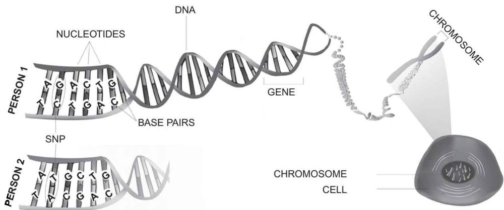
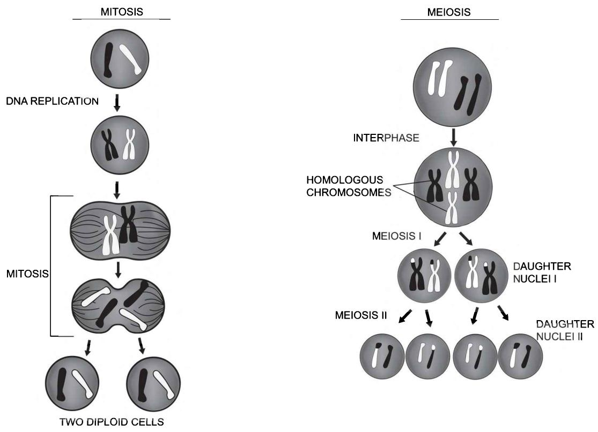
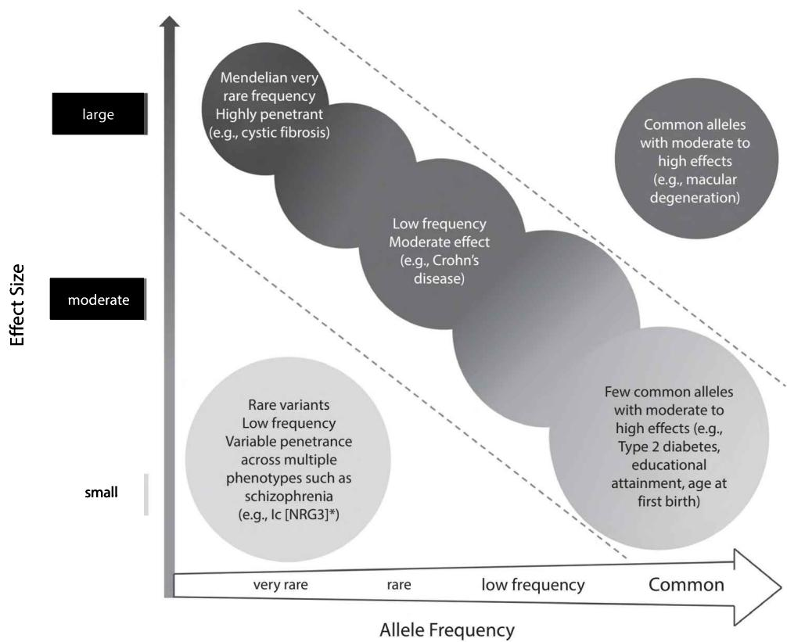
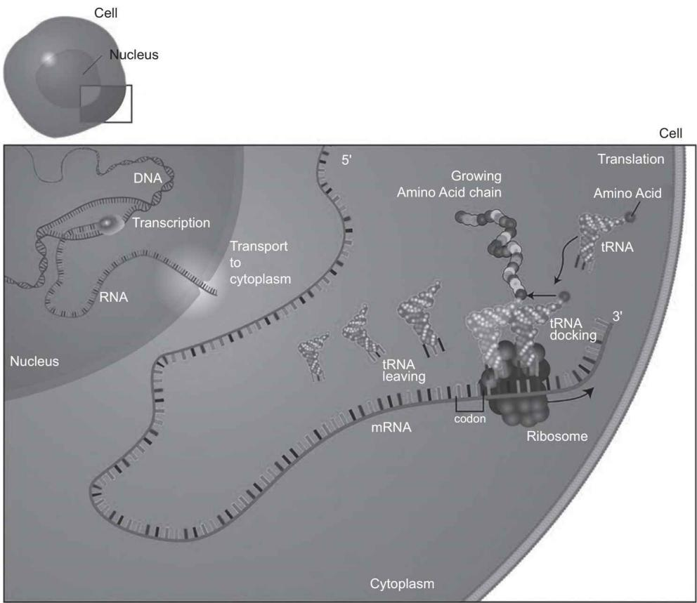
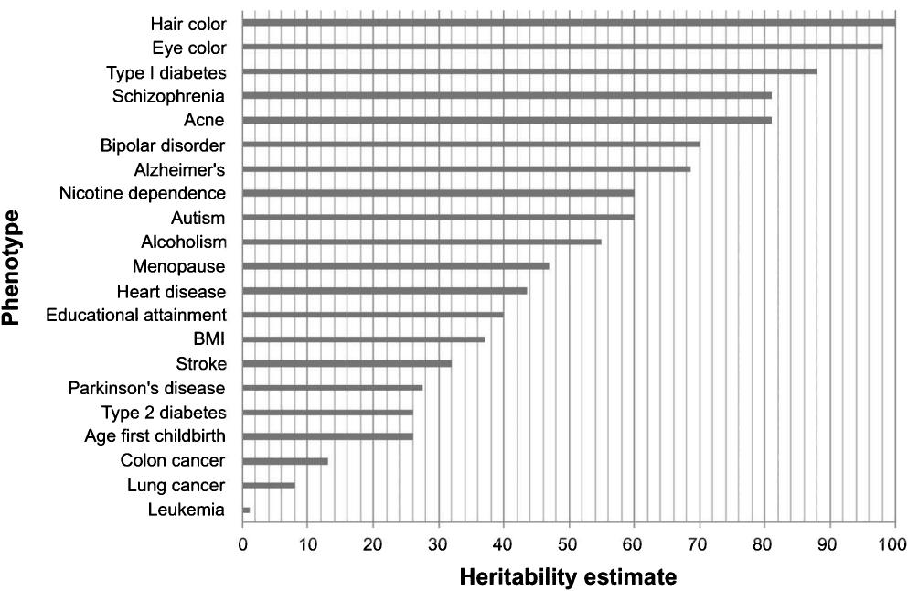

## Objectives

• Understand the motivation, aim, target audience, and structure of this book 

- Define, recognize, and describe the fundamental terminology used in the study of the human genome 

- Comprehend the organization of DNA in the nucleus of a human cell and the terms genome, gene, and chromosome 

- Gain an overview of Mendel's laws, sexual reproduction, and genetic recombination 

- Define genetic polymorphisms and the terms allele, single-nucleotide polymorphism, minor allele frequency, and unique identifier 

• Understand monogenic, polygenic, and omnigenic effects and polygenic scores 

• Acquire a basic knowledge of the relationship of genes to proteins 

• Grasp the central dogma of molecular biology: transcription and translation 

- Understand how polymorphic sites are either homozygous or heterozygous, and understand the relationship to inheritance of dominant and recessive traits using a Punnett Square 

- Recognize the meaning of heritability, common misnomers, types, and the missing heritability discussion 

## 1.1 Introduction

## 1.1.1 Motivation and aim of this book

Since the human genome was first sequenced in 2003, human genetics has undergone a veritable revolution. The growth in computing power, the explosion in the availability of datasets with genetic information, and the infusion of bioinformatics into this field have disrupted how we think about disease and behavior. Students and researchers now often possess fundamentally different skills beyond their own disciplinary boundaries or research specializations and increasingly embrace not only diverse disciplinary knowledge but also often have strong computing, statistics, and bioinformatics skills. It feels as if we are in the midst of a scientific renaissance where computing, data, and interdisciplinary knowledge finally frees us to ask and understand basic questions about human origins, health, and behavior that have, until now, evaded empirical study. 

The relevance of genetics has also penetrated disciplines far beyond its original homes in biology, epidemiology, and the medical sciences to gain relevance in new areas across the biomedical, social, and psychological sciences. As of 2019, around 4,000 genetic discoveries have been published, linking the genetic basis of thousands of traits ranging from height, type 2 diabetes, and body mass index (BMI) to coffee consumption, depression, neuroticism, and even the age when you have your first child [1]. Researchers with substantive expertise in a myriad of subject areas are now able to integrate genetics across a plethora of topics. For the first time in history we are able to ask fundamentally new types of questions. Researchers in the biomedical sciences can now estimate the genetic component of many major diseases such as type 2 diabetes, breast cancer, or cardiovascular disease. More importantly, new genetic discoveries allow them to understand how genes interact with different lifestyle or environmental factors in a move toward more effective clinical screening and interventions [2]. In the areas of psychiatry and psychology, we can study how genetic markers related to schizophrenia, addiction, neuroticism, and multiple other traits are associated with disease and treatment. Social scientists are now able to empirically study whether it is nature, nurture, or—more likely—a combination or interaction of nature and nurture that shapes our behavior. Genetic scores derived from these many genetic discoveries can be used in data analysis related to reproductive behavior, diabetes, educational attainment, well-being, and countless other outcomes. The genetic component can be used as variables in statistical models to increase the overall predictive power or variance, as control variables, to understand causality or examine how genetics interacts with family background, school, or other environmental factors. 

Yet, without a strong background in human genetics, evolution, working with large data, statistical models, computational methods, and computer programming, entering this area of research is not only daunting but for many unattainable. There is, likewise, a growing call for more diversity in both genetic datasets and among researchers, with training and accessibility being one of the main challenges. This book uses the freely available statistical environment R and other useful computer programs such as Python in addition to datasets that can be easily downloaded to carry out the exercises (see appendixes 1 and 2). All computer code, example datasets, and teaching material can be found in the companion website to this book at http://www.intro-statistical-genetics.com. 

We were struck, however, by the chasm that existed in textbooks and instruction material in this vital area of research. On the one hand, there are a multitude of excellent introductory human genetics textbooks but these are aimed firmly at genetics or biology students and rarely with applied computer applications. They also generally presuppose a strong background in molecular biology, chemistry, and genetics. On the other hand, there are textbooks that expertly present the advanced statistical and mathematical foundations of population genetics, often in theoretical and formal mathematical terms. There appeared to be no middle ground between the two. Specifically, there was no introductory textbook that integrated the fundamental concepts of human genetics, evolution, theoretical and statistical foundations, with new bioinformatics possibilities, in the form of a very practical and applied computer-based book. Textbooks rarely linked the basic concepts with hands-on computer-based exercises for everyday research. 

The aim of this book is to introduce students and researchers to the emerging concepts, data, and methods of statistical genetic data analysis in an accessible, practical, and—we hope—engaging manner. It is written for those who do not have a strong background in molecular biology, human genetics, or cell biology but want to integrate genetic data into their research. This book is written with broad accessibility in mind and will appeal to students and researchers from multiple disciplinary backgrounds who are new to this area of research. An elementary knowledge of statistical methods at the first level of a statistics or biostatistics course is optimal. Our approach is hands-on and applied, focusing on unpacking the basic concepts, the “do’s and don’ts,” in this research area and how to practically run and interpret analyses. We only provide the basic mathematical and statistical treatments of the material, with references supplied for those wanting to dig deeper. Considering the far reach of genetics, we anticipate interest from students and researchers from the medical and social sciences who increasingly integrate statistical genetic data analysis into their ways of thinking and working. 

By virtue of being an introductory text, we do not assert that this is by any means an exhaustive textbook on human genetics and statistical genetic data analysis. We acknowledge that our coverage of such a broad range of fundamental topics makes it at times feel like a crash course. This inevitability means a lack of depth and nuance in certain areas. For this reason, we often include boxes to provide examples or further explanation and a glossary in the backmatter. This glossary is also not all-encompassing, with additional terms sometimes defined within the text or endnotes. We also encourage readers to pursue our “Further reading” sections, the references at the end of each chapter, and the exercises. This book can be used by instructors within a course or by researchers as a self-learning book. 

This book falls in the realm of statistical human genetics. Genetics is of course a very old subject about rules of inheritance, and predates molecular biology and DNA. We provide an overview of the origins of this research area but focus largely on current computational approaches using individual-level genetic data. The goal of statistical genetics is to explain population variation or, in other words, to ask why we differ in our health outcomes, behavior, or appearance. Here the basic topic of study is the relationship between a genotype and phenotype. A genotype is a part of your own unique genome that comprises your complete heritable genetic identity. By part of your genome, we mean that a genotype is actually a particular allele or set of alleles at a locus, all concepts which we define and unpack later in this chapter. A phenotype—also often referred to interchangeably as a trait, outcome, or dependent variable—is the outcome we study. It can refer to multiple observable traits of an individual ranging from morphological (i.e., their physical appearance—height, eye color, curly hair) to disease (type 2 diabetes, breast cancer), psychiatric conditions (autism, schizophrenia), personality (neuroticism), or behavioral outcomes (years of education, number of children ever born, well-being, coffee consumption). Phenotypes are called quantitative traits when they are continuous, such as height or blood glucose levels. But they may also be binary or dichotomous, such as whether cilantro has a soapy aftertaste when you eat it (which is the case for around 10% of the population). 

The applied techniques in this book focus on a common form of variation across genomes: the single-nucleotide polymorphism (SNP, pronounced SNIP). As we elaborate upon later in this chapter, SNPs are the way in which we can examine single base differences, or “markers,” or flags in DNA that allow us to examine variation in a population. The examination of this variation in SNPs forms the basis of many of the applied analyses we perform in this book. They are the markers that are the focus of the genome-wide association study (GWAS, pronounced gee-WAS), a search across the genome, examining each genetic variant (or region) one by one to see if there is a statistical relationship (association) between SNPs and a phenotype. The genetic variants that are isolated from these GWASs are then often used to engage in either further statistical or downstream biological analysis. The reality, however, is that many phenotypes are influenced by both your genotype and the unique circumstances and environment in which you have lived your life. This is often referred to as the “nature” and “nurture” dichotomy or gene-environment interplay. This is generally studied in terms of gene-environment interaction (G×E), broadly defined as the interplay between genes (i.e., multiple genetic loci) and one or more environmental factors that in turn affect a phenotype or trait. We unpack this relationship in both theoretical terms and applied examples later in this book. 

## 1.1.2 Overview of topics covered in this book

The book is divided into three parts. Part I, “Foundations,” sets the groundwork for this type of research by outlining the basic terminology, theory, and statistical background of the topics we study in this book. The current chapter 1, “Introduction,” equips you with some of the basic terminology used in this area of research and serves as a primer on the human genome. Chapter 2, “A Statistical Primer for Genetic Data Analysis,” provides an accessible introduction to some of the basic statistical aspects underpinning this research. Chapter 3, “A Primer in Human Evolution,” unpacks some of the basic concepts that are required to understand this topic and are essential for you to correctly handle data and interpret results. Chapter 4, “Genome-Wide Association Studies,” reviews genetic discovery, which provides the basis of the information that is used for the majority of this book. Chapter 5, “Introduction to Polygenic Scores and Genetic Architecture,” zooms in on the topic of polygenic predictive scores and their underlying genetic architecture, which is one of the central ways in which many applied researchers interact with these data. Chapter 6, “Gene-Environment Interplay,” elucidates the topics of gene-environment interaction (G×E) and gene-environment correlation (rGE) and the understanding that genetic information in this area of research is rarely examined in isolation. 

Part II, “Working with Genetic Data,” moves from background topics to hands-on applications within the core computer packages and programs you need to carry out your research. Chapter 7, “Genetic Data and Analytical Challenges,” provides an overview of where you can obtain this type of data, the analytical challenges associated with working with it, and different file types. Chapter 8, “Working with Genetic Data, Part I,” delves into data management, producing descriptive statistics, and quality control. Chapter 9, “Working with Genetic Data, Part II,” provides you with experience to carry out association analysis and the calculation of population stratification, genetic relatedness, and heritability. Finally, chapter 10, “An Applied Guide to Creating and Validating Polygenic Scores,” offers a step-by-step guide to create and validate these summary scores. 

Part III, “Applications and Advanced Topics,” provides more advanced applications and a helicopter view of selected advanced topics. Chapter 11, “Polygenic Score and Gene-Environment Interaction (G×E) Applications,” is an applied companion chapter to the theoretical and conceptual introduction of this topic in chapters 5 and 6. This is followed by chapter 12, “Applying Genome-Wide Association Results,” where you learn how to visualize genetic findings (Manhattan plots, regional association plots, Quantile-Quantile plots), create a series of estimates from GWAS summary statistics (heritability and genetic correlations), and engage in multi-trait analysis (MTAG). We then turn to chapter 13, “Mendelian Randomization and Instrumental Variables,” where we describe these techniques and their extensions, followed by a summary and discussion of limitations. Chapter 14, “Ethical Issues in Genomics Research,” delves into ethical issues related to the interpretation of genetic results, the use of polygenic scores, and the legal, social, and policy risks of this research. Chapter 15, “Conclusions and Future Directions,” provides a brief summary, followed by insights into current and potential future directions in this area of research. Considering the rapid speed at which this field moves, this area will continue to grow and expand in a multitude of ways, many of which we undoubtedly could not include. We also have two appendixes: appendix 1, “Software Used in This Book,” and appendix 2, “Data Used in This Book.” Since much of the terminology may be new to many readers, we also included a brief glossary. 

The current chapter provides a very broad introduction to the area of human genomics. You will encounter many definitions, which we recognize can be daunting. Without a basic of understanding of these main concepts and the processes behind them, however, it is difficult to engage in genetic data analysis. We first define the basics of DNA, followed by an overview of Mendel's laws including sexual reproduction and genetic recombination, ideas which will become central in later chapters. We then turn to genetic polymorphisms and related terms that form the basis of many topics you will study in this book. Researchers also need to understand that it is rarely one genetic variant that is related to a trait, with most complex traits being polygenic (i.e., multiple genetic variants). We then introduce the relationship between genes to proteins and the central dogma of molecular biology. Researchers also need to understand that the polymorphic sites we study can be homozygous or heterozygous and the relationship to inheritance and heritability. 

## 1.1.3 What are DNA, the genome, a gene, and a chromosome?

DNA (deoxyribonucleic acid) is the molecule that makes up the genetic material contained within our bodies' cells. As figure 1.1 illustrates, two long DNA chains, composed of simpler molecular units (called nucleotides, defined shortly), coil around each other to form a double helix. DNA contains the genetic instructions that tell each cell which proteins to make. A genome is the complete set of genetic material of an organism or, in other words, the entire set of DNA contained within the nuclei of somatic cells $^{1}$ in the human body. The size of each organisms' genome is the total number of bases in one representative copy of its nuclear DNA. As the figure shows, a gene is a section of DNA found on a chromosome that consists of a particular sequence of nucleotides at a given position on a given chromosome that in turn codes for a specific protein (or an RNA molecule). As we discuss in a later section, a gene is a segment of DNA that tells the cell how to make a certain protein. Humans are estimated to have 20,000 to 25,000 genes. 

A chromosome is a single molecule of DNA that comprises part of the genome. It consists of nucleic acids and protein and is found in the nucleus of somatic cells and carries genetic information in the form of genes. As figure 1.1 demonstrates, chromosomes are central to our understanding of genetics. Humans have 23 chromosome pairs (i.e., 46 chromosomes) in total consisting of 22 autosomal chromosomes and one pair of sex chromosomes, two Xs for females (XX) and an X and a Y for males (XY). Autosomal chromosomes are the numbered chromosomes that are not related to sex determination or, in other words, chromosome 1 through 22. 

Figure 1.1

Organization of DNA (deoxyribonucleic acid) in the cell nucleus.

Organisms differ greatly in the size of their genome, with bananas having 22, fruit flies with 8, and goldfish boasting 94 chromosomes. Chromosomes also have different sizes, expressed in terms of megabases. A megabase is a measure of the length of a genome segment or, in other words, it represents the physical size of a genomic region. One representative copy of the human genome is estimated to have around 3,200 Mb (megabase pairs) or often described as $3.2 \times 10^{9}$ bp (base pairs). In comparison, fruit flies have around 123 million base pairs and one particular pine tree (the loblolly), for instance, has seven times more than humans with around 23 billion base pairs. In humans, the length ranges between chromosomes from the very largest chromosome 1 (250 Megabases [Mb]) to the smallest chromosome 21 (50 Mb). Sex chromosomes consist of an X chromosome that has two copies in females (155 Mb) and the shorter Y chromosome in males (60 Mb). 

## 1.2 Mendel's laws, sexual reproduction, and genetic recombination

The basis of much of our understanding of genetics stems from Mendel's laws. Most readers will be familiar with Gregor Mendel's discovery of the genetic segregation of traits in 1865, which he obtained by crossing garden peas that had different characteristics. Since there are ample descriptions of this discovery and the history of genetics, we do not reiterate it here (see “Further reading and resources” and, for an accessible and engaging read, see, for instance, [3]). Mendel's law consists of two principles. The first law is the principle of segregation, which holds that two members of a gene pair (i.e., alleles) segregate from each other in the formation of gametes with half of the gametes carrying one allele and the other half carrying the other allele. Gametes are the egg (females) and sperm (males) cells in animals and plants. In other words, each gene has two copies (alleles) and each parent transmits only one copy to a child; the child thereby receives two copies (alleles) in total. The second of Mendel's laws is the principle of independent assortment, which suggests that genes for different traits assort independently of one another in gamete production. $^{2}$ Put another way, different genes are inherited separately. Using a simple example, this means that the gene(s) that code for height are inherited separately from the gene(s) that code for hair color. 

As many might recall from introductory biology, this occurs during sexual reproduction, which is when the genetic material of a father and a mother combine to produce offspring that are genetically distinct from either parent. During this process, the mother and father produce gametes (egg cells for females, sperm cells for males). Each gamete has 23 chromosomes, which is half of the number of chromosomes in a typical cell. Since humans are diploids, we have pairs of chromosomes with one set of chromosomes inherited from each parent. During fertilization, the egg of the mother and sperm of the father fuse to form a cell that has the full number of chromosomes consisting of half from the mother and half from the father. Gametes are generated through meiosis and have half of the number of chromosomes of a normal cell. Gametes only have one copy of each chromosome so that when fertilization occurs, the resulting embryo has two copies of each chromosome. 

Genetic recombination—also referred to as genetic reshuffling—is graphed in figure 1.2 and refers to the sexual reproduction of offspring. This, in turn, produces the many different variations that we observe that are found in either parent. In the human data we examine in this book (i.e., eukaryotes), this novel set of genetic information is generated during meiosis. Meiosis is the process by which haploid gametes are generated, during which recombination occurs. As the figure shows, there is mitosis and then two stages of meiosis. In mitosis, a cell divides and then replicates its nuclear DNA to form two diploid copies of a cell. These are the primary sex cells. This is the point where somatic mutations 

Figure 1.2 Genetic recombination during meiosis.

Box 1.1 What is a mutation and how does it occur? 

may occur (see box 1.1 for more on mutation). Cells in your body divide to produce new cells in a series of cell cycles. Mitosis is the stage of the cell cycle when the cell divides. Mitosis is used to grow or to replace cells that may have been damaged. Contrary to meiosis, mitosis produces two new daughter cells that are identical to the original parent cell. 

The next stage is meiosis. The first division that occurs during meiosis (Meiosis I) is where the chromosome pairs line up in the center of the cell. The pairs are then pulled apart so that each new cell only has one copy of each chromosome. This is when half of the father's chromosomes (black) and half of the mother's chromosomes (white) go into each new cell. The second division consists of the chromosomes lining up again in the center of the cell with the arms of the chromosomes then pulled apart. Finally, four gametes are produced that each contain only a single set of chromosomes. Since chromosomes get randomly “reshuffled” during meiosis, each gamete only acquires half of them. This is the 

A mutation is a permanent change in the sequence that makes up a gene. Mutations can affect a single base pair or multiple genes across a large segment of a chromosome. There are two types of gene mutations. The first is the hereditary mutation, which is inherited from a parent, is present for an individual's entire life, and is in almost all cells in the body. It is also often referred to as germ line mutation, which is a mutation that will be inherited by the offspring of the organism. The second type is somatic or acquired mutations that occur during an individual's lifetime and exist only in certain cells. These mutations are generally related to environmental factors. This could include, for example, smoking or exposure to ultraviolet radiation from the sun. They can also occur if there is an error during DNA replication before or during cell division. These acquired mutations in somatic cells are not passed on to the next generation. 

Mosaicism can also take place. This is when different populations of cells within an organism have different genotypes. It is now understood that we are all mosaics, to one degree or another. In fact, permanent alterations of the genome are important to the functioning of the immune system and the brain. Whether mosaicism causes disorders depends on the type of mutation and how many cells are affected. What is described as de novo (i.e., new) mutation can be hereditary or somatic. These types of mutations explain genetic disorders where an offspring has a mutation in every cell, but the parents do not and there is no family history. They are generally rare alleles that can cause major effects. 

What is the difference between gene mutations and genetic polymorphisms? A mutation is an event in an individual whereas a polymorphism is defined across a population. Mutations that cause disease are relatively rare in the general population. Gene mutations thus differ from more common genetic alterations of polymorphisms discussed in this chapter. These are the alterations that are common enough (more than 1% of the population) to be considered as a normal variation in the DNA and are responsible for the normal differences between people that we have described such as hair color, height, or risk of certain diseases. 

reason why each of the gametes is genetically different from the others. The importance of these chromosomes being randomly reshuffled will be revisited later in this book in our chapter 13 on Mendelian Randomization. As box 1.1 elaborates, this is also when hereditary gene mutation takes places. If the DNA has a mutation, when an egg and sperm cell unite and the fertilized egg cell receives the DNA from both parents, the offspring will have the mutation across all cells. It is also useful to note that only some of the “breaking down” steps occur in the mitochondria. Meiosis I is similar to mitosis, in that it is a form of cell division that produces two diploid cells, but it is not referred to as mitosis and does differ in some key ways. Genetic recombination during mitosis, for example, occurs between identical copies of a chromosome and does not result in new variability. Although Mendel’s experiments were useful to forming the field of genetics, for the vast majority of topics that we study it is not one gene but multiple genetic effects that inform our understanding, which we turn to now. 

## 1.3 Genetic polymorphisms

## 1.3.1 Alleles, single-nucleotide polymorphisms (SNPs), and minor allele frequency (MAF)

The aim of many contemporary genetic studies has been to identify genetic variants that are associated with phenotypic variation in populations, discussed in detail in chapter 4, on GWASs. The focus of this research is on studying the locations in our DNA where the sequence of base pairs differs across individuals. A genetic polymorphism refers to the variation in the DNA sequence between individuals. The possible variants of a polymorphism are referred to as alleles, which derives from the Greek prefix “allele,” meaning mutual or reciprocal. An allele refers to each of the two or more alternative forms of a gene found at the same place on a chromosome that arise by mutation. In figure 1.1 these differences are indicated by single base-pair changes, deletions, or insertions. $^{3}$ On the left-hand side of figure 1.1, we see a comparison of two pieces of DNA where Person 1 has CG and Person 2 has AT or, in other words, differences in the base pairs of their SNPs. We discuss the meaning of base pairs and the codes CG and AT in the next section. 

Alleles are thus the variations of a locus that codes for a protein. $^{4}$ Alleles can come in various forms and one of these are single-nucleotide polymorphisms (SNPs), which are variations in a single nucleotide that occur at a specific position in the genome and are the most common type of genetic variation among humans. SNPs occur around once every 1,000 nucleotides and it is estimated that, as a population, we have at least 10 million SNPs. Humans are around 99% genetically identical in their SNPs or in other words in their genetic makeup. It is the differences in the remaining 0.1% that hold the important information about genetic variation that we study. Alleles have to be in a gene, but SNPs do not always lead to new alleles (e.g., when they occur in noncoding areas as we outline shortly). 

Until now we have generally studied common SNPs that are single-nucleotide variants (SNVs) at a population allele frequency greater than 1%. Structural variation is the genomic variation in the structure of a person's chromosome. Around 13% of the human genome is classified as structurally variant in a typical population. It can consist of multiple types of variation such as deletions, copy-number variants, insertions, inversions, and translocations. They seem to be more difficult to detect than SNPs that are part of a particular region of DNA that can be around 1 kb (kilo-base pair, which is a unit of measurement in genetics, equal to 1,000 nucleotides) or larger. Copy-number variation (CNV) is a large category of structural variation with CNVs in the human genome thought to affect nucleotides more than SNPs and notably, many CNVs are not in coding regions (see next section for discussion of coding and noncoding regions). 

The frequency at which alleles occur in a population is represented as the frequency of the least common or minor allele—called minor allele frequency (MAF)—which is one the key statistics used to characterize polymorphisms. The average person has around 4 million SNPs. MAF thus refers to the second most common allele in a particular population. In the literature, polymorphisms are distinguished by their MAF and categorized as common (MAF > 0.05), low-frequency (0.01 < MAF < 0.05), or rare (MAF < 0.01) variants. MAF thus provides us with the information to differentiate between common and rare variants in a particular population. In the genome-wide association studies we discuss in chapter 4, the majority of studies up to around early 2018 largely examined common variants (i.e., MAF of less than 5%). There is growing interest and study of rare variants, which are alternative forms of a gene that have an MAF of less than 1%. 

To date, we have not found polymorphisms at every site in the genome. This is due to the fact that only a selection of people have been genotyped but also that variation at some sites cannot be tolerated, which is explored in further detail in chapter 4. For those interested in understanding sequence variation, see our “Further reading and resources” section for a link to a database that shows the location, frequency, type, and predicted function of each known variant (dbSNP with the Ensembl browser). In humans, variants that have been listed have a unique identifier that always begins with “rs,” followed by an arbitrary number, such as rs4988235 (linked to lactose intolerance) or rs1799971 (linked to stronger alcohol cravings). As we explore in a later chapter, when you obtain genetic data, each SNP will have an rs ID, a chromosome, and other features such as the position. Researchers should also be aware that there are often many ways of naming genes, or what is known as nomenclature. When in doubt or if you would like to understand the symbols, names, or genes, refer to the HUGO site, which is the HUGO Gene Nomenclature Committee (https://www.genenames.org/). 

## 1.3.2 Monogenic, polygenic, and omnigenic effects

Figure 1.3 provides a broad overview of the spectrum of genetic contributions to particular phenotypes. Here we see the spectrum of allele frequency by effect size. Mendelian traits such as cystic fibrosis or Huntington's disease, although rare, have single variants with large effect sizes that are highly penetrant. Penetrance in genetics refers to the proportion of individuals who carry a particular variant or allele of a gene that is associated with a particular phenotype. As we touched upon in the last section, there are rare variants, however, that have very low frequencies but may have small to large effects. There is also a large group with rare to low allele frequency and moderate effects, such as Crohn's disease. Common variants will almost always have small effects when entered into statistical models, which we explore in later chapters (see also box 1.2). This is related to natural selection, which is discussed in detail in chapter 2, and to the fact that they may be distal to biology, be highly behavioral, lifestyle related (e.g., smoking, BMI), or for other reasons. 

Figure 1.3

The spectrum of genetic contributions to phenotypes.

Source: Produced by authors and adapted from Manolio et al. 2009 [4], figure 1.

*For a list of rare and low-frequency genetic variants in common disease, see Bomba et al. 2017 [5].

It is rare that a trait is only associated with one genetic variant, or, in other words, is monogenic. The phenomenon of polygenicity implies that no single genetic variant determines or is associated with a trait, but rather that it is often hundreds and thousands of genetic variants that each have a small influence on a trait. Such phenotypes are called complex since they have a multifactorial genetic basis. This is often related to the common disease-common variant (CD-CV) hypothesis, which holds that common disease associated alleles will be found in all populations that manifest a given common disease. In the most extreme omnigenic model, each variant at each gene is assumed to influence a complex trait and will have a small additive or multiplicative effect on the phenotype. They are often seen to evade evolution in part since it is the small effects of so many genes that influence phenotypes. The most common form of human genome variation is thus these SNPs. 

The most important recent developments in statistical genetics surround the discovery of ubiquitous polygenicity in most traits that we study. An intuitive implication of polygenicity is that the effect sizes of individual SNPs are smaller than if only a few SNPs would be associated with an outcome. Small effects are harder to discover given a fixed statistical measure of certainty of the discovery. Polygenicity therefore explains the disappointingly small effects of discovered variants as well as the small number of robustly identified variants. As we explore later in detail in our section on heritability, we often apply polygenic scores (PGSs), which represent numerical summaries for an individual of genetic effects estimated in a GWAS. Sometimes also referred to as polygenic risk scores, a polygenic score is a single quantitative variable that summarizes genetic predisposition to a phenotype by combining multiple genetic loci and their associated weights. PGSs have become a standard tool that we will discuss in detail in chapter 5, provide guidelines on how to create them in chapter 10, and show applied examples in chapter 11. Recently, some researchers have argued that we need to move beyond polygenic models to omnigenic models. In the omnigenic model, gene regulatory networks are seen as so interconnected that essentially all genes expressed in trait (disease)-relevant cells are liable to affect the functions of the core trait-related genes. They argue that most associated genetic variants can be explained by effects on genes outside of the core pathways being studied [7]. This is related to the topic of pleiotropy, which is said to occur when one gene influences two or more seemingly unrelated phenotypes. Since we explore this in more detail in chapter 5, we do not elaborate upon it here. 

## 1.4 From genes to protein and the central dogma of molecular biology

## 1.4.1 From genes to protein: Genes, amino acids, nucleotides, and proteins

Recall that a gene is a section of DNA found on a chromosome that consists of a sequence of nucleotides at a given position on a given chromosome that codes for a specific protein 

Box 1.2 

Common versus rare variants: The case of NBA star Shawn Bradley 

Any NBA fan will know that most players are very tall, such as Michael Jordan (6'6"), LeBron James (6'8"), or Wilt Chamberlain (7'1"). But Jordan, for instance, does not have any immediate family members who are over six feet tall. His mother is reported to be 5'5" and his father 5'9". A recent study examined the DNA of 7'6" former NBA star Shawn Bradley, who is in the 99.99999th percentile for height [6]. He agreed to be sequenced, and researchers compared his genome to the polygenic height score produced by a well-known height GWAS conducted by the GIANT (Genetic Investigation of ANthropometric Traits) consortium. The researchers thought that Bradley would have rare, large-effect variants in height-related genes but this was not the case. Instead, when they applied the polygenic score for height it was "off the chart." They found that instead of having a few rare genetic variants he was, in fact, so tall due to the fact that he had many of the common variants positively associated with taller height. He had 198 more height-associated genetic variants than the average member of the general population. As we explore in later chapters that describe polygenic prediction and gene and environment interplay, it is striking that although the genomic analysis predicted his height rank, the individual polygenic score did not accurately predict his actual height. 

(or an RNA molecule) (see figure 1.1). Each gene codes for a particular sequence of amino acids $^{5}$ that in turn form a protein. In total, 20 amino acids are used to constitute thousands of different proteins. Genes thus indicate to the cell the order in which amino acids should be assembled. A complex system regulates which proteins are produced in each cell such as hemoglobin or keratin, which determines the type of cell that it is (e.g., red blood cell, skin cell). 

DNA strands are polymers, $^{6}$ which are made up of many repeating units called nucleotides. Nucleotides form the structure of DNA and consist of one of four nitrogenous bases—cytosine (C), thymine (T), adenine (A), and guanine (G)—plus a molecule of sugar (deoxyribose) and a phosphate molecule. The sugar and phosphate molecules on the nucleotides alternate but also form the backbone of the DNA strands. One of the four different nitrogenous bases—A, T, C, or G—joins to each sugar. Recall from figure 1.1 that DNA is in the form of a double helix. Each base links to a base on the opposite end of the strand in the double helix. Humans are thus composed of diploid cells $^{7}$ or in other words, pairs of chromosomes with one set of chromosomes inherited from each parent. We previously described the process of inheritance from parents in the section on genetic recombination. Since we are diploids, DNA’s two strands are complementary to each other or in other words they follow complementary base pairing rules. Complementary base pairing means that A always pairs with T and C always pairs with G, forming base pairs. The two strands are complementary to each other and therefore contain the same information. As figure 1.1 also illustrates, it is the order of these bases along a single strand that comprises the genetic code. In turn, it is the order of bases in a gene that determine the order of amino acids in a protein. $^{8}$ Each amino acid is coded for in the coding regions of a gene—called exons $^{9}$ —by a sequence of three bases and the amino acids are joined together to create different proteins, all dependent on the order of the gene's bases. The genetic code is also often referred to as a triplet code, which refers to the sequence of three nucleotide codes for one specific amino acid. Only $\sim$ 1% of the genome is actually translated into protein, which is referred to as the exome. $^{10}$ 

Shawn Bradley. With permission by Mark A. Philbrik/BYU Photo.

A gene thus consists of three types of nucleotide sequences: (1) exons or coding regions, specifying a sequence of amino acids (the exome), but also, beyond the auspices of this introductory chapter; (2) noncoding regions or introns, which do not specify a sequence of amino acids; and, (3) regulatory sequences, determining when, where, and how much of a protein is made. The noncoding regions or introns $^{11}$ do not code for proteins. Once this was referred to as “junk DNA” because it is considered by many biologists as non-functional due to the observation that most of the genome is not conserved. $^{12}$ More recently, scientists have come to understand that some of this noncoding DNA regulates the activity of genes and controls the amino acid sequences of the proteins that are synthesized. 

A protein is a large molecule composed of one or more chains of amino acids that are joined together by peptide bonds $^{13}$ in a specific order determined by the base sequence of nucleotides in the messenger RNA for protein (see next section). Proteins are essential for the structure, function, and regulation of our cells, tissues, and organs. Proteins control the shape and structure of cells but also carry out important tasks such as transporting oxygen in blood or digesting food. Proteins have many different functions such as controlling all of the metabolic reactions that take place in the cell and acting as biological catalysts to speed up chemical reactions in the body. Others act as hormones, antibodies, transporters of oxygen (e.g., hemoglobin), or structural proteins (e.g., keratin or collagen). 

## 1.4.2 The central dogma of molecular biology: Transcription and translation

To grasp the processes described in the previous section, it is important to be aware of the central dogma of molecular biology. This describes the two-step process—transcription and translation—through which the information of genes flows into proteins (i.e., DNA to RNA to protein), also visualized in figure 1.4. RNA (ribonucleic acid) is a molecule with long chains of nucleotides with a nitrogenous base, a ribose sugar, and a phosphate. RNA on the other hand is single stranded and although it also has adenine, cytosine, and guanine, instead of thymine it has a nucleobase called uracil. 

The function of DNA is to hold the original genetic code that is transcribed into RNA, which then codes for protein in a process known as translation. As figure 1.4 displays, transcription refers to the synthesis of an RNA copy of a segment of DNA. 

Figure 1.4

The central dogma of molecular biology: Processes of transcription and translation.

Source: Reprinted with permission from NHGRI Digital Media Database, Leja (2010) [8].

Notes: This figure shows the process of transcription from DNA to the messenger ribonucleic acid (mRNA). Outside the nuclear membrane of the cell in the cytoplasm the process of translation occurs where proteins are built from amino acids with the help of transfer RNA (tRNA) molecules, guided by ribosomes.

Translation denotes the RNA being used as the template for a protein. In eukaryotic cells, $^{14}$ transcription occurs in the nucleus and translation in the cytoplasm. $^{15}$ Messenger RNA (mRNA) encodes the amino acid sequence of a polypeptide $^{16}$ and transfer RNA (tRNA) molecules bring amino acids to ribosomes during translation, using the triplet code to determine the amino acid to be integrated into the growing polypeptide chain. In other words, in order to decode the genetic information into proteins, DNA is first transcribed into mRNA, which is then translated into proteins by the aid of tRNA. 

For nonbiologists, one way to think of this is that the nucleus is the post office, mRNA is the postal delivery truck, and tRNA is the postal carrier. The DNA cell nucleus has all of the “letters” or code inside. The cell needs to get the code from the DNA’s cell nucleus (central post office) to the ribosome. To achieve this, it uses the postal delivery truck of mRNA. During transcription, the DNA information leaves the post office (i.e., the nucleus) as a postal truck full of letters (i.e., coding of genes). Although it is more complex than what this brief introduction affords, the mRNA effectively copies the code from the DNA and acts as a messenger between the DNA and ribosome to carry the code between the two. The correct amino acids are thus brought to the ribosomes in the correct order by these carrier molecules. The tRNAs are the postal carrier, who then reads the address on the letter so that they can deliver it in person. The tRNA reads the mRNA in segments of three bases at a time (called codons) and through an anticodon (three bases complementary to the RNA’s codon), binds to the mRNA. 

## 1.5 Homozygous and heterozygous alleles, dominant and recessive traits

Recall that polymorphic refers to the presence of more than one allele at a specific locus. A locus (plural loci) is a location on the genome, which could be the location of a gene or marker. When an individual has two of the same allele, regardless of whether it is dominant or recessive, they are called homozygous. Heterozygous refers to having one of each of the different alleles. A person is heterozygous at a gene locus when their cells contain two different alleles. Heterozygosity thus refers to a specific genotype. 

This distinction also explains the difference between dominant traits, which is when only one allele of a gene is necessary to express the trait versus recessive traits, where both alleles of a gene must be identical to express the trait. For dominant traits we use two capital letters (e.g., AA) and for a recessive trait we use two lowercase letters (e.g., aa). Dominance in melanin deposits results in freckles, for instance. A homozygous freckled person would have the FF genotype while someone without freckles with the homozygous gene would be represented by ff. The Punnett Square is often used to understand these concepts and is shown in figure 1.5. In this example, we have Parent 1 and Parent 2 and walk through the various possible outcomes. Here we refer to a probability, which is the chance that the offspring will have a particular genotype such as a 15% chance. 

Figure 1.5 provides a stylized example. For example, imagine that Nick and Elizabeth were going to have a baby. Elizabeth has dimples on her cheeks, which is a dominant trait, and Nick does not. We can use a Punnett Square to calculate whether their baby will have dimples. Nick has the recessive trait (no dimples), which means that Nick must have two recessive alleles, or, let us say, aa. Elizabeth has the dominant trait (dimples), but Elizabeth could be homozygous dominant (AA) or heterozygous dominant (Aa). 

To find out whether her dimples are homozygous dominant or heterozygous dominant we need to know more about her parents. We discover that Elizabeth's father has dimples on both cheeks and her mother does not. Her mother has the recessive trait and thus has to have the aa genotype. Her father has the dominant trait, but we don't know if he is a homozygote (AA) or a heterozygote (aa). We can conclude that she must have the recessive allele (a) since that is all that she could have inherited from her mother and that Elizabeth's father is an Aa. Since Elizabeth has dimples we can conclude that she inherited a dominant allele (A) from her father. Her father passed on the A to her (and it does not matter if he is AA or Aa). To calculate the baby's chance of having dimples we see from the Punnett Square that there is a 50% chance the baby will have genotype Aa and thus have dimples and an equal 50% chance that the baby will have genotype aa and thus not have dimples. 

Parent 2

<table><tr><td></td><td>Allele 1</td><td>Allele 2</td></tr><tr><td>Allele 1</td><td>A1/A1</td><td>A1/A1</td></tr><tr><td>Allele 2</td><td>A2/A1</td><td>A2/A1</td></tr></table>

<table><tr><td colspan="3">Homozygous dominant + Homozygous dominant</td></tr><tr><td></td><td>A</td><td>A</td></tr><tr><td>A</td><td>AA</td><td>AA</td></tr><tr><td>A</td><td>AA</td><td>AA</td></tr></table>

<table><tr><td colspan="3">Homozygous dominant + Homozygous recessive</td></tr><tr><td></td><td>a</td><td>a</td></tr><tr><td>A</td><td>Aa</td><td>Aa</td></tr><tr><td>a</td><td>Aa</td><td>Aa</td></tr></table>

<table><tr><td colspan="3">Homozygous dominant + Heterozygous</td></tr><tr><td></td><td>A</td><td>A</td></tr><tr><td>A</td><td>AA</td><td>AA</td></tr><tr><td>a</td><td>Aa</td><td>Aa</td></tr></table>

<table><tr><td colspan="3">Heterozygous + Heterozygous</td></tr><tr><td></td><td>A</td><td>a</td></tr><tr><td>A</td><td>AA</td><td>Aa</td></tr><tr><td>a</td><td>Aa</td><td>aa</td></tr></table>

Elizabeth

<table><tr><td></td><td>A</td><td>a</td></tr><tr><td>a</td><td>Aa</td><td>aa</td></tr><tr><td>a</td><td>Aa</td><td>aa</td></tr></table>

Figure 1.5

Using the Punnett Square to determine the probability of offspring having a particular genotype.

A related topic, which we explore in detail in chapter 3, is linkage disequilibrium (LD), which refers to the fact that alleles are not randomly associated at different loci. Rather they are often in LD, which is when the frequency of a particular association of different alleles is higher or lower than would be expected if they were independent and randomly associated. 

## 1.6 Heritability

## 1.6.1 Defining heritability: Broad- and narrow-sense heritability

Heritability forms the basis of much of our understanding of genetic and environmental influences on phenotypes. Heritability is defined as the proportion of variation of a trait in a population that is attributable to genetic differences. Or more technically, it is the proportion of the phenotypic variance accounted for by genetic effects. Mathematically it is often abbreviated as $h^{2}$ , the ratio of the total genetic variance ( $V_{G}$ ) to the total phenotypic variance ( $V_{P}$ ) where $V_{P}=V_{G}+V_{E}$ . This partitioning of the variance assumes that all sources of variance can be reduced to either genetic ( $V_{G}$ ) or environmental ( $V_{E}$ ) effects. 

A distinction is often made between broad- and narrow-sense heritability. The broad-sense heritability (mathematically abbreviated as H) is represented as: 

$$
H ^ {2} = \frac {V _ {G}}{V _ {P}}
$$

where 

$$
V _ {P} = V _ {G} + V _ {E}
$$

Variance as a measure of individual differences in a phenotype $(V_{P})$ can emerge due to genetic differences in a population $(V_{G})$ and nongenetic or environmental variance, including measurement error $(V_{E})$ . For details on the calculation of variance and other key statistics, see chapter 2. 

The genetic component can be furthermore differentiated into additive $(V_{A})$ and nonadditive $(V_{NA}, \text{epistatic and dominant})$ genetic effects: 

$$
V _ {G} = V _ {A} + V _ {N A}
$$

Additive genetic effects are when two or more genes contribute to a phenotype or when alleles of a single gene combine such that their combined effects on the phenotype equal the sum of their individual effects. As discussed in the previous section, dominance describes the relationship among alleles of one gene where the effect on the phenotype of one allele masks the contribution of a second allele at the same locus. The first allele is said to be dominant and the second allele is said to be recessive. 

Nonadditive genetic effects involve dominance (of alleles at a single locus) or epistasis (of alleles at different loci). Dominance differs from epistasis, which is a relationship in which an allele of one gene affects the expression of another allele at a different gene. Dominance variance $V_{D}$ and interaction variance $V_{I}$ , epitasis) is thus where the effect of one genotype is influenced by one or more other genotypes. Genotype-by-environment interactions are also possible, which we elaborate upon in chapter 6. If this is the case, we would thus have: 

$$
V _ {G} = V _ {A} + V _ {D} + V _ {I} + V _ {G}
$$

There is considerable debate about how much of the genetic variance in a population is nonadditive and, as we discuss in later chapters, the importance of other factors such as environment. While dominant genetic effects are important for Mendelian traits, for most complex traits, there is little evidence for nonadditive effects and we therefore mostly focus on narrow-sense heritability. 

Narrow-sense heritability $(h^{2})$ is the proportion of variance in a phenotype within a specific population that is associated with additive genetic variance: 

$$
h ^ {2} = \frac {V _ {A}}{V _ {P}}
$$

Theory suggests selection is more efficient with additive variation but can still occur under other conditions, which we address in more detail in later chapters. 

## 1.6.2 Common misconceptions about heritability

As Visscher and colleagues note, there has been considerable confusion surrounding the term heritability [9]. 

1. It is not about individuals. In other words, a heritability of 25% for obesity does not mean that a quarter of the reason a person is obese is genetic, with the other three-quarters is driven by environmental factors. Rather, it means that 25% of the individual differences in BMI are associated with genetic difference between individuals. 

2. It is only about a single population. A heritability estimate alone cannot be used to compare genetic differences between different groups or countries. For instance, a heritability estimate of 80% for height does not mean that most of the average difference in height between, for example, the Dutch and Americans is due to genetic differences. Although variation within each particular population may be largely genetic, differences between populations are likely environmental [10]. One caveat is that for some phenotypes, such as a difference in pigmentation or skin color, they are largely genetic (although there is certainly an environmental component). 

3. It is not the same as inheritance. Inheritance is the relationship between offspring and their biological parents. It measures not only genetic factors but also the environment, cultural, and other factors shared by family members [11]. 

4. Very low heritability does not necessarily mean there is very little genetic contribution. Low heritability could be attributed to the absence of variance in genes that contribute to the phenotype or high environmental variance. A straightforward example is that although the number of cervical vertebrae is highly related to a genetic component, since it is the same in everyone, there is little variance and thus no or low variability attributed to genetic factors. 

## 1.6.3 Twin, SNP, and GWAS heritability

There are multiple ways to estimate heritability (often denoted by $h^{2}$ ), which are twin studies, SNP, and GWAS heritability [10, 12]. Initially and persistently, twin and family studies have been conducted to quantify the genetic, common, and unique environmental components in a phenotype. The intuition behind twin (and also family) comparison methods is that if a phenotype is heritable then individuals who are genetically related or identical to one another should be more similar than random members of the population. The problem, however, is that the similarity in environments experienced by twins and family members is likely to be confounded with genetic similarity. 

Twins form a perfect natural experiment in which to deal with this confounding. The most common design to study heritability and environmental influences is the classic twin design. As a basis, this design compares monozygotic (MZ) or identical twins that are virtually genetically identical with dizygotic (DZ) or fraternal twins that share around half of their genetic material, the same amount as any full siblings. If MZ and DZ twins are assumed to share roughly the same environments—known as the equal environment assumption—the difference between their phenotypic correlations should provide an unbiased estimate of heritability. In classic twin models, phenotypic variance is partitioned into three components: A, which is additive genetic effects (heritability); C, referring to the common shared environment of both twins; and, E, the unique environment that is not shared by the twins and also measurement error. The nonshared environment could be peer groups or later in life the impact of partners or coworkers. This is the only component where MZ twins are thought to differ. 

Since C is identical for MZ and DZ twins and DZ twins only share half of their alleles, phenotypic correlations can be calculated as follows: 

$$
r _ {M Z} = A + C
$$

$$
r _ {D Z} = \frac {1}{2} A + C
$$

The A (i.e., heritability, $h^{2}$ ) component is then calculated by subtracting the correlation between DZ twins ( $r_{DZ}$ ) from the correlation in MZ twins ( $r_{MZ}$ ). This is multiplied by the factor 2 since MZs share on average 2 times the genetic alleles compared to DZ twins. 

$$
A = 2 \times (r _ {M Z} - r _ {D Z})
$$

C (common shared environment) quantifies the extent to which twins are more similar compared to other pairs in the population and is achieved by subtracting the heritability component (A) from the MZ correlation ( $r_{MZ}$ ): 

$$
C = r _ {M Z} - A
$$

Since $A + C + E = 1$ then: 

$$
E = 1 - r _ {M Z}
$$

This quantifies the remaining individual differences in families that might be due to non-shared environmental factors or measurement error (E), subtracting the MZ correlation $(r_{MZ})$ from the standardized total variance of 1. This basic logic is commonly applied in structural equation models (SEM), since these make assumptions more explicit, allow us to calculate uncertainty, compare different model specifications, and are more flexible in modelling joint genetic effects for multiple traits or extended family designs including multiple family members [13]. Heritability estimates from twin studies are the highest and perhaps most well-known estimates of narrow-sense heritability (in the following examples discussed as $h^{2}_{family}$ ). 

Second, there is SNP-heritability (denoted here by $h^{2}_{SNP}$ )—also sometimes referred to as chip-based heritability, the proportion of phenotypic variance jointly accounted for by all variants on standard GWAS chips [14]. As we discuss in chapter 7, SNP “chips” refer to the high-density computer chips that measure SNPs and are of different sizes and vary by population, often referred to in relation to the company that produces them (e.g., Affymetrix, Illumina). Using the computer program GCTA (Genome-wide Complex Trait Analysis), this analysis is based on the statistical method called GREML (Genome-based Restricted Maximum Likelihood), which estimates the variance component to quantify the total narrow-sense (additive) contribution of a trait’s heritability [15]. Twin and family studies rely on the estimation of heritability from closely related individuals. This SNP-based GREML heritability technique transcends these designs that relied on comparing twins to estimate heritability across unrelated individuals. Individuals vary in their genetic similarity, and these estimates leverage those differences in the data. If two people within the data are more similar in both their genetic and trait measures, this method indicates the measured genetics that causally influence that trait and how much. It can be extended, for instance, to estimate bivariate correlations between traits, comparing against chromosome length, or changes in heritability by age [16]. These techniques are continuously being evaluated and extended and can be estimated using the summary statistics that are obtained from GWA studies [17]. Typically, $h^{2}_{family}$ is larger than $h^{2}_{SNP}$ and $h^{2}_{SNP}$ is substantially larger than $h^{2}_{GWAS}$ , which we turn to in the next section. The SNP-based heritability technique provides an “upper level estimate” of the genetic effects that could be identified with a well-powered GWAS. A meta-analysis of virtually all twin studies conducted up to 2012 comes to the conclusion that on average across all traits studied, 50% of the variance is attributed to additive genetic effects and 50% due to non-shared environmental influences or measurement error, respectively—while there is substantial variation across phenotypes [18]. As figure 1.6 illustrates for SNP-based heritability, many phenotypes are partially heritable. This can range from highly heritable traits such as hair or eye color to moderately heritable traits such as autism, alcoholism, or heart disease to some with low heritability such as colon and lung cancer. 

Figure 1.6

Heritability estimates across selected phenotypes.

Sources: Made by authors using https://www.snpedia.com/index.php/Heritability as well as Tropf et al. [19] for age at first childbirth and Branigan et al. [20] for educational attainment.

Notes: Some estimates show a range of heritability estimates from multiple populations or publications. When this occurs, we have taken the average. This is the case for alcoholism (50–60%), Alzheimer's disease (58–79%), autism (30–90%), BMI (23–51%), and Parkinson's disease (25–30%).

Finally, there is GWAS-based heritability (denoted by $h^{2}_{GWAS}$ ). This is the proportion of variance accounted for by genetic variants that are known to be robustly associated with the phenotype of interest, derived from a GWAS. This measure of heritability tends to produce the lowest estimates of all three measures discussed here. Although they are lower, with increasing sample sizes and technological developments, more associated variants continue to be discovered resulting in the estimates of the effects of these variants becoming increasingly more accurate. As a result, $h^{2}_{GWAS}$ increases in tandem with GWAS sample sizes and is expected to approach $h^{2}_{SNP}$ asymptotically under the assumption that the phenotype of interest is homogeneous in its genetic architecture across different environments. Genetic architecture is the mapping of the underlying genetic basis of a genotype of phenotype and determines the variational properties of the phenotype [21]. 

## 1.6.4 Missing and hidden heritability

The gap between the $h^{2}_{family}$ and $h^{2}_{GWAS}$ is referred to as missing heritability [4]. Potential reasons for missing heritability include nonadditive genetic effects (although evidence for this is scarce) [22, 23], large effect rare variants [24], and potentially inflated estimates from twin studies due to shared environmental factors [25]. Missing heritability is commonly defined as the sum of the still-missing and hidden heritability, which we define below [26]. 

Still-missing heritability. Yang and colleagues [27] argued that most genetic effects are too small to be reliably detected in GWASs of current sample sizes. Studies applying these whole-genome methods typically produce estimates that lie between twin studies and polygenic scores: $h^{2}_{GWAS} < h^{2}_{SNP} < h^{2}_{family}$ . The discrepancy $h^{2}_{SNP} < h^{2}_{family}$ has been referred to as still-missing heritability [26]. For many traits the still-missing heritability is roughly equal to $h^{2}_{SNP}$ [28]. It is generally assumed that by genotyping rarer and structural variants, the still-missing heritability will decrease, as the denser arrays will increase $h^{2}_{SNP}$ . 

Hidden heritability. Since we expect to be able to almost fully capture $h^{2}_{SNP}$ in the long run, the discrepancy between $h^{2}_{SNP}$ and $h^{2}_{GWAS}$ is sometimes referred to as “hidden heritability” [26]. One way in which this has been examined is in relation to Fisher’s initial formulation of quantitative genetic theory of the infinitesimal model of many variants having a small effect [29]. In the GWASs that we discuss in chapter 4, most are very large meta-analyses with in many cases a few hundred loci associated with multiple traits, often explaining a relatively low proportion of the genetic variance. This refers to Fisher’s model that heritability may not be missing but rather “hidden” under the significance thresholds that are used to define the alleles with high confidence. Another way to consider hidden heritability is to think in terms of heterogeneity. Since $h^{2}_{GWAS}$ is usually inferred from GWA study meta-analyses that include multiple populations, heterogeneity in genetic effects on a phenotype between these populations could deflate $h^{2}_{GWAS}$ . In GWASs we regularly combine multiple data sources across historical time periods and different countries. Combining data in a “mega-analysis” from six countries and several historical periods, we demonstrated that 40% of the genetic effects on education and timing of fertility (age at first birth) was in fact “hidden” or “watered down” when data across populations in different countries and time periods were combined [10]. This increased up to 75% for the number of children. For physical traits such as a height and BMI, however, that have less environmental influence, this was not a serious problem. Missing heritability is thus commonly defined as the sum of the still-missing and hidden heritability [26]. As indicated, the hidden portion will decrease as sample sizes grow and the still-missing portion will decrease with denser forms of genotyping. New techniques are constantly being developed such as the 2018 software to estimate confounding bias, SNP-heritability, enrichments of heritability, and genetic correlations using summary statistics from GWASs [30]. 

## 1.7 Conclusion

Entering the subject area of quantitative statistical genetics can be daunting. In this chapter our aim was to provide a helicopter view of the main building blocks and fundamental concepts in this area of research. We recognize that this was a rapid and abridged primer and encourage interested readers to delve further into more detailed literature as you become more comfortable with the concepts. This chapter should arm you with the basic knowledge to distinguish the main concepts such as phenotype, DNA, the genome, genes, and chromosomes and underlying processes. Genetic polymorphisms provide the groundwork for your understanding of this topic, including the terms alleles, single-nucleotide polymorphisms (SNPs), and minor allele frequency (MAF). Throughout this book you will discover that many of the complex traits we often study are highly polygenic. It is likewise important to grasp the processes of how genes relate to proteins and the central dogma of molecular biology. Many of the topics we examine throughout this book are governed by Mendel's laws and our understanding of genetic recombination during sexual reproduction but also transmission of dominant and recessive traits. Finally, we concluded with an overview of heritability, common misnomers, different types, and missing and hidden heritability. In the next chapter we now move from the basics of the human genome to a statistical primer followed by an introduction to human evolution. Here we link the basic concepts of genetics from this introductory chapter to statistical concepts followed by a longer history of human dispersal and evolution. 

## Exercises

1. Use the Ensembl browser (https://www.ensembl.org/index.html) to explore one of the following SNP variants. 

• rs53576 in the oxytocin receptor associated with social behavior and personality 

• rs6152 in relation to baldness 

• rs1805007, which is associated with red hair and sensitivity to anesthetics 

• rs662799 related to preventing weight gain from high-fat diets 

• s4988235 linked to lactose intolerance 

• rs1333049 associated with coronary heart disease 

• rs1799971 makes alcohol cravings stronger 

- rs7412 and rs429358, which are said to raise the risk of Alzheimer's disease by more than 10 times 

2. To examine the association of each SNP with a phenotype, see SNPedia: www.snpedia.com. 

3. For a summary of the literature on associations of genotypes and phenotypes, see GeneWiki (https://en.wikipedia.org/wiki/Gene_Wiki) to further investigate. Here you will find various databases to explore further (see additional ones listed in question 1). 

## Further reading and resources

## Excellent online resources for beginners

For a very accessible introduction to many of the terms introduced in this chapter, including films and tutorials, see the website of the National Human Genome Research Institute (NHGRI), https://www.genome.gov. 

The American Society for Human Genetics (http://www.ashg.org/education/index.shtml) has various educational resources and teaching material. 

The Genetics Society of America (http://www.genetics-gsa.org/education/) has developed teaching materials, including an online resource room, labs, and exercises. 

The Human Genome Wikipedia page (https://en.wikipedia.org/wiki/Human_genome) is a nontechnical introduction similar to this textbook. 

The GO Consortium for gene ontology (www.geneontology.org) is the largest resource on information about the functions of genes, which serves as a foundation for computational analysis of large-scale molecular biology and genetics experiments. 

There are many engaging popular science books on the topic as well. To name only a few, we recommend: 

Conely, D., and J. Fletcher. The genome factor: What the social genomics revolution reveals about ourselves, our history and the future. Princeton, NJ: Princeton University Press, 2017. 

Mukherjee, S. The gene: An intimate history. New York: Simon & Schuster, 2016. 

Zimmer, C. She has her mother's laugh: The powers, perversions, and potential of heredity. New York: Macmillan, 2018. 

## Online browsers to explore

There are constantly new browsers and online resources available, with this list providing an indication of some of them as of 2019. 

To study the structure of individual genes, some good sources are the University of California at Santa Cruz (UCSC) genome browser (genome.ucsu.edu); the US National Center for Biotechnology Information (NCBI) browser (www.ncbi.nlm.nih.gov); and the European Bioinformatics Institute (EBI) browser (https://www.ebi.ac.uk/). 

For summaries of genetic, protein, polymorphism, drug, expression, evolutionary, and antibody data, see Israeli Weizmann Institute's Genecards database (www.genecards.org). 

To examine the location, frequency, type, and predicted function of each new variant, you can refer to the SNP data called dbSNP (www.ncbi.nlm.nih.gov/SNP). A more user-friendly way to examine this database is to use the Ensembl browser (www.ensembl.org/info/genome/variation/index.html). For a database that catalogs all the known diseases with a genetic component, refer to: OMIM (Mendelian Inheritance in Man) (https://www.omim.org/). 

The HUGO site (https://www.genenames.org/) is produced by the HUGO Gene Nomenclature Committee and provides a useful resource for approved human gene nomenclature (i.e., the body or system of names used in human genetics). 

GEO (the Gene Expression Omnibus) (https://www.ncbi.nlm.nih.gov/geo/) and the GO consortium has also produced a Gene Ontology Resource which contains detailed information on the function of genes at: http://geneontology.org/ 

## References

1. M. C. Mills and C. Rahal, A scientometric review of genome-wide association studies. Commun. Biol. 2 (2019), doi:10.1038/s42003-018-0261-x. 

2. A. Torkamani, N. E. Wineinger, and E. J. Topol, The personal and clinical utility of polygenic risk scores. Nat. Rev. Genet. 19, 581–590 (2018), doi:10.1038/s41576-018-0018-x. 

3. S. Mukherjee, The gene: An intimate history (London: Penguin Random House, 2016). 

4. T. A. Manolio et al., Finding the missing heritability of complex diseases. Nature 461, 747–753 (2009). 

5. L. Bomba, K. Walter, and N. Soranzo, The impact of rare and low-frequency genetic variants in common disease. Genome Biol. 18 (2017) (available at https://genomebiology.biomedcentral.com/track/pdf/10.1186/s13059-017-1212-4). 

6. C. E. Sexton et al., Common DNA variants accurately rank an individual of extreme height. Int. J. Hum. Genomics 5121540, 1–7 (2018). 

7. E. A. Boyle, Y. I. Li, and J. K. Pritchard, An expanded view of complex traits: From polygenic to omni-genic. Cell 169, 1177–1186 (2017). 

8. D. Leja, NGHRI Digital Media Database (2010) (available at http://www.genome.gov/dmd/img.cfm?node=Photos/Graphics&id=85252). 

9. P. M. Visscher, W. G. Hill, and N. R. Wray, Heritability in the genomics era—concepts and misconceptions. Nat. Rev. Genet. 9, 255–266 (2008). 

10. F. C. Tropf et al., Hidden heritability due to heterogeneity across seven populations. Nat. Hum. Behav. 1, 757–765 (2017). 

11. A. Kong et al., The nature of nurture: Effects of parental genotypes. Science 359, 424–428 (2018). 

12. A. Courtiol, F. C. Tropf, and M. C. Mills, When genes and environment disagree: Making sense of trends in recent human evolution. Proc. Natl. Acad. Sci. USA 113, 7693–7695 (2016). 

13. M. C. Neale and L. R. Cardon, Methodology for genetic studies of twins and families (Dordrecht: Kluwer Academic Publishers, 1992). 

14. J. Yang, J. Zeng, M. E. Goddard, N. R. Wray, and P. M. Visscher, Concepts, estimation and interpretation of SNP-based heritability. Nat. Genet. 49, 1304–1310 (2017). 

15. J. Yang, S. H. Lee, M. E. Goddard, and P. M. Visscher, GCTA: A tool for genome-wide complex trait analysis. Am. J. Hum. Genet. 88, 76–82 (2011). 

16. S. H. Lee, J. Yang, M. E. Goddard, P. M. Visscher, and N. R. Wray, Estimation of pleiotropy between complex diseases using single-nucleotide polymorphism-derived genomic relationships and restricted maximum likelihood. Bioinformatics 28, 2540–2542 (2012). 

17. O. Weissbrod, J. Flint, and S. Rosset, Estimating SNP-based heritability and genetic correlation in case-control studies directly and with summary statistics. Am. J. Hum. Genet. 103, 89–99 (2018). 

18. T. Polderman et al., Meta-analysis of the heritability of human traits based on fifty years of twin studies. Nat. Genet., 47, 702–709 (2015). 

19. F. C. Tropf, N. Barban, M. C. Mills, H. Snieder, and J. J. Mandemakers, Genetic influence on age at first birth of female twins born in the UK, 1919–68. Popul. Stud. (NY) 69, 129–145 (2015). 

20. A. R. Branigan, K. J. McCallum, and J. Freese, Variation in the heritability of educational attainment: An international meta-analysis. Soc. Forces 92, 109–140 (2013). 

21. T. F. Hansen, The evolution of genetic architecture. Annu. Rev. Ecol. Evol. Syst. 37, 123–157 (2006). 

22. Z. Zhu et al., Dominance genetic variation contributes little to the missing heritability for human complex traits. Am. J. Hum. Genet. 96, 377–385 (2015). 

23. N. Barban et al., Genome-wide analysis identifies 12 loci influencing human reproductive behavior. Nat. Genet. 48, 1–7 (2016). 

24. J. Yang et al., Genetic variance estimation with imputed variants finds negligible missing heritability for human height and body mass index. Nat. Genet. 47, 1114–1120 (2015). 

25. J. Felson, What can we learn from twin studies? A comprehensive evaluation of the equal environments assumption. Soc. Sci. Res. 43, 184–199 (2004). 

26. J. S. Witte, P. M. Visscher, and N. R. Wray, The contribution of genetic variants to disease depends on the ruler. Nat. Rev. Genet. 15, 765–776 (2014). 

27. J. Yang et al., Common SNPs explain a large proportion of the heritability for human height. Nat. Genet. 42, 565–569 (2010). 

28. N. R. Wray and R. Maier, Genetic basis of complex genetic disease: The contribution of disease heterogeneity to missing heritability. Curr. Epidemiol. Reports 1, 220–227 (2014). 

29. R. A. Fisher, The genetical theory of natural selection (Oxford: Clarendon Press, 1930). 

30. D. Speed and D. J. Balding, SumHer better estimates the SNP heritability of complex traits from summary statistics. Nat. Genet. 51, 277–284 (2018). 

## A Statistical Primer for Genetic Data Analysis