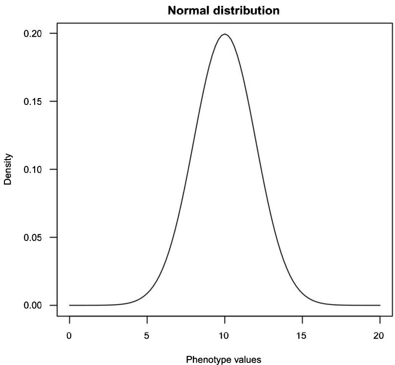
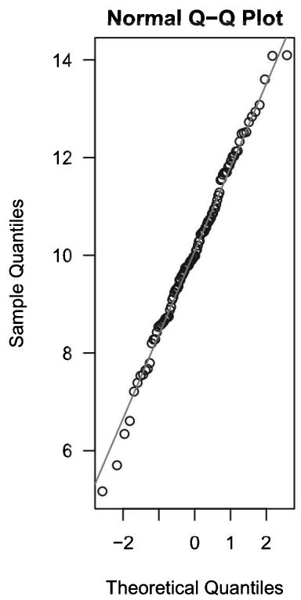
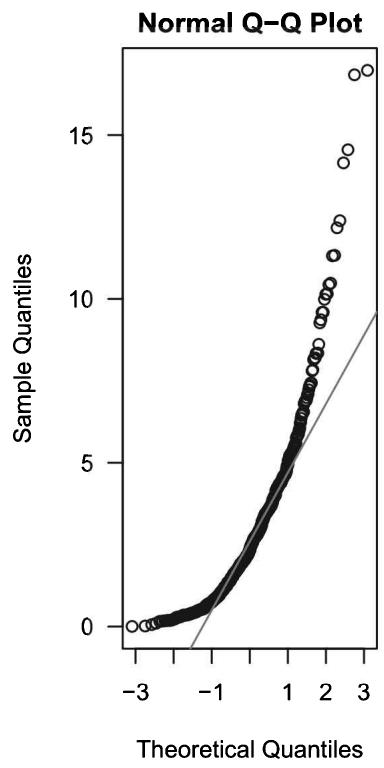
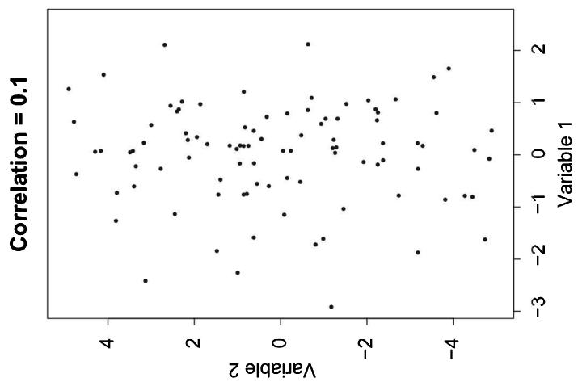
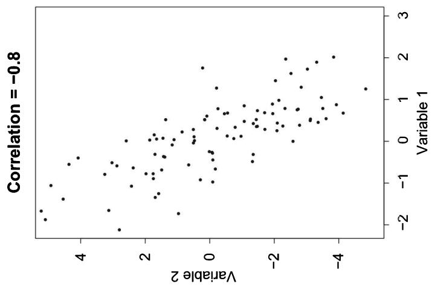
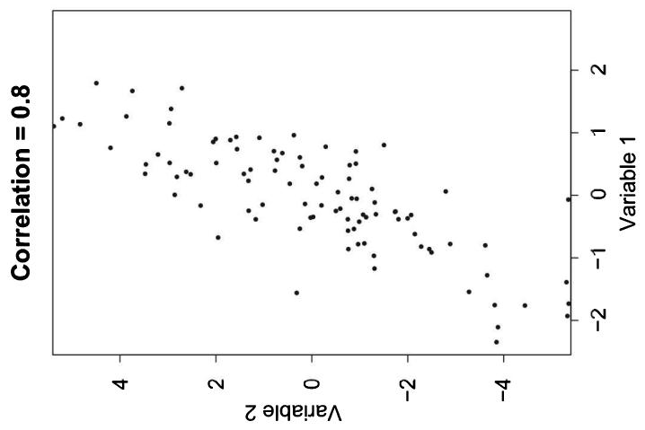
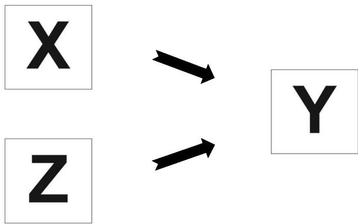
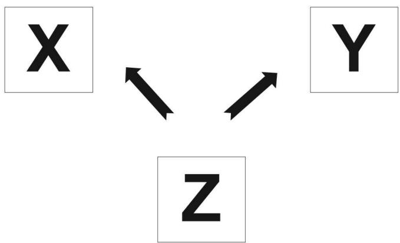
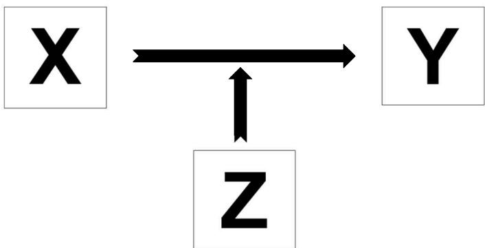

## Objectives

- Provide a refresher of basic statistical concepts, including variance, mean, and standard deviation, as well as covariance and variance-covariance matrices 

- Outline the basics and assumptions of statistical models used in this research, including the null and alternative hypotheses and significance thresholds 

• Distinguish between correlation versus causation 

• Provide an overview of causal models 

- Grasp the differences between fixed-effects, random-effects, and mixed models 

• Understand the basic issues surrounding replication of results and overfitting 

## 2.1 Introduction

Until now, we have concentrated on grasping the fundamental concepts and underpinnings of the human genome. Before moving to more advanced topics and in particular the applied statistical chapters later in this book, it is essential that you also grasp some of the core statistical concepts. As we noted at the onset, this book is written at an introductory level and aims to cater to the diverse group of researchers entering this field for the first time. Readers who already possess some basic statistical knowledge are bound to find this chapter too introductory. For those of whom statistics courses are a distant past or have only followed statistics as part of a larger program, you may find this basic refresher chapter useful. Although many of the concepts introduced in this chapter will be familiar from nongenetic data analysis, we also particularly highlight statistical concepts and issues unique to the analysis of genetic data. 

The aim of this chapter is to provide a basic primer to understand the core concepts required for genetic data analysis. We then introduce more advanced topics that you may wish to pursue further. If you are interested in applying these techniques at a higher level of statistical sophistication, we strongly encourage readers to engage in further reading using more advanced or specialized textbooks, some which we refer to in our further reading section at the end of this chapter. We first review some of the basic statistical concepts that are not exclusive to statistical genetic data analysis, such as the central tendency. The bulk of the chapter then unpacks the basics of statistical models and provides a refresher of related concepts such as the null and alternative hypothesis and significance thresholds. We then distinguish between the concepts of correlation versus causation, which is pivotal to distinguish when estimating these models. We also walk the reader through various types of causal models including direct and bidirectional causal relationships, additive and common cause models, and common mediation and moderation (or interaction) models. This is followed by a short introduction to the differences between fixed-effects, random-effects, and mixed models that are often used. We conclude with a short discussion about replication, overfitting and then provide a short summary. 

## 2.2 Basic statistical concepts

Since we know that readers likely come from a variety of disciplines and backgrounds we start with an introductory treatment of the main concepts. As described in chapter 1, you will frequently encounter the terms phenotype, which in these statistical models are the dependent variable, and genotype, which are generally what is known as the covariates, predictors, or independent variables. As we elaborate upon in later chapters, these variables can take various forms depending on their measurement. This measurement in turn impacts the statistical model that we choose. For instance, if a phenotype is measured as a binary variable (1 = disease, 0 = no disease) a logistic or other analogous model would be used. Whereas if the phenotype is measured as a continuous or quantitative outcome (e.g., height), you would need to adopt a model that not only captures the gradual scale of the data but also often the distribution of that measure. 

## 2.2.1 Mean, standard deviation, and variance

A core underlying tenet of statistics is the central tendency or deviation from the central tendency. This deviation is referred to as the distribution or spread around the central tendency, shown in the form of a normal distribution in figure 2.1. Three basic concepts are relevant. First, the mean is the average or in other words the sum of the variable values divided by the sample size. Second, the standard deviation is the average distance of individual values from that mean across all observations. Third, variance ( $\sigma^{2}$ ) is the average of the squared deviation of the observations of an outcome of variable (often random variable) $^{1}$ from its mean, divided by the number of individuals (sample size). 

To calculate the variance, we thus first calculate the mean and then for each number subtract the mean and square the results (i.e., the squared differences or deviation) and then calculate the average of those squared differences. It is the measurement of how numbers are spread or distributed from the mean. It is a critical statistical concept in genetics since it allows us to determine whether different genotypes are associated with a particular trait. We are often interested in knowing how much of the variance of a particular phenotype in the population is explained by a genetic score or variants and how much is related to the environment. It is vital to note that statistical tests rely on sample size, with a difference between the means of the groups and the variance within the groups. 




Figure 2.1


Central tendency and the normal distribution.


Why do we include the squared term? This is because the difference between each value for our variable such as height, for example, and the overall mean of the height could produce either positive or negative values. If we simply took the average, we could get a mean close to zero regardless of the spread of how tall or short people were in the group. Squaring is therefore used to give a positive value, so the sum is not zero. 

$$
\sigma^ {2} (X) = \frac {\sum (X _ {i} - \bar {X}) ^ {2}}{N - 1}
$$

In these types of analyses, we are often studying a sample that is taken from a larger population $(N)$ . When we calculate variance for an entire population we use N, but when we calculate variance for a sample (of a larger population) we divide by n-1, where $X_{i}$ is the phenotype (e.g., height) of individual i, $\bar{X}$ is the average height across all individuals, and n is the number of individuals. Recall that the mean $\bar{X}$ is the sum of all of the variable values divided by the total sample size. The standard deviation is the square root of the variance $\sigma^{2}$ . There are also several methods to fit different distributions. The distribution shown in figure 2.1 is the normal distribution. Here you will see that a normal distribution is symmetrical around its center in the shape of a “bell curve,” and the mean, median, and mode are all equal (see also box 5.1 in chapter 5 in relation to polygenic scores). There are many different types of distributions depending upon the shape of the variable including Weibull, log-normal, binomial, Poisson, or Gamma distribution to name only a few. For more advanced modeling, we encourage readers to delve into their data and dissect it to understand the distributions of different variables. 

Quantiles are the fraction (or, if you prefer, you can think in terms of percentages) of data points below the given value and can be used to compare the expected with the real distribution of variables. The quantile value of 0.3 (or 30%) is, for instance, the point where 30% of the data fall below that value and 70% fall above. See the appendix at the end of this chapter for additional options on how to simulate a random variable with various specifications. The Quantile-Quantile $(Q-Q)$ plot is the most frequently used visual graphing technique to evaluate the fit of a variable to a statistical distribution. As shown in figure 2.2, we plot the quantiles of one variable against the theoretical quantiles of a given distribution. The Q-Q plot is often used with genome-wide association studies (GWASs), described in chapter 4, and allows you to visually assess whether the assumption of the distribution that you have specified (e.g., normal) is violated and, if so, which data points are related to that violation. It is essentially a scatterplot of two different sets of quantiles plotted against one another. The vertical axis represents the estimated quantiles from the variable; the horizontal axis shows the theoretical quantiles from a given distribution. We also include a 45-degree reference line. If both of the two sets came from a population with the same distribution (in our example a normal distribution), the points should hover along our reference line as they do in the left panel of figure 2.2. The greater the departure is from the reference line (as in the right panel of figure 2.2), the greater the evidence you would have that the variable has a different distribution. We turn to these Q-Q plots in our chapter on GWASs but also later in chapter 12 in an applied exercise using computer-based output to assess and interpret an applied example. The R code used to create these plots is shown in the appendix. 

## 2.2.2 Covariance and the variance-covariance matrix

Covariance is the measure of joint variance between two (random) variables. The covariance between two variables indicates their similarity. In other words, if the greater values of one variable correspond to the greater values of a second variable, the covariance would be positive. Conversely, we would have a negative covariance if the greater values of one variable are opposite and correspond to the lower values of variable two. For example, if variable Y (weight) has a high value when variable X (height) is large and low when variable X (height) is small, the variables will have a high covariance. But the covariance would be close to zero if there is little or no connection between the two variables. To estimate the covariance between the two variables of X and Y, we can use the following equation where as previously $\overline{X}$ and $\overline{Y}$ represent the means of the variables. 







Figure 2.2
Quantile-Quantile (Q-Q) plots.


$$
C O V (X, Y) = \frac {\sum_ {i = 1} ^ {n} (X _ {i} - \bar {X}) (Y _ {i} - \bar {Y})}{N - 1}
$$

Where the covariance of a variable with itself is equal to its variance: 

$$
C O V (X, X) = \frac {\sum_ {i = 1} ^ {n} (X _ {i} - \bar {X}) (X _ {i} - \bar {X})}{N - 1} = \frac {\sum (X _ {i} - \bar {X}) ^ {2}}{N - 1} = \sigma^ {2} (X)
$$

A variance-covariance matrix is used to describe the variances and covariances between variables. It is sometimes also referred to as the dispersion matrix or simply the covariance matrix. The extension is that the covariance matrix generalizes the variance we discussed earlier to multiple dimensions. With these matrices, you will see that the variances are across the main diagonal (here in bold below) and other values refer to the covariances. This is shown for example as: 

$$
\begin{array}{c c c} \sigma_ {x} ^ {2} & C o v _ {x, y} & C o v _ {x, z} \\ C o v _ {x, y} & \sigma_ {y} ^ {2} & C o v _ {y, z} \\ C o v _ {x, z} & C o v _ {y, z} & \sigma_ {z} ^ {2} \end{array}
$$

The actual magnitude of the covariance can be difficult to interpret since it is not standardized and thus depends on the actual magnitude of the variables. When working with data and different types of variables, the size of the variance and covariance thus differs according to the units of the variable. Using the height example once again, if we measured it in meters or feet, the variance would appear smaller than if we measured it in millimeters. 

## 2.3 Statistical models

## 2.3.1 Regression models

In our applied chapters in the third part of this book (see, e.g., chapter 11), we focus on the estimation of a variety of statistical models, which we use to demonstrate how a particular set of variables relate to one another. In these applications, we often use theory to build our thinking about the relationships and which variables to include. This is generally driven by a literature review, which outlines the theory and underlying relationships and mechanisms that isolate and then link key predictors to the outcome. The model is also chosen according to assumptions about the distribution of variables and their covariance. Even with the best theory and literature review, however, it is often impossible to know the distribution or covariance in advance, so initial exploratory models often begin as a springboard to examine relationships and strive for the best fit. Note that there are also a-theoretical or hypothesis-free approaches to study associations and, in fact, a genome-wide association study (chapter 4) represents such a research design. 

The equation below describes a simple model of height, genes, and nutrition. It is assumed that height is a normally distributed variable and that both the genetic variants (polygenic score for height, $PGS_{height}$ ) and nutrition intake measured in calories have a linear effect on height. 

$$
h e i g h t = \mu + \beta_ {1} P G S _ {h e i g h t} + \beta_ {2} n u t r i t i o n + \varepsilon
$$

Where height is the phenotype of interest, $\mu$ is the intercept of the models, or the average value for individuals with the value 0 of the predictors $PGS_{height}$ and nutrition, $\beta_{1}$ is the estimated effect of $PGS_{height}$ on height and $\beta_{2}$ is the estimated effect of nutrition on height and $\varepsilon$ is the error term. In a linear model, the regression coefficients directly relate to the covariance as introduced earlier. In a model with only one predictor, we would write: 

$$
\beta_ {1} = \frac {\operatorname{Cov} (Y , X)}{\sigma^ {2} (X)}
$$

Due to the standardization of the covariance for the variance of $X_{i}$ , we can interpret the $\beta_{1}$ coefficient as a one unit change in Y if X changes one unit. This interpretation holds in multivariate models—with multiple predictors—holding everything else in the model constant. 

The term $\varepsilon$ in the equation represents the stochastic (probabilistic) part of the model. The elements of $\varepsilon$ are also called residuals, since they can be thought of as the differences between the outcome variable and the deterministic part of the model ( $\mu + \beta_{1}PGS_{height} + \beta_{2nutrition}$ ). In a standard linear model, the elements of $\varepsilon$ are assumed to have a normal distribution and to be independent of each other. 

Later in this book we will introduce readers to various statistical techniques and types of regression models. Regression analysis is the statistical technique used to estimate the relationships among often multiple variables or what is termed multivariate regression. Our goal is to examine the relationship between the genotype and phenotype and thus how the phenotype changes when the genotype and other independent variables (also called covariates, predictors, confounders) are entered into the model. This includes various regression models such as ordinary linear regression (OLS) and maximum likelihood estimation. As we will illustrate, the parameters estimated in these models show the degree that the variables are related, the level of uncertainty (via the standard errors), and statistical significance. 

## 2.3.2 The null and alternative hypothesis and significance thresholds

The goal of the regression approach is generally to test the null hypothesis, which is the statistical test to determine that there is no significant difference between specified groups. Recall from your previous introductory statistics courses that this refers to when your parameter of your estimate (Beta, $\beta$ ) is equal to zero. The alternative hypothesis is thus when your parameter is not equal to zero. We use data to perform statistical tests and if the null hypothesis is true we then calculate a p-value to determine statistical significance. Simply put, if the p-value is very small, the data are inconsistent with the null hypothesis. If the parameter passes the significance threshold (e.g., 0.05, 0.001) then the null hypothesis is rejected in favor of the alternative hypothesis. There has been considerable criticism and heated discussion in the area of statistical significance, primarily surrounding the fact that results are often interpreted only in relation to the null hypothesis. Some have also proposed to change the default p-value for statistical significance from 0.05 to 0.005 [1]. For the moment, however, interpretation in relation to the null hypothesis remains as a dominant approach. As we describe in more detail in chapter 4, genetic associations that are considered statistically significant must pass a stringent threshold with a p-value smaller than 5 times 10 to the minus 8 (i.e., $5 \times 10^{-8}$ ). In chapter 4 we also address the multiple-testing problem and why in fact we have this stringent threshold of $5 \times 10^{-8}$ . In reality, we would not estimate a simple model such as the one shown above, but would estimate a multivariate model with multiple predictors derived from the literature. The goal is often to optimize the accuracy of our prediction or test a particular hypothesis. In our later applied chapters readers will have the opportunity to estimate and interpret statistics from various models. 

## 2.4 Correlation, causation, and multivariate causal models

## 2.4.1 Correlation versus causation

The terms correlation $(r)$ and causation are used frequently throughout this book, and it is therefore essential to distinguish between the two. Correlation represents the statistical association of two variables with one another. It is a scaled version of the covariance that has a value between minus one and one. A value that is close to zero therefore signals little covariance between the variables. A value close to one represents a strong positive covariance, with a value closer to minus one denoting a strong negative covariance. Figure 2.3 shows three examples of variables with a different correlation structure. The plots on the left and central panels both have a correlation of 0.8, but in the opposite direction. Note that the covariances, correlations, and regression models we discuss here assume a linear relationship between two variables. In other words, we would draw a line through the scatterplots in figure 2.3 and assume constant unit changes of one variable based on another across their distributions. When a correlation is close to 1, variables tend to move in the same direction with relatively little variation around the association line; when it is close to -1, the direction is the reverse (i.e., when X is high, Y is low). The far right panel shows two variables with a very low correlation $(r=0.1)$ , meaning more variation in the data. Also some nonlinear associations are established in the literature, such as the U-shaped relationship between age at first birth of parents and the risk to be diagnosed with schizophrenia for the children [2]. Such associations will show low correlations in standard approaches but can be modeled, for example, with transformations of the dependent variables. 

A correlation is represented by the equation below where recall that $\sigma$ represents the standard deviation. 

$$
r = \frac {\operatorname{Cov} (X , Y)}{\sigma (X) \sigma (Y)}
$$

Correlations are the basis for many analyses such as GWASs and gene-environment interaction since they indicate a relationship between two variables. As we explore throughout this book, it is essential to distinguish between correlation and causation. Neophyte researchers can often make some inadvertent mistakes by inferring that variable X causes variable Y, when they are actually only observing a positive or negative correlation. Correlation simply describes the size and direction of the relationship between two or more variables. It does not mean that the change in one variable causes the change in values of the other variable. 







Figure 2.3
Examples of variables with high (0.8) and low (0.1) correlation.





Causation, rather, shows that the change in the values in one variable is the result of changes in the other variable. This is referred to as cause and effect. Take smoking, for example. You will find that smoking may be highly correlated with other behaviors such as higher levels of alcohol consumption. You cannot naively infer, however, that smoking causes alcoholism. Causality is often very difficult to expose in virtually all types of data analysis, including statistical genetic data analysis. In medical research, the use of randomized control trials is the most effective way to establish causality. In these types of studies, the sample is often split into two groups that are similar in most ways. They then receive different treatments, such as a placebo versus a particular therapy or drug. The outcomes of each group are then assessed. If the outcomes are markedly different, causality can be established. In reality, many of the complex traits that we study in this area of research often evade case-control or randomized control approaches. We are able to look at environmental changes (e.g., policy change, exposure to pollutant), but establishing causation remains a challenge. In later chapters in this book we will show various applied statistical approaches that attempt to establish causality in statistical genetics, including Mendelian Randomization. We will also highlight the challenges and continued areas of debate in this research. The aim of most applied quantitative statistical genetics is to estimate multivariate statistical models, a topic that we turn to now. 

## 2.4.2 Multivariate causal models

In this section, our aim is to describe some basic causal models, which are essential for our theoretical reasoning about associations between variables and crucial for the conceptualization and realization of the applied statistical analyses that follow. To illustrate the different causal models, we provide some diagrams throughout the book with some simple conventions (see box 2.1), showing directional causal links between variables that are represented in boxes with one-headed arrows. 

## Box 2.1 Conventions for graphical representation of causal relationships

We use some simple diagrams to illustrate theoretical causal relationships and to illustrate how we will model them in the applied chapters in parts II and III of this book. The key elements are: (1) variables are presented in boxes; (2) directional causal pathways are represented as solid one-headed arrows connecting variables, where the arrow determines the causal direction; and (3) no arrow between variables means no causal relationship between them. Even armed with only these very basic elements, we are able to visually represent more complex causal relationships between multiple variables. 

The most basic direct causal model can be represented as in figure 2.4, where X has a causal effect on Y. Consider the hypothesis that higher educational attainment (X) causes better health (Y). Some potential underlying causal mechanisms may be that higher educated individuals have better knowledge about healthy lifestyles, are more prone to visit doctors when they are ill, or have better access to health care. 

If this is true, we would expect to observe a correlation between educational attainment and health outcomes in our data. However, recall that correlation is not causation and different causal models might lead to the same observation in our data. It is, for example, possible that we observe a reverse causal relationship and that poor health (Y) in fact causes lower educational attainment attributed to higher levels of absenteeism or school dropout (see figure 2.5). 

Often a more plausible situation is that we observe a bidirectional causal relationship and that both relationships are true. In reality, education likely has a causal effect on health and vice versa. In this scenario, we would speak of a bidirectional causal relationship between X and Y (see figure 2.6). 

In all three scenarios shown in figures 2.4–2.6, we would observe a correlation between X and Y. Theory can often help us to understand and disentangle the causal direction. It is, for example, implausible to assume that the well-established correlation between height and education is due to the fact that education causes an increase in height. If theory or a literature review does not clarify the relationship, empirical strategies include the collection of longitudinal data in which individuals are observed over time or instrumental variable approaches, which we introduce in the framework of Mendelian Randomization in chapter 13. For example, we could apply Mendelian Randomization to establish whether there is a bidirectional causal relationship between schizophrenia and marijuana use. On the one hand, schizophrenia may increase marijuana use, but on the other hand, marijuana use increases the risk of developing schizophrenia [3, 4]. A particular and unique advantage of genetic analyses derived from the GWA studies we describe in chapter 4 is that genes are fixed at birth and thereby do not suffer reverse causality from phenotype to genotype. 

In the majority of cases, however, we are not interested in the simple association between two variables but rather the more complex relationship among multiple variables. Four basic causal models in such a framework are the additive model, model of a common cause, mediation model, and the interaction or moderation model, respectively. In reality again, mostly hybrids of these model types are true. 

Figure 2.7 depicts the additive model in which X and a second predictor variable Z have independent effects on Y. Think, for example, of a dinner party, where some people drink wine (X) and others drink beer (Z). Some of the guests, however, have both types of drinks. If we are interested in the causal effect of beer and wine consumption on how tipsy our guest will become (Y), we could correlate X with Y or Z with Y. What is important to note in the additive model is that when both X and Z have a causal effect on Y, if we would split the group by Z, for example, and differentiate the guests by those who drank some beer and those who did not, within each group we would observe the correlation between drinking wine (X) and getting more tipsy. The same holds if we split the group by X: Z would still be correlated with Y. By splitting the groups, we are simply referring to a multivariate analysis, where we might also use language, such as saying that we control for Z when studying the effect of X on Y. Usually, multivariate regression analyses are conducted for this purpose (see next section). 


Figure 2.4


A direct causal effect of X on Y.


Figure 2.5


Reverse causal relationship between X and Y.


Figure 2.6


Bidirectional causal relationship between X and Y.


It is also possible that we do not observe a correlation between X and Y among subgroups of Z but rather a causal model with Z as a common cause of X and Z. Consider for example the comorbidity (i.e., high correlation) between schizophrenia and bipolar disorder. In this case, the important causal question would be whether we can establish the true causal relationship between these two mental health conditions. One hypothesis is that the correlation is caused by genetic variants (Z) that are affecting both schizophrenia (X) and bipolar disorder (Y; see figure 2.8). If this would be true, we would observe a correlation between X and Y in our data. However, if we split the data in one group with individuals carrying alleles related to schizophrenia and a second group of individuals who do not have these markers, the correlation between X and Y would disappear in both subgroups. 




Figure 2.7


Causal model with additive effects of X and Z on Y.


We refer to this model when we say that Z might confound the relationship between X and Y. Genetic confounding is a major source of endogeneity, which we discuss in more detail in our chapters on polygenic scores and Mendelian Randomization. There we also provide the computer code to conduct these types of regression analyses in R and how to interpret results. 

Another type of causal model is a mediation model, where Z mediates the association between X and Y. In genetic research and beyond, we are often interested in the causal mechanisms that connect cause X and outcome Y. Such mechanisms are considered as intermediate variables Z, for example an intermediate phenotype (see figure 2.9). Consider the association between certain genetic variants and lung cancer. If we find a strong association, the aim is then to understand the causal chain in order to, for example, enact targeted intervention strategies. One possibility is that there is an underlying dysfunctional biological pathway. Another example is where a set of a genetic variants such as in a polygenic score (PGS) (X) has a causal effect such as how nicotine dependency causes smoking (Z), which in turn causes lung cancer (Y; see also figure 2.6). Similar to the confounding model, in such a scenario we would expect to observe a correlation between X and Y in the overall sample, but no correlation between the PGS (X) and lung cancer (Y) within the groups of smokers and nonsmokers (at least if all smokers smoke the same amount). Importantly, in contrast to the confounding model, PGSs in this example would represent the X variable and in the confounding model the Z variable. Here, the PGSs help us to theoretically differentiate between models, since in the mediation model genetics and the PGS cannot be the mediator (Z), since it is fixed at birth. 

Finally, a variable Z can change the effect of X on Y (figure 2.10). This model is called moderation model or interaction model, since X and Z interact in a sense that X also changes the effect of Z on Y. The chosen perspective depends on your main research interests, questions and theory. This model is most frequently used in gene-environment interaction (G×E) studies, which is one of the growing topics in statistical genetic data analysis. In this book, we describe gene-environment interplay in detail in chapter 6 and walk through empirical applications later in chapter 11. 




Figure 2.8


Causal model with Z as a common cause of X and Y.


Figure 2.9


Causal model where Z mediates the association between X and Y.


A well-established finding in the literature is that the effect of genes $(X)$ on body mass index (BMI) $(Y)$ increases across birth cohorts $(Z)$ [5, 6]. The theoretical reasoning behind this finding is that in more recent birth cohorts, high-fat diets became more easily accessible and were introduced already at young ages. There has been a steady increase in BMI and obesity over the past century in many industrialized countries such as the United States. In terms of interaction, this implies that the effect of birth cohort on BMI depends on genotype $(X)$ . Individuals with different genetic predispositions for BMI experience a differential effect of birth cohort on BMI. Empirically, this phenomenon of G×E interaction or heterogeneity in causal effects between groups implies that the effect of X on Y is significantly different if we stratify the sample by Z. It also implies that the overall effect of X on Y is some sort of weighted averaged effect of X on Y across groups of Z. It also implies that there will be smaller or larger effects in some groups or that it may even switch signs across them. Note that although mediation and moderation models are often confused, they are genuinely different in their meaning. 




Figure 2.10


Causal model where Z moderates the association between of X and Y; we can also say that X and Z interact.


## 2.5 Fixed-effects models, random-effects models, and mixed models

Until now we have only discussed fixed-effects models, which are when the effect of the covariate on the phenotypic outcome is modeled as fixed or the same per unit increase of the covariate across the sample. Fixed-effect models are thus different from random-effects models or mixed models, where some or all of the model parameters are considered as random variables. Readers should note that the terms are used slightly differently in biostatistics versus econometrics. Andrew Gelman has written an excellent blog describing these differences $[7]$ . In econometrics, fixed-effects models are frequently used to identify a series of individual-specific variables included in hierarchical or panel data. In biostatistics and the genetics texts, “fixed effects” refers to the population-average effects whereas “random effects” denotes the distribution of subject-specific effects. These random subject-specific effects are often considered as unknown latent variables. $^{2}$ We often use these models to control for what is termed unobserved heterogeneity. Here, the assumption is often that the heterogeneity is time constant and not correlated with the other covariates. Random-effects models are often very useful since we have subsets of individuals in the data. This includes variation of subsets or clusters of individuals such as by family, school, neighborhood, city, country, or hospital. When examining longitudinal data, the subset could be repeated measurements of the individual. Or if examining recurrent event data, the subset could be repeated disease episodes. We therefore model random effects to account for the subsets in the data that may in turn influence the main effects. 

Mixed-models contain both fixed and random effects. They are commonly used to examine repeated measures on the same individuals in longitudinal panel studies or measurements on particular subsets. In the genetics research covered in this book, mixed models are useful for controlling for population structure and estimating heritability. When using these models in relation to population structure, the random effect is the contribution to the genotype-phenotype associations that are due to the relatedness between individuals. The relatedness between individuals is, as we discussed previously, calculated using the Genomic Relationship Matrix (GRM). Mixed models thus account for the genetic distance between individuals in your sample and thus control for the potential confounding due to the association of differences in the genetic profile and differences due to geographic location. 

As discussed in our section on heritability in chapter 1, mixed models are also often used to estimate SNP-heritability using Genome-based Restricted Maximum Likelihood (GREML). This is a statistical method of variance component estimation that quantifies the narrow-sense additive contribution to a phenotype's heritability. This is specific to a particular subset of genetic variants, often limited to SNPs with a MAF of $>1\%$ . For this reason it has often been termed “chip” or “SNP” heritability (or $h^{2}_{SNP}$ , as introduced in chapter 1). As outlined previously, with the arrival of whole-genome data, researchers were able to go beyond the use of twin models to examine the genetic similarity between unrelated individuals. The software that is used to conduct this analysis is GCTA—Genome-wide Complex Trait Analysis (see “Software for mixed-model analyses” at the end of this chapter). These estimates produce a lower bound of the genetic contribution of a phenotype or trait without needing to rely upon the often restrictive assumptions from twin or family-family analyses. Simply put, if a particular phenotype is heritable, individuals who are more genetically related should have phenotypic values that are more similar. If the genetic relatedness of individuals is not an indicator of similar phenotypic values, then we can conclude that the particular phenotype is likely not influenced by genetics. Later in this book in chapter 9 we provide an example of how to use GCTA and conduct this type of analysis. 

## 2.6 Replication of results and overfitting

When engaging in an analysis only using one dataset or sample, $^{3}$ you may encounter the problem of overfitting, which is tied to the ability to replicate results in a separate sample. Overfitting refers to the problem when the predictors in your model predict the outcome better in your particular data or sample than they would in a new independent dataset. Overfitting can firstly, be the result of multiple testing. This is when the association between our covariates and phenotype go against the basic premise that this association is the result of both the true population effect and random chance. As we describe in chapter 4, genetic variants from these techniques are the result of testing the association of sometimes millions of genetic variants with a particular phenotype. Those with the largest associations are more likely to have a stronger contribution than we would expect than by chance. When researchers attempt to replicate the results in a smaller sample, they see that the result is often smaller associations. This is attributed to the fact that the top results from the originally overfitted model and their effect estimates (e.g., regression coefficients) are larger or inflated than the true effects. In fact, any joint model with multiple covariates or predictors will be overfitted if it is only built and tested on a single sample. This is due to the fact that we estimate parameters to optimize the fit of the model to that particular data. It is thus logical that the model does not perform well on new independent data. 

In this introductory textbook we cannot describe all of the ways in which to deal with overfitting and outline only a few here. One is the use of training and validation datasets, which are now more commonly used to counter this problem of replication. One option is to retest the finding in a similar independent dataset to see if the result replicates. Another option, which is becoming increasingly popular due to the release of large datasets such as the UK Biobank (which has around 500,000 individuals), is to split the data in the same sample into a training and validation set. This can then be repeated using different divisions of the data to improve robustness. 

Other techniques to deal with this problem are called regularization or shrinkage methods. Shrinkage methods perform variable selection to effectively shrink the parameters so that the predictors are still retained in the model but shrink some portion of the parameter estimates. Lasso regression can be used to perform variable selection and Ridge regression to shrink the parameter estimates. Although they go far beyond this introductory text, they effectively penalize the parameters in the formula for their optimization. There is also the elastic net approach that combines Ridge and Lasso regression. The penalty is formulated as a prior probability in Bayesian shrinkage methods. The penalty can be set in various manners such as penalizing large effects or shrinking small effects to zero or close to zero. The choice depends on the model and analysis. Since the underlying truth is often unknown, multiple analyses should be run to test which leads to the prediction in independent data and cross-validation. These methods are increasingly common in genetics and interested readers should refer to more advanced sources. 

## 2.7 Conclusion

The aim of this chapter was to provide a brief primer of some of the central statistical terms underpinning the core analyses in this book. As noted at the onset of this chapter, our intent was to keep the material as accessible as possible. As you advance in your knowledge, researchers are encouraged to pursue the mathematical and statistical underpinnings of models and methods in the ample advanced books and articles available in this area. Armed with the basic statistical concepts of central tendency and a reminder of the basic premises of statistical models, it is our hope that readers are able to more easily follow the chapters that follow. Here it is likewise vital to be able to distinguish between correlation versus causation and understand the intricacies and possibilities of the causal models you will be able to test. As we note in chapter 4, issues of replication have been key in this scientific enterprise. In chapter 6 we also note problems that have arisen, mostly in the area of early candidate gene studies that did not replicate nor have sufficient sample size, which remain core controversies and areas of discussion. 

## Exercises

1. Which causal model does each of the following (hypothetical) statements represent: an additive, common cause, mediation, or moderation model? 

a. The rs2777888 SNP reduces male fertility because it reduces sperm quality. 

b. High blood pressure is observed in parents and their children because they share the same dietary habits. 

c. If I do not eat enough before I exercise, my muscle pain will be worse. 

d. Both genes and the environment are important for predicting type 2 diabetes. 

2. Think about a causal model that is relevant to your own research and draw it using a diagram. 

3. Reproduce figure 2.1 in RStudio (see the appendix) using the following command: 

```txt
curve(dnorm(x,m=10,sd=2),from=0,to=20,main="Normal distribution", xlab="Phenotype values", ylab="Density") 
```

4. Simulate a random variable and display the mean, standard deviation, and 30% quantile of this variable. The R code below can be used to simulate a random variable following a Normal distribution with mean 10 and standard deviation equal to 2. 

```txt
X<-rnorm(100, 10, 2) 
```

Estimate its empirical mean, standard deviation, and quantiles by typing the following commands in RStudio. 

```txt
mean(X)
sd(X)
quantile(X,.30)
summary(X) 
```

5. Repeat the previous exercise and simulate a variable based on a mean of 20, a standard deviation of 5, and on 1,000 individuals. 

6. Reproduce figure 2.2 using the following code in R. Note that the variable plotted in the right panel of the figure is obtained by simulating a chi-squared distribution with 3 degrees of freedom. 

```julia
par(mfrow=c(1,2))
qqnorm(X)
qqline(X, col=2)
y <- rchisq(500, df=3)
qqnorm(y)
qqline(y, col=2)
par(mfrow=c(1,2)) 
```

7. Reproduce figure 2.3 using the following code in R. 

```r
rho1 <- 0.8
m1 <- 0; s1 <- 1
m2 <- 0; s2 <- 3

m <- c(m1,m2)
sigma1 <- matrix(c(s1^2, s1*s2*rho1, s1*s2*rho1, s2^2), 2)

par(mfrow=c(1,3))

require(MASS)
bivariate.dist1 <- mvrnorm(100, mu=m, Sigma=sigma1)
colnames(bivariate.dist1) <- c("X1", "X2")
plot(bivariate.dist1, pch=20, xlab='Variable 1', ylab='Variable 2', main='Correlation=0.8')

rho2 <- 0.8
sigma2 <- matrix(c(s1^2, s1*s2*rho2, s1*s2*rho2, s2^2), 2)
bivariate.dist2 <- mvrnorm(100, mu = m, Sigma=sigma2)
colnames(bivariate.dist2) <- c("X1", "X2")
plot(bivariate.dist2, pch=20, xlab='Variable 1', ylab='Variable 2', main='Correlation=-0.8')

rho3 <- 0.1
sigma3 <- matrix(c(s1^2, s1*s2*rho3, s1*s2*rho3, s2^2), 2)
bivariate.dist3 <- mvrnorm(100, mu=m, Sigma=sigma3) 
```

```txt
colnames(bivariate.dist3) <- c("X1", "X2")
plot(bivariate.dist3, pch=20,
xlab='Variable 1', ylab='Variable 2',
main='Correlation=0.1')
par(mfrow=c(1,1)) 
```

## Further reading


Greene, William H. Econometric analysis. 4th ed. Upper Saddle River, NJ: Prentice Hall, 2000. 


Henderson, C. R., Oscar Kempthorne, S. R. Searle, and C. M. von Krosigk. The estimation of environmental and genetic trends from records subject to culling. Biometrics, Inter. Bio. Soc. 15(2), 192–218 (1959). 


Laird, Nan M., and James H. Ware. Random-effects models for longitudinal data. Biometrics, Inter. Bio. Soc. 38(4), 963–974 (1982). 


Burgess, S., and S. G. Thompson. Mendelian randomization: Methods for using genetic variants in causal estimation. London: Chapman and Hall/CRC, 2015. 


Verbeek, Marno. A guide to modern econometrics. West Sussex, UK: John Wiley & Sons, 2008. 


Yang, Jian, Noah A, Zaitlen, Michael E. Goddard, Peter M. Visscher, and Alkes L. Price. Advantages and pitfalls in the application of mixed-model association methods. Nat. Gen. 46(2), 100–106 (2014). 


## Software for mixed-model analyses

FastLMM: http://research.microsoft.com/en-us/um/redmond/projects/mscompbio/fastlmm/. 

GCTA: https://cnsgenomics.com/software/gcta/#Overview. 

GEMMA: http://www.xzlab.org/software.html. 

MMM: http://www.helsinki.fi/~mjxpirin/download.html. 

## Appendix


Figure 2.1 can be reproduced using R by typing the following command:


```txt
curve(dnorm(x,m=10,sd=2),from=0,to=20,main="Normal distribution", xlab="Phenotype values", ylab="Density") 
```

The R code below can be used to simulate a random variable following a Normal distribution with mean 10 and standard deviation equal to 2. 

```txt
X<-rnorm(100, 10, 2) 
```

We can then estimate its empirical mean, standard deviation, and quintiles by typing the following commands in RStudio. 

```txt
mean(X)
10
sd(X)
2
quantile(X,.30)
??
summary(X)
?? 
```

Figure 2.2 is obtained using the following code in R. Note that the variable plotted in the right panel of the figure is obtained by simulating a chi-squared distribution with 3 degrees of freedom. 

```txt
par(mfrow=c(1,2))
qqnorm(X)
qqline(X, col=2)

y <- rchisq(500, df = 3)
qqnorm(y)
qqline(y, col=2)
par(mfrow=c(1,2)) 
```

Figure 2.3 can be produced using the following code in R. 

```r
rho1 <- 0.8
m1 <- 0; s1 <- 1
m2 <- 0; s2 <- 3

m <- c(m1,m2)
sigma1 <- matrix(c(s1^2, s1*s2*rho1, s1*s2*rho1, s2^2), 2)

par(mfrow=c(1,3))

require(MASS)
bivariate.dist1 <- mvrnorm(100, mu=m, Sigma=sigma1)
colnames(bivariate.dist1) <- c("X1", "X2") 
```

```r
plot(bivariate.dist1, pch=20, xlab='Variable 1', ylab='Variable 2', main='Correlation=0.8')
rho2 <-0.8
sigma2 <- matrix(c(s1^2, s1*s2*rho2, s1*s2*rho2, s2^2), 2)
bivariate.dist2 <- mvrnorm(100, mu=m, Sigma=sigma2)
colnames(bivariate.dist2) <- c("X1", "X2")
plot(bivariate.dist2, pch=20, xlab='Variable 1', ylab='Variable 2', main='Correlation=-0.8')
rho3 <- 0.1
sigma3 <- matrix(c(s1^2, s1*s2*rho3, s1*s2*rho3, s2^2), 2)
bivariate.dist3 <- mvrnorm(100, mu=m, Sigma=sigma3)
colnames(bivariate.dist3) <- c("X1", "X2")
plot(bivariate.dist3, pch=20,
xlab='Variable 1', ylab='Variable 2',
main='Correlation=0.1')
par(mfrow=c(1,1)) 
```

## References


1. D. J. Benjamin et al., Redefine statistical significance. Nat. Hum. Behav. 2, 6–10 (2018). 


2. D. Mehta et al., Evidence for genetic overlap between schizophrenia and age at first birth in women. JAMA Psychiatry 73(5), 497–505 (2016). 


3. S. H. Gage et al., Assessing causality in associations between cannabis use and schizophrenia risk: A two-sample Mendelian randomization study. Psychol. Med. (2017), doi:10.1017/S0033291716003172. 


4. J. Vaucher et al., Cannabis use and risk of schizophrenia: A Mendelian randomization study. Mol. Psychiatry (2018), doi:10.1038/mp.2016.252. 


5. H. Liu and G. Guo, Lifetime Socioeconomic Status, Historical Context, and Genetic Inheritance in Shaping Body Mass in Middle and Late Adulthood. Am. Sociol. Rev. (2015), doi:10.1177/0003122415590627. 


6. S. Walter, I. Mejia-Guevara, K. Estrada, S. Y. Liu, and M. M. Glymour, Association of a genetic risk score with body mass index across different birth cohorts. JAMA—J. Am. Med. Assoc. (2016), doi:10.1001/jama.2016.8729. 


7. A. Gelman, Why I don't use the term "fixed and random effects." Stat. Model. Causal Inference Soc. Sci. (2005) (available at https://statmodeling.stat.columbia.edu/2005/01/25/why_i_dont_use/). 


## 3

A Primer in Human Evolution