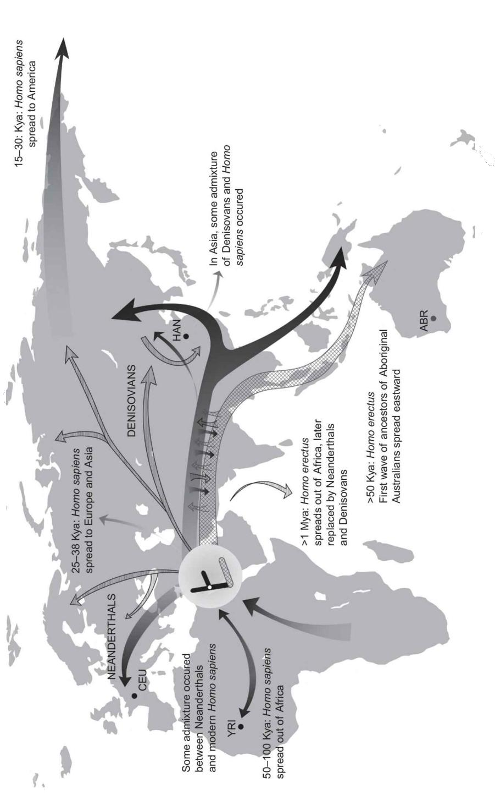
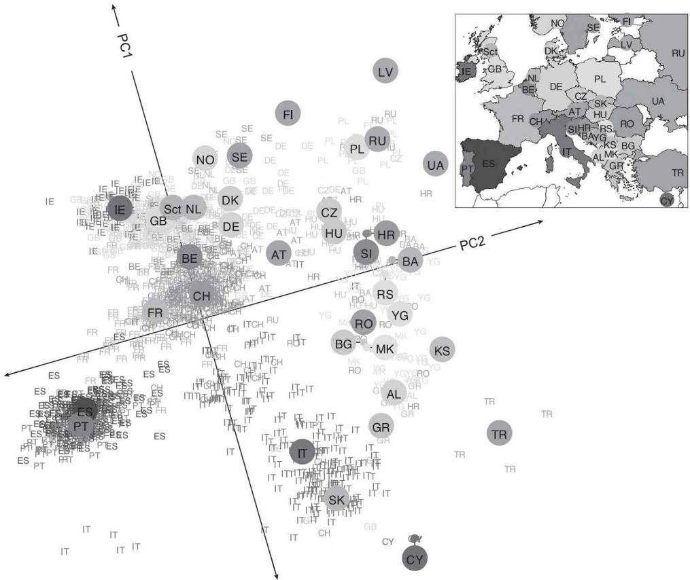
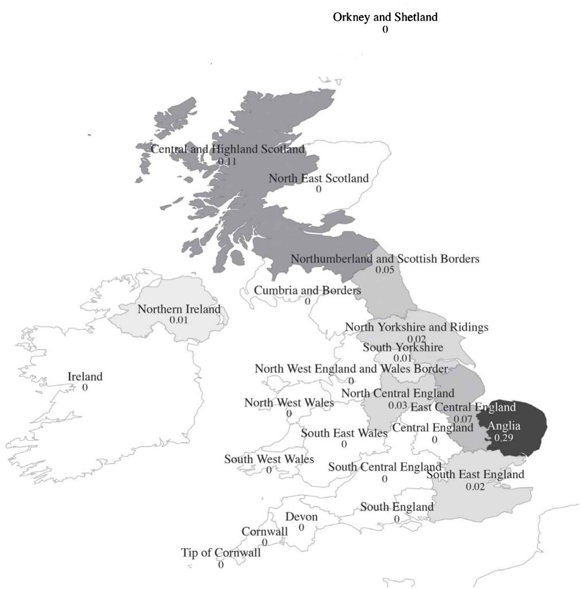
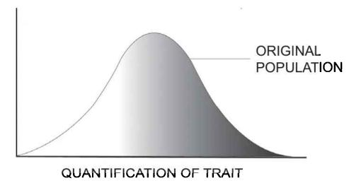
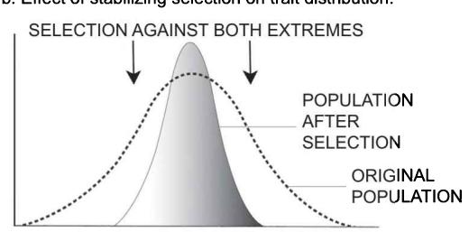
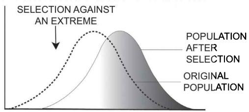
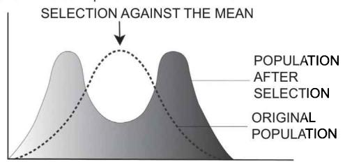
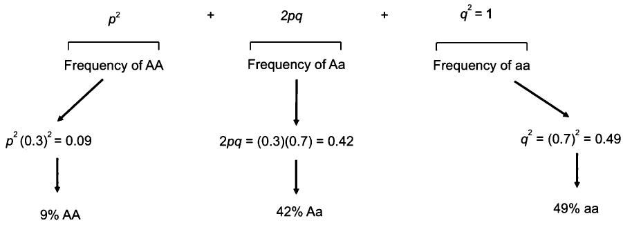

## Objectives

- Gain a basic understanding of human dispersal out of Africa and the link with genetic diversity 

- Grasp the concept of population structure and detecting population stratification with Principal Component Analysis 

- Understand the common misnomers of population structure and that ancestry does not equate to the socially constructed category of race, which is not a biological category 

• Realize how genes mirror geography 

- Identify the fundamentals of evolution, natural selection, fitness, types of selection, and related terminology 

- Comprehend how evolution can also occur via genetic drift in the form of a bottleneck or founder effects 

- Understand the assumptions, notation, and implications of the Hardy–Weinberg equilibrium 

• Grasp the basics about linkage disequilibrium and haplotype blocks 

## 3.1 Introduction

Human evolution and the history of our species are essential to understanding the human variability that we study in this book. The aim of this chapter is to provide a rudimentary synopsis of this vast area, which in turn forms the foundations of the genetic differences we study throughout this book. The contemporary human genomes we most often examine are the result of genetic reshuffling and recombination, migration patterns, and natural selection. In the next section we document the human dispersal out of Africa that occurred over millions of years. This includes some of the great human migrations and links of 

Homo sapiens with Homo erectus, Neanderthals, and Denisovians. An understanding of where we come from helps us to appreciate why certain populations such as sub-Saharan Africans have more genetic diversity than those of European ancestry, for instance. 

We then define the essential concepts of population structure and stratification and how Principal Component Analysis (PCA) is used to detect this. This is followed by debunking common misnomers and misuses of population structure and the clarification that ancestry is not equated with race, nor is race a biological category. We then discuss how genes, in fact, mirror geography and present several examples in this area of research. The broad topics of human evolution, selection, and adaptation are then outlined by first describing evolution and natural selection and linking them to core topics such as beneficial or deleterious alleles. This is followed by further elaboration of fitness and variations of selection, sexual selection, and sexual dimorphism. Evolution can also occur by what is known as genetic drift, and specifically bottleneck and founder effects. You will also need to understand the related notion of the Hardy–Weinberg equilibrium (HWE), including the main assumptions and basic notation. In chapter 1 we discussed how polymorphisms are inherited together through linkage disequilibrium (LD), and in this chapter we now link it to how this results in the haplotype blocks that we observe in populations. 

## 3.2 Human dispersal out of Africa

Archeological and anthropological work has been pivotal in our understanding of human dispersal. (For an overview, also with a visualization using maps, see [1, 2]). Human dispersal refers to the early migrations and expansion of modern humans across the continents, which began around 2 million years ago out of Africa. A brief history is mapped in figure 3.1. Humans are primates and the only surviving members of the genus Homo and the species sapiens. Within the family of Hominidae, $^{1}$ we are the closest to gorillas and orangutans. Humans split from gorillas and chimpanzees somewhere between 5 to 10 million years ago. Researchers currently estimate that Homo erectus migrated out of Africa into Asia and Europe over 1 million years ago. They were then replaced around a half a million years ago by a second lineage of Neanderthals and Denisovans. 

Around 50,000 to 100,000 years ago, Homo sapiens emerged as a new species in southern Africa and then spread out of Africa. Although most of the populations were isolated, there is evidence that some interbreeding occurred between Homo sapiens and Neanderthals, with many individuals of European ancestry still harbouring a small percentage of around 2% Neanderthal. A large migration of Homo sapiens formed the ancestors of Australian Aborigines around 40,000 years ago with a second migration colonizing Europe and Asia. Populations in northeast Asia then migrated across the Bering land bridge into northwest North America around 15,000 to 30,000 years ago. Research has suggested that these groups dispersed across the Americas via coastal routes. Two later out-of-Asia 

Figure 3.1
A brief history of the great human migrations.
Source: Produced by authors and adapted from the various sources of Stoneking and Krause (2001) [1], Rasmussen et al. (2011) [3], and Gibson (2015) [4]. (For a color version, refer to the online website of the book.) More than 1 million years ago (Mya) Homo erectus migrated out of Africa into Asia and Europe and were later replaced by Neanderthals and Denisovans (upper striped lines). The striped upper lines that split refer to an admixture between Denisovan-like populations and Homo sapiens. Between 50–100 Kya (i.e., 50,000 to 100,000 years ago), Homo sapiens emerged as a new species out of Africa (solid grey lines). Interbreeding occurred between Homo sapiens and Neanderthals. Over 50 Kya, a major migration of Homo sapiens resulted in the establishment of Australian Aborigines (gridded arrow). From 25–38 Kya, a second migration of Homo sapiens colonized Europe and Asia (black arrows). After around 15–30, Kya Homo sapien populations in northeastern Asia migrated across the Bering land bridge to northwestern America.

Box 3.1 

Why do sub-Saharan African populations have more genetic diversity than other populations? 

Most evidence places the origins of Homo sapiens in Africa. This is due to the fact that sub-Saharan Africa is where patterns of DNA sequence variation are the greatest. In genetics, the population with the greatest genetic variation is assumed to be the oldest. Current knowledge places the cradle of the human species in what is now modern Namibia and Angola in Southern Africa. This is attributed to the fact that when humans migrated to new regions, they took progressively smaller amounts of genetic variation in the gene pool with them. Each new population is younger than its original source and thus has less time to accumulate new mutations. In fact, sequencing of Khoi-San bushmen showed that even two people from adjacent villages were as different from one another as any two European or non-African ancestry individual $[5, 6]$ . 

migrations account for around half of the genetic variance in Eskimo-Aleuts and 10% of some Canadian First Nation (NaDene) populations. More recent migrations include Berbers populating North Africa (~10,000 years ago), the Pacific Islands (~3,000 years ago), and New Zealand's Māori (~700 years ago). This was followed by other waves of migration such as the European influx into the Americas in the late 1400s. This human dispersal across the globe in turn impacted genetic diversity between populations (see box 3.1 and also figure 9.1). 

## 3.3 Population structure and stratification

3.3.1 Population structure, genetic admixture, and Principal Component Analysis (PCA) Although most human variation is the same among all population groups, migration and what is termed “admixture” between different population groups leaves the breadcrumbs of population structure patterns. Genetic admixture occurs when two or more previously isolated and genetically differentiated populations interbreed. The result is new genetic lineages. The patterns of this population structure allow geneticists to derive ancestry based on genetics. This ability to map or quantify the subdivisions of populations is called population structure. Population structure refers to the patterns found in the genetic data that allow us to determine an individual’s ancestry. It shows how populations are divided due to genetic admixture. 

The most common way to estimate and detect population stratification is by employing the method called Principal Component Analysis, with applications and a more detailed discussion later in this book (chapter 9). Principal component analysis (PCA) is a statistical technique used to emphasize variation and bring out strong patterns underlying the data, with the aim of minimal loss of information. It is a way to reduce the dimensionality of data from high to lower dimensional data and allows the principal components (PCs) to be visualized. We need to reduce this dimensionality since one of the largest problems we face when comparing DNA sequences is that each of the 3 billion base pairs represents a possible dimension of similarity. Or, in other words, we would need to compare a pair of individuals nucleotide by nucleotide (i.e., at a single base-pair resolution) along a colossal 3 billion dimensions. To reduce the 3 billion dimensions of the data, we therefore use PCA to identify the axes that have the greatest genetic differentiation among individuals. PCA extracts the principal components from the data in a decreasing order of variance. As we describe shortly in our statistical foundations chapter, some readers will know PCA as multidimensional scaling, which reduces the full matrix of hundreds of thousands of SNPs to “eigenvectors” that capture the central components of the covariance. These are then plotted against each other using a 2-D scatterplot that visualizes the differences between individuals and populations. Each PC represents how much of the variance in genome-wide genotype frequencies are captured by that component. Most human variation is shared among all groups, with only small shifts in some allele frequencies. PCs in fact only explain very little of the overall variance. In many cases, the first two PCs explain the majority of genetic differences. 

## 3.3.2 Common misnomers of population structure: Ancestry is not race

One common misconception is that the population structure or PCAs equate to racial or ethnic differences, a statement that is patently incorrect (see box 3.2). The terms ancestry and race in human genetics are not interchangeable, and it is essential when entering this research area to engage in well-informed and careful interpretations of genetic differences between ancestral groups. Genetic variation must be distinguished from the social, cultural, and political meanings ascribed to different human groups. Race is not a biological category since as we have described in this chapter, genetic variation is traced to geographical locations and does not map into the perpetually changing and socially and politically defined racial or ethnic groups. Populations are the product of repeated mixtures over tens of thousands of years. The concentration of genetic alleles in some groups is thus related to where they have descended from and has nothing to do with the social category of race. 

## 3.3.3 Genetic scores cannot be transferred across ancestry groups

As we describe shortly in our chapter on genome-wide association studies (GWASs) and elsewhere $[7]$ , the majority of discoveries to date have been conducted on European ancestry populations. European ancestry-based polygenic scores derived from GWASs cannot be directly used for prediction in non-European ancestry populations due to differences in linkage disequilibrium (LD), allele frequencies, and genetic architecture. Recall from chapter 1 that LD refers to the fact that alleles are not randomly associated at different loci in a population. For instance, if a T at one SNP locus is almost always observed with a G at another SNP locus, the two SNPs are said to be in LD. This is due to the fact that their co-occurrence is more correlated than you would expect by equilibrium—or in other words random—association conditions. 

An excellent study that empirically demonstrates this problem is by Alicia Martin and colleagues $[8]$ . They show that these single-European ancestry GWASs have very limited portability to other populations, emphasizing the need to collect data from more diverse groups. A striking finding, for instance, was that height was predicted to decrease as the genetic distance from Europeans increased. This was contrary to actual observed height, such as those in West Africa. Using simulations, they demonstrated that the PGSs based on European populations were biased by genetic drift in other populations and that biases were unpredictable. 

More non-European ancestry-based GWA study discoveries are required to take the different LD population structures into account. In this way, we will be able to discover causal SNPs and those that may differ in their LD with the top hits across populations. Examining the PGSs from type 2 diabetes and coronary heart disease, for instance, Reisberg et al. showed that differences between the distributions of African and European-ancestry populations—and thus also high- and low-risk estimations—can be larger or even the 

Box 3.2 

Misconceptions of race and ancestry in genetics: Why white supremacists should not be chugging milk 

In 2018, Pulitzer Prize-winning New York Times author Amy Harmon published the article "Why White Supremacists Are Chugging Milk (and Why Geneticists Are Alarmed)" [10]. The piece addresses the misinterpretation of genetics by right-wing proponents of racial hierarchy. As Harmon notes, the use of the ancestry component of genetics research in the name of white supremacy has been perhaps one of the worst and most incorrect misappropriations of this research. It has been misused by these groups in relation to intelligence, school achievement gaps, immigration, and policing. As we have reviewed elsewhere [11], this links back to the dark history of eugenic policies that emerged in the 1880s and extreme atrocities in recent history. This perspective has been widely, and rightly, condemned. Harmon refers to a lecture of famous geneticist John Novembre, whose research is featured in the next section, where he describes white nationalists chugging milk at a gathering to emphasize their lactose tolerance as adults. There he likewise notes social media discussions of hate speech urging people who can't drink milk to "go back." As Novembre and Harmon both note, beyond this incorrect interpretation, these groups do not realize that cattle breeders in East Africa also have high lactose tolerance. The confusion for the lay public is compounded by the use of ancestry as a main selling point of many commercial direct-to-consumer genetics companies. In these tests a particular ancestral background is often used as Harmon terms as a "racial ID card" or "race realism." Academics increasingly respond to these deep-rooted misunderstandings and misappropriation of research—to those open to listen. In fact in November 2018, the American Society for Human Genetics (ASHG) published a statement denouncing attempts to link genetics and racial supremacy [12]. For a more detailed discussion by Novembre and others see additional reading [13, 14]. In our later chapter 14 on ethics, we return to this topic in more detail. 

opposite to each other [9]. The fact that the risk allele frequencies for these diseases of type 2 diabetes and coronary heart disease tend to be higher in African than European populations is the reason for higher-performing PGSs in African ancestry groups. As we describe in later chapters, the frequencies of the SNPs used for PGSs contain a strong population component even without applying any PGS weighting. 

## 3.3.4 How genes mirror geography

PCA methods have been used in multiple studies to stratify populations by continents, countries, or regions within a country without any prior knowledge of their geographical relationships. If a PCA is run including individuals from populations residing in Africa, Asia, and Europe, they are easily differentiated. A now-classic example is the 2008 Nature paper by Novembre et al., which mapped how genetic variation mirrors geography in Europe [15]. As shown in figure 3.2, the authors used the Population Reference Sample to show stratification by country of origin. The Population Reference Sample is a DNA resource that was assembled from a large number of subjects across the world in order to facilitate exploratory genetics research [16]. It included nearly 6,000 individuals of African American, East Asian, South Asian, Mexican, and European origin. The findings from the Novembre and colleagues study are clear and remarkable given the relatively compact geography and distances within Europe. Another example is the landmark 2014 study published in Science, which examined the genomic structure of admixed populations to produce an atlas of worldwide human admixture history [17]. The authors combined this genetic data with over 100 historical events that had occurred over the last 4,000 years. They were able to identify historical events such as the impact of the Mongol empire, Arab slave trade, and European Colonialism to reveal how admixture had shaped human populations. 

This type of research has often been conducted within countries as well. In the Netherlands, for example, a study showed that three principal components were significantly correlated with geography, dividing the country between north and south and east and west, with a distinct middle-band of the country $[18]$ . The strong north–south PC had correlations with genome-wide homozygosity, which reflects a founder effect related to northwards migration. We discuss the founder effect in the next section, which is related to a relatively small number of colonizing ancestors. The authors attributed this divergence between the different geographic subpopulations as signals for diversifying selection (defined in the next section) and as a sign of revealing a particular evolutionary history. 

The broader PCA plot in figure 3.2, however, still shows a broad view of ancestry along different axes. If individuals come from a relatively homogeneous background with limited migration or admixture, these types of metrics are very accurate. They are particularly accurate for European-ancestry individuals where all four grandparents are from the same country. If this is the case, researchers are able to pinpoint ancestry to within a few hundred kilometers [15]. In 2019, PC results are still difficult to interpret for admixed individuals such as Mexican Americans, who have genomic ancestry often from European, Native American, and West African populations. 

Figure 3.2

Genetic variation mirrors geography in Europe.

Source: Novembre et al. (2008) [15], Nature. Reprinted with permission from Macmillian Publishers Ltd. Notes: This figure shows that performing PCA on 1,387 European individuals results in two principal components (axis 1, PC1; axis 2, PC2) that correlate with geographical axes.

The ability to isolate PCs to very detailed fine-scaled regional variation has been further developed by the original authors of the atlas of genetic admixture $[17]$ . One study isolated genetic differentiation and what they termed “footprints of historical migration” in the Iberian Peninsula in Spain $[19]$ . This area in Spain has a very complex demographic history and uniquely a long period of Muslim rule. They were able to measure an admixture event dating from around 860–1120 CE (Common Era, identical to AD, Anno Domini) and the genetic impact of the Muslim conquest, population movements, and the Reconquista. What was remarkable was that they were also able to identify population structure to an unprecedented fine-grained geographic scale of smaller than 10 kilometers in some areas. Here they found the axis of genetic differentiation was east to west of the peninsula and found clear genetic similarity from north to south. 

This approach is soon to be extended for other countries such as the UK. Figure 3.3 shows some results of a highly fine-grained geographic genetic mapping of me, the first author. I am Canadian by birth and hold Canadian and Dutch nationality, the latter acquired by residence. If all four of my grandparents were from the United Kingdom, the proportions in the map in figure 3.3 would add up to 1. We see that the figures add up to 0.61, with the majority (0.29) from Anglia (Mills side of the family) and Scotland (Fleming side of the family). This map corroborates the oral family histories of my family migration from U.K.-based predecessors from Norwich (paternal grandfather) and Scotland (paternal grandmother). Also calculated (not shown here) are my apparent Dutch roots (0.16), but also Balkan, Scandinavian, and Russian, which when all added together add up to 1. The Norwich (Anglia) and Dutch link may reflect that this region used to be joined to Continental Europe and it was only around 5000BC at the thawing of the last ice age that it separated. After that trade was frequent across the North Sea. The U.K.-based estimate misses the maternal side that includes a Norwegian grandfather (and two Norwegian great-grandparents) or Greek great-grandfather (and two Greek great-grandparents). Direct-to-consumer companies such as 23andMe, for instance, also continuously update their ancestry data as they calibrate their algorithms and samples diversify. Results as of December 2018, now more accurately capture Greek and Balkan groups, for instance. Different consumer-to-genetics companies often have different ancestry results or the results change over time due to the reference sample in which they compare and methods used. 23andMe for instance previously had around $77\%$ European ancestry clients [20]. It will be fascinating to see how genetic techniques cope with increasing admixture from populations that are migrating and mixing at unprecedented levels. 

## 3.4 Human evolution, selection, and adaptation

## 3.4.1 Evolution, fitness, and natural selection

We learned in the previous chapter that our genome contains footprints of our ancestral lineage. Any genetic analysis in contemporary human populations therefore carries traces of the human past. Evolution refers to the change in heritable characteristics of populations over successive generations. Evolution forms the basis of our understanding not only about the origin of the human species but also the underlying genetic architecture and disease mutations. The forces driving evolution shape the basis for genetic variability within populations but also across different species. Evolution occurs over millions of years, with a spirited debate regarding whether we are able to measure it in contemporary populations (see box 3.3). It is important to note that the environment plays a key role in shaping evolution, which we explore in more detail in our upcoming chapter 5 on gene-environment interplay. 

In biology, evolution is considered to be the study of changes in the gene pool of a population across the generations, governed by processes such as mutation, natural selection, 

Figure 3.3

Fine-scaled UK regional ancestry of Melinda Mills.

Thanks to Daniel Lawson of University of Bristol and GENSCI Ltd for producing the figure. Copyright University of Bristol and Oxford University. All rights reserved.

Box 3.3 

Can we measure evolution and natural selection in contemporary populations? Are we getting dumb and dumber by each generation? 

What is the time scale of evolution? Considerable debate exists in this field about whether we are able to measure evolution and selection in contemporary human populations. Some studies, for instance, argued that they have found natural selection on genes implicated in higher educational attainment in contemporary populations in the United States $[21]$ and Iceland $[22]$ . The Icelandic study constructed a score to capture this genetic component and found that individuals with higher polygenic scores (PGSs) for educational attainment had fewer children. They concluded that although small, the rate of decrease was discernable on an evolutionary timescale. A study using data from the United States also showed evidence of negative natural selection on genes implicated in higher educational attainment in a contemporary population the United States. 

As we have described elsewhere $[23]$ , to claim evidence of natural selection, these studies measure how much the number of children varies to produce some sort of measure of the “magnitude” of natural selection. If the genetic component of a trait is associated with the number of children, the studies conclude that they are evolving as a result of natural selection. In other words, the PGS of educational attainment is applied to assess whether those who have genetic variation related to lower or higher education are predisposed to having more or fewer children. 

There are, however, some crucial limitations of these studies. First, selection on education is weak and changes associated with it are very slow. They fail to differentiate between genetic and environmental influence on the number of children individuals have. Natural selection on education may not remain negative over enough generations to shed light on changes, and the period of several decades is very short to examine this question. Second, the “genes for education” are associated with many other cognitive and noncognitive outcomes. The PGS for education reflects associations that might not be causal for education but also other traits. For instance, we found a 0.70 genetic overlap (LD-score regression described later) between the PGS for educational attainment and age at first birth, with similar factors thus driving both $[24]$ . Third, when considering complex behavioral traits such as education, the genetic basis of fertility behavior is also strongly influenced by cultural, economic, and social factors $[25]$ . Educational expansion—particularly of women—has increased by around 2 years of education per generation in addition to other factors such effective contraception, allowing individuals to regulate fertility. This means that the environment has strongly changed and has not been held constant over this period. Fourth, phenotypes such as educational attainment do not perfectly correlate with cognitive skills and education, suggesting we are not getting “dumb and dumber” by the generation as is sometimes implicitly suggested. Finally, most of the data used to examine contemporary natural selection suffer from a healthy volunteer effect and mortality bias of including only people that are healthier and more likely to survive $[7, 26, 27]$ . 

and genetic drift. Mutation refers to a change to the actual sequence of a genome (see chapter 1, box 1.1). The relevant mutations to consider are those that occur in the germ line mutation $^{2}$ of the organism that can be passed on to offspring across the generations. Natural selection is the increase or decrease of particular genetic traits as a function of the differential fitness and the reproductive success of individuals. In other words, natural selection operates when particular genetic variants render the individuals who bear them more likely to survive. As a consequence, those genetic variants increase in frequency in the next generation. Natural selection is said to drive adaptive evolution to select for traits that are beneficial to a particular population within an environment. One way to think about selection is that it is a filter that removes suboptimal alleles from a population so that it is better adapted to its environment. 

The process of adaptive evolution refers to the selection of beneficial alleles, or those that are useful in particular environments and thus increases their frequencies in a population. This is in contrast to decreasing the frequency of deleterious alleles. Someone who carries a single recessive deleterious allele—sometimes called a “harmful” allele—will not experience the impact of this allele but can easily pass it on to the next generation. If we have a large population, this is not usually a problem since the population carries many deleterious alleles that are rarely expressed. 

Fitness—also sometimes referred to as evolutionary fitness—is how well a species adapts to its environment. If a species is no longer reproducing, they are considered as no longer evolutionary fit. This was first coined by Herbert Spencer but more famously to the extensions and work of Charles Darwin. Relative fitness compares an individual's fitness to others in the population or, in other words, which individuals contribute to offspring in the next generation. This in turn allows us to establish how a population might evolve. For example, since height is highly heritable, if taller individuals have more children, genes important for being tall become more frequent in future generations $[28]$ . The term fecundity is also often used in this research to refer to the number, rate, or capacity to produce offspring. This can be confusing for interdisciplinary or medical researchers, since this term is often used in the medical and demographic sciences to represent the biological ability to conceive within one year and related to infertility $[29]$ . Darwinian fitness is also a frequently used expression, which refers to the average contribution to the gene pool to the next generation by an average individual's genotype or phenotype. Natural selection only operates on traits that are heritable. 

Different variations of selection contribute to the way in which natural selection can affect variation within a population, which is visualized in figure 3.4. Panel a in this figure shows the classic normal distribution of the trait. Without any selection pressure on height, for instance, the height of people within this population would vary, with most being average and very few being extremely short or tall. Stabilizing selection, shown in panel b, is when an average (non-linear) trait is favored. This happens when selective pressures choose against two extremes of a trait. Using the height example it would mean that the very short and very tall have difficulty competing, with these two selection pressures resulting in selecting only average height people. Directional selection, in panel c, is when an extreme trait is favored over others causing the allele frequency to shift over time toward the direction of that phenotype. Or in other words, one extreme of the trait distribution experiences selection against it. As the figure illustrates, the entire population's trait distribution shifts to the other extreme. The majority of examples come from other nonhuman species. Black bears in Europe, for example, decreased during interglacial periods and increased during each glacial period. Diversifying or disruptive selection (panel d) refers to genetic changes in which extreme values for a trait are favoured over more moderate or intermediate values. The variance of the trait thus increases, dividing the population into a bimodal curve. As we touched upon previously, the strong North–South principal component divide between the North and South of the Netherlands has been argued as an example of this type of diversifying selection [18]. 

a. Standard distribution of trait across a population.

c. Effect of directional selection on trait distribution.

d. Effect of disruptive selection on trait distribution.

Figure 3.4

Types of natural selection.

There are other types of selection in the literature that we only briefly touch upon here. Frequency-dependent selection is when traits that are either common (positive frequency-dependent selection) or rare (negative frequency-dependent selection) and are favoured through natural selection. Sexual selection refers to natural selection that emerges due to the preference by one sex for particular characteristics in another. Intersexual selection is when members of a competitive sex show off attractive traits to gain the attention of a mate and thus increase their chances to be selected and have better reproductive success. $^{3}$ This can be physical traits such as height [28, 30], but within human populations there is also a rich literature on assortative mating by traits that represent a more successful partner such as educational level [31–33]. Sexual selection thus results in the development of secondary sexual characteristics that help to maximize reproductive success. Sexual dimorphism describes the differences (e.g., physical, cognitive, behavioural) between parental investments of the same species. Genes can thus be expressed differently between the sexes, or in other words, different genes are involved with traits in men and women (i.e., dimorphism). Elsewhere, for instance, we explored sexual dimorphism in different genetic loci operating in male and female fertility and that these genes are potentially passed on to the next generation [34]. There is also genetic hitchhiking, known as genetic draft (not to be confused with genetic drift). This is when an allele changes frequency not due to the fact that it is under natural selection but due to the fact that it is near another gene undergoing a selective sweep (an allele is on the same DNA chain). When one gene goes through a selective sweep, other nearby polymorphisms that are in linkage disequilibrium (LD), which we turn to now, generally change their allele frequencies. 

## 3.4.2 Genetic drift

Although natural selection is an important aspect of evolution, it is not the only mechanism. Evolution can also occur by chance or what is referred to as genetic drift. Genetic drift is a mechanism where allele frequencies of a population change over generations due to chance, often quantified by sampling error. It is measured as change due to sampling error in selecting the alleles for the next generation from the gene pool of the current generation. The effects of genetic drift are the strongest in smaller populations and can result in the loss of some alleles. Both beneficial and deleterious alleles are subject to selection and drift but a very small population with strong drift may cause the loss of a beneficial allele and what is known as the fixation or carrying on of a deleterious allele. Two main types of genetic drift have been identified in the literature: the bottleneck effect and the founder effect. 

A bottleneck effect is an extreme example of genetic drift that has large effects due to a drastic reduction in population size by an exogenous factor such as a natural disaster. This is often attributed to natural disasters such as earthquakes, floods, and fire that have the potential to decimate entire populations and leave behind a limited number of survivors. Since the allele frequency of the survivors may be very different from the population composition prior to the natural disaster, some alleles may not be present at all. This means the smaller population is more susceptible to the impact of genetic drift for multiple generations and the loss of more alleles. It is called the bottleneck effect since we can use the analogy that a bottle is filled with marbles that represent a population. After a natural disaster, which is represented by the small opening of the bottle, a small random group of individuals (marbles) pass through the bottleneck. These then form the new population, with the large majority of individuals (marbles) in all of their variety remaining in the bottle. In humans, the example often used to describe population bottlenecks is of the Greenlandic Inuit. A study in 2017 by Pedersen and colleagues [35] showed that the Inuit experienced a severe and prolonged (~20,000-year long) bottleneck. The result was the most extreme allele frequency distribution tested to date. This Inuit population carries fewer deleterious variants than other human populations but those that are present are at higher frequencies than other populations. They argue that this population is thus ideal to study the effect of bottleneck patterns of deleterious variation. 

The founder effect is another type of genetic drift, which is when a small group splits from the main population to found a colony. This newly formed colony is isolated from the original larger population, and the founders of the colony may be “selective” and thus not represent the full genetic diversity of the original group. The allele frequencies may thus differ between the original and founder (colony) population and the founders may even miss a selection of alleles. A common example is the Amish in North America. In Eastern Pennsylvania, a small group of around 200 German immigrants moved to form a small, closed colony. The group carries a usual concentration of gene mutations that results in various inherited disorders that are otherwise rare. One is Ellis-van Creveld syndrome, which causes a form of dwarfism $[36]$ . Since the colony of these founders was relatively small, and they tended to marry within the same group, there was a greater likelihood that the recessive genes of these founders combined and showed up more frequently (see chapter 1). Another study of British Pakistani adults with high parental relatedness discovered rare-variant homozygous genotypes that predicted “knockouts” (loss of gene function) in hundreds of genes $[37]$ . 

Population size is an important component in understanding genetic drift. We know that larger populations are less likely to change very quickly due to genetic drift. Since it is due to chance it is somewhat akin to the example of flipping a coin in a small versus large population. If you were to flip the coin only a few times (i.e., the small population), it is possible to get a heads-to-tails ratio that is quite different from the 50:50 ratio that you would achieve if you flipped the coin many times (i.e., a large population). Genetic drift differs from natural selection. Whereas natural selection takes into account whether an allele is beneficial or deleterious, in genetic drift a deleterious allele could be fixed by chance and a beneficial allele might even be lost. 

## 3.5 The Hardy-Weinberg equilibrium

## 3.5.1 Assumptions of the HWE

Another central concept within this area of research is the Hardy–Weinberg equilibrium (HWE), which is a theoretical mathematical model describing the probability and distribution of genotype frequencies in a population. The main purpose of the HWE is to express the principle that the amount of genetic variation (allele and genotype frequencies) in a population will remain constant from one generation to the next in the absence of evolutionary influences. The HWE is used to model and predict genotype frequencies in large, stable populations. Put another way, when a population is in HWE for a gene, it is not evolving and allele frequencies will remain the same across generations. 

The HWE dictates that the frequencies and relative proportions of genotypes remain stable—or in other words in equilibrium—over time if all assumptions of the HWE are met. The proportions will remain constant at this equilibrium if these five assumptions hold: 

1. There is no natural selection (i.e., all genotypes have equal fitness) 

2. There is no genetic drift (i.e., stable population size) 

3. A closed population (there is no significant migration in or out of the population) 

4. Mutation does not occur 

5. There is no assortative mating 

These assumptions thus entail that the population structure is not from two or more subpopulations, there is no inbreeding (i.e., mating without one or more common ancestors), males and females have similar allele frequencies (i.e., more likely on the autosomal locus), all members of the population have equal reproductive success and the population is infinitely large. 

If the basic assumptions are not met for a particular gene, the population may evolve. Or in other words, genotype frequencies might change. Most will immediately realize that these are assumptions that are likely to be violated in many instances. The HWE is thus a useful test since any deviation suggests that the locus has been influenced by non-equilibrium forces. This includes factors such as mutation or natural selection. In practice, violation of the HWE may also point to measurement error in genetic data. Testing the HWE is therefore a crucial part of the quality control process in handling genetic data that we describe in the second part of this book. Perhaps it is important to also clarify that evolution does not mean that all populations are all moving toward one state of similar perfection. Rather evolution means that a population changes genetic makeup over different generations. The changes are often subtle and take multiple generations over a long period of time (see box 3.3). 

## 3.5.2 Understanding the notation of the HWE

The notation often used to describe the HWE is $p^{2}$ , 2pq, and $q^{2}$ to represent the three genotype probabilities. Let us first use an example where the population is not evolving. Here note that: 

p = the frequency for the major allele (A) 

$q =$ the frequency for the minor allele $(a)$ 

Let us assume that the allele $A$ has a frequency of $p = 0.3$ and allele $a$ has a frequency of $q = 0.7$ . 

The Hardy–Weinberg equation is thus: 

We expect the genotype frequencies of 9% AA, 42% Aa, and 49% aa. 

To predict the genotype frequencies of the next generation several assumptions need to be made. If we first make the assumption that none of the genotypes is superior to the other in terms of fitness or finding mates we can set the frequencies of A and a alleles in the pool of gametes (i.e., sperm and eggs) that will in turn produce the next generation. Second, if we assume that there is no assortative mating (i.e., individuals mate randomly), reproduction is assumed to be the result of two random events—selection of a sperm and egg from the same gene pool. Recall the Punnett Square from the previous chapter. In practice the HWE can be used to determine the frequency of individuals that may be affected by a diseases caused by what is known as recessive deleterious mutations. One example is Tay-Sachs disease, which results in mental and physical deterioration and early childhood death. This mutation has a higher frequency of up to 2% in Ashkenazi Jews. If two people of that ancestry had a child and are both homozygous for the disease mutation, we can use the HWE to determine that $0.02^{2}=0.0004$ , which is 0.04%. 

## 3.6 Linkage disequilibrium and haplotype blocks

Recall from chapter 1 that during recombination, variants that are located near one another on the same chromosome have a high probability of being transmitted together. This is due to the fact that there are only one or two recombination events per chromosome. Polymorphisms are inherited together through what is called linkage disequilibrium (LD), which is the nonrandom occurrence in members of a population of the combinations of 2 or more linked genomic loci. For instance, if a T at one SNP locus is generally observed with a G at another SNP locus, these two SNPs are said to be in linkage disequilibrium. Their co-occurrence is more correlated than we would expect by random (equilibrium) conditions. Two alleles (i.e., that are variants of polymorphisms) which are located at different positions at the same chromosome are in LD if they are not inherited independently from one another. In general, alleles which are located close together at the same chromosome will have stronger LD. 

Why is this the case? Recall from our discussion of genetic recombination in chapter 1 that when a chromosome is transmitted to a sperm or egg cell during the process of meiosis, the two neighbouring SNPs are transmitted together or there is a recombination in between. The probability of recombination is low for a very small section with on average around 35 recombinations per meiosis. This is around one recombination every 100 Mb. This in turn leads to the correlated inheritance of linked SNPs over time, or LD. Conversely, when two SNPs are inherited randomly (i.e., unlinked), they are said to be in equilibrium. High LD thus means that two SNPs are linked, which is measured by $R^{2}$ . This is the level of correlation between SNPs where a perfect correlation of 1 means fully linked SNPs and two random SNPs would be $R^{2}=0$ . One way to think of it is like the shuffling of a deck of cards where we often take “chunks” of cards instead of only individual cards. 

As a result of LD, we often measure one tag SNP in order to predict the genotype of another. This is referred to as imputation, which we explore later in the applied chapters. In practice, it is more difficult as we cannot always isolate a SNP in perfect LD where $R^{2}=1$ . As noted in the previous chapters, these SNPs are the core markers or flags that we examine [38]. Even if there is no direct association between a SNP marker and a trait, it may be the case that it is indirectly associated with the trait if it has been transmitted together with a causal genetic variant—or in LD. The markers we often observe thus are often more flags on the genome to mark the area where a causal genetic variant might be present but may not be the causal variant itself. If LD is 0.9 for instance, it is hard to prioritize the causal SNP. In many cases SNPs are in LD with nearby genetic variants that are not captured in the particular GWAS array. (We discuss different arrays in more detail in chapter 7.) The GWA studies we discuss in an upcoming chapter thus also detect these unobserved variants or also the low-frequency and common genetic variants across the genome. 

As a result of LD, we observe haplotype blocks in populations. When variant alleles are transmitted together during recombination, they are more likely to be found in the larger population and form what is called haplotype blocks. Haplotype blocks are a sort of mutation or recombination of a set of closely linked alleles on a chromosome that evolutionarily over time tend to be inherited together in LD $[38, 39]$ . These are the blocks of SNPs that are inherited as a group. Although LD is roughly similar across populations, haplotype blocks vary. They are considerably shorter in African populations where there is more diversity that has been present for a longer period of time. Interested readers should refer to the International HapMap project, which has detailed reviews, tutorials and multiple resources on this topic (see “Further reading”). 

## 3.7 Conclusion

The goal of this chapter was to provide readers with a very brief chronicle of the human dispersal out of Africa over millions of years in order to understand patterns of interbreeding, migration, and admixture. This was then linked to contemporary population structure and stratification found in contemporary data, which is detected using Principal Component Analysis. We also elaborated on common misnomers of population structure and mistakes when population structure and ancestry are incorrectly equated or race is misinterpreted as a biological rather than a socially and politically constructed term. Although only fleetingly, we show how these methods can be used to illustrate how genes mirror geography by continents, countries, or regions. We then turn to the fundamental topics of evolution, natural selection, and fitness (and variations of fitness). These help us to comprehend the increase or decrease of particular genetic traits in relation to reproductive success. We then differentiate this from bottleneck and founder effects in the form of genetic drift. Theoretical mathematical models have also been developed to test for deviations in the probability and distribution of genotype frequencies in a population in the form of the Hardy–Weinberg equilibrium, which follow five key assumptions (no natural selection, no genetic drift, no assortative mating, closed population, no mutation). Finally, we explain haplotype blocks, which is when variant alleles are transmitted together during recombination and thus more likely to be found in the larger population. We now turn to the basis in which the majority of genetic data we use in this book is derived from, which are genome-wide association studies. 

## Exercises

1. Go to the website that accompanies the Hellenthal et al. (2014) Science article: http://admixturemap.paintmychromosomes.com/. Read the two tutorials under the “Historical Event” menu. Click on a labeled population on the map or selection from the “Target Population” drop-down menu. Examine some of the details of the past admixture events that they use to infer how that population has been formed. Pick one historical event and read the historical interpretation of the admixture signals that we see. 

2. Go to the site of the International HapMap project and explore: https://www.genome.gov/10001688/international-hapmap-project/. 

3. Explore ANCESTRYMAP 2.0 from https://reich.hms.harvard.edu/software. 

## ANCESTRYMAP 2.0 from https://reich.hms.harvard.edu/software

ANCESTRYMAP (Patterson et al., 2004) finds skews in ancestry that are potentially associated with disease genes in recently mixed populations like African Americans. It can be downloaded on various operating systems and see the tutorial: https://reich.hms.harvard.edu/software/tutorial. The ANCESTRYMAP Software Documentation is available at https://reich.hms.harvard.edu/sites/reich.hms.harvard.edu/files/inline-files/ANCESTRYMAP_documentation.pdf. 

## Further reading and resources

## Basic books on evolution and migration

Ayala, F. J., and C. J. Cela-Conde. Processes in human evolution: The journey from early hominins to neanderthals and modern humans. Oxford: Oxford University Press, 2017. 

Harari, Y. N. Sapiens: A brief history of humankind. London: Harvill Secker, 2014. 

Knight, J. C. Human genetic diversity. Oxford: Oxford University Press, 2009. 

Rutherford, A. A brief history of everyone who ever lived. London: Weidenfeld & Nicolson, 2016. 

Wood, B. Human evolution: A very short introduction. Oxford: Oxford University Press, 2019. 

## Readings on methods, structure, and Principal Component Analysis

Conomos, M. P., M. B. Miller, and T. A. Thornton. Robust inference of population structure for ancestry prediction and correction of stratification in the presence of relatedness. Genet. Epidemiol. 39(4), 276–293 (2015). 

Gopalan, P. et al. Scaling probabilistic models of genetic variation to millions of humans. Nat. Gen. 48(12), 1587–1590 (2016). 

Liu, Y. Software and methods for estimating genetic ancestry in human populations. Hum. Gen. 7(1) (20130), doi: 10.1186/1479-7364-7-1. 

Price, A. et al. Principal components analysis corrects for stratification in genome-wide association studies. Nat. Gen. 38, 904–909 (2006). 

Pritchard, J. J. et al. Association mapping in structured populations. Am. J. Hum. Gen. 67(1), 170–181 (2000). 

## References

1. M. Stoneking and J. Krause, Learning about human population history from ancient and modern genomes. Nat. Rev. Genet. 12, 603–614 (2011). 

2. S. López, L. Van Dorp, and G. Hellenthal, Human dispersal out of Africa: A lasting debate. Evol. Bioinforma. 21(11), 57–68 (2016). 

3. M. Rasmussen et al., An aboriginal Australian genome reveals separate human dispersals into Asia. Science 334, 94–98 (2011). 

4. G. Gibson, A primer of human genetics (Sunderland, MA: Sinauer Associates, 2015). 

5. S. C. Schuster et al., Complete Khoisan and Bantu genomes from southern Africa. Nature 463, 943–947 (2010). 

6. J. Lachance et al., Evolutionary history and adaptation from high-coverage whole-genome sequences of diverse African hunter-gatherers. Cell 150, 457–469 (2012). 

7. M. C. Mills and C. Rahal, A scientometric review of genome-wide association studies. Commun. Biol. 2 (2019), doi:10.1038/s42003-018-0261-x. 

8. A. R. Martin et al., Human demographic history impacts genetic risk prediction across diverse populations. Am. J. Hum. Genet. 100, 635–649 (2017). 

9. S. Reisberg et al., Comparing distributions of polygenic risk scores of type 2 diabetes and coronary heart disease within different populations. PLoS One 12, e0179238. 

10. A. Harmon, Why white supremacists are chugging milk (and why geneticists are alarmed). New York Times, October 17, 2018 (available at https://www.nytimes.com/2018/10/17/us/white-supremacists-science-dna.html). 

11. M. C. Mills and F. C. Tropf, The biodemography of fertility: A review and future research frontiers. Kolner Z. Soz. Sozpsychol. 55, 397–424 (2016). 

12. ASHG denounces attempts to link genetics and racial supremacy. Am. J. Hum. Genet. 103, 636 (2018). 

13. C. D. Royal et al., Inferring genetic ancestry: Opportunities, challenges, and implications. Am. J. Hum. Genet. 86, 661–673 (2010). 

14. J. L. Baker, C. N. Rotimi, and D. Shriner, Human ancestry correlates with language and reveals that race is not an objective genomic classifier. Sci. Rep. 7, 1572 (2017). 

15. J. Novembre et al., Genes mirror geography within Europe. Nature 456, 98–101 (2008). 

16. M. R. Nelson et al., The population reference sample, POPRES: A resource for population, disease, and pharmacological genetics research. Am. J. Hum. Genet. 83, 347–358 (2008). 

17. G. Hellenthal et al., A genetic atlas of human admixture history. Science 343, 747–751 (2014). 

18. A. Abdellaoui et al., Population structure, migration and diversifying selection in the Netherlands. Eur. J. Hum. Genet. 21, 1277–1285 (2013). 

19. Clare Bycroft et al., Patterns of genetic differentiation and the footprints of historical migrations in the Iberian Peninsula. bioRxiv (2018), doi:https://doi.org/10.1101/250191. 

20. K. Servick, Can 23 and Me have it all? Science 349, 1472–1477 (2015). 

21. J. P. Beauchamp, Genetic evidence for natural selection in humans in the contemporary United States. Proc. Natl. Acad. Sci. USA 113, 7774–7779 (2016). 

22. A. Kong et al., Selection against variants in the genome associated with educational attainment. Proc. Natl. Acad. Sci. USA 114, E727–E732 (2017). 

23. A. Courtiol, F. C. Tropf, and M. C. Mills, When genes and environment disagree: Making sense of trends in recent human evolution. Proc Natl Acad Sci USA 113, 7693–7695 (2016). 

24. N. Barban, M. C. Mills et al., Genome-wide analysis identifies 12 loci influencing human reproductive behavior. Nat. Genet. 48, 1–7 (2016). 

25. F. C. Tropf et al., Human fertility, molecular genetics, and natural selection in modern societies. PLoS One 10, e0126821 (2015). 

26. B. W. Domingue et al., Mortality selection in a genetic sample and implications for association studies. Int. J. Epidemiol. 46, 1285–1294 (2017). 

27. A. Fry et al., Comparison of sociodemographic and health-related characteristics of UK biobank participants with those of the general population. Am. J. Epidemiol. 186, 1026–1034 (2017). 

28. G. Stulp, L. Barrett, F. C. Tropf, and M. Mills, Does natural selection favour taller stature among the tallest people on earth? Proc. R. Soc. B Biol. Sci. 282, 20150211 (2015). 

29. M. C. Mills, R. R. Rindfuss, P. McDonald, and E. te Velde, Why do people postpone parenthood? Reasons and social policy incentives. Hum. Reprod. Update 17, 848–860 (2011). 

30. G. Stulp, M. Mills, T. V. Pollet, and L. Barrett, Non-linear associations between stature and mate choice characteristics for American men and their spouses. Am. J. Hum. Biol. 26, 530–537 (2014). 

31. M. R. Robinson et al., Genetic evidence of assortative mating in humans. Nat. Hum. Behav. 1, 1–13 (2017). 

32. C. Quintana-Domeque, N. Barban, E. De Cao, and S. Oreffice, Assortative mating on education: A genetic assessment. Econ. Ser. Work. Pap. (2016) (available at http://ideas.repec.org/p/oxf/wpaper/791.html). 

33. B. W. Domingue, J. Fletcher, D. Conley, and J. D. Boardman, Genetic and educational assortative mating among US adults. Proc. Natl. Acad. Sci. USA 111, 7996–8000 (2014). 

34. R. M. Verweij et al., Sexual dimorphism in the genetic influence on human childlessness. Eur. J. Hum. Genet. 25, 1067–1074 (2017). 

35. C.-E. T. Pedersen et al., The effect of an extreme and prolonged population bottleneck on patterns of deleterious variation: Insights from the Greenlandic Inuit. Genetics 205, 787–801 (2017). 

36. V. A. McKusick, Ellis-van Creveld syndrome and the Amish. Nat. Genet. 24, 203–204 (2000). 

37. V. M. Narasimhan et al., Health and population effects of rare gene knockouts in adult humans with related parents. Science 352, 474–477 (2016). 

38. B. M. Neale, M. A. R. Ferreira, S. E. Medland, and D. Posthuma, Statistical genetics: Gene mapping through linkage and association (New York: Taylor & Francis Group, 2008). 

39. J. D. Wall and J. K. Pritchard, Haplotype blocks and linkage disequilibrium in the human genome. Nat. Rev. Genet. 4, 587–597 (2003). 

40. L. Aldén, L. Edlund, M. Hammarstedt, and M. Mueller-Smith, Effect of registered partnership on labor earnings and fertility for same-sex couples: Evidence from Swedish register data. Demography 52, 1243–1268 (2015).