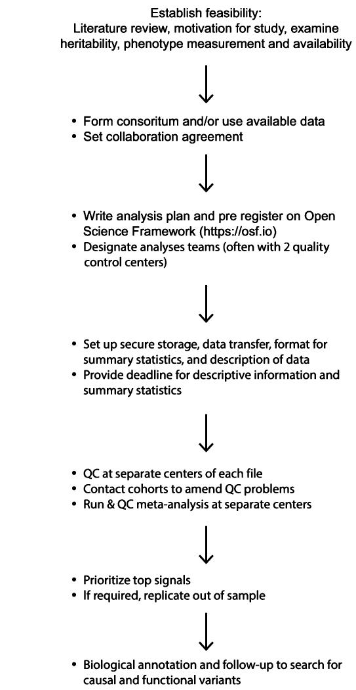
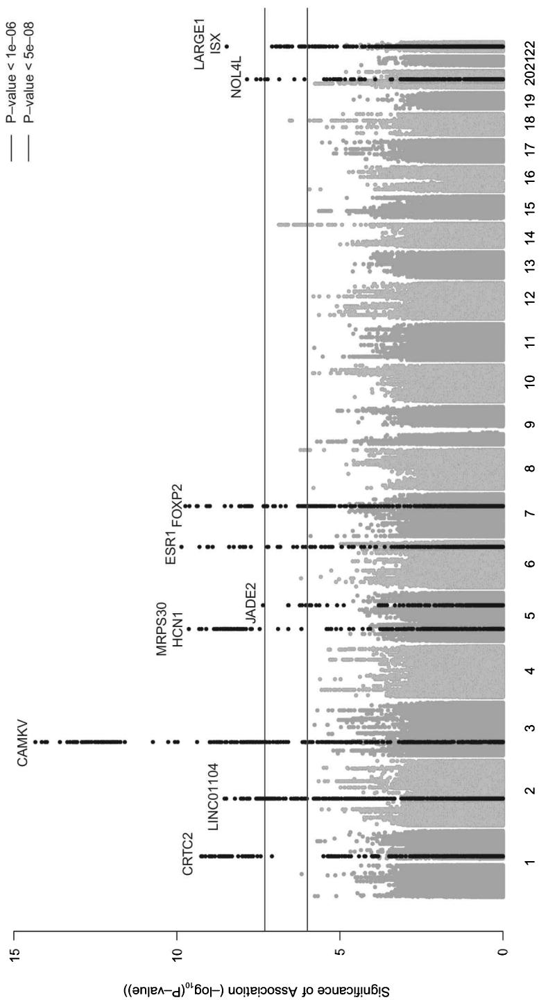
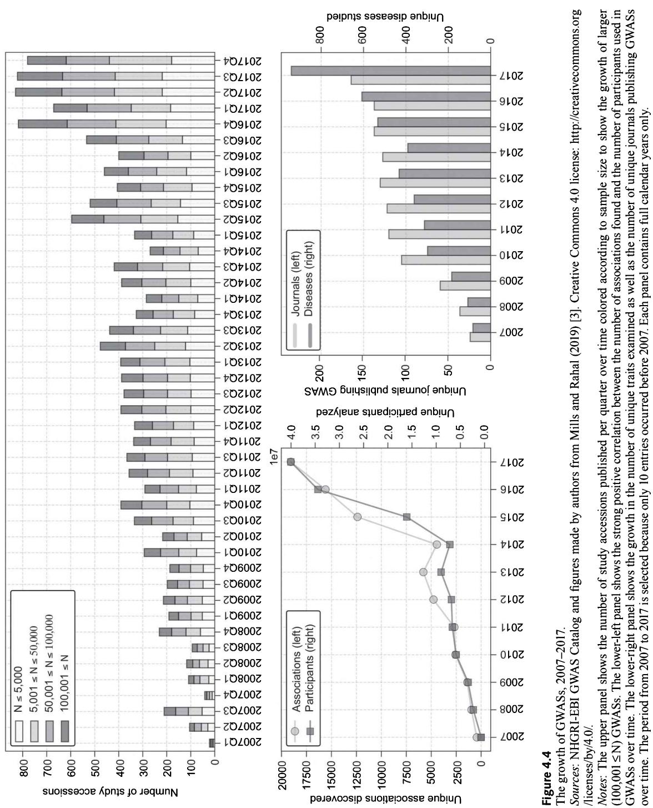
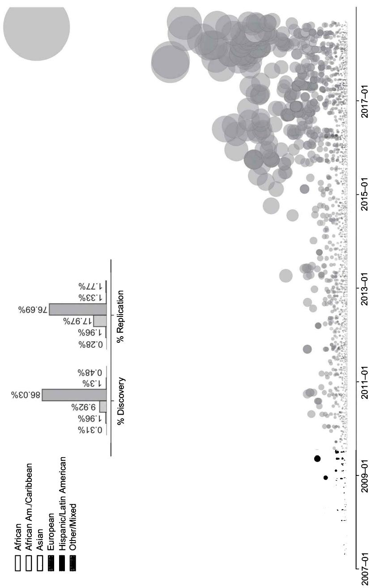

# Genome-Wide Association Studies

## Objectives

• Understand a genome-wide association study 

- Grasp the basics and limitations of genotyping and sequencing arrays and their relationship to linkage disequilibrium and imputation 

- Understand genome-wide association study research design, meta-analysis, and a data analysis plan 

- Know the fundamental aspects of statistical inference, methods, and heterogeneity for genome-wide association studies 

• Grasp the types of quality control 

- Gain knowledge of the NHGRI-EBI GWAS Catalog for an overview of genome-wide association studies 

- Recognize the lack of diversity in terms of ancestral, geographical, temporal, and demographic diversity of genome-wide association studies to date and implications for research 

- Become aware of future directions in this area of research 

## 4.1 Introduction and background

The design of genetic association studies has dramatically changed over the past decades in tandem with developments in genotyping technology, a reduction in costs, and the development of advanced data analysis methods. Although high-throughput, whole-genome profiling is now standard, early research focused only on a limited number of “candidate” loci. The term candidate gene studies refers to early work in this field that focussed on predefined loci of interest thought a priori to be relevant to the trait under examination. As we discuss in detail in our chapter 6 on gene-environment interplay, many of the early candidate gene studies were problematic for multiple reasons, primarily due to a lack of replication [1]. Although our aim is to inoculate researchers new to this field against making similar mistakes, we should note that some candidate gene studies are still performed quite successfully for a variety of nonbehavioral medical phenotypes. The extreme polygenicity of many traits and failure of candidate genes as drug targets (e.g., depression) came as a genuine surprise to many at the time. An alternative, the genome-wide association study (GWAS), emerged, in which millions of genetic loci are measured simultaneously. 

GWASs are currently the primary method used to identify associations between single-nucleotide polymorphisms (SNPs) and phenotypes. As we discuss in more detail shortly—GWASs test millions of separate regression models for associations between genetic variants and a phenotype. Recall from chapter 1 that phenotypes can be monogenic traits, strongly influenced by variation within a single gene. But many are polygenic complex traits, which are the result of variation within multiple genes and their interaction with behavioral and environmental factors. The results of a GWAS show the association of each individual SNP with a particular trait or phenotype. In contrast to candidate gene studies, GWASs are hypothesis-free and search for associations across all genotyped regions. As discussed previously in chapter 1, GWAS examines the polymorphisms that distinguish us from each other. With the exception of monozygotic (i.e., identical) twins, it is this 0.1% by which we differ that makes us all unique. 

Since many traits are complex and linked to multiple genetic loci (i.e., polygenic), a GWAS often identifies many genetic variants that each have a small influence on a phenotype. Due to small effect sizes, very large data sources are required and the GWAS discovery typically culminates in many GWAS analyses conducted on multiple data sources and then combined into one meta-analysis. The majority of variants that are identified in GWASs are not assumed to be biologically causal, but rather, due to linkage disequilibrium (LD), may identify a region that contains one or more of the biologically functional variants. Almost 4,000 GWASs have been conducted by early 2019, which have agnostically identified thousands of genetic variants $[2, 3]$ . Traits that have been studied include many common human diseases such as breast cancer, Alzheimer's disease, and type 2 diabetes, but also anthropometric (height, weight) and behavioral traits such as age at first childbirth or educational attainment. 

The current chapter provides an introduction to GWAS research and fundamental concepts. Since the results from GWASs often serve as a basis for many practical applications, this chapter is essential for later applied chapters in part II, including how to conduct quality control (QC) on genetic data (chapter 8). In this chapter, we unpack the basics of GWAS methodology including the nuts and bolts in terms of genetic data collection, research design and approach, and the need to correct for multiple testing. This is followed by an introduction to the types of individual-level and genetic-marker level QC that we later conduct in chapter 8. Section 4 briefly describes GWAS meta-analysis and further extensions. Finally, we provide a comprehensive overview of the NHGRI-EBI (National 

Human Genome Research Institute–European Bioinformatics Institute) GWAS Catalog, followed by a brief history of GWA discoveries from 2005 until late 2018. We note the lack of various types of diversity in GWAS samples, such as lack of ancestral and demographic diversity and concentration of subjects in a particular set of countries. We conclude with a brief summary and provide an indication of future directions for research. 

## 4.2 GWAS research design and meta-analysis

## 4.2.1 GWAS research design

Genetic discovery is not only an intellectual but also an organizational and logistic challenge. Since the quality and success of a GWAS traditionally depended upon gathering a large sample size, large consortia have been formed who conduct independent GWASs, which are subsequently meta-analyzed by the core group leading the project. Figure 4.1 depicts GWAS stages in perhaps one of the largest types of collaborative efforts in modern science. Considering the broad expertise required, consortiums that need to be formed, and long-term and time-consuming investment, it is rare that researchers new to this area would initiate their own independent GWAS. It is useful, however, to understand the process of how a GWAS is conceived. 

It first starts with a general feasibility analysis, where researchers need to understand the phenotype, what has been researched to date, measurement, and previous heritability estimates or other GWAS results, if available. This area of research continues to flourish in terms of online tools and packages that summarize existing results. You can, for instance, refer to a comprehensive analysis of the heritability of many human traits over 50 years of twin studies (see [4]). It is also accompanied by a web application called MaTCH (Meta-Analysis of Twin Correlations and Heritability) that is accessible via http://match.ctglab.nl/. There are also other websites, such as SNPedia (https://www.snpedia.com/index.php/Heritability), that catalog heritability estimates linked with particular studies. Ben Neale's lab also has an incredible website examining heritability of many traits in the UK Biobank (http://www.nealelab.is/uk-biobank/). You can also produce a visualization of results including Manhattan plots and many others from the Complex-Traits Genetics Virtual Lab (CTG-VL) for post-GWAS analyses [5], available at https://genoma.io and http://atlas.ctglab.nl/. 

The next stage is to isolate which data sources may have the phenotype you are interested in and, if applicable, form or approach a consortium or gain access to existing or publicly available data (e.g., UK Biobank). It takes considerable time and effort to form a consortium, including often waiting for ethics and access clearance and in some cases processing the payments to use the data. Although large datasets such as the UK Biobank (~500,000) have more recently become available, it has been common to form large consortiums where multiple datasets are combined to produce the largest sample possible. In many cases, individual analysts for each data source are responsible for conducting the 

Figure 4.1

GWAS research design and meta-analysis.

GWAS internally and sending the results back to the consortium leaders. This is often related to privacy and consent issues to the data, described in the final part of this book in chapter 14. Meta-analysis of GWAS summary statistics is thus the most popular method to find genetic variants related to a phenotype. Since genetic effects due to common alleles are small, we know from the previous discussion in chapter 1 that the detection of signals requires ever larger sample sizes. Since single GWASs are underpowered, researchers need to engage in a meta-analysis and combine multiple data sources. 

## 4.2.2 Data analysis plan

The first step in conducting a GWAS is to produce an analysis plan, which most now post on the Open Science Framework (https://osf.io/). The full analysis plan for our study of human reproductive behavior [6] is, for example, available at: https://osf.io/53tea/. Here we examined the two phenotypes of age at first birth (AFB) and number of children ever born (NEB). Analysis plans may differ depending on the consortium or trait studied but generally involve the following aspects. 

1. Background and motivation for the study. 

2. Clear definitions of the traits and examples of potential questions that capture that trait. 

For age at first birth (AFB) shown above, for example, we stated: AFB can be treated as a continuous measure, which has generally been asked directly or can be imputed from several survey questions (such as date of birth respondent and date of birth first child). The common question is: 

How old were you when you had your first child? 

Another variant is: 

What is the date of birth of your first child? 

In the case of the latter, you can simply impute this variable to get the AFB by subtracting the date of birth of the first child from the date of birth of the subject. In many surveys, this question has been adapted for male and female subjects and in several cases only women have been asked. 

3. Instruction on how to opt-in to the consortium and key deadlines if your aim is to gather a large sample. 

4. Detailed sample inclusion criteria are then often listed. For instance, in our study of human reproduction, we also examined the number of children ever born (NEB) and only included those who had reached the end of their reproductive period (at least age 45 for women, 55 for men) and clarified that we also wanted analysts to include individuals who had never given birth. This is also where you specify any ancestry requirements, relevant covariates, genotyping rate ( $>95\%$ ), and additional quality controls (see also chapter 8). 

5. Information on genotypes and imputation, including any recommended marker filters that need to be applied before imputation, which we will discuss shortly. In the example analysis plan referred to previously, it was SNP call $>95\%$ , HWE $p>10^{-6}$ , MAF $>5\%$ . The logic behind these values is discussed in more detail in chapter 8. 

6. Clear specification of the models to be used to test for association. In our study, for example, we required that regression models for two phenotypes (AFB, NEB) were estimated for men and women and then pooled. For example, an equation is $Y = m + SNP_{i} \beta_{i} + Z \gamma + e$ . Many studies also often include family-based data in which case clear instructions should be provided to consider the frailty structure in the data or selection household members. We specified linear regression models, which include several covariates (e.g., controls for population stratification, birth cohort to control for nonlinear effects or any study-specific covariates). 

7. Specification of file formats for the results. Many, for instance, often opted for the CHARGE consortium sharing format. $^{1}$ The file-naming scheme is likewise essential because you will be receiving of hundreds of different files. 

8. Data exchange and security procedures are also important and more recently for many working in Europe need to be GDPR (General Data Protection Regulation) compliant (see chapter 14, on ethics). 

9. Description of the meta-analysis is then also often included. This includes marker exclusion filters, genomic control, significance thresholds, and the way in which top SNPs are reported. 

Each participating data source (often called a cohort in this area of research) runs the analysis separately or may grant access to the data. The summary statistic results for each study are then generally uploaded together with some descriptive information about the data for that particular data source. These results are then combined and a meta-analysis is conducted. 

## 4.2.3 Meta-analysis

Meta-analysis is the statistical synthesis of information from multiple independent studies that increases power and subsequently reduces the risk of false-positive findings $[7]$ . It is also suggested that all researchers in the consortium should sign a collaboration agreement that includes, for instance, not publishing a GWAS on that phenotype before the current consortium does. 

GWAS meta-analyses use what is called summary data, which provide regression coefficients, standard errors, and so on for each genetic marker in a population following a prespecified analysis plan. It is thus not individual-level data but the aggregated summary results. Our 2016 study on reproductive behavior [6], for instance, involved a meta-analysis that used the summary statistics from over 60 different data sources. In chapter 8 we describe how to engage in QC at the individual level, before conducting, for example, a GWAS (such as removing variants with low allele frequency, low imputation quality, allele frequency that diverges substantially from a reference sample, or results driven by a specific study that are not replicated elsewhere). An important and time-consuming step in the GWAS meta-analysis is a second set of quality control, which is basically harmonizing the results across studies. Despite providing a unified analysis plan, this cleaning process might take the longest time in an initial project, since analysts might use different software or there are other inconsistencies in the results. An excellent protocol for the meta-QC process based on the work of the GIANT consortium is provided by Winkler et al. [8]. 

## 4.3 Statistical inference, methods, and heterogeneity

## 4.3.1 Nature of the phenotype

The core premise of GWA studies is to perform what are now millions of hypothesis tests, or in other words one hypothesis test per variant, simultaneously on a large sample of individuals in a particular population. Each genetic association study employs statistical inference to establish and quantify the strength of the association between a genetic locus and a phenotype. The choice of the association method generally depends on the nature of the phenotype and whether it is dichotomous (i.e., binary) or quantitative (i.e., continuous), but also it is common to take potential confounders into account (e.g., sex, age, birth cohort). 

For quantitative or continuous traits (e.g., age at first birth or body mass index), the analysis compares individuals over a range of the continuous distribution of the phenotype, most often using linear regression. Here we compare the distribution of test statistics based relative to the null hypothesis of no association at any marker and take into account the standard error. Additional extensions of survival models for censored data are also increasingly possible. For binary or dichotomous traits, it compares those categorized into, for instance, high (cases) versus low (control) values, generally using logistic regression. Just as with typical logistic models, it is assumed that the logit transformation of the trait under study has a linear relationship with the alleles, but it is often interpreted in terms of an odds ratio. 

## 4.3.2 P-values and Z-scores

We elaborated upon the statistical underpinnings of this type of research in more detail in chapter 2. Briefly, the goal is to produce an estimate of statistical significance for each true association between a genetic locus and the phenotype that is being studied. As most readers will know and as discussed previously in chapter 2, statistical significance is generally determined by a p-value. A p-value estimates the probability of obtaining a test statistic value as extreme as the one estimated (i.e., under the null) for a potential association by the chosen statistical method you use. It is not the probability of a locus being associated with a trait. When we perform such a regression, we use a test statistic such as a t-test to test whether the beta parameter of the particular genetic variant is significantly different from zero. A test statistic is a numerical summary of the data used to measure support for the null hypothesis. A test statistic may have a known probability distribution (e.g., such as $x^{2}$ ) under the null hypothesis or its null distribution is estimated. Recall that a null hypothesis is a statistical test of the hypothesis that there is no significant difference between the specified populations, which in the case of GWAS is between the cases and controls. Any observed difference is attributed to sampling or experimental error. If the value of the test statistic generated from the genetic locus deviates significantly from what we would expect from the null hypothesis, there is evidence of the alternative hypothesis 

that there is a significant difference between the groups (case versus controls) or significant relationship with a quantitative trait. 

The disadvantage with p-values in meta-analyses, which has been widely discussed, is that it cannot provide an overall estimate of effect size. Also, between-dataset heterogeneity cannot be assessed. A related statistic that is also used is the Z-score, which is based on the average of $Z_{i}$ values where it is the Z-score of the ith study. Although the p-value and Z-scores are highly correlated, an advantage of using Z-scores is that they take the direction of effect into account and you are able to introduce weights (for example, if you want a particular study have a higher or lower weight). SNPs are flagged or considered as “hits” by the measure of a p-value. 

As noted earlier, the agreed upon genome-wide significant threshold is $p<5\times10^{-8}$ . This corresponds to a Bonferroni correction, addressed in the next section. The genome-wide significance threshold may vary across populations due to variation in SNPs, MAFs, LD patterns, or arrays. In populations that have a lower LD, such as African ancestry groups, stricter thresholds should be used [9]. 

## 4.3.3 Correcting for multiple testing in a GWAS

DNA microarrays and next-generation sequencing allow us to test for associations for a large number of genomic loci in tandem. The magnitude of comparisons that are made in GWAS results is known as the multiple testing problem. This is the potential for both false positives (Type 1 errors) and if the correction for multiple comparisons is overly conservative or power are inadequate, false negative (Type 2 errors) results. We test for the associations of millions of genetic variants across the genome, but only a very small fraction will actually be associated at the genome-wide significance level with the phenotype. The issue is that when we conduct so many tests, we are also in danger of finding many strong associations merely by chance. 

In a GWAS, a statistical test is performed for each genetic locus and the phenotype to produce a test statistic and associated p-value. If we took the standard p-value of 0.05 (i.e., 5%), even if a given genetic variant was not associated with our phenotype, there is a 1 in 20 chance that we would find a significant association. This is what is referred to as a type 1 error or a false positive. Since in a GWAS we perform literally millions of tests in parallel, we are highly likely to reap many false positives if we were to adopt the standard 0.05 significance threshold. To solve this multiple testing problem the most commonly used and straightforward correction is the Bonferroni correction. Simply put, we divide the chosen significance threshold (p-value) by the number of tests that are performed. If 10 tests were performed, we would only state that results are significant if they have a p-value smaller than 0.005. In the case of the genome, we are testing 1 million independent genetic variants for common sequence variation and for this reason the Bonferroni-corrected p-value of significance is $p<5\times10^{-8}$ . This relates to the basic assumption of independence in statistics or that you should get results from your sample that reflect what you would find in a population. If there is even the smallest of dependence in your data and you violate this assumption, biased results are produced. One statistical issue with GWASs is that there is often a strong correlation between the genotypes at nearby genetic variants. Or in other words, actually testing 1 million genetic variants is in reality more like testing 700,000 to 800,000 genetic variants that are not correlated. In a GWAS, statistical thresholds are thus adopted with $p<5\times10^{-8}$ (i.e., p<.00000005) the standard for genome-wide statistical significance and $p<5\times10^{-6}$ often used to represent “suggestive hits.” 

Some argue that Bonferroni correction is too conservative and leads to an increase in the proportion of false negative findings and the assumption of independence that every genetic variant is tested independent of the rest $[10]$ . Although a detailed explanation of alternative methods goes beyond the auspices of this introductory book, there are other ways to correct for multiple testing. Permutation-based testing engages in a permutation of the phenotype a large number of times and then recalculation of the statistical tests each time to produce an empirical null distribution that can be used by hypothesis testing. It may be more intuitive to think of this as a shuffling of labels. To calculate permutation-based p-values, the outcome measure labels are randomly permuted or shuffled multiple (e.g., 1,000–1,000,000) times, which effectively removes any true association between the genotype and phenotype. For all permuted datasets, statistical tests are then performed. This provides the empirical distribution of the test-statistic and the p-values under the null hypothesis of no association. The original test statistic or p-value obtained from the observed data is then compared to the empirical distribution of p-values to determine an empirically adjusted p-value. Permutation-based testing is computationally intensive, especially if many permutations are required, which is necessary to calculate very small p-values accurately $[11]$ . 

Another technique is the Benjamini–Hochberg false discovery rate (FDR), which is less conservative than Bonferroni correction. It controls for the expected proportion of false positives among all signals, with an FDR value below a fixed threshold and assumes that SNPs are independent. The method minimizes the expected proportion of false positives but does not imply statistical significance. A limitation is that the FDR method still has the assumption that SNPs and p-values are independent. 

## 4.3.4 Manhattan plots

The main results of a GWAS are generally presented in what is called a Manhattan plot, shown for the trait of age at first childbirth in figure 4.2. This figure is a scatterplot that plots the negative logarithm (base 10) of the p-value (y axis) and the significance of the association of the SNP ordered by position along the chromosomes (x axis). The genome-wide significant threshold of $p<5\times10^{-8}$ is represented by the top line in the figure. The threshold for suggestive hits of $p<5\times10^{-6}$ is shown by the bottom red line in the figure. The SNPs shown in the figure are markers, and many will not be the actual causal variant but rather a “tag.” In other words, they are tags since nearby variants might actually be driving the association. Remember that this is a study of correlation and not causation, so further biological and downstream work is then required to understand the biological function of the marker or those in its vicinity. We provide a more detailed case study of how this might work using FTO, often referred to as the “fat gene,” in chapter 10, section 10.2. Chapter 8 describes various additional diagnostic checks that we also undertake during a GWAS, including examining the heterogeneity of results by sex or data source using the forest plot and Quantile-Quantile (Q-Q) plots. Chapter 9 also goes into detail on the mechanics of controlling for population stratification, a concept that was introduced earlier in chapter 3. 

Figure 4.2
Example of a Manhattan plot, GWAS age at first birth.
Source: Barban et al. (2016) [6], figure made by the authors.

## 4.3.5 Evaluating dichotomous versus quantitative traits

To evaluate dichotomous traits, a chi-squared test is often used to test for differences in the frequencies of distributions between the cases and controls. It calculates the expected allele frequencies of cases and controls as if the SNP was not associated with the phenotype. It then measures the deviations from this expectation in the form of the chi-square statistic $\left(\chi^{2}\right)$ . The test is reported by the p-value of the probability that these deviations occur by chance given that the SNP and the trait are not associated. If the p-value is below the defined significance threshold (after controlling for multiple testing, discussed shortly), the finding is significant. 

We often then also estimate an effect size, which is important in understanding the magnitude or strength of the association. To calculate the effect size of dichotomous traits, different methods can be used such as the odds ratio (OR). This is the odds of having the phenotype given the phenotype-associated allele, divided by the odds of having the phenotype given the non-associated allele. Note that this should not be interpreted at the individual level as a “personal risk” but rather it is the calculation of a risk compared to another genome. The p-value indicates whether a genetic association conforms to our chosen statistically significant threshold but cannot be used to compare genetic associations. This is due to the fact that p-values are strongly influenced by the sample size, power of the statistical test, and other factors outside of the relationship being studied. It is for this reason that we use an effect size to compare two SNPs; you need to know both the p-value and effect size estimate for genetic associations for a proper assessment of the strength and interpretation of the associations. 

To evaluate quantitative traits, such as height, we often use linear regression, where we aim to correlate the trait and each SNP of interest. As with the previous test, the regression model produces a measure of significance in the form of a p-value and effect size defined by a beta coefficient. This regression is then run for each SNP to search for significant associations by the deemed genome-wide significance threshold $p \leq 5 \times 10^{-8}$ . To interpret effect size of quantitative traits, we use the beta coefficient, where the occurrence of each risk allele corresponds to an increase in the quantitative trait equal to the 

Box 4.1 Genetic power calculations 

The Genetic Power Calculator (http://zzz.bwh.harvard.edu/gpc/) by Purcell and Sham is a useful online tool for genetic power calculations based on specific study characteristics $[12]$ . The Genetic Association Study (GAS) Power Calculator, which is used to compute statistical power for large one-stage genetic association studies, can be found at http://csg.sph.umich.edu/abecasis/cats/gas_power_calculator/index.html. Other power calculators include the Effect Size Calculator for T-Test at http://www.socscistatistics.com/effectsize/Default3.aspx, and for a very nice interactive visualization see “Interpreting Cohen’s d Effect Size: An Interactive Visualization” at https://rpsychologist.com/d3/cohend/. To calculate Bonferroni correction, see http://www.quantitativeskills.com/sisa/calculations/bonfer.htm. For a tutorial on how to conduct a power analysis using dichotomous (i.e., discrete) and quantitative (i.e., continuous) see Purcell and Sham’s aforementioned website and the supplementary material from Stringer et al. (2015) $[13]$ . You are required to specify parameters such as the allele frequency of the high-risk allele, prevalence of the phenotype in the population, effect size of the relative risk of genotype (i.e., Aa and AA relative to aa), D-Prime (correspondence between the two genetic variants), total sample size, alpha, and power. 

beta coefficient. For example, assume that we correlate a SNP with genotypes AA, AG, and GG with height in centimeters. If we find that A is the “tall” allele with a beta coefficient of 0.5, each A allele is predicted to contribute 0.5 cm to an individual’s height. 

Effect size, sample size, and statistical power are important interlinked aspects in this analysis. Although we do not explore this in detail here, power also depends on other factors such as the MAF of a genetic variant. Rare causal variants are much more difficult to detect than common causal variants since the statistical power to significant associations is low and demands a very large sample size. Or, in the context of a case-control study, it is not only the sample size that is important but also the relative number of cases and controls. An equal number of cases and controls is the most optimal for power. To explore genetic power calculations further, see box 4.1. 

## 4.3.6 Fixed-effects versus random-effects models

As we discussed in chapter 2, fixed-effects models rely on the assumption that the true effect of each risk allele is the same in each dataset. Although the assumption can be tenuous, these models are able to maximize discovery in comparison to random effect models [14]. There are various fixed-effects models that we do not describe in detail but include inverse variance weighting and Cochran-Mantel-Haenszel. Random-effects models do not assume that all studies are functionally equivalent and are less often used for discovery since they have limited power. These models are more often applied when the aim is to attempt to generalize the observed association outside of the population and estimate the average effect size of the associated variant and across different populations for predictive purposes. 

## 4.3.7 Weighting, false discovery rate (FDR), and imputation

When multiple data sources are combined, some studies will have more data and thus should count more or have a larger weight in meta-analysis results than smaller ones. The optimal weight that is most often used is inverse variance weighting (each study is weighted according to the inverse of its squared standard error). False discovery rate (FDR) refers to the estimate of the proportion of associations that are discovered but deemed to be false positives. Here we calculate what is called a Q value, which is the minimum FDR that is possible in order to claim an association. As shown shortly in our applied chapters, we also test for the reliability of imputation. It can be a problem when there are polymorphisms with low MAFs, since imputed variants with MAFs<5% are excluded from the analysis. 

## 4.3.8 Sources of heterogeneity

Some phenotypes may be difficult to measure or have high measurement variability. In large GWA studies there is often the need to harmonize different data sources and construct one comparable phenotype. Since most phenotypes have already been collected, it is often difficult to engage in a perfectly harmonized analysis. A 2018 study examining the genetic underpinnings of years of education, for instance, engaged in a detailed examination of how variation in the categorization of the phenotype impacted results [15]. They concluded that when possible, the most detailed measure was the best. Yet when harmonizing multiple datasets, many GWASs often harmonize to the highest common—and thus generally least detailed—categorizations. 

Beyond ancestry-based heterogeneity, which was discussed at length in chapter 3, there may be inconsistencies such as birth cohort, country, or sex. In chapter 3 we demonstrated how even in relatively small countries such as the Netherlands or in the United Kingdom there are different population stratification patterns. GWAS often combines data from multiple countries and historical time periods to gain a large enough sample size. The implicit assumption is that the influence of genetics on individuals is universal across time and place. In a previous study published in Nature Human Behavior, we demonstrated that this is not the case and that combining these disparate datasets has the potential to mask differences, particularly for behavioral phenotypes [16]. In what is called a “mega-analysis,” we demonstrated that around 40% of the genetic effects on education and timing of first child is hidden or watered down when data is combined, which increased to 75% for the number of children ever born. In contrast, we found that the genetic variants associated with height seemed to be the same across populations. Sex differences may also induce heterogeneity, which is why some analyses such as those related to reproduction or reproductive behavior examine females, males, and pooled results separately $[6, 17]$ . Obviously, this could be extended to think about other types of heterogeneity such as age or life course effects or socioeconomic status. 

## 4.4 Quality control (QC) of genetic data

The analysis of genetic data to conduct a GWAS entails an understanding of statistical inference in this setting but also numerous quality checks—referred to as quality control (QC). QC is one of the central aspects of working with genetic data. We discuss QC related to GWASs in chapter 8 (see section 8.5). QC is necessary for reliable GWAS results because raw genotyped data are inherently problematic (see box 4.2). For instance, you might have missing data in a large proportion of individuals or high rates of missing genotypes within individuals or other issues related to low sample quality. As we outline in more detail in chapter 8, QC can be divided into individual-level QC and marker-level QC. 

Individual-level QC often checks for (1) poor DNA data quality, (2) high or low heterozygosity across autosomal chromosomes, (3) discordant sex information, (4) duplicated or related individuals, and, (5) divergent ancestry. A second set of quality control analyses focuses on the data quality of genotypes or what we discuss in chapter 8 as per-marker QC. Here we take several steps to remove variants that may introduce bias in the study, namely: (1) exclusion of low call rate SNPs; (2) removal of SNPs with very low allele frequency (rare variants); (3) identification and exclusion of variants with extreme deviation from the Hardy–Weinberg equilibrium; (4) in case-control studies, exclusion of SNPs 

Box 4.2 Retraction of Science longevity paper 

Failure to properly check for errors in the data can have serious consequences. Perhaps one of the most well-known cases is the retraction of the exceptional longevity study by Sebastiani et al. (2010) [18] in the journal Science. The paper originally identified 19 genes associated with extreme longevity in centenarians. However, days after it was published experts and critics started to ask whether the strong correlation that the authors found was actually due to a technical error in how the different sequencing chips were assigned to samples (Illumina 610-Quad array) that the team used that could in turn produce false positive associations. The problem was that the chip was only used for the centenarians, with a different one used for the control group. The issue is that if you have different call rates or other systematic biases that are different between the chips, it introduces an artifactual association (see chapter 7, section 7.2, where we discuss these aspects in more detail). Since the new analyses deviated quite seriously from the original article and the authors could not replicate the original finding, the article was retracted. Interested readers can refer to the discussion in particular around this error and subsequent retraction. 

with extreme differential call rates between groups; and (5) in the case of dealing with imputed SNPs, exclusion from the study of variants with low imputation quality. 

## 4.5 The NHGRI-EBI GWAS Catalog

## 4.5.1 What is the NHGRI-EBI GWAS Catalog?

Researchers new to the field often want to know which phenotypes have already been studied and the various SNPs that have been identified. The primary resource is the NHGRI-EBI GWAS Catalog (hereafter referred to as the Catalog) and includes data from all published GWASs, located at https://www.ebi.ac.uk/gwas/. It is produced by the U.S. National Human Genome Research Institute (NHGRI) [19] in conjunction with the European Bioinformatics Institute (EBI) [20]. To be included in the Catalog, studies must meet very strict criteria (see www.ebi.ac.uk/gwas/docs/methods), include an array-based GWAS and an analysis of more than 100,000 SNPs with genome-wide coverage. SNP-trait associations that are reported in the Catalog are those with at least a p-value of $<1 \times 10^{-5}$ . The Catalog researchers locate studies via an automated PubMed search and then manually curate them for assessment and inclusion. All GWAS traits are mapped to terms from the Experimental Factor Ontology (EFO) [21], which is an ontology of variables used in molecular biology including aspects of disease, anatomy, cell type, cell lines, chemical compounds, and assay information. If you search for “cardiovascular disease,” for instance, the Catalog provides the results and visualizations of all studies and associations for this specific trait and its subtraits. In this example, subtraits might be “myocardial infarction” or “coronary heart disease.” 

Figure 4.3 provides a visualization of the NHGRI-EBI GWAS Catalog, illustrating reported genetic associations based on their genomic locations across all (human) chromosomes. Each line links to a locus that has been associated with a trait that has a p-value threshold of $p \leq 5 \times 10^{-8}$ , and each circle is color-coded to represent a distinct trait. They are grouped according to 17 main trait categories such as digestive system disease, hemotological measurement, cancer, or response to drug. It is possible to search the Catalog by publications, variants, traits, or genes, which is continuously updated with new publications. 

## 4.5.2 A brief history of the GWAS

There are several excellent narrative reviews of GWASs describing the underlying rationale and scientific conclusions and highlighting key milestones $[2, 22, 23]$ . Although the first GWAS was published in 2005, the major breakthrough was a paper published by the Wellcome Trust Case Control Consortium in 2007 $[24]$ , which was heralded as a masterwork in diplomacy due the need to collaborate to combine multiple sources of data $[23]$ . As noted earlier, to conduct a successful GWAS, a large sample size is required to afford sufficient statistical power $[25]$ . This means that a majority of the GWASs published to 

The image contains no text. The OCR result "1" is a hallucination and does not correspond to any content in the source image. Therefore, the correct OCR output must reflect the absence of any visible text.

(no text) 

Figure 4.3
Chromosomal map of published genome-wide associations as of May 2018, $p \leq 5x \times 10^{-8}$ for 17 trait categories by the NHGRI-EBI Catalog.
Source: NHGRI-EBI Catalog and diagram are freely available from https://www.ebi.ac.uk/gwas/docs/diagram-downloads for use under the general EMBL-EBI terms of use (http://www.ebi.ac.uk/about/terms-of-use) [19, 20]. The image is generated by the NHGRI-EBI on a quarterly basis. 

date often pool the summary results of separate analyses from multiple data sources in a meta-analysis in order to obtain the largest sample size possible. Advances in technology, methods, theory, computational power, and funding have drastically changed the GWAS landscape over the past decades. 

In our previous work, Mills and Rahal (2019) [3] carried out a systematic and computational review of all GWASs in the 13 years from 2005 until October 2018. We used the NHGRI-EBI GWAS Catalog and linked it to external databases such as PubMed. It is important to note that we included all code that we used on a publicly available GitHub site in addition to making this a living database (https://github.com/crahal/GWASReview). In other words, with the update of each Catalog, our database and the figures and numbers described here will automatically update over time. As figure 4.4 shows, there has been a remarkable growth in the number of GWASs published, sample size, number of associations, and diseases studied over time. 

In the upper panel we see the large jump in the number of studies published over time (divided according to sample size). Here we see the incredible gains in sample sizes over time, with those published in the late 2018s and early 2019s sometimes containing over 1 million individuals. These larger studies are mostly attributed to the UK Biobank (around 500,000 individuals) [26, 27] and large direct-to-consumer companies such as 23andMe that participate in this research [28]. The lower-left panel shows the strong positive correlation between the number of associations found and the number of participants used in GWASs over time. The lower-right panel shows the growth in the number of unique traits and in journals publishing GWASs. As of October 2018, we found that 3,639 studies were published covering 5,849 unique study accessions (identifiers ascribed to traits within a paper) across 3,508 unique traits mapped to 2,532 EFO traits. These traits can include anything from height to male-pattern baldness, Alzheimer's disease, breast cancer, coffee consumption, or neuroticism. The average number of hits per study is 15.3, with an average $p$ -value for the strongest risk allele of $1.3729 \times 10^{-6}$ . Around $55\%$ of the reported associations met the standard threshold of $p \leq 5 \times 10^{-8}$ . 

## 4.5.3 Lack of diversity in GWASs

For researchers new to the field, it is essential to note the current lack of diversity in genetic samples. As we discussed in previous chapters, disparities in ancestral diversity of subjects has been related to technical issues such as population stratification $[29]$ , reduced linkage disequilibria $[30]$ , genetic diversity, and admixture $[31]$ but also refusal to participate in studies due to cultural distrust and social misuses of data $[32, 33]$ . Figure 4.5 shows that although there was a veritable explosion in the number of GWASs and traits over time, it still remained largely within European ancestry populations, with non-European populations more often examined in the replication phase. What this means is that these non-European populations were often used to test whether the results found in the 

Figure 4.5
GWAS participant ancestry, 2007–2017.
Sources: NHGRI-EBI GWAS Catalog and author mapping; figure produced by authors and reproduced from Mills and Rahal (2019) [3]. Creative Commons 4.0 license: http://creativecommons.org/licenses/by/4.0/.
Notes: The main panel shows a disaggregation of our broader ancestral categories field, which is a direct mapping from the 17 broad ancestral categories identified in the Catalog. We drop all rows where any proportion of the ancestry is not recorded, and for combinations of ancestries (e.g., European and African) we create a new field: Other/Mixed. The inset aggregates this across the entire sample but partitions the data across discovery and replication phases. The period from 2007 to 2017 is selected since only 10 entries occurred before 2007, and we have complete information for the year 2017.

European ancestry population would replicate in other ancestry groups and therefore not often as a basis for fundamental genetic discovery in those populations. 

Figure 4.5 shows ancestry groups by the commonly used six broad ancestral categories. Those of European ancestry have been examined the most, ranging from as high as 95% of subjects in 2007–2008 to 88% in 2017. Particularly since 2011, there has been a strong and steady rise of research in Asian populations (see box 4.3). As described in Mills and Rahal (2019, table 2) [3], this is primarily the Japanese, Chinese, and South Korean populations. African populations have been the least studied over time, with the hope that projects such as the African Genome Variation Project [34] and others promoting diversity will continue to increase and alter these trends. 

Diversity in relation to GWA studies is almost exclusively discussed in relation to ancestry, yet we also found a striking lack of geographical, environmental, temporal and demographic (e.g., age, sex) diversity in our GWAS review $[3]$ . As we note, although around 76.2% of the current world population resides in Asia or Africa, 72% of genetic discoveries emanate from participants residing in only three countries (the United States, the United Kingdom, and Iceland). As we elaborate upon in this chapter and elsewhere $[16]$ , more work needs to be done to understand how environmental exposure and geographical concentration influence results. For example, those with a predisposition for obesity face radically different environmental stimuli in the United States, Mexico, and the United Kingdom compared to some other nations that have markedly lower obesity 

Box 4.3
The rise of Asian ancestry genetic research 

As shown in figure 4.5, there has been marked rise in GWA studies in Asian populations, particularly since 2011. The most frequent studies have emanated from Japan, China, and South Korea. As of the end of 2018, 7.7% of recorded studies involved Japanese participants, representing 14.3% of all participants contributing to GWAS research; Chinese, 3.7% of recorded studies representing 8% of all participants, and South Korean, 1.5% of recorded studies representing 4% of all GWAS participants. For the full tables, see Mills and Rahal (2019) [3] and our regularly updated GitHub site, https://github.com/crahal/GWASReview/blob/master/tables/CountryOfRecruitment.csv. As noted, these Asian countries rank close to the countries with the largest number of recorded studies and percentage of participants in the United Kingdom (40.5%; 10.5%), the United States (19.8%; 41%), and Iceland (11.5%; 1.1%), respectively. When looking at the most frequently used data sources in the largest 1,250 GWASs as of August 2018, we see that these numbers are related to the inclusion of studies such as the Biobank Japan Project (BBJ), Korean Association Resource Project (KARE), Korean Genome Epidemiology Study (KOGES), Korean National Cancer Center Study (KNCC), Japanese Millenium Genome Project (JMGP), Guangxi Fancchenggang Area Male Health and Examination Survey (FAMHES), the Japan Multi-Institutional Collaborative Cohort Study (J-MICC), and others such as the Chinese Kadoorie Biobank. 

levels, such as Japan, Korea, Italy, and the Netherlands. We also found a lack of temporal and demographic diversity of birth cohorts, historical periods, and life course stages. The most frequently used data in GWASs are often disproportionately older, higher socioeconomic status, frequently more women, and often compounded by a “healthy volunteer” selection such as in the UK Biobank [35]. 

## 4.6 Conclusion and future directions

There have been considerable changes in this area of research since the first GWAS in 2005. We introduced readers to the NHGRI-EBI GWAS Catalog that contains a summary of all published GWASs to date. We also chronicled how this field has exploded not only due to the sheer number of studies, diseases, and associations studied but also burgeoning sample sizes. As of 2019, many large studies have a combined sample of over 1 million cases. We note, however, that this growth has not been even across different ancestral or geographical groups, with the majority of research still within European ancestry populations. Asian studies in particular have grown, with new investments across the world, such as in Africa, to enhance further diversity. An emerging and exciting line of research will be discoveries of the genetic diversity of non-European ancestry populations. We should also note that forming these large consortiums may also be something of the past. With a growing number of large data sets such as UK Biobank and direct-to-consumer companies such as 23andMe, gathering many small data cohorts to produce a large sample appears to be increasingly less common. 

Readers will have also gained a basic idea about the methodology underlying GWA studies. Although this remains an introductory book, our hope is that you have gained a rudimentary understanding of how this type of research is conducted, the meaning of statistical inference in GWASs, and why and how we need to correct for multiple testing. The importance of quality control (QC) at the individual and genetic marker level was also described, with hands-on applications in chapter 8 of this book. 

As our brief history of the GWAS demonstrated, this is a rapidly moving area of study. As we elaborate upon in chapter 14 and 15 on ethical issues and future directions, GWASs have also not been entirely free from controversy. There has been some concern that the long lists of prioritized “hits” have not brought the heralded personalized medicine and new therapies and risk prediction tools that some had promised. Although beyond the auspices of this book, the biological follow-up of many GWAS hits has located variants linked to known biological pathways but also others that had not been clinically targeted. A growing number of studies are moving to examine not only common but also rare variants. Further developments in sequencing data will also likely uncover exciting new findings, areas of research, and new methods. New ways of analyzing and synthesizing GWAS data have also emerged, such as the work by the Complex-Traits Genetics Virtual Lab for post-GWAS analyses (https://genome.io/updates). 

## Exercises

Choose a phenotype you are interested in and explore what has already been done. 

1. Go the GWAS Catalog and examine the diagram that contains the various traits that have been studied to date at each chromosome and see if the trait you are interested in has been studied: https://www.ebi.ac.uk/gwas/diagram. 

2. Examine twin-heritability using the application MaTCH (Meta-Analysis of Twin Correlations and Heritability) accessible via http://match.ctglab.nl/; Gephi, http://gephi.github.io/. 

3. Go to SNPedia (https://www.snpedia.com/index.php/Heritability) to see if SNP-based heritability has been examined. 

4. Go to Ben Neale's site using the UK Biobank and see what you uncover: (http://www.nealelab.is/uk-biobank/). 

5. Produce a visualization of results including Manhattan plots and many others from the Complex-Traits Genetics Virtual Lab (CTG-VL) for post-GWAS analyses [5]: https://genome.io. 

## Further reading

For introductory articles on GWASs, see the following: 

Attia, J. et al. How to use an article about genetic association. A: Background Concepts. JAMA 301(1), 74–81 (2009). 

Attia, J. et al. How to use an article about genetic association. B: Are the results of the study valid? JAMA 301(2), 191–197 (2009). 

Lunetta, K. L. et al. Genetic association studies. Circulation 111(1), 96–101 (2008). 

For an early introduction to gene mapping and association studies, see the following: 

Neale, Benjamin et al. (2007). Statistical genetics: Gene mapping through linkage and association. London: Taylor and Francis. For recent reviews, see references 2, 3, and 29. 

For further reading in the area of power analyses, see the following: 

Hong, E. P., and J. W. Park. Sample size and statistical power calculation in genetic association studies. Gen. & Inform. 10(2), 117–122 (2012). 

Sham, P. C., and S. M. Purcell. Statistical power and significance testing in large-scale genetic studies. Nat. Rev. Gen. 15(5), 335 (2014). 

## Online resources

dbSNP: https://www.ncbi.nlm.nih.gov/snp/. 

NHGRI-EBI GWAS Catalog: https://www.ebi.ac.uk/gwas/. 

UCSC Genome Browser: https://genome.ucsc.edu/. 

For a longer list of genetic datasets as reported in Mills and Rahal (2019), see https://github.com/crahal/GWASReview/blob/master/tables/Manually_Curated_Cohorts.csv. 

## References

1. L. E. Duncan and M. C. Keller, A critical review of the first 10 years of candidate gene-by-environment interaction research in psychiatry. Am. J. Psychiatry 168, 1041–1049 (2011). 

2. P. M. Visscher et al., 10 years of GWAS discovery: Biology, function, and translation. Am. J. Hum. Genet. 101, 5–22 (2017). 

3. M. C. Mills and C. Rahal, A scientometric review of genome-wide association studies. Commun. Biol. 2 (2019), doi:10.1038/s42003-018-0261-x. 

4. T. Polderman et al., Nat. Genet., in press. 

5. Gabriel Cuellar-Partida et al., Complex-Traits Genetics Virtual Lab: A community-driven web platform for post-GWAS analyses. bioRxiv Prepr. (2019), doi:10.1101/518027. 

6. N. Barban et al., Genome-wide analysis identifies 12 loci influencing human reproductive behavior. Nat. Genet. 48, 1–7 (2016). 

7. E. Evangelou and J. P. A. Ioannidis, Meta-analysis methods for genome-wide association studies and beyond. Nat. Rev. Genet. 14, 379–389 (2013). 

8. T. W. Winkler et al., Quality control and conduct of genome-wide association meta-analyses. Nat. Protoc. (2014), doi:10.1038/nprot.2014.071. 

9. N. D. Palmer et al., A genome-wide association search for type 2 diabetes genes in African Americans. PLoS One 7, e29202 (2012). 

10. J. Fadista, A. K. Manning, J. C. Florez, and L. Groop, The (in)famous GWAS P-value threshold revisited and updated for low-frequency variants. Eur. J. Hum. Genet. 24, 1202–1205 (2016). 

11. B. V. North, D. Curtis, and P. C. Sham, A note on the calculation of empirical P values from Monte Carlo procedures. Am. J. Hum. Genet. 72, 498–499 (2003). 

12. P. C. Sham and S. M. Purcell, Statistical power and significance testing in large-scale genetic studies. Nat. Rev. Genet. 15, 335–346 (2014). 

13. S. Stringer et al., A guide on gene prioritization in studies of psychiatric disorders. Int. J. Methods Psychiatr. Res. 24, 245–256 (2015). 

14. T. V. Pereira, N. A. Patsopoulos, G. Salanti, and J. P. A. Ioannidis, Discovery properties of genome-wide association signals from cumulatively combined data sets. Am. J. Epidemiol. 170, 1197–1206 (2009). 

15. J. J. Lee et al., Gene discovery and polygenic prediction from a genome-wide association study of educational attainment in 1.1 million individuals. Nat. Genet. 50, 1112–1121 (2018). 

16. F. C. Tropf et al., Hidden heritability due to heterogeneity across seven populations. Nat. Hum. Behav. 1, 757–765 (2017). 

17. R. M. Verweij et al., Sexual dimorphism in the genetic influence on human childlessness. Eur. J. Hum. Genet. 25, 1067–1074 (2017). 

18. P. Sebastiani et al., Genetic signatures of exceptional longevity in humans. Science (2010), doi:10.1126/science.1190532. 

19. D. Welter et al., The NHGRI GWAS Catalog, a curated resource of SNP-trait associations. *Nucleic Acids Res.* 42, D1001–D1006 (2014). 

20. J. MacArthur et al., The new NHGRI-EBI Catalog of published genome-wide association studies (GWAS Catalog). Nucleic Acids Res. 45, D896–D901 (2017). 

21. J. Malone et al., Modeling sample variables with an experimental factor ontology. Bioinformatics 26, 1112–1118 (2010). 

22. P. M. Visscher, M. A. Brown, M. I. McCarthy, and J. Yang, Five years of GWAS discovery. Am. J. Hum. Genet. 90, 7–24 (2012). 

23. T. A. Manolio, In retrospect: A decade of shared genomic associations. Nature 546, 360–361 (2017). 

24. P. R. Burton et al., Genome-wide association study of 14,000 cases of seven common diseases and 3,000 shared controls. Nature 447, 661–678 (2007), doi:10.1038/nature05911. 

25. F. Dudbridge, Power and predictive accuracy of polygenic risk scores. PLoS Genet. (2013) (available at https://doi.org/10.1371/journal.pgen.1003348). 

26. C. Sudlow et al., UK Biobank: An open access resource for identifying the causes of a wide range of complex diseases of middle and old age. PLOS Med. 12, e1001779 (2015). 

27. C. Bycroft et al., The UK Biobank resource with deep phenotyping and genomic data. Nature 562, 203–209 (2018). 

28. K. Servick, Can 23 and Me have it all? Science 349, 1472–1477 (2015). 

29. D. Hamer and L. Sirota, Beware the chopsticks gene. Mol. Psychiatry 5, 11–13 (2000). 

30. A. C. Need and D. B. Goldstein, Next generation disparities in human genomics: Concerns and remedies. Trends Genet. 25, 489–494 (2009). 

31. M. P. Conomos et al., Genetic diversity and association studies in US Hispanic/Latino populations: Applications in the Hispanic community health study/study of Latinos. Am. J. Hum. Genet. 98, 165–184 (2016). 

32. After Havasupai litigation, Native Americans wary of genetic research. Am. J. Med. Genet. A. 152, 33592 (2010). 

33. V. L. Shavers-Hornaday, C. F. Lynch, L. F. Burmeister, and J. C. Torner, Why are African Americans under-represented in medical research studies? Impediments to participation. Ethn. Health 2, 31–45 (1997). 

34. D. Gurdasani et al., The African Genome Variation Project shapes medical genetics in Africa. Nature 517, 327–332 (2015). 

35. A. Fry et al., Comparison of sociodemographic and health-related characteristics of UK Biobank participants with those of the general population. Am. J. Epidemiol. 186, 1026–1034 (2017). 

## 5

## Introduction to Polygenic Scores and Genetic Architecture