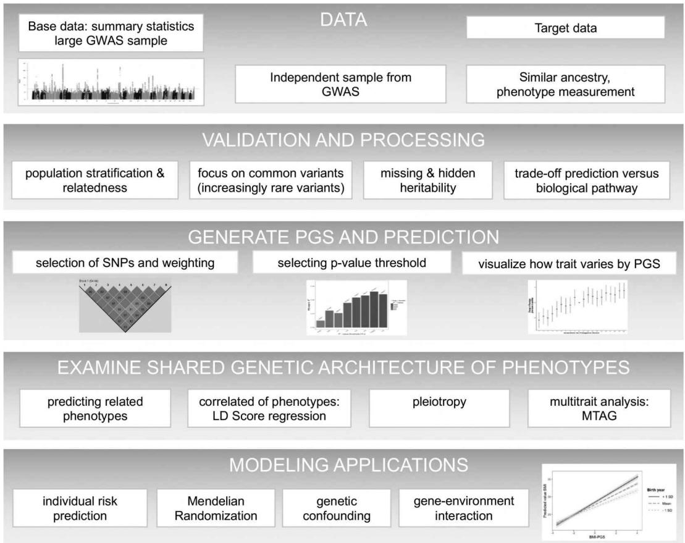
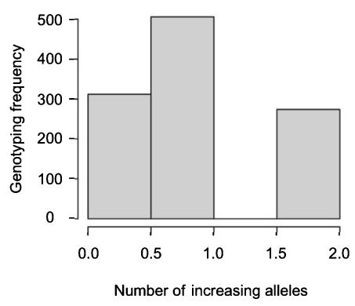
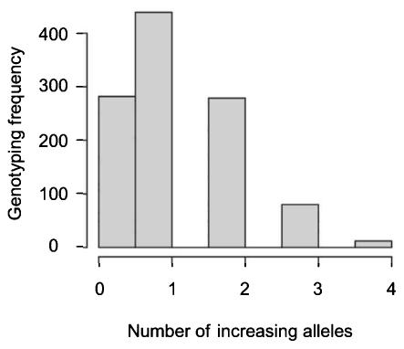
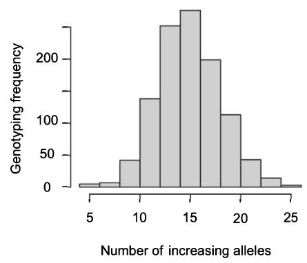
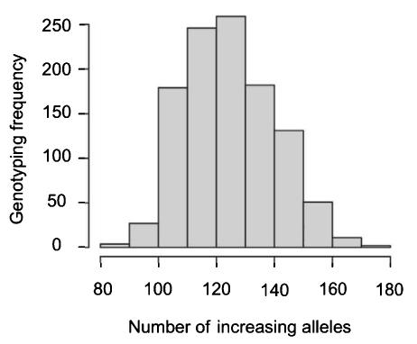
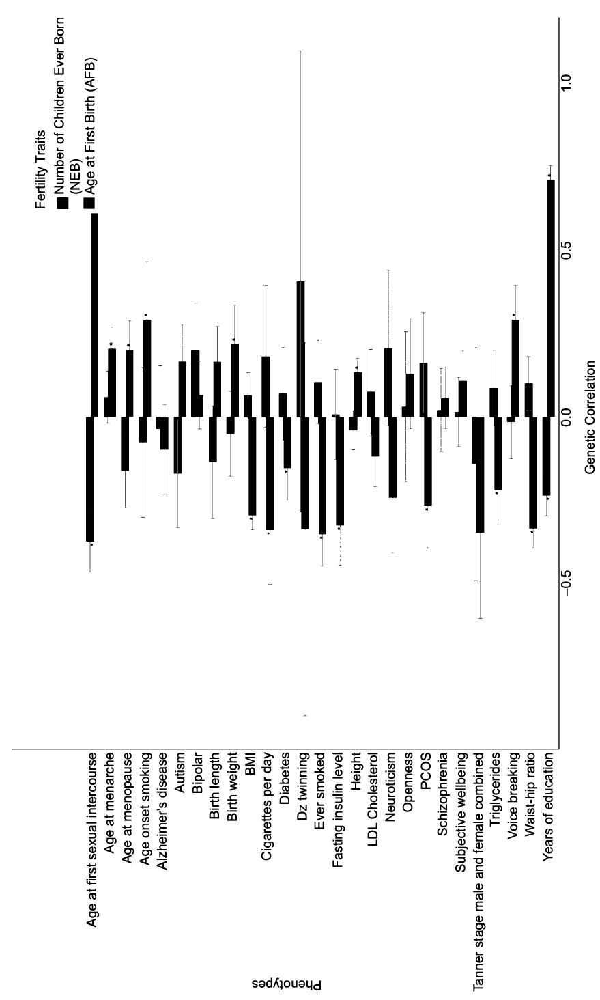
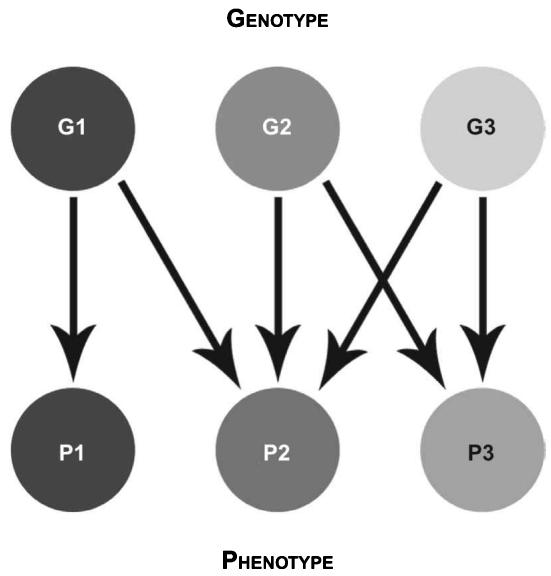

## Objectives

- Define and understand the origins of the polygenic score 

• Understand the process and flowchart of working with polygenic scores 

• Comprehend the main principles of constructing a polygenic score 

- Know the basics of validation and prediction of polygenic scores 

- Grasp concepts surrounding the shared genetic architecture of phenotypes and potential ways to examine this (correlation, pleiotropy, multitrait analysis) 

- Be introduced to applications of causal modeling with polygenic scores (genetic confounding, Mendelian Randomization, gene-environment interaction) 

- Recognize the central challenges, why they are problematic, and potential solutions in working with polygenic scores 

## 5.1 Introduction

The genetic architecture of most phenotypes and health conditions are polygenic in nature. Polygenic refers to the fact that it is not a single or handful of variants but instead hundreds or thousands of variants that each has very small effects on the phenotype. Although there are monogenic diseases such as Huntington's disease that has a monocausal effect, most of the traits that we study are polygenic. With the growth of genome-wide association studies (GWASs) and larger samples, PGSs have increasingly emerged as a major tool in several areas of quantitative genetic research. 

The aim of this chapter is to provide you first and foremost with an understanding of polygenic scores, how they emerged, and the central challenges and potential solutions to effectively apply them. A secondary aim is to provide you with a blueprint of how to carry out your own research in this area. Our flowchart in figure 5.1 presents an overview of the steps but also possibilities of working with PGSs for those entering the field for the first time. This includes the initial phases of data, validation and processing, generation, and prediction of PGS. Some readers may also desire to dig deeper and examine the shared genetic architecture of phenotypes. This is then followed by various modeling applications that are discussed in this chapter and then applied in parts II and III of this book. In table 5.1, we provide an additional summary of the main challenges of working with PGSs, explain why these challenges are problematic, and offer potential solutions and further reading on the topic. The current chapter provides the necessary background that you will need to create and validate PGSs in chapter 10 and then properly apply them in statistical models across various situations in chapters 11–13. 

Figure 5.1

Flowchart of development and working with polygenic scores.

<table><tr><td colspan="4">Table 5.1Summary of challenges and solutions in polygenic score application</td></tr><tr><td>Challenge</td><td>Why is this problematic?</td><td>Potential solutions</td><td>Example of study, further explanation</td></tr><tr><td>Requires large sample sizes</td><td>Large sampling error due to large number unknown SNPs, true effects being very small</td><td>Create PGSs from sufficiently large GWAS sample sizes for accuracy</td><td>Daetwyler et al. (2008) [1]Dudbridge (2013) [2]</td></tr><tr><td>Selection of SNPs to include in PGS</td><td>Trade-off: if you include more (or all) variants you will increase the prediction (i.e., <eq>R^{2}</eq>) but introduce noise and noncausal SNPs</td><td>Choice depends on phenotype and research question.</td><td>Wray et al. (2013) [3]</td></tr><tr><td>Weighting of effects in PGS</td><td></td><td>Highly polygenic traits, more lenient p-value thresholds (i.e., include all SNPs),LD pruning (isolate independent SNPs), and thresholding methods</td><td></td></tr><tr><td>Overlap in discovery and target sample</td><td>Overestimate the accuracy of prediction via over-fitting</td><td>Use an independent sampleRemove target sample from the GWASUse summary statistics of GWASs from similar large study</td><td>Wray et al. (2013) [3]https://github.com/Nealelab/UK_Biobank_GWAS</td></tr><tr><td>Prediction possible only within similar populations</td><td>Different allele frequencies and LD across ancestry populations</td><td>Collect more genetic data from more diverse populations</td><td>Martin et al. (2017) [4]—limited portability of scores derived from European ancestry GWASLee et al. (2018) [5]—nontransferability of PGS on African AmericansDe La Vega and Bustamante (2018) [6]</td></tr><tr><td>Population stratification in samples and relatedness</td><td>Will produce potential inflation in <eq>R^{2}</eq> of PGS on your target sample</td><td>Fit ancestry principal componentsUse conventionally unrelated individuals in discovery and validation stages</td><td>Belgard et al. (2014) [7]—critique genetic autism study confounded by population structureMakowsky et al. (2011) [8]—for height Wray et al. (2013) [3]—for height in Framingham Heart Study</td></tr><tr><td>Challenge</td><td>Why is this problematic?</td><td>Potential solutions</td><td>Example of study, further explanation</td></tr><tr><td>Differential bias in population stratification between cases and controls</td><td>Leads to spurious prediction of <eq>R^{2}</eq> if discovery and target sample have same differential bias</td><td>Perform stringent QC and/or validate in a different independent sample</td><td>Lee et al. (2011) [9]QC step—use genotyped SNPs in PGS and quantify estimated relatedness between target and discovery sample in a PCAIf target sample is an outlier on PCA, prediction accuracy in target is less than expected</td></tr><tr><td>Variants only explained by common markers, missing rare variants</td><td>Some SNPs have not been identified in GWASsResults in discrepancy between family and SNP-based heritability estimates</td><td>Incorporate rare variants into predictions and GWASs</td><td>Kemper et al. (2002) [10]</td></tr><tr><td>Missing and hidden heritability</td><td>Lower than expected prediction of PGS (i.e., low <eq>R^{2}</eq>)Bias due to noisy estimates, heterogeneity in sample</td><td>Attempt to eliminate error, including accurate or harmonized phenotype, sufficient sample size, consideration of interaction with environment</td><td>Tropf et al. (2017) [11]Courtiol et al. (2016) [12]</td></tr><tr><td>Trade-off of prediction and understanding biological mechanisms</td><td>Obtain more predictive PGSs for highly polygenic traits by including more (all) SNPs in PGS, yet lose biological specificity</td><td>Understand trade-off for phenotype and research questionIf interested in interventions, be aware of interpretationsExamine downstream biological analyses on prioritized genes</td><td>Goodarzi (2018) [13]—discussion of biological functional information required for better insights into biology of obesity</td></tr><tr><td>Shared genetic architecture with other phenotypes</td><td>Overlap and co-occurrence important when studying or designing potential treatments</td><td>Examine whether PGS predicts other phenotypes</td><td>Purcell et al. (2009) [14]—example schizophrenia and bipolar disorder</td></tr><tr><td>Causal modeling using PGS with Mendelian Randomization</td><td>Minimize risk of including noise due to directional pleiotropy in PGSs</td><td>Do not use high p-value thresholds, which may violate the assumptions of MR</td><td>Hemani et al. (2013) [15]</td></tr><tr><td>Using PGS in gene-environment interaction studies</td><td>Summary in table 6.2</td><td>Summary in table 6.2</td><td>Duncan and Keller (2011) [16]; Keller (2014) [17]</td></tr><tr><td>Utility for personalized medicine</td><td>Discussion in chapter 14</td><td>Discussion in chapter 14</td><td>Torkamini et al. (2018) [18]</td></tr></table>

## 5.1.1 What is a polygenic score?

A polygenic score (PGS) is a numeric summary of the relationship between multiple genetic loci and a phenotype. A PGS is sometimes referred to as a polygenic profile score, genetic profile score, genotype score, or, when discussing disease, as a polygenic risk score. We adopt the more neutral term—polygenic score—since it is less intuitive to speak in terms of “risk” when we discuss nondisease-related behavioral phenotypes. Polygenic scores are derived directly from the genome-wide associations in GWASs that we outlined in chapter 4. We use the summary statistics from these to construct an estimate of how single-nucleotide polymorphisms (SNPs) combine to explain the trait of interest. 

In practice, PGSs are linear combinations of the phenotype-associated alleles across the genome, typically weighted by GWAS effect sizes. It is thus a single quantitative measure that can be interpreted as a measure of an individual's genetic propensity toward a phenotype relative to a population. Individual SNPs (i.e., monogenic, as discussed in chapter 1) are weak predictors for most of the traits that we are interested in. Complex traits are associated with many genetic variants, each of which account for a small percentage of variance. PGSs are a solution to aggregate this information across the genome. In general, we can define a polygenic score for an individual as the weighted sum of a person's genotypes at M loci. A PGS for individual i can be calculated as the sum of the allele counts $a_{ij}$ (0, 1, or 2) for each SNP j=1, ... M, multiplied by a weight $w_{j}$ 

$$
P G S _ {i} = \sum_ {j = 1} ^ {M} a _ {i j} w _ {j}
$$

where the weights $w_{j}$ are transformations of GWAS coefficients. This equation shows that it is a linear combination of the effects of multiple SNPs on phenotype. The underlying model in a PGS is also usually additive, since we count the number of “risk alleles” for each SNP included in the score. We note, however, that recessive or dominant models can be used in the construction of a PGS. Due to the large number of SNPs that are included in their construction, they also follow a normal distribution (see box 5.1). An additional assumption is the absence of gene-gene interactions (or epistasis) since SNP effects are assumed to be independent. 

## 5.1.2 The origins of polygenic scores

Many studies and lines of thinking culminated in the production of PGSs. One of the early studies that introduced the concept of PGSs was a study on the genetic architecture of schizophrenia in 2009 [14]. Schizophrenia is a severe mental disorder with a high level of heritability ( $h^{2}$ ) of up to 0.80 [20, 21]. The disease is characterized by hallucination, delusion, and cognitive deficits and has a prevalence of around 7 in 1,000 people. Researchers had observed that it was passed along in families and assumed to be polygenic even as early as the 1970s [22, 23]. The field then developed further such as a seminal paper by 

Box 5.1 

Why do polygenic scores have a normal distribution? An application of the central limit theorem 

Polygenic scores can be thought of as a sum of many independent genetic signals. A central premise of probability theory in statistics, known as the central limit theorem, establishes that when many independent random variables are added, their sum tends toward a normal distribution regardless of the original distribution of the single variables. This is what is often informally referred to as the “bell curve.” As our simulation below demonstrates, the larger the number of alleles, the better the approximation will be to a normal distribution. Polygenic scores therefore tend to have a normal distribution since the number of SNPs that are included in the score is sufficiently large $[19]$ . 

PGS With 1 genetic variant 

PGS With 3 genetic variants

PGS With 30 genetic variants

PGS With 300 genetic variants

Risch, Merikangas and colleagues in 1996 in Science demonstrating that for complex phenotypes, GWASs had superior power over the genome-wide linkage studies used at the time [24]. The first GWAS for schizophrenia was published in 2008 [25]. This was then followed by a larger 2009 study published in Nature (~13,000 cases; 35,000 controls) [26]. 

One of the key shifts toward the creation of PGSs was in 2009, when the International Schizophrenia Consortium “failed” to identify any specific SNPs predicting this highly heritable mental disorder. The research team decided to dig deeper and investigate the role of all SNPs, revisiting one of the most classic theories of polygenic inheritance in the form of Fisher’s 1918 infinitesimal model [27]. Recall that the infinitesimal model hypothesizes that a quantitative (continuous) phenotype is controlled by an infinite number of loci and that each locus has an infinitely small effect. Rather than searching for a small number of genes with larger predictive power, the group claimed that there could be potentially thousands of very small individual effects that collectively accounted for a substantial part of the heritability. Those variants that were derived from a GWAS of a smaller sample size, however, would not show up in a GWAS since they did not reach genome-wide significance. 

Consider, for example, a SNP, for which a risk allele increases the relative risk to develop schizophrenia by only 5%. Such a small effect would need to be estimated with an extremely small standard error in order to fall below the significance threshold of $5 \times 10^{-8}$ , the standard criterion for genome-wide significance in a GWAS (see chapter 4). Therefore, it would be highly likely for it to remain undetected even in a relatively large sample. The team therefore first calculated the score only including highly significant SNPs and then recalculated it by continuously relaxing the p-value threshold up to 0.5, basically including 50% of all SNPs. They used this battery of scores and generated a sample that was not part of the original GWAS to predict schizophrenia. They found that the explanation of variance increased as the p-value threshold was relaxed. This implied that even supposedly “nonsignificant” genetic variants explained variation in the phenotype, although their individual effects and mechanisms remain unspecified. Although this original study already suggested that schizophrenia is highly polygenic, later studies quantified expectations more precisely, finding that around 8,300 independent SNPs contribute to the phenotype [28]. Since then multiple GWASs from different groups have been published, with larger studies leading to more precise PGS estimates. 

## 5.2 Construction of polygenic scores

In chapter 10 we demonstrate the practicalities of how to construct PGSs, followed by how to validate and apply them across multiple applications for trait prediction, as confounders and to examine gene-enviornment interaction in chapter 11. We discussed the discovery of 

SNPs in considerable detail in chapter 4. In this section we highlight pitfalls and dangers of construction of PGSs, but note that some of the solutions involve detailed statistical techniques that remain beyond the scope of this introductory textbook. 

## 5.2.1 Large sample sizes required in GWAS discovery

It is no coincidence that there has been a rapid growth in the sample size of GWASs over time (see figure 4.5). In order to estimate the effects of SNPs on a phenotype, it is important to reduce sampling error, which can be achieved by including a large sample size in the discovery of genetic markers. We have repeatedly noted that complex phenotypes are influenced by a large number of unknown SNPs that have very small effects, thereby necessitating large discovery samples. As noted in chapter 4, for many common traits, discovery sample sizes are now reaching around 1 million individuals. Multiple authors have demonstrated how the accuracy of SNP effects, and by extension PGSs, increase with sample size [1, 2, 29]. Others are now increasingly questioning whether we have hit a point of diminished returns and should now shift the focus from discovery of more loci to a deeper understanding of the biological function of loci. 

## 5.2.2 Selection of SNPs to include

As we explore in chapter 10, two key decisions are required to construct a PGS: the number of genetic variants to include and how to weight their effects. The most commonly used method is a straightforward least squares prediction [30]. Since we discuss pruning and threshold methods and weighting in chapter 10 (section 10.3), we do not reiterate it here. It is possible to select only GWAS-significant SNPs ( $p$ -value $<5 \times 10^{-8}$ ), something in between, or all SNPs ( $p$ -value $<=1$ ). The choice depends on the phenotype and the type of application you will conduct. Stricter $p$ -value thresholds are generally considered to be more suitable for traits that are not polygenic, while more lenient thresholds perform the best for polygenic traits. In the case where traits are not polygenic, which researchers are now realizing is actually quite rare, only genome-wide significant variants are included to increase the accuracy of the predictive score. You can expect to have more predictive results when all SNPs are included in the calculation of a PGSs for highly polygenic traits. A challenge we discuss shortly, however, is the trade-off of including more variants in the analysis to increase prediction, which in turn adds potential “noise” of noncausal variants but also causal variants that are proxy SNPs (see box 10.2). 

## 5.3 Validation and prediction of polygenic scores

Validation of the PGS underpins its usefulness. If incorrect decisions or conclusions are drawn at this initial stage, the PGS may lack precision and accuracy. Validation is also inherently intertwined with prediction. In this section, we focus on the basic and common errors that can either lead to an overestimation of the PGS or misinterpretation of results, sometimes using examples from the literature. Prediction is the estimation of $R^{2}$ , which is the proportion of variance explained by the regression model. In that sense, we note that prediction is somewhat of a misleading term since we are generally interested in understanding the amount of variability that can be explained by including a particular PGS in a model. Most applied researchers are often interested in understanding the incremental increase in the $R^{2}$ when you enter your PGS into a model compared to the baseline model. The baseline model is the simplest possible prediction, which you use as a starting point in which to benchmark against when additional variables are added. Here we then also generally include the population stratification variables (e.g., the first 10 or 20 PCAs) and other relevant covariates. In chapters 10 and 11, we will demonstrate how to engage in prediction and how to deal with some of the issues discussed below and summarized in table 5.1. 

## 5.3.1 Independent target sample

When you engage in prediction, it is essential that the data that you are using is an independent sample or, that is to say, that there is no overlap in the discovery and target samples. In other words, the target sample that you are using should either not be one of the datasets included in the original GWAS or you need to remove it from the GWAS summary results. We discuss how and where to obtain GWAS summary statistics in chapter 7 (section 7.3.3). 

If you attempt to validate or predict the performance of the score using the same data that was used in the original GWAS to also estimate the effect of the SNPs on the phenotype, you overestimate the accuracy of the prediction via over-fitting $[3]$ . To ensure that the association results do not overlap with your genotyped data, it is a good practice to first examine which cohorts were included in the discovery analysis. This information is usually reported in the initial tables of the Supplementary Material in the published GWAS article. Many authors increasingly have a pipeline that has results ready and prepared to apply for each of the cohorts in the study. Increasingly, studies also add the PGS as part of their data (e.g., the Health and Retirement Study). If this is not the case, it is good practice to inquire directly with the researchers who conducted the study and ask if they are willing to share the results of the meta-analysis excluding the cohort that you want to analyze. Note that this does require a certain amount of effort, also on the side of the original authors. Alternatively, it is possible to use another sufficiently large dataset and the summary statistics from a GWAS calculated on a single very large study. One solution is to use information from Ben Neale's lab, which openly produced results from more than 4,000 phenotypes using the UK Biobank, also with 20 principal components and covariates (e.g., age, age $^{2}$ , sex, age*sex) (http://www.nealelab.is/uk-biobank/). They also generated sex-specific results and included all of the code used to run their analyses on GitHub (https://github.com/Nealelab/UK_Biobank_GWAS). The degree of bias also depends on various factors, including heritability of trait, genetic heterogeneity across studies, and sample size, which we discuss shortly in relation to missing and hidden heritability. If the sample size of the genotyped data that you plan to use is much smaller than the sample size of the entire GWAS, the bias is probably limited. However, this aspect still needs to be taken into account. 

## 5.3.2 Similar ancestry in target sample

When selecting your target sample, the ancestry composition should not markedly differ from your initial baseline sample. Recall from chapter 4 that most GWASs have been performed on people of European ancestry, and that these results cannot be directly transferred to other populations due to differences in allele frequencies, LD, and genetic architecture. Using the 1000 Genomes reference panel, Martin and colleagues [4] used European-ancestry GWAS summary statistics and calculated PGSs for eight phenotypes. They concluded that these findings from large-scale GWASs have limited portability to other groups, which we discussed earlier in relation to population stratification (chapter 3). Since allele frequencies differ between ancestry groups (see box 3.2), for instance, using a PGS that is derived from one ancestral population to a very different one would result in a very imprecise and biased score in the target population, even if the phenotype was highly heritable. Later in chapter 9 (section 9.4) we visualize how we can distinguish different ancestry groups in the population by virtue of their clustering across different principal components. 

## 5.3.3 Relatedness, population stratification, and differential bias

When you are choosing the data that you would like to analyze for your research, it is essential to be aware of the potential of inflation in your PGS on your target sample due to population stratification. A study that used the PGS for height in the Framingham Heart Study, for instance, showed that when related individuals were included in the analysis, the $R^{2}$ was inflated from 0.15 to 0.25 [8]. Wray et al. [3] also examine differences when related individuals are removed from a sample and controlling by various population stratification principal components in relation to the inflation of the $R^{2}$ . As we also outline in table 5.1, they suggest using conventionally unrelated individuals in the discovery and validation stages. In later chapters where we describe quality control (QC), we demonstrate how to remove related individuals. This mistake has occurred in published research. For instance, Belgard and colleagues [7] argue that the 2014 genetic study of autism in Molecular Psychiatry [31] suffered from a lack of controlling for population stratification. Another issue that researchers may encounter is differential bias of population stratification between cases and controls. This can lead to a spurious prediction of the $R^{2}$ but can be countered by performing stringent QC or validating results in a separate sample [3]. 

## 5.3.4 Variance explained only by common genetic markers missing rare variants

There have been a variety of genome-wide “SNP-chips” used to identify SNPs, which we discuss in more detail in chapter 7. The data that have been collected largely until around 2018 gathers information on common genetic variation. We discuss the limitations of this genotyping and future directions elsewhere (see section 7.2.3 and chapter 15). Due to LD, many of the SNPs that we identify in a GWAS and use in our PGSs may not be the actual causal SNP but could be in LD with one or more of the causal variants. The SNPs measured on most chips (until more recently) have alleles that are common and cannot be in complete or even moderate LD with rare variants. If a genetic variant is associated with fitness, selection can drive one allele to a lower frequency [32]. If the effect of a SNP has a large effect on fitness, the frequencies of the causal variant will be low. It is very unlikely that SNPs that have been identified in the many GWASs to date will explain all genetic variation since it misses the contribution to the variance of rare variants since these are not “tagged” by the genotyped SNPs. This explains, for instance, the discrepancy between the family heritability of height of around 0.7 to 0.8 and the lower SNP- or marker-based estimates of 0.4 [33, 34]. 

This discussion is also linked to the potential inflation of family estimates but also the term still-missing heritability, which refers to the genomic variants that are not thoroughly tagged by SNPs. This has led Visscher and others to argue that we can learn from animal studies, since this body of work explains that in livestock (and likely humans) certain causal variants are in fact rare and in poor LD with common SNPs $[10]$ . For this reason, the field is now moving in the direction of incorporating rare variants into predictions. For instance, a 2018 study by Ganna and colleagues $[35]$ quantified the impact of rare and ultra-rare coding variation on 13 quantitative traits and 10 diseases. They find an impact of rare deleterious coding variants on complex traits concluding that there is likely widespread pleiotropic risk. 

## 5.3.5 Missing and hidden heritability in prediction of phenotypes from genetic markers (SNPs)

The variation that we are attempting to explain in the phenotypes that we study is a combination of genetic and environmental factors and their interaction. The use of a polygenic score is thus one way to quantify the genetic factors. Recall the missing heritability discussion from chapter 1 (section 1.6) where we discussed the unexpectedly low predictive power that came from GWASs and the rise of thinking in terms of polygenicity. Remember that missing heritability is the gap between the comparatively large heritability from twin study estimates and GWAS heritability estimates, whereas hidden heritability is the discrepancy between SNP-based heritability (Yang and colleagues [33] GREML models) and GWAS heritability. Since the first SNP discoveries only explained a fraction of the heritability [36], a series of studies emerged investigating non-additive genetic effects [37], epistatic effects [38], heterogeneity and/or gene-environment interaction [11], and inflated estimates from twin studies due to shared environmental factors [39] and the role of rare, non-genotyped variants [34]. 

The only way to achieve the upper-level estimate of $h^{2}$ is if we were able to identify all genetic variants affecting the trait and estimate their effects without any error. As we note throughout this book, error may creep into the analyses through multiple factors such as lack of accurate or harmonized phenotype measurement, need for repeated measures or, as we describe in the next chapter, due to interaction with environmental factors [11, 12]. An example of strong increases in PGS $R^{2}$ is the evolution of subsequent GWASs such as in the study of type 2 diabetes (see chapter 7) and years of education. The first meta-GWAS on educational attainment [40], for instance, produced three significant hits, the second 74 significant hits [41], and the third in 2018, more than 1,100. Together with the inclusion of more genetic variants, the main difference between the three studies was the sample size, which increased from around 125,000 individuals in the first study to over 1.1 million. In parallel, the $R^{2}$ increased from around 2% in the original GWAS to around 7–10% in the 2018 study. In comparison, SNP-based estimates from whole-genome studies are around 20–25% [11, 40] and represent the upper bound of what we can expect to discover with additive models. 

## 5.3.6 Trade-off between prediction and understanding biological mechanisms

It is important to keep in mind that with PGSs, we are dealing with a quantitative construct and that the underlying biology of a phenotype is highly complex. Due to polygenicity, common variants in single genes are weak predictors. Yet single genes are vital to understanding biological and causal function. It is the knowledge derived from studying the cell-regulating functioning of these single genes that allow us to move beyond correlations to understand the mechanisms linking genotype to phenotype. The trade-off with polygenic scores is that by virtue of having to combine information from many SNPs in PGSs, we often move further away from the specific biology underpinning the phenotype. This has implications for many of the quantitative analyses we conduct. As we demonstrate in chapter 10, you obtain more predictive results when you include all of the SNPs in the calculation of PGS for traits that are highly polygenic. Yet by doing this, you lose the biological specificity. We should be clear, however, that it is not simply a strict dichotomy between biological specificity and SNP thresholds. It is true that if we construct a score where we understand the mechanisms (i.e., only use SNPs that have a causal pathway that is understood), that score would have fewer SNPs and poorer performance. However, if we construct a score only from genome-wide significant SNPs, our understanding of the underlying mechanisms will still not be better than for a score that uses all of the SNPs. The lack of biological specificity is arguably a property of all polygenic scores if we adopt PGSs that include only scores with many independent SNPs. 

The trade-off is thus between maximizing prediction and understanding biological mechanisms. In a 2018 review of the genetics of obesity in the Lancet, for instance, Goodarzi [13] summarizes how although over 300 SNPs have been isolated in relation to BMI, hip–waist ratio, and other adiposity traits, the absence of a serious biological functional understanding of obesity has prevented clinically relevant weight loss interventions. Many studies thus now strive to move beyond prediction to more precision, such as interventions in disease risk prediction, gene-environment interaction analysis, or Mendelian Randomization regressions. We return to specific issues in the mechanism-prediction trade-off in the discussion of the application of scores. 

## 5.4 Shared genetic architecture of phenotypes

Until now we have discussed the PGSs for a specific trait in relative isolation, yet, particularly with complex phenotypes, PGSs for a single trait are habitually correlated with multiple phenotypes. As outlined in figure 5.1, when working with PGSs it is important to grasp that there is often a shared genetic architecture underlying many phenotypes. Although far from exhaustive, in this section we describe some of the main techniques used to disentangle this shared genetic architecture. 

## 5.4.1 Predicting other phenotypes

PGSs often have a shared genetic architecture, and many diseases and traits have a shared etiology. Schizophrenia and bipolar disorder, for example, are intertwined diseases. Understanding their co-occurrence is vital when studying them or designing potential treatments. The PGSs for schizophrenia, for instance, have been used to predict bipolar disorder [42]. This study showed that there is to some extent a shared genetic etiology between the two phenotypes, suggesting that the same genes are associated with both outcomes. In contrast, the score for schizophrenia did not predict non-psychiatric health conditions, such as coronary artery disease, Crohn's disease, hypertension, or type 1 or 2 diabetes. 

Reproductive traits have also been demonstrated to be highly interrelated $[43]$ . A large-scale GWAS published in 2016 studied two reproductive behavioral traits of age at first birth (AFB) and number of children ever born (NEB) $[44]$ . PGSs were used to examine their association with a variety of fertility and nonfertility traits. These included age at menarche, age at menopause, age at voice breaking (for boys), and age at first sexual intercourse. Although the PGS for number of children ever born had a relatively low predictive power, when entered into a regression model to predict childlessness, it had striking results. The PGS for NEB could predict the probability of remaining childless at the end of the reproductive period with an increase of one standard deviation of the PGS associated with a decrease of around 9% in the probability to remain childless for women $[44, 45]$ . The PGS for (a later) age at first birth was likewise associated with both a later age at menarche and later age at natural menopause [44]. Biological functional work also suggested shared etiologies between reproductive traits (and infertility traits such as endometriosis). 

## 5.4.2 Phenotypic and genetic correlation

Many phenotypes are also highly genetically correlated. Here it is important to distinguish between phenotypic and genotypic correlations. Although it may occur, a phenotypic correlation does not automatically imply a genetic correlation, even if the phenotypes are partly heritable. A genetic correlation also does not imply biological causation. In this section we focus on genetic correlation or overlap between phenotypes. Genetic correlation is an estimate of the proportion of additive genetic effect shared between a pair of traits. Consider, for example, two heritable traits such as schizophrenia and bipolar disorder, which usually have a high phenotypic correlation. $^{1}$ With genetic correlations, we are interested in examining whether there is also a genetic correlation or in other words whether the two traits share the same genes. 

The most common method that is used to examine genetic overlap is LD score regression, developed by Bulik-Sullivan et al. in 2015 [46]. In chapter 12 we demonstrate how to estimate genetic correlations from GWAS summary statistics using the LDSC package (https://github.com/bulik/ldsc) (see appendix 1). LDSC exploits the LD structure of the data to estimate the degree of genetic correlation. The approach initially required GWAS summary statistics for all SNPs from GWASs and a reference sample from which the LD could be estimated in order to estimate the LD score regression. The method is written formally based on the following relationship: 

$$
E [ z _ {1 j} z _ {2 j} ] = \frac {\sqrt {N _ {1} N _ {2}}}{\mathbf {M}} \ell_ {j} \rho_ {g} + i n t e r c e p t,
$$

Where $z_{kj}$ is the Z-score of SNP j from the GWAS of trait k ( $k=1,\ldots,20$ ), $N_{k}$ is the sample size of the GWAS of trait k, $l_{j}$ is the LD Score of SNP j, M the number of SNPs included in the GWAS, $\rho_{g}$ the genetic covariance between traits 1 and 2, with the regression intercept represented by intercept. The slope from the regression of $\hat{z}_{1j}z_{2j}$ on $\sqrt{N_{1}N_{2}}\ell_{j}$ can be used to estimate the genetic covariance between the two traits. It is also possible to estimate the heritabilities of the two traits, $h^{2}_{g1}$ and $h^{2}_{g2}$ from the univariate LD score regressions of traits 1 and 2. It therefore follows that an estimate of the genetic correlation is: 

$$
\hat {r} _ {g} = \frac {\widehat {\rho_ {g}}}{\sqrt {\hat {h} _ {g 1} ^ {2} \hat {h} _ {g 2} ^ {2}}}
$$

In chapter 12 we demonstrate how to estimate these LD scores and the interpretation of the results. In that chapter we also show how to obtain genetic correlations via the website LDHub (http://ldsc.broadinstitute.org/ldhub/) [47]. This is an online database that can be used as a web interface for LD score regression. The site is constantly being updated but includes the SNP heritability of hundreds of traits and genetic correlation results. You are also able to download hundreds of genetic overlaps between traits. 

Figure 5.2 provides an example of genetic correlations across multiple traits. Here we show our 2016 study where we used LD score regression to examine the correlation between reproductive behavior phenotypes (age at first birth [AFB], number of children ever born [NEB]) and 27 related phenotypic correlations. This included traits that were developmental or related to fertility (e.g., age at menarche, menopause, voice breaking, polycystic ovary syndrome [PCOS], age at first sexual intercourse, birth weight), behavioral (years of education, three smoking traits), personality and neuropsychiatric (e.g., neuroticism, schizophrenia, well-being, autism), cardiometabolic (e.g., LDL cholesterol, triglycerides, type 2 diabetes), and anthropometric (BMI, height, waist–hip ratio). As figure 5.2 shows, AFB was positively correlated mainly with human development and behavioral traits, while being negatively correlated with PCOS and the cardiometabolic and anthropometric traits. Once multiple testing was controlled for, NEB was only significantly and negatively correlated with years of education and age at first sexual intercourse. The two most striking and significant correlations were with AFB and age at first sexual intercourse and years of education. Years of education had in fact a 0.70 correlation with AFB, which we explore there and in related papers. Although LD score regression is a powerful tool to identify possible relationships between traits, it does not allow us to establish causal directions or relationships or to adjust for potential mediating factors. The relationship between many of the traits is highly complex with potential bidirectional mechanisms. We explore some of these relationships later in chapter 13, on Mendelian Randomization, and in chapter 15, which delves into future research directions. 

## 5.4.3 Pleiotropy

Pleiotropy refers to the phenomenon of a single gene affecting multiple traits. It is derived from the Greek term pleion, which refers to more, and tropos, meaning way. Pleiotropic genes thus refer to those genes that exhibit multiple effects on phenotypes. If a mutation occurs in a pleiotropic gene, for instance, it could affect several phenotypes simultaneously. This is attributed to the fact that gene coding is used by many cells or different targets that have the same signaling function. The topic of pleiotropy was introduced over 100 years ago by German geneticist Ludwig Plate in 1910 [48]. It influenced many fields of evolutionary biology as well as physiological and medical genetics. Since 1910, the meaning of the term has evolved, particularly with the introduction of the molecular genetic data that we examine in this book. It has largely been studied in the area of senescence, which refers to physiological changes in individuals as they age. 

Paaby and Rockman outline several different types of pleiotropy, noting that the discussion is often plagued by conceptual difficulties regarding the various meanings of pleiotropy and how to study these mechanisms $[49]$ . In this introductory textbook we are only able to superficially introduce the different types of pleiotropy, many of which are studied at the molecular biology level. Molecular-gene pleiotropy studies the number of functions a molecular gene has, such as when a gene interacts with multiple proteins and catalyzes multiple reactions. This is, for instance, biochemical research into protein-protein interactors in a gene and the number of reactions that it catalyzes. Developmental pleiotropy is when mutations—not the molecular genes—are the unit of study. Here researchers often examine the genetic and evolutionary autonomy of different aspects of the phenotype, independent from fitness. Here key questions often include the examination of molecular pleiotropy and the relative importance of cis-regulatory $^{2}$ versus protein-coding variants, extending far beyond the scope of this textbook. Selectional pleiotropy is the study of when the phenotype has multiple effects on fitness. A key feature for this type of pleiotropy is that traits are considered as being defined by selection and not the intrinsic attributes of the individual. Examples harken back to some of the basic evolutionary texts that propose an antagonistic pleiotropy model examining the evolution of aging or mutations that form the basis of sexually antagonistic pleiotropy and pleiotropic trade-off that underlies adaptation [50]. Some have argued that antagonistic pleiotropy is common for genetic disorders [51]. A common example of antagonistic pleiotropy—when multiple effects of genes have opposing effects on fitness—is sickle cell disease. 

Genetic overlap between fertility traits and other phenotypes

Figure 5.2 Genetic overlap between reproductive behavior (AFB, NEB) and 27 other phenotypes. Source: Produced by the authors; see also reference 45. Notes: Results for LD score regressions. Gray bars represent $95\%$ confidence intervals. Asterisks indicate statistically significant results after controlling for multiple testing.

Figure 5.3 provides a very simple genotype-phenotype map that illustrates additive pleiotropic effects. In this graph the genes G1, G2, and G3 represent the different genes that are shown to contribute to the three different phenotypes P1, P2, and P3. For instance, G1 influences both P1 and P2, G2 influences both P2 and P3, and G3 impacts P2 and P3. Note that pleiotropy is often used synonymously to refer to genetic correlation. However, for more precision, it is useful to distinguish between direct pleiotropy and indirect pleiotropy. All of the previous examples refer to direct pleiotropy, when a gene has a direct causal effect on multiple phenotypes. This is in parallel to the common cause model discussed previously. Indirect pleiotropy refers to a gene having a causal effect on P1, which in turn causally influences P2. This refers to the mediation model discussed in chapter 2, where P1 would be a mediator between genes and P2. In both scenarios, we would observe a genetic correlation between two phenotypes; however, the mechanisms leading to this observation are genuinely different and in the latter model, there may be no biological link between genes and P2 in spite of the fact that we observe an association. 

Two recent studies used PGSs to study the pleiotropy between educational attainment and number of children ever born in Iceland and the United States $[52, 53]$ . Both find that the PGS for educational attainment significantly predicts the number of children and that the genetic covariance based on regression models can be used to quantify the expected evolutionary change. Not surprisingly, direct evidence for evolutionary change is—whilst significant—very small. For example, in the United States it is a reduction of one week of education per generation as a result of natural selection. Even when the results are rescaled to account for missing heritability, the genetic selection predicts changes in education of no more than around 1.5 months. As we noted elsewhere [12], it is vital to consider gene-environment interaction such as gains in educational expansion and consider that changes are slow and would need to be stable and persist across several generations. The aforementioned studies also do not consider mortality selection. 

Figure 5.3

Genotype-phenotype map showing additive pleiotropy effects. Source: CC BY-SA 4.0 [54].

It is now agreed that pleiotropy is ubiquitous. Pickrell and colleagues $[55]$ examined 42 phenotypes to demonstrate pleiotropy and show that several loci were associated with a large number of traits. They then used these loci to identify the phenotypes that shared multiple genetic causes and developed a method to identify pairs of traits that have a causal relationship. Here they showed how BMI causally results in an increase in triglyceride levels. Others have examined the entire GWAS catalog to determine the prevalence of pleiotropy, with 44% of the genes reported in the catalog being associated with more than one phenotype $[56]$ . These authors showed that the degree of pleiotropy was positively scaled with a gene's average effect size and negatively with the variance of effects sizes in genes with a given number of associated phenotypes. As touched upon briefly in chapter 1, the knowledge that pleiotropy is ubiquitous has led others such as Boyle et al. $[57]$ to argue that gene regulatory networks are so interconnected and that all genes affect the functions of core disease-related genes in the form of an omigenic model. Gratten and Visscher $[58]$ have argued that this “pervasive pleiotropy” has real implications for personalized medicine and genome editing, which we return to in chapters 14 and 15. 

## 5.4.4 Multitrait analysis

GWASs have often prioritized phenotypes that have been easy to measure consistently across various cohorts. In many cases it may be difficult to harmonize or measure the phenotype of interest. For this reason, the proxy-phenotype method was introduced by Rietveld and colleagues $[59]$ . The proxy-phenotype method identifies common genetic variants in a two-stage approach by first conducting a GWAS on a phenotype and then second, by using an independent sample to measure the association of SNPs found in that original GWAS with related phenotypes. The aforementioned authors did this with educational attainment, linking it in the second stage with cognitive performance, memory, and absence of dementia. 

This was extended by the multitrait analysis of GWAS (MTAG) by Turley and colleagues in 2018 [60], which is a method that allows for the joint analysis of summary statistics derived from GWASs for different traits. Here the authors demonstrate how applying MTAG to the GWAS results for depressive symptoms, neuroticism, and subjective well-being yielded more associated loci that were not isolated in the original individual GWAS and increased the variance explained by PGSs to levels that matched theoretical expectations. As compared to the 32, 9, and 13 genome-wide significant loci identified in the single-trait GWAS for the traits mentioned above, MTAG increased the number of associated loci to 64, 37, and 49, respectively. The increase is particularly relevant for the neuroticism GWAS that had a smaller sample size. In chapter 12 we provide an example application of MTAG. 

## 5.5 Causal modeling with polygenic scores

Earlier in this book in chapter 2, we outlined the various types of multivariate causal models that are possible in our introductory statistical chapter. PGSs can be treated as standard, continuous variables in regression models and are for many phenotypes by now well-powered for prediction analysis already in relatively small samples (N<1000) (see box 5.2). In this section, we provide an overview of some of the central applications that we explore later in this book. These include examining genetic confounding, gene-environment interaction, and Mendelian Randomization. 

## 5.5.1 Genetic confounding

Genetic confounding is the case when an extraneous variable or variables explain at least partly the association (or lack thereof) between a PGS and the phenotype. In 2000, Eric Turkheimer, one of the founders of behavioral genetics, outlined the three laws of behavioral 

Box 5.2 What target sample size do I need to apply a PGS? 

Most will want to know whether their target data are sufficiently powered to examine a particular research question. Various articles have discussed the sample sizes that are required to achieve a given $R^{2}$ or AUC (area under the curve) in the target sample. The central paper published on this topic is by Dudbridge [2], who provided multiple estimates of the power and predictive accuracy of PGSs in relation to various scenarios of different types of phenotypes and data availability. There are also R packages to engage in these types of calculations. $^{3}$ It can be useful to perform a PGS analysis to examine the phenotypic variance explained $R^{2}$ by the association p-value. See box 4.1 for a detailed discussion of genetic power calculations. 

genetics [61]. While the “everything is heritable” lesson is important to learn, it is equally important to acknowledge that “everything is environmental.” If we study various diseases, behaviors, and traits, they are to a large extent and often more associated with nongenetic factors. Researchers have consistently shown that socioeconomic circumstances are the most robust and replicated predictors of health, cognitive ability, and others across multiple phenotypes [62–64]. 

## 5.5.2 Mendelian Randomization

As we elaborated upon in chapter 2, there are multiple strategies to estimate a causal effect. The most optimal situation would be to conduct a randomized controlled trial. However, with many of the outcomes that we study, this is simply infeasible and unethical. One alternative design that aims to approximate this is the instrumental variable approach, which in this area of research has been coined Mendelian Randomization. Since we have an entire chapter dedicated to this topic (chapter 13) we only briefly touch upon it here. Mendelian Randomization (MR) is a technique that has been developed to test whether there are causal relationships among variables using genetic information. For example, does high cholesterol cause high blood pressure? As we note in chapter 13, MR has proven to be very effective using PGSs. The technique relies on a few assumptions that are important to keep in mind. In MR it is essential to minimize the risk of including “noise” due to direct pleiotropy in PGSs by eliciting the genes that have a strong biological effect on the trait of interest. For this reason, if PGSs are used in MR, it is not recommended to use high p-value thresholds, which may violate the assumptions needed for the methods. For a detailed discussion of this issue, refer to the discussion by Hemani et al. [65] and chapter 13. 

## 5.5.3 Controlling for confounders

The second approach to estimating a causal effect is to attempt to control for potential confounders in our models. Both family and molecular genetic studies have shown that genetic influences across many phenotypes are shared. Although the nature of these shared influences remains unclear, they likely confound phenotypic associations to some extent via direct pleiotropy. 

To describe this, we use two examples from the literature: the association between schizophrenia and age at parent's first birth [66] and having children both very young (i.e., teen pregnancy) and very old has different socioeconomic as well as mental health outcomes for the offspring compared to average ages at childbirth. Individuals on both the lower and higher tails of the age at first birth distribution show, for example, a higher likelihood that the children will be diagnosed with schizophrenia. This has considerable implications since age at first birth has been delayed by around 4–6 years across many countries [67]. The question is whether the next generations will have a higher prevalence of schizophrenia or, given the U-shaped association, whether this relationship between age of parents at childbirth and schizophrenia is causal. If genes were to confound this relationship, the association may be specific to certain populations. Therefore, shifts in the distribution of parental age at birth across time or between populations may not affect the prevalence of the disease. There are of course many other explanations for the link of parent's age at childhood and their offspring's health and well-being. This includes differences in resources and socioeconomic status, stability of relationships, and education, which has been shown to be higher in older parents and thus impact children's later outcomes [68]. 

One hypothesis is that genes confound the relationship between age at first birth of parents and the development of schizophrenia in children. Polygenicity is key in this hypothesis. Genetically, parents might be located on a spectrum of genetic predisposition to develop schizophrenia. A disposition for schizophrenia may, for example, lead to abrupt and risky sexual behavior associated with teenage pregnancy or to problems in finding a mate, which delays or prevents childbirth. Since parents transmit their genes to their children, children of older or younger parents may carry a high genetic predisposition for schizophrenia more often than others and therefore also be diagnosed more often. Following this hypothesis, we expect that the parent–child association between age at first birth and schizophrenia is not causal but confounded by genes. But how might we test this hypothesis? 

The application of PGSs makes this relatively straightforward. Several studies have analyzed the distribution of the PGS for schizophrenia across ages of first birth $[66, 69]$ . These studies show that the distribution of the schizophrenia risk in parents has the same shape as in the development of schizophrenia in their offspring. Both teenage parents and parents older than 35 show an elevated PGS for schizophrenia. This suggests that genetic inheritance confounds the relationship between parental fertility timing and children's mental health, at least in part. Therefore, models that do not consider genetic inheritance when studying this association may have biased estimates. More precisely, they potentially overestimate the causal effect of parental age at childbirth on an offspring's mental health status. Statements about the consequences of birth postponement on population health might also be misleading. 

## 5.5.4 Gene-environment interaction and heterogeneity

Gene-environment interaction is a core and emerging topic in this area of research. Because chapter 6 presents detailed theories, a discussion of gene-environment interplay, many examples, and methodological issues, we only briefly summarize the main points in relation to PGSs here. In chapter 11 we also provide several applied examples that will allow you to understand how to technically deal with key problems. 

It is first useful to reiterate the meaning of an “interaction” with respect to gene-environment research in the context of PGS applications. Here we distinguish between direct effects of genes on a phenotype and interaction effects with the environment. The first instance implies that holding environmental conditions constant, genes cause—when varying between individuals—differences in phenotypes. The second scenario describes a different reaction to an environmental exposure, based on different genotypes. Interaction means that genetic effects on a phenotype will be different in different environments. These aspects are clarified in chapter 6. 

Domingue and colleagues, for example, illustrated a heterogeneous reaction to spouse loss in the United States using the Health and Retirement Study $[70]$ . As with other stressful events in life, the loss of a spouse can lead to depression. The degree to which depressive symptoms occur and the duration they remain, however, differs between individuals. As we elaborate upon in chapter 6, they test a theory called the diathesis-stress model, namely that a genetic predisposition for subjective well-being $[71]$ might buffer the detrimental effect of spouse loss. They show that, while there is a general increase of depressive symptoms after spouse loss, U.S. adults with higher PGSs for well-being indeed experienced fewer depressive symptoms compared to those with lower genetic scores for well-being. In another study, Domingue and colleagues $[72]$ show that the influence of the PGS for smoking on smoking increased across birth cohorts. 

Recommendations for using PGSs in gene-environment interaction studies can be complicated and quite nuanced. In chapter 6, in table 6.2, we list the multiple challenges, why they are problematic, and potential solutions, which we do not repeat here. In this type of research, we are interested in modeling the genetic effects that have a differential effect in different environments. Yet, the ability to specify different environments remains challenging. In theory, it would be ideal to run a GWAS, taking into account possible environmental interactions. In practice, these studies would be underpowered. Even in large samples such as the UK Biobank, which has 500,000 individuals, it can be difficult to differentiate on certain key environmental factors since the sample is selective, consisting of healthier and higher socioeconomic status individuals [73]. 

In the absence of the ability to do this, we can also isolate which SNPs should be included in the analysis. The selection of SNPs is discussed in detail in chapter 10, where we demonstrate how to create and validate PGSs. Rosenquist and colleagues $[74]$ use a single variant in the FTO gene to show that birth cohort interacts with genetic predisposition to obesity. It was possible to use one variant in that paper since FTO has an unusually high effect variant. Unlimited food availability in many industrialized countries together with an increasingly sedentary lifestyle, means that alleles for obesity are potentially “riskier” among more recent birth cohorts. Conversely, a study by Barcellos et al. $[75]$ shows that increasing education has an effect on reducing health inequality. Using a PGS that contains all alleles from the 2018 GWAS on educational attainment, they tested whether the PGS moderated the effects of education on health. Using the natural experiment of the one-year increase in compulsory education in England and Wales in 1972, they found that education reduced the health gap in unhealthy body size for those at both the top and bottom terciles of the genetic risk for obesity. 

## 5.6 Conclusion

The bulk of what most applied researchers will perform is likely to apply PGSs to multiple phenotypes and across various environments. Knowing where to start among this expansive and dynamic research area can be difficult. The goal of this chapter was to not only define PGSs and provide the context of how they emerged but to arm researchers with an understanding of some of the more practical steps they need to undertake. For this reason, in figure 5.1 and the accompanying discussion, we provided a flowchart starting from data to validation and processing, generating a PGS and using it for prediction in addition to ways in which to think about shared genetic architecture and modeling applications. Our aim was to also flag particular challenges and problematic areas in addition to providing potential solutions and further reading, which we summarized in table 5.1. 

PGSs are a useful tool to summarize genetic information in one variable to apply to further statistical analyses. We attempted to present a balanced view on their usage but also potential restrictions. Perhaps the most problematic is that by virtue of being based on GWASs and the historical lack of diversity in the populations studied to date, they have been historically less widely applicable to a variety of populations and groups. The hope is that this will change over the next few years. We also noted that PGSs still remain proxies of the true heritability of traits, given the missing, still-missing, and hidden heritability issues. As sample sizes of GWASs increase, together with the move to look beyond common variants, this field will continue to expand. Beyond a lack of diversity, another important deficit in current GWAS designs is that signals of SNPs discovered in GWASs can be overstatements, since as Kong and colleagues $[76]$ recently showed, they also tag effects of parental nurturing. 

Although some researchers remain focused on the $R^{2}$ , maximizing prediction is not always the ultimate and useful goal for certain research questions. Understanding the underlying biology and function of the main genetic markers may bring us further than statistical solutions and predictions. Since pleiotropy is ubiquitous, PGSs also often have a shared genetic architecture. Exploring correlated phenotypes, predicting related phenotypes, or multitrait analysis can be fruitful avenues to take in this respect. We also anticipate considerable gains in the upcoming period including better measurement of phenotypes, or what is known as “deep phenotyping” from multiple means (e.g., patient records) and machine learning algorithms to optimize prediction. Granted tremendous advancements in PGSs, it remains unclear whether it is possible to create a genome-wide PGS that will be sufficiently able to identify individuals at a clinically significantly increased risk. PGSs are increasingly used in combination with clinical measures for screening, intervention, and life planning $[18]$ , but there remains considerable controversy. We turn to the use of PGSs in clinical applications in our final discussion of ethics (chapter 14) and future directions (chapter 15). 

## Exercises

1. What is the difference between direct and indirect pleiotropy—can you draw the causal models? See also chapter 2. 

2. What are the trade-offs between prediction and understanding biological mechanisms (table 5.1) for each application integrating PGS in causal modeling (as discussed in section 5.5)? 

3. Which of the challenges outlined in table 5.1 do you expect to be resolved, and which will remain to be solved in future research? 

4. Go to the LD Hub (http://ldsc.broadinstitute.org/ldhub/) site. Examine the site and look at SNP heritability and genetic correlation results. (In chapter 12 we will focus on graphing these results.) 

## Further reading

Belsky, D. W., and S. Israel. Integrating genetics and social science: Genetic risk scores. *Biodemography and social biology* 60, 137-155 (2014). 

Euesden, J., C. M. Lewis, and P. F. O'Reilly. PRSice: Polygenic risk score software. Bioinformatics 31, 1466–1468 (2014). 

Maier, R. M. et al. Embracing polygenicity: A review of methods and tolls for psychiatric genetics research. Psychological Medicine 48(7), 1055–1067 (2018). 

Maier, R. M. et al. Improving genetic prediction by leveraging genetic correlations among human diseases and traits. Nature Communications 9, 989 (2018). 

Martin, A.R. et al. Current clinical use of polygenic scores will risk exacerbating health disparities. Nature Genetics 51, 584–591 (2019). 

O'Connor, L. J. et al. Polygenicity of complex traits is explained by negative selection. American Journal of Human Genetics (2019), doi: https://doi.org/10.1101/420497. 

Vilhjálmsson, Bjarni J. et al. Modeling linkage disequilibrium increases accuracy of polygenic risk scores. American Journal of Human Genetics 97(4), 576–592 (2015). 

Ware, E. B. et al. Heterogeneity in polygenic scores for common health traits. bioRxiv (2017) (available at https://www.biorxiv.org/content/10.1101/106062v1). 

## References

1. H. D. Daetwyler, B. Villanueva, and J. A. Woolliams, Accuracy of predicting the genetic risk of disease using a genome-wide approach. PLoS One 3, e3395 (2008). 

2. F. Dudbridge, Power and predictive accuracy of polygenic risk scores. PLOS Genetics 9(3), e1003348 (2013). 

3. N. R. Wray et al., Pitfalls of predicting complex traits from SNPs. Nat. Rev. Genet. 14, 507–515 (2013). 

4. A. R. Martin et al., Human demographic history impacts genetic risk prediction across diverse populations. Am. J. Hum. Genet. 100, 635–649 (2017). 

5. J. J. Lee et al., Gene discovery and polygenic prediction from a genome-wide association study of educational attainment in 1.1 million individuals. Nat. Genet. 50, 1112–1121 (2018). 

6. F. M. De La Vega and C. D. Bustamante, Polygenic risk scores: A biased prediction? Genome Med. 10, 100 (2018). 

7. T. G. Belgard, I. Jankovic, J. K. Lowe, and D. H. Geschwind, Population structure confounds autism genetic classifier. Mol. Psychiatry 19, 405–407 (2014). 

8. R. Makowsky et al., Beyond missing heritability: Prediction of complex traits. PLoS Genet. 7, e1002051 (2011). 

9. S. H. Lee, N. R. Wray, M. E. Goddard, and P. M. Visscher, Estimating missing heritability for disease from genome-wide association studies. Am. J. Hum. Genet. 88, 294–305 (2011). 

10. K. E. Kemper, H. D. Daetwyler, P. M. Visscher, and M. E. Goddard, Comparing linkage and association analyses in sheep points to a better way of doing GWAS. Genet. Res. (Camb). 94, 191–203 (2012). 

11. F. C. Tropf et al., Hidden heritability due to heterogeneity across seven populations. Nat. Hum. Behav. 1, 757–765 (2017). 

12. A. Courtiol, F. C. Tropf, and M. C. Mills, When genes and environment disagree: Making sense of trends in recent human evolution. Proc Natl Acad Sci USA 113, 7693–7695 (2016). 

13. M. O. Goodarzi, Genetics of obesity: What genetic association studies have taught us about the biology of obesity and its complications. Lancet Diabetes Endocrinol. 6, 223–236 (2018). 

14. S. M. Purcell et al., Common polygenic variation contributes to risk of schizophrenia and bipolar disorder. Nature 460, 748–752 (2009). 

15. G. Hemani et al., Inference of the genetic architecture underlying BMI and height with the use of 20,240 sibling pairs. Am. J. Hum. Genet. 93, 865–875 (2013). 

16. L. E. Duncan and M. C. Keller, A critical review of the first 10 years of candidate gene-by-environment interaction research in psychiatry. Am. J. Psychiatry 168, 1041–1049 (2011). 

17. M. C. Keller, Gene×environment interaction studies have not properly controlled for potential confounders: The problem and the (simple) solution. Biol. Psychiatry 75, 18–24 (2014). 

18. A. Torkamani, N. E. Wineinger, and E. J. Topol, The personal and clinical utility of polygenic risk scores. Nat. Rev. Genet. (2018), doi:10.1038/s41576-018-0018-x. 

19. R. Plomin, C. M. A. Haworth, and O. S. P. Davis, Common disorders are quantitative traits. Nat. Rev. Genet. 10, 872–878 (2009). 

20. A. G. Cardno and I. I. Gottesman, Twin studies of schizophrenia: From bow-and-arrow concordances to star wars Mx and functional genomics. Am. J. Med. Genet.—Semin. Med. Genet. (2000), doi:10.1002/(SICI)1096-8628(200021)97:1<12::AID-AJMG3>3.0.CO;2-U. 

21. P. F. Sullivan, K. S. Kendler, and M. C. Neale, Schizophrenia as a complex trait. Arch. Gen. Psychiatry (2003), doi:10.1001/archpsyc.60.12.1187. 

22. I. I. Gottesman and J. Shields, Genetic theorizing and schizophrenia. Br. J. Psychiatry 122, 15–30 (1973). 

23. E. Essen-Möller, Evidence for polygenic inheritance in schizophrenia? Acta Psychiatr. Scand. 55, 202–207 (1977). 

24. N. Risch and K. Merikangas, The future of genetic studies of complex human diseases. Science 273, 1516–1517 (1996). 

25. M. C. O'Donovan et al., Identification of loci associated with schizophrenia by genome-wide association and follow-up. Nat. Genet. 40, 1053–1055 (2008). 

26. H. Stefansson et al., Common variants conferring risk of schizophrenia. Nature (2009), doi:10.1038/nature08186. 

27. R. A. Fisher, The correlation between relatives on the supposition of Mendelian inheritance. Trans. R. Soc. Edinburgh 52, 399–433 (1919). 

28. S. Ripke et al., Genome-wide association analysis identifies 13 new risk loci for schizophrenia. Nat. Genet. 45, 1150–1159 (2013). 

29. M. E. Goddard, N. R. Wray, K. Verbyla, and P. M. Visscher, Estimating effects and making predictions from genome-wide marker data. Stat. Sci. 24, 517–529 (2009). 

30. J. Euesden, C. M. Lewis, and P. F. O'Reilly, PRSice: Polygenic risk score software. Bioinformatics 31, btu848-1468 (2014). 

31. E. Skafidas et al., Predicting the diagnosis of autism spectrum disorder using gene pathway analysis. Mol. Psychiatry 19, 504–510 (2014). 

32. L. B. Barreiro et al., Natural selection has driven population differentiation in modern humans. Nat. Genet. 40, 340–345 (2008). 

33. J. Yang et al., Common SNPs explain a large proportion of the heritability for human height. Nat. Genet. 42, 565–569 (2010). 

34. J. Yang et al., Genetic variance estimation with imputed variants finds negligible missing heritability for human height and body mass index. Nat. Genet. 47, 1114–1120 (2015). 

35. A. Ganna et al., Quantifying the Impact of Rare and Ultra-rare Coding Variation across the Phenotypic Spectrum. Am. J. Hum. Genet. 102, 1204–1211 (2018). 

36. T. A. Manolio et al., Finding the missing heritability of complex diseases. Nature 461, 747–753 (2009). 

37. Z. Zhu et al., Dominance genetic variation contributes little to the missing heritability for human complex traits. Am. J. Hum. Genet. 96, 377–385 (2015). 

38. O. Zuk and E. Hechter, The mystery of missing heritability: Genetic interactions create phantom heritability. Proc. Natl. Acad. Sci. 109, 1193–1198 (2012). 

39. J. Felson, What can we learn from twin studies? A comprehensive evaluation of the equal environments assumption. Soc. Sci. Res. 43, 184–199 (2014). 

40. C. A. Rietveld et al., GWAS of 126,559 individuals identifies genetic variants associated with educational attainment. Science 340, 1467–1471 (2013). 

41. A. Okbay et al., Genome-wide association study identifies 74 loci associated with educational attainment. Nature (2016), doi:10.1038/nature17671. 

42. S. M. Purcell et al., Common polygenic variation contributes to risk of schizophrenia and bipolar disorder. Nature 460, 748–752 (2009). 

43. G. W. Montgomery, K. T. Zondervan, and D. R. Nyholt, The future for genetic studies in reproduction. Mol. Hum. Reprod. 20, 1–14 (2014). 

44. N. Barban et al., Genome-wide analysis identifies 12 loci influencing human reproductive behavior. Nat. Genet. 48, 1–7 (2016). 

45. Melinda C. Mills, Nicola Barban, and Felix C. Tropf, The sociogenomics of polygenic scores of reproductive behavior and their relationship to other fertility traits. Russell Sage Found. J. Soc. Sci. 4, 122 (2018). 

46. B. K. Bulik-Sullivan et al., LD score regression distinguishes confounding from polygenicity in genome-wide association studies. Nat. Genet. 47, 291–295 (2015). 

47. J. Zheng et al., LD Hub: a centralized database and web interface to perform LD score regression that maximizes the potential of summary level GWAS data for SNP heritability and genetic correlation analysis. Bioinformatics 33, 272–279 (2017). 

48. F. W. Stearns, One hundred years of pleiotropy: A retrospective. Genetics 186, 767–773 (2010). 

49. A. B. Paaby and M. V. Rockman, The many faces of pleiotropy. Trends Genet. 29, 66–73 (2013). 

50. G. C. Williams, Pleiotropy, natural selection, and the evolution of senescence. Evolution (N.Y.) 11, 398–411. (1957). 

51. A. J. Carter and A. Q. Nguyen, Antagonistic pleiotropy as a widespread mechanism for the maintenance of polymorphic disease alleles. BMC Med. Genet. 12, 160 (2011). 

52. A. Kong et al., Selection against variants in the genome associated with educational attainment. Proc. Natl. Acad. Sci. USA 114, E727–E732 (2017). 

53. J. P. Beauchamp, Genetic evidence for natural selection in humans in the contemporary United States. Proc. Natl. Acad. Sci. USA 113, 7774–7779 (2016). 

54. Alphillips6, Genotype by phenotype. CC BY-SA 4.0 (2019). 

55. J. K. Pickrell et al., Detection and interpretation of shared genetic influences on 42 human traits. Nat. Genet. 48, 709–717 (2017). 

56. K. Chesmore, J. Bartlett, and S. M. Williams, The ubiquity of pleiotropy in human disease. Hum. Genet. 137, 39–44 (2018). 

57. E. A. Boyle, Y. I. Li, and J. K. Pritchard, An expanded view of complex traits: From polygenic to omni-genic. Cell 169, 1177–1186 (2017). 

58. J. Gratten and P. M. Visscher, Genetic pleiotropy in complex traits and diseases: Implications for genomic medicine. Genome Med. 8, 78 (2016). 

59. C. A. Rietveld et al., Common genetic variants associated with cognitive performance identified using the proxy-phenotype method. Proc. Natl. Acad. Sci. USA 111, 13790–13794 (2014). 

60. P. Turley et al., Multi-trait analysis of genome-wide association summary statistics using MTAG. Nat. Genet. 50, 229–237 (2018). 

61. E. Turkheimer, Three laws of behavior genetics and what they mean. Curr. Dir. Psychol. Sci. 9, 160–164 (2000). 

62. E. Turkheimer et al., Socioeconomic status modifies heritability of IQ in young children. Psychol. Sci. 14, 623–628 (2003). 

63. E. Krapohl et al., Phenome-wide analysis of genome-wide polygenic scores. Mol. Psychiatry (2015), doi: 10.1038/mp.2015.126. 

64. M. Economou and G. Pappas, New global map of Crohn's disease: Genetic, environmental, and socioeconomic correlations. Inflamm. Bowel Dis. 14, 709–720 (2008). 

65. G. Hemani, J. Bowden, and G. Davey Smith, Evaluating the potential role of pleiotropy in Mendelian randomization studies. Hum. Mol. Genet. 27, R195–R208 (2018). 

66. D. Mehta et al., Evidence for genetic overlap between schizophrenia and age at first birth in women. JAMA Psychiatry 73, 497–505 (2016). 

67. M. C. Mills, R. R. Rindfuss, P. McDonald, and E. te Velde, Why do people postpone parenthood? Reasons and social policy incentives. Hum. Reprod. Update 17, 848–860 (2011). 

68. A. Barbuscia and M. C. Mills, Cognitive development in children up to age 11 years born after ART—a longitudinal cohort study. Hum. Reprod. 32, 1482–1488 (2017). 

69. G. Ni, J. Gratten, N. R. Wray, and S. H. Lee, Age at first birth in women is genetically associated with increased risk of schizophrenia. Sci. Rep. 8, 10168 (2018). 

70. B. W. Domingue, H. Liu, A. Okbay, and D. W. Belsky, Genetic heterogeneity in depressive symptoms following the death of a spouse: Polygenic score analysis of the U.S. Health and retirement study. Am. J. Psychiatry (2017), doi:10.1176/appi.ajp.2017.16111209. 

71. A. Okbay et al., Genetic variants associated with subjective well-being, depressive symptoms, and neuroticism identified through genome-wide analyses. Nat. Genet. (2016), doi: 10.1038/ng.3552. 

72. B. W. Domingue, D. Conley, J. Fletcher, and J. D. Boardman, Cohort effects in the genetic influence on smoking. Behav. Genet. (2016), doi: 10.1007/s10519-015-9731-9. 

73. A. Fry et al., Comparison of sociodemographic and health-related characteristics of UK Biobank participants with those of the general population. Am. J. Epidemiol. 186, 1026–1034 (2017). 

74. J. N. Rosenquist et al., Cohort of birth modifies the association between FTO genotype and BMI. Proc. Natl. Acad. Sci. USA 112, 354–359 (2015). 

75. S. H. Barcellos, L. S. Carvalho, and P. Turley, Education can reduce health differences related to genetic risk of obesity. Proc. Natl. Acad. Sci. USA 115, E9765–E9772 (2018). 

76. A. Kong et al., The nature of nurture: Effects of parental genotypes. Science 359, 424–428 (2018). 

77. S. M. Sodini, K. E. Kemper, N. R. Wray, and M. Trzaskowski, Comparison of genotypic and phenotypic correlations: Cheverud's Conjecture in humans. Genetics 209, 941–948 (2018). 

Gene-Environment Interplay