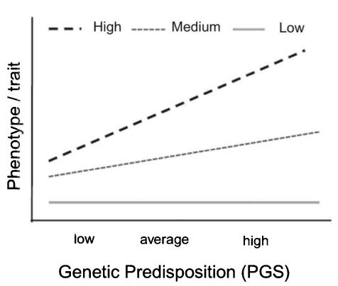
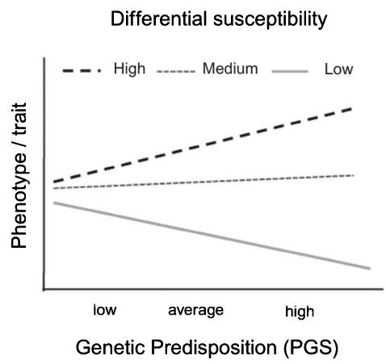
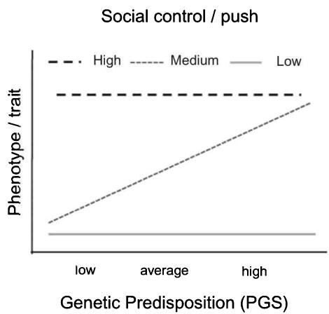

## Objectives

- Understand and differentiate between different types of gene-environment interplay of gene-environment (G×E) interaction and gene-environment correlation (rGE) 

- Understand the multiple ways of defining the environment, including by multilevels, domains, and temporal aspects 

- Recognize the history of $G \times E$ studies and common errors, from classic approaches to candidate gene and more recent genome-wide approaches 

- Comprehend and differentiate between the central theoretical $G \times E$ models of diathesis-stress, differential susceptibility, bioecological (social compensation), and social control 

- Differentiate between different types of rGE, including passive, evocative (reactive), and active and comprehend why rGE models are important and basic research designs 

• Grasp potential future directions in this area of research 

## 6.1 Introduction: What is gene-environment (G×E) interplay?

Gene-environment interplay is the phenomenon of gene-environment interaction (G×E) and gene-environment correlation (rGE). The majority of research in this area examines gene-environment interaction (G×E), which studies whether the effect of the genotype on the phenotype varies across different environments. This effect can be causal or noncausal. Gene-environment correlation (rGE) is the process by which an individual's genotype influences or is associated with exposure to the environment or in other words, how genes and the environment operate in tandem. The correlation thus measures whether there are different allele frequencies in different environments. This area of research has gained increased attention since researchers in the medical sciences, epidemiology, and social sciences are often interested in how a particular genotype could predispose certain subgroups in the population to various environmental exposures. Geneticists and biologists, conversely, more often focus on how environment may be related to the expression of a gene and lead to a particular disease or trait. 

Many complex traits such as cardiovascular disease, cancer, diabetes, and psychiatric disorders have been shown to be strongly affected by both genetic and environmental factors $[1, 2]$ . Recall that particularly for complex behavioral traits, polygenic scores (PGSs) derived from genome-wide association studies (GWASs) do not often capture a large percentage of the phenotypic variance. Most complex diseases and behaviors have a strong environmental component that has been well established in the nongenetic literature. Pioneering researchers in this area have shown that understanding complex traits requires not only information about genetic risks but also the importance in accounting for the social and natural environment of individuals $[3–6]$ . Some studies, for instance, reveal that certain positive genetic predispositions are realized in high-resource or stress-free environments, whereas negative predilections are exacerbated in negative environments $[7, 8]$ . By studying G×E, our aim is to identify genetic vulnerabilities or strengths that are either realized or suppressed in particular environments $[9]$ . 

The aim of this chapter is to provide readers with an overview of the main concepts of this area of research, including the most prominent theoretical models. In chapter 11 we provide empirical examples and discuss additional methodological challenges in this area of research. A simple G×E model includes a phenotype or trait (T), a genetic factor (G), an environmental factor (E), and often potential confounders (C). The previous chapters have discussed genetic factors (G) in detail, which in this book focuses on using genetic loci identified by GWASs and PGSs. In the next section we move from our focus on genetics to define the multifaceted term of environment and the interdependence of environmental factors. We then provide a brief history of G×E research, starting with classic approaches, through to the controversial and often unreplicated candidate gene (cG×E) studies followed by genome-wide G×E approaches. The next section maps the four key theoretical G×E models followed by a summary of the main challenges in this area of research and potential solutions. We provide an introduction of the different types of rGE and research designs in section 6.5 and reasons why this area of research remains difficult to study yet is still vital to consider. We conclude with a discussion of future directions. 

## 6.2 Defining the environment in GxE research

When one thinks of vernacular uses of the word environment, images such as exposure to pollutants or sunlight first come to mind. In the context of genetic research, environment (E), however, can adopt multiple forms. The environment is best characterized as a multilevel, multidomain, and multitemporal (life course, longitudinal) framework that is the upstream processes that may influence the trait under study $[10]$ . In genetics, E is in practice everything that that is nongenetic. Recall from our previous statistical chapter that causal designs are often a main focus of this type of research. An exogenous variable is one whose value is determined by factors outside of the causal system under study $[11]$ . In this type of research, E is often represented as an exogenous environmental variable such as air pollution, high altitude or a change in policy (e.g., taxation of smoking, mandatory years of schooling) or a measure of some form of exposure (e.g., to junk food or high caloric environment). 

## 6.2.1 Nature and scope of E: Multilevel, multidomain, and multitemporal

Of crucial importance to this area of research is attention to the scope, measurement, and definition of the environment $[10]$ . A classic definition of environmental factors in the medical literature is: “The environmental risk factor can be an exposure, either physical (e.g., radiation, temperature), chemical (e.g., polycyclic aromatic hydrocarbons), or biological (e.g., a virus); a behaviour pattern (e.g., late age at first pregnancy); or a ‘life event’ (e.g., job loss, injury)” ([12], p. 764). As Boardman and colleagues argue $[10]$ , these types of definitions can be extended to account for behavior at a higher aggregated group level to account for the social, political, and cultural environment. A definition such as the one listed above, demarcates the environment as a set of proximate environmental moderators (see box 6.1) of associations. A proximate cause is an event that is either the closest to or, in fact, responsible for causing the result that we observe. 

When examining the interplay of genotypes and the environment, the focus is on the role that is played by an individual's location within natural, social, and cultural structures as a fundamental determinant of both their vulnerability and their exposures. Empirical sociology has in particular provided strong theoretical and measurement models to transcend physical environment definitions to encompass the environment as multilevel, multidomain, and multitemporal. Multilevel environment refers to the supra-individual context in which individuals are “nested” or grouped within different levels of analysis. 

Box 6.1 

## E as a moderator of the relationship of G and T (trait)

Moderation was discussed previously in chapter 2 (see section 2.4.2, figure 2.10). It is defined as what occurs when the relationship between two variables depends on a third variable. In our case, it is when the relationship between genes and a trait (T) depends on the environment. E is the moderator. We often measure a moderating variable by adding an interaction term to a regression model to see if that variable affects the direction or strength of the relationship between G and T. Put another way, the moderator E is a third variable that affects the zero-order correlation between G and T or the value of the slope of T (dependent variable or outcome) on G (independent variable or covariate). More detail on this specification is provided later in this chapter with applied examples using computer code and interpretation of coefficients in part III of this book. 

These levels include countries, states, provinces or regions, neighborhoods, schools, and families. Multidomain environment denotes the often multiple and parallel environments that interact in several spheres of people's lives. These include the natural environment (e.g., altitude, temperature) but also social, economic, cultural, and institutional environments (e.g., health, social, or employment policy). If we recognize that we also have a multitemporal environment, we acknowledge that there are changes over time both within individuals (i.e., as they age across the life course) but also birth cohort (i.e., when they are born) and historical period effects (i.e., historical period they live in) within populations [13]. Here it is also useful to draw on the life course perspective, which recognizes that environments change across the life course. For instance, gestation occurs in the uterine environment, which is affected by the mother's behavior (e.g., smoking, diet during pregnancy), whereas in childhood and adolescence important environmental components are an individual's parents, school, peer group, and neighborhood. In adulthood, individuals are impacted by higher educational institutions, the workplace, their partner, and family unit. The life course perspective goes beyond examining the individual in exclusion to embrace linked lives (partners, children, or families) and a move from one trait or event to multiple sequences across the life course [14–16]. This links with previous findings that have shown that heritability often increases with age, such as the stronger heritability of the FTO gene (related to obesity) over the life course [17]. 

## 6.2.2 Interdependence of environmental risk factors

An aspect that makes it particularly challenging to study G×E is that environmental risk factors are rarely independent from one another. Social characteristics, such as lower socioeconomic status, smoking or poor air quality, often cluster in geographical areas such as neighborhoods, schools, or the workplace. For example, imagine that your aim is to examine the impact of stressful life events or maternal smoking during pregnancy on the outcome of birth weight and later childhood development. If you would only examine stressful life events and maternal smoking, you would miss the crucial fact that both health-related behaviors and the social risks that might lead to higher levels of maternal smoking or exposure to stress are derived from the same source of clustered lower socio-economic status. 

This type of deeper contextual understanding is crucial for the correct interpretation of G×E and genetic associations that differ between groups on key measures such as ethnicity or socioeconomic status. If complex traits such as health are primarily driven by physical and social features of the neighborhood or environment, genes may have little to do with the individual differences that we observe in some groups. Various studies have shown that certain genetic effects are less pronounced in resource-poor environments. In one of the most influential early examples in the field, Turkheimer et al. [7] found that the heritability of cognitive test scores was almost zero for those who came from poor environments but, importantly, heritability increased dramatically in tandem with gains in socioeconomic resources. In other words, those from higher-resource environments were able to realize their genetic potential whereas those from low-resource environments could not. Genetic factors related to cognitive performance was thus suppressed or not realized in the most disadvantaged groups. 

Another example is the study of the relationship between apolipoprotein E-allele (APOE) and change in cognitive function, most often associated with an increased risk for Alzheimer's disease $[18]$ . Boardman and colleagues tested whether the relationship between APOE and change in cognitive function varied in contexts with a higher or lower level of social disorder. They hypothesized that social contexts with high levels of disadvantage or disorder may dominate more subtle genetic effects on outcomes. The authors found that the genetic effect of the APOE-E allele was in fact the weakest in socially disorganized neighborhoods and strongest in socially organized ones $[19]$ . These distinctions are crucial for the correct interpretation of genetic effects and G×E between different groups, particularly the most disadvantaged groups. Since ethnic minorities are often concentrated in more disadvantaged neighborhoods (e.g., in the United States), it is not only misleading but patently incorrect to conclude that ethnicity or race would be the cause of detrimental or lower genetic outcomes. Putting aside the problem that we discussed in chapter 4 that most GWASs are derived from European-ancestry populations, and PGSs cannot be applied outside of different ancestry groups, if the proper genetic scores were applied, environmental structures may still result in differential exposure and the weakening or watering down of genetic effects. Furthermore, as described in relation to population stratification in chapter 3, we know that genetic variation is often related to geographic location $[20]$ . 

## 6.3 A brief history of GxE research

G×E refers to the case where we examine the moderation of genetic effects across various environments. These interactions are most often studied in one of three ways. First, heritability-environment (H×E) interaction or classic models estimate the relative contribution of genes to trait variance across different environments. Second, candidate G×E designs focus on environmental moderation of the association between a particular allele and a trait. This is what has been referred to as candidate gene (cG×E) or allele-by-environment interaction. Some have distinguished these two approaches as “latent” (H×E) versus “measured” (cG×E). The third and now most commonly used method employs PGSs identified by GWASs, and applies them across various environmental contexts. 

## 6.3.1 Classic approaches

As we touched upon earlier, before the availability of genome-wide data and approaches, behavior genetic methods with family-based data (e.g., twins, adopted children, parents, siblings) were used to estimate genetic and environmental influences on a phenotype. 

This partitioned the heritability or proportion of the total variance in a specific sample from a population that was attributed to genetic variation, which we described in detail in previous chapters. Particularly the extended multivariate models in this classic research advanced the field in several ways. First, they established whether two variables that have a high phenotypic correlation could share the same underlying genetic basis. Second, they pointed to sources of the nonshared environment and latent constructs. It was difficult, however, for these models to estimate the ways in which genetic influences and the environmental worked jointly. Family models are still very relevant for this type of research to answer particular questions. There is mounting evidence, for instance, that genetic effects, particularly on behavioral phenotypes in GWASs, might be biased or substantially attenuated after controlling for family fixed effects when using samples of siblings. 

## 6.3.2 Candidate gene cGxE approaches

There are two types of candidate gene approaches. First, there were early candidate gene studies in the 2000s, that focussed on predefined loci of interest based on what was thought to be a priori knowledge of the loci's biological function or impact on the trait being examined. More thorough reviews of this research have been explored elsewhere, particularly in the area of psychology where these studies were more common [21, 22]. Second, candidate genes can also be selected from top hits from GWA studies. There was some early success in this area using the APOE-E allele in relation to Alzheimer's disease and the FTO gene related to obesity [23]. 

Candidate gene studies were introduced in the early 2000s since costs and technology restricted both the sample size of genetic studies but also often only the genotyping of a small number of loci. Early studies often examined plausible neurobiological processes such as neurotransmission since approved pharmaceutical therapies targeted these pathways. In fact, $89.2\%$ of candidate gene studies in the first decade of this research examined genes involved in neurotransmission [22]. Many studies repeated virtually identical narratives regarding the functioning of these neurotransmitters, yet it soon became apparent that most of the findings were false-positives [21]. Some focused on examining genetic main effects but many well-known studies focused on $\mathrm{G} \times \mathrm{E}$ . 

Duncan et al. [22] examined 103 cG×E studies that had six or more replication attempts. They found that virtually all lacked unequivocal support and one received no support at all. The false-positive results of candidate gene studies were primarily attributed to the following reasons. First, candidate gene hypotheses were wrong and in principle most should have warranted a null finding. Research stemmed from a clear biological basis that focused on drugs that were deemed to work. Here it is important to maintain a distinction between whether a gene is associated with a trait and whether the gene is involved in the biology of that trait, which had not been established. GWAS has revealed that the majority of the associated variants are not in protein-coding regions (exons), which is where most of the candidate genes were selected. Rather, they appear to be in intergenic and intronic regions that are less well understood [24]. We note, however, that there is a subtlety to this point, which is that the noncoding variants may well exert their effects through their influence on the expression of protein-coding genes. Second, statistical significance norms increased the risk of false positives, a topic we covered already in detail in chapter 2 [25]. Third, most of the studies were seriously underpowered to detect any association with such a small effect. Duncan and colleagues [22] elaborate that when comparing previous candidate gene studies, even the variants that had the strongest associations from GWASs were considerably smaller than those hypothesized by candidate gene studies. Fourth, there was a strong publication bias toward positive results. Remarkably, this led to the editor of the journal Behaviour Genetics to write in a 2012 editorial: “Behaviour genetics literature has become confusing and it now seems likely that many of the published findings of the last decade are wrong or misleading and have not contributed to real advances in knowledge” [26, p. 1]. 

All of these points refer to the culprit of researcher degrees of freedom $[25]$ . This refers to the phenomenon of the research process where researchers make key decisions in the course of collecting and analysing the data. It includes how much data should be collected, whether some observations should be excluded, which conditions should be combined, inclusion of control variables, and transformation of specific measures. Since researchers rarely make these decisions beforehand, while exploring various analytical techniques, there is an inherent drive that leads to a research outcome that “works” and favors statistical significance. This thus increases the likelihood that at least one of these many analytical attempts produces a false positive finding. 

A detailed review of these studies may be found elsewhere $[21, 22]$ . Perhaps the most infamous cG×E study is the 2002 Science publication of Caspi $[27]$ , who examined whether the carriers of a short allele in the serotonin receptor gene (5HTTLPR) were sensitive to stressful life events. Carriers of the short allele were compared to those who had two long alleles at that locus, who appeared to be protected from the deleterious effects of strain and stress. The study gained considerable attention both initially due to the pioneering approach of cG×E but then later due to a lack of replication $[21, 28]$ . The research was inherently appealing for many since it seemingly corroborated the importance of the environment in predicting genetic effects. 

## 6.3.3 Genome-wide polygenic score GxE approaches

As we noted in previous chapters, with the arrival of the GWAS, reduction in costs, and the technical ability to genotype more than a small selection of variants, most G×E work now applies PGSs from GWASs. Many studies have been published using this approach since around 2014. Within psychology, some have adopted a case-control design. For example, multiple studies examine the relationship between the genetic predisposition toward major depressive disorder (MDD) and childhood trauma. Some found a significant interaction between the PGS for MDD and childhood trauma in predicting depression [29, 30]. 

Peyrot and colleagues [29], for instance, found that individuals who had a higher PGS for MDD and had experienced childhood trauma were more likely to develop depression (MDD) than those with a low PGS and no history of trauma. A growing number of studies use the compulsory schooling age reform in the United Kingdom, which demanded that students complete an additional year of school, as a natural experiment. Barcellos et al. (2018) [31], for example, examined whether genetic makeup moderates the effects of education on health outcomes. A series of studies by Boardman and colleagues has shown how the heritability of smoking was significantly reduced in U.S. states when restrictive policies on the sale of cigarettes and higher taxes were introduced at the state level [32]. We explore some of these examples in more detail when we describe the central theoretical models. 

## 6.4 Conceptual GxE models

G×E interaction is often described with the aid of four key conceptual models, summarized in table 6.1. These theories are also often specified and distinguished by the functional form of the relationship between Genotype (G), Environment (E), and Trait (T). We also illustrate the theories using their functional forms in figure 6.1. It is perhaps important to note at the outset that these models were not rigorously specified or formalized to be mutually exclusive. For this reason, they can at times overlap and have blurred and fluid empirical applications. Others are not separate or exclusive theoretical models per se, but rather models that describe the positive (e.g., compensation model) or negative (e.g., diathesis-stress or triggering model) complement of the other model. 

## 6.4.1 Diathesis-stress, vulnerability, or contextual triggering model

The majority of G×E research applies the diathesis-stress model, also interchangeably known as the vulnerability or contextual triggering model. The diathesis-stress model, developed by Monroe and Simons [33], proposes that genetic differences associated with negative outcomes in risky environments will have either an attenuated relationship or be entirely muted in low-risk environments. The model posits that the genetic propensity for a trait lies dormant until it is triggered by some sort of stressor or environmental exposure. The word diathesis originates from the Greek term for a predisposition but in this area of research it is used to refer to a tendency to suffer from a particular condition. Here diathesis is often represented by genetic or biological predictors. 

Stressors or triggers in this theory are harmful or adverse conditions and can range from major stressful life events (e.g., death of spouse, divorce) to minor or chronic conditions or what Shanahan and Hofer $[36]$ term contextual triggering. As we describe shortly in our discussion of gene-environment correlation, diathesis may even influence whether the environment is experienced by an individual in the first instance. Most research has focused on studying how genetic influences might be moderated by adversity, particularly inspired by the early Caspi study $[27]$ and related work. Extensions have been made, however, in diverse areas, including academic achievement $[40]$ . 

Table 6.1

Summary of theoretical and conceptual models underlying G×E studies.

<table><tr><td>Theory</td><td>Brief summary</td><td>Original article and further reading</td><td>Example of an empirical article that uses this theory</td></tr><tr><td>Diathesis-stress, also known as vulnerability, contextual triggering</td><td>A predisposition (i.e., a diathesis) for the phenotype lies dormant until triggered by environment (e.g., stressor).</td><td>Monroe and Simons (1991) [33]</td><td>South and Krueger (2008) [34]</td></tr><tr><td>Bioecological or social compensation model</td><td>Genetic influences are maximized in stable and adaptive environments that permit positive, stable interactions (proximal processes) between individuals and their environment, enabling them to reach their genetic potential. Social compensation: environment is free of stress or has positive enriching properties.</td><td>Bronfenbrenner and Ceci (1994) [35]; Shanahan and Hofer (2005) [36]</td><td>Turkheimer et al. (2003) [7]</td></tr><tr><td>Differential susceptibility</td><td>Plasticity varies by individual with some (known as orchids) being more susceptible to (i.e., genetically influenced by) the effect of both positive and negative environments whereas others (known as dandelions) are more resilient.</td><td>Belsky and Pluess (2009) [6]</td><td>South and Krueger (2013) [8]</td></tr><tr><td>Social control or social push</td><td>Genetic influences are filtered and dampened in particular environments. Social control: social norms and structural constraints.</td><td>Shanahan and Hofer (2005) [36]</td><td>Boardman (2009) [32]; Dick et al. (2007) [37]; Liu and Guo (2015) [38]</td></tr></table>

Source: Adapted from South et al. (2017) [39]. 

## 6.4.2 Bioecological or social compensation model

Although they are often presented as separate theories, conceptually the bioecological or social compensation model is the actually the flipside or mirror of the previous theory. This theory often focuses on the environmental context of where individuals live, work, or interact (e.g., religious locations, schools) [35]. In contrast to the previous theory that focuses on negative and adverse conditions, this theory assumes that low-risk or highly stable environments allow positive and enduring interactions. These are called proximal processes of interaction between individuals and their environment. These interactions in turn allow individuals to realize their genetic potential. This is similar to what Shanahan and Hofer [36] refer to as “social enhancement.” Studies in this area often focus on the adaptation and buffering of context for individuals to reach their genetic potential. A buffering or social enhancement environment could be, for instance, parents who stimulate healthy eating, physical exercise, have many books in the household, or do not smoke. Or, those with the more “risky” alleles of two polymorphisms on the FTO (i.e., obesity-related) gene could avoid having this translate into a high BMI if they compensated, for instance, by being highly physically active. 

Diathesis-Stress/Trigger/Compensation

Figure 6.1

Gene-environment interaction models.

Source: Adapted from Liu and Guo [38].

Note: Lines represent genetic predisposition measured as PGSs by three groups of high, medium, and low PGS. The magnitude of the genetic association is indicated by the slope, with a steeper slope indicating a greater genetic association.

A body of research that has used this theory examines the inheritance of cognitive ability and intelligence and how the genetic influence of these measures varies by socioeconomic status. This stems from the aforementioned study by Turkheimer and colleagues $[7]$ , who showed that the genetic influences on intelligence were only realized among those with the highest socioeconomic status. Those from low-risk environments (e.g., high socioeconomic status) and higher PGSs for IQ or cognitive ability would be more likely to realize their genetic potential. Even those in the lower PGS group (i.e., lower cognitive ability genetic score) that were in low-risk environments would do better than those from high-risk environments. Those from high-risk environments would have the lowest levels of educational achievement, regardless of their genetic score. This finding has been successfully replicated in several studies, such as Tucker-Drob and colleagues' work on the relationship of cognitive $[41]$ and math ability $[42]$ in young children. The original finding by Turkheimer et al., however, has evaded replication in several non-American contexts such as the United Kingdom $[43]$ and the Netherlands $[44]$ . As we have noted elsewhere, the differences in the moderation of genetic influences on IQ may be related to environmental variation between countries, historical periods, and levels of socioeconomic status and inequality $[13, 45]$ . 

## 6.4.3 Differential susceptibility model

The differential susceptibility model $[6]$ is also a variation on the diathesis-stress model. Both theories suggest that individuals are differentially susceptible to environmental influences. The diathesis-stress model describes this distinction almost exclusively in relation to negative influences. As the middle panel of figure 6.1 illustrates, the differential susceptibility model, sometimes also referred to as the plasticity model, hypothesizes that there are groups sensitive to both negative and positive environments. Some have also referred to this as the biological sensitivity to context model or the orchid–dandelion hypothesis $[46]$ . Anyone who has attempted to grow an orchid knows that it requires a delicate mix of dedicated expert care to survive whereas dandelions thrive in any environment. Very risky environments (e.g., low socioeconomic status) allow for the expression of genetic vulnerabilities to poor outcomes and the low-risk or highly enriched or compensated environments (e.g., high socioeconomic status) allow genetic predispositions to be realized and flourish. 

This theory also supposes that individuals have a certain level of plasticity or adaptability to their environment, with some being more susceptible to both positive and negative environments. This is characterized by crossover interactions; those who have the highest likelihood of the outcome when they have a high PGS (genetic risk) and high environmental stressor also have the lowest likelihood of the outcome when there is a low genetic risk and low environmental risk. Others have focused on the nuances of distinguishing between the diathesis-stress and differential susceptibility model in more detail $[47]$ . An excellent discussion can also be found by Belsky et al. $[48]$ . An example of this model is South and Krueger's [8] work on the “orchid” effect in how physical health differs in relation to an individual’s marital relationship quality. The authors found that the heritability of subjective health was the highest among both highly distressed and highly satisfied couples. 

## 6.4.4 Social control or social push model

The social control model, sometimes also referred to as the social push model, hypothesizes that genetic associations are attenuated or dampened in the presence of socially restrictive environmental contexts. In other words, the model does not emphasize direct environmental effects on the genetic contribution but rather that the genetic propensity can be weakened in the case of strong environmental influences. This could include social norms, such as age norms of the timing of life events, parental monitoring, or religious norms that restrict certain social behavior and environmental exposure such as smoking or drinking. 

Although introduced separately by Shanahan and Hofer $[36]$ , as we noted earlier, these theories often conceptually overlap and have similar results in that both involve the presence of an environmental context that is protective of potential detrimental genetic predispositions. In the social control model, the environment is comprised of constraints imposed by structural processes and social norms. In the social compensation model, the environment is notable for the actual absence of stress or manifestation of enriching aspects $[39]$ . The diathesis-stress model focuses on the combination of genetic predispositions and the presence of stress. The social control and compensation models focus on the environmental circumstances that might dampen or inhibit lower genetic predispositions resulting in a detrimental outcome or trait. Some have shown how adolescent smoking decreases with higher levels of parental monitoring $[37]$ . Others examined the genetics of alcohol metabolism and the extent to which certain alleles affect alcohol consumption and that relationship to religion, family environment, and childhood adversity $[49]$ . Social control can also take the form of policies such as a study that demonstrated that the heritability of smoking was significantly reduced in U.S. states that introduced restrictive policies on the sale of cigarettes and higher taxes $[32]$ . 

## 6.4.5 Research designs to study GxE

Table 6.2 provides an overview of the main challenges of G×E research and potential solutions. In part III of this book, and particularly in chapter 11, we cover the details of model estimation and the interpretation of interaction parameters. Here we also address some of the vexing methodological issues noted at the bottom of table 6.2, such as sensitivity to scaling effects, basic statistical tests, properly controlling for confounders, and whether you require a main effect. In this chapter we only discuss the initial conceptual issues, with the methodological challenges and solutions explored in more detail in chapter 11. 

Table 6.2

Summary of challenges and potential solutions for G×E analysis.

<table><tr><td>Challenge</td><td>Why is this problematic?</td><td>Potential solutions</td><td>Example of study, further explanation</td></tr><tr><td>Theoretical model underlying G×E unclear</td><td>Lack of understanding of causal mechanisms leads to black box explanation</td><td>Extensively review nongenetic literature on topic</td><td></td></tr><tr><td>Articulating plausible biological pathway for G×E associations</td><td>Lack of understanding of causal mechanisms leads to black box explanation</td><td>Engage in or refer to downstream biological analyses related to G</td><td>Duncan and Keller (2011) [21] discuss various shortcomings of the literature</td></tr><tr><td>Candidate-gene (single-variant) approach</td><td>Lacks power, agnostic to biological processes, based on an a priori theory that has not been biologically proven, often small selection of SNPs</td><td>Conduct or include examinations on gene-based or set-based modelsReplicate in other samples with similar phenotypic measures</td><td>Duncan and Keller (2011) [21] discuss various shortcomings of the literatureFrayling et al. (2007)—FTO gene [23]</td></tr><tr><td>Inconsistent measure of exposure or phenotype</td><td>Various studies used existing and only roughly comparable measuresHarmonization of easiest and broadest measure that approxi-mates E to obtain largest sample possible Environmental conditions are time-varying and manifold</td><td>Collaborate on common core exposures and definitions before data collectionPrioritize precision of measuresEngage in sensitivity analyses with different specificationsMove beyond static or time-constant studies</td><td></td></tr><tr><td>Environment viewed as proximate environmental moderator</td><td>Environments defined as obesity or maternal smoking are far downstream from social environmental factors that structure exposure</td><td>Contextualize individually based risk factors and examine what puts people at risk</td><td>Boardman et al. (2013) [10]</td></tr><tr><td>Too much emphasis on individual environment</td><td>Does not account for group-level behavioral, normative, and cultural processes that shape traits and behavior</td><td>Distinguish between the actions of people and the circumstances in which these actions occur</td><td>Boardman et al. (2013) [10]</td></tr><tr><td>Genetic participants from selective environments</td><td>Samples largely from healthy, higher-socioeconomic-status, and older populations in specific Western countriesSpecific disease profiles and few from low-resource environments to compare environments</td><td>Recognize selective sample in interpretation of resultsMove to use representative population samplesDraw from social science literature to recognize unique environments and life course (age) effects</td><td>Pampel et al. (2010) [50] show socioeconomic disparities in health behaviorMills and Rahal (2019) [51] show that 72% of GWAS findings emanate from three countries (U.S., U.K., Iceland); datasets are often selective on geography, age (older), sex (more females)</td></tr><tr><td>Only European-descent populations considered</td><td>Cannot use genetic scores or generalize results beyond European ancestry groups</td><td>Locate consortiums or GWASs on other ancestry populations; consider admixture analysis; wait for the field to catch up</td><td>Mills and Rahal (2019) [51] show that all GWASs (2007–2018) range between 72% and 96% European ancestry, currently 88% in 2017</td></tr><tr><td>Lack of power and large-enough sample size</td><td>Need sufficiently large sample to estimate magnitude and strength of association</td><td>Engage in a power analysis to understand sample size required to detect G×E effect</td><td>See box 4.1 for genetic power calculators</td></tr><tr><td>SNP-based analyses lack power</td><td>Single-step analysis subject to multiple comparisons burden due to large number of SNPs considered at once</td><td>Conduct more efficient two-step tests</td><td>Gauderman et al. (2017) [52]</td></tr><tr><td>Interaction is dependent on scaling metric</td><td>Only multiplicative scale considered</td><td>Evaluate interaction on both multiplicative and additive scales</td><td>Gauderman et al. (2017) [52]</td></tr><tr><td>Detected interactions driven by confounders</td><td>Interactions are artefact driven by confounders (e.g., ethnicity, gender, age, socioeconomic status) rather than genetic or environmental variablesResearchers incorrectly enter confounders as covariates in general linear models</td><td>Researchers need to enter the covariate-by-environment and the covariate-by-gene interaction in the same model that tests G×E interaction</td><td>Keller (2014) [53] explains the problem and how to solve it</td></tr><tr><td>Standard GWAS results may mask G×E</td><td>Genetic discovery is mostly based on GWAS meta-analyses of individuals from various environments. Only robust associations that replicate across multiple countries and birth cohorts are seen as valid.</td><td>Potential solutions include the search for a exogenous environmen-tal interaction variables—also in reference to the GWAS discovery or conduct-ing large-scale discovery studies in specific environments</td><td>Conley 2017 [54] explains the issue quite intuitively, and Tropf et al. 2017 [13] show evidence that G×E across countries and birth cohorts partly explain hidden heritability and produce a reduced while robust heritability estimate</td></tr></table>

The first challenge is specifying the theoretical model, which is often very difficult to achieve without an extensive literature review and strong understanding of the trait, main predictors, and variation across environmental conditions. A second and often insurmountable challenge for many newcomers (and even seasoned researchers) is the inability to articulate a plausible biological pathway for these models. Here it is essential to work directly with biologists or become versed in downstream biological and functional analyses not covered in this book. A third challenge as noted extensively in this chapter is that researchers should be reticent in adopting a candidate-gene approach for some topics and be careful to replicate research. A fourth challenge is an inconsistent measure of exposure or the phenotype under study. Studies can sometimes defy replication due to the lack of harmonization of the original phenotype measurement. As we noted in our discussion of E, a related problem is that environmental conditions can be observed on multiple levels and across various time periods. 

A fifth issue is that the environment is often viewed as a proximate environmental moderator, and thus distant from the actual factors. Here it is important to understand the specific contexts of individuals and what places them at risk in that particular environment. A sixth challenge is that in some cases too much emphasis is placed on the individual environment, missing larger phenomenon such as couple or group-level behavior and larger cultural processes. Here we encourage researchers to distinguish between the individual actions of people and the circumstances in which the actions occur. Table 6.2 then addresses two points related to the lack of diversity in this research domain, discussed in detail in chapter 4. Here we note issues in the sample selectivity of GWAS research in terms of the healthy volunteer bias and extreme concentration of subjects coming from a handful of countries and overrepresented by those of European ancestry. 

The final remaining five points are methodological issues. It is essential to determine whether you have a sample size that is large enough to even detect a G×E association, which we discussed in chapters 2 and 4 (see also box 4.1). Since a single-step analysis may be subject to a multiple comparisons burden (i.e., due to many SNPs compared at once), researchers should also consider a two-step test. Since only the multiplicative scale is often used in analyses, it is likewise important to evaluate the interaction on the additive scale to ensure that the interaction is not attributed to the scaling metric. A common error is that interaction effects are actually driven by confounders. To avoid this problem, it is necessary to enter the covariate-by-environment and the covariate-by-gene interaction in the same model that tests for the G×E interaction. Finally, the standard GWAS results used as a basis for the PGSs in these G×E models may mask environmental effects (see chapter 4). 

## 6.5 Gene-environment correlation (rGE)

There is often considerable confusion over the distinction between gene-environment interaction (G×E) and gene-environment correlation (rGE). Gene-environment correlation (rGE) is a process by which genes and the environment operate together and change in tandem. In other words, rGE is the phenomenon by which an individual's genotype influences or is associated with exposure to the environment. It has been a longstanding area of study in psychology and psychiatry $[55, 56]$ . It is also reminiscent of the well-established life course models in sociology of individual-environment correlations that describe how an individual's behavior, ability, or personality shape his or her environment $[57]$ . These studies often try to uncover causal mechanisms underpinning how genetic predispositions control or influence environmental exposure. These genetic variants are often seen to indirectly influence environmental exposure via particular behaviors. Three main rGE processes were first described by Plomin and colleagues in 1977 $[55]$ and categorized as passive, evocative, and active. 

## 6.5.1 Passive gene-environment correlation (rGE)

Passive gene-environment correlation (rGE) is the association between the genotype a child inherits from her or his parents and the environment in which the child is raised. Parents not only pass on genetic material to their children but also create a home environment that is influenced by their own heritable characteristics. This idea was empirically examined, for instance, in a Science paper in the form of what the authors termed “non-transmitted alleles” in relation to educational attainment, reproductive behavior, and health $[58]$ . In other words, although parents pass on their genetic material through sexual reproduction and genetic recombination (see chapter 1, section 1.2), the remainder of their nontransmitted genetic material still shapes the environment in which their children reside. Passive rGE accounts for the observed correlations between the child’s behavior and their environment. For example, consider children who are aggressive and are also physically disciplined (e.g., spanked) by their parents. If these parents are also more aggressive than average they create an environment that includes physical discipline but also transmit a genetic risk of aggressive behavior to their children. This increases the likelihood that their children will be more aggressive and, as parents, will be more likely to use physical discipline $[59]$ . Another example is the assortative mating of highly educated parents. If both parents are highly educated, they create an environment of learning, monitoring of homework, and higher educational expectations. They likewise transmit a higher joint genetic risk of obtaining higher education (often correlated with cognitive ability). 

A challenge with studying passive rGE is the fact that the result may represent a spurious relationship between the environment and trait. A spurious relationship is when two more variables that are not causally related to one another are mistakenly believed to be related due to presence of a third omitted (or confounding) variable. If we take the first example, parents who impart aggressive behavior are at an increased risk of physically disciplining or even abusing their children. This physical maltreatment may be a genetic risk that parents transmit to their children and not a causal risk factor of children's own aggressive behavior. 

## 6.5.2 Evocative (or reactive) rGE

Evocative (also known as reactive) gene-environment correlation (rGE) is when an individual's heritable traits evoke reactions from others in the environment. Children who are genetically prone to certain personality traits, such as introversion and related impositions such as being shy, for instance, may appear unapproachable or aloof to peers who as a result reinforce that trait through their reactions. Or, consider the relationship between having a higher genetic propensity for depression and partnership (marital) conflict. The genetic association and marital conflict may emerge as a result of problems in engaging with a depressed partner and not actually represent a causal effect of marital conflict and risk of depression. 

## 6.5.3 Active rGE

Active gene-environment correlation (rGE), or niche creation, is when individuals actively select or create environments that are associated with their own genetic predispositions. Individuals who enjoy risk-taking or have extroverted personalities may actively seek out those environments. Those who feel more comfortable in controlled environments or ones that are highly regulated by social norms (e.g., religious norms, tax office) will be more likely to seek out peers and environments that are conducive to their preferences. 

## 6.5.4 Why are models of rGE important?

Although rGE models are less studied than gene-environment interaction models and difficult to empirically examine, rGE models are important for several reasons. First, they examine the possibility that we may not fully understand the relationship between environmental risk exposure and the traits that we study. The fact that genes and environment may be correlated means that simple causal models of the association between environmental exposures (e.g., during childhood) and traits or outcomes are potentially confounded. Second, our causal understandings are often simplistic and do not measure reciprocal causal relationships over time, such as how genetically influenced behavior evokes responses which then reinforces that behavior. This reflects the example provided previously of a shy child with an introverted personality who may act invisible and evoke responses of being ignored by their peers, which in turn reinforces that behavior. Third, they inform us about how the trait we are studying develops over time, relating to the multitemporal dimension discussed previously. Life course and developmental pathways that lead to certain traits are increasingly recognized as important. Studies of rGE move toward understanding the reciprocal effects of individuals on their environments over time [60]. This may explain the results of studies that show how heritability changes with age by providing the explanation that behavior that is genetically influenced affects the way the environment interacts with the individual. Research in this area is providing increasing evidence that the pathway from genes to environment involves environment. In other words, there are no particular genes for environments but rather genes may evoke behavior and ability, which in turn shape an individual's environment. 

## 6.5.5 Research designs to study rGE

It is often difficult to determine whether the relationships we observe between environmental exposure and the trait we study are causal since it is often the result of a complex and reciprocal process. Although this goes beyond the auspices of this introductory book, several researchers have developed unique research designs to study these processes, such as quasi-experimental designs $[61, 62]$ . Others have used designs such as including parents whose children were conceived via assisted reproductive technologies where parents were biologically related but also used sperm, egg, or embryo donation $[63]$ . They then compared the association between parent and child behavior of genetically versus unrelated pairs to estimate passive rGE. Others have used quasi-experimental designs and statistical matching of sibling pairs to rule out the possibility that evocative rGE confounds associations between men's marital status and antisocial behavior $[64]$ . rGE models remain a challenging frontier since the magnitude of rGE varies across context, life course stage, involves reciprocal interactions with individuals and their environments, and varies within families and within populations $[65]$ . 

## 6.6 Conclusion and future directions

## 6.6.1 Why haven't many G×Es been identified?

Detecting and replicating G×Es has been one of the main challenges in this area of research. As discussed previously, a fundamental challenge has been the lack of replicability related to low statistical power and the massive sample sizes required to detect interaction effects of even a low to moderate magnitude. Second, we often assume that there has been measurement error in both G and E, which in turn reduces the overall ability to detect real associations. In relation to G, we acknowledge that the causal genetic locus is rarely directly measured or understood. When using PGSs with multiple genetic loci, measurement error and a lack of understanding of the biological basis of the genetic predictors are even more pronounced. It is also important to note that we often rely on linkage disequilibrium (LD) and locate a region, but many times not the actual causal gene. As noted in chapter 3, the size of haplotype blocks varies and LD is sometimes very high with certain variants. The move to sequencing and study of more diverse populations will likely help in this respect. Third, in relation to E, as noted earlier, there are often difficulties in measuring multiple aspects of the environment and a high correlation of environmental factors. The response is often a relentless drive to increase sample size. However, a more cost-effective and precision measurement approach to not only E but also the traits we study is clearly a more efficient solution. Fourth, although quite implausible, it may be that G×E is theoretically pleasing but does not exist. Since we are generally examining only common genetic variants that have appeared in the immediate past, selection pressure could have weeded out all large G×E effects, leaving us with the true finding that there is no G×E. Even if G×E is important for rare variants or rare environmental circumstances, our current methods may render it virtually impossible to detect. One suggestion for future avenues of research is to stratify the analyses to identify subgroups that may pick up G×E. Aschard and colleagues showed age-specific per-allele odds of SNPs associated with breast cancer, for example, which would allow a focus on those who would most benefit from genetic screening for this disease $[66]$ . 

## Exercises

1. If a genetic predisposition would only lead to high blood pressure if someone drinks too much alcohol, which of the three gene-environment interaction models would describe this process the best? Try to draw the model as well. 

2. Think of an example for the differential susceptibility gene-environment interaction model. 

3. If someone with a genetic predisposition for smoking grows up in a family of smokers, does this describe gene-environment interaction or gene-environment correlation? 

4. Provide an example for each of the following types of active, passive, and evocative gene-environment correlation. 

## Further reading

For a more in-depth reviews and reflection on the following topics, see: 

Belsky, J., M. Pluess, and K. F. Widaman. Confirmatory and competitive evaluation of alternative gene-environment interaction hypotheses. J. of Child Psy. and Psy. 52(1), 1135–1143 (2013). 

Boardman, J. D., D. Daw, and J. Freese. Defining the environment in gene-environment interaction research: Lessons from social epidemiology. Am. J of Pub. Health 103, S64–S74 (2013). 

Del Giudice, M. Statistical tests of differential susceptibility: Performance, limitations, and improvements. Dev. and Psycho. 29(4), 1267–1278 (2017). 

Mitchell, C. et al. Genetic differential sensitivity to social environments: Implications for research. Ann. Rev. of Psy. 65, 41–70 (2014). 

Roisman, G. I. et al. Distinguishing differential susceptibility from diathesis-stress: Recommendations for evaluating interaction effects. Dev. and Psycho. 24(2), 389–400 (2012). 

Shanahan, M., and S. Hofer. Social context in gene–environment interactions: Retrospect and prospect. J. Gerontol. Ser. B Psychol. Sci. Soc. Sci. 60, 65–76 (2005). 

For a detailed review of the problems in candidate (cG×E) research, particularly in the area of psychological research, see references 21 and 22. 

## References

1. M. C. Nelson, P. Gordon-Larsen, K. E. North, and L. S. Adair, Body mass index gain, fast food, and physical activity: Effects of shared environments over time. Obesity 14, 701–709 (2006). 

2. J. Boardman et al., Is the gene-environment interaction paradigm relevant to genome-wide studies? The case of education and body mass index. Demography 51, 119–139 (2014). 

3. J. D. Boardman, B. W. Domingue, and J. M. Fletcher, How social and genetic factors predict friendship networks. Proc. Natl. Acad. Sci. USA 109, 17377–17381 (2012). 

4. J. D. Boardman et al., Do schools moderate the genetic determinants of smoking? Behav. Genet. 38, 234–246 (2008). 

5. B. W. Domingue et al., The social genome of friends and schoolmates in the National Longitudinal Study of Adolescent to Adult Health. Proc. Natl. Acad. Sci. USA 115(4), 702–707 (2018). 

6. J. Belsky and M. Pluess, Beyond diathesis stress: Differential susceptibility to environmental influences. Psychol. Bull. 135, 885–908 (2009). 

7. E. Turkheimer et al., Socioeconomic status modifies heritability of IQ in young children. Psychol. Sci. 14, 623–628 (2003). 

8. S. C. South and R. F. Krueger, Marital satisfaction and physical health: Evidence for an orchid effect. Psychol. Sci. 24, 373–378 (2013). 

9. E. B. Bookman et al., Gene-environment interplay in common complex diseases: Forging an integrative model—Recommendations from an NIH workshop. Genet. Epidemiol. 35, 217–225 (2011). 

10. J. D. Boardman, J. Daw, and J. Freese, Defining the environment in gene-environment research: Lessons from social epidemiology. Am. J. Public Health 103, 64–72 (2013). 

11. J. Pearl, Causality: Models, reasoning, and inference (Cambridge: Cambridge University Press, 2000). 

12. R. Ottman, Gene-environment interaction: Definitions and study designs. Prev. Med. 25, 764–770 (1996). 

13. F. C. Tropf et al., Hidden heritability due to heterogeneity across seven populations. Nat. Hum. Behav. 1, 757–765 (2017). 

14. N. Barban and F. C. Billari, Classifying life course trajectories: A comparison of latent class and sequence analysis. J. R. Stat. Soc. Ser. C (Applied Stat.) 61, 765–784 (2012). 

15. M. C. Mills, Introducing survival and event history analysis (Los Angeles: Sage, 2011). 

16. M. C. Mills and H.-P. Blossfeld, Globalization, uncertainty and the early life course: A theoretical framework. In H. P. Blossfield, E. Klijzing, M. Mills, and K. Kurz (eds.), Globalization, uncertainty and youth in society, 1–24 (London: Routledge, 2005). 

17. C. M. A. Haworth et al., Increasing heritability of BMI and stronger associations with the FTO gene over childhood. Obesity 16, 2663–2668 (2008). 

18. J. Kim, J. M. Basak, and D. M. Holtzman, The role of apolipoprotein E in Alzheimer's disease. Neuron 63, 287–303 (2009). 

19. J. D. Boardman et al., Social disorder, APOE-E4 genotype, and change in cognitive function among older adults living in Chicago. Soc. Sci. Med. 74, 1584–1590 (2012). 

20. J. Novembre et al., Genes mirror geography within Europe. Nature 456, 98–101 (2008). 

21. L. E. Duncan and M. C. Keller, A critical review of the first 10 years of candidate gene-by-environment interaction research in psychiatry. Am. J. Psych. 168, 1041–1049 (2011). 

22. L. E. Duncan, A. R. Pollastri, and J. W. Smoller, Mind the gap: Why many geneticists and psychological scientists have discrepant views about gene-environment interaction (G×E) research. Am. Psychol. 69, 249–268 (2014). 

23. T. M. Frayling et al., A common variant in the FTO gene is associated with body mass index and predisposes to childhood and adult obesity. Science 316, 889–894 (2007). 

24. L. A. Hindorff et al., Potential etiologic and functional implications of genome-wide association loci for human diseases and traits. Proc. Natl. Acad. Sci. USA 106, 9362–9367 (2009). 

25. J. P. Simmons, L. D. Nelson, and U. Simonsohn, False-positive psychology. Psychol. Sci. 22, 1359–1366 (2011). 

26. J. Hewitt, Editorial policy on candidate gene association and candidate gene-by-environment interaction studies of complex traits. Behav. Genet. 41, 1–2 (2012). 

27. A. Caspi, Role of genotype in the cycle of violence in maltreated children. Science 297, 851–854 (2002). 

28. D. M. Dick, An interdisciplinary approach to studying gene-environment interactions: from twin studies to gene identification and back. Res. Hum. Dev. 8, 211–226 (2011). 

29. W. J. Peyrot et al., Effect of polygenic risk scores on depression in childhood trauma. Br. J. Psych. 205, 113–119 (2014). 

30. N. Mullins et al., Polygenic interactions with environmental adversity in the aetiology of major depressive disorder. Psychol. Med. 46, 759–770 (2016). 

31. S. H. Barcellos, L. S. Carvalho, and P. Turley, Education can reduce health differences related to genetic risk of obesity. Proc. Natl. Acad. Sci. USA 115, E9765–E9772 (2018). 

32. J. D. Boardman, State-level moderation of genetic tendencies to smoke. Am. J. Pub. Health 99, 480–486 (2009). 

33. S. M. Monroe and A. D. Simons, Diathesis-stress theories in the context of life stress research: Implications for the depressive disorders. Psychol. Bull. 110, 406–425 (1991). 

34. S. C. South and R. F. Krueger, Marital quality moderates genetic and environmental influences on the internalizing spectrum. J. Abnorm. Psychol. 117, 826–837 (2008). 

35. U. Bronfenbrenner and S. J. Ceci, Nature-nurture reconceptualized in developmental perspective: A bio-ecological model. Psychol. Rev. 101(4), 568–586 (1994). 

36. M. Shanahan and S. Hofer, Social context in gene-environment interactions: Retrospect and prospect. J. Gerontol. Ser. B Psychol. Sci. Soc. Sci. 60, 65–76 (2005). 

37. D. M. Dick et al., Parental monitoring moderates the importance of genetic and environmental influences on adolescent smoking. J. Abnorm. Psychol. 116, 213–218 (2007). 

38. H. Liu and G. Guo, Lifetime socioeconomic status, historical context, and genetic inheritance in shaping body mass in middle and late adulthood. Am. Sociol. Rev. (2015), doi:10.1177/0003122415590627. 

39. S. C. South, N. R. Hamdi, and R. F. Krueger, Biometric modeling of gene-environment interplay: The intersection of theory and method and applications for social inequality. J. Pers. 85, 22–37 (2017). 

40. J. Jaekel, M. Pluess, J. Belsky, and D. Wolke, Effects of maternal sensitivity on low birth weight children's academic achievement: a test of differential susceptibility versus diathesis stress. J. Child Psychol. Psych. 56, 693–701 (2015). 

41. E. M. Tucker-Drob, M. Rhemtulla, K. P. Harden, E. Turkheimer, and D. Fask, Emergence of a gene × socioeconomic status interaction on infant mental ability between 10 months and 2 years. Psychol. Sci. 22, 125–133 (2011). 

42. M. Rhemtulla and E. M. Tucker-Drob, Gene-by-socioeconomic status interaction on school readiness. Behav. Genet. 42, 549–558 (2012). 

43. K. B. Hanscombe et al., Socioeconomic status (SES) and children's intelligence (IQ): In a UK-representative sample SES moderates the environmental, not genetic, effect on IQ. PLoS One 7, e30320 (2012). 

44. S. van der Sluis, G. Willemsen, E. J. C. de Geus, D. I. Boomsma, and D. Posthuma, Gene-environment interaction in adults' IQ scores: Measures of past and present environment. Behav. Genet. 38, 348–360 (2008). 

45. A. Courtiol, F. C. Tropf, and M. C. Mills, When genes and environment disagree: Making sense of trends in recent human evolution. Proc. Natl. Acad. Sci. USA 113, 7693–7695 (2016). 

46. B. J. Ellis and W. T. Boyce, Biological sensitivity to context. Curr. Dir. Psychol. Sci. 17, 183–187 (2008). 

47. G. I. Roisman et al., Distinguishing differential susceptibility from diathesis-stress: Recommendations for evaluating interaction effects. Dev. Psychopathol. 24, 389–409 (2012). 

48. J. Belsky, M. J. Bakermans-Kranenburg, and M. H. van IJzendoorn, For better and for worse: Differential susceptibility to environmental influences. Curr. Dir. Psychol. Sci. 16, 300–304 (2007). 

49. T. L. Wall, S. E. Luczak, and S. Hiller-Sturmhofel, Biology, genetics, and environment: Underlying factors influencing alcohol metabolism. Alco. Res. 38, 59–68 (2016). 

50. F. B. Pampel, Krueger, R.F., and J. T. Denney, Socioeconomic disparities in health behaviors. Annu. Rev. Sociol. 36, 349–370 (2010). 

51. M. C. Mills and C. Rahal, A scientometric review of genome-wide association studies. Commun. Biol. 2 (2019), doi:10.1038/s42003-018-0261-x. 

52. W. J. Gauderman et al., Update on the State of the Science for Analytical Methods for Gene-Environment Interactions. Am. J. Epidemiol. 186, 762–770 (2017). 

53. M. C. Keller, Gene×environment interaction studies have not properly controlled for potential confounders: The problem and the (simple) solution. Biol. Pysch. 75, 18–24 (2019). 

54. D. Conley, The challenges of G×E: Commentary on “Genetic endowments, parental resources and adult health: Evidence from the Young Finns Study.” Soc. Sci. Med. 188, 201–203 (2017). 

55. R. Plomin, J. C. DeFries, and J. C. Loehlin, Genotype-environment interaction and correlation in the analysis of human behavior. Psychol. Bull. 84, 309–322 (1977). 

56. L. J. Kendler and K. S. Eaves, Models for the joint effect of genotype and environment on liability to psychiatric illness. Am. J. Psych. 143, 279–289 (1986). 

57. G. H. J. Elder and M. J. Shanahan, The life course and human development. In Handbook of child psychology, vol. 1: Theoretical models of human development (New York: Wiley, 1998), pp. 665–715. 

58. A. Kong et al., The nature of nurture: Effects of parental genotypes. Science 359, 424–428 (2018). 

59. L. F. DiLalla and I. I. Gottesman, Biological and genetic contributors to violence—Widom's untold tale. Psychol. Bull. 109, 125–129; discussion 130–132 (1991). 

60. C. R. Beam and E. Turkheimer, Phenotype-environment correlations in longitudinal twin models. Dev. Psychopathol. 25, 7–16 (2013). 

61. S. R. Jaffee, L. B. Strait, and C. L. Odgers, From correlates to causes: Can quasi-experimental studies and statistical innovations bring us closer to identifying the causes of antisocial behavior? Psychol. Bull. 138, 272–295 (2012). 

62. E. M. Foster, Causal inference and developmental psychology. Dev. Psychol. 46, 1454–1480 (2010). 

63. F. Rice, G. Lewis, G. T. Harold, and A. Thapar, Examining the role of passive gene-environment correlation in childhood depression using a novel genetically sensitive design. Dev. Psychopathol. 25, 37–50 (2013). 

64. S. R. Jaffee, C. M. Lombardi, and R. L. Coley, Using complementary methods to test whether marriage limits men's antisocial behavior. Dev. Psychopathol. 25, 65–77 (2013). 

65. A. Knafo and S. R. Jaffee, Gene-environment correlation in developmental psychopathology. Dev. Psychopathol. 25, 1–6 (2013). 

66. H. Aschard, N. Zaitlen, S. Lindström, and P. Kraft, Variation in predictive ability of common genetic variants by established strata. Epidemiology 26, 51–58 (2015). 

Working with Genetic Data