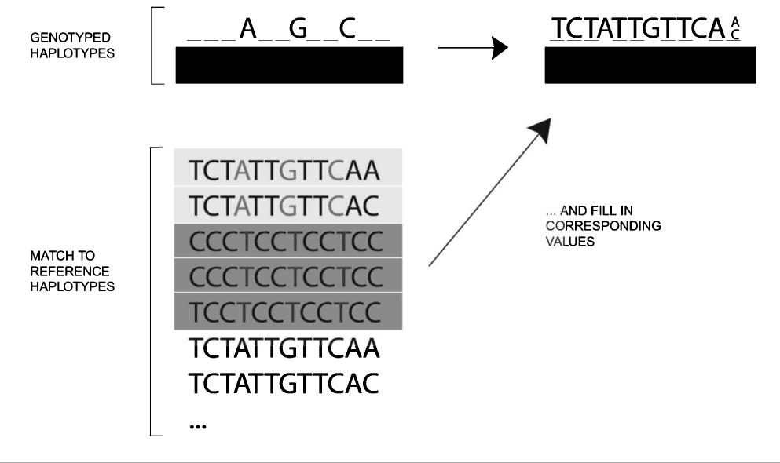
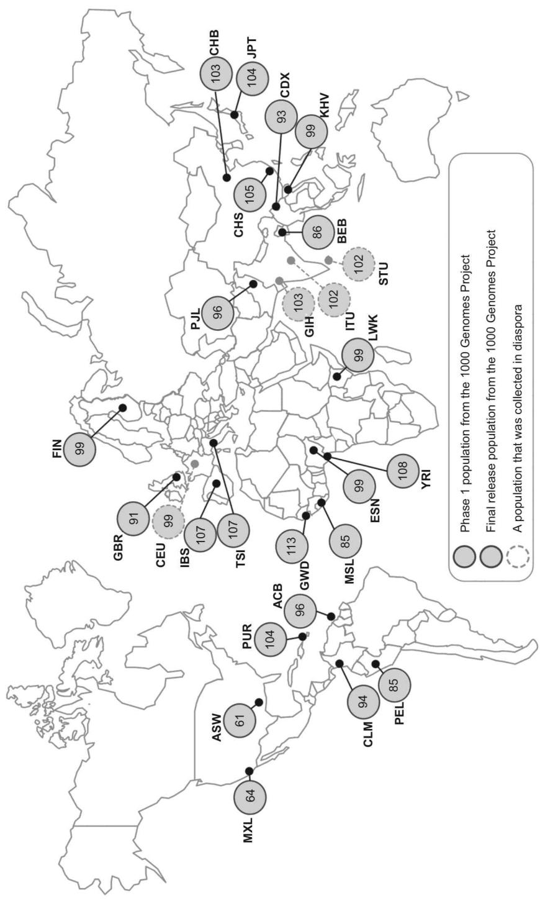
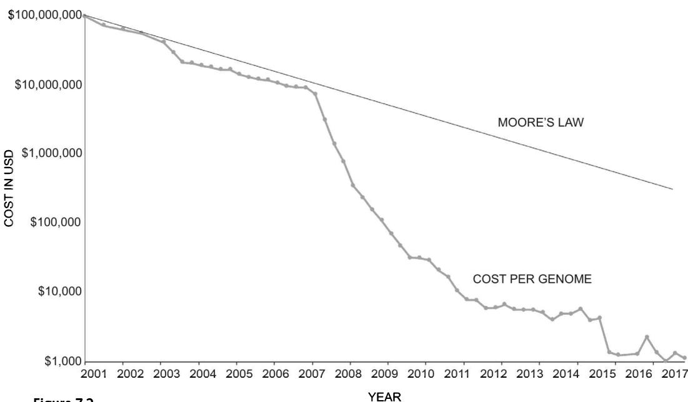

## Genetic Data and Analytical Challenges

## Objectives

• Understand the genotyping and sequencing technologies that produce genomic data 

• Comprehend linkage disequilibrium and imputation in relation to genomic data 

- Understand the large drop in costs in genomic data and the limitations of genotyping arrays and gain a basic understanding of next-generation sequencing 

- Know about the most prominently used data in human genetics for genome-wide association study discovery and the sources that archive and distribute this data 

- Grasp the different formats of genomic data in the computer program PLINK 

• Gain an introduction into the sample data used in this book 

- Have a basic understanding of data storage, transfer, size, and computational power required 

## 7.1 Introduction

Since 2005, but particularly since around 2015, there have been considerable advances in the collection, availability, technology, and the sample size of genetic data. The aim of this chapter is to provide an overview of genomic data. We first discuss the staggering and rapid developments in genotyping and sequencing arrays that are used to measure the genetic variants of a single person. We then provide a brief overview of some of the most prominently used human genetic data sources in this area of research and a brief explanation of where and how to obtain them. In the third section we offer a more detailed description of the different types of genetic data formats that you will encounter. Within this chapter we refer to the genomic data that we work with as simply as “data.” As we noted in an earlier discussion, researchers often in this field use the term “cohort” to refer to different datasets. We do not adopt the term because it may cause unnecessary confusion, since the term is often used in demography and other sciences to represent birth cohort or a particular cohort study design, and in medical sciences to refer more broadly to groups of people in a more general sense. In this chapter readers will also encounter code in R and PLINK. Refer to appendix 1 for information on how to download these programs and appendix 2 for a description of the data used in this book. 

## 7.2 Genotyping and sequencing array

## 7.2.1 Genotyping and sequencing technologies

The typical way that genomic information is collected is via biological samples, either from saliva or blood. The DNA is then extracted from the sample using biochemical methods and analyzed using a genotyping or sequencing platform. Genotyping most often refers to the use of genotyping microarrays, a technology that rapidly developed in the last decades, which are used for the measurement of hundreds of thousands to millions of genetic variants in a single person. A DNA microarray (also called SNP [single-nucleotide polymorphism] microarray) is a laboratory tool with the dimensions of a microscope slide that is printed with thousands of tiny spots in defined positions, with each spot containing a known short segment of DNA (called probe) that is complementary to different alleles of a given SNP. Once the DNA is extracted from the blood sample or from saliva, it is fragmented into small segments using biochemical methods. The DNA fragments pair with the complementary probes in the microarray. 

There are multiple different probes for each SNP that in turn correspond to specific alleles. $^{1}$ For example, if a specific SNP has two common variants, C and T, there will be some probes designed to detect whether the sample has a C in a specific position of the DNA sequence while other probes are designed to detect if the individual has a T in that position of DNA. Since the DNA fragments are labelled with a fluorescent dye, the array can be scanned and then used to detect the genotype of a person. If there is approximately equal florescence in the two probes, we can conclude that the person is heterozygous at that SNP; if we detect fluorescence only in one probe, the individual is most likely homozygous at that SNP. 

The process of determining the genotype based on microarray data is called genotype calling. Microarrays can be designed to detect specific SNPs of interest in particular genes or used to genotype variants spread across the entire genome, producing what are generally called genome-wide data. They can measure SNPs or other genetic variants such as copy number variations (CNVs) or indels (see chapter 1). Depending on the number of probes, microarrays are designed to detect genetic variations more common in one ancestral group or that exist in multiple ancestries. The Health and Retirement Study [1] (see box 7.1), for instance, which is a survey on aging based on a sample of U.S. respondents more than 50 years old, started genotyping its respondents in 2006, using a microarray produced by the company Illumina and called the HumanOmni2.5 Quad BeadChip. This array genotypes 2.5 million genetic variants across the genome for individuals of different ancestries. 

Box 7.1 Description of the Health and Retirement Study 

The Health and Retirement Study (HRS) is a nationally representative, longitudinal panel study of over 37,000 American individuals from around 23,000 households aged 50 and above, and their spouses. The study was launched in 1992 with data collected every two years. The survey contains detailed sociodemographic and health information in addition to a genetic sample. In 2006, the HRS initiated an enhanced face-to-face (EFTF) interview. In addition to the core interview, the EFTF interview includes a set of physical performance tests, anthropometric measurements, blood and saliva samples, and a self-administered questionnaire on psychosocial topics. The blood sample collected since 2006 provides information on a range of biomarkers as part of the EFTF interview. The HRS collected blood-based biomarkers on half the sample in 2006; the other half of the sample provided biomarker data in 2008. The first group was asked for another blood sample in 2010 and the second group gave repeated samples in 2012. Between 2006 and 2012, the HRS genotyped almost 20,000 respondents who provided DNA samples and signed consent forms. HRS subjects were genotyped using the Illumina HumanOmni2.5 Quad BeadChip, with coverage of approximately 2.5 million genetic variants. The HRS genetic sample produces several data products. The HRS makes many polygenic scores publicly available and constantly updated on its website, making it an excellent resource for researchers. At the time of writing this book, there was the HRS Polygenic Score—Release 3, with 42 scores that covered educational attainment, height, body mass index (BMI), blood pressure, Alzheimer's disease, smoking, depression, age at first birth, and number of children ever born, to name only a few. Other HRS genetic data require additional authorization to access. The HRS is sponsored by the National Institute on Aging (NIA U01AG009740) and is conducted by the University of Michigan. 

## 7.2.2 Linkage disequilibrium and imputation

The completion of the first human genome was attributed to the initial widely adopted Sanger sequencing method. This did not allow for population whole genome sequencing. To solve this problem, researchers used the fact that humans have many LD blocks, which we discussed in chapter 3 (section 3.6). Recall that due to LD, there is a reduction in the number of genetic variants that need to be measured. The result is that, once we know the alleles of a few SNPs in one region, we can infer the neighboring alleles with a high degree of confidence. This process is called imputation, and it is a fundamental part of genetic analysis (see box 7.2). Common genetic variation is thus assessed by genotyping hundreds of thousands of variants across the genome using information from what is referred to as reference panels, such as HapMap (https://www.genome.gov/10001688/international-hapmap-project) [2], the Haplotype Reference Consortium (http://www.haplotype-reference-consortium.org/), and the 1000 Genomes Project (http://www.internationalgenome.org/) (see figure 7.1) [3]. 

After genotyping, the haplotype information was then used to examine ungenotyped sites $[5]$ . Reference panels such as the HapMap project or the 1000 Genomes Project have been used to effectively create an atlas of human genetic variations that are used to infer the “missing genotypes” that are not directly measured using microarrays. For instance, the genetic 

Box 7.2
Imputing genetic data 

Imputation of genotypes is undertaken to estimate unmeasured or missing genotypes. The data that is imputed is often expressed as genotype dosage. Metrics are used to measure the imputation quality for each SNP. Imputation is paramount when genetic information is combined across different data sources that use different genotyping chips. Imputation exploits patterns of linkage disequilibrium, which are the correlations between alleles at pairs of SNPs. Imputation is a process that uses data from a reference panel to guess the variants that are not genotyped (i.e., unmeasured or missing). Different reference panels are available for imputation, such as the 1000 Genomes Project or HapMap (see the “Further reading and resources” section). It works by matching haplotypes from the sample to the haplotypes in a reference sample (see discussion of haplotypes in chapter 3). Because haplotypes in the sample are matched to multiple haplotypes in the reference panel, the imputation is not always unique. In the example shown here, the first variant that needs to be imputed can be matched with the reference panel: one-third of the reference haplotypes is a T and two-thirds a C. Imputation is a probabilistic procedure that takes into account statistical uncertainty. Alternatively, it is possible to convert to a “best guess” genotype, which, in this example, would be a C. Imputation for rare variants may be challenging as it is limited by the sample size of the reference sample and also by limited LD of rare variants with common variants and the larger number of rare variants. The main reference panels used are HapMap, the 1000 Genomes Project, and the Haplotype Reference Consortium (see the “Further reading and resources” section). 







History and coverage of the 1000 Genomes data.
Source: Oleksyk et al. (2015) [4].
Notes: ACB = African Caribbeans in Barbados; ASW = Americans of African ancestry in the southwestern United States; BEB = Bengali from Bangladesh; CDX = Chinese Dai in Xishuangbanna, China; CEU = Utah residents with Northern and Western European ancestry; CHB = Han Chinese in Beijing; CHD = Chinese in metropolitan Denver; CHS = Southern Han Chinese; CLM = Colombians from Medellin, Colombia; ESN = Esan in Nigeria; FIN = Finnish in Finland; GBR = British in England and Scotland; GIH = Gujarati Indians in Houston; GWD = western divisions in the Gambia; IBS = Iberian population in Spain; ITU = Indian Telugu from the United Kingdom; JPT = Japanese in Tokyo; KHV = Kinh in Ho Chi Minh City, Vietnam; LWK = Luhya in Webuye, Kenya; MSL = Mende in Sierra Leone; MXL = people of Mexican ancestry from Los Angeles; PEL = Peruvians from Lima, Peru; PJL = Punjabi from Lahore, Pakistan; PUR = Puerto Ricans from Puerto Rico; STU = Sri Lankan Tamil from the United Kingdom; TSI = Tusceans in Italy; YRI = Yoruba in Ibadan, Nigeria.


data from the HRS (discussed previously) can be extended to 22 million genetic variants using imputation. Imputation is not always perfect, especially in regions where there are not many nearby SNPs. Or in the large UK Biobank study of approximately 500,000 individuals, phasing and imputation increased the number of testable variants over one hundredfold, to approximately 96 million variants (see Bycroft et al. 2018 in the “Further reading and resources” section). For this reason, imputed data come with an associated imputation quality that measures how confident we can be that the missing genotype is really, for example, CC or TC. We will discuss the importance of imputation quality later in part II of this book, where we show how to cope with quality control issues (see chapter 8, section 8.5). 

## 7.2.3 Limitations of genotyping arrays and next-generation sequencing

There are several limitations to genotyping arrays. First, using “tag” SNPs that are high in LD with neighbor variants works only for common variants and moderately for rare ones. This is due to the constraints on LD imposed by allele frequency. Second, the probes on arrays only target SNPs and certain simple structural variants. This means that if the goal is to understand rare and complex structural variants, another approach is necessary. Recall from chapter 1 that rare variants are SNPs (or indels, CNVs) that are present in less than 1% of the population. These are rare mutations that therefore may not be present in the reference panels and thus cannot be easily detected using genotyping. Also, the fact that different ancestry groups have different variants may privilege the detection of genetic associations in loci that are more commonly measured with genotype, which is most likely variants that are common in individuals with European ancestry. 

For this reason, sequencing data are increasingly more common. Sequencing data are rising in popularity due to reduction in prices and increased computational power. In particular, next-generation genome sequencing analyzes millions of small fragments of DNA in parallel in order to genotype the whole genome. Next-generation sequencing is still uncommon in large epidemiological studies due to its costs, but it is increasingly used clinically to detect the presence of rare genetic variants. An alternative to whole-genome sequencing is so-called exome sequencing, which is used to sequence the variations in coding regions rather than the entire genome. As of 2018, the UK Biobank, for instance, is exome sequencing its entire sample of 500,000 individuals using Illumina short-read technology. Using standard arrays, we capture between 2% and 2.5% of the total variation of the human genome [6]. These new methods of genome sequencing provide access to the remaining approximately 98% of the genome and the difficult-to-impute genetic variants. This includes the ability to examine how much rare variation contributes to certain phenotypes. Sequencing data allows researchers to examine potentially informative genetic variants outside of protein-coding regions. Some companies, such as Gencove (https://gencove.com/) or Oxford Nanopore Technologies (https://nanoporetech.com/applications/whole-genome-sequencing), are offering ultra-low-coverage sequencing as an alternative to microarray genotyping. This technology uses sequencing methods to genotype a limited number of variants (which is 

Box 7.3
A GWAS case study of type 2 diabetes 

It is not the case that conducting one GWAS will provide the definitive results that isolate all variants associated with a phenotype. As technology advances and ever larger sample sizes are available, authors often engage in new iterations of studying the same phenotype. Mark McCarthy and Anubha Mahajan wrote an interesting blog in 2018 outlining the GWAS journey in the study of type 2 diabetes [9]. The DIAGRAM consortium, for instance, has conducted multiple GWA studies of type 2 diabetes. The first study that they conducted was in 2007 as part of the Wellcome Trust Case Control Consortium and included 500,000 SNPs from around 5,000 individuals for a total of 2.5 billion genotypes. A publication in 2018 included almost 900,000 individuals from 32 different studies from European descent populations [10]. Only one decade later, they could now include 27 million SNPs and 900,000 individuals for a total of 25 trillion genotypes. The most recent study not only increased the sample size but also used more detailed imputation reference panels. In 2019, studies often use the Haplotype Reference Consortium (HRC) panel, which used around 30,000 genomes in around 65,000 human haplotypes combining data from multiple studies. Current studies used a sub-panel of the HRC, the 1000 Genomes Project, which contains considerably more detail on a few hundred European genomes. One way to imagine the change is to think of how digital photography has improved over time, from grainy pixels to now highly detailed pixelation. The use of the 1000 Genomes Project panel affords a more robust analysis and particularly allows the examination of the risk of low-frequency alleles. In the most recent study, this consortium detected 243 loci that reached genome-wide significance and an additional 160 secondary signals for a total of 403 significant signals across 243 loci. Another key difference was that they were able to detect more signals at lower ranges of the allele frequency spectrum (i.e., minor allele frequency [MAF] < 5%), which included rare variants. The authors argue, however, that most findings still reside in common shared variants. The 2018 study had both an increase in the sample size but also used what is known as fine-mapping of causal variants and an extension of fine-mapping through the integration of tissue-specific epigenomic information. In other words, it is now possible to examine in more detail which variants are “taking the lead” and actually driving the association. With a genome-wide heritability explaining 18% of the type 2 diabetes risk, the authors also highlighted 18 genes attributable to coding variants for validated therapeutic targets. 

why it is called ultra-low-coverage) without being restricted to predefined SNPs. Recent studies have shown that even with low coverage, this technology can outperform standard genotype arrays especially in populations of non-European ancestry. There is also the term fine-mapping, which is a process to refine the lists of associated variants to a more credible set that is more likely to include the causal variant (see box 7.3). 

## 7.2.4 Drop in costs per genome

Modern genetics has also been about the development of faster and cheaper genotyping and genome sequencing technology, which resulted in the remarkable drop in sequencing costs in the past few years. Many of the advances we discuss in this chapter and book are possible due to the staggering reductions in the costs of genome sequencing over the past three decades (see also box 7.3 for a case study) [7, 8]. Figure 7.2 provides an overview of the significant drop in price over just three decades, which is typically contrasted with the dramatic drop in costs for computational power (Moore's law). 




Figure 7.2


Drop in costs per genome versus drop in costs for computational power (Moore's law), 2001–2017.


Source: Adapted from Wetterstrand KA. DNA Sequencing Costs: Data from the NHGRI Genome Sequencing Program (GSP), available at: www.genome.gov/sequencingcostsdata.


Moore's law is named after the cofounder of Intel, Gordon Moore, who observed that the number of transistors per square inch on integrated circuits doubled every year since their invention, while the costs were in turn halved. Although it is hard to definitively estimate the total cost of sequencing of the first full human genome, by combining figures the NHGRI (National Human Genome Research Institute) estimate the total cost was somewhere between $500 million and $1 billion. This includes the broader umbrella costs as well as related technological development, model organism genome mapping, bioethics, and program management [7]. This figure thus shows that the drop in costs per genome since 2006 has sharply dropped in comparison to Moore's law predictions for drops in costs in computational power. 

## 7.3 Overview of human genetic data for analysis

As with most types of data that we use in science, there is no central repository that registers all possible data that are available to use in this type of research. Levels of openness and availability also differ for each study and national funding requirements or regulations. The move to open science and replication of research likewise means that data that were previously not released to external researchers may become increasingly available. This section provides a brief overview of the most prominently used sources of human genetic data in genome-wide association studies (GWASs) and key sources that archive and distribute this data. 

## 7.3.1 Prominently used genetic data

To our knowledge, the most comprehensive overview of the most prominently used data in all GWASs for the past 13 years until late 2018 can be found in the accompanying Supplementary Material of the GWAS review article by Mills and Rahal (2019) [11]. Here we list the top 2,000 data sources that have been used in the largest GWASs from 2005 to October 2018. Readers can find the full list online at our GitHub site, https://github.com/crahal/GWASReview/blob/master/tables/Manually_Curated_Cohorts.csv. To generate this list, we manually extracted the most frequently used data across the majority of the largest 1,250 GWASs as of August 29, 2018, with the objective of providing the first systematic estimate of the frequency and identification of data sources used in GWAS. An overview of the top 10 datasets is shown in table 7.1 in addition to a description of some their key distinguishing features. 

As the table shows, the most frequently used datasets have several commonalities. First, as we elaborated upon chapter 4, the most frequently used data emanates from high-income countries (the United States, the United Kingdom, Iceland, The Netherlands, Ireland, and Germany) that share similar rates of disease prevalence and population profiles. As noted earlier, large Asian ancestry data sources are mainly from Japan, China, and South Korea, with almost 8% of recorded GWASs involving Japanese participants representing over 14% of participants contributing to GWAS (see box 4.3). A second similarity is that most of the prominently used data sources in the table engaged in random probability or population sampling to gain as representative a sample as possible. We should note that some of the largest datasets that have emerged since 2018 and beyond in GWA studies are from the UK Biobank [12] or direct-to-consumer genetic companies such as 23andMe [13]. These studies are less representative and contain more healthy, older, and higher-socioeconomic-status individuals. Third, the most prominently used data sources are deeply and richly phenotyped across many traits, which likely made them more accessible for multiple needs. There are many data sources as well that are collected for specific diseases such as endometriosis, cardiovascular disease, or rare diseases. 

Fourth, many of the most prominent datasets are older populations with disease diagnosis aimed at unravelling the pathways to disease and disability in old age. In this respect, they miss the longer-term development of disease and intervention possibilities that an asymptomatic younger population might afford (with the exception of some studies such as the 1958 British Birth Cohort or additional data collection in cohorts such as the Framingham Heart Study). Fifth, they are all prospective longitudinal datasets, following individuals or birth cohorts over a longer period, thus facilitating a life-course approach to understanding the pathways to certain diseases, disability, behavior, or mortality. Sixth, it is striking that all but one of these cohorts is comprised of predominantly female participants (ranging from 48% to 100%). This sex ratio imbalance is rarely addressed, yet sexual dimorphism or sex differences in disease are viewed as increasingly relevant, such as in autism [14] or reproductive traits [15]. Finally, although many started as focused hypothesis-driven clinical samples to study one type of disease, most have expanded to contain a breadth of phenotypes and there is a trend in data collection of adding new samples or generations over time. 


Table 7.1
Most frequently utilized datasets across the largest GWASs, 2007–2018.


<table><tr><td>Cohorts</td><td>Count</td><td>N</td><td>Country of recruitment</td><td>Age range</td><td>Study design</td><td>Female (%)</td></tr><tr><td>Rotterdam Study (RS)</td><td>398</td><td>14,926</td><td>Netherlands</td><td>55–106</td><td>Prospective cohort</td><td>57</td></tr><tr><td>Cooperative Health Research in the Region of Augsburg (KORA)</td><td>255</td><td>18,079</td><td>Germany</td><td>24–75</td><td>Population-based</td><td>50</td></tr><tr><td>Framingham Heart Study (FHS)</td><td>207</td><td>15,447</td><td>U.S.</td><td>5–85*</td><td>Prospective cohort, three generation</td><td>54</td></tr><tr><td>Atherosclerosis Risk in Communities Study (ARIC)</td><td>204</td><td>15,792</td><td>U.S.</td><td>45–64</td><td>Prospective cohort, Community</td><td>55</td></tr><tr><td>Cardiovascular Health Study (CHS)</td><td>179</td><td>5,888</td><td>U.S.</td><td>65+</td><td>Prospective cohort</td><td>58</td></tr><tr><td>British 1958 Birth Cohort Study (1958 BC/NCDS)</td><td>156</td><td>17,634</td><td>U.K.</td><td>0+</td><td>Prospective birth cohort</td><td>48</td></tr><tr><td>U.K. Adult Twin Register (TwinsUK)</td><td>140</td><td>12,000</td><td>U.K., Ireland</td><td>18–97</td><td>Longitudinal entry at various times</td><td>84</td></tr><tr><td>European Prospective Investigation into Cancer CANCER (EPIC)</td><td>132</td><td>521,330***</td><td>10 EU countries</td><td>21–83**</td><td>Prospective cohort</td><td>71</td></tr><tr><td>Nurses Health Study (NHS)</td><td>129</td><td>121,700</td><td>U.S.</td><td>30–55</td><td>Prospective cohort</td><td>100</td></tr><tr><td>Study of Health in Pomerania (SHIP)</td><td>127</td><td>4,308</td><td>Germany</td><td>20–79</td><td>Prospective cohort</td><td>51</td></tr></table>


Source: Mills and Rahal (2019) [11], table 3. 


Note: The top 10 most frequently utilized cohorts across the majority of the largest third of all GWASs as of August 29, 2018 (with studies ranked by N), manually extracted and harmonized. Additional fields (country of recruitment, age range, and study design) manually curated from web searches. * denotes originally 30–62 years; ** denotes variation by country; *** denotes full sample, including nongenotyped participants. 


Although the selectivity of the sample and lack of demographic diversity discussed above is less often discussed and addressed in this research, there is an increased move by funders and researchers to strengthen ancestral diversity. In 2018, the National Institute of Health (NIH) in the United States launched a national program called the All of Us Research Program (https://allofus.nih.gov/). The aim is to collect 1 million or more volunteers from those aged 18 and above with different types of health status and diverse backgrounds. To counter the diversity challenges in this field, they also aim to oversample underrepresented communities. Other initiatives include the H3Africa consortium (Human Heredity and Health in Africa, https://h3africa.org/) led by African scientists and includes 48 African projects of population-based genomic studies to build capacity and strengthen African-based research. 

## 7.3.2 Sources that archive and distribute data

As we noted earlier in chapter 4, the majority of genomic data used in GWASs comes from samples in the United States and the United Kingdom and thus follow the data protocols in those countries. The most prominent large archive is the U.S.-based dbGaP—Database of Genotypes and Phenotypes (https://www.ncbi.nlm.nih.gov/gap), which curates and distributes genetic data. At the dbGaP website you can find information about how to access dbGaP data, resources that are available, and additional links. It contains additional data well beyond the auspices of this book as well. To start, it is useful to follow the numerous demo videos and overviews that are available that describe the process of applying for the data, how to access individual-level data, and set up separate accounts such as the eRA account. It can be somewhat confusing at first, but the information on the aforementioned website has detailed frequently asked questions (FAQs) and tutorials. Here you can also find more detailed information on downloading, decrypting, and extracting the data. Since this is a highly detailed process that is well documented and regularly updated at the aforementioned website, we do not repeat it here. 

Currently, there is also a large amount of genomic data in the United Kingdom that researchers from around the world may use. Many U.K. longitudinal studies contain phenotypic, genotypic, and “omic” data and are funded by national research councils and thus required by the open science movement to allow access. Many, but not all, fall under the governance infrastructure called METADAC: Managing Ethico-social, Technical and Administrative issues in Data Access, which is governed by an interdisciplinary committee. The process of data sharing and governance is documented elsewhere $[16]$ , and readers can refer to the METADAC website (https://www.metadac.ac.uk/). As of early 2020, the largest openly available genetic data is the UK Biobank $[17]$ , which has its own data access process (https://www.ukbiobank.ac.uk/), generally accompanied with a payment to cover the processing of the data. 

There are many additional datasets not mentioned here, and a full list of around 3,000 different datasets can be found on the GitHub site link [11]. Some publicly available U.S.-based genomic data that you can access includes prominent data such as the Health and Retirement Study (HRS, http://hrsonline.isr.umich.edu/; see box 7.1) [1], Add Health: National Longitudinal Study of Adolescent to Adult Health [18], the Wisconsin Longitudinal Study (WLS, https://www.ssc.wisc.edu/wlsresearch/) [19], or others such as the LifeLines Biobank in The Netherlands (https://www.lifelines.nl/). Data are also often distributed and released by local committees or consortiums that have collected the data directly via their own web-based application. As noted in the GWAS review article $[11]$ , the principal investigators responsible for obtaining the funding and collecting this data are often listed as coauthors on GWASs and central to these consortiums. Since there are many and varied ways that data is released for external use, researchers should investigate this for each individual data source. 

In order to obtain access to genetic data, researchers are generally required to submit a research plan through their local IRB (institutional review board or independent ethics committee) but also often a committee, group, or website that manages data access. In most cases you need to specify only a small number of variables directly related to your research question with each application for a separate article or project. Many researchers in this area also increasingly encounter the question from journal editors to share their data and code. Virtually all genetic data adheres to national policies on data sharing, but due to the sensitive nature of genetic data access is very limited and strictly managed. It is possible to provide the code used to construct your variables and data analysis and then refer the journal editor to the data access protocol for the respective dataset. We now examine the actual genetic data that you will encounter and work with in the applied chapters in this book. 

## 7.3.3 Obtaining GWAS summary statistics

GWAS consortia regularly publish their entire list of results, and it is virtually always a requirement of the journal where it is published. This allows other researchers to investigate the role of particular variants or to use them to construct polygenic scores in an independent genotyped sample. Summary results should include, at least, a list of SNPs with their rs number, chromosome number, genomic position, alleles, betas from the association analysis, or alternatively the Z-scores, and p-values of the association results. Often other summary statistics include additional information such as average allele frequency and heterogeneity statistics if the results are derived by a meta-analysis. 

The NHGRI-EBI GWAS Catalog, which we described in chapter 4 contains some but not all of the many of the cataloged GWASs (see https://www.ebi.ac.uk/gwas/summary-statistics). The NHGRI-EBI GWAS Catalog provides a consistent, searchable and freely available database of published SNP-trait associations. It can be used to search for a particular trait or to examine the association between a genetic variant and possible traits. There you can also find links to some of the large consortiums which store their summary statistics on their own webpages: https://www.ebi.ac.uk/gwas/downloads/summary-statistics. As we have noted elsewhere, although it is now virtually always a publication requirement to release summary statistics, a smaller number of groups do not release them or only do so in exchange for authorship [11]. 

Web-based repositories have also been created that contain detailed information on thousands of publicly available GWASs. A recent research initiative led by Danielle Post-huma in the Netherlands created the Atlas of GWAS Summary Statistics (http://atlas.ctglab.nl) [20], containing, at the time of writing this book, summary statistics from over 4,000 different studies. Using this website, it is possible to select your phenotype of interest and download the entire list of association results. Data are harmonized, so it is possible to directly compare results from different studies. Moreover, they included their own GWAS results for many traits calculated from the UK Biobank. 

The research group led by Benjamin Neale in the United States also created a database of GWAS statistics for 4,203 phenotypes available in the UK Biobank. Instead of using GWAS results from the GWAS produced by other groups, they ran a new GWAS on all (or virtually all) of the phenotypes available in the UK Biobank. This makes it arguably the largest resource for genomic data available to researchers. The advantage is that the GWAS analysis is conducted consistently for all the phenotypes after careful quality control (QC) procedures. The analyses also include 20 principal components and covariates (e.g., age, age2, sex, age*sex) (http://www.nealelab.is/uk-biobank/). They also generated sex-specific results and included all of the code that they used to run their analyses on GitHub (https://github.com/Nealelab/UK_Biobank_GWAS). 

## 7.4 Different formats in genomics data

## 7.4.1 Genomics data is big data

Genomics data may initially appear to be rather unusual to those accustomed to working with epidemiological or social science data. Most readers will be familiar with the rectangular data structure, in which data are stored in a single file. In these types of files, each row typically contains the information of a single participant with each column providing information about a statistical variable (e.g., sex, age, disease status). This is widely used in statistical programs such as SPSS, Stata, or SAS. The dimension of this rectangular structure is $N \times K$ , where N is the number of observations and K is the number of variables. For example, if we simulate a rectangular file in R as below and then examine it, you will see that the first column is an “id” (identification) variable of person 1 to 4. The second column is a binary covariate “sex” with the values of 1 and 2, with two additional variables, t1 and s1. 

```python
# simulate rectangular file
> rectangular <-data.frame (id=factor(1:4), sex = c(1,2,1,2),
    t1 = c(19, 21, 82, 68), s1 = c(1,1,1,1))
> rectangular # examine data
    id    sex    t1    s1
1    1    1    19    1
2    2    2    21    1
3    3    1    82    1
4    4    2    68    1 
```

Genomic data differ from some of the data many researchers might be familiar with due to the main distinction that typically we have more variables than observations. The widely used HRS genomic data, for instance, provides information on 22 million variables from around 20,000 individuals (see box 7.1). The number of variables is thus substantially higher than the number of observations, making the rectangular structure challenging to visually inspect. Excel, for instance, has a limit of 1,048,576 rows by 16,384 columns. Another limitation is the sheer file size of genomic data. Depending on whether the data contain only genotyped or also imputed data, the size of the genome-wide data files can be extremely large, usually on the order of several gigabytes or in some cases even terabytes. Genomic data is thus truly big data. In 2015, researchers warned that within the decade—when between 100 million to 2 billion human genomes are likely to be sequenced—data storage demands will far outstrip YouTube and Twitter's projected annual storage [21]. 

One way to think of genetic data is in terms of observations and variables, with the variable representing the genotype of a particular SNP. For example, if SNP rs9930506 $^{2}$ has two variants, T and C, we can observe the genotypes (that can be TT; TC or CC) of all the respondents and store this information in a file. However, we also need to store the information of the SNP itself and map it on the human genome. rs9930506 is, in fact, a SNP that can be found in chromosome 16 at position 53796553 according to a predefined set of coordinates [Genome Reference Consortium Human Build 38 patch release 7]. This information needs to be stored in the data at the same time with the sample genotypes. In addition, you generally also often want to have additional information on the respondents, including sex, phenotype, and family relatedness with other respondents. Genetics existed long before DNA, and molecular biology and was based on the study of inheritance. Family relatedness therefore has historically been very relevant in genetic studies where the pedigree of families with hereditary disorders were used to study genetic transmission of diseases. 

## 7.4.2 PLINK software and genotype formats

In 2007, software designed by Shaun Purcell and colleagues at the Broad Institute of Harvard and Massachusetts Institute of Technology in Boston was released. It soon became one of the most popular software applications to handle the growing mass of genetic data and to perform associations between (genome-wide) genotypes and phenotypes. The software is called PLINK and is updated often. In this book we use PLINK 1.9 and 2.0 (see appendix 1). PLINK can be used to handle genomic files, calculate statistics, and transform the data into different formats. We use both versions since at the time of writing this book, the 2.0 version of the software was still under development and some analyses are only available on PLINK 1.9. Version 1.9 performs analysis on genotyped data only, while version 2.0 can also be used with imputed data (see box 7.2). We will first start by describing the data structure for genotyped data and then extend the discussion to the PLINK 2.0 format. 

Figure 7.3 provides an overview of the various types of files that you will most commonly use in PLINK, described in more detail in the following sections. Since text files are very time consuming to read, it is better to use binary files. The files that you will likely use most often are divided into three basic types, grouped in figure 7.3. The two text-format PLINK files contain information on individuals and their genotypes (.ped) and genetic markers (.map). The three binary PLINK files used most often are those that hold information on individual identifiers and their genotypes (.bed) and two readable binary text files that have material on individuals (.fam) and genetic markers (.bim). As we show in later chapters, you generally also include covariates, which necessitate a fourth set of files. For example, if you wanted to study type 2 diabetes, the .bed file contains the genotyped results of all individuals (e.g., if using a case-control study all patients and healthy controls). The .fam file contains the individual-related data (e.g., family interrelatedness with other individuals in the data, sex, type 2 diabetes diagnoses). The .bim file allows you to add the information about the actual physical position of the SNPs, and additional covariates could be included in the last file. 

<table><tr><td colspan="8">Text PLINK files</td></tr><tr><td colspan="4">*.ped</td><td colspan="4">*.map</td></tr><tr><td rowspan="7" colspan="4">FID ID F M S P -GENETIC INFO-CH18526 NA18526 0 0 2 1 G G C C T T A ACH18524 NA18524 0 0 1 1 G G C C T T A ACH18529 NA18529 0 0 2 1 C G C C T T C ACH18558 NA18558 0 0 1 1 G G C C G T A ACH18532 NA18532 0 0 2 1 G G C C T T A A</td><td rowspan="2">Chr</td><td rowspan="2">SNP</td><td>SNP</td><td>Base-Pair</td></tr><tr><td>Position</td><td>Coordinate</td></tr><tr><td>8</td><td>rs17121574</td><td>12.7991</td><td>12799052</td></tr><tr><td>8</td><td>rs754238</td><td>12.8481</td><td>12848056</td></tr><tr><td>8</td><td>rs11203962</td><td>12.8484</td><td>12848438</td></tr><tr><td>8</td><td>rs6999231</td><td>12.8623</td><td>12862253</td></tr><tr><td>8</td><td>rs17178729</td><td>12.867</td><td>12867001</td></tr><tr><td colspan="8">Binary PLINK files</td></tr><tr><td>*.bed</td><td colspan="3">*.fam</td><td colspan="4">*.bim</td></tr><tr><td rowspan="7">Binary version of the SNP info of the *.ped file which is only readable by your computer</td><td rowspan="7" colspan="3">FID ID F M S PCH18526 NA18526 0 0 2 1CH18524 NA18524 0 0 1 1CH18529 NA18529 0 0 2 1CH18558 NA18558 0 0 1 1CH18532 NA18532 0 0 2 1</td><td rowspan="2">Chr</td><td rowspan="2">SNP</td><td>SNP</td><td>Base-Pair Allele1 Allele2</td></tr><tr><td>Position</td><td>Coordinate</td></tr><tr><td>8</td><td>rs17121574</td><td>12.7991</td><td>12799052 G G</td></tr><tr><td>8</td><td>rs754238</td><td>12.8481</td><td>12848056 G G</td></tr><tr><td>8</td><td>rs11203962</td><td>12.8484</td><td>12848438 C G</td></tr><tr><td>8</td><td>rs6999231</td><td>12.8623</td><td>12862253 G G</td></tr><tr><td>8</td><td>rs17178729</td><td>12.867</td><td>12867001 G G</td></tr><tr><td colspan="8">Covariates</td></tr><tr><td colspan="8">FID ID Sex Cohort PC1 PC2 etc...CH18526 NA18526 2 10.00542 -0.00876CH18524 NA18524 1 10.04517 -0.00761CH18529 NA18529 2 40.07776 -0.00231CH18558 NA18558 1 30.00125 -0.00356CH18532 NA18532 2 20.00456 -0.00651</td></tr></table>

As shown in figure 7.3, the original PLINK 1.0 text format of genomic data is composed of a set of two files. The first file is the so-called pedigree file. A pedigree file, which in PLINK uses the suffix .ped, contains information on the sample (i.e., the list of individuals genotyped). Each line corresponds to an individual, and the first six columns provide information on this individual. In reality, the file does not contain header or variable names, but we have shown them here for ease of interpretation. The first two columns consist of a family identifier (FID) and an individual unique identifier (ID). Next to these we have information on the father (F) and the mother (M) identifier, which can be used to reconstruct the family pedigree. This information is not always present and very often only the information that is the unique individual identifier. Columns five and six contain information on the sex (S) and the phenotype (P) of interest. The remainder of the columns contain the genetic information. Each SNP consists of two columns indicating the individual genotype. For instance, in the example below, the genotype of the first individual (id NA18526) has GG as the first SNP, while the genotype of the third individual (id NA18529) is CG. A .ped file therefore has a large number of columns, exactly $6 + (\mathrm{K} \times 2)$ , where K is the number of SNPs genotyped. A .ped file can be opened in any text editor, although its dimension and the large number of columns may make reading it difficult. 


Example.ped


<table><tr><td colspan="9">COLUMN NUMBERS*</td></tr><tr><td>1</td><td>2</td><td>3</td><td>4</td><td>5</td><td>6</td><td colspan="3">——GENETIC INFORMATION——</td></tr><tr><td colspan="9">LABELS*</td></tr><tr><td colspan="2">FID ID</td><td colspan="4">FMSP</td><td colspan="3">——GENETIC INFORMATION——</td></tr><tr><td>CH18526</td><td>NA18526</td><td>0</td><td>0</td><td>2</td><td>1</td><td colspan="3">GGCCTTAAGGGGTAGG</td></tr><tr><td colspan="9">TGCCTTTTTCACCACGGCC</td></tr><tr><td>CH18524</td><td>NA18524</td><td>0</td><td>0</td><td>1</td><td>1</td><td colspan="3">GGCCTTAAGGAGAAGA</td></tr><tr><td colspan="9">GGCCTTCTAACCCCAGGCC</td></tr></table>

<table><tr><td>CH18529</td><td>NA18529</td><td>0</td><td>0</td><td>2</td><td>1</td><td>CGCCTTCAGGGGTAGG</td></tr><tr><td>T</td><td colspan="6">GCCTTCTAACCACAGCC</td></tr><tr><td>CH18558</td><td>NA18558</td><td>0</td><td>0</td><td>1</td><td>1</td><td>GGCCGTAAGGGGAAGA</td></tr><tr><td>T</td><td colspan="6">GCCTTTTAACCCCAGGCC</td></tr><tr><td>CH18532</td><td>NA18532</td><td>0</td><td>0</td><td>2</td><td>1</td><td>GGCCTTAAGGGGAAGA</td></tr><tr><td>G</td><td colspan="6">GCCTTTTCCCCACGGCC</td></tr><tr><td>CH18561</td><td>NA18561</td><td>0</td><td>0</td><td>1</td><td>1</td><td>GGGCGTCAGGAGTAGG</td></tr><tr><td>T</td><td colspan="6">GCCTTTTCACCACGGCC</td></tr><tr><td>CH18562</td><td>NA18562</td><td>0</td><td>0</td><td>1</td><td>1</td><td>GGCCTTAAGGGGAAGA</td></tr><tr><td>G</td><td colspan="6">GCCTTTTAACCCCAGGCC</td></tr><tr><td>CH18537</td><td>NA18537</td><td>0</td><td>0</td><td>2</td><td>2</td><td>GGGCGTCAGGGGAAAA</td></tr><tr><td>G</td><td colspan="6">GCCTTTTCCCCAAAGAC</td></tr><tr><td>CH18603</td><td>NA18603</td><td>0</td><td>0</td><td>1</td><td>2</td><td>GGCCTTAAGGGGTAGA</td></tr><tr><td>T</td><td colspan="6">GCCTTTTCCCCAAGGCC</td></tr><tr><td>CH18540</td><td>NA18540</td><td>0</td><td>0</td><td>2</td><td>1</td><td>GGCCTTAAGGGGTAGG</td></tr><tr><td>T</td><td colspan="6">GCCTTTTCACCACGGCC</td></tr><tr><td colspan="7">*Note: There is no header in the file, and these are added here for ease of interpretation.</td></tr></table>

A .ped file must be accompanied by a .map file in order to provide complete information on the genotype of a sample of individuals. A .map file provides information on which SNPs have been genotyped and how to locate them in the genome. The first column indicates the chromosome (Chr) number, the second is the SNP identifier (typically the rs number), while the third and fourth columns indicate the position of the SNP. The third, which is measured in centimorgans, is a measure of genetic distance based on recombination probability and therefore is not constant across the genome. One centimorgan equals a 1% chance that a marker at one genetic locus on a chromosome will be separated from a marker at a second locus due to crossing over in a single generation. The fourth column measures the base-pair coordinates or the genetic distance in base pairs, i.e., the number of molecules (letters) between variants. One centimorgan corresponds to around 1 million base pairs in humans on average. The centimorgan totals per chromosome are based on the Human Reference Genome. It is important to note that the location of SNPs can change based on the reference panel that is used. With the advancements in mapping the human genome, different releases of the Human Reference Genome have been published (see the “Further reading and resources” section). A reference genome is our navigation system in the exploration of the human genome. It can be used to map the location of SNPs across human DNA, but it needs to be updated to the most recent version. The current version of the Human Reference Genome is called GRCh38 and has been released by the National Center for Biotechnology Information. $^{3}$ The .map file has a dimension of K rows (number of SNPs) and 4 columns. 


example.map


<table><tr><td colspan="4">LABELS*</td></tr><tr><td>Chr</td><td>SNP</td><td>SNP Position</td><td>Base-Pair Coordinate</td></tr><tr><td>8</td><td>rs17121574</td><td>12.7991</td><td>12799052</td></tr><tr><td>8</td><td>rs754238</td><td>12.8481</td><td>12848056</td></tr><tr><td>8</td><td>rs11203962</td><td>12.8484</td><td>12848438</td></tr><tr><td>8</td><td>rs6999231</td><td>12.8623</td><td>12862253</td></tr><tr><td>8</td><td>rs17178729</td><td>12.867</td><td>12867001</td></tr><tr><td>8</td><td>rs10105623</td><td>12.8683</td><td>12868315</td></tr><tr><td>8</td><td>rs2460915</td><td>12.8704</td><td>12870407</td></tr><tr><td>8</td><td>rs7835221</td><td>12.8781</td><td>12878098</td></tr><tr><td>8</td><td>rs2460911</td><td>12.8953</td><td>12895289</td></tr><tr><td>8</td><td>rs12156420</td><td>12.9146</td><td>12914557</td></tr><tr><td>8</td><td>rs17786052</td><td>12.9224</td><td>12922389</td></tr><tr><td>8</td><td>rs529983</td><td>12.9426</td><td>12942555</td></tr><tr><td>8</td><td>rs630969</td><td>12.9458</td><td>12945844</td></tr><tr><td>8</td><td>rs2460914</td><td>12.9581</td><td>12958068</td></tr><tr><td>8</td><td>rs607499</td><td>12.9619</td><td>12961886</td></tr><tr><td>8</td><td>rs634228</td><td>12.9633</td><td>12963283</td></tr><tr><td>8</td><td>rs556531</td><td>12.9893</td><td>12989321</td></tr><tr><td colspan="4">*Note: There is no header in the file, and these are added here for ease of interpretation.</td></tr></table>


The combination of .ped and .map files can be used to describe the genotype of a sample of individuals. 


## 7.4.3 PLINK binary files

PLINK .map and .ped files can be opened in a normal text editor but are inefficient in terms of data storage. As we noted earlier, a common way to store genetic data is in what is called binary files. In particular, a PLINK binary file compresses the genotype information included in the .ped file. 

As illustrated in figure 7.3, a set of PLINK binary files consists of three files: 

1. A .bed file, which is not readable in a text editor and contains the information on the genotype in a compressed way. 

2. A .fam file indicating the information about individuals (equivalent to the first six columns of a .ped file, shown in figure 7.3). 

3. A .bim file indicating the information about the SNPs (virtually equivalent to a .map file, but with Allele1 and Allele2 columns; see figure 7.3). 

As we will demonstrate in the chapters that follow, passing from a binary file to a .map/.ped PLINK file is straightforward. 

## 7.5 Genetic formats for imputed data

The PLINK format described above is simple and straightforward but can only be used for genotyped data and is not suitable for imputed genomic data (see box 7.2). Imputation combines the information on genotyped SNPs to the information on the LD from a reference panel (for example, the 1000 Genomes Project or the Haplotype Reference Consortium). Although imputation can be very precise, it does come with some uncertainty. Imputed genotypes are associated with measures of imputation probabilities (sometimes called genotype calls) that give you an indication of how likely a certain genotype is based on the information from a reference panel. For instance, based on imputation, we can derive the genotype probabilities of the three possible genotypes of SNP rs2777888 as 28% CC, 52% TC, and 21% TT. A possible solution is to ignore the imputation uncertainty and opt for the most likely genotype (i.e., the genotype with the highest probability). This is a legitimate choice and often used in the calculation of polygenic scores (see chapter 10). Another alternative would be to use software that can handle imputation probabilities, which we turn to now. 

## 7.5.1 PLINK 2.0

In 2018, the authors of PLINK released a new version of their software that is better suited to work with imputed data. The software, called PLINK 2.0, has a new data format for genetic data that updates the binary format of PLINK 1.0. 

A set of PLINK 2.0 binary files is composed of three files: 

1. A .pvar file indicating the information about the genetic markers (similar to a .bim file) 

2. A .psam file indicating the information about the individuals in the sample (similar to a .fam sample file) 

3. A .pgen file (nonreadable in a text editor) containing the information on the genotype probabilities in a compressed way. 

PLINK 2.0 fields contain more information on the genetic variants included in the .psam file. In addition to the alleles (reference and alternative), additional information on the imputation quality (columns QUAL and INFO) is also provided. The .pgen file is a compressed binary file that cannot be read in a text editor but contains information on how likely it is that a genetic variant has a particular genotype. This information on imputation qualities and genotype probabilities are used extensively in quality control procedures and in GWASs to assess whether the results are driven by true association effects or by data anomalies. 

```csv
Columns in a .pvar PLINK 2.0 file Columns in a .psam file
1. IID (individual ID; required)
2. SID (source ID, when there are multiple samples for the same individual)
3. PAT (individual ID of father, "0" if unknown)
4. MAT (individual ID of mother, "0" if unknown)
5. SEX ("1" = male, "2" = female, "NA"/"0" = unknown)
1. POS (base-pair coordinate)
2. ID (variant ID; required)
3. REF (reference allele)
4. ALT (alternate alleles, comma-separated)
5. QUAL (phred-scaled quality score for whether the locus is variable at all)
6. FILTER ("PASS," "." or semicolon-separated list of failing filter codes)
7. INFO (semicolon-separated list of flags and key-value pairs, with types declared in header)
8. FORMAT (terminates header line parsing)
9. CM (centimorgan position) 
```

## 7.5.2 Oxford file formats

Another popular format for genomic data is the format that is used by the collection of software designed by the statistical genomic group of the Department of Statistics from Oxford University and the Wellcome Trust Centre of Human Genetics, also based in Oxford. The format is sometimes referred to as Oxford file formats, and it is used in the software GTOOL and SNPTEST. Genomic data are stored in two files (similarly to the .ped and .map PLINK files): a genotype file and a sample file. The genotype file contains information on the genotype data on a one-line-per-SNP format, while columns represent individuals. This is exactly the opposite of a PLINK .ped file where rows indicate individuals and columns genotypes. An example of the Oxford genotype file format is shown below. The first five columns of each file contain information on the SNP identifier, the base-pair position of the SNP, the allele coded A, and the allele coded B. The next three numbers on the line give the probabilities of the three genotypes AA, AB, and BB at the SNP for the first individual in the cohort. The next three numbers should be the genotype probabilities for the second individual in the cohort. The next three numbers are for the third individual, and so on. All the probabilities need to sum to 1. If a SNP has been directly measured, then its genotype probabilities are $(1, 0, 0)$ . 

In the example above, we report the genotypes of five hypothetical SNPs for two individuals. The first individual has the following genotypes (AA; GG; CC; CT; AG), while the second has the following (AA; GT; CT; CT; GG). The example reports a precise measure of the genotypes (without decimal points) indicating that these SNPs are directly measured, but this format can accommodate genotype likelihood, giving an indication on how likely it is to have a particular genotype. The dimension of a genotype file depends on the number of subjects N and the number of SNPs K because the file has K rows and $(N \times 3) + 5$ columns. 


Example of Oxford genotype file:


<table><tr><td>SNPID</td><td>rs# position</td><td>Base pair</td><td>AlleleA</td><td>AlleleB</td><td>ProbInd1</td><td>ProbInd1</td></tr><tr><td>SNP1</td><td>rs1</td><td>1000</td><td>A</td><td>C</td><td>1 0 0</td><td>1 0 0</td></tr><tr><td>SNP2</td><td>rs2</td><td>2000</td><td>G</td><td>T</td><td>1 0 0</td><td>0 1 0</td></tr><tr><td>SNP3</td><td>rs3</td><td>3000</td><td>C</td><td>T</td><td>1 0 0</td><td>0 1 0</td></tr><tr><td>SNP4</td><td>rs4</td><td>4000</td><td>C</td><td>T</td><td>0 1 0</td><td>0 1 0</td></tr><tr><td>SNP5</td><td>rs5</td><td>5000</td><td>A</td><td>G</td><td>0 1 0</td><td>0 0 1</td></tr><tr><td colspan="7">*Note: There is no header in the file and these are added here for ease of interpretation</td></tr></table>

The sample file consists of three parts: a header row detailing the names of the columns in the file, a row detailing the types of variables stored in each column, and a row for each individual detailing the information for that individual. The second line of the file details the type of variables included in each column. The first three entries are zeros, while other columns take a D if the variable is discrete or C if the variable is continuous. Phenotypes that are continuous variables are indicated with a P or B if they are binary (case-controls studies). 


Example of an Oxford sample file:


<table><tr><td>ID_1</td><td>ID_2</td><td>missing</td><td>cov_1</td><td>cov_2</td><td>cov_3</td><td>cov_4</td><td>phenol</td><td>bin1</td></tr><tr><td>0</td><td>0</td><td>0</td><td>D</td><td>D</td><td>C</td><td>C</td><td>P</td><td>B</td></tr><tr><td>1</td><td>1</td><td>0.007</td><td>1</td><td>2</td><td>0.0019</td><td>-0.008</td><td>1.233</td><td>1</td></tr><tr><td>2</td><td>2</td><td>0.009</td><td>1</td><td>2</td><td>0.0022</td><td>-0.001</td><td>6.234</td><td>0</td></tr><tr><td>3</td><td>3</td><td>0.005</td><td>1</td><td>2</td><td>0.0025</td><td>0.0028</td><td>6.121</td><td>1</td></tr><tr><td>4</td><td>4</td><td>0.007</td><td>2</td><td>1</td><td>0.0017</td><td>-0.011</td><td>3.234</td><td>1</td></tr><tr><td>5</td><td>5</td><td>0.004</td><td>3</td><td>2</td><td>-0.012</td><td>0.0236</td><td>2.786</td><td>0</td></tr></table>

## 7.5.3 The variant call format (VCF)

An additional format for genomic data that is very common in bioinformatics is the variant call format (VCF). This format can store genomic information for genotyped, imputed data, and even sequencing data. It is very flexible, because various types of information can be stored. It can be read by a text editor (although we do not recommend it for large files) or from the command terminal. VCF files contain all of the genetic information in a single file. The file has a large preamble of meta-information lines (prefixed with a double ## symbol), a header line (prefixed with a single # symbol), and data lines each containing information about the position in the genome and genotype information on samples for each position. VCF is the format for large genomic projects and is the format that has been used for releasing data from the 1000 Genomes Project (see figure 7.1). VCF files can be used to store any type of genetic variants, including CNVs, indels, and multiallelic SNPs. It can be read using different software and transformed in your preferred format using software such as PLINK. 

## Example of a preamble of a VCF file:

```txt
##fileformat=VCFv4.3
##fileDate=20090805
##source=myImputationProgramV3.1
##reference=file:///seq/references/1000GenomesPilot-NCBI36.fasta ##contig=<ID=20,length=62435964,assembly=B36,md5=f126cdf8a6e0c7f379d618ff66beb2da,species="Homo sapiens", taxonomy=x> ##phasing=partial
##INFO=<ID=NS,Number=1,Type=Integer,Description="Number of Samples With Data"> ##INFO=<ID=DP,Number=1,Type=Integer,Description="Total Depth"> ##INFO=<ID=AF,Number=A,Type=Float,Description="Allele Frequency"> ##INFO=<ID=AA,Number=1,Type=String,Description="Ancestral Allele"> ##INFO=<ID=DB,Number=0,Type=Flag,Description="dbSNP membership, build 129"> ##INFO=<ID=H2,Number=0,Type=Flag,Description="Hap Map2 membership"> ##FILTER=<ID=q10,Description="Quality below 10"> ##FILTER=<ID=s50,Description="Less than 50% of samples have data"> ##FORMAT=<ID=GT,Number=1,Type=String,Description="Genotype"> ##FORMAT=<ID=GQ,Number=1,Type=Integer,Description="Genotype Quality"> ##FORMAT=<ID=DP,Number=1,Type=Integer,Description="Read Depth"> ##FORMAT=<ID=HQ,Number=2,Type=Integer,Description="Haplotype Quality"> 
```


Typical information stored in a VCF file:


<table><tr><td></td><td>Name</td><td>Brief description (see the specification for details)</td></tr><tr><td>1</td><td>CHROM</td><td>The name of the sequence (typically a chromosome) on which the variation is being called. This sequence is usually known as the reference sequence (i.e., the sequence against which the given sample varies).</td></tr><tr><td>2</td><td>POS</td><td>The 1-based position of the variation on the given sequence.</td></tr><tr><td>3</td><td>ID</td><td>The identifier of the variation (e.g., a dbSNP rs identifier or, if unknown, a “.”). Multiple identifiers should be separated by semicolons without white space.</td></tr><tr><td>4</td><td>REF</td><td>The reference base (or bases in the case of an indel) at the given position on the given reference sequence.</td></tr><tr><td>5</td><td>ALT</td><td>The list of alternative alleles at this position.</td></tr><tr><td>6</td><td>QUAL</td><td>A quality score associated with the inference of the given alleles.</td></tr><tr><td>7</td><td>FILTER</td><td>A flag indicating which of a given set of filters the variation has passed.</td></tr><tr><td>8</td><td>INFO</td><td>An extensible list of key-value pairs (fields) describing the variation. See below for some common fields. Multiple fields are separated by semicolons with optional values in the format: “&lt;key&gt;=[,data]”.</td></tr><tr><td>9</td><td>FORMAT</td><td>An (optional) extensible list of fields for describing the samples. See below for some common fields.</td></tr><tr><td>+</td><td>SAMPLEs</td><td>For each (optional) sample described in the file, values are given for the fields listed in FORMAT.</td></tr></table>

## 7.6 Data used in this book

Analyses in this book are mainly based on two datasets, which are described in more detail in appendix 2 at the end of this book and available on the companion website to this book: http://www.intro-statistical-genetics.com. At the start of each chapter we note the data that will be used so that readers can ensure they are able to actively follow all exercises. For the practical exercises in part II of this book, chapters 8, 9, and 10 use a combination of publicly available data that you can download and additional data that we have simulated for an individual phenotype for BMI (see appendix 2). The simulations were conducted based on publicly available GWAS results for BMI. Based on the genotypes of the individuals, the effect sizes from the GWAS results, and an arbitrary heritability level, these simulations produce standardized phenotypes that behave in analyses according to the parameters we used. We use GCTA software for the simulations and refer to appendix 2 for the QC of the genotype data, the simulation syntax, and further details. In part II of this book, analyses include molecular genetic data using software packages such as PLINK, GCTA, and PRSice. You will learn how to clean data, generate polygenic scores, and run some basic analyses. 

In part III of book, and specifically chapter 11, we turn to more advanced applications such as causal modeling and regression analysis using polygenic scores. Here we provide several practical examples based on real findings from the research literature using the publicly available data from the Health and Retirement Study (HRS) (see box 7.1). Examples include genetic confounding in education across generations or G×E interaction between birth cohorts and BMI. We describe how to obtain the HRS data in appendix 2 of this book. We provide all details as well as the R code to download the data directly on your computer in chapter 11, which is also available on the website for this book. We use HRS data since the data already have readily available polygenic scores and can be downloaded freely. Polygenic scores are an aggregated measure and not as sensitive as individual molecular genetic information. With the knowledge you will gain from part II of this book, including how to work with data and particularly chapter 10 on the construction of polygenic scores, you could apply for primary access to the genotype data and construct your own scores. This can be very useful, since the score construction might depend on the research interests (see also chapter 10) or the available scores. Some, for example, might be outdated because a new GWAS on the phenotype of interest has been published very recently. 

## 7.7 Data transfer, storage, size, and computing power

## 7.7.1 Data storage

If it has not already been developed within your research team or university, it is essential that you follow a strict protocol for data storage and sharing that also fits your local, national, or regional regulations. A useful guide, for instance, is the U.S.-based protocols from the NIH (National Institute of Health) on genomic data sharing (see the “Further reading and resources” section). These guidelines ensure the participant’s anonymity and represent higher standards in genetic research. 

Although each data provider often has specific requirements that are contractually binding, a basic protocol that researchers can develop should encompass the following points: 

1. All data is anonymized and respondents are exclusively identified by an ID code. No researchers should have access at any time to participant names or identifying information. This means that the following material is removed: names, all geographical subdivisions that are smaller than a state/province or municipality, all elements of dates (except years), telephone or fax numbers, e-mail addresses, any identifying Social Security or medical record numbers, IP address numbers, and biometric identifiers. 

2. Only digitalized data is data (i.e., nothing on hard copy/paper). 

3. Data is stored anonymously on a secure, password-protected institutional server at your institution or, in some cases if agreed on, a secured cloud platform. 

4. Data is regularly backed up on a password-protected hard drive and stored securely in a locked filing cabinet. 

5. No other member of your organization, student, or external user will have permission to access the data. In some cases, some data providers will allow limited permission for a small sample of the data to be used as part of the teaching module. 

A detailed checklist for database curators is the document by Ekong et al. (2018) in our “Further reading and resources” section. Additional protocols need to be followed when working with particular types or methods of analyzing genetic data. Data from GWAS consortia, for example, are often stored in secure repositories and only meta-analytical association results are shared among the authors of that paper while research is being conducted. Often then only information about SNP association results will be available (marker name, position, reference allele and other allele, GWAS betas, SE, HapMap, or 1000 Genome allele frequency). To ensure greater anonymity, in some cases the minor allele frequency is substituted by HapMap or 1000 Genome (or any other eventual reference panel) allele frequency. 

## 7.7.2 Data sharing, transfer across borders, and cloud storage

There are striking differences in national regulations for data sharing, which vary across many different countries and include a patchwork of Institutional Review Board (IRB) positions and regulations. As we discuss in more detail in chapter 14, on ethics, all researchers (including students) need to have their projects approved by their local IRB before engaging in research. 

Often inherent to this type of research is data sharing and the use of multiple data sources in order to replicate results. Although there are some more developed models of genomics data sharing in particular areas of research, such as the International Cancer Genome Consortium, this is not always the case for other areas. In fact, a recent evaluation of genomics data sharing across multiple countries reveals complexity, contradiction, and confusion $[22]$ . Data transfer to third countries outside of China, for instance, is often either prohibited or very difficult due to overlapping or complex data regulations. The United States also has a fragmented data protection regime with oversight across IRBs and data access committees $[23]$ . Europe’s recently introduced General Data Protection Regulation (GDPR) in May 2018 brought new restrictions related to the transfer of data across borders, complicated by additional unique country—and institutional—specific interpretations $[24]$ . There are various bodies working toward shaping the interpretation of GDPR’s rules to their national and local contexts. An area that has received relatively less attention is regulatory protection and data sharing across borders in relation to cloud-based storage providers. Many researchers store or share their data on these cloud-based storage providers. However, cloud providers often shift data across geographical locations with limited notification or oversight, so it is important to seek legal and technical advice to avoid problems $[25]$ . 

## 7.7.3 Size of data and computational power

As we noted earlier, genomic data is truly big data, and in the coming years it will only get bigger. Computational demands can be very, very high in statistical genetic analyses compared to what you may be accustomed to from standard analyses using phenotypic data from a few thousand individuals. Demands depend on the genetic data that are used (genotype, imputed data, sequence data), the number of individuals in the data, and the statistical model that is applied. Within this book we use a smaller stylized data file for many of our examples. A simple rule of thumb is that if you are working directly with genetic data that contains information from more than 1,000 people, your laptop and desktop computer likely will not be able to handle it. If this is the case, you will very likely need to work on a cluster computer. Most universities and research institutions have these types of clusters available. As we show in the next chapter, you will then need to acquire a few extra skills, such as how to work with the command line but also how to work with job submission and management systems. Since every system differs, we do not cover this extensively in this book. There are many online videos and tutorials to which readers can refer or courses at your own institution [26]. 

To give a general indication of how large data might get, consider one of the largest publicly available datasets at the moment: the UK Biobank. If you store the full UK Biobank, the not-imputed data as of 2018 was 92 gigabytes (GB) and the imputed data was 2.1 terabytes (TB). This then scales in a linear fashion with the number of SNPs and individuals [27]. It is hard to estimate processing time exactly, since it depends heavily on the analysis that you are conducting. To provide a general indication, running QC analysis (discussed in the next chapter) on the scale of big data such as the UK Biobank, it will likely take days or weeks to run. For association analyses, running a standard BOLT-LMM association (https://data.broadinstitute.org/alkesgroup/BOLT-LMM/) on the full UK Biobank will take around 100 GB of RAM and several days to run, if it is given eight processors to use. This BOLT-LMM algorithm computes statistics for testing associations between phenotypes and genotypes using a linear mixed model [28, 29]. 

Another example is the estimation of SNP-heritability using Genome-wide Complex Trait Analysis (GCTA) software (see chapter 1 for a definition and chapter 9 for an application). For this analysis, first a matrix of pairwise genetic relatedness needs to be calculated. It its original version, this required around 5 GB of memory, for a dataset including only around 300,000 SNPs and around 4,000 individuals (AMD Opteron 2.8 GHz) [30]. Methods are frequently adapted incorporating algorithms that are more computationally efficient. A heritability analysis using Haseman-Elston regression, for example, requires less than 2 GB memory for 120,000 individuals in GCTA. A genetic relatedness matrix we estimated for around 35,000 people had a size of over 30 GB [31]. 

## 7.8 Conclusion

As with many chapters in this book, we recognize that we were only able to expose the tip of the iceberg in relation to the multiple aspects of genomic data. Readers should have a basic grasp of where this data comes from and the related genotyping sequencing technologies, LD and imputation. In light of the rapid developments in this area, particularly in exome sequencing and updating of computer programs such as PLINK, we anticipate that many new developments will take place even while this textbook is being printed. Our hope is that you have an overview of where and how you can obtain this data, which we aim to update as much as possible on the webpage that accompanies this book. Since working with genomic data may be fundamentally different from some of the data that you may have worked with in the past, we also attempted to provide an overview of how the different binary files are linked. Using the sample data in this book, you will be able to gain a basic understanding of how to conduct these types of analyses. You can then expand and apply this knowledge using larger and more diverse genetic sources, keeping in mind the often demanding data storage and computational power requirements. The next chapter now builds on what we have learned to now actively use and work with these genomic files. 

## Exercises

1. How many columns and rows would a .ped file have for a sample of 1,000 individuals, with 500,000 genotype variants? 

2. Download the hapmap-ceu set of PLINK binary files from the exercises of chapter 8. See http://zzz.bwh.harvard.edu/plink/res.shtml and explore the .fam and .bim files in your computer, and describe the content of each column. 

3. If not already available at your institution, use the “Further reading and resources” section below to draw up the data storage, processing and sharing guidelines that you will use when working with genetic data in the chapters that follow. Ensure that your work is also approved by your local IRB. 

## Further reading and resources

## Further reading on data, imputation and software


Bycroft, C. et al. The UK Biobank resources with deep phenotyping and genomic data. Nature 562, 203–209 (2018). 


Chang, C. C. et al. Second-generation PLINK: Rising to the challenge of larger and richer datasets. GigaScience 4 (2015) (available at https://doi.org/10.1186/s13742-015-0047-8). 


Das, S. et al. Next-generation genotype imputation service and methods. Nat. Gen. 48(10), 1284–1287 (2016). 


Hoffmann, Thomas J., and John S. Witte. Strategies for imputing and analyzing rare variants in association studies. Trends Genet. 31(10), 556–563 (2015). 


Nielsen, R., J. S. Paul, A. Albrechtsen, and Y. S. Song. Genotype and SNP calling from next-generation sequencing data. Nat. Rev. Gen. 12(6), 445–451 (2011). 


## Reference panels

Haplotype Reference Consortium: http://www.haplotype-reference-consortium.org/. 

HapMap: https://www.genome.gov/10001688/international-hapmap-project. 

1000 Genomes Project: http://www.internationalgenome.org/. 

## Additional imputation software

BEAGLE 5.0: https://faculty.washington.edu/browning/beagle/beagle.html. 

IMPUTE4: https://jmarchini.org/impute-4/. 

MACH: http://csg.sph.umich.edu/abecasis/mach/tour/imputation.html. 

Minimac4: https://genome.sph.umich.edu/wiki/Minimac4. 

## Imputation and phasing servers

These are free genotype and imputation and phasing servers where you can upload GWAS data (e.g., in VCF or 23andME format) and receive imputed and phased genomes: 

Michigan Imputation Server: https://imputationserver.sph.umich.edu/index.html#!. 

Sanger Imputation Server: https://imputation.sanger.ac.uk/. 

## Data storage and sharing guidelines

Data storage and sharing rules and regulations evolve with different legislation and across countries and for many also need to heed new European GDPR regulations. Some examples are: 

Ekong, R. et al. Ethical data management: Checklist for gene/disease specific database curators. The Human Variome Project Working Group WG08, CC 4.0 (2018) (available at https://osp.od.nih.gov/wp-content/uploads/NIH_Best_Practices_for_Controlled-Access_Data_Subject_to_the_NIH_GDS_Policy.pdf). 

NIH guidelines: https://osp.od.nih.gov/wp-content/uploads/NIH_Best_Practices_for_Controlled-Access_Data_Subject_to_the_NIH_GDS_Policy.pdf. 

Shabani, M., and P. Borry. Rules for processing genetic data for research purposes in view of the new EU General Data Protection Regulation. Eur. J. of Hum. Gen. 26, 149–156 (2018). 

## References


1. A. Sonnega et al., Cohort profile: The Health and Retirement Study (HRS). Int. J. Epidemiol. 43, 576–585 (2014). 


2. K. A. Frazer et al., A sequence-based variation map of 8.27 million SNPs in inbred mouse strains. Nature 448, 1050–1053 (2007). 


3. R. A. Gibbs et al., A global reference for human genetic variation. Nature 526, 68–74 (2015). 


4. T. K. Oleksyk, V. Brukhin, and S. J. O'Brien, The Genome Russia project: Closing the largest remaining omission on the world genome map. *Gigascience* 4, 53 (2015). 


5. Z. Li et al., A partition-ligation-combination-subdivision EM algorithm for haplotype inference with multiallelic markers: Update of the SHEsis (http://analysis.bio-x.cn). Cell Res. 19, 519–523 (2009). 


6. O. Harismendy et al., Evaluation of next generation sequencing platforms for population targeted sequencing studies. Gen. Biol. 10, R32 (2009). 


7. K. A. Wetterstrand, DNA sequencing costs: Data from the NHGRI Genome Sequencing Program (GSP) (2019) (available at https://www.genome.gov/sequencingcostsdata/). 


8. E. R. Mardis, A decade's perspective on DNA sequencing technology. Nature 470, 198–203 (2011). 


9. M. McCarthy and A. Mahajan, Genome-wide association analyses in type 2 diabetes: The gift that keeps on giving. (2018) (available at http://mccarthy.well.ox.ac.uk/2018/10/gwas-gift-keeps-giving/). 


10. A. Mahajan et al., Fine-mapping type 2 diabetes loci to single-variant resolution using high-density imputation and islet-specific epigenome maps. Nat. Genet. 50, 1505–1513 (2018). 


11. M. C. Mills and C. Rahal, A scientometric review of genome-wide association studies. Commun. Biol. 2 (2019), doi:10.1038/s42003-018-0261-x. 


12. A. Fry et al., Comparison of sociodemographic and health-related characteristics of UK Biobank participants with those of the general population. Am. J. Epidemiol. 186, 1026–1034 (2017). 


13. K. Servick, Can 23 and Me have it all? Science 349, 1472–1477 (2015). 


14. D. M. Werling, N. N. Parikshak, and D. H. Geschwind, Gene expression in human brain implicates sexually dimorphic pathways in autism spectrum disorders. Nat. Commun. 7, 10717 (2016). 


15. R. M. Verweij et al., Sexual dimorphism in the genetic influence on human childlessness. Eur. J. Hum. Genet. 25, 1067–1074 (2017). 


16. M. J. Murtagh et al., Better governance, better access: Practising responsible data sharing in the METADAC governance infrastructure. Hum. Gen. 12, 24 (2018). 


17. C. Bycroft et al., The UK Biobank resource with deep phenotyping and genomic data. Nature 562, 203–209 (2018). 


18. K. M. Harris et al., The National Longitudinal Study of Adolescent to Adult Health: Research design (2009) (available at http://www.cpc.unc.edu/projects/addhealth/design). 


19. P. Herd, D. Carr, and C. Roan, Cohort profile: Wisconsin longitudinal study (WLS). Int. J. Epidemiol. 43, 34–41 (2014). 


20. K. Watanabe et al., A global view of pleiotropy and genetic architecture in complex traits. bioRxiv (2019), doi:10.1101/500090. 


21. E. Check Hayden, Genome researchers raise alarm over big data. Nature (2015), doi:10.1038/nature.2015.17912. 


22. B. M. Knoppers and Y. Joly, Introduction: The why and whither of genomic data sharing. Hum. Genet. 137, 569–574 (2018). 


23. M. A. Majumder, United States: Law and policy concerning transfer of genomic data to third countries. Hum. Genet. 137, 647–655 (2018). 


24. M. Phillips, International data-sharing norms: From the OECD to the General Data Protection Regulation (GDPR). Hum. Genet. 137, 575–582 (2018). 


25. E. S. Dove, Y. Joly, A.-M. Tassé, and B. M. Knoppers, Genomic cloud computing: Legal and ethical points to consider. Eur. J. Hum. Genet. 23, 1271–1278 (2015). 


26. J. Yang et al., Concepts, estimation and interpretation of SNP-based heritability. Nat. Genet. 49, 1304–1310 (2017). 


27. UK Biobank, UK Biobank: Genotyping and Imputation Data Release, March 2018 (2018) (available at http://www.ukbiobank.ac.uk/wp-content/uploads/2018/03/UKB-Genotyping-and-Imputation-Data-Release-FAQ-v3-2.pdf). 


28. P.-R. Loh et al., Mixed-model association for biobank-scale datasets. Nat. Genet. 50, 906–908 (2018). 


29. P.-R. Loh et al., Efficient Bayesian mixed-model analysis increases association power in large cohorts. Nat. Genet. 47, 284–290 (2015). 


30. J. Yang, S. H. Lee, M. E. Goddard, and P. M. Visscher, GCTA: A tool for genome-wide complex trait analysis. Am. J. Hum. Genet. 88, 76–82 (2011). 


31. F. C. Tropf et al., Hidden heritability due to heterogeneity across seven populations. Nat. Hum. Behav. 1, 757–765 (2017). 


## 8