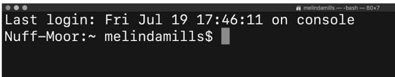
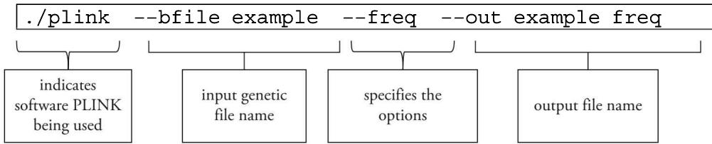
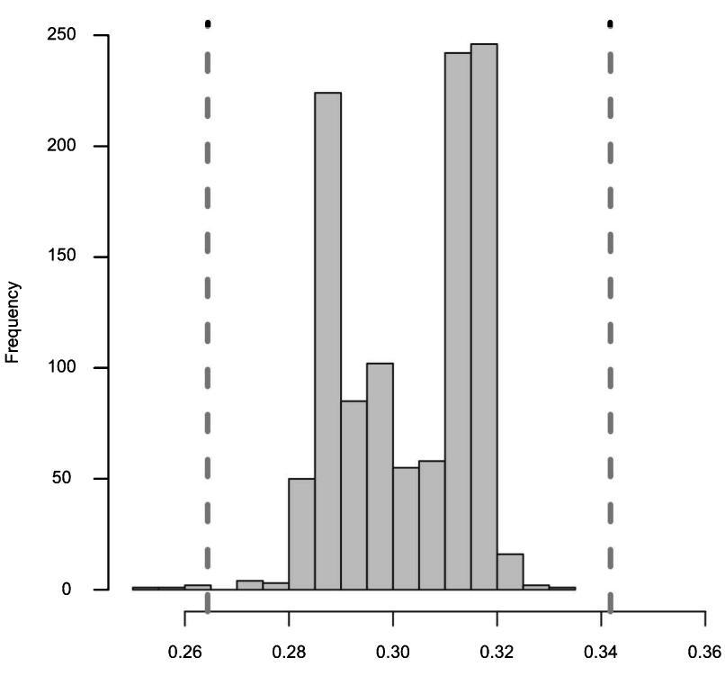
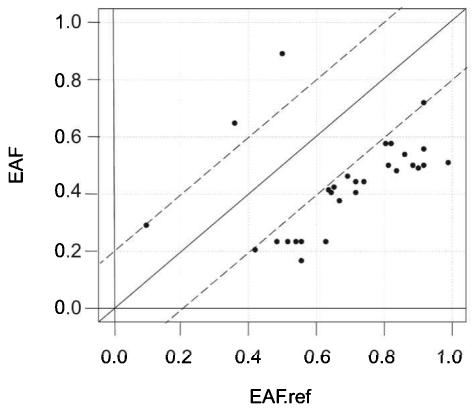
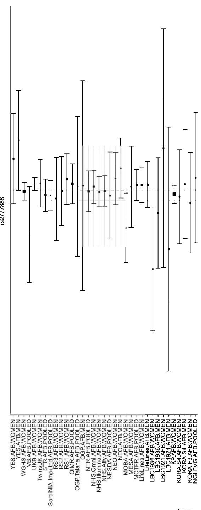
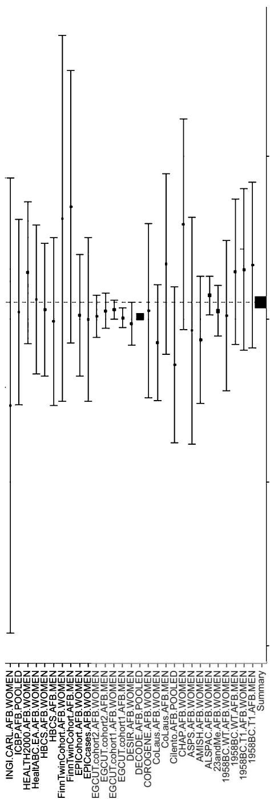

## Working with Genetic Data, Part I

Data Management, Descriptive Statistics, and Quality Control 

## Objectives

• Understand how to use the command line 

- Open and work with PLINK binary files 

• Recode PLINK files into other formats 

- Understand the basics of data management to select information on particular markers or a subsample of individuals 

• Derive information on allele frequencies, phenotypes, and missing values 

- Merge different genetic files 

• Associate a phenotype to a PLINK file 

- Understand and perform quality control procedures at the individual, marker, and genome-wide association studies level 

## 8.1 Introduction: Working with genetic data

The previous chapter introduced readers to the different types of genomic data. The aim of this chapter is to provide a gentle introduction of how to work with genetic data for those who are unaccustomed to working in a command line environment and have never used the computer program PLINK. We describe the command line and PLINK in more detail in the next section. After we outline the basics of using PLINK, such as calling PLINK, opening files, and importing data, we describe basic data management. This includes selecting individuals and markers and merging different genetic files. We then illustrate how to produce descriptive statistics including allele frequency, phenotypes, and missing values. Finally, we outline quality control (QC) of genetic data by individual and markers and QC for genome-wide association studies (GWASs), followed by a brief summary. Readers can choose to actively follow the exercises in this chapter on their own computer, and we provide an indication of how to do this in the next section. 

## 8.2 Getting started with PLINK

## 8.2.1 The command line

As we described chapter 7, one of the most popular open-source free software programs for QC and GWAS analyses is PLINK [1, 2]. It was developed by Shaun Purcell and colleagues and facilitates multiple types of data handling and usage. Detailed instructions on how to install PLINK are available in appendix 1 of this book. There are also many online tutorials (http://zzz.bwh.harvard.edu/plink/tutorial.shtml), instructions, and forms of documentation for PLINK. This chapter provides a brief introduction to the basics and main commands that you will need; it is by no means exhaustive. We highly recommend that you refer directly to the ample online documentation and material that is available. Depending on your operating system (i.e., Windows, macOS, Linux/Unix), some commands and processes might differ. In this book we use examples for the macOS and Linux systems. Windows users can find more detail in appendix 1 and box 8.1. For readers who would like to actively follow the tutorial in this chapter, we advise that you to first engage in these four steps: 

1. Create a new directory where you will store the data and PLINK. It could be, for example, /User/YourName/Chapter8 or E:\User\YourName\Chapter8 (see box 8.1). 

2. Install PLINK on your computer (see http://www.cog-genomics.org/plink2/ and appendix 1). 

3. Download the example data from the companion website of this book (http://www.intro-statistical-genetics.com). 

These are: 

- ALL.chr21.vcf.gz 

- BMI_pheno.txt 

• 1kg_EU_qc.bim, 1kg_EU_qc.bed, 1kg_EU_qc.fam 

- hapmap-ceu.bim, hapmap-ceu.bed, hapmap-ceu.fam 

- list.txt 

• 1kg_hm3.bim, 1kg_hm3.bed, 1kg_hm3.fam 

- individuals_failQC.txt 

- hello_world.sh 

The hapmap-ceua.zip files can be found at http://zzz.bwh.harvard.edu/plink/dist/hapmap-ceu.zip. 

4. Unzip the downloaded file(s) into the new folder that you created. As with all zipped files, when you double-click, it will unzip in a folder called hapmap1. Within this folder you should see three files: hapmap-ceu.bed, hapmap-ceu.bim, and hapmap-ceu.fam. 

Once PLINK is installed on your computer, you can execute all commands that we show in this book by typing them in the command line. The command line is an interface for typing commands directly to a computer's operating system. We need to use the command line because the usage of PLINK requires an active shell that waits for commands. One way to think of this is that the command line is a way of interacting with the computer program. You type a command in each of your successive lines of text (i.e., the command lines) and the shell serves as the command language interpreter or the program that handles your lines. The shell is like a language interpreter that accepts the text command and then converts it into the appropriate operating system functions. Those using Unix or familiar with the MS-DOS or Apple DOS interfaces of the 1970s and 1980s will already be accustomed to working in this type of environment. Due to the introduction of many graphical user interfaces (GUIs) with point-and-click, menu-driven actions, the fine art of the command line interfaces may have been lost for some. Box 8.1 provides a comparison of some of the command line differences between the operating systems. 


Box 8.1 Differences between the command line in Windows, Mac OS Terminal, and Linux Shell


<table><tr><td></td><td>Windows command line (CMD)</td><td>Mac OS terminal</td><td>Linux shell</td></tr><tr><td>Directory path</td><td>..\dir1\dir2\</td><td>../dir1/dir2/</td><td>../dir1/dir2/</td></tr><tr><td>List files and folder</td><td>dir</td><td>ls</td><td>ls</td></tr><tr><td>Call current location</td><td>dir</td><td>pwd</td><td>pwd</td></tr><tr><td>Move to directory</td><td>cd “path to the folder”</td><td>cd “path to the folder”</td><td>cd “path to the folder”</td></tr><tr><td>Get back to parent directory</td><td>cd ..</td><td>cd ..</td><td>cd ..</td></tr><tr><td>Get to the root directory</td><td>cd</td><td>cd /</td><td>cd /</td></tr><tr><td>Create a new directory</td><td>mkdir NewFolder</td><td>mkdir NewFolder</td><td>mkdir NewFolder</td></tr><tr><td>Remove directory</td><td>rmdir MyFolder</td><td>rm -r MyFolder</td><td>rm -r MyFolder</td></tr><tr><td>Rename directory</td><td>rmdir</td><td>mv oldName</td><td>mv oldName</td></tr><tr><td></td><td></td><td>newName</td><td>newName</td></tr><tr><td>Delete a file</td><td>del filename</td><td>rm fileName</td><td>rm fileName</td></tr><tr><td>Line break for commands</td><td>^</td><td>\</td><td>\</td></tr><tr><td>Execute plink</td><td>plink.exe</td><td>./plink</td><td>./plink</td></tr><tr><td>Execute GCTA</td><td>gcta.exe</td><td>./gcta</td><td>./gcta</td></tr><tr><td>Execute PRSice</td><td>Rscript PRSice.R or PRSice_win64.exe or PRSice_win32.exe</td><td>Rscript PRSice.R or ./PRSice_mac</td><td>Rscript PRSice.R or ./PRSice_linux</td></tr></table>




Figure 8.1


The command line in macOS terminal window.


We discuss the command line for Windows users in more detail in appendix 1. Briefly, Windows 10 users can download and install Ubuntu, which will effectively allow them to carry out these commands as if in a Linux operating system. For Mac users, to access the terminal or Unix command prompt, you first need to open the Utilities folder. To do this click on the Finder Icon that is located at the bottom dock of your screen. Find Applications on the left panel of the Finder window then scroll down within the Applications window until you locate Utilities and then click it in order to open. On the right-hand panel you will find Terminal. When you double-click it, it should look like the image in figure 8.1. 

For those following the practice session while reading this chapter, we suggest that you have the command line prompt ready now. The command line starts with a prompt just before the cursor (\$ or >). In most cases the prompt of the current directory is displayed before the prompt. As with R, the current directory is important when using PLINK. By default, PLINK will load and save data and results files into that directory. To change the directory, use: cd. We outline the cardinal rules of PLINK in box 8.2. 

## 8.2.2 Calling PLINK and the PLINK command line

As shown in figure 8.2, PLINK commands are composed of several arguments. Although the order of the arguments is arbitrary, a typical command begins by calling PLINK. Before doing this, however, you need to ensure that you are in the correct directory of where you stored PLINK. PLINK will be installed in the directory that you specified when you installed it (see appendix 1 and box 8.1). To find the current directory that you are using, type: pwd (i.e., print working directory). If PLINK is not in this directory, you will need to type the directory line of where you stored PLINK in the command line. This could be, for example: /usr/local/bin/plink. If you need to change directories, use the cd command, for example: cd /Users/yourname/plink. 

In these examples we show running the commands after the cursor. When you engage in more advanced analyses, you will run PLINK from a script as you would in R or other programs. 

As figure 8.2 shows, PLINK is invoked by typing ./plink on a Mac or Linux computer and plink.exe (on older versions of Windows computers)—given that PLINK is in your current working directory (see box 8.2). This is followed by the names of the genetic input file(s), then the actions we want to perform on these files, and ending by specifying the name of the output file. Note that these commands always begin with two dashes 

Box 8.2 The 10 PLINK commandments for new users 

1. PLINK is a command line program, so it needs to operate in that environment (i.e., DOS window or Unix terminal defined in text). 

2. Put your files in the same directory as the ./plink (or plink.exe) file in order to do all analyses from one directory. 

3. All results are written to files that have various different extensions. 

4. Remember to always examine the LOG file, which is your console output for notes, warnings, and errors (see box 8.3). 

5. PLINK has no cumulative memory. Each run that you make loads the data as if it was new and all previous filters and so on are lost. 

6. Spelling and exact command syntax is extremely important. This includes the double dash or minus that you will use often (--). 

7. You cannot combine all options with each other. PLINK does not always warn you, but for instance, basic haplotype tests cannot have covariates. 

8. Directory paths are separated by the "slash" symbol (/ in Unix and OSx), while windows uses the "backslash" symbol (\). In Unix and macOS, the backslash is used to break different lines of code. (See box 8.1 for more differences between operating systems.) 

9. PLINK is designed for human genetic data (which we cover in this book) and assumes the genome has 23 chromosomes with chr23 as the X chromosome. For those readers looking at other species, ensure you specify this (e.g., dog for 39 chromosomes). 

10. It is well worth your time and effort to consult the excellent documentation that is available online at http://www.cog-genomics.org/plink2/. 




Figure 8.2


Anatomy of a PLINK command line.


Note: Some shells such as UNIX first show the path of the directory that contains the files.


(--). The command shown in figure 8.2 is only used as an instructive example for those following this tutorial, and you do not need to enter it. 

The command in figure 8.2 shows the example of how to derive the allele frequencies of a genetic file. The input file name argument --bfile indicates the prefix $^{1}$ of the binary PLINK file we will use as input. As we touched upon in the last chapter, a binary file is computer-readable but not human-readable. All of our executable programs are stored in binary files, mostly in the form of numeric data files. 

We call up the example --bfile, which consists of the three interlinked files of: example.bim, example.bed, and example.fam. The command --bfile (instead of --file) specifies that the input data are in a binary format. This is followed by the options that you would like to undertake. In our example, --freq instructs PLINK to calculate allele frequencies. There are many other options, such as --recode or --assoc for association analyses. Note that multiple options can be used within a single command line and the order is not relevant since PLINK implements a default order. Finally, you need to specify an output file name, which in the example below is --out example _ freq. Suffixes for the data file will be immediately added on in PLINK. 

In this example, the command --freq would produce output with the suffix .afreq. If the name of the output file is not specified, the default name is plink (in lower case). New users should note that PLINK will overwrite files that have the same names without asking, so it is important to remain alert when using this command. A recommended practice is to always rename your output files to avoid confusion. You therefore do not use the default but engage in consistent file naming conventions. Keep file names short and meaningful, do not use spaces, and if using different version numbers sort in a way that the most recent version can be easily retrieved (2019v5example.txt or example_v5_2019.txt). It is also important to use meaningful directory names that you will be able to find (and remember) later. It is advisable that you use similar names for linked files, such as hapmap.ped and hapmap.map. Also, try to avoid using characters such as * : \ / <> | " ? [ ] ; = + & £ $ as they may be difficult to find or open, avoid using common words that are hard to distinguish later (e.g., version, draft), and try to avoid unnecessary repetition and redundancy in your file names and paths. 

## 8.2.3 Running scripts in terminal

Since we are only running simple commands to familiarize readers on how to work with PLINK, we often type all commands simply at the command line. Once you engage in more advanced analyses, however, you will want to write your script and then run it in terminal. To run a script in terminal, you need to type: sh /path/to/file and then press enter. 

For instance, type: 

sh hello_world.sh 

And you will see the following output: 

Hello World! 

## 8.2.4 Opening PLINK files

The hapmap-ceu data PLINK can be used to import data in different formats. One of the most commonly used formats, discussed already in detail in chapter 7, are the more compact binary files that consist of three files with the same name followed by the suffixes .bed, .bim, and .fam. The example data that we use is the hapmap-ceu data, which you should have already downloaded in your specified folder. CEU refers to Utah residents with Northern and Western ancestry and is one of the 11 populations in HapMap. The files for hapmap-ceu data are: 

hapmap-ceu.bed contains compressed information on genotype (not readable in text editor) 

hapmap-ceu.fam contains information about individuals 

hapmap-ceu.bim contains information about the SNPs 

## 8.2.5 Recode binary files to create new readable dataset with .ped and .map files

As we noted in the preceding chapter, PLINK has its own format for genetic data that differs from the classical rectangular structure of statistical software such as Excel or Stata. By storing the data in different files, we have information on both the sample and the genetic variants. The first step in any data analysis is to get to know your data by producing some basic summary statistics. The three linked files above in the hapmap-ceu data are, however, in unreadable binary format. It is possible to transform a binary file into a human-readable set of files by using the option --recode by using the command below. Note that this command will only work if the working directory is the /User/Your-Name/Chapter8 directory (or one that you created earlier and if the PLINK binary file is compatible with your operating system). Windows users on older systems may get a warning output and can refer to appendix 1. By including the option --bfile in a PLINK command, we call up a binary file. We specifically say “call” and not open since it is not a human-readable file that you can open and observe. 

./plink --bfile hapmap-ceu --recode --out hapmap-ceu 

As the command above shows, the only difference is the plink.exe. A series of outputs that are printed directly on the terminal tell us what PLINK is doing and provides some basic descriptive information about the file. $^{2}$ Below we show the output printed to the terminal screen (divided into two parts). The first lines of the output shows the version number v1.90b6.7 and date of the software release (December 2, 2018), the PLINK version (in this case it is PLINK 1.90b6.7), and copyright. We then see that the log file is saved in default “plink.log” as we noted earlier. But also note that since we changed the name of the output file using the --out hapmap-ceu command, this will now be the output file. 

```txt
./plink --bfile hapmap-ceu --recode --out hapmap-ceu
PLINK v1.90b6.7 64-bit (2 Dec 2018) www.cog-genomics.org/plink/1.9/
(C) 2005-2018 Shaun Purcell, Christopher Chang GNU
General Public License v3
Logging to hapmap-ceu.log.
Options in effect:
--bfile hapmap-ceu
--out hapmap-ceu
--recode 
```

The second part of the output reports important information about the number of markers and individuals in the file. In the example below, we see that PLINK loaded 2,239,392 variants from the .bim file for 60 individuals (30 males and 30 females) from the .fam file. We also see that there are 60 founders and 0 nonfounders present. Founders are the individuals who do not have parents in the dataset. PLINK only uses founders to calculate allele frequencies and nonfounders (e.g., a sibling pair dataset) would be excluded. PLINK may also report a series of Notes, Warnings, and Errors when it detects potential problems that something might be wrong or is not standard in some way, but it does not stop the execution of the PLINK command. Refer to box 8.3 for a more detailed discussion and interpretation of the warnings and note in the output below. Another important statistic is the genotyping rate (shown as 0.992022 below), which is the average proportion of markers available for an individual (with nonmissing data) [3]. Later in this chapter we will see how this information can be used to assess the quality of the data. 

```txt
16384 MB RAM detected; reserving 8192 MB for main workspace.
2239392 variants loaded from .bim file.
60 people (30 males, 30 females) loaded from .fam.
Using 1 thread (no multithreaded calculations invoked).
Before main variant filters, 60 founders and 0 nonfounders present.
Calculating allele frequencies ... done.
Warning: 59 het. haploid genotypes present (see hapmap-ceu.hh); many commands treat these as missing.
Total genotyping rate is 0.992022.
2239392 variants and 60 people pass filters and QC.
Note: No phenotypes present.
--recode ped to hapmap-ceu.ped+hapmap-ceu.map ... done. 
```

Box 8.3
PLINK note, warnings, and error messages 

PLINK has three types of errors and warnings that range in a gradient of severity from the light caution of a "Note," to "Warning," and to the more fatal "Error." A Note is simply PLINK informing you about something that might be useful to know, but it does not indicate an error or mistake. The note in the output above indicates that no phenotype is present, which for this example is not a problem since we are not performing an association analysis or loading phenotype data. For that we would need to use the --pheno command. A Warning alerts you to the fact that something is likely wrong but not fatal for your analysis. The Warning is: Warning: 59 het. haploid genotypes present (see hapmap-ceu.hh); many commands treat these as missing, which is generally related to male heterozygous calls in the X chromosome pseudoautosomal region. The pseudoautosomal regions (PAR1, PAR2) are homologous sequences on the X and Y chromosomes. It is strongly recommended that you address a warning particularly since in PLINK 2.0 it can be treated as an actual Error. The advice is to check the variants in the .hh file and if they are all near the beginning or end of the X chromosome use the command --split-x to solve this problem. An Error is a serious problem that causes PLINK to terminate. This can include messages such as "No input dataset," "Out of memory. Try the --memory and/or--parallel flags," or "All people removed." Refer to the PLINK website and ample resources that explain these issues and how to deal with them in more detail. 

The advantage of using .ped and .map files instead of binary files is that we can visually inspect these files by opening them in a text editor. This can help us to understand the structure of the data but requires more memory and is a less computationally efficient storage method. We recommend that you use binary data when working with large files (for example, when you working with genome-wide data for thousands of individuals). 

## 8.2.6 Import data from other formats

The option --make-bed can be used to transform data from other formats into a PLINK binary file. This creates a more compact version of the data that not only saves space but can speed up your analyses. The following command, for example, can be used to transform a .vcf file into PLINK binary files. A .vcf file refers to the 1000 Genomes Project text variant call format, which has variant information, including the sample ID and genotype call text file. We define and describe genotype calling in more detail shortly in the section on QC. Note that the current version of PLINK only works with genotyped data (see chapter 7). Imputed variants are automatically assigned to the most likely allele. As discussed in the previous chapter, PLINK 2.0 (currently in development at the time of writing this book) will efficiently store imputation quality information. 

```batch
./plink --vcf ALL.chr21.vcf.gz --make-bed --out test_vcf 
```

You should then see the following output below. 

```txt
PLINK v1.90b6.7 64-bit (2 Dec 2018) www.cog
-genomics.org/plink/1.9/
(C) 2005-2018 Shaun Purcell, Christopher Chang GNU General Public License v3
Logging to test_vcf.log.
Options in effect:
--make-bed
--out test_vcf
--vcf ALL.chr21.vcf.gz

16384 MB RAM detected; reserving 8192 MB for main workspace.
--vcf: test_vcf-temporary.bed + test_vcf-temporary.bim + test_vcf-temporary.fam written.
1105538 variants loaded from .bim file.
2504 people (0 males, 0 females, 2504 ambiguous) loaded from .fam.
Ambiguous sex IDs written to test_vcf.nosex .
Using 1 thread (no multithreaded calculations invoked).
Before main variant filters, 2504 founders and 0 nonfounders present.
Calculating allele frequencies ... done.
Total genotyping rate is 0.999787.
1105538 variants and 2504 people pass filters and QC.
Note: No phenotypes present.
--make-bed to test_vcf.bed + test_vcf.bim + test_vcf.fam ... done. 
```

PLINK can read data in various formats. We provide here a list of commands that can be used to import data from different software, including personal data from 23andMe. We show these only as an example. 

Oxford format (do not run this example) 

```shell
./plink --gen oxford_example.gen \
--sample oxford_example.sample \
--make-bed --out oxford_example 
```

Bgen (do not run this example) 

```shell
./plink --bgen bgen _ example \
--make-bed --out bgen _ example 
```

23andme (do not run this example) 

```shell
./plink --23file 23andme _ example \
--make-bed --out 23andme _ example 
```

## 8.3 Data management

PLINK can also be used to manage and transform data. We might want, for instance, to restrict an analysis to a subset of individuals or to certain markers. If we need to merge datasets for an analysis, PLINK can be used to ensure that the reported alleles of a genetic variant are coded in the same way. We discuss ways to harmonize SNPs coded in different manners in another chapter. This is of particular importance when using data from different genotyping platforms. In this section we first describe how to select individuals and markers and then how to merge different genetic files. 

## 8.3.1 Select individuals and markers

Select individuals PLINK can be used to select or exclude certain individuals. This can be done by providing PLINK with a file with the IDs of individuals that will be included (using --keep) or excluded (using --remove) in the analysis. The file must be a space/tab-delimited text file with family IDs in the first column and within-family IDs in the second column. 

The --keep option can be used to select individuals from the sample. 

The --remove option does the inverse and excludes from the analysis the individuals listed in the file. 

```shell
./plink --bfile hapmap-ceu \
--keep list.txt \
--make-bed --out selectedIndividuals 
```

```txt
PLINK v1.90b6.7 64-bit (2 Dec 2018) www.cog-genomics.org/plink/1.9/
(C) 2005-2018 Shaun Purcell, Christopher Chang GNU General Public License v3
Logging to selectedIndividuals.log.
Options in effect:
--bfile hapmap-ceu
--keep list.txt
--make-bed
--out selectedIndividuals
16384 MB RAM detected; reserving 8192 MB for main workspace.
2239392 variants loaded from .bim file.
60 people (30 males, 30 females) loaded from .fam.
Error: Failed to open list.txt. 
```

Similarly, we can select or exclude entire families by using the --keep-fam and --remove-fam options. The threshold filters for missing rates and allele frequency are automatically set to exclude no one when you use the --make-bed option. You can specify these filters manually by using --mind, --geno, and --maf to exclude people. This is also when the commands --extract/--exclude and --keep/--remove can applied. For instance, if you would like to create a new file containing only individuals with high genotyping of at least 95% complete you can add the --mind 0.05 command. 

```batch
./plink --bfile hapmap-ceu --make-bed --mind 0.05 --out highgeno 
```

This in turn creates three new files: highgeno.bed, highgeno.bim, and highgeno.fam. Remember to never try to open the .bed file as it is unreadable but it is possible to view the .fam and .bim files. Recall that the .fam file is just the first six columns of the .ped file (see chapter 7). 

Select markers It may be that you are interested in a SNP, a set of SNPs, or a particular region. PLINK can also be used to extract the genotype information of specific variants into a separate and smaller file. It could be, for instance, that you are interested in a list of SNPs such as a list of HapMap 3 SNPs if you have 1000 Genomes data. We can do this by specifying the name of the SNPs we want to select using the --snps options or by providing a file (using the option --include) containing the marker names of the variants that we want to include in the new file. The option --exclude can be used to remove certain variants from the file. The following example illustrates how to select the genotype of a single variant. The variant rs9930506 is a SNP in the FTO gene that several studies have associated with increased BMI and body weight. It is possible to select this variant using the following commands. In the previous section we demonstrated how to read in data from the direct-to-consumer company 23andMe. If you have this data and are curious about how many risk alleles you carry on rs9930596, you could import in your own personal data and check using the commands below. rs9930596 is a genetic variant in the FTO gene, and the G allele has been associated with increased risk of obesity. 

```shell
./plink --bfile hapmap-ceu \
--snps rs9930506 \
--make-bed \
--out rs9930506sample 
```

The output below shows that only 1 variant passed the filters, which was the intention and that three separate files were created (.bed, .bim, and .fam). 

```txt
PLINK v1.90b6.7 64-bit (2 Dec 2018) www.cog-genomics.org/plink/1.9/
(C) 2005-2018 Shaun Purcell, Christopher Chang GNU General Public License v3
Logging to rs9930506sample.log.
Options in effect:
--bfile hapmap-ceu
--make-bed
--out rs9930506sample
--snps rs9930506
16384 MB RAM detected; reserving 8192 MB for main workspace.
2239392 variants loaded from .bim file.
60 people (30 males, 30 females) loaded from .fam. 
```


```txt
--snps: 1 variant remaining.
Using 1 thread (no multithreaded calculations invoked).
Before main variant filters, 60 founders and 0 nonfounders present.
Calculating allele frequencies ... done.
1 variant and 60 people pass filters and QC.
Note: No phenotypes present.
--make-bed to rs9930506sample.bed + rs9930506sample.bim + rs9930506sample.fam 
```


If we examine the new rs9930506sample.bim file, we see that it has one line for the variant:


## 8.3.2 Merge different genetic files and attaching a phenotype

Merging genetic files During this type of analysis we often work with multiple files. It is frequently the case, for instance, that genomic data are stored by chromosome to avoid gigantic files that are hard to transfer over the internet and bear large computational requirements. It can, therefore, often be the case that you have 22 separate autosomal files, the files for the sex chromosomes, and perhaps, a file for the mitochondrial DNA and want to merge everything into a single file. Or, you may have files from different subgroups, such as from different genotype centers. On other occasions, it may be necessary to merge files from different studies to create a single file. Merging genetic files require considerable care. Variants measured in one file may not be measured in another file and may have different alleles or base-pair positions. The command --bmerge in PLINK ensures that these issues are addressed properly. By default, the command --bmerge sets these types of mismatches to missing. It is possible, however, to make different specifications by using the option --merge-mode. If you need to merge several files at the same time, as in the case of merging chromosome-specific files, use a file containing the names of the different genotype files and the option --merge-list. The following example merges two different genetic files, but note that it is only provided as an illustrative example (and thus not to be carried out). 

```shell
./plink --bfile HapMap_founders \
--bmerge HapMap_nonfounders \
--make-bed --out merged_file 
```

<table><tr><td>FID</td><td>IID</td><td>BMI</td></tr><tr><td>0</td><td>HG00096</td><td>25.022827</td></tr><tr><td>0</td><td>HG00097</td><td>24.853638</td></tr><tr><td>0</td><td>HG00099</td><td>23.689295</td></tr></table>

<table><tr><td>1</td><td>rs1048488</td><td>0</td><td>760912</td><td>C</td><td>T</td></tr><tr><td>1</td><td>rs3115850</td><td>0</td><td>761147</td><td>T</td><td>C</td></tr><tr><td>1</td><td>rs2519031</td><td>0</td><td>793947</td><td>G</td><td>A</td></tr><tr><td>1</td><td>rs4970383</td><td>0</td><td>838555</td><td>A</td><td>C</td></tr></table>

Attaching a phenotype A primary goal of genetic analysis is to study the association between a genotype and a phenotype. Phenotypes can be specified in a .fam file (see chapter 7). To “attach” a phenotype to a genetic file, we can use the --pheno command in PLINK as in the example above. Here we use two new files: 1kg _ EU _ qc and BMI _ pheno.txt. Looking first at the .fam file: 

```txt
head 1kg _ EU _ qc.fam 
```

With a small excerpt of the header: 

<table><tr><td>0</td><td>HG00096</td><td>0</td><td>0</td><td>1</td><td>-9</td></tr><tr><td>0</td><td>HG00097</td><td>0</td><td>0</td><td>2</td><td>-9</td></tr><tr><td>0</td><td>HG00099</td><td>0</td><td>0</td><td>2</td><td>-9</td></tr><tr><td>0</td><td>HG00100</td><td>0</td><td>0</td><td>2</td><td>-9</td></tr></table>

Then the .bim file and a small excerpt: 

```txt
head 1kg _ EU _ qc.bim 
```

Looking at the phenotype file and a small excerpt: 

```txt
head BMI _ pheno.txt 
```

To merge the phenotype we can use: 

```shell
./plink --bfile 1kg_EU_qc\
--pheno BMI_pheno.txt \
--make-bed --out 1kg_EU_BMI 
```

With the output: 

```txt
PLINK v1.90b6.7 64-bit (2 Dec 2018) www.cog-genomics.org/plink/1.9/
(C) 2005-2018 Shaun Purcell, Christopher Chang GNU General Public License v3
Logging to 1kg_EU_BMI.log.
Options in effect:
--bfile 1kg_EU_qc
--make-bed
--out 1kg_EU_BMI
--pheno BMI_pheno.txt

16384 MB RAM detected; reserving 8192 MB for main workspace.
851065 variants loaded from .bim file.
379 people (178 males, 201 females) loaded from .fam.
379 phenotype values present after --pheno.
Using 1 thread (no multithreaded calculations invoked).
Before main variant filters, 379 founders and 0 nonfounders present.
Calculating allele frequencies ... done.
851065 variants and 379 people pass filters and QC.
Phenotype data is quantitative.
--make-bed to 1kg_EU_BMI.bed+1kg_EU_BMI.bim+1kg_EU_BMI.fam ... done. 
```

If we examine the .fam file, we see that instead of -9 (i.e., missing) the last column now has the quantitative (i.e., continuous) phenotypic values but the .bim file (not shown) remains the same. 

```txt
head 1kg _ EU _ BMI.fam 
```

```txt
0 HG00096 0 0 1 25.0228  
0 HG00097 0 0 2 24.8536  
0 HG00099 0 0 2 23.6893  
0 HG00100 0 0 2 27.0162 
```

## 8.4 Descriptive statistics

Just as with any type of analysis, it is important to understand your data and engage in initial descriptive analyses. PLINK can also be used to derive information about the data that you are using for the analysis or the variants genotyped. 

## 8.4.1 Allele frequency

Allele frequencies can be calculated by the --freq command in PLINK. The output file (with the suffix .frq) contains information on the alleles of the genotypes and the minor allele frequency (MAF) and the allele codes for each SNP. 

```txt
./plink --bfile hapmap-ceu --freq --out Allele_Frequency head Allele_Frequency.frq 
```

Here we see the header of the output file Allele _ Frequency.frq: 

<table><tr><td>CHR</td><td>SNP</td><td>A1</td><td>A2</td><td>MAF</td><td>NCHROBS</td></tr><tr><td>1</td><td>rs9629043</td><td>C</td><td>T</td><td>0.09322</td><td>118</td></tr><tr><td>1</td><td>rs11497407</td><td>A</td><td>G</td><td>0.008333</td><td>120</td></tr><tr><td>1</td><td>rs12565286</td><td>C</td><td>G</td><td>0.0678</td><td>118</td></tr><tr><td>1</td><td>rs11804171</td><td>A</td><td>T</td><td>0.03704</td><td>108</td></tr><tr><td>1</td><td>rs2977670</td><td>G</td><td>C</td><td>0.07143</td><td>112</td></tr><tr><td>1</td><td>rs2977656</td><td>T</td><td>C</td><td>0.008333</td><td>120</td></tr><tr><td>1</td><td>rs12138618</td><td>A</td><td>G</td><td>0.05833</td><td>120</td></tr><tr><td>1</td><td>rs3094315</td><td>G</td><td>A</td><td>0.1552</td><td>116</td></tr><tr><td>1</td><td>rs2073813</td><td>A</td><td>G</td><td>0.125</td><td>120</td></tr></table>

Here you will see that the columns are: CHR (Chromosome number or code for sex chromosomes); SNP (variant name, rsID for most of the SNPs); A1 (Allele 1, which is the usually the minor allele [i.e., with lower frequency]); A2 (Allele 2, usually the major allele), MAF (Allele 1 frequency); and NCHROBS (number of allele observations). It is also possible to do a variety of other analyses such as stratifying by a categorical variable using the --within option. 

## 8.4.2 Missing values

Individual and variant missing values Examining missing values is important to assess the quality of the data. There are two types of missing values to consider. The first is by individuals. For each individual, we calculate the proportion of all variants that are missing. Second, genetic variants also may have missing values. For each genetic variant we calculate the proportion of individuals that have been genotyped and the proportion that have missing values. The command used by PLINK to derive this information is --missing, which produces two output files: a .imiss file for missing information by individual and a .lmiss file for missingness by SNP. 

```shell
./plink --bfile hapmap-ceu --missing --out missing_data 
```

To reduce repetition we do not show the entire output of the file but only the last lines that report that two new files have been created. 

```txt
--missing: Sample missing data report written to missing_data.imiss, and variant-based missing data report written to missing_data.lmiss. 
```

To examine the header (i.e., the top few lines) of the sample missing data, you can use the command below. If you do not use this and, for instance, type: more missing _data.imiss you will be taken hostage by a long file which you can exit by typing "q" for quit. 

```txt
head missing _ data.imiss 
```

You will then see the following output. In the individual-missing file (.imiss), it is structured in a way that each row represents an individual. The columns refer to: FID (family ID), IID (within-family ID), MISS_PHENO (a Yes/No indicator of missing phenotype), N_MISS (number of missing genotype calls), N_GENO (number of potentially valid calls), and F_MISS (missing call rate). 

<table><tr><td>FID</td><td>IID</td><td>MISS _ PHENO</td><td>N _ MISS</td><td>N _ GENO</td><td>F _ MISS</td></tr><tr><td>1334</td><td>NA12144</td><td>Y</td><td>15077</td><td>2239392</td><td>0.006733</td></tr><tr><td>1334</td><td>NA12145</td><td>Y</td><td>19791</td><td>2239392</td><td>0.008838</td></tr><tr><td>1334</td><td>NA12146</td><td>Y</td><td>13981</td><td>2239392</td><td>0.006243</td></tr><tr><td>1334</td><td>NA12239</td><td>Y</td><td>14072</td><td>2239392</td><td>0.006284</td></tr><tr><td>1340</td><td>NA06994</td><td>Y</td><td>16080</td><td>2239392</td><td>0.007181</td></tr><tr><td>1340</td><td>NA07000</td><td>Y</td><td>26113</td><td>2239392</td><td>0.01166</td></tr><tr><td>1340</td><td>NA07022</td><td>Y</td><td>17467</td><td>2239392</td><td>0.0078</td></tr><tr><td>1340</td><td>NA07056</td><td>Y</td><td>12133</td><td>2239392</td><td>0.005418</td></tr><tr><td>1341</td><td>NA07034</td><td>Y</td><td>20425</td><td>2239392</td><td>0.009121</td></tr></table>

To examine the variant-missing file (.1miss), you can use the command: 

```txt
head missing _ data.lmiss 
```

Where you will see that the columns are represented by CHR (chromosome code), SNP (variant identifier), N_MISS (number of missing genotype calls, not including obligatory missings), N_GENO (number of potential value calls), and F_MISS (missing call rate). Columns that are only present in within-family data are CLST (cluster identifier) and N-CLST (cluster size). 

<table><tr><td>CHR</td><td>SNP</td><td>N_MISS</td><td>N_GENO</td><td>F_MISS</td></tr><tr><td>1</td><td>rs12565286</td><td>1</td><td>60</td><td>0.01667</td></tr><tr><td>1</td><td>rs12138618</td><td>0</td><td>60</td><td>0</td></tr><tr><td>1</td><td>rs3094315</td><td>2</td><td>60</td><td>0.03333</td></tr><tr><td>1</td><td>rs3131968</td><td>0</td><td>60</td><td>0</td></tr><tr><td>1</td><td>rs12562034</td><td>0</td><td>60</td><td>0</td></tr><tr><td>1</td><td>rs2905035</td><td>0</td><td>60</td><td>0</td></tr><tr><td>1</td><td>rs12124819</td><td>0</td><td>60</td><td>0</td></tr><tr><td>1</td><td>rs2980319</td><td>0</td><td>60</td><td>0</td></tr><tr><td>1</td><td>rs4040617</td><td>0</td><td>60</td><td>0</td></tr></table>

Filters A number of additional filters can be applied to the data to extract particular sets of individuals. This is a non-exhaustive list of possible filters that can be applied to the data. For more information, refer to http://www.cog-genomics.org/plink/1.9/filter. 

--filter-controls 

Filters controls with a binary phenotype 

--filter-males 

Keeps only males (based on genotype data) 

```lua
--filter-females Keeps only females (based on genotype data)
--filter-founders Keeps only founders (i.e., it excludes all samples with at least one known parent)
--filter-nonfounders The opposite of founders 
```

```shell
./plink --bfile hapmap-ceu \
--filter-females \
--make-bed
--out hapmap_filter_females 
```

To avoid repetition, we do not show the entire output but only the relevant lines that note that all females have been removed. 

```txt
30 people removed due to gender filter (--filter-females). 
```

## 8.5 Quality control of genetic data

As already touched upon briefly in chapter 4 in relation to GWASs, quality control (QC) is a standard procedure when working with genetic data. Poor study design and errors in genotype calling can introduce systematic bias in genetic research, in particular to association studies, undermining the validity of the results. Genetic studies should have a rigorous quality control protocol that is planned already at the initial design of the study (see chapter 4, where we discuss GWAS research design). To ensure that the QC protocol is independent from the results, the protocol is often pre-registered at an external repository such as the Open Science Framework (https://osf.io). Additionally, researchers from large GWAS consortia often aim to ensure that all the QC procedures are performed by independent centers, although this is quite variable. Quality control protocols are set up to minimize the risk of a general inflation of associations but also false positive errors, which occur when a variant that is not truly associated with the disease is significantly associated with the disease in a given study. Poor data quality can relate to multiple problems such as poor or inconsistent measurement of the phenotype, which reduces statistical power (i.e., the ability to detect a true association using a statistical procedure). A good QC protocol assures that data are comparable across studies and can be used in subsequent analyses. The three main types of QC that we now describe below are: (1) per-individual QC, (2) per-marker QC, and (3) genome-wide association meta-analysis QC. We will briefly describe the main procedures and how to implement them in PLINK. 

## 8.5.1 Per-individual QC

The first step is to ensure that the individuals included in the sample have high-quality data. Per-individual QC of genome-wide data consists of setting up filters that remove individuals from the sample who may introduce bias in the analysis because of their low-quality data. Per-individual QC generally consists of five steps, namely identification of individuals: 

1. with poor DNA quality (low call rate and missing genotype, distinguished below); 

2. with high heterozygosity across autosomal chromosomes that indicates possible sample contamination or low levels of heterozygosity, which may be due to inbreeding; 

3. with discordant sex information; 

4. that are duplicated or related; and 

5. from different ancestry groups. 

Identification of individuals with poor genotype quality A challenge in this type of analysis is missing data both from individuals who have high rates of their genotype missing (i.e., low genotype call rate) but also SNPs that are missing in a large proportion of individuals. Here we address the large variations in DNA quality that have an effect on genotype call rate and genotype accuracy. There are sometimes low-quality DNA samples that need to be removed from the sample. It is possible to detect this when we observe individuals that have a higher proportion of missing genotypes. Typically, individuals with more than 3–7% missing genotypes are removed from the analysis with the option --mind and a specification of the missing cut-off of, for example, 0.05 for a 5% missing rate. This can be specified in PLINK as follows: 

```txt
./plink --bfile 1kg _ hm3 --mind 0.05 --make-bed --out 1kg _ hm3 _ mind005 
```

Identification of heterozygosity across autosomal chromosomes Heterozygosity refers to the carrying of two different alleles of a specific SNP (see chapter 1, section 1.5). The heterozygosity rate of an individual is the proportion of heterozygous genotypes. High levels of heterozygosity within an individual might be an indication of low sample quality whereas low levels of heterozygosity may be due to inbreeding. For this reason we exclude individuals with both high and low levels of heterozygosity in our analyses. Reasons for this may be due to inbreeding but also sample contamination. A basic command in PLINK to calculate heterozygosity is described below (option: --het). 

```txt
./plink --bfile 1kg _ hm3 --het --out 1kg _ hm3 _ het 
```

Two files are created: 1kg _ hm3 _ het.het and .log. The heterozygosity for each sample is computed as the ratio of the number of heterozygote genotype calls to the total number of non-missing calls. Heterozygosity statistics can be inspected using standard software such as Excel or R. Outliers with very high or low values of mean heterozygosity can be filtered out using the --exclude option in a separate PLINK command. The rule is often to remove individuals who deviate ±3 standard deviations from the particular sample's heterozygosity mean [4]. Figure 8.3 shows the distribution of the heterozygosity statistic using the output from the previous PLINK command. The red lines indicate QC thresholds of ±3 standard deviations from the mean. Observations with higher or lower heterozygosity can be removed from successive analyses. To generate this histogram, use the following commands in RStudio (see appendix 1 for information on how to install R and RStudio if you have not done so already): 


Histogram of heterogeneity





Figure 8.3


Histogram of heterozygosity statistic.


```r
heterogeneity _ stats<-read.table("1kg _ hm3 _ het.het", header=T)

attach(heterogeneity _ stats)
het<- (N.NM.-O.HOM.)/N.NM.
min<-mean(het)-3*sd(het)
max<-mean(het)+3*sd(het)

hist(het, col="lightblue", xlim=c(0.25,0.37), main="Histogram of Heterogeneity")

abline(v = c(min, max), col="red", lwd=3, lty=2) 
```

Identification of individuals with discordant sex information Recall that males only have one copy of the X chromosome and thus cannot be heterozygous for any marker in sex chromosomes. Using genotype data from the X chromosome, it is thus possible to check for discordance with ascertained sex. Typically, when a genotype-calling algorithm detects a male heterozygote for an X chromosome maker it calls that genotype as missing. Deriving correct sex information for the sample is important especially when analyses are carried out stratified by sex. To calculate this, run the commands below including the --check-sex option. 

```shell
./plink --bfile hapmap-ceu --check-sex --out hapmap _ sexcheck 
```

Males should have an X chromosome inbreeding coefficient greater than 0.8, while it should be smaller than 0.2 for females. PLINK compares the estimated inbreeding coefficient with ascertained sex and signal individuals with values outside these thresholds as possible mismatches. Discordant sex information may be the result of errors in the lab and if many individuals in your sample have this, you should scrutinize the data in more detail. The X chromosome inbreeding coefficient F is reported in the file .sexcheck obtained in the previous PLINK command. 

```txt
head hapmap _ sexcheck.sexcheck 
```

<table><tr><td>FID</td><td>IID</td><td>PEDSEX</td><td>SNPSEX</td><td>STATUS</td><td>F</td></tr><tr><td>1334</td><td>NA12144</td><td>1</td><td>1</td><td>OK</td><td>0.9999</td></tr><tr><td>1334</td><td>NA12145</td><td>2</td><td>2</td><td>OK</td><td>-0.06528</td></tr><tr><td>1334</td><td>NA12146</td><td>1</td><td>1</td><td>OK</td><td>0.9999</td></tr><tr><td>1334</td><td>NA12239</td><td>2</td><td>2</td><td>OK</td><td>0.05498</td></tr><tr><td>1340</td><td>NA06994</td><td>1</td><td>1</td><td>OK</td><td>0.9999</td></tr><tr><td>1340</td><td>NA07000</td><td>2</td><td>2</td><td>OK</td><td>-0.1001</td></tr><tr><td>1340</td><td>NA07022</td><td>1</td><td>1</td><td>OK</td><td>0.9998</td></tr><tr><td>1340</td><td>NA07056</td><td>2</td><td>2</td><td>OK</td><td>-0.03786</td></tr><tr><td>1341</td><td>NA07034</td><td>1</td><td>1</td><td>OK</td><td>0.9999</td></tr></table>

Identification of duplicated or related individuals It is important to examine inadvertent duplications of individuals and cryptic relatedness, or in other words the possibility that individuals in your sample may be close relatives. To identify duplicate and related individuals, a measure called identity by state (IBS) can be calculated for each pair of individuals based on the average proportion of alleles shared in common at genotyped SNPs (only autosomal chromosomes). The degree of shared ancestry for a pair of individuals (identity by descent, IBD) can be estimated by using genome-wide SNPs and its derived IBS. Pairs of individuals who have an IBS equal to 1 are either monozygotic twins or are duplicates in the data. The expected IBD of siblings is 0.5, and 0.25 for second-degree relatives. Due to genotyping errors and population structure there is often variation around these theoretical values. Typically, pairs of individuals with IBS > 0.1875 are removed from the analysis. $^{3}$ Recent methods, based on linear mixed models (such BOLT-LMM), do not require us to remove related individuals as they take into account relatedness in their computation. Chapter 9 illustrates how to calculate relatedness and how to filter individuals based on IBS statistics. 

Identification of individuals of divergent ancestry: Population stratification As discussed in chapter 3, confounding due to population stratification is a major source of bias in association studies. For this reason, it is common to run analyses stratified by continental-level ancestry. A common practice to identify high-level ancestry groups is to run a Principal Component Analysis on a large number of variants. This is addressed in the next chapter in section 9.4 in more detail. 

## 8.5.2 Per-marker QC

A second set of quality control analyses focuses on the data quality of variants. Several steps are taken sequentially to remove low-quality variants that might introduce bias in the study. Per-marker QC consists of five steps: 

1. Exclusion of low call rate SNPs 

2. Removal of SNPs with very low allele frequency (rare variants) in certain types of analyses 

3. Identification and exclusion of variants with extreme deviation from the Hardy-Weinberg equilibrium (HWE) 

4. In case-control studies, exclusion of SNPs with extremely different call rates between groups 

5. In the case of imputed SNPs, exclusion from the study of variants with low imputation quality 

It is important to remove suboptimal markers that may affect the analysis and thus increase the number of false positives. It is vital to pay attention to which markers are excluded and the potential LD aspects associated with this. Below, we give a minimal explanation of the steps required to perform per-marker QC analysis. 

Low-call-rate SNPs Low call rates refer to the situation where there are high rates of genotype missingness or in other words, SNPs that are missing in a large proportion of individuals. “Calling” in this context is used to represent the estimation of one unique SNP. Typically, markers with a call rate of less than 95% are excluded from the analysis. This can be specified with the option --geno in a PLINK command and a specification of the missing cut-off of, for example, 0.05 for a 5% missing rate. 

```txt
./plink --bfile 1kg _ hm3 --geno 0.05 --make-bed --out 1kg _ hm3 _ geno 
```

To avoid repetition, we do not show the detailed output for each of these commands. The following four files were created: 1kg _ hm3 _ mind005.bim, .fam, .bed, and .log. 

SNPs with low minor allele frequency Recall from chapter 1 (section 1.3.1) that minor allele frequency (MAF) is the frequency that the second most common allele at a site occurs in a given population. For example, in the HapMap project, SNPs with a MAF of 5% (0.05) or greater were targeted. SNPs that have low MAFs are rare. For this reason, analysts only include SNPs that are above a certain MAF threshold. There are two reasons to exclude MAFs with a low threshold. First, in the case of low MAFs, power is lacking to detect any real SNP-trait associations. Second, these SNPs are often more prone to genotyping errors. Low-frequency SNPs are more prone to bias due to genotyping error and low power to detect association and thus are usually removed from the study. We can exclude SNPs based on a MAF threshold of 1% with the option --maf 0.01. 

```txt
./plink --bfile 1kg _ hm3 --maf 0.01 --make-bed --out 1kg _ hm3 _ maf 
```

Two files are created, 1kg _ hm3 _ het .het and .log. The choice of MAF threshold is highly dependent on sample size. If you have a large sample you can use a lower MAF threshold. Although there is no fixed rule, a large sample is considered a something like N = 100,000, MAF threshold 0.01, with a moderate sample N = 10,000, MAF threshold 0.05; below that would be considered a small sample. Typically SNPs with a MAF of less than 1–2% are excluded from the study, but studies with a small sample size may apply higher thresholds. Note also that this 1–2% has also been decreasing with advances in imputation. 

Deviation from the Hardy–Weinberg equilibrium (HWE) As described in detail in chapter 3 (section 3.5), the HWE assumes an infinitely large population, with no selection, mutation, or migration and that the genotype and allele frequencies are constant over generations if none of the conditions are violated. Deviation from the HWE can thus indicate genotyping error, evolution, and concerns regarding the relationship between the allele and genotype frequencies. Violation of HWE indicates that genotype frequencies are significantly different from expectations and the observed frequency should not be significantly different. For example, if the frequency of allele A=0.20 and the frequency of allele T=0.80, then the expected frequency of genotype AT is $2 \times 0.2 \times 0.8 = 0.32$ . In GWASs, it is generally assumed that deviations from the HWE are the result of genotyping errors. The PLINK command for the HWE test is --hwe followed by a specification of the significance threshold for violation. 

```txt
./plink --bfile 1kg _ hm3 --hwe 0.00001 --make-bed --out 1kg _ hm3 _ hwe 
```

This produces four new files, .log, .bim, .fam, and .bed. Exclusion differs according to whether you have a binary or quantitative (i.e., continuous) trait. For binary traits the rule is often a HWE p-value $<10^{-10}$ in cases and $<10^{-6}$ in controls. For quantitative traits the recommendation is a HWE p-value $<10^{-6}$ [4]. Different p-value thresholds have been applied in the literature and different references will have different levels. 

Combining different QC filters To remove all of the SNPs failing multiple QC filters, we can simultaneously apply the commands previously covered at both the individual and marker level. The file individuals _ failQC.txt includes all of the individuals that fail the individual level QC (e.g., extreme heterozygosity or related individuals). 

```shell
./plink --bfile 1kg _ hm3 \
--mind 0.03 \
--geno 0.05 \
--maf 0.01 \
--hwe 0.00001 \
--exclude individuals _ failQC.txt \
--make-bed --out 1kg _ hm3 _ QC 
```

## 8.5.3 Genome-wide association meta-analysis QC

As our chapter on GWASs described in considerable detail, most studies are based on a meta-analysis of association results that combines several datasets using millions of genetic variants. To avoid type II errors (false positives), GWAS researchers expend substantial effort to identify outliers attributed to low-quality data during the final meta-analysis QC stage. Variants that are not robust to a series of checks are filtered out and not included in the analysis. Typical filters applied at this stage remove variants that have low allele frequency, low imputation quality, allele frequency diverging substantially from a reference sample, or that have association results driven by a specific study that cannot be replicated elsewhere. In some cases, it may appear to be a repetition of some of the previous steps (for instance removing SNPs with low minor allele frequency) that are generally filtered out before the meta-analysis. 

There are several reasons, however, as to why these QC steps need to be repeated at the meta-analysis stage. First, variants that do not show any problem in a single study may have additional problems when pooled together in a multi-cohort study. As we noted in our GWAS chapter, these studies may be very complex and use the data from dozens of individual genetic studies from all over the world. A 2016 GWAS on human reproductive behavior, for instance, was based on the analysis of three phenotypes on sex-specific analyses of 63 different cohorts [5]. This implied an extensive check of hundreds of files containing the association results of millions of genetic variants. The QC in that study was performed by two independent centres (Based in Oxford, U.K., and Rotterdam, The Netherlands) that analysed the data and compared filters and diagnostic tools to ensure that the reported results were based on the best quality variants. QC for such a large project can often take several months. In this section, we summarize the main steps and diagnostic tests of the QC procedure for GWASs. 

Filters Although researchers do not want to discard “true” results, it is often the case that GWAS analysts prefer a conservative approach to ensure that low-quality markers are excluded from the analysis. These are possible filters that can be applied in the QC of genome-wide association results. 

1. A first step in a GWAS is to harmonize base pair positions of the markers across files using a common reference. For instance, the US National Center for Biotechnology Information d 37. 

2. Evaluating information on association results, especially if coming from a multitude of files, also needs to be carried out. Markers with missing information on effect allele or alternative allele, or with implausible values for effect estimates, standard errors, or p-values, are removed from the sample. 

3. Markers that are not biallelic (pertaining to both alleles), or that are monomorphic (showing no variation or in other words opposite to polymorphic), are excluded from the list of final results. 

4. Results from rare variants are usually problematic and may affect the results. Markers with MAF below 1% are typically removed. However, this threshold may depend on sample size of the study. Some small studies can more often have problematic results from variants with MAF smaller than 5%, while large biobanks may not have problems for variants that are much less common. 

5. Imputation quality can affect the quality of association results. It is common to drop analysis markers with an imputation quality below 0.7. 

Diagnostic checks Following this, it is then common to run additional diagnostic checks for the SNPs remaining after applying the filters described above. A very common graph is the allele frequency plot (see figure 8.4). This checks whether the variants (1) are all coded in the same way and do not have errors in allele frequencies and strand orientations, $^{4}$ and (2) have similar allele frequencies across studies. It is common to produce a graph in which the allele frequencies in each study are plotted against the allele frequencies in a reference sample, typically 1000 Genomes. Figure 8.4 shows an allele frequency plot that was used in the QC of our large GWAS consortium on human reproductive behavior [5]. The figure is a scatterplot with the expected allele frequencies of age at first birth (AFB) on the y-axis and the allele frequencies from a reference consortium (1000 Genomes) on the x-axis. Since we would need to plot around 10 million points, we plot only the points that diverge from the reference sample. In particular, here we only plot points that have a difference in allele frequency of 0.2 (hence the diagonal lines). In this case, it is possible to see that some variants have lower allele frequency than the reference sample. 




Figure 8.4


Allele frequency plots of age at first birth (AFB) by 1000 Genomes reference panel.
Source: Slightly adapted by authors from original EasyQC output for higher resolution and to fit black and white format.


A second diagnostic check that can be very useful to examine heterogeneity of results is the so-called forest plot (see figure 8.5). A forest plot is a common diagnostic tool used in meta-analysis. In this graph, taken from our same study discussed above, the association results of different studies for a given variant (rs2777888) are plotted with their confidence intervals across all data sources used in the study. This is a visual representation of the heterogeneity of the results. This plot is verification that all of the results have the same direction of effect. Larger studies should have smaller confidence intervals, giving more precise estimates. In this case it is, for example, the large samples from deCODE genetics and 23andMe that were included in our meta-analysis. The size of the box also represents the sample size of the data. Forest plots are typically combined with heterogeneity tests. 

Additional QC diagnostic tools include plots of the reported p-values versus the p-values of the Z-scores (also called PZ plots), and Quantile-Quantile (Q-Q) plots where observed p-values are plotted against the theoretical quantiles we would observe in case of no association. Q-Q plots may reveal unaccounted for population stratification. We discuss Q-Q plots in more detail in chapter 12 (see section 12.1.3). It is also worth noting that we would expect inflation to show up in a Q-Q plot from a well-powered GWAS of a heritable trait. Another aspect to note when considering errors and bias in genotyped data is batch effects. Batch effects refer to measurement errors that arise due to laboratory conditions, reagent lots, or other differences. For an excellent review on this topic, refer to a 2010 study by Leek and colleagues [6]. 

## 8.6 Conclusion

This chapter provided a basic introduction of how to start working with genetic data using PLINK. Our aim is that you now have grasped the basics of how to work with this type of data using the command line, calling and opening PLINK and importing data. Data management is very important in these types of analyses and for this reason we attempted to outline some of the very basics about how to select individuals and markers and merge different genetic files or add a phenotype. You should now also be able to examine descriptive statistics including allele frequency and filtering for missing values. We concluded with one of the most important steps in this type of data analysis, which is QC of the individual-, marker-, and GWAS-level QC processes. In chapter 9 we will show you how to run more advanced analyses including association analysis, GWAS, identification of independent SNPS, calculating PCAs, and using an additional program called GCTA (Genome-Wide Complex Trait Analysis) [7]. 







Figure 8.5
Forest plot of rs2777888.


## Exercises

In this chapter we examined European ancestry population. Go to the following website, where were you will find other ancestry groups: http://zzz.bwh.harvard.edu/plink/res.shtml. 

Download the Chinese and Japanese sample (CHB and JPT) and carry out the following analysis: 

1. Recode the file into .map and .ped files. 

2. Calculate allele frequencies and missing values. 

3. Run a QC analysis with the following criteria: 

a. Call rate > 95% 

b. Minor Allele Frequency > 3% 

c. Hardy–Weinberg equilibrium test < 0.0001 

## Further reading and resources

Further reading on data QC and PLINK: 


Anderson, C. A. et al. Data quality control in genetic case-control association studies. Nat. Prot. 5, 1564–1573 (2010). 


Chang, C. C. et al. Second-generation PLINK: Rising to the challenge of larger and richer datasets. GigaScience 4(1), doi:10.1186/s13742-015-0047-8. 


Laurie, C. C. et al. Quality control and quality assurance in genotypic data for genome-wide association studies. Gen. Epid. 34, 591–602 (2010). 


Winkler, T. W. et al. Quality control and conduct of genome-wide association meta-analyses. Nat. Prot. 9, 1192–1212 (2014). 


## PLINK resources

Online PLINK Tutorial: http://zzz.bwh.harvard.edu/plink/tutorial.shtml. 

PLINK webpage: http://www.cog-genomics.org/plink2/. 

YouTube PLINK tutorial by Broad Institute: https://www.youtube.com/watch?v=ppBJqCMSBYk. 

## References


1. S. M. Purcell et al., PLINK: A tool set for whole-genome association and population-based linkage analyses. Am. J. Hum. Genet. 81, 559–575 (2007). 


2. C. C. Chang et al., Second-generation PLINK: Rising to the challenge of larger and richer datasets. *Gigascience* 4(1) (2015), doi:10.1186/s13742-015-0047-8. 


3. C. A. Anderson et al., Data quality control in genetic case-control association studies. Nat. Protoc. 5, 1564–1573 (2010). 


4. A. T. Marees et al., A tutorial on conducting genome-wide association studies: Quality control and statistical analysis. Int. J. Methods Psychiatr. Res. 27, e1608 (2018). 


5. N. Barban et al., Genome-wide analysis identifies 12 loci influencing human reproductive behavior. Nat. Genet. 48, 1–7 (2016). 


6. J. T. Leek et al., Tackling the widespread and critical impact of batch effects in high-throughput data. Nat. Rev. Genet. 11, 733–739 (2010). 


7. J. Yang, S. H. Lee, M. E. Goddard, and P. M. Visscher, GCTA: A tool for genome-wide complex trait analysis. Am. J. Hum. Genet. 88, 76–82 (2011). 


## 9

Working with Genetic Data, Part II 

Association Analysis, Population Stratification, and Genetic Relatedness