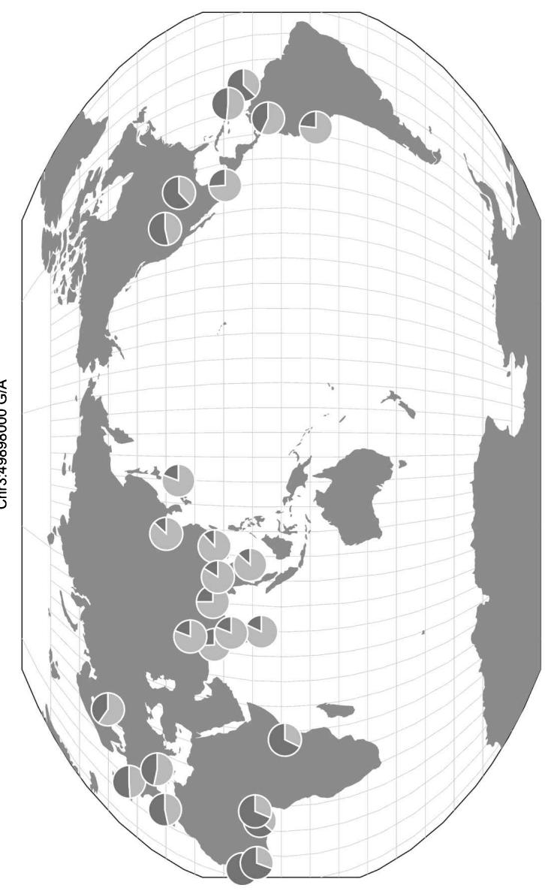
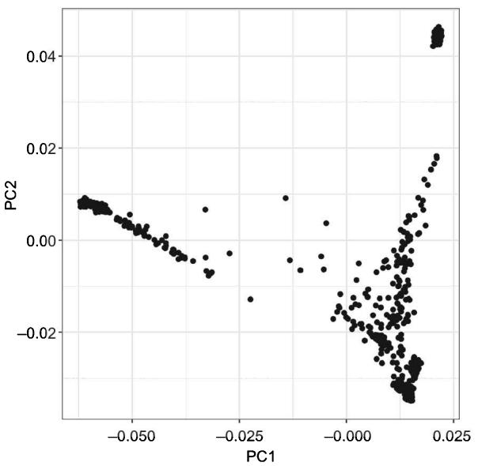
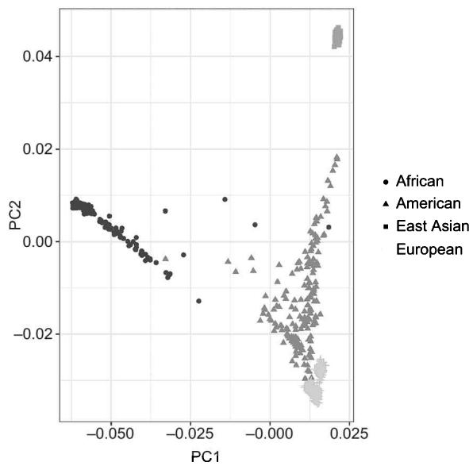
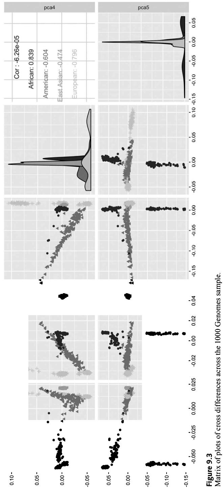
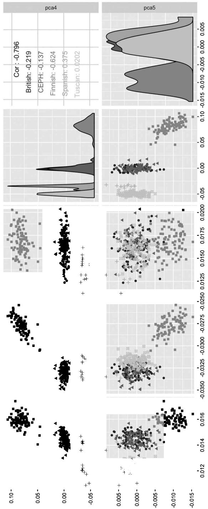

## Objectives

- Learn how to run linear and logistic association analyses 

- Understand how to perform additive, dominant, or recessive analysis of selected single-nucleotide polymorphisms (SNPs) 

• Be able to run a genome-wide association study using PLINK 

- Learn how to identify independent SNPs through linkage disequilibrium (LD) pruning 

• Find a proxy genotype of SNPs in high LD with your SNP of interest using LD 

- Learn how to perform Principal Component Analysis in genetic data 

- Calculate genetic relatedness using identity by state (IBS) with PLINK and Genome-wide Complex Trait Analysis (GCTA) 

• Use GCTA to estimate heritability for different phenotypes 

## 9.1 Introduction

## 9.1.1 Aim of this chapter

The previous chapter provided readers with some of the fundamentals of how to use PLINK, together with some basics of data management and quality control. The aim of this chapter is to introduce readers to the essentials of association analysis, population stratification, and genetic relatedness. Examining the relationship between SNPs and a particular trait in association analysis forms the basis of many analyses. We are then generally interested in examining whether that particular correlation between SNPs and a trait is from SNPs that are independent or redundant. For this reason, we illustrate how to isolate independent SNPs through a technique called LD pruning. This is done by finding SNPs that are in high LD with your particular SNP of interest. We know from chapter 3 that individuals from different ancestry groups differ with respect to their allele frequencies. For this reason, we demonstrate how to calculate principal components in genetic data. Another vital element to consider when working with genetic data is genetic relatedness and the bias that duplicated or related individuals can bring into your association analysis. We explain how to identify these related individuals using the measure of identity by state (IBS) in PLINK and GCTA (Genome-wide Complex Trait Analysis). We introduce readers to some of the basic commands of GCTA and provide instructions on how to calculate heritability with this program. 

## 9.1.2 Data and computer programs used in this chapter

To actively follow along with this chapter, you will need to ensure that you have the following data installed in the appropriate directory that we will use in this chapter. Remember that data used in this book is described in appendix 2 and when relevant can be downloaded from our companion website, http://www.intro-statistical-genetics.com. With the exception of the .txt file, all have the linked (.bed, .bim, and .fam) files: 

• 1kg_EU_BMI 

- 1kg_EU_Overweight 

• 1kg_hm3_qc 

- 1kg_hm3_pruned 

- 1kg_samples.txt 

- BMI_pheno.txt 

- 1kg_samples_EUR.txt 

- hapmap-ceu 

You will also need to install GCTA (https://cnsgenomics.com/software/gcta/#Overview). Instructions on how to do this are provided in appendix 1. 

## 9.2 Association analysis

As you know from chapter 1, a primary goal of genetic analysis is to estimate the association between a genotype and a phenotype. As a simple example below, we estimate the linear association of rs9674439 alleles on body mass index (BMI). The statistical model estimates the effect of the C allele (the first allele in the .bim file) on the phenotype of interest. This type of model is by far the most common in genome-wide association studies (GWASs). Each copy of the C allele of this SNP has the same effect or, in other words, it is an additive model. A basic linear regression with an additive effect on a quantitative phenotype can be estimated as follows (keep in mind that commands can differ by operating system—see box 8.1): 

```shell
./plink --bfile 1kg_EU_BMI \
--snps rs9674439 \
--assoc \
--linear \
--out BMIrs9674439 
```

Recall from the previous chapter that the --bfile command is the binary fileset that contains the linked .bed, .bim, and .fam files, which in this example uses the 1_kg_EU_BMI file. The second line, --snps, specifies the SNP list, which in our case is rs9674439. Note that it is also possible to select a range of SNPs. The --assoc command provides the basic results of the association analysis. For quantitative (i.e., continuous) traits, you use the --linear command. 

The result from the commands above produces the file named BMIrs9674439.assoc. linear shown below. It has the following information: chromosome number (CHR); variant identifier (SNP); base-pair position (BP); effect allele (A1); type of statistical test used (TEST), which in this case is ADD for additive; number of missing values (NMISS); regression coefficient (BETA); t-statistic (STAT); and asymptotic p-value for t-statistic (P). The following output shows that each copy of the C allele on SNP rs9674439 is associated with a reduction of 0.29 in BMI. The result, however, is not statistically significant, with a p-value of 0.20. 

```csv
CHR SNP BP A1 TEST NMISS BETA STAT P
16 rs9674439 33836510 C ADD 379 -0.2974 -1.269 0.2052 
```

When dealing with case-control studies, the regression is slightly different and the option --linear should be omitted. The statistical test calculated is a chi-square test, and the estimated coefficient is an odds ratio. A logistic regression option for binary phenotypes is also available, by substituting --logistic for --linear in the PLINK command. In the example below, we run a logistic regression on a binary trait (Overweight). Individuals with a BMI greater or equal than 25 are classified as overweight (cases), while individuals with a BMI less than 25 are coded as not overweight (controls). In PLINK, cases are coded 2, and controls 1. Here we use logistic regression to estimate the effect of rs9674439 on the probability of being overweight. 

```shell
./plink --bfile 1kg_EU_Overweight \
--snps rs9674439 \
--assoc \
--logistic \
--out Overweight_rs9674439 
```

As most readers will know, the output of a logistic regression is slightly different from a linear regression. The file Overweight _rs9674439.logistic, shown below has the following columns: chromosome number (CHR), variant identifier (SNP), base pair position (BP); effect allele (A1), type of statistical test used (TEST), number of missing values (NMISS), odds ratio (OR), t-statistic (STAT) and asymptotic p-value for the t-statistic (P). As a standard output, PLINK reports the odds ratio estimate of a logistic regression, which in this example is the ratio between the probability of being overweight associated with each copy of the C allele, over the probability of being overweight given no copies of the C allele. In other words, it tells us how much more likely it is to be overweight if an individual has at least one copy of a particular allele (in an additive model). Odds ratios are always greater than zero. When the odds ratio is greater than 1, it indicates an increased risk; when it is less than 0 it indicates a decreased risk; and when it is equal to 1, it means that there is no association. In the example below, we see that the OR is 0.7, suggesting that the C allele is associated with decreased probability of being overweight. The associated p-value is 0.0009, meaning that the statistical association is strong. The results suggest that having a C allele on rs0674439 is protective against becoming overweight. The result is consistent with the previous model, although the level of statistical significance is different. This is attributed to the fact that we are looking at the same variable, but coded in a different way. BMI is a continuous variable, while Overweight is dichotomous. Your choice on how to code a variable is thus very important and depends on the study design and your research question. 

<table><tr><td>CHR</td><td>SNP</td><td>BP</td><td>A1</td><td>TEST</td><td>NMISS</td><td>OR</td><td>STAT</td><td>P</td></tr><tr><td>16</td><td>rs9674439</td><td>33836510</td><td>C</td><td>ADD</td><td>1092</td><td>0.7261</td><td>-3.32</td><td>0.0009017</td></tr></table>

Additive models are the most common type of genotype-phenotype association analysis, although sometimes we might be interested in different models such as dominant models or recessive models in which we study the effect of a single allele. In particular, dominant models treat the heterozygote and one of the homozygote genotypes as a single category. For example, as summarized in table 9.1, let us assume a given SNP that has alleles A and B. The three possible genotype groups are then AA, AB, and BB. If A is the effect or “risk” allele, then a dominant model will study the effect of having at least one copy of A, that is the effect of “AA+AB” versus “BB.” On the contrary, a recessive model estimates the effect of having two copies of A, that is the effect of “AA” versus “AB+BB.” These models can be estimated in PLINK using the options --linear dominant or --linear recessive in case of linear models, as in the example below. 


Table 9.1


Comparison of additive, dominant, and recessive regression models and their interpretation


<table><tr><td rowspan="2">Model</td><td colspan="2">Outcome</td><td>Interpretation</td></tr><tr><td>Continuous</td><td>Binary</td><td>A risk allele</td></tr><tr><td>Additive</td><td>--linear</td><td>--logistic</td><td>AA vs AB vs BB</td></tr><tr><td>Dominant</td><td>--linear dominant</td><td>--logistic dominant</td><td>AA + AB vs BB</td></tr><tr><td>Recessive</td><td>--linear recessive</td><td>--logistic recessive</td><td>AA vs AB+BB</td></tr></table>

```shell
./plink --bfile 1kg _ EU _ BMI \
--snps rs9674439 \
--assoc \
--linear dominant \
--out BMIrs9674439 
```

This command writes out three files, BMIrs9674439.log, .assoc _ linear, and .qassoc. The BMIrs9674439.assoc _ linear file is show below. 

<table><tr><td>CHR</td><td>SNP</td><td>BP</td><td>A1</td><td>TEST</td><td>NMISS</td><td>BETA</td><td>STAT</td><td>P</td></tr><tr><td>16</td><td>rs9674439</td><td>33836510</td><td>C</td><td>DOM</td><td>379</td><td>-0.4783</td><td>-1.462</td><td>0.1445</td></tr></table>

The BMIrs9674439.qassoc is: 

<table><tr><td>CHR</td><td>SNP</td><td>BP</td><td>NMISS</td><td>BETA</td><td>SE</td><td>R2</td><td>T</td><td>P</td></tr><tr><td>16</td><td>rs9674439</td><td>33836510</td><td>379</td><td>-0.2974</td><td>0.2343</td><td>0.004254</td><td>-1.269</td><td>0.2052</td></tr></table>

Association analysis in PLINK may include covariates, such as sex of the respondent, birth year, controls for population stratification, or data-specific variables. In a linear model, this can be specified by adding the --covar option followed by a tab-separated file including the variables used as covariates in the analysis. In this case, the output file will include, for each marker, a row indicating the regression estimate for each covariate included in the model. 

If, instead of testing a single variant, we are interested in testing the association with all of the genetic variants included in the genotype file, this can be done by omitting the --snp command. This is a genome-wide analysis (i.e., GWAS), which was discussed extensively in chapter 4, although this type of analysis usually includes both genotyped and imputed data. 

<table><tr><td rowspan="4">./plink</td><td>--bfile 1kg _ EU _ BMI \</td></tr><tr><td>--assoc \</td></tr><tr><td>--linear \</td></tr><tr><td>--out BMIgwas</td></tr></table>

An excerpt of the typical output file includes the results below. Note that because this file includes all SNPs, it has millions of rows and we therefore only examine the first few lines. 

```txt
head BMIgwas.assoc.linear 
```

<table><tr><td>CHR</td><td>SNP</td><td>BP</td><td>A1</td><td>TEST</td><td>NMISS</td><td>BETA</td><td>STAT</td><td>P</td></tr><tr><td>1</td><td>rs1048488</td><td>760912</td><td>C</td><td>ADD</td><td>379</td><td>0.6031</td><td>2.151</td><td>0.03208</td></tr><tr><td>1</td><td>rs3115850</td><td>761147</td><td>T</td><td>ADD</td><td>379</td><td>0.6056</td><td>2.135</td><td>0.03343</td></tr><tr><td>1</td><td>rs2519031</td><td>793947</td><td>G</td><td>ADD</td><td>379</td><td>-0.9188</td><td>-1.019</td><td>0.3087</td></tr><tr><td>1</td><td>rs4970383</td><td>838555</td><td>A</td><td>ADD</td><td>379</td><td>-0.01473</td><td>-0.05882</td><td>0.9531</td></tr><tr><td>1</td><td>rs4475691</td><td>846808</td><td>T</td><td>ADD</td><td>379</td><td>-0.3347</td><td>-1.221</td><td>0.223</td></tr><tr><td>1</td><td>rs1806509</td><td>853954</td><td>C</td><td>ADD</td><td>379</td><td>-0.1015</td><td>-0.4786</td><td>0.6325</td></tr><tr><td>1</td><td>rs7537756</td><td>854250</td><td>G</td><td>ADD</td><td>379</td><td>-0.1289</td><td>-0.4769</td><td>0.6337</td></tr><tr><td>1</td><td>rs28576697</td><td>870645</td><td>C</td><td>ADD</td><td>379</td><td>0.1739</td><td>0.7539</td><td>0.4514</td></tr><tr><td>1</td><td>rs7523549</td><td>879317</td><td>T</td><td>ADD</td><td>379</td><td>0.1316</td><td>0.2271</td><td>0.8204</td></tr></table>

The output of a GWAS in PLINK is exactly the same as that of a single regression and has the following columns: chromosome number (CHR), variant identifier (SNP), base-pair position (BP), effect allele (A1), type of statistical test used (TEST), number of missing values (NMISS), regression coefficient (BETA), t-statistic (STAT), and asymptotic p-value for t-statistic (P). The regression model is repeated sequentially for each SNP included in the PLINK file. As discussed in chapter 4, we need to take multiple testing into account when interpreting GWAS results to avoid inflating the number of false positives. To give an indication of this, if we take the normal $p$ -value threshold of 0.05, we expect that, under the null, $5\%$ of variants are significantly associated by chance. This is likely acceptable in many cases when we estimate regression with only a few variables of interest. When we test 1 million variables (SNPs) at the same time, a $p$ -value of 0.05 implies that 50,000 SNPs are false positives. To avoid this error, we adopt a much stricter $p$ -value threshold ( $5 \times 10^{-8}$ , that is 0.00000005). Another aspect you will notice when working with GWAS results is that SNPs that have similar positions will have a similar effect and $p$ -value. This is because SNPs are in LD (see chapter 3, section 3.6). We will how to work with GWAS results further in chapter 12. 

PLINK can perform many different types of association analysis. For instance, it is possible to run a within-family analysis (also called family fixed effect regression) where we examine the effect of different genotypes among family members. Within-family analyses are vital to establish a true genetic effect that is not confounded by population stratification and genetic nurture, as the differences in genotype across siblings operate as a true random experiment since alleles are transmitted randomly through meiosis (see chapter 1, section 1.2). Such analysis can be performed in PLINK with the command --qfam. More advanced association analyses can also be run using PLINK that we do not cover in this introductory textbook, including stratified case/control analyses, regression using dosage data, LASSO regression, and linear mixed model associations. 

GWASs are usually performed with software other than PLINK, mostly attributed to the fact that the current version of PLINK is not the most suitable for using data with imputation uncertainty. Other software used for GWASs include SNPTEST, BOLT-LMM, and BGENIE. PLINK 2.0, currently in development, will efficiently manage imputed data and be suitable for large GWASs. 

## 9.3 Linkage disequilibrium

As described in chapter 3 (section 3.6), linkage disequilibrium (LD) is the result of many factors such as selection, genetic recombination, mutation rate, genetic drift, population stratification, and genetic linkage. LD affects the way alleles are distributed across a population and creates a correlation structure across SNPs. Therefore, we are often interested in studying and detecting the correlation between SNPs or identifying SNPs that are independent. Establishing the correlation between SNPs is useful for several reasons. First, the same SNPs might not be measured in multiple studies. We want thus to isolate genetic signals even if the same SNPs are not measured across all studies or substudies. A second reason is to reduce the number of genetic variants for subsequent analysis. If, for instance, we wanted to derive ancestry information, we do not need all of the information included in the genotyped data since much of it is redundant. As we show in the next chapter, it is common to extract only independent SNPs when we calculate polygenic risk scores. 

LD between SNPs is commonly measured with two measures: $r^{2}$ and $D'$ . The $r^{2}$ measure is simply calculated as the square of the correlation coefficient of the alleles between two SNPs, and it is therefore constrained to take values between 0 and 1. It is a statistical measure of shared information between two markers and is commonly used to determine how well one SNP can act as a proxy for another. The statistic $D'$ is a population genetics measure also scaled between 0 and 1, indicating the recombination probability between markers. A $D'$ equal to 0 indicates complete linkage equilibrium and frequent recombination, while a $D'$ equal to 1 implies no recombination between the two markers, implying complete LD. PLINK can also be used to check the LD between two markers. The option --ld inspects the relationship between a single pair of variants in more detail, which displays observed and expected (based on MAFs) frequencies of each haplotype, as well as haplotype-based $r^{2}$ and $D'$ . 

```txt
./plink --bfile hapmap-ceu --ld rs2883059 rs2777888--out ld _ example 
```

This produces the two files of ld _ example.log and ld _ example.hh and gives the following output: 

```txt
--ld rs2883059 rs2777888:
R-sq = 0.715909 D' = 1
Haplotype    Frequency    Expectation under LE
CA    -0    0.21
TA    0.45    0.24
CG    0.466667    0.256667
TG    0.083333    0.293333 
```

Here we find a $r^{2}$ of 0.715909, which suggests a fairly high correlation between rs2883059 and rs2777888. The $D'$ is equal to 1, which means that the two SNPs are in complete LD or, in other words, co-inherited around 100% of the time. The disequilibrium value is a measure of the nonrandom association of alleles at two or more loci. If the two loci are independent (i.e., not co-inherited), then both the $r^{2}$ and $D'$ values would be 0.0 regardless of either allele frequency. Others have noted that $D'$ values suffer from a ceiling effect or in other words easily reaches 1. But which measure should you use? Typically the $r^{2}$ is the preferred measure if the focus of your research is on the predictability of one polymorphism given another. This is why it is often used in power studies for association designs. The $D'$ is the measure that is used to assess recombination patterns since haplotype blocks are often defined as the basis of $D'$ , which is shown in the output above. 

In some cases, we may be interested in finding a proxy genotype or, in other words, SNPs in high LD with the SNP of interest. The best way to find a proxy genotype is to check a reference panel such as 1000 Genomes, keeping in mind that different ancestral groups may differ substantially in their LD structure. This can be done using online databases such as LDlink (https://ldlink.nci.nih.gov) [1]. LDlink is a website containing multiple web-based applications designed to interrogate LD in population groups. Table 9.2 reports the results from LDlink on the first 10 proxy genotypes for SNP rs2777888 on chromosome 3, for the CEU population in the 1000 Genomes dataset. 

LD Pruning LD pruning is a statistical procedure used to remove redundant SNPs or, in other words, pairs of correlated SNPs. By iteratively examining all of the SNPs in the genotype data, LD pruning selects only one representative SNP from each LD block. In each step the SNP with the higher minor allele frequency is kept in the dataset. Two SNPs are then considered independent if their correlation $(r^{2})$ is inferior to a certain threshold or if their distance in base pairs is greater than specified. For instance, the command below tells PLINK to load the file 1kg _ hm3 _ qc and to keep SNPs with a MAF of at least 1%, with no pairs remaining with $r^{2}>0.2$ . By default, variants more than 1,000 kilobases apart are considered independent. The additional parameters, here 50 and 5, affect how the computation works in windows across the genome. $^{1}$ 


Table 9.2


Example of proxy genotypes using LDlink


<table><tr><td>RS results</td><td>Chr</td><td>Position (GRCh37)</td><td>Alleles</td><td>MAF</td><td>Distance</td><td><eq>D^{\prime}</eq></td><td><eq>R^{2}</eq></td><td>Correlated alleles</td></tr><tr><td>rs2681781</td><td>3</td><td>49898273</td><td>(A/G)</td><td>0.4646</td><td>273</td><td>1.0</td><td>1.0</td><td>A=A,G=G</td></tr><tr><td>rs62262093</td><td>3</td><td>49960388</td><td>(T/C)</td><td>0.4697</td><td>62388</td><td>1.0</td><td>0.9799</td><td>A=T,G=C</td></tr><tr><td>rs9848497</td><td>3</td><td>49951316</td><td>(T/C)</td><td>0.4697</td><td>53316</td><td>1.0</td><td>0.9799</td><td>A=T,G=C</td></tr><tr><td>rs7634084</td><td>3</td><td>49949834</td><td>(A/T)</td><td>0.4697</td><td>51834</td><td>1.0</td><td>0.9799</td><td>A=A,G=T</td></tr><tr><td>rs3733135</td><td>3</td><td>49939587</td><td>(G/A)</td><td>0.4697</td><td>41587</td><td>1.0</td><td>0.9799</td><td>A=G,G=A</td></tr><tr><td>rs3774758</td><td>3</td><td>49938227</td><td>(C/G)</td><td>0.4697</td><td>40227</td><td>1.0</td><td>0.9799</td><td>A=C,G=G</td></tr><tr><td>rs2230590</td><td>3</td><td>49936102</td><td>(T/C)</td><td>0.4697</td><td>38102</td><td>1.0</td><td>0.9799</td><td>A=T,G=C</td></tr><tr><td>rs9815930</td><td>3</td><td>49931343</td><td>(A/T)</td><td>0.4697</td><td>33343</td><td>1.0</td><td>0.9799</td><td>A=A,G=T</td></tr><tr><td>rs6795703</td><td>3</td><td>49930215</td><td>(C/T)</td><td>0.4697</td><td>32215</td><td>1.0</td><td>0.9799</td><td>A=C,G=T</td></tr><tr><td>rs1062633</td><td>3</td><td>49924940</td><td>(T/C)</td><td>0.4697</td><td>26940</td><td>1.0</td><td>0.9799</td><td>A=T,G=C</td></tr></table>

```shell
./plink --bfile 1kg _ hm3 _ qc --maf 0.01 \
--indep-pairwise 50 5 0.2 \
--out 1kg _ hm3 _ qc _ pruned 
```

We do not provide all of the output, but briefly, you should see output that describes the pruning of variants from each chromosome, with an excerpt of the output provided below. 

```txt
Pruned 56392 variants from chromosome 1, leaving 13264. Pruned 56216 variants from chromosome 2, leaving 12648. Pruned 47468 variants from chromosome 3, leaving 11085. .....
Pruned 9577 variants from chromosome 21, leaving 2626. Pruned 9323 variants from chromosome 22, leaving 2983. Pruning complete. 680356 of 846484 variants removed. Marker lists written to plink.prune.in and plink.prune.out. 
```

The command above produces a list of independent SNPs that can be used for further analysis. The file 1kg _ hm3 _ qc _ pruned.prune.in contains the independent SNPs, while the file 1kg _ hm3 _ qc _ pruned.prune.out lists the markers that are excluded from the pruning. In order to obtain a “pruned” dataset, we can use the --extract option in PLINK to get rid of the redundant markers. 

```shell
./plink --bfile 1kg_hm3_qc \
--extract 1kg_hm3_qc_pruned.prune.in \
--make-bed \
--out 1kg_hm3_prunedf 
```

LD clumping is a similar approach that selects independent SNPs based on a statistic. When calculating polygenic scores, for instance, a common choice for clumping is to use the test statistic computed from a GWAS of a given phenotype. In this way, we select the SNP with the smallest p-value for that genetic locus for each LD block. We will discuss LD clumping in more detail in chapter 10, which demonstrates how to calculate polygenic scores. 

## 9.4 Population stratification

As discussed in chapter 3, as a consequence of human dispersal out of Africa (section 3.2), individuals from different ancestries differ substantially in their allele frequencies. Population structure and stratification was elaborated upon in detail in section 3.3. Here we noted that a SNP that is common in one population may be rare in another one or even show no variation at all. Large projects such as HapMap and 1000 Genomes have shown how genetic variations change across populations. Figure 9.1, for instance, shows the allele frequency of SNP rs2777888, a genetic marker strongly associated with human reproductive behavior in the 1000 Genomes reference panel. By using the Geography of Genetic Variants browser [2], a web-app provided by the lab of John Novembre from the University of Chicago, we can map how this SNP varies across populations. The most common allele is G in African populations, while the alternative A allele is much more common in Southeast Asia. 

As noted in chapter 3, population stratification has strong implications for genetic associations and must be carefully considered during analysis. Principal components analysis (PCA) is the most widely used approach for identifying and adjusting for ancestry differences among individuals. PCA is a statistical technique for data reduction, used to summarize multidimensional data into fewer variables. By calculating principal components from a multivariate dataset, we reduce the complexity of the data to account for the structure of the original dataset. PCA is used in genetics to explain differences in allele frequencies among a sample of individuals. Principal components are thus the “new variables” that explain part of the variability in the original data. 

Sample sizes below 30 become increasingly transparent to represent uncertain frequencies, i.e. 

Figure 9.1
Geographical distribution of SNP rs2777888 in the 1000 Genomes sample.
Source: Figure obtained using the Geography of Genetic Variants Browser (http://www.popgen.uchicago.edu/ggy). 


Chr3:49898000 G/A





Frequency scale = Proportion out of 1
The pie below represents a minor allele frequency of 0.25


An important property of principal components is their intrinsic ranking. The first component is always the one that has the greatest explanatory value, followed by the second and so forth. It is common to use the first 10 or 20 principal components from a genetic dataset in the analysis. As discussed in section 3.3.4 of chapter 3, PCA in genetics almost perfectly mirror the geographical variation across populations. Principal components are used to understand the ancestry of an individual. They are, moreover, used for QC, to remove individuals from the sample that are heterogeneous in ancestry. Finally, PCA is one of the standard methods used in GWASs to correct for population stratification. As we discussed in detail earlier in chapter 4, GWASs currently generally focus on a single ancestry population, which is then replicated in another (unfortunately, this has meant an overrepresentation of those of European ancestry) [3]. However, this is not sufficient to account for further population stratification within the same ancestral group. Individuals from Northern Europe have, for example, allele frequencies that differ from Southern Europeans. Several software packages can be used to estimate principal components from genetic data. Other programs can be used to calculate PCs from genetic data, including EIGENSTRAT. 

Here we report the commands that can be used in PLINK to estimate the first 10 principal components using the option --pca 10. 

```shell
./plink --bfile 1kg _ hm3 _ pruned --pca 10 --out 1kg _ pca 
```

The --pca command in PLINK produces two output files. In this example: 1kg _ pca.eigenval and 1kg _ pcas.eigenvec. The file with the extension .eigenvec is the list of principal components and can be used by other statistical software for further analyses. An excerpt of the 1kg _ pca.eigenval file is: 

54.1464
40.0338
6.96377
3.375 

An excerpt of the 1kg _ pca.eigenvec looks like: 

```csv
0 HG00096 0.0149253 -0.0329941 0.0157409 0.00171199 0.00178966
-0.00704659 -0.00461685 -0.00735375 -0.00169564 0.0100253
0 HG00097 0.0146554 -0.0330726 0.0168457 -0.00070785
-0.000456348
-0.00860046 -0.00610165 -0.00293391 0.00189605 0.00350145 
```

```txt
0 HG00099 0.0147324 -0.0333974 0.0160621 0.00243107
0.000503637 -0.00195932 -0.00130626 -0.00384657 0.00205159
-0.000813858
0 HG00100 0.0146498 -0.0329754 0.0158382 -0.00275797
0.00202298 0.00228241 -0.000977904 -0.00151248 0.00244192
0.00711757
0 HG00101 0.0145233 -0.0328001 0.0164791 0.000286727
-0.00121587
-0.00203153 -0.000880223 -0.00698668 0.00506124 0.0101333 
```

After calculating the principal components, we can then use R to inspect how individuals differ by these dimensions. Using RStudio, we can open the PLINK output files and visually inspect the data. Figure 9.2 is a scatterplot of the two first principal components calculated from PLINK. We can recognize immediately that the data are not randomly distributed, but rather that a few groups emerge from the data (figure 9.2, upper panel). 

We can then use information from the 1000 Genomes sample to identify the different groups within the data. The file 1kg _ samples.txt includes the populations of origin for all the individuals of the 1000 Genomes sample. Using RStudio, we can import this dataset and merge with the principal components calculated from PLINK. The code below produces an updated figure where we can easily distinguish each population in the data. Individuals with European ancestry are clustered in the bottom right corner of the figure with East Asians in the top right corner of the graph. Individuals with African ancestry are more dispersed across the X axis (PC 1), while American populations are more disperse along the second principal component. $^{2}$ 

```r
#Panel A
library(ggplot2)
columns=c("fid", "Sample.name", "pca1", "pca2", "pca3", "pca4", "pca5", "pca6", "pca7", "pca8", "pca9", "pca10")
pca<- read.table(file="1kg_pca.eigenvec", sep = "", header=F, col.names=columns)[,c(2:12)]
ggplot(pca, aes(x=pca1, y=pca2))+ geom_point()+ theme_bw()+ xlab("PC1") + ylab("PC2")
#Panel B
geo <- read.table(file="1kg_samples.txt", sep = "\t",header=T)[,c(1,4,5,6,7)] 
```







Figure 9.2


Identification of ancestry groups in data along the first two principal components.


```txt
data <- merge(geo, pca, by="Sample.name")
ggplot(data, aes(x=pca1, y=pca2, col=Superpopulation.
name))+
    geom _ point() + theme _ bw() +
    xlab("PC1") + ylab("PC2") +
    labs(col = "") 
```

Figure 9.3 shows a matrix of plots indicating differences across the 1000 Genomes sample. Interestingly, PCA can distinguish both macro differences in the ancestral groups but also smaller details within a more homogeneous population. Restricting our analysis to an ancestry group, such as individuals with European ancestry, does not protect us from the risk of including bias in the analysis due to population stratification. As an example, we repeat the same plot, but this time only with individuals who have European ancestry (figure 9.4). Although differences across groups are less marked than in the previous figure, it is immediately apparent how different groups can be distinguished by comparing different principal components. (This textbook shows only the greyscale version of all figures, with color plots shown on the online companion website to this book.) 

PCA has been shown as a very efficient method to identify individuals with different ancestry and to control for population stratification in analyses. Recently, other methods have also been introduced in GWASs to account for differences in population stratification. The most efficient method is to use a family fixed effect model, that is based on the analysis of DZ (dizygotic non-identical) twins or regular siblings. Genetic differences among siblings are due to randomness induced by meiosis, and, by definition, there is no population stratification among biological siblings. Running an association comparing siblings is an effective way to estimate the “real effect” of genetic variants. However, this approach comes at a cost. Since siblings share on average 50% of their genetic variations, many SNPs have exactly the same alleles among siblings. This means that a much larger sample is required if we want to use sibling differences to detect the same level of detail as with a population of unrelated individuals. Geneticists have collected many family-based studies in which siblings and twins are both genotyped. However, the sample size of these studies is much smaller than larger data initiatives such as the UK Biobank [4]. Family fixed effect models are often used as robustness checks to validate the main results obtained in a larger population. One problem, however, is that small families might be systematically excluded from these types of analyses. Another method that has increasingly been adopted in association studies is to use linear mixed models instead of PCA to control for population stratification. Linear mixed models are regression models that take into account the degree of genetic relatedness in the data. This class of models first estimates a matrix of genetic relatedness (see the next section) and includes this information in a regression model. The software BOLT-LMM [5] uses this approach to perform GWASs. 

<table><tr><td>pca1</td><td>pca2</td><td>pca3</td><td>pca4</td><td>pca5</td></tr><tr><td>Cor: 0.000518</td><td>Cor: -0.000264</td><td>Cor: -4.97e-05</td><td>Cor: -0.000255</td><td></td></tr><tr><td>African: -0.747</td><td>African: -0.597</td><td>African: 0.274</td><td>African: 0.057</td><td></td></tr><tr><td>American: 0.304</td><td>American: -0.544</td><td>American: 0.392</td><td>American: -0.823</td><td></td></tr><tr><td>East Asian: 0.0687</td><td>East Asian: 0.019</td><td>East Asian: 0.03</td><td>East Asian: 0.0405</td><td></td></tr><tr><td>European: 0.484</td><td>European: 0.258</td><td>European: 0.902</td><td>European: -0.604</td><td></td></tr><tr><td>pca1</td><td>pca2</td><td>pca3</td><td>pca4</td><td>pca5</td></tr><tr><td>Cor: 0.000518</td><td>Cor: -0.000264</td><td>Cor: -4.97e-05</td><td>Cor: -0.000255</td><td></td></tr><tr><td>African: -0.747</td><td>African: -0.597</td><td>African: 0,274</td><td>African: 0.057</td><td></td></tr><tr><td>American: 0.304</td><td>American: -0.544</td><td>American: 0.392</td><td>American: -0.823</td><td></td></tr><tr><td>East Asian: 0.0687</td><td>East Asian: 0.019</td><td>East Asian: 0.03</td><td>East Asian: 0.0405</td><td></td></tr><tr><td></td><td>European: 0.258</td><td>European: 0.902</td><td>European: -0.604</td><td></td></tr><tr><td>pca1</td><td>pca2</td><td>pca3</td><td>pca4</td><td>pca5</td></tr><tr><td>Cor: 0.000528</td><td>Cor: 0.000528</td><td>Cor: 6.32e-05</td><td>Cor: 0.000122</td><td></td></tr><tr><td>African: -0.0593</td><td>African: -0.0542</td><td>African: -0.139</td><td>African: -0.538</td><td></td></tr><tr><td>American: -0.959</td><td>American: 0.971</td><td>American: -0.538</td><td>American: -0.538</td><td></td></tr><tr><td>East Asian: 0.468</td><td>East Asian: -0.369</td><td>East Asian: 0.215</td><td>East Asian: 0.215</td><td></td></tr><tr><td></td><td>European: 0.149</td><td>European: 0.742</td><td>European: -0.813</td><td></td></tr><tr><td>pca1</td><td>pca2</td><td>pca3</td><td>pca4</td><td>pca5</td></tr><tr><td>Cor: -3.44e-05</td><td>Cor: -3.44e-05</td><td>Cor: -9.99e-05</td><td>Cor: -9.99e-05</td><td></td></tr><tr><td>African: -0.477</td><td>African: -0.477</td><td>African: -0.0623</td><td>African: -0.0623</td><td></td></tr><tr><td>American: -0.961</td><td>American: -0.961</td><td>American: 0.708</td><td>American: 0.708</td><td></td></tr><tr><td>East Asian: -0.755</td><td>East Asian: -0.755</td><td>East Asian: 0.507</td><td>East Asian: 0.507</td><td></td></tr><tr><td></td><td>European: 0.289</td><td>European: -0.242</td><td>European: -0.242</td><td></td></tr></table>




<table><tr><td>pca1</td><td>pca2</td><td>pca3</td><td>pca4</td><td>pca5</td></tr><tr><td colspan="2">Cor: 0.484</td><td colspan="2">Cor: 0.258</td><td>Cor: -0.604</td></tr><tr><td colspan="2">British: 0.0457</td><td colspan="2">British: 0.0759</td><td>British: 0.189</td></tr><tr><td colspan="2">CEPH: -0.199</td><td colspan="2">CEPH: -0.112</td><td>CEPH: 0.00671</td></tr><tr><td colspan="2">Finnish: 0.228</td><td colspan="2">Finnish: -0.00222</td><td>Finnish: -0.142</td></tr><tr><td colspan="2">Spanish: -0.895</td><td colspan="2">Spanish: 0.326</td><td>Spanish: 0.149</td></tr><tr><td colspan="2">Tuscan: -0.0104</td><td colspan="2">Tuscan: -0.197</td><td>Tuscan: -0.0779</td></tr><tr><td colspan="5"></td></tr><tr><td colspan="2">Cor: 0.149</td><td colspan="2">Cor: 0.742</td><td>Cor: -0.813</td></tr><tr><td colspan="2">British: -0.257</td><td colspan="2">British: 0.0503</td><td>British: 0.105</td></tr><tr><td colspan="2">CEPH: -0.074</td><td colspan="2">CEPH: -0.137</td><td>CEPH: -0.169</td></tr><tr><td colspan="2">Finnish: -0.0114</td><td colspan="2">Finnish: 0.747</td><td>Finnish: -0.47</td></tr><tr><td colspan="2">Spanish: -0.461</td><td colspan="2">Spanish: -0.548</td><td>Spanish: -0.3</td></tr><tr><td colspan="2">Tuscan: -0.147</td><td colspan="2">Tuscan: 0.194</td><td>Tuscan: 0.0343</td></tr><tr><td colspan="5"></td></tr><tr><td colspan="2">Cor: 0.289</td><td colspan="2">Cor: -0.242</td><td></td></tr><tr><td colspan="2">British: 0.147</td><td colspan="2">British: -0.107</td><td></td></tr><tr><td colspan="2">CEPH: 0.0384</td><td colspan="2">CEPH: -0.0257</td><td></td></tr><tr><td colspan="2">Finnish: 0.214</td><td colspan="2">Finnish: -0.116</td><td></td></tr><tr><td colspan="2">Spanish: 0.0826</td><td colspan="2">Spanish: -0.269</td><td></td></tr><tr><td colspan="2">Tuscan: -0.0175</td><td colspan="2">Tuscan: 0.241</td><td></td></tr></table>




Figure 9.4 Matrix of plots of cross differences across the 1000 Genomes sample, European Ancestry Population only.


## 9.5 Genetic relatedness

As noted in the previous chapter, duplicates and related individuals can significantly introduce bias in association analysis. To identify related individuals in a genotypic data, a measure called identity by state (IBS) can be calculated for each pair of individuals based on the average proportion of shared alleles that they have in common. IBS is usually calculated on a set of independent genotyped SNPs. We can use PLINK to calculate IBS based on differences in genotyped SNPs across individuals using the option --distance. 

```batch
./plink --bfile 1kg _ hm3 _ pruned --keep 1kg _ samples _ EUR.txt --distance --out ibs _ matrix 
```

```txt
PLINK v1.90b6.5 64-bit (13 Sep 2018) www.cog-genomics.org/plink/1.9/
(C) 2005-2018 Shaun Purcell, Christopher Chang GNU
General Public License v3
Logging to ibs_matrix.log.
Options in effect:
--bfile 1kg_hm3_pruned
--distance
--keep 1kg_samples_EUR.txt
--out ibs_matrix

16384 MB RAM detected; reserving 8192 MB for main workspace.
166128 variants loaded from .bim file.
1092 people (525 males, 567 females) loaded from .fam.
--keep: 379 people remaining.
Using up to 4 threads (change this with --threads).
Before main variant filters, 379 founders and 0 nonfounders present.
Calculating allele frequencies ... done.
166128 variants and 379 people pass filters and QC.
Note: No phenotypes present.
Distance matrix calculation complete.
IDs written to ibs_matrix.dist.id .
Distances (allele counts) written to ibs_matrix.dist. 
```

The command produces a tab-delimited text file containing the Hamming distances between individuals. The file is organized as follows. The first element is the distance between genome 1 and genome 2. Distances between a genome and itself is omitted as it is of course 0. The default command produces a lower-triangular file. IBS distances are, in fact, symmetric, as a distance between genome 1 and 2 is equivalent to the distance between genome 2 and genome 1. It is possible, however, to produce a square file if we use the command --distance square. The distance of the first 10 genomes in the 1kg _ samples _ EUR.txt file is shown here. 

head ibs _ matrix.dist 

```c
74407
74208 74953
74755 74396 73099
74429 74572 73941 73346
74049 74752 74473 74218 74544
74792 74829 74704 75257 74797 74915
75499 74890 74743 74858 74740 74780 75025
74915 74522 74291 75122 74148 74892 73305 73548
74601 74286 74731 74774 74502 74734 75247 75260 74556
73911 74190 73761 74260 74132 74018 74595 74408 74186 74116 
```

An alternative measure of distances is given by using the command --make-rel, which gives a genetic relatedness matrix using the same metric used by the software GCTA. 

```batch
./plink --bfile 1kg _ hm3 _ pruned --keep 1kg _ samples _ EUR.txt --make-rel --out rel _ matrix 
```

These results can be used to find cryptic relatedness. The expected value for MZ twins or a duplicated pair is 1; 0.5 for first-degree relatives (e.g., full-sibs or parent–offspring); 0.25 for second-degree relatives (e.g., grandparent–grandchild); and 0.125 for third-degree relatives (e.g., cousins). Please note that these are expected values and empirical results may differ. For instance, studies have shown that, although the average genetic distance between biological siblings is 0.5, the typical range of differences ranges from 0.4 to 0.6 [6]. 

By looking at the results below, we can notice, for instance, that the genetic relatedness of an individual and themselves is different from 1. This is an estimation of the inbreeding coefficient based on the relationship of haplotypes within an individual $[7]$ . Nevertheless, it is interesting to note that some pairs of individuals have higher values of genetic relatedness. Genome 4 and genome 3 have a genetic relatedness higher than expected among unrelated individuals. Based on this value, we can conclude that these individuals are second-degree relatives. At the same time, we can also see that some cells have negative values. This is due to the fact that genetic relatedness values are normalized using the average distance among unrelated individuals. For this reason, it is very important to calculate a genetic relatedness matrix only among individuals from the same ancestry group. 

```txt
head rel_matrix.rel 
```

Showing an excerpt of the file below: 

```csv
0.975623
0.00309471 0.980394
0.00433624 -0.00307206 0.977987
0.00320043 0.00425093 0.0261669 0.984606 
```

## 9.6 Relatedness matrix and heritability with GCTA

Another approach to calculate a relatedness matrix and perform additional analyses is by using the software GCTA (Genome-wide Complex Trait Analysis), developed by Jian Yang and colleagues from the University of Queensland in Australia. Instructions on how to install GCTA are included in appendix 1. GCTA is software that was originally designed to estimate heritability by using genome-wide data but was subsequently extended to perform many other analyses. In this section we briefly present some basic applications of GCTA to estimate the of relatedness of individuals and SNP-based heritability. 

GCTA is a command-based software (like PLINK) that can easily work with PLINK binary files. The first step for calculating SNP-based heritability is to calculate a Genomic Relationship Matrix (GRM) using the command --make-grm. Below we provide an example on how to estimate the GRM from the binary PLINK files 1kg _ EU _ qc.bim, 1kg _ EU _ qc.bed, and 1kg _ EU _ qc.fam. 

```shell
./gcta64 --bfile 1kg_EU_BMI \
--autosome \
--maf 0.01 \
--make-grm \
--out 1kg_gcta 
```

The following options are used in this command: 

- --bfile Similar to PLINK, this part of the command specifies the name of the genotype files used in the analysis. 

- --autosome is used to select only autosomal chromosomes in the calculation of the GRM (optional). 

- --maf 0.01 is used to select only SNPs with a minor allele frequency less than 1% (optional). 

• --make-grm is necessary to calculate a GRM. 

- --out 1kg _ gcta is used to specify the name of the output file. 

The command produces four files: 

1. 1kg _gcta.grm.id contains the IDs of the individuals included in the GRM. 

2. 1kg _ gcta.grm.bin is a binary file with the GRM. 

3. 1kg _gcta.grm.N.bin is another binary file used by GCT to describe the GRM. 

4. 1kg _ gcta.log is a log file. 

The second step is to remove related individuals from the sample. This can be done by removing couples of individuals from the GRM whose relationship is closer than a specified level. In the example below, we remove individuals with a relatedness greater than the cut-off 0.025, but note that one of the individuals is kept. This creates a new matrix called 1kg _ rm025. Following this example, we removed 59 individuals from the analysis, leaving only 320 in the sample. 

```batch
./gcta64 --grm 1kg_gcta --grm-cutoff 0.025 --make-grm --out 1kg_rm025 
```

The third step involves estimated SNP-heritability ( $h^{2}_{SNP}$ ; in contrast to family- and GWAS heritability; see chapter 1). To perform the analysis, we need to provide a phenotype. We use the simulated BMI variable, also used in the previous chapter, and apply the option --pheno to provide an external file containing the phenotype. 

```batch
./gcta64 --grm 1kg _ rm025 --pheno BMI _ pheno.txt --reml --out 1kg _ BMI _ h2 
```

The summary results of the analysis have been saved in a new file called 1kg _ BMI _ h2.hsq. 


If we open the file from the terminal or using any text editor, you will see the following output:


<table><tr><td>Source</td><td>Variance</td><td>SE</td></tr><tr><td>V(G)</td><td>3.363073</td><td>8.073311</td></tr><tr><td>V(e)</td><td>5.260860</td><td>8.059914</td></tr><tr><td>Vp</td><td>8.623934</td><td>0.683136</td></tr><tr><td>V(G)/Vp</td><td>0.389970</td><td>0.934748</td></tr><tr><td>logL</td><td>-506.006</td><td></td></tr><tr><td>logL0</td><td>-506.067</td><td></td></tr><tr><td>LRT</td><td>0.122</td><td></td></tr><tr><td>df</td><td>1</td><td></td></tr><tr><td>Pval</td><td>3.6369e-01</td><td></td></tr><tr><td>n</td><td>320</td><td></td></tr></table>

GCTA decomposes the variance of BMI into two parts: V(G), which is the variance explained by additive genetics, and V(e), which is the part due to environment (the nongenetic part). The estimation of heritability ( $h^{2}_{SNP}$ ) is the proportion of V(G) over the total variance of the phenotype (Vp). The result is 0.39. We therefore estimate that almost $40\%$ of the variance of this phenotype (BMI) is attributable to genetics. 

However, the estimation of heritability comes with a degree of uncertainty. An indication of the precision of the estimation of $h^{2}_{SNP}$ is given by the standard error of the estimation (SE). In this case the SE is 0.93, which is very high and more than twice the value of the point estimate. This means that the estimate is imprecise. GCTA performs a statistical test called a Log-likelihood ratio test that indicates how the $h^{2}_{SNP}$ estimate is different from zero, or in other words, the null hypothesis. In this case, given the value of 0.36, we fail to reject the null hypothesis. We therefore cannot conclude from this example that the heritability of BMI is different from zero, meaning that there is no evidence of a genetic component of BMI. In reality, a larger component of BMI is attributable to genetics, (around 20% to 30%) but a larger sample size would be required to detect it using GCTA. This example is based only on our simple simulated test sample of 320 individuals, which is too small to conduct any meaningful analysis using GCTA. In this chapter we were only able to show a very basic application of GCTA. More sophisticated models can be estimated using this software including bivariate models or models including multiple matrices where the genetic variance is decomposed in multiple parts [7, 8]. 

## 9.7 Conclusion

Together with chapter 8, the current chapter provided you with a basic introduction on how to work with genomic data. These chapters provide the foundations for the more advanced analyses that we will conduct in the final part of this book. When engaging in more detailed analyses, you will see that it is important to understand how to identify independent SNPs and calculate principle components, genetic relatedness, and heritability. The next chapter now illustrates how you can create polygenic scores. These are then applied in the latter, more advanced chapters in part III of this book. 

## Exercises

1. Using the file 1kg _ EU _ BMI, run three linear association models (additive, dominant, and recessive) for the genetic variant rs1390260. 

2. Repeat the GWAS analysis of section 9.2 using a dominant association model. Compare the results with the additive model. 

3. Using LDlink, find possible proxy genotypes for the genetic variant rs1390260. 

4. Using GCTA, repeat the analysis of section 9.6 to calculate the heritability of height and educational attainment. The phenotypic files are available in the textbook website at http://www.intro-statistical-genetics.com. 

## Further reading and resources

Chang, C. C. et al. Second-generation PLINK: Rising to the challenge of larger and richer datasets. GigaScience 4(1), doi:10.1186/s13742-015-0047-8. 


Purcell, S. et al. PLINK: A tool set for whole-genome association and population-based linkage analyses. Amer. J. of Hum. Gen. 81, 559–757 (2007). 


Yang, J. et al., GCTA: A tool for genome-wide complex trait analysis. Am. J. Hum. Genet. 88, 76–82 (2011). 


## Further online resources

For a more detailed coverage in PLINK on topics covered in this chapter, see the following: 

association analysis: http://www.cog-genomics.org/plink/1.9/assoc. 

linkage disequilibrium: http://www.cog-genomics.org/plink/1.9/ld. 

population stratification: http://www.cog-genomics.org/plink/1.9/strat. 

genetic relatedness: http://www.cog-genomics.org/plink/1.9/ibd and http://zzz.bwh.harvard.edu/plink/ibdibs.shtml. 

For more information about GCTA, see https://cnsgenomics.com/software/gcta/#Overview. 

## References


1. M. J. Machiela and S. J. Chanock, LDlink: A web-based application for exploring population-specific haplotype structure and linking correlated alleles of possible functional variants: Fig. 1. Bioinformatics 31, 3555–3557 (2015). 


2. J. H. Marcus and J. Novembre, Visualizing the geography of genetic variants. Bioinformatics 15, 594–595 (2016). 


3. M. C. Mills and C. Rahal, A scientometric review of genome-wide association studies. Commun. Biol. 2 (2019), doi:10.1038/s42003-018-0261-x. 


4. C. Bycroft et al., The UK Biobank resource with deep phenotyping and genomic data. Nature 562, 203–209 (2018). 


5. P.-R. Loh, G. Kichaev, S. Gazal, A. P. Schoech, and A. L. Price, Mixed-model association for biobank-scale datasets. Nat. Genet. 50, 906–908 (2018). 


6. G. Hemani et al., Inference of the genetic architecture underlying BMI and height with the use of 20,240 sibling pairs. Am. J. Hum. Genet. 93, 865–875 (2013). 


7. J. Yang, S. H. Lee, M. E. Goddard, and P. M. Visscher, GCTA: A tool for genome-wide complex trait analysis. Am. J. Hum. Genet. 88, 76–82 (2011). 


8. F. C. Tropf et al., Hidden heritability due to heterogeneity across seven populations. Nat. Hum. Behav. 1, 757–765 (2017).