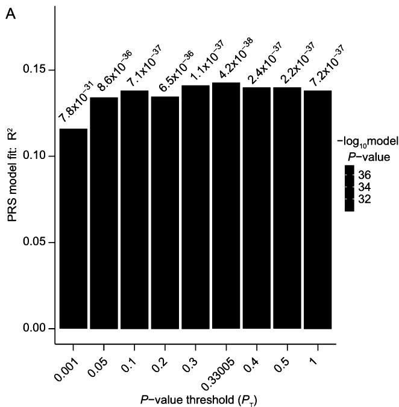
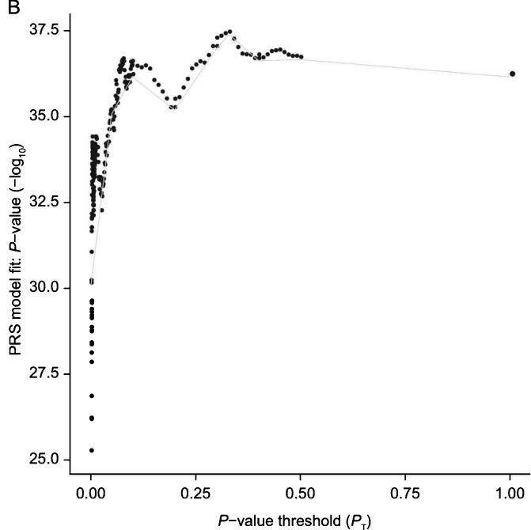
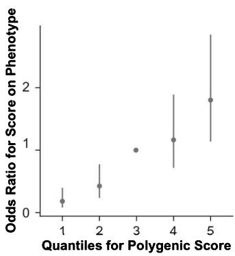
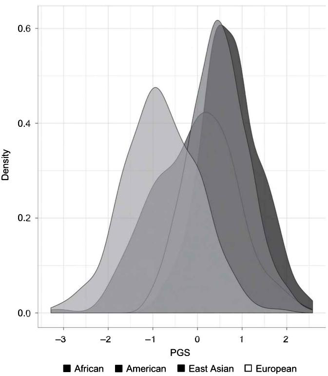

# An Applied Guide to Creating and Validating Polygenic Scores

## Objectives

• Recall the basics of polygenic scores (PGSs) 

- Understand how to construct a “monogenic” score 

• Comprehend and engage in the seven steps of the pruning and threshold method 

• Understand and calculate a PGS using PRSice 2.0 

• Have the ability to validate PGSs 

• Grasp how to account for linkage disequilibrium (LD) in calculating PGSs using LDpred 

• Comprehend the error of applying PGSs across ancestry groups 

• Understand when to consider pruning and threshold or an LD weights-based PGS 

## 10.1 Introduction

## 10.1.1 Creating a polygenic score

Recall from part I of this book and the detailed discussion in chapter 5 that most of the traits that we examine are polygenic in nature. For this reason, the majority of contemporary analyses in this area of research now apply polygenic scores. A polygenic score (PGS) is an index that aggregates the estimated effects of individual SNPs on the trait of interest. It captures an individual's genetic predisposition to a phenotype. To reiterate from chapter 5, we define a polygenic score for an individual as the weighted sum of a person's genotypes at M loci. A PGS for individual i can be calculated as the sum of the allele counts $a_{ij}$ (0, 1, or 2) for each SNP j = 1, … M, multiplied by a weight $w_{j}$ : 

$$
P G S _ {i} = \sum_ {j = 1} ^ {M} a _ {i j} w _ {j}
$$

where weights $w_{j}$ are transformations of genome-wide association studies (GWASs) coefficients. A polygenic score is therefore a linear combination of the effects of multiple SNPs on the trait of interest. The underlying model in a PGS is usually additive since we count the number of “risk alleles” for each SNP included in the score, although recessive or dominant models can be used in the construction of a PGS. As noted earlier, we adopt the terminology of score and not risk since many of the outcomes we study are also behavioral and would be awkwardly formulated in a risk framework. An additional assumption is the absence of gene-gene interactions (or epistasis) since SNP effects are assumed to be independent. 

In order to create a PGS, you require summary statistics that are calculated from a GWAS of your trait of interest and the individual-level genotype data (a PLINK binary file, or other formats) in which you would like to apply your PGS. See the Further reading section of this chapter for the location of where you can download summary statistics. As discussed in chapter 4, the GWAS summary statistics should not include the same data that are used for calculating the PGS, which would introduce additional bias leading to overfitting. When constructing a PGS, there are two main decisions: 

## 1. Which (and how many) SNPs will be used to construct the score?

## 2. What weights will be used?

This chapter examines these choices in more detail and provides some hands-on examples on how to compute a PGS for various traits. 

There are two main methodologies used in the literature to select SNPs and their weights in a PGS. The first is called the pruning and thresholding method, which uses the pruning techniques described in chapter 9 (section 9.3). The software used for this method are PLINK, R, or PRSice [1] (which combines pruning and thresholding into a single procedure). The second methodology we show uses Bayesian methods and takes into account the linkage disequilibrium (LD) structure of the data to construct a score. The software used for this technique is called LDpred [2]. Although we will discuss both approaches in this chapter, we dedicate more attention to the former since it is currently the most widely used and very flexible to accommodate multiple research requirements. Other methods, in particular new methods that use machine learning approaches, are also emerging in the literature. Although this goes beyond the scope of this introductory approach, we list additional software at the end of this chapter and address some of these more advanced and emerging techniques in the concluding chapter 15 of this book. The expectation is that readers will have already read the detailed introduction of PGS in chapter 5 and preceding chapters on how to work with genetic data and PLINK. This chapter focuses directly on the estimation of PGS with other chapters in this book outlining important discussions such as the clinically applicability of PGSs, the use of PGSs in Mendelian Randomization (MR), and gene-environment interaction research. 

## 10.1.2 Data used in this chapter

As with the other chapters, all of the data that you will use in this chapter is available on the companion website to this book (http://www.intro-statistical-genetics.com). To summarize, you will need the following data files, some of which were used in previous chapters. 

- 1kg_hm3_qc 

- score_rs9930506.txt 

- BMI.txt 

- BMI_pheno.txt 

- Obesity_pheno.txt 

• 1kg_EU_qc 

- pca.eigenvec 

- 1kg_samples.txt 

• BMI_score_MULTIANCESTRY.best 

- BMI_LDpred.txt 

• BMI_pheno_LDpred.txt 

## 10.2 How to construct a score with selected variants (monogenic)

Polygenic scores are usually constructed by assembling the effects of thousands or more genetic variants across the entire genome. It is possible, however, to construct a polygenic score with far fewer variants. The most extreme case would be to use a single variant. In that case, the term polygenic is not appropriate. For this reason we term it monogenic where in this special case, M = 1 and the weights $w_{ij}$ are not necessary. The polygenic score is in this case a list of allele counts, or in other words, a list of 0, 1, 2. In other words, this simple score is the count of a specific allele for each individual. It makes sense to count the alleles that increase the risk of a particular disease, which is why we often refer to the “risk alleles” in the construction of a polygenic score. 

This simple score can be constructed in PLINK by using the command --score. This command requires an external file containing the SNP number, the allele to be counted, and a weight. We created a file called score _rs9930506.txt containing only the following elements in one line: rs9930506 G 1 (SNP id; risk allele; weight). rs9930506 is a genetic variant in the FTO gene, and the G allele has been associated with increased risk of obesity. Since we are working with a single variant, we assign the weight equal to 1. When running the syntax, keep in mind that commands can differ by operating system—see box 8.1. 

```shell
./plink --bfile 1kg _ hm3 _ qc \
--score score _ rs9930506.txt 1 2 3 \
--pheno BMI _ pheno.txt \
--out 1kg _ FTOscore 
```

The --score command in PLINK requires an external file that has the following information: variant identifier (rs number in most of the SNPs), reference allele (the allele that will be counted in the PGS), and weight (often the Beta coefficients in a GWAS). We also added a phenotype using the --pheno option, which is in the file BMI _ phenot.txt. The file used in the example contains only one row: 

rs9930506 G 1 

The --score command also requires the user to specify the column used in the external file to calculate the PGS. In this case the columns are 1 (SNP id), 2 (reference allele), and 3 (weight). 

The result is a file called 1kg_FTOscore.profile as specified in the --out option in the previous command. It consists of 6 columns and N (number of people genotyped) rows. The first two rows (FID and IID) indicate the family and the individual IDs, the third column (PHENO) contains the phenotype, the fourth column (CNT) indicates the number of possible allele counts taking into consideration missing genotypes, while the fifth (CNT2) is the risk allele count. Finally, the last column (SCORE) indicates the ratio between the previous two columns, that is our mono-genic score. 

head 1kg _ FTOscore.profile 

<table><tr><td>FID</td><td>IID</td><td>PHENO</td><td>CNT</td><td>CNT2</td><td>SCORE</td></tr><tr><td>0</td><td>HG00096</td><td>25.0228</td><td>2</td><td>1</td><td>0.5</td></tr><tr><td>0</td><td>HG00097</td><td>24.8536</td><td>2</td><td>2</td><td>1</td></tr><tr><td>0</td><td>HG00099</td><td>23.6893</td><td>2</td><td>1</td><td>0.5</td></tr><tr><td>0</td><td>HG00100</td><td>27.0162</td><td>2</td><td>0</td><td>0</td></tr><tr><td>0</td><td>HG00101</td><td>21.4616</td><td>2</td><td>0</td><td>0</td></tr><tr><td>0</td><td>HG00102</td><td>20.6736</td><td>2</td><td>0</td><td>0</td></tr><tr><td>0</td><td>HG00103</td><td>25.7151</td><td>2</td><td>0</td><td>0</td></tr><tr><td>0</td><td>HG00104</td><td>25.2522</td><td>2</td><td>0</td><td>0</td></tr><tr><td>0</td><td>HG00106</td><td>22.765</td><td>2</td><td>0</td><td>0</td></tr></table>

It is important to understand that some individuals may not be genotyped on that specific SNP. In that case the correct value of the polygenic score is missing, not zero. By assigning zero to individuals with a missing genotype, we assign the same value of being homozygous on the other allele. PLINK takes this into account by counting the number of possible alleles. 

## 10.3 Pruning and thresholding method

The so-called pruning and thresholding method is the most commonly used technique to construct a PGS and can be summarized in the following steps. We first summarize the steps and then explain each turn in detail. 

1. Obtain GWAS summary statistics from a large discovery sample. 

2. Obtain independent sample(s) that has genome-wide data. 

3. Align and select SNPs in common between the two samples. 

4. Select independent SNPs by pruning based on LD. 

5. Restrict to SNPs with a p-value that is lower than a certain threshold. 

6. Construct PGS by summing up risk alleles weighted by betas from the summary statistics. 

7. Evaluate strength of this association by regressing the phenotype on the PGS. 

The method can be used to calculate a score based on any number of genetic variants, including all SNPs. It takes into account the LD structure of the data by selecting independent SNPs to avoid oversampling of more densely genotyped SNPs. For more information on accounting for the LD structure, refer back to chapter 3 (section 3.6, “Linkage disequilibrium and haplotype blocks”) and chapter 9 (section 9.3, “Linkage disequilibrium,” and within that section the discussion of LD pruning). 

Step 1. Obtain GWAS summary statistics from a large discovery sample Obtaining summary statistics is essential to define PGS and set up weights and define risk alleles. We described why you need to use a large discovery sample in chapter 5 and where you can obtain these summary statistics in chapter 7 and in the “Further reading and resources” section of this chapter. 

Step 2. Obtain independent sample(s) that have genome-wide data Once you have the summary statistics, you will then need to locate genetic sample(s) that can be used to calculate the score. In chapter 7 we provided information about some of the most commonly used human genomic datasets used until now in this area of research. Also, on our GitHub site that accompanied the recent review of all GWASs [3], we produced a list of datasets that have been used in the largest GWAS collaborative samples (see also the "Further reading and resources" section). $^{1}$ Central to finding an appropriate dataset is, of course, ensuring that the data has measured the particular phenotype(s) that you are interested in studying. There are many biomedical datasets, some of which were collected to measure a particular disease. Some of the most frequently used studies are broadly phenotyped and contain many measurements. Since many journals now require you to replicate your results, most scientific publications now use more than one dataset to replicate results, particularly when the samples are small. 

As we elaborated upon in detail in chapter 5 in our introduction to PGSs, when selecting your data it is also important to note that the target sample—which is the genotyped sample you will use—should be not too different from the baseline sample. The baseline sample is the sample or the collection of studies that has been used to calculate the original summary statistics of the GWAS you will use. As we have discussed at length in previous chapters, ancestry composition should not differ too much between the baseline and the target sample. If allele frequencies of the SNPs used in the score differ too much between the two samples, this will result in a very imprecise score that cannot be used for any further analysis, even for highly heritable traits. These problems were discussed previously in chapter 3 (section 3.3, “Population structure and stratification”). Using the summary statistics for the phenotype of interest that you obtained in the previous step, it is then possible to examine the genotyped SNPs and weighting of the number of alleles to obtain a PGS for each individual in the sample. 

Step 3. Align and select SNPs in common between the two samples This step is to ensure that SNPs are measured consistently in the baseline and target sample. The alleles reported in the summary statistics should thus be the same as in the genotype data. Unfortunately, this is not always the case. Different genotyping platforms (see chapter 7, section 7.2) may report different alleles for the same SNP. In the case of a mismatch, it is sometimes possible to align SNPs by “flipping” the alleles. In some other cases (see box 10.1), this is not possible, and it is recommended to drop ambiguous alleles from the calculation of the score. Another issue is that the list of SNPs available in the two samples could be different. GWAS summary data typically include both genotyped and imputed data, while this may not be the case for the available genetic data. Different QC criteria may have also filtered out different SNPs. This step, therefore, is to ensure that you select SNPs that are available in both samples. 

Step 4. Select independent SNPs by pruning based on LD (optional) To avoid the oversampling of a region of the genome that is more densely genotyped, it is recommended to select only independent SNPs (see previous discussions on LD). Although this step is optional, using independent SNPs gives more robust results. This is due to the fact that you avoid basing the PGS on specific regions of the DNA without any substantive reason other than genotype density. In other words, we want to avoid double counting causal variants. 

To select independent SNPs, two main approaches can be used: 

1. Pruning is a statistical procedure that selects one random SNP per LD block. 

2. Clumping, instead, selects the SNP with the lowest p-value association in each LD block. 

Both pruning and clumping can be performed in PLINK and are included in the PRSice package we describe shortly. Since we are interested in the most predictive SNPs, clumping 

Box 10.1 Flipping alleles and ambiguous alleles 

As you learned in the chapter 1, DNA is organized in a double-helix structure composed of four bases: adenine (A), thymine (T), cytosine (C), and guanine (G). Adenine pairs with thymine and cytosine with guanine, forming a sequence organized in two strands such as this: 

Chromosome 1 

Chromosome 2 

Strand 1: ATCTGGTACTCCAT 

Strand 1: ATCTGGCACTCCAT 

Strand 2: TAGACCATGAGGTA 

Strand 2: TAGACCGTGAGGTA 

A SNP indicates a position in the DNA sequence where there is a variation in the population, and it is indicated by the possible alleles. In the example above, the individual genotype in Strand 1 is TC, but if we refer to Strand 2 it is AG (usually strands are called + and −). 

Unfortunately, sometimes the strand information is not available. This may be problematic if the base and target data were generated using different genotyping chips and the chromosome strand is unknown. The problem is limited when SNPs have the following variants: A/C; A/G; C/T; T/G. For example, if a SNP in the base sample is A/C and T/G in the target, we know that they are simply measured on different strands since T is the complement of A and G the complementary base of C. If this is the case, we need to flip the alleles in the base sample by swapping the A with T or C with G. By doing so we ensure that the SNPs are coded consistently across the two samples. Most polygenic score software can automatically perform this flipping. 

This is more difficult in the case of the so-called ambiguous SNPS, which are SNPs with the following alleles: A/T and C/G. In this case, it is not possible to say whether the base and target data are referring to the same allele or not. Here we can use allele frequencies to infer the matching alleles. For instance, if in our baseline sample we have an A as a minor allele with a frequency of 5% and the target sample has the same allele frequency for the T allele, we can flip the alleles. However, allele frequencies provided in baseline GWAS results are often those from resources such as the 1000 Genomes project. This means that aligning alleles according to their frequency could lead to systematic biases in PGS analyses. A common solution adopted in the construction of genome-wide PGSs is therefore to remove completely ambiguous SNPs. 

is preferred since it selects the most statistically significant variant in the locus. For both procedures, we need to provide some parameters indicating the LD window and the $r^{2}$ threshold. The recommended clumping $r^{2}$ is between 0.5 and 0.7. An $r^{2}$ window that is too small would drop potential causal SNPs, while one that is too large would allow too much “double counting.” The LD window defines the distance after which we suppose that variants are statistically independent. A common choice for the LD window is 1Mb (see chapter 1, section 1.1.3: a megabase [Mb] is a measure of the length of a genome segment). 

Step 5. Restrict to SNPs with a p-value lower than a certain threshold A frequent and vital question is: how many SNPs do we need to use to construct a PGS? The answer depends on multiple factors. A common approach is to select SNPs based on the p-value of the association within the summary statistics. We can decide to select only GWAS significant SNPs $(p\text{-value} < 5 \times 10^{-8})$ or at the other extreme, select all SNPs $(p\text{-value} \leq 1)$ . The choice depends on the phenotype and the type of application you will conduct. A guideline—which is certainly not exhaustive—is to consider the choice in terms of the level of polygenicity of the trait and the goal of your research. You may recollect from figure 1.3 that there is a spectrum of genetic contributions to a phenotype. Generally speaking, stricter p-value thresholds are more suitable for traits that are not polygenic while more lenient thresholds perform the best for polygenic traits. The aim of your research will also shape your decision. If the goal is to maximize prediction, having more SNPs would be the better choice. However, the more variants that are included in the calculation, the greater the risk that you include unnecessary “noise” in the PGS. In other words, you are likely to include many variants that are not causal. As we describe in box 10.2, most phenotypes are highly polygenic. In general, you will have more predictive results when you include all of the SNPs in the calculation of PGSs for highly polygenic traits. 

As we discussed in chapter 6, the use of these scores in gene-environment (G×E) interaction studies is even more complex. In G×E studies we are interested in genetic variants that have a differential effect across different environments. As we explored in previous chapters, some have opted to select a single variant in the FTO gene to demonstrate how birth cohort interacts with genetic predisposition in relation to obesity [6]. Others have opted to use all alleles in their prediction. Barcellos and colleagues [5], for instance, did not impose any p-value threshold in their recent publication. They used the PGS for years of education [7] in interaction with a one-year increase in compulsory education via an econometric technique called regression discontinuity. By comparing individuals before and after the educational reform, they found that differences in health outcomes due to 

Box 10.2 

## Prediction and inclusion of SNPs for highly polygenic traits

As we have argued throughout this book, many of the traits under study and particularly behavioral traits are in fact highly polygenic. PGSs allow us to combine millions of tiny effects that are scattered across the genome. A classic example of a highly polygenic trait is human height. Height, particularly in many Western and European countries, has been shown to be highly heritable at around 80%, with 90% of the variance attributed to additive genetic effects [8]. In 2007, Peter Visscher and colleagues [9] showed that there is a linear relationship between chromosome length and heritability decomposed by chromosome (CIT). In other words, the longer the chromosome, the more variation it explains in adult height. They found that additive genetic variance was spread across multiple chromosomes and that around six chromosomes (3, 4, 8, 15, 17, 18) were responsible for the observed variation. Subsequent studies have confirmed that height is the product of many genes across the entire genome (see also box 1.2 for the discussion of the PGSs in the case of 7'6" former NBA star Shawn Bradley). For these highly polygenic traits it is almost impossible to select a small number of SNPs to create a polygenic score. 

genetic propensity were reduced among the more educated. They concluded that education reduced health risks later in life. 

Step 6. Construct PGS by summing up risk alleles weighted by betas from summary statistics In this sixth step, the PGSs are calculated. This can be constructed in PLINK, or as we will see in the next section, in PRSice. 

Step 7. Evaluate strength of this association by regressing phenotype on PGS A final and important step is to evaluate the explanatory or “predictive” power of a PGS. We note that prediction is a misleading term here since we are actually usually interested in understanding how much variability can be explained by including a PGS in a model. In other words, our aim is generally to try to describe the trait in the best way that we can. In this sense, we therefore want to understand the additional gain of including a PGS in a statistical model. A standard procedure is to include population stratification variables (for example the first 10 or 20 principal components) and other covariates in a model. The most frequent manner to describe how much variance is explained by a PGS is to run a regression model, with the phenotype as dependent variable and the PGS as independent variable, and calculate the $R^{2}$ . We will show you how to do this in the next chapter. 

The interpretation of $R^{2}$ is that it is the proportion of variance explained by the regression model. When using covariates, it is common to estimate the gain in $R^{2}$ in two steps. First, we estimate a regression model with covariates but without a PGS. In the second step, we add the PGS to the models and estimate the differences in the $R^{2}$ from the two models. Since the statistical distribution of the $R^{2}$ is not a standard one, it is not possible to estimate a confidence interval unless we use nonparametric statistical techniques such as bootstrapping. $^{2}$ For binary traits, the approach is very similar, but instead of estimating a series of linear regression models, we estimate logistic regression models and report the gain in pseudo- $R^{2}$ . Alternatively, it is possible for binary traits to estimate the area under the curve as a measure of accuracy of the PGS to explain the phenotype. 

## 10.4 How to calculate a polygenic score using PRSice 2.0

In this section we provide a hands-on exercise on how to calculate a PGS using PRSice 2.0 (pronounced as “precise”), software based on R and PLINK for calculating, applying, evaluating, and plotting the results of PGS analyses. PRSice requires two sets of information: a list of summary statistics called base data, and a genotype file in PLINK format called target data. If you would like to actively follow this tutorial, you will first need to install PRSice on your computer. (See appendix 1 for more information on software installation.) Once it is installed, go to the directory where the software is installed and type: ./PRSice to view all of the available parameters. Note that depending on your operating system the downloaded files might have different extensions (i.e., PRSice _ linux, PRSice _ mac, PRSice _ win32.exe, or PRSice _ win64.exe). Please adapt the syntax accordingly or rename the respective file, deleting the _OS extension to execute the PRSice commands in this book. 

## A genome-wide polygenic score for continuous phenotype

The code below is used to calculate a polygenic score for BMI with no p-value thresholds or, in other words, using all available SNPs. The software automatically aligns the target dataset to the base and performs clumping to avoid double counting of SNPs in LD. Finally, it then calculates a PGS for all the individuals in the target dataset. 

```shell
Rscript PRSice.R --dir . \
--prsice ./PRSice \
--base BMI.txt \
--target 1kg _ hm3 _ qc \
--snp MarkerName \
--A1 A1 \
--A2 A2 \
--stat Beta \
--pvalue Pval \
--pheno-file BMI _ pheno.txt \
--bar-levels 1 \
--fastscore \
--binary-target F \
--out BMI _ score _ all 
```

To explain each of the commands above, we decompose it into various sections. 

Setting up the directory and the commands This chunk of code informs your computer about the location of the working directory and the PRSice files. We remind readers of the potential differences in commands that may arise operating systems (recall box 8.1). 

```powershell
Rscript PRSice.R --dir . \
--prsice ./PRSice \ 
```

Setting up the base and target files The next lines are used to set up the base and target files. As with the previous exercises using PLINK, it easiest to have all of the files in the same directory. These two files thus need to be in the same working directory where you are also executing PRSice. 

```txt
--base BMI.txt \
--target 1kg _ hm3 _ qc \ 
```

Input file columns Here we specify the column names of the base file. Alternatively, it is possible to specify the column's numbers if the base file has no header. 

```txt
--snp MarkerName \
--A1 A1 \
--A2 A2 \
--stat Beta \
--pvalue Pval \ 
```

p-value thresholds and phenotype setup The last part of the code informs PRSice about which file is the phenotype (--pheno-file) and what p-value thresholds (--bar-levels 1) are used in the calculation of the PGS. In this case, we want to calculate only one score with all SNPs thereby specifying (p-value ≤ 1). The option --fastcore is used to calculate the score only at the p-value thresholds that were specified above, while the option --binary-target F is used to indicate that the phenotype is not binary. Finally, the standard option --out gives the prefix to the output files 

```shell
--pheno-file BMI _ pheno.txt \
--bar-levels 1 \
--fastscore \
--binary-target F \
--out BMI_score_all 
```

## Output

PRSice produces several outputs. In this example, the output files are as follows: 

1. A summary file BMIscore_all1.summary. This file includes information on the number of SNPs used in the score and the $R^{2}$ of the PGS. For the PGS that we just calculated, it is based on 118,033 SNPs (after clumping) and explains 13.78% of the variance in BMI. 

2. A log file BMIscore _ all1.log contains a log of the operations performed by PRSice. 

3. A “.prsice” file contains a summary for each of the p-value thresholds specified in the command. 

4. A “best” file contains the most accurate PGS. In this case, as we calculated a single score, this is equivalent to a value of the PGS for each individual in the target sample. 

5. A “.png” file with a barplot of $R^{2}$ for the different p-value thresholds. 

PRSice has many options, and we are unable to examine all of them here. Below we have chosen some of the most relevant ones. 

## Input files

Base dataset As you know, to run PRSice, we need to provide a base dataset. The dataset needs to be whitespace delimited and in a compressed format. The required information for the base file is: effective allele (--A1), effect size estimates (--stat), p-value for association (--pvalue), and the SNP ID (--snp). We can specify which column of the base file is used in the calculation of the score by specifying them in the PRSice command. In the situation where the input file does not contain a header, columns can be specified using their positions and the --index option. For example, the parameters for a base file with the following columns is --snp SNP --chr CHR --bp BP --A1 A1 --A2 A2 --stat OR --se SE --pvalue P. 

<table><tr><td>SNP</td><td>CHR</td><td>BP</td><td>A1</td><td>A2</td><td>OR</td><td>SE</td><td>P</td></tr><tr><td>rs3094315</td><td>1</td><td>752566</td><td>A</td><td>G</td><td>0.9912</td><td>0.0229</td><td>0.7009</td></tr><tr><td>rs3131972</td><td>1</td><td>752721</td><td>A</td><td>G</td><td>1.007</td><td>0.0228</td><td>0.769</td></tr><tr><td>rs3131971</td><td>1</td><td>752894</td><td>T</td><td>C</td><td>1.003</td><td>0.0232</td><td>0.8962</td></tr></table>

Target dataset Two different target file formats are supported by PRSice: 

1. PLINK Binary files (.bed, .bim., .fam files). Note that the .bed and .bim file must have the same prefix. If the binary file is separated into individual chromosomes, then a # can be used to specify the location of the chromosome number in the file name. PRSice will automatically substitute # with 1–22. 

2. BGEN files contain information on imputation uncertainty. PRSice currently supports BGEN v1.1 and v1.2. To specify type of file you need to specify the option --type bgen or --ld-type bgen. If this is not specified, then PRSice will use dosage information to compute the score. 

Phenotype If a phenotype is included in the .fam file (it is possible to calculate the polygenic score without providing a phenotype), the option --pheno-file can be used to specify the name of the phenotype file. The file must include in the first two columns of the family ID (FID) and the individual ID (IID). The third column contains the actual phenotype. Missing values are specified with NA or -9 (only for binary phenotypes). 

## Clumping

By default, PRSice will perform clumping to remove SNPs that are in LD with each other. Clumping parameters can be changed by using the --clump-kb, --clump-r2, and --clump-p options. Clumping can likewise be disabled by using --no-clump. When the target sample is small (e.g., < 500 samples), an external reference panel can be used to improve the LD estimation for clumping using the option --ld. The default values for clumping are: --clump-kb 250 (PRSice will clump any SNPs that are within 250 kb to both ends of the index SNP, that is a 500 kb window); --clump-r2 0.1 and --clump-p 1. Refer to the previous chapter for a more detailed discussion of LD pruning. By default, PRSice will perform clumping to remove SNPs that are in LD with each other. Clumping parameters can be changed by using the --clump-kb, --clump-r2, and --clump-p options. Clumping can likewise be disabled by using --no-clump. 

## p-value thresholding

If you do not specify it, PRSice will automatically calculate the PGS for different p-value thresholds. It will then also perform a regression to test the level of association of the PGS with your phenotype. If you desire to run an iterative model that specifies the testing of different p-value thresholds, you need to specify the interval steps using the options --interval to select the step size of the threshold, and --lower to set the starting p-value threshold. If we are interested in specific p-value thresholds, it is possible to specify them using the option --bar-levels together with --fastscore. The following options, for example, can be used to calculate the PGS at the p-value thresholds: $5 \times 10^{-08}$ , $5 \times 10^{-07}$ , $5 \times 10^{-06}$ , $5 \times 10^{-05}$ , $5 \times 10^{-04}$ , $5 \times 10^{-03}$ , 0.05, 0.5. 

--bar-levels 5e-08,5e-07,5e-06,5e-05,5e-04,5e-03,5e-02,5e-01 \
--fastscore \ 

## Graphical outputs

PRSice will also produce a barplot showing the $R^{2}$ of the fitted model, shown in figure 10.1, and the p-value threshold that we indicated by the command --bar-levels. If you prefer not to produce this plot, you can specify the command --fastscore. 

## Additional options

The option --model can be used to select the genetic model used for regression. Other available models include additive, recessive, dominant, and heterozygous-only model. The option --cov-col can be used to include covariates in the calculation of the polygenic score. 

## Examples

We now provide some examples of how to calculate a PGS using PRSice. 




B





Figure 10.1


Example of PRSice graphical outputs indicating model fit of PGS using different p-value thresholds.

Note: Panel A shows the $R^{2}$ associated with different p-value thresholds. The figures on top of the bars in the left panel report the p-value of a statistical test where the null hypothesis is no association between the PGS and the phenotype. Small values indicate that the PGS is statistically significant. Panel B is a high-resolution plot that shows how predictive the different PGSs are, calculated using multiple thresholds. Higher values in the y-axis indicated higher prediction of the associated models. The model with the best prediction is the one using a p-value threshold of 0.33005.


Example 1. Polygenic scores using specific p-value thresholds; no phenotype specified


```shell
Rscript PRSice.R --dir . \
--prsice ./PRSice \
--base BMI.txt \
--target 1kg _ hm3 _ qc \
--thread 1 \
--snp MarkerName \
--A1 A1 \
--A2 A2 \
--stat Beta \
--pvalue Pval \
--bar-levels 5e-08,5e-07,5e-06,5e-05,5e-04,5e-03,5e-02,5e-01 \
--fastscore \
--all-score \
--no-regress \
--binary-target F \
--out BMIscore _ thresholds 
```

Since we specified the option --no-regress above and did not include any phenotype, PRSice will not perform any regression nor will it calculate an $R^{2}$ . The option --all-score produces a new output file called BMIscore_thresholds.all.score with a score calculated at each p-value threshold (see below the first 10 rows of this output file). 

```txt
head BMIscore _ thresholds.all.score 
```

```csv
FID IID 5e-08 5e-07 5e-06 5e-05 0.0005 0.005 0.05 0.5 1
0 HG00096 -0.000479696398 -0.000463195405
-0.000355091714 -0.000250196117 -0.000169979944
-0.000102162973 -6.57848378e-05 -3.28632122e-05
-2.4984115e-05
0 HG00097 -0.000661353581 -0.000657264373
-0.000460262493 -0.000359052436 -0.000245826021 
```

```csv
-0.000158377441 -0.000103819954 -5.01441736e-05
-3.75733909e-05
0 HG00099 -0.000609108165 -0.000603264372
-0.00044481341 -0.000327043764 -0.000196803709
-0.00012038489 -8.2112866e-05 -4.14073939e-05
-3.13310687e-05
0 HG00100 -0.000396331442 -0.00044547127
-0.000338678054 -0.000258639555 -0.000165711959
-0.000101754557 -7.16410241e-05 -4.21387148e-05
-3.09468542e-05
0 HG00101 -0.000692441503 -0.000715379318
-0.000546631881 -0.000372120148 -0.000243275257
-0.000140449583 -9.25905804e-05 -4.83711745e-05
-3.64876774e-05 
```


Example 2. Polygenic scores using interval p-value thresholds; quantile graph included


```txt
Rscript PRSice.R --dir . \
--prsice ./PRSice \
--base BMI.txt \
--target 1kg _ hm3 _ qc \
--thread 1 \
--snp MarkerName \
--A1 A1 \
--A2 A2 \
--stat Beta \
--pvalue Pval \
--pheno-file BMI _ pheno.txt \
--interval 0.00005 \
--lower 0.0001 \
--quantile 5 \
--all-score \
--binary-target F \
--out BMIscore _ graphics 
```

In this example, we calculated different scores on an interval of p-value thresholds. We also include an additional graph that is a quantile plot showing the changes in the phenotype associated with different levels of PGS (see figure 10.2). 




Figure 10.2


Quantile plot from PRSice. 

Note: The plot shows changes in phenotype related to different quantiles (in this case 5 quantiles) of the calculated polygenic scores. Bars represent 95% confidence intervals. Higher quantiles are associated with positive changes in the phenotype. 

Example 3. Polygenic scores on a binary outcome using interval p-value thresholds; no clumping We now calculate a PGS for a binary phenotype. In the example below, we reclassified the BMI phenotype into binary categories (0 if BMI $\leq$ 30; 1 if BMI >30) to mirror the definition of clinical obesity. Note that the quantile plot now reports an odds ratio on the y-axis, since the phenotype is a binary variable. 

```shell
Rscript PRSice.R --dir . \
--prsice ./PRSice \
--base BMI.txt \
--target 1kg _ hm3 _ qc \
--thread 1 \
--snp MarkerName \
--A1 A1 \
--A2 A2 \
--stat Beta \
--pvalue Pval \
--no-clump F \
--pheno-file Obesity _ pheno.txt \
--interval 0.00005 \
--lower 0.0001 \
--quantile 5 \
--all-score \
--binary-target T \
--out Obesity _ score _ graphics 
```

## 10.5 Validating the PGS

PRSice may also be used to validate your PGS. In many cases, however, it may be useful to import the scores into another software (for instance R) and run additional checks or to run different models, for instance, gene-environment interaction models (see also chapter 11 on applications of PGS). For this reason, we now import the files and continue further in RStudio. 

## Importing scores into R and standardizing scores

We can use the scores calculated in the file .all.score or .best to import and examine them further using RStudio. Since the scale of the PGS highly depends on the number of SNPs used in the score (its weighted allele count), PGSs are usually not directly comparable. It is therefore common to standardize the PGS by subtracting the mean and dividing the score by the standard deviation. Since it is the sum of independent random variables, the score will be approximately normal (see box 5.1). We can then merge the scores with the phenotypes and the covariates such as principal components. Note that lines that start with the symbol # are not commands but rather notes to explain what each command is doing. 

```r
In RStudio
# Import external data
data<-read.table("BMIscore_thresholds.all.score", header=T)
# Show first rows of data
head(data)
# Calculate new standardized variable
data$PGS=(data$X1-mean(data$X1))/sd(data$X1, na.rm=T)
# Plot histogram of the polygenic score
hist(data$PGS)
# Import external data with phenotype
pheno _ BMI<-read.table("BMI _ pheno.txt", header=T)
# Merge the two datasets
data.with.pheno<-merge(data, pheno _ BMI, by="IID") 
```

## Run a regression model with covariates

Once you have imported the scores and merged them with the phenotype and covariates, it is possible to run regression models in RStudio and calculate how much of the variability of BMI is explained by including a PGS. 

```r
In RStudio
# Run a linear regression model
mod1<-(lm(BMI~PGS, data=data.with.pheno))
summary(mod1) 
```

Which results in the following output: 

```txt
Call:
lm(formula = BMI ~ PGS, data = data.with.pheno)

Residuals:
Min 1Q Median 3Q Max
-7.9255 -1.8779 0.0327 1.8886 9.7165

Coefficients:
Estimate Std.Error tvalue Pr(>|t|)
(Intercept) 25.00000 0.08432 296.50 <2e-16***
PGS 1.11510 0.08436 13.22 <2e-16 ***
Signif. codes: 0 '***' 0.001 '**' 0.01 '*' 0.05 '.' 0.1 ' ' 1

Residual standard error: 2.786 on 1090 degrees of freedom
Multiple R-squared: 0.1382, Adjusted R-squared: 0.1374
F-statistic: 174.7 on 1 and 1090 DF, p-value: <2.2e-16 
```

## Retrieve the model $R^2$

summary(mod1) $r.square$ [1] 0.1381616 

Results show that one standard deviation of the PGS (remember that the score was standardized) is associated with a 1.11 unit increase in BMI. The regression coefficient is statistically significant with a p-value lower than $2 \times 10^{-16}$ . The $R^{2}$ of this regression is 

0.13, meaning that more than 13% of the variability of BMI can be explained by regressing the phenotype on the PGS. 

```txt
In RStudio
# Create a vector with column names
columns=c("FID", "IID", "pca1", "pca2", "pca3", "pca4",
"pca5", "pca6", "pca7", "pca8", "pca9", "pca10")
# Read external data with PCAs
pca<- read.table(file="pca.eigenvec", sep = "", header=F,
col.names=columns)[,c(2:12)]
# Merge file with covariates with the rest of the file
data.with.covars<-merge(data.with.pheno,pca, by="IID")
# Estimate new linear regression model
mod2<-lm(BMI~PGS+pca1+pca2+pca3+pca3+pca5+pca6+pca7+pca8+
pca9+pca10, data=data.with.covars)
# Calculate R-squared
summary(mod2)$r.square
[1] 0.1443324 
```

As described throughout the book, population stratification may have a strong effect on many traits and needs to be accounted for. We therefore merge the dataset with the principal components calculated in the previous chapter and re-estimate the model. The result for this new model shows that the $R^{2}$ is now larger (14% variance explained), meaning that population stratification matters in explaining part of the variance in BMI—even in an homogenous population with European ancestry. We are therefore interested in calculating how much of the variance is explained by the PGS, net of the first 10 principal components. To do this, we can calculate the differential in the $R^{2}$ in the following way: 

In RStudio
# Estimate linear regression model
mod2.no.pgs<-update(mod2, ~ . - PGS)
# Estimate difference in R-squared
print(summary(mod2) $r.square-summary(mod2.no.pgs)$ $r.square$ )
[1] 0.08409551 

The differential $R^{2}$ is 0.08, meaning that, net of population stratification (first 10 components), the additional proportion of variance explained by the PGS is about 8%. We note that since this is a simulated dataset; this would be a relatively extreme example. 

It is important, however, to also produce confidence intervals on this differential $R^{2}$ . Because the statistical distribution is not known, it is necessary to use nonparametric statistical techniques such as bootstrap. Below we build a small function in R that calculates confidence intervals for the differential $R^{2}$ . 

```r
In RStudio
# Install new package in R to perform bootstrap
install.packages("boot")
library(boot)
set.seed(12345)

# Define new function to calculate differential R-squared.
# The following commands define the new function
rsq <- function(formula, PGS=PGS, data, indices) {
    d <- data[indices,]
    fit1 <- lm(formula, data=d)
    fit2 <- update(fit1, ~ . + PGS)

return(summary(fit2)$r.square-summary(fit1)$r.square)
} 
```

Now that we have created this new R function, it can be used to calculate the incremental $R^{2}$ . 

```r
# bootstrapping with 1000 replications
results <- boot(data=data.with.covars, statistic=rsq,
    R=1000, formula=BMI~pca1+pca2+pca3+pca3+pca5+pca6+pca7
+pca8+pca9+pca10, PGS=PGS)
boot.ci(results, type="norm") 
```

The results of the incremental $R^{2}$ are as follows: A 95% confidence interval based on 1,000 bootstrap replications is (0.0560, 0.1133), meaning that the PGS, net of population stratification, explains between 5% and 11% of the variance in BMI. 

```txt
BOOTSTRAP CONFIDENCE INTERVAL CALCULATIONS
Based on 1000 bootstrap replicates
CALL:
boot.ci(boot.out = results, type = "norm")
Intervals:
Level Normal
95% (0.0564, 0.1124)
Calculations and Intervals on Original Scale 
```

Why polygenic scores cannot be applied across different ancestry groups: An example

In chapter 3, when we discussed human dispersal out of Africa and population structure and stratification, we clarified why we cannot apply PGS that have been derived from one ancestry group directly to another ancestry group (see section 3.3.3 and box 3.2). To clarify why this is problematic, we now estimate an example. Instead of calculating the PGS on the European-ancestry sample only, from which it was derived, we now (incorrectly) calculate it on the entire 1000 Genomes sample with PRSice. We then merge the data with the geographical information from 1000 Genomes and estimate a regression model for the African subsample. 

```r
In RStudio
# Import external data with multi-ancestry information
data<-read.table("BMIscore_MULTIANCESTRY.best", header=T)
head(data)
# Calculate standardized PGS
data$PGS=(data$PRS-mean(data$PRS))/sd(data$PRS, na.rm=T)
data.with.pheno<-merge(data,pheno_BMI, by="IID")
# Import dataset with geographical information (ancestral populations)
geo<-read.table(file="1kg_samples.txt", sep="\t", header=T)[, c(1,4,5,6,7)]
names(geo)[1]<-"IID"
# Create a vector with new column names
columns=c("FID", "IID", "pca1", "pca2", "pca3", "pca4", "pca5", "pca6", "pca7", "pca8", "pca9", "pca10") 
```

```r
# Import external data with PCAs
pca<- read.table(file="pca.eigenvec", sep="" , header=F, col.names=columns)[,c(2:12)]

# Merge information with covariates and ancestral information
data.with.covars<-merge(data.with.pheno,pca, by="IID")
data.with.geo<-merge(data.with.covars,geo, by="IID")

# Fit a linear regression model
mod.AFR<-lm(BMI~PGS, data subset(data.with.geo, Superpopulation.name == "African"))

summary(mod.AFR)$r.square
[1] 0.03478307 
```

The model explains only 3% of the variance for individuals of African ancestry (compared to 12% for European ancestry). If we control for population stratification, the additional $R^{2}$ is 0.022 for individuals of African ancestry, with 95% confidence intervals that are overlapping zero, meaning that they are not significantly different from the null hypothesis. In other words, the PGS does not explain the variance of BMI among individuals with African ancestry at all. 

```r
In RStudio
# Run bootstrap function to estimate increased R-squared results <- boot(data=subset(data.with.geo, Superpopulation.name== "African"), statistic=rsq,
    R=1000, formula=BMI~pca1+pca2+pca3+pca3+pca5+pca6+pca7+pca8+pca9+pca10, PGS=PGS)
boot.ci(results, type="norm") 
```

```txt
BOOTSTRAP CONFIDENCE INTERVAL CALCULATIONS
Based on 1000 bootstrap replicates
CALL:
boot.ci(boot.out = results, type = "norm")
Intervals:
Level Normal
95% (-0.0118, 0.0528)
Calculations and Intervals on Original Scale 
```




Figure 10.3


Distribution of PGS for BMI for different continental ancestry groups.


Note that our simulated data based on GWAS results from the GIANT consortium (see appendix 2) have a very small sample size for an actual genetic study. Nevertheless, they teach an important lesson. Due to the factors discussed previously, such as differences in genetic diversity (section 3.3, box 3.1) and different LD structure and underlying distribution of scores, it is not correct to simply estimate cross-ancestry PGSs. In figure 10.3 we show the statistical distribution of a PGS for BMI across different populations based on the 1000 Genomes data. 

The scores are far from being homogeneous across groups and differ substantially. This has strong implications in the use of polygenic scores as a diagnostic tool in health and other research, for instance, as described in the recent work by Martin and colleagues $[10]$ . As noted elsewhere (see, for example box 3.2 and 14.1), those who do not warrant a citation have also attempted to falsely apply PGSs derived from European ancestry to traits such as intelligence and cognitive ability across different ancestry groups. They then falsely claim that the lower predictive value of the PGS has an inherent value that can be interpreted, which is patently incorrect. 

## 10.6 LDpred: Accounting for LD in polygenic score calculations

## 10.6.1 Introduction and three steps

Another popular approach to calculate PGS is to use the package LDpred [2]. LDpred is a Python-based software package that adjusts GWAS summary statistics for the effects of LD (see https://github.com/bvilhjal/ldpred and appendix 1). Rather than selecting independent SNPs with clumping (or pruning), this approach uses the entire correlation structure of the data. In practice, LDpred is a different way to estimate the weights $wj$ —using a Bayesian approach—that was shown in the equation at the start of this chapter. Although we do not delve into any detail in this introductory book, the method assumes a point-normal mixture prior for the distribution of effect sizes $^{3}$ and takes into account the correlation structure of SNPs by estimating the LD patterns from a reference sample of unrelated individuals. The weight for each variant is set to be equal to the mean of the posterior distribution (approximated via Monte Carlo Markov Chain MCMC $^{4}$ simulation) after accounting for LD. LDpred requires an assumption about the fraction of SNPs that are truly associated with the outcome. A common choice for polygenic traits, followed in this book and many studies, is to assume that all of the SNPs are associated with the outcome of interest. Calculation of PGSs in LDpred is conducted in three steps: 

1. Coordinate the base file and the target file, making sure that the same SNPs are selected and the alleles are aligned. 

2. Calculate the posterior distribution or, in other words, recalculation of the weights using simulation methods. 

3. An optional step is the calculation of the score using the new weights. Note that this step is not strictly necessary since the score could be calculated in PLINK or PRSice (excluding clumping). 

Since LDpred is software that is written in Python, you will need to install Python on your computer (see appendix 1) in addition to three packages as well as installing the master files for LDpred. Detailed instructions are included in appendix 1. To run the code presented in the last part of this chapter, we assume that the LDpred software is installed in a folder called ldpred and that Python 3 is installed in your system and can be invoked by typing python --version in your terminal. If this is the case, you should see the following output on your computer screen. 

```batch
python --version
Python 3.6.7:: Anaconda, Inc. 
```

If Python 2 is active in your system, please refer to the instructions in appendix 1 on how to switch between different versions of Python. 

In the previous section describing PRSice, we used a small simulated dataset. For this section we now apply LDpred to a more realistic example. Here we use the summary statistics for BMI and calculate a polygenic score on the 1000 Genomes sample. 

Step 1. Coordinate files The first step of LDpred coordinates the base and the target file. The base file contains information on summary statistics that are used to define the weights used in the PGS calculation. We created a test file (BMI _ LDpred.txt) that has the following columns: Chromosome number (chr), base position (pos), reference allele (ref), alternative allele (alt), reference allele frequency (ref), imputation quality (info), marker name (rs), pvalue (pval), and beta (effalt). 

head BMI _ LDpred.txt 

<table><tr><td>chr</td><td>pos</td><td>ref</td><td>alt</td><td>reffrq</td><td>info</td><td>rs</td><td>pval</td><td>effalt</td></tr><tr><td>chr12</td><td>126890980</td><td>A</td><td>G</td><td>.2401</td><td>1</td><td>rs1000000</td><td>.95999998</td><td>-.0000999999997</td></tr><tr><td>chr4</td><td>21618674</td><td>C</td><td>T</td><td>.49340001</td><td>1</td><td>rs10000010</td><td>.94</td><td>.0000999999997</td></tr><tr><td>chr3</td><td>183635768</td><td>T</td><td>C</td><td>.4763</td><td>1</td><td>rs1000002</td><td>.0013</td><td>.0055</td></tr><tr><td>chr4</td><td>95733906</td><td>G</td><td>T</td><td>.38519999</td><td>1</td><td>rs10000023</td><td>.0071999999</td><td>.0046999999</td></tr><tr><td>chr3</td><td>98342907</td><td>G</td><td>A</td><td>.1794</td><td>1</td><td>rs1000003</td><td>.23</td><td>-.0029</td></tr><tr><td>chr4</td><td>139599898</td><td>C</td><td>T</td><td>.47889999</td><td>1</td><td>rs10000033</td><td>.048999999</td><td>.0034</td></tr><tr><td>chr4</td><td>38924330</td><td>A</td><td>G</td><td>.2296</td><td>1</td><td>rs10000037</td><td>.75</td><td>-.00060000003</td></tr><tr><td>chr4</td><td>165621955</td><td>G</td><td>T</td><td>.1478</td><td>1</td><td>rs10000041</td><td>.81</td><td>-.00060000003</td></tr><tr><td>chr4</td><td>17348363</td><td>C</td><td>T</td><td>.26910001</td><td>1</td><td>rs10000081</td><td>.13</td><td>.003</td></tr></table>

LDpred needs slightly more information than PRSice. The various types of formats are listed in the accompanying software webpage (https://github.com/bvilhjal/ldpred). There is a good chance, however, that your data are not in the format that may be required. If this is the case, you will first need to rearrange and reformate the data using other software such as R or Stata. The target file is a PLINK binary set of files (see chapter 7). 

First, ensure that you are in the directory where LDpred is installed. Then type the following command, which will present all of the options that are available to coordinate the base file and phenotype: 

```batch
python ldpred/LDpred.py coord --help 
```

The command shows all of the options that can be used in LDpred. This step requires at least one genotype file that will be used as the LD reference. The software developers recommend that you use at least 1,000 unrelated individuals with the same ancestry composition as the individuals for which summary statistics datasets are obtained from. It is also possible to use another genotype to validate the predictions using a separate set of genotypes. 

The most important information required by the command are: --gf followed by the prefix of a target genotype file; --ssf followed by a file containing summary statistics; --N indicating the sample size used in the summary statistics; --out followed by the prefix of the coordinated output file; and --ssf-format=STANDARD, which indicates that the summary statistics are in the standard file format. This command will produce a file called BMI _ldpred _coord that will be used later in the second step of the analysis. 

```shell
python ldpred/LDpred.py coord \
--gf=1kg _ EU _ qc \
--ssf=BMI _ LDpred.txt \
--ssf-format=STANDARD \
--N 500000 \
--out BMI _ ldpred _ coord 
```

Step 2. Calculate LDpred weights Once you have coordinated the base and the target file, it is then necessary to calculate the weights that will be used in the PGS calculation. At this time the LD structure is also taken into account in the calculation of the weights. There are two ways to account for LD structure in LDpred. First, by providing a reference file with LD scores, or second, by calculating it from the target dataset. In this example we calculate the LD scores from the target dataset. 

Warning! This command can take up to several hours, depending on LD radius and the number of SNPs. The following command can be typed to explore all the options available in this step: 

```batch
python ldpred/LDpred.py gibbs --help 
```

The following options then need to be specified next in this step: 

--cf followed by the coordinated file calculated in step 1; 

--ldr with the LD radius used to calculated the weights (the recommended number is the number of SNPs used in the analysis divided by 3,000; 

--f with fraction of causal SNPs; 

--ldf indicating the prefix of the newly generated LD file based on the LD radius; 

--out with the prefix of the output file. 

In this example, we specified the fraction of causal SNPs equal to 1, meaning that we think that all SNPs have a contribution in BMI. This is used by LDpred to set up the prior distribution. It is possible to provide several values for --f, and several models will be used in the calculation. 

```shell
python ldpred/LDpred.py gibbs \
--cf BMI_ldpred_coord \
--ldr 240 \
--ldf 1kg_bmi \
--f 1 \
--N=500000 \
--out BMI_weights_LD 
```

This example produces three output files: 1kg _ BMI _ ldradius240.pickled.gz with the LD scores and two files containing LD weights: BMI _ weights _ LD _ LDpred _ p1.0000e+00.txt and BMI _ weights _ LD _ LDpred-inf.txt. LDpred produces a weight file for each value of --f specified (in this case only one), in addition to a baseline file based on an infinitesimal model, $^{5}$ where all SNPs are assumed to have an infinitesimal contribution to the calculation of the score. 

Attention! It can take several hours to compute LD weights, and the resulting file can be very large. The output file 1kg _ BMI _ ldradius240.pickled.gz is 1.77 GB, and larger LD radius will produce even larger files. For this reason you may not want to run this command, and we provide a version of the prepared LD weights file on the companion website to this book (http://www.intro-statistical-genetics.com). 

The content of the output files is shown below by examining the first few lines. The columns are: chrom, pos, and sid, indicating chromosome number, base position, and marker name, respectively; nt1 and nt2 indicating reference and alternative alleles; raw _ beta reporting the original association statistics; and finally ldpred _ beta with the calculated LDpred weights. 

```batch
head BMI_weights_LD_LDpred_p1.0000e+00.txt 
```

<table><tr><td>chrom</td><td>pos</td><td>sid</td><td>nt1</td><td>nt2</td><td>raw_beta</td><td>ldpred_beta</td></tr><tr><td>chrom_1</td><td>1005806</td><td>rs3934834</td><td>T</td><td>C</td><td>2.3262e-03</td><td>6.2367e-04</td></tr><tr><td>chrom_1</td><td>1017587</td><td>rs3766191</td><td>T</td><td>C</td><td>3.1698e-03</td><td>9.9807e-04</td></tr><tr><td>chrom_1</td><td>1018704</td><td>rs9442372</td><td>A</td><td>G</td><td>-4.1348e-04</td><td>-4.0554e-05</td></tr></table>

```txt
chrom_1 1021346 rs10907177 G A -3.2391e-03 -1.3566e-03  
chrom_1 1021415 rs3737728 A G -3.1074e-03 -6.5916e-04  
chrom_1 1021695 rs9442398 A G -3.1921e-03 -7.5797e-04  
chrom_1 1048955 rs4970405 G A -7.0124e-04 -3.0608e-04  
chrom_1 1053452 rs4970409 A G 1.0217e-03 4.0224e-04  
chrom_1 1060608 rs17160824 A G 1.0449e-03 4.4812e-04 
```

Step 3. Calculate the LD scores In the last step, the PGS is then calculated using the option score. As in the previous steps, we can list all of the options by adding --help at the end of the command: 

```batch
python ldpred/LDpred.py score --help 
```

The necessary options are: --gf, which specifies the prefix of the target genotype data files; --rf, indicating the prefix of the SNP weights file; --pf, which directs to an external file with individual IDs and phenotypes; and --out, which can be used to specify the name of the output file. The following example is used to calculate the scores: 

```shell
python ldpred/LDpred.py score \
--gf 1kg _ EU _ qc \
--rf BMI _ weights _ LD \
--pf BMI _ pheno _ LDpred.txt \
--rf-format LDPRED \
--out BMI _ score _ LD 
```

The command produces a series of outputs with the scores calculated according to the various model specifications. Below is the output file for the model where we assumed that the proportion of causal SNPs in the data is equal to 1. The columns are: IID, with the person identifier; true _ phens, with the original phenotype; raw _ effects _ prs, with the polygenic score using the original weights; and pval _ derived _ effects _ prs, the PGS calculated using the LD weights. 

```batch
head BMI_score_LD_LDpred_p1.0000e+00.txt 
```

```csv
IID, true phens, raw effects prs, pva derived effects prs
HG00096, 2.502283e+01, -9.098944e-01, 1.979399e+00
HG00097, 2.485364e+01, -2.628862e+00, 1.076786e+00
HG00099, 2.368930e+01, -1.494926e+00, 1.853949e+00
HG00100, 2.701620e+01, -9.014597e-01, 1.507434e+00
HG00101, 2.146162e+01, 1.456715e-01, 2.083895e+00
HG00102, 2.067364e+01, -5.346663e-01, 2.053100e+00
HG00103, 2.571508e+01, -4.152090e-01, 1.790609e+00
HG00104, 2.525224e+01, -3.725402e-01, 1.642239e+00
HG00106, 2.276505e+01, -6.815518e-01, 1.639680e+00 
```

An alternative way to calculate polygenic scores from LD-based weights is to apply the PLINK command used in section 10.1 to calculate the score starting from the output files obtained in step 2. This is particularly useful when you do not have the phenotype files. The scores can be calculated as follows (3 4 7 indicate the columns for marker name, reference allele and LD weight; header uses the first raw of the file as file header): 

```txt
./plink --bfile 1kg_EU_qc \
--score BMI_weights_LD_LDpred_p1.0000e+00.txt 3 4 7 header \
--out scores_BMI_LD 
```

## 10.7 Conclusion

The intention of this chapter was to provide practical guidance on how to construct and examine polygenic scores. We reviewed the basic structure of a polygenic score, starting from the selection of variants and then extending it to the use of summary statistics of genome-wide polygenic scores. A secondary intention of this chapter was to also include a collection of good practices for the estimation of polygenic scores. There are several ways to construct and use polygenic scores (e.g., prediction, G×E model, causal analyses), and it is important for the researcher to choose which method is the most suitable for a particular research question. 

After showing the reader two different ways—PRSice and LDpred—to create PGS, your obvious question is: which method should we use? The two methods are complementary and based on slightly different methodology. PRSice is a pruning and thresholding method that selects independent SNPs and calculates the score based on association statistics. LDpred is software based on a Bayesian approach that calculates LD-based weights that can be used to construct PGS. LDpred can give more precise estimates of PGS and increase prediction accuracy, but only under certain circumstances. 

For the general calculation of PGS, we tend to recommend PRSice over LDpred in many instances for the beginning researcher for the following reasons. First, LDpred requires a very careful QC of the reference file and small genotyping issues may affect substantially the calculation of LD scores. Genetic ancestry in summary data needs to be consistent with the target file in LDpred, otherwise biases are introduced in the calculation of the PGS. Second, it is recommended to use large genotyping files (at least 1,000 individuals). In our example, we used data from the CEU ancestry (Utah residents with Northern and Western European ancestry) of 1000 Genome consisting of only 379 individuals. Third, we need to make some assumptions on the prior distribution that are not always straightforward. This information relates to the proportion of causal SNPs included in the sample. A possible solution (recommended by the software developers) is to estimate different models with different priors and select the model with the best performance. Lastly, the calculation of LD weights is computationally intensive and requires adequate computer power. However, it is vital to note that LDpred has superior prediction performances when using summary statistics from large summary statistics when applied to large datasets. 

## Exercises


1. Use PRSice to replicate examples 1, 2, and 3 for the following phenotypes: height, age at menarche, and educational attainment. The phenotypic files are available in the textbook website: http://intro-statistical-genetics.com/data. 


2. Use RStudio to calculate the $R^2$ of the polygenic scores calculated in the previous exercise. 

3. Use RStudio to reproduce figure 10.3. 

## Further reading and resources


Euesden, J., C. M. Lewis, and P. F. O'Reilly. PRSice: Polygenic risk score software. Bioinformatics 31(9), 1466–1468 (2014). 


Maier, R. M. et al. Embracing polygenicity: A review of methods and tolls for psychiatric genetics research. Psych. Med. 48(7), 1055–1067 (2018). 


Maier, R. M. et al. Improving genetic prediction by leveraging genetic correlations among human diseases and traits. Nat. Comm. 9, 989 (2018). 


Vilhjálmsson, Bjarni J. et al. Modeling linkage disequilibrium increases accuracy of polygenic risk scores. Amer. J. of Hum. Gen. 97(4), 576–592 (2015). 


## Web references

LDpred: https://github.com/bvilhjal/ldpred. 

List of top genetic data used on GitHub site accompanying Mills and Rahal (2019): https://github.com/crahal/GWASReview/blob/master/tables/Manually_Curated_Cohorts.csv. 


Polygenic scores from the Health & Retirement Study: http://hrsonline.isr.umich.edu/index.php?p=shoavail&iyear=ZA. 


Polygenic scores from the Wisconsin Longitudinal Study: https://www.ssc.wisc.edu/wlsresearch/documentation/GWAS/. 

PRSice-2: https://choishingwan.github.io/PRSice/. 


1000 Genomes project data: https://www.cog-genomics.org/plink/1.9/resources. 


Video Why are polygenic scores important? Broad Institute, https://www.broadinstitute.org/videos/why-are-polygenic-risk-scores-important. 

## GWAS summary statistics

The Atlas of GWAS summary statistics includes a database of publicly available summary statistics at: https://atlas.ctglab.nl/. 

The NHGRI-EBI Catalog (https://www.ebi.ac.uk/gwas/summary-statistics) also contains summary statistics. 

## References


1. J. Euesden, C. M. Lewis, and P. F. O'Reilly, PRSice: Polygenic risk score software. Bioinformatics 31(9), 1466–1468 (2014). 


2. B. J. Vilhjálmsson et al., Modeling linkage disequilibrium increases accuracy of polygenic risk scores. Am. J. Hum. Genet. 97, 576–592 (2015). 


3. M. C. Mills and C. Rahal, A scientometric review of genome-wide association studies. Commun. Biol. 2 (2019), doi:10.1038/s42003-018-0261-x. 


4. K. Watanabe et al., A global view of pleiotropy and genetic architecture in complex traits. bioRxiv (2019), doi:10.1101/500090. 


5. S. H. Barcellos, L. S. Carvalho, and P. Turley, Education can reduce health differences related to genetic risk of obesity. Proc. Natl. Acad. Sci. 115, E9765–E9772 (2018). 


6. J. N. Rosenquist et al., Cohort of birth modifies the association between FTO genotype and BMI. Proc. Natl. Acad. Sci. USA 112, 354–359 (2015). 


7. J. J. Lee et al., Gene discovery and polygenic prediction from a genome-wide association study of educational attainment in 1.1 million individuals. Nat. Genet. 50, 1112–1121 (2018). 


8. A. R. Wood et al., Defining the role of common variation in the genomic and biological architecture of adult human height. Nat. Genet. 46, 1173–1186 (2014). 


9. P. M. Visscher et al., Genome partitioning of genetic variation for height from 11,214 sibling pairs. Am. J. Hum. Genet. 81, 1104–1110 (2007). 


10. A. R. Martin et al., Human demographic history impacts genetic risk prediction across diverse populations. Am. J. Hum. Genet. 100, 635–649 (2017). 


Applications and Advanced Topics 

# Polygenic Score and Gene-Environment Interaction (G×E) Applications