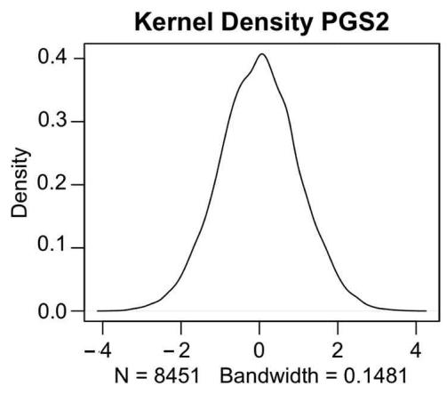
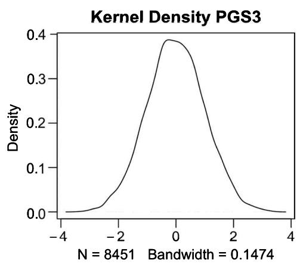
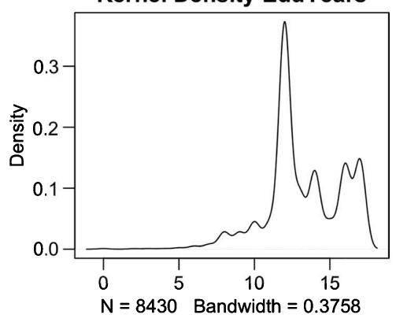
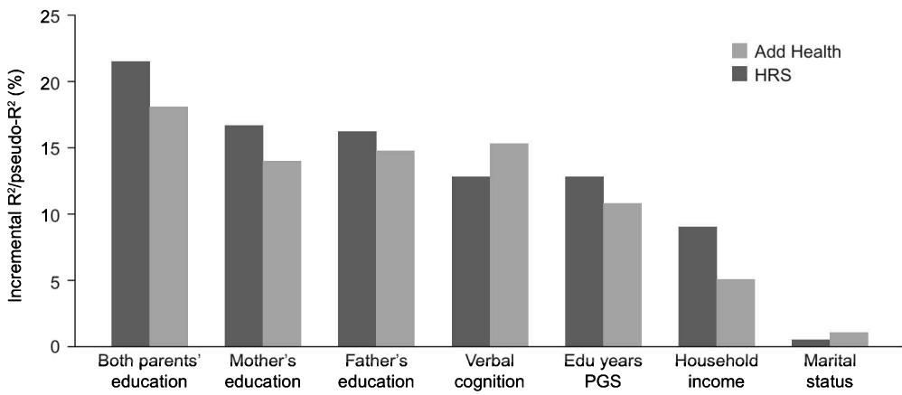
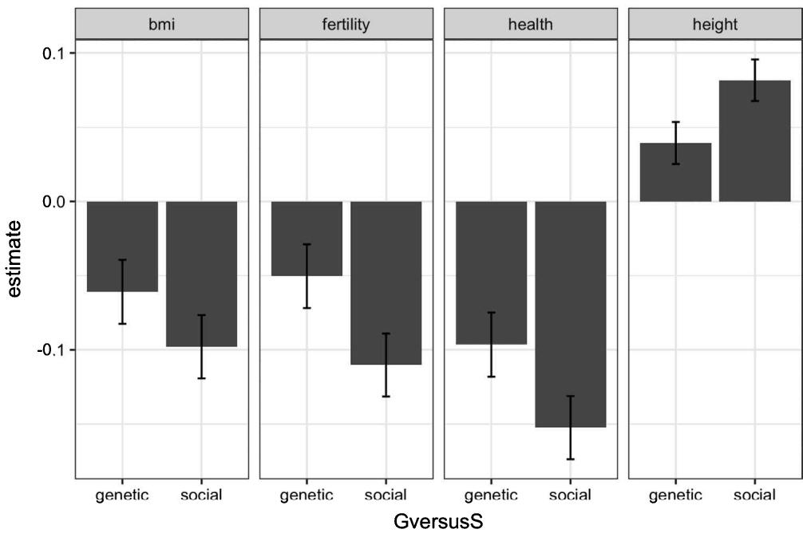
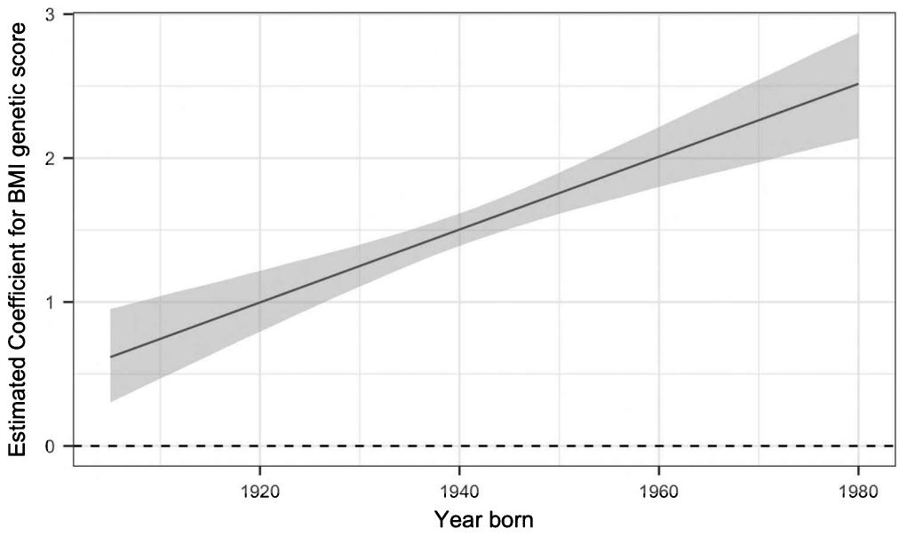
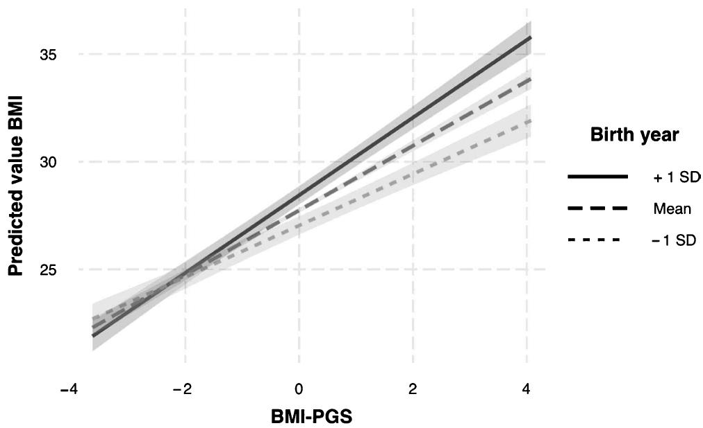
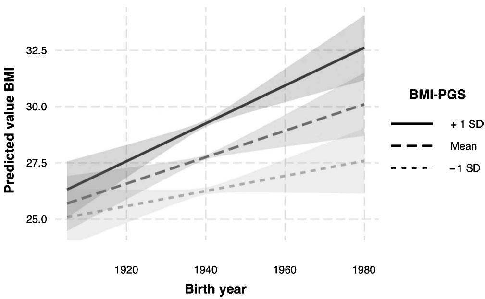

## Objectives

- Understand and be able to conduct out-of-sample prediction using polygenic scores (PGSs) 

• Perform cross-trait prediction and estimate genetic covariation using PGSs 

• Understand and estimate genetic confounding using PGSs 

- Engage in an applied analysis of gene-environment interaction of BMI×Birth Cohort using an interaction model 

- Understand and correct for interaction dependence on scaling metric and show interaction effects by subgroups 

- Grasp the central methodological and statistical concerns of these models including measuring the environment, the importance of main effects, environmental confounding, and lack of diversity of samples 

## 11.1 Introduction

Until now, we have introduced readers to the basic theory and concepts underpinning applied statistical genetic research; provided a background of genetic discovery, data types, and management; and explained how to construct a polygenic score (PGS). Armed with this basic knowledge, it is now possible to learn how to apply these skills. The aim of this chapter is to provide hands-on experience on how to conduct statistical analyses using PGSs, model gene-environment interaction and understand challenges within this area of research. Building on the previous chapters (specifically chapters 5, on how to construct PGSs, and 6, on G×E), we will first provide examples of some basic PGS analyses including out-of-sample prediction, cross-trait prediction, genetic covariation, and genetic confounding. We then focus on gene-environment (G×E) interaction models, with an applied example of body mass index (BMI)×Birth Cohort, and explore the basic conceptual and statistical concerns. The final section expands our discussion from chapter 6 and describes some of the methodological challenges in G×E research and potential solutions. 

In part II of this book we used small and simulated datasets to enable you to focus on the commands and analyze data quickly. To ensure that the examples in this textbook are as realistic as possible to allow you to independently carry out your own research, we opted to use a publicly available dataset, which is the U.S. Health and Retirement Study (HRS) (for a description, see chapter 7, box 7.1). A detailed description of how to obtain this data is provided in appendix 2 at the end of this book. The HRS is an excellent and widely used data source that contains both genetic information but also a rich variety of social and phenotypic data. It is also a large sample of more than 37,000 individuals from around 23,000 households and representative for the U.S. population aged 50+ and household members/spouses. Of those, PGS information is available for around 12,090 individuals. Attractive features of this data include that it is longitudinal—individuals have been interviewed at multiple points in time—and it provides prepared PGSs for several traits together with the publicly available phenotypic data. While it is still very important to learn how to generate a polygenic score (as discussed in chapter 10), the inclusion of expertly prepared PGSs by the HRS staff ensures that you can confidentially use them for your analyses. Ensure that you follow the instructions in appendix 2 and use the datafile named hrs_GePhen_uni, which contains 8,451 individuals and more than 10,000 variables (which may change over time with each new data update), before embarking upon this analysis. 

## 11.2 Polygenic score applications: (Cross-trait) prediction and confounding

In chapter 10 we showed how to construct a PGS using different techniques, such as the LDPred and PRSice software [2]. By default, PRSice produces prediction results for the PGSs as well as goodness-of-fit statistics in addition to other outputs. You also learned how to read the generated scores into RStudio. Equipped with this knowledge, we will now show you how to flexibly integrate PGSs into your (causal) modeling. While chapter 10 was based on data from the 1000 Genomes Project and simulated phenotypes, we now use real data (HRS) in order to reproduce or replicate a selected number of findings in the literature. Please note that results may at times differ from the published studies that we replicate. This is due to the fact that we might engage in slightly different—and simplified—analytical strategies as well as the fact that the HRS data is regularly updated and thus may have slightly altered from the original study. 

## 11.2.1 Out-of-sample prediction

In this first exercise, we will show you how to perform out of sample prediction of a phenotype using the HRS data. Out-of-sample prediction is based upon selection of single-nucleotide polymorphisms (SNPs) obtained via a genome-wide association study (GWAS) via validation (prediction) on an independent sample that also has the same phenotype [3]. We focus on educational attainment (years of education) because there are two different scores currently available in the HRS data at the time of writing this book. The first is from the 2016 GWAS by Okbay et al. [4] and the second is from the 2018 GWAS by Lee et al. [5]. The main difference between the two studies is the sample sizes, which was around 350,000 in the 2016 study and increased to over 1.1 million individuals in 2018. As shown in chapter 4 (figure 4.4), there was a sharp growth in published GWAS sample sizes, with this 2018 study being one of the largest to date as of the end of 2018. The increased sample size meant substantial increases in both the discovery rate of SNPs as well as the predictive power of the PGS. 

We first predict the phenotype years of education based on both PGSs from the 2016 and 2018 study. These are sometimes referred to in the literature as EA2 (i.e., educational attainment 2) for the 2016 score and EA3 for the 2018 score because these were the second and third EA GWASs that were conducted. As we noted in our introduction to PGSs in chapter 5, if you plan to engage in prediction, it is essential that the data that you are using is an independent sample or, in other words, was not included in the original GWAS [3]. In our example, although HRS did participate in both GWASs, the score we use—and all HRS PGSs—exclude HRS from the GWAS meta-analysis, which the score construction is based on. Using these scores also provides us with the opportunity to validate the findings from the GWAS and evaluate the missing heritability issue for educational attainment (see chapter 1, section 1.6.4). 

In the data set we created, we have 8,451 observations and more than 10,000 variables (see appendix 2). Since we will not use a majority of the variables in this chapter, we first generate a subset of variables to use in our prediction model, with the R code provided below. The model we are interested in can be expressed as follows: 

$$
E d u Y e a r s = \mu + \beta_ {P G S \_ e d u} P G S _ {e d u} + \gamma \mathbf {Z} + \varepsilon
$$

Where $\mu$ is an intercept, $\beta_{PGS\_edu}$ estimates the effect of the PGS for education $PGS_{edu}$ on the observed phenotype years of education (EduYears), $\gamma$ represents a vector of estimates for a vector of control variables Z, which include in our case sex, birth year, and the first five to 10 principal components. The predictive power of the PGS can be evaluated as the incremental $R^{2}$ of the PGS, which we obtain if we compare the $R^{2}$ from this equation with the one from a model without the score, or in other words: 

## EduYears=μ+γZ+ε

For a better overview, we first extract the variables that we actually need from the larger file. It is perhaps important to note the naming conventions of the variables in HRS. In general, the first character indicates whether the variable refers to the reference person ("r"), spouse ("s"), or household ("h"). The second character indicates the wave to which the variable pertains: "1"–"10" or "A" for all waves. We, for example, need education measured in years (edyrs), from the reference person (r), and this is the same across all waves (a) since the sample is of older individuals, so the variable is named: raedyrs. 

Also note that if you read the data in from alternative software packages, the letters in the variable names might appear as capitalized. We also extract two PGSs from the data, which as noted earlier, is from Okbay et al. 2016 [4] (ea_pgs3_edu2_ssgac16) and Lee et al. 2018 [5] (ea_pgs3_edu2_ssgac16) as well as birth year (rabyear), gender (ragender), and the first 10 principal components (pc1_a-e and pc6_a-e). 

```txt
### Generate a subset of variables for the prediction exercise
# Define the variables for subset

vars_prediction <- c("raedyrs","ea_pgs3_edu2_ssgac16","ea_pgs3_edu3_ssgac18","rabyear","ragender","pc1_5a","pc1_5b","pc1_5c","pc1_5d","pc1_5e","pc6_10a","pc6_10b","pc6_10c","pc6_10d","pc6_10e")

### Create subset of data
### Follow the instructions in Appendix 2 to create the dataset hrs_GePhen_uni
data_prediction <- hrs_GePhen_uni[vars_prediction] 
```

Our new dataset is thus called: data_prediction. Whenever you generate a new dataset, it is always good to first examine the data to get a grasp of the value ranges, mean level, and distributions. It is also important to check whether there are errors or anomalies, which can happen in even the most expertly curated data sources. For example, it is useful to produce some basic summary statistics and simple density plots. As with the previous chapters, all commands are listed first and all output is shown in as shaded in gray. 

```txt
### We first generate some descriptive statistics for the data
# output is shown as shaded in gray
# First, generate some summary statistics for (in ####)
summary(data_prediction$raedyrs)    ### education years
Min. 1st Qu. Median Mean 3rd Qu. Max. NA's
0.00 12.00 13.00 13.22 16.00 17.00 21 
```

```txt
d_PGS2
<- density(data_prediction$ea_pgs3_edu2_ssgac16)
plot(d_PGS2, main="Kernel Density PGS2") 
```




d _ PGS3





d_EduYears <- density(data_prediction$raedyrs, na.rm=T)
plot(d_EduYears, main="Kernel Density EduYears")


Kernel Density EduYears





We see that people stayed on average for 13.22 years in education, with a minimum of 0 and a maximum of 17 years. Importantly, 21 observations have missing values here (NAs), so we should not be surprised if they are removed from the analysis. It is also important to consider these missing values in subsequent R commands. Individuals in our HRS sample are born between 1905 and 1980, with a median birth year of 1939 and a mean of 1940. 

Gender takes values of 1 and 2, with men coded as 1. The mean of this variable is 1.55, so around 55% of the sample consists of women. 

Another important aspect to note is that the mean value of the education PGSs is close to 0. This is attributed to the fact that the PGSs are standardized (as discussed in chapter 10). This means that for each individual's value, the variable mean has been subtracted and the results were divided by the standard deviation. If you ask to view the standard deviations of the scores, you will see that they are close to 1 (type, for example: sd(data _ prediction$ea _ pgs3 _ edu3 _ ssgac18, na.rm=TRUE) and the result will be =0.999). 

You will also see that, as we discussed in chapter 5, the PGSs are almost perfectly normally distributed (see box 5.1 for an explanation). The distribution of educational years looks slightly less elegant and, in fact, somewhat left skewed. There are several ways that we could adjust various distributions of the dependent variable, but since this is not the focus of this book and not essential to our exercise, we leave the distribution intact. 

The final step is to engage in the actual estimation of the out-of-sample prediction. Below we show how we estimate three linear regression models with all covariates and the PGS for education from the 2016 GWAS, all covariates and the PGS from the 2018 GWAS, and one with only covariates. 

```r
#### Estimation of statistical models
# Model 1: Edu = PGS2 + Cov

predic_control_PGS2 <- lm(raedyrs~ ea_pgs3_edu2_ssgac16+rabyear+ragender +pc1_5a+pc1_5b+pc1_5c+pc1_5d +pc1_5e++pc6_10a+pc6_10b+pc6_10c+pc6_10d+pc6_10e, data = data_prediction)
# Model 2: Edu = PGS3 + Cov

predic_control_PGS3 <- lm(raedyrs~ ea_pgs3_edu3_ssgac18+rabyear+ragender +pc1_5a+pc1_5b+pc1_5c+pc1_5d +pc1_5e++pc6_10a+pc6_10b+pc6_10c+pc6_10d+pc6_10e, data = data_prediction)
# Model 3: Edu = Cov

predic_control <- lm(raedyrs~ rabyear+ragender +pc1_5a+pc1_5b+pc1_5c+pc1_5d+pc1_5e++pc6_10a+pc6_10b+pc6_10c+pc6_10d+pc6_10e, data=data_prediction) 
```

We use the arrow <- sign to save the results of the regression models in the objects predic _ control _ PGS2, predic _ control _ PGS3, and predic _ control, which we can later inspect. To examine the results, use the summary() command. 

```txt
### Results for Model 1: Edu = PGS2 + Cov
summary(predic_control_PGS2)

Call:
lm(formula = raedyrs ~ ea_pgs3_edu2_ssgac16 + rabyear + ragender + pc1_5a + pc1_5b + pc1_5c + pc1_5d + pc1_5e + pc6_10a + pc6_10b + pc6_10c + pc6_10d + pc6_10e, data = data_prediction)

Residuals:
Min 1Q Median 3Q Max
-14.1182 -1.4157 -0.2347 1.8519 6.3742

Coefficients:
Estimate Std. Error t value Pr(>|t|)
(Intercept) -66.053976 4.260222 -15.505 < 2e-16 ***
ea_pgs3_edu2_ssgac16 0.608594 0.027135 22.429 < 2e-16 ***
rabyear 0.041196 0.002193 18.783 < 2e-16 ***
ragender -0.409135 0.052715 -7.761 9.40e-15 ***
pc1_5a 24.217770 2.827632 8.565 < 2e-16 ***
pc1_5b -11.578142 2.854081 -4.057 5.02e-05 ***
pc1_5c -6.268370 2.877701 -2.178 0.0294 *
pc1_5d -5.975963 2.880325 -2.075 0.0380 *
pc1_5e -1.527099 2.869198 -0.532 0.5946
pc6_10a -1.832483 2.900183 -0.632 0.5275
pc6_10b 2.883569 2.858018 1.009 0.3130
pc6_10c 4.604652 2.869050 1.605 0.1085
pc6_10d -3.448237 2.888447 -1.194 0.2326
pc6_10e 2.365389 2.852679 0.829 0.4070
---
Signif. codes: 0 '***' 0.001 '**' 0.01 '*' 0.05 '.' 0.1 ' ' 1
Residual standard error: 2.399 on 8416 degrees of freedom (21 observations deleted due to missingness)
Multiple R-squared: 0.1139, Adjusted R-squared: 0.1125
F-statistic: 83.22 on 13 and 8416 DF, p-value: < 2.2e-16 
```

Examining the regression coefficients first, we see that the PGS for the 2016 educational attainment study is a highly significant predictor of years of education (p-value<2e-16). The regression coefficient is 0.608594 meaning that for an increase of 1 standard deviation in the educational attainment PGS score, schooling increases more than 7 (0.6×12) months. We know from the educational literature that more recent birth cohorts have substantially higher years of education (p-value<2e-16) [6]. In this dataset, men stay significantly longer in education than women (p-value<9.40e-15; coding: men=1, women=2). The first four principal components also show significant effects. This implies that within the European ancestral population in the United States, ancestry-based allele frequencies are associated with educational attainment differences, or that population stratification is important for education in this data, respectively. This is most likely attributed to the fact that these allele differences are correlated with environmental differences, and for this reason we should control for PCs in models using PGSs. Refer to chapter 3, section 3.3 for a more detailed explanation about these PCs and how they related to population structure and geography. 

Central to this prediction exercise is the $R^{2}$ , which adjusted for covariates is 0.1125. This means that the full model, including the 2016 PGS for education attainment, explains around 11% of the total variance (see chapter 3) in observed years of education. We now present the results for the 2018 PGS for educational attainment and for the model without PGSs. For parsimoniousness, we omit the estimates of the covariates although note that they will be displayed when you execute the summary commands yourself. 

```txt
### Results for Model 2: Edu = PGS3 + Cov
summary(predic_control_PGS3)

Call:
lm(formula = raedyrs ~ ea_pgs3_edu3_ssgac18 + rabyear +
ragender + pc1_5a + pc1_5b + pc1_5c + pc1_5d + pc1_5e
+ pc6_10a + pc6_10b + pc6_10c + pc6_10d + pc6_10e, data
= data_prediction)

Residuals:
Min    1Q    Median    3Q    Max
-14.1360   -1.4072   -0.1918   1.8007    6.7903

Coefficients:
(Intercept)    Estimate    Std. Error    t value    Pr(>|t|)
ea_pgs3_edu3_ssgac18    -68.055982  4.216572    -16.140    < 2e-16 ***
0.711476    0.026899    26.450    < 2e-16 *** 
```

```txt
[control variables omitted]

---
Signif. codes: 0 '***' 0.001 '**' 0.01 '*' 0.05 '.' 0.1 ' ' 1

Residual standard error: 2.373 on 8416 degrees of freedom
(21 observations deleted due to missingness)
Multiple R-squared: 0.133, Adjusted R-squared: 0.1317
F-statistic: 99.32 on 13 and 8416 DF, p-value: < 2.2e-16

###
Results for Model 3: Edu = Cov
summary(predic_control)

Call:
lm(formula = raedyrs ~ rabyear + ragender + pc1_5a + pc1_5b +
pc1_5c + pc1_5d + pc1_5e + pc6_10a + pc6_10b + pc6_10c +
pc6_10d + pc6_10e, data = data_prediction)

Residuals:
Min    1Q    Median    3Q    Max
-13.4218    -1.4249    -0.3964    2.0515    5.3466

---
Signif. codes: 0 '***' 0.001 '**' 0.01 '*' 0.05 '.' 0.1 ' ' 1

Residual standard error: 2.469 on 8417 degrees of freedom
(21 observations deleted due to missingness)
Multiple R-squared: 0.06094, Adjusted R-squared: 0.0596
F-statistic: 45.52 on 12 and 8417 DF, p-value: < 2.2e-16 
```

Now we see that the adjusted $R^{2}$ of the model with the 2018 PGS is higher than the 2016 score (=0.1317). This means that the 2018 PGS for years of education is a better predictor of educational attainment than the 2016 PGS. This is logical, since as we discussed in our previous chapter on polygenic scores and GWA studies, increasingly larger samples and advances in techniques have resulted in improvements for multiple phenotypes. To assess the $h^{2}_{GWAS}$ (i.e., the GWAS heritability, see chapter 1) for each PGS, we need to subtract the adjusted $R^{2}$ of the model with controls only from the adjusted $R^{2}$ of the model including the respective score. 

```txt
### Calculating explained variance explained by different models
# PGS 2
summary(predic_control_PGS2)$r.square-summary(predic_control)$r.square

0.052964

# PGS 3
summary(predic_control_PGS3)$r.square-summary(predic_control)$r.square

0.0720726 
```

From this analysis we can draw three central conclusions. First, both the 2016 and later improved 2018 PGSs for years of education are significant predictors of observed educational attainment. This suggests that they can be useful in regression models to model the genetic predisposition for the phenotype. As figure 11.1 shows, in comparison to the standard nongenetic predictors of educational attainment, such as parental educational, the PGS performs well. Results validate the claim from discovery studies to provide us with genetic association results informative for educational attainment. 




Figure 11.1


Incremental $R^{2}$ of years of education (EduYears) PGS compared to other typical variables that predict educational attainment.


Source: Adapted from Lee, Wedow, and Okbay (2018), figure 4 [5]. Add Health refers to the U.S. survey, The National Longitudinal Study of Adolescent to Adult Health.


Second, the PGS of the last 2018 GWAS is a better predictor than the 2016 score, principally attributed to a larger sample size used in the discovery. Note that $h^{2}_{GWAS}$ for the 2018 PGS we report here is around 0.07 and smaller than reported in the original study (>0.10, see [4]). The main reason for this is likely that the base dataset (GWAS summary results; see chapter 10) provided for the score construction in HRS excluded not only HRS but also the 23andMe data, which is a large cohort. This therefore makes the discovery sample size much smaller than 1.1 million. In chapter 14, on ethics, and chapter 4, on GWAS [7], we discuss the selective release of summary statistics by direct-to-consumer companies such as 23andMe. 

Third and finally, as noted in detail already in chapter 1 (section 1.6.4) in relation to missing and hidden heritability, twin studies suggest that we might be able to explain 40–50% of the variance in education by additive genetic variance [8, 9]. SNP-based studies suggest this might be between 15% and 25% depending on the level of heterogeneity across studies [10, 11]. Whereas here we find that around 7% of the variance can be explained by $h^{2}_{GWAS}$ , suggesting a substantial part is still missing. 

We suggest some basic “data analysis hygiene” to keep your work overviewable. Therefore, after each exercise we will suggest that you clean the working space in RStudio using the following commands: 

```txt
### Workspace hygiene
rm(vars_prediction,predic_control,predic_control_PGS2,predic_control_PGS3,data_prediction,d_EduYears, d_PGS2,d_PGS3) 
```

## 11.2.2 Cross-trait prediction and genetic covariation

Perhaps the most rudimentary but also interesting question is whether the same genetic variants are associated with different phenotypes. This question is often key in the study of the etiology of diseases $[12, 13]$ . It is also central in the examination of natural selection and whether genes for a specific phenotype are also associated with lifetime reproductive success $[14–16]$ . 

Traditionally, twin models have been used to estimate whether the heritability between traits overlaps. In these models, genetic correlations are estimated that examine whether, for instance, phenotype one of twin one predicts phenotype two of twin two better than if they are genetically identical, compared to if they were not identical. As noted earlier, in current research, researchers often use GWAS summary statistics instead of twin models to quantify the genetic overlap between phenotypes (see, for example, [14]). PGSs, however, can also be used to investigate whether the genetic variants that are associated with a specific trait predict another one. The main advantages of using PGSs are again the flexible implementation in regression models and that we can examine these relationships within specific contexts. Remember that when we use the HRS data, we are looking at the older population in the United States. 

We now estimate a series of simple models that correlate four phenotypes with the PGS for years of education, for which a phenotype association is well-established. Those phenotypes are: BMI (r*bmi) [18], height (r*height) [19], number of children ever born (r*evbrn) [20], and health [21]. Here we use one indicator in HRS, which is the count of ever reported health problem across the domains of blood pressure, blood sugar, tumors, lung diseases, coronary issues, stroke, emotional problems, and rheumatism (r*conde). The basic model can be written as: 

$$
Y = \mu + \beta_ {P G S \_ e d u} P G S _ {e d u} + \gamma \mathbf {Z} + \varepsilon
$$

Where the notation parallels the one previously discussed and $Y$ is the respective phenotype under study. Since BMI, height, and health problems were measured across multiple waves, for the purpose of this exercise, we first average those variables as well as the respondent's age across the waves. 

```txt
### Average BMI across waves: BIM_AV
bmi <-c("r1bmi", "r2bmi", "r3bmi", "r4bmi", "r5bmi", "r6bmi", "r7bmi", "r8bmi", "r9bmi", "r10bmi", "r11bmi", "r12bmi")
hrs_GePhen_uni$BMI_AV = rowMeans(hrs_GePhen_uni[,bmi], na.rm = TRUE) summary(hrs_GePhen_uni$BMI_AV)

Min. 1st Qu. Median Mean 3rd Qu. Max. NA's
15.33 24.08 26.87 27.75 30.50 61.78 3

### Average height across waves: Height_AV
height <-c("r1height", "r2height", "r3height", "r4height", "r5height", "r6height", "r7height", "r8height", "r9height", "r10height", "r11height", "r12height")
hrs_GePhen_uni$Height_AV = rowMeans(hrs_GePhen_uni[,height], na.rm = TRUE)
summary(hrs_GePhen_uni$Height_AV)

Min. 1st Qu. Median Mean 3rd Qu. Max.
1.372 1.619 1.689 1.696 1.778 2.053 
```

```r
### Average age across waves: AGE_AV
age <- c("r1agey_b", "r2agey_b", "r3agey_b", "r4agey_b", "r5agey_b", "r6agey_b", "r7agey_b", "r8agey_b", "r9agey_b", "r10agey_b", "r11agey_b", "r12agey_b")
hrs_GePhen_uni$Age_AV = rowMeans(hrs_GePhen_uni[,age], na.rm = TRUE)
summary(hrs_GePhen_uni$Age_AV)

Min. 1st Qu. Median Mean 3rd Qu. Max.
32.00 58.00 63.17 65.12 70.92 96.00

### Average health across waves: Health_AV
health <- c("r1conde", "r2conde", "r3conde", "r4conde",
"r5conde", "r6conde", "r7conde", "r8conde", "r9conde",
"r10conde", "r11conde", "r12conde")
hrs_GePhen_uni$Health_AV = rowMeans(hrs_GePhen_uni[,health], na.rm = TRUE)
summary(hrs_GePhen_uni$Health_AV)

Min. 1st Qu. Median Mean 3rd Qu. Max.
0.000 1.000 1.667 1.760 2.500 7.000 
```

Second, we select the variables that we want to include in our study along with the covariates and generate a subset of data. 

```txt
#### Select variables we would like to use in the analysis
vars_rG <- c("Height_AV", "BMI_AV", "Health_AV", "ea_pgs3_edu3_ssgac18", "Age_AV", "raedyrs", "raevbrn", "rabyear", "ragender", "pc1_5a", "pc1_5b", "pc1_5c", "pc1_5d", "pc1_5e", "pc6_10a", "pc6_10b", "pc6_10c", "pc6_10d", "pc6_10e")
#### Create subset of data
data_rG <- hrs_GePhen_uni[vars_rG] 
```

Third, since the PGS for years of education is standardized, we also standardize the other variables. Standardization is the process of putting different variables on a comparable scale, so in the regression models, we can compare genetic and phenotypic associations. 

```txt
#### Standardize variables
data _rG$Height _AV _scaled = scale(data _rG$Height _AV)
data _rG$BMI _AV _scaled = scale(data _rG$BMI _AV)
data _rG$raedyrs _scaled = scale(data _rG$raedyrs)
data _rG$Health _AV _scaled = scale(data _rG$Health _AV)
data _rG$raevbrn _scaled = scale(data _rG$raevbrn) 
```

Next, we regress the four standardized phenotypes on the 2018 years of education PGS (models: M_rG*) and educational attainment (M_r*) in separate models, including the same covariates as before. 

```r
####### Regression models
M_rGHeight <- lm(Height_AV_scaled~ ea_pgs3_edu3_ssgac18+rabyear+ragender +pc1_5a+pc1_5b+pc1_5c+pc1_5d+pc1_5e+pc6_10a+pc6_10b+pc6_10c+pc6_10d+pc6_10e,data=data_rG)
M_rHeight <- lm(Height_AV_scaled~ raedyrs_scaled+rabyear+ragender +pc1_5a+pc1_5b+pc1_5c+pc1_5d+pc1_5e+pc6_10a+pc6_10b+pc6_10c+pc6_10d+pc6_10e,data=data_rG)
M_rGBMI <- lm(BMI_AV_scaled~ ea_pgs3_edu3_ssgac18+rabyear+ragender +pc1_5a+pc1_5b+pc1_5c+pc1_5d+pc1_5e+pc6_10a+pc6_10b+pc6_10c+pc6_10d+pc6_10e,data=data_rG)
M_rBMI <- lm(BMI_AV_scaled~ raedyrs_scaled+rabyear+ragender +pc1_5a+pc1_5b+pc1_5c+pc1_5d+pc1_5e+pc6_10a+pc6_10b+pc6_10c+pc6_10d+pc6_10e,data=data_rG)
M_rGFert <- lm(raevbrn_scaled~ ea_pgs3_edu3_ssgac18+rabyear+ragender +pc1_5a+pc1_5b+pc1_5c+pc1_5d 
```

```r
+pc1 _ 5e+pc6 _ 10a+pc6 _ 10b+pc6 _ 10c+pc6 _ 10d+pc6 _ 10e,data=data_rG)
M_rFert<- lm(raevbrn_scaled~ raedyrs_scaled+rabyear+ragender +pc1 _ 5a+pc1 _ 5b+pc1 _ 5c+pc1 _ 5d+pc1 _ 5e+pc6 _ 10a+pc6 _ 10b+pc6 _ 10c+pc6 _ 10d+pc6 _ 10e,data=data_rG)
M_rGHealth <- lm(Health_AV_scaled~ Age_AV+ea_pgs3_edu3_ssgac18+rabyear+ragender +pc1 _ 5a+pc1 _ 5b+pc1 _ 5c+pc1 _ 5d+pc1 _ 5e+pc6 _ 10a+pc6 _ 10b+pc6 _ 10c+pc6 _ 10d+pc6 _ 10e,data=data_rG)
M_rHealth<- lm(Health_AV_scaled~ raedyrs_scaled+rabyear+ragender +pc1 _ 5a+pc1 _ 5b+pc1 _ 5c+pc1 _ 5d+pc1 _ 5e+pc6 _ 10a+pc6 _ 10b+pc6 _ 10c+pc6 _ 10d+pc6 _ 10e,data=data_rG) 
```

Finally, we want to examine the results. If you run the script, you will get a visualization of the regression coefficients, sorted by phenotypes and showing the nongenetic versus genetic associations between education and the phenotypes. 

```r
### First install the R packages needed for visualization
install.packages("tidyverse")
library(tidyverse)
install.packages("broom")
library(broom)
install.packages("stargazer")
library(stargazer)

stargazer(M_rGHeight, M_rHeight, M_rGBMI, M_rBMI, M_rGFert, M_rFert, M_rGHealth, M_rHealth, type = "text", single.row=T)

m1 <- tidy(M_rGHeight) %>% mutate(var = "height", var2 = "genetic") %>% filter(term == "ea_pgs3_edu3_ssgac18") %>% mutate(up=estimate+std.error*1.96, low = estimate - std.error*1.96)

m2 <- tidy(M_rHeight) %>% mutate(var = "height", var2 = 'social') %>% filter(term == 'raedyrs_scaled') %>% 
```

```r
mutate(up=estimate+std.error*1.96, low = estimate - std.error*1.96)

m3 <- tidy(M_rGBMI) %>% mutate(var = "bmi", var2 = 'genetic') %>% filter(term == 'ea_pgs3_edu3_ssgac18') %>% mutate(up=estimate+std.error*1.96, low = estimate - std.error*1.96)

m4 <- tidy(M_rBMI) %>% mutate(var = 'bmi', var2 = 'social') %>% filter(term == 'raedyrs_scaled') %>% mutate(up=estimate+std.error*1.96, low = estimate - std.error*1.96)

m5 <- tidy(M_rGFert) %>% mutate(var = 'fertility', var2 = 'genetic') %>% filter(term == 'ea_pgs3_edu3_ssgac18') %>% mutate(up=estimate+std.error*1.96, low = estimate - std.error*1.96)

m6 <- tidy(M_rFert) %>% mutate(var = 'fertility', var2 = 'social') %>% filter(term == 'raedyrs_scaled') %>% mutate(up=estimate+std.error*1.96, low = estimate - std.error*1.96)

m7 <- tidy(M_rGHealth) %>% mutate(var = 'health', var2 = 'genetic') %>% filter(term == 'ea_pgs3_edu3_ssgac18') %>% mutate(up=estimate+std.error*1.96, low = estimate - std.error*1.96)

m8 <- tidy(M_rHealth) %>% mutate(var = 'health', var2 = 'social') %>% filter(term == 'raedyrs_scaled') %>% mutate(up=estimate+std.error*1.96, low = estimate - std.error*1.96)

df <- rbind(m1,m2,m3,m4,m5,m6,m7,m8)

df

df %> % ggplot(aes(x = var2, y = estimate)) + geom_bar(stat = 'identity') + facet_grid(~var) + theme_bw() + geom_errorbar(aes(ymin=low, ymax=up), width=.1, position=position_dodge(0.1)) 
```




Figure 11.2


Genetic versus nongenetic (social) variables.


Examining figure 11.2, we see that all phenotypes are associated with educational attainment. Individuals with higher education have a lower BMI, lower number of children, better health (fewer reported problematic health conditions), and are taller. This analysis also reveals that this is also true at the genetic level. Genetic variants associated with educational attainment significantly predict lower BMI, lower number of children, better health, and taller stature. Since all variables are standardized, we can compare the regression coefficients and see that the genetic associations are weaker than the phenotypic ones. 

Genetic correlations across traits are ubiquitous and well-studied (see also chapter 12 for methods using summary results). An important question, however, is to understand the nature of the association [22]. There are indeed different possibilities. We previously discussed direct and indirect pleiotropy in chapter 5 (section 5.4.3). As we explored in chapter 6, gene-environment correlation can also be responsible for this observation. Different underlying reasons for the observed genetic associations can have very different implications. If we observed direct pleiotropy, for example, we would expect that the phenotypic association is confounded by shared genetic effects across traits, which represent a common cause for the two phenotypes. 

In the next section, we study an example from the literature where genetic variants confound an association between phenotypes across generations. Before doing so, however, we suggest that you clean up your workspace. 

```markdown
### Workspace hygiene
rm(data _rG,df,M _rBMI,M _rGBMI,M _rFert,M _rGFert,M _rGHealth,
M _rHealth,M _rGHeight, M _rHeight, m1,m2, m3, m4,m5, m6,m7,m8,health,bmi,
BMI_AV_scaled, BMI_AV,Height_AV_scaled, Height_AV, height, vars_rG) 
```

## 11.2.3 Genetic confounding

Genetic confounding might bias estimates of social, health, or lifestyle factors. In previous chapters (e.g., chapter 5, section 5.5.1), we discussed (genetic) confounding in more in detail, and particularly its role in intergenerational research. One well-studied example is the intergenerational transmission of educational attainment [23, 24]. Education is a main predictor of economic success and health across the life course, and therefore the existing parent–offspring link signals inheritance of social and health inequalities [25]. While for a long time mainly studied by sociologists and economists [26], the nongenetic inheritance of education and other traits received (quite) recently major attention in genetic research—particularly because of gene-environment correlation [25]. With the aid of PGS, we can model genes and the environment jointly and therefore potentially disentangle their effect. Let us first take a simple example where we estimate the intergenerational resemblance in education in the HRS data, which has been done previously [27, 28]. We first extract the usual control variables from our data and the years of education PGS and years of education of the mother (rameduc) and the father (rafeduc) of the respondent. 

```txt
#### Define the variables for subset
vars_confounding <- c("raedyrs", "ameduc", "rafeduc", "ea_pgs3_edu2_ssgac16", "ea_pgs3_edu3_ssgac18", "rabyear", "ragender", "pc1_5a", "pc1_5b", "pc1_5c", "pc1_5d", "pc1_5e", "pc6_10a", "pc6_10b", "pc6_10c", "pc6_10d", "pc6_10e")
#### Create a subset of data
data_confounding <- hrs_GePhen_uni[vars_confounding] 
```

We then estimate a simple model of the intergenerational transmission of educational attainment, where we jointly fit maternal and paternal effects. The basic model can be written as: 

EduYears $_{respondent}$ = $\mu + \beta_{edu\_father}Edu\_father + \beta_{edu\_mother}Edu\_mother + \gamma Z + \varepsilon$ 

The code to examine this is below: 

```markdown
### Intergenerational transmission educational attainment
### Jointly fitting maternal and paternal effects

M_intergen <- lm(raedyrs~ rafeduc+rameduc+
rabyear+ragender +pc1_5a+pc1_5b+pc1_5c+pc1_5d+pc1_5e
+pc6_10a+pc6_10b+pc6_10c+pc6_10d+pc6_10e, data=d
ata_confounding)

summary(M_intergen)

Call:
lm(formula = raedyrs ~ rafeduc + rameduc + rabyear +
ragender +
    pc1_5a + pc1_5b + pc1_5c + pc1_5d + pc1_5e +
    pc6_10a + pc6_10b + pc6_10c + pc6_10d +
    pc6_10e, data = data_confounding)

Residuals:
Min 1Q Median 3Q Max
-13.6403 -1.4620 -0.1743 1.6051 6.1814

Coefficients:
Estimate Std. Error t value Pr(>|t|)
(Intercept) 5.176943 4.577607 1.131 0.258
rafeduc 0.163079 0.009717 16.783 < 2e-16 ***
rameduc 0.199456 0.011671 17.089 < 2e-16 ***
[control variables omitted]

---
Signif. codes: 0 '***' 0.001 '**' 0.01 '*' 0.05 '.' 0.1 ' ' 1

Residual standard error: 2.195 on 7305 degrees of freedom
(1131 observations deleted due to missingness)
Multiple R-squared: 0.2158, Adjusted R-squared: 0.2143
F-statistic: 143.6 on 14 and 7305 DF, p-value: < 2.2e-16 
```

We see that both maternal (rameduc) and paternal education (rafeduc), independently, have a positive effect on the respondent's education. For each additional year in school of the father, the respondent has around two months more education $1.95=12\times0.163$ , which is slightly higher for mothers $2.4=12\times0.199$ . 

The next pertinent question is whether this intergenerational transmission of status is genetic or environmental—or perhaps a combination of both. To investigate this, we include the 2018 years of education PGS in the model. The model is written as: 

$EduYears_{respondent} = \mu +\beta_{edu\_father}Edu\_father + \beta_{edu\_mother}Edu\_mother + \beta_{PGS\_edu}PGS_{Edu}$ $+\gamma Z + \varepsilon$ 

```txt
### Model of whether intergenerational transmission of education is
### Genetic, environmental, or a combination of both

M_intergen_PGS2 <- lm(raedyrs~ rafeduc+rameduc+ea_pgs3_edu2_ssgac16+ rabyear+ragender+pc1_5a+pc1_5b+pc1_5c+pc1_5d+pc1_5e+pc6_10a+pc6_10b+pc6_10c+pc6_10d+pc6_10e,data=data_confounding)

summary(M_intergen_PGS2)

Call:
lm(formula = raedyrs ~ rafeduc + rameduc + ea_pgs3_edu2_ssgac16 + rabyear + ragender + pc1_5a + pc1_5b + pc1_5c + pc1_5d + pc1_5e + pc6_10a + pc6_10b + pc6_10c + pc6_10d + pc6_10e, data = data_confounding)

Residuals:
Min 1Q Median 3Q Max
-13.7316 -1.4019 -0.1178 1.5241 6.4910

Coefficients:
Estimate Std. Error t value Pr(>|t|)
(Intercept) -2.324933 4.519081 -0.514 0.60694
rafeduc 0.149716 0.009578 15.631 < 2e-16 ***
rameduc 0.188384 0.011483 16.406 < 2e-16 ***
ea_pgs3_edu2_ssgac16 0.436280 0.026600 16.402 < 2e-16 ***
[control variables omitted]

---
Signif. codes: 0 '***' 0.001 '**' 0.01 '*' 0.05 '.' 0.1 ' ' 1

Residual standard error: 2.156 on 7304 degrees of freedom (1131 observations deleted due to missingness)
Multiple R-squared: 0.2436, Adjusted R-squared: 0.2421
F-statistic: 156.8 on 15 and 7304 DF, p-value: < 2.2e-16 
```

The respondent's PGS for years of education predicts education independent of parental education. A 1 standard deviation increase in the PGS is associated with over 5 months more schooling $(= 12 \times 0.436)$ . 

Another central research question is how the coefficients for our phenotype change or are reduced due to genetic confounding. In our example, the question is whether the parental transmission of educational attainment changes or is reduced because of genetic confounding. We find that the maternal transmission of the education coefficient reduces by around 5% (from 0.199 to 0.188) and the paternal coefficient by around 8% (from 0.163 to 0.150). In a next step, we now repeat the same estimate, but for this time using the 2018 educational attainment PGS. 

```ini
### Estimate of genetic confounding with the 2018 educational score
M_intergen_PGS3 <- lm(raedyrs~ rafeduc+rameduc+ea_pgs3_edu3_ssgac18+ rabyear+ragender +pc1_5a+pc1_5b+pc1_5c+pc1_5d+pc1_5e+pc6_10a+pc6_10b+pc6_10c+pc6_10d+pc6_10e,data=data_confounding)
summary(M_intergen_PGS3)

Call:
lm(formula = raedyrs ~ rafeduc + rameduc + ea_pgs3_edu3_ssgac18 + rabyear + ragender + pc1_5a + pc1_5b + pc1_5c + pc1_5d + pc1_5e + pc6_10a + pc6_10b + pc6_10c + pc6_10d + pc6_10e, data = data_confounding)

Residuals:
Min 1Q Median 3Q Max
-13.6763 -1.3805 -0.0945 1.4975 6.1370

Coefficients:
Estimate Std. Error t value Pr(>|t|)
(Intercept) -5.406952 4.496587 -1.202 0.229226
rafeduc 0.145356 0.009518 15.271 < 2e-16 ***
rameduc 0.183529 0.011410 16.085 < 2e-16 ***
ea_pgs3_edu3_ssgac18 0.519509 0.026687 19.466 < 2e-16 ***
[control variables omitted]

---
Signif. codes: 0 '***' 0.001 '**' 0.01 '*' 0.05 '.' 0.1 ' ' 1

Residual standard error: 2.14 on 7304 degrees of freedom
(1131 observations deleted due to missingness)
Multiple R-squared: 0.2544, Adjusted R-squared: 0.2529
F-statistic: 166.2 on 15 and 7304 DF, p-value: < 2.2e-16 
```

As one might expect, for the 2018 PGS for years of education, the reduction is slightly stronger, namely around 8% (from 0.199 to 0.184) for maternal transmission and around 11% for paternal transmission (from 0.163 to 0.145). 

These results suggest that between 5% and 11% of the parental transmission of education is due to genetic inheritance, and between 89% and 95% is attributed to social or environmental inheritance. However, as discussed previously in chapters 1 and 5, PGSs are imperfect measures of the heritability of a phenotype and therefore these estimates represent the lower genetic boundaries. One solution to this problem is to rescale results under the strong assumption that yet undiscovered (or hidden) genetic effects work exactly the same ways as the ones that we already capture. If we do so, assuming that SNP heritability is 0.20 [10], we have a rescale factor for the 2016 PGS of 1.88 (=0.2 / 0.052964 / 2) and for the 2018 PGS of 1.39 (=0.2 / 0.0720726 / 2). This would suggest that maternal transmission is confounded by genes by around 9.5% based on the 2016 PGS estimate and around 11% based on the 2018 PGS. For paternal effects, it would be around 15% for 2016 PGS and 15.3% for the 2018 PGS. 

Note that the rescaled results should theoretically be the same when we look at paternal effects by mother or father. In fact, the similarity for paternal effects is quite striking and both PGSs suggest that the inheritance of father's education is 15% due to genetic inheritance. This suggests that the rescaling might be a reasonable approach to tackle the missing heritability issue. However, for mothers the rescaling looks noisier and therefore we recommend caution when interpreting such an approach. Recall also that this is a cohort of individuals aged 50 and older, so the educational attainment of their mothers followed very different patterns. Especially for cross-trait predictions (e.g., [15, 29]), pleiotropic effects might be different between discovered and yet undiscovered SNPs. Thinking of the missing heritability puzzle, one might also want to go one step further and rescale results of PGSs according to SNP heritability, but twin heritability—which would be twice as large, would be accompanied by more strong assumptions. 

## 11.3 Gene-environment interaction

We now build on our theoretical discussion of gene-environment interplay in chapter 6. In this section we provide some examples of applications of G×E interaction, since it has the potential to influence virtually all potential applications of PGSs and beyond. This includes all of the examples shown until now but also Mendelian Randomization (MR) (see chapter 13) as well as genetic discovery and missing heritability [11]. As briefly discussed in chapter 10, there are also some inherent complications concerning the construction of the PGS for GE but also in the discovery of G×E at the SNP level. 

Once again we first provide a simple example based on the well-established GxE phenomenon of BMI and birth cohort from the literature $[30]$ . This illustrates how GxE research is currently conducted using PGS and also provides some insights into the potential challenges of such an approach. 

## 11.3.1 Application: BMI × birth cohort

BMI is a central health determinant and is moderately heritable $[31]$ . At the same, it is well-established that genetic effects on BMI are sensitive to environmental factors, for example demographics such as sex, age, and birth cohort and also social factors such as socioeconomic status $[30, 32, 33]$ . One example is that the effect of genetics on BMI increased throughout the twentieth century in the United States, in tandem with the emergence of the so-called obesity epidemic. The theory behind this hypothesis is that more recent birth cohorts became increasingly exposed to high caloric intake and environments at earlier ages. We first examine the HRS data and define and extract the relevant variables. 

```r
### Define and extract variables for analysis
bmi <-c("r1bmi","r2bmi","r3bmi","r4bmi","r5bmi","r6bmi","r7bmi", "r8bmi","r9bmi",
"r10bmi","r11bmi","r12bmi")
hrs_GePhen_uni$BMI_AV = rowMeans(hrs_GePhen_ uni[,bmi], na.rm = TRUE)
summary(hrs_GePhen_uni$BMI_AV)

age <-c("r1agey_b","r2agey_b","r3agey_b","r4agey_b","r5agey_b","r6agey_b","r7agey_b","r8agey_b","r9agey_b","r10agey_b","r11agey_b","r12agey_b")
hrs_GePhen_uni$Age_AV = rowMeans(hrs_GePhen_ uni[,age], na.rm = TRUE)
summary(hrs_GePhen_uni$Age_AV)

vars_GxE

<- c("BMI_AV","Age_AV","ea_pgs3_bmi_ giant15","rabyear","ragender",
"pc1_5a","pc1_5b","pc1_5c","pc1_5d","pc1_5e",
"pc6_10a","pc6_10b","pc6_10c","pc6_10d","pc6_10e")

data_GxE <- hrs_GePhen_uni[vars_GxE] 
```

Additive model fitting birth cohort and BMI-PGS We then estimate a model in which we fit both birth cohort and the BMI-PGS [34] additively and look at the results. The model is written as follows: 

$$
B M I = \mu + \beta_ {P G S \_ B M I} P G S _ {B M I} + \beta_ {\text {birth\_cohort}} \text {birth\_cohort} + \gamma \mathbf {Z} + \varepsilon
$$

```txt
### Estimate additive model of birth cohort and BMI PGS
M_G_bc <- lm(BMI_AV~ ea_pgs3_bmi_giant15 +rabyear + Age_AV + ragender +pc1_5a+pc1_5b+pc1_5c+pc1_5d+pc1_5e+pc6_10a+pc6_10b+pc6_10c+pc6_10d+pc6_10e,data=data_GxE)
summary(M_G_bc)

Call:
lm(formula = BMI_AV ~ ea_pgs3_bmi_giant15 + rabyear +
Age_AV + ragender + pc1_5a + pc1_5b + pc1_5c + pc1_5d +
pc1_5e + pc6_10a + pc6_10b + pc6_10c + pc6_10d +
pc6_10e, data = data_GxE)

Residuals:
Min 1Q Median 3Q Max
-13.5765 -3.3792 -0.6808 2.6121 30.8307

Coefficients:
(Intercept) Estimate Std. Error t value Pr(>|t|)
ea_pgs3_bmi_giant15 -86.65704 35.89010 -2.415 0.015777 *
rabyear 1.50357 0.05815 25.855 < 2e-16 ***
[Control variables omitted]

---
Signif. codes: 0 '***' 0.001 '**' 0.01 '*' 0.05 '.' 0.1 ' ' 1

Residual standard error: 5.033 on 8433 degrees of freedom
(3 observations deleted due to missingness)
Multiple R-squared: 0.1251, Adjusted R-squared: 0.1237
F-statistic: 86.16 on 14 and 8433 DF, p-value: < 2.2e-16 
```

As the output from the results above show, we see that both birth cohorts and the BMI-PGS have independent effects on BMI. A 1-standard-deviation increase in the BMI-PGS is associated with a BMI increase of 1.5. For each year later that an individual is born, their BMI increases on average by 0.06. 

Interaction model of birth year by BMI-PGS An additional question is whether the effect of BMI depends on the year an individual is born. To test this, we enter a multiplicative interaction term (birth year × BMI-PGS) to the equation: 

$BMI = \mu +\beta_{PGS\_BMI}PGS_{BMI} + \beta_{birth\_cohort}birth\_cohort + \beta_{PGS\_BMI\_birth\_cohort}PGS_{BMI}\times birth\_ cohort + \gamma \mathbf{Z} + \varepsilon$ 

```txt
### Estimate model of multiplicative interaction term of
### Birth year x BMI-PGS

M_Gxbc <- lm(BMI_AV~ ea_pgs3_bmi_giant15 +rabyear +ea_pgs3_bmi_giant15*rabyear +ragender+Age_AV++pc1_5a+pc1_5b+pc1_5c+pc1_5d+pc1_5e+pc6_10a+pc6_10b+pc6_10c+pc6_10d+pc6_10e, data=data_GxE)

summary(M_Gxbc)

Call:
lm(formula = BMI_AV ~ ea_pgs3_bmi_giant15 + rabyear +
ea_pgs3_bmi_giant15 * rabyear + Age_AV + ragender +
pc1_5a + pc1_5b + pc1_5c + pc1_5d + pc1_5e + pc6_10a +
pc6_10b + pc6_10c + pc6_10d + pc6_10e, data = data_GxE)

Residuals:
Min 1Q Median 3Q Max
-13.9415 -3.3807 -0.6661 2.6011 30.9945

Coefficients:
Estimate Std. Error t value Pr(>|t|)
(Intercept) -82.334643 35.833357 -2.298 0.021603 *
ea_pgs3_bmi_giant15 -47.653719 8.741973 -5.451 5.15e-08 ***
rabyear 0.058750 0.017745 3.311 0.000934 ***
ea_pgs3_bmi_giant15:rabyear 0.025339 0.004506 5.623 1.93e-08 ***
[Control variables omitted]

---
Signif. codes: 0 '***' 0.001 '**' 0.01'*' 0.05 '.' 0.1 ' ' 1

Residual standard error: 5.024 on 8432 degrees of freedom
(3 observations deleted due to missingness)
Multiple R-squared: 0.1284, Adjusted R-squared: 0.1269
F-statistic: 82.81 on 15 and 8432 DF, p-value: < 2.2e-16 
```

Examining the output we find that, indeed, there is a significant interaction effect between birth year×BMI-PGS (2.506e-02). However, we also observe something slightly odd. While both of the main effects are still statistically significant, and for birth year it is almost identical across model specifications, the effect size of BMI-PGS on BMI turned strongly negative—which seems highly implausible. 

Interaction dependence on scaling metric Recall from table 6.2 in chapter 6 that one of the central challenges of G×E analysis is that the interaction is dependent on the scaling metric. The problem is due to the fact that the coefficients for the main effects that we observe in the G×E model depend on the scale of the interactive variables. An estimate is presented that assumes the other variable to be zero. Since the BMI-PGS is standardized around the value 0, the estimate for birth year does not change a great deal compared to the model without interaction term. However, birth year is measured in years ranging from 1905 to 1980. The interaction term of 0.025339 indicates that for every year an individual is born later, the effect of BMI-PGS on BMI increases by around 0.025. If we take the effect estimate from the GE model (−47.653719) and project an estimate around the middle of our HRS birth cohorts (1940), we nearly perfectly restore the estimate of the additive model: −47.653719 + 1940 × 0.025339 = 1.503941. 

To correct for this—and also for predictions—we can center the variables around 0. Below we center birth year, age and gender and then re-estimate the model. 

```r
### Center interaction terms and re-estimate model
# Again, we install a helper package first
install.packages('jtools')
library(jtools)

data_GxE$rabyear_center <- center(data_GxE$rabyear)
data_GxE$Age_AV_center <- center(data_GxE$Age_AV)
data_GxE$Gender_center <- center(data_GxE$ragender)

M_Gxbc_center <- lm(BMI_AV~ea_pgs3_bmi_giant15 +rabyear_center +ea_pgs3_bmi_giant15*rabyear_center +Age_AV_center +Gender_center +pc1_5a+pc1_5b+pc1_5c+pc1_5d+pc1_5e+pc6_10a+pc6_10b+pc6_10c+pc6_10d+pc6_10e,data=data_GxE)
summary(M_Gxbc_center)

Call:
lm(formula = BMI_AV ~ ea_pgs3_bmi_giant15 + rabyear_center +ea_pgs3_bmi_giant15 * rabyear_center + Age_AV_center +Gender_center + pc1_5a + pc1_5b + pc1_5c + pc1_5d +pc1_5e + pc6_10a + pc6_10b + pc6_10c + pc6_10d +pc6_10e, data = data_GxE)

Residuals:
Min 1Q Median 3Q Max
-13.9415 -3.3807 -0.6661 2.6011 30.9945 
```

```txt
Coefficients:
Estimate Std. Error t value Pr(>|t|)
(Intercept) 27.746759 0.054692 507.328 < 2e-16 ***
ea_pgs3_bmi_giant15 1.500320 0.058053 25.844 < 2e-16 ***
rabyear_center 0.058750 0.017745 3.311 0.000934 ***
[Control variables omitted]
---
Signif. codes: 0 '***' 0.001 '**' 0.01 '*' 0.05 '.' 0.1 ' ' 1
Residual standard error: 5.024 on 8432 degrees of freedom
(3 observations deleted due to missingness)
Multiple R-squared: 0.1284, Adjusted R-squared: 0.1269
F-statistic: 82.81 on 15 and 8432 DF, p-value: < 2.2e-16 
```

Two things change in this model specification. First, as you can see, the estimate for the BMI-PGS is nearly perfectly restored. Second, the intercept (which gives the average BMI for individuals in case all variables would be zero) changed from -82.334643 to 27.746759 and is now basically identical with the true sample mean of 27.75. 

To visualize how the effect of the BMI-PGS changes depending on birth cohort, we can examine the change in the coefficient using the R-package interplot. 

```r
### Install R packages for visualization
install.packages('arm')
library(arm)
install.packages('lme4')
library(lme4)
install.packages('interplot')
library(interplot)

### Produce plot of GxE interaction
interplot(m = M_Gxbc_center, var1 = "ea_pgs3_bmi_giant15", var2 = "rabyear_center") +
    xlab("Year born") +
    ylab("Estimated Coefficient for BMI genetic score") +
    theme_bw() +
    ggtitle("GxE interaction between PGS for BMI and birth year") +
    theme(plot.title = element_text(face="bold")) +
    geom_hline(yintercept = 0, linetype = "dashed") 
```


CI(Max - Min): [1.228, 2.531]





Figure 11.3


G×E interaction between the BMI-PGS and birth year.


In figure 11.3, you can nicely visualize how the BMI-PGS is a significant predictor of BMI across all birth years and more easily identify the estimates for the birth year and cohort-specific effects. Note that this plot would look identical in the model where variables are not centered, emphasizing that the rescaling mainly makes interpretation of the table easier. 

However, note that implications of the scaling may largely depend on the shape of the interaction and the effect sizes. While in this example all estimates for BMI are above zero, it is perfectly possible that for other examples they may even switch signs based on the environmental treatment (see also the differential susceptibility model in chapter 6). In that case, for some values of E, the PGS would have no significant effect on the outcome. Depending on the scaling of E, a regression table might suggest no association between PGS and the phenotype, while this is only true for the specific location on the E scale, for which the estimate is shown. Drawing a full picture is thus very important for the interpretation of interaction effects. 

Showing interaction effects by different subgroups Another common way to present interaction effects is to show the predicted values of the outcome variable based on different subgroups of the interaction term. Below we use the example where we predict BMI based on different BMI-PGS values, which are then differentiated by birth cohort. 

```r
### Install R package to produce graph
install.packages("jtools")
library(jtools)
install.packages("interactions")
library(interactions)

### Create interaction plot of predicted BMI by BMI-PGS x Birth Year

interact _ plot(M_Gxbc, pred = "ea_pgs3_bmi_giant15", modx = "rabyear", interval = TRUE, int.width = 0.95, x.label="BMI-PGS", y.label="Predicted value BMI", main.title = "Predicted BMI by birth year", legend.main="Birth year") 
```

In figure 11.4, we see the predicted value of BMI for individuals based on changes in the BMI-PGS—holding everything else constant at its mean. If we, for example, assume that the BMI-PGS is 2 standard deviations below the mean, we would expect a BMI of around 25. If we observe an individual with a BMI-PGS that is 2 standard deviations above the mean, we would expect them to have a BMI between around 29 and 33; more importantly, this graph shows that this is dependent on the individuals' birth year. 




Figure 11.4
Predicted BMI value by BMI-PGS × birth year.


If we recall the theory on G×E from chapter 6, this analysis and the figure above now supports the diathesis-stress or contextual triggering model, namely that the exposure to a high caloric environment of more recent birth cohorts has triggered the predisposition (diathesis) for high BMI risk. Finally, note that an interaction always travels both ways. Another way of looking at this is to ask whether the effects of birth cohorts—the obesity epidemic—had a differential effect on individuals based on their genotypes. To test this, we simply need to exchange the predictor and the moderating variables in our plot. 

```r
### Create interaction plot of predicted BMI by Birth Year x BMI-PGS
interact _ plot(M_Gxbc, pred = "rabyear", modx = "ea_pgs3_bmi_giant15", interval = TRUE, int.width = 0.95, x.label="Birth year", y.label="Predicted value BMI", main.title = "Predicted birth year by BMI-PGS", legend.main="BMI-PGS") 
```


In figure 11.5, see that it also works the other way around. People born in more recent birth years have a higher predicted BMI. However, this trend affected individuals at elevated genetic risk for obesity (i.e., higher BMI-PGS) worse than those with average or low risk for high BMI.





Figure 11.5


Predicted BMI value by birth year × BMI-PGS.


## 11.4 Challenges in gene-environment interaction research

In table 6.2 we presented a list of challenges in G×E research, partly focusing on the discovery studies of G×E effects (e.g., lack of power), but most of the concerns extend to the application of PGS×E models and some are PGS specific. In the following, we discuss selected challenges in detail and readers should refer to chapter 6 for a more general discussion. 

## Measuring the environment

The complexity of measuring environmental exposure is also viewed as one of the central challenges of G×E research. First, as discussed previously in chapter 6, environmental exposures are highly interrelated and complex. Second, exposures are also highly heterogeneous and may be continuous or discrete measures. Third, they are often multilevel—meaning that measurements may be at the level of the country, community, school, or household, which includes very different considerations regarding the level of measurement error. Fourth, since environment is multi-temporal, environmental exposure and their biological impact can vary across the life course and historical period. Researchers, therefore, need to be aware of these differences when interpreting results. Environmental measures such as tax policies on cigarettes or air pollution levels vary considerably across time, space, and geographical location. Finally, as we elaborated upon in chapter 6, environmental conditions and exposure are often highly interrelated and correlated with one another. This makes it often very difficult to definitely identify the influence of one particular and independent environmental factor. 

Statistically controlling for the environment and confounders Especially the latter point concerning correlations of environmental factors—and also gene-environment correlation—need our attention for the statistical models. The causal models presented in chapter 2 are ideal types, and we are mainly interested in, for example, how the environment modifies genetic effects. In reality, however, the environment might also have a direct effect on the outcome of interest, which might be correlated with genetic effects. In such a scenario (which is normally the case), it is imperative to include both main effects as well as the interaction term in the model, which is of course a standard. 

Gene-environment interaction can furthermore be driven by endogeneity, and specifically omitted variable bias, so the gene-environment interaction might be confounded by third variables—just as direct associations as we discuss in detail in chapter 13. Readers interested in this issue should refer to the excellent article by Keller [35], which addresses this problem using examples from the literature. The simple solution to this problem is that you need to enter the covariate-by-environment and the covariate-by-gene interaction in the same model that tests the G×E interaction and not only control for main effects of the confounders for the interaction. Ideally, you can think of it as an exogenous environmental treatment, which is clearly identified and therefore interpretation is straightforward. 

Sample size requirements G×E studies demand considerably larger sample sizes than those that examine only direct effects of genetics or environmental effects $[36]$ . Often a central goal of G×E studies is to improve the power to detect associations. Some have discussed different approaches in the area of case-control studies as alternatives to traditional G×E tests $[37]$ . This includes approaches such as case-only studies, Bayesian model averaging, joint tests, and two-step approaches, which go beyond the auspices of this book but should be consulted especially if you engage in G×E discovery. 

## Environmental robustness of GWAS meta results

A concern in PGS-based studies and those utilizing results from large-scale GWASs in general is that those results are often based on dozens of datasets from various countries and birth cohorts—in short, they are averaged across various environments. This has important implications for the use of such results for follow-up G×E research. Likely, this explains why there are still many null-findings in G×E research using polygenic scores $[38]$ . In fact, one of our studies $[39]$ has shown that heterogeneity of genetic effects across GWAS discovery sample partly explains missing (more specific hidden) heritability for traits such as fertility, educational attainment, and BMI. If we focus on average genetic effects across heterogeneous environments, the prediction based on genetic effects will therefore be smaller than within environments. Furthermore, the detected common genetic effects across environments are potentially relatively robust to G×E research. Again, one solution might be to find a truly exogenous environmental interaction term (such as a country-specific school reform $[4]$ ) or potentially to use large homogeneous data sources such as the UK Biobank for the discovery and study of G×E in more heterogeneous prediction environments, whereas the interpretation in such studies will be potentially different to the general framework we present here. 

## Lack of diversity of genetic samples

As described in table 6.2 and also previously in more detail in chapter 4 and elsewhere [7], the majority of results from GWASs as of the end of 2018 have been dominated by European-ancestry participants, nonrepresentative healthy individuals, often from high socioeconomic environments. This is particularly disconcerting considering the fact that there are high socioeconomic gradients in health behavior and many of the traits under study [40]. Furthermore, as outlined previously, key G×E theories also hypothesize and demonstrate a differential impact of genetic predisposition in relation to the environment. 

Although the use of representative populations is commonplace in social science and demographic research, the focus on studying particular case-control disease groups or drive to obtain the largest sample possible has resulted in highly selective populations forming the basis of GWAS research. As Boardman, Daw, and Freese $[41]$ and McAllister et al. $[42]$ noted, this selectivity is particularly problematic for G×E research (see box 11.1). In fact, as of 2018, one of the largest publicly available datasets for genetic research 

Box 11.1 

Why would sample selectivity and lack of diversity in genetic data be a problem for G×E research? 

Disease or the development of detrimental health behavior such as smoking, sedentary lifestyle, or high levels of alcohol consumption are often a key area of research in genetic and G×E studies. If we consider the key theoretical models and research questions of G×E, one theory, for example, is that there is differential susceptibility to genetic loci that put people at risk for detrimental health behavior such as smoking or drinking. If we would like to study smoking or detrimental health behavior and outcomes in a study such as the UK Biobank or others where few people smoke cigarettes and are largely healthy, we may falsely conclude that a particular allele might be protective or beneficial for health. 

Conversely, if we used data from a sample where smoking was widespread and individuals were generally less healthy, those with a particular allele might in fact be the ones that either smoke the most or have the poorest health outcomes. If we used a broad and representative sample, we may not be able to observe any clear association because they would cancel each other out. As Boardman and colleagues $[41]$ conclude, “Without a complete representation of the individuals across the full range of environments, researchers can only tell one part of the story” (p. S68). Since there is an increasing move to use PGS for policy applications and interventions and the results of GWA studies for pharmaceutical development, this lack of representative samples and environments requires serious attention. 

is the UK Biobank, which consists of around 500,000 individuals and has a 5.5% response rate, including largely healthy, older, and high socioeconomic status participants [43]. 

## 11.5 Conclusion and future directions

G×E analysis is perhaps one of the most exciting frontiers in this area of research. Since many complex traits and behaviors have a strong social and environmental component, we anticipate that this area of research may hold the key in unlocking further understanding. Just as genetic research has rapidly evolved from classic family designs to whole-genome data with increasing precision, so too have environmental measures. We urge interdisciplinary researchers not to “reinvent the wheel” when devising environmental measures and refer to the rich body of nongenetic research within the social sciences that has developed precision measures of the social environment. This includes basic socio-economic measures such as income, educational level, and labor market participation but also environmental measures such as neighborhood deprivation. 

As noted throughout this book, the future of this area of research and particularly G×E research relies on moving toward more representative and diverse populations and in particular not only non-European ancestry groups but also beyond the “healthy volunteer” bias and concentration of research in high socioeconomic samples and environments in wealthy industrialized countries. Next to general statistical and econometric concerns that need to be addressed in G×E studies, certain challenges specific to these kinds of interaction models remain, such as low power and potential environmental robustness of GWAS meta results. 

## Exercises

Explore the following questions in the HRS data: 

1. What is the incremental $R^{2}$ of the BMI_PGS predicting the BMI phenotype (GWAS-heritability)? Refer to the out-of-sample prediction exercise in section 11.2.1. 

2. Does the BMI-PGS predict other phenotypes in the HRS data? Refer to the cross-trait prediction discussion in section 11.2.2. 

3. Is the phenotypic association between education and health conditions confounded by genes for education? Refer to the confounding exercise in section 11.2.3. 

4. Finally, translate the gene-environment interaction exercise from 11.3.1 to the following question: Does birth cohort modify the effect of genes on educational attainment? 

## Further reading

The main examples we use here relate to research conducted in references 5, 15, 30, and 32. 

## References


1. A. Sonnega et al., Cohort profile: The Health and Retirement Study (HRS). Int. J. Epidemiol. 43 (2014), doi:10.1093/ije/dyu067. 


2. J. Euesden, C. M. Lewis, and P. F. O'Reilly, PRSice: Polygenic risk score software. Bioinformatics 31, 1466–1468 (2014). 


3. N. R. Wray et al., Pitfalls of predicting complex traits from SNPs. Nat. Rev. Genet. 14, 507–515 (2013). 


4. A. Okbay et al., Genome-wide association study identifies 74 loci associated with educational attainment. Nature 533, 539–542 (2016). 


5. J. J. Lee, R. Wedow, and A. Okbay, Gene discovery and polygenic prediction from a genome-wide association study of educational attainment in 1.1 million individuals. Nat. Genet. 50, 1112–1121 (2018). 


6. D. Bloome, S. Dyer, and X. Zhou, Educational inequality, educational expansion, and intergenerational income persistence in the United States. Am. Sociol. Rev. 83, 1215–1253 (2018). 


7. M. C. Mills and C. Rahal, A scientometric review of genome-wide association studies. Commun. Biol. 2 (2019), doi:10.1038/s42003-018-0261-x. 


8. T. Polderman et al., Meta-analysis of the heritability of human traits based on fifty years of twin studies. Nat. Genet. 47, 702 (2015). 


9. A. R. Branigan, K. J. McCallum, and J. Freese, Variation in the heritability of educational attainment: An international meta-analysis. Soc. Forces 92, 109–140 (2013). 


10. C. A. Rietveld et al., GWAS of 126,559 individuals identifies genetic variants associated with educational attainment. Science 340, 1467–1471 (2013). 


11. F. C. Tropf et al., Hidden heritability due to heterogeneity across seven populations. Nat. Hum. Behav. 1, 757–765 (2017). 


12. S. M. Purcell et al., Common polygenic variation contributes to risk of schizophrenia and bipolar disorder. Nature 460, 748–752 (2009). 


13. S. H. Lee et al., Genetic relationship between five psychiatric disorders estimated from genome-wide SNPs. Nat. Genet. 45, 984–994 (2013). 


14. F. C. Tropf et al., Human fertility, molecular genetics, and natural selection in modern societies. PLoS One 10, e0126821 (2015). 


15. J. P. Beauchamp, Genetic evidence for natural selection in humans in the contemporary United States. Proc. Natl. Acad. Sci. USA 113, 7774–7779 (2016). 


16. A. Kong et al., Selection against variants in the genome associated with educational attainment. Proc. Natl. Acad. Sci. USA 114, E727–E732 (2017). 


17. B. Bulik-Sullivan et al., An atlas of genetic correlations across human diseases and traits. Nat. Genet. 47, 1236–1241 (2015). 


18. W. Johnson, K. O. Kyvik, A. Skytthe, I. J. Deary, and T. I. A. Sørensen, Education modifies genetic and environmental influences on BMI. PLoS One 6, e16290 (2011). 


19. P. K. E. Magnusson, F. Rasmussen, and U. B. Gyllensten, Height at age 18 years is a strong predictor of attained education later in life: Cohort study of over 950,000 Swedish men. Int. J. Epidemiol. 35, 658–663 (2006). 


20. M. C. Mills, R. R. Rindfuss, P. McDonald, and E. te Velde, Why do people postpone parenthood? Reasons and social policy incentives. Hum. Reprod. Update 17, 848–860 (2011). 


21. G. Conti, J. Heckman, and S. Urzua, The education-health gradient. Am. Econ. Rev. 100, 234–238 (2010). 


22. J. K. Pickrell et al., Detection and interpretation of shared genetic influences on 42 human traits. Nat. Genet. 48, 709–717 (2016). 


23. S. E. Black, P. J. Devereux, and K. G. Salvanes, Why the apple doesn't fall far: Understanding intergenerational transmission of human capital. Am. Econ. Rev. 95, 437–449 (2005). 


24. M. van Doorn, I. Pop, and M. H. J. Wolbers, Intergenerational transmission of education across European countries and cohorts. Eur. Soc. 13, 93–117 (2011). 


25. A. Kong et al., The nature of nurture: Effects of parental genotypes. Science 359, 424–428 (2018). 


26. R. Breen and J. Jonsson, Inequality of opportunity in comparative perspective: Recent research on educational attainment and social mobility. Annu. Rev. Sociol. 31, 223–243 (2005). 


27. D. Conley et al., Is the effect of parental education on offspring biased or moderated by genotype? Sociol. Sci. 2, 82–105 (2015). 


28. H. Liu, Social and genetic pathways in multigenerational transmission of educational attainment. Am. Sociol. Rev. 83, 278–304 (2018). 


29. A. Kong et al., Selection against variants in the genome associated with educational attainment. Proc. Natl. Acad. Sci. USA 114, E727–E732 (2017). 


30. S. Walter, I. Mejia-Guevara, K. Estrada, S. Y. Liu, and M. M. Glymour, Association of a genetic risk score with body mass index across different birth cohorts. JAMA 316, 63–69 (2016), doi:10.1001/jama.2016.8729. 


31. C. M. A. Haworth et al., Increasing heritability of BMI and stronger associations with the FTO gene over childhood. Obesity 16, 2663–2668 (2008). 


32. H. Liu and G. Guo, Lifetime socioeconomic status, historical context, and genetic inheritance in shaping body mass in middle and late adulthood. Am. Sociol. Rev. 80, 705–737 (2015). 


33. T. W. Winkler et al., The influence of age and sex on genetic associations with adult body size and shape: A large-scale genome-wide interaction Study. PLOS Genet. 11, e1005378 (2015). 


34. A. E. Locke et al., Genetic studies of body mass index yield new insights for obesity biology. Nature 518, 197–206 (2015). 


35. M. C. Keller, Gene×environment interaction studies have not properly controlled for potential confounders: The problem and the (simple) solution. Biol. Psychiatry 75, 18–24 (2014). 


36. H. Aschard, A perspective on interaction effects in genetic association studies. Genet. Epidemiol. 40, 678–688 (2016). 


37. W. J. Gauderman et al., Update on the state of the science for analytical methods for gene-environment interactions. Am. J. Epidemiol. 186, 762–770 (2017). 


38. D. Conley, The challenges of G×E: Commentary on “Genetic endowments, parental resources and adult health: Evidence from the Young Finns Study.” Soc. Sci. Med. 188, 201–203 (2017). 


39. F. C. Tropf et al., Hidden heritability due to heterogeneity across seven populations. Nat. Hum. Behav. 1, 757–765 (2017). 


40. F. B. Pampel, R. F. Krueger, and J. T. Denney, Socioeconomic disparities in health behaviors. Annu. Rev. Sociol. 36, 349–370 (2010). 


41. J. D. Boardman, J. Daw, and J. Freese, Defining the environment in gene-environment research: Lessons from social epidemiology. Am. J. Public Heal. 103, S64–S72 (2013). 


42. K. McAllister et al., Current challenges and new opportunities for gene-environment interaction studies of complex diseases. Am. J. Epidemiol. 186, 753–761 (2017). 


43. A. Fry et al., Comparison of sociodemographic and health-related characteristics of UK Biobank participants with those of the general population. Am. J. Epidemiol. 186, 1026–1034 (2017). 


Applying Genome-Wide Association Results