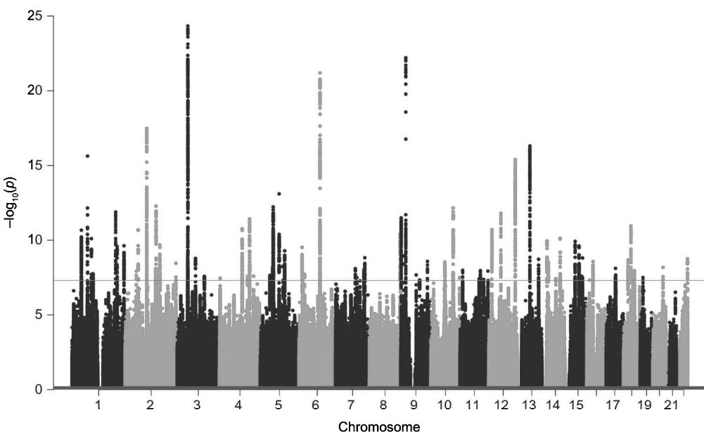
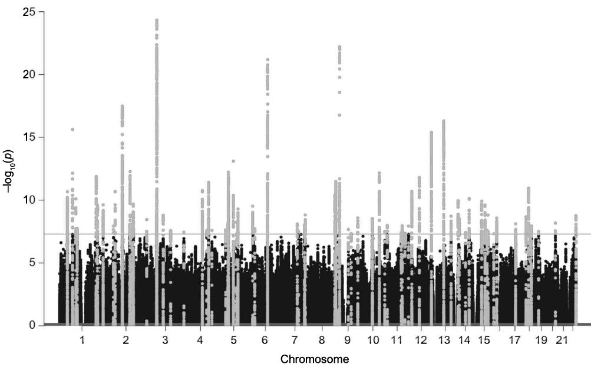
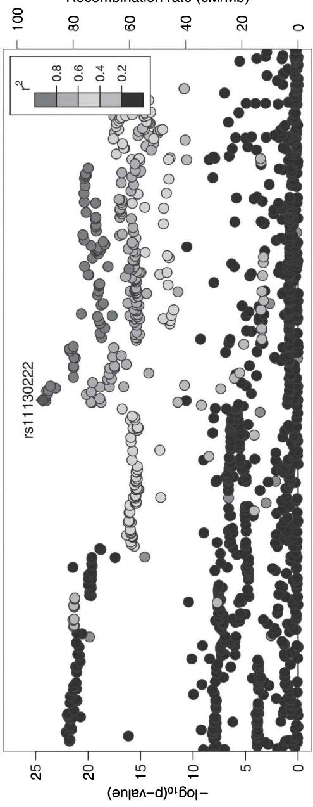
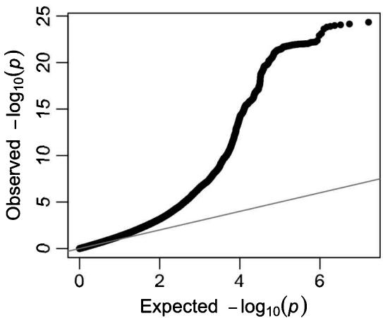
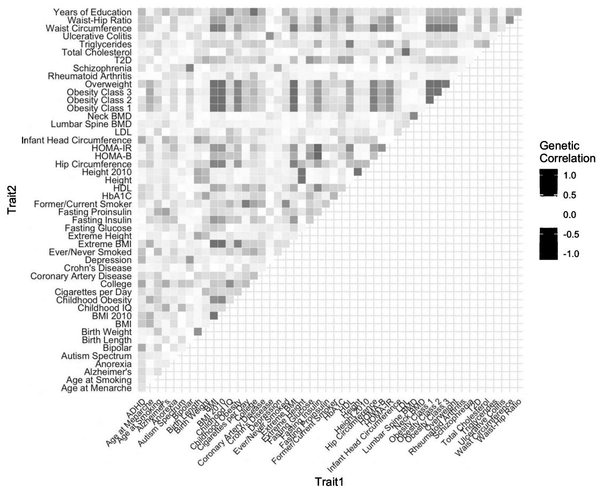

## Objectives

- Know where to find association summary statistics for multiple phenotypes 

• Create Manhattan plots to illustrate genome-wide association results 

• Use LocusZoom to examine regions of interests in association results 

• Estimate heritability and genetic correlation from association results using linkage disequilibrium score regression 

- Understand how to examine multitrait associations from genome-wide association results using Multi-Trait Analysis of Genome-wide association summary statistics (MTAG) 

## 12.1 Introduction

As genome-wide association studies (GWASs) became the standard for genetic discovery, there has been an explosion of studies on a huge variety of diseases and traits, ranging from anthropometric, diseases, socioeconomic, and behavioral traits. The GWAS wave was met with a data-sharing revolution, making it one of the most collaborative efforts across the sciences. The scientific community recognized the importance of sharing the summary results from GWA studies to the wider community to ensure replication and further extensions of studies. In chapter 7, section 7.3.3, we describe where researchers can obtain summary statistics. This includes the GWAS Catalog (https://www.ebi.ac.uk/gwas/summary-statistics), Atlas of GWAS summary statistics (http://atlas.ctglab.nl), and the Ben Neale Lab of GWASs on virtually all traits in the UK Biobank (http://www.nealelab.is/uk-biobank/). 

The aim of this chapter is to provide you with the tools to actively work with genome-wide association results. We first illustrate various techniques to produce Manhattan plots, which are the standard GWAS figures that plot genome-wide associations. This is then followed by instructions on how to plot and interpret regional association plots. We then produce and describe Quantile-Quantile (Q-Q) plots and the associated $\lambda$ (lambda) 

statistic. The next section demonstrates how you can estimate heritability from these GWAS summary statistics, followed by how to estimate genetic correlations and heatmaps. We conclude with a description of how to run and interpret a multitrait association GWAS (MTAG) analysis. 

Before you start you will need to ensure that you have following data installed in the appropriate directory that we will use in this chapter: 

• EA2_results.txt.gz 

• Giant_Height2018.txt.gz 

• eur_w_ld_chr.tar.bz2 

• w_hm3.snplist.bz2 

- GWAS_EA_example.txt 

• GWAS_CP_example.txt 

• LD-Hub_genetic_correlation_example.txt 

You will also need to ensure that you have an Internet connection, because we will use R to download additional files. We also recommend having Git installed to download the up-to-date version of the LD score regression and MTAG software. Please refer to appendix 1 with details on how to install Git. 

## 12.2 Plotting association results

## 12.2.1 Manhattan plots

Association results from GWA studies are in the form of lists of summary statistics for millions of genetic variants. Results are “clustered” in blocks corresponding to genetic loci with high LD. For this reason, it is impossible to open the file and browse the results by looking at the summary statistics. Several graphical tools have been developed to visualize the entire list of results. The most widely used, recognizable visual tool to explore genome-wide association statistics is the Manhattan plot, which we discussed already in chapter 4 on GWASs. 

To remind readers, the Manhattan plot is a type of scatterplot where genomic coordinates are displayed along the X-axis, and the negative logarithm of the association p-value for each genetic variant along the Y-axis. The first results from a GWAS were reported in 2005 and 2006 [1]. Since variants are in LD, we often observe groups of points with similar $p$ -values, resembling high towers. Well-powered GWASs of polygenic traits show many loci with highly significant $p$ -values, (i.e., very small $p$ -values), and thus high skyscrapers. The resemblance to the Manhattan's skyline gave the name to this graph. By looking at a Manhattan plot, it is easy to recognize immediately if any genetic loci are highly significant. It is standard to place a line on top of a Manhattan plot to indicate hits that have reached the genome-wide significance level ( $p \leq 5 \times 10^{-8}$ ). For an explanation of why this significance level is chosen, refer to our previous discussion on correcting for multiple testing in GWASs (chapter 4, section 4.3.3). 

To create a Manhattan plot, we only need the genomic position (chromosome number and base-pair position) and the association p-value. If you use the following code in R, you can plot the association results of a GWAS of educational attainment from Okbay et al. 2016 [2], using the following command: 

```r
# Load the library
install.packages("qqman")
library(qqman) 
```

When the package is installed, we can then download the association results and import them in R. 

```txt
# Use R to download the summary statistics
download.file ("http://ssgac.org/documents/EduYears_Main.txt.gz", dest="EA2_results.txt.gz")
# Import the summary statistics in R
gwasResults<-read.table("EA2_results.txt.gz", header=T) 
```

Lastly, we use the function manhattan to produce the plot. This can take some time since we are plotting millions of points. We recommend that you save the figure as an external .png file. The following command saves the Manhattan plot into a new file called manhattan _ without _ highlights.png. The function reads the association file and uses information on p-values, chromosome numbers, and position to draw the Manhattan plot shown in figure 12.1. 

```txt
Save the figure into an external png file format
png(file="manhattan_without_highlights.png", width=1200, height=600)
manhattan(gwasResults, chr="CHR", bp="POS", snp="MarkerName", p="Pval", suggestiveline=F)
dev.off() 
```

If you would like to emphasize the top hits from a GWAS, it is possible to highlight the SNPs that exceed the genome-wide significance threshold together with the surrounding 




Figure 12.1


Manhattan plot of the 2016 GWAS of educational attainment (EA2) without highlights.


SNPs (we chose a +/- 500 Kb window around the top hits) using the code below. Please note that these are not independent loci, but rather it is a convenient and visual way to highlight the top results. 

The following code is used to select all of the SNPs in the specified vicinity of genome-wide association results. We use a loop where we scan all and pick up all of the SNPs within 500 Kb of the GWAS-significant hits. 

```txt
gwasResults<-subset(gwasResults, Pval<0.05)
hits<-gwasResults[gwasResults$Pval<5e-08,]

# Create new variable with SNPs that we want to highlight
gwasResults$highlight.snps<-0

for (i in 1: dim(hits)[1]){
    chr<-hits[i,2]
    loc_min<- hits[i, 3]-5000
    loc_max<- hits[i, 3]+5000

neighbors.snps<-gwasResults$MarkerName[gwasResults$CHR==chr &
    gwasResults$POS>loc_min &
    gwasResults$POS<loc_max] 
```

```powershell
gwasResults$highlight.snps[gwasResults$MarkerName %in% neighbors.snps] <- 1
} 
```

Once we have created a new variable with the SNPs that we want to highlight, we can pass this information to the manhattan function using the option highlight. 

```txt
png(file="manhattan_with_highlights.png", width=1200, height=600)
# Add highlight command to the Manhattan plot
manhattan(gwasResults, chr="CHR", bp="POS", snp="Marker-Name", p="Pval", highlight=gwasResults$MarkerName[gwas Results$highlight.snps==1],suggestiveline=F)
dev.off() 
```

The result for the highlighted plot is shown in figure 12.2 (see the light gray shading), with the full color version of the results available on our companion website (http://www.intro-statistical-genetics.com). 




Figure 12.2


Manhattan plot of 2016 GWAS of educational attainment (EA2) with highlights.


## 12.1.2 Regional association plots

Manhattan plots show the statistical associations of all genetic variants but conceal a considerable amount of important information. Regional associations are often used to visualize LD patterns between SNPs that are significant and SNPs in nearby regions that have been previously reported in other GWASs. To visualize the association results of a specific area in the genome, we can use the online tool LocusZoom (http://locuszoom.org/) and produce a regional association plot. This type of plot essentially zooms in or magnifies part of a Manhattan plot in a specific area. Using the online tool (figure 12.3), we investigated the results of rs11130222, the top hit on chromosome 3 from the 2016 educational attainment GWAS. Figure 12.4 provides more details around this SNP. The x-axis and the y-axis are the same as in a Manhattan plot (genomic position and negative logarithm of association p-value). Above that a regional association plot shows which genes are in that region of the genome in the bottom panel. SNPs are plotted in different colors, based on the correlation $r^{2}$ with rs11130222, the reference SNP in this example. A color version of this plot can be found at the LocusZoom webpage or our companion website to this book. The dots in red (upper right) indicate SNPs that are in high LD with the reference one, while blue SNPs (generally lower in the plot) are independent variants. 

## 12.1.3 Quantile-Quantile plots and the $\lambda$ statistic

Another typical figure associated with a GWAS is the Quantile-Quantile (Q-Q) plot, which is examined together with the $\lambda$ (lambda) statistic. We described the Q-Q plot earlier in our statistical introduction in chapter 2 (section 2.2.1). Q-Q plots compare the distribution of observed p-values (logarithm scale) with the expected p-value distribution under the null hypothesis (i.e., no association between genotypes and phenotype). It is a tool that is used to visualize the appropriate control of population substructure and the presence of an association. Figure 12.5 shows the Q-Q plot for the same results of educational attainment from the 2016 educational attainment (EA2) GWAS. Under the null hypothesis, points would lie on the horizontal line (y=x). Data that generally fall on the line suggest that there is no deviation from the null hypothesis, meaning absence of association. Any deviation on the left (as clearly this figure shows) or in other words in the upper right tail from the y=x line, indicates a substantial deviation from the null hypothesis, indicating compelling evidence for genomic association. The R command to produce Q-Q plots from genome-wide association results is contained in the qqman package. 

# Produce Q-Q plots
qq(gwasResults$Pval) 


Figure 12.3
Screenshot of the LocusZoom online tool.


<table><tr><td>Plot Your Data</td><td colspan="3">Depending on the size of your data, runs can require 30–60 seconds to generate a plot</td></tr><tr><td>Provide Details for Your Data</td><td colspan="3">Path to Your File Choose file No file chosenFile will be sent to server and used for plotting (Maximum 2GB) [Help]P-Value Column Name Default is P.value Set for PLINK data or WikiGWA dataMarker Column Name Default is MarkerNameColumn Delimiter Tab Default is tab</td></tr><tr><td rowspan="3">Specify Region to DisplayRequired: Fill in Only ONE of These Three</td><td>SNP</td><td>+/- SNP Reference Name</td><td>400 Kb Flanking Size</td></tr><tr><td>Gene</td><td>+/- Gene Reference Name</td><td>200 Kb Flanking Size Optional Index SNP Default=lowest p-value</td></tr><tr><td>Region</td><td>Chr: None → Mb Starting Chr Position through Ending Chr Position</td><td>Mb Ending Chr Position Optional Index SNP Default=lowest p-value</td></tr><tr><td>Custom AnnotationOptional: This overrides Show Annotation below</td><td>Column Name Category Order</td><td colspan="2">Name of annotation columnOrder of annotation categories</td></tr></table>


LocusZoom - Plot with Your Data


Position on chr3 (Mb)


Figure 12.4
LocusZoom plot of SNP rs11130222 using summary statistics for 2016 educational attainment (EA2) GWAS.


<table><tr><td></td><td>49.6</td><td>49.8</td><td>50</td><td>50.2</td></tr><tr><td>DAG1→</td><td>BSN→</td><td>← AMIGO3</td><td>← UBA7</td><td>← MST1R</td></tr><tr><td>← BSN-AS2</td><td>APEH→</td><td>← IP6K1</td><td>← TRAIP</td><td>← MON1A</td></tr><tr><td></td><td>← MST1</td><td>← CDHR4</td><td></td><td>← RBM5→</td></tr><tr><td></td><td>RNF123→</td><td>FAM212A→</td><td></td><td>← RBM5-AS1</td></tr><tr><td></td><td>← GMPPB</td><td>← MIR5193</td><td></td><td>GNAI2→</td></tr><tr><td></td><td></td><td>← CAMKV</td><td></td><td>MIR5787→</td></tr></table>




Plotted SNPs





Figure 12.5


Q-Q plot of educational attainment GWAS.


The degree of deviation from the red line is formally measured by the $\lambda$ -statistic, also called genomic control. A $\lambda$ value can be calculated from Z-scores, chi-square statistics, or p-values, depending on the output you have from the association analysis. 

The example below shows how to calculate the $\lambda$ -statistic using R. 

```txt
lambda <- round(median((gwasResults$Beta/gwasResults$SE)^2) / 0.454, 3) 
```

```txt
lambda [1] 1.239 
```

As artificial differences in allele frequencies due to population stratification, cryptic relatedness, and genotyping errors will affect all SNPs, the test statistic will be inflated across the entire genome. For this reason, $\lambda$ is also used to detect possible inflation due to population stratification. A value close to 1 suggests that data have been properly adjusted for the population substructure. If $\lambda > 1.2$ , this suggests the presence of stratification. Sometimes it is possible to correct for population stratification by dividing all of the test statistics by the value of lambda. Many GWASs do it at the meta-analyses stage to reduce the risk of false positive results. In this example, a $\lambda$ of 1.239 suggests the possible presence of population stratification. However, several recent studies show that highly polygenic traits (such as educational attainment or height) exhibit a $\lambda$ statistic over 1.2 due to the fact that the genetic basis of the trait is spread across the entire genome. We therefore recommend caution in the interpretation of $\lambda$ as a test for population stratification. 

## 12.2 Estimating heritability from summary statistics

Heritability of a polygenic trait can be estimated with a certain degree of accuracy from summary statistics. In polygenic traits, SNPs that are highly correlated with many other SNPs (i.e., have a high LD score) are more likely to “tag” a causal SNP (i.e., it is correlated). In a GWAS, these SNPs with a high LD score are expected to have higher association statistics (Chi-squared test statistics) than SNPs with a lower LD score. By exploiting this relationship, it has been shown that it is possible to estimate heritability in highly polygenic traits $[3]$ . In particular, we can estimate SNP-heritability by running a linear regression of all the association test statistics from a GWAS on the LD scores of each SNP. This method for estimating SNP-heritability is called LD score regression (LDSC) and was discussed already in detail in chapter 5. In contrast with the GREML method, it does not require individual genetic data. Compared to GREML, LDSC considerably reduces the computational speed, but with the cost of a higher standard error (SE) of estimates. For LDSC, the standard errors of the variance component estimates are typically larger (usually by 50% or more) than those of a GREML analysis for the same sample size. However, LDSC is usually applied to large datasets from GWAS consortia that generate smaller SEs. 

To estimate SNP-heritability from summary statistics, we need to install the Python command LDSC (see appendix 1). Once LDSC is installed, we require three sources of data: (1) summary statistics from a GWAS, (2) a list of SNPs, and (3) LD scores for each SNP. The location of where to obtain these summary statistics was discussed previously and in chapter 7 (section 7.3.3). LD scores can be calculated using LDSC, but if using GWAS results from European or Asian populations, it is possible to directly download the LD scores for HapMap 3 SNPs from the LDSC website (https://github.com/bulik/ldsc). 

There are several aspects that need to be taken into account before using LDSC. First, because we are using summary statistics, often from different datasets (i.e., cohorts or data sources), all of the quantities we are estimating (e.g., heritability) have substantial measurement errors. It is also important to reiterate that LD structure is population specific, and that LD scores are not stable across populations. Results from LDSC are therefore population specific because the method is entirely based on LD scores. A second aspect to keep in mind is that the LDSC method assumes that heritability is spread across the entire genome. The consequence is that LDSC is a method that works well for highly polygenic traits. 

The following code provides a guide on how to estimate the SNP-heritability for adult height on individuals with European ancestry. The first step is to download the data from the summary statistics of the latest GWAS on adult height $[4]$ and a list of LD scores for Europeans based on 1000 Genomes. You can download the three files from the companion website to this book (http://www.intro-statistical-genetics.com). Before we start the analysis, we need to extract the zipped files as follows: 

```batch
bunzip2 eur_w_ld_chr.tar.bz2
tar -xvf eur_w_ld_chr.tar
bunzip2 w_hm3.snplist.bz2 
```

Once you have obtained the files, it is possible to start to prepare the data. LDSC is software written in Python 2. You need to ensure that you have Python installed on your system (see appendix 1). 

To install all the packages needed to run LDSC, it is possible to create a new Python environment using the following command: 

```batch
conda env create-file ldsc/environment.yml 
```

In (older versions of) Windows or those not using Ubuntu (see appendix 1): 

activate ldsc 

In Linux and macOS: 

```txt
source activate ldsc 
```

If LDSC is correctly installed on your system, when you type the following command shown below, it will display various options of how to use the commands and list all of the possible arguments. 

```batch
python ldsc/ldsc.py -h 
```

Once LDSC is correctly installed on your computer, we can start working with the data. The first necessary step is to ensure that the data are in the correct format. There is a command in LDSC that is designed to prepare the summary statistics, which is called munge _ sum-stats.py. 

The necessary data for munge_sumstats are: an input file containing summary statistics (--sumstats), an external file with the list of SNPs and their alleles that will be used in the analysis (this is one of the files that we downloaded earlier: --merge-alleles), and the name of the output file (--out). Additional arguments can be used to specify the information contained in each column. In the example below we have: --snp, indicating the column with the genetic markers; --N--col, indicating the columns with sample sizes; --a1 and --a2, with the two alleles of each marker; --p, indicating the column with p-values; and --frq, indicating allele frequencies. 

```shell
python ldsc/munge_sumstats.py \
--sumstats Giant_Height2018.txt.gz \
--snp SNP \
--N-col N \
--a1 Tested_Allele \
--a2 Other_Allele \
--p P \
--frq Freq_Tested_Allele_in_HRS \
--out height \
--merge-alleles w_hm3.snplist 
```

The output will tell you how many SNPs have been read from LDSC and how many have been filtered out due to low allele frequencies or incorrect information in other columns. Finally, LDSC provides some descriptive statistics including how many genome-wide significant SNPs are saved to the output file called height.sum-stats.gz. 

```txt
Read 2334001 SNPs from --sumstats file.  
Removed 1315341 SNPs not in --merge-alleles.  
Removed 0 SNPs with missing values.  
Removed 0 SNPs with INFO <= 0.9.  
Removed 44 SNPs with MAF <= 0.01.  
Removed 48 SNPs with out-of-bounds p-values.  
Removed 0 variants that were not SNPs or were strand-ambiguous.  
1018568 SNPs remain.  
Removed 0 SNPs with duplicated rs numbers (1018568 SNPs remain).  
Removed 0 SNPs with N < 472784.666667 (1018568 SNPs remain).  
Median value of BETA was 0.0, which seems sensible.  
Removed 0 SNPs whose alleles did not match --merge-alleles (1018568 SNPs remain).  
Writing summary statistics for 1217311 SNPs (1018568 with nonmissing beta) to height.sumstats.gz. 
```

```txt
Applying Genome-Wide Association Results 
```

```txt
Metadata:  
Mean chi^2 = 8.986  
Lambda GC = 3.61  
Max chi^2 = 1424.989  
61727 Genome-wide significant SNPs (some may have been removed by filtering).  
Conversion finished at Wed Feb 6 16:10:09 2019  
Total time elapsed: 33.34s 
```

The second step involves the calculation of LD score regression and the estimation of SNP-heritability. This can be done using the command ldsc.py. 

```shell
python ldsc/ldsc.py \
--h2 height.sumstats.gz \
--ref-ld-chr eur_w_ld_chr/ \
--w-ld-chr eur_w_ld_chr/ \
--out height_h2 
```

The results are stored in the newly created file height _ h2.log. The log file reports how many SNPs were provided by the summary statistics and how they merged with the LD score file. 

```c
**********************************************************************
******************************************************************
* LD Score Regression (LDSC)
* Version 1.0.0
* (C) 2014-2015 Brendan Bulik-Sullivan and Hilary Finucane
* Broad Institute of MIT and Harvard / MIT Department of Mathematics
* GNU General Public License v3
**********************************************************************
**********************************************************************
****************************************************************...
Call:
./ldsc.py \
--h2 height.sumstats.gz \
--ref-ld-chr eur_w_ld_chr/ \
--out height_h2 \ 
```

```txt
--w-ld-chr eur_w_ld_chr/
Beginning analysis at Sat Mar 2 23:31:21 2019
Reading summary statistics from height.sumstats.gz ...
Read summary statistics for 1018568 SNPs.
Reading reference panel LD Score from eur_w_ld_chr/
[1-22] ...
Read reference panel LD Scores for 1290028 SNPs.
Removing partitioned LD Scores with zero variance.
Reading regression weight LD Score from eur_w_ld_chr/
[1-22] ...
Read regression weight LD Scores for 1290028 SNPs.
After merging with reference panel LD, 1013762 SNPs remain.
After merging with regression SNP LD, 1013762 SNPs remain.
Using two-step estimator with cutoff at 30. 
```

Finally, we have an estimate of heritability $(h^{2})$ for height. The estimate is $h^{2}=0.46$ with a standard error of 0.019. The estimate is substantially lower than the estimate of heritability from twin studies that is around 0.80 [5], as this is an estimate based on SNP-heritability. Refer to chapter 1 (section 1.6.3) where we discuss the reasons for these disparities in heritability estimates. 

```txt
Total Observed scale h2: 0.4552 (0.0193)
Lambda GC: 3.6129
Mean Chi^2: 8.8736
Intercept: 1.8968 (0.0452)
Ratio: 0.1139 (0.0057)
Analysis finished at Sat Mar 2 23:31:32 2019
Total time elapsed: 11.33s 
```

## 12.3 Estimating genetic correlations from summary statistics

LD score regression was introduced in chapter 5 in our introduction to polygenic scores. This method can also be used to estimate the degree of genetic correlation of multiple traits [6]. Recall from this earlier chapter that genetic correlation is an estimate of the additive genetic effect that is shared between a pair of traits. For example, height and educational attainment are both heritable traits that are usually positively correlated. However, it could be interesting to examine if there is also genetic correlation, meaning that they are likely to share the same genes. LDSC can work with multiple traits, and by exploiting the LD structure of the data it can be used to estimate the degree of genetic correlation. 

We start by preparing the data for educational attainment. For this example we once again use the data from the 2016 GWAS study of educational attainment (EA2). As before, we use the command munge _ sumstats.py to prepare the data. The command is identical to the one used previously, with the only difference being that we adapt the name of the columns to the new summary statistics file. The output file is Educ.sumstats.gz. 

```shell
python ldsc/munge_sumstats.py \
--sumstats EA2_results.txt.gz \
--snp SNP\
--N 300000 \
--a1 A1 \
--a2 A2 \
--p Pval \
--frq EAF \
--out Educ \
--merge-alleles w_hm3.snplist 
```

Genetic correlations can be calculated very easily using ldsc.py. Contrary to the calculation of heritability, we use the option --rg (genetic correlation) followed by the two (or more) traits for which we estimate genetic correlation. 

```shell
python ldsc/ldsc.py \
--rg height.sumstats.gz,Educ.sumstats.gz \
--ref-ld-chr eur_w_ld_chr/ \
--w-ld-chr eur_w_ld_chr/ \
--out height_educ 
```

The output file is height _ educ.log. The first part of the output is dedicated to log how many SNPs are merged with LD scores and how many are removed from the analysis. This is important information because it can warn you if too many SNPs are removed from the analysis. The second part of the output reports the genetic heritability of both traits. 

In this example, the heritability of the first trait is 0.51 (height) and 0.12 for the second trait (educational attainment). Note that the estimate for $h^{2}$ of height slightly differs from the previous estimate. This is because, by merging SNPs from two traits, the set of genetic variants used in the analysis may differ. 

```txt
Heritability of phenotype 1
Total Observed scale h2: 0.5052 (0.0236)
Lambda GC: 3.6129
Mean Chi^2: 8.8826
Intercept: 1.5332 (0.1104)
Ratio: 0.0676 (0.014)
Heritability of phenotype 2/2
Total Observed scale h2: 0.1223 (0.0045)
Lambda GC: 1.4853
Mean Chi^2: 1.6516
Intercept: 0.9322 (0.0107)
Ratio < 0 (usually indicates GC correction). 
```

The last portion of the output reports the estimates of genetic covariance and correlation. The estimate of genetic correlation between height and educational attainment is 0.14, meaning that there is evidence of a shared genetic basis between the two traits. At least part of the correlation between the two traits may be explained by the fact that the same genes are associated with the traits. We discussed this covariance in traits in detail in chapter 5, particularly in relation to pleiotropy. 

```txt
Genetic Covariance
Total Observed scale gencov: 0.035 (0.0035)
Mean z1*z2: 0.3942
Intercept: 0.0712 (0.0115)
Genetic Correlation
Genetic Correlation: 0.1408 (0.0128)
Z-score: 10.9712
P: 5.2582e-28 
```

Finally, a summary of all of the genetic correlations is presented in the output. LDSC also reports the p-value of a statistical test where the null hypothesis is the absence of correlation. The p-value is $5.2 \times 10^{28}$ , hence a very small p-value indicating statistical departure from the null hypothesis. 

```txt
Summary of Genetic Correlation Results
p1 p2 rg se z p h2_obs
height educ 0.1408 0.0128 10.9712 5.2582e-28 
```

As we discussed in chapter 5, it is possible to estimate genetic correlations for multiple traits, to examine the genetic overlap of across traits. Recall figure 5.2, where we illustrated the genetic overlap between two reproductive behavior traits with 27 other phenotypes. 

Genetic correlations can also be calculated without downloading results but by using a recent online tool called LDHub (http://ldsc.broadinstitute.org/) [7]. LD Hub is a centralized database of summary-level GWAS results for hundreds of diseases/traits from different publicly available resources/consortia and a web interface that automates the LD score regression analysis pipeline. It is possible to explore genetic correlation for the traits of interests by either exploring existing correlations or by uploading the summary statistics of the trait of interest. 

A nice way to visualize multiple genetic correlations is to draw a heatmap. Heatmaps are graphs that can be used to visualize a data matrix (often also used to show LD blocks in genotype data). This type of graph uses colors to visualize the intensity of genetic correlations between traits. In the example below, we use data from genetic correlations of 49 traits from Bulik-Sullivan et al. (2015) [3], downloaded from LD Hub (figure 12.6). Darker shading on the heatmap represent, stronger positive or negative genetic correlations. The color version of this graph is shown on the companion website to this book, where positive genetic correlations are in bright red and negative genetic correlations are pictured in blue. By looking at multiple traits, it is possible to have a first indication of shared etiology among traits. 

```r
# Import data on genetic correlation
data_rg<-read.table("LD-Hub _genetic _correlation _ example.txt",fill =T, sep="\t", header=T, quote="")
# load ggplot2 library
library(ggplot2)

# Draw heatmap
ggplot(data = data_rg, aes(Trait1, Trait2, fill = rg))+ 
```

```txt
geom_tile(color = "white") +
scale_fill_gradient2(low = "blue", high = "red", mid = "white", midpoint = 0, limit = c(-1.1, 1.1), space = "Lab", name="Genetic\nCorrelation") +
theme_minimal() +
theme(axis.text.x = element_text(angle = 45, vjust = 1, size = 8, hjust = 1)) +
coord_fixed() 
```




Figure 12.6
Heatmap of genetic correlation for 49 traits.


As we noted in chapter 5, pleiotropy—which is when a single gene affects multiple traits—is ubiquitous. The genetic correlations that we are studying are indicative of shared genetic basis, but they do not definitively imply pleiotropy. Two causal genetic loci for different traits may be very close to each other on the genome and therefore be in linkage disequilibrium. If that is the case, you would see a genetic correlation even in absence of pleiotropy. Refer to our detailed discussion of pleiotropy in chapter 5 (section 5.4.3) that delves into this topic in more detail. Since this is a very advanced topic, we do not explore additional practical examples in this introductory textbook. 

## 12.4 MTAG: Multi-Trait Analysis of Genome-wide association summary statistics

As we have noted on multiple occasions throughout this book, one limitation of the GWAS approach is that you need a very large sample size to have sufficient statistical power to detect signals that may have very small effects (see box 4.1). For this reason, GWASs have privileged phenotypes that are measured consistently in many cohorts, often at the expense of precision in the measurement of the phenotype of interest. For example, we might be interested in measuring cognitive impairment, but since it may be very costly to design a study that collects precise measurements of the trait that we are interested in, we rely on a proxy phenotype that is measured in a larger sample, such as educational attainment. 

As described in detail in chapter 5 and as demonstrated in the previous sections, phenotypes often share a common genetic basis. For this reason we now apply the multi-trait analysis of GWASs developed by Turley and colleagues in 2018 called MTAG (Multi-Trait Analysis of Genome-wide association summary statistics), which allows analysis of GWASs of multiple correlated traits using summary statistics [8]. As we noted previously in chapter 5, this method enables the joint analysis of multiple traits, boosting statistical power to detect genetic associations for each trait that is analyzed. In this way, we can leverage the sample size of a large study sample with a GWAS on a different but related trait to increase the detection of genetic loci in both traits. MTAG results can also be used in further analysis to construct polygenic scores. 

Here we present a simple example of how to use MTAG. Further documentation is available at https://github.com/omeed-maghzian/mtag/wiki. MTAG is a software written in Python 2 and may be downloaded by cloning this GitHub repository (see appendix 1 for further instructions on how to install Git and MTAG): 

git clone https://github.com/omeed-maghzian/mtag.git 

As for LDSC, the software developers recommend the installation of the Python Anaconda distribution (see appendix 1). In particular, mtag needs the following Python packages installed on your system: 

- numpy (≥1.13.1) 

- scipy 

• pandas (≥0.18.1) 

- argparse 

- bitarray (for ldsc) 

- joblib 

To install all of the packages needed to run MTAG, it is possible to create a new Python environment using the following command: 

```batch
conda env create --file mtag/environment.yml 
```

In (older versions of) Windows in a non-Ubuntu environment (see appendix 1): 

activate mtag 

In Linux and macOS: 

source activate mtag 

To test that the tool has been successfully installed, type: 

python mtag/mtag.py -h 

In the example below, we use the data from the more recent 2018 educational attainment GWAS (EA3) by Lee et al. [9]. To combine results from a GWAS on educational attainment (sample size N=1,131,811) with a smaller GWAS on cognitive performance (sample size N=257,828). We use the following files containing summary statistics of 10,000 SNPs: GWAS _ EA _ example.txt and GWAS _ CP _ example.txt. 

The summary statistics are passed to mtag using the option --sumstats. As is customary, we specify the suffix of the output files using the option --out. The rest of the options specify the column names of: names of genetic variants (--snp_name), allele names (--a1_name) and (--a2_name), allele frequencies (--eaf_names), name of effect sizes (--beta_name), standard errors (--se_names), and sample size (--n_name). As we are using betas and standard errors and not Z-scores, we need to include the option --use_beta_se. 

```shell
python mtag/mtag.py \
--sumstats GWAS_EA_example.txt,GWAS_CP_example.txt \
--out ./EA_CP_mtag \
--snp_name MarkerName \
--a1_name a1 \
--a2_name a2 \
--eaf_name EAF \
--use_beta_se \
--beta_name Beta \
--se_name SE \
--n_name n 
```

MTAG then generates five output files in your current directory: 

- EA _ CP _ mtag.log provides a description of the different steps taken by mtag.py. 

- EA_CP_mtag_sigma_hat.txt reports the estimated residual covariance matrix. 

- EA_CP_mtag_omega_hat.txt reports the estimated genetic covariance matrix. 

- EA_CP_mtag_trait_1.txt and EA_CP_mtag_trait_2.txt are tab-delimited results files corresponding to the MTAG-adjusted effect sizes and standard errors for the Educational Attainment and Cognitive Performance summary statistics, respectively. 

The end of the log file (EA _ CP _ mtag.log) also reports some additional measures that can be used to assess the gain in statistical power using MTAG. In particular, MTAG reports the increases in power from MTAG by approximating the sample size needed to achieve the same mean chi-square value in a standard GWAS. This information is reported in the column GWAS equiv. (max) N. 

The equivalent GWAS sample size in this example is over 2 million individuals for both the traits. For GWAS conducted in small samples, using MTAG can tremendously increase the statistical power of a study. 

```txt
Summary of MTAG results:

Trait N (max) N (mean) ... mean chi^2 mean chi^2 (max) N
1 GWAS_EA_example.txt 1131811 1131811 ... 1.377 1.694 2082199
2 GWAS_CP_example.txt 2578282 2578282 ... 2.020 2.089 2752964 
```

MTAG is a very flexible tool that can be used with GWAS results for overlapping cohorts. The key assumption of the method is that all SNPs share the same variance-covariance matrix of effect sizes across traits. This assumption may be violated, in particular, when some SNPs influence only a subset of the traits. The researchers who developed this method show that, however, even if this assumption is not satisfied, MTAG is a consistent estimator and always improves the precision of the estimates compared to single-trait GWASs. 

## 12.5 Conclusion

Recent years have seen a proliferation of GWASs and the increased reporting and availability of summary statistics. This has opened up the possibility to conduct meaningful genetic analyses without having direct access to individual-level genotyped data, but rather the myriad of summary statistics from GWASs. Researchers are now able to download a plethora of genetic association results on virtually any trait and use the many and growing number of online resources. Given the great effort, interdisciplinary expertise, and resources that are required to lead and produce a large GWAS, it is not advisable for those new to the field to attempt such a large task without the considerable expertise or guidance from experts within this area of research. Our hope is that this chapter opens up the use of these results, however, to allow researchers to feel confident to explore and work with existing summary results. The aim is that you are now able to produce various plots that explore these results, such as the Manhattan plot and regional association plots, but also evaluate results using Q-Q plots and related statistics. As we elaborated upon in detail in chapter 5, it is likewise useful to be able to estimate heritability and genetic correlations, and engage in multitrait analysis. 

## Exercises

1. Download the summary statistics of the most recent GWAS on Age at First Birth from the Atlas of GWAS summary statistics. 

2. Use the data from exercise 1 and draw a Manhattan plot using RStudio. 

3. Use LocusZoom to investigate the region around snp rs2777888. 

4. Calculate the SNP heritability of age at first birth and the genetic correlation with educational attainment using LD score regression. 

## Further reading and resources

## GWAS summary statistics

The Atlas of GWAS summary statistics includes a database of publicly available GWAS summary statistics: https://atlas.ctglab.nl/. 

The NHGRI-EBI Catalog also contains summary statistics: https://www.ebi.ac.uk/gwas/summary-statistics. UK Biobank results by the Ben Neale Lab can be found at: http://www.nealelab.is/uk-biobank. 

## Web references

LD Hub, a centralized database of summary-level GWAS results and web interface for LD Score regression: http://ldsc.broadinstitute.org/. 

LD Score Regression (LDSC) on GitHub: https://github.com/bulik/ldsc. 

LocusZoom, used to create visualizations of GWAS results: http://locuszoom.org/. 

MTAG Python command line tool on GitHub: https://github.com/omeed-maghzian/mtag. 

## References


1. M. C. Mills and C. Rahal, A scientometric review of genome-wide association studies. Commun. Biol. 2 (2019), doi:10.1038/s42003-018-0261-x. 


2. A. Okbay et al., Genome-wide association study identifies 74 loci associated with educational attainment. Nature 533, 1467–1471 (2016). 


3. B. K. Bulik-Sullivan et al., LD score regression distinguishes confounding from polygenicity in genome-wide association studies. Nat. Genet. 47, 291–295 (2015). 


4. L. Yengo et al., Meta-analysis of genome-wide association studies for height and body mass index in ~700,000 individuals of European ancestry. Hum. Mol. Gen. 27, 3641–3649 (2018). 


5. A. Jelenkovic et al., Genetic and environmental influences on height from infancy to early adulthood: An individual-based pooled analysis of 45 twin cohorts. Sci. Rep. 6, 28496 (2016). 


6. B. K. Bulik-Sullivan et al., An atlas of genetic correlations across human diseases and traits. Nat. Genet. 47, 1236–1241 (2015). 


7. J. Zheng et al., LD Hub: A centralized database and web interface to perform LD score regression that maximizes the potential of summary level GWAS data for SNP heritability and genetic correlation analysis. Bioinformatics 33, 272–279 (2017). 


8. P. Turley et al., Multi-trait analysis of genome-wide association summary statistics using MTAG. Nat. Genet. 50, 229–237 (2018). 


9. J. J. Lee, R. Wedow, and A. Okbay, Gene discovery and polygenic prediction from a genome-wide association study of educational attainment in 1.1 million individuals. Nat. Genet. 50, 1112–1121 (2018). 


## 13

# Mendelian Randomization and Instrumental Variables