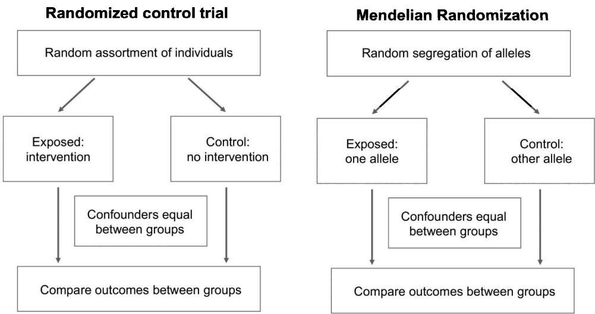
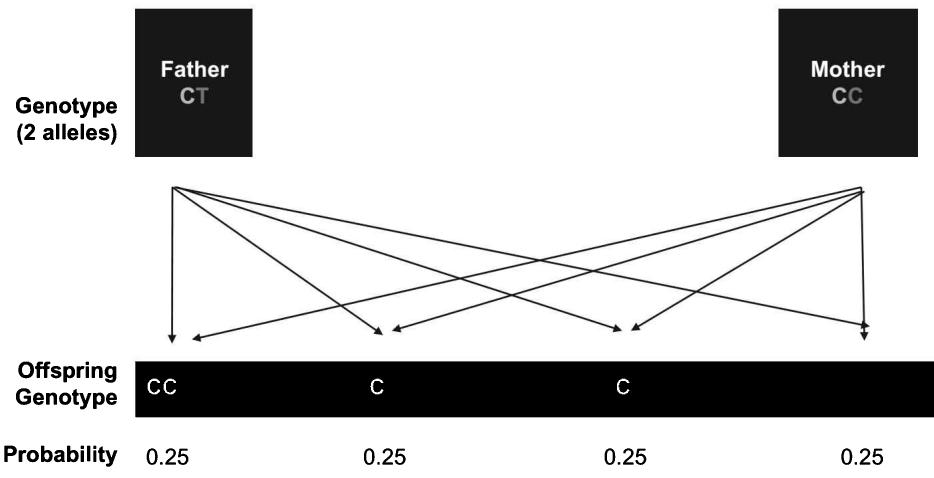
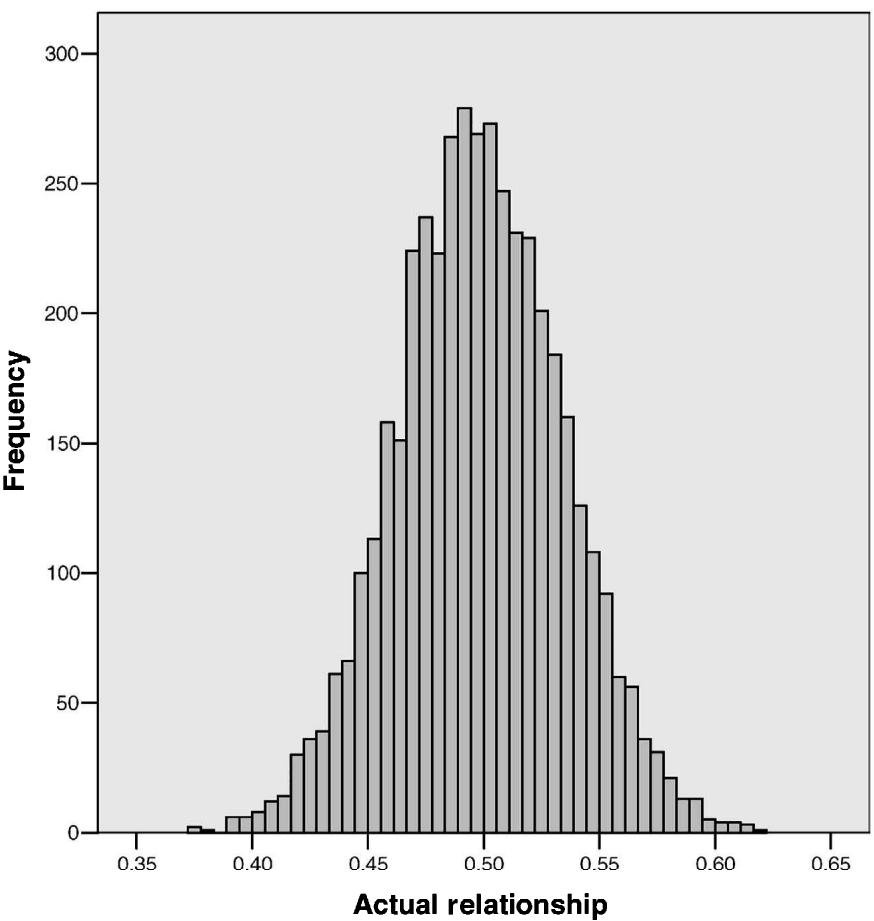
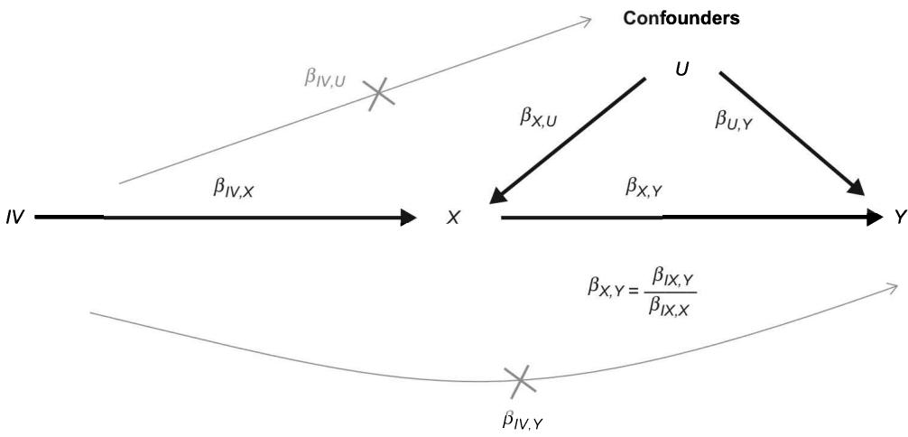
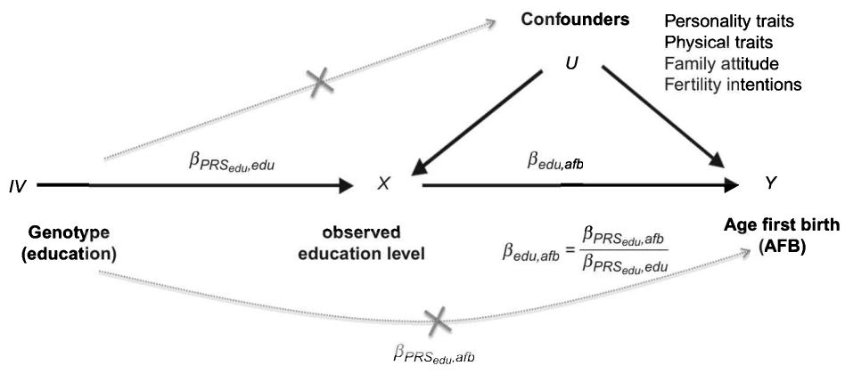

## Objectives

- Understand the challenge of endogeneity in drawing causal inference from observational studies 

• Understand the basic principal of using randomized control trials to study causality 

• Be able to define the technique of Mendelian Randomization (MR) 

- Understand the fundamentals of the Instrumental Variable (IV) approach in an MR framework 

• Grasp the main assumptions of the IV approach in an MR framework 

• Be aware of extensions of MR and advances in the field 

• Be introduced to several substantial applications of MR in different areas of research 

## 13.1 Introduction

Until now the majority of our applications have focused on examining correlational associations between genotypes and phenotypes. But association does not necessarily imply causation. Studying causality is perhaps one of the most vexing problems in research. While description, classification, and associations are of upmost importance in scientific research, the central goal is often to uncover cause and effect. The problem we regularly face is that it is rarely possible to pinpoint the variable that is the actual cause or the effect or determine whether it is another third unobserved factor that affects both variables and they, in turn, impact one another. (See also causal models in chapter 2.) Yet understanding causation is central for developing evidence-based clinical or policy interventions. 

Various techniques have been introduced in the literature to deal with the direction or relationship of causation, confounding variables, and endogeneity through twin designs $[1]$ , or using natural experiments such as educational reforms $[2]$ . The main problems that we grapple with are related to endogeneity, namely reverse causation, omitted variable bias due to confounding, measurement error, and bidirectional causality (see box 13.1 for 

Box 13.1 

Case study: The four causal models linking age at first birth and educational attainment 

To understand why causality is a problem, let us use the simple example of understanding the causal relationship between fertility (specifically the timing of first birth) and educational attainment of an individual. Since the 1970s, there has been a massive postponement in the age at which individuals in many countries have their first child. This phenomenon typically coincides with educational expansion, particularly of women [3]. 

Four causal models can be been used to describe this relationship. The first and most frequently studied causal mechanism is that educational attainment has a causal impact on the age of first birth. Achieving higher education (particularly for women) operates to postpone the timing of first birth $[4]$ . The mechanisms of later fertility for the highly educated are multiple and outlined elsewhere $[3, 4]$ . These include the higher educated having better knowledge of contraceptive use, being more likely to participate in the labor market and thus higher earnings, and opportunity costs to leave the labor market. But they also have more secularized views, higher consumption aspirations, and due to increased costs of children, delaying until they feel they can “afford” children. The second hypothesis is reverse causation, where age at first birth has a causal impact on educational attainment. In other words, an early or teenage pregnancy impedes higher educational attainment $[5]$ . Multiple studies have demonstrated that early and particularly teenage childbirth curtails educational attainment and later life course outcomes (e.g., $[6]$ ). There is also an average of a motherhood wage penalty of around 7% per child, with each year delay in motherhood increasing women’s earnings by 9% $[7]$ . A third model is that it is in fact bidirectional and that both age at first birth and educational attainment both affect one another, which we describe shortly in an MR framework. Finally, it may be that both the timing of first birth and educational attainment are both influenced by common omitted variables such as personality, fertility preferences, parental environment, attitudes, or genes $[8–10]$ . 

an applied example). Endogeneity refers to the case where the explanatory variable is correlated with the error term in the regression model. The most important source of endogeneity is omitted variable bias, which means that we neglect a control variable in our model that is a common cause for X (predictor) and Y (outcome) (see also chapter 2) and therefore confounds the observed association between X and Y. Given the large amount of tutorial materials already available to apply these methods (see the “Further reading” section), we only introduce this topic and the main challenges and do not present applied examples. 

In this chapter we first introduce Randomized Control Trails (RCTs) as the gold standard in causal analysis but clarify that they are often not feasible. We then introduce a possible solution in the form of Mendelian Randomization (MR) and the Instrumental Variable (IV) approach, and describe MR in the context of the IV framework. This includes outlining the main premises of the model and key statistical assumptions. This is followed by a collection of substantive applications across various topics to allow the reader to understand the broader applicability of these techniques. We conclude with a discussion of future directions. 

## 13.2 Randomized control trials and causality

The ideal strategy to identify a causal effect is to conduct an experiment in the form of a randomized control trial (RCT). In RCTs, individuals are assigned nonsystematically—namely randomly—into a treatment and control group. Imagine, for example, that you wanted to examine the impact of a selected variable (e.g., smoking) on health and that you divided a hundred people into two groups by tossing a coin. Since the results are random, you would not expect significant differences in, for example, the average health status between both groups. Within both groups, there will still, however, be variation with some healthier and unhealthier individuals, but there would be no systematic reason to expect an average difference in health status between the groups except by chance, which we would be able to quantify. Then we could introduce a treatment to this experiment. Instead of only assigning individuals to random groups 1 and 2, we would ask individuals with heads (group 1) to smoke cigarettes and those with tails (group 2) to refrain from smoking. If we would then track the health status of these groups, the only reason that we would expect differences in health outcomes would be due to the treatment of the experiment, which is smoking behavior. 

In real-life research, it is difficult and unethical to introduce different types of treatment effects in the form of an RCT. If we did opt to introduce a treatment that held considerable risks, such as asking people to smoke in the example above, but offered it to individuals only on an opt-in or opt-out basis, we would run into additional selection issues. The group that opted to participate in a higher-risk behavior such as smoking could be more strongly incentivized by the potential reward for participation, which in turn would introduce selection bias into our results. This would make it difficult to generalize results beyond this sample group. For this reason, MR was introduced as a possible solution to study causality. 

## 13.3 Mendelian Randomization

Mendelian Randomization (MR) relates directly to RCTs (see also figure 13.1 [11]). MR is a statistical technique that uses the measured variation in genes to examine the causal effect of one phenotype on another. The design was coined as Mendelian Randomization in the early 1990s by Gray and Wheatley [12]. They were interested in the effectiveness of bone marrow transplants in leukemia patients. The odds, however, of getting such a transplant were not determined by chance but were rather correlated with the prognosis for the patient. The authors focused on the compatibility of siblings to be donors, a process that is determined by genetic inheritance. They then used this experiment to study the patient's preference for this therapy within leukemia cases in children. This allowed them to obtain unbiased causal estimates in the absence of conducting an RCT. Since this early experiment, there have been multiple extensions. 

Figure 13.1

Parallel research designs: Classic randomized control trial (left) versus Mendelian Randomization (right). Source: Figure is adapted from Smith (2005) [13].

MR capitalizes on the random assignment of an individual's genotype that occurs at conception [14]. Recall our discussion in chapter 1 (section 1.2) about Mendel's laws, sexual reproduction, and genetic recombination. There we discussed in particular the random "genetic reshuffling" that takes place during meiosis when recombination occurs. In figure 1.2, we illustrated in a stylized picture how this recombination occurs. Here we see that during meiosis a random shuffle of genetic recombination takes place that is akin to a RCT. Figure 13.2 provides a simple explanation of how genotypes are randomly assigned from parents. Here the father has a genotype with two alleles of CT and the mother has CC. During conception there is an equal chance of passing one of the two alleles to offspring. 

This is also referred to as Mendel's second law [15]. Given the true reshuffling of genetic information when a child is conceived, Fisher already pointed out in 1951 that “Genetics is indeed in a peculiarly favoured condition in that providence has shielded the geneticist from many of the difficulties of a reliably controlled comparison. The different genotypes possible from the same mating have been beautifully randomised by the meiotic process. A more perfect control of conditions is scarcely possible, than that of different genotypes appearing in the same litter” [16]. Genetic recombination is thus a natural experiment that allows researchers to engage in causal modeling. 

Equal chance of passing 1 of 2 alleles with each conception

Figure 13.2

Genotypes are assigned randomly from parents.

The probabilities in figure 13.2 are stylized in a fictional scenario. The actual genetic relatedness between siblings is indeed only on average $50\%$ . As shown in figure 13.3, Visscher and colleagues [17] demonstrated that the actual variation in siblings is around 0.374 to 0.617 (mean 0.498, SD 0.036) in the shape of a thin normal distribution. 

By the turn of the millennium, several studies began to utilize this natural experiment in order to assess causality in observational studies, however, in a different way $[14, 18, 19]$ (see the right panel in figure 13.1). MR as we know it today was described in 2003 by George Davey Smith, who remains one of the driving forces of its development and applications $[14]$ . The underlying idea of the approach is that if we find that a genetic variant is deemed causal for an exposure variable and we can plausibly argue that this variant does not have a direct causal effect on the outcome of interest, an association between the genetic variant and the outcome variable can only be observed via the causal effect of exposure on outcome variable. 

## 13.4 Instrumental variables and Mendelian Randomization

## 13.4.1 The IV model in an MR framework

Within a statistical framework, MR relates directly to the IV approach utilized in econometrics to assess causality $[20]$ . A general formulation of this approach would be that an IV is correlated with X but not with omitted variables $(U)$ and not with Y—except through X. Typical IVs used in econometrics research are lotteries, political reforms such as variation in tobacco prices $[21]$ , natural disasters such as Hurricane Katrina that force the relocation of individuals $[22]$ , or birth month, which can influence education $[23]$ . 

Figure 13.3

Empirical distribution of genome-wide additive genetic relationships of full sibling pairs estimated from genetic markers.

Source: Visscher et al. (2006) [17]. Open Access.

Due to MR, genes can now be used as IVs, under the condition that the gene is causal for X but not correlated with omitted variables. Just as in an experiment, we can focus only on the fraction of variance in the exposure variable, which is generated by the IV and analyze whether this variance causes differences in the outcome of interest. If so, we observe a causal relationship, just as we would if we found systematic differences between groups defined in randomized control trial experiments, where the variance we analyze would be generated by the researcher (e.g., by a coin toss). 

Figure 13.4 illustrates the idea and assumptions behind the IV approach. If we have a valid IV for a variable X, we only observe a covariation between IV and Y if X has a causal effect on Y. In the depicted path model, effects multiply along causal paths (expressed in a one-headed arrow). This means that the association between IV on $Y(\beta_{IV,Y})$ is equal to the effect of IV on X times the effect of X and $Y((\beta_{IV,Y})=(\beta_{IV,X})\times(\beta_{X,Y}))$ . In the IV approach, we do not assume that we observe a true causal relationship between $\beta_{X,Y}$ in the data due to endogeneity. We assume, however, that we can obtain an unbiased estimate for $\beta_{IV,Y}$ and $\beta_{IV,X}$ . We can thus simply calculate $\beta_{X,Y}$ by dividing the observed association between the IV and Y by the estimate of IV and $X((\beta_{X,Y})=(\beta_{IV,Y})/(\beta_{IV,X}))$ . 

Illustration of the Instrumental Variable approach in order to identify a causal effect of $X$ on $Y$ . Note: This Instrumental Variable ( $IV$ ) is expected to causally influence $X$ and allows us to identify the causal effect of $X$ on $Y$ independent of any unknown confounders ( $U$ ). Crossed paths depict the necessary IV-model assumptions that there is no causal effect of $\beta_{IV,U}$ nor of $\beta_{IV,Y}$ .

Typically, a two-stage least squares regression is estimated in this approach. In the first stage, we regress X on the IV. 

$$
X = \mu_ {1} + \gamma I V + \varepsilon_ {1}
$$

In the second stage, we regress Y on the predicted value of $X(\hat{X})$ based on the first stage. 

$$
Y = \mu_ {2} + \beta_ {2 S L S} \hat {X} + \varepsilon_ {2}
$$

The reduced form regresses $Y$ directly on the $IV$ : 

$$
Y = \mu_ {3} + \rho I V + \varepsilon_ {3}
$$

The coefficient of interest $(\beta_{2SLS})$ is the ratio of the regression coefficient of Y on Z (the reduced form) to the regression coefficient of X on Z (the first stage), that is equivalent to 

$$
\frac {C o v _ {y , z}}{C o v _ {x , z}}.
$$

Two-stage least squares estimation methods are included in several standard software packages, which also accommodate and clarify potential issues in the model as well as estimate correct standard errors and produce two-stage estimates in one step. 

As we noted earlier, sources of endogeneity are simultaneity bias (reversed or bidirectional causality) and measurement error (imprecise measures). Using the example of the relationship between educational attainment and age at first birth (see box 13.1), omitted variables that are associated with both educational attainment (X) and age at first birth (Y) include personality, cognitive ability, fertility preferences, socioeconomic status, or parental environment. We provide an example of how an IV might be estimated in box 13.2 using the same example in box 13.1 of the relationship between educational attainment and age at first birth. 

Example of MR to disentangle relationships of age at first birth and educational attainment 

We previously discussed the possible causal mechanisms linking age at first birth to educational attainment (box 13.1). To model this question in an MR framework we could opt for the following approach, which is graphed below. As described in the body of the text, it simply means that we introduce a third variable (i.e., IV) of a polygenic score (PGS) for educational attainment. This PGS instrument is then assumed to (partly) determine the level of the “treatment,” which is observed educational attainment but does not have a direct or indirect effect on our outcome of age at first birth other than through its effect on the observed educational level. This instrument is thus exploited to enable us to make causal inferences about the effect of the level of education on fertility. 

Here the bottom line is that any difference in Y associated with the IV indicates a causal effect of X on Y. To reiterate, the figure above shows that: (1) the IV is associated with the exposure of interest X, (2) the IV is independent of the confounding factors U (i.e., that confound the X -Y association), and (3) genotype is related to the outcome only via its association with the modifiable exposure.

## 13.4.2 Violation of statistical assumptions of the IV approach

There are several statistical assumptions underlying the MR approach that need to be considered in order to evaluate whether genetic variants or PGSs are good instruments $[24]$ . We summarize these in table 13.1 and discuss them briefly here. 

Weak instrument A central criterion for an appropriate IV is that it is not a weak instrument. In other words, it needs to be correlated with the treatment and generate sufficient variation in the independent or exposure variable. A violation is often a general problem in IV studies $[25]$ . As elaborated upon throughout this book, individual SNPs in the form of candidate genes or a selection of single markers have very little predictive value and thus are often weak instruments (with some exceptions such as in relation to the FTO gene, discussed elsewhere). If we used these we would run the risk that as weak instruments, single variants would not only generate little variation in the model but also potentially cause substantial bias. Recall that a simple IV approach has the prediction of the instrument $(\beta_{IV,X})$ in the denominator. Very small and imprecise estimates may become problematic and can potentially lead to immense bias in the instance that there is a direct effect of IV on $Y(\beta_{IV,y})$ that inflates the numerator (in case the exclusion restriction assumption is violated, which we discuss shortly). 

Table 13.1

Summary of the main assumptions in MR research.

<table><tr><td>Assumption</td><td>Description</td><td>Solutions</td><td>Limitations</td></tr><tr><td>Weak instrument</td><td>IV needs to be strongly correlated with the treatment (X) variable and if not, can lead to noise and biased estimates</td><td>Use PGSs rather than single genetic varaints. Test strength of association of PGSs in independent samples</td><td>Lose knowledge about the instruments and potentially introduce pleiotropy</td></tr><tr><td>Exclusion restriction</td><td>Association between the IV and outcome (Y) variables is entirely due to a causal effect of the exposure on the outcome</td><td>Modeling pleiotropic effects, detecting and excluding pleiotropic SNPs, controlling for direct genetic effects on Y independent of X</td><td>Quantitative solutions always inherit the shortcomings of observational studies (e.g., measurement error)</td></tr><tr><td>Independence assumption</td><td>IV and Y do not have a common cause</td><td>Control for population stratification</td><td>Control might be imperfect; see also chapter 3</td></tr><tr><td>No genetic assortative mating</td><td>Partners are not mating based on the same genotypes for X or across X and Y</td><td>Controlling for parental genotype</td><td>Measurement error</td></tr><tr><td>Monotonicity assumption</td><td>Genes influence the exposure in the same direction for all individuals</td><td>Exclude SNPs with non-monotonic effects</td><td>Difficult to identify SNPs with non-monotonic effects due to low power</td></tr></table>

This returns to our earlier discussions in chapter 5 of the construction and predictive power or $R^{2}$ of PGSs on observed outcomes. Here we noted that when we sum up effects of multiple genes into a single PGS, it has higher predictive power than individual genetic variants. For example, the PGS for educational attainment in the latest 2018 study [26] explains over 10% of the variation in education in the National Longitudinal Study of Adolescent to Adult Health. The most recent PGS for height has an $R^{2}$ of 0.30 [27]. MR can only be employed with PGSs or genetic variants that have been shown to affect the outcome. 

In the analysis, the first step is therefore to demonstrate that the genetic markers predict the outcome. Using the example in box 13.2, for instance, you would test whether the PGS for educational attainment would predict years of education in the data that you are using. Other strategies include using multiple genes as independent IVs, and meta-analysing results, which also improve the precision of the estimation. In such approaches—in parallel to the use of PGSs—we face the mechanism-prediction trade-off in a sense that we might have stronger instruments but are at a higher risk to violate the exclusion restriction assumption (see the next point). While we might have sufficient predictive power for a strong genetic instrument, the mechanisms causing the association are less clear, with variants included that are potentially unrelated to the outcome of interest. 

Exclusion restriction assumption The second important assumption in this type of analysis is the exclusion restriction assumption. This assumes that the IV does not influence the outcome of interest directly or that it is exogenous to the outcome of interest (see also figure 13.4, crossed lines). This scenario directly relates to the mechanisms-prediction trade-off that we discussed in relation to the ubiquity of pleiotropy (chapter 5). When using IVs in a genetic framework, the exclusion restriction may be violated by four central reasons. First, biological processes could bias causal mechanisms due to canalization. Using the example in box 13.2, genetic variants associated with educational attainment might have a biological function in regulating fertility. Note that in a previous study the genetic correlation (LD score regression) was 0.70, suggesting that this might be plausible [28]. 

Second, genetic variants associated with the PGS IV (e.g., educational attainment) might be in linkage disequilibrium (LD) with genetic variants that are associated with the outcome Y (e.g., age at first birth). Although Mendel's second law states that the inheritance of one trait is independent of the inheritance of another, some variants may be in fact co-inherited (i.e., LD). LD could therefore potentially bias our estimates if our genetic marker instrument (IV) is in LD with another SNP that directly affects our outcome (Y). 

A third and related problem is direct pleiotropy, which refers to the situation where one genetic variant has multiple functions (see chapter 5). Using our example in box 13.2 again, it would be problematic for our model if SNPs for educational attainment are also affecting the timing of first birth directly. 

A final concern related to the violation of the exclusion restriction is that certain behaviors or conditions related to the parents may depend on their (inherited) genotype and at the same time influence their children $[29]$ . If a parental phenotype based on the genetic scores in the IV influences the Y of their children, the exclusion restriction assumption would also be violated. 

Assumption of independence Another statistical condition required for a valid causal interpretation of the IV estimate is the assumption of independence, which is related to population stratification. In general, it is assumed that the IV and the outcomes of interest do not share a common cause. In reference to population stratification, this would refer to the situation where the relationship between a genetic variant for educational attainment and the age at first birth is observed differently over different subpopulations. We discussed the importance of controlling for principal components in many places throughout this book (see sections 3.3.1, 5.3.3, and 9.4) and therefore do not repeat it here. 

No genetic assortative mating Assortative (or nonrandom) mating refers to the situation when partners are more alike in specific characteristics than random pairs of individuals in the population. For instance, we know that there is strong homogamy in that people often marry or partner with someone who is of a similar educational level. There is evidence that assortative mating on educational attainment, for instance, leads to genetic spousal resemblance in their genetic scores $[30]$ . There does, however, remain discussion about whether these types of effects are related to population stratification. Hartwig et al. $[31]$ have shown that both single-trait genetic assortative mating (for example, on educational level) and cross-trait genetic assortative mating (for example, higher educated women mate with taller men) can bias MR estimates. 

Monotonicity assumption Another important assumption is that the instrument influences X in the same direction for all individuals—it does not, for example, increase educational attainment for some individuals and decrease it for others. This assumption is challenged mainly by an interaction effect between genes (epistasis) and genes and the environment (see also chapter 11 for discussion of G×E). However, empirical evidence for epistasis is scarce, and given that associations used in the MR framework are typically based on meta-analyses across multiple environments, it seems reasonable to assume the result to be relatively robust against G×E [32, 33]. 

## 13.5 Extensions of standard MR

Several strategies have been proposed to improve standard MR analysis, in particular with respect to raising the predictive power of the instrument and at the same time taking direct pleiotropy into account. We summarize some of these in table 13.2, but for a more exhaustive review of techniques, refer to other extensive reviews $[34, 35]$ . Specifically, we focus on three extensions that use, namely, multiple genetic variants as independent instruments, multiple polygenic scores for a regression-based IV, and a bidirectional MR. We further differentiate approaches that use multiple genetic markers from those that try to model pleiotropy and those that try to exclude pleiotropic SNPs. 

<table><tr><td colspan="7">Table 13.2Selected Mendelian Randomization (MR) approaches based on genome-wide association study (GWAS) summary statistics only or in combination with individual-level data.</td></tr><tr><td colspan="7">Based on summary results</td></tr><tr><td>Method</td><td>Short description</td><td>Software</td><td>Requirements</td><td>Main advantage</td><td>Main disadvantages</td><td>Paper</td></tr><tr><td>MR-Egger</td><td>Uses multiple individual genetic variants as instruments in separate modelsMeta-analyzing resultsAdds an intercept indicating bias due to pleiotropy</td><td>https://raw.github.com/remlapmot/mrrobust/master/</td><td>GWAS summary statistics on X and Y for independent individuals</td><td>Models pleiotropy—relaxes exclusion restriction assumption</td><td>Assuming no correlation between genetic effects on X and pleiotropic effects (InSIDE) assumption)</td><td>Bowden et al. 2015 [36]</td></tr><tr><td>MR-Presso</td><td>Uses multiple individual genetic variants as instrumentsMeta-analyzing resultsDetects and removes pleiotropic SNPs</td><td>https://github.com/rondolab/MR-PRESSO</td><td>Top SNPs from GWAS summary statistics on X and Y (ideally for independent individuals)</td><td>Outlier detection—improvement to MR-Egger</td><td>Requires InSIDE assumption, &lt;50% of the SNPs are assumed to be pleiotropic</td><td>Verbanck et al. 2018 [37]</td></tr><tr><td>GSMR/Heidi</td><td>Uses multiple individual genetic variants as instrumentsRemoves pleiotropic SNPsMeta-analyzing resultsDetects and removes pleiotropic SNPsTakes LD into account</td><td>http://cnsgenomics.com/software/gsmr/</td><td>Top SNPs from GWAS summary statistics on X and Y (ideally for independent individuals)ANDLD reference panel based on individual data</td><td>Outlier detection—more powerful than MR-Presso (taking LD into account)</td><td>Requires at least 10 SNPs with p-value &lt;5×10-8</td><td>Zhu et al. 2018 [38]</td></tr><tr><td colspan="7">Based on individual-level data</td></tr><tr><td>GIV</td><td>Uses PGSs for X as IVControls for PGS for Y conditional on XRemoves measurement error for PGS Y</td><td>For score construction (e.g., PRSice, LDpred; see chapter 10). For analysis, any data analysis software (e.g., R; see appendix 1)</td><td>Individual-level genotype and phenotype data and GWAS summary statistics for X and Y excluding the prediction sample</td><td>Can control for environmental confounders or gene-environment correlation in regression framework</td><td>Might be biased due to environmental confounders unrelated to genetic effects</td><td>DiPrete et al. 2018 [39]</td></tr></table>

## 13.5.1 Using multiple markers as independent instruments

Bowden and colleagues [36] developed a method that uses multiple genetic variants for independent MR models and meta-analyzed results across these studies taking pleiotropy into account. In general, MR approaches using multiple variants as instruments regress the variants' effects on an outcome on the variant's effect on the independent variable or exposure in a linear model [37, 40]. However, the slope of this regression model, which estimates the causal effect of independent variable on outcome, might be biased when the exclusion restriction assumption is violated, such as in the case of pleiotropy. 

Bowden et al. adapted an approach from a previously developed meta-analysis model, which was originally designed to detect potential publication bias in meta-analyses, called Egger-Regression $[41]$ . In the context of MR analysis, they proposed an approach, which not only models the slope of increased effects of stronger instruments on the outcome of interest Y, but also an intercept quantifying potential pleiotropic effects. Using this, the slope indicating the causal effect of X on Y is supposedly corrected for potential bias due to pleiotropy. While this approach claims to relax the exclusion restriction assumption by modeling pleiotropy, it is limited by a new assumption stating that pleiotropic effects are not associated with increasing the strength of the instrument. 

Another series of methods described in table 13.2 aim to identify and remove pleiotropic outliers from the meta-analysis such as, for example, by calculating the difference between the causal effect of the SNP and the predicted causal effect of the SNP from a model, which excludes the respective SNP. Larger distances between predicted and actual effects indicate pleiotropic effects [37]. More complex and powerful approaches of the same basic logic also try taking LD into account [38]. 

## 13.5.2 Using polygenic scores as IVs

Another approach is an extension of a standard IV regression based on individual-level data and utilizing PGSs $[32, 39]$ . If we sum up the information across multiple genetic variants in a polygenic score for our independent variable X, again, we increase predictive power of the instrument but struggle with the exclusion restriction assumption due to potential pleiotropy. 

The proposed genetic IV regression approach by DiPrete and colleagues $[39]$ introduces a series of corrections to overcome this issue. First, they propose to control for potential pleiotropy by controlling for a polygenic score for Y. However, one issue is that the genetic discovery for Y includes effects, which go via X, since it does not discriminate between direct pleiotropy, which would violate the exclusion restriction assumption, and indirect pleiotropy, which occurs because X is causal for Y. Only the former represents a violation of the model. However, controlling for the GWAS result on Y includes both types of pleiotropy and therefore also the effect of the instrument on Y via the causal relationship between X and Y (i.e., what we are interested in). The authors therefore propose to condition the genetic discovery for Y on X or condition the PGS for Y on X and therefore to create a score that only captures direct pleiotropic effects. 

Although this approach comes closer to solving the pleiotropy problem, it remains challenging since our PGS measures remain noisy. Missing heritability and pleiotropic effects may only be entirely eliminated if the PGS for Y conditional on X would be the true one. One idea to solve this would be to conduct two independent GWASs for Y conditional on X and generate two quasi-independent scores from the results of these. Assuming that the measurement error between both of these scores is independent, it is possible to use one as an instrument for the other. This is a classic approach to remove measurement error and, in this case, restores heritability estimates. This so-called genetic IV regression (GIV-regression) framework is a promising extension to the classic MR approach but also introduces new challenges where there are strong nongenetic confounders between X and Y and furthermore tends to underestimate the causal effect of X on Y [32]. 

## 13.5.3 Bidirectional MR analyses

Another approach that has emerged is a bidirectional MR that allows researchers to look at reverse causation and unobserved residual confounding (i.e., endogeneity). One example is a recent study that was able to demonstrate that it was obesity that determined vitamin D deficiency and not the other way around $[42]$ . In principle, the MR approach is first performed in the direction of X on Y and then of Y on X to test for reverse causality. This approach assumes single causal directions of effects. However, in reality, causal feedback loops are possible and structural equation models may assist in modeling in these circumstances $[34]$ . 

## 13.6 Applications of MR

In this section, we provide some illustrative examples of MR applications from the literature. Specifically, we discuss examples from effect of cause studies on the consequences of alcohol consumption on blood pressure, body mass index (BMI) on mortality, and cause of effect studies on the risk of dementia and Alzheimer's disease. 

## 13.6.1 Consequences of alcohol consumption

Alcohol intake is associated with hypertension—high blood pressure—and potentially a causal risk factor for these health outcomes. In turn, hypertension is a major precursor for stroke and coronary heart disease, responsible for one in eight deaths per year worldwide [43]. It is therefore important for us to establish whether individuals who consume alcohol die earlier than if they would not, particularly since alcohol intake is a modifiable behavior. Alcohol intake is a prime example of an exposure for which a randomized control trial would not be feasible. 

MR can be useful since a common polymorphism in aldehyde dehydrogenase 2 (ALDH2) encodes a major enzyme that is implicated in the metabolism of alcohol. Individuals with two copies of the null-variant experience more “adverse symptoms of drinking” (i.e., hangovers) compared to individuals with alternative genotypes. The null-variant genotype is therefore also associated with less drinking. Assuming that the same polymorphism does not directly influence blood pressure, we can interpret an association between the ALDH2 polymorphism and blood pressure as evidence of a causal effect of alcohol metabolism on blood pressure since this association can only emerge due to a causal effect of the metabolism of alcohol on blood pressure. 

Chen and colleagues [44] meta-analyzed eight studies on the effect of ALDH2 on blood pressure and hypertension and found significant evidence that alcohol intake has detrimental effects on both outcomes. Making their case for a good instrument, among others, the authors show that this effect is seen for males and not females, who drink less in general. If direct pleiotropy would cause the association—and the exclusion restriction assumption would therefore be violated—we should, however, observe the same effect for both sexes. 

## 13.6.2 Body mass index and mortality

Another study examined the well-established relationship between BMI and mortality [45]. Not only can severe obesity (BMI ≥ 35 kg (77 lbs)/m $^{2}$ , for example > 113 kg/250 lbs for a body length of 1.80 m/5'9") increase the risk of death, already pre-obesity (BMI ≥ 25 kg (55 lbs)/m $^{2}$ , for example > 80 kg/176 lbs for a body length of 1.80 m/5'9") is associated with higher mortality due to elevated risk of vascular mortality, diabetes, or cancer. However, some studies also suggest [46] that higher BMI might be protective against all-cause mortality—death by any cause—resulting in an obesity paradox [45]. Potential explanations are that being underweight might also have detrimental health consequences, however, it is also possible that the observational studies report partly spurious findings due to confounding. 

Wade and colleagues $[45]$ conducted an MR study on around 335,000 individuals from the UK Biobank, of which around 10,000 had died due to various causes. The authors constructed a weighted PGS based on 77 SNPs. They found suggestive evidence that $1 \, kg/m^{2}$ higher BMI increases the risk of death by around 3% across ages as well as evidence for various specific death causes due to, for example, cardiovascular diseases. Importantly, they provided a set of robustness analyses including MR-Egger, adjust for various covariates and exclude specific genetic variants in the score construction to check for pleiotropy. 

## 13.6.3 Causes of dementia and Alzheimer's disease

Dementia is a health threat affecting around 35 million older adults worldwide in 2010, with recent projections forecasting that it will more than triple by 2050 [47]. While the development of adequate treatment is a topic of ongoing medical research, an alternative strategy to intervention is prevention, namely facing this challenge by reducing the exposure to known determinants of the disease [48], such as BMI, physical inactivity, and smoking. However, again, it is imperative to ensure that those factors that we aim to change are indeed the actual causes of the disease and not merely correlates, otherwise the prevention will be ineffective. 

One of the best-established correlates of dementia is educational attainment. Higher educational attainment is associated with better cognitive performance in old age and substantially reduced risk of developing dementia. It is intuitive that cognitive performance in younger ages and cognitive health in older ages might be influenced by common causes. But it would be important to understand if the relationship between education and dementia is causal. 

Several studies apply IV and MR to test for this causality. A paper by Nguyen and colleagues $[49]$ combines classic IV approaches and MR in the study of education and dementia using data from the Health and Retirement Study in the United States. They first use a PGS for educational attainment. Second, in a more classic manner, they use variation in compulsory school laws as an IV. School laws generate variation in the educational attainment of the individuals but should not directly affect their risk for dementia. Their study finds evidence that education protects from dementia in a causal manner in both research designs. However, sensitivity analyses suggest that compulsory school laws operate as a more valid instrument than genes, due to potential violations of IV assumptions. 

In relation to Alzheimer's disease, Zhu and colleagues [38] applied a more advanced MR approach, which includes multiple SNPs as independent instruments, striving to remove pleiotropic outliers. Their study supports the finding of a protective effect of education on Alzheimer's disease and on general health measured in terms of disease counts. In a broader cause of effect perspective, a meta-analysis by Kuźma et al. [48] aimed to isolate the main determinants of Alzheimer's disease based on several existing MR studies. The meta-analysis includes 18 MR studies covering causes such as lifestyle factors, cardiovascular factors and related biomarkers, diabetes-related and other endocrine factors, and telomere length. The strongest evidence for an increased risk of Alzheimer's disease was based on shorter telomeres, with further evidence pointing toward smoking quantity, vitamin D, homocysteine, systolic blood pressure, fasting glucose, insulin sensitivity, and high-density lipoprotein cholesterol as causal determinants of Alzheimer's disease. 

Importantly, studies applied various MR approaches deriving causal estimates by various methodological approaches using both single variants or combinations of multiple variants. While the number of included determinants and the reported variety of approaches continues to expand, the main concerns of these studies remain in lack of statistical power, overrepresentation of European ancestry groups, and violations of the weak instrument problem, and the exclusion restriction assumption. 

## 13.7 Conclusion

MR has immense potential to establish causal inference. As we outlined in tables 13.1 and 13.2, there are both specific challenges but also a growing number of solutions. One recurrent problem that is not isolated to MR but also implicit in standard regression models is that large sample sizes are required. Furthermore, although the use of PGSs increases the predictive power of IVs and counters the weak instrument challenge, it introduces new problems related to the exclusion restriction, independence, and other biases. 

A crucial factor for all approaches is that they will inherit potential problems from the original GWAS summary statistics in which they are based. Those include winner's curse and bias due to gene-environment correlation (see also chapter 6). The aforementioned GIV approach might be able to correct for some gene-environment correlation given that PGSs are incorporated in flexible modeling approaches, confounders might be taken into control and within-family analyses are feasible. 

As we also noted in chapter 5 in our discussion of PGSs, the challenge that remains is coping with pleiotropy and the related exclusion restriction assumption in the IV framework. In the current chapter we also discussed the main methodological advances, such as modeling the potential bias in MR-Egger or attempting to remove SNPs with pleiotropic effects. It is likewise essential to note the prediction-mechanism trade-offs especially when it comes to MR and the selection of included SNPs in the construction of a PGS (see chapter 10). Further challenges also include gene-environment interaction, which we address elsewhere (see also chapters 6 and 11). 

Methodological developments also continue within this area of research. One rather advanced approach, which goes beyond MR models, introduces a latent variable. This variable mediates causal effects across traits, estimating a genetic causality proportion based on mixed marginal effect sizes for each outcome $[50]$ . This method requires even fewer assumptions, and it is potentially important since GWAS samples may overlap and it enables the research to draw from all of genetic information obtained from a GWAS. Finally, we note that although quantitative solutions will take us very far, understanding the biological mechanisms and including more specific SNPs and effects will be an important frontier. 

## Exercises

1. Devise a phenotypic causal relationship which is important in your own research. 

2. Look up GWAS summary statistics for both the exposure and the outcome variable (see chapter 7 on how to obtain these). 

3. Find the main hit from the respective GWASs from the exposure variable, gather information about this variant (see also chapter 12), and think about whether you expect the exclusion restriction assumption is reasonable. 

4. Make a case as to which of the following approaches would be most suitable for your research question: using a single variant as instrument, using summary results, or using polygenic scores. 

5. Think about a potential nongenetic IV for your research question. 

## Further reading

A lot of MR development and training happens at the University of Bristol in the MRC Integrative Epidemiology Unit at the University of Bristol: http://www.bristol.ac.uk/integrative-epidemiology/. 

An online tool and R packages for MR can be found at http://www.mrbase.org/. 

"A Two Minute Primer on Medelian Randomisation," by George Davey Smith: https://www.youtube.com/watch?v=LoTgfGotaQ4. 

Updates on Twitter @Mendelian_lit and @mendel_random. 

## References

1. J. L. Rodgers et al., Education and cognitive ability as direct, mediating, or spurious influences on female age at first birth: Behavior genetic models fit to Danish twin data. AJS 114, S202 (2008). 

2. S. H. Barcellos, L. S. Carvalho, and P. Turley, Education can reduce health differences related to genetic risk of obesity. Proc. Natl. Acad. Sci. USA 115, E9765–E9772 (2018). 

3. M. C. Mills, R. R. Rindfuss, P. McDonald, and E. te Velde, Why do people postpone parenthood? Reasons and social policy incentives. Hum. Reprod. Update 17, 848–860 (2011). 

4. N. Balbo, F. C. Billari, and M. C. Mills, Fertility in advanced societies: A review of research. Eur. J. Popul. 29, 1–38 (2013). 

5. D. M. Upchurch, L. A. Lillard, and C. Panis, Nonmarital childbearing: Influences of education, marriage, and fertility. Demography 39, 311–329 (2002). 

6. D. M. Fergusson and L. J. Woodward, Teenage pregnancy and female educational underachievement: A prospective study of a New Zealand birth cohort. J. Marriage Fam. 62, 147–161 (2000). 

7. M. J. Budig and P. England, The wage penalty for motherhood. Am. Sociol. Rev. 66, 204 (2001). 

8. A. Alvergne, M. Jokela, and V. Lummaa, Personality and reproductive success in a high-fertility human population. Proc. Natl. Acad. Sci. 107, 11745–11750 (2010). 

9. D. A. Briley, F. C. Tropf, and M. C. Mills, What explains the heritability of completed fertility? Evidence from two large twin studies. Behav. Genet. 47, 36–51 (2017). 

10. F. C. Tropf and J. J. Mandemakers, Is the association between education and fertility postponement causal? The role of family background factors. Demography 54, 71–91 (2017). 

11. D. A. Lawlor, R. M. Harbord, J. A. C. Sterne, N. Timpson, and G. D. Smith, Mendelian randomization: Using genes as instruments for making causal inferences in epidemiology. Stat. Med. 27, 1133–1163 (2008). 

12. R. Gray and K. Wheatley, How to avoid bias when comparing bone marrow transplantation with chemotherapy. Bone Marrow Transpl. 7, 9–12 (1991). 

13. G. Davey Smith, What can mendelian randomisation tell us about modifiable behavioural and environmental exposures? BMJ 330, 1076–1079 (2005). 

14. G. D. Smith and S. Ebrahim, "Mendelian randomization": Can genetic epidemiology contribute to understanding environmental determinants of disease? Int. J. Epidemiol. 32, 1-22 (2003). 

15. G. Mendel and W. Bateson, Experiments in plant hybridization (EN transl.). J. R. Hortic. Soc. (1865). 

16. R. Fisher, Statistical methods in genetics. Int. J. Epidemiol. 39, 329–335 (2010). 

17. P. M. Visscher et al., Assumption-free estimation of heritability from genome-wide identity-by-descent sharing between full siblings. PLoS Genet. 2, e41 (2006). 

18. B. Keavney et al., Fibrinogen and coronary heart disease: Test of causality by “Mendelian randomization.” Int. J. Epidemiol. 35, 935–943 (2006). 

19. D. Clayton and P. M. McKeigue, Epidemiological methods for studying genes and environmental factors in complex diseases. Lancet 358, 1356–1360 (2001). 

20. W. W. H. Greene, Econometric analysis, 7th ed. (Boston: Prentice-Hall, 2012). 

21. J. P. Leigh and M. Schembri, Instrumental variables technique: Cigarette price provided better estimate of effects of smoking on SF-12. J. Clin. Epidemiol. 57, 284–293 (2004). 

22. D. S. Kirk, A natural experiment of the consequences of concentrating former prisoners in the same neighborhoods. Proc. Natl. Acad. Sci. USA 112, 6943–6948 (2015). 

23. C. A. Rietveld and D. Webbink, On the genetic bias of the quarter of birth instrument. Econ. Hum. Biol. 21, 137–146 (2016). 

24. V. Didelez and N. Sheehan, Mendelian randomization as an instrumental variable approach to causal inference. Stat. Methods Med. Res. 16, 309–330 (2007). 

25. J. D. Angrist and A. B. Keueger, Does compulsory school attendance affect schooling and earnings? Q. J. Econ. 106, 979–1014 (1991). 

26. J. J. Lee et al., Gene discovery and polygenic prediction from a genome-wide association study of educational attainment in 1.1 million individuals. Nat. Genet. 50, 1112–1121 (2018). 

27. L. Lello et al., Accurate genomic prediction of human height. Genetics 210, 477–497 (2018). 

28. N. Barban et al., Genome-wide analysis identifies 12 loci influencing human reproductive behavior. Nat. Genet. 48, 1–7 (2016). 

29. A. Kong et al., The nature of nurture: Effects of parental genotypes. Science 359, 424–428 (2018). 

30. D. Hugh-Jones, K. J. H. Verweij, B. St. Pourcain, and A. Abdellaoui, Assortative mating on educational attainment leads to genetic spousal resemblance for polygenic scores. Intelligence 59, 103–108 (2016). 

31. F. P. Hartwig, N. M. Davies, and G. Davey Smith, Bias in Mendelian randomization due to assortative mating. Genet. Epidemiol. 42, 608–620 (2018). 

32. D. Conley and S. Zhang, The promise of genes for understanding cause and effect. Proc. Natl. Acad. Sci. USA 115, 5626–5628 (2018). 

33. F. C. Tropf et al., Hidden heritability due to heterogeneity across seven populations. Nat. Hum. Behav. 1, 757–765 (2017). 

34. J. Zheng et al., Recent developments in Mendelian randomization studies. Curr. Epidemiol. Reports 4, 330–345 (2017). 

35. J. B. Pingault et al., Using genetic data to strengthen causal inference in observational research. Nat. Rev. Genet. 19, 566 (2018). 

36. J. Bowden, G. D. Smith, and S. Burgess, Mendelian randomization with invalid instruments: Effect estimation and bias detection through Egger regression. Int. J. Epidemiol. 44, 512–524 (2015). 

37. M. Verbanck, C. Y. Chen, B. Neale, and R. Do, Detection of widespread horizontal pleiotropy in causal relationships inferred from Mendelian randomization between complex traits and diseases. Nat. Genet. 50, 693 (2018). 

38. Z. Zhu et al., Causal associations between risk factors and common diseases inferred from GWAS summary data. Nat. Commun. 9, 224 (2018). 

39. T. A. DiPrete, C. A. P. Burik, and P. D. Koellinger, Genetic instrumental variable regression: Explaining socioeconomic and health outcomes in nonexperimental data. Proc. Natl. Acad. Sci. 115, E4970–E4978 (2018). 

40. S. Burgess, R. A. Scott, N. J. Timpson, G. D. Smith, and S. G. Thompson, Using published data in Mendelian randomization: A blueprint for efficient identification of causal risk factors. Eur. J. Epidemiol. 30, 543–552 (2015). 

41. M. Egger et al., Bias in meta-analysis detected by a simple, graphical test. BMJ 315, 629–634 (1997). 

42. K. S. Vimaleswaran et al., Causal relationship between obesity and vitamin D status: Bi-directional Mendelian randomization analysis of multiple cohorts. PLoS Med. 10, e1001383 (2013). 

43. H. Arima, F. Barzi, and J. Chalmers, Mortality patterns in hypertension. J. Hypertens. 29, S3–S7 (2011). 

44. L. Chen, G. D. Smith, R. M. Harbord, and S. J. Lewis, Alcohol intake and blood pressure: A systematic review implementing a mendelian randomization approach. PLoS Med. 5, e52 (2008). 

45. K. H. Wade, D. Carslake, N. Sattar, G. Davey Smith, and N. J. Timpson, BMI and mortality in UK Biobank: Revised estimates using Mendelian randomization. Obesity 26, 1796–1806 (2018). 

46. K. M. Flegal, B. K. Kit, H. Orpana, and B. I. Graubard, Association of all-cause mortality with overweight and obesity using standard body mass index categories a systematic review and meta-analysis. JAMA 309, 71–82 (2013). 

47. M. Prince et al., The global prevalence of dementia: A systematic review and metaanalysis. Alzheimer's Dement. 9, 63–75 (2013). 

48. E. Kuźma et al., Which risk factors causally influence dementia? A systematic review of Mendelian randomization studies. J. Alzheimer's Dis. 64, 181–193 (2018). 

49. T. T. Nguyen et al., Instrumental variable approaches to identifying the causal effect of educational attainment on dementia risk. Ann. Epidemiol. 26, 71–76 (2016). 

50. L. J. O'Connor and A. L. Price, Distinguishing genetic correlation from causation across 52 diseases and complex traits. Nat. Genet. 50, 1728–1734 (2018).