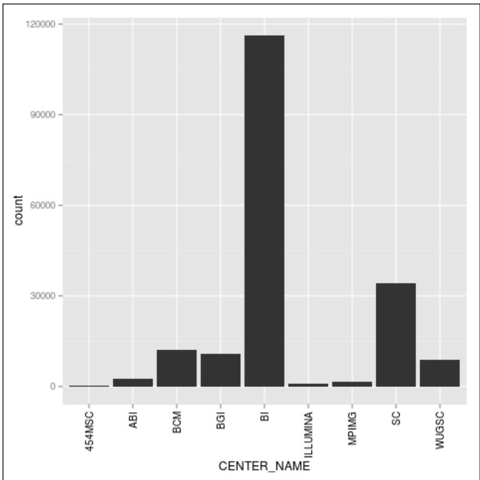
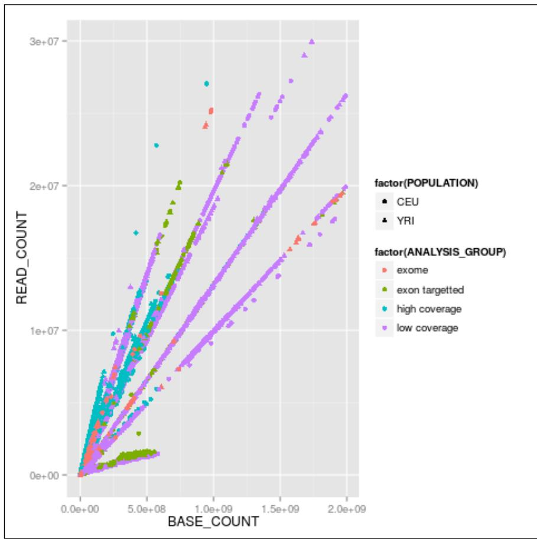

# Python and the Surrounding Software Ecology

In this chapter, we will cover the following recipes: 

f Installing the required software with Anaconda 

f Installing the required software with Docker 

f Interfacing with R via rpy2 

f Performing R magic with IPython 

## Introduction

We will start by installing the required software. This will include the Python distribution, some fundamental Python libraries, and external bioinformatics software. Here, we will also be concerned with the world outside Python. In bioinformatics and Big Data, R is also a major player; therefore, you will learn how to interact with it via rpy2 a Python/R bridge. We will also explore the advantages that the IPython framework can give us in order to efficiently interface with R. This chapter will set the stage for all the computational biology that we will perform in the rest of the book. 

## Python and the Surrounding Software Ecology

As different users have different requirements, we will cover two different approaches on how to install the software. One approach is using the Anaconda Python (http://docs. continuum.io/anaconda/) distribution and another approach to install the software via Docker (a server virtualization method based on containers sharing the same operating system kernel—https://www.docker.com/). We will also provide some help on how to use the standard Python installation tool, pip, if you use the standard Python distribution. If you have a different Python environment that you are comfortable with, feel free to continue using it. If you are using a Windows-based OS, you are strongly encouraged to consider changing your operating system or use Docker via boot2docker. 

## Installing the required software with Anaconda

Before we get started, we need to install some prerequisite software. The following sections will take you through the software and the steps needed to install them. An alternative way to start is to use the Docker recipe, after which everything will be taken care for you via a Docker container. 

If you are already using a different Python version, you are encouraged to continue using your preferred version, although you will have to adapt the following instructions to suit your environment. 

## Getting ready

Python can be run on top of different environments. For instance, you can use Python inside the JVM (via Jython) or with .NET (with IronPython). However, here, we are concerned not only with Python, but also with the complete software ecology around it; therefore, we will use the standard (CPython) implementation as that the JVM and .NET versions exist mostly to interact with the native libraries of these platforms. A potentially viable alternative will be to use the PyPy implementation of Python (not to be confused with PyPi: the Python Package index). 

An important decision is whether to choose the Python 2 or 3. Here, we will support both versions whenever possible, but there are a few issues that you should be aware of. The first issue is if you work with Phylogenetics, you will probably have to go with Python 2 because most existing Python libraries do not support version 3. Secondly, in the short term, Python 2, is generally better supported, but (save for the aforementioned Phylogenetics topic) Python 3 is well covered for computational biology. Finally, if you believe that you are in this for the long run, Python 3 is the place to be. Whatever is your choice, here, we will support both options unless clearly stated otherwise. If you go for Python 2, use 2.7 (or newer if it has been released). With Python 3, use at least 3.4. 

Chapter 1 

If you were starting with Python and bioinformatics, any operating system will work, but here, we are mostly concerned with the intermediate to advanced usage. So, while you can probably use Windows and Mac OS X, most heavy-duty analysis will be done on Linux (probably on a Linux cluster). Next-generation sequencing data analysis and complex machine learning are mostly performed on Linux clusters. 

If you are on Windows, you should consider upgrading to Linux for your bioinformatics work because many modern bioinformatics software will not run on Windows. Mac OS X will be fine for almost all analyses, unless you plan to use a computer cluster, which will probably be Linux-based. 

If you are on Windows or Mac OS X and do not have easy access to Linux, do not worry. Modern virtualization software (such as VirtualBox and Docker) will come to your rescue, which will allow you to install a virtual Linux on your operating system. If you are working with Windows and decide that you want to go native and not use Anaconda, be careful with your choice of libraries; you are probably safer if you install the 32-bit version for everything (including Python itself). 

Remember, if you are on Windows, many tools will be unavailable to you. 


Bioinformatics and data science are moving at breakneck speed; this is not just hype, it's a reality. If you install the default packages of your software framework, be sure not to install old versions. For example, if you are a Debian/Ubuntu Linux user, it's possible that the default matplotlib package of your distribution is too old. In this case, it's advised to either use a recent conda or pip package instead. 

The software developed for this book is available at https://github.com/tiagoantao/ bioinf-python. To access it, you will need to install Git. Alternatively, you can download the ZIP file that GitHub makes available (however, getting used to Git may be a good idea because lots of scientific computing software are being developed with it). 

Before you install the Python stack properly, you will need to install all the external non-Python software that you will be interoperating with. The list will vary from chapter to chapter and all chapter-specific packages will be explained in their respective chapters. Some less common Python libraries may also be referred to in their specific chapters. 

If you are not interested on a specific chapter (that is perfectly fine), you can skip the related packages and libraries. 

Of course, you will probably have many other bioinformatics applications around—such as bwa or GATK for next-generation sequencing, but we will not discuss these because we do not interact with them directly (although we might interact with their outputs). 

Python and the Surrounding Software Ecology 

You will need to install some development compilers and libraries (all free). On Ubuntu, consider installing the build-essential (apt-get it) package, and on Mac, consider Xcode (https://developer.apple.com/xcode/). 

In the following table, you will find the list of the most important Python software. We strongly recommend the installation of the IPython Notebook (now known as Project Jupyter). While not strictly mandatory, it's becoming a fundamental cornerstone for scientific computing with Python: 

<table><tr><td>Name</td><td>Usage</td><td>URL</td><td>Purpose</td></tr><tr><td>IPython</td><td>General</td><td>http://ipython.org/</td><td>General</td></tr><tr><td>NumPy</td><td>General</td><td>http://www.numpy.org/</td><td>Numerical Python</td></tr><tr><td>SciPy</td><td>General</td><td>http://scipy.org/</td><td>Scientific computing</td></tr><tr><td>matplotlib</td><td>General</td><td>http://matplotlib.org/</td><td>Visualization</td></tr><tr><td>Biopython</td><td>General</td><td>http://biopython.org/wiki/Main_Page</td><td>Bioinformatics</td></tr><tr><td>PyVCF</td><td>NGS</td><td>http://pyvcf.readthedocs.org/en/latest/</td><td>VCF processing</td></tr><tr><td>PySAM</td><td>NGS</td><td>http://pysam.readthedocs.org/en/latest/</td><td>SAM/BAM processing</td></tr><tr><td>simuPOP</td><td>Population Genetics</td><td>http://simupop.sourceforge.net/</td><td>Genetics Simulation</td></tr><tr><td>DendroPY</td><td>Phylogenetics</td><td>http://pythonhosted.org/DendroPy/</td><td>Phylogenetics</td></tr><tr><td>scikit-learn</td><td>General</td><td>http://scikit-learn.org/stable/</td><td>Machine learning</td></tr><tr><td>PyMOL</td><td>Proteomics</td><td>http://pymol.org/</td><td>Molecular visualization</td></tr><tr><td>rpy2</td><td>R integration</td><td>http://rpy.sourceforge.net/</td><td>R interface</td></tr><tr><td>pygraphviz</td><td>General</td><td>http://pygraphviz.github.io/</td><td>Graph library</td></tr><tr><td>Reportlab</td><td>General</td><td>http://reportlab.com/</td><td>Visualization</td></tr><tr><td>seaborn</td><td>General</td><td>http://web.stanford.edu/~mwaskom/software/seaborn/</td><td>Visualization/Stats</td></tr><tr><td>Cython</td><td>Big Data</td><td>http://cython.org/</td><td>High performance</td></tr><tr><td>Numba</td><td>Big Data</td><td>http://numba.pydata.org/</td><td>High performance</td></tr></table>

Chapter 1 

Note that the list of available software for Python in general and bioinformatics in particular is constantly increasing. For example, we recommend you to keep an eye on projects such as Blaze (data analysis) or Bokeh (visualization). 

## How to do it…

Here are the steps to perform the installation: 

1. Start by downloading the Anaconda distribution from http://continuum.io/ downloads. You can either choose the Python Version 2 or 3. At this stage, this is not fundamental because Anaconda will let you use the alternative version if you need it. You can accept all the installation defaults, but you may want to make sure that conda binaries are in your PATH (do not forget to open a new window so that the PATH is updated). 

‰ If you have another Python distribution, but still decide to try Anaconda, be careful with your PYTHONPATH and existing Python libraries. It's probably better to unset your PYTHONPATH. As much as possible, uninstall all other Python versions and installed Python libraries. 

2. Let's go ahead with libraries. We will now create a new conda environment called bioinformatics with Biopython 1.65, as shown in the following command: 

conda create -n bioinformatics biopython biopython=1.65 python=2.7 

If you want Python 3 (remember the reduced phylogenetics functionality, but more future proof), run the following command: conda create -n bioinformatics biopython=1.65 python=3.4 

3. Let's activate the environment, as follows: source activate bioinformatics 

4. Also, install the core packages, as follows: conda install scipy matplotlib ipython-notebook binstar pip conda install pandas cython numba scikit-learn seaborn 

5. We still need pygraphivz, which is not available on conda. Therefore, we need to use pip: 

pip install pygraphviz 

6. Now, install the Python bioinformatics packages, apart from Biopython (you only need to install those that you plan to use): 

‰ This is available on conda: 

conda install -c https://conda.binstar.org/bcbio pysam 

conda install -c https://conda.binstar.org/simupop simuPOP 

Python and the Surrounding Software Ecology 

‰ This is available via pypi: 

pip install pyvcf 

pip install dendropy 

7. If you need to interoperate with R, of course, you will need to install it; either download it from the R website at http://www.r-project.org/ or use the R provided by your operating system distribution. 

‰ On a recent Debian/Ubuntu Linux distribution, you can just run the following command as root: 

apt-get r-bioc-biobase r-cran-ggplot2 

‰ This will install Bioconductor: the main R suite for bioinformatics and ggplot2—a popular plotting library in R. Of course, this will indirectly take care of installing R. 

8. Alternatively, If you are not on Debian/Ubuntu Linux, do not have root, or prefer to install in your home directory, after downloading and installing R manually, run the following command in R: 

source("http://bioconductor.org/biocLite.R") 

biocLite() 

‰ This will install Bioconductor (for detailed instructions, refer to http:// www.bioconductor.org/install/). To install ggplot2, just run the following command in R: 

install.packages("ggplot2") 

install.packages("gridExtra") 

9. Finally, you will need to install rpy2, the R-to-Python bridge. Back at the command line, under the conda bioinformatics environment, run the following command: pip install rpy2 

## There's more…

There is no requirement to use Anaconda; you can easily install all this software on another Python distribution. Make sure that you have pip installed and install all conda packages with it, instead. You may need to install more compilers (for example, Fortran) and libraries because installation via pip will rely on compilation more than conda. However, as you also need pip for some packages under conda, you will need some compilers and C development libraries with conda, anyway. If you are on Python 3, you will probably have to perform pip3 and run Python as python3 (as python/pip will call Python 2 by default on most systems). 

In order to isolate your environment, you may want to consider using virtualenv (http:// docs.python-guide.org/en/latest/dev/virtualenvs/). This allows you to create a bioninformatics environment similar to the one on conda. 

## See also

The Anaconda (http://docs.continuum.io/anaconda/) Python distribution is commonly used, especially because of its intelligent package manager: conda. Although conda was developed by the Python community, it's actually language agnostic. 

f The software installation and package maintenance was never Python's strongest point (hence, the popularity of conda to address this issue). If you want to know the currently recommended installation policies for the standard Python distribution (and avoid old and deprecated alternatives), refer to https://packaging.python.org/. 

You have probably heard of the IPython Notebook; if not, visit their page at http://ipython.org/notebook.html. 

## Installing the required software with Docker

Docker is the most widely used framework that implements operating system-level virtualization. This technology allows you to have an independent container: a layer that is lighter than a virtual machine, but still allows you to compartmentalize software. This mostly isolates all processes, making it feel like each container is a virtual machine. 

Docker works quite well at both extremes of the development spectrum: it's an expedient way to set up the content of this book for learning purposes and may be your platform to deploy your applications in complex environments. This recipe is an alternative to the previous recipe. However, for long-term development environments, something along the lines of the previous recipe is probably your best route, although it can entail a more laborious initial setup. 

## Getting ready

If you are on Linux, the first thing you have to do is to install Docker. The safest solution is to get the latest version from https://www.docker.com/. While your Linux distribution may have a Docker package, it may be too old and buggy (remember the "advancing at breakneck speed" thingy?). 

If you are on Windows or Mac, do not despair; boot2docker (http://boot2docker.io/) is here to save you. Boot2docker will install VirtualBox and Docker for you, which allows you to run Docker containers in a virtual machine. Note that a fairly recent computer (well, not that recent, as the technology was introduced in 2006) is necessary to run our 64-bit virtual machine. If you have any problems, reboot your machine and make sure that on the BIOS, VT-X or AMD-V is enabled. At the very least, you will need 6 GB of memory, preferably more. 

Note that this will require a very large download from the Internet, so be sure that you have a big network pipe. Also, be ready to wait for a long time. 

Python and the Surrounding Software Ecology 

## How to do it…

These are the steps to be followed: 

1. Use the following command on the Linux shell or in boot2docker: 

docker build -t bio https://raw.githubusercontent.com/tiagoantao/bioinfpython/master/docker/2/Dockerfile 

‰ If you want the Python 3 version, replace the 2 with 3 versions on the URL. After a fairly long wait, all should be ready. 

‰ Note that on Linux, you will either require to have root privileges or be added to the Docker Unix group. 

2. Now, you are ready to run the container, as follows: 

docker run -ti -p 9875:9875 -v YOUR_DIRECTORY:/data bio 

3. Replace YOUR_DIRECTORY with a directory on your operating system. This will be shared between your host operating system and the Docker container. YOUR_DIRECTORY will be seen in the container on /data and vice versa. 

‰ The -p 9875:9875 will expose the container TCP port 9875 on the host computer port 9875. 

4. If you are using boot2docker, the final configuration step will be to run the following command in the command line of your operating system, not in boot2docker: 

VBoxManage controlvm boot2docker-vm natpf1 "name,tcp,127.0.0.1,9875,,9875" 


On Windows, this binary will probably be in C:\Program Files\ Oracle\VirtualBox. 

On a native Docker installation, you do not need to do anything. 

5. If you now start your browser pointing at http://localhost:9875, you should be able to get the IPython Notebook server running. Just choose the Welcome notebook to start! 

Chapter 1 

## See also

1 Docker is the most widely used containerization software and has seen enormous growth in usage in recent times. You can read more about it at https://www.docker.com/. 

You will find a paper on arXiv, which introduces Docker with a focus on reproducible research at http://arxiv.org/abs/1410.0846. 

## Interfacing with R via rpy2

If there is some functionality that you need and cannot find it in a Python library, your first port of call is to check whether it's implemented in R. For statistical methods, R is still the most complete framework; moreover, some bioinformatics functionalities are also only available in R, most probably offered as a package belonging to the Bioconductor project. 

The rpy2 provides provides a declarative interface from Python to R. As you will see, you will be able to write very elegant Python code to perform the interfacing process. 

In order to show the interface (and try out one of the most common R data structures, the data frame, and one of the most popular R libraries: ggplot2), we will download its metadata from the Human 1000 genomes project (http://www.1000genomes.org/). As this is not a book on R, we do want to provide any interesting and functional examples. 

## Getting ready

You will need to get the metadata file from the 1000 genomes sequence index. Please check https://github.com/tiagoantao/bioinf-python/blob/master/notebooks/ Datasets.ipynb and download the sequence.index file. If you are using notebooks, open the 00_Intro/Interfacing_R notebook.ipynb and just execute the wget command on top. 

This file has information about all FASTQ files in the project (we will use data from the Human 1000 genomes project in the chapters to come). This includes the FASTQ file, the sample ID, and the population of origin and important statistical information per lane, such as the number of reads and number of DNA bases read. 

Python and the Surrounding Software Ecology 

## How to do it…

Take a look at the following steps: 

1. We start by importing rpy2 and reading the file, using the read_delim R function: 

```python
import rpy2.robjects as robjects
read_delim = robjects.r('read.delim')
seq_data = read_delim('sequence.index', header=True, stringsAsFactors=False)
# In R:
# seq.data <- read.delim('sequence.index', header=TRUE,
# stringsAsFactors=FALSE) 
```

‰ The first thing that we do after importing is accessing the read.delim R function that allows you to read files. 

‰ Note that the R language specification allows you to put dots in the names of objects. Therefore, we have to convert a function name to read_delim. 

2. Then, we call the function proper; note the following highly declarative features. First, most atomic objects—such as strings—can be passed without conversion. Second, argument names are converted seamlessly (barring the dot issue). Finally, objects are available in the Python namespace (but objects are actually not available in the R namespace; more about this later). For reference, I have included the corresponding R code. I hope it's clear that it's an easy conversion. 

‰ The seq_data object is a data frame. If you know basic R or the Python pandas library, you are probably aware of this type of data structure; if not, then this is essentially a table: a sequence of rows where each column has the same type. Let's perform a basic inspection of this data frame as follows: 

```python
print('This dataframe has %d columns and %d rows' % (seq_data.ncol, seq_data.nrow))
print(seq_data.colnames)
# In R:
# print(colnames(seq.data))
# print(nrow(seq.data))
# print(ncol(seq.data)) 
```

‰ Again, note the code similarity. You can even mix styles using the following code: 

```python
my_cols = robjects.r.ncol(seq_data)
print(my_cols) 
```

‰ You can call R functions directly; in this case, we will call ncol if they do not have dots in their name; however, be careful. This will display an output, not 26 (the number of columns), but [26] which is a vector composed of the element 26. This is because by default, most operations in R return vectors. If you want the number of columns, you have to perform my_cols[0]. Also, talking about pitfalls, note that R array indexing starts with 1, whereas Python starts with 0. 

3. Now, we need to perform some data cleanup. For example, some columns should be interpreted as numbers, but they are read as strings: 

```python
as_integer = robjects.r('as.integer')
match = robjects.r.match
my_col = match('BASE_COUNT', seq_data.colnames)[0]
print(seq_data[my_col - 1][:3])
seq_data[my_col - 1] = as_integer(seq_data[my_col - 1])
print(seq_data[my_col - 1][:3]) 
```

‰ The match function is somewhat similar to the index method in Python lists. As expected, it returns a vector so that we can extract the 0 element. It's also 1-indexed, so we subtract one when working on Python. The as_integer function will convert a column to integers. The first print will show strings (values surrounded by "), whereas the second print will show numbers. 

4. We will need to massage this table a bit more; details can be found on a notebook, but here we will finalize with getting the data frame to R (remember that while it's an R object, it's actually visible on the Python namespace only): 

```python
robjects.r.assign('seq.data', seq_data) 
```

‰ This will create a variable in the R namespace called seq.data with the content of the data frame from the Python namespace. Note that after this operation, both objects will be independent (if you change one, it will not be reflected on the other). 


While you can perform plotting on Python, R has default built-in plotting functionalities (which we will ignore here). It also has a library called ggplot2 that implements the Grammar of Graphics (a declarative language to specify statistical charts). 

Python and the Surrounding Software Ecology 

5. We will finalize our R integration example with a plot using ggplot2. This is particularly interesting, not only because you may encounter R code using ggplot2, but also because the drawing paradigm behind the Grammar of Graphics is really revolutionary and may be an alternative that you may want to consider instead of the more standard plotting libraries, such as matplotlib ggplot2 is so pervasive that rpy2 provides a Python interface to it: 

```txt
import rpy2.robjects.lib.ggplot2 as ggplot2 
```

6. With regards to our concrete example based on the Human 1000 genomes project, we will first plot a histogram with the distribution of center names, where all sequencing lanes were generated. The first thing that we need to do is to output the chart to a PNG file. We call the R png() function as follows: robjects.r.png('out.png') 

7. We will now use ggplot to create a chart, as shown in the following command: 

```python
from rpy2.robjects.functions import SignatureTranslatedFunction
ggplot2.theme = SignatureTranslatedFunction(ggplot2.theme,
    init_prm_translate={'axis_text_x': 'axis.text.x'})
bar = ggplot2.ggplot(seq_data) + ggplot2.geom_bar() +
    ggplot2.aes_string(x='CENTER_NAME') +
    ggplot2.theme(axis_text_x=ggplot2.element_text(angle=90,
    hjust=1))
bar.plot()
dev_off = robjects.r('dev.off')
dev_off() 
```

‰ The second line is a bit uninteresting, but is an important boilerplate code. One of the R functions that we will call has a parameter with a dot in its name. As Python function calls cannot have this, we map the axis.text.x R parameter name to the axis_text_x Python name in the function theme. We monkey patch it (that is, we replace ggplot2.theme with a patched version of itself). 

8. We then draw the chart itself. Note the declarative nature of ggplot2 as we add features to the chart. First, we specify the seq_data data frame, then we will use a histogram bar plot called geom_bar, followed by annotating the X variable (CENTER_NAME). 

9. Finally, we rotate the text of the x axis by changing the theme. 

‰ We finalize by closing the R printing device. If you are in an IPython console, you will want to visualize the PNG image as follows: 

```python
from IPython.display import Image
Image(filename='out.png') 
```

## ‰ This chart produced is as follows:




Figure 1: The ggplot2-generated histogram of center names responsible for sequencing lanes of human genomic data of the 1000 genomes project


10. As a final example, we will now do a scatter plot of read and base counts for all the sequenced lanes for Yoruban (YRI) and Utah residents with ancestry from Northern and Western Europe (CEU) of the Human 1000 genomes project (the summary of the data of this project, which we will use thoroughly, can be seen in the Working with modern sequence formats recipe in Chapter 2, Next-generation Sequencing). We are also interested in the difference among the different types of sequencing (exome, high, and low coverage). We first generate a data frame with just YRI and CEU lanes and limit the maximum base and read counts: 

```r
robjects.r('yri_ceu <- seq.data[seq.data$POPULATION %in%
c("YRI", "CEU") & seq.data$BASE_COUNT < 2E9 &
seq.data$READ_COUNT < 3E7, ]')
robjects.r('yri_ceu$POPULATION <-
as.factor(yri_ceu$POPULATION)')
robjects.r('yri_ceu$ANALYSIS_GROUP <-
as.factor(yri_ceu$ANALYSIS_GROUP)') 
```

Python and the Surrounding Software Ecology 

‰ The last two lines convert the POPULATION and ANALYSIS_GROUPS to factors, a concept similar to categorical data. 

11. We are now ready to plot: 

```python
yri_ceu = robjects.r('yri_ceu')
scatter = ggplot2.ggplot(yri_ceu) + ggplot2.geom_point() + \
ggplot2.aes_string(x='BASE_COUNT', y='READ_COUNT',
shape='factor(POPULATION)', col='factor(ANALYSIS_GROUP)')
scatter.plot() 
```

‰ Hopefully, this example (refer to the following screenshot) makes the power of the Grammar of Graphics approach clear. We will start by declaring the data frame and the type of chart in use (the scatter plot implemented by geom point). Note how easy it is to express that the shape of each point depends on the POPULATION variable and the color on the ANALYSIS_GROUP: 




Figure 2: The ggplot2-generated scatter plot with base and read counts for all sequencing lanes read; the color and shape of each dot reflects categorical data (population and the type of data sequenced)


Chapter 1 

12. Finally, when you think about Python and R, you probably think about pandas: the R-inspired Python library designed with data analysis and modeling in mind. One of the fundamental data structures in pandas is (surprise) the data frame. It's quite easy to convert backward and forward between R and pandas, as follows: 

```python
import pandas.rpy.common as pd_common
pd_yri_ceu = pd_common.load_data('yri_ceu')
del pd_yri_ceu['PAIRED_FASTQ']
no_paired = pd_common.convert_to_r_dataframe(pd_yri_ceu)
robjects.r.assign('no.paired', no_paired)
robjects.r("print(colnames(no.paired)") 
```

‰ We start by importing the necessary conversion module. We then convert the R data frame (note that we are converting the yri_ceu in the R namespace, not the one on the Python namespace). We delete the column that indicates the name of the paired FASTQ file on the pandas data frame and copy it back to the R namespace. If you print the column names of the new R data frame, you will see that PAIRED_FASTQ is missing. 

口 As this book enters production, the pandas.rpy module is beingdeprecated (although it's still available).

In the interests of maintaining the momentum of the book, we will not delve into pandas programming (there are plenty of books on this), but I recommend that you take a look at it, not only in the context of interfacing with R, but also as a very good library for data management of complex datasets. 

## There's more…

It's worth repeating that the advancements on the Python software ecology are occurring at a breakneck pace. This means that if a certain functionality is not available today, it might be released sometime in the near future. So, if you are developing a new project, be sure to check for the very latest developments on the Python front before using a functionality from an R package. 

There are plenty of R packages for bioinformatics in the Bioconductor project (http:// www.bioconductor.org/). This should probably be your first port of call in the R world for bioinformatics functionalities. However, note that there are many R bioinformatics packages that are not on Bioconductor, so be sure to search the wider R packages on CRAN (refer to the Comprehensive R Archive Network at http://cran.r-project.org/). 

There are plenty of plotting libraries for Python. matplotlib is the most common library, but you also have a plethora of other choices. In the context of R, it's worth noting that there is a ggplot2-like implementation for Python based on the Grammar of Graphics description language for charts and this is called—surprise-surprise—ggplot! (http://ggplot.yhathq.com/). 

## See also

There are plenty of tutorials and books on R; check the R web page (http://www.r-project.org/) for documentation. 

f For Bioconductor, check the documentation at http://manuals. bioinformatics.ucr.edu/home/R_BioCondManual. 

If you work with NGS, you might also want to check High Throughput Sequence Analysis with Bioconductor at http://manuals.bioinformatics.ucr.edu/ home/ht-seq. 

f The rpy library documentation is your Python gateway to R at http://rpy. sourceforge.net/. 

The Grammar of Graphics is described in a book aptly named The Grammar of Graphics, Leland Wilkinson, Springer. 

In terms of data structures, similar functionality to R can be found on the pandas library. You can find some tutorials at http://pandas.pydata.org/pandasdocs/dev/tutorials.html. The book, Python for Data Analysis, Wes McKinney, O'Reilly Media, is also an alternative to consider. 

## Performing R magic with IPython

You have probably heard of, and maybe used, the IPython Notebook. If not, then I strongly recommend you try it as it's becoming the standard for reproducible science. Among many other features, IPython provides a framework of extensible commands called magics, which allows you to extend the language in many useful ways. 

There are magic functions to deal with R. As you will see in our example, it makes R interfacing much more declarative and easy. This recipe will not introduce any new R functionalities, but hopefully, it will make clear how IPython can be an important productivity boost for scientific computing in this regard. 

## Getting ready

You will need to follow the previous getting ready steps of the rpy2 recipe. You will also need IPython. You can use the standard command line or any of the IPython consoles, but the recommended environment is the notebook. 

If you are using our notebooks, open the 00_Intro/R_magic.ipynb notebook. A notebook is more complete than the recipe presented here with more chart examples. For brevity here, we concentrate only on the fundamental constructs to interact with R using magics. 

Chapter 1 

## How to do it…

This recipe is an aggressive simplification of the previous one because it illustrates the conciseness and elegance of R magics: 

1. The first thing you need to do is load R magics and ggplot2: 

import rpy2.robjects.lib.ggplot2 as ggplot2 

%load_ext rpy2.ipython 

‰ Note that the % starts an IPython-specific directive. 

‰ Just as a simple example, you can write on your IPython prompt: %R print(c(1, 2)) 

‰ See how easy it's to execute the R code without using the robjects package. Actually, rpy2 is being used to look under the hood, but it has been made transparent. 

2. Let's read the sequence.index file that was downloaded in the previous recipe: %%R 

seq.data <- read.delim('sequence.index', header=TRUE, stringsAsFactors=FALSE) 

seq.data$READ_COUNT <- as.integer(seq.data$READ_COUNT) 

```txt
seq.data$BASE_COUNT <- as.integer(seq.data$BASE_COUNT) 
```

‰ Note that you can specify that the whole IPython cell should be interpreted as R code (note the double %%). As you can see, there is no need for a function parameter name translation or (alternatively) explicitly call the robjects.r to execute a code. 

3. We can now transfer a variable to the Python namespace (where we could have done Python-based operations): 

seq_data = %R seq.data 

4. Let's put this data frame back in the R namespace, as follows: 

```batch
%R -i seq_data 
```

%R print(colnames(seq_data)) 

‰ The -i argument informs the magic system that the variable that follows on the Python space is to be copied in the R namespace. The second line just shows that the data frame is indeed available in R. We actually did not do anything with the data frame in the Python namespace, but this serves as an example on how to inject an object back into R. 

## Python and the Surrounding Software Ecology

5. The R magic system also allows you to reduce code as it changes the behavior of the interaction of R with IPython. For example, in the ggplot2 code of the previous recipe, you do not need to use the .png and dev.off R functions, as the magic system will take care of this for you. When you tell R to print a chart, it will magically appear in your notebook or graphical console. For example, the histogram plotting code from the previous recipe is now simply: 

```r
bar <- ggplot(seq_data) + aes(factor(CENTER_NAME)) +
geom_bar() + theme(axis.text.x = element_text(angle = 90, hjust = 1))
print(bar) 
```

R magics makes interaction with R particularly easy. This is true if you think about how cumbersome multiple language integration tends to be. 

The notebook has a few more examples, especially with chart printing, but the core of R-magic interaction is explained before. 

## See also

For basic instructions on IPython magics, see this notebook at http://nbviewer. ipython.org/github/ipython/ipython/blob/1.x/examples/notebooks/ Cell%20Magics.ipynb 

A list of default extensions is available at http://ipython.org/ipython-doc/ dev/config/extensions/ 

A list of third-party magic extensions can be found at https://github.com/ ipython/ipython/wiki/Extensions-Index 


## Downloading the example code

You can download the example code files from your account at http://www.packtpub.com for all the Packt Publishing books you have purchased. If you purchased this book elsewhere, you can visit http://www.packtpub.com/support and register to have the files e-mailed directly to you. 

