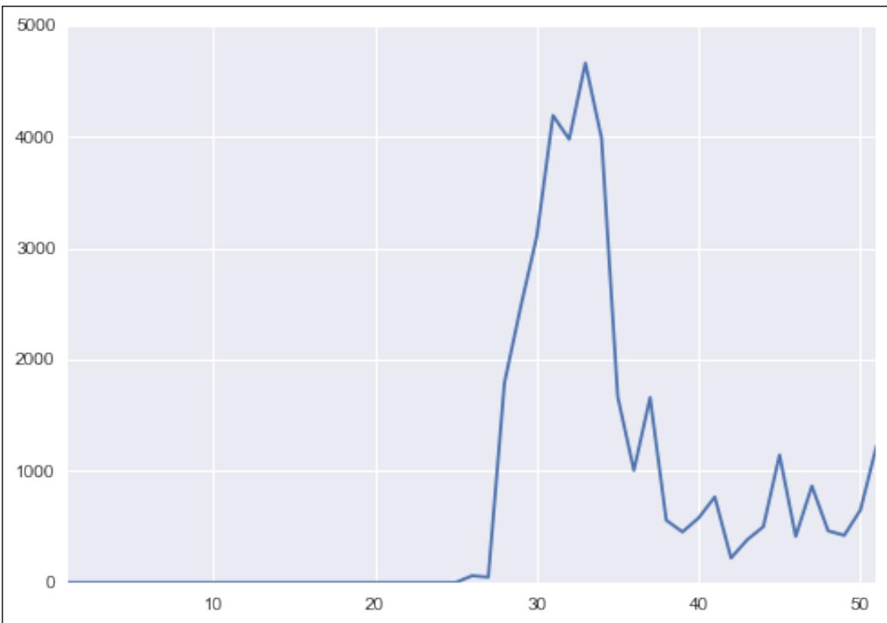
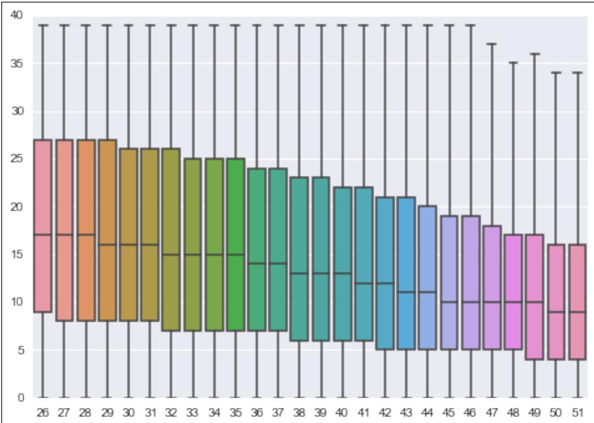
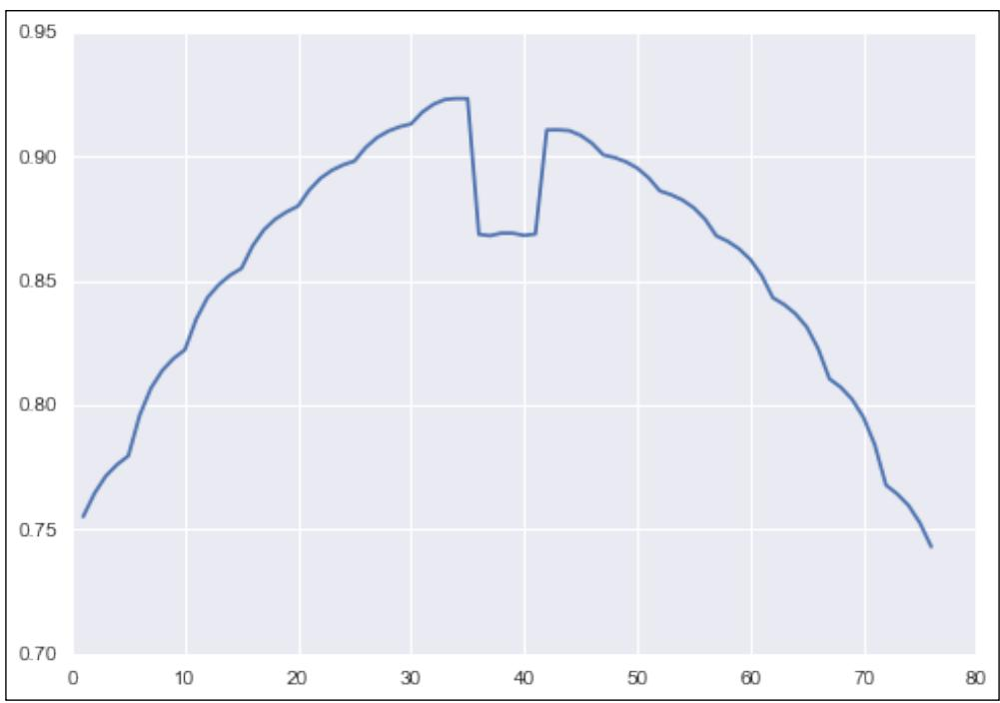
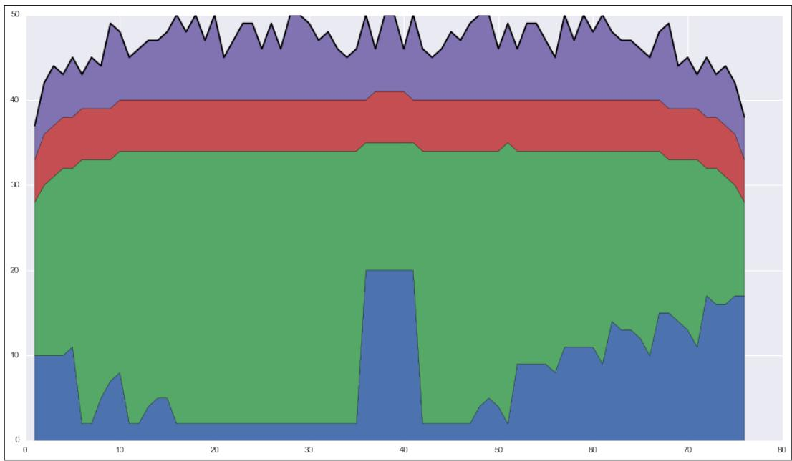
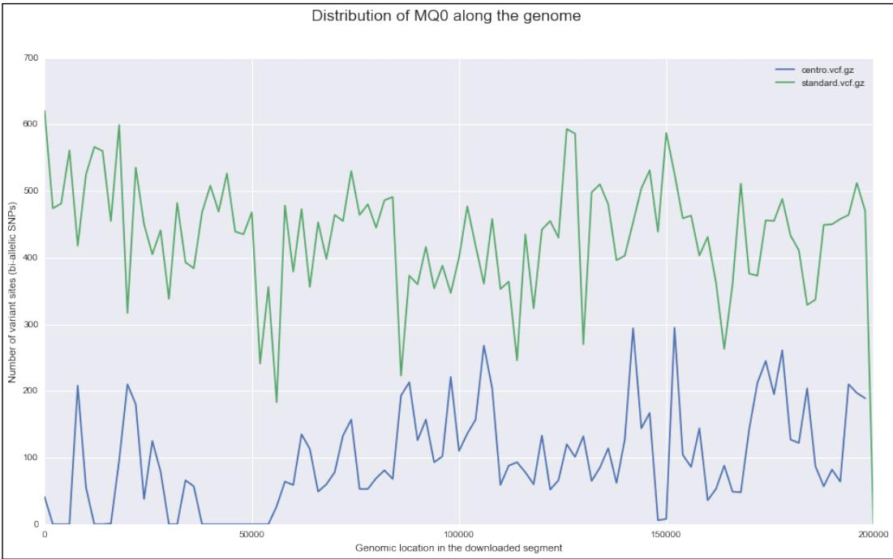
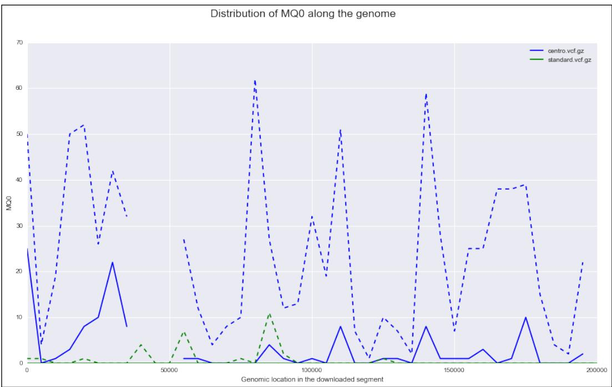
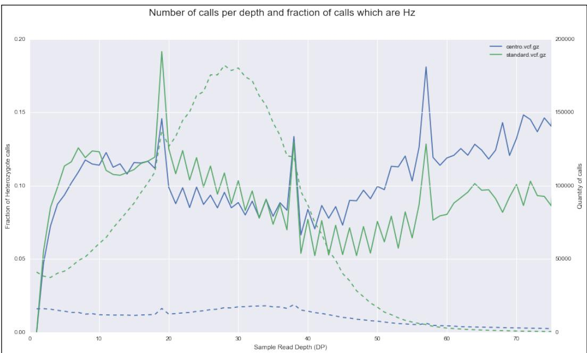
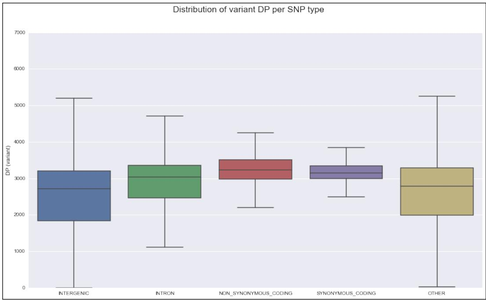

# Next-generation Sequencing

In this chapter, we will cover the following recipes: 

f Accessing GenBank and moving around NCBI databases 

f Performing basic sequence analysis 

f Working with modern sequence formats 

Working with alignment data 

f Analyzing data in variant call format (VCF) 

f Studying genome accessibility and filtering SNP data 

## Introduction

Next-generation Sequencing (NGS) is one of the fundamental technological developments of the decade in life sciences. Whole Genome Sequencing (WGS), RAD-Seq, RNA-Seq, Chip-Seq, and several other technologies are routinely used to investigate important biological problems. These are also called high-throughput sequencing technologies with good reason: they generate vast amounts of data that need to be processed. NGS is the main reason for computational biology becoming a "big data" discipline. More than anything else, this is a field that requires strong bioinformatics techniques. There is a very strong demand for professionals with these skillsets. 

## Next-generation Sequencing

Here, we will not discuss each individual NGS technique per se (this will require a whole book on its own). We will use an existing WGS dataset and the human 1000 genomes project to illustrate the most common steps necessary to analyze genomic data. The recipes presented here will be easily applicable for other genomic sequencing approaches. Some of them can also be used for transcriptomic analysis (for example, RNA-Seq). The recipes are also species-independent. So, you will be able to apply them to any other species for which you have sequenced data. The biggest difference in processing data from different species is related to genome size, diversity, and the quality of the assembled genome (if it exists for your species). These will not affect the automated Python part of NGS processing much. In any case, we will discuss different genomes in the next chapter. 

As this is not an introductory book, you are expected to know at least what FASTA, FASTQ, BAM, and VCF files are. I will also make use of the basic genomic terminology without introducing it (such as exomes, nonsynonymous mutations, and so on). You are required to be familiar with basic Python. We will leverage this knowledge to introduce the fundamental libraries in Python to perform the NGS analysis. Here, we will follow the flow of a standard bioinformatics pipeline. 

However, before we delve into real data from a real project, let's get comfortable with accessing existing genomic databases and basic sequence processing. A simple start before the storm. 

## Accessing GenBank and moving around NCBI databases

Although you may have your own data to analyze, you will probably need existing genomic datasets. Here, we will see how to access these databases at the National Center for Biotechnology Information (NCBI). We will not only discuss GenBank, but also other databases at NCBI. Many people refer (wrongly) to the whole set of NCBI databases as GenBank, but NCBI includes the nucleotide database and many others, for example, PubMed. As sequencing analysis is a long subject and this book targets intermediate to advanced users, we will not be very exhaustive with a topic that is, at its core, not very complicated. Nonetheless, it's a good warm-up for more complex recipes at the end of this chapter. 

## Getting ready

We will use Biopython, which you installed in Chapter 1, Python and the Surrounding Software Ecology. Biopython provides an interface to Entrez, the data retrieval system made available by NCBI. This recipe is made available in the 01_NGS/Accessing_Databases.ipynb notebook. 


You will be accessing a live API from NCBI. Note that the performance of the system may vary during the day. Furthermore, you are expected to be a "good citizen" while using it. You will find some recommendations at http:// www.ncbi.nlm.nih.gov/books/NBK25497/#chapter2.Usage_ Guidelines_and_Requiremen. Notably, you are required to specify an e-mail address with your query. You should try to avoid large number of requests (100 or more) during peak times (between 9.00 a.m. and 5.00 p.m. American Eastern Time on weekdays) and do not post more than three queries per second (Biopython will take care of this for you). It's not only good citizenship, but you risk getting blocked if you over use NCBI's servers (a good reason to give a real e-mail address because NCBI may try to contact you). 

## How to do it…

Now, let's see how we can search and fetch data from NCBI databases: 

1. We start by importing the relevant module and configuring the e-mail address: 

```python
from Bio import Entrez, SeqIO
Entrez.email = 'put@your.email.here' 
```

We will also import the module to process sequences. Do not forget to put the correct e-mail address. 

2. We will now try to find the Cholroquine Resistance Transporter (CRT) gene in Plasmodium falciparum (the parasite that causes the deadliest form of malaria) on the nucleotide database: 

```python
handle = Entrez.search(db='nucleotide', term='CRT [Gene Name] AND "Plasmodium falciparum"[Organism]) rec_list = Entrez.read(handle)
if rec_list['RetMax'] < rec_list['Count']:
    handle = Entrez.search(db='nucleotide', term='CRT [Gene Name] AND "Plasmodium falciparum"[Organism]', retmax=rec_list['Count'])
    rec_list = Entrez.read(handle) 
```

‰ We start by searching the nucleotide database for our gene and organism (for the syntax of the search string, check the NCBI website). Then, we read the result that is returned. Note that the standard search will limit the number of record references to 20, so if you have more, you may want to repeat the query with an increased maximum limit. In our case, we will actually override the default limit with retmax. 

‰ The Entrez system provides quite a few sophisticated ways to retrieve large number of results (for more information, check the Biopython or NCBI Entrez documentation). Although you now have the IDs of all records, you still need to retrieve the records proper. 

## Next-generation Sequencing

3. Let's now try to retrieve all these records. The following query will download all matching nucleotide sequences from GenBank, which are 281 at the time of writing this book. You probably do not want to do this all the time: 

```python
id_list = rec_list['IdList']
hdl = Entrez.efetch(db='nucleotide', id=id_list, rettype='gb') 
```

‰ Well, in this case, go ahead and do it. However, be careful with this technique because you will retrieve a large amount of complete records and some of them will have fairly large sequences inside. You risk downloading a lot of data (both are a strain on your side and on NCBI servers). 

‰ There are several ways around this. One way is to make a more restrictive query and/or download just a few at a time and stop when you have found the one that is enough. The precise strategy will depend on what you are trying to achieve. In any case, we will retrieve a list of records in the GenBank format (which includes sequences plus a lot of interesting metadata). 

4. Let's read and parse the result: 

```python
recs = list(SeqIO.parse(hdl, 'gb')) 
```

‰ Note that we have converted an iterator (the result of SeqIO.parse) to a list. The advantage is that we can use the result as many times as we want (for example, iterate many times over), without repeating the query on the server. This saves time, bandwidth, and server usage if you plan to iterate many times over. The disadvantage is that it will allocate memory for all records. This will not work for very large datasets; you might not want to do this genome-wide like in the next chapter. We will return to this topic in the last part of the book. If you are doing interactive computing, you will probably prefer to have a list (so that you can analyze and experiment with it multiple times), but if you are developing a library, an iterator will probably be the best approach. 

5. We will now just concentrate on a single record. This will only work if you used the exact same preceding query: 

```python
for rec in recs:
    if rec.name == 'KM288867':
    break 
```

‰ The rec variable now has our record of interest. The rec.description will contain its human-readable description. 

6. Let's now extract some sequence features, which contain information such as gene products and exon positions on the sequence: 

```python
for feature in rec.features:
    if feature.type == 'gene':
    print(feature.qualifiers['gene']) 
```

Chapter 2 

```python
elif feature.type == 'exon':
    loc = feature.location
    print(loc.start, loc.end, loc.strand)
else:
    print('not processed:\n%s' % feature) 
```

‰ If the feature type is gene, we will print its name, which will be in the qualifiers dictionary. 

‰ We will also print all locations of exons. Exons, as with all features, have locations in this sequence: a start, an end, and the strand from where they are read. While all the start and end positions for our exons are ExactPosition, note that Biopython supports many other types of positions. One type of position is BeforePosition, which specifies that a location point is before a certain sequence position. Another type of position is BetweenPosition, which gives the interval for a certain location start/end. There are quite a few more position types; these are just some examples. Coordinates will be specified in way that you will be able to retrieve the sequence from a Python array with ranges easily, so generally the start will be one before the value on the record and the end will be equal. The issue of coordinate systems will be revisited in future recipes. 

‰ For other feature types, we simply print them. Note that Biopython will provide a human-readable version of the feature when you print it. 

7. We will now look at the annotations on the record, which is mostly metadata that is not related to the sequence position: 

```python
for name, value in rec.annotations.items():
    print('%s=%s' % (name, value)) 
```

‰ Note that some values are not strings; they can be numbers or even lists (for example, the taxonomy annotation is a list). 

8. Last but not least, you can access the fundamental piece of information, the sequence: 

```txt
sequence = rec.seq 
```

The sequence object will be the main topic of our next recipe. 

## There's more…

There are many more databases at NCBI. You will probably want to check the short read archive (SRA) database if you are working with next-generation sequencing data. The SNP database will contain information on Single-nucleotide Polymorphisms (SNPs), whereas the protein database will have protein sequences, and so on. A full list of databases in Entrez is linked in the See also section of this recipe. 

## Next-generation Sequencing

Another database that you probably already know about NCBI is PubMed, which includes a list of scientific and medical citations, abstracts, even full texts. You can also access it via Biopython. Furthermore, GenBank records often contain links to PubMed. For example, we can perform this on our previous record, as shown here: 

```python
from Bio import Medline
refs = rec.annotations['references']
for ref in refs:
    if ref.pubmed_id != ''':
    print(ref.pubmed_id)
    handle = Entrez.efetch(db='pubmed', id=[ref.pubmed_id],
    rettype='medline', retmode='text')
    records = Medline.parse(handle)
    for med_rec in records:
    print(med_rec) 
```

This will take all reference annotations; check whether they have a PubMed identifier and then access the PubMed database to retrieve the records, parse them, and then print them. The output per record is a Python dictionary. Note that there are many references to external databases on a typical GenBank record. 

Of course, there are many other biological databases outside NCBI, such as Ensemb (http://www.ensembl.org) and UCSC Genome Bioinformatics (http://genome.ucsc. edu/). The support for many of these databases in Python will vary a lot. 

An introductory recipe on biological databases will not be complete without at least a passing reference to BLAST. BLAST is an algorithm that assesses the similarity of sequences. NCBI provides a service that allows you to compare your sequence of interest against its own database. Of course, you can have your local BLAST database instead of using NCBI's service. Biopython provides extensive support for this, but as this is too introductory, I will just refer you to the Biopython tutorial. 

## See also

You can find more examples on the Biopython tutorial at http://biopython.org/ DIST/docs/tutorial/Tutorial.html 

A list of accessible NCBI databases can be found at http://www.ncbi.nlm.nih. gov/gquery/ 

f A great Q&A site where you can find help for your problems with databases and sequence analysis is biostars (http://www.biostars.org); you can use it for all the content in this book, not just for this recipe. 

Chapter 2 

## Performing basic sequence analysis

We will now do some basic analysis on DNA sequences. We will work with FASTA files and do some manipulation, such as reverse complementing or transcription. As with the previous recipe, we will use Biopython, which you installed in Chapter 1, Python and the Surrounding Software Ecology. These two recipes provide you with the necessary introductory building blocks in which we will perform all the modern next-generation sequencing analysis, and then genome processing in this and the next chapter. 

## Getting ready

If you are using notebooks, then open 01_NGS/Basic_Sequence_Processing.ipynb. If not, you will need to download a FASTA sequence. We will use the human lactase gene as an example; you can get this using the knowledge you got from the previous recipe using Entrez research interface: 

```python
from Bio import Entrez, SeqIO
Entrez.email = "your@email.here"
hdl = Entrez.efetch(db='nucleotide', id=['NM_002299'], rettype='fasta') # Lactase gene
seq = SeqIO.read(hdl, 'fasta') 
```

Note that our example sequence is available on the Biopython sequence record. 

## How to do it…

Let's take a look at the following steps: 

1. As our sequence of interest is available in a Biopython sequence object, let's start by saving it to a FASTA file on our local disk: 

```python
from Bio import SeqIO
w_hdl = open('example.fasta', 'w')
w_seq = seq[11:5795]
SeqIO.write([w_seq], w_hdl, 'fasta')
w_hdl.close() 
```


Note that we chose a subset of a sequence to write what was hardcoded in our known case. If you look at the features of the downloaded sequence, you will see that it corresponds to the Coding Sequence (CDS) part. When you download a sequence, it may have more than the code part of the gene. It probably has the coding sequence and exons. This includes everything that is not removed by RNA splicing (which is more than the coding sequence) and many other features. In this case, we have chosen a sequence with only a single CDS entry, but in general, you may have to go through multiple CDS features in order to reconstruct the coding sequence (that is, start and end codons plus all codons coding amino acids). So, do not forget that the downloaded "gene sequence" is normally bigger than the exomic part, which is bigger than the coding (CDS) part. 

The SeqIO.write function takes a list of sequences to write (not just a single one). Be careful with this idiom. If you want to write many sequences (easily millions with NGS), do not use a list, as shown in the preceding code because this will allocate massive amounts of memory. Either use an iterator or use the SeqIO.write function several times with a subset of sequence on each write. 

2. In most situations, you will actually have the sequence on the disk, so you will be interested in reading it: 

```python
recs = SeqIO.parse('example.fasta', 'fasta')
for rec in recs:
    seq = rec.seq
    print(rec.description)
    print(seq[:10])
    print(seq.alphabet) 
```

‰ Here, we are concerned with processing a single sequence, but FASTA files can contain multiple records. The Python idiom to perform this is quite easy. To read a FASTA file, you just use standard iteration techniques. 

‰ For our example, the preceding code will print: 

gi|32481205|ref|NM_002299.2| Homo sapiens lactase (LCT), mRNA 

GTTCCTAGAA 

```txt
SingleLetterAlphabet() 
```

Chapter 2 

‰ The first line is the FASTA textual descriptor (remember that FASTA files contain a description line followed by a sequence for an arbitrary number of sequences). Although, in theory, this can be anything, it's common that it has some structure. For example, in the preceding NCBI example, you have the unique gi number, followed by the reference sequence ID and a textual description. This means that in theory, the arbitrary description string is most probably amenable to automated parsing. If you do not know how a FASTA file looks, just open the example.fasta file with a text editor. 

‰ Note that we printed seq[:10]. The sequence object can use typical array slices to get part of a sequence. 

3. We will now change the alphabet of our sequence: 

```python
from Bio import Seq
from Bio.Alphabet import IUPAC
seq = Seq.Seq(str(seq), IUPAC.unambiguous_dna) 
```

‰ Probably the biggest value of the sequence object (compared to a simple string) comes from the alphabet information. The sequence object will be able to impose useful constraints and operations on the underlying string, based on the expected alphabet. The original alphabet on the FASTA file is not very informative, but in this case, we know that we have a DNA alphabet. So, we create a new sequence with a more informative alphabet. 

4. As we now have an unambiguous DNA, we can transcribe it as follows: 

```python
rna = Seq.Seq(str(seq), IUPAC.unambiguous_dna)
rna = seq.transpose()
print(rna) 
```


Note that the Seq constructor takes a string, not a sequence. You will see that the alphabet of the rna variable is now IUPACUnambigousRNA. 

5. Finally, we can translate our gene into a protein: 

```txt
prot = seq.translate()
print(prot) 
```

Now, we have a protein alphabet with the annotation that there is a stop codon (so, our protein is complete). 

## Next-generation Sequencing

## There's more…

Much more can be said about the management of sequence in Biopython, but this is mostly introductory material that you can find in the Biopython tutorial. I think it's important to give you a taste of sequence management, mostly for completion purposes. In order to support readers who might have some experience in other bioinformatics' fields, but are actually starting with sequence analysis, there are nonetheless a few points that you should be aware of: 

f When you perform an RNA translation to get your protein, be sure to use the correct genetic code. Even if you are working with "common" organisms (such as humans), remember that the mitochondrial genetic code is different. 

f Biopython's Seq object is much more flexible than is shown here. For some good examples, refer to the Biopython tutorial. However, this recipe will be enough for the work we need to do with FASTQ files (see the next recipe). 

f To deal with strand-related issues there are, as expected, sequence functions like reverse_complement. 

## See also

f Genetic codes known to Biopython are the ones specified by NCBI at http://www.ncbi.nlm.nih.gov/Taxonomy/Utils/wprintgc.cgi 

f As in the previous recipe, the Biopython tutorial is your main port of call and is available at http://biopython.org/DIST/docs/tutorial/Tutorial.html 

f Be sure to also check the Biopython SeqIO page at http://biopython.org/wiki/SeqIO 

## Working with modern sequence formats

Here, we will work with FASTQ files, the standard format output by modern sequencers. You will learn how to work with quality scores per base and also consider the variations in output coming from different sequencing machines and databases. This is the first recipe that will use real data (big data) from the human 1000 genomes project. We will start with a brief description of the project. 

## Getting ready

The human 1000 genomes project aims to catalog world-wide human genetic variation and takes advantage of modern sequencing technology to do WGS. This project makes all data publicly available, which includes output from sequencers, sequence alignments, and SNP calls, among many other artifacts. The name 1000 genomes is actually a misnomer because it currently includes more than 2500 samples. These samples are divided into 26 populations, spanning the whole planet. We will mostly use data from four populations: African Yorubans (YRI), Utah Residents with Northern and Western European Ancestry (CEU), Japanese in Tokyo (JPT), and Han Chinese in Beijing (CHB). The reason we chose these specific populations is because they were the first ones that came from HapMap, an old project with similar goals. They used genotyping arrays to know more about the quality of this subset. We will revisit the 1000 genomes and HapMap projects in the chapter on population genetics. 


Next-generation datasets are generally very large. As we will be using real data, some of the files that you will download will be big. While I have tried to choose the smallest real examples possible, you will still need a good network connection and considerably large amount of disk space. Waiting for the download will probably be your biggest hurdle in this case, but data management is a serious problem with NGS. In real life, you will need to budget time for data transfer, allocate disk space (which can be financially costly), and consider backup policies. The most common initial mistake with NGS is to think that these problems are trivial, but they are not. An operation like copying a set of BAM files to a network, or even on your computer, will become a headache. Be prepared. After downloading large files, at the very least, you should check that the size is correct. Some databases offer MD5 checksums. You can compare these checksums with the ones on the files you downloaded by using tools like md5sum. 

If you use notebooks, do not forget to download the data, as specified on the first cell of 01 NGS/Working_with_FASTQ.ipynb. If not, download the file SRR003265.filt.fastq.gz, which is linked in https://github.com/tiagoantao/bioinf-python/blob/master/ notebooks/Datasets.ipynb. This is a fairly small file (27 MB) and represents part of a sequenced data of a Yoruban female (NA18489). If you refer to the 1000 genomes project, you will see that vast majority of FASTQ files are much bigger (up to 2 orders of magnitude bigger). 

The processing of FASTQ sequence files will mostly be performed (using Biopython). Let's do it. 

Next-generation Sequencing 

## How to do it…

Before we start coding, let's take a look at the FASTQ file, in which you will have many records, as shown in the following code: 

```objectivec
@SRR003258.1 30443AAXX:1:1:1053:1999 length=51
ACCCCCCCACCCCCCCCCCCCCCCCCCCACACACCAACAC 
```

```txt
=IIIIIIIIII5IIIIIIII>IIII+GIIIIIIIIIIIIIII (IIIIII01&III 
```

Line 1 starts with an @, followed by a sequence identifier and a description string. The description string will vary from a sequencer or a database source, but will normally be amenable to automated parsing. 

The second line has the sequence DNA, which is just like a FASTA file. The third line is a +, sometimes followed by the description line on the first line. 

The fourth line contains quality values for each base read on line two. Each letter encodes a Phred quality score (http://en.wikipedia.org/wiki/Phred_quality_score), which assigns a probability of error to each read. This encoding can vary a bit among platforms. Be sure to check for this on your specific platform. 

## 1. Let's now open the file:

```python
import gzip
from Bio import SeqIO
recs = SeqIO.parse(gzip.open('SRR003265.filt.fastq.gz'),
    'fastq')
rec = next(recs)
print(rec.id, rec.description, rec.seq)
print(rec.letter_annotations) 
```

‰ We will open a gzip file so that we can use the Python gzip module. We will also specify the fastq format. Note that some variations in this format will impact the interpretation of the Phred quality scores. You may want to specify a slightly different format. Refer to http://biopython.org/ wiki/SeqIO for all formats. 


You should usually store your FASTQ files in a compressed format. Not only do you gain a lot of disk space, as these are text files, but you probably also gain some processing time. Although decompressing is a slow process, it can still be faster than reading a much bigger (uncompressed) file from a disk. 

‰ We print standard fields and quality scores from the previous recipe in rec.letter_annotations. As long as we choose the correct parser, Biopython will convert all the Phred encoding letters to logarithmic scores, to be used soon. 

```txt
☐ Now, do not do this:
recs = list(recs) # do not do it! 
```

Chapter 2 

‰ Although, this might work with some FASTA files (and with this very small FASTQ file), if you do something like this, you will allocate memory to load the complete file in memory. With an average FASTQ file, this is the best way to crash your computer. As a rule, always iterate over your file. If you have to perform several operations over it, you have two main options. The first option is perform a single iteration with all operations at once. The second option is open a file several times and repeat the iteration. 

2. Now, let's take a look at the distribution of nucleotide reads: 

```python
from collections import defaultdict
recs = SeqIO.parse(gzip.open('SRR003265.filt.fastq.gz'),
    'fastq')
cnt = defaultdict(int)
for rec in recs:
    for letter in rec.seq:
    cnt[letter] += 1
tot = sum(cnt.values())
for letter, cnt_value in cnt.items():
    print('%s: %.2f %d' % (letter, 100. * cnt_value / tot, cnt_value)) 
```

‰ We will reopen the file again and use a defaultdict to maintain a count of nucleotide references in the FASTQ file. If you have never used this Python standard dictionary type, you may want to consider it because it removes the need to initialize dictionary entries, assuming default values for each type. 


Note that there is a residual number for N calls. These are calls in which a sequencer reports an unknown base. In our FASTQ file example, we have cheated a bit because we used a filtered file (the fraction of Ns will be quite low). Expect a much bigger number of N calls in a file that came out of the sequencer unfiltered. In fact, you can even expect something more with regards to the spatial distribution of N calls. 

3. Let's plot the distribution of Ns according to its read position: 

```python
%matplotlib inline
import seaborn as sns
import matplotlib.pyplot as plt
recs = SeqIO.parse(gzip.open('SRR003265.filt.fastq.gz'), 'fastq')
n_cnt = defaultdict(int)
for rec in recs: 
```

Next-generation Sequencing 

```python
for i, letter in enumerate(rec.seq):
    pos = i + 1
    if letter == 'N':
    n_cnt[pos] += 1
seq_len = max(n_cnt.keys())
positions = range(1, seq_len + 1)
fig, ax = plt.subplots()
ax.plot(positions, [n_cnt[x] for x in positions])
ax.set_xlim(1, seq_len) 
```

‰ The first line only works on IPython (you should remove it on a standard Python) and it will inline any plots. We then import the seaborn library. Although, we do not use it explicitly at this point, this library has the advantage of making matplotlib plots look better because it tweaks the default matplotlib style. 

‰ We then open the file to parse again (remember that you do not use a list, but iterate again). We iterate through the file and get the position of any references to N. Then, we plot the distribution of Ns as a function of distance to start the sequence: 




Figure 1: The number of N calls as a function of the distance from the start of the sequencer read


Chapter 2 

‰ You will see that until position 25, there are no errors. This is not what you will get from a typical sequencer output. Our example file is already filtered and the 1000 genomes filtering rules enforce that no N calls can occur before position 25. 

‰ While we cannot study the behavior of Ns in this dataset before position 25 (feel free to use one of your own unfiltered FASTQ files with this code in order to see how Ns distribute across the read position), we can see that after position 25, the distribution is far from uniform. There is an important lesson here, which is that the quantity of uncalled bases is position dependent. So, what about the quality of reads? 

4. Let's study the distribution of Phred scores (that is, the quality of our reads): 

```python
recs = SeqIO.parse(gzip.open('SRR003265.filt.fastq.gz'), 'fastq')
cnt_qual = defaultdict(int)
for rec in recs:
    for i, qual in enumerate(
    rec.letter_annotations['phred_quality'):
    if i < 25:
    continue
    cnt_qual[qual] += 1
tot = sum(cnt_qual.values())
for qual, cnt in cnt_qual.items():
    print('%d: %.2f %d' % (qual, 100. * cnt / tot, cnt)) 
```

‰ We start by reopening the file (again) and initializing a default dictionary. We then get the phred_quality letter annotation, but we ignore sequencing positions that are up to 24 base pairs from the start (because of the filtering of our FASTQ file, if you have an unfiltered file, you may want to drop this rule). We add the quality score to our default dictionary and finally print it. 


As a short reminder, the Phred quality score is a logarithmic representation of the probability of an accurate call. This probability is given as 10^ (-Q/10). So, a Q of 10 represents a 90 percent call accuracy, 20 represents 99 percent call accuracy, and 30 will be 99.9 percent. For our file, the maximum accuracy will be 99.99 percent (40). In some cases, values of 60 are possible (99.9999 percent accuracy). 

## Next-generation Sequencing

5. More interestingly, we can plot the distribution of qualities according to their read position: 

```python
recs = SeqIO.parse(gzip.open('SRR003265.filt.fastq.gz'),
    'fastq')
qual_pos = defaultdict(list)
for rec in recs:
    for i, qual in enumerate(rec.letter_annotations['phred_quality'])
    if i < 25 or qual == 40:
    continue
    pos = i + 1
    qual_pos[pos].append(qual)
vps = []
poses = qual_pos.keys()
poses.sort()
for pos in poses:
    vps.append(qual_pos[pos])
fig, ax = plt.subplots()
sns.boxplot(vps, ax=ax)
ax.set_xticklabels([str(x) for x in range(26,
    max(qual_pos.keys()) + 1)]) 
```

‰ In this case, we will ignore both positions sequenced 25 base pairs from start (again, remove this rule if you have unfiltered sequencer data) and the maximum quality score for this file (40). However, in your case, you can consider starting your plotting analysis also with the maximum. You may want to check the maximum possible value for your sequencer hardware. Generally, as most calls can be performed with maximum quality, you may want to remove them if you are trying to understand where quality problems lie. 

‰ Note that we are using seaborn's boxplot function; we use this only because the output looks slightly better than the standard matplotlib boxplot. If you prefer not to depend on seaborn, just use the stock matplotlib function. In this case, you will call ax.boxplot(vps) instead of sns.boxplot(vps, ax=ax). 

‰ As expected, the distribution of qualities is not uniform, as shown in the following figure: 




Figure 2: The distribution of Phred scores as a function of the distance from the start of the sequencer read


## There's more…

Although it's impossible to discuss all the variations of output coming from sequencer files, paired-end reads are worth mentioning because they are common and require a different processing approach. With paired-end sequencing, both ends of a DNA fragment are sequenced with a gap in the middle (called the insert). In this case, you will have two files produced: X_1.FASTQ and X_2.FASTQ. Both files will have the same order and exact same number of sequences. The first sequence in X_1 pairs with the first sequence of X_2, and so on. With regards to the programming technique, if you want to keep the pairing information, you might be tempted to perform something like this: 

```python
f1 = gzip.open('X_1.filt.fastq.gz')
f2 = gzip.open('X_2.filt.fastq.gz')
recs1 = SeqIO.parse(f1, 'fastq')
recs2 = SeqIO.parse(f2, 'fastq')
cnt = 0 
```

Next-generation Sequencing 

```python
for rec1, rec2 in zip(recs1, recs2):
    cnt += 1
print('Number of pairs: %d' % cnt) 
```

The preceding code reads all pairs in an order and just count the number of pairs. You wil probably want to do something more, but this exposes a dialect that is based on the Python zip function that allows you to iterate through both files simultaneously. Remember to replace X for your FASTQ prefix. However, there is a serious problem. 


The zip function is one of the (many) examples where Python 3 shines against Python 2 in big data settings. In Python 2, the zip function will construct a list composed of pairs for the first and the second FASTQ file. This list will be constructed in-memory with all your FASTQ records from both files and will most probably crash your computer. You should avoid doing this in Python2. This is when Python 3 comes into picture. In this case, zip has different semantics: it will only return an iterator (not a list) and elements as you consume them. In Python 3, the preceding code will perform handsomely. Python 3 semantics are typically lazier than Python 2, which will only return values when they are needed. It will not construct gruesome lists in-memory. If you want the list of enumerators, by the way, this is quite easy to do in Python 3; just cast: list(zip(...)). Now, you can have a permanent and directly accessible list. Laziness is actually quite useful with big data as we will see in the final chapter. With Python 2, you can still use itertools.zip, which is lazy, but we will defer its discussion until the last chapter, where we address some contrasts between Python 2 and 3. 

With Python 2 and without itertools, you can use a less elegant dialect. Replace for, as shown in the preceding code, with this: 

```python
for rec1 in recs1:
    next (recs2)
    cnt += 1 
```

Note that you might not care much for the pair order. In this case, you just open both files sequentially with a simpler processing strategy. 

Finally, if you are sequencing human genomes, you may want to use sequencing data from Complete Genomics. In this case, read the There's more… section in the next recipe, where we briefly discuss Complete Genomics data. 

## See also

f The Wikipedia page (http://en.wikipedia.org/wiki/FASTQ_format) on the FASTQ format is quite informative 

Chapter 2 

You can find more information on the 1000 genomes project at http://www.1000genomes.org/ 

f Information about the Phred quality score can be found at http://en.wikipedia.org/wiki/Phred_quality_score 

Illumina provides a good introduction page to paired-end reads at http:// technology.illumina.com/technology/next-generation-sequencing/ paired-end-sequencing_assay.html 

f The paper Computational methods for discovering structural variation with nextgeneration sequencing from Medvedev et al on Nature Methods (http://www. nature.com/nmeth/journal/v6/n11s/abs/nmeth.1374.html); note that this is not open access. 

## Working with alignment data

After you receive your data from the sequencer, you will normally use a tool such as bwa to align your sequences to a reference genome. Most users will have a reference genome for their species. You can read more on reference genomes in the next chapter. 

The most common representation for aligned data is the Sequence Alignment/Map (SAM) format. Due to the massive size of most of these files, you will probably work with its compressed version (BAM). The compressed format is indexable for extremely fast random access (for example, to speedily find alignments to a certain part of a chromosome). Note that you will need to have an index for your BAM file normally created by the tabix utility of samtools. Samtools is probably the most widely used tool to manipulate SAM/BAM files. 

## Getting ready

As discussed in the previous recipe, we will use data from the 1000 genomes project. We will use the exome alignment for chromosome 20 of female NA18489. This is "just" 312 MB. The whole exome alignment for this individual is 14.2 GB and the whole genome alignment (at a low coverage of 4x) is 40.1 GB. This data is paired-end with reads of 76 bp, which is common nowadays, but slightly more complex to process. We will take this into account. If your data is not paired, just simplify the following recipe appropriately. 

As usual, if you use notebooks, the cell at the top of 01_NGS/Working_with_BAM.ipynb will download the data for you. If you don't use notebooks, get it from our dataset list at https://github.com/tiagoantao/bioinf-python/blob/master/notebooks/ Datasets.ipynb the files NA18490_20_exome.bam and NA18490_20_exome.bam.bai. 

We will use Pysam, a Python wrapper to the samtools C API. This was installed in Chapter 1, Python and the Surrounding Software Ecology. 

Next-generation Sequencing 

## How to do it…

Before you start coding, note that you can inspect the BAM file using samtools view -h (if you have samtools installed, which we recommend, even if you use GATK or something else for variant calling). We suggest that you take a look at the header file and the first few records. The SAM format is too complex to be described here. There is plenty of information on the Internet about it; nonetheless, sometimes, there are really interesting information buried in these header files. 


One of the most complex operations in NGS is to generate good alignment files from a raw sequence data. It not only calls the aligner, but also cleans up data. Now, in the @PG headers of high quality BAM files, you will find the actual command lines used for most, if not all, of the procedure used to generate this BAM file. In our example BAM file, you will find all the information needed to run bwa, samtools, the GATK indel realigner, and the Picard application suite to clean up data. Remember that while you can generate BAM files easily, the programs after it will be quite picky in terms of correctness of the BAM input. For instance, if you use GATK's variant caller to generate genotype calls, the files will have to be extensively cleaned. The header of other BAM files can thus provide you with the best way to generate yours. A final recommendation is that if you do not work with human data, try to find good BAMs for your species because the parameters of a program may be slightly different. Also, if you use other than the WGS data, check for similar types of sequencing data. 

## Take a look at the following steps:

## 1. Let's inspect the header files:

```python
import pysam
bam = pysam.AlignmentFile('NA18489.chrom20.ILLUMINA.bwa.YRI.exome.20121211.bam', 'rb')
headers = bam.header
for record_type, records in headers.items():
    print (record_type)
    for i, record in enumerate(records):
    print('\t%d' % (i + 1))
    if type(record) == str:
    print('\t\t%s' % record)
    elif type(record) == dict:
    for field, value in record.items():
    print('\t\t%s\t%s' % (field, value)) 
```

‰ The header is represented as a dictionary (where the key is the record type). As there can be several instances of the same record type, the value of the dictionary is a list (where each element is again a dictionary or sometimes a string containing tag/value pairs). 

Chapter 2 

2. We will now inspect a single record. The amount of data per record is quite complex. Here, we will focus on some of the fundamental fields for paired-end reads. Check the SAM file specification and the Pysam API documentation for more details: 

```python
for rec in bam:
    if rec.cigarstring.find('M') > -1 and \
    rec.cigarstring.find('S') > -1 and \
    not rec.is_unmapped and \
    not rec.mate_is_unmapped:
    break
print(rec.query_name, rec.reference_id,
bam.getname(rec.reference_id), rec.reference_start,
rec.reference_end)
print(rec.cigarstring)
print(rec.query_alignment_start, rec.query_alignment_end,
rec.query_alignment_length)
print(rec.next_reference_id, rec.next_reference_start,
rec.template_length)
print(rec.is_paired, rec.is_proper_pair, rec.is_unmapped,
rec.mapping_quality)
print(rec.query_qualities)
print(rec.query_alignment qualities)
print(rec.query_sequence) 
```

‰ Note that the BAM file object is iterable over its records. We will transverse it until we find a record whose CIGAR string contains a match and a soft clip. 

‰ The CIGAR string gives an indication of the alignment of individual bases. The clipped part of the sequence is a part that the aligner failed to align (but is not removed from the sequence). We will also want the read, its mate ID, and position (the pair, as we have paired-end reads) that was mapped to the reference genome. 

‰ First, we print the query template name followed by the reference ID. The reference ID is a pointer to name of the sequence on the given references on the lookup table of references. An example will make this clear. For all records on this BAM file, the reference ID is 19 (a noninformative number), but if you apply bam.getrname(19), you will get 20, which is the name of the chromosome. So, do not confuse the reference ID (in this case, 19) with the name of the chromosome (20). This is then followed by the reference start and reference end. Pysam is 0-based, not 1-based. So, be careful when you convert coordinates to other libraries. You will notice that the start and end for this case is 59996 and 60048, which means an alignment of 52 bases. Why only 52 bases when the read size is 76 (remember, the read size used in this BAM file). The answer can be found on the CIGAR string, which in our case will be 52M24S, which is a 52 bases match, followed by 24 bases that were soft-clipped. 

```txt
Next-generation Sequencing 
```

‰ Then, we print where the alignment starts and ends and calculate its length. By the way, you can compute this by looking at the CIGAR string. It starts at 0 (as the first part of the read is mapped) and ends at 52. The length is 76 again. 

‰ Now, we query the mate (something that you will only do if you have paired-end reads). We get its reference ID (as shown in the previous code), its start position, and a measure of the distance between both pairs. This measure of distance only makes sense if both mates are mapped to the same chromosome. 

We then plot the Phred score (refer to the previous recipe on Phred scores) for the sequence, and then only for the aligned part. 

‰ Finally, we print the sequence (not to forget this!). This is the complete sequence, not the clipped one (of course, you can use the preceding coordinates to clip). 

3. Let's now plot the distribution of successfully mapped positions in a subset of sequences in the BAM file: 

```python
%matplotlib inline
import seaborn as sns
import matplotlib.pyplot as plt
counts = [0] * 76
for n, rec in enumerate(bam.fetch('20', 0, 10000000)):
    for i in range(rec.query_alignment_start, rec.query_alignment_end):
    counts[i] += 1
freqs = [x / (n + 1.) for x in counts]
plt.plot(range(1, 77), freqs) 
```

‰ We perform the usual graphical import (remove the first line if you are not on IPython). We start by initializing an array to keep the count for the entire 76 positions. Note that we then fetch only the records for chromosome 20 between positions 0 and 10 Mbp. We will just use a small part of the chromosome here. It's fundamental to have an index (generated by tabix) for these kinds of fetch operations; the speed of execution will be completely different. 

‰ We traverse all records in the 10 Mbp boundary. For each boundary, we get the alignment start and end and increase a counter of mappability among positions that were aligned. We finally convert this to frequencies and then plot it, as shown in the following figure: 

```txt
Free ebooks ==> www.ebook777.com 
```

Chapter 2 




Figure 3: The percentage of mapped calls as a function of the position from the start of the sequencer read


‰ It's quite clear that the distribution of mappability is far from being uniform; it's worse at the extremes, with a drop in the middle. 

4. Finally, let's get the distribution of Phred scores across the mapped part of the reads. As you may suspect, this is probably not going to be uniform: 

```python
from collections import defaultdict
import numpy as np
phreds = defaultdict(list)
for rec in bam.fetch('20', 0, None):
    for i in range(rec.query_alignment_start,
    rec.query_alignment_end):
    phreds[i].append(rec.query_qualities[i])

maxs = [max(phreds[i]) for i in range(76)]
tops = [np.percentile(phreds[i], 95) for i in range(76)]
medians = [np.percentile(phreds[i], 50) for i in range(76)]
bottoms = [np.percentile(phreds[i], 5) for i in range(76)]

medians_fig = [x - y for x, y in zip(medians, bottoms)]
tops_fig = [x - y for x, y in zip(tops, medians)] 
```

## Next-generation Sequencing

```python
maxs_fig = [x - y for x, y in zip(maxs, tops)]
fig, ax = plt.subplots()
ax.stackplot(range(1, 77), (bottoms, medians_fig, tops_fig))
ax.plot(range(1, 77), maxs, 'k-') 
```

‰ Here, we again use default dictionaries that allow you to have a few initialization code. We now fetch from start to end and create a list of Phred scores in a dictionary whose index is the relative position in the sequence read. 

‰ We then use NumPy to calculate 95<sup>th</sup>, 50<sup>th</sup> (median), and 5<sup>th</sup> percentiles along with the maximum of quality scores per position. For most computational biology analysis, having a statistical summarized view of the data is quite common. So, you probably already have yourself familiarized with not only percentile calculations, but also other Pythonic ways to calculate means, standard deviations, maximums, and minimums. 

‰ Finally, we perform a stacked plot of the distribution of Phred scores per position. Due to the way matplotlib expects stacks, we have to subtract the value of the lower percentile from the one before with the call stackplot. We can use the list for the bottom percentiles, but we have to correct the median and the top as follows: 




Figure 4: The distribution of Phred scores as a function of the position in the read; the bottom blue color spans from 0 to the 5th percentile; the green color up to the median, red to the 95th percentile, and purple to the maximum


## There's more…

Although we will discuss data filtering in another recipe in this chapter, it's not our objective to explain the SAM format in detail or give a detailed course in data filtering. This task will require a book of its own, but with the basics of Pysam, you can navigate through SAM/BAM files. However, in the last recipe, we will take a look at extracting genome-wide metrics from BAM files (via annotations on VCF files that represent metrics of BAM files) for the purpose of understanding the overall quality of our dataset. 

You will probably have very large data files to work with. It's possible that some BAM processing will take too much time. One of the first approaches to reduce the computation time is subsampling. For example, if you subsample at 10 percent, you ignore nine records out of 10. For many tasks, such as some of the analysis done for quality assessment of BAM files, subsampling at 10 percent (or even 1 percent) will be enough to have a grasp of the quality of the file. 

If you use human data, you may have your data sequenced at Complete Genomics. In this case, the alignment files will be different. Although Complete Genomics provides tools to convert to standard formats, you might be served better using their own data. 

## See also

f The SAM/BAM format is described at http://samtools.github.io/htsspecs/SAMv1.pdf 

f You can find an introductory explanation to the SAM format on the Abecassis' group wiki page at http://genome.sph.umich.edu/wiki/SAM 

If you really need to get complex statistics from BAM files, Alistair Miles' pysamstats library is your port of call at https://github.com/alimanfoo/pysamstats 

To convert your raw sequence data to alignment, data you will need an aligner, the most widely used is the Burrows-Wheeler Aligner, BWA (http://bio-bwa. sourceforge.net/) 

f Picard (surely a Star Trek – the next-generation reference) is the most commonly used tool to clean up BAM files; refer to http://broadinstitute.github.io/ picard/ 

The technical forum for sequence analysis is SEQanswers (http://seqanswers.com/) 

I would like to repeat the recommendation on biostars here (referred in the previous recipe); it's a treasure trove of information and has a very friendly community at http://www.biostars.org/ 

f If you have the complete genomics data, take a look at their data results FAQ at http://www.completegenomics.com/customer-support/faqs/ 

Next-generation Sequencing 

## Analyzing data in the variant call format

After running a genotype caller (for example, GATK or samtools), you will have a variant call format (VCF) file reporting on genomic variations, such as single-nucleotide polymorphisms (SNPs), Insertions/Deletions (INDELs), copy number variation (CNVs), and so on. In this recipe, we will discuss VCF processing with the PyVCF module. 

## Getting ready

While next-generation sequencing is all about big data, there is a limit to how much I can ask you to download as a dataset for this book. I believe that 2 to 20 GB of data for a tutorial is asking too much. While the 1000 genomes' VCF files with realistic annotations are in this order of magnitude, we will want to work with much less data here. Fortunately, the bioinformatics community has developed tools to allow partial download of data. As part of the samtools/htslib package (http://www.htslib.org/), you can download tabix and bgzip, which will take care of data management (on Debian, Ubuntu, and Linux, just go to sudo apt-get install tabix to install). On the command line, perform the following: 

tabix -fh ftp://ftp-

trace.ncbi.nih.gov/1000genomes/ftp/release/20130502/supporting/vcf_ with_sample_level_annotation/ALL.chr22.phase3_shapeit2_mvncall_i ntegrated_v5_extra_anno.20130502.genotypes.vcf.gz 22:1-17000000 |bgzip -c > genotypes.vcf.gz 

tabix -p vcf genotypes.vcf.gz 

If the preceding link does not work, be sure to check the dataset page at https://github. com/tiagoantao/bioinf-python/blob/master/notebooks/Datasets.ipynb for an update. 

The first line will partially download the VCF file for chromosome 22 (up to 17 Mbp) of the 100 genomes project. Then, bgzip will compress it. 

The second line will create an index, which we will need for direct access to a section of the genome. 

As usual, you have the code to do this on a notebook 01_NGS/Working_with_VCF.ipynb. 

```txt
Free ebooks ==> www.ebook777.com 
```

## How to do it…

Chapter 2 

Take a look at the following steps: 

1. Let's start by inspecting the information that we can get per record: 

```python
import vcf
v = vcf.Reader(filename='genotypes.vcf.gz')

print('Variant Level information')
infos = v.infos
for info in infos:
    print(info)

print('Sample Level information')
fmts = v.formats
for fmt in fmts:
    print(fmt) 
```

‰ We start by inspecting annotations available for each record (remember that each record encodes a variant, such as SNP, CNV, Indel, and so on, and the state of that variant per sample). At the variant (record) level, we find AC: the total number of ALT alleles in called genotypes, AF: the estimated allele frequency, NS: the number of samples with data, AN: the total number of alleles in called genotypes, and DP: the total read depth among others. There are others, but they are mostly specific to the 1000 genomes project (here, we will try to be as general as possible). Your own dataset may have more annotations (or none of these). 

‰ At the sample level, there are only two annotations in this file: GT: genotype and DP: the per sample read depth. You have the per variant (total) read depth and per sample read depth; be sure not to confuse both. 

2. Now that we know which information is available, let's inspect a single VCF record: 

```python
v = vcf.Reader(filename='genotypes.vcf.gz')
rec = next(v)
print(rec.CHROM, rec.POS, rec.ID, rec.REF, rec.ALT, rec.Qual, rec.FILTER)
print(rec.INFO)
print(rec.FORMAT)
samples = rec.samples
print(len(samples))
sample = samples[0]
print(sample.called, sample.gt_alleles, sample.is_het, sample.phased)
print(int(sample['DP'])) 
```

## Next-generation Sequencing

‰ We start by retrieving the standard information: the chromosome, position, identifier, reference base, (typically just one), alternative bases (can have more than one, but it's not uncommon as a first filtering approach to only accept a single ALT, for example, only accept bi-allelic SNPs), quality (as you might expect, Phred-scaled), and filter status. Regarding the filter status, remember that whatever the VCF file says, you may still want to apply extra filters (as in the next recipe). 

‰ We then print the additional variant-level information (AC, AS, AF, AN, DP, and so on) followed by the sample format (in this case, DP and GT). Finally, we count the number of samples and inspect a single sample to check whether it was called for this variant. If available, the reported alleles, heterozygosity and phasing status (this dataset happens to be phased, which is not that common). 

3. Let's check the type of variant and the number of non-biallelic SNPs in a single pass: 

```python
from collections import defaultdict
f = vcf.Reader(filename='genotypes.vcf.gz')

my_type = defaultdict(int)
num_alts = defaultdict(int)

for rec in f:
    my_type[rec.var_type, rec.var_subtype] += 1
    if rec.is_snp:
    num_alts[len(rec.ALT)] += 1
print(num_alts)
print(my_type) 
```

‰ We use the now common Python default dictionary. We find that this dataset has INDELs (both insertions and deletions), CNVs, and, of course, SNPs (roughly two-thirds being transitions with one-third transversions). There is a residual number (79) of tri-allelic SNPs. 

## There's more…

The purpose of this recipe is to get you up to speed on the PyVCF module. At this stage, you should be comfortable with the API. We will not spend too much time here on usage details because this will be the main purpose of the next recipe: using the VCF module to study the quality of your variant calls. 

Chapter 2 

It will probably not be a shocking revelation that PyVCF is not the fastest module on earth. The file format (highly text-based) makes processing a time-consuming task. There are two main strategies of dealing with this problem. One strategy is parallel processing, which we will discuss in the last chapter. The second strategy is converting to a more efficient format; we will provide an example for this in Chapter 4, Population Genetics. Note that VCF developers are doing a binary (BCF) version to deal with part of these problems (http://www.1000genomes.org/ wiki/analysis/variant-call-format/bcf-binary-vcf-version-2). 

## See also

f The specification for VCF is available at http://samtools.github.io/htsspecs/VCFv4.2.pdf 

f GATK is one of the most widely used variant callers; check https://www. broadinstitute.org/gatk/ 

samtools and htslib are used for variant calling and SAM/BAM management; check http://htslib.org 

## Studying genome accessibility and filtering SNP data

While previous recipes were focused on giving an overview of Python libraries to deal with alignment and variant call data, we concentrate on actually using them with a clear purpose in mind here. 

If you are using NGS data, chances are that your most important file to analyze is a VCF file, produced by a genotype caller such as samtools mpileup, or GATK. The quality of your VCF calls may need to be assessed and filtered. Here, we will put in place a framework to filter SNP data. Rather than giving you filtering rules (an impossible task to be performed in a general way), we give you procedures to assess the quality of your data. With this, you can devise your own filters. 

## Getting ready

In the best-case scenario, you have a VCF file with proper filters applied. If this is the case, you can just go ahead and use your file. Note that all VCF files will have a FILTER column, but this might not mean that all proper filters were applied. You have to be sure that your data is properly filtered. 

## Next-generation Sequencing

In the second case, which is one of the most common, your file will have unfiltered data, but you have enough annotations and can apply hard filters (there is no need for programmatic filtering). If you have a GATK annotated file, refer to http://gatkforums. broadinstitute.org/discussion/2806/howto-apply-hard-filters-to-acall-set. 

In the third case, you have a VCF file that has all the annotations that you need, but you may want to apply more flexible filters (for example, "if read depth > 20, accept if mapping quality > 30; otherwise, accept if mapping quality > 40"). 

In the fourth case, your VCF file does not have all the necessary annotations and you have to revisit your BAM files (or even other sources of information). In this case, the best solution is to find whatever extra information you need and create a new VCF file with required annotations. Some genotype callers (such as GATK) allow you to specify which annotations you want; you may also want to use extra programs to provide more annotations. For example, SnpEff (http://snpeff.sourceforge.net/) will annotate your SNPs with predictions of their effect (for example, if they are in exons, are they coding on noncoding?). 

It's impossible to provide a clear-cut recipe. It will vary with the type of your sequencing data, your species of study, and your tolerance to errors, among other variables. What we can do is provide a set of typical analysis that is done for high-quality filtering. 

In this recipe, we will not use data from the human 1000 genomes project. We want "dirty" unfiltered data that has a lot of common annotations that can be used to filter it. We will use data from the Anopheles 1000 genomes project (Anopheles is the mosquito vector involved in the transmission of the parasite that causes malaria), which makes filtered and unfiltered data available. You can find more information on this project at http://www.malariagen. net/projects/vector/ag1000g. 

We will get a part of the centromere of chromosome 3L for around 100 mosquitoes, which is followed by a part somewhere in the middle of this chromosome (and index both): 

```shell
tabix -fh
ftp://ngs.sanger.ac.uk/production/ag1000g/phase1/preview/ag1000g.
AC.phase1.AR1.vcf.gz 3L:1-200000 |bgzip -c > centro.vcf.gz
tabix -fh ftp://ngs.sanger.ac.uk/production/ag1000g/phase1/preview/
ag1000g.
AC.phase1.AR1.vcf.gz 3L:21000001-21200000 |bgzip -c >
standard.vcf.gz
tabix -p vcf centro.vcf.gz
tabix -p vcf standard.vcf.gz 
```

If the links do not work, be sure to check https://github.com/tiagoantao/bioinfpython/blob/master/notebooks/Datasets.ipynb for updates. As usual, the code to download this data is available on a notebook: 01_NGS/Filtering_SNPs.ipynb. 

```txt
Free ebooks ==> www.ebook777.com 
```

Chapter 2 

Finally, a word of warning on this recipe: the level of Python here will be slightly more complicated than usual. The more general code we will write will be easier to reuse in your specific case. We will use functional programming techniques (lambda functions) and the partial function application extensively. 

## How to do it…

Take a look at the following steps: 

```python
1. Let's start by plotting the distribution of variants across the genome in h
%matplotlib inline
from collections import defaultdict

import seaborn as sns
import matplotlib.pyplot as plt

import vcf

def do_window(recs, size, fun):
    start = None
    win_res = []
    for rec in recs:
    if not rec.is_snp or len(rec.ALT) > 1:
    continue
    if start is None:
    start = rec.POS
    my_win = 1 + (rec.POS - start) // size
    while len(win_res) < my_win:
    win_res.append([])
    win_res[my_win - 1].extend(fun(rec))
    return win_res

wins = {}
size = 2000
vcf_names = ['centro.vcf.gz', 'standard.vcf.gz']
for vcf_name in vcf_names:
    recs = vcf.Reader(filename=vcf_name)
    wins[name] = do_window(recs, size, lambda x: [1]) 
```

## Next-generation Sequencing

‰ We start by performing the required imports (as usual, remember to remove the first line if you are not on the IPython Notebook). Before I explain the function, note what we are doing: 

‰ For both files, we will compute windowed statistics. We divide our file which includes 200,000 bp of data in windows of size 2,000 (100 windows). Every time we find a biallelic SNP, we add a one to the list related to this window in the window function. The window function will take a VCF record (a SNP— rec.is_snp—that is not biallelic len(rec.ALT) == 1), determine the window where that record belongs (by performing an integer division of rec. POS by size), and extend the list of results of that window by the function passed to it as the fun parameter (which in our case is just a one). 

‰ So, now we have a list of 100 elements (each representing 2,000 base pairs). Each element will be another list that will have a one for each biallelic SNP found. So, if you have 200 SNPs in the first 2,000 base pairs, the first element of the list will have 200 ones. 

## 2. Let's continue:

```python
def apply_win_funs(wins, funs):
    fun_results = []
    for win in wins:
    my_funs = {}
    for name, fun in fun.s.items():
    try:
    my_funs[name] = fun(win)
    except:
    my_funs[name] = None
    fun_results.append(my_funs)
    return fun_results

stats = {}
fig, ax = plt.subplots(figsize=(16, 9))
for name, nwins in wins.items():
    stats[name] = apply_win_funs(nwins, {'sum': sum})
    x_lim = [i * size for i in range(len(stats[name’))]
    ax.plot(x_lim, [x['sum'] for x in stats[name]], label=name)
ax.legend()
ax.set_xlabel('Genomic location in the downloaded segment')
ax.set_ylabel('Number of variant sites (bi-allelic SNPs)')
fig.suptitle('Distribution of MQ0 along the genome', fontsize='xx-large') 
```

‰ Here, we perform a plot that contains statistical information for each of our 100 windows. The apply_win_funs will calculate a set of statistics for every window. In this case, it will sum all the numbers in the window. Remember that every time we find a SNP, we add a one to the window list. This means that if we have 200 SNPs, we will have 200 1s; hence, summing them will return 200. 

‰ So, we are able to compute the number of SNPs per window in an apparently convoluted way. Why we perform things with this strategy will become apparent soon. However, for now, let's check the result of this computation for both files, as shown in the following figure: 




Figure 5: The number of bi-allelic SNPs distributed of windows of 2,000 bp of size for an area of 200 kbp near the centromere (blue) and in the middle of chromosome (green); both areas come from chromosome 3L for circa 100 Ugandan mosquitoes from the Anopheles 1000 genomes project


Note that the amount of SNPs in the centromere is smaller than in the middle of the chromosome. This is expected because both calling variants in chromosomes are more difficult than calling in the middle. Also, there is probably less genomic diversity in centromeres. If you are used to humans or other mammals, you will find the density of variants obnoxiously high, that is mosquitoes for you! 

```txt
Free ebooks ==> www.ebook777.com 
```

## Next-generation Sequencing

3. Let's take a look at the sample-level annotation. We will inspect mapping quality zero (refer to https://www.broadinstitute.org/gatk/guide/ tooldocs/org_broadinstitute_gatk_tools_walkers_annotator_ MappingQualityZeroBySample.php for details), which is a measure of how well sequences involved in calling this variant map clearly to this position. Note that there is also a MQ0 annotation at the variant-level: 

```txt
import functools 
```

```python
import numpy as np
mq0_wins = {}
vcf_names = ['centro.vcf.gz', 'standard.vcf.gz']
size = 5000
def get_sample(rec, annot, my_type):
    res = []
    samples = rec.samples
    for sample in samples:
    if sample[annot] is None: # ignoring nones continue
    res.append(my_type(sample[annot]))
    return res 
```

```python
for vcf_name in vcf_names:
    recs = vcf.Reader(filename=vcf_name)
    mq0_wins[vcf_name] = do_window(recs, size,
    functools.partial(get_sample,
    annot='MQ0', my_type=int)) 
```

‰ Start inspecting this by looking at the last for; we will perform a windowed analysis by reading the MQ0 annotation from each record. We perform this by calling the get_sample function, which will return our preferred annotation (in this case, MQ0) cast with a certain type (my_type=int). We use the partial application function here. Python allows you to specify some parameters of a function and wait for other parameters to be specified later. Note that the most complicated thing here is the functional programming style. Also, note that it makes it very easy to compute other sample-level annotations. Just replace MQ0 with AB, AD, GQ, and so on. You immediately have a computation for that annotation. If the annotation is not of type integer, no problem; just adapt my_type. It's a difficult programming style if you are not used to it, but you will reap its benefits very soon. 

4. Let's now print the median and top 75 percent percentile for each window (in this case, with a size of 5,000): 

```python
stats = {}  
colors = ['b', 'g']  
i = 0 
```

Chapter 2 

```python
fig, ax = plt.subplots(figsize=(16, 9))
for name, nwins in mq0_wins.items():
    stats[name] = apply_win_funs(nwins, {'median': np.median, '75': functools.partial(np.percentile, q=75)})
    x_lim = [j * size for j in range(len(stats[name]))]
    ax.plot(x_lim, [x['median'] for x in stats[name]], label=name, color=colors[i])
    ax.plot(x_lim, [x['75'] for x in stats[name]], '--', color=colors[i])
    i += 1
ax.legend()
ax.set_xlabel('Genomic location in the downloaded segment')
ax.set_ylabel('MQ0')
fig.suptitle('Distribution of MQ0 along the genome', fontsize='xx-large')

Note that we now have two different statistics on apply_win_funs (percentile and median). Again, we pass functions as parameters (np.median and np.percentile) with partial-function application done on np.percentile. The result is as follows: 
```




Figure 6: Median (continuous line) and 75th percentile (dashed) of MQ0 of sample SNPs distributed on windows of 5,000 bp of size for an area of 200 kbp near the centromere (blue) and in the middle of chromosome (green); both areas come from chromosome 3L for circa 100 Ugandan mosquitoes from the Anopheles 1000 genomes project 

## Next-generation Sequencing

‰ For the "standard" file, the median MQ0 is 0 (it's plotted at the very bottom and is almost unseen). This is good as it suggests that most sequences involved in the calling of variants map clearly to this area of the genome. For the centromere, MQ0 is of poor quality. Furthermore, there are areas where the genotype caller will not find any variants at all (hence, the incomplete chart). 

5. Let's compare heterozygosity with (DP), the sample-level annotation. Here, we will plot the fraction of heterozygosity calls as a function of the sample read depth (DP) for every SNP. We first explain the result and then the code that generates it. 

‰ The following figure shows the fraction of calls that are heterozygous at a certain depth: 




Figure 7: The continuous line represents the fraction of heterozygosite calls computed at a certain depth; in blue is the centromeric area, in green is the "standard" area; the dashed lines represent the number of sample calls per depth; both areas come from chromosome 3L for circa 100 Ugandan mosquitoes from the Anopheles 1000 genomes project


‰ In the preceding figure, there are two considerations to be taken into account. At a very low depth, the fraction of heterozygote calls is biased low. This makes sense as the number of reads per position does not allow you to make a correct estimate of the presence of both alleles in a sample. So, you should not trust calls at very low depth. 

```txt
Free ebooks ==> www.ebook777.com 
```

Chapter 2 

‰ As expected, the number of calls in the centromere is way lower than outside it. The distribution of SNPs outside the centromere follows a common pattern that you can expect in many datasets. The code is as follows: 

```python
def get_sample_relation(recs, f1, f2):
    rel = defaultdict(int)
    for rec in recs:
    if not rec.is_snp:
    continue
    for sample in rec.samples:
    try:
    v1 = f1(sample)
    v2 = f2(sample)
    if v1 is None or v2 is None:
    continue  # We ignore Nones
    rel[(v1, v2)] += 1
    except:
    pass # This is outside the domain
    return rel

rels = {}
for vcf_name in vcf_names:
    recs = vcf.Reader(filename=vcf_name)
    rels[vcf_name] = get_sample_relation(recs, lambda s: 1
    if s.is_het else 0, lambda s: int(s['DP'])) 
```

‰ Start by looking at the for loop. Again, we use functional programming; the get_sample_relation function will traverse all SNP records and apply two functional parameters. The first parameter determines heterozygosity, whereas the second parameter acquires the sample DP (remember that there is also a variant DP): 

‰ Now, as the code is as complex as it is, I opted for a naive data structure to be returned by get_sample_relation:, a dictionary where the key is a pair of results (in this case, heterozygosity and DP) and the sum of SNPs that share both values. There are more elegant data structures with different trade-offs. For this, SciPy spare matrices, pandas' DataFrames, or you may want to consider PyTables. The fundamental point here is to have a framework that is general enough to compute relationships between a couple of sample annotations. 

‰ Also, be careful with the dimension space of several annotations. For example, if your annotation is of the float type, you might have to round it (if not, the size of your data structure might become too big). 

```txt
Free ebooks ==> www.ebook777.com 
```

Next-generation Sequencing 

6. Now, let's take a look at the plotting code. Let's perform this in two parts. Here is part one: 

```python
f plot_hz_rel(dps, ax, ax2, name, rel):
    frac_hz = []
    cnt_dp = []
    for dp in dps:
    hz = 0.0
    cnt = 0

    for khz, kdp in rel.keys():
    if kdp != dp:
    continue
    cnt += rel[(khz, dp)]
    if khz == 1:
    hz += rel[(khz, dp)]
    frac_hz.append(hz / cnt)
    cnt_dp.append(cnt)

ax.plot(dps, frac_hz, label=name)
ax2.plot(dps, cnt_dp, '--', label=name) 
```

‰ This function will take a data structure as generated by get_sample_ relation, expecting that the first parameter of the key tuple is the heterozygosity state (0 = homozygote, 1 = heterozygote) and the second parameter is the DP. With this, it will generate two lines: one with the fraction of samples (which are heterozygotes at a certain depth) and the other with the SNP count. 

## 7. Now, let's call this function:

```python
fig, ax = plt.subplots(figsize=(16, 9))
ax2 = ax.twinx()
for name, rel in rels.items():
    dps = list(set([x[1] for x in rel.keys()]))
    dps.sort()
    plot_hz_rel(dps, ax, ax2, name, rel)
ax.set_xlim(0, 75)
ax.set_ylim(0, 0.2)
ax2.set_ylabel('Quantity of calls')
ax.set_ylabel('Fraction of Heterozygote calls')
ax.set_xlabel('Sample Read Depth (DP)')
ax.legend()
fig.suptitle('Number of calls per depth and fraction of calls which are Hz',
    fontsize='xx-large') 
```

‰ Here, we will use two axes. On the left-hand side, we will have the fraction of heterozygozite SNPs. On the right-hand side, we will have the number of SNPs. We then call plot_hz_rel for both data files. The rest is standard matplotlib code. 

```txt
Free ebooks ==> www.ebook777.com 
```

Chapter 2 

8. Finally, let's compare the variant DP with a categorical variant level annotation (EFF). EFF is provided by SnpEFF and tells us (among many other things) the type of SNP (for example, intergenic, intronic, coding synonymous, and coding nonsynonymous). The Anopheles dataset provides this useful annotation. Let's start by extracting variant-level annotations and the functional programming style: 

```python
def get_variant_relation(recs, f1, f2):
    rel = defaultdict(int)
    for rec in recs:
    if not rec.is_snp:
    continue
    try:
    v1 = f1(rec)
    v2 = f2(rec)
    if v1 is None or v2 is None:
    continue  # We ignore Nones
    rel[(v1, v2)] += 1
    except:
    pass
    return rel 
```

‰ The programming style here is similar to get_sample_relation, but we do not delve into samples. Now, we define the types of effects that we work with and convert its effect to an integer (as it will allow us to use it as in index, for example, matrices). Now, think about coding a categorical variable: 

```python
accepted_eff = ['INTERGENIC', 'INTRON', 'NON_SYNONYMOUS_CODING', 'SYNONYMOUS_CODING']

def eff_to_int(rec):
    try:
    for annot in rec.INFO['EFF']:
    #We use the first annotation
    master_type = annot.split('img')[0]
    return accepted_eff.index(master_type)
    except ValueError:
    return len(accepted_eff) 
```

9. We now traverse the file; the style should be clear to you now: 

```python
eff_mq0s = {}
for vcf_name in vcf_names:
    recs = vcf.Reader(filename=vcf_name)
    eff_mq0s[vcf_name] = get_variant_relation(recs, lambda r: eff_to_int(r), lambda r: int(r.INFO['DP'])) 
```

## Next-generation Sequencing

10. Finally, we plot the distribution of DP using the SNP effect: 

```python
fig, ax = plt.subplots(figsize=(16,9))
vcf_name = 'standard.vcf.gz'
bp_vals = [[ for x in range(len(accepted_eff) + 1)]]
for k, cnt in eff_mq0s[vcf_name].items():
    my_eff, mq0 = k
    bp_vals[my_eff].extend([mq0] * cnt)
sns.boxplot(bp_vals, sym=' ', ax=ax)
ax.set_xticklabels(accepted_eff + ['OTHER'])
ax.set_ylabel('DP (variant)')
fig.suptitle('Distribution of variant DP per SNP type', fontsize='xx-large') 
```

‰ Here, we just print a boxplot for the noncentromeric file, as shown in the following figure. The results are as expected: SNPs in coding areas will probably have more depth because they are in more complex regions that are easier to call than intergenic SNPs: 




Figure 8: Boxplot for the distribution of variant read depth across different SNP effects


## There's more…

The whole issue of filtering SNPs and other genome features will need a book on its own. The approach will depend on the type of sequencing data that you have, number of samples, and potential extra information (for example, pedigree among samples). 

This recipe is very complex as it is, but parts of it are profoundly naive (there is a limit of complexity that I can force on you in a simple recipe). For example, the window code does not support overlapping windows. Also, data structures are simplistic. However, I hope that they give you an idea of the general strategy to process genomic high-throughput sequencing data. 

## See also

There are many filtering rules, but I would like to draw your attention to the need of a reasonably good coverage (clearly above 10x). Refer to Meynet et al Variant detection sensitivity and biases in whole genome and exome sequencing at http://www. biomedcentral.com/1471-2105/15/247/. 

Brad Chapman is one of the best known specialists in sequencing analysis and data quality with Python and the main author of Blue Collar Bioinformatics, a blog that you might want to refer to at https://bcbio.wordpress.com/. 

f Brad is also the main author of bcbio-nextgen a Python-based pipeline for high-throughput sequencing analysis (https://bcbio-nextgen. readthedocs.org). 

Peter Cock is the main author of Biopython and is heavily involved in NGS analysis. Be sure to check his blog, Blasted Bioinformatics!? at http://blastedbio. blogspot.co.uk/. 

Free ebooks ==> www.ebook777.com