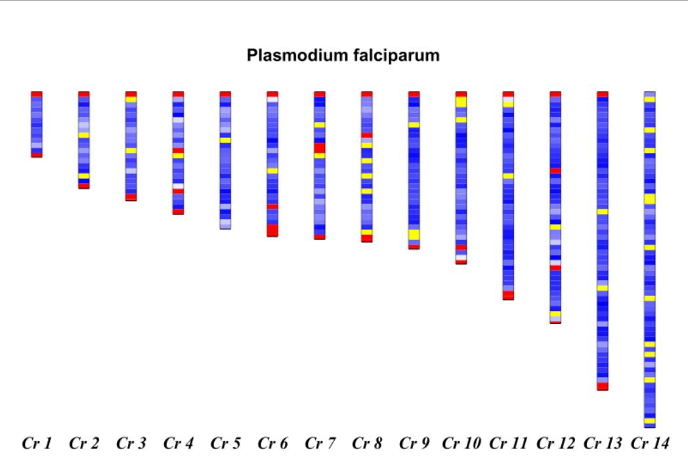
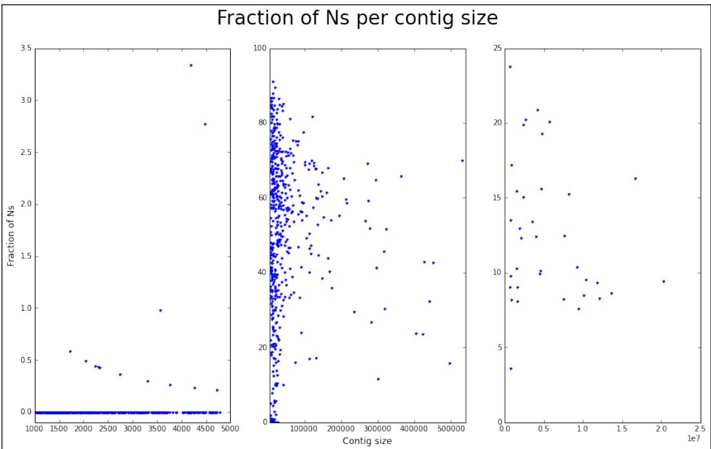
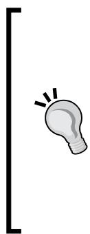
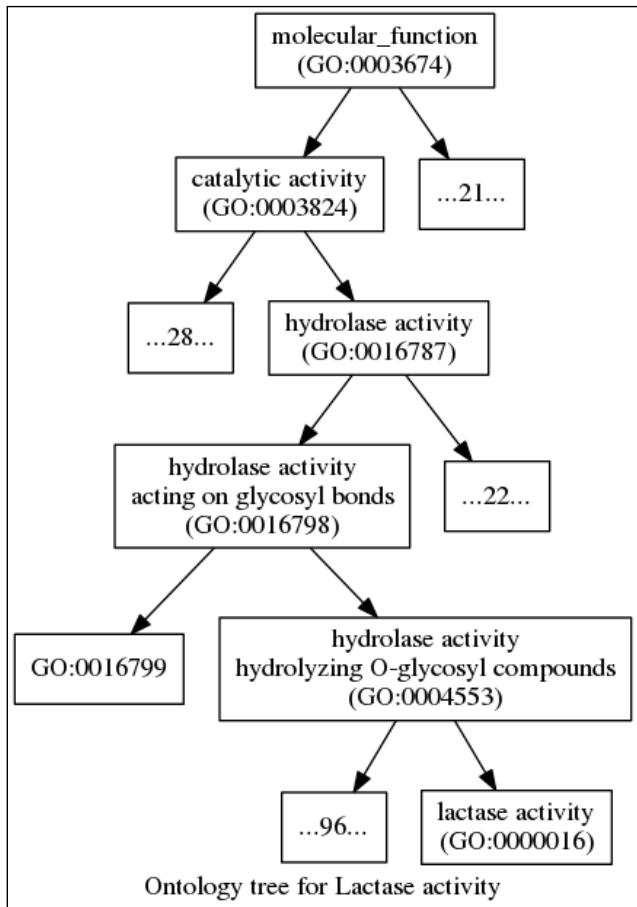

# Working with Genomes

In this chapter, we will cover the following recipes: 

f Working with high-quality reference genomes 

Dealing with low-quality reference genomes 

f Traversing genome annotations 

f Extracting genes from a reference using annotations 

f Finding orthologues using the Ensembl REST API 

Retrieving gene ontology information from Ensembl 

## Introduction

Many tasks in computational biology are dependent on the existence of reference genomes. If you are performing a sequence alignment, finding genes, or studying genetics of populations at several points of your work, you will be directly or indirectly using a genome reference. In this chapter, we will develop some recipes to work with reference genomes and deal with varying quality of references (which can vary for high-quality, like with the human genome, to problematic with non-model species). We will also see how to deal with genome annotations (working with text databases that will point us to interesting features in the genome) and extract sequence data using the annotation information. Also, we will try to find some gene orthologues across species. Finally, we will access a gene ontology (GO) database. 

## Working with high-quality reference genomes

In this recipe, you will learn a few general techniques to manipulate reference genomes. As an illustrative example, we will study the GC content (the fraction of the genome that is based on Guanine-Cytosine). Reference genomes are normally made available as FASTA files. 

## Getting ready

Genomes come in widely different sizes, ranging from viruses such as HIV (which is 9.7 kbp) to bacteria such as E. coli, to protozoans such as Plasmodium falciparum (the most important parasite species causing malaria) with its 14 chromosomes, mitochondrion, and apicoplast, to the fruit fly with three autosomes, a mitochondrion, and X/Y sex chromosomes, to humans with its three Gbp pairs spread across 22 autosomes, X/Y chromosomes, and mitochondria, all the way up to Paris japonica, a plant with 150 Gbp of genome. Along the way, you have different ploidy and different sex chromosome organizations. 


As you can see, different organisms have very different genome sizes. This difference can be of several orders of magnitude. This can have significant implications for your programming style. Working with a large genome will require you to be more conservative with the usage of memory. Unfortunately, larger genomes also benefit from more speed-efficient programming techniques (as you have much more data to analyze); these are conflicting requirements. The general rule is that you have to be much more careful with efficiency (both speed and memory) with larger genomes. 

In order to make this recipe less burdensome, we will use a small eukaryotic genome from Plasmodium falciparum. This genome still has many typical features of larger genomes (for example, multiple chromosomes). So, it's a good compromise between complexity and size. Note that with a genome of the size of P. falciparum, it will be possible to perform many operations by loading the whole genome in-memory. However, we opted for a programming style that can be used with bigger genomes (for example, mammals) so that you can use this recipe in a more general way, but feel free to use more memory-intensive approaches with small genomes like this. 

We will use Biopython, which you installed in Chapter 1, Python and the Surrounding Software Ecology. As usual, this recipe is available in the IPython Notebook at 02_Genomes/ Reference_Genome.ipynb in the code bundle of the book. 

If you are not using notebooks, download the P. falciparum genome from our datasets page at https://github.com/tiagoantao/bioinf-python/blob/master/notebooks/ Datasets.ipynb (file pfalciparum.fasta) 

Chapter 3 

## How to do it...

Let's take a look at the following steps: 

1. We start by inspecting the description of all the sequences on the reference genome FASTA file: 

```python
from Bio import SeqIO
genome_name = 'PlasmoDB-9.3_Pfalciparum3D7_Genome.fasta'
recs = SeqIO.parse(genome_name, 'fasta')
for rec in recs:
    print(rec.description) 
```

‰ This code should look familiar from the previous chapter; let's take a look at a part of the output: 

```csv
Pf3D7_05_v3 | organism=Plasmodium_falciparum_3D7 | version=2012-02-01 | length=1343557 | S0=chromosome
Pf3D7_10_v3 | organism=Plasmodium_falciparum_3D7 | version=2012-02-01 | length=1687656 | S0=chromosome
Pf3D7_07_v3 | organism=Plasmodium_falciparum_3D7 | version=2012-02-01 | length=1445207 | S0=chromosome
Pf3D7_03_v3 | organism=Plasmodium_falciparum_3D7 | version=2012-02-01 | length=1067971 | S0=chromosome
Pf3D7_13_v3 | organism=Plasmodium_falciparum_3D7 | version=2012-02-01 | length=2925236 | S0=chromosome
Pf3D7_11_v3 | organism=Plasmodium_falciparum_3D7 | version=2012-02-01 | length=2038340 | S0=chromosome
Pf3D7_14_v3 | organism=Plasmodium_falciparum_3D7 | version=2012-02-01 | length=3291936 | S0=chromosome
Pf3D7_09_v3 | organism=Plasmodium_falciparum_3D7 | version=2012-02-01 | length=1541735 | S0=chromosome
Pf3D7_01_v3 | organism=Plasmodium_falciparum_3D7 | version=2012-02-01 | length=640851 | S0=chromosome
Pf3D7_12_v3 | organism=Plasmodium_falciparum_3D7 | version=2012-02-01 | length=2271494 | S0=chromosome
Pf3D7_08_v3 | organism=Plasmodium_falciparum_3D7 | version=2012-02-01 | length=1472805 | S0=chromosome
Pf3D7_06_v3 | organism=Plasmodium_falciparum_3D7 | version=2012-02-01 | length=1418242 | S0=chromosome
Pf3D7_04_v3 | organism=Plasmodium_falciparum_3D7 | version=2012-02-01 | length=1200490 | S0=chromosome
Pf3D7_02_v3 | organism=Plasmodium_falciparum_3D7 | version=2012-02-01 | length=947102 | S0=chromosome
M76611 | organism=Plasmodium_falciparum_3D7 | version=2012-02-01 | length=5967 | S0=mitochondrial_chromosome
PFC10_API_IRAB | organism=Plasmodium_falciparum_3D7 | version=2012-02-01 | length=34242 | S0=apicoplast_chromosome 
```

‰ Different genome references will have different description lines, but they will generally have important information over there. In this example, you can see that we have chromosomes, mitochondria, and apicoplast. We can also view chromosome sizes, but we will take the value from the sequence length instead. 

2. Let's parse the description line to extract the chromosome number. We will retrieve the chromosome size from the sequence and compute the GC content across chromosomes on a window basis: 

```python
from __future__ import print_function
from Bio import SeqUtils

recs = SeqIO.parse(genome_name, 'fasta')
chrom_sizes = {}
chrom_GC = {}
block_size = 50000
min_GC = 100.0
max_GC = 0.0
for rec in recs:
    if rec.description.find('SO=chromosome') == -1: 
```

## Working with Genomes

```python
continue
chrom = int(rec.description.split('_')[1])
chrom_GC[chrom] = []
size = len(rec.seq)
chrom_sizes[chrom] = size
num_blocks = size // block_size + 1
for block in range(num_blocks):
    start = block_size * block
    if block == num_blocks - 1:
    end = size
    else:
    end = block_size + start + 1
    block_seq = rec.seq[start:end]
    block_GC = SeqUtils.GC(block_seq)
    if block_GC < min_GC:
    min_GC = block_GC
    if block_GC > max_GC:
    max_GC = block_GC
    chrom_GC[chrom].append(block_GC)
print(min_GC, max_GC) 
```

‰ We perform a windowed analysis of all chromosomes, similar to what you have seen in the previous chapter. We start by defining a window size of 50 kbp. This is appropriate for P. falciparum (feel free to vary its size), but you will want to consider other values for genomes with chromosomes that are orders of magnitude different from this. 

‰ Note that we are re-reading the file. With such a small genome, it would have been feasible (in step one) to do an in-memory load of the whole genome. By all means, feel free to try this programming style for small genomes—it's faster! However, this code is more generalized for larger genomes. 

‰ Note that in the for loop, we ignore the mitochondrion and apicoplast by parsing the SO entry to the description. The chrom_sizes dictionary will maintain the size of chromosomes. 

‰ The chrom_GC dictionary is our most interesting data structure and will have a list of faction of the GC content for each 50 kbp window. So, for chromosome 1, which has a size of 640,851 bp, there will be 14 entries because this chromosome size has 14 blocks of 50 kbp. 


Be aware of two unusual features of the P. falciparum genome: the genome is very AT-rich, that is, GC-poor. So, the numbers that you will get will be very low. Also, chromosomes are ordered based on size (as it's common), but starting with the smallest size. The usual convention is to start with the largest size (for example, like genomes in humans). 

```txt
Free ebooks ==> www.ebook777.com 
```

Chapter 3 

3. Now, let's perform a genome plot of the GC distribution. We will use shades of blue for the GC content. However, for high outliers, we will use shades of red. For low outliers, we will use shades of yellow: 

```python
from _future_ import division
from reportlab.lib import colors
from reportlab.lib.units import cm
from Bio.Graphics import BasicChromosome 
```

‰ We will use float division and import functions required by Biopython from the reportlab library: 


The Biopython code has evolved over time, before Python was such a fashionable language. In the past, availability of libraries was quite limited. The usage of reportlab can be seen mostly as a legacy issue. I suggest that you learn just enough from it to use it with Biopython. If you are planning on learning a modern plotting library in Python, you will probably want to consider matplotlib, Bokeh, or Python's version of ggplot (or other visualization alternatives, such as Mayavi, VTK, or even Blender's API). 

```python
chroms = list(chrom_sizes.keys())
chroms.sort()
biggest_chrom = max(chrom_sizes.values())
my_genome = BasicChromosome.Organism(output_format='png')
my_genome.page_size = (29.7*cm, 21*cm)
telomere_length = 10
bottom_GC = 17.5
top_GC = 22.0
for chrom in chroms:
    chrom_size = chrom_sizes[chrom]
    chrom_representation = BasicChromosome.Chromosome \
    ('Cr %d' % chrom)
    chrom_representation.scale_num = biggest_chrom
    tel = BasicChromosome.TelomereSegment()
    tel.scale = telomere_length
    chrom_representation.add(tel)
    num_blocks = len(chrom_GC[chrom])
    for block, gc in enumerate(chrom_GC[chrom]):
    my_GC = chrom_GC[chrom] [block]
    body = BasicChromosome.ChromosomeSegment()
    if my_GC > top_GC:
    body.fill_color = colors.Color(1, 0, 0)
    elif my_GC < bottom_GC:
    body.fill_color = colors.Color(1, 1, 0) 
```

Working with Genomes 

```python
else:
    my_color = (my_GC - bottom_GC) / (top_GC - bottom_GC)
    body.fill_color = colors.Color(my_color, my_color, 1)
    if block < num_blocks - 1:
    body.scale = block_size
    else:
    body.scale = chrom_size % block_size
    chrom_representation.add(body)
    tel = BasicChromosome.TelomereSegment(inverted=True)
    tel.scale = telomere_length
    chrom_representation.add(tel)
    my_genome.add(chrom_representation)
    my_genome.draw('falciparum.png', 'Plasmodium falciparum') 
```

‰ The first line converts the return of the keys method to a list. This is redundant in Python 2, but not in Python 3, where the keys method has a specific return type: dict_keys. 

‰ We will draw the chromosomes in order (hence the sort). We will need the size of the biggest chromosome (14 in P. falciparum) in order to assure that the size of chromosomes is printed with the correct scale (the biggest_chrom variable). 

‰ We then create an A4-sized representation of an organism with a PNG output. Note that we will draw very small telomeres of 10 bp. This will produce a rectangular-like chromosome. You can make the telomeres bigger, giving it a roundish representation (or you may have a better idea of the correct telomere size for your species). 

‰ We declare that anything with GC content below 17.5 percent or above 22.0 percent will be considered an outlier. Remember that for most other species, this will be much higher. 

‰ We then print these chromosomes proper. They are bounded by telomeres and composed of 50 kbp chromosome segments (the last segment is sized with the remainder). Each segment will be colored in blue with a red-green component based on the linear normalization between two outlier values. Each chromosome segment will either be 50 kbp or potentially smaller if the last one of the chromosome. The output is shown in the following figure: 

Chapter 3 




Figure 1: The 14 chromosomes of Plasmodium falciparum color-coded with the GC content (red is more than 22 percent, yellow less than 17 percent, and the blue shades represent a linear gradient between both numbers 

4. Finally, if you are on the IPython Notebook (that is, do not perform this outside IPython), you can print the image inline: 

from IPython.core.display import Image 

Image("falciparum.png") 

## There's more...

P. falciparum is a reasonable example for a eukaryote with a small genome that allows you to perform a small data exercise with enough features that make it still useful for most eukaryotes. Of course, there are no sex chromosomes (such as X/Y in humans), but these should be easy to process because reference genomes do not deal with ploidy issues. 

P. falciparum does have a mitochondrion, but we will not deal with it here due to space issues. Biopython does have the functionality to print circular genomes, which you can also use with bacteria. With regards to bacteria and viruses, these genomes are much easier to process because their size is very small. 

## See also

f You can find many reference genomes of model organisms in Ensembl at http://www.ensembl.org/info/data/ftp/index.html. 

f As usual, NCBI also provides a large list of genomes at http://www.ncbi.nlm. nih.gov/genome/browse/. 

There are plenty of websites dedicated to a single organism (or a set of related organisms). Apart from PlasmoDB (http://plasmodb.org/plasmo/), from which you downloaded the P. falciparum genome, you will find VectorBase (https:// www.vectorbase.org/) in the next recipe for disease vectors. Flybase (http:// flybase.org/) for Drosophila is also worth mentioning, but do not forget to search for your organism of interest. 

## Dealing with low-quality genome references

Unfortunately, not all reference genomes will have the quality of P. falciparum. Apart from some model species (for example, humans or the common fruit fly Drosophila melanogaster) and a few others, most reference genomes could use some improvement. In this recipe, we will see how to deal with reference genomes with less quality. 

## Getting ready

In keeping with the malaria theme, here, we will use the reference genomes of two mosquitoes that are vectors of malaria: Anopheles gambiae (which is the most important vector of malaria and can be found in sub-Saharan Africa) and Anopheles atroparvus, a malaria vector in Europe (while the disease has been eradicated in Europe, this vector is still around). The An. gambiae genome is of reasonable quality. Most chromosomes have been mapped, although the Y chromosome still needs some work. There is a fairly large "unknown" chromosome, probably composed of bits X and Y chromosomes and also midgut microbiota. This genome has a reasonable amount of positions that are not called (that is, you will find Ns instead of ACTGs). The An. atroparvus genome is still in the scaffold format. Unfortunately, this is what you will find for many non-model species. 

Note that we will up the ante a bit. The Anopheles genome is one order of magnitude bigger than the P. falciparum genome (but one order of magnitude smaller than most mammals). 

We will use Biopython, which you installed in Chapter 1, Python and the Surrounding Software Ecology. As usual, this recipe is available from the IPython Notebook at 02_Genomes/Low_ Quality.ipynb in the code bundle of the book. 

Chapter 3 

If you are not using notebooks, download the Anopheles genomes from our dataset page at https://github.com/tiagoantao/bioinf-python/blob/master/notebooks/ Datasets.ipynb (files gambiae.fa.gz and atroparvus.fa.gz). Rename the first as gambiae.fa.gz and the second as atroparvus.fa.gz. 

## How to do it...

Let's take a look at the following steps: 

1. Let's start by listing the chromosomes of the A. gambiae genome: 

```python
from __future__ import print_function
import gzip
from Bio import SeqIO
gambiae_name = 'gambiae.fa.gz'
atroparvus_name = 'atroparvus.fa.gz'
recs = SeqIO.parse(gzip.open(gambiae_name), 'fasta')
for rec in recs:
    print(rec.description) 
```

‰ This will produce the following output: 

```txt
chromosome:AgamP3:2L:1:49364325:1 chromosome 2L  
chromosome:AgamP3:2R:1:61545105:1 chromosome 2R  
chromosome:AgamP3:3L:1:41963435:1 chromosome 3L  
chromosome:AgamP3:3R:1:53200684:1 chromosome 3R  
chromosome:AgamP3:UNKN:1:42389979:1 chromosome UNKN  
chromosome:AgamP3:X:1:24393108:1 chromosome X  
chromosome:AgamP3:Y_unplaced:1:237045:1 chromosome Y_unplaced 
```

‰ The code is quite straightforward. We use the gzip module because files of larger genomes are normally compressed. We can see four chromosome arms (2L, 2R, 3L, and 3R) and the X chromosome. Note the Y chromosome, which is quite small and has a name that all but indicates that it might not be in the best state. Also, note that the unknown (UNKN) chromosome is actually a quite large proportion of the reference genome to the tune of the chromosome arm. 

‰ Do not perform this with An. atroparvus or you will get more than a thousand entries, courtesy of the scaffold status. 

## 2. We will now check uncalled positions (Ns) and its distribution for the An. gambiae genome:

```python
from __future__ import division
recs = SeqIO.parse(gzip.open(gambiae_name), 'fasta')
chrom_Ns = {}
chrom_sizes = {} 
```

```txt
Free ebooks ==> www.ebook777.com 
```

Working with Genomes 

```python
for rec in recs:
    chrom = rec.description.split(':')[2]
    if chrom in ['UNKN', 'Y_unplaced']:
    continue
    chrom_Ns[chrom] = []
    on_N = False
    curr_size = 0
    for pos, nuc in enumerate(rec.seq):
    if nuc in ['N', 'n']:
    curr_size += 1
    on_N = True
    else:
    if on_N:
    chrom_Ns[chrom].append(curr_size)
    curr_size = 0
    on_N = False
    if on_N:
    chrom_Ns[chrom].append(curr_size)
    chrom_sizes[chrom] = len(rec.seq)
    for chrom, Ns in chrom_Ns.items():
    size = chrom_sizes[chrom]
    print('%s (%s): %Ns (%.1f), num Ns: %d, max N: %d' % (chrom, size, 100 * sum(Ns) / size, len(Ns), max(Ns))) 
```

‰ This code will take some time to run, so please be patient because we will inspect each and every base pair of the autosomes. As usual, we will reopen and re-read the file to save memory. 

‰ We have two dictionaries: one dictionary with chromosome sizes and another with the distribution of the sizes of runs of Ns. To calculate the runs of Ns, we traverse all autosomes (noting when an N position starts and ends). We then print the basic statistics of the distribution of Ns: 

```txt
2L (49364325): %Ns (1.7), num Ns: 957, max N: 28884
3R (53200684): %Ns (1.8), num Ns: 1128, max N: 24292
X (24393108): %Ns (4.1), num Ns: 1287, max N: 21132
2R (61545105): %Ns (2.3), num Ns: 1658, max N: 36427
3L (41963435): %Ns (2.9), num Ns: 1272, max N: 31063 
```

‰ So, for the 2L chromosome arm (with a size of 49 Mbp), 1.7 percent are N calls divided by 957 runs. The biggest run is 28,884 bps. Note that the X chromosome has the highest fraction of positions with Ns. 

```txt
Free ebooks ==> www.ebook777.com 
```

```txt
Chapter 3 
```

3. We will now turn our attention to the An. Atroparvus genome. Let's count the number of scaffolds along with the distribution of scaffold sizes: 

```python
import numpy as np
recs = SeqIO.parse(gzip.open(atroparvus_name), 'fasta')
sizes = []
size_N = []
for rec in recs:
    size = len(rec.seq)
    sizes.append(size)
    count_N = 0
    for nuc in rec.seq:
    if nuc in ['n', 'N']:
    count_N += 1
    size_N.append((size, count_N / size)) 
```

```txt
print(len(sizes), np.median(sizes), np.mean(sizes), max(sizes), min(sizes), np.percentile(sizes, 10), np.percentile(sizes, 90)) 
```

‰ This code is similar to the previous point, but we do print slightly more detailed statistics using NumPy, so we get: 

```txt
(1371, 8304.0, 163596.0, 20238125, 1004, 1563.0, 56612.0) 
```

‰ We thus have 1,371 scaffolds (against seven entries on the A. gambiae genome) with a median size of 8,304 (mean of 163,536). The biggest scaffold has 2 Mbp and the smallest scaffold has 1004 bp. The tenth percentile for size is 1,563 and the ninetieth is 56,612. 

4. Finally, let's plot the fraction of the scaffold, that is, N as a function of its size. If on IPython, prepend %matplotlib inline to the following code: 

```python
import matplotlib.pyplot as plt

small_split = 4800
large_split = 540000
fig, axis = plt.subplots(1, 3, figsize=(16, 9), squeeze=False)
xs, ys = zip(*[(x, 100 * y) for x, y in size_N if x <= small_split])
axs[0, 0].plot(xs, ys, '.') 
```

Working with Genomes 

```txt
if x > large_split])
axs[0, 2].plot(xs, ys, '.') 
axs[0, 0].set_ylabel('Fraction of Ns', fontsize=12)
axs[0, 1].set_xlabel('Contig size', fontsize=12)
fig.suptitle('Fraction of Ns per contig size', fontsize=26) 
```

‰ The preceding code will generate the output shown in the following figure, in which we split the chart into three parts based on the scaffold size: one for scaffolds with less than 4,800 bp, one for scaffolds between 4,800 and 540,000 bp, and one for larger ones. Note that the y axis scale (depicting the fraction of the N scaffold) is completely different for the three panels. It is very low for small scaffolds (always below 44.5) with large variance (between 0 and 100 percent), for medium scaffolds and tighter variance (between 0 and 25 percent) for the largest scaffold: 




Figure 2: Fraction of scaffolds that are N as a function of their size


## There's more...

Sometimes, reference genomes carry extra information, for example, the Anopheles gambiae genome is soft masked. This means that some procedures were run on the genome to identify areas of low complexity (which are normally more problematic to analyze). This will be annotated by capitalization: ACTG will be high complexity, whereas ACTG will be low. 

Reference genomes with lots of scaffolds are more than an inconvenient hassle. For example, very small scaffolds (say, below 2,000 bp) may have mapping problems when using an aligner (such as BWA), especially at the extremes (most scaffolds will have mapping problems at their extremes, but these will be a much larger proportion of the scaffold if it's small). If you are using a reference genome like this to align, you will want to consider ignoring the pair information (assuming that you have paired-end reads) when mapping to small scaffolds, or at least measure the impact of the scaffold size in the performance of your aligner. In any case, the general comment is that be careful because the scaffold size and number will rear its ugly head from time to time. 

With these genomes, there was only complete ambiguity (N) identified. Note that other genome assemblies will give you an intermediate code between total ambiguity and certainty (ACTG). 

## See also

7 Tools like RepeatMasker are used to find areas of the genome with low complexity at http://www.repeatmasker.org/ 

IUPAC ambiguity codes may be useful to have in hand when processing other genomes at http://www.bioinformatics.org/sms/iupac.html 

## Traversing genome annotations

Having a genome sequence is interesting, but we will want to extract features from it: genes, exons, and coding sequences. This type of annotation information is made available in GFF and GTF files. GFF stands for Generic Feature Format. In this recipe, we will see how to parse and analyze GFF files, using the annotation of the Anopheles gambiae genome as an example. 

## Getting ready

We will use the gffutils library to process the annotation file. 

If you do not use the notebook, you need to acquire the annotation file from our datasets page at https://github.com/tiagoantao/bioinf-python/blob/master/notebooks/ Datasets.ipynb (file gambiae.gff3.gz) Rename the annotation file as gambiae.gff. gz. Preferably, use the 02_Genomes/Annotations.ipynb notebook, which is provided in the code bundle of the book. 

Working with Genomes 

## How to do it...

Let's take a look at the following steps: 

1. Let's start by creating an annotation database with gffutils based on our GFF file: 

```python
import gffutils
import sqlite3
try:
    db = gffutils.create_db('gambiae.gff.gz', 'ag.db')
except sqlite3.OperationalError:
    db = gffutils.FeatureDB('ag.db') 
```

‰ The gffutils library creates a SQLite database to store annotations efficiently. Here, we try to create the database, but if it already exists, we will use the existing one. This step can be time-consuming. 

2. Now, we list all the available feature types and count them: 

```python
print(list(db.featuretypes()))
for feat_type in db.featuretypes():
    print(feat_type, db.count_features_of_type(feat_type)) 
```

```txt
Features will include contigs, genes, exons, transcripts, and so on. Note that we will use the gffutils package's featuretypes function. It will return a generator, but we will convert it to a list (it's safe here). 
```

3. Let's list all contigs: 

```python
for contig in db.features_of_type('contig'): print(contig) 
```

```txt
☐ This will show that there is an annotation information for all chromosome arms and sex chromosomes, mitochondrion, and the unknown chromosome. 
```

4. Let's now extract a lot of useful information per chromosome, number of genes, number of transcripts per gene, number of exons, and so on: 

```python
from collections import defaultdict
num_mRNAs = defaultdict(int)
num_exons = defaultdict(int)
max_exons = 0
max_span = 0
for contig in db.features_of_type('contig'):
    cnt = 0
    for gene in db.region((contig.seqid, contig.start, contig.end), featuretype='gene'):
    cnt += 1
    span = abs(gene.start - gene.end) # strand 
```

```txt
Free ebooks ==> www.ebook777.com 
```

Chapter 3 

```python
if span > max_span:
    max_span = span
    max_span_gene = gene
    my_mRNAs = list(db.children(gene, featuretype='mRNA'))
    num_mRNAs[len(my_mRNAs)] += 1
    if len(my_mRNAs) == 0: # checking num of alternative transcripts
    exon_check = [gene]
    else:
    exon_check = my_mRNAs
    for check in exon_check:
    my_exons = list(db.children(check, featuretype='exon')) # level = SLOW
    num_exons[len(my_exons)] += 1
    if len(my_exons) > max_exons:
    max_exons = len(my_exons)
    max_exons_gene = gene
    print('contig %s, number of genes %d' % (contig.seqid, cnt))
print('Max number of exons: %s (%d)' % (max_exons_gene.id, max_exons))
print('Max span: %s (%d)' % (max_span_gene.id, max_span))
print(num_mRNAs)
print(num_exons) 
```

‰ We traverse all contigs (features_of_type), extracting all genes (region). In each gene, we count the number of alternative transcripts. If there are none (note that this is probably an annotation issue and not a biological one), we count the exons (children). If there are several transcripts, we count the exons per transcript. We also account for the span size to check for the gene spanning the largest region. We follow a similar procedure to find the gene and the largest number of exons. 

‰ Finally, we print a dictionary with the distribution of the number of alternative transcripts per gene (num_mRNAs) and the distribution of number of exons per transcript (num_exons). 

## There's more...

There are many variations of the GFF/GTF format. There are different GFF versions and many unofficial variations. If possible, choose the GFF Version 3. However, the ugly truth is that you will find it very difficult to process files. The gffutils library tries as best as it can to accommodate this. Indeed, much of the documentation of the library is concerned with helping you process all kinds of awkward variations (refer to https://pythonhosted.org/ gffutils/examples.html). 

## Working with Genomes

There is an alternative to using gffutils (either because your GFF file is strange or because you do not like the library interface or its dependency on a SQL backend). Parse the file yourself manually. If you look at the format, you will notice that it's not very complex. If you are only performing a one-off operation, then maybe manual parsing is good enough. Of course, one-off operations tend to not be that. 

Also, note that the quality of annotations tend to vary a lot. As the quality increases, so does the complexity. Just check the human annotation for an example of this. One can expect that over time, as our knowledge of organisms evolves, the quality and complexity of annotations will increase. 

## See also

f The GFF spec can be found at https://www.sanger.ac.uk/resources/ software/gff/spec.html. 

Probably the best explanation on the GFF format, along with the most common versions and GTF, can be found at http://gmod.org/wiki/GFF3. 

f Somewhat related is the BED format to specify annotations; this is mostly used interactively to specify tracks for genome viewers. You will probably come across it at http://genome.ucsc.edu/FAQ/FAQformat.html#format1, although processing is quite trivial. 

## Extracting genes from a reference using annotations

In this recipe, we will see how to extract a gene sequence with the help of an annotation file to get its coordinates against a reference FASTA. We will use the Anopheles gambiae genome, along with its annotation file (as per the previous two recipes). We will first extract the Voltage-gated sodium channel (VGSC) gene, which is involved in resistance to insecticides. 

## Getting ready

If you have followed the previous two recipes, you are ready. If not, download the Anopheles gambiae FASTA file, along with the GTF file. You also need to prepare the gffutils database: 

```python
import gffutils
import sqlite3
try:
    db = gffutils.create_db('gambiae.gff.gz', 'ag.db')
except sqlite3.OperationalError:
    db = gffutils.FeatureDB('ag.db') 
```

As usual, you will find all this in the 02_Genomes/Getting_Gene.ipynb notebook. 

```txt
Free ebooks ==> www.ebook777.com 
```

Chapter 3 

## How to do it…

Let's take a look at the following steps: 

1. Let's start by retrieving the annotation information for our gene: 

```python
import gzip
from Bio import Alphabet, Seq, SeqIO
gene_id = 'AGAP004707'
gene = db[gene_id]
print(gene)
print(gene.seqid, gene.strand) 
```

‰ The gene ID was retrieved from VectorBase, an online database of genomics of disease vectors. For other specific cases, you will need to know the ID of your gene (which will be dependent on species and database). The output will be as follows: 

```javascript
2L VectorBase gene 2358158 2431617 . + . ID=AGAP004707;biotype=protein_coding ('2L', '+') 
```

‰ Note that the gene is on the 2L chromosome arm and coded in the positive direction. 

2. Let's hold the sequence for the 2L chromosome arm in memory (it's just a single chromosome, so we will indulge): 

```python
recs = SeqIO.parse(gzip.open('gambiae.fa.gz'), 'fasta')
for rec in recs:
    print(rec.description)
    if rec.description.split(':')[2] == gene.seqid:
    my_seq = rec.seq
    break
print(my_seq.alphabet) 
```

‰ The output will be as follows: 

```txt
chromosome:AgamP3:2L:1:49364325:1 chromosome 2L SingleLetterAlphabet() 
```

‰ Note the alphabet of the sequence. 

3. Let's create a function to construct a gene sequence for a list of CDSs: 

```python
def get_sequence(chrom_seq, CDSs, strand):
    seq = Seq.Seq('', alphabet=Alphabet.IUPAC.unambiguous_dna)
    for CDS in CDSs: 
```

Working with Genomes 

```python
my_cds = Seq.Seq(str(my_seq[CDS.start - 1: CDS.end]), alphabet=Alphabet.IUPAC.unambiguous_dna)
    seq += my_cds
    return seq if strand == '+' else
    seq.reverse_complement() 
```

‰ This function will receive a chromosome sequence (in our case, the 2L arm), a list of coding sequences (retrieved from the annotation file), and the strand. 

‰ There are several important issues to note here. We will construct a sequence of the unambiguous DNA type (we will need this for translation). The SingleLetterAlphabet of the previous step will have to be converted. We also have to be very careful with the start and end of the sequence (note that the GFF file is 1-based, whereas the Python array is 0-based). Finally, we return the reverse complement if the strand is negative. 

4. Although we have the gene ID at hand, we actually want to just one of the available transcripts of the three available for this gene, so we need to choose one: 

```python
mRNAs = db.children(gene, featuretype='mRNA')
for mRNA in mRNAs:
    print(mRNA.id)
    if mRNA.id.endswith('RA'):
    break 
```

5. We will now get the coding sequence for our transcript and get the gene sequence and translate it: 

```python
CDSs = db.children(mRNA, featuretype='CDS', order_by='start')
gene_seq = get_sequence(my_seq, CDSs, gene.strand)
print(len(gene_seq), gene_seq)
prot = gene_seq.translate()
print(len(prot), prot) 
```

6. Let's get the gene that is coded in the negative strand direction. We will just take the gene next to VGSC (which happens to be the negative strand): 

```python
reverse_transcript_id = 'AGAP004708-RA'
reverse_CDSs = db.children(reverse_transcript_id, featuretype='CDS', order_by='start')
reverse_seq = get_sequence(my_seq, reverse_CDSs, '-')
print(len(reverse_seq), reverse_seq)
reverse_prot = reverse_seq.translate()
print(len(reverse_prot), reverse_prot) 
```

Here, I evaded getting all the information about the gene and just hardcoded the transcript ID. The point is that you should make sure your code works irrespective of strand. 

## There's more...

This is a simple recipe that exercises several concepts that have been presented in this and the previous chapter. While it's conceptually trivial, it's unfortunately full of booby traps. 




When using different databases, be sure that the genome assembly versions are in synchrony. It would be a serious and potentially silent bug to use different versions. Remember that different versions (at least on the major version number) have different coordinates. For example, human position 1234 on chromosome 3 on build 36 will probably refer a different SNP than 1234 on build 38. With human data, you will probably find a lot of chips on build 36, plenty of whole genome sequences on build 37, whereas the most recent human assembly is build 38. With our Anopheles example, you will have versions 3 and 4 around. This will happen with most species. So, be aware! 

There is also the issue of 0-indexed arrays in Python versus 1-indexed genomic databases. Be nonetheless aware that some genomic databases may also be 0-indexed. 

There are also two sources of confusion: the transcript versus the gene choice as in more rich annotation databases, you will have several alternative transcripts (if you want to look at the rich-to-the-point-of-confusing database, refer to the human annotation database). Also, fields tagged with exon will have more information than the coding sequence. For this purpose, you will want the CDS field. 

Finally, there is the strand issue where you will want to translate based on the reverse complement. 

## See also

f You can download MySQL tables for Ensembl at http://www.ensembl.org/ info/data/mysql.html. 

The UCSC genome browser can be found at http://genome.ucsc.edu/. Be sure to check the download area at http://hgdownload.soe.ucsc.edu/ downloads.html. 

As with reference genomes, you can find GTFs of model organisms in Ensembl at http://www.ensembl.org/info/data/ftp/index.html. 

f A simple explanation between CDSs and exons can be found at https://www. biostars.org/p/65162/. 

Working with Genomes 

## Finding orthologues with the Ensembl REST API

Here, we will see how to look for orthologues for a certain gene. This simple recipe wil not only introduce orthology retrieval, but also how to use REST APIs on the Web to access biological data. Last but surely not least, it will serve as an introduction on how to access the Ensembl database using the programmatic API. 

In our example, we will try to find any orthologue for the human lactase gene (LCT) on the horse genome. 

## Getting ready

This recipe will not require any pre-downloaded data, but as we are using the web APIs, Internet access will be needed. The amount of data transferred will be limited. 

We will also make use of the requests library to access Ensembl. The request API is an easy-to-use wrapper for web requests. Of course, you can use the standard Python libraries, but these are much more cumbersome. 

As usual, you can find this content on the 02_Genomes/Orthology.ipynb notebook. 

## How to do it...

Let's take a look at the following steps: 

1. We start by creating a support function to perform a web request: 

```python
import requests

ensembl_server = 'http://rest.ensembl.org'

def do_request(server, service, *args, **kwargs):
    url_params = ''
    for a in args:
    if a is not None:
    url_params += '/' + a
    req = requests.get('%s/%s%s' % (server, service, url_params),
    params=kwargs,
    headers={'Content-Type':
    'application/json'})
    if not req.ok:
    req.raise_for_status()
    return req.json() 
```

Chapter 3 

‰ We start by importing the requests library and specifying the root URL. Then, we create a simple function that will take the functionality to be called (see the following examples) and generate a complete URL. It will also add optional parameters and specify the payload to be of the JSON type (just to get a default JSON answer). It will return the response in the JSON format. This is typically a nested Python data structure of lists and dictionaries. 

2. We start by checking all the available species on the server, which is around 40 at the time of this writing: 

```python
all_species = do_request(ensembl_server, 'info/species')
for sp in all_species['species']:
    print(sp['name']) 
```

‰ Note that this will construct the http://rest.ensembl.org/info/ species URL for the REST request. 

3. We will now try to find any HGNC databases on the server related to human data: 

```python
ext_dbs = do_request(ensembl_server, 'info/external_dbs', 'homo_sapiens', filter='HGNC%')
print(ext_dbs) 
```

‰ We restrict the search to human-related databases (homo_sapiens). We also filter databases starting with HGNC (this filtering uses the SQL notation). HGNC is the HUGO database. We want to make sure that it's available because the HUGO database is responsible for curating human gene names and maintains our LCT identifier. 

4. Now that we know that the LCT identifier is probably available, we want to retrieve the Ensembl ID for the gene, as shown in the following code: 

```python
ensembl = do_request(ensembl_server, 'lookup/symbol', 'homo_sapiens', 'LCT')
print(ensembl)
lct_id = ensembl['id'] 
```


Different databases, as you probably know by now, will have different IDs for the same object. We will need to resolve our LCT identifier to the Ensembl ID. When you deal with external databases relating same objects, ID translation among databases will probably be your first task. 

5. Just for your information, we can now get the sequence of the area containing the gene. Note that this is probably the whole interval, and if you want to recover the gene, you will have to use a procedure similar to the previous recipe: 

```python
lct_seq = do_request(ensembl_server, 'sequence/id', lct_id)
print(lct_seq) 
```

Working with Genomes 

6. We can also inspect other databases that are known to Ensembl to refer to this gene: 

```python
lct_xrefs = do_request(ensembl_server, 'xrefs/id', lct_id)
for xref in lct_xrefs:
    print(xref['db_display_name'])
    print(xref) 
```

‰ You will find different kinds of databases, such as vertebrate and genome annotation project (VEGA), UniProt (see Chapter 7, Using the Protein Data Bank), or WikiGene. 

7. Finally, let's get the orthologues for this gene on the horse genome: 

```python
hom_response = do_request(ensembl_server, 'homology/id', lct_id, type='orthologues', sequence='none')
homologies = hom_response['data'][0]['homologies']
for homology in homologies:
    print(homology['target']['species'])
    if homology['target']['species'] != 'equus_caballus':
    continue
    print(homology)
    print(homology['taxonomy_level'])
    horse_id = homology['target']['id'] 
```

‰ We could have actually acquired the orthologues directly for the horse by specifying a target_species parameter. However, this code allows you to inspect all available orthologues. 

‰ You will get quite a lot of information about an orthologue, such as the taxonomy level of orthology (Boreoeutheria—placental mammals is the closest phylogenetic level between humans and horses), the ensembl ID of the orthologue, the dn/ds ratio (nonsynonymous to synonymous mutations), and the CIGAR string (refer to the previous chapter) of differences among sequences. By default, you will also get the alignment of the orthologous sequence, but I have removed it to unclog the output. 

8. Finally, let's look for the horse ID Ensembl record: 

```python
horse_req = do_request(ensembl_server, 'lookup/id', horse_id)
print(horse_req) 
```

From this point onwards, you can use the previous recipe methods to explore the LCT horse orthologue. 

Chapter 3 

## There's more...

You can find a detailed explanation of all the functionalities available at http://rest. ensembl.org/. This includes all the interfaces and Python code snippets, among other languages. 

If you are interested in paralogues, this information can be retrieved quite trivially from the preceding recipe. On the call to homology/id, just replace the type with paralogues. 

If you have heard of Ensembl, you have probably heard of an alternative service from UCSC: the Genome Browser (http://genome.ucsc.edu/). While on a user interface, they are on the same level, from a programmatic perspective, Ensembl is probably more mature. Access to NCBI Entrez databases was covered in the previous chapter. 

Another completely different strategy to interface programmatically with Ensembl will be to download raw tables and inject them into a local MySQL database. Be aware that this will be quite an undertaking in itself (you will probably just want to load a very small subset of tables). However, if you intend to be very intensive in terms of usage, you may have to consider creating a local version of part of the database. If this is the case, you may want to reconsider the UCSC alternative as it's as good as Ensembl from the local database perspective. 

## Retrieving gene ontology information from Ensembl

In this recipe, we will introduce the usage of gene ontology information again by querying the Ensembl REST API. Gene ontologies are controlled vocabularies to annotate gene and gene products. These are made available as trees of concepts (with more general concepts near the top of the hierarchy). There are three domains for gene ontologies: cellular component, molecular function, and biological process. 

## Getting ready

As with the previous recipe, we do not require any predownloaded data, but as we are using web APIs, Internet access will be needed. The amount of data transferred will be limited. 

As usual, you can find this content on the 02_Genomes/Gene_Ontology.ipynb notebook. 

We will make use of the do_request function, which is defined in the first step of the previous recipe (Finding Orthologues with the REST Ensembl API). 

To draw GO trees, we will use pygraphviz, a graph drawing library. 

Working with Genomes 

## How to do it...

Let's take a look at the following steps: 

```python
1. Let's start by retrieving all GO terms associated with the LCT gene (you can see how to retrieve the Ensembl ID in the previous recipe). Remember that you will need the do_request function from the previous recipe:
    lct_id = 'ENSG00000115850'
    refs = do_request(ensembl_server, 'xrefs/id', lct_id, external_db='GO', all_levels='1')
print(len(refs))
print(refs[0].keys())
for ref in refs:
    go_id = ref['primary_id']
    details = do_request(ensembl_server, 'ontology/id', go_id)
    print('%s %s %s' % (go_id, details['namespace'], ref['description'])) 
    print('%s\n' % details['definition']) 
```

‰ Note the free-form definition and the varying namespace for each term. The first two of the eleven reported items in the loop are (this may change when you run it because the database may have been updated): 

```txt
GO:0000016 molecular_function lactase activity
"Catalysis of the reaction: lactose + H2O = D-glucose + D-galactose." [EC:3.2.1.108]
GO:0004553 molecular_function hydrolase activity, hydrolyzing O-glycosyl compounds
"Catalysis of the hydrolysis of any O-glycosyl bond." [GOC:mah] 
```

```python
2. Let's concentrate on the "lactase activity" molecular function and retrieve more detailed information about it (the following GO ID comes from the previous step):
    go_id = 'GO:0000016'
    my_data = do_request(ensembl_server, 'ontology/id', go_id)
    for k, v in my_data.items():
    if k == 'parents':
    for parent in v:
    print(parent)
    parent_id = parent['accession']
    else:
    print('%s: %s' % (k, str(v)))
    parent_data = do_request(ensembl_server, 'ontology/id', parent_id)
    print(parent_id, len(parent_data['children'])) 
```

```txt
Free ebooks ==> www.ebook777.com 
```

Chapter 3 

‰ We print the "lactase activity" record (which is currently a node of the GO tree molecular function) and retrieve a list of potential parents. There is a single parent for this record. We retrieve it and print the number of children. 

3. Let's retrieve all the general terms for the "lactase activity" molecular function (again, the parent and all other ancestors): 

```python
refs = do_request(ensembl_server, 'ontology/ancestors/chart', go_id)
for go, entry in refs.items():
    print(go)
    term = entry['term']
    print('%s %s' % (term['name'], term['definition'])) 
    is_a = entry.get('is_a', []) 
    print('\t is a: %s\n' % ', '.join([x['accession'] for x in is_a])) 
```

‰ We retrieve the ancestor list by following the is_a relationship (refer to the following GO sites for more details on the types of possible relationships). 

4. Let's define a function to create a dictionary with the ancestor relationship for a term along with some summary information for each term returned in a pair: 

```python
def get_upper(go_id):
    parents = {}
    node_data = {}
    refs = do_request(ensembl_server, 'ontology/ancestors/chart', go_id)
    for ref, entry in refs.items():
    my_data = do_request(ensembl_server, 'ontology/id', ref)
    node_data[ref] = {'name': entry['term']['name'], 'children': my_data['children]}
    try:
    parents[ref] = [x['accession'] for x in entry['is_a']]
    except KeyError:
    pass # Top of hierarchy
    return parents, node_data 
```

## Working with Genomes

```python
5. We will finally print a tree of relationships for the "lactase activity" term. For this, we will use the pygraphivz library:
    parents, node_data = get_upper(go_id)
    import pygraphviz as pgv
    g = pgv.AGraph(directed=True)
    for ofs, ofs_parents in parents.items():
    ofs_text = '%s\n(%s)' % (node_data[ofs]['name'].replace(', ' ', '\n'), ofs)
    for parent in ofs_parents:
    parent_text = '%s\n(%s)' % (node_data[parent]['name'].replace(', ' ', '\n'), parent)
    children = node_data[parent]['children']
    if len(children) < 3:
    for child in children:
    if child['accession'] in node_data:
    continue
    g.add_edge(parent_text, child['accession'])
    else:
    g.add_edge(parent_text, '...%d...' % (len(children) - 1))
    g.add_edge(parent_text, ofs_text)
print(g)
g.graph_attr['label']=Ontology tree for Lactase activity'
g.node_attr['shape']=rectangle'
g.layout(prog='dot')
g.draw('graph.png') 
```

‰ The following figure shows the ontology tree for the "lactase activity" term. Terms at the top are more general. The top of the tree denotes molecular function. For all ancestral nodes, the number of extra offspring is also noted (or enumerated if less than three). 

6. Of course, if you are on IPython, you can inline the image using the following code: from IPython.core.display import Image Image("graph.png") 

## ‰ The output is shown here:




Figure 3: An ontology tree for the term "lactase activity" (terms at the top are more general); the top of the tree is molecular_function; for all ancestral nodes, the number of extra offspring is also noted (or enumerated if less than three)


## There's more...

If you are interested in gene ontologies, your main port of call will be http:// geneontology.org, where you will find much more information on this topic. Apart from molecular_function, gene ontology also has a "biological process" and a "cellular component". In our recipes, we have followed the hierarchical relationship "is a", but others do exist partially. For example, "mitochondrial ribosome" (GO:0005761) is a cellular component, a part of "mitochondrial matrix" (refer to http://amigo.geneontology.org/amigo/ term/GO:0005761#display-lineage-tab and click on the "graph view"). 

## Working with Genomes

As with the previous recipe, you can download the MySQL dump of a gene ontology database (you may prefer to interact with the data in that way). For this, see http://geneontology. org/page/go-database. Again, expect to allocate some time to understand the relational database schema. Also, note that there are many alternative ways to graphviz in order to plot trees and graphs. We will return to this topic in the course of this book. 

## See also

f As stated before, more than Ensembl, the main resource for gene ontologies is http://geneontology.org. 

f For visualization, we are using the pygraphviz library, which is a wrapper on top of graphviz (http://www.graphviz.org). 

f There are very good user interfaces for GO data, for example, AmiGO (http://amigo. geneontology.org) and QuickGO (http://www.ebi.ac.uk/QuickGO/). 

f One of the most common analyses performed with GO is the gene enrichment analysis to check whether some GO terms are over expressed or under expressed in a certain gene set. The geneontology.org server uses Panther (http:// go.pantherdb.org/), but other alternatives are available (such as DAVID) (http://david.abcc.ncifcrf.gov/).