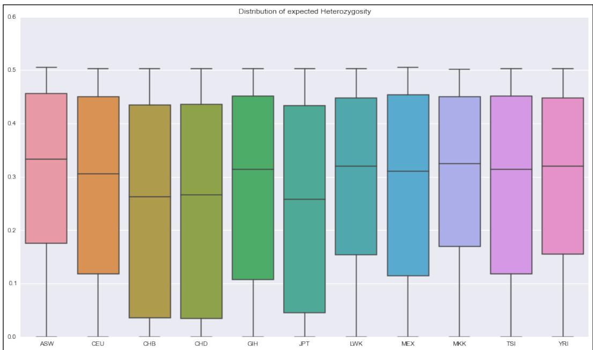
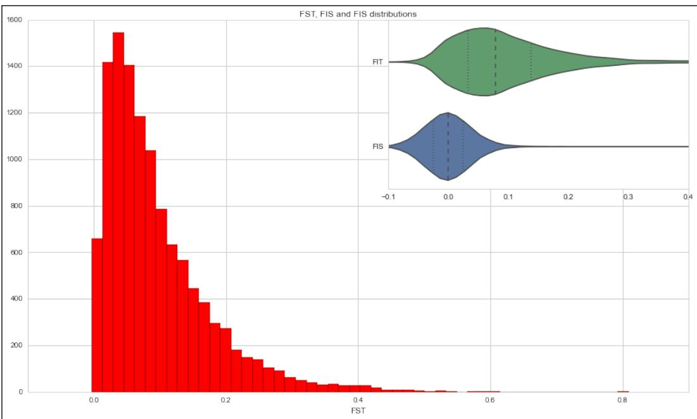
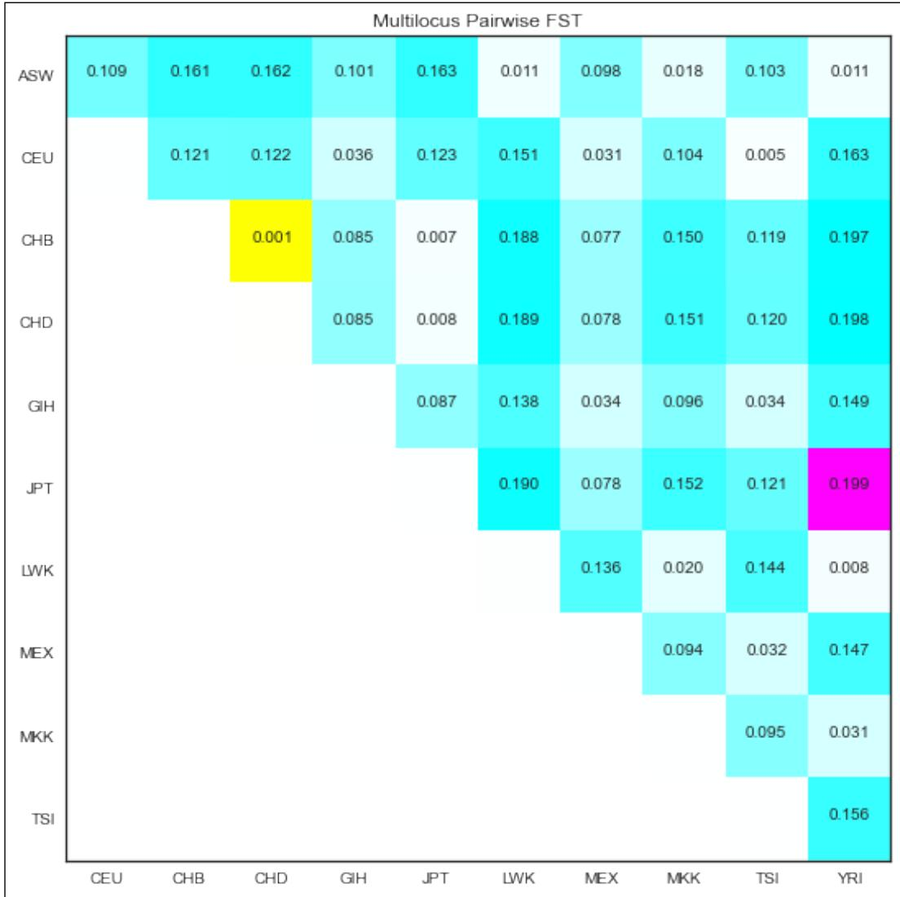
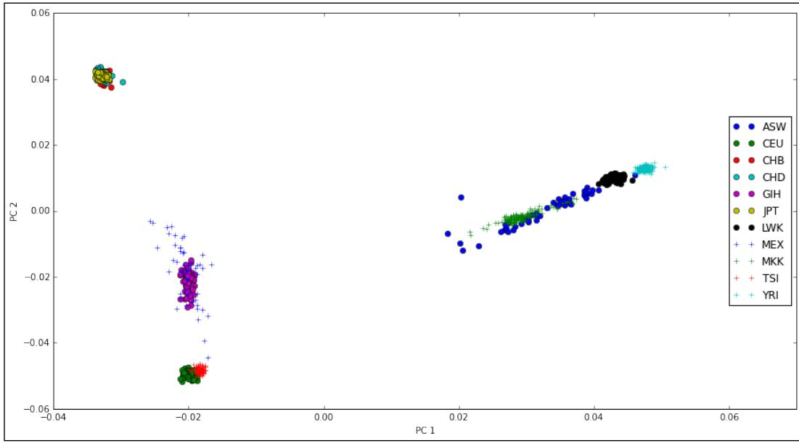
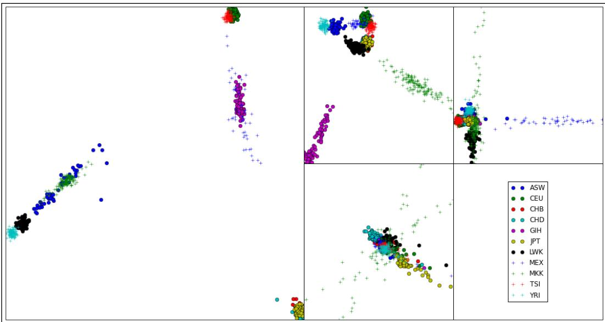
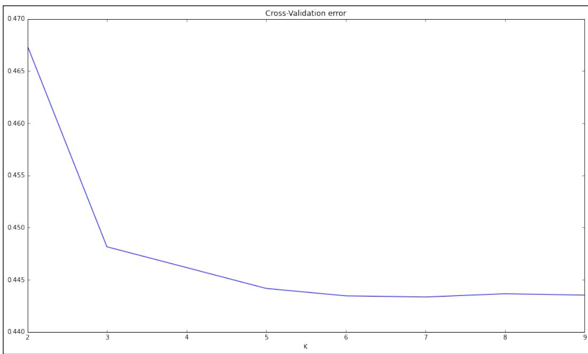
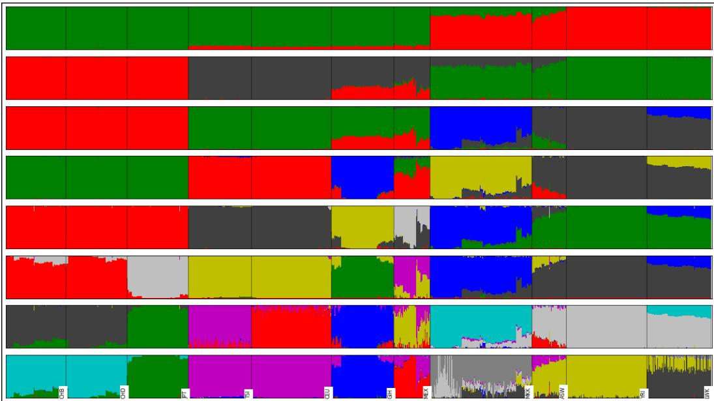

# Population Genetics


In this chapter, we will cover the following recipes: 

Managing datasets with PLINK 

▶ Introducing the Genepop format 

f Exploring a dataset with Bio.PopGen 

f Computing F-statistics 

f Performing Principal Components Analysis 

Investigating population structure with Admixture 

## Introduction

Population genetics is the study of changes of frequency of alleles in a population on the basis of selection, drift, mutation, and migration. The previous chapters focused mainly on data processing and cleanup; this is the first chapter in which we will actually infer interesting biological results. 

There is a lot of interesting population genetics analysis based on sequence data, but as we already have quite a few recipes to deal with sequence data, we will divert our attention somewhere else. Also, we will not cover genomic structural variation such as Copy Number Variation (CNVs) or inversions here. I will concentrate on analyzing SNP data, which is one of the most common. We will perform many standard analyses, including population genetic analyses with Python, such as $\mathsf { F } _ { \mathsf { s } \mathsf { T } }$ (Fixation index), Principal Components Analysis (PCA), and study of population structure. 

## Population Genetics

We will use Python as a scripting language that glues together applications that perform necessary computations, which is the "old-fashioned way". Having said that, as the Python software ecology is still evolving, you can at least perform the PCA in Python using scikit-learn. Also, we will perform the PCA using EIGENSOFT's smartpca (an external application). 

There is no such thing as a default file format for population genetics data. The bleak reality of this field is that there are plenty of formats, most of them developed with a specific application in mind; therefore, it's not generically applicable. Some of the efforts to create a more general format (or even just a file converter to support many formats) met with limited success. Furthermore, as our knowledge of genomics increases, we will require new formats anyway (for example, to support some kind of previously unknown genomic structural variation). Here, we will work with the formats of two widely used applications. One is PLINK (http://pngu.mgh.harvard.edu/~purcell/plink/).This format was originally developed to perform genome-wide association studies (GWAS) with human data and has many more applications. The second format is Genepop (http://kimura.univmontp2.fr/~rousset/Genepop.htm). This format is widely used in the conservation genetics community. If you have NGS sequencing data, you may question why not VCF? Well, a VCF file is normally annotated to help with sequencing analysis, which you do not need at this stage (you should now have a filtered dataset). If you convert your SNP calls from VCF to PLINK, you will gain 95 percent in terms of size (this is in comparison to a compressed VCF). More importantly, the computational cost of processing a VCF file is much bigger (think of processing all this highly-structured text) than the cost of other two formats. 

This chapter is closely tied to the next one. Here, we will work with real empirical data, whereas in the next chapter, we will simulate data. However, if you are interested in analyzing population genetics data, be sure to read the next chapter, where we will cover some ground analysis. 

First, let's start with a discussion on file format issues and then continue to discuss interesting data analysis. 

## Managing datasets with PLINK

Here, we will manage our dataset using PLINK. We will create subsets of our main dataset (from the HapMap project) suitable to be analyzed in our next recipes. 


Note that neither PLINK nor any similar programs were developed because of their file formats. Probably, it had no objective to become a default file standard for population genetics data. In this field, you will need to be ready to convert from format to format (for this, Python is quite appropriate) because every application that you will use will probably have its own quirky requirements. The most important point to learn from this recipe is that it's not formats that are being used, although these are relevant, but the ''file conversion mentality''. Apart from this, some of the steps in this recipe also convey genuine analysis techniques that you may want to consider using (for example, subsampling or Linkage Disequilibrium (LD) pruning). 

## Getting ready

Throughout this chapter, we will use data from the Human HapMap project. You may recall that we used data from the Human 1000 genomes project in Chapter 2, Next-generation Sequencing, the HapMap project is in many ways the precursor of the Human 1000 genomes project; instead of whole genome sequencing, genotyping was used. Most of the samples of the HapMap project were used in the Human 1000 genomes project, so if you have read the recipes in Chapter 2, Next-generation Sequencing, you will already have an idea of the dataset (including the available population). I will not introduce the dataset much more, but you can refer to Chapter 2, Next-generation Sequencing, and, of course, the HapMap site (http:// www.hapmap.org). Remember that we have genotyping data for many individuals split across populations around the globe. We will refer to these populations by their acronyms. Here is the list taken from http://www.sanger.ac.uk/resources/downloads/human/ hapmap3.html: 

<table><tr><td>Acronym</td><td>Population</td></tr><tr><td>ASW</td><td>This denotes African ancestry in Southwest USA</td></tr><tr><td>CEU</td><td>This denotes Utah residents with Northern and Western European ancestry from the CEPH collection</td></tr><tr><td>CHB</td><td>This denotes Han Chinese in Beijing, China</td></tr><tr><td>CHD</td><td>This denotes Chinese in Metropolitan Denver, Colorado</td></tr><tr><td>GIH</td><td>This denotes Gujarati Indians in Houston, Texas</td></tr><tr><td>JPT</td><td>This denotes Japanese in Tokyo, Japan</td></tr><tr><td>LWK</td><td>This denotes Luhya in Webuye, Kenya</td></tr><tr><td>MXL</td><td>This denotes Mexican ancestry in Los Angeles, California</td></tr></table>


Population Genetics


<table><tr><td>Acronym</td><td>Population</td></tr><tr><td>MKK</td><td>This denotes Maasai in Kinyawa, Kenya</td></tr><tr><td>TSI</td><td>This denotes Toscani in Italia</td></tr><tr><td>YRI</td><td>This denotes Yoruba in Ibadan, Nigeria</td></tr></table>

This will require a fairly big download (approximately 1 GB), which will have to be uncompressed. For this, you will need bzip2, which is available at http://www.bzip. org/. Make sure that you have approximately 20 GB of disk space for this chapter. 

You can download this from https://github.com/tiagoantao/bioinf-python/ blob/ master/notebooks/Datasets.ipynb, the hapmap.map.bz2 and hapmap.ped.bz2 files, plus the relationships.txt file 

Decompress the PLINK file using the following commands: 

```batch
bunzip2 hapmap3_r2_b36_fwd.consensus.qc.poly.map.bz2 
```

```batch
bunzip2 hapmap3_r2_b36_fwd.consensus.qc.poly.ped.bz2 
```

Therefore, we have PLINK files; the MAP file has positions of the information of the marker position across the genome, whereas the PED file has actual markers for each individual along with some pedigree information. We also downloaded a metadata file that contains information about each individual. Take a look at all these files and familiarize yourself with them. 

As usual, this is also available in the 03_PopGen/Data_Formats.ipynb notebook, where everything has been taken care of. 

Finally, most of this recipe will make heavy usage of PLINK (you should have installed at least version 1.9 from http://pngu.mgh.harvard.edu/~purcell/plink/ not version 1.0x). Python will mostly be used as the glue language to call PLINK. 

## How to do it…

Take a look at the following steps: 

1. Let's get the metadata for our samples. We will load the population of each sample and note all individuals that are offspring of others in the dataset: 

```python
from collections import defaultdict
f = open('relationships_w_pops_121708.txt')
pop_ind = defaultdict(list)
f.readline()  # header
offspring = []
for l in f:
    toks = l.rstrip().split('\t')
    fam_id = toks[0]
    ind_id = toks[1] 
```

```txt
Free ebooks ==> www.ebook777.com 
```

```python
mom = toks[2]
dad = toks[3]
if mom != '0' or dad != '0':
    offspring.append((fam_id, ind_id))
pop = toks[-1]
pop_ind[pop].append((fam_id, ind_id))
f.close() 
```

Chapter 4 

‰ This will load a dictionary where population is the key (CEU, YRI, and so on) and its value is the list of individuals in that population. This dictionary will also store if the individual is the offspring of another. Each individual is identified by the family and individual ID (which are found on the PLINK file). The file provided by the HapMap project is a simple tab-delimited file, which is not difficult to process. 

‰ There is an important point to make here, that is, the reason this information is provided on a separate, ad hoc file is because the PLINK format makes no provision for the population structure (this format makes provision only for the case/control information for which PLINK was designed). This is not a flaw of the format in a sense that it was never designed to support standard population genetic studies (it's a GWAS tool). However, this is a general "feature" of population genetics data formats: whichever you end up working with, there will be something important missing. 

‰ We will use this metadata in other recipes in this chapter. We will also perform some consistency analysis between the metadata and the PLINK file, but we will defer this to the next recipe. 

‰ pandas will be a good alternative to implement similar functionalities to read metadata. 

2. Let's now subsample the dataset at 10 percent and 1 percent of the number of markers as follows: 

```python
import os
os.system('plink --recode --file
hapmap3_r2_b36_fwd.consensus.qc.poly --noweb --out hapmap10 --thin 0.1 --geno 0.1')
os.system('plink --recode --file
hapmap3_r2_b36_fwd.consensus.qc.poly --noweb --out hapmap1 --thin 0.01 --geno 0.1') 
```

‰ Alternatively, if you are using IPython, you can simply use the following command: 

```shell
!plink --recode --file hapmap3_r2_b36_fwd.consensus.qc.poly
--noweb --out hapmap10 --thin 0.1 --geno 0.1
!plink --recode --file hapmap3_r2_b36_fwd.consensus.qc.poly
--noweb --out hapmap1 --thin 0.01 --geno 0.1 
```

## Population Genetics

‰ Note the subtlety that you will not really get 1 or 10 percent of the data; each marker will have a 1 or 10 percent chance of being selected, so you will get approximately 1 or 10 percent of markers. 

‰ Obviously, as the process is random, different runs will produce different marker subsets. This will have important implications further down the road. If you want to replicate the exact same result, you can nonetheless use the --seed option. 

‰ We will also remove all SNPs that have a genotyping rate of lower than 90 percent (the --geno 0.1 parameter). 


There is nothing special about Python in this code, but there are two reasons you may want to subsample your data. First, if you are performing exploratory analysis of your own dataset, you may want to start with a smaller version because it will be easy to process. Also, you will have a broader view of your data. Second, some analysis methods may not require all your data (indeed, some methods might not be even able to use all your data). Be very careful with the last point though, that is, for every method that you use to analyze your data, be sure that you understand the data requirements for the scientific questions you want to answer. Feeding too much data may be okay normally (you pay a time and memory penalty), but feeding too little will lead to unreliable results. 

3. Now, let's generate subsets with just the autosomes (that is, let's remove sex chromosomes and the mitochondria) as follows: 

```python
def get_non_auto_SNPs(map_file, exclude_file):
    f = open(map_file)
    w = open(exclude_file, 'w')
    for l in f:
    toks = l.rstrip().split('\t')
    chrom = int(toks[0])
    rs = toks[1]
    if chrom > 22:
    w.write('%s\n' % rs)
    w.close()
    get_non_auto_SNPs('hapmap1.map', 'exclude1.txt')
    get_non_auto_SNPs('hapmap10.map', 'exclude10.txt')
    os.system('plink --recode --file hapmap1 --noweb --out hapmap1_auto --exclude exclude1.txt')
    os.system('plink --recode --file hapmap10 --noweb --out hapmap10_auto --exclude exclude10.txt') 
```

Chapter 4 

‰ Let's create a function that generates a list with all SNPs not belonging to autosomes. In PLINK, this means a chromosome number above 22 (for 22 human autosomes). If you use another species, be careful with your chromosome coding because PLINK is geared towards human data. If your species are diploid and have less than 23 autosomes and a sex determination system, that is, X/Y, this will be straightforward; if not, refer to https://www.cog-genomics.org/plink2/input#allow_extra_ chr for some alternatives (similar to the --allow-extra-chr flag). 

‰ We then create autosome only PLINK files for subsample datasets of 10 and 1 percent (prefixed as hapmap10_auto and hapmap1_auto). 

4. Let's create some datasets without an offspring that will be needed for most population genetic analysis, which require unrelated individuals to a certain degree: 

```txt
os.system('plink --file hapmap10_auto --filter-founders --recode --out hapmap10_auto_noofs') 
```


This step is representative of the fact that most population genetic analysis require samples to be unrelated to a certain degree. Obviously, as we know that some offsprings are in HapMap, we remove them. However, note that with your dataset, you are expected to be much more refined than this, for instance, run plink --genome or use another program to detect related individuals. The fundamental point here is that you have to dedicate some effort to detect related individuals in your samples; this is not a trivial task. 

5. We will also generate an LD pruned dataset, as required by many PCA and Admixture algorithms, as follows: 

```txt
os.system('plink --file hapmap10_auto_noofs --indep-pairwise 50 10 0.1 --out keep')
os.system('plink --file hapmap10_auto_noofs --extract keep.prune.in --recode --out hapmap10_auto_noofs_ld') 
```

‰ The first step generates a list of markers to be kept if the dataset is LD-pruned. This uses a sliding window of 50 SNPs, advancing by 10 SNPs at a time with a cut value of 0.1. 

‰ The second step extracts SNPs from the list generated earlier. 

6. Let's recode a couple of cases in different formats: 

```txt
os.system('plink --file hapmap10_auto_noofs_ld --recode12
tab --out hapmap10_auto_noofs_ld_12')
os.system('plink --make-bed --file hapmap10_auto_noofs_ld - 
-out hapmap10_auto_noofs_ld') 
```

## Population Genetics

‰ The first operation will convert a PLINK format that uses nucleotide letters (ACTG) to another, which recodes alleles with 1 and 2. We will use this in the Performing Principal Components Analysis recipe. 

‰ The second operation recodes a file in a binary format. If you work inside PLINK (using the many useful operations that PLINK has), the binary format is probably the most appropriate format (for example, smaller file size). We will use this in the Admixture recipe. 

7. We will also extract a single chromosome (2) for analysis. We will start with the autosome dataset subsampled at 10 percent: 

os.system('plink --recode --file hapmap10_auto_noofs -- chr 2 --out hapmap10_auto_noofs_2') 

## There's more...

There are many reasons why you might want to create different datasets for analysis. You may want to perform some fast initial exploration of data; the analysis algorithm that you plan to use has some data format requirements or a constraint on the input, it could be the number of markers or relationships among individuals. Chances are that you will have lots of subsets to analyze (unless your dataset is very small to start with, for instance, a microsatellite dataset). 

This may seem a minor point, but it's not. Be very careful with file naming (note that I have followed some simple conventions while generating filenames). Make sure that the name of the file gives some information about subset options. When you perform the downstream analysis, you will want to be sure that you choose the correct dataset; you will want your dataset management to be agile and reliable above all. The worst thing that can happen is to create an analysis with an erroneous dataset that does not obey constraints required by software. 

At the time of writing this book, there are two PLINK versions: 1.x and the fast approaching version 2. I strongly suggest that you use version 2 beta as well because the speed and memory improvements in version 2 are impressive. 

The LD-pruning that we used is somewhat standard for human analysis, but be sure to check the parameters, especially if you are using nonhuman data. 

The HapMap file that we downloaded is based on an old version of the reference genome (build 36). As stated in the previous chapter, be sure to use annotations from build 36 if you plan to use this file for more analysis of your own. 

This recipe will set the stage for all the next recipes and its results will be used extensively. 

Chapter 4 

## See also

The Wikipedia page http://en.wikipedia.org/wiki/Linkage disequilibrium on Linkage Disequilibrium is a good place to start 

The website of PLINK http://pngu.mgh.harvard.edu/~purcell/plink/ is perfectly documented (something that many genetics software lacks) 

## Introducing the Genepop format

The Genepop format is used in many conservation genetics studies. It's the format of the Genepop application and is the de facto format for many population genetics analysis. If you come from other fields (for example, have a lot of sequencing experience), you may not have heard of it, but this format is widely used (as its citation record proves) and is worth a look. Here, we will convert some datasets from previous recipes to this format and introduce the Genepop parser from Biopython. 

## Getting ready

You will need to run the previous recipe because its output will be required for this one. 

If you are not using Docker, you might not be using some of the code that I produced earlier (mostly to deal with the bread and butter of data conversion). You can find this code at https://github.com/tiagoantao/pygenomics and install it from 

## pip install pygenomics

Note that at this stage, we will not use the Genepop application (this will change in the next recipe), so no need to install it for now. 

As usual, this is available in the 03_PopGen/Genepop_Format.ipynb notebook, but it will still require you to run the previous notebook in order to generate the required files. 

## How to do it…

Take a look at the following steps: 

1. Let's load the metadata (we will use a simplified version from the previous recipe) as follows: 

```python
from collections import defaultdict
f = open('relationships_w_pops_121708.txt')
pop_ind = defaultdict(list)
f.readline()  # header
for line in f:
    toks = line.rstrip().split('\t') 
```

Population Genetics 

```python
fam_id = toks[0]
ind_id = toks[1]
pop = toks[-1]
pop_ind[pop].append((fam_id, ind_id))
f.close() 
```

2. Let's check for consistency between the PLINK data file and the metadata, as we will need to clean up population mappings to generate a Genepop file, as shown in the following code: 

```python
all_inds = []
for inds in pop_ind.values():
    all_inds.extend(inds)
for line in open('hapmap1.ped'):
    toks = line.rstrip().replace(' ', '\t').split('\t')
    fam = toks[0]
    ind = toks[1]
    if (fam, ind) not in all_inds:
    print('Problems with %s/%s' % (fam, ind)) 
```

‰ The preceding code generates a list with all individuals coming from the metadata file. Then, it will open hapmap1.ped, which has the pedigree information at 1 percent sampling. (I have chosen 1 percent because 1 will be much faster to process than 10 or 100 percent samples; we only need pedigree, not genetic information) and compare the information on both. It will report all individuals that are on the PED file, but not on the metadata file. 

‰ We perform a replacement procedure on each PED line because you can find some PLINK files that are space-separated, whereas others are tab-separated. 

‰ In a perfect world, this will output nothing, but there is one incorrect entry. This entry (which has family ID 2469 and individual ID NA20281) is not consistent with the family ID reported on the metadata. 


For your own dataset, always be sure to thoroughly compare your data with your metadata and to check for consistency problems. With all your sources of data (if you have more than one), make sure that they are consistent among themselves. If not, at least annotate all problematic cases, better yet, take action to understand and correct any underlying problems. The default assumption should be that there are problems (not that everything is sound). Although you may have produced the data yourself, check it. Bugs and typos are assured to happen. Making errors is normal, and checking for them is fundamental. Being overconfident is a sign of inexperience. 

## 3. Let's convert some datasets from PLINK to the Genepop format:

Chapter 4 

```python
from genomics.popgen.plink.convert import to_genepop
to_genepop('hapmap1_auto', 'hapmap1_auto', pop_ind)
to_genepop('hapmap10', 'hapmap10', pop_ind)
to_genepop('hapmap10_auto', 'hapmap10_auto', pop_ind)
to_genepop('hapmap10_auto_noofs_ld', 'hapmap10_auto_noofs_ld', pop_ind)
to_genepop('hapmap10_auto_noofs_2', 'hapmap10_auto_noofs_2', pop_ind) 
```

‰ Note that we will pass the prefix of all files, especially the first one, to the input file. This will be prepended with .ped and .map to find input files. The second one will be prepended with .gp to generate the Genepop file, whereas .pops will contain the order of populations on the Genepop file. Take a look at both generated files in order to be familiar with the content, although we will dissect the result a bit more in the next recipe. 

‰ As PLINK has no population structure information, we need to pass the pop_ind dictionary. This dictionary will be used to create a Genepop file structured by population. 

‰ This uses a function provided by my package to convert PLINK to Genepop data. This will take some time to run. Note that we are just converting subsampled data as this is done to make things computationally more efficient in downstream analysis, but be aware that in many of your own analysis, you may need the complete dataset. The function will ignore individuals without population, which means that it will exclude the individual with the wrong family ID detected on the consistency step. A will be converted to 1, C to 2, T to 3, and G to 4. Although a pops file will be produced with the order of populations on the output file, this will always be lexicographically ordered. 

‰ If you are curious about how this function works, feel free to take a look at https://github.com/tiagoantao/pygenomics/blob/master/ genomics/popgen/plink/convert.py. Be forewarned as it particularly contains text processing. 

4. Biopython provides an in-memory parser for Genepop files; let's take a small taste of it by opening the autosome file sampled at 1 percent: 

```matlab
from Bio.PopGen.GenePop import read
rec = read(open('hapmap1_auto.gp'))
print('Number of loci %d' % len(rec.loci_list))
print('Number of populations %d' % len(rec.pop_list))
print('Population names: %s' % ', '.join(rec.pop_list))
print('Individuals per population %s' % ', '.join([str(len(inds)) for inds in rec.populations]))
ind = rec.populations[1][0] 
```

Population Genetics 

```matlab
print('Individual %s, SNP %s, alleles: %d %d' % (ind[0], rec.loc_list[0], ind[1][0][0], ind[1][0][1]))
del rec 
```

‰ The output is as follows: 

```txt
Number of loci 13902
Number of populations 11
Population names: 2436/NA19983, 1459/NA12865, NA18594/NA18594, NA18140/NA18140, NA20881/NA20881, NA19007/NA19007, NA19372/NA19372, M005/NA19652, 2581/NA21371, NA20757/NA20757, Y105/NA19099
Individuals per population 82, 165, 84, 85, 88, 86, 90, 77, 171, 88, 167
Individual 1328/NA06989, SNP 1/rs2710888/949705, alleles: 3 2 
```

‰ The default assumption about population names on Genepop is that somehow the last individual is used to identify a population. As this is slightly ad hoc, we will also generate a .pop file (as in the previous recipe) with names of populations. 

‰ As the marker sampling process in the previous recipe is stochastic, you will probably see a slightly different number of loci. 

‰ As the whole dataset is in memory, we can directly access any individua of any population. This is what we perform to print the last line, that is, we access the first individual of the second population and print its name along with alleles of the first SNP (which are 3 and 2, thus coding T and C). The first SNP is called 1/rs2710888/949705. Here, 1 represents the chromosome number, the middle ID is the SNP RS ID (the identifier on NCBI's dbSNP database), and the last number is the chromosome position against the human build 36. 

‰ At the end, we delete the record because it takes up a lot of memory. 


Note that some of these outputs depend on how the Genepop was coded (on my to_genepop function) and are based on that. For example, the coding of ACTG to 1234 is arbitrary (just a convenience) or the fact that populations are lexicographically ordered or loci names include the rs id and position chromosomes. If you receive your files from another source, you will have to check whatever conventions they have used (which may or may not be convenient to you). If you generate your own files, be sure to use conventions that will be useful downstream (like here). Of course, this argument is generalizable; you can apply it to other file formats as long as they have any form of built-in flexibility. 

5. More realistically, we will use the large file parser for most modern datasets because it won't load the whole in-memory file, but provide an iterator instead as follows: 

```python
from Bio.PopGen.GenePop.LargeFileParser import read as\read_large 
```

def count_individuals(fname): 

```txt
Free ebooks ==> www.ebook777.com 
```

Chapter 4 

```python
pop_sizes = []
for line in rec.data_generator():
    if line ==():
    pop_sizes.append(0)
    else:
    pop_sizes[-1] += 1
return pop_sizes

print('Individuals per population %s' % ', '.join([str(len(inds)) for inds in count_individuals('hapmap1_auto.gp')]))
print(len(read_large(open('hapmap10.gp')).loci_list))
print(len(read_large(open('hapmap10_auto.gp')).loci_list))
print(len(read_large(open('hapmap10_auto_noofs_ld.gp')).loci_list)) 
```

‰ The count_individuals function shows how you can traverse a Genepop file using the large file parser; while you iterate over it, if you find an empty tuple, it's a marker of a new population. Anything else is an individual, which is composed of tuple (pair) with an individual name and a list of loci (which we will not read here). 

‰ As stated earlier, individuals per population will return the exact same values. 

‰ We then print the number of loci on three different files: 10 percent sampling, 10 percent sampling with only autosomes, and 10 percent sampling of autosomes with LD-pruning. The output reflects (which will vary due to stochasticity generating the files) that the first file has more markers than the second file (as the second file is a subset of the first file, removing sex chromosomes and mitochondria) and the last file will have much less markers because it's a LD-pruned subset of the second file. 

## See also

1 There is actually a Genepop interface on the Web at http://genepop.curtin. edu.au/ that you can use for manual examples (especially with small files). 

## Exploring a dataset with Bio.PopGen

In this chapter, we will perform an initial exploratory analysis of one of our generated datasets. We will analyze the 10 percent sampling of chromosome 2 without the offspring. We will look for monomorphic loci (in this case, SNPs) across populations along with how to research minimum allele frequencies and expected heterozygosities. 

Population Genetics 

## Getting ready

You will need to have run the previous two recipes and should have the hapmap10_auto noofs_2.gp and hapmap10_auto_noofs_2.pops files. We will also use the metadata file downloaded in the first recipe. 

For this code to work, you will need to install Genepop from http://kimura.univmontp2.fr/~rousset/Genepop.htm. We will use the interface provided by Biopython to execute Genepop and parse its output files. 

There is a notebook with this recipe: 03_PopGen/Exploratory_Analysis.ipynb, but it will still require running the previous two notebooks in order for the required files to be generated. 

## How to do it…

## Take a look at the following steps:

1. Let's load population names and execute Genepop externally to compute genotypic frequencies as follows: 

```python
from Bio.PopGen.GenePop import Controller as gpc
ctrl = gpc.GenePopController()
my_pops = [1.rstrip() for 1 in
    open('hapmap10_auto_noofs_2.pops')]
num_pops = len(my_pops)
pop_iter, loci_iter =\
ctrl.calc_allele_genotype_freqs('hapmap10_auto_noofs_2.gp') 
```

‰ First, we will create a controller (an object that allows you to interact with the Genepop application). Then, we will load population names. Finally, we will compute the genotypic information, which may take some time. Our controller will return two iterators, exposing results per population and per loci. 


We will use a relatively small dataset, which makes running Genepop in a single go feasible. If you have a larger dataset, be it in a number of individuals or in the number of loci, you may need to split the file into smaller chunks and run several Genepop instances in parallel, each working with part of the data. We will discuss this in Chapter 9, Python for Big Genomics Datasets. 

```txt
Free ebooks ==> www.ebook777.com 
```

Chapter 4 

2. Let's go through all loci statistics and retrieve information for each population of fixated alleles, minimum allele frequencies, and number of reads: 

```python
from collections import defaultdict
fix_pops = [0 for i in range(num_pops)]
num_reads = [defaultdict(int) for i in range(num_pops)]
num_buckets = 20
MAFs = []
for i in range(num_pops):
    MAFs.append([0] * num_buckets)
for locus_data in loci_iter:
    locus_name = locus_data[0]
    allele_list = locus_data[1]
    pop_of_loci = locus_data[2]
    for i in range(num_pops):
    locus_num_reads = pop_of_loci[i][2]
    num_reads[i][locus_num_reads] += 1
    maf = min(pop_of_loci[i][1])
    if maf == 0:
    fix_pops[i] += 1
    else:
    bucket = min([num_buckets - 1, int(maf * 2 * num_buckets)])
    MAFs[i][bucket] += 1 
```

‰ We initialize three data structures. One to count the number of monomorphic loci per population, another to count the number of reads per loci and per population, and finally, one to hold the minimum allele frequency per population. 

‰ The minimum allele frequency will be held in a bin-wise fashion (values between 0 and 0.025 will go in the first bin, values between 0.025 and 0.05 will go in the second bin, and so on, until 0.475 and 0.5). 

‰ We then go through the loci iterator provided in the previous entry. We extract the locus name, list of alleles for the loci, and per population information for the locus. We extract the number of alleles read (twice the number of samples as a rule) and allele frequencies. We use the minimum to calculate the MAF and infer whether the locus is monomorphic (MAF of 0). 

## Population Genetics

```python
Let's plot the results as follows:
import numpy as np
import seaborn as sns
import matplotlib.pyplot as plt
fig, axes = plt.subplots(3, figsize=(16, 9), squeeze=False)
axs[0, 0].bar(range(num_pops), fix_pops)
axs[0, 0].set_xlim(0, 11)
axs[0, 0].set_xticks(0.5 + np.arange(num_pops))
axs[0, 0].set_xticklabels(my_pops)
axs[0, 0].set_title('Monomorphic positions')

axs[1, 0].bar(range(num_pops), [np.max(vals.keys()) for vals in num_reads])
axs[1, 0].set_xlim(0, 11)
axs[1, 0].set_xticks(0.5 + np.arange(num_pops))
axs[1, 0].set_xticklabels(my_pops)
axs[1, 0].set_title('Maximum number of allele reads per loci')

for pop in [0, 7, 8]:
    axes[2, 0].plot(MAFs[pop], label=my_pops[pop])
    axes[2, 0].legend()
    axes[2, 0].set_xticks(range(num_buckets + 1))
    axes[2, 0].set_xticklabels(['%.3f' % (x / (num_buckets * 2.)) for x in range(num_buckets + 1)])
    axes[2, 0].set_title('MAF bundled in bins of 0.025') 
```

‰ The reason we import seaborn is because it will change the default look of plots. By conscious decision, the default matplotlib look is not very stylish. Other than this, all code should be fairly easy to interpret. 

‰ The output is seen in the following figure and includes three subplots: one with the number of fixated (monomorphic) alleles per population, another with the maximum number of allele reads per loci (mostly, a proxy of a number of individuals processed per population), and finally, the distribution of MAF for three populations. This is the population chosen with the least number of samples (ASW and MEX) and one with the most number of samples (MKK). This was done to illustrate sampling effects; ASW and MEX are bumpy. This is most probably due to less sample size influencing the distribution of MAFs (less values become possible), whereas MKK is smoother: 

```txt
Free ebooks ==> www.ebook777.com 
```

Chapter 4 

```txt
Monomorphic positions
Maximum number of allele reads per loci
MAF bundled in bins of 0.025
ASW
CEU
CHB
CHD
GIH
JPT
LWK
MEX
MKK
TSI
YRI 
```

Figure 1: Three subplots: the top one includes a count of fixated SNPs per population, the second one the maximum allele reads per population, and the bottom one the distribution of MAF for three of the eleven populations 

4. Let's now traverse the same result, but population-wise to compute the expected heterozygosities per population and per loci: 

```python
exp_hes = []
for pop_data in pop_iter:
    pop_name, allele = pop_data
    print(pop_name)
    exp_vals = []
    for locus_name, vals in allele.items():
    geno_list, heterozygosity, allele_cnts, summary = \
vals
    cexp_ho, cobs_ho, cexp_he, cobs_he = heterozygosity
    exp_vals.append(cexp_he / (cexp_he + cexp_ho))
    exp_hes.append(exp_vals) 
```

‰ Now, we traverse the iterator with the population information. We extract the population name (remember from the previous recipe that this is not very informative) and then go through each locus and extract the expected number of homozygotes and convert these to the expected heterozygosity. 

‰ Note that this iterator is still somewhat memory intensive; it will load all loci for a single population in memory; this is not very scalable if you have millions of SNPs. 

## Population Genetics

5. Let's plot the distribution of expected heterozygosities per population as follows: 

fig = plt.figure(figsize=(16, 9)) 

ax = fig.add_subplot(111) 

sns.boxplot(exp_hes, ax=ax) 

ax.set_title('Distribution of expected Heterozygosity') 

ax.set_xticks(1 + np.arange(num_pops)) 

ax.set_xticklabels(my_pops) 

‰ The output can be seen in the following screenshot: 




Figure 2: The distribution of expected heterozygosity across eleven populations of the HapMap project for chromosome 2 subsampled at 10 percent


## There's more...

The truth is that for population genetic analysis, nothing beats R; you are definitely encouraged to take a look at the existing R libraries for population genetics. Do not forget that there is a Python-R bridge, which is discussed in Chapter 1, Python and the Surrounding Software Ecology. 

Many of the analysis presented here will be computationally costly if done to bigger datasets (remember that we are only using chromosome 2 subsampled at 10 percent). The final chapter will discuss ways to address this. 

Chapter 4 

## See also

There is list of R packages for statistical genetics available at http://cran.rproject.org/web/views/Genetics.html 

f If you need to know more about population genetics, I recommend the book Principles of Population Genetics, Daniel L. Hartl and Andrew G. Clark, Sinauer Associates 

## Computing F-statistics

Nearly 100 years ago, Sewall Wright developed F-statistics to quantify inbreeding effects at a certain level of population subdivision. $\mathsf { F } _ { \mathsf { s } \mathsf { T } }$ is the most widely used of these statistics and is mostly interpreted as the genetic variation caused by the population structure. 

## Getting ready

You will need to have run the first two recipes and should have the hapmap10_auto noofs_2.gp and hapmap10_auto_noofs_2.pops files. We will also use the metadata file downloaded in the first recipe. For the type of comparison that we will perform here, it's important to assure that there is little relatedness among sampled individuals, so we want to remove the offspring at the very least. For efficiency, we will use only chromosome 2 subsampled at 10 percent. 

For this code to work, you will need to install Genepop from http://kimura.univmontp2.fr/~rousset/Genepop.htm. We will use the interface provided by Biopython to execute Genepop and parse its output files. These requirements are the same as the previous recipe. 

There is a notebook with the 03_PopGen/F-stats.ipynb recipe, but it will still require you to run the first two notebooks in order to generate files that are required. 

## How to do it…

Take a look at the following steps: 

1. First, let's compute F-statistics $( \mathsf { F } _ { \mathsf { s r } } , \mathsf { F } _ { { \mathsf { s } } } ,$ and $\mathsf { F } _ { \mathfrak { w } } )$ for our dataset with all 11 populations as follows: 

```python
from Bio.PopGen.GenePop import Controller as gpc
my_pops = [1.rstrip() for 1 in
    open('hapmap10_auto_noofs_2.pops')]
num_pops = len(my_pops)
ctrl = gpc.GenePopController()
(multi_fis, multi_fst, multi_fit), f_iter = \
ctrl.calc_fst_all('hapmap10_auto_noofs_2.gp')
print(multi_fis, multi_fst, multi_fit) 
```

## Population Genetics

As with the previous recipe, we will first load population names and initialize a controller to interact with the Genepop application. Then, we will calculate various F-statistics. 

‰ The function will return a loci iterator that returns several F-statistics per loci as the last parameter. You may be tempted to compute the average F-statistic by looping through the iterator; while this is interesting, the multilocus F-statistics are not trivial to compute. For example, you will want to give more weightage to a loci with a larger MAF. Genepop provides multilocus $\mathsf { F } _ { \mathsf { s } } , \mathsf { F } _ { \mathsf { s } \mathsf { T } } ,$ and $\mathsf { F } _ { \mathfrak { m } }$ as its first three parameters before the iterator. 

2. Let's traverse loci results and put them on arrays as follows: 

```python
fst_vals = []
fis_vals = []
fit_vals = []
for f_case in f_iter:
    name, fis, fst, fit, qinter, qintra = f_case
    fst_vals.append(fst)
    fis_vals.append(fis)
    fit_vals.append(fit) 
```

‰ This code assumes that you can fit all the values in memory. If your dataset is large, you may want to consider using a slightly more sophisticated approach. Refer to Chapter 9, Python for Big Genomics Datasets for ideas. 

## 3. Let's plot the summary distributions:

sns.set_style("whitegrid")
fig = plt.figure()
ax = fig.add_subplot(1, 1, 1)
ax.hist(fst_vals, 50, color='r')
ax.set_title('F $_{ST}$ , F $_{IS}$ and F $_{IS}$ distributions')
ax.set_xlabel('F $_{ST}$ ')
ax = fig.add_subplot(2, 2, 2)
sns.violinplot([fis_vals, fit_vals], ax=ax, vert=False)
ax.set_yticklabels(['F $_{IS}$ ', 'F $_{IT}$ ])
ax.set_xlim(-.1, 0.4) 

‰ The results can be seen in Figure 3, which depicts distributions of $\mathsf { F } _ { \mathsf { s } \tau } , \mathsf { F } _ { \mathsf { s } } ,$ and $\mathsf { F } _ { \mathfrak { m } }$ across chromosome 2: 




Figure 3: In the large chart, we see a histogram of $\mathsf { F } _ { \mathrm { s } \vec { \Gamma } }$ the small chart has violin plots for $\mathsf { F } _ { \mathsf { s } }$ and $\mathsf { F } _ { \mathfrak { m } }$


4. Let's compute average pair-wise $\mathsf { F } _ { \mathsf { s T s } }$ among all populations, as shown in the following code: 

fpair_iter, avg $= \backslash$ 

$$
\text { ctrl.calc\_fst\_pair('hapmap10\_auto\_noofs\_2.gp') }
$$

‰ Remember that now we will be comparing all pairs of populations, so we will have per SNP and 55 $\mathsf { F } _ { \mathsf { s } \mathsf { T } }$ values (the number of combinations possible with our 11 HapMap populations). You can access all these values on fpair_ iter. However, for now, we will concentrate on avg, which reports the multilocus pair-wise $\mathsf { F } _ { \mathsf { s T } }$ for all 55 combinations. 

5. Let's plot the distance matrix across populations based on the multilocus pair-wise $F_{st}$ as follows:
    min_pair = min(avg.values())
    max_pair = max(avg.values())
    arr = np.ones((num_pops - 1, num_pops - 1, 3), dtype=float)
    sns.set_style("white")
    fig = plt.figure(figsize=(16, 9))
    ax = fig.add_subplot(111)
    for row in range(num_pops - 1):
    for col in range(row + 1, num_pops):
    val = avg[(col, row)]
    norm_val = (val - min_pair) / (max_pair - min_pair)
    ax.text(col - 1, row, '%.3f' % val, ha='center')
    if norm_val == 0.0:
    arr[row, col - 1, 0] = 1
    arr[row, col - 1, 1] = 1
    arr[row, col - 1, 2] = 0
    elif norm_val == 1.0:
    arr[row, col - 1, 0] = 1
    arr[row, col - 1, 1] = 0
    arr[row, col - 1, 2] = 1
    else:
    arr[row, col - 1, 0] = 1 - norm_val
    arr[row, col - 1, 1] = 1
    arr[row, col - 1, 2] = 1
    ax.imshow(arr, interpolation='none')
    ax.set_xticks(range(num_pops - 1))
    ax.set_xticklabels(my_pops[1:])
    ax.set_yticks(range(num_pops - 1))
    ax.set_yticklabels(my_pops[:-1]) 

‰ In Figure 4, we will draw an upper triangular matrix, where the background color of a cell represents the measure of differentiation; white means less divergent (lower $\mathsf { F } _ { \mathsf { s } \tau } )$ and blue means more divergent (higher $\mathsf { F } _ { \mathsf { s } \tau } ) _ { \mathsf { \Omega } }$ . The lowest value between CHB and CHD is represented in yellow color and the biggest value between JPT and YRI is represented in magenta color. The value on each cell is the average pair-wise $\mathsf { F } _ { \mathsf { s } \mathsf { T } }$ between these two populations: 




Figure 4: The average pair-wise $\mathsf { F } _ { \mathsf { s T } }$ across 11 populations of the HapMap project for chromosome 2


```txt
Free ebooks ==> www.ebook777.com 
```

```txt
Population Genetics 
```

6. Finally, let's check the values of pair-wise $\mathsf { F } _ { \mathsf { s } \mathsf { T } }$ comparisons between Yorubans (YRI) and Utah residents with Northwest European ancestry (CEU) around the Lactase (LCT) gene that resides on chromosome 2: 

```python
pop_ceu = my_pops.index('CEU')
pop_yri = my_pops.index('YRI')
start_pos = 136261886 # b36end_pos = 136350481
all_fsts = []
inside_fsts = []
for locus_pfst in fpair_iter:
    name = locus_pfst[0]
    pfst = locus_pfst[1]
    pos = int(name.split('/')[-1]) # dependent
    my_fst = pfst[(pop_yri, pop_ceu)]
    if my_fst == '-'': # Can be this
    continue
    all_fsts.append(my_fst)
    if pos >= start_pos and pos <= end_pos:
    inside_fsts.append(my_fst)
print(inside_fsts)
print('%.2f/%.2f/%.2f' % (np.median(all_fsts),
    np.mean(all_fsts), np.percentile(all_fsts, 90))) 
```

```txt
☐ The output can be seen here: 
```

```txt
[0.1346, 0.6703, 0.7317, 0.1432, 0.2485]
0.08/0.13/0.33 
```

‰ This is done by iterating over the whole result. On one side, you get the values for the whole chromosome, whereas on the other, you get the values for the region around LCT (and MCM6, another gene in the neighborhood). 

‰ We then print pair-wise $\mathsf { F } _ { \mathsf { s T s } }$ in the region and some statistical information about the $\mathsf { F } _ { \mathsf { s } \mathsf { T } }$ across the whole chromosome. 

‰ Note that you will definitely have different results in the region; your random subsampled file will surely have other markers. If you are unlucky enough, you may even not get any markers (although this is unlikely). 

‰ Note how the reported values in the LCT area are generally much higher than the median and even in some cases, the ninetieth percentile. This is because LCT is known to be under the selection of the CEU population (giving that population the ability to digest milk into adult age). $\mathsf { F } _ { \mathsf { s } \mathsf { T } }$ is a statistic that can help you perform selection scans (to find genes that may be under selection) and genes that are under directional selection will probably have SNPs with high $\mathsf { F } _ { \mathsf { s r } }$ 

112 

## www.ebook777.comwww.it-ebooks.info

## See also

F-statistics is an immensely complex topic and I will direct you firstly to the Wikipedia page at http://en.wikipedia.org/wiki/F-statistics. 

A very good explanation can be found on Holsinger, Weir paper, and Nature Reviews Genetics (genetics in geographically structured populations: defining, estimating, and interpreting $\mathsf { F } _ { \mathsf { s } \tau } )$ at http://www.nature.com/nrg/journal/v10/n9/abs/ nrg2611.html 

## Performing Principal Components Analysis

Principal Components Analysis (PCA) is a statistical procedure to perform a reduction of dimension of a number of variables to a smaller subset that is linearly uncorrelated. Its practical application in population genetics is assisting the visualization of relationships of individuals that is being studied. 

While most of the recipes in this chapter make use of Python as a "glue language" (Python calls external applications that actually do most of the work) with PCA, we have an option, that is, we can either use an external application (for example, EIGENSOFT smartpca) or use scikit-learn and perform everything on Python. We will perform both. 

## Getting ready

You will need to run the first recipe in order to use the hapmap10_auto_noofs_ld_12 PLINK file (with alleles recoded as 1 and 2). PCA requires LD-pruned markers; we will not risk using the offspring here because it will probably bias the result. We will use the recoded PLINK file with alleles as 1 and 2 because this makes processing easier with smartpca and scikit-learn. 

As with the second recipe, if you are not using Docker, you will also be using some of the code that I have produced. You can find this code at https://github.com/tiagoantao/ pygenomics. You can install it with 

## pip install pygenomics

For this recipe, you will need to download EIGENSOFT (http://www.hsph.harvard.edu/ alkes-price/software/), which includes the smartpca application that we will use. 

There is a notebook in the 03_PopGen/PCA.ipynb recipe, but you will still need to run the first recipe. 

Population Genetics 

## How to do it…

Take a look at the following steps: 

1. Let's load the metadata as follows: 

```python
f = open('relationships_w_pops_121708.txt')
ind_pop = {}
f.readline()  # header
for l in f:
    toks = l.rstrip().split('\t')
    fam_id = toks[0]
    ind_id = toks[1]
    pop = toks[-1]
    ind_pop['/'.join([fam_id, ind_id])] = pop
f.close()
ind_pop['2469/NA20281'] = ind_pop['2805/NA20281'] 
```

In this case, we will add an entry that is consistent with what is available on the PINK file. 

## 2. Let's convert the PLINK file to the EIGENSOFT format:

```python
from genomics.popgen.plink.convert import to_eigen to_eigen('hapmap10_auto_noofs_ld_12', 'hapmap10_auto_noofs_ld_12') 
```

‰ This uses a function that I have written to convert from PLINK to the EIGENSOFT format. This is mostly text manipulation, not precisely the most exciting code. 

3. Now, we will run smartpca and parse its results as follows: 

```python
from genomics.popgen.pca import smart
ctrl = smart.SmartPCAController('hapmap10_auto_noofs_ld_12')
ctrl.run()
wei, wei_perc, ind_comp = \
smart.parse_evec('hapmap10_auto_noofs_ld_12.evec', 'hapmap10_auto_noofs_ld_12.eval') 
```

‰ Again, this will use a couple of functions from pygenomics to control smartpca and then to parse the output. The code is typical for this kind of operations, and while you are invited to inspect it, be aware that it's quite straightforward. 

‰ The parse function will return PCA weights (which we will not use, but you should inspect), normalized weights, and then principal components (usually up to PC 10) per individual. 

114 

4. Then, we plot PC1 and PC2, as shown in the following code: 

Chapter 4 

```python
from genomics.popgen.pca import plot
plot.render_pca(ind_comp, 1, 2, cluster=ind_pop) 
```

‰ This will produce the following figure. We will supply the plotting function and the population information retrieved from the metadata, which allows you to plot each population with a different color. 

‰ The results are very similar to published results; we will find four groups. Most Asian populations are located on top, the African populations are located on the right-hand side, and the European populations are located at the bottom. Two more admixed populations (GIH and MEX) are located in the middle: 




Figure 5: PC1 and PC2 of the HapMap data as produced by smartpca


5. Now, let's turn to a PCA plot produced by Python libraries only. To be able to run scikit-learn PCA on our data, let's get the individual order on the PED file and the number of SNPs first as follows: 

```python
f = open('hapmap10_auto_noofs_ld_12.ped')
ninds = 0
ind_order = []
for l in f:
    ninds += 1
    toks = l[:100].replace(' ', '\t').split('\t')
    fam_id = toks[0] 
```

```txt
Free ebooks ==> www.ebook777.com 
```

## Population Genetics

```python
ind_id = toks[1]
ind_order.append('%s/%s' % (fam_id, ind_id))
nsnps = (len(line.replace(' ', '\t').split('\t')) - 6) // 2
f.close() 
```

6. Then, we create an array required for the PCA function reading in the PED file: 

```python
import numpy as np
pca_array = np.empty((ninds, nsnps), dtype=int)

f = open('hapmap10_auto_noofs_ld_12.ped')
for ind, l in enumerate(f):
    snps = l.replace(' ', '\t').split('\t')[6:]
    for pos in range(len(snps) // 2):
    a1 = int(snps[2 * pos])
    a2 = int(snps[2 * pos])
    my_code = a1 + a2 - 2
    pca_array[ind, pos] = my_code
f.close() 
```

‰ This code will be slow to execute. 

‰ The most import part of the code is coding of alleles, and the ability for PCA to produce meaningful results rely on a good coding here. Remember that we will use a PLINK file that has a 1 and 2 allele coding. We will use the following strategy, that is 11s are converted to 0, 12 (and 21) are converted to 1 and 22 are converted to 2. 

7. We can now call the scikit-learn PCA function, which requests 8 components: 

```python
from sklearn.decomposition import PCA
my_pca = PCA(n_components=8)
my_pca.fit(pca_array)
trans = my_pca.transform(pca_array) 
```

8. Finally, let's print eight PCs as follows: 

```python
sc_ind_comp = {}
for i, ind_pca in enumerate(trans):
    sc_ind_comp[ind_order[i]] = ind_pca
plot.render_pca_eight(sc_ind_comp, cluster=ind_pop) 
```

‰ We will use a different function to perform the plotting here; you will able to see up to component 8. 

‰ The result is qualitatively similar to the smartpca version (it will be a worrying situation if it had been otherwise). Note that this is a mirror image from the previous figure; swapping signals on PCA is not a major issue at all: 




Figure 6: PC1 to PC8 of the HapMap data as produced by scikit-learn


## There's more...

An interesting question here is which method should you use? smartpca or scikit-learn? The results are similar, so if you are performing your own analysis, you are free to choose. However, if you publish your results in a scientific journal, smartpca is probably a safer choice because it's based on the published piece of software in the field of genetics; reviewers will probably prefer this. 

## See also

f The paper that probably popularized the use of PCA in genetics was Novembre et al Genes mirror geography within Europe on Nature, where a PCA of Europeans map almost perfectly to the map of Europe at http://www.nature.com/nature/ journal/v456/n7218/abs/nature07331.html. Note that there is nothing in PCA that assures it will map to geographical features (just check our PCA earlier). 

f The smartpca is described in Patterson et al, Population structure and eigenanalysis, PLoS Genetics at http://journals.plos.org/plosgenetics/ article?id=10.1371/journal.pgen.0020190. 

## Population Genetics

1 A discussion of the meaning of PCA can be found in McVean's paper on, A Genealogical Interpretation of Principal Components Analysis, PLoS Genetics at http://journals.plos.org/plosgenetics/article?id=10.1371/ journal.pgen.1000686. 

As usual, the Wikipedia page is nicely written at http://en.wikipedia.org/ wiki/Principal_component_analysis. 

## Investigating population structure with Admixture

A typical analysis in population genetics was the one popularized by the program Structure (http://pritchardlab.stanford.edu/structure.html), which is used to study the population structure. This type of software is used to infer how many populations exist (or how many ancestral populations generate the current population) and how to identify potential migrants and admixed individuals. As Structure was developed quite some years ago when much less markers were genotyped (at that time, mostly a handful of microsatellites) and faster versions were developed, including one from the same laboratory called fastStructure (http://rajanil.github.io/fastStructure/). Here, we will use Python to interface with a program of the same type developed at UCLA called Admixture (https://www. genetics.ucla.edu/software/admixture/). 

## Getting ready

You will need to run the first recipe in order to use the hapmap10_auto_noofs_ld binary PLINK file. Again, we will use a 10 percent subsampling of autosomes LD-pruned with no offspring. 

As in the second recipe, if you are not using Docker, you will have to download the code that I have produced; you can find these code files at https://github.com/tiagoantao/ pygenomics. You can install it with 

## pip install pygenomics

In theory, for this recipe, you will need to download Admixture (https://www.genetics. ucla.edu/software/admixture/). However, in this case, I do provide the outputs of running Admixture on the HapMap data that we will use because running Admixture takes a lot of time. You can either use the results available or run Admixture yourself. 

There is a notebook in the 03_PopGen/Admixture.ipynb recipe, but you will still need to run the first recipe. 

Chapter 4 

## How to do it…

Take a look at the following steps: 

1. First, let's define our K (a number of ancestral populations) range of interest as follows: 

```python
k_range = range(2, 10) # 2..9 
```

2. Let's run Admixture for all our Ks (alternatively, you can skip this step and use the example data provided): 

```python
for k in k_range:
    os.system('admixture --cv=10 hapmap10_auto_noofs_ld.bed %d > admix.%d' % (k, k)) 
```


This is the worst possible way of running Admixture and will probably take more than 3 hours if you do it like this because it will run all Ks from two to nine in a sequence. There are two things that you can do to speed this up: use the multithreaded option (-j), which Admixture provides or run several applications in parallel. Here, I have to assume a worst case scenario where you only have a single core and thread available, but you should be able to run this more efficiently by parallelizing. We will discuss this issue at length in the last chapter. 

3. We will need the order of individuals in the PLINK file, as Admixture outputs individual results in this order: 

```python
f = open('hapmap10_auto_noofs_ld.fam')
ind_order = []
for l in f:
    toks = l.rstrip().replace(' ', '\t').split('\t')
    fam_id = toks[0]
    ind_id = toks[1]
    ind_order.append((fam_id, ind_id))
f.close() 
```

4. The cross-validation error gives a measure of the "best" K as follows: 

```python
import matplotlib.pyplot as plt
CVs = []
for k in k_range:
    f = open('admix.%d' % k)
    for l in f:
    if l.find('CV error') > -1:
    CVs.append(float(l.rstrip().split(' ') [-1]))
    break
    f.close() 
```

Figure 7: The error per K 

## Population Genetics

```python
fig = plt.figure(figsize=(16, 9))
ax = fig.add_subplot(111)
ax.set_title('Cross-Validation error')
ax.set_xlabel('K')
ax.plot(k_range, CVs) 
```

‰ The following figure plots the CV between a K of 2 and 9; lower is better. It should be clear from this figure that we should run maybe some more Ks (indeed, we have 11 populations; if not more, we should at least run up to 11), but due to computation costs, we stopped at 9. 

‰ It will be a very technical debate on whether there is a thing as the "best" K, but modern scientific literature suggests that there may not be something as a "best" K; these results are worthy of some interpretation. I think it's important that you are aware of this before you go ahead and interpret K results: 




5. We will need the metadata for the population information: 

```python
f = open('relationships_w_pops_121708.txt')
pop_ind = defaultdict(list)
f.readline()  # header
for l in f:
    toks = l.rstrip().split('\t')
    fam_id = toks[0] 
```

```txt
Free ebooks ==> www.ebook777.com 
```

```python
ind_id = toks[1]
if (fam_id, ind_id) not in ind_order:
    continue
mom = toks[2]
dad = toks[3]
if mom != '0' or dad != '0':
    continue
pop = toks[-1]
pop_ind[pop].append((fam_id, ind_id))
f.close() 
```

Chapter 4 

‰ We ignore individuals that are not in the PLINK file. 

## 6. Let's load the individual component as follows:

```python
def load_Q(fname, ind_order):
    ind_comps = {}
    f = open(fname)
    for i, l in enumerate(f):
    comps = [float(x) for x in l.rstrip().split(' ')]
    ind_comps[ind_order[i]] = comps
    f.close()
    return ind_comps
comps = {}
for k in k_range:
    comps[k] = load_Q('hapmap10_auto_noofs_ld.%d.Q' % k, ind_order) 
```

‰ Admixture produces a file with the ancestral component per individual (for an example, see any of the generated Q files); there will be as many components as the number of Ks that you decided to study. 

‰ Here, we will load the Q file for all Ks that we studied and store them in a dictionary where the individual ID is the key. 

## 7. Then, we cluster individuals as follows:

```python
from genomics.popgen.admix import cluster
ordering = {}
for k in k_range:
    ordering[k] = cluster(comps[k], pop_ind) 
```

‰ Remember that individuals were given components of ancestral populations by Admixture; we would like to order them as per their similarity in terms of ancestral components (not by their order in the PLINK file). This is not a trivial exercise and does require any clustering algorithm. 

Furthermore, we do not want to order all of them; we want to order them in each population and then order each population accordingly. 

## Population Genetics

‰ For this purpose, I have some clustering code available at https:// github.com/tiagoantao/pygenomics/blob/master/genomics/ popgen/admix/__init__.py. This is far from perfect, but allows you to perform some plotting that still looks reasonable. My code makes use of the SciPy clustering code. In this case, I suggest you to take a look (by the way, it's not very difficult to improve on it). 

8. With a sensible individual order, we can now plot the Admixture: 

from genomics.popgen.admix import plot 

plot.single(comps[4], ordering[4]) 

fig = plt.figure(figsize=(16, 9)) 

plot.stacked(comps, ordering[7], fig) 

‰ This will produce two charts; the second chart is seen in the following figure (the first figure is actually a variation of the third Admixture plot from the top). 

‰ The first figure of K=4 requires components per individual and its order. It will plot all individuals ordered and split by population. 

‰ The second figure will perform a set of stacked plots of Admixture from K 2 to 9. It does require a figure object (as the dimension of this figure can vary widely with the number of stacked Admixtures that you require). The individual order will typically follow one of the Ks (we have chosen K of 7 here): 




Figure 8: Stacked Admixture plot (between K of 2 and 9) for the HapMap example


## There's more...

Unfortunately, you cannot run a single instance of Admixture to get a result. The best practice is to actually run 100 instances and get the one with the best log likelihood (which is reported in the Admixture output). Obviously, I cannot ask you to run 100 instances times 7 different Ks for this recipe (we are talking about two weeks of computation), but you will probably have to perform this if you want to have publishable results. A cluster (or at least a very good machine) is required to run this. Obviously, you can use Python to go through outputs and select the best log likelihood. After selecting the result with the best log likelihood for each K, you can easily apply this recipe to plot the output. 

Free ebooks ==> www.ebook777.com 

