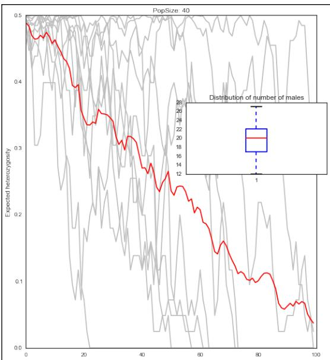
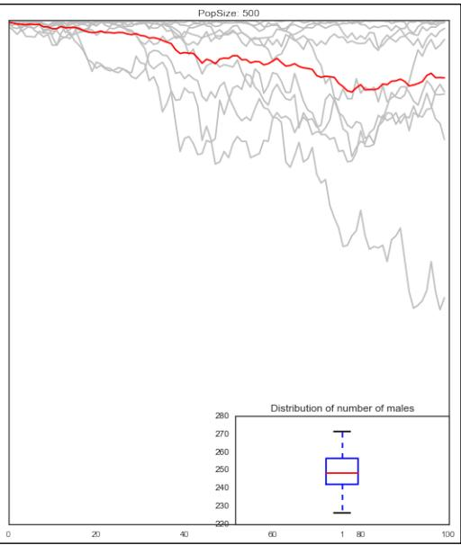
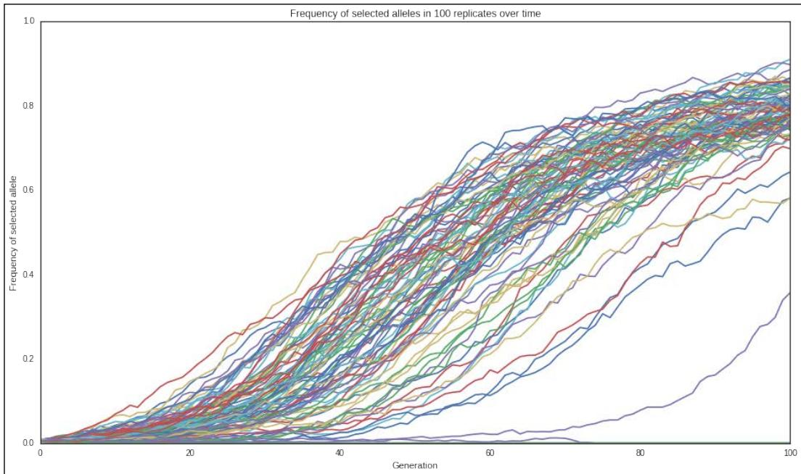
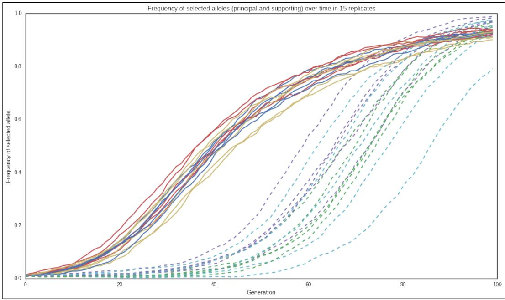
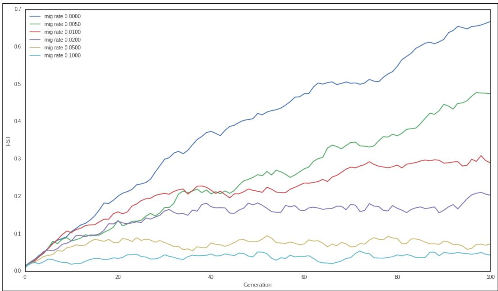
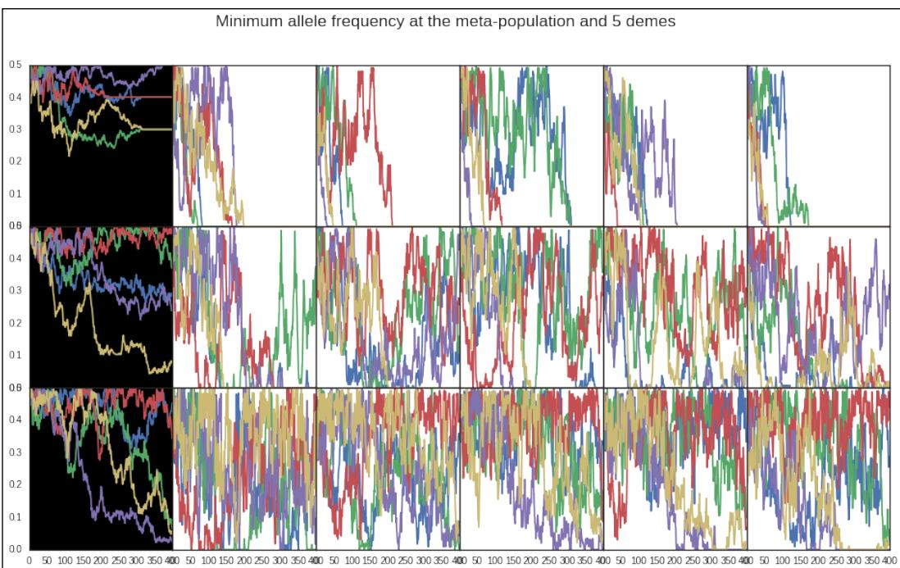
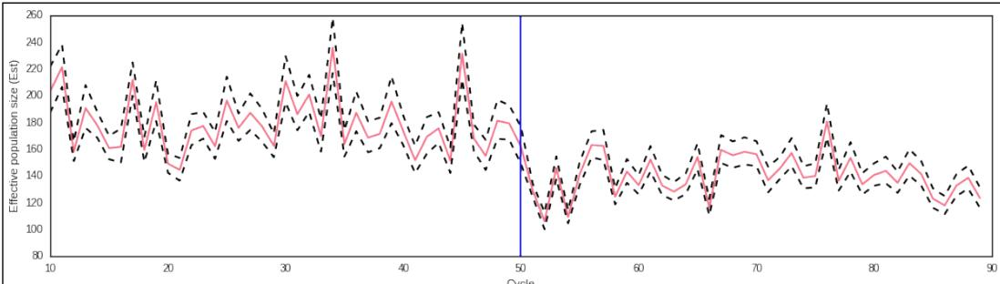
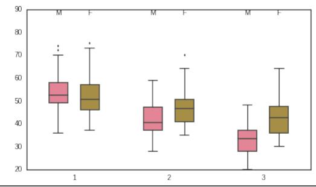
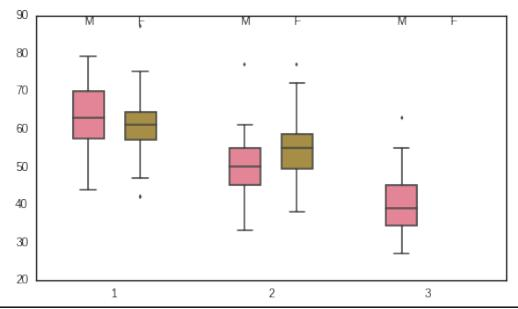

# Population Genetics Simulation

In this chapter, we will cover the following recipes: 

Introducing forward-time simulations 

Simulating selection 

f Simulating population structure using island and stepping-stone models 

Modeling complex demographic scenarios 

f Simulating the coalescent with Biopython and fastsimcoal 

## Introduction

In the previous chapter, we used Python to analyze population genetics datasets based on real data. In this chapter, we will see how to use Python to simulate population genetics data. From teaching to developing new statistical methods or to analyze the performance of existing methods, simulated datasets have plenty of applications. 

There are two kinds of simulation. One is coalescent simulation that goes backwards in time. Second is forward time. As the name implies, it simulates going forward. The coalescent simulation is computationally less expensive because only the most recent generation of individuals need to be completely rendered; previous generations only need parents of the previous generation to be maintained. On the other hand, this severely limits what can be simulated because we need to complete populations to make decisions on e.g. which individuals mate. Forward time simulations are computationally more demanding and normally more complex to code, but they allow you to have much more flexibility. 

## www.ebook777.comwww.it-ebooks.info

Population Genetics Simulation 

In this chapter, we will use the Python-based, forward-time simulator called simuPOP to model very complex scenarios and see how we can analyze its results. We will also have one recipe on the coalescent simulation. Be aware that you will need to know about basic population genetics to understand this chapter. 

## Introducing forward-time simulations

We will start with a simple recipe to code the bare minimum with simuPOP. simuPOP is probably the most flexible and powerful forward-time simulator available and is Python-based. You will be able to simulate almost anything in terms of demography and genomics, save for complex genome structural variation (for example, inversions or translocations). 

## Getting ready

simuPOP may apparently be difficult, but it will make sense if you understand its event-oriented model. As you would expect, there is a meta population composed of individuals with a predefined genomic structure. Starting with an initial population that you prepare, a set of initial operators is applied. Then every time a generation ticks, a set of pre-operators are applied, followed by a mating step that generates the new population for the next cycle. This is followed by a final set of postoperators that are applied again. This cycle (preoperations, mating, and postoperations) repeats for as many generations that you desire. 

The most important part of getting ready is preparing yourself for the preceding model; we will go through a simple example now. As usual, you can find this on the 04_PopSim/Basic_ SimuPOP.ipynb notebook. 

## How to do it...

Take a look at the following steps: 

1. Let's start by initializing variables and basic data structures as follows: 

```python
from collections import OrderedDict
num_loci = 10
pop_size = 100
num_gens = 10
init_ops = OrderedDict()
pre_ops = OrderedDict()
post_ops = OrderedDict() 
```

‰ So, we specify that we want to simulate 10 loci, a population size of 100, and just 10 generations. We then prepare three ordered dictionaries. These will maintain our operators. 

Chapter 5 

‰ Note that we use OrderedDict(). Ordered dictionaries will return keys in the order that they were inserted. This is important because the order of operators is relevant, for example, if we print the result of a statistic, this will be dependent on it being computed before. 

2. We will now create a population object and basic operators as follows: 

```python
import simuPOP as sp
pops = sp.Population(pop_size, loci=[1] * num_loci)
init_ops['Sex'] = sp.InitSex()
init_ops['Freq'] = sp.InitGenotype(freq=[0.5, 0.5])
post_ops['Stat-freq'] = sp.Stat(alleleFreq=sp.ALL_AVAIL)
post_ops['Stat-freq-eval'] = sp.PyEval(r" %d %.2f\n' % (gen, alleleFreq[0][0])")
mating_scheme = sp.RandomMating() 
```

We start by creating the meta population with a single deme of the required size and 10 independent loci. 

‰ Then, create two operators to initialize the population; one operator initializes the sex of all individuals (the default is two sexes with a probability of 50 percent to be assigned to either male or female). The other operator initializes all the loci with two alleles (maybe of an SNP) with a frequency of 50 percent for each allele. 

‰ We also create two postmating operators: one to calculate allele frequencies for all loci and another to just print the allele frequency of loci 0 and allele 0. These will be executed in all generations. 

‰ Finally, we specify the standard random mating. This is a very basic model. 

3. Let's run the simulator for our basic scenario with a single replicate: 

```python
sim = sp.Simulator(pops, rep=1)
sim.evolve(initOps=init_ops.values(),
    preOps=pre_ops.values(), postOps=post_ops.values(),
    matingScheme=mating_scheme, gen=num_gens) 
```

‰ We will create a simulator object that will be responsible for evolving our population. We will specify that we just want a single replicate. Having many replicates is a more common situation, which we will address in future recipes. 


The output that I got is as follows. Note that we are dealing with stochastic process, so you will get different results. This is especially serious if the population size is small. Indeed, one of the most important results in population genetics is that in small populations, the stochastic drift is a very strong factor. All results in this chapter are stochastic in nature, so expect to see different results from the ones presented throughout this chapter. If you want deterministic results, you can use a predetermined random seed, but do not let this trick you into thinking that these are deterministic processes in nature. 

```csv
0 0.46
1 0.43
2 0.41
3 0.43
4 0.42
5 0.47
6 0.51
7 0.52
8 0.54
9 0.44 
```

4. Let's perform a simple population genetic analysis using a new simulation model, researching the impact of population size on the loss of heterozygosity over time. We start by developing a mini framework to store and easily access variables of interest: 

```python
from copy import deepcopy
def init_accumulators(pop, param):
    accumulators = param
    for accumulator in accumulators:
    pop.vars() [accumulator] = []
    return True
def update_accumulator(pop, param):
    accumulator, var = param
    pop.vars() [accumulator].append(deepcopy(pop.vars() [var]))
    return True 
```

‰ This code is the complex part of this recipe; it comprises of two operators. One is to be used as an initialization operator, which will add a variable to the population (as simuPOP allows you to maintain extra variables at the population level). Another function will append results in a pre-operator or post-operator to the variable. This may seem abstract now, but we will make it clear soon. 

‰ We will use deepcopy to make sure that we have our own copy of the variable because it can be changed by a future operator. 

5. We will need to compute the expected heterozygosity from allelic frequency as follows: 

Chapter 5 

```python
def calc_exp_he(pop):
    #assuming bi-allelic markers coded as 0 and 1
    pop.dvars().expHe = {}
    for locus, freqs in pop.dvars().alleleFreq.items():
    f0 = freqs[0]
    pop.dvars().expHe[locus] = 1 - f0**2 - (1 - f0)**2
    return True

init_ops['accumulators'] = sp.PyOperator(init_accumulators, param=['num_males', 'exp_he'])

post_ops['Stat-males'] = sp.Stat(numOfMales=True)

post_ops['ExpHe'] = sp.PyOperator(calc_exp_he)

post_ops['male_accumulation'] =
sp.PyOperator(update_accumulator, param=('num_males', 'numOfMales'))

post_ops['expHe_accumulation'] =
sp.PyOperator(update_accumulator, param=('exp_he', 'expHe'))

del post_ops['Stat-freq-eval'] 
```

‰ Note that we are still using operators specified in the previous execution to initialize sex, genotype, and so on; we will just be adding our ordered dictionaries to them. 

‰ Firstly, we will develop a function to compute our expected heterozygosity from allele frequency for all available loci. 

‰ Then, we will add two accumulators (num_males and exp_he) using an initialization operator. 

‰ We will then add four post-operators (this will be applied after reproduction). One will compute the number of males, another will compute the expected heterozygosity, and the third post-operator will transfer the computation from each generation to a variable that stores the result over time. So, numOfMales is the result of a simuPOP operator that computes the number of males for the current generation, whereas num_males maintains a list of all numOfMales across the whole execution. numOfMales is recomputed and lost on each sim.evolve step, whereas num_of_males is appended. 

‰ The previous strategy cannot be used to store very large variables over the whole simulation, but it works for small variables. 

‰ Note that the expected heterozygosity operator depends on the existing operator to compute allele frequencies that already exists in the dictionary. This has to be executed before the one computing expected heterozygosity (the ordered dictionary assures this). 

Population Genetics Simulation 

```python
6. We will now compare two populations with population sizes of 40 and 500:
num_gens = 100
pops_500 = sp.Population(500, loci=[1] * num_loci)
sim = sp.Simulator(pops_500, rep=1)
sim.evolve(initOps=init_ops.values(),
    preOps=pre_ops.values(), postOps=post_ops.values(),
    matingScheme=mating_scheme, gen=num_gens)
pop_500_after = deepcopy(sim.population(0))
pops_40 = sp.Population(40, loci=[1] * num_loci)
sim = sp.Simulator(pops_40, rep=1)
sim.evolve(initOps=init_ops.values(),
    preOps=pre_ops.values(), postOps=post_ops.values(),
    matingScheme=mating_scheme, gen=num_gens)
pop_40_after = deepcopy(sim.population(0)) 
```

7. Let's plot the loss of heterozygosity and the distribution of number of males: 

```python
import numpy as np
import seaborn as sns
import matplotlib.pyplot as plt
def calc_loci_stat(var, fun):
    stat = []
    for gen_data in var:
    stat.append(fun(gen_data.values()))
    return stat
sns.set_style('white')
fig, axs = plt.subplots(1, 2, figsize=(16, 9), sharey=True, squeeze=False)
def plot_pop(ax1, pop):
    for locus in range(num_loci):
    ax1.plot([x[locus] for x in pop.dvars().exp_he], color=(0.75, 0.75, 0.75))
    mean_exp_he = calc_loci_stat(pop.dvars().exp_he, np.mean)
    ax1.plot(mean_exp_he, color='r')
plot_pop(axs[0, 0], pop_40_after)
plot_pop(axs[0, 1], pop_500_after)
ax = fig.add_subplot(4, 4, 13)
ax.boxplot(pop_40_after.dvars().num_males)
ax = fig.add_subplot(4, 4, 16)
ax.boxplot(pop_500_after.dvars().num_males)
fig.tight_layout() 
```




Chapter 5





Figure 1: The decline in heterozygosity over time in a population of 40 (left) and 500 (right); the gray lines are individual markers, whereas the red lines show the mean; the box plots represent the distribution of number of males in both scenarios


‰ Major plots show the decrease in expected heterozygosity. They behave exactly as expected: bigger loss in the smaller population with bigger variance. Gray lines depict the individual loci, whereas the red line shows the mean. Note how easy it's to extract the heterozygosity from the preceding code (this is the advantage of using the accumulator framework). 

‰ Note the box plots; they show the distribution of the number of males produced in each generation. Remember that each individual has a probability of 50 percent of being a male, so the number of males will vary in each generation. If you have a very small population, there is a possibility that no males or females are generated in a single cycle. In such cases, the simulator will raise an exception and stop. Try performing a simulation with just 20 individuals and this will eventually happen. 

## There's more...

simuPOP is a very powerful simulator. Although, we will address some of its features in the next recipes, it's impossible to go through all of them. If you want to simulate linked loci, non-autosomal chromosomes, complex demographies, different sex ratios and models, or mutation, simuPOP will accommodate you. Do not forget to check its website http://simupop.sourceforge.net/ and to check its great documentation. The user and reference manuals are fantastic. For example, in the documentation, you will find widely used demographic models such as the cosi model of human demographies. 

Population Genetics Simulation 

I maintain a set of notebooks to teach population genetics concepts using simuPOP with a lot of code examples. You can find them at https://github.com/tiagoantao/genomicsnotebooks/blob/master/Welcome.ipynb. 

## Simulating selection

We will now perform an example of simulating selection with simuPOP. We will perform a simple case with dominant mutation on a single loci and also a complex case with two loc using epistatic effects. The epistatic effect will have a mutation on an SNP. This is required to confer advantage and another mutation on another SNP that adds up to the previous one (but does nothing on its own); this was inspired by the very real case of malaria resistance to the sulfadoxine/pyrimethamine drug, which always requires a mutation on the DHFR gene, which can be enhanced with a mutation on the DHPS gene; if you are interested in knowing more, refer to the Origin and Evolution of Sulfadoxine Resistant Plasmodium falciparum article from Vinayak et al on PLoS Pathogens at http://journals.plos.org/plospathogens/ article?id=10.1371/journal.ppat.1000830. 

## Getting ready

Read the previous recipe (Introducing forward-time simulations) as it will introduce the basic programming framework. If you are using notebooks, this content is in 04_PopSim/ Selection.ipynb. 

## How to do it…

Take a look at the following steps: 

1. Let's start with the boilerplate variable initialization: 

```python
from collections import OrderedDict
from copy import deepcopy
import simuPOP as sp
num_loci = 10
pop_size = 1000
num_gens = 101
init_ops = OrderedDict()
pre_ops = OrderedDict()
post_ops = OrderedDict()
def init_accumulators(pop, param):
    accumulators = param
    for accumulator in accumulators:
    pop.vars() [accumulator] = []
    return True
def update_accumulator(pop, param): 
```

Chapter 5 

```python
accumulator, var = param
pop.vars() [accumulator].append(deepcopy(pop.vars() [var]))
return True
pops = sp.Population(pop_size, loci=[1] * num_loci,
infoFields=['fitness']) 
```

‰ Most of this code was explained in the previous recipe, but look at the very last line. There is now an infoFields parameter in the population. While you can have population variables, you can also have variables for each individual; these are limited to floating point numbers, which are specified in the infoFields parameter. 

‰ We will simulate a fairly big population (1000) to avoid drift effects overpowering selection. 

2. To ensure that we can control the number of selected alleles at initialization, let's create a function to perform it: 

```python
def create_derived_by_count(pop, param):
    locus, cnt = param
    for i, ind in enumerate(pop.individuals()):
    for marker in range(pop.totNumLoci()):
    if i < cnt and locus == marker:
    ind.setAllele(1, marker, 0)
    else:
    ind.setAllele(0, marker, 0)
    ind.setAllele(0, marker, 1)
    return True 
```

‰ We will use this to initialize our loci under selection (instead of InitGenotype, which we will still use for neutral markers). 

3. Let's add all operators except for selection: 

```matlab
init_ops['Sex'] = sp.InitSex()
init_ops['Freq-sel'] =
sp.PyOperator(create_derived_by_count, param=(0, 10))
init_ops['Freq-neutral'] = sp.InitGenotype(freq=[0.5, 0.5], loci=range(1, num_loci))
post_ops['Stat-freq'] = sp.Stat(alleleFreq=sp.ALL_AVAIL)
post_ops['Stat-freq-eval'] = sp.PyEval(r"'%d %.3f\n' % (gen, alleleFreq[0][1])", reps=[0], step=10)
mating_scheme = sp.RandomMating() 
```

‰ There are selected and neutral loci in this simulation. We will not be using the neutral loci anymore, but it's quite common to simulate a handful selected loci among many neutral loci in order to compare the behavior. 

```txt
Free ebooks ==> www.ebook777.com 
```

```txt
Population Genetics Simulation 
```

4. Let's add the code for dominant selection at a single locus, store the frequency of the derived (selected) allele, and run the simulation using several replicates: 

```python
ms = sp.MapSelector(loci=0, fitness={
    (0, 0): 0.90,
    (0, 1): 1,
    (1, 1): 1}
pre_ops['Selection'] = ms
def get_freq_deriv(pop, param):
    marker, name = param
    expHe = {}
    pop.vars() [name] = pop.dvars().alleleFreq[marker][1]
    return True
init_ops['accumulators'] = sp PyOperator(init_accumulators, param=['freq_sel'])
post_ops['FreqSel'] = sp PyOperator(get_freq_deriv, param=(0, 'freqDeriv'))
post_ops['freq_sel_accumulation'] = \
    sp PyOperator(update_accumulator, param=('freq_sel', 'freqDeriv'))
sim = sp.Simulator(pops, rep=100)
sim.evolve(initOps=init_ops.values(),
    preOps=pre_ops.values(),
    postOps=post_ops.values(),
    matingScheme=mating_scheme, gen=num_gens) 
```

‰ We create a fitness operator that will compute the fitness parameter for each individual with a dominant encoding. If you have the selected (coded with 1) mutation, you are fitter than if you are homozygous for the 0 allele. Note that it's quite easy to model a recessive mutation (only benefits the derived homozyguous) or even a heterozygote advantage (only benefits heterozyguous individuals). 

‰ In this case, we will run 100 replicates (as specified on the simulator initialization). So, there will be 100 independent runs with independent results. 

For each run, we will store the frequency of the derived (selected) allele. This is the purpose of get_freq_deriv and related operators. 

5. We can now plot the change in frequency of derived alleles in all 100 independent replicates as follows: 

```python
import seaborn as sns
import matplotlib.pyplot as plt
sns.set_style('white')
fig = plt.figure(figsize=(16, 9)) 
```

```txt
Free ebooks ==> www.ebook777.com 
```

135 

```python
ax = fig.add_subplot(111)
ax.set_title('Frequency of selected alleles in 100 replicates over time')
ax.set_xlabel('Generation')
ax.set_ylabel('Frequency of selected allele')
for pop in sim.populations():
    ax.plot(pop.vars()['freq_sel']) 
```

Chapter 5 




Figure 2: The increase in frequency of the selected allele over time in 100 independent replicates


‰ Note that each line represents a trajectory in different replicates. This was performed with a large population size; if you try this with a smaller value (say 50), you will quite a different pattern due to drift. 

6. Let's now look at a complex example involving epistasis between two loci under selection. Here, we will perform 15 replicates, as shown in the following code: 

```python
pop_size = 5000
num_gens = 100
pops = sp.Population(pop_size, loci=[1] * num_loci, infoFields=['fitness'])
def example_epistasis(geno):
    if geno[0] + geno[1] == 0:
    return 0.7 
```

Population Genetics Simulation 

```python
elif geno[2] + geno[3] == 0:
    return 0.8
else:
    return 0.9 + 0.1 * (geno[2] + geno[3] - 1)
init_ops = OrderedDict()
pre_ops = OrderedDict()
post_ops = OrderedDict()
init_ops['Sex'] = sp.InitSex()
init_ops['Freq-sel'] = sp.InitGenotype(freq=[0.99, 0.01], loci=[0, 1])
init_ops['Freq-neutral'] = sp.InitGenotype(freq=[0.5, 0.5], loci=range(2, num_loci))
pre_ops['Selection'] = sp.PySelector(loci=[0, 1], func=example_epistasis)
init_ops['accumulators'] = sp.PyOperator(init_accumulators, param=['freq_sel_major', 'freq_sel_minor'])
post_ops['Stat-freq'] = sp.Stat(alleleFreq=sp.ALL_AVAIL)
post_ops['FreqSelMajor'] = sp.PyOperator(get_freq_deriv, param=(0, 'FreqSelMajor'))
post_ops['FreqSelMinor'] = sp.PyOperator(get_freq_deriv, param=(1, 'FreqSelMinor'))
post_ops['freq_sel_major_accumulation'] =
sp.PyOperator(update_accumulator, param=('freq_sel_major', 'FreqSelMajor'))
post_ops['freq_sel_minor_accumulation'] = \
sp.PyOperator(update_accumulator, param=('freq_sel_minor', 'FreqSelMinor'))
sim = sp.Simulator(pops, rep=15)
sim.evolve(initOps=init_ops.values(), preOps=pre_ops.values(), postOps=post_ops.values(), matingScheme=mating_scheme, gen=num_gens) 
```

‰ The example_epistasis function will take the first two loci to compute the fitness of the individual: 0.7 if it does not have the derived allele at the main loci, 0.8 if it has the derived allele at the main loci, but no derived allele at the secondary loci, 0.9 if it has one derived secondary loci (adding to the main loci), and 1 if it's homozyguous for the derived allele in the secondary loci (again adding to the main one). So, having a mutation just on the secondary is irrelevant (it will stay at 0.7). The main loci is dominant, but the secondary loci is coded as additive (it's better to have two alleles that are derived than just one). 

‰ We initialize the selected loci separately with a derived frequency of 1 percent, whereas the neutral starts at 50 percent. 

‰ We also track both our selected alleles using the usual framework. 

Chapter 5 

```python
7. Let's plot the frequencies of both selected alleles (the main and the secondary loci):
    fig = plt.figure(figsize=(16, 9))
    ax1 = fig.add_subplot(111)
    ax.set_xlabel('Generation')
    ax.set_ylabel('Frequency of selected allele')
    ax1.set_title('Frequency of selected alleles (principal and supporting) over time in 15 replicates')
    for pop in sim.populations():
    ax1.plot(pop.vars()['freq_sel_major'])
    ax1.plot(pop.vars()['freq_sel_minor'], '-') 
```




Figure 3: Frequency of selected alleles (principal and supporting loci) over time in 15 replicates; the main allele is coded with a straight line and the secondary allele as a dashed line


‰ In the preceding figure, you can see the dynamic of both alleles: the main allele (shown as a straight line) and the secondary allele (shown as a dashed line). 

## Population Genetics Simulation

## There's more...

If you run multiple replicates, simuPOP allows you to take full advantage of a multicore computer because it can be configured to run multithreaded (check the documentation). In this case, the more you depend on simuPOP native operators, the better. Python-coded operators will be single threaded because of Python's Global Interpreter Lock (GIL). If you want to know more about the GIL refer to http://www.dabeaz.com/python/ UnderstandingGIL.pdf. 

While performing multiple replicates of complex models, I prefer to use a different strategy, that is, I perform a single replicate per process, but run multiple processes. This has the advantage of scaling a cluster, whereas simuPOP multithreaded code can only use a single computer. For very complex simulations, I do not compute any statistics at all with simuPOP; I just save the results to a file (simuPOP has operators to dump data, for example, in Genepop format) and then use external applications to compute any statistics. Again, this strategy is just for very complex simulations with many replicates. If your requirements are simpler, multithreaded simuPOP with its built-in statistical methods will be enough. 

## Simulating population structure using island and stepping-stone models

We will now simulate population structure. Let's start with an island model and then create a one-dimensional stepping-stone model. We will also study $\mathsf { F } _ { \mathsf { s } \mathsf { T } }$ and distinguish between deme-level statistics and meta-population level statistics. Strictly speaking, we will simulate fragmentation models by splitting into islands or stepping-stones. 

## Getting ready

Read the first recipe (Introducing forward-time simulations) as it introduces the basic programming framework. If you are using notebooks, the content is in 04_PopSim/Pop_ Structure.ipynb. 

## How to do it…

## Take a look at the following steps:

1. Let's start with some basic code from the first recipe: 

from __future__ import division 

from collections import defaultdict, OrderedDict 

from copy import deepcopy 

import simuPOP as sp 

from simuPOP import demography 

```txt
Free ebooks ==> www.ebook777.com 
```

Chapter 5 

```python
num_loci = 10
pop_size = 50
num_gens = 101
num_pops = 10
migs = [0, 0.005, 0.01, 0.02, 0.05, 0.1]
init_ops = OrderedDict()
pre_ops = OrderedDict()
post_ops = OrderedDict()
pops = sp.Population([pop_size] * num_pops, loci=[1] * num_loci, infoFields=['migrate_to']) 
```

‰ Note that we will simulate an island model with 10 islands (num_pops). Also, we will introduce a new infoField, migrate_to, which is necessary to implement migration. We will try out several migration rates (including 0). Also, when we create a population, the population size is now a list of 10 values (we could have demes with different sizes, but we will keep them constant here). 

2. We will include a variation of previous functions to accumulate values as follows: 

```python
def init_accumulators(pop, param):
    accumulators = param
    for accumulator in accumulators:
    if accumulator.endswith('_sp'):
    pop.vars() [accumulator] = defaultdict(list)
    else:
    pop.vars() [accumulator] = []
    return True

def update_accumulator(pop, param):
    accumulator, var = param
    if var.endswith('_sp'):
    for sp in range(pop.numSubPop()):
    pop.vars() [accumulator][sp].append(
    deepcopy(pop.vars(sp)[var[:-3]])
    else:
    pop.vars() [accumulator].append(deepcopy(pop.vars() [var]))
    return True 
```

‰ simuPOP allows you to compute statistics per subpopulation. For example, if you have an island model with 10 populations, you can actually compute 11 allele frequencies per locus: 10 for each deme plus one for the meta population (that is, all 10 demes are considered as a single population). The preceding functions cater to this (as simuPOP variables for subpopulations are suffixed with _sp). 

139 

```txt
Free ebooks ==> www.ebook777.com 
```

Population Genetics Simulation 

3. Let's add operators and run a simulation as follows: 

```python
init_ops['accumulators'] = sp.PyOperator(init_accumulators, param=['fst'])
init_ops['Sex'] = sp.InitSex()
init_ops['Freq'] = sp.InitGenotype(freq=[0.5, 0.5])
for i, mig in enumerate(migs):
    post_ops['mig-%d' % i] = \
sp.Migrator(demography.migrIslandRates(mig, num_pops), reps=[i])
post_ops['Stat-fst'] = sp.Stat(structure=sp.ALL_AVAIL)
post_ops['fst_accumulation'] = \
sp.PyOperator(update_accumulator, param=('fst', 'F_st'))
mating_scheme = sp.RandomMating()
sim = sp.Simulator(pops, rep=len(migs))
sim.evolve(initOps=init_ops.values(),
preOps=pre_ops.values(), postOps=post_ops.values(),
    matingScheme=mating_scheme, gen=num_gens) 
```

‰ We will compute $\mathsf { F } _ { \mathsf { s } \mathsf { T } }$ over all loci here; there is nothing special about how this is done. We just add its statistical operator and support functions to accumulate its result over the generations. simuPOP supports many other statistic operators; be sure to check the manual. 

‰ There is an operator to perform the island migration (migrIslandRates). This requires the number of demes and the migration rate (that is, the fraction of individuals that migrate). 

‰ As you have seen in the previous recipe, simuPOP allows you to execute replicates with same parameters. However, you can also vary the parameters per replicate. This is what we do in this case, that is, we replicate 0 with a migration of 0, replicate 1 of 0.005, and so on. So, different replicates will simulate different things. 

4. Let's plot $\mathsf { F } _ { \mathsf { s } \mathsf { T } }$ over time for all different migration rates as follows: 

import seaborn as sns
sns.set_style('white')
import matplotlib.pyplot as plt
fig = plt.figure(figsize=(16, 9))
ax = fig.add_subplot(111)
for i, pop in enumerate(sim.populations()):
    ax.plot(pop.dvars().fst, label='mig rate %.4f' % migs[i])
ax.legend(loc=2)
ax.set_ylabel('F $_{ST}$ ')
ax.set_xlabel('Generation') 

```txt
Free ebooks ==> www.ebook777.com 
```

Chapter 5 




Figure 4: $\mathsf { F } _ { \mathsf { s T } }$ evolution over time with different migration rates in an island model with 10 demes, each with 50 individuals


We take the result from each replicate and plot it; each line will represent a different migration rate. 

5. Let's now look at the stepping-stone model to study the behavior of population genetic parameters in the meta population and on each deme, let's start with some standard code: 

```python
num_gens = 400
num_loci = 5
init_ops = OrderedDict()
pre_ops = OrderedDict()
post_ops = OrderedDict()
init_ops['Sex'] = sp.InitSex()
init_ops['Freq'] = sp.InitGenotype(freq=[0.5, 0.5])
post_ops['Stat-freq'] = sp.Stat(alleleFreq=sp.ALL_AVAIL, vars=['alleleFreq', 'alleleFreq_sp'])
init_ops['accumulators'] = sp.PyOperator(init_accumulators, param=['allele_freq', 'allele_freq_sp'])
post_ops['freq_accumulation'] = \
sp.PyOperator(update_accumulator, param=('allele_freq', 'alleleFreq'))
post_ops['freq_sp_accumulation'] = \
sp.PyOperator(update_accumulator, param=('allele_freq_sp', 'alleleFreq_sp')) 
```

```txt
Free ebooks ==> www.ebook777.com 
```

Population Genetics Simulation 

```python
for i, mig in enumerate(migs):
    post_ops['mig-%d' % i] =
sp.Migrator(demography.migrSteppingStoneRates(mig,
    num_pops), reps=[i])
pops = sp.Population([pop_size] * num_pops, loci=[1] *
    num_loci, infoFields=['migrate_to'])
sim = sp.Simulator(pops, rep=len(migs))
sim.evolve(initOps=init_ops.values(), preOps=pre_ops.values(),
    postOps=post_ops.values(),
    matingScheme=mating_scheme, gen=num_gens) 
```

```txt
There are two differences. One is that we are using a function to generate a migration based on the stepping-stone model instead of the island model. However, note that we are computing and storing allele frequencies per subpopulation (alleleFreq_sp) and at the meta population level (alelleFreq). 
```

6. Let's plot the minimum allele frequency for every locus on the meta population level and on each deme as follows: 

```python
def get_maf(var):
    locus_data = [gen[locus] for gen in var]
    maf = [min(freq.values()) for freq in locus_data]
    maf = [v if v != 1 else 0 for v in maf]
    return maf

fig, axes = plt.subplots(3, num_pops // 2 + 1, figsize=(16, 9), sharex=True, sharey=True, squeeze=False)
fig.suptitle('Minimum allele frequency at the meta-population and 5 demes', fontsize='xx-large')
for line, pop in enumerate([sim.population(0), sim.population(1), sim.population(len(migs) - 1)]):
    for locus in range(num_loci):
    maf = get_maf(pop.dvars().allele_freq)
    axes[line, 0].plot(maf)
    axes[line, 0].set_axis_bgcolor('black')
    for nsp in range(num_pops // 2):
    for locus in range(num_loci):
    maf = get_maf(pop.dvars().allele_freq_sp[nsp * 2])
    axes[line, nsp + 1].plot(maf)
fig.subplots_adjust(hspace=0, wspace=0) 
```

Chapter 5 




Figure 5: MAF in 5 loci with three different migration rates in the meta-population and 5 demes out of 10. 

The preceding figure, Figure 5, is the MAF in 5 loci. The left-most chart (black background) represents the evolution at the meta-population level. The other 5 charts represent the evolution in 5 of the 10 demes in the stepping-stone model. The top line is without migration, the middle line with 0.005 migration and the bottom line with 0.1. On the top line (no migration), note how different alleles can fixate on different demes, whereas at the meta level, the frequency is maintained at intermediate levels. 

## Modeling complex demographic scenarios

Here, we will show how simuPOP can be extremely flexible on demographic modeling. We wil simulate an age-structured population with different fecundity per age for males and different maximum litter size for females. In the middle of the simulation, we will remove all older females. We will study the effective population size across the simulation. Furthermore, we will simulate multiallelic loci this time (for example, simulation of microsatellites). 

The removal of a part of the population can model many things; for example, the management of a conserved population in a national park, or the usage of insecticides in vector populations, or modeling the illegal poaching of animals. The applications of this kind of modeling are plenty. 

```txt
Free ebooks ==> www.ebook777.com 
```

Population Genetics Simulation 

## Getting ready

We will have three age groups. The first age group will not be able to reproduce (modeling infants). The two older age groups can. Males of age two have twice the chance of mating than males of age three. Females of age two can have many offspring in a cycle, whereas females of age three can only have one. Males of age one have 80 percent chance of surviving to age two and again 80 percent chance of surviving to age three. For females, the value is 90 percent for both. 

Read the first recipe (Introducing forward-time simulations) as it introduces the basic programming framework. If you are using notebooks, this content is in 04_PopSim/ Complex.ipynb. 

## How to do it…

Take a look at the following steps: 

1. Let's start by defining a function that will cull individuals according to its age and sex: 

```python
def kill(pop):
    kills = []
    for i in pop.individuals():
    if i.sex() == 1:
    cut = pop.dvars().survival_male[int(i.age)]
    else:
    cut = pop.dvars().survival_female[int(i.age)]
    if pop.dvars().gen > pop.dvars().cut_gen and \
i.age == 2:
    cut = 0
    if random.random() > cut:
    kills.append(i.ind_id)
    pop.removeIndividuals(IDs=kills)
    return True 
```

‰ The function assumes that there are a couple of population variables (that we will create later) with the survival rate per sex. Also there is a provision to kill all females of age 2 after a certain generation. 

2. We need to have a function to choose the parents as mating is far from random: 

```python
def choose_parents(pop):
    fathers = []
    mothers = []
    for ind in pop.individuals():
    if ind.sex() == 1: 
```

```txt
Free ebooks ==> www.ebook777.com 
```

Chapter 5 

```python
fathers.extend([ind] * pop.dvars().male_age_fecundity[int(ind.age)])
else:
    ind.num_kids = 0
    mothers.append(ind)
while True:
    father = random.choice(fathers)
    mother_ok = False
    while not mother_ok:
    mother = random.choice(mothers)
    if mother.num_kids < pop.dvars().max_kids[int(mother.age)]:
    mother.num_kids += 1
    mother_ok = True
    yield father, mother

def calc_demo(gen, pop):
    if gen > pop.dvars().cut_gen:
    add_females = len([ind for ind in pop.individuals([0, 2]) if ind.sex() == 2])
    else:
    add_females = 0
    return pop_size + pop.subPopSize([0, 3]) + add_females 
```

‰ The choose_parents function will choose the father from a list that will include all males of age two and three. Males of age two get two entries (coming from a male_age_fecundity variable, which we will define later). Females will be allowed to have a maximum number of offspring according to their age. 

‰ There is also a function to determine the next population size. This is mostly to maintain the population at a constant level. If we cull females of old age (as per the previous specification), we will use a virtual subpopulation (see step 4) that contains only old age individuals and get females. 

3. The mating function is now a bit more complex than usual, as shown in the following code: 

```python
mating_scheme = sp.HeteroMating([
    sp.HomoMating(
    sp.PyParentsChooser(choose_parents),
    sp.OffspringGenerator(numOffspring=1, ops=[sp.MendelianGenoTransmitter(), sp.IdTagger()]), weight=1),
    sp.CloneMating(weight=-1)],
    subPopSize=calc_demo) 
```

145 

```txt
Free ebooks ==> www.ebook777.com 
```

```txt
Population Genetics Simulation 
```

‰ Mating is now much more complex than the standard random mating; the CloneMating part will copy all individuals to the next cycle, whereas the HomoMating will add a few extra individuals according to the choice of parents in the preceding function. 

4. Let's add some necessary boilerplate code: 

```python
pop_size = 300
num_loci = 50
num_alleles = 10
num_gens = 90
cut_gen = 50
max_kids = [0, 0, float('inf'), 1]
male_age_fecundity = [0, 0, 2, 1]
survival_male = [1, 0.8, 0.8, 0]
survival_female = [1, 0.9, 0.9, 0]
pops = sp.Population(pop_size, loci=[1] * num_loci, infoFields=['age', 'ind_id', 'num_kids'])
pops.setVirtualSplitter(sp.InfoSplitter(field='age', cutoff=[1, 2, 3])) 
```

‰ Note the fecundity and survival variables and the new infoFields as well. 

‰ However, the most important novelty is the creation of virtual subpopulations; simuPOP allows you to split your population into virtual subgroups according to many criteria. In our case, we will have virtual subpopulations divided by age. For example, we already used this to get older females of the population in the culling stage. Check simuPOP documentation on this concept because it's very powerful. 

5. Let's create all operators and run the simulation as follows: 

```python
init_ops = OrderedDict()
pre_ops = OrderedDict()
post_ops = OrderedDict()
def init_age(pop):
    pop.dvars().male_age_fecundity = male_age_fecundity
    pop.dvars().survival_male = survival_male
    pop.dvars().survival_female = survival_female
    pop.dvars().max_kids = max_kids
    pop.dvars().cut_gen = cut_gen
    return True
def init_accumulators(pop, param):
    accumulators = param
    for accumulator in accumulators: 
```

```txt
Free ebooks ==> www.ebook777.com 
```

Chapter 5 

```python
pop.vars() [accumulator] = []
return True
def update_pyramid(pop):
    pyr = defaultdict(int)
    for ind in pop.individuals():
    pyr[(int(ind.age), int(ind.sex()))] += 1
    pop.vars() ['age_pyramid'].append(pyr)
    return True
def update_ldne(pop):
    pop.vars() ['ldne'].append(pop.dvars().Ne_LD[0.05])
    return True
init_ops['Sex'] = sp.InitSex()
init_ops['ID'] = sp.IdTagger()
init_ops['accumulators'] = sp PyOperator(init_accumulators, param=['ldne', 'age_pyramid'])
init_ops['Freq'] = sp.InitGenotype(freq=[1 / num_alleles] * num_alleles)
init_ops['Age-prepare'] = sp PyOperator(init_age)
init_ops['Age'] = sp.InitInfo(lambda: random.randint(0, len(survival_male) - 1), infoFields='age')
pre_ops['Kill'] = sp PyOperator(kill)
pre_ops['Age'] = sp.InfoExec('age += 1')
pre_ops['pyramid_accumulator'] = \
sp.PyOperator(update_pyramid)
post_ops['Ne'] = sp.Stat(effectiveSize=sp.ALL_AVAIL, subPops=[[0, 0]], vars=['Ne_LD'])
post_ops['Ne_accumulator'] = sp.PyOperator(update_ldne)
sim = sp.Simulator(pops, rep=1)
sim.evolve(initOps=init_ops.values(), preOps=pre_ops.values(), postOps=post_ops.values(), matingScheme=mating_scheme, gen=num_gens) 
```

We run the simulation for 90 generations and start killing females of age two at generation 50. We will consider the first 10 generations as burn-in. 

‰ We will use markers with 10 alleles (microsatellite-like). 

‰ Note that age pyramid functions used to store the evolution of age structure over time. More generally, note all code used to manipulate age. 

‰ We compute an effective population size (Ne) estimator based on linkage disequilibrium. Note that we compute this only on virtual 0 subpopulation (that is, newborns). This is because the Ne estimation with this method only makes sense if you use a single cohort of individuals. 

```txt
Population Genetics Simulation 
```

```python
6. We can now extract all values and plot the Ne estimation over time along with the age pyramid:

ld_ne = sim.population(0).dvars().ldne
pyramid = sim.population(0).dvars().age_pyramid
sns.set_palette('Set2')

fig = plt.figure(figsize=(16, 9))
ax_ldne = fig.add_subplot(211)
ax_ldne.plot([x[0] for x in ld_ne[10:]])
ax_ldne.plot([x[1] for x in ld_ne[10:]], 'k--')
ax_ldne.plot([x[2] for x in ld_ne[10:]], 'k--')
ax_ldne.set_xticks(range(0, 81, 10))
ax_ldne.set_xticklabels([str(x) for x in range(10, 91, 10)])
ax_ldne.axvline(cut_gen - 10)
ax_ldne.set_xlabel('Cycle')
ax_ldne.set_ylabel('Effective population size (Est)')

def plot_pyramid(ax_bp, pyramids):
    bp_data = [ terr[, [] ) for group in range(3)]
    for my_pyramid in pyramids:
    for (age, sex), cnt in my_pyramid.items():
    bp_data[age - 1][sex - 1].append(cnt)
    for group in range(3):
    bp = sns.boxplot(bp_data[group], positions=[group * 3 + 1, group * 3 + 2], widths=0.6, ax=ax_bp)
    ax_bp.text(1 + 3 * group, 90, 'M', va='top', ha='center')
    ax_bp.text(2 + 3 * group, 90, 'F', va='top', ha='center')
    ax_bp.set_xlim(0, 9)
    ax_bp.set_ylim(20, 90)
    ax_bp.set_xticklabels(['1', '2', '3'])
    ax_bp.set_xticks([1.5, 4.5, 7.5])
    ax_bp.legend()

pre_decline = pyramid[10:50]
post_decline = pyramid[51:]
ax_bp = fig.add_subplot(2, 2, 3)
plot_pyramid(ax_bp, pre_decline)
ax_bp = fig.add_subplot(2, 2, 4)
plot_pyramid(ax_bp, post_decline)

The top chart shows the Ne estimation (including 5 and 95 percent confidence intervals in dashed lines). 
```

‰ The bottom charts shows the distribution of number of individuals per age group (1 to 3) and sex. The left chart shows the version before the cull of old age females, whereas the right chart shows the version after the cull: 










Figure 6: Top chart: Ne estimation over time and bottom charts: the age pyramid before culling (left) and after (right)


In preceding figure, Figure 6, the top chart depicts the change in effective population size estimation over time (the blue line depicts where old-aged females start to get culled). The bottom chart shows the distribution of number of individuals per age group (1, 2 or 3 years) and sex (males in pink and females in brown). The left chart is before the cull and the right chart is after the cull. 

## Simulating the coalescent with Biopython and fastsimcoal

While there is a native Python coalescent simulator called CoaSim, this is a very old application that does not run on modern Python versions. As such, if you want to do coalescent simulations with Python, Biopython offers a wrapper to fastsimcoal and the older simcoal. 

Here, we will generate some configuration files for fastsimcoal with the demographic and genomic information. We will also run the coalescent simulator from Python. 

Population Genetics Simulation 

## Getting ready

You will need to obtain fastsimcoal from http://cmpg.unibe.ch/software/ fastsimcoal2/. If you are using the Docker image, this is taken care of for you. 

If you are using notebooks, this content is in 04_PopSim/Coalescent.ipynb. 

## How to do it…

Take a look at the following steps: 

1. Let's start by taking a look at the available demographic models: 

```python
import os
from Bio.PopGen import SimCoal as simcoal
print(simcoal.builtin_tpl_dir)
print(os.listdir(simcoal.builtin_tpl_dir)) 
```

```python
☐ This will print a directory where templates for demographics are available (which will vary from system to system) and the list of template files inside. Currently, we have: ['simple.par', 'split_island.par', 'decline_split.par', 'bottle.par', 'ssm_1d.par', 'decline_lambda.par', 'ssm_2d.par', 'island.par', 'split_ssm_2d.par' 'split_ssm_1d.par']. 
```

‰ If you open any of the preceding files (I suggest starting with simple.par), you will see the template for fastsimcoal. All keywords starting with the ? character need to be given as parameters. Thus, for any model that you want to use, you will need to check the template for parameters. Model names give an indication of the demography being modeled. 

2. Let's create the necessary data structure to generate some demographies as follows: 

```python
simple = [('sample_size', [30]), ('pop_size', [100, 200])]  
island = [('sample_size', [30]), ('pop_size', [100]), ('mig', [0.01]), ('total_demes', [10])]  
split_ssm_1d = [('sample_size', [30]), ('pop_size', [100]), ('mig', [0.01]), ('ne', [500]), ('t', [100]), ('total_demes', [10])] 
```

Chapter 5 

‰ The first demography is a "simple demography", that is, a single population with constant size. We will sample 30 individuals (remember that coalescent simulation normally deals with haploid data, but check the fastsimcoal manual for more details). Note that the population size is either 100 or 200. In this case, not one, but two template files will be generated, one for each population size. In theory, you can put more than one value for each parameter, but be aware that this may generate lots of combinations of files. 

‰ Next comes the typical island model and finally, a one-dimensional steppingstone model. 

## 3. Now that we have the demographies, let's consider some genomes:

```python
n_indep_MSATs = [(200, [('MICROSAT', [1, 0, 0.005, 0, 0])])]  
linked_snps = [(1, [('SNP', [200, 0.0005, 0.01])])]  
linked_DNA = [(1, [('DNA', [1000, 0.0005, 0.0000002, 0.33])])]  
complex_genome = [(2, ['DNA', [10, 0.00001, 0.00005, 0.33]), ('SNP', [1, 0.001, 0.0001]), ('MICROSAT', [1, 0.0, 0.001, 0.0, 0.0])]] 
```

‰ The first case creates 200 chromosomes, each with one microsatellite with a mutation rate of 0.005. This is to say 200 unlinked microsatellites. 

‰ The next line creates a single chromosome with 200 SNPs with a recombination rate of 0.0005 among them and a minimum allelele frequency of 10 percent. 

‰ Then, we have a DNA sequence of 1000 nucleotides with a recombination rate of 0.0005 per base pair, a mutation rate of 0.0000002 per bp, and a transition rate of 0.33. 

‰ Finally, we have a complex genome with two identical chromosomes, each with an assortment of markers. You can add more chromosomes to the list with whatever structure you see fit (that is, chromosomes can be different among themselves). 

‰ For all possible types of markers and its parameters, check the fastsimcoal documentation. 

4. We can now generate the (fast)simcoal parameter file: 

```python
from Bio.PopGen.SimCoal.Template import
generate_simcoal_from_template
generate_simcoal_from_template('island', complex_genome, island) 
```

Population Genetics Simulation 

```python
generate_simcoal_from_template('simple', n_indep_MSATs, simple)
generate_simcoal_from_template('split_ssm_1d', linked_snps, split_ssm_1d) 
```

‰ This template generator requires the model name from step 1 (removing the .par prefix), followed by the genomic and demographic structure. 

‰ This will generate the parameter file with the name based on the template and the parameter, for example, the template for the simple model will generate two model files. Remember that we have a population size of 100 and 200: simple_100_30.par and simple_100_30.par. 

‰ This means that if you have the same demographic model with different genomic parameters, you will have to rename one of the parameter files before creating the second one because this will be overwritten. 

5. Finally, we can run fastsimcoal, as shown in the following code: 

```python
from Bio.PopGen.SimCoal.Controller import \
FastSimCoalController as fsc
ctrl = fsc(bin_name='fsc251')
ctrl.run_fastsimcoal('simple_100_30.par', 10)
ctrl.run_fastsimcoal('simple_200_30.par', 10)
ctrl.run_fastsimcoal('split_ssm_1d_10_100_500_0.01_100_30.par', 10)
ctrl.run_fastsimcoal('island_10_0.01_100_30.par', 10) 
```

‰ The binary name is optional and is the current default on Biopython. In the probable case that there is a new fastsimcoal version with a new name, do not forget to change this. 

‰ We will run 10 replicates for each parameter file. The result computed by fastsimcoal will be available in a directory with the name of the parameter file (minus the .par suffix). Take a look at the output created in those directories; they are in the Arlequin format. 

## There's more...

While there are Python facilities to generate input files for (fast)simcoal and run the application, there are currently no Python-based parsers for the Arlequin format generated by both these coalescent simulators. This means that there is a non-Python step to convert the Arlequin data to another format. Note that the next format is not clear-cut. If you are using SNPs or microsatellites, then Genepop may be an option, but if you are using DNA sequences, you will have to consider alternatives. If you have a single population, FASTA will probably suffice, but if you have a complex genome simulation, you may have to check which format best suits you. In a worst-case scenario, you may want to use the Arlequin application to perform the data analysis that is completely outside Python. Arlequin 3.5 has a command-line version that may be possible to automate. 

152 

## www.ebook777.comwww.it-ebooks.info

In theory, fastsimcoal should be a faster version of simcoal, but you may want to compare the results of one against the other, especially if you are using very complex genomes. Biopython still has a controller for the old version. 

## See also

If you are interested in the coalescent simulation and data conversion, check the following links: 

The program fastsimcoal can be found at http://cmpg.unibe.ch/software/ fastsimcoal2/. 

f The old simcoal is still available at http://cmpg.unibe.ch/software/ simcoal2/. 

Arlequin is widely used population genetics software capable of reading the output from fastsimcoal, it can be found at http://cmpg.unibe.ch/software/ arlequin35/. 

For more documentation on the Biopython support for the coalescent simulation, check the Biopython tutorial at http://biopython.org/DIST/docs/tutorial/ Tutorial.html. 

f To convert Arlequin data, there are several options. GeneAlEx (http://biologyassets.anu.edu.au/GenAlEx/Welcome.html) does this and much more. If you are on Windows or Mac and have Excel available, you can consider it as a tool for population genetics analysis. 

Free ebooks ==> www.ebook777.com 

