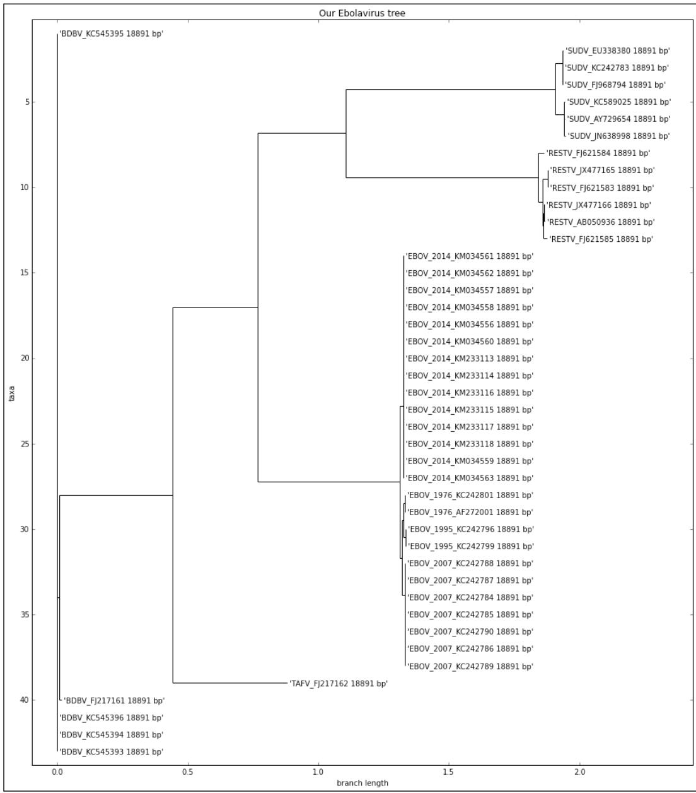
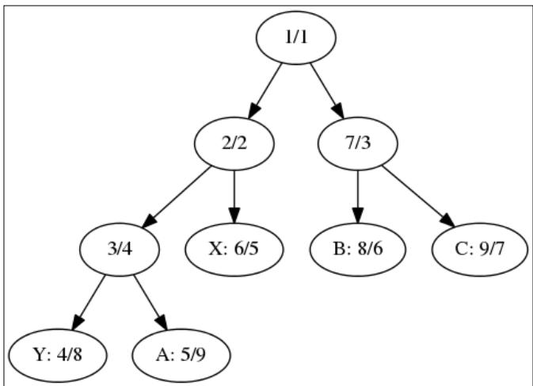
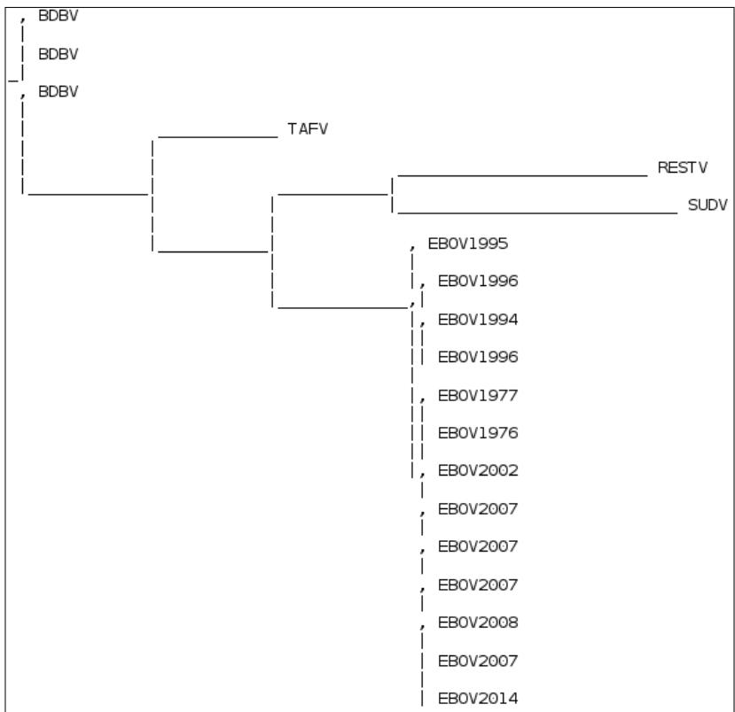
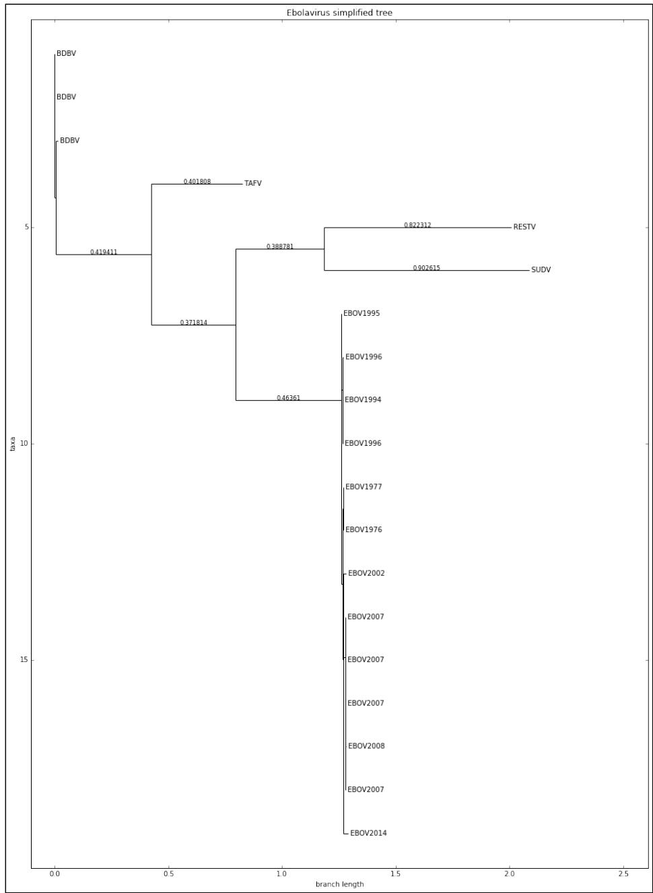
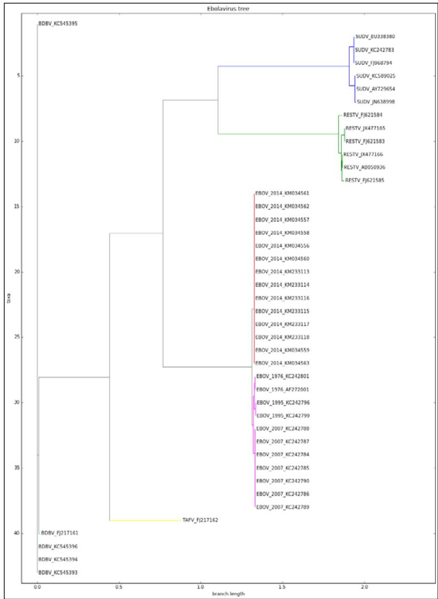
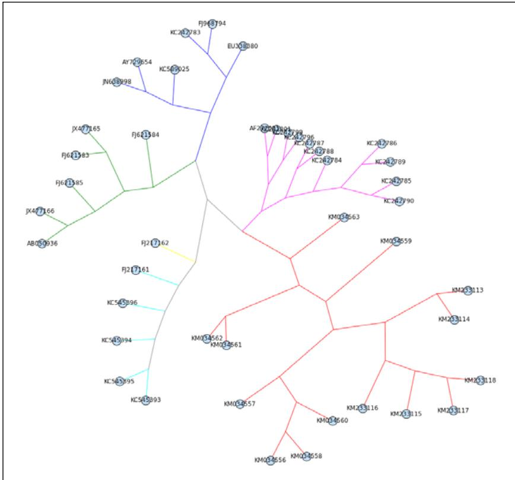

# Phylogenetics

In this chapter, we will cover the following recipes: 

f Preparing the Ebola dataset 

f Aligning genetic and genomic data 

f Comparing sequences 

Reconstructing phylogenetic trees 

f Playing recursively with trees 

f Visualizing phylogenetic data 

## Introduction

Phylogenetics is the application of molecular sequencing to study the evolutionary relationship among organisms. The typical way to illustrate this process is through the use of phylogenetic trees. The computation of these trees from genomic data is an active field of research with many real-world applications. 

We will take the practical approach mentioned in this book to a new level; most of the recipes here are inspired by a very recent study on the Ebola virus, which researched the recent Ebola outbreak in Africa. This study is called Genomic surveillance elucidates Ebola virus origin and transmission during the 2014 outbreak from Gire et al published on Science and is available at http://www.sciencemag.org/content/345/6202/1369.short. Here, we will try to follow a similar methodology to arrive at similar results from the paper. 

In this chapter, we will use DendroPy (a phylogenetics library) and Biopython. We will use DendroPy Version 3. Version 4 may be out when you read this. Most of this code will only work on Python 2. 

## www.ebook777.comwww.it-ebooks.info

Phylogenetics 

## Preparing the Ebola dataset

Here, we will download and prepare the dataset to be used for our analysis. The dataset contains complete genomes of the Ebola virus. We will use DendroPy to download and prepare the data. 

## Getting ready

We will download complete genomes from Genbank; these genomes were collected from various Ebola outbreaks, including several from the 2014 outbreak. Note that there are several virus species that cause the Ebola virus disease; the species involved in the 2014 outbreak (the EBOV virus, formally known as the Zaire Ebola virus) is the most common, but this disease is caused by more species of the genus Ebola virus; four others are also available in sequenced form. You can read more at https://en.wikipedia.org/wiki/ Ebolavirus. For scientific references of all downloaded entries, check the GenBank records. 

If you have dealt with previous chapters, you may panic looking at the potential data sizes involved here; this is not a problem at all because these are genomes of virus of around 19 kbp each. So, our approximately 100 genomes are actually quite light. 

As usual, this information is available in the corresponding notebook available at 05_Phylo/Exploration.ipynb. 

## How to do it...

Take a look at the following steps: 

```python
1. First, let's start specifying our data sources using DendroPy as follows:
    from __future__ import division, print_function
    import dendropy
    from dendropy.interop import genbank
    def get_ebov_2014_sources():
    #EBOV_2014
    #yield 'EBOV_2014', \
    genbank.GenBankDna(id_range=(233036, 233118), prefix='KM')
    yield 'EBOV_2014', genbank.GenBankDna(id_range=(34549, 34563), prefix='KM0')

    def get_other_ebov_sources():
    #EBOV other
    yield 'EBOV_1976', genbank.GenBankDna(ids=['AF272001', 'KC242801'])
    yield 'EBOV_1995', genbank.GenBankDna(ids=['KC242796', 'KC242799']) 
```

```txt
Free ebooks ==> www.ebook777.com 
```

Chapter 6 

```python
yield 'EBOV_2007', genbank.GenBankDna(id_range=(84, 90), prefix='KC2427')

def get_other_ebolavirus_sources():
    #BDBV
    yield 'BDBV', genbank.GenBankDna(id_range=(3, 6), prefix='KC54539')
    yield 'BDBV', genbank.GenBankDna(ids=['FJ217161'])

    #RESTV
    yield 'RESTV', genbank.GenBankDna(ids=['AB050936', 'JX477165', 'JX477166', 'FJ621583', 'FJ621584', 'FJ621585'])

    #SUDV
    yield 'SUDV', genbank.GenBankDna(ids=['KC242783', 'AY729654', 'EU338380', 'JN638998', 'FJ968794', 'KC589025', 'JN638998'])
    #yield 'SUDV', genbank.GenBankDna(id_range=(89, 92), prefix='KC5453')

    #TAFV
    yield 'TAFV', genbank.GenBankDna(ids=['FJ217162']) 
```

‰ We have three functions; one to retrieve data from the most recent EBOV outbreak, another from previous EBOV outbreaks, and one from outbreaks of other species. 

‰ Note that the DendroPy GenBank interface provides several different ways to specify lists or ranges of records to retrieve. 

‰ Some lines are commented out. These include code to download more genomes. For our purpose, the subset that we will download is enough. 

2. Now, we will create a set of FASTA files; we will use these files here and in future recipes with subsets of data to analyze: 

```python
other = open('other.fasta', 'w')
sampled = open('sample.fasta', 'w')

for species, recs in get_other_ebolavirus_sources():
    char_mat = \
recs.generate_char_matrix(taxon_set=dendropy.TaxonSet(),
    gb_to_taxon_func=lambda gb: dendropy.Taxon(label='%s_%s' % (species, gb.accession)))
char_mat.write_to_stream(other, 'fasta')
char_mat.write_to_stream(sampled, 'fasta') 
```

```txt
Free ebooks ==> www.ebook777.com 
```

## Phylogenetics

```python
other.close()
ebov_2014 = open('ebov_2014.fasta', 'w')
ebov = open('ebov.fasta', 'w')
for species, recs in get_ebov_2014_sources():
    char_mat = recs.generate_char_matrix(taxon_set=dendropy.
    TaxonSet(),
    gb_to_taxon_func=lambda gb: dendropy.
Taxon(label='EBOV_2014_%s' % gb.accession))
    char_mat.write_to_stream(ebov_2014, 'fasta')
    char_mat.write_to_stream(sampled, 'fasta')
    char_mat.write_to_stream(ebov, 'fasta')
ebov_2014.close()

ebov_2007 = open('ebov_2007.fasta', 'w')
for species, recs in get_other_ebov_sources():
    char_mat = recs.generate_char_matrix(taxon_set=dendropy.
TaxonSet(),
    gb_to_taxon_func=lambda gb: dendropy.Taxon(label='%s_%s' % (species, gb.accession)))
    char_mat.write_to_stream(ebov, 'fasta')
    char_mat.write_to_stream(sampled, 'fasta')
    if species == 'EBOV_2007':
    char_mat.write_to_stream(ebov_2007, 'fasta')

ebov.close()
ebov_2007.close()
sampled.close() 
```

‰ We will generate several different FASTA files, which include all genomes, just EBOV, or just EBOV samples from the 2014 outbreak. In this chapter, we will mostly use the sample.fasta file with all genomes. You can find a detailed description of DendroPy's data structures in its documentation. 

‰ Note that the use of DendroPy functions to create FASTA files retrieved GenBank records are converted. Also note that the ID of each sequence on the FASTA file is produced by a lambda function that uses species and year apart from the GenBank accession. 

3. Let's extract four (of the total of seven) genes in the virus as follows: 

```python
my_genes = ['NP', 'L', 'VP35', 'VP40']

def dump_genes(species, recs, g_dls, p_hdls):
    for rec in recs:
    for feature in rec.feature_table:
    if feature.key == 'CDS': 
```

```txt
Free ebooks ==> www.ebook777.com 
```

Chapter 6 

```prolog
gene_name = None
for qual in feature.qualifiers:
    if qual.name == 'gene':
    if qual.value in my_genes:
    gene_name = qual.value
elif qual.name == \
    'translation':
    protein_translation = \
    qual.value

if gene_name is not None:
    locs = \
    feature.location.split(' Process)
    start, end = int(locs[0]), int(locs[-1])
    g_hdls[gene_name].write('%s_%s\n' % (species, rec.accession))
    p_hdls[gene_name].write('%s_%s\n' % (species, rec.accession))
    g_hdls[gene_name].write('%s\n' % rec.sequence_text[start - 1 : end])
    p_hdls[gene_name].write('%s\n' % protein_translation)

g_hdls = {}
p_hdls = {}

for gene in my_genes:
    g_hdls[gene] = open('%s.fasta' % gene, 'w')
    p_hdls[gene] = open('%s_P.fasta' % gene, 'w')
for species, recs in get_other_ebolavirus_sources():
    if species in ['RESTV', 'SUDV]:
    dump_genes(species, recs, g_hdls, p_hdls)

for gene in my_genes:
    g_hdls[gene].close()
    p_hdls[gene].close()

We start by searching the first GenBank record for all gene features (refer to Chapter 2, Next-generation Sequencing, or the NCBI documentation for further details; although we will use DendroPy and not Biopython here, the concepts are similar) and write to FASTA files in order to extract the genes. We put each gene in a different file and only take two virus species.
We also get translated proteins; which are available on the records for each gene. 
```

```txt
Free ebooks ==> www.ebook777.com 
```

## Phylogenetics

4. Let's create a function to get the basic statistical information from the alignment as follows: 

```python
def describe_seqs(seqs):
    print('Number of sequences: %d' % len(seqs.taxon_set))
    print('First 10 taxon sets: %s' % ' '.join([taxon.label for taxon in seqs.taxon_set[:10]]))
    lens = []
    for tax, seq in seqs.items():
    lens.append(len([x for x in seq.symbols_as_list() if x != '-']))
    print('Genome length: min %d, mean %.1f, max %d' % (min(lens), sum(lens) / len(lens), max(lens))) 
```

‰ Our function takes a DendroPy class (DnaCharacterMatrix) and counts the number of taxons. We then extract all amino acids per sequence (we exclude gaps identified by -) to compute the length, and report the minimum, mean, and maximum sizes. Take a look at the DendroPy documentation for details on the API. 

5. Let's inspect the sequence of the EBOV genome and compute basic statistics as shown earlier: 

```python
ebov_seqs = \
    dendropy.DnaCharacterMatrix.get_from_path('ebov.fasta', schema='fasta', data_type='dna')
print('EBOV')
describe_seqs(ebov_seqs)
del ebov_seqs 
```

‰ We then call a function and get 25 sequences with a minimum size of 18,613, mean of 18,909.8, and maximum of 18,959. A small genome when compared with eukaryotes. 

‰ Note that at the very end, the memory structure is deleted. This is because the memory footprint is still quite big (DendroPy is a pure Python library and has some costs in terms of speed and memory). Be careful with your memory usage when you load full genomes. 

6. Now, let's inspect the other Ebola virus genome file and count the number of different species: 

```python
print('ebolavirus sequences')
ebolav_seqs = \
    dendropy.DnaCharacterMatrix.get_from_path('other.fasta', schema='fasta', data_type='dna')
describe_seqs(ebolav_seqs)
from collections import defaultdict
species = defaultdict(int) 
```

```txt
Free ebooks ==> www.ebook777.com 
```

Chapter 6 

```python
for taxon in ebolav_seqs.taxon_set:
    toks = taxon.label.split('_')
    my_species = toks[0]
    if my_species == 'EBOV':
    ident = '%s (%s)' % (my_species, toks[1])
    else:
    ident = my_species
    species[ident] += 1
for my_species, cnt in species.items():
    print("%20s: %d" % (my_species, cnt))
del ebolav_seqs 
```

The name prefix of each taxon is indicative of the species and we leverage that to fill a dictionary of counts. 

‰ The output for species and the EBOV breakdown is as follows (with the legend as Bundibugyo virus=BDBV, Tai Forest virus=TAFV, Sudan virus=SUDV, and Reston virus=RESTV. We have 1 TAFV, 6 SUDV, 6 RESTV, and 5 BDBV. 

## 7. Let's extract the basic statistics of a gene on the virus:

```python
gene_length = {}
my_genes = ['NP', 'L', 'VP35', 'VP40']

for name in my_genes:
    gene_name = name.split('.') [0]
    seqs = dendropy.DnaCharacterMatrix.get_from_path('%s.fasta' % 
    name, schema='fasta', data_type='dna')
    gene_length[gene_name] = []
    for tax, seq in seqs.items():
    gene_length[gene_name].append(len([x for x in 
    seq.symbols_as_list() if x != '-']))
for gene, lens in gene_length.items():
    print('%6s: %d' % (gene, sum(lens) / len(lens))) 
```

This allows you to have an overview of the basic gene information (name and mean size) as follows: 

```yaml
NP: 2218
VP40: 988
L: 6636
VP35: 990 
```

## Phylogenetics

## There's more...

Most of the work here can probably be performed with Biopython, but DendroPy has additional functionalities that will be explored in later recipes. Furthermore, as you will see, it's more robust with certain tasks (such as file parsing). 

Most importantly, there is another Python library to perform phylogenetics that you should consider. It's called ETE and is available at http://etetoolkit.org/. 

## See also

Wikipedia has a good introductory page on the Ebola virus disease at http://en.wikipedia.org/wiki/Ebola_virus_disease 

f The wiki page about the virus is http://en.wikipedia.org/wiki/Ebola_ virus; also see the page on the genus at http://en.wikipedia.org/wiki/ Ebolavirus 

f The reference application in phylogenetics is Joe Felsenstein's Phylip http://evolution.genetics.washington.edu/phylip.html. 

We will use the Nexus and Newick formats in future recipes (http://evolution. genetics.washington.edu/phylip/newicktree.html), but also check the PhyloXML format (http://en.wikipedia.org/wiki/PhyloXML) 

## Aligning genetic and genomic data

Before we can perform any phylogenetic analysis, we need to align our genetic and genomic data. Here, we will use MAFFT (http://mafft.cbrc.jp/alignment/software/) to perform the genome analysis and the gene analysis will be performed using MUSCLE (http://www.drive5.com/muscle/). 

## Getting ready

To perform the genomic alignment, you will need to install MAFFT, and to perform the genic alignment, MUSCLE will be used. Also, we will use TrimAl (http://trimal.cgenomics. org/) to remove spurious sequences and poorly aligned regions in an automated manner. On Ubuntu and Linux, MAFFT and MUSCLE can be installed using apt-get install mafft muscle packages. TrimAl will have to be manually installed. 

As usual, this information is available in the corresponding notebook at 05_Phylo/ Alignment.ipynb. You will need to have run the previous notebook as it will generate files that are required here. 

In this chapter, we will use Biopython. 

Chapter 6 

## How to do it...

Take a look at the following steps: 

1. We will now run MAFFT to align genomes, as shown in the following code. This task is CPU-intensive and memory-intensive and will take quite some time: 

```python
from Bio.Align.Applications import MafftCommandLine
mafft_cline = MafftCommandLine(input='sample.fasta',
    ep=0.123, reorder=True, maxiterate=1000, localpair=True)
print(mafft_cline)
stdout, stderr = mafft_cline()
with open('align.fasta', 'w') as w:
    w.write(stdout) 
```

‰ The parameters are the same as the one specified in the supplementary material of the paper. We will use the BioPython interface to call MAFFT. 

2. Let's use TrimAl to trim sequences as follows: 

```javascript
os.system('./trimal -automated1 -in align.fasta -out trim.fasta -fasta') 
```

‰ Here we just call the application using os.system. The -automated1 parameter is from the supplementary material. 

3. We can also run MUSCLE to align proteins: 

```python
from Bio.Align.Applications import MuscleCommandline
my_genes = ['NP', 'L', 'VP35', 'VP40']

for gene in my_genes:
    muscle_cline = MuscleCommandline(input='%s_P.fasta' % gene)
    print(muscle_cline)
    stdout, stderr = muscle_cline()
    with open('%s_P_align.fasta' % gene, 'w') as w:
    w.write(stdout) 
```

‰ Again, we will use Biopython to call an external application. Here, we will align a set of proteins. 

‰ Note that to make some analysis of molecular evolution, we have to compare aligned genes, not proteins (for example, compare synonymous to nonsynonymous mutations). However, we have just aligned proteins. So, we have to "convert" the alignment to the gene sequence form. 

```txt
Free ebooks ==> www.ebook777.com 
```

## Phylogenetics

```python
4. Let's align the genes by finding three nucleotides that correspond to each amino acid:
    from Bio import SeqIO
    from Bio.Seq import Seq
    from Bio.SeqRecord import SeqRecord
    from Bio.Alphabet import generic_protein

    for gene in my_genes:
    gene_seqs = {}
    unal_gene = SeqIO.parse('%s.fasta' % gene, 'fasta')
    for rec in unal_gene:
    gene_seqs[rec.id] = rec.seq

    al_prot = SeqIO.parse('%s_P_align.fasta' % gene, 'fasta')
    al_genes = []
    for protein in al_prot:
    my_id = protein.id
    seq = ''
    pos = 0
    for c in protein.seq:
    if c == '-'':
    seq += '---'
    else:
    seq += str(gene_seqs[my_id][pos:pos + 3])
    pos += 3
    al_genes.append(SeqRecord(Seq(seq), id=my_id))
    SeqIO.write(al_genes, '%s_align.fasta' % gene, 'fasta') 
```

‰ The code gets the protein and the gene coding; if a gap is found in a protein, three gaps are written; if an amino acid is found, corresponding nucleotides of the gene are written. 

## Comparing sequences

Here, we will compare aligned sequences. We will perform gene and genome-wide comparisons. 

## Getting ready

We will use DendroPy and will require results from the previous two recipes. As usual, this information is available in the corresponding notebook at 05_Phylo/Comparison.ipynb. 

```txt
Free ebooks ==> www.ebook777.com 
```

Chapter 6 

## How to do it...

Take a look at the following steps: 

```python
1. Let's start analyzing the gene data. For simplicity, we will only use the data from two other species of the genus Ebola virus that are available in the extended dataset: the Reston virus (RESTV) and the Sudan virus (SUDV):
    from _future_ import print_function
    import os
    from collections import OrderedDict
    import dendropy
    from dendropy import popgenstat
    genes_species = OrderedDict()
    my_species = ['RESTV', 'SUDV']
    my_genes = ['NP', 'L', 'VP35', 'VP40']

    for name in my_genes:
    gene_name = name.split('.') [0]
    char_mat = \
    dendropy.DnaCharacterMatrix.get_from_path('%s_align.fasta'
    % name, 'fasta')
    genes_species[gene_name] = {}

    for species in my_species:
    genes_species[gene_name][species] = \
    dendropy.DnaCharacterMatrix()
    for taxon, char_map in char_mat.items():
    species = taxon.label.split('_')[0]
    if species in my_species:
    genes_species[gene_name][species].extend_map({taxon: char_map})

    □ We get four genes that we stored in the first recipe and aligned in the second.
    □ We load all the files (which are FASTA formatted) and create a dictionary with all the genes. Each entry will be a dictionary itself with the RESTV or SUDV species, including all reads. This is not a lot of data, just a handful of genes.

2. Let's print some basic information for all four genes, such as number of segregating sites, nucleotide diversity, Tajima's D, and Waterson's Theta (check the See also section of this recipe for links on these statistics):
    import numpy as np
    import pandas as pd
    summary = np.ndarray(shape=(len(genes_species), 4 * len(my_species))) 
```

165 

## www.ebook777.comwww.it-ebooks.info

## Phylogenetics

```python
stats = ['seg_sites', 'nuc_div', 'taj_d', 'wat_theta']
for row, (gene, species_data) in
    enumerate(genes_species.items()):
    for col_base, species in enumerate(my_species):
    summary[row, col_base * 4] = \
popgenstat.num_segregating_sites(species_data[species])
    summary[row, col_base * 4 + 1] = \
popgenstat.nucleotide_diversity(species_data[species])
    summary[row, col_base * 4 + 2] = \
popgenstat.tajimas_d(species_data[species])
    summary[row, col_base * 4 + 3] = \
popgenstat.wattersons_theta(species_data[species])
columns = []
for species in my_species:
    columns.extend(['%s (%s)' % (stat, species) for stat in stats])
df = pd.DataFrame(summary, index=genes_species.keys(),
    columns=columns)
df # vs print(df) 
```

3. Let's look at the output first and then explain how to build it: 

<table><tr><td></td><td>seg_sites (RESTV)</td><td>nuc_dlv (RESTV)</td><td>taj_d (RESTV)</td><td>wat_theta (RESTV)</td><td>seg_sites (SUDV)</td><td>nuc_dlv (SUDV)</td><td>taj_d (SUDV)</td><td>wat_theta (SUDV)</td></tr><tr><td>NP</td><td>113</td><td>0.020659</td><td>-0.482275</td><td>49.489051</td><td>118</td><td>0.029630</td><td>1.203522</td><td>56.64</td></tr><tr><td>L</td><td>288</td><td>0.018143</td><td>-0.295386</td><td>126.131387</td><td>282</td><td>0.024193</td><td>1.412350</td><td>135.36</td></tr><tr><td>VP35</td><td>42</td><td>0.017099</td><td>-0.530330</td><td>18.394161</td><td>50</td><td>0.027761</td><td>1.069061</td><td>24.00</td></tr><tr><td>VP40</td><td>61</td><td>0.026155</td><td>-0.188135</td><td>26.715328</td><td>41</td><td>0.023517</td><td>1.269160</td><td>19.68</td></tr></table>

‰ I used a pandas DataFrame to print the results because it's really tailored to deal with an operation like this. 

‰ We will initialize our DataFrame with a NumPy multidimensional array with four rows (genes) and four statistics times the two species. 

‰ Statistics, such as number of segregating sites, nucleotide diversity, Tajima's D, and Watterson's Theta, are computed by DendroPy. Note the placement of individual data points in an array (the coordinate computation). 

‰ Look at the very last line: if you are on the IPython Notebook, just putting the df at the end will render the DataFrame and cell output as well. If you are not on a notebook, perform a print(df) (you can also perform this in a notebook, but it will not look as pretty). 

Chapter 6 

4. Let's now extract similar information, but genome-wide instead of only gene-wide. In this case, we will use a subsample of two EBOV outbreaks (from 2007 and 2014). We will perform a function to display basic statistics as follows: 

```python
def do_basic_popgen(seqs):
    num_seg_sites = popgenstat.num_segregating_sites(seqs)
    avg_pair = popgenstat.average_number_of_pairwise_differences(seqs)
    nuc_div = popgenstat.nucleotide_diversity(seqs)
    print('Segregating sites: %d, Avg pairwise diffs: %.2f, Nucleotide diversity %.6f' % (num_seg_sites, avg_pair, nuc_div))
    print("Watterson's theta: %s" % popgenstat.wattersons_theta(seqs))
    print("Tajima's D: %s" % popgenstat.tajimas_d(seqs))
    By now, this function should be easy to understand, given the preceding examples. 
```

5. Let's now extract a subsample of the data properly and output the statistical information: 

```python
ebov_seqs = \
dendropy.DnaCharacterMatrix.get_from_path('trim.fasta', schema='fasta', data_type='dna')
sl_2014 = []
drc_2007 = []
ebov2007_set = dendropy.DnaCharacterMatrix()
ebov2014_set = dendropy.DnaCharacterMatrix()
for taxon, char_map in ebov_seqs.items():
    if taxon.label.startswith('EBOV_2014') and \
    len(sl_2014) < 8:
    sl_2014.append(char_map)
    ebov2014_set.extend_map({taxon: char_map})
    elif taxon.label.startswith('EBOV_2007'):
    drc_2007.append(char_map)
    ebov2007_set.extend_map({taxon: char_map})
del ebov_seqs
print('2007 outbreak:')
print('Number of individuals: %s' %
len(ebov2007_set.taxon_set))
do_basic_popgen(ebov2007_set)
print('\n2014 outbreak:')
print('Number of individuals: %s' %
len(ebov2014_set.taxon_set))
do_basic_popgen(ebov2014_set) 
```

## Phylogenetics

‰ Here, we will construct two versions of two datasets: the 2014 outbreak and the 2007 outbreak. We generate a version as a DnaCharacterMatrix and another as a list. We will use this list version at the end of this recipe. 

‰ As the dataset for the EBOV outbreak of 2014 is large, we subsample it with just eight individuals, a comparable sample size as the dataset of the 2007 outbreak. 

‰ Again, we delete the ebov_seqs data structure to conserve memory (these are genomes, not only genes). 

‰ If you perform this analysis on the complete dataset for the 2014 outbreak available on GenBank (99 samples), be prepared to wait for quite some time. 

‰ The output is shown here: 

```txt
2007 outbreak:
Number of individuals: 7
Segregating sites: 25, Avg pairwise diffs: 7.71, Nucleotide diversity 0.000412
Watterson's theta: 10.2040816327
Tajima's D: -1.38311415748

2014 outbreak:
Number of individuals: 8
Segregating sites: 6, Avg pairwise diffs: 2.79, Nucleotide diversity 0.000149
Watterson's theta: 2.31404958678
Tajima's D: 0.950120802758 
```

6. Finally, we perform some statistical analysis on two subsets of 2007 and 2014 as follows: 

```python
pair_stats = \
popgenstat.PopulationPairSummaryStatistics(sl_2014, drc_2007)
print('Average number of pairwise differences irrespective of population: %.2f' %
    pair_stats.average_number_of_pairwise_differences)
print('Average number of pairwise differences between populations: %.2f' %
    pair_stats.average_number_of_pairwise_differences_between)
print('Average number of pairwise differences within populations: %.2f' %
    pair_stats.average_number_of_pairwise_differences_within) 
```

```txt
Free ebooks ==> www.ebook777.com 
```

```python
print('Average number of net pairwise differences : %.2f' % pair_stats.average_number_of_pairwise_differences_net)
print('Number of segregating sites: %d' % pair_stats.num_segregating_sites)
print("Watterson's theta: %.2f" % pair_stats.wattersons_theta)
print("Wakeley's Psi: %.3f" % pair_stats.wakeleys_psi)
print("Tajima's D: %.2f" % pair_stats.tajimas_d) 
```

Chapter 6 

‰ Note that we will perform something slightly different here; we will ask DendroPy (popgenstat.PopulationPairSummaryStatistics) to directly compare two populations so that we get the following results: 

```txt
Average number of pairwise differences irrespective of population: 284.46  
Average number of pairwise differences between populations: 529.07  
Average number of pairwise differences within populations: 10.50  
Average number of net pairwise differences : 518.57  
Number of segregating sites: 549  
Watterson's theta: 168.84  
Wakeley's Psi: 0.296  
Tajima's D: 3.05 
```

The number of segregating sites is now much bigger because we are dealing with data from two different populations that are reasonably diverged. 

‰ The average number of pairwise differences among populations is quite large. As expected, this is much larger than the average number of population irrespective of the population information. 

## There's more…

If you want to get many population genetics formulas, including the ones used here; I strongly recommend that you get the manual of the Arlequin software suite (http://cmpg. unibe.ch/software/arlequin35/). If you do not use Arlequin to perform data analysis, its manual is probably the best reference to implement formulas. This free document has probably more relevant formula implementation details than any book that I remember. 

Phylogenetics 

## Reconstructing phylogenetic trees

Here, we will construct phylogenetic trees for the aligned dataset for all Ebola species. We will follow the procedure quite similar to the one used in the paper. 

## Getting ready

This recipe requires RAxML, a program for maximum likelihood-based inference of large phylogenetic trees, which you can check at http://sco.h-its.org/exelixis/ software.html. With Ubuntu Linux, you can simply apt-get install raxml. Note that the binary is called raxmlHPC. 

The code here is simple, but it will take time to execute because it will call RAxML (which is computationally intensive). If you opt to use the DendroPy interface, it may also become memory-intensive. We will interact with RAxML via DendroPy and Biopython, leaving you with a choice of which interface to use; DendroPy gives an easy way to access results, whereas Biopython is less memory-intensive. Although there is a recipe for visualization later in this chapter, we will nonetheless plot one of our generated trees here. 

As usual, this information is available in the corresponding notebook at 05_Phylo/ Reconstruction.ipynb. You will need the output of the previous recipe. 

## How to do it...

## Take a look at the following steps:

1. For DendroPy, we will load the data first and then reconstruct the genus dataset as follows: 

```python
from __future__ import print_function
import os
import shutil
import dendropy
from dendropy.interop import raxml
ebola_data = \
dendropy.DnaCharacterMatrix.get_from_path('trim.fasta', 'fasta')
rx = raxml.RaxmlRunner()
ebola_tree = rx.estimate_tree(ebola_data, ['-m', 'GTRGAMMA', '-N', '10'])
print('RAxML temporary directory %s:' %
    rx.working_dir_path)
del ebola_data 
```

‰ Remember that the size of the data structure for this is quite big; therefore, be sure to have enough memory to load this. 

‰ Be prepared to wait some time. Depending on your computer, this can be more than one hour. If it takes much longer, consider restarting the process as a RAxML bug might sometimes occur. 

‰ We will run RAxML with the GTRΓ nucleotide substitution model as specified in the paper. We will only perform 10 replicates to speed up results, but you should probably do a lot more, say 100. 

‰ At the end, we delete the genome data from memory as it takes up a lot of memory. 

‰ The ebola_data variable will have the best RAxML tree with distances included. 

‰ The RaxmlRunner object will have access to other information generated by RAxML. 

‰ Let's print a directory where DendroPy will execute RAxML. If you inspect this directory, you will find a lot of files. As RAxML returns the best tree, you may want to ignore all these files, but we will discuss this a little in the Biopython alternative step. 

2. We will save trees for future analysis; in our case, it will be visualization, as shown in the following code: 

```txt
ebola_tree.write_to_path('my_ebola.nex', 'nexus') 
```

‰ We will write sequences to a Nexus file because we need to store the topology information. FASTA is not enough here. 

3. Let's visualize our genus tree as follows: 

```python
import matplotlib.pyplot as plt
from Bio import Phylo
my_ebola_tree = Phylo.read('my_ebola.nex', 'nexus')
my_ebola_tree.name = 'Our Ebolavirus tree'
fig = plt.figure(figsize=(16, 18))
ax = fig.add_subplot(1, 1, 1)
Phylo.draw(my_ebola_tree, axes=ax) 
```

‰ We will defer the explanation of this code until the proper recipe further down the road, but if you look at the figure and compare it with the results from the paper, you will easily see that it looks a step in the right direction, for example, all individuals from the same species are clustered together. 

Phylogenetics 

‰ You will notice that TrimAl changed names of its sequences. For example, adding their sizes. This is easy to solve; we will deal with this in the visualization recipe: 




Figure 1: The phylogenetic tree that we generated with RAxML for all Ebola viruses


```txt
Free ebooks ==> www.ebook777.com 
```

Chapter 6 

4. Let's reconstruct the phylogenetic tree with RAxML via Biopython. The Biopython interface is less declarative, but much more memory-efficient than DendroPy, so after running it, it will be your responsibility to process the output, whereas DendroPy automatically returns the best tree, as shown in the following code: 

```python
import random
import sys
from Bio.Phylo.Applications import RaxmlCommandLine
raxml_cline = RaxmlCommandLine(sequences='trim.fasta',
    model='GTRGAMMA',
    name='biopython',
    num_replicates='10',
    parsimony_seed=random.randint(0,
    sys.maxint),
    working_dir=os.getcwd() +
    os.sep + 'bp_rx')
print(raxml_cline)
try:
    os.mkdir('bp_rx')
except OSError:
    shutil.rmtree('bp_rx')
    os.mkdir('bp_rx')
out, err = raxml_cline() 
```

‰ DendroPy has a more declarative interface than Biopython, so you can take care of a few extra things. You should specify the seed (Biopython will put a fixed default of 10000 if you do not do so) and the working directory. With RAxML, the working directory specification requires the absolute path. 

5. Let's inspect the outcome of the Biopython run. While the RAxML output is the same (save for stochasticity) for DendroPy and Biopython, DendroPy abstracts away a few things. With Biopython, you need to take care of the results yourself. You can also perform this with DendroPy, but in this case, it is optional: 

```python
from Bio import Phylo
biopython_tree = \
Phylo.read('bp_rx/RAxML_bestTree.biopython', 'newick') 
```

‰ The preceding code will read the best tree from the RAxML run. The name of the file was appended with the project name that you specified in the previous step (in this case, Biopython). 

‰ Take a look at the content of the bp_rx directory; here, you will find all the outputs from RAxML, including all 10 alternative trees. 

## Phylogenetics

## There's more...

Although the purpose of this book is not to teach phylogentic analysis, it's important to know why we do not inspect consensus and support information on the tree topology. You should research this in your dataset. For more information, refer to http://www.geol.umd. edu/~tholtz/G331/lectures/cladistics5.pdf. 

## Playing recursively with trees

This is not a book about programming on Python as the topic is vast. Having said that, it's not common for introductory Python books to discuss recursive programming at length Recursive programming techniques are usually well tailored to deal with trees. They are also a common programming strategy with functional programming dialects, which can be quite useful when you perform concurrent development, which you can perform when processing very large datasets. 

The phylogenetic notion of a tree is slightly different from computer science. Phylogenetic trees can be rooted (then they are normal tree data structures) or unrooted, making them undirected acyclic graphs. Phylogenetic trees can also have weights in their edges. Thus, be mindful of this when you read the documentation; if text is written by a phylogeneticist, you can expect the tree (rooted and unrooted), while most other documents will use undirected acyclic graphs for unrooted trees. Having said that, in this recipe, will assume that all trees are rooted. 

Finally, note that while this recipe is devised mostly to help you understand recursive algorithms and tree-like structures, the final part is actually quite practical and fundamental for the next recipe to work. 

## Getting ready

You will need to have files from the previous recipe. As usual, you can find this content in the 05_Phylo/Trees.ipynb notebook. We will use DendroPy's tree representations here. Note that most of this code is easily generalizable compared with other tree representations and libraries (phylogenetic or not). 

```txt
Free ebooks ==> www.ebook777.com 
```

Chapter 6 

## How to do it...

Take a look at the following steps: 

```python
1. First, let's load the RAxML-generated tree for all Ebola virus as follows:
import dendropy
ebola_raxml = dendropy.Tree.get_from_path('my_ebola.nex', 'nexus') 
```

2. Then, compute the level of each node (the distance to the root node): 

```python
def compute_level(node, level=0):
    for child in node.child_nodes():
    compute_level(child, level + 1)
    if node.taxon is not None:
    print("%s: %d %d" % (node.taxon, node.level(), level)) 
```

```txt
compute_level(ebola_raxml.seed_node) 
```

‰ DendroPy's node representation has a level method (which is used for comparison), but the point here is to introduce a recursive algorithm, so we will implement it anyway. 

‰ Note how the function works; it's called with the seed_node (which is the root node under our assumption that we are dealing with rooted trees). The default level for the root node is 0. The function will then call itself for all its children nodes, increasing the level by one. Then, for each node that is not a leaf (it's internal to the tree), the calling will be repeated, and this will recurse until we get to the leaf nodes. 

‰ For the leaf nodes, we then print the level (we could have done the same for the internal nodes) and show the same information computed by DendroPy's internal function. 

3. Let's now compute the height of each node. The height of the node is the number of edges of the maximum downward path (going to the leaves) starting on that node as follows: 

```python
def compute_height(node):
    children = node.child_nodes()
    if len(children) == 0:
    height = 0
    else:
    height = 1 + max(map(lambda x: compute_height(x), children))
    desc = node.taxon or 'Internal'
    print("%s: %d %d" % (desc, height, node.level()))
    return height

compute_height(ebola_raxml.seed_node) 
```

```txt
Free ebooks ==> www.ebook777.com 
```

```txt
Phylogenetics 
```

‰ Here, we will use the same recursive strategy, but each node will return its height to its parent; if the node is a leaf, then the height is 0; if not, then it's 1 plus the maximum of the height of its entire offspring. 

‰ Note that we use a map over a lambda function to get all the heights of all the children of the current node. We then choose the maximum (the maximum function performs a reduce operation here because it summarizes all the values reported). If you are relating this to MapReduce frameworks, you are correct; these are inspired in functional programming dialects like these. 

4. Let's now compute the number of offspring for each node; this should be quite easy to understand now: 

```python
def compute_nofs(node):
    children = node.child_nodes()
    nofs = len(children)
    map(lambda x: compute_nofs(x), children)
    desc = node.taxon or 'Internal'
    print("%s: %d %d" % (desc, nofs, node.level())) 
```

```txt
compute_nofs(ebola_raxml.seed_node) 
```

5. We will now print all the leaves (this is apparently trivial): 

```python
def print_nodes(node):
    for child in node.child_nodes():
    print_nodes(child)
    if node.taxon is not None:
    print('%s (%d)' % (node.taxon, node.level())) 
```

```txt
print_nodes(ebola_raxml.seed_node) 
```

‰ Note that all the functions that we have developed until now impose a very clear traversal pattern on the tree. You call your first offspring, then your offspring will call their offspring, and so on; only after this, you will call your next offspring in a depth-first pattern, but we can do things differently. 

6. Let's now print the leaf nodes in a breath-first manner, that is, we will print first the leafs with the lowest level (closer to the root) as follows: 

```python
from collections import deque 
```

```python
def print_breadth(tree):
    queue = deque()
    queue.append(tree.seed_node)
    while len(queue) > 0:
    process_node = queue.popleft()
    if process_node.taxon is not None: 
```

print('%s (%d)' % (process_node.taxon, process_node.level())) else: for child in process_node.child_nodes(): queue.append(child) 

print_breadth(ebola_raxml) 

‰ Before we explain the algorithm, let's see how different the result from this run will be compared to the previous one. For starters, take a look at the next figure. If you print the nodes by depth-first order, you will get Y, A, X, B, and C, but if you perform a breath-first traversal, you will get X, B, C, Y, and A. Tree traversal will have an impact on how the nodes are visited; more often than not that, this is important. 

‰ Regarding the preceding code here, we will use a completely different approach as we will perform an iterative algorithm. We will use a First-In First-Out (FIFO) queue to help order our nodes. Note that Python's deque can be used efficiently as FIFO and also as Last-In First-Out (LIFO) because it implements an efficient data structure when you operate at both extremes. 

‰ The algorithm starts by putting the root node on the queue. While the queue is not empty, we will take the node out front. If it's an internal node, we will put all its children on the queue. 

‰ We will iterate the preceding step until the queue is empty. I encourage you to take a pen and paper and see how this works by performing this example on the figure by yourself because the code is small, but not trivial: 




Figure 2: An example tree; the first number of each node indicates the order in which that node is visited with a depth-first algorithm; the second number indicates the order with a breadth-first algorithm


```txt
Free ebooks ==> www.ebook777.com 
```

## Phylogenetics

7. Let's get back to the real dataset. As we have a bit too much data to visualize, we will generate a trimmed down version, where we remove the subtrees that have single species (in the case of EBOV, have the same outbreak). We will also ladderize the tree, that is, sort the child nodes in order of the number of children: 

```python
from copy import deepcopy
simple_ebola = deepcopy(ebola_raxml)

def simplify_tree(node):
    prefs = set()
    for leaf in node.leaf_nodes():
    my_toks = leaf.taxon.label.split(' ')
    if my_toks[0] == 'EBOV':
    prefs.add('EBOV' + my_toks[1])
    else:
    prefs.add(my_toks[0])
    if len(prefs) == 1:
    print(prefs, len(node.leaf_nodes()))
    node.taxon = dendropy.Taxon(label=list(prefs)[0])
    node.set_child_nodes([])
    else:
    for child in node.child_nodes():
    simplify_tree(child)

simplify_tree(simple_ebola.seed_node)
simple_ebola.ladderize()
simple_ebola.write_to_path('ebola_simple.nex', 'nexus') 
```

‰ We will perform a deep copy of the tree structure. As our function and the ladderization is destructive (it will change the tree), we will want to maintain the original tree. 

‰ DendroPy is able to enumerate all the leaf nodes (at this stage, a good exercise will be to write a function to perform this). With this functionality, we will get all leaves for a certain node. If they share the same species and the outbreak year in the case of EBOV, we remove all the child nodes, leaves, and internal subtree nodes. 

‰ If they do not share the same species, we recurse down until that happens. The worst case is that when you are already at a leaf node, the algorithm trivially resolves to the species of the current node. 

## There's more...

There is a massive amount of computer science literature on the topic of trees and data structures; if you want to read more, Wikipedia provides a great introduction at http://en.wikipedia.org/wiki/Tree_%28data_structure%29. 

178 

## www.ebook777.comwww.it-ebooks.info

Chapter 6 

Note that the use of lambda functions and map is not encouraged as a Python dialect; you can read some (old) opinion on the subject from Guido van Rossum at http://www. artima.com/weblogs/viewpost.jsp?thread=98196. I presented it here because it's a very common dialect with functional and recursive programming. The more common dialect will be based on list comprehensions (refer to http://www.diveintopython3.net/ comprehensions.html). 

In any case, the functional dialect based on using map and reduce is the conceptual base for MapReduce frameworks, and you can use frameworks such as Hadoop, Disco, or Spark to perform high-performance bioinformatics computing. 

## Visualizing phylogenetic data

Here, we will discuss how to visualize Phylogenetic trees. DendroPy has only simple visualization mechanisms based on drawing textual ASCII trees, but Biopython has quite a rich infrastructure, which we will leverage here. 

## Getting ready

This will require all the previous recipes. Remember that we will have files for the whole genus Ebola virus, including the RAxML tree. Furthermore, there will be a simplified genus version produced in the previous recipe. 

Biopython uses matplotlib and graphviz as alternative backends. Graphviz is a graph visualization tool (do not confuse graph, the mathematical construct with a chart). While you should have matplotlib installed, you will need to install graphviz (http://www.graphviz. org/) and pygraphviz (http://pygraphviz.github.io/). Graphviz is available on Ubuntu and Linux (package graphviz). Pygraphviz can be installed using pip. 

As usual, you can find this content in the 05_Phylo/Visualization.ipynb notebook. 

## How to do it...

Take a look at the following steps: 

## 1. Let's load all the phylogenetic data:

```python
from copy import deepcopy
from Bio import Phylo
ebola_tree = Phylo.read('my_ebola.nex', 'nexus')
ebola_tree.name = 'Ebolavirus tree'
ebola_simple_tree = Phylo.read('ebola_simple.nex', 'nexus')
ebola_simple_tree.name = 'Ebolavirus simplified tree' 
```

## Phylogenetics

‰ For all trees that we read, we will change the name of the tree as the name will be printed later. 

2. We can draw ASCII representations of the trees: 

```txt
Phylo.draw_ascii(ebola_simple_tree)
Phylo.draw_ascii(ebola_tree) 
```

‰ The ASCII representation of the simplified genus tree is shown in Figure 3. Here, we will not print the complete version because it will take several pages, but if you run the preceding code, you will be able to see that it's actually quite readable: 




Figure 3: ASCII representation of a simplified Ebola virus dataset


## 3. Bio.Phylo allows the graphical representation of trees using matplotlib as a backend:

```python
import matplotlib.pyplot as plt
fig = plt.figure(figsize=(16, 22))
ax = fig.add_subplot(111)
Phylo.draw(ebola_simple_tree, branch_labels=lambda c:
    c.branch_length if c.branch_length > 0.02 else None,
    axes=ax) 
```

‰ In this case, we will print the branch lengths on the edges, but we will remove all lengths that are less than 0.02 to avoid clutter. The result is shown in the following figure: 

Chapter 6 




Figure 4: A matplotlib-based version of the simplified dataset with branch-lengths added


```txt
Free ebooks ==> www.ebook777.com 
```

Phylogenetics 

4. We will now plot the complete dataset, but we will color each bit of the tree differently. If a subtree has only a single virus species, it will get its own color. EBOV will have two colors; one for the 2014 outbreak and one for others as follows: 

```python
fig = plt.figure(figsize=(16, 22))
ax = fig.add_subplot(111)

from collections import OrderedDict
my_colors = OrderedDict({
    'EBOV_2014': 'red',
    'EBOV': 'magenta',
    'BDBV': 'cyan',
    'SUDV': 'blue',
    'RESTV': 'green',
    'TAFV': 'yellow'
})

def get_color(name):
    for pref, color in my_colors.items():
    if name.find(pref) > -1:
    return color
    return 'grey'

def color_tree(node, fun_color=get_color):
    if node.is_terminal():
    node.color = fun_color(node.name)
    else:
    my_children = set()
    for child in node.clades:
    color_tree(child, fun_color)
    my_children.add(child.color.to_hex())
    if len(my_children) == 1:
    node.color = child.color
    else:
    node.color = 'grey'

ebola_color_tree = deepcopy(ebola_tree)
color_tree(ebola_color_tree.root)
Phylo.draw(ebola_color_tree, axes=ax, label_func=
    lambda x: x.name.split(' ') [0] [1:] if x.name is not None else None) 
```

‰ This is a tree traversing algorithm, not unlike the ones presented in the previous recipe. 

‰ As a recursive algorithm, it works as follows. If the node is a leaf, it will get a color based on its species (or the EBOV outbreak year). If it's an internal node and all the descendant nodes are of the same species below it, it will get the color of that specie; if there are several species after that, it will be colored in gray. Actually, the color function can be changed and will so later. 

‰ Only the edge colors will be used (the labels will be printed in black). 

‰ Note that Ladderization (performed in the previous recipe with DendroPy) helps quite a lot in terms of a clear visual appearance. 

‰ We also deep copy the genus tree in order to color a copy; remember from the previous recipe that some tree traversal functions can change the state, and in this case, we want to preserve a version without any coloring. 

Note the usage of a lambda function to clean up the name that was changed by TrimAl, as shown in the following figure: 




Figure 5: A colored phylogenetic tree with the complete Ebola virus dataset


Phylogenetics 

5. Finally, Biopython's Phylo module allows the usage of graphviz, which is able to render graphs in an elegant way. We will use it with all the data as follows: 

```python
fig = plt.figure(figsize=(22, 22))
ax = fig.add_subplot(111)

def simplify_name(n):
    if n.is_terminal():
    return n.name[n.name.rfind('_') + 1:
    n.name.find(' ')]
    else:
    return None 
```

```python
Phylo.draw_graphviz(ebola_color_tree,
    label_func=simplify_name,
    axes=ax, with_labels=True) 
```

‰ Be sure to check all the alternative topologies that graphviz allows you to use 

‰ The result is as follows: 




Figure 6: A colored-phylogenetic tree rendered with graphviz


## There's more...

Chapter 6 

Tree and graph visualization is a complex topic; we will revisit this subject in Chapter 8, Other Topics in Bioinformatics, when we interface with Cytoscape. One interesting free software alternative (Java-based) for graph visualization is Gephi (http://gephi.github.io/). If you want to know more about the algorithms rendering trees and graphs, check the wikipedia page at http://en.wikipedia.org/wiki/Graph_drawing for an introduction to this fascinating topic. 

Free ebooks ==> www.ebook777.com 

