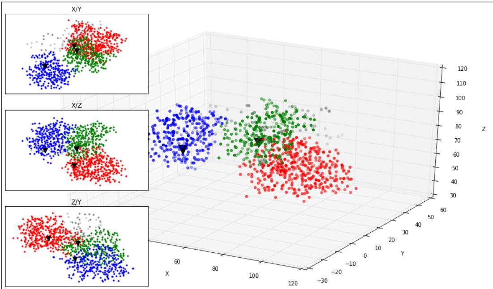
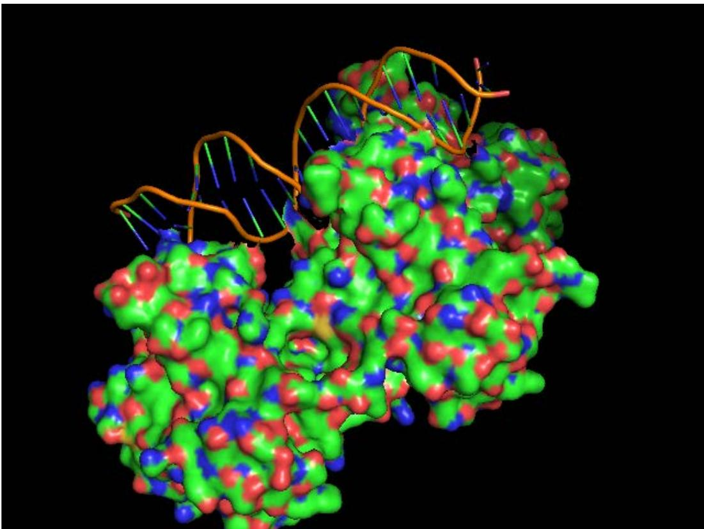
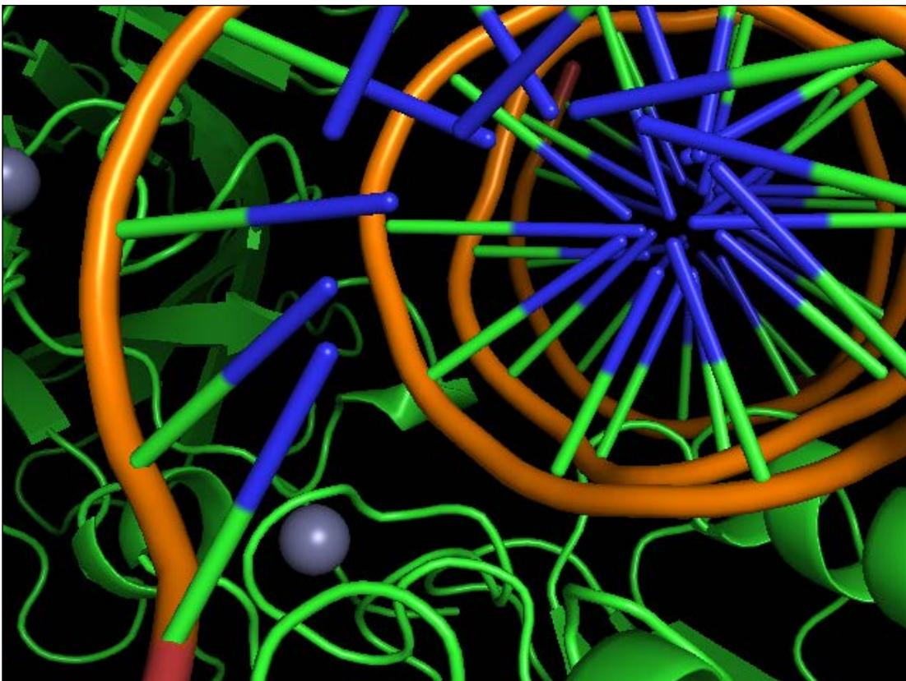
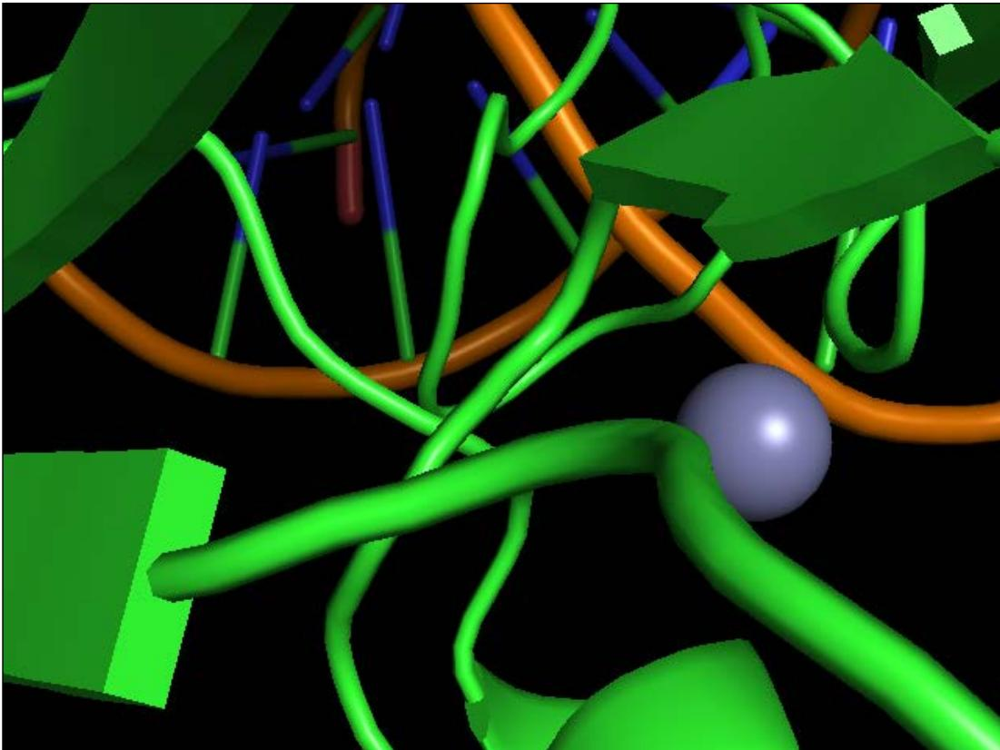
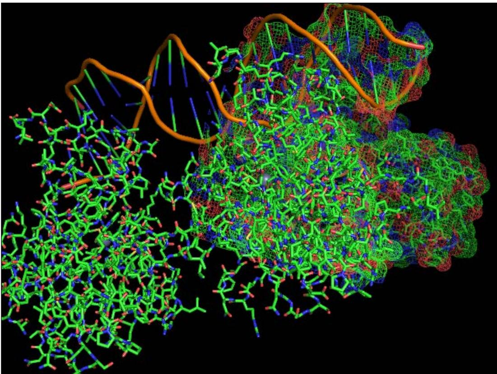

# Using the Protein Data Bank

In this chapter, we will cover the following recipes: 

Finding a protein in multiple databases 

f Introducing Bio.PDB 

f Extracting more information from a PDB file 

f Computing molecular distances on a PDB file 

f Performing geometric operations 

f Implementing a basic PDB parser 

f Animating with PyMol 

Parsing mmCIF files with Biopython 

## Introduction

Proteomics is the study of proteins that includes the protein function and structure. One of the main objectives of this field is to characterize the 3D structure of proteins. One of the most widely known computational resource in the Proteomics field is the Protein Data Bank, a repository with structural data of large biomolecules. Of course, there are also many databases that focus instead on protein primary structure; these are somewhat similar to genomic databases that we have seen in Chapter 2, Next-generation Sequencing. 

Using the Protein Data Bank 

In this chapter, we will mostly focus on processing data from the PDB. We will see how to parse PDB files, perform some geometric computations, and visualize molecules. We will use the old PDB file format because conceptually, it allows you to perform most necessary operations in a stable environment. Having said that, the newer mmCIF—slated to replace the PDB format—will also be presented in a later recipe. We will use Biopython and introduce PyMol for visualization. We will not discuss molecular docking here because this is probably more suitable a chemoinformatics book. 

Throughout this chapter, we will use a classic example of a protein: Tumor protein p53, a protein involved in the regulation of the cell cycle (for example, apoptosis). This protein is highly related to cancer. There is plenty of information available about this protein on the Web. 

Let's start with something that you should be more familiar with right now: accessing databases, especially for the protein primary structure (sequences of amino acids). 

## Finding a protein in multiple databases

Before we start performing some more structural biology, we will see how to access existing proteomic databases such as UniProt. We will query UniProt for our gene of interest: TP53 and take it from there. 

## Getting ready

To access data, we will use Biopython and the REST API (we used a similar approach in Chapter 3, Working with Genomes) with the requests library to access web APIs. The requests API is an easy-to-use wrapper for web requests that can be installed using standard Python mechanisms (for example, pip and conda). 

You can find this content in the 06_Prot/Intro.ipynb notebook. 

## How to do it...

Take a look at the following steps: 

1. First, let's define a function to perform REST queries on UniProt as follows: 

```python
import requests
server = 'http://www.uniprot.org/uniprot'
def do_request(server, ID='', **kwargs):
    params = ''
    req = requests.get('%s/%s%s' % (server, ID, params), params=kwargs) 
```

```python
if not req.ok:
    req.raise_for_status()
return req 
```

Chapter 7 

‰ This is a simple function to perform REST queries. You may ask why are we not using the Biopython interface for this? Well, the current version of Biopython still refers to old ExPASy URLs, which do not work anymore because they have changed to UniProt. So, at this moment, this functionality is broken in Biopython 1.64. This is the consequence of Bioinformatics being a fast-moving, nonstable field, where sometimes software libraries do not keep up with changes in services. 

2. We can now query all p53 genes that have been reviewed: 

```txt
req = do_request(server, query='gene:p53 AND reviewed:yes', format='tab', columns='id,entry name,length,organism,organism-id,database(PDB),database(HGNC)', limit='50') 
```

‰ We will query the p53 gene and request all entries that are reviewed (manually curated). The output will be in a tabular format. Probably, this is easiest to process. We request a maximum of 50 results, specifying the desired columns (for the complete list, refer to the following links). 

‰ We could have restricted the output to just human data, but for this example, let's include all available species. 

## 3. Let's check the result as follows:

```txt
import pandas as pd
import StringIO 
```

```python
uniprot_list = pd.read_table(StringIO.StringIO(req.text))
uniprot_list.rename(columns={'Organism ID': 'ID'}, inplace=True)
print(uniprot_list) # or just uniprot_list on IPython 
```

Using the Protein Data Bank 


‰ We will use pandas for easy processing of a tab-delimited list and pretty printing. The output of the IPython Notebook is as follows:


<table><tr><td></td><td>Entry</td><td>Entry name</td><td>Length</td><td>Organism</td><td>ID</td><td>Cross-reference (PDB)</td><td>Cross-reference (HGNC)</td></tr><tr><td>0</td><td>Q9W678</td><td>P53_BARBU</td><td>369</td><td>Barbus barbus (Barbel) (Cyprinus barbus)</td><td>40830</td><td>NaN</td><td>NaN</td></tr><tr><td>1</td><td>Q29537</td><td>P53_CANFA</td><td>381</td><td>Canis familiaris (Dog) (Canis lupus familiaris)</td><td>9615</td><td>NaN</td><td>NaN</td></tr><tr><td>2</td><td>O09185</td><td>P53_CRIGR</td><td>393</td><td>Cricetulus griseus (Chinese hamster) (Cricetul...</td><td>10029</td><td>NaN</td><td>NaN</td></tr><tr><td>3</td><td>Q8SPZ3</td><td>P53_DELLE</td><td>387</td><td>Delphinapterus leucas (Beluga whale)</td><td>9749</td><td>NaN</td><td>NaN</td></tr><tr><td>4</td><td>P79892</td><td>P53_HORSE</td><td>280</td><td>Equus caballus (Horse)</td><td>9796</td><td>NaN</td><td>NaN</td></tr><tr><td>5</td><td>P04637</td><td>P53_HUMAN</td><td>393</td><td>Homo sapiens (Human)</td><td>9606</td><td>1A1U;1AIE;1C26;1DT7;1GZH;1H26;1HS5;1JSP;1KZY;1...</td><td>11998;</td></tr><tr><td>6</td><td>O93379</td><td>P53_ICTPU</td><td>376</td><td>Ictalurus punctatus (Channel catfish) (Silurus...</td><td>7998</td><td>NaN</td><td>NaN</td></tr><tr><td>7</td><td>P56423</td><td>P53_MACFA</td><td>393</td><td>Macaca fascicularis (Crab-eating macaque) (Cyn...</td><td>9541</td><td>NaN</td><td>NaN</td></tr><tr><td>8</td><td>P61260</td><td>P53_MACFU</td><td>393</td><td>Macaca fuscata fuscata (Japanese macaque)</td><td>9543</td><td>NaN</td><td>NaN</td></tr><tr><td>9</td><td>P56424</td><td>P53_MACMU</td><td>393</td><td>Macaca mulatta (Rhesus macaque)</td><td>9544</td><td>NaN</td><td>NaN</td></tr><tr><td>10</td><td>P02340</td><td>P53_MOUSE</td><td>387</td><td>Mus musculus (Mouse)</td><td>10090</td><td>1HU8;2GEQ;2IOI;2IOM;2IOO;2P52;3EXJ;3EXL;</td><td>NaN</td></tr><tr><td>11</td><td>P25035</td><td>P53_ONCMY</td><td>396</td><td>Oncorhynchus mykiss (Rainbow trout) (Salmo gai...</td><td>8022</td><td>NaN</td><td>NaN</td></tr></table>

4. Now, we can get the human p53 ID and use Biopython to retrieve and parse the SwissProt record: 

```python
from Bio import ExPASy, SwissProt
p53_human = uniprot_list[uniprot_list.ID == 9606]['Entry'].tolist() [0]
handle = ExPASy.get_sprot_raw(p53_human)
sp_rec = SwissProt.read(handle) 
```

‰ Note that at this time, Biopython is up to date in terms of URLs to fetch a record (the ExPASy.get_sprot_raw call). 

‰ We then use Biopython's SwissProt module to parse the record. 

‰ 9606 is the NCBI taxonomic code for humans. 

As usual, if you get an error with network services, it may be a network or server problem. If this is the case, just retry at a later date. 

```txt
Free ebooks ==> www.ebook777.com 
```

5. Let's take a look at the p53 record as follows: 

Chapter 7 

```lua
print(sp_rec.entry_name, sp_rec.sequence_length, sp_rec.gene_name)
print(sp_rec.description)
print(sp_rec.organism, sp_rec.seqinfo)
print(sp_rec.sequence) 
```

```txt
('P53_HUMAN', 393, 'Name=TP53; Synonyms=P53;')
RecName: Full=Cellular tumor antigen p53; AltName: Full=Antigen NY-CO-13; AltName: Full=Phosphoprotein p53; AltName: Full=Tumor suppressor p53;
('Homo sapiens (Human).' (393, 43653, 'AD5C149FD8106131'))
MEEQPQDSPSEVPEPLSQETFSDLKLLPENNVLSPLPSQAMDDLMSLSPDIEQWFTEDPGPDEAPRMPEAAPPVAPAPAAPTPAAPAPAPSWPLSSSVPSQKTYQGSYGFRLGFLHSGTAKSVTCTYSPALN
MKFCQLAKTPCVQLVWDSTPPPGTRVRAMAIYKQSQHMTEVVRRCPHERCSDSDGLAPPQHLIRVEGNLRVEYLDDRNTFRHSVVVPYEPPEVGSDCTIHHYNYMCNSSCMGGMNRRPILTIITLEDSSG
NLLGRNSFEVRVCAPGDRRTRTEEENLRKKGEPHHELPPGSTKRALPNNTSSSPQKKKKPLDGEYFTLQIRGERFEMFRELNEALELKDAQAGKEPGGSRAHSSHLKSKKGQSTSRHKKLMFKTEGPDSD 
```

6. A deeper look at the preceding record reveals a lot of really interesting information, especially on features, Gene Ontology (GO), and database cross-references: 

```python
from collections import defaultdict
done_features = set()
print(len(sp_rec.features))
for feature in sp_rec.features:
    if feature[0] in done_features:
    continue
    else:
    done_features.add(feature[0])
    print(feature)
print(len(sp_rec.cross_references))
per_source = defaultdict(list)
for xref in sp_rec.cross_references:
    source = xref[0]
    per_source[source].append(xref[1:])
print(per_source.keys())
done_GOs = set()
print(len(per_source['GO'])) 
for annot in per_source['GO']:
    if annot[1][0] in done_GOs:
    continue
    else:
    done_GOs.add(annot[1][0])
    print(annot) 
```

Note that we are not even printing the whole information here, just a summary of it. We print a number of features on the sequence with one example per type, a number of external database references plus databases that are referred, and a number of GO entries along with three examples. Currently, there are 1493 features, 604 external references, and 133 GO terms just for this protein: 

```csv
1493
('CHAIN', 1, 393, 'Cellular tumor antigen p53.', 'PRO_0000185703')
('DNA_BIND', 102, 292, '', ''')
('REGION', 1, 83, 'Interaction with HRMT1L2.', ''')
('MOTIF', 17, 25, 'TADI.', ''')
('METAL', 176, 176, 'Zinc.', ''')
('SITE', 120, 120, 'Interaction with DNA.', ''')
('MOD_RES', 9, 9, 'Phosphoserine; by HIPK4. {ECO:0000269|PubMed:18022393}.', ''')
('CROSSLNK', 291, 291, 'Glycyl lysine isopeptide (Lys-Gly) (interchain with G-Cter in ubiquitin). {ECO:0000269|PubMed:19536131}.', ''')
('VAR_SEQ', 1, 132, 'Missing (in isoform 7, isoform 8 and isoform 9). {ECO:0000303|PubMed:16131611}.', 'VSP_040833')
('VARIANT', 5, 5, 'Q -> H (in a sporadic cancer; somatic mutation; abolishes strongly phosphorylation).', 'VAR_044543')
('MUTAGEN', 15, 15, 'S->A: Loss of interaction with PPP2R5C, PPP2CA AND PPP2R1A. {ECO:0000269|PubMed:17967874}.', ''')
('HELIX', 19, 23, '{ECO:0000244|PDB:3DAC}.', ''')
('STRAND', 27, 29, '{ECO:0000244|PDB:2K8F}.', ''')
('TURN', 105, 108, '{ECO:0000244|PDB:3D06}.', ''')
604
['GeneReviews', 'DNASU', 'MIM', 'SUPFAM', 'Genevestigator', 'HOVERGEN', 'ExpressionAtlas', 'MaxQB', 'Genewiki', 'SMR', 'Orphanet', 'CTD', 'GO', 'PhylomeDB', 'CCDS', 'neXtProt', 'BindingDB', 'RefSeq', 'PRIDE', 'DMDM', 'Reactome', 'PROSITE', 'TreeFam', 'SWISS-2DPA GE', 'NextBio', 'DIP', 'PRO', 'PANTHER', 'TCDB', 'Gene3D', 'DrugBank', 'PMAP-CutDB', 'Bgee', 'EvolutionaryTrace', 'ChEMBL', 'PIR', 'InParanoid', 'GeneCards', 'Pfam', 'PDBsum', 'KEGG', 'eggNOG', 'EMBL', 'PaxDb', 'DisProt', 'Proteomes', 'ProteinModelPortal', 'Ense mbI', 'ChiTaRS', 'SignaLink', 'HPA', 'IntAct', 'MINT', 'PDB', 'UniGene', 'OMA', 'InterPro', 'PharmGKB', 'PhosphoSite', 'GenomeRNAi' ', 'KO', 'BioGrid', 'UCSC', 'HGNC', 'PRINTS', 'GeneTree', 'GeneID']
133
('GO:0000785', 'C:chromatin', 'IBA:GO_Central')
('GO:0005524', 'F:ATP binding', 'IDA:UniProtKB')
('GO:0006915', 'P:apoptotic process', 'TAS:Reactome') 
```

## There's more...

There are many more databases with information on proteins, some of these are referred in the preceding record; you can explore its result to try to find data elsewhere. 

For detailed information about UniProt's REST interface, refer to http://www.uniprot. org/help/programmatic_access. 

## Introducing Bio.PDB

Here, we will introduce Biopython's PDB module to deal with the Protein Data Bank. We wil use three models that represent part of the p53 protein. You can read more about these files and p53 at http://www.rcsb.org/pdb/101/motm.do?momID=31. 

## Getting ready

You should be aware of the basic PDB data model of Model/Chain/Residue/Atom objects. A good explanation on Biopython's Structural Bioinformatics FAQ can be found at http://biopython.org/wiki/The_Biopython_Structural_Bioinformatics_FAQ. 

You can find this content in the 06_Prot/PDB.ipynb notebook. 

```txt
Free ebooks ==> www.ebook777.com 
```

Chapter 7 

Of the three models that we will download, the 1TUP model will be used in the remaining recipes. Take some time to study this model as it will help you later on. 

## How to do it...

Take a look at the following steps: 

1. First, let's retrieve our models of interest as follows: 

```python
from _future_ import print_function
from Bio import PDB
repository = PDB.PDBList()
repository.retrieve_pdb_file('1TUP', pdir='.')
repository.retrieve_pdb_file('10LG', pdir='教练')
repository.retrieve_pdb_file('1YCQ', pdir='教练')
```

Note that Bio.PDB can take care of downloading files for you. Moreover, these download will only occur if no local copy is already present. 

2. Let's parse our records, as shown in the following code: 

```python
parser = PDB.PDBParser()
p53_1tup = parser.get_structure('P 53 - DNA Binding', 'pdb1tup.ent')
p53_1olg = parser.get_structure('P 53 - Tetramerization', 'pdb1olg.ent')
p53_1ycq = parser.get_structure('P 53 - Transactivation', 'pdb1ycq.ent') 
```

You may get some warnings about the content of the file. These are usually not problematic. 

3. Let's inspect our headers as follows: 

```python
def print_pdb_headers(headers, indent=0):
    ind_text = ' ' * indent
    for header, content in headers.items():
    if type(content) == dict:
    print('\n%s%20s:' % (ind_text, header))
    print_pdb_headers(content, indent + 4)
    print()
    elif type(content) == list:
    print('%s%20s:' % (ind_text, header))
    for elem in content:
    print('%s%21s %s' % (ind_text, '->', elem))
    else:
    print('%s%20s: %s' % (ind_text, header, content))

print_pdb_headers(p53_1tup.header) 
```

Headers are parsed as a dictionary of dictionaries. As such, we will use a recursive function to parse them. This function will increase indentation for ease of reading, and annotate lists of elements with the → prefix. For more details on recursive functions, refer to the previous chapter. Part of the output is as follows: 

```yaml
structure_method: x-ray diffraction
    head: antitumor protein/dna
    journal: AUTH Y. Cho, S. Gorina, P. D. JEFFREY, N. P. PAVLETICHTITL CRYSTAL STRUCTURE OF A P53 TUMOR SUPPRESSOR-DNATITL 2 C
OMPLEX: UNDERSTANDING TUMORIGENIC MUTATIONS. REF SCIENCE V. 265 346 1994REFN ISSN 0036-
8075PMID 8023157
journal_reference: y. cho, s. gorina, p. d. jeffrey, n. p. pavletich crystal structure of a p53 tumor suppressor-dna complex: understanding tumorigenic mutations. science v. 265 346 1994 issn 0036-8075 8023157
compound:
    1:
    molecule: dna (5'-d(*tp*tp*tp*cp*cp*tp*ap*gp*ap*cp*tp*tp*gp*cp*cp*cp*a p*ap*tp*tp*a)-3')
    misc:
    engineered: yes
    chain: e

    3:
    molecule: protein (p53 tumor suppressor )
    misc:
    engineered: yes
    chain: a, b, c

    2:
    molecule: dna (5'-d(*ap*tp*ap*ap*tp*tp*gp*gp*cp*ap*ap*gp*tp*cp*tp*a p*gp*gp*ap*a)-3')
    misc:
    engineered: yes
    chain: f

keywords: antigen p53, antitumor protein/dna complex
    name: tumor suppressor p53 complexed with dna
    author: Y. Cho, S. Gorina, P. D. Jeffrey, N. P. Pavletich
deposition_date: 1995-07-11
release_date: 1995-07-11 
```

4. We want to know the content of each chain on these files; for this, let's take a look at the COMPND records: 

```python
print(p53_1tup.header['compound'])
print(p53_1olg.header['compound'])
print(p53_1ycq.header['compound']) 
```

‰ This will return all compound headers printed in the preceding code. Unfortunately, this is not the best way to get information on chains. An alternative will be to get DBREF records, but Biopython's parser is currently not able to access these. We will have a recipe to deal with this, but for now, this is what the parser can do. 

‰ Having said that, using a tool like grep will easily extract this information. 

‰ Note that for 1TUP, chains A, B, and C chains are from the protein, and E and F chains are from the DNA. This information will be useful in the future. 

```txt
Free ebooks ==> www.ebook777.com 
```

```txt
Chapter 7 
```

```txt
5. Let's do a top-down analysis of each PDB file. For now, let's just get all chains, the number of residues, and atoms per chain as follows:
    def describe_model(name, pdb):
    print()
    for model in pdb:
    for chain in model:
    print('%s - Chain: %s. Number of residues: %d.
    Number of atoms: %d.' % (name, chain.id, len(chain), len(list(chain.get_atoms())))
    describe_model('1TUP', p53_1tup)
    describe_model('1OLG', p53_1olg)
    describe_model('1YCQ', p53_1ycq)
    □ We will perform a bottom-up approach in a later recipe. Here is the output for 1TUP:
    1TUP - Chain: E. Number of residues: 43. Number of atoms: 442.
    1TUP - Chain: F. Number of residues: 35. Number of atoms: 449.
    1TUP - Chain: A. Number of residues: 395. Number of atoms: 1734.
    1TUP - Chain: B. Number of residues: 265. Number of atoms: 1593.
    1TUP - Chain: C. Number of residues: 276. Number of atoms: 1610. 
```

## 6. Let's get all nonstandard residues (HETATM) with the exception of water in the 1TUP model, as shown in the following code:

```python
for residue in p53_1tup.get_residues():
    if residue.id[0] in [' ', 'W']:
    continue
    print(residue.id) 
```

‰ We have three zincs, one on each of the protein chains. 

## 7. Let's take a look at a residue:

```python
res = next(p53_1tup[0]['A'].get_residues())
print(res)
for atom in res:
    print(atom, atom.serial_number, atom.element)
p53_1tup[0]['A'][94]['CA'] 
```

```txt
Free ebooks ==> www.ebook777.com 
```

Using the Protein Data Bank 

‰ This will print all atoms on a certain residue: 

```xml
<Residue SER het= resseq=94 icode= >
<Atom N> 858 N
<Atom CA> 859 C
<Atom C> 860 C
<Atom O> 861 O
<Atom CB> 862 C
<Atom OG> 863 O
<Atom CA> 
```

‰ Note the last statement. It is there just to show that you can directly access an atom by resolving model, chain, residue, and finally the atom. 

## 8. Finally, let's export the protein fragment to a FASTA file as follows:

```python
from Bio.SeqIO import PdbIO, FastaIO 
```

```python
def get_fasta(pdb_file, fasta_file, transfer_ids=None):
    fasta_writer = FastaIO.FastaWriter(fasta_file)
    fasta_writer.write_header()
    for rec in PdbIO.PdbSeqresIterator(pdb_file):
    if len(rec.seq) == 0:
    continue
    if transfer_ids is not None and rec.id not in \
    transfer_ids:
    continue
    print(rec.id, rec.seq, len(rec.seq))
    fasta_writer.write_record(rec)

get_fasta(open('pdb1tup.ent'), open('1tup.fasta', 'w'),
    transfer_ids=['1TUP:B'])
get_fasta(open('pdb1olg.ent'), open('1olg.fasta', 'w'),
    transfer_ids=['1OLG:B'])
get_fasta(open('pdblycq.ent'), open('lycq.fasta', 'w'),
    transfer_ids=['1YCQ:B']) 
```

‰ If you inspect the protein chain, you will see that they are equal in each model, so we export a single one. In the case of 1YCQ, we export the smallest one because the biggest one is not p53-related. 

‰ As you can see, here we are using Bio.SeqIO, not Bio.PDB. 

## There's more...

The PDB parser is incomplete. It's not very likely that a complete parser will be seen soon as the community migrates to the mmCIF format. However, if you need to parse a PDB file, refer to the parsing recipe in this chapter. 

196 

## www.ebook777.comwww.it-ebooks.info

```txt
Free ebooks ==> www.ebook777.com 
```

Chapter 7 

Although the future is the mmCIF format (http://mmcif.wwpdb.org/), PDB files are still around. Conceptually, many operations are similar after you have parsed the file. 

If you are on Python 3, I suggest you take a look at PyProt at https://github.com/ rasbt/pyprot. 

## Extracting more information from a PDB file

Here, we will continue our exploration of the record structure produced by Bio.PDB from PDB files. 

## Getting ready

For general information about the PDB models that we are using, refer to the previous recipe. 

You can find this content in the 06_Prot/Stats.ipynb notebook. 

## How to do it...

Take a look at the following steps: 

```python
1. First, let's retrieve 1TUP as follows:
    from __future__ import print_function
    from Bio import PDB
    repository = PDB.PDBList()
    parser = PDB.PDBParser()
    repository.retrieve_pdb_file('1TUP', pdir='.')
    p53_1tup = parser.get_structure('P 53', 'pdb1tup.ent')

2. Then, extract some atom-related statistics:
    from collections import defaultdict
    atom_cnt = defaultdict(int)
    atom_chain = defaultdict(int)
    atom_res_types = defaultdict(int)

    for atom in p53_1tup.get_atoms():
    my_residue = atom.parent
    my_chain = my_residue.parent
    atom_chain[my_chain.id] += 1
    if my_residue.resname != 'HOH':
    atom_cnt[atom.element] += 1
    atom_res_types[my_residue.resname] += 1 
```

```txt
Free ebooks ==> www.ebook777.com 
```

Using the Protein Data Bank 

```txt
print(dict(atom_res_types))
print(dict(atom_chain))
print(dict(atom_cnt)) 
```

‰ This will print information on the atom's residue type, number of atoms per chain, and quantity per element, as shown in the following screenshot: 

```jsonl
{'ILE': 144, 'GLN': 189, 'ZN': 3, 'THR': 294, 'HOH': 384, 'GLY': 156, 'ASP': 192, 'PHE': 165, 'TRP': 42, 'GLU': 297, 'CYS': 180, 'HIS': 210, 'SER': 323, 'LYS': 135, 'DG': 176, 'PRO': 294, 'DC': 152, 'DA': 270, 'ALA': 105, 'MET': 144, 'LEU': 336, 'ARG': 561, 'DT': 257, 'VAL': 315, 'ASN': 216, 'TYR': 288}
{'A': 1734, 'C': 1610, 'B': 1593, 'E': 442, 'F': 449}
{'P': 40, 'ZN': 3, 'S': 48, 'C': 3238, 'O': 1114, 'N': 1001} 
```

‰ Note that the preceding number of residues is not the proper number of residues, but the amount of times that a certain residue type is referred (it adds up to the number of atoms, not residues). 

Note the water (W), nucleotide (DA, DC, DG, and DT), and Zinc (ZN) residues which add to the amino acid ones. 

3. Now, let's now count the instances per residue and the number of residues per chain: 

```python
res_types = defaultdict(int)
res_per_chain = defaultdict(int)
for residue in p53_1tup.get_residues():
    res_types[residue.resname] += 1
    res_per_chain[residue.parent.id] += 1
print(dict(res_types))
print(dict(res_per_chain)) 
```

```txt
{'ILE': 18, 'GLN': 21, 'ZN': 3, 'THR': 42, 'HOH': 384, 'GLY': 39, 'ASP': 24, 'PHE': 15, 'TRP': 3, 'GLU': 33, 'CYS': 30, 'HIS': 21, 'SER': 54, 'LYS': 15, 'DG': 8, 'PRO': 42, 'DC': 8, 'DA': 13, 'ALA': 21, 'MET': 18, 'LEU': 42, 'ARG': 51, 'DT': 13, 'VAL': 45, 'ASN': 27, 'TYR': 24}
{'A': 395, 'C': 276, 'B': 265, 'E': 43, 'F': 35} 
```

4. We can also get the bounds of a set of atoms: 

```python
import sys
def get_bounds(my_atoms):
    my_min = [sys.maxint] * 3
    my_max = [-sys.maxint] * 3
    for atom in my_atoms:
    for i, coord in enumerate(atom coord):
    if coord < my_min[i]:
    my_min[i] = coord
    if coord > my_max[i]:
    my_max[i] = coord
    return my_min, my_max
chain_bounds = {} 
```

```python
for chain in p53_1tup.get_chains():
    print(chain.id, get_bounds(chain.get_atoms()))
    chain_bounds[chain.id] = get_bounds(chain.get_atoms())
print(get_bounds(p53_1tup.get_atoms())) 
```

Chapter 7 

‰ A set of atoms can be a whole model, a chain, a residue, or any subset you are interested in. In this case, we will print boundaries for all chains and the whole model. Numbers convey little intuition, so we get a little bit more graphical. 

‰ sys.maxint does not exist on Python 3; here, you may use sys.maxsize instead. 

5. To have a notion of the size of each chain, a plot is probably more informative than the numbers in the preceding code: 

```txt
046 059 123 178
050 062 179 200
051 064 180 219
052 066 181 229
053 068 182 239
054 070 183 249
055 072 184 259
056 074 185 269
057 076 186 279
058 078 187 289
059 080 188 299
060 082 189 309
061 084 190 319
062 086 191 329
063 088 192 339
064 090 193 349
065 092 194 359
066 094 195 369
067 096 196 379
068 098 197
070 100 198
071 102 199
072 104 200
073 106 201
074 108 202
075 110 203
076 112 204
077 114 205
078 116 206
079 118 207
080 120 208
081 122 209
082 124 210
083 126 211
084 128 212
085 130 213
086 132 214
087 134 215
088 136 216
089 138 217
090 140 218
091 142 219
092 144 220
093 146 221
094 148 222
095 150 223
096 152 224
097 154 225
098 156 226
099 158 227
100 160 228
101 162 229
102 164 230
103 166 231
104 168 232
105 170 233
106 172 234
107 174 235
108 176 236
109 178 237
110 180 238
111 182 239
112 184 240
113 186 241
114 188 242
115 190 243
116 192 244
117 194 245
118 196 246
119 198 247
120 200 248
121. 
```

Using the Protein Data Bank 

```python
ax_zy.scatter(zs, ys, marker='.', color=color[chain.id])
ax3d.set_xlabel('X')
ax3d.set_ylabel('Y')
ax3d.set_zlabel('Z')
ax3d.scatter(zx, zy, zz, color='k', marker='v', s=300)
ax_xy.scatter(zx, zy, color='k', marker='v', s=80)
ax_xz.scatter(zx, zz, color='k', marker='v', s=80)
ax_zy.scatter(zz, zy, color='k', marker='v', s=80)
for ax in [ax_xy, ax_xz, ax_zy]:
    ax.get_yaxis().set_visible(False)
    ax.get_xaxis().set_visible(False) 
```

‰ There are plenty of molecular visualization tools. Indeed, we will discuss PyMol later. However, matplotlib is enough for some simple visualization. The most important point about matplotlib is that it's stable and very easy to integrate into a reliable production code. 

In the preceding chart, we performed a 3D plot of chains, the DNA in gray, and the protein chains in different colors. 

‰ We also plot planar projections (X/Y, X/Z, and Z/Y) on the left-hand side in the following figure: 




Figure 1: The spatial distribution of the protein chains; the main figure is a 3D plot and the left subplots are planar views (X/Y, X/Z, and Z/Y)


Chapter 7 

## Computing molecular distances on a PDB file

Here, we will find atoms closer to three zincs on the 1TUP model. We will consider several distances to these zincs. We will take this opportunity to discuss the performance of algorithms. 

## Getting ready

You can find this content in the 06_Prot/Distance.ipynb notebook. Take a look at the Bio.PDB recipe. 

## How to do it...

Take a look at the following steps: 

1. Let's load our model as follows: 

```python
from _future_ import print_function
from Bio import PDB
repository = PDB.PDBList()
parser = PDB.PDBParser()
repository.retrieve_pdb_file('1TUP', pdir='.')
p53_1tup = parser.get_structure('P 53', 'pdb1tup.ent') 
```

2. We will now get our zincs against which we perform later comparisons: 

```python
zns = []
for atom in p53_1tup.get_atoms():
    if atom.element == 'ZN':
    zns.append(atom)
for zn in zns:
    print(zn, zn coord)
    □ You should see three zinc atoms. 
```

3. Then, let's define a function to get the distance between one atom and a set of other atoms as follows: 

```python
import math
def get_closest_atoms(pdb_struct, ref_atom, distance):
    atoms = {}
    rx, ry, rz = ref_atom coord
    for atom in pdb_struct.get_atoms():
    if atom == ref_atom:
    continue
    x, y, z = atom coord 
```

```txt
Free ebooks ==> www.ebook777.com 
```

Using the Protein Data Bank 

```python
my_dist = math.sqrt((x - rx)**2 + (y - ry)**2 + (z - rz)**2)
if my_dist < distance:
    atoms[atom] = my_dist
return atoms 
```

We get coordinates for our reference atom and then iterate over our desired comparison list. If an atom is close enough, it's added to the return list. 

4. Also, we now compute atoms near our zincs, which is up to 4 Ångström for our model: 

```python
for zn in zns:
    print()
    print(zn coord)
    atoms = get_closest_atoms(p53_1tup, zn, 4)
    for atom, distance in atoms.items():
    print(atom.element, distance, atom coord) 
```

‰ Here, we show the result for the first zinc, including the element, distance, and coordinates, as shown in the following screenshot: 

```txt
[58.10800171 23.24200058 57.42399979]
S 2.27892096249 [60.31700134 23.31800079 57.97900009]
C 2.92437196013 [56.99300003 23.94300079 54.81299973]
C 3.40801176963 [57.77000046 21.2140007 60.14199829]
S 2.32622437996 [57.06499863 21.45199966 58.48199844]
C 3.62725094648 [61.61000061 24.08699989 57.00099945]
C 3.85772919812 [61.14799881 25.06100082 55.89699936]
C 3.45665374923 [58.88600159 20.86700058 55.0359993]
C 3.08721447067 [57.20500183 25.09900093 59.71900177]
C 3.06412055976 [58.04700089 22.03800011 54.60699844]
S 2.22531584465 [56.91400146 25.05400085 57.91699982]
N 1.99182735373 [57.75500107 23.07299995 55.47100067] 
```

‰ We only have three zincs, so the number of computations is quite reduced, but now imagine that we had more or that we were doing a pairwise comparison among all atoms in the set (remember that the number of comparisons grow quadratically with the number of atoms in a pairwise case). Although our case is small, it's not difficult to forecast use cases with much more comparisons taking a lot of time. We will get back to this soon. 

5. Let's see how many atoms we get as we increase the distance: 

```python
for distance in [1, 2, 4, 8, 16, 32, 64, 128]:
    my_atoms = []
    for zn in zns:
    atoms = get_closest_atoms(p53_1tup, zn, distance)
    my_atoms.append(len(atoms))
    print(distance, my_atoms) 
```

```txt
Free ebooks ==> www.ebook777.com 
```

‰ The result is as follows: 

Chapter 7 

```csv
1 [0, 0, 0]
2 [1, 0, 0]
4 [11, 11, 12]
8 [109, 113, 106]
16 [523, 721, 487]
32 [2381, 3493, 2053]
64 [5800, 5827, 5501]
128 [5827, 5827, 5827] 
```

6. As we have seen before, this specific case is not very expensive, but let's time this anyway, as shown in the following code: 

```python
import timeit
nexecs = 10
print(timeit.timeit('get_closest_atoms(p53_1tup, zns[0], 4.0)',
    'from __main__ import
get_closest_atoms, p53_1tup, zns',
    number=nexecs) / nexecs * 1000) 
```

‰ Here, we will use the timeit module to execute this function 10 times and then print the result in milliseconds. We pass the function as a string and pass yet another string with the necessary imports to make this function work. If you are on the IPython Notebook, you are probably aware of the %timeit magic and how it makes your life much easier in this case. 

‰ This takes roughly 42 milliseconds on the machine where the code was tested. Obviously, on your computer, you will get somewhat different results. 

7. Can we do better? Let's consider a different distance function, as shown in the following code: 

```python
def get_closest_alternative(pdb_struct, ref_atom,
    distance):
    atoms = {}
    rx, ry, rz = ref_atom coord
    for atom in pdb_struct.get_atoms():
    if atom == ref_atom:
    continue
    x, y, z = atom coord
    if abs(x - rx) > distance or abs(y - ry) > distance \
    or abs(z - rz) > distance:
    continue
    my_dist = math.sqrt((x - rx)**2 + (y - ry)**2 + (z - rz)**2)
    if my_dist < distance:
    atoms[atom] = my_dist
    return atoms 
```

## Using the Protein Data Bank

So, we take the original function and add a very simplistic if with distances. The rationale for this is that the computational cost of the square root and may be the float power operation is very expensive, so we will try to avoid it. However, for all atoms that are closer than the target distance in any dimension, this function will be more expensive. 

## 8. Now, let's time against it:

```python
print(timeit.timeit('get_closest_alternative(p53_1tup, zns[0], 4.0)',
    'from __main__ import
get_closest_alternative, p53_1tup, zns',
    number=nexecs) / nexecs * 1000) 
```

口 On the same machine as the preceding example, we have 16 milliseconds,that is, roughly three times faster.

## 9. However, is it always better? Let's now compare the cost with different distances as follows:

```python
print('Standard')
for distance in [1, 4, 16, 64, 128]:
    print(timeit.timeit('get_closest_atoms(p53_1tup, zns[0], distance)',
    'from __main__ import get_closest_atoms, p53_1tup, zns, distance',
    number=nexecs) / nexecs * 1000)
print('Optimized')
for distance in [1, 4, 16, 64, 128]:
    print(timeit.timeit('get_closest_alternative(p53_1tup, zns[0], distance)',
    'from __main__ import get_closest_alternative, p53_1tup, zns, distance',
    number=nexecs) / nexecs * 1000) 
```

‰ The result is shown in the following screenshot: 

```csv
Standard
45.9681987762
45.431804657
43.1920051575
43.0327892303
42.4966812134
Optimized
14.5443201065
15.860414505
27.8204917908
65.1834011078
65.1820898056 
```

Chapter 7 

‰ Note that the cost of the standard version is mostly constant, whereas the optimized version varies with the distance to get the closest atoms; larger the distance, more cases will be computed using the extra if plus the square root, making the function more expensive. 

‰ The larger point here is that you can probably code functions that are more efficient using smart computation shortcuts, but the complexity cost may change qualitatively. In the preceding case, I suggest that the second function is more efficient for all realistic and interesting cases when you try to find the closest atoms. However, you have to be careful while designing your own versions of optimized algorithms. 

‰ We will revisit this subject in the very last chapter. 

## Performing geometric operations

We will now perform computations with geometry information, including computing the center of mass of chains and of whole models. 

## Getting ready

You can find this content in the 06_Prot/Mass.ipynb notebook. 

## How to do it...

Take a look at the following steps: 

```python
First, let's retrieve the data:
from __future__ import print_function
import numpy as np
from Bio import PDB
repository = PDB.PDBList()
parser = PDB.PDBParser()
repository.retrieve_pdb_file('1TUP', pdir='.')
p53_1tup = parser.get_structure('P 53', 'pdb1tup.ent') 
```

2. Then, remember the type of residues that we have with the following code: 

```python
my_residues = set()
for residue in p53_1tup.get_residues():
    my_residues.add(residue.id[0])
print(my_residues) 
```

‰ So, we have H_ ZN (zinc) and W (water) that are HETATMs and the vast majority that are standard PDB ATOMs. 

```txt
Free ebooks ==> www.ebook777.com 
```

Using the Protein Data Bank 

3. Let's compute the masses for all chains, zincs and waters using the following code: 

```python
def get_mass(atoms, accept_fun=lambda atom:
    atom.parent.id[0] != 'W'):
    return sum([atom.mass for atom in atoms if
    accept_fun(atom)])
chain_names = [chain.id for chain in p53_1tup.get_chains()]
my_mass = np.ndarray((len(chain_names), 3))
for i, chain in enumerate(p53_1tup.get_chains()):
    my_mass[i, 0] = get_mass(chain.get_atoms())
    my_mass[i, 1] = get_mass(chain.get_atoms(),
    accept_fun=lambda atom: atom.parent.id[0] not in [' ', 'W'])
    my_mass[i, 2] = get_mass(chain.get_atoms(),
    accept_fun=lambda atom: atom.parent.id[0] == 'W')
masses = pd.DataFrame(my_mass, index=chain_names,
    columns=['No Water','Zincs', 'Water'])
print(masses) # masses 
```

‰ The get_mass function returns the mass of all atoms in the list that pass an acceptance criterion function. The default acceptance criterion is not to be a water residue. 

‰ We then compute the mass for all chains. We have three versions: just amino acids, zincs, and waters. Zinc does nothing more than detecting a single atom per chain in this model. The output is as follows: 

<table><tr><td></td><td>No Water</td><td>Zlncs</td><td>Water</td></tr><tr><td>E</td><td>6068.04412</td><td>0.00</td><td>351.9868</td></tr><tr><td>F</td><td>6258.20442</td><td>0.00</td><td>223.9916</td></tr><tr><td>A</td><td>20548.26300</td><td>65.39</td><td>3167.8812</td></tr><tr><td>B</td><td>20368.18840</td><td>65.39</td><td>1119.9580</td></tr><tr><td>C</td><td>20466.22540</td><td>65.39</td><td>1279.9520</td></tr></table>

4. Let's compute the geometric center and center of mass of the model as follows: 

```python
def get_center(atoms, weight_fun=lambda atom: 1 if
    atom.parent.id[0] != 'W' else 0):
    xsum = ysum = zsum = 0.0
    acum = 0.0
    for atom in atoms:
    x, y, z = atom coord
    weight = weight_fun(atom)
    acum += weight 
```

```txt
Free ebooks ==> www.ebook777.com 
```

Chapter 7 

```python
xsum += weight * x
ysum += weight * y
zsum += weight * z
return xsum / acum, ysum / acum, zsum / acum

print(get_center(p53_1tup.get_atoms()))
print(get_center(p53_1tup.get_atoms(),
    weight_fun=lambda atom: atom.mass if
    atom.parent.id[0] != 'W' else 0)) 
```

‰ First, we define a weighted function to get coordinates of the center. The default function will treat all atoms as equal as long as they are not a water residue. 

‰ We then compute the geometric center and the center of mass by redefining the weight function with a value of each atom equal to its mass. The geometric center is computed irrespective of its molecular weights. 

‰ For example, you may want to compute the center of mass of the protein without DNA chains. 

5. Let's compute the center of mass and the geometric center of each chain as follows: 

```python
my_center = np.ndarray((len(chain_names), 6))
for i, chain in enumerate(p53_1tup.get_chains()):
    x, y, z = get_center(chain.get_atoms())
    my_center[i, 0] = x
    my_center[i, 1] = y
    my_center[i, 2] = z
    x, y, z = get_center(chain.get_atoms(), weight_fun=lambda)
    atom: atom.mass if atom.parent.id[0] != 'W' else 0)
    my_center[i, 3] = x
    my_center[i, 4] = y
    my_center[i, 5] = z
weights = pd.DataFrame(my_center, index=chain_names,
    columns=['X', 'Y', 'Z', 'X (Mass)', 'Y (Mass)', 'Z (Mass)'])
print(weights) # weights 
```

Using the Protein Data Bank 

The result is as shown here: 

<table><tr><td></td><td>X</td><td>Y</td><td>Z</td><td>X (Mass)</td><td>Y (Mass)</td><td>Z (Mass)</td></tr><tr><td>E</td><td>49.727231</td><td>32.744879</td><td>81.253417</td><td>49.708513</td><td>32.759725</td><td>81.207395</td></tr><tr><td>F</td><td>51.982368</td><td>33.843370</td><td>81.578795</td><td>52.002223</td><td>33.820064</td><td>81.624394</td></tr><tr><td>A</td><td>72.990763</td><td>28.825429</td><td>56.714012</td><td>72.822668</td><td>28.810327</td><td>56.716117</td></tr><tr><td>B</td><td>67.810026</td><td>12.624435</td><td>88.656590</td><td>67.729100</td><td>12.724130</td><td>88.545659</td></tr><tr><td>C</td><td>38.221565</td><td>-5.010494</td><td>88.293141</td><td>38.169364</td><td>-4.915395</td><td>88.166711</td></tr></table>

## There's more...

Although this is not a book based on the protein structure determination technique, remember that X-ray crystallography methods cannot detect hydrogens, so computing the mass of residues might be based on very inaccurate models; refer to http://www.umass. edu/microbio/chime/pe_beta/pe/protexpl/help_hyd.htm. 

## Implementing a basic PDB parser

As you know, by now the Bio.PDB parser is not complete. Here, we will develop a framework that allows you to parse other records on PDB files. Although we can expect a migration from PDB to the mmCIF format in the future, this is still useful in many situations. 

## Getting ready

In order to parse a format, we need its specification. You can find this at http://www. wwpdb.org/documentation/file-format.php. We will mostly be concerned with secondary structure records (HELIX and SHEET), but you will find more records in your scaffold parser. You can extend this scaffold to other records that you may need. 

You can find this content in the 06_Prot/Parser.ipynb notebook. 

## How to do it...

Take a look at the following steps: 

1. First, let's retrieve a file to work with. We will only retrieve, not parse as follows: 

from __future__ import print_function from Bio import PDB repository = PDB.PDBList() repository.retrieve_pdb_file('1TUP', pdir='.') 

Chapter 7 

```python
2. We will now devise a basic parsing framework that is capable of dealing with three types of records (on a single line, spanning multiple lines, and multiple records with the same name):
    rec_types = {
    #single line
    'HEADER': [(str, 11, 49), (str, 50, 58), (str, 62, 65)],
    #multi_line
    'SOURCE': [(int, 7, 9), (str, 10, 78)],
    #multi_rec
    'LINK': [(str, 12, 15), (str, 16, 16), (str, 17, 19), (str, 21, 21), (int, 22, 25),
    (str, 26, 26), (str, 42, 45), (str, 46, 46), (str, 47, 49), (str, 51, 51),
    (int, 52, 55), (str, 56, 56), (str, 59, 64), (str, 66, 71), (float, 73, 77)],
    'HELIX': [(int, 7, 9), (str, 11, 13), (str, 15, 17), (str, 19, 19), (int, 21, 24),
    (str, 25, 25), (str, 27, 29), (str, 31, 31),
    (int, 33, 36), (str, 37,37), (int, 38, 39), (str, 40, 69), (int, 71, 75)],
    'SHEET': [(int, 7, 9), (str, 11, 13), (int, 14, 15), (str, 17, 19), (str, 21, 21),
    (int, 22, 24), (str, 26, 26), (str, 28, 30),
    (str, 32, 32), (int, 33, 36), (str, 37, 37),
    (int, 38, 39), (str, 41, 44),
    (str, 45, 47), (str, 49, 49), (int, 50, 53),
    (str, 54, 54), (str, 56, 59),
    (str, 60, 62), (str, 64, 64), (int, 65, 68),
    (str, 69, 69)],
    }

    def parse_pdb(hdl):
    for line in hdl:
    line = line[:-1] # remove \n
    toks = []
    for section, elements in rec_types.items():
    if line.startswith(section):
    for fun, start, end in elements:
    try:
    toks.append(fun(line[start: end +1]))
    except ValueError: 
```

Using the Protein Data Bank 

```python
toks.append(None)
yield (section, toks)
if len(toks) == 0:
    yield ('UNKNOWN', line) 
```

‰ Without contest, this is the ugliest piece of code in this book. The PDB format uses fixed size fields (for a reference of all records, refer to the previous recipe), so when we want to parse a certain record type, we need to hard code the positions of various fields. Here, we also type fields between string, integer, and float. You can extend this list using records that you need to extract. 

‰ Finally, we have a function that will traverse the whole file as well, reporting unknown records with the complete line. 

3. Let's parse our file as the first pass (this PDB file is suffixed as .ent because of Biopython's download procedure; PDB files normally end in .pdb): 

```python
hdl = open('pdb1tup.ent')
done_rec = set()
for rec in parse_pdb(hdl):
    if rec[0] == 'UNKNOWN' or rec[0] in done_rec:
    continue
    print(rec)
    done_rec.add(rec[0]) 
```

‰ We print the first instance of each record type and the output is shown in the following screenshot: 

```txt
('HEADER', ['NTITUMOR PROTEIN/DNA ', '11-JUL-95', '1TUP'])
('SOURCE', [None, 'MOL_ID: 1; ', ' ]) ('HELIX', [1, ' 1', 'SER', 'A', 166, ' ', 'HIS', 'A', 168, ' ', 5, '
('SHEET', [1, ' A', 4, 'ARG', 'A', 11, ' ', 'GLY', 'A', 112, ' ', 0, ', ', ', ', ', None, ' ', ', ', ', ', ', None, ' ' ])
('LINK', ['ZN ', ' ', ' ZN', 'A', 951, ' ', ' SG ', ' ', 'CYS', 'A', 176, ' ', ' 1555', ' 1555', 2.33]) 
```

4. Let's now join records that span multiple lines using the following code: 

```python
multi_lines = ['SOURCE']

#assume multi is just a string
def process_multi_lines(hdl):
    current_multi = ''
    current_multi_name = None
    for rec_type, toks in parse_pdb(hdl):
    if current_multi_name is not None and current_multi_name \
    != rec_type:
    yield current_multi_name, [current_multi]
    current_multi = ''
    current_multi_name = None 
```

## www.ebook777.comwww.it-ebooks.info

```txt
Free ebooks ==> www.ebook777.com 
```

Chapter 7 

```python
if rec_type in multi_lines:
    current_multi += toks[1].strip().rstrip() + ' '
    current_multi_name = rec_type
else:
    if len(current_multi) != 0:
    yield current_multi_name, [current_multi]
    current_multi = ''
    current_multi_name = None
    yield rec_type, toks
if len(current_multi) != 0:
    yield current_multi_name, [current_multi] 
```

‰ Here, we declare the SOURCE record as multiline. Our code will get all SOURCE lines and join them in a single string (for now, we assume that it's all a simple unstructured string). 

‰ Of course, you can add more record types. 

5. Again, we process using our example PDB file: 

```python
hdl = open('pdb1tup.ent')
done_rec = set()
for rec in process_multi_lines(hdl):
    if rec[0] == 'UNKNOWN' or rec[0] in done_rec:
    continue
    print(rec)
    done_rec.add(rec[0]) 
```

‰ The source is now a single entry, as shown in the following screenshot: 

```txt
('HEADER', ['NTITUMOR PROTEIN/DNA ', '11-JUL-95', '1TUP'])
('SOURCE', ['MOL_ID: 1; SYNTHETIC: YES; MOL_ID: 2; SYNTHETIC: YES; MOL_ID: 3; ORGANISM_SCIENTIFIC: HOMO SAPIENS; ORGANISM_COMMON: H UMAN; ORGANISM_TAXID: 9606; CELL_LINE: A431; CELL: HUMAN VULVA CARCINOMA; EXPRESSION_SYSTEM: ESCHERICHIA COLI; EXPRESSION_SYSTEM_TA XID: 562; EXPRESSION_SYSTEM_PLASMID: PET3D '])
('HELIX', [1, ' 1', 'SER', 'A', 166, '', 'HIS', 'A', 168, '', 5, ', ' , 3])
('SHEET', [1, ' A', 4, 'ARG', 'A', 11, '', 'GLY', 'A', 112, '', 0, '', '', '', None, '', '', '', Nonne, ' '] ) 
```

6. Finally, let's deal with more structured types. In this case, the content of SOURCE is known to be a specification list, as shown in the following code: 

```python
def get_spec_list(my_str):
    #ignoring escape characters
    spec_list = {}
    elems = my_str.strip().strip().split';')
    for elem in elems:
    toks = elem.split(':')
    spec_list[toks[0].strip()] = toks[1].strip() 
```

211 

www.ebook777.comwww.it-ebooks.info 

```txt
Free ebooks ==> www.ebook777.com 
```

Using the Protein Data Bank 

```python
return spec_list

struct_types = {
    'SOURCE': [get_spec_list]
}

def process_struct_types(hdl):
    for rec_type, toks in process_multi_lines(hdl):
    if rec_type in struct_types.keys():
    funs = struct_types[rec_type]
    struct_toks = []
    for tok, fun in zip(toks, funs):
    struct_toks.append(fun(tok))
    yield rec_type, struct_toks
    else:
    yield rec_type, toks 
```

This will parse a specification list. Refer to the preceding SOURCE output to get an idea of the content or the PDB specification: 

## 7. Use the preceding code on our example PDB:

```python
PDB:hdl = open('pdb1tup.ent'):
for rec in process_struct_types(hdl):
    if rec[0] != 'SOURCE':
    continue
    print(rec) 
```

‰ The SOURCE is converted to an easy-to-process dictionary: 

```python
{'SOURCE', [{'SYNTHETIC': 'YES', 'MOL_ID': '3', 'EXPRESSION_SYSTEM': 'ESCHERICHIA COLI', 'EXPRESSION_SYSTEM_TAXID': '562', 'ORGANISM_ScientIFIC': 'HOMO SAPIENS', 'CELL': 'HUMAN VULVA CARCINOMA', 'EXPRESSION_SYSTEM_PLASMID': 'PET3D', 'CELL_LINE': 'A431', 'ORGANISM_TAXID': '9606', 'ORGANISM_COMMON': 'HUMAN'}] 
```

## There's more...

This framework will help you parse a PDB file on Python should you need it. You should not be afraid of the format as it's of fixed length and simple to process. A poor man's parser can be something as simple as grep, in many cases, may work. 

## Animating with PyMol

Here, we will create a video of the p53 1TUP model. We will start our animation by going around the p53 1TUP model and then zooming in; as we zoom in, we change the render strategy so that you can see what is deep in the model. You can find the YouTube version of the video that you will generate at https://www.youtube.com/watch?v=CuEP40Id9O8. 

212 

## www.ebook777.comwww.it-ebooks.info

Chapter 7 

## Getting ready

This is the first case in which there is no IPython Notebook. Integration into IPython Notebook is not a problem, but as we will use Anaconda as a backend and PyMol does not play very well out of the box, we will use standard Python here. Assuming that you are using the Anaconda Python, if something does not work, I suggest you revert to the standard Python. 

You will need to install PyMol (http://www.pymol.org); note that there is a free version as well. On Debian/Ubuntu/Linux, you can apt-get install pymol. 

PyMol is more an interactive program than a Python library, so I strongly encourage you to play with it before moving on to the recipe. This can be fun! 

The code for this recipe is available on the GitHub repository as a script (not as a notebook) along with chapter notebooks at notebooks/06_Prot. We will use the PyMol_Movie.py file. 

## How to do it...

Take a look at the following steps: 

1. Let's initialize and retrieve our PDB model and prepare the rendering as follows: 

```python
import pymol
from pymol import cmd
#pymol.pymol_argv = ['pymol', '-qc'] # Quiet / no GUI
pymol.finish_launching()

cmd.fetch('1TUP', async=False)

cmd.disable('all')
cmd.enable('1TUP')
cmd.hide('all')
cmd.show('sphere', 'name zn') 
```

‰ Note that the pymol_argv line makes the code silent. In your first executions, you may want to comment this out and see the user interface. For movie rendering, this will come in handy (as we will see soon). 

‰ As a library, PyMol is quite tricky to use. For instance, after the import, you have to call finish_launching. 

‰ We then fetch our PDB file. 

‰ What then follows is a set of PyMol commands. Many web guides for interactive usage can be quite useful to understand what is going on. Here, we will enable all model for viewing purposes, hiding all (because the default view is lines and this is not good enough), then making zincs visible as spheres. 

‰ At this stage, barring zincs, everything else is invisible. 

Using the Protein Data Bank 

## 2. In order to render our model, we will use three scenes as follows:

```txt
cmd.show('surface', 'chain A+B+C')
cmd.show('cartoon', 'chain E+F')
cmd.scene('S0', action='store', view=0, frame=0, animate=-1)
cmd.show('cartoon')
cmd.hide('surface')
cmd.scene('S1', action='store', view=0, frame=0, animate=-1)
cmd.hide('cartoon', 'chain A+B+C')
cmd.show('mesh', 'chain A')
cmd.show('sticks', 'chain A+B+C')
cmd.scene('S2', action='store', view=0, frame=0, animate=-1) 
```

‰ We need to define two scenes. One scene is for the time when we go around the protein (surface-based, thus opaque) and the other is for the time when we dive in (cartoon-based). The DNA is always a cartoon. 

‰ We also define a third scene for when we zoom out at the end. The protein will get rendered as sticks, and we add a mesh to chain A so that the relationship becomes clearer with the DNA. 

## 3. Let's define the basic parameter of our video as follows:

```python
cmd.set('ray_trace_frames', 0)
cmd.mset(1, 500) 
```

‰ We define the default ray tracing algorithm. This line does not need to be there, but try to increase the number to 1, 2, or 3 and be ready to wait a lot. 

‰ You can only use 0 if you have the OpenGL interface on (with the GUI), so, for this fast version, you will need to have the GUI on (the preceding pymol_ argv should be commented as it is). 

‰ We then inform PyMol that we will have 500 frames. 

Chapter 7 

4. In the first 150 frames, we move around using the initial scene. We go around the model a bit, and go near the DNA using the following code: 

cmd.mview() 

cmd.frame(90) 

cmd.set_view((-0.175534308, -0.331560850, -0.926960170, 0.541812420, 0.753615797, -0.372158051, 0.821965039, -0.567564785, 0.047358301, -0.000067875, 0.000017881, -249.615447998, 54.029174805, 26.956727982, 77.124832153, 196.801528931, 302.436492920, -20.000000000)) 

cmd.mview() 

cmd.frame(150) 

cmd.set_view((-0.175534308, -0.331560850, -0.926960170, 0.541812420, 0.753615797, -0.372158051, 0.821965039, -0.567564785, 0.047358301, -0.000067875, 0.000017881, -55.406421661, 54.029174805, 26.956727982, 77.124832153, 2.592475891, 108.227416992, -20.000000000)) 

cmd.mview() 

‰ We define three points; the first two align with the DNA and the last goes in. 

‰ The way to get coordinates (all these numbers) is to use PyMol in the interactive mode, navigate using the mouse and keyboard, and use the get_view command, which will return coordinates that you can cut and paste. 

Using the Protein Data Bank 

‰ The first frame is as follows: 




Figure 2: Frame 0 and scene S0


5. We now change the scene, in preparation to go inside the protein: cmd.frame(200) cmd.scene('S1') cmd.mview() 


‰ The following figure shows the current position:





Figure 3: Frame 200 near the DNA molecule and scene S1


## 6. We move inside the protein and change the scene at the end using the following code:

Using the Protein Data Bank 

‰ We are now full in, as shown in the following figure: 




Figure 4: Frame 350, scene S1 on the verge of changing to S2


7. Finally, we let PyMol return to its original position, play, save, and quit: cmd.frame(500) cmd.scene('S2') cmd.mview() cmd.mplay() cmd.mpng('p53_1tup') 

cmd.quit() 

‰ This will generate 500 PNG files with the p53_1tup prefix. 


‰ Here is a frame approaching the end (450):





Figure 5: Frame 450 and scene S2


## There's more...

The YouTube video was generated using Libav's avconv on Linux at 15 frames per second as follows: 

avconv -r 15 -f image2 -start_number 1 -i "p53_1tup%04d.png" \ example.mp4 

There are plenty of applications used to generate videos from images. PyMol can generate an MPEG, but this means we have to install extra libraries. 

```txt
Free ebooks ==> www.ebook777.com 
```

Using the Protein Data Bank 

PyMol was created to be used interactively from its console (which can be extended in Python). Using it the other way around (importing from Python with no GUI) can be complicated and frustrating; PyMol starts a separate thread to render images that works asynchronously. For example, this means that your code may be in a different position from where the renderer is. I have put another script called PyMol_Intro.py on the GitHub repository; you will see that the second PNG call will start before the first one has finished. Try the following code and see how you expect it to behave, and how it actually behaves. 

There is plenty of good documentation for PyMol from a GUI perspective at http://www. pymolwiki.org/index.php/MovieSchool. This is a great starting point if you want to make movies and http://www.pymolwiki.org is a treasure trove of information. 

## Parsing mmCIF files using Biopython

The mmCIF file format is probably the future. Biopython does not have yet full functionality to work with it, but we will take a look at what is here now. 

## Getting ready

As Bio.PDB is not able to automatically download mmCIF files, you need to get your protein file and rename it as 1tup.cif. This can be found at https://github.com/tiagoantao/ bioinf-python/blob/master/notebooks/Datasets.ipynb under the 1TUP.cif name. 

You can find this content in the 06_Prot/mmCIF.ipynb notebook. 

## How to do it...

Take a look at the following steps: 

```python
1. Let's parse the file. We just use the mmCIF parser instead of the PDB parser:
    from __future__ import print_function
    from Bio import PDB
    parser = PDB.MMCIFParser()
    p53_1tup = parser.get_structure('P53', '1tup.cif')

2. Let's inspect the following chains:
    def describe_model(name, pdb):
    print()
    for model in p53_1tup:
    for chain in model:
    print('%s - Chain: %s. Number of residues: %d.
    Number of atoms: %d.' % (name, chain.id, len(chain), len(list(chain.get_atoms())))
    describe_model('1TUP', p53_1tup) 
```

Chapter 7 

Note that we have new chains for exactly the same model, as shown in the following figure: 

```txt
1TUP - Chain: A. Number of residues: 21. Number of atoms: 420.
1TUP - Chain: B. Number of residues: 21. Number of atoms: 435.
1TUP - Chain: C. Number of residues: 196. Number of atoms: 1535.
1TUP - Chain: D. Number of residues: 194. Number of atoms: 1522.
1TUP - Chain: E. Number of residues: 195. Number of atoms: 1529.
1TUP - Chain: F. Number of residues: 1. Number of atoms: 1.
1TUP - Chain: G. Number of residues: 1. Number of atoms: 1.
1TUP - Chain: H. Number of residues: 1. Number of atoms: 1.
1TUP - Chain: I. Number of residues: 198. Number of atoms: 198.
1TUP - Chain: J. Number of residues: 70. Number of atoms: 70.
1TUP - Chain: K. Number of residues: 80. Number of atoms: 80.
1TUP - Chain: L. Number of residues: 22. Number of atoms: 22.
1TUP - Chain: M. Number of residues: 14. Number of atoms: 14. 
```

## 3. Let's check what's inside these new chains:

```python
done_chain = set()
for residue in p53_1tup.get_residues():
    chain = residue.parent
    if chain.id in done_chain:
    continue
    done_chain.add(chain.id)
    print(chain.id, residue.id) 
```

‰ So, zincs and waters were unpacked for proteins and DNA 

‰ Note the water ID; if you have code working to detect water by getting the W residue in the PDB file, you may have to perform a slight change here 

4. Many of the fields are not available on the parsed structure, but it can still be retrieved using a lower-level dictionary as follows: 

```python
mmcif_dict = PDB.MMCIF2Dict.MMCIF2Dict('1tup.cif')
for k, v in mmcif_dict.items():
    print(k, v)
    print() 
```

‰ Unfortunately, this list is large and requires some postprocessing to make some sense of it, but this is available. 

## There's more...

You still have all the model information from the mmCIF file made available by Biopython, so the parser is still quite useful. You can expect more developments with the mmCIF parser than with the PDB parser. 

There is a Python library made available by the PDB at http://mmcif.wwpdb.org/docs/ sw-examples/python/html/index.html. 

