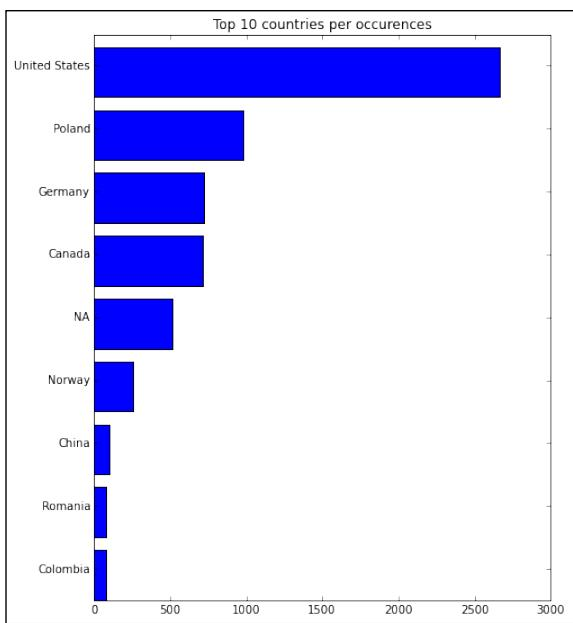
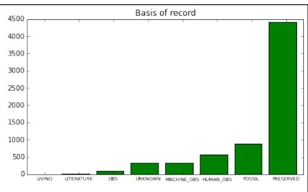
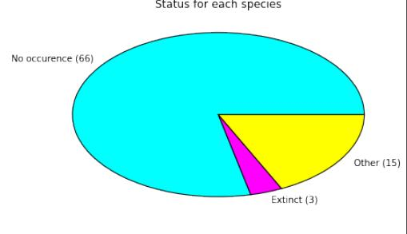
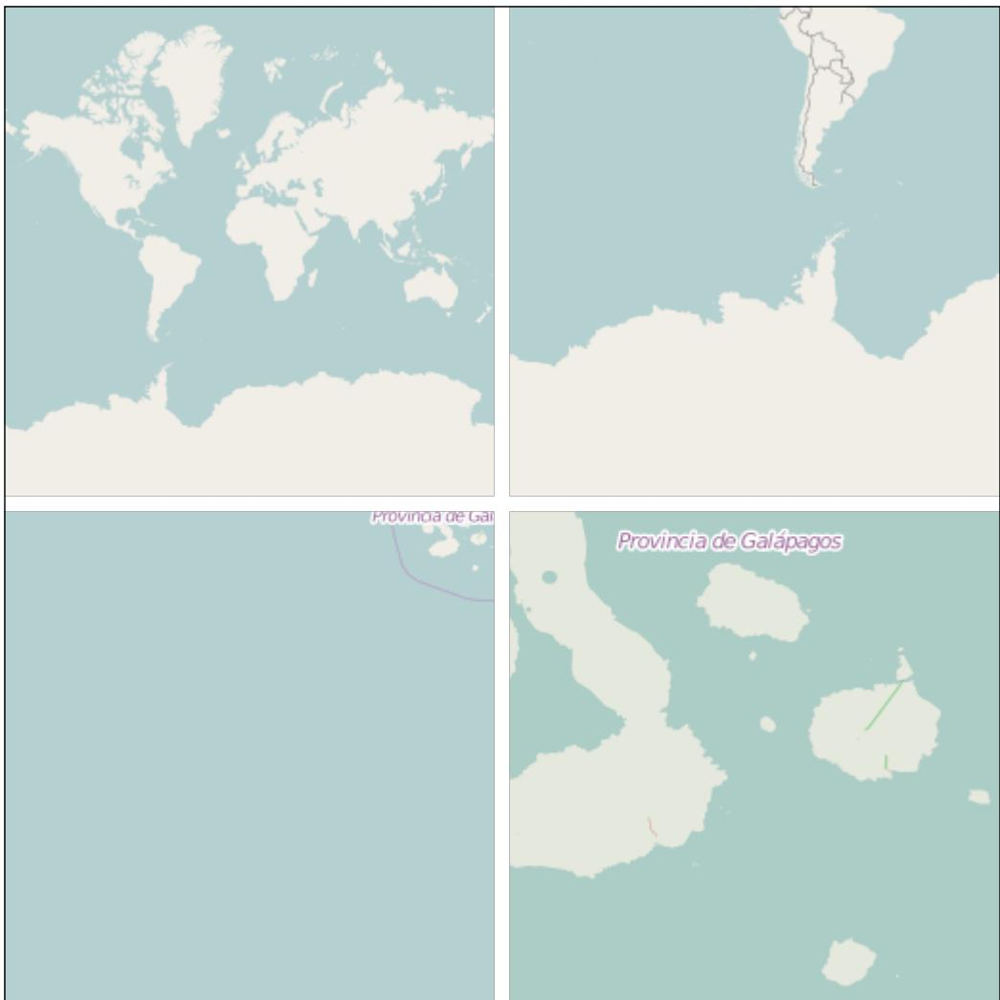
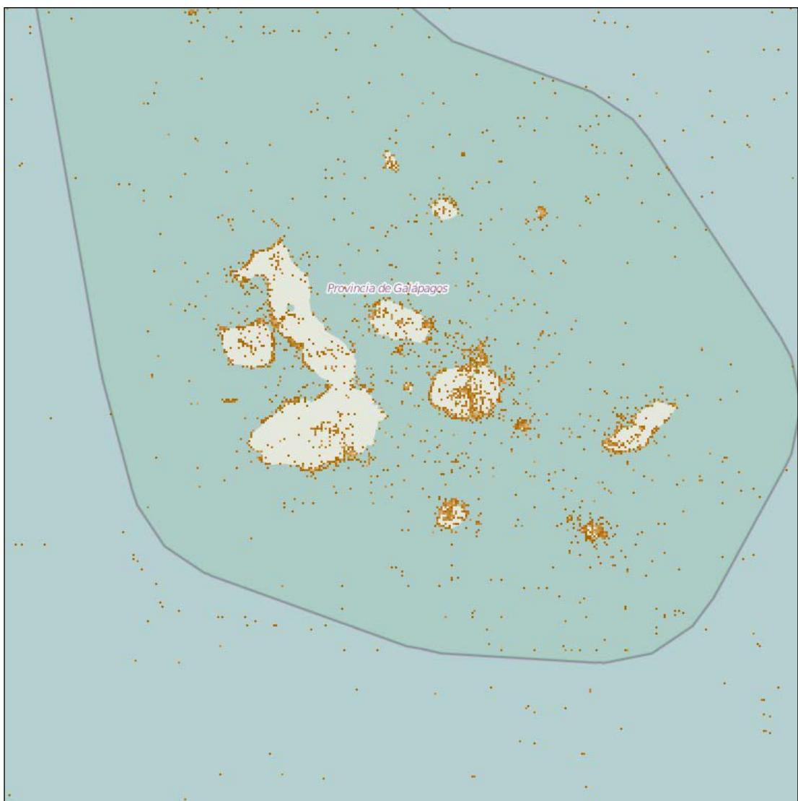
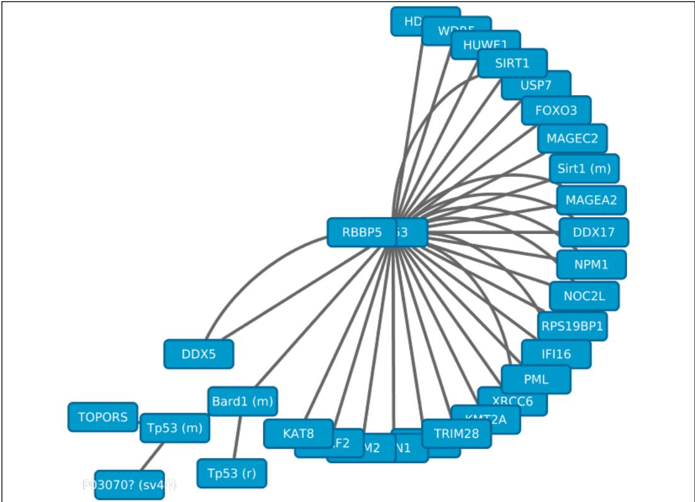
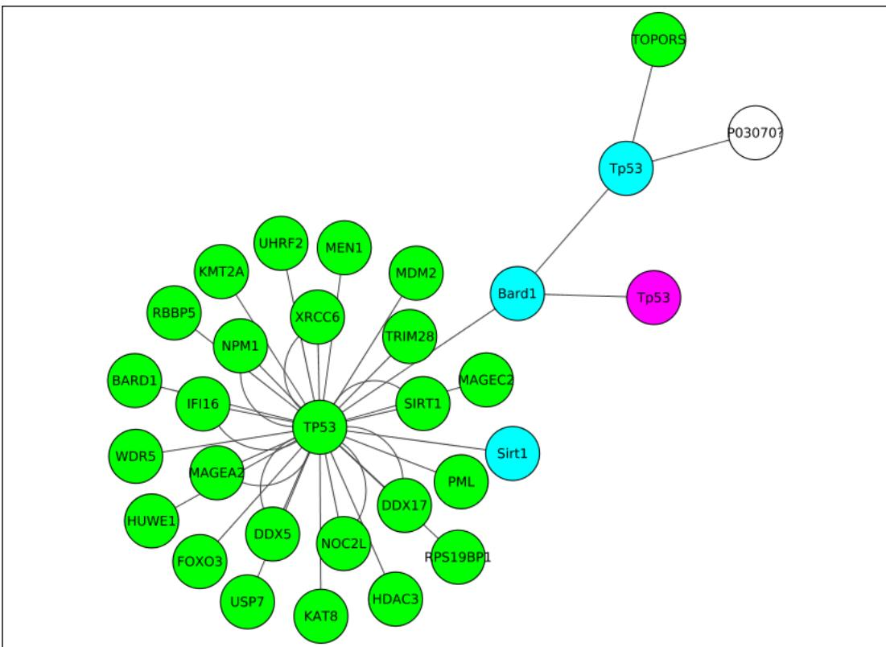

# Other Topics in Bioinformatics

In this chapter, we will cover the following recipes: 

f Accessing the Global Biodiversity Information Facility via REST 

f Georeferencing GBIF datasets 

f Accessing molecular interaction databases with PSIQUIC 

f Plotting protein interactions with Cytoscape the hard way 

## Introduction

In this chapter, we will address some topics that are well within the remit of computational biology and deserve at least some reference. We will start with two recipes using the Global Biodiversity Information Facility (GBIF), a database of worldwide scientific data on biodiversity. After this, we will interface Python with Cytoscape, a powerful software platform to visualize genomic and proteomic interaction networks. To perform visualization with Cytoscape, we will first set the stage by accessing the PSIQUIC service, a common query interface to several molecular interaction databases. 

We will take the opportunity to indirectly introduce other topics, such as more bioinformatics databases, graph processing, and geo-referencing that are relevant in our context (one way or another). To interface, we will use only REST APIs to all databases and services, making the code in all recipes here quite streamlined. You may want to refresh your knowledge of REST architectures. We will use the requests library for REST interfacing. If you never used it, do not worry, it's actually quite easy. We will also use the IPython Notebook facilities. 

```txt
Other Topics in Bioinformatics 
```

## Accessing the Global Biodiversity Information Facility

The Global Biodiversity Information Facility (GBIF), http://www.gbif.org, makes the available information about biodiversity in a programmatic friendly way using a REST API. In GBIF, we will find evidence for occurrence of species across the planet and much of this information is geo-referenced. 

In this recipe, we will concentrate on two types of GBIF information: species and occurrences. Species are actually a more general taxonomic framework and occurrences record observations of species. 

In this recipe, we will try to extract the biodiversity information related to bears. You can find this content in the 07_Other/GBIF.ipynb notebook. 

## How to do it...

Take a look at the following steps: 

1. First, let's define a function to get the data on REST, as shown in the following code: 

```python
from __future__ import print_function
import requests
def do_request(service, a1=None, a2=None, a3=None,
    **kwargs):
    server = 'http://api.gbif.org/v1'
    params = ''
    for a in [a1, a2, a3]:
    if a is not None:
    params += '/' + a
    req = requests.get('%s/%s%s' % (server, service,
    params),
    params=kwargs,
    headers={'Content-Type':
    'application/json'})
    if not req.ok:
    req.raise_for_status()
    return req.json() 
```

2. Then, see how many species records refer to the 'bear' word. Remember that this is actually more general than species. You will also get records for all kinds of taxonomic ranks with the following code: 

```python
req = do_request('species', 'search', q='bear')
print(req['count']) 
```

```txt
Free ebooks ==> www.ebook777.com 
```

As of today, we have 19,204 records. A typical record contains information about taxonomic rank, the relevant taxonomic information (kingdom, family, genus, and so on), and the scientific rank. The following screenshot is an example of part of a record: 

Chapter 8 

```python
{u'authorship': u',
    u'canonicalName': u'Ursus white bear',
    u'datasetKey': u'fab88965-e69d-4491-a04d-e3198b626e52',
    u'descriptions': [],
    u'family': u'Ursidae',
    u'familyKey': 106657396,
    u'genus': u'Ursus',
    u'genusKey': 106658119,
    u'habitats': [],
    u'higherClassificationMap': {u'106148414': u'Metazoa',
    u'106151875': u'Carnivora',
    u'106223020': u'Mammalia',
    u'106522535': u'Chordata',
    u'106657396': u'Ursidae',
    u'106658119': u'Ursus'}, 
    u'skey': 106189791,
    u'kingdom': u'Metazoa',
    u'kingdomKey': 106148414,
    u'nameType': u'SCINAME',
    u'nomenclaturalStatus': [],
    u'numDescendants': 0,
    u'numOccurrences': 0,
    u'order': u'Carnivora',
    u'orderKey': 106151875,
    u'parent': u'Ursus',
    u'parentKey': 106658119,
    u'phylum': u'Chordata',
    u'phylumKey': 106522535,
    u'rank': u'SPECIES',
    u'scientificName': u'Ursus sp. Shennongjia white bear',
    u'species': u'Ursus white bear', 
```

3. Almost 20,000 records is a bit too much to inspect; let's restrict ourselves to the ones that are on the taxonomic rank of a family, as shown in the following code: 

```python
req_short = do_request('species', 'search', q='bear', rank='family')
print(req_short['count'])
bear = req_short['results'][0] 
```

These 645 records are ordered by relevance to the search term; according to GBIF's algorithms, we will take the very first record to continue our work. 

225 

```txt
Free ebooks ==> www.ebook777.com 
```

```txt
Other Topics in Bioinformatics 
```

4. As GBIF limits the number of records that you can get per call, let's use the following function to get all records (of course, to be used with care): 

```python
import time
def get_all_records(rec_field, service, a1=None, a2=None, a3=None, **kwargs):
    records = []
    all_done = False
    offset = 0
    num_iter = 0
    while not all_done and num_iter < 100: # arbitrary
    req = do_request(service, a1=a1, a2=a2, a3=a3, offset=offset, **kwargs)
    all_done = req['endOfRecords']
    if not all_done:
    time.sleep(0.1)
    offset += req['limit']
    records.extend(req[rec_field])
    num_iter += 1
    return records 
```

‰ Many REST services offer paging APIs, that is, you can take results in parts by issuing multiple calls, specifying the starting point (in this case, offset) and a limit of the number of results. As we want to be good citizens, we include a sleep of 0.1 seconds between calls to the server so that there is no excessive burden on it. 

5. Now, given a certain internal node in the taxonomic tree, let's get all the leaves down from that node, as shown in the following code: 

```python
def get_leaves(nub):
    leaves = []
    recs = get_all_records('results', 'species', str(nub), 'children')
    if len(recs) == 0:
    return None
    for rec in recs:
    rec_leaves = get_leaves(rec['nubKey'])
    if rec_leaves is None:
    leaves.append(rec)
    else:
    leaves.extend(rec_leaves)
    return leaves 
```

‰ Here, nub is GBIF's taxonomy identifier. 

```txt
Free ebooks ==> www.ebook777.com 
```

Chapter 8 

6. Finally, let's get the leaves for the first bear node that we got on the search by the 'family' rank. We will mostly have the name and taxonomy information. We print the scientific name, rank of the record, and the vernacular name if it exists for al the leaves: 

```python
records = get_all_records('results', 'species',
    str(bear['nubKey']), 'children')
leaves = get_leaves(bear['nubKey'])
for rec in leaves:
    print(rec['scientificName'], rec['rank'], end=' ')
    vernaculars = do_request('species', str(rec['nubKey']), 'vernacularNames', language='en')['results']
    for vernacular in vernaculars:
    if vernacular['language'] == 'eng':
    print(vernacular['vernacularName'], end=' ')
    break
    print() 
```

‰ Note that the vernacular name comes from another service. GBIF has vernacular names in many languages; here, we will choose the English version. This call will take a few seconds because of our sleep code introduced before. 

7. For all leaves, we will now summarize the source of all records, the country of observation, the number of extinct references, and the species with no occurrences at all (remember that occurrence is another fundamental GBIF concept), as shown in the following code: 

```python
from collections import defaultdict
basis_of_record = defaultdict(int)
country = defaultdict(int)
zero_occurrences = 0
count_extinct = 0
for rec in leaves:
    occurrences = get_all_records('results', 'occurrence',
    'search', taxonKey=rec['nubKey'])
    for occurrence in occurrences:
    basis_of_record[occurrence['basisOfRecord']] += 1
    country[occurrence.get('country', 'NA')] += 1
    if len(occurrences) > 0:
    zero_occurrences += 1
    profiles = do_request('species', str(rec['nubKey']), 'speciesProfiles')['results']
    for profile in profiles:
    if profile.get('extinct', False):
    count_extinct += 1
    break 
```

## Other Topics in Bioinformatics

‰ We maintain two dictionaries. One is basis_of_record with a count per different record origin. Second is country with a count per country of observation (there is also the country that published the results and it's different many times) We also check the speciesProfiles service to see whether a record is labeled as extinct. 

## 8. Let's plot this as follows:

```python
import numpy as np
import matplotlib.pyplot as plt

countries, obs_countries = zip(*sorted(country.items(), key=lambda x: x[1]))
basis_name, basis_cnt = zip(*sorted(basis_of_record.items(), key=lambda x: x[1]))
fig = plt.figure(figsize=(16, 9))
ax = fig.add_subplot(1, 2, 1)
ax.barh(np.arange(10) - 0.5, obs_countries[-10:])
ax.set_title('Top 10 countries per occurrences')
ax.set_yticks(range(10))
ax.set_ylim(0.5, 9.5)
ax.set_yticklabels(countries[-10:

ax = fig.add_subplot(2, 2, 2)
ax.set_title('Basis of record')
ax.bar(np.arange(len(basis_name)), basis_cnt, color='g')
basis_name = [x.replace('OBSERVATION', 'OBS').replace('_SPECIMEN', '') for x in basis_name]
ax.set_xticks(0.5 + np.arange(len(basis_name)))
ax.set_xticklabels(basis_name, size='x-small')

ax = fig.add_subplot(2, 2, 4)
other = len(leaves) - zero_occurrences - count_extinct
pie_values = [zero_occurrences, count_extinct, other]
labels = ['No occurrence (%d)' % zero_occurrences,
    'Extinct (%d)' % count_extinct, 'Other (%d)' % other]
ax.pie(pie_values, labels=labels,
    colors=['cyan', 'magenta', 'yellow'])
ax.set_title('Status for each species') 
```




Chapter 8








Figure 1: Most referred countries of occurrence, the distribution of the origin of records, and the status of the record in terms of extinction and occurrence


‰ Be careful with pie charts because they are seen by many as difficult to interpret. Here, we explicitly added the number of observations per group to make ours clearer. 

‰ If you prefer, you can import seaborn with matplotlib to get a more modern look. There are quite a few examples of seaborn throughout the book. 

‰ Note that some records do not have country information (the NA entry on the chart). 

## There's more...

The GBIF database seems not to be totally consistent in terms of data. The sources of the occurrences and species differ. Therefore, there is not too much effort put in to standardization. From species names to information about countries (such as the preceding NA case), you can see this in different parts of the database. Also, many records do not have the complete geo-referenced data, so be careful when analyzing the data. The REST API is documented at http://www.gbif.org/developer/summary. 

Other Topics in Bioinformatics 

## Geo-referencing GBIF datasets

Here, we will work with the geo-referenced data from the GBIF dataset. We will take this opportunity to see how to interface with OpenStreetMap (https://www.openstreetmap. org), a freely available mapping service. We will also use a Python image processing library called Pillow (http://python-pillow.github.io/, which is based on PIL). You may want to read a little bit on both before starting. Tile Map Services (http://wiki.openstreetmap. org/wiki/TMS) will be quite an important concept to get a basic grasp of. GBIF and OpenStreetMap tiles are available behind REST services. 

In our example, we will try to extract information from GBIF using the geographic coordinates of the Galápagos archipelago. 

## Getting ready

You will need to install Pillow using conda install pillow or pip install pillow. You can find this content in the 07_Other/GBIF_extra.ipynb notebook. 

## How to do it...

Take a look at the following steps: 

1. First, let's define a function to get a map tile (a PNG image of size 256 x 256) from OpenStreetMap. We will also define a function to convert geographical coordinate systems to tile indexes, as shown in the following code: 

```python
from __future__ import division, print_function
import math
import requests
def get_osm_tile(x, y, z):
    url = 'http://tile.openstreetmap.org/%d/%d/%d.png' % (z, x, y)
    req = requests.get(url)
    if not req.ok:
    req.raise_for_status()
    return req

def deg_xy(lat, lon, zoom):
    lat_rad = math.radians(lat)
    n = 2 ** zoom
    x = int((lon + 180) / 360 * n)
    y = int((1 - math.log(math.tan(lat_rad) + (1 / math.cos(lat_rad))) / math.pi) / 2 * n)
    return x, y 
```

```txt
Free ebooks ==> www.ebook777.com 
```

```txt
Chapter 8 
```

‰ This code is responsible for getting a tile from the OpenStreetMap server, which is a REST service. The most complicated part to understand in this recipe is the conversion between geographical coordinates and the tiling system, so deg_xy, which converts latitude, longitude, and zoom to the tile coordinates. Let's use this to make this clear. 

2. Let's get four tiles at different zoom levels around our coordinates of interest. We wil then compose a single image with Pillow (including all tiles) as follows: 

```python
import sys
import PIL.Image
if sys.version_info.major == 2:
    from StringIO import StringIO
else:
    from io import StringIO
from IPython import display

lat, lon = -0.666667, -90.55

pils = []
for zoom in [0, 1, 5, 8]:
    x, y = deg_xy(lat, lon, zoom)
    print(x,y,zoom)
    osm_tile = get_osm_tile(x, y, zoom)
    pil_img = PIL.Image.open(StringIO(osm_tile.content))
    pils.append(pil_img)
composite = PIL.Image.new('RGBA', (520, 520))
print(pils[0].mode, pils[0].size)
composite.paste(pils[0], (0, 0, 256, 256))
composite.paste(pils[1], (264, 0, 520, 256))
composite.paste(pils[2], (0, 264, 256, 520))
composite.paste(pils[3], (264, 264, 520, 520)) 
```

‰ We will use the latitude and longitude extracted from Wikipedia for the Galápagos. 

‰ We will work at four zoom levels; here, 0 means the whole world. In this case, there is only a single tile with x = 0 and y = 0 coordinates. We then take the zoom level of 1 with has a total of 4 tiles (2 x 2) for the planet and we use the tile with coordinates x = 0 and y = 1. We then go to level 5, where we have 1024 tiles (32 x 32 or 2**5) with a x = 7 and y = 16. Finally, we take the level 8 of zoom with 65536 tiles (256 x 256) with x = 63 and y = 128. 

‰ We take the four tiles, one for each zoom level, which are of 256 x 256 resolution and then use Pillow to compose an image. 

Other Topics in Bioinformatics 

3. We now define a function to convert Pillow images to IPython Notebook images and display it: 

from io import BytesIO 

def convert_pil(img): 

b = BytesIO() 

img.save(b, format='png') 

return display.Image(data=b.getvalue()) 

convert_pil(composite) 




Figure 2: Zooming in on the Galápagos archipelago


‰ Note that at a zoom level of five and eight, it's impossible to get the whole archipelago within a single tile. Let's solve this in the next step. 

```txt
Free ebooks ==> www.ebook777.com 
```

Chapter 8 

4. Let's define a function to get the surrounding tiles. This function will abstract away the source of all tiles. With this, we can use the same function with OpenStreetMap and other servers (such as the GBIF server). Again, we will use Pillow to join several tiles, as shown in the following code: 

```python
def get_surrounding(x, y, z, tile_fun):
    composite = PIL.Image.new('RGBA', (768, 768))
    for xi, x_in enumerate([x - 1, x, x + 1]):
    for yi, y_in enumerate([y - 1, y, y + 1]):
    tile_req = tile_fun(x_, y_, z)
    pos = (xi * 256, yi * 256, xi * 256 + 256, yi * 256 + 256)
    img = \
PIL.Image.open(StringIO(tile_req.content))
    composite.paste(img, pos)
return composite 
```

5. Let's get the tiles for the area around the Galápagos. Therefore, we get 3 x 3 tiles in a single 768 x 768 image: 

```txt
zoom = 8
x, y = deg_xy(lat, lon, zoom)
osm_big = get_surrounding(x, y, zoom, get_osm_tile) 
```

6. Finally, let's get the GBIF tile. We start with getting the worldwide tile (zoom of 0) for our bears from the preceding recipe. We will not plot these here, but you can easily see the result from the preceding code in the corresponding notebook: 

```python
def get_gbif_tile(x, y, z, **kwargs):
    server = 'http://api.gbif.org/v1'
    kwargs['x'] = str(x)
    kwargs['y'] = str(y)
    kwargs['z'] = str(z)
    req = requests.get('%s/map/density/tile' % server,
    params=kwargs,
    headers={})
    if not req.ok:
    req.raise_for_status()
    return req
gbif_tile = get_gbif_tile(0, 0, 0, resolution='4',
    type='TAXON', key='6163845')
img = PIL.Image.open(StringIO(gbif_tile.content)) 
```

```txt
Other Topics in Bioinformatics 
```

‰ This code is very similar to the OpenStreetMap one because they are both REST-based. 

‰ The img variable contains a Pillow representation of the 256 x 256 zoom 0 level for GBIF on our bears. The GBIF interface allows you to constrain the result in many ways; here, we want our bear tax on ID. 

7. It turns out that it's quite easy to query GBIF for all the occurrences and species in our Galápagos tiles, as shown in the following code: 

```python
import functools
zoom = 8
x, y = deg_xy(lat, lon, zoom)
gbif_big = get_surrounding(x, y, zoom,
    functools.partial(get_ gbif_tile,
    hue='0.1',
    resolution='2',
    saturation='True')) 
```

‰ Note that the code here is remarkably similar to the previous application of get_surrounding. Indeed, the most complex piece of code has nothing to do with GBIF; we perform a partial function application to instantiate some GBIF parameters regarding visual parameters. 

8. Now we will use Pillow again to join images from OpenStreetMap and GBIF: 

```python
compose = PIL.Image.alpha_composite(osm_big, gbif_big)
convert_pil(compose) 
```


Chapter 8





Figure 3: Overlaying species information from GBIF on top of OpenStreetMap tiles


Other Topics in Bioinformatics 

## There's more...

It's possible to extract the occurrence records based on geographical coordinates. In the previous recipe, add a parameter geometry to your do_request/get_all_records call. This should be a textual representation in a subset of well-known text (http://en.wikipedia.org/ wiki/Well-known_text). For details of the supported subset, refer to http://www.gbif. org/developer/occurrence. As an example, a rectangular area near the Galápagos area can be represented as follows: 

```lua
start = 2, -93
end = 1, -91
geom = 'POLYGON(({xi} {yi}, {xf} {yi}, {xf} {yf}, {xi} {yf}, {xi} {yi}))'.format(
    xi=start[1], xf=end[1], yi=start[0], yf=end[0]) 
```

If you want to know more about tiling coordinates, refer to http://wiki.openstreetmap. org/wiki/Slippy_map_tilenames. The GBIF REST interface is documented at http:// www.gbif.org/developer/summary. There is also a lot of documentation about OpenStreetMap; refer to its wiki link at https://wiki.openstreetmap.org. 

## Accessing molecular-interaction databases with PSIQUIC

PSIQUIC (http://www.ebi.ac.uk/Tools/webservices/psicquic/view/main. xhtml) is a consistent interface to many molecular-interaction databases. It's used inside Cytoscape, which is the object of the next recipe. We take this as an opportunity to learn how to interact with PSIQUIC. In this recipe, we will use its REST interface to check the databases that are available and perform some basic querying. We will revisit this in the Cytoscape recipe. You can find this content in the 07_Other/PSICQUIC.ipynb notebook. 

## How to do it...

Take a look at the following steps: 

1. First, let's define a convenient REST function as follows: 

```python
from __future__ import print_function
import requests
def get_psiquic(service, query, full_url=False, **kwargs):
    kwargs['format'] = kwargs.get('format', 'tab27')
    if full_url:
    req = requests.get('%s%s' % (service, query), params=kwargs)
    else: 
```

```txt
Free ebooks ==> www.ebook777.com 
```

Chapter 8 

```python
server = \
'http://www.ebi.ac.uk/Tools/webservices/psicquic'
req = requests.get('%s/%s/%s' % (server, service, query), params=kwargs)
if not req.ok:
req.raise_for_status()
return req.content 
```

‰ This is a standard REST call, except for the fact that the default format is something called tab27, which is PSIQUIC-specific. We will revisit this in the next recipe. 

2. We want to know which databases are registered and active, as shown in the following code: 

```python
import xml.etree.ElementTree as ET
import pandas as pd
def get_databases(db_xml):
    for service in db_xml:
    for elem in service:
    ns_clean_tag = elem.tag[elem.tag.find('') +
    if ns_clean_tag == 'name':
    name = elem.text
    elif ns_clean_tag == 'active':
    active = False if elem.text == 'false' else \ True
    elif ns_clean_tag == 'restUrl':
    rest_url = elem.text
    elif ns_clean_tag == 'restExample':
    example = elem.text
    elif ns_clean_tag == 'organizationUrl':
    org_url = elem.text
    else:
    pass # there are a few more
    yield {'name': name, 'active': active, 'org_url':
    org_url,
    'example': example, 'rest_url': rest_url}

dbs_xml = get_psiquic('registry', 'registry',
    action='STATUS', format='xml')
dbs_xml_parsed = ET.fromstring(dbs_xml)
dbs = pd.DataFrame.from_records(get_databases(dbs_xml_parsed))
pd.options.display.max_colwidth = 100
active_dbs = dbs[dbs.active==True] 
```

237 

## www.ebook777.comwww.it-ebooks.info

```txt
Other Topics in Bioinformatics 
```

‰ We get the output of the registry service in the XML format, and parse the XML file using xml.etree.ElementTree. PSICQUIC makes available information (such as the service name, its URL, and if it's currently active or not). It also makes available examples of REST queries. We use pandas to get the active services. 

3. Let's count all the records in all the databases referred to as TP53 and then split the count by database, as shown in the following code: 

```python
req = \
get_psiquic('intact/webservices/current/search/query', 'tp53', format='count')
print(req)
for index, db in active_dbs.iterrows():
    req = get_psiquic(db['rest_url'], 'query/tp53', full_url=True, format='count')
    count = int(req)
    print('DB: %s, count: %d' % (db['name'], count)) 
```

‰ Part of the output is shown here. As with all online databases, this may change when you run it. The PSIQUIC case can be particularly variable, because it's a federation of databases: 

```csv
4748
DB: BioGrid, count: 2375
DB: bhf-ucl, count: 14
DB: ChEMBL, count: 80
DB: DIP, count: 0
DB: HPIDb, count: 68
DB: InnateDB, count: 136
DB: IntAct, count: 4748
DB: mentha, count: 3218
DB: MPIDB, count: 0
DB: MatrixDB, count: 0
DB: MINT, count: 2158
DB: Reactome, count: 0
DB: Reactome-FIs, count: 369
DB: STRING, count: 2118
DB: BIND, count: 47
DB: Interoporc, count: 0
DB: I2D-IMEx, count: 194
DB: InnateDB-IMEx, count: 5
DB: MolCon, count: 18
DB: UniProt, count: 438 
```

```txt
Free ebooks ==> www.ebook777.com 
```

Chapter 8 

4. Finally, let's query 1000 records from all databases for TP53 and see the types of records that we have. We will use the csv module here to deal with the return; you can also perform this with pandas: 

```python
import csv
req = get_psiquic('intact/webservices/current/search/query', 'tp53', firstResult=0, maxResults=1000)
answer = csv.reader(StringIO(req), delimiter='t')
db_types = set()
for record in answer:
    db_types.add(record[0].split(':')[0])
    db_types.add(record[1].split(':')[0])
print(db_types) 
```

At most, we query 1000 records. PSIQUIC has a REST paging architecture (see the GBIF architecture for another example of paging). Also, we will query across all the databases. We then look at the record IDs in the result. For PSIQUIC, as it federates several databases, the first part of the identifier which specifies the database comes from the ID. For example, uniprotkb:P04637 or ensembl:ENST00000316024. 

In this result set, we have the uniprotkb, ddbj/embl/genbank, -, ensembl, intact, and chebi types. 

We will inspect the content of a similar result in the next recipe. 

## Plotting protein interactions with Cytoscape the hard way

Cytoscape (http://cytoscape.org/) is a platform to visualize molecular interaction networks. Here, we will interact with Cytoscape using a REST interface. There are easier ways to perform this recipe, but we will take this opportunity to continue interacting with the PSICQUIC service. Also, we will exercise the NetworkX graph processing library (https://networkx.github.io/), which will be useful on its own. 

Taking a page from Chapter 7, Using the Protein Data Bank, we will plot p53 interactions stored in the UniProt database. 

## Getting ready

You will need to install the Cytoscape version 3.2.1 (or higher), which will require Java 7 or preferably 8. You will also need the cyREST application in Cytoscape (see the Apps main menu in Cytoscape for this). The code will use a REST interface to communicate with Cytoscape, so it will run outside it, but it will require Cytoscape to be running, so start Cytoscape with cyREST before running the following code. 

```txt
Free ebooks ==> www.ebook777.com 
```

## Other Topics in Bioinformatics

You should also install the py2cytoscape (via pip) and NetworkX (via conda or pip) Python libraries. You can find this content in the 07_Other/Cytoscape.ipynb notebook. As this will require a massive download of software, the notebook will not work in our Docker implementation. 

## How to do it...

Take a look at the following steps: 

1. First, let's access the PSICQUIC service (the UniProt database) via its REST interface, as shown in the following code: 

```python
from __future__ import print_function
import requests
def get_psiquic_uniprot(query, **kwargs):
    kwargs['format'] = kwargs.get('format', 'tab27')
    server = 'http://www.ebi.ac.uk/Tools/webservices/psicquic/uniprot/webservices/current/search/query'
    req = requests.get('%s/%s' % (server, query),
    params=kwargs)
    return req.content 
```

```python
2. Then, get all the genes referred to (along with their respective species) and the interactions:
    from collections import defaultdict
    genes_species = defaultdict(set)
    interactions = {}

    def get_gene_name(my_id, alt_names):
    toks = alt_names.split('|')
    for tok in toks:
    if tok.endswith(('gene name)'):
    return tok[tok.find(':') + 1: tok.find(' ')]
    return my_id + '?' # no name...

    def get_vernacular_tax(tax):
    return tax.split('|')[0][tax.find(' ') + 1:-1]

    def add_interactions(species):
    for rec in species.split('\n'):
    toks = rec.rstrip().split('\t')
    if len(toks) < 15:
    continue # empty line at the end
    id1 = toks[0][toks[0].find(':') + 1:]
    id2 = toks[1][toks[1].find(':') + 1:] 
```

```python
gene1, gene2 = get_gene_name(id1, toks[4]), \
    get_gene_name(id2, toks[5])

tax1, tax2 = get_vernacular_tax(toks[9]), get_vernacular_tax(toks[10])

inter_type = toks[11][toks[11].find(' ') + 1:-1]
miscore = float(toks[14].split(':')[1])
genes_species[tax1].add(gene1)
genes_species[tax2].add(gene2)
interactions[((tax1, gene1), (tax2, gene2))] = \
{'score': miscore, 'type': inter_type} 
```

```txt
Free ebooks ==> www.ebook777.com 
```

Chapter 8 

‰ We will create a dictionary with species as a key with a set of genes referred. We will also create a dictionary of interactions with the key being a tuple with the genes involved, the value, the iteration type, and miscore. 

‰ The add_interactions changes a couple of external dictionaries in place. This dialect is not scalable in a very complex program because it is bug-prone. It works well for our small script, but be sure to adapt the code if you are using this in a larger infrastructure. 

‰ The result is outputted in the PSI-MI TAB 2.7 format (https://code. google.com/p/psimi/wiki/PsimiTab27Format). This is an easy to parse and tab-delimited format, which includes the identifiers for both iterators (including the database), aliases (for example, gene names), the interaction method, taxonomy identifiers, and so on. Here, we take aliases, species, and the confidence score for each interaction. 

3. Let's extract interactions with the human p53 protein, which has also homologous on rats and mice. You can discover the following IDs using UniProt or the code from the previous chapter: 

```lua
human = get_psiquic_uniprot('uniprotkb:P04637')
add_interactions(human)
rat = get_psiquic_uniprot('uniprotkb:P10361')
add_interactions(rat)
mouse = get_psiquic_uniprot('uniprotkb:P02340')
add_interactions(mouse) 
```

4. With this information, we can now start drawing on Cytoscape. Remember that Cytoscape must be running on the local machine and that the cyREST plugin must be installed. We will first construct a NetworkX graph. This graph will have extra annotations for genes and species added to the nodes and interaction types, and confidence scores added to the edges as follows: 

```python
import networkx as nx
server = 'http://localhost:1234/v1'
def get_node_id(species, gene):
    if species == 'human': 
```

Other Topics in Bioinformatics 

```python
return gene
elif species in ['mouse', 'rat']:
    return '%s (%s)' % (gene, species[0])
else:
    return '%s (%s)' % (gene, species)
graph = nx.Graph()
for species, genes in genes_species.items():
    for gene in genes:
    name = get_node_id(species, gene)
    graph.add_node(get_node_id(species, gene), species=species, gene=gene)
for (i1, i2), attributes in interactions.items():
    tax1, gene1 = i1
    tax2, gene2 = i2
    graph.add_edge(get_node_id(tax1, gene1),
    get_node_id(tax2, gene2),
    interaction=attributes['type'],
    score=attributes['score']) 
```

5. Now, let's now convert the NetworkX graph to a Cytoscape representation and plot it, as shown in the following code: 

```python
import json
from IPython.display import Image
from py2cytoscape.util import from_networkx
p53_interactions = from_networkx(graph)
p53_net = requests.post(server + '/networks',
    data=json.dumps(p53_interactions),
    headers={'Content-Type': 'application/json'})
net_id = p53_net.json() ['networkSUID']
requests.get('%s/apply/layout/circular/%d' % (server,
    net_id))
Image('%s/networks/%d/views/first.png' % (server, net_id)) 
```

Chapter 8 

‰ Here, we will use a py2cytoscape utility function to convert the NetworkX representation to a JSON version, that can be sent to Cytoscape. 

‰ Remember to have Cytoscape running, and the cyREST plugin installed. We will use the default network interface of cyREST here. 

‰ We will create our graph (networks service with the HTTP POST method), specify a circular layout, and draw the image that Cystoscape renders, as shown in the following figure: 




Figure 4: A first approach with Cytoscape for a p53 query on UniProt


```txt
Free ebooks ==> www.ebook777.com 
```

```txt
Other Topics in Bioinformatics 
```

6. Next, we want a different style for our plot; that is, we want the gene name (currently, it has the name and the species indicator, if not human) in the node. To color each node by species, we define a style as follows: 

```txt
style = {
    'title': 'UniProt style',
    'mappings': [
    {'mappingType': 'discrete',
    'map': [
    {'key': 'human', 'value': '#00FF00'},
    {'key': 'rat', 'value': '#FF00FF'},
    {'key': 'mouse', 'value': '#00FFFF'}],
    'visualProperty': 'NODE_FILL_COLOR',
    'mappingColumnType': 'String',
    'mappingColumn': 'species'},
    {
    'mappingType': 'passthrough',
    'visualProperty': 'NODE_LABEL',
    'mappingColumnType': 'String',
    'mappingColumn': 'gene'},
    {
    'mappingType': 'passthrough',
    'visualProperty': 'EDGE_TOOLTIP',
    'mappingColumnType': 'String',
    'mappingColumn': 'interaction'
    }],
    'defaults': [ {"visualProperty": "NODE_FILL_COLOR",
    "value": "#FFFFFF"}]} 
```

‰ There are quite a few existing styles, but here we will color our nodes as a function of the species, labeling a node with the gene name. 

7. Finally, we will apply our style, change the layout (do not confuse the graph layout with the graph style), and plot our new version as follows: 

```python
res = requests.post(server + "/styles", data=json.dumps(ustyle), headers={'Content-Type': 'application/json'})  
requests.get('%s/apply/layout/force-directed/%d' % (server, net_id))  
res = requests.get('%s/apply/styles/UniProt style/%d' % (server, net_id), headers={'Content-Type': 'application/json'})  
Image('%s/networks/%s/views/first.png' % (server, net_id)) 
```

244 

## www.ebook777.comwww.it-ebooks.info


Chapter 8





Figure 5: Our p53 network with a tailored style and a force-directed layout


## There's more...

The preceding example was designed to exercise more than the REST interface to Cytoscape; we interfaced with the PSICQUIC server and used the NetworkX graph library, functionality than can be useful without Cytoscape. To start with, there is plenty of documentation for NetworkX and Cytoscape available on their web pages. 

The Kyoto Encyclopedia of Genes and Genomes (KEGG) is one of the most useful resources to use with Cytoscape; as this is very well documented, we opted for a less common example based on UniProt. A fantastic documentation to interact with Cytoscape via REST interfaces using IPython, including a KEGG example, is available at http://nbviewer.ipython. org/github/idekerlab/cy-rest-python/blob/develop/index.ipynb. 

If drawing KEGG pathways is all that you need, there is a much lighter solution than having to install and use Cytoscape, which is Biopython. You can find the KEGG module documentation at http://nbviewer.ipython.org/github/widdowquinn/notebooks/blob/ master/Biopython_KGML_intro.ipynb. 

Free ebooks ==> www.ebook777.com 

