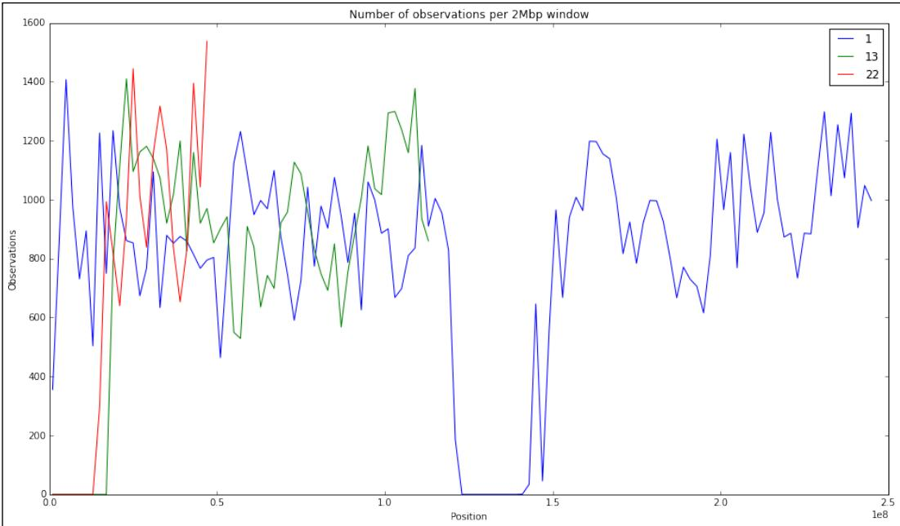
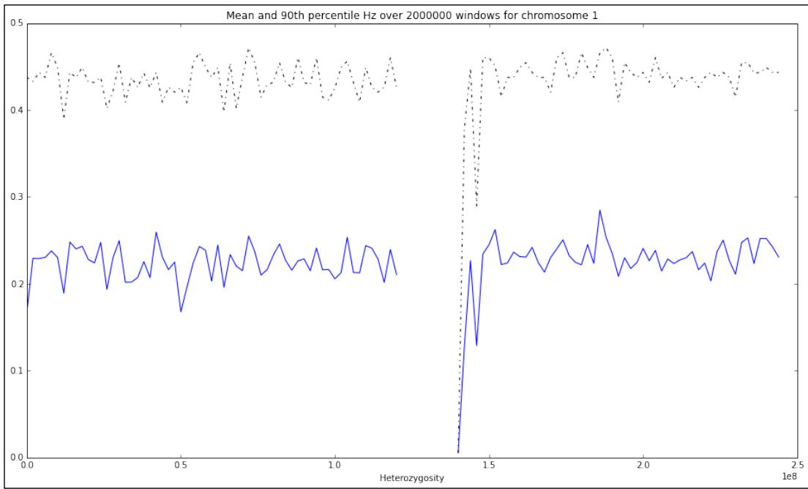

# Python for Big Genomics Datasets

In this chapter, we will cover the following recipes: 

f Setting the stage for high-performance computing 

Designing a poor human concurrent executor 

f Performing parallel computing with IPython 

f Computing the median in a large dataset 

f Optimizing code with Cython and Numba 

f Programming with laziness 

f Thinking with generators 

## Introduction

In this final chapter, we will discuss high-performance computing techniques for large computational biology datasets. We will talk about code parallelization, running software in clusters, code optimization, and advanced functional programming techniques. We will try to avoid tying any solution to a specific proprietary technology (for example, Amazon EC2) and design code that can be applicable in a wide range of scenarios. 

## Python for Big Genomics Datasets

The whole topic of persistence is mostly left out of this chapter, although we do make some minor considerations on the IO performance. There is no single good solution for persistence in computational biology; you will probably use SQL datasets for some limited applications. Most of your files will be BAM- or VCF-formatted, and you will probably use a lot of text files too. You may also want to consider NoSQL databases in some instances. Having said that, if you have not checked HDF5, you may want to have a look at it, especially as there are quite a few Python implementations available. Many topics of the following recipes deserve a whole book in their own right. The objective here is not to be exhaustive, but to give you a taste of the possibilities available. You are strongly encouraged to research further if you find any of the following topics interesting. 

## Setting the stage for high-performance computing

In this recipe, we will prepare you so that you can perform computing with multiple cores, in clusters, and in MapReduce frameworks. We will use a simple example, where we compute the minimum allele frequency (MAF) of loci across the human genome using the TSI ("Toscani in Italy") HapMap population. Refer to Chapter 6, Phylogenetics, for details on the HapMap data. 

We will perform two different kinds of tasks here. First is preparing the data, another is structuring computations as if we were using the parallel computing framework. The sequential execution is a safe and predictable environment to introduce parallel programming concepts, even if we still do not do actual concurrent execution in this recipe. We will use this recipe to also introduce some pitfalls with big data processing and a few basic functional programming techniques. 

## Getting ready

Here, we will need the data we used in the Managing datasets with PLINK recipe in Chapter 6, Phylogenetics. These files are specified in our dataset list at https://github.com/ tiagoantao/bioinf-python/blob/master/notebooks/Datasets.ipynb (hapmap. map.bz2, hapmap.ped.bz2, and relationships.txt). This recipe will also require PLINK. 

You must decompress the following files: 

f bunzip2 hapmap3_r2_b36_fwd.consensus.qc.poly.map.bz2 

f bunzip2 hapmap3_r2_b36_fwd.consensus.qc.poly.ped.bz2 

As usual, this is available in the 08_Advanced/Intro.ipynb notebook, where everything has been taken care of. 

```txt
Free ebooks ==> www.ebook777.com 
```

Chapter 9 

```txt
How to do it... 
```

```txt
Take a look at the following steps: 
```

1. First, let's get only the Toscani individuals, as shown in the following code: 

```python
import os
tsi = open('tsi.ind', 'w')
f = open('relationships_w_pops_121708.txt')

for l in f:
    toks = l.rstrip().split('\t')
    fam_id = toks[0]
    ind_id = toks[1]
    mom = toks[2]
    dad = toks[3]
    pop = toks[-1]
    if pop != 'TSI' or mom != '0' or dad != '0':
    continue
    tsi.write('%s\t%s\n' % (fam_id, ind_id))
f.close()
tsi.close()
os.system('plink --file hapmap3_r2_b36_fwd.consensus.qc.poly --maf 0.001 --keep tsi.ind --make-bed --out tsi') 
```

2. Here, we will just write a file with all Toscani individuals so that we can call PLINK to extract those. We are careful to bring on the polymorphic SNPs for this population (hence, the MAF filter). Let's extract the maximum position per chromosome for future reference as follows: 

```python
import pickle
from collections import defaultdict
from collections import defaultdict
max_chro_pos = defaultdict(int)
f = open('tsi.bim')
for l in f:
    toks = l.rstrip().split('\t')
    chrom = int(toks[0])
    if chrom > 22:
    continue
    pos = int(toks[3])
    if pos > max_chro_pos[chrom]:
    max_chro_pos[chrom] = pos
f.close()
w = open('max_chro_pos.pickle', 'w')
pickle.dump(max_chro_pos, w)
w.close() 
```

## Python for Big Genomics Datasets

‰ We get the maximum position per chromosome so that in the future, we can split computing tasks as a function of the chromosome size. A more complete version should also get the starting position of the chromosome. This is because acrocentric chromosomes may not have any SNPs typed at the very beginning. However, this is enough for our purposes. 

‰ We pickle (that is persist the data structures) the results to disk and use this in the next recipes. Note that this is not a recommendation to use pickle as a persistence mechanism for everything. The pickle module has security and performance limitations, is Python-specific, and should probably be used only for small datasets in limited situations. On Python 2, you can use pickle or cPickle, but on Python 3, these modules were merged under pickle. 

3. We extract the allele frequency of all SNPs in parts (windows), starting by defining a function to traverse the genome as follows: 

```python
window_size = 2000000
def traverse_genome(traverse_fun, state=None):
    if state is None:
    state = {}
    for chrom, max_pos in max_chro_pos.items():
    num_bin = (max_pos + 1) // window_size
    for my_bin in range(num_bin):
    start_pos = my_bin * window_size + 1 # 1 - start
    end_pos = start_pos + window_size
    traverse_fun(state, chrom, start_pos, end_pos) 
```

‰ First, we define a window size of 2 Mbp. We will use this to split our computations in blocks of 2 Mbp in later recipes, and also as a basis for windowed analysis. Just note that the two (window sizes and computation blocks) should be in general separated concepts. 

‰ Next, we will define the traverse_genome function. In this function, we divide a genome in blocks of 2 Mbp and apply traverse_fun to each block. Note the programming pattern here; we will split a task into parts based on the data and apply a function to each. 

‰ If the computation for each block is independent of other parts of the genome (a pattern that is quite common), then you can start many of these blocks in parallel; this is something that we will perform in the next recipe. In this case, we will allow an optional interblock communication device (a simple dictionary called state). 

‰ Defining the correct granularity is fundamental (that is, the computation block size), too small and you will start too many processes with all the CPU and IO overhead that that will entail, too large and you will be losing performance or maybe consuming too much memory per process. 

```txt
Free ebooks ==> www.ebook777.com 
```

Chapter 9 

‰ The block size for this specific task is set too low. Indeed, this example could be done whole genome in a single go. However, obviously, this is a toy example designed to show concepts and still run fast. 

4. Let's see this framework in practice; we now compute the MAF in blocks, as shown in the following code: 

```python
def compute_MAF(state, chrom, start_pos, end_pos):
    os.system('plink --bfile tsi --freq --out tsi-%d-%d --
chr %d --from-bp %d --to-bp %d' %
    (chrom, start_pos, chrom, start_pos,
    end_pos))
    os.remove('tsi-%d-%d.log' % (chrom, start_pos))
traverse_genome(compute_MAF) 
```

‰ We use PLINK to compute the MAF. Note that you can instruct PLINK to compute just a subset of the genome with --chro, --from-bp and --to-bp. Each block will be outputted to a file called TSI-<chrom>- <start-pos>.frq. For example, TSI-10-12000001.frq refers the 10<sup>th</sup> chromosome from 12000001 to 1400000. 

‰ Note that the computation of each block is independent of each other, so the blocks could have been started in parallel without much problem. 

‰ As we will apply this in a sequential framework, this will be quite slow. Remember that this will make sense in performance terms when applied in a parallel framework. 

‰ Having said that, this code will probably be slow in a parallel execution anyway; note that all blocks will read from the same original PLINK file. The IO contention is a source of lack of performance in parallel processing to the point that running a task sequentially may even be much faster than running it in parallel. 

5. Let's gather some statistics (per 2 Mbp block and genome-wide) and compute the number of observations and the mean MAF, as shown in the following code: 

```python
from collections import defaultdict
def gather_statistics(state, chrom, start_pos, end_pos):
    try:
    f = open('tsi-%d-%d.frq' % (chrom, start_pos))
    except:
    # empty block
    state['block_mafs'][(chrom, start_pos)] = []
    return
    f.readline()
    for cnt, 1 in enumerate(f):
    toks = [tok for tok in l.rstrip().split(' ') if tok != '']
    maf = float(toks[-2]) 
```

251 

Python for Big Genomics Datasets 

```python
state['snp_cnt'] += 1
state['sum_maf'] += maf
state['block_mafs'][chrom, start_pos)].append(maf)
f.close()
stats = {'snp_cnt': 0, 'sum_maf': 0.0, 'block_mafs':
    defaultdict(list)}
traverse_genome(gather_statistics, state=stats)
print(stats['snp_cnt'], stats['sum_maf'] / stats['snp_cnt']) 
```

‰ We now have a shared data structure called stats that is passed from block to block. It contains the sum of all MAFs (sum_maf) and the number of SNPs observed (snp_cnt). 

‰ stats also contains a block_mafs dictionary. This dictionary includes the MAF for each and every SNP. Contrary to sum_maf and snp_cnt, block_ maf consumes memory in proportion to the number of SNPs genotyped. 

‰ Finally, we print the number of SNPs (1, 222, and 126) and the mean MAF (0.2316). 

6. Let's now perform something apparently benign and compute the median MAF. We will perform this ourselves and not use NumPy here, as shown in the following code: 

```python
all_mafs = []
for mafs in stats['block_mafs'].values():
    all_mafs.extend(mafs)
#np.median(all_mafs)
all_mafs.sort()
middle = len(all_mafs) // 2
#array of even size
print((all_mafs[middle] + all_mafs[middle + 1]) / 2) 
```

First, we will create a all_mafs list with all the MAFs (remember that these were structured per block in the preceding step). 

‰ Then, we will sort the MAFs and compute the median MAF (0.2216), all apparently innocuous. 

‰ The serious problem with this code is that it will require all values in-memory and a sort operation on them. This is quite feasible with 1.2 million floats in modern machines, but it will not scale well. The computation of the median is an example of a case where you need all values in-memory (compare this with the mean where you need only two variables and an updating function). This is not feasible for many more values or if you have to keep track of larger objects than floats. We will revisit this in a separate recipe. 

```python
7. Finally, let's compute the number of markers per chromosome as follows:
import functools

def collect_mafs(state, chrom, start_pos, end_pos, block_mafs):
    state[chrom] += len(block_mafs[(chrom, start_pos)])
chrom_cnts = defaultdict(int)
traverse_genome(functions.partial(collect_mafs,
    block_mafs=stats['block_mafs']), state=chrom_cnts)
for chrom in range(1, 23):
    print('%2d\t%6d' % (chrom, chrom_cnts[chrom]))
1 100780
2 102377
3 84921
4 75819
5 78013
6 82169
7 67218
8 66803
9 56921
10 65166
11 62182
12 60381
13 46354
14 40525
15 37217
16 38443
17 33175
18 36144
19 21749
20 31872
21 16978
22 16919 
```

Chapter 9 

‰ In this case, we will define a traverse function that will take the previously computed mafs block and simply add per block the number of SNPs observed to a dictionary with the chromosome as a key. 

‰ Note that the traverse_genome function requires a traverse_fun function with a signature of state, chrom, start_pos, and end_pos, but in this case we would like to have an extra parameter (the previously computed block MAFs). This is quite easy with Python because the functools module supports partial function application. 

Python for Big Genomics Datasets 

## Designing a poor human concurrent executor

We will start writing our own parallel executor. This executor will have no external dependencies, will be very light, and will be able to work on multiple core computers. We will also supply a version for clusters. There is no interprocess communication mechanism other than a shared filesystem. We will make a similar data analysis as in the previous recipe, but now in a real concurrent environment. 

## Getting ready

You should have read and understood the previous recipe. You will at least need to get the HapMap data and run the pickle part from it. 

The code for this can be found in the 08_Advanced/Multiprocessing.ipynb notebook. Also, there is an external file called get_maf.py, which is available next to this notebook. 

## How to do it...

Take a look at the following steps: 

1. Let's start with some boilerplate code, loading the largest chromosome position from the previous recipe, and defining the window size at 2 Mbp, as shown in the following code: 

```python
from __future__ import division, print_function
import pickle
f = open('max_chro_pos.pickle')
max_chro_pos = pickle.load(f)
f.close() 
```

```txt
window_size = 2000000 
```

2. We will define a function to yield all genome blocks in the chromosome, starting position, and end position form: 

```python
def get_blocks():
    for chro, max_pos in max_chro_pos.items():
    num_bin = (max_pos + 1) // window_size
    for my_bin in range(num_bin):
    start_pos = my_bin * window_size + 1
    end_pos = start_pos + window_size
    yield chro, start_pos, end_pos 
```

```txt
Free ebooks ==> www.ebook777.com 
```

Chapter 9 

3. We will now define an executor class that will take care of running the concurrent code. The class will have a constructor and three methods; the first method has the ability to submit a job, as shown in the following code: 

```python
import multiprocessing
import subprocess
import time

class Local:
    def __init__(self, limit):
    self.limit = limit
    self.cpus = multiprocessing.cpu_count()
    self.running = []

    def submit(self, command, parameters):
    self.wait()
    if hasattr(self, 'out'):
    out = self.out
    else:
    out = '/dev/null'
    if hasattr(self, 'err'):
    err = self.err
    else:
    err = '/dev/null'
    if err == 'stderr':
    errSt = ''
    else:
    errSt = '2> ' + err
    p = subprocess.Popen('%s %s > %s %s' % (command, parameters, out, errSt), shell=True)
    self.running.append(p)
    if hasattr(self, 'out'):
    del self.out
    if hasattr(self, 'err'):
    del self.err 
```

‰ The class constructor will determine the number of available cores and initialize the running queue. There is also a limit parameter, which wil be discussed later. 

‰ We will not delve into the intricacies of how to properly run an external application here because this would be too complicated and of little value. We will use an expedite (although not totally secure) solution to help you run a command through the shell. This approach will allow a user to get the standard output and error channels. 

```txt
Free ebooks ==> www.ebook777.com 
```

```txt
Python for Big Genomics Datasets 
```

4. The second method of our class waits until there is a running slot available or (alternatively) if the running queue is totally empty. To be clear, this method is still part of the class that we defined in the preceding code: 

```python
def wait(self, for_all=False):
    self.clean_done()
    numWaits = 0
    if self.limit > 0 and type(self.limit) == int:
    cond = 'len(self.running) >= self.cpus - self.limit'
    elif self.limit < 0:
    cond = 'len(self.running) >= - self.limit'
    else:
    cond = 'len(self.running) >= self.cpus * self.limit'
    while eval(cond) or (for_all and len(self.running) > 0):
    time.sleep(1)
    self.clean_done()
    numWaits += 1 
```

‰ If you pass for_all as True, the code will wait for all running processes to terminate (effectively creating a barrier). 

‰ If not, it will wait for a slot to become available using self.limit as follows. If limit is an integer bigger than 0, it's the expected number of CPI cores that will not be used, for instance, if there are 32 cores and a limit of 6, the system will try to never ago above 26 running processes. A float between 0 and 1 will be interpreted as the fraction of CPUs to be used, for example, with 32 cores, 0.25 will use at most eight tasks. A negative value will be interpreted as the maximum number of processes that can be executed in parallel, for example, -4 will allocate at most four processes. 

5. Finally, we perform a cleanup of completed processes (this being another method in the class) as follows: 

```python
def clean_done(self):
    dels = []
    for rIdx, p in enumerate(self.running):
    if p.poll() is not None:
    dels.append(rIdx)
    for del_in reversed(dels):
    del self.running[del_] 
```

‰ This code checks all running processes to see whether they are terminated (using the poll() method) and removes them from the running list. 

```txt
Free ebooks ==> www.ebook777.com 
```

6. Let's now use this code to compute the MAF as follows: 

Chapter 9 

```python
import os
executor = Local(limit=-4)
for chrom, start_pos, end_pos in get_blocks():
    executor.submit('plink',
    '--bfile tsi --freq --out tsi-%d-%d --
chr %d --from-bp %d --to-bp %d' %
    (chrom, start_pos, chrom, start_pos,
    end_pos))
executor.wait(for_all=True)
for chrom, start_pos, end_pos in get_blocks():
    os.remove('tsi-%d-%d.log' % (chrom, start_pos)) 
```

‰ We start by creating an executor with at most four concurrent jobs. 

‰ We iterate over all the blocks and submit jobs for execution that will use PLINK to extract the MAF per block. Note that at 2 Mbp, there are 1425 blocks spanning autosomes and the X chromosome of humans. Therefore, 1425 processes will be created. 

‰ We will then wait for all processes to terminate and then remove log files as they are not needed. 

7. Now, we parse and retrieve the MAF per block, as shown in the following code: 

```python
for chrom, start_pos, end_pos in get_blocks():
    executor.submit('python', 'get_maf.py %d %d' % (chrom, start_pos))
executor.wait(for_all=True) 
```

‰ As this framework does not allow us to directly run the Python code (an external process has to be explicitly started), we have to put this code in a separate file. 

8. Thus, we will create a simple program called get_maf.py to parse the PLINK output and retrieve the MAF, as shown in the following code: 

```python
import pickle
import sys 
```

```python
def gather_MAFs(chrom, start_pos):
    mafs = []
    try:
    f = open('tsi-%d-%d.frq' % (chrom, start_pos))
    f.readline()
    for cnt, 1 in enumerate(f): 
```

```txt
Free ebooks ==> www.ebook777.com 
```

Python for Big Genomics Datasets 

```python
toks = [tok for tok in l.rstrip().split(' ') if
tok != '']
maf = float(toks[-2])
mafs.append(maf)
f.close()
except:
    # might be empty if there are no SNPs
    pass
w = open('MAF-%d-%d' % (chrom, start_pos), 'w')
pickle.dump(mafs, w)
w.close()

chrom = int(sys.argv[1])
start_pos = int(sys.argv[2])
gather_MAFs(chrom, start_pos) 
```

‰ The get_maf.py program gets the chromosome and the starting position from the command line, parses the relevant PLINK file, and outputs the result in a pickle file. 

9. Let's now use the MAF data to plot the number of observations per window (of 2 Mbp) for three chromosomes. We do this back in our original file: 

```python
from collections import defaultdict
import matplotlib.pyplot as plt
plot_chroms = [1, 13, 22]
chrom_values = defaultdict(list)
for chrom, start_pos, end_pos in get_blocks():
    if chrom not in plot_chroms:
    continue
    block_mafs = pickle.load(open('MAF-%d-%d' % (chrom, start_pos)))
    chrom_values[chrom].append(((start_pos + end_pos) / 2, len(block_mafs)))
fig = plt.figure(figsize=(16, 9))
ax = fig.add_subplot(111)
ax.set_title('Number of observations per 2Mbp window')
ax.set_xlabel('Position')
ax.set_ylabel('Observations')
for chrom in plot_chroms:
    x, y = zip(*chrom_values[chrom])
    ax.plot(x, y, label=str(chrom))
ax.legend()
    □ We just read the generated pickle files and count the number of observations per block. 
```

‰ Note that for chromosome 1, there will be a lack of SNPs in the center of the chromosome, whereas for 13 and 22, this will be at the beginning. This is because chromosome 1 is metacentric (that is, the centromere is in the middle) and chromosomes 13 and 22 are acrocentric (the centromere is at one of the extremes). The chromatin type of centromeres are more difficult to genotype than elsewhere, hence the lack of SNPs. For more details about this, refer to http://en.wikipedia.org/wiki/Centromere. 




Figure 1: Genotyped SNP density in three different chromosomes for the Toscani population


## There's more...

The preceding code gives an example on how you can take full control, in a few lines of code, of a simple concurrent execution. Its value is not only pedagogical; there are many concurrent patterns where splitting the computation into multiple identical blocks with no communication among parallel processes is acceptable. 

It's quite trivial to adapt this code to cluster environments. You can find usable code (in need of a cleanup) for LSF, SGE, Torque, and SLURM at https://github.com/tiagoantao/ pygenomics/blob/master/genomics/parallel/executor.py. The concurrent interface is very similar, with the exception that the code is always nonblocking when submitting tasks. 

## Python for Big Genomics Datasets

This is not a beautiful solution, but it has a great advantage over the next recipe; it imposes a few requirements on your basic infrastructure. So, if you are not able to use the next solution (arguably much more elegant), this may be a good enough fallback. Many patterns of usage in computational biology may actually be "embarrassingly parallel" and this approach will actually be enough for many problems. This is the approach I use most of the time; mostly because I have to run the code in extremely heterogeneous environments with varying functionalities and I rarely have the need of complex inter-process communication. 

## Performing parallel computing with IPython

IPython provides a highly declarative framework for parallel computing. Here, we will take an introductory look at it. 

## Getting ready

This will require IPython. You have to download and prepare the data, as shown in the first recipe. This recipe will not work in the provided Docker container. It's recommended that you have at least a broader overview of the IPython parallel architecture at http://ipython. org/ipython-doc/dev/parallel/parallel_intro.html#architecture-overview. 

You will need to start the IPython parallel framework. For this, while inside the directory where you downloaded the data, which is also where you will have to run the recipe code, do in the shell: 

## ipcluster start -n 4

This will start the controller with four local engines. Make sure that the Python environment running the cluster is the same as the Python environment, where you will run the recipe. 

As usual, this is available in the 08_Advanced/IPythonParallel.ipynb notebook. 

## How to do it...

## Take a look at the following steps:

1. Let's start with basic imports and loading of the chromosome data prepared in the first recipe: 

```python
from __future__ import print_function
import os
import pickle
import time
import numpy as np 
```

```python
f = open('max_chro_pos.pickle') 
```

```txt
Free ebooks ==> www.ebook777.com 
```

```python
max_chro_pos = pickle.load(f)
f.close()

window_size = 2000000

def get_blocks():
    for chro, max_pos in max_chro_pos.items():
    num_bin = (max_pos + 1) // window_size
    for my_bin in range(num_bin):
    start_pos = my_bin * window_size + 1
    end_pos = start_pos + window_size
    yield chro, start_pos, end_pos

2. Then, initialize IPython parallel and access the direct interface to the engines:
from IPython.parallel import Client
cl = Client()
all_engines = cl[:]
all_engines.execute('import os')
all_engines.execute('import numpy as np')

    If this fails, make sure that ipcluster is running with the correct Python version.
    In this code, we will access all engines (cl[:] specifically refers to all the available engines), making sure that all of them import os and numpy.

3. Let's define a couple of functions to compute and parse MAFs, as shown in the following code:
def compute_MAFs():
    for chrom, start_pos, end_pos in my_blocks:
    os.system('plink --bfile tsi --freq --out tsi-%d-%d --chr %d --from-bp %d --to-bp %d' % (chrom, start_pos, chrom, start_pos, end_pos))
    os.remove('tsi-%d-%d.log' % (chrom, start_pos))

def parse_MAFs(pos):
    chrom, start_pos, end_pos = pos
    mafs = []
    try:
    f = open('tsi-%d-%d.frq' % (chrom, start_pos))
    f.readline()
    for cnt, l in enumerate(f):
    toks = [tok for tok in l.rstrip().split(' ') if tok != ''] 
```

Chapter 9 

```txt
Free ebooks ==> www.ebook777.com 
```

Python for Big Genomics Datasets 

```python
maf = float(toks[-2])
mafs.append(maf)
f.close()
except:
    # might be empty if there are no SNPs
    pass
return mafs 
```

4. The preceding function can be executed locally or remotely, but if we know that we are going to execute them only remotely over a certain set of engines, we can decorate our functions as in these two other functions: 

```python
@all_engines.parallel(block=True)
def compute_means_with_pos(pos):
    block_mafs = parse_MAFs(pos)
    nobs = len(block_mafs)
    if nobs > 0:
    return np.mean(block_mafs), nobs
    else:
    return 0.0, 0 
```

```python
@all_engines.parallel(block=True)
def compute_means_with_mafs(block_mafs):
    nobs = len(block_mafs)
    if nobs > 0:
    return np.mean(block_mafs), nobs
    else:
    return 0.0, 0 
```

‰ If you have never come across decorators, be sure to check, for example, http://en.wikibooks.org/wiki/Python_Programming/ Decorators. 

As you will see both kinds of functions (decorated or not), can be remotely executed. The decorated ones are defaulted to run remotely. 

‰ The decorated functions created earlier perform exactly the same operation (computing the mean), but as one gets the block addresses, chromosome, the start and end position, the other gets the MAFs per block. The reason for these two different versions will become clear soon. 

5. Let's now compute the MAFs on the engines using PLINK: 

```txt
all_engines.scatter('my_blocks', list(get_blocks()))
all_engines.apply_sync(compute_MAFs) 
```

```txt
Free ebooks ==> www.ebook777.com 
```

Chapter 9 

‰ The first line scatters the list of blocks across all four engines. If you reread the preceding compute_MAF function, you will see that it takes a global variable (my_blocks). This variable is not defined at the start of each available engine, so our client will break it into four pieces (as we have four engines) and distribute my_blocks. As such, each engine will do part of the computation. 

6. Also, now let's compute the mean MAF per block by passing positions, as shown in the following code: 

```python
all_engines.push({'parse_MAFs': parse_MAFs})
%timeit compute_means_with_pos.map(get_blocks()) 
```

‰ Note that the compute_means_with_pos function requires a parse_ MAFs function. This function is not available at the start of the engines, so we push it to all the engines. Of course, you can also push "standard" variables to the engine namespace. A pull operation to get a variable from an engine is also available. 

7. Let's repeat the computation by first computing all MAFs, getting the values to the client, and then computing their means with the following code: 

```python
def compute_with_blocks():
    block_mafs = all_engines.map_sync(parse_MAFs,
    get_blocks())
    block_means = compute_means_with_mafs.map(block_mafs)
    return block_means
%timeit compute_with_blocks() 
```

‰ You may wonder why two versions. Well, note that this second version requires a lot of interprocess communication. It computes the MAFs on all engines, gets them to the client, and passes them back to the engines for the mean computation. 

‰ With the local executor, all of this is extremely efficient. Also, the timing will be comparable. However, most probably, the second version will be much slower on a cluster (where process communication is very heavy). 

8. Finally, let's compute the mean MAF and the number of SNPs. The result will be exactly equal to the previous two recipes: 

```python
block_means = compute_means_with_pos.map(get_blocks())
sum_maf = 0.0
cnt_maf = 0
for block_maf, block_cnt in block_means:
    sum_maf += block_maf * block_cnt
    cnt_maf += block_cnt
print(cnt_maf, sum_maf / cnt_maf) 
```

```txt
Free ebooks ==> www.ebook777.com 
```

```txt
Python for Big Genomics Datasets 
```

9. Be aware that there is also an asynchronous interface, as shown in the following code: 

```python
#blocks are already scattered
async = all_engines.apply_async(compute_MAFs)
import time
#print(async.metadata)
while not async.ready():
    print(len(async), async.progress)
    time.sleep(5)
print('Done') 
```

‰ As with asynchronous interfaces, this allows you to start the remote process (or schedule them) and continue the computation. 

10. Alternatively, to direct the view of all engines, there is a more declarative interface that will take care of scheduling the tasks for you, as follows: 

```python
load_balancer = cl.load_balanced_view()
async = load_balancer.map(parse_MAFs,
    [pos for pos in get_blocks() if
    pos[0] == 1],
    block=False, chunksize=3,
    ordered=True)
while not async.ready():
    print(len(async), async.progress)
    time.sleep(1)
print('Done')
result = async.get() 
```

‰ Note that with this interface, we did not specify all engines; there can be 4 or 4000; it's transparent to us. 

‰ However, we can give some hints on how to spread the work. For example, the chunksize parameter specifies the size in which the sequences will be broken. In our case, there will be three blocks of 2 Mbp assigned per turn to each engine. By the way, we are only computing MAFs here for chromosome 1. 

‰ Note the way to get asynchronous results with the get method. 

11. Finally, let's use these results to plot the mean MAF and the 90<sup>th</sup> percentile for each block across the chromosome 1: 

```python
import matplotlib.pyplot as plt
%matplotlib inline
fig = plt.figure(figsize=(16, 9))
ax = fig.add_subplot(111)
xs = [x * window_size for x in range(len(result))]
ax.plot(xs, [np.mean(vals) for vals in result]) 
```

## www.ebook777.comwww.it-ebooks.info

Chapter 9 

```txt
ax.plot(xs, [(lambda x : np.percentile(x, 90) if len(x) > 0 else None)(vals) for vals in result], 'k-.')
ax.set_xlabel('Chromosome position')
ax.set_xlabel('Heterozygosity')
ax.set_title('Mean and 90th percentile Hz over %d windows for chromosome 1' % window_size) 
```




Figure 2: The mean and top ninetieth percentile of MAF across chromosome 1 split into 2 Mbp windows


## There's more...

This is a very summarized introduction to the parallel functionality of IPython. There is still much more to say. I would recommend http://ipython.org/ipython-doc/ dev/parallel/parallel_intro.html and http://minrk.github.io/scipytutorial-2011/ as starting points. Remember that this interface can be used locally and also on a cluster. 

## Python for Big Genomics Datasets

While IPython's interface is simple, efficient, and declarative, it may not be for everyone. If you are a cluster user, you probably should check whether the cluster policy easily allows the launching of processes in different nodes, multiple core allocations, and if it is okay to wait for all engines to be up, in order to start a computation. Some clusters are really tailored for batch runs with little synchronicity and communication among nodes (system administrators may not like that a process sits idle waiting for computation, spending a cluster slot). Before considering whether to use IPython parallel on a cluster, I recommend you to perform a test run and see whether the cluster policies and load are aligned with the type of usage that you may want to perform on IPython parallel. For batch and low communication clusters, the previous recipe will actually be more appropriate. 

## Computing the median in a large dataset

As you have seen in the first recipe, computing the median requires having all the values available. With something like a mean, we just need an accumulator and a counter. The fundamental point of this recipe is to introduce the idea of approximate computing; with big data, it may not always be the best strategy to get the precise value (of course, this should be evaluated on a case-by-case basis). 

## Getting ready

We will require the first recipe to have been fully run. 

Here, we will take two different strategies to compute the median: approximating the data points in a way that allows compression of data and subsampling of data. 

As usual, this is available in the 08_Advanced/Median.ipynb notebook. 

## How to do it...

## Take a look at the following steps:

1. Our first approach will be to use approximations of all values, starting with creating a dictionary. This code should be run where the first recipe was run: 

```python
from __future__ import division, print_function
import os 
```

```python
from collections import defaultdict
approx = defaultdict(int)
mafs = [] 
```

Chapter 9 

```python
for fname in os.listdir('.'); 
    if not fname.startswith('tsi-') or not 
    fname.endswith('.frq'):
    continue 
    f = open(fname)
    f.readline()
    for cnt, l in enumerate(f):
    toks = [tok for tok in l.rstrip().split(' ') if tok != '']
    maf = float(toks[-2])
    mafs.append(maf)
    approx[maf] += 1
    f.close() 
```

‰ So, instead of having a list of floats, we have a dictionary. In this dictionary, the key is the float and the value is the number of instances that this float occurs as an MAF. 

‰ Note that the MAF varies from 0.0001 to 0.5 and that PLINK rounds to the fourth decimal place anyway, so there is no point in expecting more accuracy. This means that at most, there will be 5000 entries in the dictionary. This is much less than the 1.2 million observations that we found in the first recipe. 

## 2. Let's now check the dictionary:

```julia
print(len(mafs), type(mafs))
print(len(approx)) 
```

‰ So, we have 1,222,126 entries on a list, but only 417 keys in the dictionary. Much better than the worst case of 5000. Why is that? This is because of sampling effects. 

‰ Remember that our sample size is limited (around 100 Toscani individuals). This means that the possible values for the MAF will be constrained by its sample size. 

‰ This is excellent; a worst case scenario would be that the size of an array (remember 1.2 million here, but could be much more with another dataset) is reduced to a maximum of 5000 elements, but is normally much less than this, which is perfectly workable. 

```txt
Free ebooks ==> www.ebook777.com 
```

```txt
Python for Big Genomics Datasets 
```

3. Before we compute the median, we can plot the distribution of the MAFs just for information purposes, as shown in the following code: 

```python
import numpy as np
import matplotlib.pyplot as plt
fig, axs = plt.subplots(2, 2, sharex=True, figsize=(16, 9))

xs, ys = zip(*approx.items())
axs[0, 0].plot(xs, ys, '.') 

xs = list(approx.keys())
xs.sort()
ys = [approx[x] for x in xs]
axs[0, 1].bar(xs, ys, 0.005)

def get_bins(my_dict, nbins):
    accumulator = [0] * nbins
    xmin, xmax = xs[0], xs[-1]
    interval = (xmax - xmin) / nbins
    bin_xs = [xmin + i * interval + interval / 2 for i in range(nbins)]
    curr_bin = 0
    for x in xs:
    y_cnt = approx[x]
    while curr_bin + 1 != nbins and abs(x - bin_xs(curr_bin]) > abs(x - bin_xs(curr_bin + 1)):
    curr_bin += 1
    accumulator(curr_bin] += y_cnt
    return bin_xs, accumulator, interval

bin_xs, accumulator, interval = get_bins(approx, 10)
axs[1, 0].bar(np.array(bin_xs) - interval / 2, accumulator, 0.5 / 10)

bin_xs, accumulator, interval = get_bins(approx, 20)
axs[1, 1].bar(np.array(bin_xs) - interval / 2, accumulator, 0.5 / 20)
axs[1, 1].set_xlim(0, 0.5)

fig.tight_layout() 
```

```txt
Free ebooks ==> www.ebook777.com 
```

Chapter 9 

```txt
The image contains three bar charts. The top chart displays a line graph with dotted markers showing a generally decreasing trend across the x-axis range from 0.0 to 0.5. The middle chart shows a vertical bar chart with bars ranging from approximately 10,000 to over 30,000, displaying a similar downward trend but with higher initial values and greater variability. The bottom chart displays a bar chart with bars spanning from 100,000 to over 160,000, showing a similar decreasing pattern but with more fluctuation. All charts share the same x-axis label (0.0 to 0.5) and y-axis label (10,000 to 35,000), suggesting a comparison of four distinct data series or metrics across the x-axis. 
```

Figure 3: The distribution of MAFs presented as a dot and clustered with different sizes, note that the size if each bar is influenced by the size of the interval that it encompasses and this is related to sampling effects 

4. Let's devise an algorithm to compute the median from the preceding dictionary as follows: 

```python
def compute_median_from_dictionary(my_dict):
    xs = list(my_dict.keys())
    xs.sort()
    x_cnt = [my_dict[x] for x in xs]
    start = 0
    end = len(xs) - 1
    while start != end:
    if start == end - 1 and x_cnt[start] == x_cnt[end]:
    return (xs[start] + xs[end]) / 2
    if x_cnt[start] > x_cnt[end]:
    x_cnt[start] -= x_cnt[end]
    end -= 1
    elif x_cnt[start] < x_cnt[end]:
    x_cnt[end] -= x_cnt[start]
    start += 1 
```

Python for Big Genomics Datasets 

```txt
else:
    start += 1
    end -= 1
return xs[start]
print(compute_median_from_dictionary(approx)) 
```

‰ In this case, we will even have the precise value reported. 

‰ Of course, there is one drawback, that is, we have to write our own function to compute the median. 

5. Finally, let's use a completely different approach: a subsampling strategy to compute the median and the maximum with the following code: 

```python
import random
import pandas as pd
arr = np.ndarray(shape=(5, 6), dtype=float)
samp_sizes = [1, 10, 100, 1000, 10000]
for rep in range(3):
    for si, samp_size in enumerate([1, 10, 100, 1000, 10000]):
    my_vals = random.sample(mafs, samp_size)
    arr[si, rep] = np.median(my_vals)
    arr[si, rep + 3] = max(my_vals)
df = pd.DataFrame(arr, index=samp_sizes,
    columns=['Mean #1', 'Mean #2', 'Mean #3',
    'Max #1', 'Max #2', 'Max #3'])
print(df) # df 
```

<table><tr><td></td><td>Mean #1</td><td>Mean #2</td><td>Mean #3</td><td>Max #1</td><td>Max #2</td><td>Max #3</td></tr><tr><td>1</td><td>0.06818</td><td>0.181800</td><td>0.07386</td><td>0.06818</td><td>0.1818</td><td>0.07386</td></tr><tr><td>10</td><td>0.19315</td><td>0.170465</td><td>0.26135</td><td>0.50000</td><td>0.4602</td><td>0.47160</td></tr><tr><td>100</td><td>0.23300</td><td>0.221600</td><td>0.21260</td><td>0.49430</td><td>0.5000</td><td>0.50000</td></tr><tr><td>1000</td><td>0.22730</td><td>0.200000</td><td>0.22990</td><td>0.50000</td><td>0.5000</td><td>0.50000</td></tr><tr><td>10000</td><td>0.22410</td><td>0.222550</td><td>0.22160</td><td>0.50000</td><td>0.5000</td><td>0.50000</td></tr></table>

‰ The error will depend on the sample size. This example is actually quite benign in the sense that with a very small sample size we get very close to the real value. Not all real-life examples will be like this. 

Chapter 9 

## There's more...

Imagine that in a room with 100 people, 98 are of average weight and wealth. However inside, you also have the heaviest human being in the world and Bill Gates. Now, you want to get the mean, median, and maximum of both weight and wealth for the room. Could you get a reasonable approximation if you sample 10 individuals? This would probably work for both medians. For the mean of the weight, the error would probably be still acceptable, but the mean of the wealth would be completely different if Bill Gates would have been in the sample or not. The maximum would probably require all individuals to be sampled, but the order of magnitude of the error would be much higher in the wealth than in the weight. 

The preceding example should make clear that your sampling strategy, should you decide to use an algorithm with a subsample of the data, will depend on your dataset and on the metric that you are interested. Bear in mind that the median of the MAF case presented here is actually quite a benevolent example and that most cases will be more difficult than ours. 

## Optimizing code with Cython and Numba

Here, we will have a short introduction on how to optimize code with Cython and Numba. These are competitive approaches; Cython is a superset of Python that allows you to call C functions and specify C types. Numba is a just-in-time compiler that optimizes the Python code. 

As an example, we will reuse the distance recipe from the proteomics chapter. We will compute the distance between all atoms in a PDB file. 

## Getting ready

Cython normally requires specifying your optimized code in a separate .pyx file (Numba is a more declarative solution without this requirement). As IPython provides a magic to hide this, we will use IPython here. However, note that if you are on plain Python, the Cython development will be a bit more cumbersome. 

You will need to install Cython and Numba (with conda, just perform conda install cython numba). 

As usual, this is available in the 08_Advanced/Cython_Numba.ipynb notebook. 

Python for Big Genomics Datasets 

## How to do it...

Take a look at the following steps: 

```python
1. Let's load our PDB structure with the following code:
    from __future__ import print_function
    import math
    %load_ext Cython
    from Bio import PDB

    repository = PDB.PDBList()
    parser = PDB.PDBParser()
    repository.retrieve_pdb_file('1TUP', pdir='.')
    p53_1tup = parser.get_structure('P 53', 'pdb1tup.ent') 
```

2. Here is our standard distance function along with its time cost: 

```python
def get_distance(atoms):
    atoms = list(atoms)  # not great
    natoms = len(atoms)
    for i in range(natoms - 1):
    xi, yi, zi = atoms[i].coord
    for j in range(i + 1, natoms):
    xj, yj, zj = atoms[j].coord
    my_dist = math.sqrt((xi - xj)**2 + (yi - yj)**2 + (zi - zj)**2)
%timeit get_distance(p53_1tup.get_atoms()) 
```

```txt
☐ This will compute the distance between all atoms in the PDB file. 
```

```txt
☐ The timing will vary from computer to computer, but where this code was tested, it averaged 4 minutes. 
```

3. Let's take a look at the first Cython version, which is nothing more than an attempt to compile this with Cython and see how much time we gain: 

```python
%%cython
import math
def get_distance_cython_0 (atoms):
    atoms = list (atoms)
    natoms = len (atoms)
    for i in range (natoms - 1):
    xi, yi, zi = atoms[i].coord
    for j in range (i + 1, natoms):
    xj, yj, zj = atoms[j].coord
    my_dist = math.sqrt((xi - xj)**2 + (yi - yj)**2 + (zi - zj)**2)
%timeit get_distance_cython_0 (p53_1tup.get_atoms()) 
```

```txt
Free ebooks ==> www.ebook777.com 
```

```txt
☐ We gained nothing here. Again, around 4 minutes. 
```

Chapter 9 

‰ Indeed, we were not hoping for much. We know that with Cython, the code requires some changes. 

4. Let's rewrite the function for Cython and see how much time it takes here: 

```python
%%cython
cimport cython
from libc.math cimport sqrt, pow

cdef double get_dist_cython(double xi, double yi, double zi,
    double xj, double yj, double zj):
    return sqrt(pow(xi - xj, 2) + pow(yi - yj, 2) +
    pow(zi - zj, 2))

def get_distance_cython_1(object atoms):
    natoms = len(atoms)
    cdef double x1, xj, yi, yj, zi, zj
    for i in range(natoms - 1):
    xi, yi, zi = atoms[i]
    for j in range(i + 1, natoms):
    xj, yj, zj = atoms[j]
    my_dist = get_dist_cython(xi, yi, zi, xj, yj, zj)

%timeit get_distance_cython_1([atom coord for atom in p53_1tup.get_atoms()]) 
```

‰ So, we took the expensive arithmetic computation that sits in the inner loop and optimized it. 

‰ We use libc (the fast C code) and make sure that Cython has all the necessary typing information. 

‰ The result, that is, 18 seconds is 12 times better when compared with 4 minutes! This is worthwhile. 

‰ Note that we only optimized the inner loop, which was highly number crunching. You probably do not want to perform more than this because over optimizing your algorithms tend to make them difficult to read and manage. Also, you get no sizable advantage from optimizing the noninner loop code. 

5. We now switch to Numba and use a decorator to create an optimized version of the original function and time it with the following code: 

```python
from numba import float_
from numba.decorators import jit
get_distance_numba_0 = jit(get_distance)
%timeit get_distance_numba_0(p53_1tup.get_atoms()) 
```

273 

## www.ebook777.comwww.it-ebooks.info

Python for Big Genomics Datasets 

‰ Again, it's 4 minutes. Here, we had no expectations really because in theory, Numba can optimize lots of code. Maybe, future versions will be able to deal with this code automatically. 

6. We can refactor this code to see whether we can get a better result with Numba: 

```txt
@jit
def get_dist_numba(xi, yi, zi, xj, yj, zj):
    return math.sqrt((xi - xj)**2 + (yi - yj)**2 + (zi - zj)**2)

def get_distance_numba_1(atoms):
    natoms = len(atoms)
    for i in range(natoms - 1):
    xi, yi, zi = atoms[i]
    for j in range(i + 1, natoms):
    xj, yj, zj = atoms[j]
    my_dist = get_dist_numba(xi, yi, zi, xj, yj, zj)

%timeit get_distance_numba_1([atom coord for atom in p53_1tup.get_atoms()]) 
```

‰ We are now at 38 seconds. 

‰ Note that refactoring is also performed as in Cython, but the code is 100 percent Python (whereas the Cython code is close to Python, but not Python). 

‰ Also, there was no need to decorate the function extensively. In theory, you could annotate the type of the function and parameters, but Numba does a great job at discovering this for you. Also, you get no improvements (in this case, at least) with more annotations. 

## There's more...

This is just a very small taste of what both libraries can do. For example, Numba can work with NumPy and generate code for GPUs. 

Note that the performance comparison will vary from problem to problem. You can find cases on the Web (where Numba outperformed Cython). Refer to, https://jakevdp.github. io/blog/2012/08/24/numba-vs-cython/ for examples. 

It should be clear that Numba is less intrusive than Cython because you end up with 100 percent Python code (although you may still have to refactor for performance). 

Do not over optimize; find the most critical parts of your code and concentrate your efforts there. 

Chapter 9 

## Programming with laziness

Lazy evaluation of a data structure delays the computation of values until they are needed. It comes mostly from functional programming languages, but has been increasingly adopted by Python among other popular languages. Indeed, one of the biggest differences between Python 2 and Python 3 is that Python 3 tends to be lazier than Python 2. It turns out that lazy evaluation allows easier analysis of large datasets, generally requiring much less memory and sometimes performs much less computation. 

Here, we will take a very simple example from Chapter 2, Next-generation Sequencing, we will take two paired-end read files and try to read them simultaneously (as order on both files represents the pair). 

## Getting ready

We will repeat part of the analysis performed on the FASTQ recipe in Chapter 2, Next-generation Sequencing. This will require two FASTQ files (SRR003265_1.filt.fastq. gz and SRR003265_2.filt.fastq.gz) that you can retrieve from https://github. com/tiagoantao/bioinf-python/blob/master/notebooks/Datasets.ipynb: 

We will use the timeit magic here, so this code will require IPython. For an alternative and more verbose approach on how to explicitly use the timeit module on standard Python, refer to the Computing distances on a PDB file recipe in Chapter 7, Using the Protein Data Bank. 

As usual, this is available in the 08_Advanced/Lazy.ipynb notebook. 

## How to do it...

Take a look at the following steps: 

1. To understand the importance of lazy execution with big data, let's take a motivational example based on reading pair-end files. Do not run this on Python 2 because your interpreter will crash and probably become unstable at least for some time: 

```python
from __future__ import print_function
import gzip
from Bio import SeqIO
f1 = gzip.open('SRR003265_1.filt.fastq.gz', 'rt')
f2 = gzip.open('SRR003265_2.filt.fastq.gz', 'rt')
recs1 = SeqIO.parse(f1, 'fastq')
recs2 = SeqIO.parse(f2, 'fastq')
cnt = 0
for rec1, rec2 in zip(recs1, recs2):
    cnt += 1
print('Number of pairs: %d' % cnt) 
```

275 

## Python for Big Genomics Datasets

‰ The problem with this code on Python 2 is that the zip function is eager and will try to generate the complete list, thus reading (or trying to and failing spectacularly) both files in-memory. Python 3 is lazy. It will generate two records at a time for every time that there is an for loop iteration. Eventually, the garbage collector will take care of cleaning up the memory. Python 3's memory footprint is negligible here. 

‰ This problem can be solved on Python 2; we will see this very soon. 

‰ Note that this code relies on the fact that Biopython's parser also returns an iterator, where it will perform an in-memory load of all the files and the problem would still exist. Thus, if you have lazy iterators, it's normally safe to chain them in a pipeline as memory and CPU will be used on need-to-use basis. A chain that includes an eager element may require some care or even rewriting. 

2. Probably, the historical example on Python 2 between eager and lazy evaluation will come from the usage of range versus xrange, as shown in the following code: 

```matlab
print(type(range(100000)))
print(type(xrange(100000)))
%timeit range(100000)
%timeit xrange(100000)
%timeit xrange(100000)[5000] 
```

‰ The type of the range will be a list as on Python 2 the range function will create a list. This will require time to create all the elements and also allocate the necessary memory. In the preceding case, 1 million integers will be allocated. 

‰ The second line will create an object of the xrange type. This object wil have a very small memory footprint because no list is created. 

‰ In terms of timing, this range will run in milliseconds; the xrange function in nanoseconds, approximately four order of magnitude faster with no significant memory allocation. The xrange type also allows direct access via indexing with no extra memory allocation and constant time in the same order of magnitude of nanoseconds. Note that you will not have this last luxury with normal iterators. 

‰ Python 3 has only a range function, which behaves like the Python 2 xrange. 

```txt
Free ebooks ==> www.ebook777.com 
```

Chapter 9 

3. One of the biggest differences between Python 2 and Python 3 is that the standard library of version 3 is much lazier. If you execute this on Python 2 and 3, you will have completely different results: 

```txt
print(type(range(10)))
print(type(zip([10])))
print(type(filter(lambda x: x > 10, [10, 11]))
print(type(map(lambda x: x + 1, [10])) 
```

‰ Python 2 will return all as lists (that is, all values were computed), whereas Python 3 will return iterators. 

4. Note that you do not lose any generality with iterators because you can convert these to lists. For example, if you want direct indexing, you can simply perform this on Python 3: 

```python
big_10 = filter(lambda x: x > 10, [9, 10, 11, 23])
#big_10[1] this would not work in Python 3
big_10_list = list(big_10) # Unnecessary in Python 2
print(big_10_list[1]) # This works on both 
```

```python
5. Although Python 2 built-in functions are mostly eager, the itertools module makes available lazy versions of many of them. For example, a version of the FASTQ to process the output of a FASTQ paired sequencing run that works on both versions of Python will be as follows:
import sys
if sys.version_info[0] == 2:
    import itertools
    my_zip = itertools.izip
else:
    my_zip = zip
f1 = gzip.open('SRR003265_1.filt.fastq.gz', 'rt')
f2 = gzip.open('SRR003265_2.filt.fastq.gz', 'rt')
recs1 = SeqIO.parse(f1, 'fastq')
recs2 = SeqIO.parse(f2, 'fastq')
cnt = 0
for rec1, rec2 in my_zip(recs1, recs2):
    cnt +=1
print('Number of pairs: %d' % cnt)
    □ There are a few relevant functions on itertools; be sure to check https://docs.python.org/2/library/ itertools.html.
    □ These functions are not available on the Python 3 version of itertools because the default built-in functions are lazy. 
```

```txt
Free ebooks ==> www.ebook777.com 
```

Python for Big Genomics Datasets 

There's more... 

Your function code can be lazy with generator functions; we will address this in the next recipe. 

## Thinking with generators

Writing generator functions is quite easy, but more importantly, they allow you to write different dialects of code that are more expressive and easier to change. Here, we will compute the GC skew of the first 1000 records of a FASTQ file with and without generators discussed in the preceding recipe. We will then change the code to add a filter (the median nucleotide quality has to be 40 or higher). This allows you to see the extra code writing style that generators allow you in the presence code changes. 

## Getting ready

You should get the data as in the previous recipe, but in this case, you only need the first file called SRR003265_1.filt.fastq.gz. 

As usual, this is available in the 08_Advanced/Generators.ipynb notebook. 

## How to do it...

Take a look at the following steps: 

1. Let's start with the required import code: 

```python
from __future__ import division, print_function
import gzip
import numpy as np
from Bio import SeqIO, SeqUtils
from Bio.Alphabet import IUPAC 
```

2. Then, print the mean GC-skew of the first 1000 records with the following code: 

```python
f = gzip.open('SRR003265_2.filt.fastq.gz', 'rt')
recs = SeqIO.parse(f, 'fastq',
alphabet=IUPAC.unambiguous_dna)
sum_skews = 0
for i, rec in enumerate(recs):
    skew = SeqUtils.GC_skew(rec.seq)[0]
    sum_skews += skew
    if i == 1000:
    break
print (sum_skews / (i + 1)) 
```

```txt
Free ebooks ==> www.ebook777.com 
```

Chapter 9 

```python
Now, let's perform the same computation with a generator:
def get_gcs(recs):
    for rec in recs:
    yield SeqUtils.GC_skew(rec.seq) [0]

f = gzip.open('SRR003265_2.filt.fastq.gz', 'rt')
recs = SeqIO.parse(f, 'fastq',
alphabet=IUPAC.unambiguous_dna)
sum_skews = 0
for i, skew in enumerate(get_gcs(recs)):
    sum_skews += skew
    if i == 1000:
    break
print (sum_skews / (i + 1)) 
```

‰ In this case, the code is actually slightly bigger. We have extracted the preceding function to compute the GC skew. Note that we can now process all the records in that function as they are being returned one by one in case they are needed (indeed, we only need to get the first 1000 records). 

4. Let's now add a filter and ignore all records with a median PHRED score that is less than 40. This is the nongenerator version: 

```python
f = gzip.open('SRR003265_2.filt.fastq.gz', 'rt')
recs = SeqIO.parse(f, 'fastq',
alphabet=IUPAC.unambiguous_dna)
i = 0
sum_skews = 0
for rec in recs:
    if np.median(rec.letter_annotations['phred_quality']) < \
    40:
    continue
    skew = SeqUtils.GC_skew(rec.seq) [0]
    sum_skews += skew
    if i == 1000:
    break
    i += 1
print (sum_skews / (i + 1)) 
```

‰ Note that the logic sits in the main loop. From a code design perspective, this means that you have to tweak the main loop of your code. 

‰ Interestingly, we now cannot use enumerate anymore to count the number of records because the filtering process requires us to ignore part of the results. So, if we had forgotten to change it, you would have a bug. 

```txt
Free ebooks ==> www.ebook777.com 
```

Python for Big Genomics Datasets 

```python
5. Let's now change the code of the generator version:
    def get_gcs(recs):
    for rec in recs:
    yield SeqUtils.GC_skew(rec.seq) [0]

    def filter_quality(recs):
    for rec in recs:
    if np.median(rec.letter_annotations['phred_quality']) >= \
    40:
    yield rec

    f = gzip.open('SRR003265_2.filt.fastq.gz', 'rt')
    recs = SeqIO.parse(f, 'fastq', alphabet=IUPAC.unambiguous_dna)
    sum_skews = 0
    for i, skew in enumerate(get_gcs(filter_quality(recs)):
    sum_skews += skew
    if i == 1000:
    break
    print (sum_skews / (i + 1)) 
```

‰ We add a new function called filter_quality. The old get_gcs function is the same. 

‰ We chain filter_quality with get_gcs in the main for loop and do no more changes. This is possible because the cost of calling the generator is very low as it is lazy. Now, imagine that you need to chain any other operations to this; which code seems more amenable to change without introducing bugs? 

## See also

f To take a look at generator expressions at http://www.diveintopython3.net/ generators.html 

f Finally, the amazing Generator Tricks for System Programmers tutorial from David Beazley at http://www.dabeaz.com/generators/ 

## A

Admixture population structure, investigating with 118-123 URL 118 aligned sequences comparing 164-169 alignment data working with 37-43 AmiGO URL 88 Anaconda distribution, URL 5 URL 2, 7 used, for installing software 2-7 animation with PyMol 212-220 annotations used, for extracting genes from reference 76-79 Arlequin about 169 URL 169 arXiv URL 9 

## B

Bioconductor documentation, URL 16 URL 15 Bio.PDB about 192 using 193-196 Bio.Phylo 180