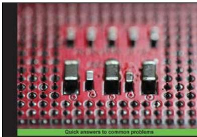
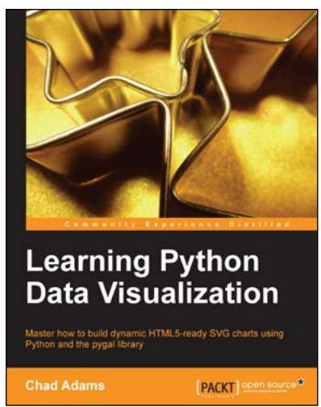
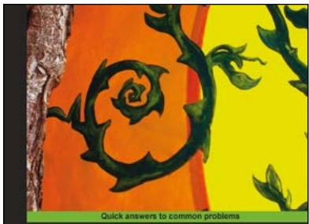
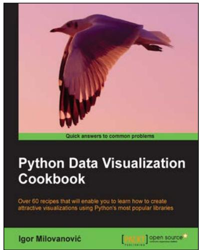

# Thank you for buying Bioinformatics with Python Cookbook

## About Packt Publishing

Packt, pronounced 'packed', published its first book, Mastering phpMyAdmin for Effective MySQL Management, in April 2004, and subsequently continued to specialize in publishing highly focused books on specific technologies and solutions. 

Our books and publications share the experiences of your fellow IT professionals in adapting and customizing today's systems, applications, and frameworks. Our solution-based books give you the knowledge and power to customize the software and technologies you're using to get the job done. Packt books are more specific and less general than the IT books you have seen in the past. Our unique business model allows us to bring you more focused information, giving you more of what you need to know, and less of what you don't. 

Packt is a modern yet unique publishing company that focuses on producing quality, cutting-edge books for communities of developers, administrators, and newbies alike. For more information, please visit our website at www.packtpub.com. 

## About Packt Open Source

In 2010, Packt launched two new brands, Packt Open Source and Packt Enterprise, in order to continue its focus on specialization. This book is part of the Packt Open Source brand, home to books published on software built around open source licenses, and offering information to anybody from advanced developers to budding web designers. The Open Source brand also runs Packt's Open Source Royalty Scheme, by which Packt gives a royalty to each open source project about whose software a book is sold. 

## Writing for Packt

We welcome all inquiries from people who are interested in authoring. Book proposals should be sent to author@packtpub.com. If your book idea is still at an early stage and you would like to discuss it first before writing a formal book proposal, then please contact us; one of our commissioning editors will get in touch with you. 

We're not just looking for published authors; if you have strong technical skills but no writing experience, our experienced editors can help you develop a writing career, or simply get some additional reward for your expertise. 

Bioinformatics with R Cookbook 

Over 90 practical recipes for computational biologists to model and handle real-life data using R 

Paurush Praveen Sinha open source 

## Bioinformatics with R Cookbook

ISBN: 978-1-78328-313-2 

Paperback: 340 pages 

Over 90 practical recipes for computational biologists to model and handle real-life data using R 

1. Use the existing R-packages to handle biological data. 

2. Represent biological data with attractive visualizations. 

3. An easy-to-follow guide to handle real-life problems in Bioinformatics like Next-generation Sequencing and Microarray Analysis. 

Learning Python Data Visualization 

Master how to build dynamic HTML5-ready SVG charts using Python and the pygal library 

## Learning Python Data Visualization

ISBN: 978-1-78355-333-4 

Paperback: 212 pages 

Master how to build dynamic HTML5-ready SVG charts using Python and the pygal library 

1. A practical guide that helps you break into the world of data visualization with Python. 

2. Understand the fundamentals of building charts in Python. 

3. Packed with easy-to-understand tutorials for developers who are new to Python or charting in Python. 

Please check www.PacktPub.com for information on our titles 

Python Network Programming Cookbook 

Over 70 detailed recipes to develop practical solutions for a wide range of real-world network programming tasks 

Dr. M. O. Faruque Sarker ]opon source 

## Python Network Programming Cookbook

ISBN: 978-1-84951-346-3 

Paperback: 234 pages 

Over 70 detailed recipes to develop practical solutions for a wide range of real-world network programming tasks 

1. Demonstrates how to write various besopke client/server networking applications using standard and popular third-party Python libraries. 

2. Learn how to develop client programs for networking protocols such as HTTP/HTTPS, SMTP, POP3, FTP, CGI, XML-RPC, SOAP and REST. 

3. Provides practical, hands-on recipes combined with short and concise explanations on code snippets. 

## Python Data Visualization Cookbook

ISBN: 978-1-78216-336-7 

Paperback: 280 pages 

Over 60 recipes that will enable you to learn how to create attractive visualizations using Python's most popular libraries 

1. Learn how to set up an optimal Python environment for data visualization. 

2. Understand the topics such as importing data for visualization and formatting data for visualization. 

3. Understand the underlying data and how to use the right visualizations. 

Please check www.PacktPub.com for information on our titles 

## www.ebook777.comwww.it-ebooks.info