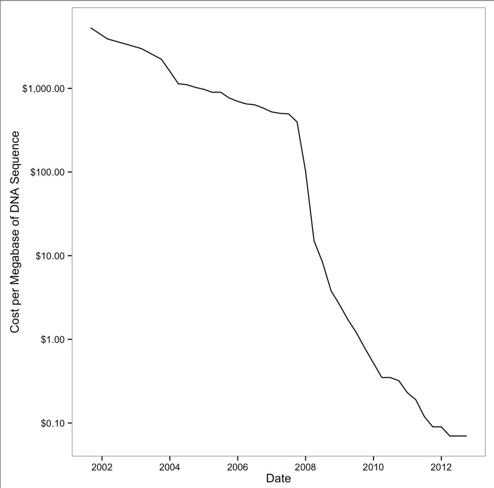
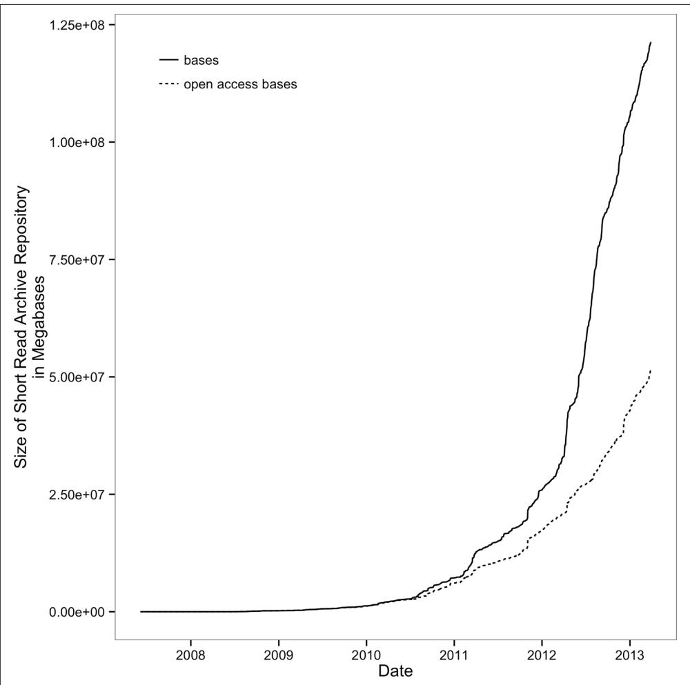

# How to Learn Bioinformatics

Right now, in labs across the world, machines are sequencing the genomes of the life on earth. Even with rapidly decreasing costs and huge technological advancements in genome sequencing, we’re only seeing a glimpse of the biological information con‐ tained in every cell, tissue, organism, and ecosystem. However, the smidgen of total biological information we’re gathering amounts to mountains of data biologists need to work with. At no other point in human history has our ability to understand life’s complexities been so dependent on our skills to work with and analyze data. 

This book is about learning bioinformatics through developing data skills. In this chapter, we’ll see what data skills are, and why learning data skills is the best way to learn bioinformatics. We’ll also look at what robust and reproducible research entails. 

## Why Bioinformatics? Biology’s Growing Data

Bioinformaticians are concerned with deriving biological understanding from large amounts of data with specialized skills and tools. Early in biology’s history, the data‐ sets were small and manageable. Most biologists could analyze their own data after taking a statistics course, using Microsoft Excel on a personal desktop computer. However, this is all rapidly changing. Large sequencing datasets are widespread, and will only become more common in the future. Analyzing this data takes different tools, new skills, and many computers with large amounts of memory, processing power, and disk space. 

In a relatively short period of time, sequencing costs dropped drastically, allowing researchers to utilize sequencing data to help answer important biological questions. Early sequencing was low-throughput and costly. Whole genome sequencing efforts were expensive (the human genome cost around $2.7 billion) and only possible through large collaborative efforts. Since the release of the human genome, sequenc‐ ing costs have decreased exponentially until about 2008, as shown in Figure 1-1. With the introduction of next-generation sequencing technologies, the cost of sequencing a megabase of DNA dropped even more rapidly. At this crucial point, a technology that was only affordable to large collaborative sequencing efforts (or individual research‐ ers with very deep pockets) became affordable to researchers across all of biology. You’re likely reading this book to learn to work with sequencing data that would have been much too expensive to generate less than 10 years ago. 




Figure 1-1. Drop of sequencing costs (note the y-axis is on a logarithmic scale); the sharp drop around 2008 was due to the introduction of next-generation sequencing data. (fg‐ ure reproduced and data downloaded from the NIH)


What was the consequence of this drop in sequencing costs due to these new technol‐ ogies? As you may have guessed, lots and lots of data. Biological databases have swelled with data after exponential growth. Whereas once small databases shared between collaborators were sufficient, now petabytes of useful data are sitting on servers all over the world. Key insights into biological questions are stored not just in the unanalyzed experimental data sitting on your hard drive, but also spinning around a disk in a data center thousands of miles away. 

The growth of biological databases is as astounding as the drop of sequencing costs. As an example, consider the Sequence Read Archive (previously known as the Short Read Archive), a repository of the raw sequencing data from sequencing experiments. Since 2010, it has experienced remarkable growth; see Figure 1-2. 

To put this incredible growth of sequencing data into context, consider Moore’s Law. Gordon Moore (a cofounder of Intel) observed that the number of transistors in computer chips doubles roughly every two years. More transistors per chip translates to faster speeds in computer processors and more random access memory in com‐ puters, which leads to more powerful computers. This extraordinary rate of techno‐ logical improvement—output doubling every two years—is likely the fastest growth in technology humanity has ever seen. Yet, since 2011, the amount of sequencing data stored in the Short Read Archive has outpaced even this incredible growth, having doubled every year. 

To make matters even more complicated, new tools for analyzing biological data are continually being created, and their underlying algorithms are advancing. A 2012 review listed over 70 short-read mappers (Fonseca et al., 2012; see http://bit.ly/htsmappers). Likewise, our approach to genome assembly has changed considerably in the past five years, as methods to assemble long sequences (such as overlap-layoutconsensus algorithms) were abandoned with the emergence of short high-throughput sequencing reads. Now, advances in sequencing chemistry are leading to longer sequencing read lengths and new algorithms are replacing others that were just a few years old. 

Unfortunately, this abundance and rapid development of bioinformatics tools has serious downsides. Often, bioinformatics tools are not adequately benchmarked, or if they are, they are only benchmarked in one organism. This makes it difficult for new biologists to find and choose the best tool to analyze their data. To make matters more difficult, some bioinformatics programs are not actively developed so that they lose relevance or carry bugs that could negatively affect results. All of this makes choosing an appropriate bioinformatics program in your own research difficult. More importantly, it’s imperative to critically assess the output of bioinformatics programs run on your own data. We’ll see examples of how data skills can help us assess pro‐ gram output throughout Part II. 




Figure 1-2. Exponential growth of the Short Read Archive; open access bases are SRA submissions available to the public (fgure reproduced and data downloaded from the NIH)


## Learning Data Skills to Learn Bioinformatics

With the nature of biological data changing so rapidly, how are you supposed to learn bioinformatics? With all of the tools out there and more continually being created, how is a biologist supposed to know whether a program will work appropriately on her organism’s data? 

The solution is to approach bioinformatics as a bioinformatician does: try stuff, and assess the results. In this way, bioinformatics is just about having the skills to experi‐ ment with data using a computer and understanding your results. The experimental part is easy; this comes naturally to most scientists. The limiting factor for most biol‐ ogists is having the data skills to freely experiment and work with large data on a computer. The goal of this book is to teach you the bioinformatics data skills neces‐ sary to allow you to experiment with data on a computer as easily as you would run experiments in the lab. 

Unfortunately, many of the biologist’s common computational tools can’t scale to the size and complexity of modern biological data. Complex data formats, interfacing numerous programs, and assessing software and data make large bioinformatics data‐ sets difficult to work with. Learning core bioinformatics data skills will give you the foundation to learn, apply, and assess any bioinformatics program or analysis method. In 10 years, bioinformaticians may only be using a few of the bioinformatics software programs around today. But we most certainly will be using data skills and experimentation to assess data and methods of the future. 

So what are data skills? They are the set of computational skills that give you the abil‐ ity to quickly improvise a way of looking at complex datasets, using a well-known set of tools. A good analogy is what jazz musicians refer to as having “chops.” A jazz musician with good chops can walk into a nightclub, hear a familiar standard song being played, recognize the chord changes, and begin playing musical ideas over these chords. Likewise, a bioinformatician with good data skills can receive a huge sequencing dataset and immediately start using a set of tools to see what story the data tells. 

Like a jazz musician that’s mastered his instrument, a bioinformatician with excellent data chops masters a set of tools. Learning one’s tools is a necessary, but not sufficient step in developing data skills (similarly, learning an instrument is a necessary, but not sufficient step to playing musical ideas). Throughout the book, we will develop our data skills, from setting up a bioinformatics project and data in Part II, to learning both small and big tools for data analysis in Part III. However, this book can only set you on the right path; real mastery requires learning through repeatedly applying skills to real problems. 

## New Challenges for Reproducible and Robust Research

Biology’s increasing use of large sequencing datasets is changing more than the tools and skills we need: it’s also changing how reproducible and robust our scientific find‐ ings are. As we utilize new tools and skills to analyze genomics data, it’s necessary to ensure that our approaches are still as reproducible and robust as any other experi‐ mental approaches. Unfortunately, the size of our data and the complexity of our analysis workflows make these goal especially difficult in genomics. 

The requisite of reproducibility is that we share our data and methods. In the pregenomics era, this was much easier. Papers could include detailed method summaries and entire datasets—exactly as Kreitman’s 1986 paper did with a 4,713bp Adh gene flanking sequence (it was embedded in the middle of the paper). Now papers have long supplementary methods, code, and data. Sharing data is no longer trivial either, as sequencing projects can include terabytes of accompanying data. Reference genomes and annotation datasets used in analyses are constantly updated, which can make reproducibility tricky. Links to supplemental materials, methods, and data on journal websites break, materials on faculty websites disappear when faculty members move or update their sites, and software projects become stale when developers leave and don’t update code. Throughout this book, we’ll look at what can be done to improve reproducibility of your project alongside doing the actual analysis, as I believe these are necessarily complementary activities. 

Additionally, the complexity of bioinformatics analyses can lead to findings being susceptible to errors and technical confounding. Even fairly routine genomics projects can use dozens of different programs, complicated input parameter combi‐ nations, and many sample and annotation datasets; in addition, work may be spread across servers and workstations. All of these computational data-processing steps cre‐ ate results used in higher-level analyses where we draw our biological conclusions. The end result is that research findings may rest on a rickety scaffold of numerous processing steps. To make matters worse, bioinformatics workflows and analyses are usually only run once to produce results for a publication, and then never run or tes‐ ted again. These analyses may rely on very specific versions of all software used, which can make it difficult to reproduce on a different system. In learning bioinfor‐ matics data skills, it’s necessary to concurrently learn reproducibility and robust best practices. Let’s take a look at both reproducibility and robustness in turn. 

## Reproducible Research

Reproducing scientific findings is the only way to confirm they’re accurate and not the artifact of a single experiment or analysis. Karl Popper, in Te Logic of Scientifc Discovery, famously said: “non-reproducible single occurrences are of no significance to science” (1959). Independent replication of experiments and analysis is the gold standard by which we assess the validity of scientific findings. Unfortunately, most sequencing experiments are too expensive to reproduce from the test tube up, so we increasingly rely on in silico reproducibility only. The complexity of bioinformatics projects usually discourages replication, so it’s our job as good scientists to facilitate and encourage in silico reproducibility by making it easier. As we’ll see later, adopting good reproducibility practices can also make your life easier as a researcher. 

So what is a reproducible bioinformatics project? At the very least, it’s sharing your project’s code and data. Most journals and funding agencies require you to share your project’s data, and resources like NCBI’s Sequence Read Archive exist for this pur‐ pose. Now, editors and reviewers will often suggest (or in some cases require) that a project’s code also be shared, especially if the code is a significant part of a study’s results. However, there’s a lot more we can and should do to ensure our projects reproducibility. By having to reproduce bioinformatics analyses to verify results, I’ve learned from these sleuthing exercises that the devil is in the details. 

For example, colleagues and I once had a difficult time reproducing an RNA-seq dif‐ ferential expression analysis we had done ourselves. We had preliminary results from an analysis on a subset of samples done a few weeks earlier, but to our surprised, our current analysis was producing a drastically smaller set of differentially expressed genes. After rechecking how our past results were created, comparing data versions and file creation times, and looking at differences in the analysis code, we were still stumped—nothing could explain the difference between the results. Finally, we checked the version of our R package and realized that it had been updated on our server. We then reinstalled the old version to confirm this was the source of the dif‐ ference, and indeed it was. The lesson here is that often replication, by either you in the future or someone else, relies on not just data and code but details like software versions and when data was downloaded and what version it is. This metadata, or data about data, is a crucial detail in ensuring reproducibility. 

Another motivating case study in bioinformatics reproducibility is the so-called “Duke Saga.” Dr. Anil Potti and other researchers at Duke University created a method that used expression data from high-throughput microarrays to detect and predict response to different chemotherapy drugs. These methods were the beginning of a new level of personalized medicine, and were being used to determine the che‐ motherapy treatments for patients in clinical trials. However, two biostatisticians, Keith Baggerly and Kevin Coombes, found serious flaws in the analysis of this study when trying to reproduce it (Baggerly and Coombes, 2009). Many of these required what Baggerly and Coombes called “forensic bioinformatics”—sleuthing to try to reproduce a study’s findings when there isn’t sufficient documentation to retrace each step. In total, Baggerly and Coombes found multiple serious errors, including: 

• An off-by-one error, as an entire list of gene expression values was shifted down in relation to their correct identifier 

• Two outlier genes of biological interest were not on the microarrays used 

• There was confounding of treatment with the day the microarray was run 

• Sample group names were mixed up 

Baggerly and Coombes’s work is best summarized by their open access article, “Deriving Chemosensitivity from Cell Lines: Forensic Bioinformatics and Reproduci‐ ble Research in High-Throughput Biology” (see this chapter’s GitHub directory for this article and more information about the Duke Saga). The lesson of Baggerly and Coombes’s work is that “common errors are simple, and simple errors are common” and poor documentation can lead to both errors and irreproducibility. Documenta‐ tion of methods, data versions, and code would have not only facilitated reproducibil‐ ity, but it likely would have prevented a few of these serious errors in their study. Striving for maximal reproducibility in your project often will make your work more robust, too. 

## Robust Research and the Golden Rule of Bioinformatics

Since the computer is a sharp enough tool to be really useful, you can cut yourself on it. 

— Te Technical Skills of Statistics 

(1964) John Tukey 

In wetlab biology, when experiments fail, it can be very apparent, but this is not always true in computing. Electrophoresis gels that look like Rorschach blots rather than tidy bands clearly indicate something went wrong. In scientific computing, errors can be silent; that is, code and programs may produce output (rather than stop with an error), but this output may be incorrect. This is a very important notion to put in the back of your head as you learn bioinformatics. 

Additionally, it’s common in scientific computing for code to be run only once, as researchers get their desired output and move on to the next step. In contrast, con‐ sider a video game: it’s run on thousands (if not millions) of different machines, and is, in effect, constantly being tested by many users. If a bug that deletes a user’s score occurs, it’s exceptionally likely to be quickly noticed and reported by users. Unfortu‐ nately, the same is not true for most bioinformatics projects. 

Genomics data also creates its own challenges for robust research. First, most bioin‐ formatics analyses produce intermediate output that is too large and high dimen‐ sional to inspect or easily visualize. Most analyses also involve multiple steps, so even if it were feasible to inspect an entire intermediate dataset for problems, it would be difficult to do this for each step (thus, we usually resort to inspecting samples of the data, or looking at data summary statistics). Second, in wetlab biology, it’s usually eas‐ ier to form prior expectations about what the outcome of an experiment might be. For example, a researcher may expect to see a certain mRNA expressed in some tis‐ sues in lower abundances than a particular housekeeping gene. With these prior expectations, an aberrant result can be attributed to a failed assay rather than biology. In contrast, the high dimensionality of most genomics results makes it nearly impos‐ sible to form strong prior expectations. Forming specific prior expectations on the expression of each of tens of thousands of genes assayed by an RNA-seq experiment is impractical. Unfortunately, without prior expectations, it can be quite difficult to distinguish good results from bad results. 

Bioinformaticians also have to be wary that bioinformatics programs, even the large community-vetted tools like aligners and assemblers, may not work well on their par‐ ticular organism. Organisms are all wonderfully, strangely different, and their genomes are too. Many bioinformatics tools are tested on a few model diploid organ‐ isms like human, and less well-tested on the complex genomes from the other parts of the tree of life. Do we really expect that out-of-the-box parameters from a short-read aligner tuned to human data will work on a polyploid genome four times its size? Probably not. 

The easy way to ensure everything is working properly is to adopt a cautious attitude, and check everything between computational steps. Furthermore, you should approach biological data (either from an experiment or from a database) with a healthy skepticism that there might be something wrong with it. In the computing community, this is related to the concept of “garbage in, garbage out”—an analysis is only as good as the data going in. In teaching bioinformatics, I often share this idea as the Golden Rule of Bioinformatics: 

## Never ever trust your tools (or data)

This isn’t to make you paranoid that none of bioinformatics can be trusted, or that you must test every available program and parameter on your data. Rather, this is to train you to adopt the same cautious attitude software engineers and bioinformati‐ cians have learned the hard way. Simply checking input data and intermediate results, running quick sanity checks, maintaining proper controls, and testing programs is a great start. This also saves you from encountering bugs later on, when fixing them means redoing large amounts of work. You naturally test whether lab techniques are working and give consistent results; adopting a robust approach to bioinformatics is merely doing the same in bioinformatics analyses. 

## Adopting Robust and Reproducible Practices Will Make Your Life Easier, Too

Working in sciences has taught many of us some facts of life the hard way. These are like Murphy’s law: anything that can go wrong, will. Bioinformatics has its own set of laws like this. Having worked in the field and discussed war stories with other bioin‐ formaticians, I can practically guarantee the following will happen: 

• You will almost certainly have to rerun an analysis more than once, possibly with new or changed data. Frequently this happens because you’ll find a bug, a collab‐ orator will add or update a file, or you’ll want to try something new upstream of a step. In all cases, downstream analyses depend on these earlier results, meaning all steps of an analysis need to be rerun. 

• In the future, you (or your collaborators, or advisor) will almost certainly need to revisit part of a project and it will look completely cryptic. Your only defense is to document each step. Without writing down key facts (e.g., where you downloa‐ ded data from, when you downloaded it, and what steps you ran), you’ll certainly forget them. Documenting your computational work is equivalent to keeping a detailed lab notebook—an absolutely crucial part of science. 

Luckily, adopting practices that will make your project reproducible also helps solve these problems. In this sense, good practices in bioinformatics (and scientific com‐ puting in general) both make life easier and lead to reproducible projects. The reason for this is simple: if each step of your project is designed to be rerun (possibly with different data) and is well documented, it’s already well on its way to being reproduci‐ ble. 

For example, if we automate tasks with a script and keep track of all input data and software versions, analyses can be rerun with a keystroke. Reproducing all steps in this script is much easier, as a well-written script naturally documents a workflow (we’ll discuss this more in Chapter 12). This approach also saves you time: if you receive new or updated data, all you need to do is rerun the script with the new input file. This isn’t hard to do in practice; scripts aren’t difficult to write and computers excel at doing repetitive tasks enumerated in a script. 

## Recommendations for Robust Research

Robust research is largely about adopting a set of practices that stack the odds in your favor that a silent error won’t confound your results. As mentioned above, most of these practices are also beneficial for reasons other than preventing the dreaded silent error—which is all the more reason to include apply the recommendations below in your daily bioinformatics work. 

## Pay Attention to Experimental Design

Robust research starts with a good experimental design. Unfortunately, no amount of brilliant analysis can save an experiment with a bad design. To quote a brilliant statis‐ tician and geneticist: 

To consult the statistician after an experiment is finished is often merely to ask him to conduct a post mortem examination. He can perhaps say what the experiment died of. 

—R.A. Fisher 

This quote hits close to the heart; I’ve seen projects land on my desk ready for analy‐ sis, after thousands of sequencing dollars were spent, yet they’re completely dead on arrival. Good experimental design doesn’t have to be difficult, but as it’s fundamen‐ tally a statistical topic it’s outside of the scope of this book. I mention this topic because unfortunately nothing else in this book can save an experiment with a bad design. It’s especially necessary to think about experimental design in highthroughput studies, as technical “batch effects” can significantly confound studies (for a perspective on this, see Leek et al., 2010). 

Most introductory statistics courses and books cover basic topics in experimental design. Quinn and Keough’s Experimental Design and Data Analysis for Biologists (Cambridge University Press, 2002) is an excellent book on this topic. Chapter 18 of O’Reilly’s Statistics in a Nutshell, 2nd Edition, by Sarah Boslaugh covers the basics well, too. Note, though, that experimental design in a genomics experiment is a dif‐ ferent beast, and is actively researched and improved. The best way to ensure your multithousand dollar experiment is going to reach its potential is to see what the cur‐ rent best design practices are for your particular project. It’s also a good idea to con‐ sult your local friendly statistician about any experimental design questions or concerns you may have in planning an experiment. 

## Write Code for Humans, Write Data for Computers

Debugging is twice as hard as writing the code in the first place. Therefore, if you write the code as cleverly as possible, you are, by definition, not smart enough to debug it. 

—Brian Kernighan 

Bioinformatics projects can involve mountains of code, and one of our best defenses against bugs is to write code for humans, not for computers (a point made in the excellent article from Wilson et al., 2012). Humans are the ones doing the debugging, so writing simple, clear code makes debugging easier. 

Code should be readable, broken down into small contained components (modular), and reusable (so you’re not rewriting code to do the same tasks over and over again). These practices are crucial in the software world, and should be applied in your bio‐ informatics work as well. Commenting code and adopting a style guide are simple ways to increase code readability. Google has public style guides for many languages, which serve as excellent templates. Why is code readability so important? First, reada‐ ble code makes projects more reproducible, as others can more easily understand what scripts do and how they work. Second, it’s much easier to find and correct soft‐ ware bugs in readable, well-commented code than messy code. Third, revisiting code in the future is always easier when the code is well commented and clearly written. Writing modular and reusable code just takes practice—we’ll see some examples of this throughout the book. 

In contrast to code, data should be formatted in a way that facilitates computer read‐ ability. All too often, we as humans record data in a way that maximizes its readability to us, but takes a considerable amount of cleaning and tidying before it can be pro‐ cessed by a computer. The more data (and metadata) that is computer readable, the more we can leverage our computers to work with this data. 

## Let Your Computer Do the Work For You

Humans doing rote activities tend to make many mistakes. One of the easiest ways to make your work more robust is to have your computer do as much of this rote work as possible. This approach of automating tasks is more robust because it decreases the odds you’ll make a trivial mistake such as accidentally omitting a file or naming out‐ put incorrectly. 

For example, running a program on 20 different files by individually typing out (or copy and pasting) each command is fragile—the odds of making a careless mistake increase with each file you process. In bioinformatics work, it’s good to develop the habit of letting your computer do this sort of repetitive work for you. Instead of past‐ ing the same command 20 times and just changing the input and output files, write a script that does this for you. Not only is this easier and less likely to lead to mistakes, but it also increases reproducibility, as your script serves as a reference of what you did to each of those files. 

Leveraging the benefits of automating tasks requires a bit of thought in organizing up your projects, data, and code. Simple habits like naming data files in a consistent way that a computer (and not just humans) can understand can greatly facilitate automat‐ ing tasks and make work much easier. We’ll see examples of this in Chapter 2. 

## Make Assertions and Be Loud, in Code and in Your Methods

When we write code, we tend to have implicit assumptions about our data. For exam‐ ple, we expect that there are only three DNA strands options (forward, reverse, and unknown), that the start position of a gene is less than the end position, and that we can’t have negative positions. These implicit assumptions we make about data impact how we write code; for example, we may not think to handle a certain situation in code if we assume it won’t occur. Unfortunately, this can lead to the dreaded silent error: our code or programs receive values outside our expected values, behave improperly, and yet still return output without warning. Our best approach to pre‐ vent this type of error is to explicitly state and test our assumptions about data in our code using assert statements like Python’s assert() and R’s stopifnot(). 

Nearly every programming language has its own version of the assert function. These assert functions operate in a similar way: if the statement evaluated to false, the assert function will stop the program and raise an error. They may be simple, but these assert functions are indispensable in robust research. Early in my career, a mentor motivated me to adopt the habit of using asserts quite liberally—even when it seems like there is absolutely no way the statement could ever be false—and yet I’m continu‐ ally surprised at how many times these have caught a subtle error. In bioinformatics (and all fields), it’s crucial that we do as much as possible to turn the dreaded silent error into loud errors. 

## Test Code, or Better Yet, Let Code Test Code

Software engineers are a clever bunch, and they take the idea of letting one’s com‐ puter do the work to new levels. One way they do this is having code test other code, rather than doing it by hand. A common method to test code is called unit testing. In unit testing, we break down our code into individual modular units (which also has the side effect of improving readability) and we write additional code that tests this code. In practice, this means if we have a function called add(), we write an addi‐ tional function (usually in separate file) called test_add(). This test_add() function would call the add() function with certain input, and test that the output is as expected. In Python, this may look like: 

```python
EPS = 0.00001 # a small number to use when comparing floating-point values
def add(x, y):
    """Add two things together."""
    return x + y
def test_add():
    """Test that the add() function works for a variety of numeric types."""
    assert(add(2, 3) == 5)
    assert(add(-2, 3) == 1)
    assert(add(-1, -1) == -2)
    assert(abs(add(2.4, 0.1) - 2.5) < EPS) 
```

The last line of the test_add() function looks more complicated than the others because it’s comparing floating-point values. It’s difficult to compare floating-point values on a computer, as there are representation and roundoff errors. However, it’s a good reminder that we’re always limited by what our machine can do, and we must mind these limitations in analysis. 

Unit testing is used much less in scientific coding than in the software industry, despite the fact that scientific code is more likely to contain bugs (because our code is usually only run once to generate results for a publication, and many errors in scien‐ tific code are silent). I refer to this as the paradox of scientifc coding: the bug-prone nature of scientific coding means we should utilize testing as much or more than the software industry, but we actually do much less testing (if any). This is regrettable, as nowadays many scientific conclusions are the result of mountains of code. 

While testing code is the best way to find, fix, and prevent software bugs, testing isn’t cheap. Testing code makes our results robust, but it also takes a considerable amount of our time. Unfortunately, it would take too much time for researchers to compose unit tests for every bit of code they write. Science moves quickly, and in the time it would take to write and perform unit tests, your research could become outdated or get scooped. A more sensible strategy is to consider three important variables each time you write a bit of code: 

• How many times is this code called by other code? 

• If this code were wrong, how detrimental to the final results would it be? 

• How noticeable would an error be if one occurred? 

How important it is to test a bit of code is proportional to the first two variables, and inversely proportional to the third (i.e., if a bug is very noticeable, there’s less reason to write a test for it). We’ll employ this strategy throughout the book’s examples. 

## Use Existing Libraries Whenever Possible

There’s a turning point in every budding programmer’s career when they feel com‐ fortable enough writing code and think, “Hey, why would I use a library for this, I could easily write this myself.” It’s an empowering feeling, but there are good reasons to use an existing software library instead. 

Existing open source libraries have two advantages over libraries you write yourself: a longer history and a wider audience. Both of these advantages translate to fewer bugs. Bugs in software are similar to the proverbial problem of finding a needle in a hay‐ stack. If you write your own software library (where a few bugs are bound to be lurk‐ ing), you’re one person looking for a few needles. In contrast, open source software libraries in essence have had many more individuals looking for a much longer time for those needles. Consequently, bugs are more likely to be found, reported, and fixed in these open source libraries than your own home-brewed versions. 

A good example of this is a potentially subtle issue that arises when writing a script to translate nucleotides to proteins. Most biologists with some programming experience could easily write a script to do this task. But behind these simple programming exer‐ cises lurks hidden complexity you alone may not consider. What if your nucleotide sequences have Ns in them? Or Ys? Or Ws? Ns, Ys, and Ws may not seem like valid bases, but these are International Union of Pure and Applied Chemistry (IUPAC) standard ambiguous nucleotides and are entirely valid in bioinformatics. In many cases, well-vetted software libraries have already found and fixed these sorts of hid‐ den problems. 

## Treat Data as Read-Only

Many scientists spend a lot of time using Excel, and without batting an eye will change the value in a cell and save the results. I strongly discourage modifying data this way. Instead, a better approach is to treat all data as read-only and only allow pro‐ grams to read data and create new, separate files of results. 

Why is treating data as read-only important in bioinformatics? First, modifying data in place can easily lead to corrupted results. For example, suppose you wrote a script that directly modifies a file. Midway through processing a large file, your script encounters an error and crashes. Because you’ve modified the original file, you can’t undo the changes and try again (unless you have a backup)! Essentially, this file is corrupted and can no longer be used. 

Second, it’s easy to lose track of how we’ve changed a file when we modify it in place. Unlike a workflow where each step has an input file and an output file, a file modified in place doesn’t give us any indication of what we’ve done to it. If we were to lose track of how we’ve changed a file and don’t have a backup copy of the original data, our changes are essentially irreproducible. 

Treating data as read-only may seem counterintuitive to scientists familiar with work‐ ing extensively in Excel, but it’s essential to robust research (and prevents catastrophe, and helps reproducibility). The initial difficulty is well worth it; in addition to safe‐ guarding data from corruption and incorrect changes, it also fosters reproducibility. Additionally, any step of the analysis can easily be redone, as the input data is unchanged by the program. 

## Spend Time Developing Frequently Used Scripts into Tools

Throughout your development as a highly skilled bioinformatician, you’ll end up cre‐ ating some scripts that you’ll use over and over again. These may be scripts that download data from a database, or process a certain type of file, or maybe just gener‐ ate the same pretty graphs. These scripts may be shared with lab members or even across labs. You should put extra effort and attention into making these high-use or highly shared scripts as robust as possible. In practice, I think of this process as turn‐ ing one-off scripts into tools. 

Tools, in contrast to scripts, are designed to be run over and over again. They are well documented, have explicit versioning, have understandable command-line argu‐ ments, and are kept in a shared version control repository. These may seem like minor differences, but robust research is about doing small things that stack the deck in your favor to prevent mistakes. Scripts that you repeatedly apply to numerous datasets by definition impact more results, and deserve to be more developed so they’re more robust and user friendly. This is especially the case with scripts you share with other researchers who need to be able to consult documentation and apply your tool safely to their own data. While developing tools is a more labor-intensive process than writing a one-off script, in the long run it can save time and prevent headaches. 

## Let Data Prove That It’s High Quality

When scientists think of analyzing data, they typically think of analyzing experimen‐ tal data to draw biological conclusions. However, to conduct robust bioinformatics work, we actually need to analyze more than just experimental data. This includes inspecting and analyzing data about your experiment’s data quality, intermediate out‐ put files from bioinformatics programs, and possibly simulated test data. Doing so ensures our data processing is functioning as we expect, and embodies the golden rule of bioinformatics: don’t trust your tools or data. 

It’s important to never assume a dataset is high quality. Rather, data’s quality should be proved through exploratory data analysis (known as EDA). EDA is not complex or time consuming, and will make your research much more robust to lurking surprises in large datasets. We’ll learn more about EDA using R in Chapter 8. 

## Recommendations for Reproducible Research

Adopting reproducible research practices doesn’t take much extra effort. And like robust research practices, reproducible methods will ultimately make your life easier as you yourself may need to reproduce your past work long after you’ve forgotten the details. Below are some basic recommendations to consider when practicing bioin‐ formatics to make your work reproducible. 

## Release Your Code and Data

For reproducibility, the absolute minimal requirements are that code and data are released. Without available code and data, your research is not reproducible (see Peng, 2001 for a nice discussion of this). We’ll discuss how to share code and data a bit later in the book. 

## Document Everything

The first day a scientist steps into a lab, they’re told to keep a lab notebook. Sadly, this good practice is often abandoned by researchers in computing. Releasing code and data is the minimal requirement for reproducibility, but extensive documentation is an important component of reproducibility, too. To fully reproduce a study, each step of analysis must be described in much more detail than can be accomplished in a scholarly article. Thus, additional documentation is essential for reproducibility. 

A good practice to adopt is to document each of your analysis steps in plain-text README files. Like a detailed lab notebook, this documentation serves as a valuable record of your steps, where files are, where they came from, or what they contain. This documentation can be stored alongside your project’s code and data (we’ll see more about this in Chapters 2 and 5), which can aid collaborators in figuring out what you’ve done. Documentation should also include all input parameters for each program executed, these programs’ versions, and how they were run. Modern soft‐ ware like R’s knitr and iPython Notebooks are powerful tools in documenting research; I’ve listed some resources to get started with these tools in this chapter’s README on GitHub. 

## Make Figures and Statistics the Results of Scripts

Ensuring that a scientific project is reproducible involves more than just replicability of the key statistical tests important for findings—supporting elements of a paper (e.g., figures and tables) should also be reproducible. The best way to ensure these components are reproducible is to have each image or table be the output of a script (or scripts). 

Writing scripts to produce images and tables may seem like a more time-consuming process than generating these interactively in Excel or R. However, if you’ve ever had to regenerate multiple figures by hand after changing an earlier step, you know the merit of this approach. Scripts that generate tables and images can easily be rerun, save you time, and lead your research to be more reproducible. Tools like iPython Notebooks and knitr (mentioned in the previous section) greatly assist in these tasks, too. 

## Use Code as Documentation

With complex processing pipelines, often the best documentation is well documented code. Because code is sufficient to tell a computer how to execute a pro‐ gram (and which parameters to use), it’s also close to sufficient to tell a human how to replicate your work (additional information like software version and input data is also necessary to be fully reproducible). In many cases, it can be easier to write a script to perform key steps of an analysis than it is to enter commands and then document them elsewhere. Again, code is a wonderful thing, and using code to docu‐ ment each step of an analysis means it’s easy to rerun all steps of an analysis if neces‐ sary—the script can just simply be rerun. 

## Continually Improving Your Bioinformatics Data Skills

Keep the basic ideology introduced in this chapter in the back of your head as you work through the rest of the book. What I’ve introduced here is just enough to get you started in thinking about some core concepts in robust and reproducible bioin‐ formatics. Many of these topics (e.g., reproducibility and software testing) are still actively researched at this time, and I encourage the interested reader to explore these in more depth (I’ve included some resources in this chapter’s README on GitHub). 

PART II 

# Prerequisites: Essential Skills for Getting Started with a Bioinformatics Project