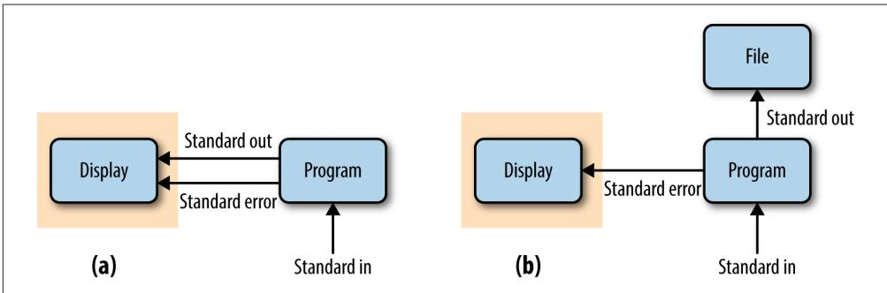

# Remedial Unix Shell

The Unix shell is the foundational computing environment for bioinformatics. The shell serves as our interface to large bioinformatics programs, as an interactive con‐ sole to inspect data and intermediate results, and as the infrastructure for our pipe‐ lines and workflows. This chapter will help you develop a proficiency with the necessary Unix shell concepts used extensively throughout the rest of the book. This will allow you to focus on the content of commands in future chapters, rather than be preoccupied with understanding shell syntax. 

This book assumes you’re familiar with basic topics such as what a terminal is, what the shell is, the Unix filesystem hierarchy, moving about directories, file permissions, executing commands, and working with a text editor. If these topics sound foreign to you, it’s best to brush up on using more basic materials (see “Assumptions This Book Makes” on page xvi for some resources). In this chapter, we’ll cover remedial concepts that deeply underly how we use the shell in bioinformatics: streams, redirection, pipes, working with running programs, and command substitution. Understanding these shell topics will prepare you to use the shell to work with data (Chapter 7) and build pipelines and workflows (Chapter 12). In this chapter, we’ll also see why the Unix shell has such a prominent role in how we do modern bioinformatics. If you feel comfortable with these shell topics already, I suggest reading the first section of this chapter and then skipping to Chapter 4. 

## Why Do We Use Unix in Bioinformatics? Modularity and the Unix Philosophy

Imagine rather than using the Unix shell as our bioinformatics computing environ‐ ment, we were to implement our entire project as single large program. We usually don’t think of a bioinformatics project as a “program” but it certainly could be—we could write a single complex program that takes raw data as input, and after hours of data processing, outputs publication figures and a final table of results. For a project like variant calling, this program would include steps for raw sequence read process‐ ing, read mapping, variant calling, filtering variant calls, and final data analysis. This program’s code would be massive—easily thousands of lines long. 

While a program like this has the benefit of being customized to a particular variant calling project, it would not be general enough to adapt to others. Given its immense amount of code, this program would be impractical to adjust to each new project. The large codebase would also make finding and fixing bugs difficult. To make mat‐ ters worse, unless our monolithic program was explicitly programmed to check that data between steps looked error free, a step may go awry (unbeknownst to us) and it would dutifully continue the analysis with incorrect data. While this custom program might be more computationally efficient, this would come at the expense of being fragile, difficult to modify, error prone (because it makes checking intermediate data very difficult), and not generalizable to future projects. 

Unix is the foundational computing environment in bioinformatics because its design philosophy is the antithesis of this inflexible and fragile approach. The Unix shell was designed to allow users to easily build complex programs by interfacing smaller mod‐ ular programs together. This approach is the Unix philosophy: 

This is the Unix philosophy: Write programs that do one thing and do it well. Write programs to work together. Write programs to handle text streams, because that is a universal interface. 

—Doug McIlory 

The Unix shell provides a way for these programs to talk to each other (pipes) and write to and read files (redirection). Unix’s core programs (which we’ll use to analyze data on the command line in Chapter 7) are modular and designed to work well with other programs. The modular approach of the Unix philosophy has many advantages in bioinformatics: 

• With modular workflows, it’s easier to spot errors and figure out where they’re occurring. In a modular workflow, each component is independent, which makes it easier to inspect intermediate results for inconsistencies and isolate problem‐ atic steps. In contrast, large nonmodular programs hide potential problems (all you see is its final output data) and make isolating where problems originate dif‐ ficult. 

• Modular workflows allow us to experiment with alternative methods and approaches, as separate components can be easily swapped out with other com‐ ponents. For example, if you suspect a particular aligner is working poorly with your data, it’s easy to swap this aligner out with another one. This is possible only with modular workflows, where our alignment program is separate from down‐ stream steps like variant calling or RNA-seq analysis. 

• Modular components allow us to choose tools and languages that are appropriate for specific tasks. This is another reason the Unix environment fits bioinformat‐ ics well: it allows us to combine command-line tools for interactively exploring data (covered in more depth in Chapter 7), Python for more sophisticated script‐ ing, and R for statistical analysis. When programs are designed to work with other programs, there’s no cost to choosing a specialized tool for a specific task— something we quite often do in bioinformatics. 

• Modular programs are reusable and applicable to many types of data. Wellwritten modular programs can be recombined and applied to different problems and datasets, as they are independent pieces. Most important, by remixing modu‐ lar components, novel problems can be solved with existing tools. 

In addition to emphasizing the program modularity and interfacing, McIlroy’s quote also mentions text streams. We’ll address Unix streams in this chapter, but the concept of a stream is very important in how we process large data. Definitions of large data may vary, and while a single lane of sequencing data may be big to one lab just getting into sequencing, this is minuscule compared to what larger sequencing centers pro‐ cess each hour. Regardless, a lane of sequencing data is too big to fit in the memory of most standard desktops. If I needed to search for the exact string “GTGAT‐ TAACTGCGAA” in this data, I couldn’t open up a lane of data in Notepad and use the Find feature to pinpoint where it occurs—there simply isn’t enough memory to hold all these nucleotides in memory. Instead, tools must rely on streams of data, being read from a source and actively processed. Both general Unix tools and many bioinformatics programs are designed to take input through a stream and pass output through a different stream. It’s these text streams that allow us to both couple pro‐ grams together into workflows and process data without storing huge amounts of data in our computers’ memory. 


## The Many Unix Shells

Throughout this book, I’ll refer to the Unix shell in general, but there’s no single Unix shell. Shells are computer programs, and many programmers have designed and implemented their own versions. These many versions can lead to frustrating problems for new users, as some shells have features incompatible with others. 

To avoid this frustration, make sure you’re using the Bourne-again shell, or bash. Bash is widely available and the default shell on operating systems like Apple’s OS X and Ubuntu Linux. You can run echo $SHELL to verify you’re using bash as your shell (although it’s best to also check what echo $0 says too, because even how you identify your shell differs among shells!). I wouldn’t recommend other shells like the C shell (csh), its descendant tcsh, and the Korn shell (ksh), as these are less popular in bioinformatics and may not be compatible with examples in this book. The Bourne shell (sh) was the predecessor of the Bourne-again shell (bash); but bash is newer and usually preferred. 

It’s possible to change your shell with the command chsh. In my daily bioinformatics work, I use Z shell (zsh) and have made this my default shell. Z shell has more advanced features (e.g., better autocomplete) that come in handy in bioinformatics. Everything in this book is compatible between these two shells unless explicitly noted otherwise. If you feel confident with general shell basics, you may want to try Z shell. I’ve included resources about Z shell in this chapter’s README file on GitHub. 

The last point to stress about the Unix shell is that it’s incredibly powerful. With sim‐ ple features like wildcards, it’s trivial to apply a command to hundreds of files. But with this power comes risk: the Unix shell does not care if commands are mistyped or if they will destroy files; the Unix shell is not designed to prevent you from doing unsafe things. A good analogy comes from Gary Bernhardt: Unix is like a chainsaw. Chainsaws are powerful tools, and make many difficult tasks like cutting through thick logs quite easy. Unfortunately, this power comes with danger: chainsaws can cut just as easily through your leg (well, technically more easily). For example, consider: 

```txt
$ rm -rf tmp-data/aligned-reads* # deletes all old large files
$ # versus
$ rm -rf tmp-data/aligned-reads * # deletes your entire current directory
rm: tmp-data/aligned-reads: No such file or directory 
```

In Unix, a single space could mean the difference between cleaning out some old files and finishing your project behind schedule because you’ve accidentally deleted every‐ thing. This isn’t something that should cause alarm—this is a consequence of working with powerful tools. Rather, just adopt a cautious attitude when experimenting or try‐ ing a new command (e.g., work in a temporary directory, use fake files or data if you’re unsure how a command behaves, and always keep backups). That the Unix shell has the power to allow you to do powerful (possibly unsafe) things is an impor‐ tant part of its design: 

Unix was not designed to stop its users from doing stupid things, as that would also stop them from doing clever things. 

—Doug Gwyn 

Tackling repetitive large data-processing tasks in clever ways is a large part of being a skillful bioinformatician. Our shell is often the fastest tool for these tasks. In this chapter, we’ll focus on some of these Unix shell primitives that allow us to build com‐ plex programs from simple parts: streams, redirection, pipes, working with processes, and command substitution. We’ll learn more about automating tasks, another impor‐ tant part of the Unix shell, in Chapter 12. 

## Working with Streams and Redirection

Bioinformatics data is often text—for example, the As, Cs, Ts, and Gs in sequencing read files or reference genomes, or tab-delimited files of gene coordinates. The text data in bioinformatics is often large, too (gigabytes or more that can’t fit into your computer’s memory at once). This is why Unix’s philosophy of handling text streams is useful in bioinformatics: text streams allow us to do processing on a stream of data rather than holding it all in memory. 

For example, suppose we had two large files full of nucleotide sequences in a FASTA file, a standard text format used to store sequence data (usually of DNA, but occa‐ sionally proteins, too). Even the simple task of combining these two large files into a single file becomes tricky once these are a few gigabytes in size. How would this sim‐ ple task be accomplished without using the Unix shell? You could try to open one file, select and copy all of its contents, and paste it into another file. However, not only would this require loading both files in memory, but you’d also use additional mem‐ ory making another copy of one file when you select all, copy, and paste. Approaches like this do not scale to the size of data we routinely work with in bioinformatics. Additionally, pasting contents into a file doesn’t follow a recommendation from Chapter 1: treat data as read-only. If something went wrong, one of the files (or both!) could easily be corrupted. To make matters worse, copying and pasting large files uses lots of memory, so it’s even more likely something could go awry with your computer. Streams offer a scalable, robust solution to these problems. 

## Redirecting Standard Out to a File

The Unix shell simplifies tasks like combining large files by leveraging streams. Using streams prevents us from unnecessarily loading large files into memory. Instead, we can combine large files by printing their contents to the standard output stream and redirect this stream from our terminal to the file we wish to save the combined results to. You’ve probably used the program cat to print a file’s contents to standard out (which when not redirected is printed to your terminal screen). For example, we can look at the tb1-protein.fasta file (available in this chapter’s directory on GitHub) by using cat to print it to standard out: 

```powershell
$ cat tb1-protein.fasta
>teosinte-branched-1 protein
LGVPSVKHMFPCFCDSSSPMDLPLYQQLQLSPSSPKTDQSSSFYCYPCSPP
FAAADASFPLSYQIGSAAAADATPPQAVINSPDLPVQALMDHAPAPATEL
GACASGAEGSGASLDRAAAAARKDRHSKICTAGGMRDRRMRLSLDVARKF
FALQDMLGFDKASKTVWQLLNTSKSAIQEIMADDASSECVEDGSSSLSVD
GKHNPAEQLGGGGDQKPGNCRGEGKKPAKASKAAATPKPPRKSANNAHQ
VPDKETRAKARERARERTKEKHRMRWVKLASAIDVEAAAASVPSDRPSSN
NLSHHSSLSMNMPCAAA 
```

cat also allows us to print multiple files’ contents to the standard output stream, in the order as they appear to command arguments. This essentially concatenates these files, as seen here with the tb1 and tga1 translated sequences: 

```txt
$ cat tb1-protein.fasta tga1-protein.fasta
>teosinte-branched-1 protein
LGVPSVKHMFPCFCDSSSPMDLPLYQQLQLSPSSPKTDQSSSFYCYPCSPP
FAAADASFPLSYQIGSAAAADATPPQAVINSPDLPVQALMDHAPAPATEL
GACASGAEGSGASLDRAAAAARKDRHSKICTAGGMRDRRMRLSLDVARKF
FALQDMLGFDKASKTVWQLLNTSKSAIQEIMADDASSECVEDGSSSLSVD
GKHNPAEQLGGGGDQKPGNCRGEGKKPAKASKAAATPKPPRKSANNAHQ
VPDKETRAKARERARERTKEKHRMRWVKLASAIDVEAAAASVPSDRPSSN
NLSHHSSLSMNMPCAAA
>teosinte-glume-architecture-1 protein
DSDCALSLLSAPANSSGIDVSRMVRPTEHVPMAQQPVVPGLQFGSASWFPRPQASTGGSFVPSCPAAVEGEQQLNAVLGPNDSEVSMNYGGMFHVGGGSG
GGEGSSDGGT 
```

While these files have been concatenated, the results are not saved anywhere—these lines are just printed to your terminal screen. In order to save these concatenated results to a file, you need to redirect this standard output stream from your terminal screen to a file. Redirection is an important concept in Unix, and one you’ll use fre‐ quently in bioinformatics. 

We use the operators > or >> to redirect standard output to a file. The operator > redirects standard output to a file and overwrites any existing contents of the file (take note of this and be careful), whereas the latter operator >> appends to the file (keeping the contents and just adding to the end). If there isn’t an existing file, both operators will create it before redirecting output to it. To concatenate our two FASTA files, we use cat as before, but redirect the output to a file: 

```txt
$ cat tb1-protein.fasta tga1-protein.fasta > zea-proteins.fasta 
```

Note that nothing is printed to your terminal screen when you redirect standard out‐ put to a file. In our example, the entire standard output stream ends up in the zeaproteins.fasta file. Redirection of a standard output stream to a file looks like Figure 3-1 (b). 




Figure 3-1. (a) Unredirected standard output, standard error, and standard input (the gray box is what is printed to a user’s terminal); (b) standard output redirected to a fle


We can verify that our redirect worked correctly by checking that the mostly recently created file in this directory is the one we just created (i.e., zea-proteins.fasta): 

```txt
ls -lrt
total 24
-rw-r--r-- 1 vinceb staff 353 Jan 20 21:24 tb1-protein.fasta
-rw-r--r-- 1 vinceb staff 152 Jan 20 21:24 tga1-protein.fasta
-rw-r--r-- 1 vinceb staff 505 Jan 20 21:35 zea-proteins.fasta 
```

Adding -lrt to the ls lists files in this directory in list format (-l), in reverse (-r) time (-t) order (see man ls for more details). Also, note how these flags have been combined into -lrt; this is a common syntactic shortcut. If you wished to see the newest files at the top, you could omit the r flag. 

## Redirecting Standard Error

Because many programs use the standard output stream for outputting data, a sepa‐ rate stream is needed for errors, warnings, and messages meant to be read by the user. Standard error is a stream just for this purpose (depicted in Figure 3-1). Like standard output, standard error is by default directed to your terminal. In practice, we often want to redirect the standard error stream to a file so messages, errors, and warnings are logged to a file we can check later. 

To illustrate how we can redirect both standard output and standard error, we’ll use the command ls -l to list both an existing file (tb1.fasta) and a file that does not exist (leafy1.fasta). The output of ls -l for the existing file tb1.fasta will be sent to standard output, while an error message saying leafy1.fasta does not exist will be out‐ put to standard error. When you don’t redirect anything, both streams are output to your terminal: 

```yaml
$ ls -l tb1.fasta leafy1.fasta
ls: leafy1.fasta: No such file or directory
-rw-r--r-- 1 vinceb staff 0 Feb 21 21:58 tb1.fasta 
```

To redirect each stream to separate files, we combine the > operator from the previous section with a new operator for redirecting the standard error stream, 2>: 

```txt
$ ls -l tb1.fasta leafy1.fasta > listing.txt 2> listing.stderr
$ cat listing.txt
-rw-r--r-- 1 vinceb staff 152 Jan 20 21:24 tb1.fasta
$ cat listing.stderr
ls: leafy1.fasta: No such file or directory 
```

Additionally, 2> has 2>>, which is analogous to >> (it will append to a file rather than overwrite it). 


## File Descriptors

The 2> notation may seem rather cryptic (and difficult to memo‐ rize), but there’s a reason why standard error’s redirect operator has a 2 in it. All open files (including streams) on Unix systems are assigned a unique integer known as a fle descriptor. Unix’s three standard streams—standard input (which we’ll see in a bit), stan‐ dard output, and standard error—are given the file descriptors 0, 1, and 2, respectively. It’s even possible to use 1> as the redirect opera‐ tor for standard output, though this is not common in practice and may be confusing to collaborators. 

Occasionally a program will produce messages we don’t need or care about. Redirec‐ tion can be a useful way to silence diagnostic information some programs write to standard out: we just redirect to a logfile like stderr.txt. However, in some cases, we don’t need to save this output to a file and writing output to a physical disk can slow programs down. Luckily, Unix-like operating systems have a special “fake” disk (known as a pseudodevice) to redirect unwanted output to: /dev/null. Output written to /dev/null disappears, which is why it’s sometimes jokingly referred to as a “black hole” by nerds. 


## Using tail -f to Monitor Redirected Standard Error

We often need to redirect both the standard output and standard error for large bioinformatics programs that could run for days (or maybe weeks, or months!). With both these streams redirected, nothing will be printed to your terminal, including useful diagnos‐ tic messages you may want to keep an eye on during long-running tasks. If you wish to follow these messages, the program tail can be used to look at the last lines of an output file by calling tail filename.txt. For example, running tail stderr.txt will print the last 10 lines of the file stderr.txt. You can set the exact number of lines tail will print with the -n option. 

Tail can also be used to constantly monitor a file with -f (-f for follow). As the monitored file is updated, tail will display the new lines to your terminal screen, rather than just display 10 lines and exiting as it would without this option. If you wish to stop the monitoring of a file, you can use Control-C to interrupt the tail process. The process writing to the file will not be interrupted when you close tail. 

## Using Standard Input Redirection

The Unix shell also provides a redirection operator for standard input. Normally standard input comes from your keyboard, but with the < redirection operator you can read standard input directly from a file. Though standard input redirection is less common than >, >>, and 2>, it is still occasionally useful: 

$ program < inputfile > outputfile 

In this example, the artificial file inputfile is provided to program through standard input, and all of program’s standard output is redirected to the file outputfile. 

It’s a bit more common to use Unix pipes (e.g., cat inputfile | program > output file) than <. Many programs we’ll see later (like grep, awk, sort) also can take a file argument in addition to input through standard input. Other programs (common especially in bioinformatics) use a single dash argument (-) to indicate that they should use standard input, but this is a convention rather than a feature of Unix. 

## The Almighty Unix Pipe: Speed and Beauty in One

We should have some ways of connecting programs like [a] garden hose—screw in another segment when it becomes necessary to massage data in another way. 

—Doug McIlory (1964) 

In “Why Do We Use Unix in Bioinformatics? Modularity and the Unix Philosophy” on page 37 McIlroy’s quote included the recommendation, “write programs to work together.” This is easy thanks to the Unix pipe, a concept that McIlroy himself inven‐ ted. Unix pipes are similar to the redirect operators we saw earlier, except rather than redirecting a program’s standard output stream to a file, pipes redirect it to another program’s standard input. Only standard output is piped to the next command; stan‐ dard error still is printed to your terminal screen, as seen in Figure 3-2. 


Figure 3-2. Piping standard output from program1 to program2; standard error is still printed to the user’s terminal


You may be wondering why we would pipe a program’s standard output directly into another program’s standard input, rather than writing output to a file and then read‐ ing this file into the next program. In many cases, creating a file would be helpful in checking intermediate results and possibly debugging steps of your workflow—so why not do this every time? 

The answer is that it often comes down to computational efficiency—reading and writing to the disk is very slow. We use pipes in bioinformatics (quite compulsively) not only because they are useful way of building pipelines, but because they’re faster (in some cases, much faster). Modern disks are orders of magnitude slower than memory. For example, it only takes about 15 microseconds to read 1 megabyte of data from memory, but 2 milliseconds to read 1 megabyte from a disk. These 2 milli‐ seconds are 2,000 microseconds, making reading from the disk more than 100 times slower (this is an estimate; actual numbers will vary according to your disk type and speed). 

In practice, writing or reading from a disk (e.g., during redirection of standard out‐ put to a file) is often a bottleneck in data processing. For large next-generation sequencing data, this can slow things down quite considerably. If you implement a clever algorithm that’s twice as fast as an older version, you may not even notice the difference if the true bottleneck is reading or writing to the disk. Additionally, unnec‐ essarily redirecting output to a file uses up disk space. With large next-generation data and potentially many experimental samples, this can be quite a problem. 

Passing the output of one program directly into the input of another program with pipes is a computationally efficient and simple way to interface Unix programs. This is another reason why bioinformaticians (and software engineers in general) like Unix. Pipes allow us to build larger, more complex tools from smaller modular parts. It doesn’t matter what language a program is written in, either; pipes will work between anything as long as both programs understand the data passed between them. As the lowest common denominator between most programs, plain-text streams are often used—a point that McIlroy makes in his quote about the Unix phi‐ losophy. 

## Pipes in Action: Creating Simple Programs with Grep and Pipes

The Golden Rule of Bioinformatics is to not trust your tools or data. This skepticism requires constant sanity checking of intermediate results, which ensures your meth‐ ods aren’t biasing your data, or problems in your data aren’t being exacerbated by your methods. However, writing custom scripts to check every bit of your intermedi‐ ate data can be costly, even if you’re a fast programmer who can write bug-free code the first go. Unix pipes allow us to quickly and iteratively build tiny command-line programs to inspect and manipulate data—an approach we’ll explore in much more depth in Chapter 7. Pipes also are used extensively in larger bioinformatics workflows (Chapter 12), as they avoid latency issues from writing unnecessary files to disk. We’ll learn the basics of pipes in this section, preparing you to use them throughout the rest of the book. 

Let’s look at how we can chain processes together with pipes. Suppose we’re working with a FASTA file and a program warns that it contains non-nucleotide characters in sequences. You’re surprised by this, as the sequences are only DNA. We can check for non-nucleotide characters easily with a Unix one-liner using pipes and the grep. The grep Unix tool searches files or standard input for strings that match patterns. These patterns can be simple strings, or regular expressions (there are actually two flavors of regular expressions, basic and extended; see man grep for more details). If you’re unfamiliar with regular expressions, see the book’s GitHub repository’s README for resources. 

Our pipeline would first remove all header lines (those that begin with >) from the FASTA files, as we only care if sequences have non-nucleotide characters. The remaining sequences of the FASTA file could then be piped to another instance of grep, which would only print lines containing non-nucleotide characters. To make these easier to spot in our terminal, we could also color these matching characters. The entire command would look like: 

$ grep -v "^>" tb1.fasta | \ grep --color -i "[^ATCG]" 

CCCCAAAGACGGACCAATCCAGCAGCTTCTACTGCTAYCCATGCTCCCCTCCCTTCGCCGCCGCCGACGC 

1 First, we remove the FASTA header lines, which begin with the > character. Our regular expression pattern is ^>, which matches all lines that start with a > char‐ acter. The caret symbol has two meanings in regular expressions, but in this con‐ text, it’s used to anchor a pattern to the start of a line. Because we want to exclude lines starting with >, we invert the matching lines with the grep option -v. Finally, we pipe the standard output to the next command with the pipe charac‐ ter (|). The backslash (\) character simply means that we’re continuing the com‐ mand on the next line, and is used above to improve readability. 

② Second, we want to find any characters that are not A, T, C, or G. It’s easiest to construct a regular expression pattern that doesn’t match A, T, C, or G. To do this, we use the caret symbol’s second meaning in regular expressions. When used in brackets, a caret symbol matches anything that’s not one of the characters in these brackets. So the pattern [^ATCG] matches any character that’s not A, T, C, or G. Also, we ignore case with -i, because a, t, c, and g are valid nucleotides (lowercase characters are often used to indicate masked repeat or low-complexity sequences). Finally, we add grep’s --color option to color the matching nonnucleotide characters. 

When run in a terminal window, this would highlight “Y”. Interestingly, Y is actually a valid extended ambiguous nucleotide code according to a standard set by IUPAC. Y represents the pYrimidine bases: C or T. Other single-letter IUPAC codes can repre‐ sent uncertainty in sequence data. For example, puRine bases are represented by R, and a base that’s either A, G, or T has the code D. 

Let’s discuss a few additional points about this simple Unix pipe. First, note that both regular expressions are in quotes, which is a good habit to get into. Also, if instead we had used grep -v > tb1.fasta, your shell would have interpreted the > as a redirect operator rather than a pattern supplied to grep. Unfortunately, this would mistakenly overwrite your tb1.fasta file! Most bioinformaticians have made this mistake at some point and learned the hard way (by losing the FASTA file they were hoping to grep), so beware. 

This simple Unix one-liner takes only a few seconds to write and run, and works great for this particular task. We could have written a more complex program that explicitly parses the FASTA format, counts the number of occurrences, and outputs a list of sequence names with non-nucleotide characters. However, for our task—seeing why a program isn’t working—building simple command-line tools on the fly is fast and sufficient. We’ll see many more examples of how to build command line tools with Unix data programs and pipes in Chapter 7. 

## Combining Pipes and Redirection

Large bioinformatics programs like aligners, assemblers, and SNP callers will often use multiple streams simultaneously. Results (e.g., aligned reads, assembled contigs, or SNP calls) are output via the standard output stream while diagnostic messages, warnings, or errors are output to the standard error stream. In such cases, we need to combine pipes and redirection to manage all streams from a running program. 

For example, suppose we have two imaginary programs: program1 and program2. Our first program, program1, does some processing on an input file called input.txt and outputs results to the standard output stream and diagnostic messages to the standard error stream. Our second program, program2, takes standard output from program1 as input and processes it. program2 also outputs its own diagnostic mes‐ sages to standard error, and results to standard output. The tricky part is that we now have two processes outputting to both standard error and standard output. If we didn’t capture both program1’s and program2’s standard error streams, we’d have a jumbled mess of diagnostic messages on our screen that scrolls by too quickly for us to read. Luckily, we can can combine pipes and redirects easily: 

$ program1 input.txt 2> program1.stderr | \ program2 2> program2.stderr > results.txt 

0 program1 processes the input.txt input file and then outputs its results to stan‐ dard output. program1’s standard error stream is redirected to the pro‐ gram1.stderr logfile. As before, the backslash is used to split these commands across multiple lines to improve readability (and is optional in your own work). 

Meanwhile, program2 uses the standard output from program1 as its standard input. The shell redirects program2’s standard error stream to the program2.stderr logfile, and program2’s standard output to results.txt. 

Occasionally, we need to redirect a standard error stream to standard output. For example, suppose we wanted to use grep to search for “error” in both the standard output and standard error streams of program1. Using pipes wouldn’t work, because pipes only link the standard output of one program to the standard input of the next. Pipes ignore standard error. We can get around this by first redirecting standard error to standard output, and then piping this merged stream to grep: 

$ program1 2>&1 | grep "error" 

The 2>&1 operator is what redirects standard error to the standard output stream. 

## Even More Redirection: A tee in Your Pipe

As mentioned earlier, pipes prevent unnecessary disk writing and reading operations by connecting the standard output of one process to the standard input of another. However, we do occasionally need to write intermediate files to disk in Unix pipe‐ lines. These intermediate files can be useful when debugging a pipeline or when you wish to store intermediate files for steps that take a long time to complete. Like a plumber’s T joint, the Unix program tee diverts a copy of your pipeline’s standard output stream to an intermediate file while still passing it through its standard out‐ put: 

$ program1 input.txt | tee intermediate-file.txt | program2 > results.txt 

Here, program1’s standard output is both written to intermediate-fle.txt and piped directly into program2’s standard input. 

## Managing and Interacting with Processes

When we run programs through the Unix shell, they become processes until they suc‐ cessfully finish or terminate with an error. There are multiple processes running on your machine simultaneously—for example, system processes, as well as your web browser, email application, bioinformatics programs, and so on. In bioinformatics, we often work with processes that run for a large amount of time, so it’s important we know how to work with and manage processes from the Unix shell. In this section, we’ll learn the basics of manipulating processes: running and managing processes in the background, killing errant processes, and checking process exit status. 

## Background Processes

When we type a command in the shell and press Enter, we lose access to that shell prompt for however long the command takes to run. This is fine for short tasks, but waiting for a long-running bioinformatics program to complete before continuing work in the shell would kill our productivity. Rather than running your programs in the foreground (as you do normally when you run a command), the shell also gives you the option to run programs in the background. Running a process in the back‐ ground frees the prompt so you can continue working. 

We can tell the Unix shell to run a program in the background by appending an ampersand (&) to the end of our command. For example: 

$ program1 input.txt > results.txt & 

[1] 26577 

The number returned by the shell is the process ID or PID of program1. This is a unique ID that allows you to identify and check the status of program1 later on. We can check what processes we have running in the background with jobs: 

$ jobs 

[1]+ Running program1 input.txt > results.txt 

To bring a background process into the foreground again, we can use fg (for fore‐ ground). fg will bring the most recent process to the foreground. If you have many processes running in the background, they will all appear in the list output by the program jobs. The numbers like [1] are job IDs (which are different than the process IDs your system assigns your running programs). To return a specific background job to the foreground, use fg %<num> where <num> is its number in the job list. If we wanted to return program1 to the foreground, both fg and fg %1 would do the same thing, as there’s only one background process: 


## Background Processes and Hangup Signals

There’s a slight gotcha with background processes: although they run in the background and seem disconnected from our terminal, closing our terminal window would cause these processes to be kil‐ led. Unfortunately, a lot of long-running important jobs have been accidentally killed this way. 

Whenever our terminal window closes, it sends a hangup signal. Hangup signals (also know as SIGHUP) are from the era in which network connections were much less reliable. A dropped connec‐ tion could prevent a user from stopping an aberrant, resourcehungry process. To address this, the hangup signal is sent to all processes started from closed terminal. Nearly all Unix commandline programs stop running as soon as they receive this signal. 

So beware—running a process in the background does not guaran‐ tee that it won’t die when your terminal closes. To prevent this, we need to use the tool nohup or run it from within Tmux, two topics we’ll cover in much more detail in Chapter 4. 

It’s also possible to place a process already running in the foreground into the back‐ ground. To do this, we first need to suspend the process, and then use the bg com‐ mand to run it in the background. Suspending a process temporarily pauses it, allowing you to put it in the background. We can suspend processes by sending a stop signal through the key combination Control-z. With our imaginary program1, we would accomplish this as follows: 

```shell
$ program1 input.txt > results.txt # forgot to append ampersand
$ # enter control-z
[1]+ Stopped program1 input.txt > results.txt
$ bg
[1]+ program1 input.txt > results.txt 
```

As with fg earlier, we could also use jobs to see the suspended process’s job ID. If we have multiple running processes, we can specify which one to move to the back‐ ground with bg %<num> (where <num> is the job ID). 

## Killing Processes

Occasionally we need to kill a process. It’s not uncommon for a process to demand too many of our computer’s resources or become nonresponsive, requiring that we send a special signal to kill the process. Killing a process ends it for good, and unlike suspending it with a stop signal, it’s unrecoverable. If the process is currently running in your shell, you can kill it by entering Control-C. This only works if this process is running in the foreground, so if it’s in the background you’ll have to use the fg dis‐ cussed earlier. 

More advanced process management (including monitoring and finding processes with top and ps, and killing them with the kill command) is out of the scope of this chapter. However, there’s a lot of information about process and resource manage‐ ment in this chapter’s README on GitHub. 

## Exit Status: How to Programmatically Tell Whether Your Command Worked

One concern with long-running processes is that you’re probably not going to wait around to monitor them. How do you know when they complete? How do you know if they successfully finished without an error? Unix programs exit with an exit status, which indicates whether a program terminated without a problem or with an error. By Unix standards, an exit status of 0 indicates the process ran successfully, and any nonzero status indicates some sort of error has occurred (and hopefully the program prints an understandable error message, too). 


## Warning Exit Statuses

Unfortunately, whether a program returns a nonzero status when it encounters an error is up to program developers. Occasionally, programmers forget to handle errors well (and this does indeed happen in bioinformatics programs), and programs can error out and still return a zero-exit status. This is yet another reason why it’s crucial to follow The Golden Rule (i.e., don’t trust your tools) and to always check your intermediate data. 

The exit status isn’t printed to the terminal, but your shell will set its value to a vari‐ able in your shell (aptly named a shell variable) named $?. We can use the echo com‐ mand to look at this variable’s value after running a command: 

```txt
$ program1 input.txt > results.txt
$ echo $?
0 
```

Exit statuses are incredibly useful because they allow us to programmatically chain commands together in the shell. A subsequent command in a chain is run condition‐ ally on the last command’s exit status. The shell provides two operators that imple‐ ment this: one operator that runs the subsequent command only if the first command completed successfully (&&), and one operator that runs the next command only if the first completed unsuccessfully (||). If you’re familiar with concept of short-circuit evaluation, you’ll understand that these operators are short-circuiting and and or, respectively. 

It’s best to see these operators in an example. Suppose we wanted to run program1, have it write its output to file, and then have program2 read this output. To avoid the problem of program2 reading a file that’s not complete because program1 terminated with an error, we want to start program2 only after program1 returns a zero (success‐ ful) exit code. The shell operator && executes subsequent commands only if previous commands have completed with a nonzero exit status: 

```powershell
$ program1 input.txt > intermediate-results.txt && program2 intermediate-results.txt > results.txt 
```

Using the || operator, we can have the shell execute a command only if the previous command has failed (exited with a nonzero status). This is useful for warning mes‐ sages: 

```shell
$ program1 input.txt > intermediate-results.txt || \
echo "warning: an error occurred" 
```

If you want to test && and ||, there are two Unix commands that do nothing but return either exit success (true) or exit failure (false). For example, think about why the following lines are printed: 

```shell
true
echo $?
0
false
echo $?
1
true && echo "first command was a success"
first command was a success
true || echo "first command was not a success"
false || echo "first command was not a success"
first command was not a success
false && echo "first command was a success" 
```

Additionally, if you don’t care about the exit status and you just wish to execute two commands sequentially, you can use a single semicolon (;): 

```txt
$ false; true; false; echo "none of the previous mattered" none of the previous mattered 
```

If you’ve only known the shell as something that you interacted with through a termi‐ nal, you may start to notice that it has many elements of a full programming lan‐ guage. This is because it is! In fact, you can write and execute shell scripts just as you do Python scripts. Keeping your bioinformatics shell work in a commented shell script kept under version control is the best way to ensure that your work is reprodu‐ cible. We will discuss shell scripts in Chapter 12. 

## Command Substitution

Unix users like to have the Unix shell do work for them—this is why shell expansions like wildcards and brace expansion exist (if you need a refresher, refer back to Chap‐ ter 2). Another type of useful shell expansion is command substitution. Command substitution runs a Unix command inline and returns the output as a string that can be used in another command. This opens up a lot of useful possibilities. 

A good example of when this is useful is in those early days of the New Year when we haven’t yet adjusted to using the new date. For example, five days into 2013, I shared with my collaborators a directory of new results named snp-sim-01-05-2012 (in mmdd-yyyy format). After the embarrassment subsided, the Unix solution presented itself: the date command is there to programmatically return the current date as a string. We can use this string to automatically give our directories names containing the current date. We use command substitution to run the date program and replace this command with its output (the string). This is easier to understand through a simpler example: 

```shell
\( grep -c '^>' input.fasta ①
416
\( echo "There are $(grep -c '^>' input.fasta) entries in my FASTA file." ②
There are 416 entries in my FASTA file. 
```

0 This command uses grep to count (the -c option stands for count) the number of lines matching the pattern. In this case, our pattern ^> matches FASTA header lines. Because each FASTA file entry has a header like “>sequence-a” that begins with “>”, this command matches each of these headers and counts the number of FASTA entries. 

② Now suppose we wanted to take the output of the grep command and insert it into another command—this is what command substitution is all about. In this case, we want echo to print a message containing how many FASTA entries there are to standard output. Using command substitution, we can calculate and return the number of FASTA entries directly into this string! 

Using this command substitution approach, we can easily create dated directories using the command date +%F, where the argument +%F simply tells the date program to output the date in a particular format. date has multiple formatting options, so your European colleagues can specify a date as “19 May 2011” whereas your Ameri‐ can colleagues can specify “May 19, 2011:” 

```txt
mkdir results-(date +%F)
ls results-2015-04-13 
```

In general, the format returned by date +%F is a really good one for dated directories, because when results are sorted by name, directories in this format also sort chrono‐ logically: 

<table><tr><td>drwxr-xr-x</td><td>2</td><td>vinceb</td><td>staff</td><td>68</td><td>Feb</td><td>3</td><td>23:23</td><td>1999-07-01</td></tr><tr><td>drwxr-xr-x</td><td>2</td><td>vinceb</td><td>staff</td><td>68</td><td>Feb</td><td>3</td><td>23:22</td><td>2000-12-19</td></tr><tr><td>drwxr-xr-x</td><td>2</td><td>vinceb</td><td>staff</td><td>68</td><td>Feb</td><td>3</td><td>23:22</td><td>2011-02-03</td></tr><tr><td>drwxr-xr-x</td><td>2</td><td>vinceb</td><td>staff</td><td>68</td><td>Feb</td><td>3</td><td>23:22</td><td>2012-02-13</td></tr><tr><td>drwxr-xr-x</td><td>2</td><td>vinceb</td><td>staff</td><td>68</td><td>Feb</td><td>3</td><td>23:23</td><td>2012-05-26</td></tr><tr><td>drwxr-xr-x</td><td>2</td><td>vinceb</td><td>staff</td><td>68</td><td>Feb</td><td>3</td><td>23:22</td><td>2012-05-27</td></tr><tr><td>drwxr-xr-x</td><td>2</td><td>vinceb</td><td>staff</td><td>68</td><td>Feb</td><td>3</td><td>23:23</td><td>2012-07-04</td></tr><tr><td>drwxr-xr-x</td><td>2</td><td>vinceb</td><td>staff</td><td>68</td><td>Feb</td><td>3</td><td>23:23</td><td>2012-07-05</td></tr></table>

The cleverness behind this is what makes this date format, known as ISO 8601, useful. 


## Storing Your Unix Tricks

In Chapter 2, we made a project directory with mkdir -p and brace expansions. If you find yourself making the same project structures a lot, it’s worthwhile to store it rather than typing it out each time. Why repeat yourself? 

Early Unix users were a clever (or lazy) bunch and devised a tool for storing repeated command combinations: alias. If you’re run‐ ning a clever one-liner over and over again, use add alias to add it to your ~/.bashrc (or ~/.profle if on OS X). alias simply aliases your command to a shorter name alias. For example, if you always create project directories with the same directory structure, add a line like the following: 

alias mkpr="mkdir -p {data/seqs,scripts,analysis}" 

For small stuff like this, there’s no point writing more complex scripts; adopt the Unix way and keep it simple. Another example is that we could alias our date +%F command to today: 

alias today="date +%F" 

Now, entering mkdir results-$(today) will create a dated results directory. 

A word of warning, though: do not use your aliased command in project-level shell scripts! These reside in your shell’s startup file (e.g., ~/.profle or ~/.bashrc), which is outside of your project direc‐ tory. If you distribute your project directory, any shell programs that require alias definitions will not work. In computing, we say that such a practice is not portable—if it moves off your system, it breaks. Writing code to be portable, even if it’s not going to run elsewhere, will help in keeping projects reproducible. 

Like all good things, Unix tricks like command substitution are best used in modera‐ tion. Once you’re a bit more familiar with these tricks, they’re very quick and easy solutions to routine annoyances. In general, however, it’s best to keep things simple and know when to reach for the quick Unix solution and when to use another tool like Python or R. We’ll discuss this in more depth in Chapters 7 and 8.