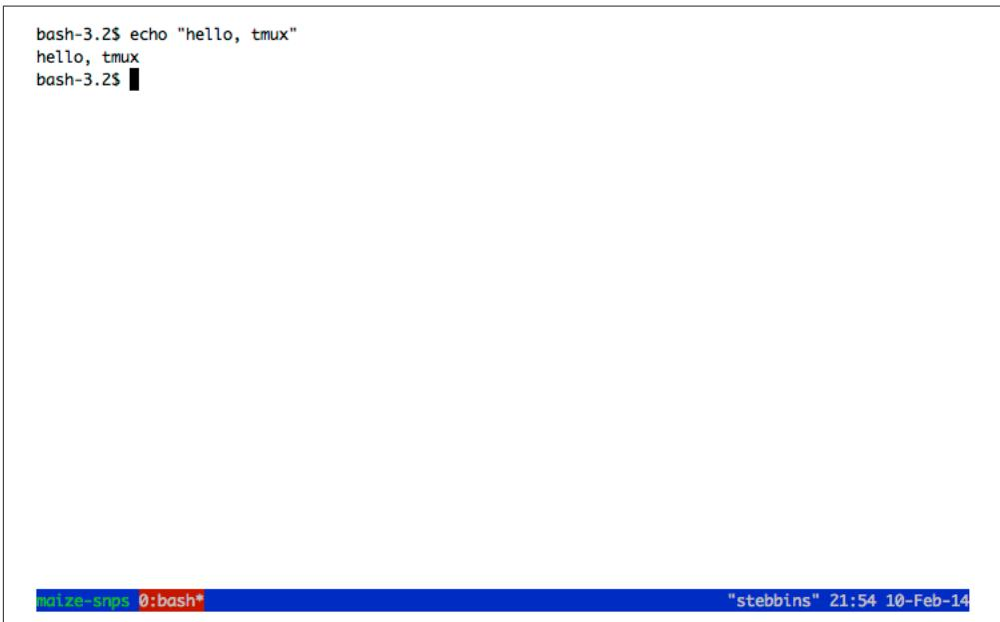

# Working with Remote Machines

Most data-processing tasks in bioinformatics require more computing power than we have on our workstations, which means we must work with large servers or comput‐ ing clusters. For some bioinformatics projects, it’s likely you’ll work predominantly over a network connection with remote machines. Unsurprisingly, working with remote machines can be quite frustrating for beginners and can hobble the produc‐ tivity of experienced bioinformaticians. In this chapter, we’ll learn how to make working with remote machines as effortless as possible so you can focus your time and efforts on the project itself. 

## Connecting to Remote Machines with SSH

There are many ways to connect to another machine over a network, but by far the most common is through the secure shell (SSH). We use SSH because it’s encrypted (which makes it secure to send passwords, edit private files, etc.), and because it’s on every Unix system. How your server, SSH, and your user account are configured is something you or your system administrator determines; this chapter won’t cover these system administration topics. The material covered in this section should help you answer common SSH questions a sysadmin may ask (e.g., “Do you have an SSH public key?”). You’ll also learn all of the basics you’ll need as a bioinformatician to SSH into remote machines. 

To initialize an SSH connection to a host (in this case, biocluster.myuniversity.edu), we use the ssh command: 

$ ssh biocluster.myuniversity.edu 

Password: 

Last login: Sun Aug 11 11:57:59 2013 from fisher.myisp.com 

wsobchak@biocluster.myuniversity.edu$ 

When connecting to a remote host with SSH, you’ll be prompted for your remote user account’s password. 

After logging in with your password, you’re granted a shell prompt on the remote host. This allows you to execute commands on the remote host just as you’d exe‐ cute them locally. 

SSH also works with IP addresses—for example, you could connect to a machine with ssh 192.169.237.42. If your server uses a different port than the default (port 22), or your username on the remote machine is different from your local username, you’ll need to specify these details when connecting: 

```batch
$ ssh -p 50453 cdarwin@biocluster.myuniversity.edu 
```

Here, we’ve specified the port with the flag -p and the username by using the syntax user@domain. If you’re unable to connect to a host, using ssh -v (-v for verbose) can help you spot the issue. You can increase the verbosity by using -vv or -vvv; see man ssh for more details. 


## Storing Your Frequent SSH Hosts

Bioinformaticians are constantly having to SSH to servers, and typ‐ ing out IP addresses or long domain names can become quite tedi‐ ous. It’s also burdensome to remember and type out additional details like the remote server’s port or your remote username. The developers behind SSH created a clever alternative: the SSH config file. SSH config files store details about hosts you frequently con‐ nect to. This file is easy to create, and hosts stored in this file work not only with ssh, but also with two programs we’ll learn about in Chapter 6: scp and rsync. 

To create a file, just create and edit the file at ~/.ssh/confg. Each entry takes the following form: 

```txt
Host bio_serv
    HostName 192.168.237.42
    User cdarwin
    Port 50453 
```

You won’t need to specify Port and User unless these differ from the remote host’s defaults. With this file saved, you can SSH into 192.168.236.42 using the alias ssh bio_serv rather than typing out ssh -p 50453 cdarwin@192.169.237.42. 

If you’re working with many remote machine connections in many terminal tabs, it’s sometimes useful to be make sure you’re working on the host you think you are. You can always access the hostname with the command hostname: 

```txt
$ hostname
biocluster.myuniversity.edu 
```

Similarly, if you maintain multiple accounts on a server (e.g., a user account for anal‐ ysis and a more powerful administration account for sysadmin tasks), it can be useful to check which account you’re using. The command whoami returns your username: 

```txt
$ whoami
cdarwin 
```

This is especially useful if you do occasionally log in with an administrator account with more privileges—the potential risks associated with making a mistake on an account with administrator privileges are much higher, so you should always be away when you’re on this account (and minimize this time as much as possible). 

## Quick Authentication with SSH Keys

SSH requires that you type your password for the account on the remote machine. However, entering a password each time you login can get tedious, and not always safe (e.g., keyboard input could be monitored). A safer, easier alternative is to use an SSH public key. Public key cryptography is a fascinating technology, but the details are outside the scope of this book. To use SSH keys to log in into remote machines without passwords, we first need to generate a public/private key pair. We do this with the command ssh-keygen. It’s very important that you note the difference between your public and private keys: you can distribute your public key to other servers, but your private key must be kept safe and secure and never shared. 

## Let’s generate an SSH key pair using ssh-keygen:

```txt
$ ssh-keygen -b 2048
Generating public/private rsa key pair.
Enter file in which to save the key (/Users/username/.ssh/id_rsa):
Enter passphrase (empty for no passphrase):
Enter same passphrase again:
Your identification has been saved in /Users/username/.ssh/id_rsa.
Your public key has been saved in /Users/username/.ssh/id_rsa.pub.
The key fingerprint is:
e1:1e:3d:01:e1:a3:ed:2b:6b:fe:c1:8e:73:7f:1f:f0
The key's randomart image is:
+---[ RSA 2048]----+
| .o... ...    |
| . . o    |
| . *    |
| . o +    |
| . S .    |
| o . E    |
| + .    |
| oo+.. . .    |
| +=oo... o.    |
+----+ 
```

This creates a private key at ~/.ssh/id_rsa and a public key at ~/.ssh/id_rsa.pub. sshkeygen gives you the option to use an empty password, but it’s generally recom‐ mended that you use a real password. If you’re wondering, the random art sshkeygen creates is a way of validating your keys (there are more details about this in man ssh if you’re curious). 

To use password-less authentication using SSH keys, first SSH to your remote host and log in with your password. Change directories to ~/.ssh, and append the contents of your public key file (id_rsa.pub, not your private key!) to ~/.ssh/authorized_keys (note that the ~ may be expanded to /home/username or /Users/username depending on the remote operating system). You can append this file by copying your public key from your local system, and pasting it to the ~/.ssh/authorized_keys file on the remote system. Some systems have an ssh-copy-id command that automatically does this for you. 

Again, be sure you’re using your public key, and not the private key. If your private key ever is accidentally distributed, this compromises the security of the machines you’ve set up key-based authentication on. The ~/.ssh/id_rsa private key has read/ write permissions only for the creator, and these restrictive permissions should be kept this way. 

After you’ve added your public key to the remote host, try logging in a few times. You’ll notice that you keep getting prompted for your SSH key’s password. If you’re scratching your head wondering how this saves time, there’s one more trick to know: ssh-agent. The ssh-agent program runs in the background on your local machine, and manages your SSH key(s). ssh-agent allows you to use your keys without enter‐ ing their passwords each time—exactly what we want when we frequently connect to servers. SSH agent is usually already running on Unix-based systems, but if not, you can use eval ssh-agent to start it. Then, to tell ssh-agent about our key, we use sshadd: 

$ ssh-add 

Enter passphrase for /Users/username/.ssh/id_rsa: 

Identity added: /Users/username/.ssh/id_rsa 

Now, the background ssh-agent process manages our key for us, and we won’t have to enter our password each time we connect to a remote machine. I once calculated that I connect to different machines about 16 times a day, and it takes me about two seconds to enter my password on average (accounting for typing mistakes). If we were to assume I didn’t work on weekends, this works out to about 8,320 seconds, or 2.3 hours a year of just SSH connections. After 10 years, this translates to nearly an entire day wasted on just connecting to machines. Learning these tricks may take an hour or so, but over the course of a career, this really saves time. 

## Maintaining Long-Running Jobs with nohup and tmux

In Chapter 3, we briefly discussed how processes (whether running in the foreground or background) will be terminated when we close our terminal window. Processes are also terminated if we disconnect from our servers or if our network connection tem‐ porarily drops out. This behavior is intentional—your program will receive the hangup signal (referred to more technically as SIGHUP), which will in almost all cases cause your application to exit immediately. Because we’re perpetually working with remote machines in our daily bioinformatics work, we need a way to prevent hangups from stopping long-running applications. Leaving your local terminal’s connection to a remote machine open while a program runs is a fragile solution—even the most reliable networks can have short outage blips. We’ll look at two preferable solutions: nohup and Tmux. If you use a cluster, there are better ways to deal with hangups (e.g., submitting batch jobs to your cluster’s software), but these depend on your specific cluster configuration. In this case, consult your system administrator. 

## nohup

nohup is simple command that executes a command and catches hangup signals sent from the terminal. Because the nohup command is catching and ignoring these hangup signals, the program you’re running won’t be interrupted. Running a com‐ mand with nohup is as easy as adding nohup before your command: 

$ nohup program1 > output.txt & 

[1] 10900 

① We run the command with all options and arguments as we would normally, but by adding nohup this program will not be interrupted if your terminal were to close or the remote connection were to drop. Additionally, it’s a good idea to redirect standard output and standard error just as we did in Chapter 3 so you can check output later. 

nohup returns the process ID number (or PID), which is how you can monitor or terminate this process if you need to (covered in “Killing Processes” on page 51). Because we lose access to this process when we run it through nohup, our only way of terminating it is by referring to it by its process ID. 

## Working with Remote Machines Through Tmux

An alternative to nohup is to use a terminal multiplexer. In addition to solving the hangup problem, using a terminal multiplexer will greatly increase your productivity when working over a remote connection. We’ll use a terminal multiplexer called 

Tmux, but a popular alternative is GNU Screen. Tmux and Screen have similar func‐ tionality, but Tmux is more actively developed and has some additional nice features. 

Tmux (and terminal multiplexers in general) allow you to create a session containing multiple windows, each capable of running their own processes. Tmux’s sessions are persistent, meaning that all windows and their processes can easily be restored by reattaching the session. 

When run on a remote machine, Tmux allows you to maintain a persistent session that won’t be lost if your connection drops or you close your terminal window to go home (or even quit your terminal program). Rather, all of Tmux’s sessions can be reattached to whatever terminal you’re currently on—just SSH back into the remote host and reattach the Tmux session. All windows will be undisturbed and all pro‐ cesses still running. 

## Installing and Confguring Tmux

Tmux is available through most package/port managers. On OS X, Tmux can be installed through Homebrew and on Ubuntu it’s available through apt-get. After installing Tmux, I strongly suggest you go to this chapter’s directory on GitHub and download the .tmux.conf file to your home directory. Just as your shell loads configu‐ rations from ~/.profle or ~/.bashrc, Tmux will load its configurations from ~/.tmux.conf. The minimal settings in .tmux.conf make it easier to learn Tmux by giv‐ ing you a useful display bar at the bottom and changing some of Tmux’s key bindings to those that are more common among Tmux users. 

## Creating, Detaching, and Attaching Tmux Sessions

Tmux allows you to have multiple sessions, and within each session have multiple windows. Each Tmux session is a separate environment. Normally, I use a session for each different project I’m working on; for example, I might have a session for maize SNP calling, one for developing a new tool, and another for writing R code to analyze some Drosophila gene expression data. Within each of these sessions, I’d have multi‐ ple windows. For example, in my maize SNP calling project, I might have three win‐ dows open: one for interacting with the shell, one with a project notebook open in my text editor, and another with a Unix manual page open. Note that all of these win‐ dows are within Tmux; your terminal program’s concept of tabs and windows is entirely different from Tmux’s. Unlike Tmux, your terminal cannot maintain persis‐ tent sessions. 

Let’s create a new Tmux session. To make our examples a bit easier, we’re going to do this on our local machine. However, to manage sessions on a remote host, we’d need to start Tmux on that remote host (this is often confusing for beginners). Running Tmux on a remote host is no different; we just SSH in to our host and start Tmux there. Suppose we wanted to create a Tmux session corresponding to our earlier Maize SNP calling example: 

$$
\$ \text { tmux new - session -s maize - snps }
$$

Tmux uses subcommands; the new-session subcommand just shown creates new sessions. The -s option simply gives this session a name so it’s easier to identify later. If you’re following along and you’ve correctly placed the .tmux.conf file in your home directory, your Tmux session should look like Figure 4-1. 




Figure 4-1. Tmux using the provided .tmux.conf fle


Tmux looks just like a normal shell prompt except for the status bar it has added at the bottom of the screen (we’ll talk more about this in a bit). When Tmux is open, we interact with Tmux through keyboard shortcuts. These shortcuts are all based on first pressing Control and a, and then adding a specific key after (releasing Control-a first). By default, Tmux uses Control-b rather than Control-a, but this is a change we’ve made in our .tmux.conf to follow the configuration preferred by most Tmux users. 

The most useful feature of Tmux (and terminal multiplexers in general) is the ability to detach and reattach sessions without losing our work. Let’s see how this works in Tmux. Let’s first enter something in our blank shell so we can recognize this session later: echo "hello, tmux". To detach a session, we use Control-a, followed by d (for detach). After entering this, you should see Tmux close and be returned to your regu‐ lar shell prompt. 

After detaching, we can see that Tmux has kept our session alive by calling tmux with the list-sessions subcommand: 

$ tmux list-sessions 

maize-snps: 1 windows (created Mon Feb 10 00:06:00 2014) [180x41] 

Now, let’s reattach our session. We reattach sessions with the attach-session sub‐ command, but the shorter attach also works: 

$ tmux attach 

Note that because we only have one session running (our maize-snps session) we don’t have to specify which session to attach. Had there been more than one session running, all session names would have been listed when we executed list-sessions and we could reattach a particular session using -t <session-name>. With only one Tmux session running, tmux attach is equivalent to tmux attach-session -t maize-snps. 

Managing remote sessions with Tmux is no different than managing sessions locally as we did earlier. The only difference is that we create our sessions on the remote host after we connect with SSH. Closing our SSH connection (either intentionally or unin‐ tentionally due to a network drop) will cause Tmux to detach any active sessions. 

## Working with Tmux Windows

Each Tmux session can also contain multiple windows. This is especially handy when working on remote machines. With Tmux’s windows, a single SSH connection to a remote host can support multiple activities in different windows. Tmux also allows you to create multiple panes within a window that allow you to split your windows into parts, but to save space I’ll let the reader learn this functionality on their own. Consult the Tmux manual page (e.g., with man tmux) or read one of the many excel‐ lent Tmux tutorials on the Web. 

Like other Tmux key sequences, we create and switch windows using Control-a and then another key. To create a window, we use Control-a c, and we use Control-a n and Control-a p to go to the next and previous windows, respectively. Table 4-1 lists the most commonly used Tmux key sequences. See man tmux for a complete list, or press Control-a ? from within a Tmux session. 


Table 4-1. Common Tmux key sequences


<table><tr><td>Key sequence</td><td>Action</td></tr><tr><td>Control-a d</td><td>Detach</td></tr><tr><td>Control-a c</td><td>Create new window</td></tr><tr><td>Control-a n</td><td>Go to next window</td></tr><tr><td>Control-a p</td><td>Go to previous window</td></tr><tr><td>Control-a &amp;</td><td>Kill current window (exit in shell also works)</td></tr><tr><td>Control-a,</td><td>Rename current window</td></tr><tr><td>Control-a ?</td><td>List all key sequences</td></tr></table>

Table 4-2 lists the most commonly used Tmux subcommands. 


Table 4-2. Common Tmux subcommands


<table><tr><td>Subcommand</td><td>Action</td></tr><tr><td>tmux list-sessions</td><td>List all sessions.</td></tr><tr><td>tmux new-session -s session-name</td><td>Create a new session named &quot;session-name&quot;.</td></tr><tr><td>tmux attach-session -t session-name</td><td>Attach a session named &quot;session-name&quot;.</td></tr><tr><td>tmux attach-session -d -t session-name</td><td>Attach a session named &quot;session-name&quot;, detaching it first.</td></tr></table>

If you use Emacs as your text editor, you’ll quickly notice that the key binding Control-a may get in the way. To enter a literal Control-a (as used to go to the begin‐ ning of the line in Emacs or the Bash shell), use Control-a a.