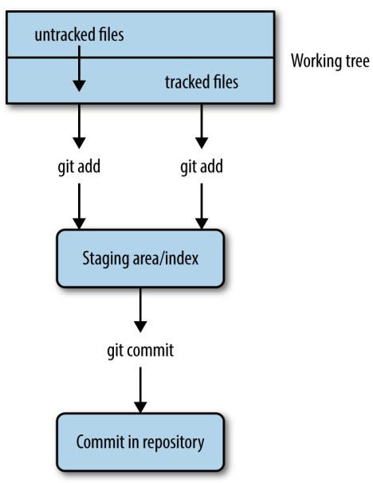
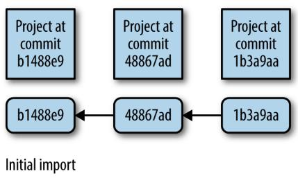
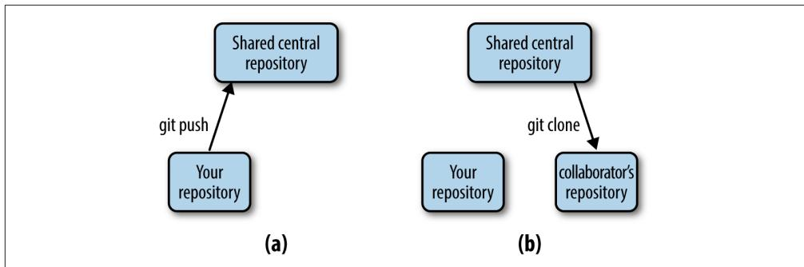
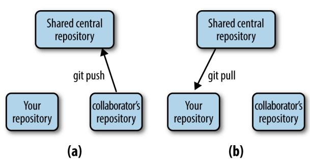
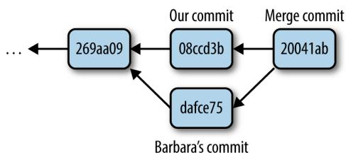
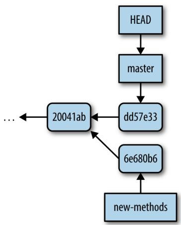

# Git for Scientists

In Chapter 2, we discussed organizing a bioinformatics project directory and how this helps keep your work tidy during development. Good organization also facilitates automating tasks, which makes our lives easier and leads to more reproducible work. However, as our project changes over time and possibly incorporates the work of our collaborators, we face an additional challenge: managing different file versions. 

It’s likely that you already use some sort of versioning system in your work. For exam‐ ple, you may have files with names such as thesis-vers1.docx, thesisvers3_CD_edits.docx, analysis-vers6.R, and thesis-vers8_CD+GM+SW_edits.docx. Storing these past versions is helpful because it allows us to go back and restore whole files or sections if we need to. File versions also help us differentiate our copies of a file from those edited by a collaborator. However, this ad hoc file versioning system doesn’t scale well to complicated bioinformatics projects—our otherwise tidy project directories would be muddled with different versioned scripts, R analyses, README files, and papers. 

Project organization only gets more complicated when we work collaboratively. We could share our entire directory with a colleague through a service like Dropbox or Google Drive, but we run the risk of something getting deleted or corrupted. It’s also not possible to drop an entire bioinformatics project directory into a shared direc‐ tory, as it likely contains gigabytes (or more) of data that may be too large to share across a network. These tools are useful for sharing small files, but aren’t intended to manage large collaborative projects involving changing code and data. 

Luckily, software engineers have faced these same issues in modern collaborative soft‐ ware development and developed version control systems (VCS) to manage different versions of collaboratively edited code. The VCS we’ll use in this chapter was written by Linus Torvalds and is called Git. Linus wrote Git to manage the Linux kernel (which he also wrote), a large codebase with thousands of collaborators simultane‐ ously changing and working on files. As you can imagine, Git is well suited for project version control and collaborative work. 

Admittedly, Git can be tricky to learn at first. I highly recommend you take the time to learn Git in this chapter, but be aware that understanding Git (like most topics in this book, and arguably everything in life) will take time and practice. Throughout this chapter, I will indicate when certain sections are especially advanced; you can revisit these later without problems in continuity with the rest of the book. Also, I recommend you practice Git with the example projects and code from the book to get the basic commands in the back of your head. After struggling in the beginning with Git, you’ll soon see how it’s the best version control system out there. 

## Why Git Is Necessary in Bioinformatics Projects

As a longtime proponent of Git, I’ve suggested it to many colleagues and offered to teach them the basics. In most cases, I find the hardest part is actually in convincing scientists they should adopt version control in their work. Because you may be won‐ dering whether working through this chapter is worth it, I want to discuss why learn‐ ing Git is definitely worth the effort. If you’re already 100% convinced, you can dive into learning Git in the next section. 

## Git Allows You to Keep Snapshots of Your Project

With version control systems, you create snapshots of your current project at specific points in its development. If anything goes awry, you can rewind to a past snapshot of your project’s state (called a commit) and restore files. In the fast pace of bioinformat‐ ics work, having this safeguard is very useful. 

Git also helps fix a frustrating type of bug known as software regression, where a piece of code that was once working mysteriously stops working or gives different results. For example, suppose that you’re working on an analysis of SNP data. You find in your analysis that 14% of your SNPs fall in coding regions in one stretch of a chromosome. This is relevant to your project, so you cite this percent in your paper and make a commit. 

Two months later, you’ve forgotten the details of this analysis, but need to revisit the 14% statistic. Much to your surprise, when you rerun the analysis code, this changes to 26%! If you’ve been tracking your project’s development by making commits (e.g., taking snapshots), you’ll have an entire history of all of your project’s changes and can pinpoint when your results changed. 

Git commits allow you to easily reproduce and rollback to past versions of analysis. It’s also easy to look at every commit, when it was committed, what has changed across commits, and even compare the difference between any two commits. Instead of redoing months of work to find a bug, Git can give you line-by-line code differ‐ ences across versions. 

In addition to simplifying bug finding, Git is an essential part of proper documenta‐ tion. When your code produces results, it’s essential that this version of code is fully documented for reproducibility. A good analogy comes from my friend and colleague Mike Covington: imagine you keep a lab notebook in pencil, and each time you run a new PCR you erase your past results and jot down the newest ones. This may sound extreme, but is functionally no different than changing code and not keeping a record of past versions. 

## Git Helps You Keep Track of Important Changes to Code

Most software changes over time as new features are added or bugs are fixed. It’s important in scientific computing to follow the development of software we use, as a fixed bug could mean the difference between correct and incorrect results in our own work. Git can be very helpful in helping you track changes in code—to see this, let’s look at a situation I’ve run into (and I suspect happens in labs all over the world). 

Suppose a lab has a clever bioinformatician who has written a script that trims poor quality regions from reads. This bioinformatician then distributes this to all members of his lab. Two members of his lab send it to friends in other labs. About a month later, the clever bioinformatician realizes there’s a bug that leads to incorrect results in certain cases. The bioinformatician quickly emails everyone in his lab the new ver‐ sion and warns them of the potential for incorrect results. Unfortunately, members of the other lab may not get the message and could continue using the older buggy ver‐ sion of the script. 

Git helps solve this problem by making it easy to stay up to date with software devel‐ opment. With Git, it’s easy to both track software changes and download new soft‐ ware versions. Furthermore, services like GitHub and Bitbucket host Git repositories on the Web, which makes sharing and collaborating on code across labs easy. 

## Git Helps Keep Software Organized and Available After People Leave

Imagine another situation: a postdoc moves to start her own lab, and all of her differ‐ ent software tools and scripts are scattered in different directories, or worse, com‐ pletely lost. Disorderedly code disrupts and inconveniences other lab members; lost code leads to irreproducible results and could delay future research. 

Git helps maintain both continuity in work and a full record of a project’s history. Centralizing an entire project into a repository keeps it organized. Git stores every committed change, so the entire history of a project is available even if the main developer leaves and isn’t around for questions. With the ability to roll back to past versions, modifying projects is less risky, making it easier to build off existing work. 

## Installing Git

If you’re on OS X, install Git through Homebrew (e.g., brew install git); on Linux, use apt-get (e.g., apt-get install git). If your system does not have a package manager, the Git website has both source code and executable versions of Git. 

## Basic Git: Creating Repositories, Tracking Files, and Staging and Committing Changes

Now that we’ve seen some Git concepts and how Git fits into your bioinformatics workflow, let’s explore the most basic Git concepts of creating repositories, telling Git which files to track, and staging and committing changes. 

## Git Setup: Telling Git Who You Are

Because Git is meant to help with collaborative editing of files, you need to tell Git who you are and what your email address is. To do this, use: 

$ git config --global user.name "Sewall Wright" 

$ git config --global user.email "swright@adaptivelandscape.org" 

Make sure to use your own name and email, or course. We interact with Git through subcommands, which are in the format git <subcommand>. Git has loads of subcom‐ mands, but you’ll only need a few in your daily work. 

Another useful Git setting to enable now is terminal colors. Many of Git’s subcom‐ mands use terminal colors to visually indicate changes (e.g., red for deletion and green for something new or modified). We can enable this with: 

$ git config --global color.ui true 

## git init and git clone: Creating Repositories

To get started with Git, we first need to initialize a directory as a Git repository. A repository is a directory that’s under version control. It contains both your current working files and snapshots of the project at certain points in time. In version control lingo, these snapshots are known as commits. Working with Git is fundamentally about creating and manipulating these commits: creating commits, looking at past commits, sharing commits, and comparing different commits. 

With Git, there are two primary ways to create a repository: by initializing one from an existing directory, or cloning a repository that exists elsewhere. Either way, the result is a directory that Git treats as a repository. Git only manages the files and sub‐ directories inside the repository directory—it cannot manage files outside of your repository. 

Let’s start by initializing the zmays-snps/ project directory we created in Chapter 2 as a Git repository. Change into the zmays-snps/ directory and use the Git subcommand git init: 

```txt
$ git init
Initialized empty Git repository in /Users/vinceb/Projects/zmays-snps/.git/ 
```

git init creates a hidden directory called .git/ in your zmays-snps/ project directory (you can see it with ls -a). This .git/ directory is how Git manages your repository behind the scenes. However, don’t modify or remove anything in this directory—it’s meant to be manipulated by Git only. Instead, we interact with our repository through Git subcommands like git init. 

The other way to create a repository is through cloning an existing repository. You can clone repositories from anywhere: somewhere else on your filesystem, from your local network, or across the Internet. Nowadays, with repository hosting services like GitHub and Bitbucket, it’s most common to clone Git repositories from the Web. 

Let’s practice cloning a repository from GitHub. For this example, we’ll clone the Seqtk code from Heng Li’s GitHub page. Seqtk is short for SEQuence ToolKit, and contains a well-written and useful set of tools for processing FASTQ and FASTA files. First, visit the GitHub repository and poke around a bit. All of GitHub’s repositories have this URL syntax: user/repository. Note on this repository’s page that clone URL on the righthand side—this is where you can copy the link to clone this repository. 

Now, let’s switch to a directory outside of zmays-snps/. Whichever directory you choose is fine; I use a ~/src/ directory for cloning and compiling other developers’ tools. From this directory, run: 

```txt
$ git clone git://github.com/lh3/seqtk.git
Cloning into 'seqtk'...
remote: Counting objects: 92, done.
remote: Compressing objects: 100% (47/47), done.
remote: Total 92 (delta 56), reused 80 (delta 44)
Receiving objects: 100% (92/92), 32.58 KiB, done.
Resolving deltas: 100% (56/56), done. 
```

git clone clones seqtk to your local directory, mirroring the original repository on GitHub. Note that you won’t be able to directly modify Heng Li’s original GitHub repository—cloning this repository only gives you access to retrieve new updates from the GitHub repository as they’re released. 

Now, if you cd into seqtk/ and run ls, you’ll see seqtk’s source: 

```txt
cd seqtk
ls
Makefile README.md khash.h kseq.h seqtk.c 
```

Despite originating through different methods, both zmays-snps/ and seqtk/ are Git repositories. 

## Tracking Files in Git: git add and git status Part I

Although you’ve initialized the zmays-snps/ as a Git repository, Git doesn’t automati‐ cally begin tracking every file in this directory. Rather, you need to tell Git which files to track using the subcommand git add. This is actually a useful feature of Git—bio‐ informatics projects contain many files we don’t want to track, including large data files, intermediate results, or anything that could be easily regenerated by rerunning a command. 

Before tracking a file, let’s use the command git status to check Git’s status of the files in our repository (switch to the zmays-snps/ directory if you are elsewhere): 

```txt
$ git status
# On branch master ①
#
# Initial commit
#
# Untracked files: ②
# (use "git add <file>..." to include in what will be committed)
#
# README
# data/
nothing added to commit but untracked files present (use "git add" to track)
git status tell us: 
```

We’re on branch master, which is the default Git branch. Branches allow you to work on and switch between different versions of your project simultaneously. Git’s simple and powerful branches are a primary reason it’s such a popular ver‐ sion control system. We’re only going to work with Git’s default master branch for now, but we’ll learn more about branches later in this chapter. 

We have a list of “Untracked files,” which include everything in the root project directory. Because we haven’t told Git to track anything, Git has nothing to put in a commit if we were to try. 

It’s good to get git status under your fingers, as it’s one of the most frequently used Git commands. git status describes the current state of your project repository: what’s changed, what’s ready to be included in the next commit, and what’s not being tracked. We’ll use it extensively throughout the rest of this chapter. 

Let’s use git add to tell Git to track the README and data/README files in our zmays-snps/ directory: 

```txt
$ git add README data/README 
```

Now, Git is tracking both data/README and README. We can verify this by run‐ ning git status again: 

```txt
$ ls
README analysis data scripts
$ git status
# On branch master
#
# Initial commit
#
# Changes to be committed:
# (use "git rm --cached <file>..." to unstage)
#
# new file: README ①
# new file: data/README
#
# Untracked files:
# (use "git add <file>..." to include in what will be committed)
#
# data/seqs/ ② 
```

Note now how Git lists README and data/README as new files, under the sec‐ tion “changes to be committed.” If we made a commit now, our commit would take a snapshot of the exact version of these files as they were when we added them with git add. 

There are also untracked directories like data/seqs/, as we have not told Git to track these yet. Conveniently, git status reminds us we could use git add to add these to a commit. 

The scripts/ and analysis/ directories are not included in git status because they are empty. The data/seqs/ directory is included because it contains the empty sequence files we created with touch in Chapter 2. 

## Staging Files in Git: git add and git status Part II

With Git, there’s a difference between tracked files and files staged to be included in the next commit. This is a subtle difference, and one that often causes a lot of confu‐ sion for beginners learning Git. A file that’s tracked means Git knows about it. A staged file is not only tracked, but its latest changes are staged to be included in the next commit (see Figure 5-1). 

A good way to illustrate the difference is to consider what happens when we change one of the files we started tracking with git add. Changes made to a tracked file will not automatically be included in the next commit. To include these new changes, we would need to explicitly stage them—using git add again. Part of the confusion lies in the fact that git add both tracks new files and stages the changes made to tracked files. Let’s work through an example to make this clearer. 




Figure 5-1. Git’s separation of the working tree (all fles in your repository), the staging area (fles to be included in the next commit), and committed changes (a snapshot of a version of your project at some point in time); git add on an untracked fle begins track‐ ing it and stages it, while git add on a tracked fle just stages it for the next commit


From the git status output from the last section, we see that both the data/ README and README files are ready to be committed. However, look what hap‐ pens when we make a change to one of these tracked files and then call git status: 

```shell
echo "Zea Mays SNP Calling Project" >> README # change file README
git status
# On branch master
#
# Initial commit
#
# Changes to be committed:
# (use "git rm --cached <file>..." to unstage)
#
# new file: README
# new file: data/README
#
# Changes not staged for commit:
# (use "git add <file>..." to update what will be committed)
# (use "git checkout -- <file>..." to discard changes in working directory)
# 
```

```txt
# modified: README
#
# Untracked files:
# (use "git add <file>..." to include in what will be committed)
#
# data/seqs/ 
```

After modifying README, git status lists README under “changes not staged for commit.” This is because we’ve made changes to this file since initially tracking and staging README with git add (when first tracking a file, its current version is also staged). If we were to make a commit now, our commit would include the previous version of README, not this newly modified version. 

To add these recent modifications to README in our next commit, we stage them using git add. Let’s do this now and see what git status returns: 

```txt
$ git add README
$ git status
# On branch master
#
# Initial commit
#
# Changes to be committed:
#    (use "git rm --cached <file>..." to unstage)
#
#    new file:    README
#    new file:    data/README
#
# Untracked files:
#    (use "git add <file>..." to include in what will be committed)
#
#    data/seqs/
#    notebook.md 
```

Now, README is listed under “Changes to be committed” again, because we’ve staged these changes with git add. Our next commit will include the most recent version. 

Again, don’t fret if you find this confusing. The difference is subtle, and it doesn’t help that we use git add for both operations. Remember the two roles of git add: 

• Alerting Git to start tracking untracked files (this also stages the current version of the file to be included in the next commit) 

• Staging changes made to an already tracked file (staged changes will be included in the next commit) 

It’s important to be aware that any modifications made to a file since the last time it was staged will not be included in the next commit unless they are staged with git add. This extra step may seem like an inconvenience but actually has many benefits. 

Suppose you’ve made changes to many files in a project. Two of these files’ changes are complete, but everything else isn’t quite ready. Using Git’s staging, you can stage and commit only these two complete files and keep other incomplete files out of your commit. Through planned staging, your commits can reflect meaningful points in development rather than random snapshots of your entire project directory (which would likely include many files in a state of disarray). When we learn about commit‐ ting in the next section, we’ll see a shortcut to stage and commit all modified files. 

## git commit: Taking a Snapshot of Your Project

We’ve spoken a lot about commits, but haven’t actually made one yet. When first learning Git, the trickiest part of making a commit is understanding staging. Actually committing your staged commits is quite easy: 

```txt
$ git commit -m "initial import"
2 files changed, 1 insertion(+)
create mode 100644 README
create mode 100644 data/README 
```

This command commits your staged changes to your repository with the commit message “initial import.” Commit messages are notes to your collaborators (and your‐ self in the future) about what a particular commit includes. Optionally, you can omit the -m option, and Git will open up your default text editor. If you prefer to write commit messages in a text editor (useful if they are multiline messages), you can change the default editor Git uses with: 

```txt
$ git config --global core.editor emacs 
```

where emacs can be replaced by vim (the default) or another text editor of your choice. 


## Some Advice on Commit Messages

Commit messages may seem like an inconvenience, but it pays off in the future to have a description of how a commit changes code and what functionality is affected. In three months when you need to figure out why your SNP calling analyses are returning unexpec‐ ted results, it’s much easier to find relevant commits if they have messages like “modifying SNP frequency function to fix singleton bug, refactored coverage calculation” rather than “cont” (that’s an actual commit I’ve seen in a public project). For an entertaining take on this, see xkcd’s “Git Commit” comic. 

Earlier, we staged our changes using git add. Because programmers like shortcuts, there’s an easy way to stage all tracked files’ changes and commit them in one com‐ mand: git commit -a -m "your commit message". The option -a tells git commit to automatically stage all modified tracked files in this commit. Note that while this saves time, it also will throw all changes to tracked files in this commit. Ideally com‐ mits should reflect helpful snapshots of your project’s development, so including every slightly changed file may later be confusing when you look at your repository’s history. Instead, make frequent commits that correspond to discrete changes to your project like “new counting feature added” or “fixed bug that led to incorrect transla‐ tion.” 

We’ve included all changes in our commit, so our working directory is now “clean”: no tracked files differ from the version in the last commit. Until we make modifica‐ tions, git status indicates there’s nothing to commit: 

```txt
$ git status
# On branch master
# Untracked files:
# (use "git add <file>..." to include in what will be committed)
#
# data/seqs/ 
```

Untracked files and directories will still remain untracked (e.g., data/seqs/), and any unstaged changes to tracked files will not be included in the next commit unless added. Sometimes a working directory with unstaged changes is referred to as “messy,” but this isn’t a problem. 

## Seeing File Diferences: git dif

So far we’ve seen the Git tools needed to help you stage and commit changes in your repository. We’ve used the git status subcommand to see which files are tracked, which have changes, and which are staged for the next commit. Another subcom‐ mand is quite helpful in this process: git diff. 

Without any arguments, git diff shows you the difference between the files in your working directory and what’s been staged. If none of your changes have been staged, git diff shows us the difference between your last commit and the current versions of your files. For example, if I add a line to README.md and run git diff: 

```diff
echo "Project started 2013-01-03" >> README
git diff
diff --git a/README b/README
index 5483cfd..ba8d7fc 100644
--- a/README ①
+++ b/README
@@ -1 +1,2 @@ ②
Zea Mays SNP Calling Project
+Project started 2013-01-03 ③ 
```

This format (called a unifed dif) may seem a bit cryptic at first. When Git’s terminal colors are enabled, git diff’s output is easier to read, as added lines will be green and deleted lines will be red. 

This line (and the one following it) indicate there are two versions of the README file we are comparing, a and b. The --- indicates the original file—in our case, the one from our last commit. +++ indicates the changed version. 

This denotes the start of a changed hunk (hunk is diff ’s term for a large changed block), and indicates which line the changes start on, and how long they are. Diffs try to break your changes down into hunks so that you can easily identify the parts that have been changed. If you’re curious about the specifics, see Wiki pedia’s page on the diff utility. 

③ Here’s the meat of the change. Spaces before the line (e.g., the line that begins Zea Mays… indicates nothing was changed (and just provide context). Plus signs indi‐ cate a line addition (e.g., the line that begins Project…), and negative signs indi‐ cate a line deletion (not shown in this diff because we’ve only added a line). Changes to a line are represented as a deletion of the original line and an addi‐ tion of the new line. 

After we stage a file, git diff won’t show any changes, because git diff compares the version of files in your working directory to the last staged version. For example: 

```txt
$ git add README
$ git diff # shows nothing 
```

If we wanted to compare what’s been staged to our last commit (which will show us exactly what’s going into the next commit), we can use git diff --staged (in old versions of Git this won’t work, so upgrade if it doesn’t). Indeed, we can see the change we just staged: 

```diff
$ git diff --staged
diff --git a/README b/README
index 5483cfd..ba8d7fc 100644
--- a/README
+++ b/README
@@ -1 +1,2 @@
Zea Mays SNP Calling Project
+Project started 2013-01-03 
```

git diff can also be used to compare arbitrary objects in our Git commit history, a topic we’ll see in “More git diff: Comparing Commits and Files” on page 100. 

## Seeing Your Commit History: git log

Commits are like chains (more technically, directed acyclic graphs), with each com‐ mit pointing to its parent (as in Figure 5-2). 




Figure 5-2. Commits in Git take discrete snapshots of your project at some point in time, and each commit (except the frst) points to its parent commit; this chain of commits is your set of connected snapshots that show how your project repository evolves


We can use git log to visualize our chain of commits: 

```txt
$ git log
commit 3d7ffa6f0276e607dcd94e18d26d21de2d96a460 ①
Author: Vince Buffalo <vsbuffaloAAAAAA@gmail.com>
Date: Mon Sep 23 23:55:08 2013 -0700
initial import 
```

This strange looking mix of numbers and characters is a SHA-1 checksum. Each commit will have one of these, and they will depend on your repository’s past commit history and the current files. SHA-1 hashes act as a unique ID for each commit in your repository. You can always refer to a commit by its SHA-1 hash. 


## git log and Your Terminal Pager

git log opens up your repository’s history in your default pager (usually either the program more or less). If you’re unfamiliar with pagers, less, and more, don’t fret. To exit and get back to your prompt, hit the letter q. You can move forward by pressing the space bar, and move backward by pressing b. We’ll look at less in more detail in Chapter 7. 

Let’s commit the change we made in the last section: 

```txt
$ git commit -a -m "added information about project to README" [master 94e2365] added information about project to README 1 file changed, 1 insertion(+) 
```

Now, if we look at our commit history with git log, we see: 

```txt
$ git log
commit 94e2365dd66701a35629d29173d640fdae32fa5c
Author: Vince Buffalo <vsbuffaloAAAAAA@gmail.com>
Date: Tue Sep 24 00:02:11 2013 -0700 
```

added information about project to README 

```txt
commit 3d7ffa6f0276e607dcd94e18d26d21de2d96a460
Author: Vince Buffalo <vsbuffaloAAAAAA@gmail.com>
Date: Mon Sep 23 23:55:08 2013 -0700 
```

initial import 

As we continue to make and commit changes to our repository, this chain of commits will grow. If you want to see a nice example of a longer Git history, change directories to the seqtk repository we cloned earlier and call git log. 

## Moving and Removing Files: git mv and git rm

When Git tracks your files, it wants to be in charge. Using the command mv to move a tracked file will confuse Git. The same applies when you remove a file with rm. To move or remove tracked files in Git, we need to use Git’s version of mv and rm: git mv and git rm. 

For example, our README file doesn’t have an extension. This isn’t a problem, but because the README file might later contain Markdown, it’s not a bad idea to change its extension to .md. You can do this using git mv: 

```shell
$ git mv README README.md
$ git mv data/README data/README.md 
```

Like all changes, this isn’t stored in your repository until you commit it. If you ls your files, you can see your working copy has been renamed: 

```txt
$ ls
README.md analysis data notebook.md scripts 
```

Using git status, we see this change is staged and ready to be committed: 

```makefile
$ git status
# On branch master
# Changes to be committed:
#    (use "git reset HEAD <file>..." to unstage)
#
#    renamed:    README -> README.md
#    renamed:    data/README -> data/README.md
#
# Untracked files:
#    (use "git add <file>..." to include in what will be committed)
#
#    data/seqs/ 
```

git mv already staged these commits for us; git add is only necessary for staging modifications to the contents of files, not moving or removing files. Let’s commit these changes: 

```txt
$ git commit -m "added markdown extensions to README files"
[master e4feb22] added markdown extensions to README files
2 files changed, 0 insertions(+), 0 deletions(-)
rename README => README.md (100%)
rename data/{README => README.md} (100%) 
```

Note that even if you change or remove a file and commit it, it still exists in past snapshots. Git does its best to make everything recoverable. We’ll see how to recover files later on in this chapter. 

## Telling Git What to Ignore: .gitignore

You may have noticed that git status keeps listing which files are not tracked. As the number of files in your bioinformatics project starts to increase (this happens quickly!) this long list will become a burden. 

Many of the items in this untracked list may be files we never want to commit. Sequencing data files are a great example: they’re usually much too large to include in a repository. If we were to commit these large files, collaborators cloning your reposi‐ tory would have to download these enormous data files. We’ll talk about other ways of managing these later, but for now, let’s just ignore them. 

Suppose we wanted to ignore all FASTQ files (with the extension .fastq) in the data/ seqs/ directory. To do this, create and edit the file .gitignore in your zmays-snps/ repos‐ itory directory, and add: 

```txt
data/seqs/*.fastq
Now, git status gives us:
$ git status
# On branch master
# Untracked files:
# (use "git add <file>..." to include in what will be committed)
#
# .gitignore 
```

It seems we’ve gotten rid of one annoyance (the data/seqs/ directory in “Untracked files”) but added another (the new .gitignore). Actually, the best way to resolve this is to add and commit your .gitignore file. It may seem counterintuitive to contribute a file to a project that’s merely there to tell Git what to ignore. However, this is a good practice; it saves collaborators from seeing a listing of untracked files Git should ignore. Let’s go ahead and stage the .gitignore file, and commit this and the filename changes we made earlier: 

```shell
$ git add .gitignore
$ git commit -m "added .gitignore"
[master c509f63] added .gitignore
1 file changed, 1 insertion(+)
create mode 100644 .gitignore 
```

What should we tell .gitignore to ignore? In the context of a bioinformatics project, here are some guidelines: 

## Large fles

These should be ignored and managed by other means, as Git isn’t designed to manage really large files. Large files slow creating, pushing, and pulling commits. This can lead to quite a burden when collaborators clone your repository. 

## Intermediate fles

Bioinformatics projects are often filled with intermediate files. For example, if you align reads to a genome, this will create SAM or BAM files. Even if these aren’t large files, these should probably be ignored. If a data file can easily be reproduced by rerunning a command (or better yet, a script), it’s usually prefera‐ ble to just store how it was created. Ultimately, recording and storing how you created an intermediate file in Git is more important than the actual file. This also ensures reproducibility. 

## Text editor temporary fles

Text editors like Emacs and Vim will sometimes create temporary files in your directory. These can look like textfle.txt~ or #textfle.txt#. There’s no point in storing these in Git, and they can be an annoyance when viewing progress with git status. These files should always be added to .gitignore. Luckily, .gitignore takes wildcards, so these can be ignored with entries like *~ and \#*\#. 

## Temporary code fles

Some language interpreters (e.g., Python) produce temporary files (usually with some sort of optimized code). With Python, these look like overlap.pyc. 

We can use a global .gitignore file to universally ignore a file across all of our projects. Good candidates of files to globally ignore are our text editor’s temporary files or files your operating system creates (e.g., OS X will sometimes create hidden files named .DS_Store in directories to store details like icon position). GitHub maintains a useful repository of global .gitignore suggestions. 

You can create a global .gitignore file in ~/.gitignore_global and then configure Git to use this with the following: 

git config --global core.excludesfile ~/.gitignore_global 

A repository should store everything required to replicate a project except large data sets and external programs. This includes all scripts, documentation, analysis, and possibly even a final manuscript. Organizing your repository this way means that all of your project’s dependencies are in one place and are managed by Git. In the long run, it’s far easier to have Git keep track of your project’s files, than try to keep track of them yourself. 

## Undoing a Stage: git reset

Recall that one nice feature of Git is that you don’t have to include messy changes in a commit—just don’t stage these files. If you accidentally stage a messy file for a com‐ mit with git add, you can unstage it with git reset. For example, suppose you add a change to a file, stage it, but decide it’s not ready to be committed: 

```makefile
echo "TODO: ask sequencing center about adapters" >> README.md
git add README.md
git status
# On branch master
# Changes to be committed:
# (use "git reset HEAD <file>..." to unstage)
#
# new file: README.md
# 
```

With git status, we can see that our change to README.md is going to be included in the next commit. To unstage this change, follow the directions git status pro‐ vides: 

```txt
$ git reset HEAD README.md
$ git status
# On branch master
# Changes not staged for commit:
#    (use "git add <file>..." to update what will be committed)
#    (use "git checkout -- <file>..." to discard changes in working directory)
#
#    modified:   README.md
# 
```

The syntax seems a little strange, but all we’re doing is resetting our staging area (which Git calls the index) to the version at HEAD for our README.md file. In Git’s lingo, HEAD is an alias or pointer to the last commit on the current branch (which is, as mentioned earlier, the default Git branch called master). Git’s reset command is a powerful tool, but its default action is to just reset your index. We’ll see additional ways to use git reset when we learn about working with commit histories. 

## Collaborating with Git: Git Remotes, git push, and git pull

Thus far, we’ve covered the very basics of Git: tracking and working with files, staging changes, making commits, and looking at our commit history. Commits are the foun‐ dation of Git—they are the snapshots of our project as it evolves. Commits allow you to go back in time and look at, compare, and recover past versions, which are all top‐ ics we look at later in this chapter. In this section, we’re going to learn how to collabo‐ rate with Git, which at its core is just about sharing commits between your repository and your collaborators’ repositories. 

The basis of sharing commits in Git is the idea of a remote repository, which is just a version of your repository hosted elsewhere. This could be a shared departmental server, your colleague’s version of your repository, or on a repository hosting service like GitHub or Bitbucket. Collaborating with Git first requires we configure our local repository to work with our remote repositories. Then, we can retrieve commits from a remote repository (a pull) and send commits to a remote repository (a push). 

Note that Git, as a distributed version control system, allows you to work with remote repositories any way you like. These workfow choices are up to you and your collabo‐ rators. In this chapter, we’ll learn an easy common workflow to get started with: col‐ laborating over a shared central repository. 

Let’s take a look at an example: suppose that you’re working on a project you wish to share with a colleague. You start the project in your local repository. After you’ve made a few commits, you want to share your progress by sharing these commits with your collaborator. Let’s step through the entire workflow before seeing how to execute it with Git: 

1. You create a shared central repository on a server that both you and your collab‐ orator have access to. 

2. You push your project’s initial commits to this repository (seen in (a) in Figure 5-3). 

3. Your collaborator then retrieves your initial work by cloning this central reposi‐ tory (seen in (b) in Figure 5-3). 

4. Then, your collaborator makes her changes to the project, commits them to her local repository, and then pushes these commits to the central repository (seen in (a) in Figure 5-4). 

5. You then pull in the commits your collaborator pushed to the central repository (seen in (b) in Figure 5-4). The commit history of your project will be a mix of both you and your collaborator’s commits. 




Figure 5-3. Afer creating a new shared central repository, you push your project’s com‐ mits (a); your collaborator can retrieve your project and its commits by cloning this cen‐ tral repository (b)





Figure 5-4. Afer making and committing changes, your collaborator pushes them to the central repository (a); to retrieve your collaborator’s new commits, you pull them from the central repository (b)


This process then repeats: you and your collaborator work independently in your own local repositories, and when either of you have commits to share, you push them to the central repository. In many cases, if you and your collaborator work on differ‐ ent files or different sections of the same file, Git can automatically figure out how best to merge these changes. This is an amazing feature of collaborating with Git: you and your collaborator can work on the same project simultaneously. Before we dive into how to do this, there is one caveat to discuss. 

It’s important to note that Git cannot always automatically merge code and docu‐ ments. If you and your collaborator are both editing the same section of the same file and both of you commit these changes, this will create a merge confict. Unfortunately, one of you will have to resolve the conflicting files manually. Merge conflicts occur when you (or your collaborator) pull in commits from the central repository and your collaborator’s (or your) commits conflict with those in the local repository. In these cases, Git just isn’t smart enough to figure out how to reconcile you and your collaborator’s conflicting versions. 

Most of us are familiar with this process when we collaboratively edit manuscripts in a word processor. If you write a manuscript and send it to all your collaborators to edit, you will need to manually settle sections with conflicting edits. Usually, we get around this messy situation through planning and prioritizing which coauthors will edit first, and gradually incorporating changes. Likewise, good communication and planning with your collaborators can go far in preventing Git merge conflicts, too. Additionally, it’s helpful to frequently push and pull commits to the central reposi‐ tory; this keeps all collaborators synced so everyone’s working with the newest ver‐ sions of files. 

## Creating a Shared Central Repository with GitHub

The first step of our workflow is to create a shared central repository, which is what you and your collaborator(s) share commits through. In our examples, we will use GitHub, a web-based Git repository hosting service. Bitbucket is another Git reposi‐ tory hosting service you and your collaborators could use. Both are excellent; we’ll use GitHub because it’s already home to many large bioinformatics projects like Bio‐ python and Samtools. 

Navigate to http://github.com and sign up for an account. After your account is set up, you’ll be brought to the GitHub home page, which is a newsfeed for you to follow project development (this newsfeed is useful to follow how bioinformatics software you use changes over time). On the main page, there’s a link to create a new reposi‐ tory. After you’ve navigated to the Create a New Repository page, you’ll see you need to provide a repository name, and you’ll have the choice to initialize with a README.md file (GitHub plays well with Markdown), a .gitignore file, and a license (to license your software project). For now, just create a repository named zmayssnps. After you’ve clicked the “Create repository” button, GitHub will forward you to an empty repository page—the public frontend of your project. 

There are a few things to note about GitHub: 

• Public repositories are free, but private repositories require you to pay. Luckily, GitHub has a special program for educational users. If you need private reposito‐ ries without cost, Bitbucket has a different pricing scheme and provides some for free. Or, you can set up your own internal Git repository on your network if you have shared server space. Setting up your own Git server is out of the scope of this book, but see “Git on the Server - Setting Up the Server” in Scott Chacon and Ben Straub’s free online book Pro Git for more information. If your repository is public, anyone can see the source (and even clone and develop their own ver‐ sions of your repository). However, other users don’t have access to modify your GitHub repository unless you grant it to them. 

• If you’re going to use GitHub for collaboration, all participating collaborators need a GitHub account. 

• By default, you are the only person who has write (push) access to the repository you created. To use your remote repository as a shared central repository, you’ll have to add collaborators in your GitHub repository’s settings. Collaborators are GitHub users who have access to push their changes to your repository on Git‐ Hub (which modifies it). 

• There are other common GitHub workflows. For example, if you manage a lab or other group, you can set up an organization account. You can create repositories and share them with collaborators under the organization’s name. We’ll discuss other GitHub workflows later in this chapter. 

## Authenticating with Git Remotes

GitHub uses SSH keys to authenticate you (the same sort we generated in “Quick Authentication with SSH Keys” on page 59). SSH keys prevent you from having to enter a password each time you push or pull from your remote repository. Recall in “Quick Authentication with SSH Keys” on page 59 we generated two SSH keys: a pub‐ lic key and a private key. Navigate to your account settings on GitHub, and in account settings, find the SSH keys tab. Here, you can enter your public SSH key (remember, don’t share your private key!) by using cat ~/.ssh/id_rsa.pub to view it, copying it to your clipboard, and pasting it into GitHub’s form. You can then try out your SSH public key by using: 

$ ssh -T git@github.com 

Hi vsbuffalo! You've successfully authenticated, but 

GitHub does not provide shell access. 

If you’re having troubles with this, consult GitHub’s “Generating SSH Keys” article. 

GitHub allows you to use to HTTP as a protocol, but this is typically only used if your network blocks SSH. By default, HTTP asks for passwords each time you try to pull and push (which gets tiresome quickly), but there are ways around this—see GitHub’s “Caching Your GitHub Password in Git” article. 

## Connecting with Git Remotes: git remote

Now, let’s configure our local repository to use the GitHub repository we’ve just cre‐ ated as a remote repository. We can do this with git remote add: 

$ git remote add origin git@github.com:username/zmays-snps.git 

In this command, we specify not only the address of our Git repository (git@git‐ hub.com:username/zmays-snps.git), but also a name for it: origin. By convention, ori‐ gin is the name of your primary remote repository. In fact, earlier when we cloned Seqtk from GitHub, Git automatically added the URL we cloned from as a remote named origin. 

Now if you enter git remote -v (the -v makes it more verbose), you see that our local Git repository knows about the remote repository: 

```txt
$ git remote -v
origin git@github.com:username/zmays-snps.git (fetch)
origin git@github.com:username/zmays-snps.git (push) 
```

Indeed, origin is now a repository we can push commits to and fetch commits from. We’ll see how to do both of these operations in the next two sections. 

It’s worth noting too that you can have multiple remote repositories. Earlier, we men‐ tioned that Git is a distributed version control system; as a result, we can have many remote repositories. We’ll come back to how this is useful later on. For now, note that you can add other remote repositories with different names. If you ever need to delete an unused remote repository, you can with git remote rm <repository-name>. 

## Pushing Commits to a Remote Repository with git push

With our remotes added, we’re ready to share our work by pushing our commits to a remote repository. Collaboration on Git is characterized by repeatedly pushing your work to allow your collaborators to see and work on it, and pulling their changes into your own local repository. As you start collaborating, remember you only share the commits you’ve made. 

Let’s push our initial commits from zmays-snps into our remote repository on Git‐ Hub. The subcommand we use here is git push <remote-name> <branch>. We’ll talk more about using branches later, but recall from “Tracking Files in Git: git add and git status Part I” on page 72 that our default branch name is master. Thus, to push our zmays-snps repository’s commits, we do this: 

```txt
$ git push origin master
Counting objects: 14, done.
Delta compression using up to 2 threads.
Compressing objects: 100% (9/9), done.
Writing objects: 100% (14/14), 1.24 KiB | 0 bytes/s, done.
Total 14 (delta 0), reused 0 (delta 0)
To git@github.com:vsbuffalo/zmays-snps.git
* [new branch] master -> master 
```

That’s it—your collaborator now has access to all commits that were on your master branch through the central repository. Your collaborator retrieves these commits by pulling them from the central repository into her own local repository. 

## Pulling Commits from a Remote Repository with git pull

As you push new commits to the central repository, your collaborator’s repository will go out of date, as there are commits on the shared repository she doesn’t have in her own local repository. She’ll need to pull these commits in before continuing with her work. Collaboration on Git is a back-and-forth exchange, where one person pushes their latest commits to the remote repository, other collaborators pull changes into their local repositories, make their own changes and commits, and then push these commits to the central repository for others to see and work with. 

To work through an example of this exchange, we will clone our own repository to a different directory, mimicking a collaborator’s version of the project. Let’s first clone our remote repository to a local directory named zmay-snps-barbara/. This directory name reflects that this local repository is meant to represent our colleague Barbara’s repository. We can clone zmays-snps from GitHub to a local directory named zmayssnps-barbara/ as follows: 

```txt
$ git clone git@github.com:vsbuffalo/zmays-snps.git zmays-snps-barbara
Cloning into 'zmays-snps-barbara'...
remote: Counting objects: 14, done.
remote: Compressing objects: 100% (9/9), done.
remote: Total 14 (delta 0), reused 14 (delta 0)
Receiving objects: 100% (14/14), done.
Checking connectivity... done 
```

Now, both repositories have the same commits. You can verify this by using git log and seeing that both have the same commits. Now, in our original zmay-snps/ local repository, let’s modify a file, make a commit, and push to the central repository: 

```txt
echo "Samples expected from sequencing core 2013-01-10" >> README.md
git commit -a -m "added information about samples"
[master 46f0781] added information about samples
1 file changed, 1 insertion(+)
git push origin master
Counting objects: 5, done.
Delta compression using up to 2 threads.
Compressing objects: 100% (3/3), done.
Writing objects: 100% (3/3), 415 bytes | 0 bytes/s, done.
Total 3 (delta 0), reused 0 (delta 0)
To git@github.com:vsbuffalo/zmays-snps.git
c509f63..46f0781 master -> master 
```

Now, Barbara’s repository (zmays-snps-barbara) is a commit behind both our local zmays-snps repository and the central shared repository. Barbara can pull in this change as follows: 

```txt
# in zmays-snps-barbara/
git pull origin master
remote: Counting objects: 5, done.
remote: Compressing objects: 100% (3/3), done. 
```

```txt
remote: Total 3 (delta 0), reused 3 (delta 0)
Unpacking objects: 100% (3/3), done.
From github.com:vsbuffalo/zmays-snps
* branch master -> FETCH_HEAD
c509f63..46f0781 master -> origin/master
Updating c509f63..46f0781
Fast-forward
README.md | 1 +
1 file changed, 1 insertion(+) 
```

We can verify that Barbara’s repository contains the most recent commit using git log. Because we just want a quick image of the last few commits, I will use git log with some helpful formatting options: 

```shell
# in zmays-snps-barbara/
git log --pretty=oneline --abbrev-commit
46f0781 added information about samples
c509f63 added .gitignore
e4feb22 added markdown extensions to README files
94e2365 added information about project to README
3d7ffa6 initial import 
```

Now, our commits are in both the central repository and Barbara’s repository. 

## Working with Your Collaborators: Pushing and Pulling

Once you grow a bit more acquainted with pushing and pulling commits, it will become second nature. I recommend practicing this with fake repositories with a lab‐ mate or friend to get the hang of it. Other than merge conflicts (which we cover in the next section), there’s nothing tricky about pushing and pulling. Let’s go through a few more pushes and pulls so it’s extremely clear. 

In the last section, Barbara pulled our new commit into her repository. But she will also create and push her own commits to the central repository. To continue our example, let’s make a commit from Barbara’s local repository and push it to the cen‐ tral repository. Because there is no Barbara (Git is using the account we made at the beginning of this chapter to make commits), I will modify git log’s output to show Barbara as the collaborator. Suppose she adds the following line to the README.md: 

```markdown
# in zmays-snps-barbara/ -- Barbara's version
echo "\n\nMaize reference genome version: refgen3" >> README.md
git commit -a -m "added reference genome info"
[master 269aa09] added reference genome info
1 file changed, 3 insertions(+)
git push origin master
Counting objects: 5, done.
Delta compression using up to 2 threads.
Compressing objects: 100% (3/3), done.
Writing objects: 100% (3/3), 390 bytes | 0 bytes/s, done.
Total 3 (delta 1), reused 0 (delta 0) 
```

```txt
To git@github.com:vsbuffalo/zmays-snps.git 46f0781..269aa09 master -> master 
```

Now Barbara’s local repository and the central repository are two commits ahead of our local repository. Let’s switch to our zmays-snps repository, and pull these new commits in. We can see how Barbara’s commits changed README.md with cat: 

```markdown
# in zmays-snps/ -- our version
git pull origin master
From github.com:vsbuffalo/zmays-snps
* branch master -> FETCH_HEAD
Updating 46f0781..269aa09
Fast-forward
README.md | 3 +++
1 file changed, 3 insertions(+)
cat README.md
Zea Mays SNP Calling Project
Project started 2013-01-03
Samples expected from sequencing core 2013-01-10 
```

```txt
Maize reference genome version: refgen3 
```

If we were to look at the last two log entries, they would look as follows: 

```txt
$ git log -n 2
commit 269aa09418b0d47645c5d077369686ff04b16393
Author: Barbara <barbara@barbarasmaize.com>
Date: Sat Sep 28 22:58:55 2013 -0700
added reference genome info
commit 46f0781e9e081c6c9ee08b2d83a8464e9a26ae1f
Author: Vince Buffalo <vsbuffaloAAAAAA@gmail.com>
Date: Tue Sep 24 00:31:31 2013 -0700 
```

added information about samples 

This is what collaboration looks like in Git’s history: a set of sequential commits made by different people. Each is a snapshot of their repository and the changes they made since the last commit. All commits, whether they originate from your collaborator’s or your repository, are part of the same history and point to their parent commit. 

Because new commits build on top of the commit history, it’s helpful to do the fol‐ lowing to avoid problems: 

• When pulling in changes, it helps to have your project’s changes committed. Git will error out if a pull would change a file that you have uncommitted changes to, but it’s still helpful to commit your important changes before pulling. 

• Pull often. This complements the earlier advice: planning and communicating what you’ll work on with your collaborators. By pulling in your collaborator’s changes often, you’re in a better position to build on your collaborators’ changes. Avoid working on older, out-of-date commits. 

## Merge Conficts

Occasionally, you’ll pull in commits and Git will warn you there’s a merge conflict. Resolving merge conflicts can be a bit tricky—if you’re struggling with this chapter so far, you can bookmark this section and return to it when you encounter a merge con‐ flict in your own work. 

Merge conflicts occur when Git can’t automatically merge your repository with the commits from the latest pull—Git needs your input on how best to resolve a conflict in the version of the file. Merge conflicts seem scary, but the strategy to solve them is always the same: 

1. Use git status to find the conflicting file(s). 

2. Open and edit those files manually to a version that fixes the conflict. 

3. Use git add to tell Git that you’ve resolved the conflict in a particular file. 

4. Once all conflicts are resolved, use git status to check that all changes are staged. Then, commit the resolved versions of the conflicting file(s). It’s also wise to immediately push this merge commit, so your collaborators see that you’ve resolved a conflict and can continue their work on this new version accordingly. 

As an example, let’s create a merge conflict between our zmays-snps repository and Barbara’s zmays-snps-barbara repository. One common situation where merge con‐ flicts arise is to pull in a collaborator’s changes that affect a file you’ve made and com‐ mitted changes to. For example, suppose that Barbara changed README.md to something like the following (you’ll have to do this in your text editor if you’re fol‐ lowing along): 

Zea Mays SNP Calling Project 

Project started 2013-01-03 

Samples expected from sequencing core 2013-01-10 

Maize reference genome version: refgen3, downloaded 2013-01-04 from http://maizegdb.org into `/share/data/refgen3/`. 

After making these edits to README.md, Barbara commits and pushes these changes. Meanwhile, in your repository, you also changed the last line: 

```txt
Zea Mays SNP Calling Project Project started 2013-01-03 
```

```txt
Samples expected from sequencing core 2013-01-10 
```

We downloaded refgen3 on 2013-01-04. 

You commit this change, and then try to push to the shared central repository. To your surprise, you get the following error message: 

```txt
$ git push origin master
To git@github.com:vsbuffalo/zmays-snps.git
! [rejected] master -> master (fetch first)
error: failed to push some refs to 'git@github.com:vsbuffalo/zmays-snps.git'
hint: Updates were rejected because the remote contains work that you do
hint: not have locally. This is usually caused by another repository pushing
hint: to the same ref. You may want to first integrate the remote changes
hint: (e.g., 'git pull ...') before pushing again.
hint: See the 'Note about fast-forwards' in 'git push --help' for details. 
```

Git rejects your push attempt because Barbara has already updated the central reposi‐ tory’s master branch. As Git’s message describes, we need to resolve this by integrat‐ ing the commits Barbara has pushed into our own local repository. Let’s pull in Barbara’s commit, and then try pushing as the message suggests (note that this error is not a merge conflict—rather, it just tells us we can’t push to a remote that’s one or more commits ahead of our local repository): 

```txt
$ git pull origin master
remote: Counting objects: 5, done.
remote: Compressing objects: 100% (2/2), done.
remote: Total 3 (delta 1), reused 3 (delta 1)
Unpacking objects: 100% (3/3), done.
From github.com:vsbuffalo/zmays-snps
* branch    master -> FETCH_HEAD
269aa09..dafce75   master -> origin/master
Auto-merging README.md
CONFLICT (content): Merge conflict in README.md
Automatic merge failed; fix conflicts and then commit the result. 
```

This is the merge conflict. This message isn’t very helpful, so we follow the first step of the merge strategy by checking everything with git status: 

```txt
$ git status
# On branch master
# You have unmerged paths.
# (fix conflicts and run "git commit")
#
# Unmerged paths:
# (use "git add <file>..." to mark resolution)
#
# both modified: README.md
#
no changes added to commit (use "git add" and/or "git commit -a") 
```

git status tells us that there is only one file with a merge conflict, README.md (because we both edited it). The second step of our strategy is to look at our conflict‐ ing file(s) in our text editor: 

```txt
Zea Mays SNP Calling Project
Project started 2013-01-03
Samples expected from sequencing core 2013-01-10 
```

```txt
<<<<<< HEAD ①
We downloaded refgen3 on 2013-01-04.
====== ②
Maize reference genome version: refgen3, downloaded 2013-01-04 from http://maizegdb.org into '/share/data/refgen3/'. 
>>>>>> dafce75dc531d123922741613d8f29b894e605ac ③ 
```

Notice Git has changed the content of this file in indicating the conflicting lines. 

This is the start of our version, the one that’s HEAD in our repository. HEAD is Git’s lingo for the latest commit (technically, HEAD points to the latest commit on the current branch). 

Indicates the end of HEAD and beginning of our collaborator’s changes. 

This final delimiter indicates the end of our collaborator’s version, and the differ‐ ent conflicting chunk. Git does its best to try to isolate the conflicting lines, so there can be many of these chunks. 

Now we use step two of our merge conflict strategy: edit the conflicting file to resolve all conflicts. Remember, Git raises merge conflicts when it can’t figure out what to do, so you’re the one who has to manually resolve the issue. Resolving merge conflicts in files takes some practice. After resolving the conflict in README.md, the edited file would appear as follows: 

```txt
Zea Mays SNP Calling Project
Project started 2013-01-03
Samples expected from sequencing core 2013-01-10 
```

```txt
We downloaded the B73 reference genome (refgen3) on 2013-01-04 from http://maizegdb.org into '/share/data/refgen3/'. 
```

I’ve edited this file so it’s a combination of both versions. We’re happy now with our changes, so we continue to the third step of our strategy—using git add to declare this conflict has been resolved: 

```txt
$ git add README.md 
```

Now, the final step in our strategy—check git status to ensure all conflicts are resolved and ready to be merged, and commit them: 

```shell
$ git status
git status
# On branch master
# All conflicts fixed but you are still merging.
# (use "git commit" to conclude merge)
#
# Changes to be committed:
#
# modified: README.md
#
$ git commit -a -m "resolved merge conflict in README.md"
[master 20041ab] resolved merge conflict in README.md 
```

That’s it: our merge conflict is resolved! With our local repository up to date, our last step is to share our merge commit with our collaborator. This way, our collaborators know of the merge and can continue their work from the new merged version of the file. 

After pushing our merge commit to the central repository with git push, let’s switch to Barbara’s local repository and pull in the merge commit: 

```txt
$ git pull origin master
remote: Counting objects: 10, done.
remote: Compressing objects: 100% (4/4), done.
remote: Total 6 (delta 2), reused 5 (delta 2)
Unpacking objects: 100% (6/6), done.
From github.com:vsbuffalo/zmays-snps
* branch master ->FETCH_HEAD
dafce75..20041ab master ->origin/master
Updating dafce75..20041ab
Fast-forward
README.md | 2 +-
1 file changed, 1 insertion(+), 1 deletion(-) 
```

Using git log we see that this is a special commit—a merge commit: 

```txt
commit cd72acf0a81cdd688cb713465cb774320caeb2fd
Merge: f9114a1 d99121e
Author: Vince Buffalo <vsbuffaloAAAAAA@gmail.com>
Date: Sat Sep 28 20:38:01 2013 -0700 
```

```txt
resolved merge conflict in README.md 
```

Merge commits are special, in that they have two parents. This happened because both Barbara and I committed changes to the same file with the same parent commit. Graphically, this situation looks like Figure 5-5. 




Figure 5-5. A merge commit has two parents—in this case, Barbara’s version and our version; merge commits resolve conficts between versions


We can also see the same story through git log with the option --graph, which draws a plain-text graph of your commits: 

```txt
* commit 20041abaab156c39152a632ea7e306540f89f706
| \ Merge: 08ccd3b dafce75
| | Author: Vince Buffalo <vsbuffaloAAAAAA@gmail.com>
| | Date: Sat Sep 28 23:13:07 2013 -0700
| |
| | resolved merge conflict in README.md
| |
| * commit dafce75dc531d123922741613d8f29b894e605ac
| | Author: Vince Buffalo <vsbuffaloAAAAAA@gmail.com>
| | Date: Sat Sep 28 23:09:01 2013 -0700
| |
| | added ref genome download date and link
| |
* | commit 08ccd3b056785513442fc405f568e61306d62d4b
| / Author: Vince Buffalo <vsbuffaloAAAAAA@gmail.com>
| | Date: Sat Sep 28 23:10:39 2013 -0700
| |
| added reference download date 
```

Merge conflicts are intimidating at first, but following the four-step strategy intro‐ duced at the beginning of this section will get you through it. Remember to repeat‐ edly check git status to see what needs to be resolved, and use git add to stage edited files as you resolve the conflicts in them. At any point, if you’re overwhelmed, you can abort a merge with git merge --abort and start over (but beware: you’ll lose any changes you’ve made). 

There’s one important caveat to merging: if your project’s code is spread out across a few files, resolving a merge conflict does not guarantee that your code works. Even if Git can fast-forward your local repository after a pull, it’s still possible your collabora‐ tor’s changes may break something (such is the danger when working with collabora‐ tors!). It’s always wise to do some sanity checks after pulling in code. 

For complex merge conflicts, you may want to use a merge tool. Merge tools help vis‐ ualize merge conflicts by placing both versions side by side, and pointing out what’s different (rather than using Git’s inline notation that uses inequality and equal signs). Some commonly used merge tools include Meld and Kdiff. 

## More GitHub Workfows: Forking and Pull Requests

While the shared central repository workflow is the easiest way to get started collabo‐ rating with Git, GitHub suggests a slightly different workflow based on forking reposi‐ tories. When you visit a repository owned by another user on GitHub, you’ll see a “fork” link. Forking is an entirely GitHub concept—it is not part of Git itself. By fork‐ ing another person’s GitHub repository, you’re copying their repository to your own GitHub account. You can then clone your forked version and continue development in your own repository. Changes you push from your local version to your remote repository do not interfere with the main project. If you decide that you’ve made changes you want to share with the main repository, you can request that your com‐ mits are pulled using a pull request (another feature of GitHub). 

This is the workflow GitHub is designed around, and it works very well with projects with many collaborators. Development primarily takes place in contributors’ own repositories. A developer’s contributions are only incorporated into the main project when pulled in. This is in contrast to a shared central repository workflow, where col‐ laborators can push their commits to the main project at their will. As a result, lead developers can carefully control what commits are added to the project, which pre‐ vents the hassle of new changes breaking functionality or creating bugs. 

## Using Git to Make Life Easier: Working with Past Commits

So far in this chapter we’ve created commits in our local repository and shared these commits with our collaborators. But our commit history allows us to do much more than collaboration—we can compare different versions of files, retrieve past versions, and tag certain commits with helpful messages. 

After this point, the material in this chapter becomes a bit more advanced. Readers can skip ahead to Chapter 6 without a loss of continuity. If you do skip ahead, book‐ mark this section, as it contains many tricks used to get out of trouble (e.g., restoring files, stashing your working changes, finding bugs by comparing versions, and editing and undoing commits). In the final section, we’ll also cover branching, which is a more advanced Git workflow—but one that can make your life easier. 

## Getting Files from the Past: git checkout

Anything in Git that’s been committed is easy to recover. Suppose you accidentally overwrite your current version of README.md by using > instead of >>. You see this change with git status: 

```shell
echo "Added an accidental line" > README.md
cat README.md
Added an accidental line
git status
# On branch master
# Changes not staged for commit:
# (use "git add <file>..." to update what will be committed)
# (use "git checkout -- <file>..." to discard changes in working directory)
#
# modified: README.md
#
no changes added to commit (use "git add" and/or "git commit -a") 
```

This mishap accidentally wiped out the previous contents of README.md! However, we can restore this file by checking out the version in our last commit (the commit HEAD points to) with the command git checkout -- <file>. Note that you don’t need to remember this command, as it’s included in git status messages. Let’s restore README.md: 

```txt
$ git checkout -- README.md
$ cat README.md
Zea Mays SNP Calling Project
Project started 2013-01-03
Samples expected from sequencing core 2013-01-10 
```

We downloaded the B72 reference genome (refgen3) on 2013-01-04 from http://maizegdb.org into `/share/data/refgen3/`. 

But beware: restoring a file this way erases all changes made to that file since the last commit! If you’re curious, the cryptic -- indicates to Git that you’re checking out a file, not a branch (git checkout is also used to check out branches; commands with multiple uses are common in Git). 

By default, git checkout restores the file version from HEAD. However, git checkout can restore any arbitrary version from commit history. For example, suppose we want to restore the version of README.md one commit before HEAD. The past three com‐ mits from our history looks like this (using some options to make git log more con‐ cise): 

```shell
$ git log --pretty=oneline --abbrev-commit -n 3
20041ab resolved merge conflict in README.md
08ccd3b added reference download date
dafce75 added ref genome download date and link 
```

Thus, we want to restore README.md to the version from commit 08ccd3b. These SHA-1 IDs (even the abbreviated one shown here) function as absolute references to your commits (similar to absolute paths in Unix like /some/dir/path/fle.txt). We can always refer to a specific commit by its SHA-1 ID. So, to restore README.md to the version from commit 08ccd3b, we use: 

```txt
$ git checkout 08ccd3b -- README.md
$ cat README.md
Zea Mays SNP Calling Project
Project started 2013-01-03
Samples expected from sequencing core 2013-01-10 
```

We downloaded refgen3 on 2013-01-04. 

If we restore to get the most recent commit’s version, we could use: 

```txt
$ git checkout 20041ab -- README.md
$ git status
# On branch master
nothing to commit, working directory clean 
```

Note that after checking out the latest version of the README.md file from commit 20041ab, nothing has effectively changed in our working directory; you can verify this using git status. 

## Stashing Your Changes: git stash

One very useful Git subcommand is git stash, which saves any working changes you’ve made since the last commit and restores your repository to the version at HEAD. You can then reapply these saved changes later. git stash is handy when we want to save our messy, partial progress before operations that are best performed with a clean working directory—for example, git pull or branching (more on branching later). 

Let’s practice using git stash by first adding a line to README.md: 

```txt
echo "\nAdapter file: adapters.fa" >> README.md
git status
# On branch master
# Changes not staged for commit:
# (use "git add <file>..." to update what will be committed)
# (use "git checkout -- <file>..." to discard changes in working directory)
#
# modified: README.md
# 
```

Then, let’s stash this change using git stash: 

```txt
$ git stash
Saved working directory and index state WIP on master: 20041ab resolved merge conflict in README.md
HEAD is now at 20041ab resolved merge conflict in README.md 
```

Stashing our working changes sets our directory to the same state it was in at the last commit; now our project directory is clean. 

To reapply the changes we stashed, use git stash pop: 

```txt
$ git stash pop
# On branch master
# Changes not staged for commit:
# (use "git add <file>..." to update what will be committed)
# (use "git checkout -- <file>..." to discard changes in working
# directory)
#
# modified: README.md
#
no changes added to commit (use "git add" and/or "git commit -a")
Dropped refs/stash@{0} (785dad46104116610d5840b317f05465a5f07c8b) 
```

Note that the changes stored with git stash are not committed; git stash is a sepa‐ rate way to store changes outside of your commit history. If you start using git stash a lot in your work, check out other useful stash subcommands like git stash apply and git stash list. 

## More git dif: Comparing Commits and Files

Earlier, we used git diff to look at the difference between our working directory and our staging area. But git diff has many other uses and features; in this section, we’ll look at how we can use git diff to compare our current working tree to other commits. 

One use for git diff is to compare the difference between two arbitrary commits. For example, if we wanted to compare what we have now (at HEAD) to commit dafce75: 

```diff
$ git diff dafce75
diff --git a/README.md b/README.md
index 016ed0c..9491359 100644
--- a/README.md
+++ b/README.md
@@ -3,5 +3,7 @@ Project started 2013-01-03
Samples expected from sequencing core 2013-01-10
-Maize reference genome version: refgen3, downloaded 2013-01-04 from
+We downloaded the B72 reference genome (refgen3) on 2013-01-04 from
http://maizegdb.org into '/share/data/refgen3/'.
+
+Adapter file: adapters.fa 
```

## Specifying Revisions Relative to HEAD

Like writing out absolute paths in Unix, referring to commits by their full SHA-1 ID is tedious. While we can reduce typing by using the abbreviated commits (the first seven characters of the full SHA-1 ID), there’s an easier way: relative ancestry refer‐ ences. Similar to using relative paths in Unix like ./ and ../, Git allows you to specify commits relative to HEAD (or any other commit, with SHA-1 IDs). 

The caret notation (^) represents the parent commit of a commit. For example, to refer to the parent of the most recent commit on the current branch (HEAD), we’d use HEAD^ (commit 08ccd3b in our examples). 

Similarly, if we’d wanted to refer to our parent’s parent commit (dafce75 in our exam‐ ple), we use HEAD^^. Our example repository doesn’t have enough commits to refer to the parent of this commit, but if it did, we could use HEAD^^^. At a certain point, using this notation is no easier than copying and pasting a SHA-1, so a succinct alternative syntax exists: git HEAD~<n>, where <n> is the number of commits back in the ances‐ try of HEAD (including the last one). Using this notation, HEAD^^ is the same as HEAD~2. 

Specifying revisions becomes more complicated with merge commits, as these have two parents. Git has an elaborate language to specify these commits. For a full specifi‐ cation, enter git rev-parse --help and see the “Specifying Revisions” section of this manual page. 

Using git diff, we can also view all changes made to a file between two commits. To do this, specify both commits and the file’s path as arguments (e.g., git diff <com mit> <commit> <path>). For example, to compare our version of README.md across commits 269aa09 and 46f0781, we could use either: 

$ git diff 46f0781 269aa09 README.md 

# or 

$ git diff HEAD~3 HEAD~2 README.md 

This second command utilizes the relative ancestry references explained in “Specify‐ ing Revisions Relative to HEAD” on page 101. 

How does this help? Git’s ability to compare the changes between two commits allows you to find where and how a bug entered your code. For example, if a modified script produces different results from an earlier version, you can use git diff to see exactly which lines differ across versions. Git also has a tool called git bisect to help devel‐ opers find where exactly bugs entered their commit history. git bisect is out of the scope of this chapter, but there are some good examples in git bisect --help. 

## Undoing and Editing Commits: git commit --amend

At some point, you’re bound to accidentally commit changes you didn’t mean to or make an embarrassing typo in a commit message. For example, suppose we were to make a mistake in a commit message: 

```txt
$ git commit -a -m "added adapters file to readme"
[master f4993e3] added adapters file to readme
1 file changed, 2 insertions(+) 
```

We could easily amend our commit with: 

$ git commit --amend 

git commit --amend opens up your last commit message in your default text editor, allowing you to edit it. Amending commits isn’t limited to just changing the commit message though. You can make changes to your file, stage them, and then amend these staged changes with git commit --amend. In general, unless you’ve made a mistake, it’s best to just use separate commits. 

It’s also possible to undo commits using either git revert or the more advanced git reset (which if used improperly can lead to data loss). These are more advanced top‐ ics that we don’t have space to cover in this chapter, but I’ve listed some resources on this issue in this chapter’s README file on GitHub. 

## Working with Branches

Our final topic is probably Git’s greatest feature: branching. If you’re feeling over‐ whelmed so far by Git (I certainly did when I first learned it), you can move forward to Chapter 6 and work through this section later. 

Branching is much easier with Git than in other version control systems—in fact, I switched to Git after growing frustrated with another version control system’s branching model. Git’s branches are virtual, meaning that branching doesn’t require actually copying files in your repository. You can create, merge, and share branches effortlessly with Git. Here are some examples of how branches can help you in your bioinformatics work: 

• Branches allow you to experiment in your project without the risk of adversely affecting the main branch, master. For example, if in the middle of a variant call‐ ing project you want to experiment with a new pipeline, you can create a new branch and implement the changes there. If the new variant caller doesn’t work out, you can easily switch back to the master branch—it will be unaffected by your experiment. 

• If you’re developing software, branches allow you to develop new features or bug fixes without affecting the working production version, the master branch. Once the feature or bug fix is complete, you can merge it into the master branch, incor‐ porating the change into your production version. 

• Similarly, branches simplify working collaboratively on repositories. Each collab orator can work on their own separate branches, which prevents disrupting the master branch for other collaborators. When a collaborator’s changes are ready to be shared, they can be merged into the master branch. 

## Creating and Working with Branches: git branch and git checkout

As a simple example, let’s create a new branch called readme-changes. Suppose we want to make some edits to README.md, but we’re not sure these changes are ready to be incorporated into the main branch, master. 

To create a Git branch, we use git branch <branchname>. When called without any arguments, git branch lists all branches. Let’s create the readme-changes branch and check that it exists: 

```txt
$ git branch readme-changes
$ git branch
* master
    readme-changes 
```

The asterisk next to master is there to indicate that this is the branch we’re currently on. To switch to the readme-changes branch, use git checkout readme-changes: 

```shell
$ git checkout readme-changes
Switched to branch 'readme-changes'
$ git branch
master
* readme-changes 
```

Notice now that the asterisk is next to readme-changes, indicating this is our current branch. Now, suppose we edit our README.md section extensively, like so: 

```markdown
# Zea Mays SNP Calling Project Project started 2013-01-03. 
```

```markdown
## Samples
Samples downloaded 2013-01-11 into `data/seqs`: 
```

```ignorefile
data/seqs/zmaysA_R1.fastq
data/seqs/zmaysA_R2.fastq
data/seqs/zmaysB_R1.fastq
data/seqs/zmaysB_R2.fastq
data/seqs/zmaysC_R1.fastq
data/seqs/zmaysC_R2.fastq 
```

```markdown
## Reference 
```

```txt
We downloaded the B72 reference genome (refgen3) on 2013-01-04 from http://maizegdb.org into '/share/data/refgen3/'. 
```

Now if we commit these changes, our commit is added to the readme-changes branch. We can verify this by switching back to the master branch and seeing that this com‐ mit doesn’t exist: 

```txt
$ git commit -a -m "reformatted readme, added sample info" ①
[readme-changes 6e680b6] reformatted readme, added sample info
1 file changed, 12 insertions(+), 3 deletions(-)
$ git log --abbrev-commit --pretty=oneline -n 3 ②
6e680b6 reformatted readme, added sample info
20041ab resolved merge conflict in README.md
08ccd3b added reference download date
$ git checkout master ③
Switched to branch 'master'
$ git log --abbrev-commit --pretty=oneline -n 3 ④
20041ab resolved merge conflict in README.md
08ccd3b added reference download date
dafce75 added ref genome download date and link 
```

Our commit, made on the branch readme-changes. 

The commit we just made (6e680b6). 

Switching back to our master branch. 

Our last commit on master is 20041ab. Our changes to README.md are only on the readme-changes branch, and when we switch back to master, Git swaps our files out to those versions on that branch. 

Back on the master branch, suppose we add the adapters.fa file, and commit this change: 

```shell
$ git branch
* master
    readme-changes
$ echo ">adapter-1\\nGATGATCATTCAGCGACTACGATCG" >> adapters.fa
$ git add adapters.fa
$ git commit -a -m "added adapters file"
[master dd57e33] added adapters file
    1 file changed, 2 insertions(+)
    create mode 100644 adapters.fa 
```

Now, both branches have new commits. This situation looks like Figure 5-6. 




Figure 5-6. Our two branches (within Git, branches are represented as pointers at com‐ mits, as depicted here), the master and readme-changes branches have diverged, as they point to diferent commits (our HEAD points to master, indicating this is the current branch we’re on)


Another way to visualize this is with git log. We’ll use the --branches option to specify we want to see all branches, and -n 2 to only see these last commits: 

```txt
$ git log --abbrev-commit --pretty=oneline --graph --branches -n2
* dd57e33 added adapters file
| * 6e680b6 reformatted readme, added sample info
|/ 
```

## Merging Branches: git merge

With our two branches diverged, we now want to merge them together. The strategy to merge two branches is simple. First, use git checkout to switch to the branch we want to merge the other branch into. Then, use git merge <otherbranch> to merge the other branch into the current branch. In our example, we want to merge the readme-changes branch into master, so we switch to master first. Then we use: 

```txt
$ git merge readme-changes
Merge made by the 'recursive' strategy.
README.md | 15 ++++++++++
1 file changed, 12 insertions(+), 3 deletions(-) 
```

There wasn’t a merge conflict, so git merge opens our text editor and has us write a merge commit message. Once again, let’s use git log to see this: 

```txt
$ git log --abbrev-commit --pretty=oneline --graph --branches -n 3
* e9a81b9 Merge branch 'readme-changes'
|\
| * 6e680b6 reformatted readme, added sample info 
```

```txt
* | dd57e33 added adapters file
// 
```

Bear in mind that merge conflicts can occur when merging branches. In fact, the merge conflict we encountered in “Merge Conflicts” on page 92 when pulling in remote changes was a conflict between two branches; git pull does a merge between a remote branch and a local branch (more on this in “Branches and Remotes” on page 106). Had we encountered a merge conflict when running git merge, we’d follow the same strategy as in “Merge Conflicts” on page 92 to resolve it. 

When we’ve used git log to look at our history, we’ve only been looking a few com‐ mits back—let’s look at the entire Git history now: 

```txt
$ git log --abbrev-commit --pretty=oneline --graph --branches
*    e9a81b9 Merge branch 'readme-changes'
|\
| * 6e680b6 reformatted readme, added sample info
* | dd57e33 added adapters file
|/
*    20041ab resolved merge conflict in README.md
|\
| * dafce75 added ref genome download date and link
* | 08ccd3b added reference download date
|/
* 269aa09 added reference genome info
* 46f0781 added information about samples
* c509f63 added .gitignore
* e4feb22 added markdown extensions to README files
* 94e2365 added information about project to README
* 3d7ffa6 initial import 
```

Note that we have two bubbles in our history: one from the merge conflict we resolved after git pull, and the other from our recent merge of the readme-changes branch. 

## Branches and Remotes

The branch we created in the previous section was entirely local—so far, our collabo‐ rators are unable to see this branch or its commits. This is a nice feature of Git: you can create and work with branches to fit your workflow needs without having to share these branches with collaborators. In some cases, we do want to share our local branches with collaborators. In this section, we’ll see how Git’s branches and remote repositories are related, and how we can share work on local branches with collabora‐ tors. 

Remote branches are a special type of local branch. In fact, you’ve already interacted with these remote branches when you’ve pushed to and pulled from remote reposito‐ ries. Using git branch with the option --all, we can see these hidden remote branches: 

```txt
$ git branch --all
* master
    readme-changes
    remotes/origin/master 
```

remotes/origin/master is a remote branch—we can’t do work on it, but it can be synchronized with the latest commits from the remote repository using git fetch. Interestingly, a git pull is nothing more than a git fetch followed by a git merge. Though a bit technical, understanding this idea will greatly help you in working with remote repositories and remote branches. Let’s step through an example. 

Suppose that Barbara is starting a new document that will detail all the bioinformatics methods of your project. She creates a new-methods branch, makes some commits, and then pushes these commits on this branch to our central repository: 

```txt
$ git push origin new-methods
Counting objects: 4, done.
Delta compression using up to 2 threads.
Compressing objects: 100% (2/2), done.
Writing objects: 100% (3/3), 307 bytes | 0 bytes/s, done.
Total 3 (delta 1), reused 0 (delta 0)
To git@github.com:vsbuffalo/zmays-snps.git
* [new branch]    new-methods -> new-methods 
```

Back in our repository, we can fetch Barbara’s latest branches using git fetch <remo tename>. This creates a new remote branch, which we can see with git branch -- all: 

```txt
$ git fetch origin
remote: Counting objects: 4, done.
remote: Compressing objects: 100% (1/1), done.
remote: Total 3 (delta 1), reused 3 (delta 1)
Unpacking objects: 100% (3/3), done.
From github.com:vsbuffalo/zmays-snps
= [up to date] master -> origin/master
* [new branch] new-methods -> origin/new-methods
$ git branch --all
* master
new-methods
remotes/origin/master
remotes/origin/new-methods 
```

git fetch doesn’t change any of your local branches; rather, it just synchronizes your remote branches with the newest commits from the remote repositories. If after a git fetch we wanted to incorporate the new commits on our remote branch into our local branch, we would use a git merge. For example, we could merge Barbara’s newmethods branch into our master branch with git merge origin/new-methods, which emulates a git pull. 

However, Barbara’s branch is just getting started—suppose we want to develop on the new-methods branch before merging it into our master branch. We cannot develop on remote branches (e.g., our remotes/origin/new-methods), so we need to make a new branch that starts from this branch: 

```powershell
$ git checkout -b new-methods origin/new-methods
Branch new-methods set up to track remote branch new-methods from origin.
Switched to a new branch 'new-methods' 
```

Here, we’ve used git checkout to simultaneously create and switch a new branch using the -b option. Note that Git notified us that it’s tracking this branch. This means that this local branch knows which remote branch to push to and pull from if we were to just use git push or git pull without arguments. If we were to commit a change on this branch, we could then push it to the remote with git push: 

```txt
echo "\n(1) trim adapters\n(2) quality-based trimming" >> methods.md
git commit -am "added quality trimming steps"
[new-methods 5f78374] added quality trimming steps
1 file changed, 3 insertions(+)
git push
Counting objects: 5, done.
Delta compression using up to 2 threads.
Compressing objects: 100% (3/3), done.
Writing objects: 100% (3/3), 339 bytes | 0 bytes/s, done.
Total 3 (delta 1), reused 0 (delta 0)
To git@github.com:vsbuffalo/zmays-snps.git
6364ebb..9468e38 new-methods -> new-methods 
```

Development can continue on new-methods until you and your collaborator decide to merge these changes into master. At this point, this branch’s work has been incorpo‐ rated into the main part of the project. If you like, you can delete the remote branch with git push origin :new-methods and your local branch with git branch -d new-methods. 

## Continuing Your Git Education

Git is a massively powerful version control system. This chapter has introduced the basics of version control and collaborating through pushing and pulling, which is enough to apply to your daily bioinformatics work. We’ve also covered some basic tools and techniques that can get you out of trouble or make working with Git easier, such as git checkout to restore files, git stash to stash your working changes, and git branch to work with branches. After you’ve mastered all of these concepts, you may want to move on to more advanced Git topics such as rebasing (git rebase), searching revisions (git grep), and submodules. However, none of these topics are required in daily Git use; you can search out and learn these topics as you need them. A great resource for these advanced topics is Scott Chacon and Ben Straub’s Pro Git book. 

# Bioinformatics Data

Thus far, we’ve covered many of the preliminaries to get started in bioinformatics: organizing a project directory, intermediate Unix, working with remote machines, and using version control. However, we’ve ignored an important component of a new bioinformatics project: data. 

Data is a requisite of any bioinformatics project. We further our understanding of complex biological systems by refining a large amount of data to a point where we can extract meaning from it. Unfortunately, many tasks that are simple with small or medium-sized datasets are a challenge with the large and complex datasets common in genomics. These challenges include: 

## Retrieving data

Whether downloading large sequencing datasets or accessing a web application hundreds of times to download specific files, retrieving data in bioinformatics can require special tools and skills. 

## Ensuring data integrity

Transferring large datasets across networks creates more opportunities for data corruption, which can later lead to incorrect analyses. Consequently, we need to ensure data integrity with tools before continuing with analysis. The same tools can also be used to verify we’re using the correct version of data in an analysis. 

## Compression

The data we work with in bioinformatics is large enough that it often needs to be compressed. Consequently, working with compressed data is an essential skill in bioinformatics. 

## Retrieving Bioinformatics Data

Suppose you’ve just been told the sequencing for your project has been completed: you have six lanes of Illumina data to download from your sequencing center. Down‐ loading this amount of data through your web browser is not feasible: web browsers are not designed to download such large datasets. Additionally, you’d need to down‐ load this sequencing data to your server, not the local workstation where you browse the Internet. To do this, you’d need to SSH into your data-crunching server and download your data directly to this machine using command-line tools. We’ll take a look at some of these tools in this section. 

## Downloading Data with wget and curl

Two common command-line programs for downloading data from the Web are wget and curl. Depending on your system, these may not be already installed; you’ll have to install them with a package manager (e.g., Homebrew or apt-get). While curl and wget are similar in basic functionality, their relative strengths are different enough that I use both frequently. 

## wget

wget is useful for quickly downloading a file from the command line—for example, human chromosome 22 from the GRCh37 (also known as hg19) assembly version: 

$ wget http://hgdownload.soe.ucsc.edu/goldenPath/hg19/chromosomes/chr22.fa.gz --2013-06-30 00:15:45-- http://[...]/goldenPath/hg19/chromosomes/chr22.fa.gz Resolving hgdownload.soe.ucsc.edu... 128.114.119.163 Connecting to hgdownload.soe.ucsc.edu|128.114.119.163|:80... connected. HTTP request sent, awaiting response... 200 OK Length: 11327826 (11M) [application/x-gzip] Saving to: ‘chr22.fa.gz’ 

17% [======> 

] 1,989,172 234KB/s eta 66s 

wget downloads this file to your current directory and provides a useful progress indicator. Notice that the link to chromosome 22 begins with “http” (short for Hyper‐ Text Transfer Protocol). wget can also handle FTP links (which start with “ftp,” short for File Transfer Protocol). In general, FTP is preferable to HTTP for large files (and is often recommended by websites like the UCSC Genome Browser). 

Because UCSC generously provides the human reference genome publicly, we don’t need any authentication to gain access to this file. However, if you’re downloading data from a Lab Information Management System (LIMS), you may need to first authenticate with a username and password. For simple HTTP or FTP authentica‐ tion, you can authenticate using wget’s --user= and --ask-password options. Some sites use more elaborate authentication procedures; in these cases, you’ll need to con‐ tact the site administrator. 

One of wget’s strengths is that it can download data recursively. When run with the recursive option (--recursive or -r), wget will also follow and download the pages linked to, and even follow and download links on these pages, and so forth. By default (to avoid downloading the entire Internet), wget limits itself to only follow five links deep (but this can be customized using the option --level or -l). 

Recursive downloading can be useful for downloading all files of a certain type from a page. For example, if another lab has a web page containing many GTF files we wish to download, we could use: 

$$
\begin{array}{l} \text {\$wget - - accept **.gtf" - - no - directories - - recursive - - no - parent \backslash} \\ \text {http: / / genomics.someuniversity.edu / l a b s i t e / a n n o t a t i o n . h t m l} \end{array}
$$

But beware! wget’s recursive downloading can be quite aggressive. If not constrained, wget will download everything it can reach within the maximum depth set by -- level. In the preceding example, we limited wget in two ways: with --no-parent to prevent wget from downloading pages higher in the directory structure, and with -- accept "*.gtf", which only allows wget to download filenames matching this pat‐ tern. 

Exercise caution when using wget’s recursive option; it can utilize a lot of network resources and overload the remote server. In some cases, the remote host may block your IP address if you’re downloading too much too quickly. If you plan on down‐ loading a lot of data from a remote host, it’s best to inquire with the website’s sysad‐ min about recommended download limits so your IP isn’t blocked. wget’s --limitrate option can be used to limit how quickly wget downloads files. 

wget is an incredibly powerful tool; the preceding examples have only scraped the surface of its capabilities. See Table 6-1 for some commonly used options, or man wget for an exhaustive list. 


Table 6-1. Useful wget options


<table><tr><td>Option</td><td>Values</td><td>Use</td></tr><tr><td>-A, --accept</td><td>Either a suffix like ".fastq" or a pattern with *, ?, or [ and ], optionally comma-separated list</td><td>Only download files matching this criteria.</td></tr><tr><td>-R, --reject</td><td>Same as with --accept</td><td>Don't download files matching this; for example, to download all files on a page except Excel files, use --reject ".xls".</td></tr><tr><td>-nd, --no-directory</td><td>No value</td><td>Don't place locally downloaded files in same directory hierarchy as remote files.</td></tr><tr><td>-r, --recursive</td><td>No value</td><td>Follow and download links on a page, to a maximum depth of five by default.</td></tr><tr><td>-np, --no-parent</td><td>No value</td><td>Don't move above the parent directory.</td></tr><tr><td>--limit-rate</td><td>number of bytes to allow per second</td><td>Throttle download bandwidth.</td></tr><tr><td>--user=user</td><td>FTP or HTTP username</td><td>Username for HTTP or FTP authentication.</td></tr><tr><td>--ask-password</td><td>No value</td><td>Prompt for password for HTTP of FTP authentication; --password= could also be used, but then your password is in your shell's history.</td></tr><tr><td>-0</td><td>Output filename</td><td>Download file to filename specified; useful if link doesn't have an informative name (e.g., http://lims.sequencingcenter.com/seqs.html?id=sample_A_03).</td></tr></table>

## Curl

curl serves a slightly different purpose than wget. wget is great for downloading files via HTTP or FTP and scraping data from a web page using its recursive option. curl behaves similarly, although by default writes the file to standard output. To download chromosome 22 as we did with wget, we’d use: 

```txt
$ curl http://[...]/goldenPath/hg19/chromosomes/chr22.fa.gz > chr22.fa.gz
% Total % Received % Xferd Average Speed Time Time Time Current
Dload Upload Total Spent Left Speed
14 10.8M 14 1593k 0 0 531k 0 0:00:20 0:00:02 0:00:18 646k 
```

Note that I’ve had to truncate the URL so this example fits within a page; the URL is the same as we used with wget earlier. 

If you prefer not to redirect curl’s output, use -O <filename> to write the results to <flename>. If you omit the filename argument, curl will use same filename as the remote host. 

curl has the advantage that it can transfer files using more protocols than wget, including SFTP (secure FTP) and SCP (secure copy). One especially nice feature of curl is that it can follow page redirects if the -L/--location option is enabled. With this enabled, curl will download the ultimate page the link redirects to, not the redi‐ rect page itself. Finally, Curl itself is also a library, meaning in addition to the command-line curl program, Curl’s functionality is wrapped by software libraries like RCurl and pycurl. 

## Rsync and Secure Copy (scp)

wget and curl are appropriate for quickly downloading files from the command line, but are not optimal for some heavier-duty tasks. For example, suppose a colleague needs all large sequencing datasets in your project directory that are ignored by Git (e.g., in your .gitignore). A better tool for synchronizing these entire directories across a network is Rsync. 

Rsync is a superior option for these types of tasks for a few reasons. First, Rsync is often faster because it only sends the diference between file versions (when a copy already exists or partially exists) and it can compress files during transfers. Second, Rsync has an archive option that preserves links, modification timestamps, permis‐ sions, ownership, and other file attributes. This makes Rsync an excellent choice for network backups of entire directories. Rsync also has numerous features and options to handle different backup scenarios, such as what to do if a file exists on the remote host. 

rsync’s basic syntax is rsync source destination, where source is the source of the files or directories you’d like to copy, and destination is the destination you’d like to copy these files to. Either source or destination can be a remote host specified in the format user@host:/path/to/directory/. 

Let’s look at an example of how we can use rsync to copy over an entire directory to another machine. Suppose you’d like to copy all of your project’s data in zea_mays/ data to your colleague’s directory /home/deborah/zea_mays/data on the host 192.168.237.42. The most common combination of rsync options used to copy an entire directory are -avz. The option -a enables wrsync’s archive mode, -z enables file transfer compression, and -v makes rsync’s progress more verbose so you can see what’s being transferred. Because we’ll be connecting to the remote host through SSH, we also need to use -e ssh. Our directory copying command would look as follows: 

```shell
$ rsync -avz -e ssh zea_mays/data/ vinceb@[...]:/home/deborah/zea_mays/data
building file list ... done
zmaysA_R1.fastq
zmaysA_R2.fastq
zmaysB_R1.fastq
zmaysB_R2.fastq
zmaysC_R1.fastq
zmaysC_R2.fastq
sent 2861400 bytes received 42 bytes 107978.94 bytes/sec
total size is 8806085 speedup is 3.08 
```

One subtle yet important behavior of rsync is that trailing slashes (e.g., data/ versus data) are meaningful when specifying paths in rsync. A trailing slash in the source path means copy the contents of the source directory, whereas no trailing slash means copy the entire directory itself. Because we’d like to copy all contents of zea_mays/data/ to /home/deborah/zea_mays/data in our example, we use a trailing slash. If the data/ directory didn’t already exist on the remote destination host, we’d want to copy it and its contents by using zea_mays/data (e.g., omitting the trailing slash). 

Because rsync only transmits files if they don’t exist or they’ve changed, you can (and should) run rsync again after your files have transferred. This operates as a simple check to ensure everything is synchronized between the two directories. It’s also a good idea to check the exit status of rsync when calling it in scripts; rsync will exit with a nonzero status if it runs into problems transferring files. Lastly, rsync can use host aliases specified in an SSH config file (see the first Tip in “Connecting to Remote Machines with SSH” on page 57). You can omit -e ssh if you connect to a host through an SSH host alias. 

Occasionally, we just need to quickly copy a single file over SSH—for tasks where Unix’s cp would be sufficient, but needs to work over an SSH connection. rsync would work, but it’s a bit overkill. Secure copy (scp) is perfect for this purpose. Secure copy works just like cp, except we need to specify both host and path (using the same user@host:/path/to/file notation as wget). For example, we could transfer a single GTF file to 192.168.237.42:/home/deborah/zea_mays/data/ using: 

$ scp Zea_mays.AGPv3.20.gtf 192.168.237.42:/home/deborah/zea_mays/data/ 

Zea_mays.AGPv3.20.gtf 

100% 55 0.1KB/s 00:00 

## Data Integrity

Data we download into our project directory is the starting point of all future analy ses and conclusions. Although it may seem improbable, the risk of data corruption during transfers is a concern when transferring large datasets. These large files take a long time to transfer, which translates to more opportunities for network connections to drop and bits to be lost. In addition to verifying your transfer finished without error, it’s also important to explicitly check the transferred data’s integrity with check‐ sums. Checksums are very compressed summaries of data, computed in a way that even if just one bit of the data is changed, the checksum will be different. 

Data integrity checks are also helpful in keeping track of data versions. In collabora‐ tive projects, our analyses may depend on our colleagues’ intermediate results. When these intermediate results change, all downstream analyses that depend on these results need to be rerun. With many intermediate files, it’s not always clear which data has changed and which steps need to be rerun. The checksums would differ if the data changed even the tiniest bit, so we can use them to calculate the version of the data. Checksums also facilitate reproducibility, as we can link a particular analysis and set of results to an exact version of data summarized by the data’s checksum value. 

## SHA and MD5 Checksums

The two most common checksum algorithms for ensuring data integrity are MD5 and SHA-1. We’ve already encountered SHA-1 in Chapter 4, as this is what Git uses for its commit IDs. MD5 is an older checksum algorithm, but one that is still com‐ monly used. Both MD5 and SHA-1 behave similarly, but SHA-1 is newer and gener‐ ally preferred. However, MD5 is more common; it’s likely to be what you encounter if a server has precomputed checksums on a set of files. 

Let’s get acquainted with checksums using SHA-1. We can pass arbitrary strings to the program shasum (on some systems, it’s sha1sum) through standard in: 

```shell
echo "bioinformatics is fun" | shasum
f9b70d0d1b0a55263f1b012adab6abf572e3030b -
echo "bioinformatic is fun" | shasum
e7f33eedcfdc9aef8a9b4fec07e58f0cf292aa67 - 
```

The long string of numbers and letters is the SHA-1 checksum. Checksums are reported in hexadecimal format, where each digit can be one of 16 characters: digits 0 through 9, and the letters a, b, c, d, e, and f. The trailing dash indicates this is the SHA-1 checksum of input from standard in. Note that when we omitted the “s” in “bioinformatics” and calculate the SHA-1 checksum, the checksum value has entirely changed. This is the strength of using checksums: they change when the tiniest part of the input changes. Checksums are completely deterministic, meaning that regard‐ less of the time the checksum is calculated or the system used, checksum values will only differ if the input differs. 

We can also use checksums with file input (note that the content of Csyrichta_TAG‐ GACT_L008_R1_001.fastq is fake example data): 

$ shasum Csyrichta_TAGGACT_L008_R1_001.fastq 

fea7d7a582cdfb64915d486ca39da9ebf7ef1d83 Csyrichta_TAGGACT_L008_R1_001.fastq 

If our sequencing center says the checksum of the Csyrichta_TAG‐ GACT_L008_R1_001.fastq.gz sequencing file is “069bf5894783db241e26f4e44201bd12f2d5aa42” and our local SHA checksum is “fea7d7a582cdfb64915d486ca39da9ebf7ef1d83,” we know our file differs somehow from the original version. 

When downloading many files, it can get rather tedious to check each checksum indi‐ vidually. The program shasum has a convenient solution—it can create and validate against a file containing the checksums of files. We can create a SHA-1 checksum file for all FASTQ files in the data/ directory as follows: 

```txt
$ shasum data/*fastq > fastq_checksums.sha
$ cat fastq_checksums.sha
524d9a057c51b1[...]d8b1cbe2eaf92c96a9 data/Csyrichta_TAGGACT_L008_R1_001.fastq
d2940f444f00c7[...]4f9c9314ab7e1a1b16 data/Csyrichta_TAGGACT_L008_R1_002.fastq
623a4ca571d572[...]1ec51b9ecd53d3aef6 data/Csyrichta_TAGGACT_L008_R1_003.fastq
f0b3a4302daf7a[...]7bf1628dfcb07535bb data/Csyrichta_TAGGACT_L008_R1_004.fastq
53e2410863c36a[...]4c4c219966dd9a2fe5 data/Csyrichta_TAGGACT_L008_R1_005.fastq
e4d0ccf541e90c[...]5db75a3bef8c88ede7 data/Csyrichta_TAGGACT_L008_R1_006.fastq 
```

Then, we can use shasum’s check option (-c) to validate that these files match the original versions: 

```shell
$ shasum -c fastq_checksums.sha
data/Csyrichta_TAGGACT_L008_R1_001.fastq: OK
data/Csyrichta_TAGGACT_L008_R1_002.fastq: OK
data/Csyrichta_TAGGACT_L008_R1_003.fastq: OK
data/Csyrichta_TAGGACT_L008_R1_004.fastq: OK
data/Csyrichta_TAGGACT_L008_R1_005.fastq: OK
data/Csyrichta_TAGGACT_L008_R1_006.fastq: FAILED
shasum: WARNING: 1 computed checksum did NOT match 
```

In the event that the checksums of a file disagree, shasum will show you which file failed validation and exit with a nonzero error status. 

The program md5sum (or md5 on OS X) calculates MD5 hashes and is similar in opera‐ tion to shasum. However, note that on OS X, the md5 command doesn’t have the -c option, so you’ll need to install the GNU version for this option. Also, some servers use an antiquated checksum implementation such as sum or chsum. How we use these older command-line checksum programs is similar to using shasum and md5sum. 

Finally, you may be curious how all files can be summarized by a 40-character-long SHA-1 checksum. They can’t—there are only 16<sup>40</sup> possible different checksums. How‐ ever, 16<sup>40</sup> is a huge number so the probability of a checksum collision is very, very small. For the purposes of checking data integrity, the risk of a collision is negligible. 

## Looking at Diferences Between Data

While checksums are a great method to check if files are different, they don’t tell us how files differ. One approach to this is to compute the dif between two files using the Unix tool diff. Unix’s diff works line by line, and outputs blocks (called hunks) that differ between files (resembling Git’s git diff command we saw in Chapter 4). 

Suppose you notice a collaborator was working with a different version of a file than the one you’re using. Her version is gene-2.bed, and your version is gene-1.bed (these files are on GitHub if you’d like to follow along). Because downstream results depend on this dataset, you want to check if the files are indeed different. After comparing the SHA-1 checksums, you find the files aren’t identical. Before rerunning your analy‐ sis using your collaborator’s version, you’d like to check whether the files differ signif‐ icantly. We can do this by computing the diff between gene-1.bed and gene-2.bed: 


$ diff -u gene-1.bed gene-2.bed


<table><tr><td colspan="4">--- gene-1.bed 2014-02-22 12:53:14.000000000 -0800</td></tr><tr><td colspan="4">+++ gene-2.bed 2015-03-10 01:55:01.000000000 -0700</td></tr><tr><td>@@ -1,22 +1,19</td><td>@@ 2</td><td></td><td></td></tr><tr><td>1</td><td>6206197</td><td>6206270</td><td>GENE00000025907</td></tr><tr><td>1</td><td>6223599</td><td>6223745</td><td>GENE00000025907 3</td></tr><tr><td>1</td><td>6227940</td><td>6228049</td><td>GENE00000025907</td></tr><tr><td>+1</td><td>6222341</td><td>6228319</td><td>GENE00000025907 4</td></tr><tr><td>1</td><td>6229959</td><td>6230073</td><td>GENE00000025907</td></tr><tr><td>-1</td><td>6230003</td><td>6230005</td><td>GENE00000025907 5</td></tr><tr><td>1</td><td>6233961</td><td>6234087</td><td>GENE00000025907</td></tr><tr><td>1</td><td>6234229</td><td>6234311</td><td>GENE00000025907</td></tr><tr><td>1</td><td>6206227</td><td>6206270</td><td>GENE00000025907</td></tr><tr><td>1</td><td>6227940</td><td>6228049</td><td>GENE00000025907</td></tr><tr><td>1</td><td>6229959</td><td>6230073</td><td>GENE00000025907</td></tr><tr><td>-1</td><td>6230003</td><td>6230073</td><td>GENE00000025907 6</td></tr><tr><td>+1</td><td>6230133</td><td>6230191</td><td>GENE00000025907</td></tr><tr><td>1</td><td>6233961</td><td>6234087</td><td>GENE00000025907</td></tr><tr><td>1</td><td>6234229</td><td>6234399</td><td>GENE00000025907</td></tr><tr><td>1</td><td>6238262</td><td>6238384</td><td>GENE00000025907</td></tr><tr><td>-1</td><td>6214645</td><td>6214957</td><td>GENE00000025907</td></tr><tr><td>1</td><td>6227940</td><td>6228049</td><td>GENE00000025907</td></tr><tr><td>1</td><td>6229959</td><td>6230073</td><td>GENE00000025907</td></tr><tr><td>-1</td><td>6230003</td><td>6231073</td><td>GENE00000025907</td></tr><tr><td>1</td><td>6233961</td><td>6234087</td><td>GENE00000025907</td></tr><tr><td>1</td><td>6234229</td><td>6234399</td><td>GENE00000025907</td></tr><tr><td>-1</td><td>6238262</td><td>6238464</td><td>GENE00000025907</td></tr><tr><td>1</td><td>6239952</td><td>6240378</td><td>GENE00000025907</td></tr></table>

The option -u tells diff to output in unifed dif format, which is a format nearly identical to the one used by git diff. I’ve chosen to use unified diffs rather than diff’s default diff format because unified diffs provide more context. 

Unified diffs are broken down into hunks that differ between the two files. Let’s step through the key parts of this format: 

These two lines are the header of the unified diff. The original file gene-1.bed is prefixed by ---, and the modified file gene-2.bed is prefixed by +++. The date and time in these two lines are the modification times of these files. 

This line indicates the start of a changed hunk. The pairs of integers between @@ and @@ indicate where the hunk begins, and how long it is, in the original file (-1,22) and modified file (+1,19), respectively. 

Lines in the diff that begin with a space indicate the modified file’s line hasn’t changed. 

Lines in the diff that begin with a + indicate a line has been added to the modified file. 

Similarly, - indicates lines removed in the modified file. 

An adjacent line deletion and line addition indicates that this line was changed in the modified file. 

Diff files appear very cryptic at first, but you’ll grow familiar with them over time. diff’s output can also be redirected to a file, which creates a patch fle. Patch files act as instructions on how to update a plain-text file, making the changes contained in the diff file. The Unix tool patch can apply changes to a file needed to be patched. Patches are used more commonly in software development than bioinformatics, so we won’t cover them in detail. Lastly, it’s important to note that diffs can be computa‐ tionally expensive to compute on large files, so be cautious when running diff on large datasets. 

## Compressing Data and Working with Compressed Data

Data compression, the process of condensing data so that it takes up less space (on disk drives, in memory, or across network transfers), is an indispensable technology in modern bioinformatics. For example, sequences from a recent Illumina HiSeq run when compressed with Gzip take up 21,408,674,240 bytes, which is a bit under 20 gigabytes. Uncompressed, this file is a whopping 63,203,414,514 bytes (around 58 gigabytes). This FASTQ file has 150 million 200bp reads, which is 10x coverage of the human genome, 190x coverage of the Arabidopsis genome, or a measly 2x coverage of the hexaploid wheat genome. The compression ratio (uncompressed size/ compressed size) of this data is approximately 2.95, which translates to a significant space saving of about 66%. Your own bioinformatics projects will likely contain much more data, especially as sequencing costs continue to drop and it’s possible to sequence genomes to higher depth, include more biological replicates or time points in expression studies, or sequence more individuals in genotyping studies. 

For the most part, data can remain compressed on the disk throughout processing and analyses. Most well-written bioinformatics tools can work natively with com‐ pressed data as input, without requiring us to decompress it to disk first. Using pipes and redirection (covered in Chapter 3), we can stream compressed data and write compressed files directly to the disk. Additionally, common Unix tools like cat, grep, and less all have variants that work with compressed data, and Python’s gzip module allows us to read and write compressed data from within Python. So while working with large datasets in bioinformatics can be challenging, using the compression tools in Unix and software libraries make our lives much easier. 

## gzip

The two most common compression systems used on Unix are gzip and bzip2. Both have their advantages: gzip compresses and decompresses data faster than bzip2, but bzip2 has a higher compression ratio (the previously mentioned FASTQ file is only about 16 GB when compressed with bzip2). Generally, gzip is used in bioinformatics to compress most sizable files, while bzip2 is more common for long-term data archiving. We’ll focus primarily on gzip, but bzip2’s tools behave very similarly to gzip. 

The command-line tool gzip allows you to compress files in a few different ways. First, gzip can compress results from standard input. This is quite useful, as we can compress results directly from another bioinformatics program’s standard output. For example, suppose we have a program that removes low-quality bases from FASTQ files called trimmer (this is an imaginary program). Our trimmer program can handle gzipped input files natively, but writes uncompressed trimmed FASTQ results to stan‐ dard output. Using gzip, we can compress trimmer’s output in place, before writing to the disk: 

```txt
$ trimmer in.fastq.gz | gzip > out.fastq.gz 
```

gzip takes input from standard in, compresses it, and writes this compressed output to standard out. 

gzip also can compress files on disk in place. If our in.fastq.gz file weren’t com‐ pressed, we could compress it as follows: 

```ignorefile
$ ls
in.fastq
$ gzip in.fastq
$ ls
in.fastq.gz 
```

gzip will compress this file in place, replacing the original uncompressed version with the compressed file (appending the extension .gz to the original filename). Simi‐ larly, we can decompress files in place with the command gunzip: 

```txt
$ gunzip in.fastq.gz
$ ls
in.fastq 
```

Note that this replaces our in.fastq.gz file with the decompressed version (removing the .gz suffix, too). Both gzip and gunzip can also output their results to standard out (rather than changing files in place). This can be enabled using the -c option: 

```shell
$ gzip -c in.fastq > in.fastq.gz
$ gunzip -c in.fastq.gz > duplicate_in.fastq 
```

A nice feature of the gzip compression algorithm is that you can concatenate gzip compressed output directly to an existing gzip file. For example, if we wanted to com‐ press the in2.fastq file and append it to our compressed in.fastq.gz file, we wouldn’t have to decompress in.fastq.gz first, concatenate the two files, and then compress the concatenated file. Instead, we can do the following: 

```txt
$ ls
in.fastq.gz in2.fastq
$ gzip -c in2.fastq >> in.fastq.gz 
```

Importantly, note that the redirection operator we use is >>; had we used >, we would overwrite our compressed version of in2.fastq to in.fastq.gz (rather than append to it). Always exercise caution when using redirection, and make sure you’re using the appropriate operator (and keep file backups!). You may get a slightly better compres‐ sion ratio by compressing everything together (e.g., with cat in.fastq in2.fastq | gzip > in.fastq.gz), but the convenience of appending to an existing gzipped file is useful. Also, note that gzip does not separate these compressed files: files compressed together are concatenated. If you need to compress multiple separate files into a single archive, use the tar utility (see the examples section of man tar for details). 

## Working with Gzipped Compressed Files

Perhaps the greatest advantage of gzip (and bzip2) is that many common Unix and bioinformatics tools can work directly with compressed files. For example, we can search compressed files using grep’s analog for gzipped files, zgrep. Likewise, cat has zcat (on some systems like OS X, this is gzcat), diff has zdiff, and less has zless. If programs cannot handle compressed input, you can use zcat and pipe output directly to the standard input of another program. 

These programs that handle compressed input behave exactly like their standard counterpart. For example, all options available in grep are available in zgrep: 

$ zgrep --color -i -n "AGATAGAT" Csyrichta_TAGGACT_L008_R1_001.fastq.gz 2706: ACTTCGGAGAGCCCATATATACACACTAAGATAGATAGCGTTAGCTAATGTAGATAGATT 

There can be a slight performance cost in working with gzipped files, as your CPU must decompress input first. Usually, the convenience of z-tools like zgrep, zless, and zcat and the saved disk space outweigh any potential performance hits. 

## Case Study: Reproducibly Downloading Data

Downloading data reproducibly can be deceptively complex. We usually download genomic resources like sequence and annotation files from remote servers over the Internet, which may change in the future. Furthermore, new versions of sequence and annotation data may be released, so it’s imperative that we document everything about how data was acquired for full reproducibility. As a demonstration of this, let’s step through a case study. We’ll download a few genomic and sequence resources for mouse (Mus musculus) and document how we acquired them. 

For this example, we’ll download the GRCm38 mouse reference genome and accom‐ panying annotation. Note that this case study involves downloading large files, so you may not want to follow along with these examples. The mouse, human (Homo sapi‐ ens), and zebrafish (Danio rerio) genomes releases are coordinated through the Genome Reference Consortium. The “GRC” prefix in GRCm38 refers to the Genome Reference Consortium. We can download GRCm38 from Ensembl (a member of the consortium) using wget. For this and other examples in this section, I’ve had to trun‐ cate the URLs so they fit within a book’s page width; see this chapter’s README.md on GitHub for the full links for copying and pasting if you’re following along. 

$ wget ftp://ftp.ensembl.org/[...]/Mus_musculus.GRCm38.74.dna.toplevel.fa.gz 

Ensembl’s website provides links to reference genomes, annotation, variation data, and other useful files for many organisms. This FTP link comes from navigating to http://www.ensembl.org, clicking the mouse project page, and then clicking the “Download DNA sequence” link. If we were to document how we downloaded this file, our Markdown README.md might include something like: 

Mouse (*Mus musculus*) reference genome version GRCm38 (Ensembl release 74) was downloaded on Sat Feb 22 21:24:42 PST 2014, using: 

wget ftp://ftp.ensembl.org/[...]/Mus_musculus.GRCm38.74.dna.toplevel.fa.gz 

We might want to look at the chromosomes, scaffolds, and contigs this files contains as a sanity check. This file is a gzipped FASTA file, so we can take a quick peek at all sequence headers by grepping for the regular expression "^>", which matches all lines beginning with > (a FASTA header). We can use the zgrep program to extract the FASTA headers on this gzipped file: 

$ zgrep "^>" Mus_musculus.GRCm38.74.dna.toplevel.fa.gz | less 

Ensembl also provides a checksum file in the parent directory called CHECKSUMS. This checksum file contains checksums calculated using the older Unix tool sum. We can compare our checksum values with those in CHECKSUMS using the sum pro‐ gram: 

$ wget ftp://ftp.ensembl.org/pub/release-74/fasta/mus_musculus/dna/CHECKSUMS 

$ sum Mus_musculus.GRCm38.74.dna.toplevel.fa.gz 

53504 793314 

The checksum 53504 agrees with the entry in the CHECKSUMS file for the entry Mus_musculus.GRCm38.74.dna.toplevel.fa.gz. I also like to include the SHA-1 sums of all important data in my data README.md file, so future collaborators can verify their data files are exactly the same as those I used. Let’s calculate the SHA-1 sum using shasum: 

```txt
$ shasum Mus_musculus.GRCm38.74.dna.toplevel.fa.gz
01c868e22a981[...]c2154c20ae7899c5f Mus_musculus.GRCm38.74.dna.toplevel.fa.gz 
```

Then, we can copy and paste this SHA-1 sum into our README.md. Next, we can download an accompanying GTF from Ensembl and the CHECKSUMS file for this directory: 

```batch
wget ftp://ftp.ensembl.org/[...]/Mus_musculus.GRCm38.74.gtf.gz
wget ftp://ftp.ensembl.org/[...]/CHECKSUMS 
```

Again, let’s ensure that our checksums match those in the CHECKSUMS file and run shasum on this file for our own documentation: 

```txt
$ sum Mus_musculus.GRCm38.74.gtf.gz
00985 15074
$ shasum cf5bb5f8bda2803410bb04b708bff59cb575e379 Mus_musculus.GRCm38.74.gtf.gz 
```

And again, we copy the SHA-1 into our README.md. So far, our README.md might look as follows: 

```markdown
## Genome and Annotation Data 
```

```txt
Mouse (*Mus musculus*) reference genome version GRCm38 (Ensembl release 74) was downloaded on Sat Feb 22 21:24:42 PST 2014, using: 
```

wget ftp://ftp.ensembl.org/[...]/Mus_musculus.GRCm38.74.dna.toplevel.fa.gz 

Gene annotation data (also Ensembl release 74) was downloaded from Ensembl on Sat Feb 22 23:30:27 PST 2014, using: 

```batch
wget ftp://ftp.ensembl.org/[...] / Mus_musculus.GRCm38.74.gtf.gz 
```

## SHA-1 Sums 

- `Mus_musculus.GRCm38.74.dna.toplevel.fa.gz`: 01c868e22a9815c[...]c2154c20ae7899c5f - `Mus_musculus.GRCm38.74.gtf.gz`: cf5bb5f8bda2803[...]708bff59cb575e379 

Although this isn’t a lot of documentation, this is infinitely better than not document‐ ing how data was acquired. As this example demonstrates, it takes very little effort to properly track the data that enters your project, and thereby ensure reproducibility. The most important step in documenting your work is that you’re consistent and make it a habit. 

Practice: Bioinformatics Data Skills