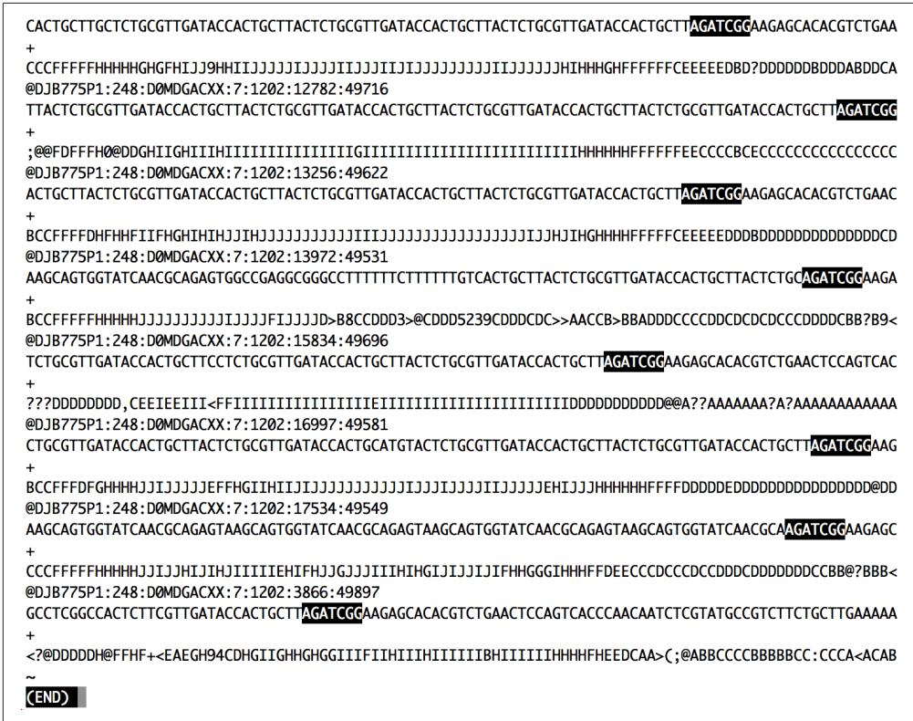
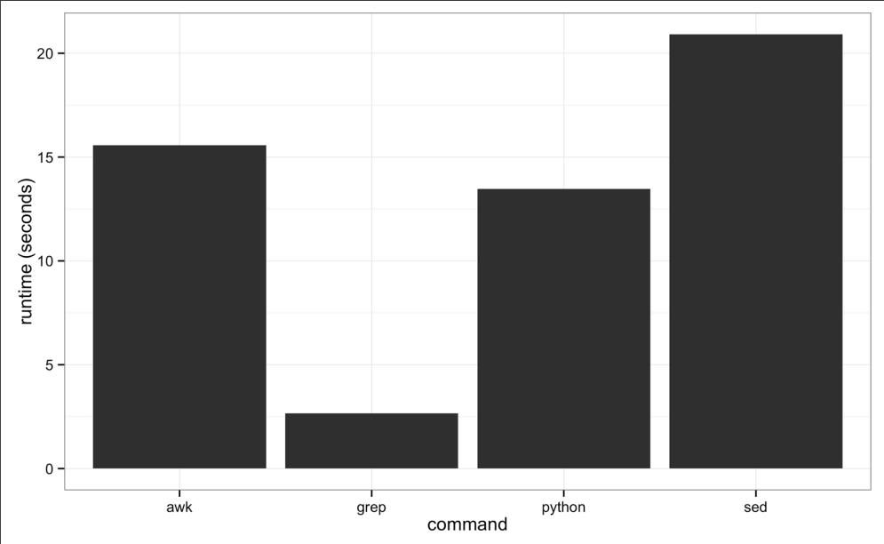
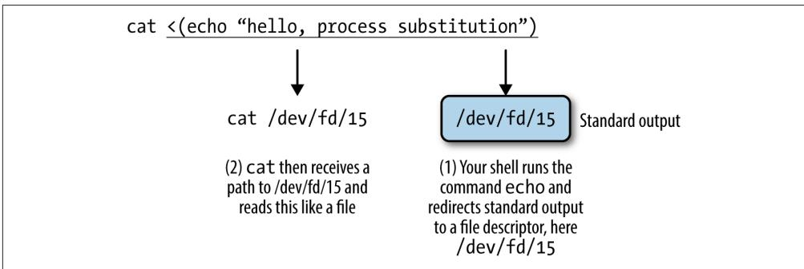

# Unix Data Tools

We often forget how science and engineering function. Ideas come from previous exploration more often than from lightning strokes. 

—John W. Tukey 

In Chapter 3, we learned the basics of the Unix shell: using streams, redirecting out‐ put, pipes, and working with processes. These core concepts not only allow us to use the shell to run command-line bioinformatics tools, but to leverage Unix as a modu‐ lar work environment for working with bioinformatics data. In this chapter, we’ll see how we can combine the Unix shell with command-line data tools to explore and manipulate data quickly. 

## Unix Data Tools and the Unix One-Liner Approach: Lessons from Programming Pearls

Understanding how to use Unix data tools in bioinformatics isn’t only about learning what each tool does, it’s about mastering the practice of connecting tools together— creating programs from Unix pipelines. By connecting data tools together with pipes, we can construct programs that parse, manipulate, and summarize data. Unix pipe‐ lines can be developed in shell scripts or as “one-liners”—tiny programs built by con‐ necting Unix tools with pipes directly on the shell. Whether in a script or as a oneliner, building more complex programs from small, modular tools capitalizes on the design and philosophy of Unix (discussed in “Why Do We Use Unix in Bioinformat‐ ics? Modularity and the Unix Philosophy” on page 37). The pipeline approach to building programs is a well-established tradition in Unix (and bioinformatics) because it’s a fast way to solve problems, incredibly powerful, and adaptable to a vari‐ ety of a problems. An illustrative example of the power of simple Unix pipelines comes from a famous exchange between two brilliant computer scientists: Donald Knuth and Doug McIlroy (recall from Chapter 3 that McIlroy invented Unix pipes). 

In a 1986 “Programming Pearls” column in the Communications of the ACM maga‐ zine, columnist Jon Bentley had computer scientist Donald Knuth write a simple pro‐ gram to count and print the k most common words in a file alongside their counts, in descending order. Knuth was chosen to write this program to demonstrate literate programming, a method of programming that Knuth pioneered. Literate programs are written as a text document explaining how to solve a programming problem (in plain English) with code interspersed throughout the document. Code inside this document can then be “tangled” out of the document using literate programming tools (this approach might be recognizable to readers familiar with R’s knitr or Sweave—both are modern descendants of this concept). Knuth’s literate program was seven pages long, and also highly customized to this particular programming prob‐ lem; for example, Knuth implemented a custom data structure for the task of count‐ ing English words. Bentley then asked that McIlroy critique Knuth’s seven-page-long solution. McIlroy commended Knuth’s literate programming and novel data struc‐ ture, but overall disagreed with his engineering approach. McIlroy replied with a sixline Unix script that solved the same programming problem: 

```shell
tr -cs A-Za-z '\n' | 1
tr A-Z a-z | 2
sort | 3
uniq -c | 4
sort -rn | 5
sed ${1}q 6 
```

While you shouldn’t worry about fully understanding this now (we’ll learn these tools in this chapter), McIlroy’s basic approach was: 

Translate all nonalphabetical characters (-c takes the complement of the first argument) to newlines and squeeze all adjacent characters together (-s) after translating. This creates one-word lines for the entire input stream. 

Translate all uppercase letters to lowercase. 

Sort input, bringing identical words on consecutive lines. 

Remove all duplicate consecutive lines, keeping only one with a count of the occurrences (-c). 

Sort in reverse (-r) numeric order (-n). 

Print the first k number of lines supplied by the first argument of the script (${1}) and quit. 

McIlroy’s solution is a beautiful example of the Unix approach. McIlroy originally wrote this as a script, but it can easily be turned into a one-liner entered directly on the shell (assuming k here is 10). However, I’ve had to add a line break here so that the code does not extend outside of the page margins: 

$$
\begin{array}{l} \text {\$ cat input.txt \backslash} \\ | \text { tr -cs A -Za -z '\n' | tr A -Z a - z | sort | uniq -c | sort -rn | sed 10q} \end{array}
$$

McIlroy’s script was doubtlessly much faster to implement than Knuth’s program and works just as well (and arguably better, as there were a few minor bugs in Knuth’s sol‐ ution). Also, his solution was built on reusable Unix data tools (or as he called them, “Unix staples”) rather than “programmed monolithically from scratch,” to use McIl‐ roy’s phrasing. The speed and power of this approach is why it’s a core part of bioin‐ formatics work. 

## When to Use the Unix Pipeline Approach and How to Use It Safely

Although McIlroy’s example is appealing, the Unix one-liner approach isn’t appropri‐ ate for all problems. Many bioinformatics tasks are better accomplished through a custom, well-documented script, more akin to Knuth’s program in “Programming Pearls.” Knowing when to use a fast and simple engineering solution like a Unix pipe‐ line and when to resort to writing a well-documented Python or R script takes experi‐ ence. As with most tasks in bioinformatics, choosing the most suitable approach can be half the battle. 

Unix pipelines entered directly into the command line shine as a fast, low-level data manipulation toolkit to explore data, transform data between formats, and inspect data for potential problems. In this context, we’re not looking for thorough, theoryshattering answers—we usually just want a quick picture of our data. We’re willing to sacrifice a well-documented implementation that solves a specific problem in favor of a quick rough picture built from modular Unix tools. As McIlroy explained in his response: 

The simple pipeline … will suffice to get answers right now, not next week or next month. It could well be enough to finish the job. But even for a production project … it would make a handsome down payment, useful for testing the value of the answers and for smoking out follow-on questions. 

—Doug McIlroy (my emphasis) 

Many tasks in bioinformatics are of this nature: we want to get a quick answer and keep moving forward with our project. We could write a custom script, but for simple tasks this might be overkill and would take more time than necessary. As we’ll see later in this chapter, building Unix pipelines is fast: we can iteratively assemble and test Unix pipelines directly in the shell. 

For larger, more complex tasks it’s often preferable to write a custom script in a lan‐ guage like Python (or R if the work involves lots of data analysis). While shell approaches (whether a one-liner or a shell script) are useful, these don’t allow for the same level of flexibility in checking input data, structuring programs, use of data structures, code documentation, and adding assert statements and tests as languages like Python and R. These languages also have better tools for stepwise documentation of larger analyses, like R’s knitr (introduced in the “Reproducibility with Knitr and Rmarkdown” on page 254) and iPython notebooks. In contrast, lengthy Unix pipe‐ lines can be fragile and less robust than a custom script. 

So in cases where using Unix pipelines is appropriate, what steps can we take to ensure they’re reproducible? As mentioned in Chapter 1, it’s essential that everything that produces a result is documented. Because Unix one-liners are entered directly in the shell, it’s particularly easy to lose track of which one-liner produced what version of output. Remembering to record one-liners requires extra diligence (and is often neglected, especially in bioinformatics work). Storing pipelines in scripts is a good approach—not only do scripts serve as documentation of what steps were performed on data, but they allow pipelines to be rerun and can be checked into a Git repository. We’ll look at scripting in more detail in Chapter 12. 

## Inspecting and Manipulating Text Data with Unix Tools

In this chapter, our focus is on learning how to use core Unix tools to manipulate and explore plain-text data formats. Many formats in bioinformatics are simple tabular plain-text files delimited by a character. The most common tabular plain-text file for‐ mat used in bioinformatics is tab-delimited. This is not an accident: most Unix tools such as cut and awk treat tabs as delimiters by default. Bioinformatics evolved to favor tab-delimited formats because of the convenience of working with these files using Unix tools. Tab-delimited file formats are also simple to parse with scripting languages like Python and Perl, and easy to load into R. 

## Tabular Plain-Text Data Formats

Tabular plain-text data formats are used extensively in computing. The basic format is incredibly simple: each row (also known as a record) is kept on its own line, and each column (also known as a field) is separated by some delimiter. There are three flavors you will encounter: tab-delimited, comma-separated, and variable space-delimited. 

Of these three formats, tab-delimited is the most commonly used in bioinformatics. File formats such as BED, GTF/GFF, SAM, tabular BLAST output, and VCF are all examples of tab-delimited files. Columns of a tab-delimited file are separated by a sin‐ gle tab character (which has the escape code \t). A common convention (but not a standard) is to include metadata on the first few lines of a tab-delimited file. These metadata lines begin with # to differentiate them from the tabular data records. Because tab-delimited files use a tab to delimit columns, tabs in data are not allowed. 

Comma-separated values (CSV) is another common format. CSV is similar to tabdelimited, except the delimiter is a comma character. While not a common occur‐ rence in bioinformatics, it is possible that the data stored in CSV format contain commas (which would interfere with the ability to parse it). Some variants just don’t allow this, while others use quotes around entries that could contain commas. Unfortunately, there’s no standard CSV format that defines how to handle this and many other issues with CSV—though some guidelines are given in RFC 4180. 

Lastly, there are space-delimited formats. A few stubborn bioinformatics programs use a variable number of spaces to separate columns. In general, tab-delimited for‐ mats and CSV are better choices than space-delimited formats because it’s quite com‐ mon to encounter data containing spaces. 

Despite the simplicity of tabular data formats, there’s one major common headache: how lines are separated. Linux and OS X use a single linefeed character (with the escape code \n) to separate lines, while Windows uses a DOS-style line separator of a carriage return and a linefeed character (\r\n). CSV files generally use this DOS-style too, as this is specified in the CSV specification RFC-4180 (which in practice is loosely followed). Occasionally, you might encounter files separated by only carriage returns, too. 

In this chapter, we’ll work with very simple genomic feature formats: BED (threecolumn) and GTF files. These file formats store the positions of features such as genes, exons, and variants in tab-delimited format. Don’t worry too much about the specifics of these formats; we’ll cover both in more detail in Chapter 9. Our goal in this chapter is primarily to develop the skills to freely manipulate plain-text files or streams using Unix data tools. We’ll learn each tool separately, and cumulatively work up to more advanced pipelines and programs. 

## Inspecting Data with Head and Tail

Many files we encounter in bioinformatics are much too long to inspect with cat— running cat on a file a million lines long would quickly fill your shell with text scroll‐ ing far too fast to make sense of. A better option is to take a look at the top of a file with head. Here, let’s took a look at the file Mus_musculus.GRCm38.75_chr1.bed: 

```txt
$ head Mus_musculus.GRCm38.75_chr1.bed
1 3054233 3054733
1 3054233 3054733
1 3054233 3054733
1 3102016 3102125
1 3102016 3102125
1 3102016 3102125
1 3205901 3671498
1 3205901 3216344 
```

```txt
1 3213609 3216344
1 3205901 3207317 
```

We can also control how many lines we see with head through the -n argument: 

```txt
$ head -n 3 Mus_musculus.GRCm38.75_chr1.bed
1 3054233 3054733
1 3054233 3054733
1 3054233 3054733 
```

head is useful for a quick inspection of files. head -n3 allows you to quickly inspect a file to see if a column header exists, how many columns there are, what delimiter is being used, some sample rows, and so on. 

head has a related command designed to look at the end, or tail of a file. tail works just like head: 

```txt
$ tail -n 3 Mus_musculus.GRCm38.75_chr1.bed
1 195240910 195241007
1 195240910 195241007
1 195240910 195241007 
```

We can also use tail to remove the header of a file. Normally the -n argument speci‐ fies how many of the last lines of a file to include, but if -n is given a number x pre‐ ceded with a + sign (e.g., +x), tail will start from the x<sup>th</sup> line. So to chop off a header, we start from the second line with -n +2. Here, we’ll use the command seq to gener‐ ate a file of 3 numbers, and chop of the first line: 

```batch
seq 3 > nums.txt
cat nums.txt
1
2
3
tail -n +2 nums.txt
2
3 
```

Sometimes it’s useful to see both the beginning and end of a file—for example, if we have a sorted BED file and we want to see the positions of the first feature and last feature. We can do this using a trick from data scientist (and former bioinformati‐ cian) Seth Brown: 

```shell
$(head -n 2; tail -n 2) < Mus_musculus.GRCm38.75_chr1.bed
1 3054233 3054733
1 3054233 3054733
1 195240910 195241007
1 195240910 195241007 
```

This is a useful trick, but it’s a bit long to type. To keep it handy, we can create a short‐ cut in your shell configuration file, which is either ~/.bashrc or ~/.profle: 

```shell
# inspect the first and last 3 lines of a file
i() { (head -n 2; tail -n 2) < "$1" | column -t} 
```

Then, either run source on your shell configuration file, or start a new terminal ses‐ sion and ensure this works. Then we can use i (for inspect) as a normal command: 

```csv
$ i Mus_musculus.GRCm38.75_chr1.bed
1 3054233 3054733
1 3054233 3054733
1 195240910 195241007
1 195240910 195241007 
```

head is also useful for taking a peek at data resulting from a Unix pipeline. For exam‐ ple, suppose we want to grep the Mus_musculus.GRCm38.75_chr1.gtf file for rows containing the string gene_id "ENSMUSG00000025907" (because our GTF is well structured, it’s safe to assume that these are all features belonging to this gene—but this may not always be the case!). We’ll use grep’s results as the standard input for the next program in our pipeline, but first we want to check grep’s standard out to see if everything looks correct. We can pipe the standard out of grep directly to head to take a look: 

```txt
$ grep 'gene_id "ENSMUSG00000025907"' Mus_musculus.GRCm38.75_chr1.gtf | head -n 1 protein_coding gene 6206197 6276648 [...] gene_id "ENSMUSG00000025907" [...] 
```

Note that for the sake of clarity, I’ve omitted the full line of this GTF, as it’s quite long. 

After printing the first few rows of your data to ensure your pipeline is working prop‐ erly, the head process exits. This is an important feature that helps ensure your pipes don’t needlessly keep processing data. When head exits, your shell catches this and stops the entire pipe, including the grep process too. Under the hood, your shell sends a signal to other programs in the pipe called SIGPIPE—much like the signal that’s sent when you press Control-c (that signal is SIGINT). When building complex pipelines that process large amounts of data, this is extremely important. It means that in a pipeline like: 

```txt
$ grep "some_string" huge_file.txt | program1 | program2 | head -n 5 
```

grep won’t continue searching huge_fle.txt, and program1 and program2 don’t con‐ tinue processing input after head outputs 5 lines and exits. While head is a good illus‐ tration of this feature of pipes, SIGPIPE works with all programs (unless the program explicitly catches and ignore this symbol—a possibility, but not one we encounter with bioinformatics programs). 

## less

less is also a useful program for a inspecting files and the output of pipes. less is a terminal pager, a program that allows us to view large amounts of text in our termi‐ nals. Normally, if we cat a long file to screen, the text flashes by in an instant—less allows us to view and scroll through long files and standard output a screen at a time. Other applications can call the default terminal pager to handle displaying large amounts of output; this is how git log displays an entire Git repository’s commit history. You might run across another common, but older terminal pager called more, but less has more features and is generally preferred (the name of less is a play on “less is more”). 

less runs more like an application than a command: once we start less, it will stay open until we quit it. Let’s review an example—in this chapter’s directory in the book’s GitHub repository, there’s a file called contaminated.fastq. Let’s look at this with less: 

## $ less contaminated.fastq

This will open up the program less in your terminal and display a FASTQ file full of sequences. First, if you need to quit less, press q. At any time, you can bring up a help page of all of less’s commands with h. 

Moving around in less is simple: press space to go down a page, and b to go up a page. You can use j and k to go down and up a line at a time (these are the same keys that the editor Vim uses to move down and up). To go back up to the top of a file, enter g; to go to the bottom of a file, press G. Table 7-1 lists the most commonly used less commands. We’ll talk a bit about how this works when less is taking input from another program through a pipe in a bit. 


Table 7-1. Commonly used less commands


<table><tr><td>Shortcut</td><td>Action</td></tr><tr><td>space bar</td><td>Next page</td></tr><tr><td>b</td><td>Previous page</td></tr><tr><td>g</td><td>First line</td></tr><tr><td>G</td><td>Last line</td></tr><tr><td>j</td><td>Down (one line at at time)</td></tr><tr><td>k</td><td>Up (one line at at time)</td></tr><tr><td>/</td><td>Search down (forward) for string</td></tr><tr><td>?</td><td>Search up (backward) for string</td></tr><tr><td>n</td><td>Repeat last search downward (forward)</td></tr><tr><td>N</td><td>Repeat last search upward (backward)</td></tr></table>

One of the most useful features of less is that it allows you to search text and high‐ lights matches. Visually highlighting matches can be an extremely useful way to find potential problems in data. For example, let’s use less to get a quick sense of whether there are 3’ adapter contaminants in the contaminated.fastq file. In this case, we’ll look for AGATCGGAAGAGCACACGTCTGAACTCCAGTCAC (a known adapter from the Illumina Tru‐ Seq® kit<sup>1</sup>). Our goal isn’t to do an exhaustive test or remove these adapters—we just want to take a 30-second peek to check if there’s any indication there could be con‐ tamination. 

Searching for this entire string won’t be very helpful, for the following reasons: 

• It’s likely that only part of the adapter will be in sequences 

• It’s common for there to be a few mismatches in sequences, making exact match‐ ing ineffective (especially since the base calling accuracy typically drops at the 3’ end of Illumina sequencing reads) 

To get around this, let’s search for the first 11 bases, AGATCGGAAGA. First, we open con‐ taminated.fastq in less, and then press / and enter AGATCGG. The results are in Figure 7-1, which passes the interocular test—the results hit you right between the eyes. Note the skew in match position toward the end of sequencing reads (where we expect contamination) and the high similarity in bases after the match. Although only a quick visual inspection, this is quite informative. 

less is also extremely useful in debugging our command-line pipelines. One of the great beauties of the Unix pipe is that it’s easy to debug at any point—just pipe the output of the command you want to debug to less and delete everything after. When you run the pipe, less will capture the output of the last command and pause so you can inspect it. 

less is also crucial when iteratively building up a pipeline—which is the best way to construct pipelines. Suppose we have an imaginary pipeline that involves three pro‐ grams, step1, step2, and step3. Our finished pipeline will look like step1 input.txt | step2 | step3 > output.txt. However, we want to build this up in pieces, running step1 input.txt first and checking its output, then adding in step3 and checking that output, and so forth. The natural way to do this is with less: 

```powershell
$ step1 input.txt | less    # inspect output in less
$ step1 input.txt | step2 | less
$ step1 input.txt | step2 | step3 | less 
```




Figure 7-1. Using less to search for contaminant adapter sequences starting with “AGATCGG”; note how the nucleotides afer the match are all very similar


A useful behavior of pipes is that the execution of a program with output piped to less will be paused when less has a full screen of data. This is due to how pipes block programs from writing to a pipe when the pipe is full. When you pipe a program’s output to less and inspect it, less stops reading input from the pipe. Soon, the pipe becomes full and blocks the program putting data into the pipe from continuing. The result is that we can throw less after a complex pipe processing large data and not worry about wasting computing power—the pipe will block and we can spend as much time as needed to inspect the output. 

## Plain-Text Data Summary Information with wc, ls, and awk

In addition to peeking at a file with head, tail, or less, we may want other bits of summary information about a plain-text data file like the number of rows or col‐ umns. With plain-text data formats like tab-delimited and CSV files, the number of rows is usually the number of lines. We can retrieve this with the program wc (for word count): 

```txt
$ wc Mus_musculus.GRCm38.75_chr1.bed
81226 243678 1698545 Mus_musculus.GRCm38.75_chr1.bed 
```

By default, wc outputs the number of words, lines, and characters of the supplied file. It can also work with many files: 

```txt
$ wc Mus_musculus.GRCm38.75_chr1.bed Mus_musculus.GRCm38.75_chr1.gtf
81226 243678 1698545 Mus_musculus.GRCm38.75_chr1.bed
81231 2385570 26607149 Mus_musculus.GRCm38.75_chr1.gtf
162457 2629248 28305694 total 
```

Often, we only care about the number of lines. We can use option -l to just return the number of lines: 

```batch
$ wc -l Mus_musculus.GRCm38.75_chr1.bed
81226 Mus_musculus.GRCm38.75_chr1.bed 
```

You might have noticed a discrepancy between the BED file and the GTF file for this chromosome 1 mouse annotation. What’s going on? Using head, we can inspect the Mus_musculus.GRCm38.75_chr1.gtf file and see that the first few lines are comments: 

```powershell
$ head -n 5 Mus_musculus.GRCm38.75_chr1.gtf
#!genome-build GRCm38.p2
#!genome-version GRCm38
#!genome-date 2012-01
#!genome-build-accession NCBI:GCA_000001635.4
#!genebuild-last-updated 2013-09 
```

The five-line discrepancy we see with wc -l is due to this header. Using a hash mark (#) as a comment field for metadata is a common convention; it is one we need to consider when using Unix data tools. 

Another bit of information we usually want about a file is its size. The easiest way to do this is with our old Unix friend, ls, with the -l option: 

```batch
$ ls -l Mus_musculus.GRCm38.75_chr1.bed
-rw-r--r-- 1 vinceb staff 1698545 Jul 14 22:40 Mus_musculus.GRCm38.75_chr1.bed 
```

In the fourth column (the one before the creation data) ls -l reports file sizes in bytes. If we wish to use human-readable sizes, we can use ls -lh: 

```batch
$ ls -lh Mus_musculus.GRCm38.75_chr1.bed
-rw-r--r-- 1 vinceb staff 1.6M Jul 14 22:40 Mus_musculus.GRCm38.75_chr1.bed 
```

Here, “M” indicates megabytes; if a file is gigabytes in size, ls -lh will output results in gigabytes, “G.” 


## Data Formats and Assumptions

Although wc -l is a quick way to determine how many rows there are in a plain-text data file (e.g., a TSV or CSV file), it makes the assumption that your data is well formatted. For example, imagine that a script writes data output like: 

```csv
$ cat some_data.bed
1 3054233 3054733
1 3054233 3054733
1 3054233 3054733 
```

```batch
$ wc -l data.txt
5 data.txt 
```

There’s a subtle problem here: while there are only three rows of data, there are five lines. These two extra lines are empty newlines at the end of the file. So while wc -l is a quick and easy way to count the number of lines in a file, it isn’t the most robust way to check how many rows of data are in a file. Still, wc -l will work well enough in most cases when we just need a rough idea how many rows there are. If we wish to exclude lines with just white‐ space (spaces, tabs, or newlines), we can use grep: 

```txt
$ grep -c "[^ \\n\\t]" some_data.bed
3 
```

We’ll talk a lot more about grep later on. 

There’s one other bit of information we often want about a file: how many columns it contains. We could always manually count the number of columns of the first row with head -n 1, but a far easier way is to use awk. Awk is an easy, small programming language great at working with text data like TSV and CSV files. We’ll introduce awk as a language in much more detail in “Text Processing with Awk” on page 157, but let’s use an awk one-liner to return how many fields a file contains: 

```txt
$ awk -F "\t" '{print NF; exit}' Mus_musculus.GRCm38.75_chr1.bed 3 
```

awk was designed for tabular plain-text data processing, and consequently has a builtin variable NF set to the number of fields of the current dataset. This simple awk oneliner simply prints the number of fields of the first row of the Mus_musculus.GRCm38.75_chr1.bed file, and then exits. By default, awk treats white‐ space (tabs and spaces) as the field separator, but we could change this to just tabs by setting the -F argument of awk (because the examples in both BED and GTF formats we’re working in are tab-delimited). 

Finding how many columns there are in Mus_musculus.GRCm38.75_chr1.gtf is a bit trickier. Remember that our Mus_musculus.GRCm38.75_chr1.gtf file has a series of comments before it: five lines that begin with hash symbols (#) that contain helpful metadata like the genome build, version, date, and accession number. Because the first line of this file is a comment, our awk trick won’t work—instead of reporting the number of data columns, it returns the number of columns of the first comment. To see how many columns of data there are, we need to first chop off the comments and then pass the results to our awk one-liner. One way to do this is with a tail trick we saw earlier: 

```shell
\( tail -n +5 Mus_musculus.GRCm38.75_chr1.gtf | head -n 1 ①
#!genebuild-last-updated 2013-09
\( tail -n +6 Mus_musculus.GRCm38.75_chr1.gtf | head ②
1 pseudogene gene 3054233 3054733 . + . [...] 
\( tail -n +6 Mus_musculus.GRCm38.75_chr1.gtf | awk -F "\t" '{print NF; exit}' ③
16 
```

① Using tail with the -n +5 argument (note the preceding plus sign), we can chop off some rows. Before piping these results to awk, we pipe it to head to inspect what we have. Indeed, we see we’ve made a mistake: the first line returned is the last comment—we need to chop off one more line. 

② Incrementing our -n argument to 6, and inspecting the results with head, we get the results we want: the first row of the standard output stream is the first row of the Mus_musculus.GRCm38.75_chr1.gtf GTF file. 

Now, we can pipe this data to our awk one-liner to get the number of columns in this file. 

While removing a comment header block at the beginning of a file with tail does work, it’s not very elegant and has weaknesses as an engineering solution. As you become more familiar with computing, you’ll recognize a solution like this as brittle. While we’ve engineered a solution that does what we want, will it work on other files? Is it robust? Is this a good way to do this? The answer to all three questions is no. Rec‐ ognizing when a solution is too fragile is an important part of developing Unix data skills. 

The weakness with using tail -n +6 to drop commented header lines from a file is that this solution must be tailored to specific files. It’s not a general solution, while removing comment lines from a file is a general problem. Using tail involves figur‐ ing out how many lines need to be chopped off and then hardcoding this value in our Unix pipeline. Here, a better solution would be to simply exclude all lines that match a comment line pattern. Using the program grep (which we’ll talk more about in “The All-Powerful Grep” on page 140), we can easily exclude lines that begin with “#”: 

```shell
$ grep -v "^#" Mus_musculus.GRCm38.75_chr1.gtf | head -n 3
1 pseudogene gene 3054233 3054733 . + . [...]
1 unprocessed_pseudogene transcript 3054233 3054733 . + . [...]
1 unprocessed_pseudogene exon 3054233 3054733 . + . [...] 
```

This solution is faster and easier (because we don’t have to count how many commen‐ ted header lines there are), in addition to being less fragile and more robust. Overall, it’s a better engineered solution—an optimal balance of robustness, being generaliza‐ ble, and capable of being implemented quickly. These are the types of solutions you should hunt for when working with Unix data tools: they get the job done and are neither over-engineered nor too fragile. 

## Working with Column Data with cut and Columns

When working with plain-text tabular data formats like tab-delimited and CSV files, we often need to extract specific columns from the original file or stream. For exam‐ ple, suppose we wanted to extract only the start positions (the second column) of the Mus_musculus.GRCm38.75_chr1.bed file. The simplest way to do this is with cut. This program cuts out specified columns (also known as fields) from a text file. By default, cut treats tabs as the delimiters, so to extract the second column we use: 

```shell
$ cut -f 2 Mus_musculus.GRCm38.75_chr1.bed | head -n 3
3054233
3054233
3054233 
```

The -f argument is how we specify which columns to keep. The argument -f also allows us to specify ranges of columns (e.g., -f 3-8) and sets of columns (e.g., -f 3,5,8). Note that it’s not possible to reorder columns using using cut (e.g., -f 6,5,4,3 will not work, unfortunately). To reorder columns, you’ll need to use awk, which is discussed later. 

Using cut, we can convert our GTF for Mus_musculus.GRCm38.75_chr1.gtf to a three-column tab-delimited file of genomic ranges (e.g., chromosome, start, and end position). We’ll chop off the metadata rows using the grep command covered earlier, and then use cut to extract the first, fourth, and fifth columns (chromosome, start, end): 

```shell
grep -v "^#" Mus_musculus.GRCm38.75_chr1.gtf | cut -f1,4,5 | head -n 3
1 3054233 3054733
1 3054233 3054733
1 3054233 3054733
$ grep -v "^#" Mus_musculus.GRCm38.75_chr1.gtf | cut -f1,4,5 > test.txt 
```

Note that although our three-column file of genomic positions looks like a BEDformatted file, it’s not due to subtle differences in genomic range formats. We’ll learn more about this in Chapter 9. 

cut also allows us to specify the column delimiter character. So, if we were to come across a CSV file containing chromosome names, start positions, and end positions, we could select columns from it, too: 

```csv
$ head -n 3 Mus_musculus.GRCm38.75_chr1_bed.csv
1,3054233,3054733
1,3054233,3054733
1,3054233,3054733
$ cut -d, -f2,3 Mus_musculus.GRCm38.75_chr1_bed.csv | head -n 3
3054233,3054733
3054233,3054733
3054233,3054733 
```

## Formatting Tabular Data with column

As you may have noticed when working with tab-delimited files, it’s not always easy to see which elements belong to a particular column. For example: 

```txt
$ grep -v "^#" Mus_musculus.GRCm38.75_chr1.gtf | cut -f1-8 | head -n3
1 pseudogene gene 3054233 3054733 . + .
1 unprocessed_pseudogene transcript 3054233 3054733 . +
1 unprocessed_pseudogene exon 3054233 3054733 . + . 
```

While tabs are a terrific delimiter in plain-text data files, our variable width data leads our columns to not stack up well. There’s a fix for this in Unix: program column -t (the -t option tells column to treat data as a table). column -t produces neat columns that are much easier to read: 

```txt
$ grep -v "^#" Mus_musculus.GRCm38.75_chr1.gtf | cut -f 1-8 | column -t | head -n 3
1 pseudogene gene 3054233 3054733 . + .
1 unprocessed_pseudogene transcript 3054233 3054733 . + .
1 unprocessed_pseudogene exon 3054233 3054733 . + . 
```

Note that you should only use columnt -t to visualize data in the terminal, not to reformat data to write to a file. Tab-delimited data is preferable to data delimited by a variable number of spaces, since it’s easier for programs to parse. 

Like cut, column’s default delimiter is the tab character (\t). We can specify a differ‐ ent delimiter with the -s option. So, if we wanted to visualize the columns of the Mus_musculus.GRCm38.75_chr1_bed.csv file more easily, we could use: 

```csv
$ column -s", " -t Mus_musculus.GRCm38.75_chr1_bed.csv | head -n 3
1 3054233 3054733
1 3054233 3054733
1 3054233 3054733 
```

column illustrates an important point about how we should treat data: there’s no rea‐ son to make data formats attractive at the expense of readable by programs. This relates to the recommendation, “write code for humans, write data for computers” (“Write Code for Humans, Write Data for Computers” on page 11). Although singlecharacter delimited columns (like CSV or tab-delimited) can be difficult for humans to read, consider the following points: 

• They work instantly with nearly all Unix tools. 

• They are easy to convert to a readable format with column -t. 

In general, it’s easier to make computer-readable data attractive to humans than it is to make data in a human-friendly format readable to a computer. Unfortunately, data in formats that prioritize human readability over computer readability still linger in bioinformatics. 

## The All-Powerful Grep

Earlier, we’ve seen how grep is a useful tool for extracting lines of a file that match (or don’t match) a pattern. grep -v allowed us to exclude the header rows of a GTF file in a more robust way than tail. But as we’ll see in this section, this is just scratching the surface of grep’s capabilities; grep is one of the most powerful Unix data tools. 

First, it’s important to mention grep is fast. Really fast. If you need to find a pattern (fixed string or regular expression) in a file, grep will be faster than anything you could write in Python. Figure 7-2 shows the runtimes of four methods of finding exact matching lines in a file: grep, sed, awk, and a simple custom Python script. As you can see, grep dominates in these benchmarks: it’s five times faster than the fastest alternative, Python. However, this is a bit of unfair comparison: grep is fast because it’s tuned to do one task really well: find lines of a file that match a pattern. The other programs included in this benchmark are more versatile, but pay the price in terms of efficiency in this particular task. This demonstrates a point: if computational speed is our foremost priority (and there are many cases when it isn’t as important as we think), Unix tools tuned to do certain tasks really often are the fastest implementation. 




Figure 7-2. Benchmark of the time it takes to search the Maize genome for the exact string “AGATGCATG”


While we’ve seen grep used before in this book let’s briefly review its basic usage. grep requires two arguments: the pattern (the string or basic regular expression you want to search for), and the file (or files) to search for it in. As a very simple example, let’s use grep to find a gene, “Olfr418-ps1,” in the file Mus_muscu‐ lus.GRCm38.75_chr1_genes.txt (which contains all Ensembl gene identifiers and gene names for all protein-coding genes on chromosome 1): 

```powershell
$ grep "Olfr418-ps1" Mus_musculus.GRCm38.75_chr1_genes.txt
ENSMUSG00000049605 0lfr418-ps1 
```

The quotes around the pattern aren’t required, but it’s safest to use quotes so our shells won’t try to interpret any symbols. grep returns any lines that match the pat‐ tern, even ones that only partially match: 

```txt
$ grep Olfr Mus_musculus.GRCm38.75_chr1_genes.txt | head -n 5
ENSMUSG00000067064 0lfr1416
ENSMUSG00000057464 0lfr1415
ENSMUSG00000042849 0lfr1414
ENSMUSG00000058904 0lfr1413
ENSMUSG00000046300 0lfr1412 
```

One useful option when using grep is --color=auto. This option enables terminal colors, so the matching part of the pattern is colored in your terminal. 


## GNU, BSD, and the Flavors of Grep

Up until now, we’ve glossed over a very important detail: there are different implementations of Unix tools. Tools like grep, cut, and sort come from one of two flavors: BSD utils and GNU coreutils. Both of these implementations contain all standard Unix tools we use in this chapter, but their features may slightly differ from each other. BSD’s tools are found on Max OS X and other Berkeley Soft‐ ware Distribution-derived operating systems like FreeBSD. GNU’s coreutils are the standard set of tools found on Linux systems. It’s important to know which implementation you’re using (this is easy to tell by reading the man page). If you’re using Mac OS X and would like to use GNU coreutils, you can install these through Homebrew with brew install coreutils. Each program will install with the prefix “g” (e.g., cut would be aliased to gcut), so as to not interfere with the system’s default tools. 

Unlike BSD’s utils, GNU’s coreutils are still actively developed. GNU’s coreutils also have many more features and extensions than BSD’s utils, some of which we use in this chapter. In general, I rec‐ ommend you use GNU’s coreutils over BSD utils, as the documen‐ tation is more thorough and the GNU extensions are helpful (and sometimes necessary). Throughout the chapter, I will indicate when a particular feature relies on the GNU version. 

Earlier, we saw how grep could be used to only return lines that do not match the specified pattern—this is how we excluded the commented lines from our GTF file. The option we used was -v, for invert. For example, suppose you wanted a list of all genes that contain “Olfr,” except “Olfr1413.” Using -v and chaining together to calls to grep with pipes, we could use: 

## $ grep Olfr Mus_musculus.GRCm38.75_chr1_genes.txt | grep -v Olfr1413

But beware! What might go wrong with this? Partially matching may bite us here: while we wanted to exclude “Olfr1413,” this command would also exclude genes like “Olfr1413a” and “Olfr14130.” But we can get around this by using -w, which matches entire words (surrounded by whitespace). Let’s look at how this works with a simpler toy example: 

```batch
cat example.txt
bio
bioinfo
bioinformatics
computational biology
grep -v bioinfo example.txt
bio
computational biology
grep -v -w bioinfo example.txt 
```

```txt
bio
bioinformatics
computational biology 
```

By constraining our matches to be words, we’re using a more restrictive pattern. In general, our patterns should always be as restrictive as possible to avoid unintentional matches caused by partial matching. 

grep’s default output often doesn’t give us enough context of a match when we need to inspect results by eye; only the matching line is printed to standard output. There are three useful options to get around this context before (-B), context: after (-A), and context before and after (-C). Each of these arguments takes how many lines of con‐ text to provide: 

```txt
$ grep -B1 "AGATCGG" contam.fastq | head -n 6
@DJB775P1:248:D0MDGACXX:7:1202:12362:49613
TGCTTACTCTGCGTTGATACCACTGCTTAGATCGGAAGAGCACACGTCTGAA
--
@DJB775P1:248:D0MDGACXX:7:1202:12782:49716
CTCTGCGTTGATACCACTGCTTACTCTGCGTTGATACCACTGCTTAGATCGG
--
$ grep -A2 "AGATCGG" contam.fastq | head -n 6
TGCTTACTCTGCGTTGATACCACTGCTTAGATCGGAAGAGCACACGTCTGAA
+
JJJJJJIIJJJJJJJHIHHGHFFFFFFFCEEEEEEDBD?DDDDDBDDDABDDCA
--
CTCTGCGTTGATACCACTGCTTACTCTGCGTTGATACCACTGCTTAGATCGG
+ 
```

Print one line of context before (-B) the matching line. 

Print two lines of context after (-A) the matching line. 

grep also supports a flavor of regular expression called POSIX Basic Regular Expres‐ sions (BRE). If you’re familiar with the regular expressions in Perl or Python, you’ll notice that grep’s regular expressions aren’t quite as powerful as the ones in these lan‐ guages. Still, for many simple applications they work quite well. For example, if we wanted to find the Ensembl gene identifiers for both “Olfr1413” and “Olfr1411,” we could use: 

```txt
$ grep "Olfr141[13]" Mus_musculus.GRCm38.75_chr1_genes.txt
ENSMUSG00000058904 Olfr1413
ENSMUSG00000062497 Olfr1411 
```

Here, we’re using a shared prefix between these two gene names, and allowing the last single character to be either “1” or “3”. However, this approach is less useful if we have more divergent patterns to search for. For example, constructing a BRE pattern to match both “Olfr218” and “Olfr1416” would be complex and error prone. For tasks like these, it’s far easier to use grep’s support for POSIX Extended Regular Expressions (ERE). grep allows us to turn on ERE with the -E option (which on many systems is aliased to egrep). EREs allow us to use alternation (regular expression jargon for matching one of several possible patterns) to match either “Olfr218” or “Olfr1416.” The syntax uses a pipe symbol (|): 

```txt
$ grep -E "(Olfr1413|Olfr1411)" Mus_musculus.GRCm38.75_chr1_genes.txt
ENSMUSG00000058904 0lfr1413
ENSMUSG00000062497 0lfr1411 
```

We’re just scratching the surface of BRE and ERE now; we don’t have the space to cover these two regular expression flavors in depth here (see “Assumptions This Book Makes” on page xvi for some resources on regular expressions). The important part is that you recognize there’s a difference and know the terms necessary to find further help when you need it. 

grep has an option to count how many lines match a pattern: -c. For example, sup‐ pose we wanted a quick look at how many genes start with “Olfr”: 

```batch
$ grep -c "\tOlfr" Mus_musculus.GRCm38.75_chr1_genes.txt 27 
```

Alternatively, we could pipe the matching lines to wc -l: 

```txt
$ grep "\tOlfr" Mus_musculus.GRCm38.75_chr1_genes.txt | wc -l 27 
```

Counting matching lines is extremely useful—especially with plain-text data where lines represent rows, and counting the number of lines that match a pattern can be used to count occurrences in the data. For example, suppose we wanted to know how many small nuclear RNAs are in our Mus_musculus.GRCm38.75_chr1.gtf file. snRNAs are annotated as gene_biotype "snRNA" in the last column of this GTF file. A simple way to count these features would be: 

```shell
$ grep -c 'gene_biotype "snRNA"' Mus_musculus.GRCm38.75_chr1.gtf 315 
```

Note here how we’ve used single quotes to specify our pattern, as our pattern includes the double-quote characters ("). 

Currently, grep is outputting the entire matching line. In fact, this is one reason why grep is so fast: once it finds a match, it doesn’t bother searching the rest of the line and just sends it to standard output. Sometimes, however, it’s useful to use grep to extract only the matching part of the pattern. We can do this with -o: 

```shell
$ grep -o "Olfr.*" Mus_musculus.GRCm38.75_chr1_genes.txt | head -n 3
Olfr1416
Olfr1415
Olfr1414 
```

Or, suppose we wanted to extract all values of the “gene_id” field from the last col‐ umn of our Mus_musculus.GRCm38.75_chr1.gtf file. This is easy with -o: 

```shell
$ grep -E -o 'gene_id "\w+" ' Mus_musculus.GRCm38.75_chr1.gtf | head -n 5
gene_id "ENSMUSG00000090025"
gene_id "ENSMUSG00000090025"
gene_id "ENSMUSG00000090025"
gene_id "ENSMUSG00000064842"
gene_id "ENSMUSG00000064842" 
```

Here, we’re using extended regular expressions to capture all gene names in the field. However, as you can see there’s a great deal of redundancy: our GTF file has multiple features (transcripts, exons, start codons, etc.) that all have the same gene name. As a taste of what’s to come in later sections, Example 7-1 shows how we could quickly convert this messy output from grep to a list of unique, sorted gene names. 

Example 7-1. Cleaning a set of gene names with Unix data tools 

```shell
$ grep -E -o 'gene_id "(\w+")'' Mus_musculus.GRCm38.75_chr1.gtf | \
cut -f2 -d" " | \
sed 's/"//g' | \
sort | \
uniq > mm_gene_id.txt 
```

Even though it looks complex, this took less than one minute to write (and there are other possible solutions that omit cut, or only use awk). The length of this file (according to wc -l) is 2,027 line long—the same number we get when clicking around Ensembl’s BioMart database interface for the same information. In the remaining sections of this chapter, we’ll learn these tools so you can employ this type of quick pipeline in your work. 

## Decoding Plain-Text Data: hexdump

In bioinformatics, the plain-text data we work with is often encoded in ASCII. ASCII is a character encoding scheme that uses 7 bits to represent 128 different values, including letters (upper- and lowercase), numbers, and special nonvisible characters. While ASCII only uses 7 bits, nowadays computers use an 8-bit byte (a unit repre‐ senting 8 bits) to store ASCII characters. More information about ASCII is available in your terminal through man ascii. Because plain-text data uses characters to encode information, our encoding scheme matters. When working with a plain-text file, 98% of the time you won’t have to worry about the details of ASCII and how your file is encoded. However, the 2% of the time when encoding does matter—usually when an invisible non-ASCII character has entered data—it can lead to major head‐ aches. In this section, we’ll cover the basics of inspecting text data at a low level to solve these types of problems. If you’d like to skip this section for now, bookmark it in case you run into this issue at some point. 

First, to look at a file’s encoding use the program file, which infers what the encod‐ ing is from the file’s content. For example, we see that many of the example files we’ve been working with in this chapter are ASCII-encoded: 

```txt
$ file Mus_musculus.GRCm38.75_chr1.bed Mus_musculus.GRCm38.75_chr1.gtf
Mus_musculus.GRCm38.75_chr1.bed: ASCII text
Mus_musculus.GRCm38.75_chr1.gtf: ASCII text, with very long lines 
```

Some files will have non-ASCII encoding schemes, and may contain special charac‐ ters. The most common character encoding scheme is UTF-8, which is a superset of ASCII but allows for special characters. For example, the utf8.txt included in this chapter’s GitHub directory is a UTF-8 file, as evident from file’s output: 

```txt
$ file utf8.txt
utf8.txt: UTF-8 Unicode English text 
```

Because UTF-8 is a superset of ASCII, if we were to delete the special characters in this file and save it, file would return that this file is ASCII-encoded. 

Most files you’ll download from data sources like Ensembl, NCBI, and UCSC’s Genome Browser will not have special characters and will be ASCII-encoded (which again is simply UTF-8 without these special characters). Often, the problems I’ve run into are from data generated by humans, which through copying and pasting data from other sources may lead to unintentional special characters. For example, the improper.fa file in this chapter’s directory in the GitHub repository looks like a regu‐ lar FASTA file upon first inspection: 

```shell
$ cat improper.fa
>good-sequence
AGCTAGCTACTAGCAGCTACTACGAGCATCTACGGCGCGATCTACG
>bad-sequence
GATCAGGCGACATCGAGCTATCACTACGAGCGAGAGATCAGCTATT 
```

However, finding the reverse complement of these sequences using bioawk (don’t worry about the details of this program yet—we’ll cover it later) leads to strange results: 

```powershell
$ bioawk -cfastx '{print revcomp($seq)}' improper.fa
CGTAGATCGCGCCGTAGATGCTCGTAGTAGCTGCTAGTAGCTAGCT
AATAGCTGATC 
```

What’s going on? We have a non-ASCII character in our second sequence: 

```txt
$ file improper.fa
improper.fa: UTF-8 Unicode text 
```

Using the hexdump program, we can identify which letter is causing this problem. The hexdump program returns the hexadecimal values of each character. With the -c option, this also prints the character: 

```txt
$ hexdump -c improper.fa
0000000 > g o o d - s e q u e n c e \n A 
```

<table><tr><td>0000010</td><td>G</td><td>C</td><td>T</td><td>A</td><td>G</td><td>C</td><td>T</td><td>A</td><td>C</td><td>T</td><td>A</td><td>G</td><td>C</td><td>A</td><td>G</td><td>C</td></tr><tr><td>0000020</td><td>T</td><td>A</td><td>C</td><td>T</td><td>A</td><td>C</td><td>G</td><td>A</td><td>G</td><td>C</td><td>A</td><td>T</td><td>C</td><td>T</td><td>A</td><td>C</td></tr><tr><td>0000030</td><td>G</td><td>G</td><td>C</td><td>G</td><td>C</td><td>G</td><td>A</td><td>T</td><td>C</td><td>T</td><td>A</td><td>C</td><td>G</td><td>\n</td><td>&gt;</td><td>b</td></tr><tr><td>0000040</td><td>a</td><td>d</td><td>-</td><td>s</td><td>e</td><td>q</td><td>u</td><td>e</td><td>n</td><td>c</td><td>e</td><td>\n</td><td>G</td><td>A</td><td>T</td><td>C</td></tr><tr><td>0000050</td><td>A</td><td>G</td><td>G</td><td>C</td><td>G</td><td>A</td><td>C</td><td>A</td><td>T</td><td>C</td><td>G</td><td>A</td><td>G</td><td>C</td><td>T</td><td>A</td></tr><tr><td>0000060</td><td>T</td><td>C</td><td>A</td><td>C</td><td>T</td><td>A</td><td>C</td><td>G</td><td>A</td><td>G</td><td>C</td><td>G</td><td>A</td><td>G</td><td>221</td><td></td></tr><tr><td>0000070</td><td>G</td><td>A</td><td>T</td><td>C</td><td>A</td><td>G</td><td>C</td><td>T</td><td>A</td><td>T</td><td>T</td><td>\n</td><td></td><td></td><td></td><td></td></tr><tr><td>000007c</td><td></td><td></td><td></td><td></td><td></td><td></td><td></td><td></td><td></td><td></td><td></td><td></td><td></td><td></td><td></td><td></td></tr></table>

As we can see, the character after “CGAGCGAG” in the second sequence is clearly not an ASCII character. Another way to see non-ASCII characters is using grep. This command is a bit tricky (it searches for characters outside a hexadecimal range), but it’s such a specific use case there’s little reason to explain it in depth: 

```shell
$ LC_CTYPE=C grep --color='auto' -P "[\x80-\xFF]" improper.fa GATCAGGCGACATCGAGCTATCACTACGAGCGAG[m♦GATCAGCTATT 
```

Note that this does not work with BSD grep, the version that comes with Mac OS X. Another useful grep option to add to this is -n, which adds line numbers to each matching line. On my systems, I have this handy line aliased to nonascii in my shell configuration file (often ~/.bashrc or ~/.profle): 

$ alias nonascii="LC_CTYPE=C grep --color='auto' -n -P '[\x80-\xFF]'" 

Overall, file, hexdump, and the grep command are useful for those situations where something isn’t behaving correctly and you suspect a file’s encoding may be to blame (which happened even during preparing this book’s test data!). This is especially com‐ mon with data curated by hand, by humans; always be wary of passing these files without inspection into an analysis pipeline. 

## Sorting Plain-Text Data with Sort

Very often we need to work with sorted plain-text data in bioinformatics. The two most common reasons to sort data are as follows: 

• Certain operations are much more efficient when performed on sorted data. 

• Sorting data is a prerequisite to finding all unique lines, using the Unix sort | uniq idiom. 

We’ll talk much more about sort | uniq in the next section; here we focus on how to sort data using sort. 

First, like cut, sort is designed to work with plain-text data with columns. Running sort without any arguments simply sorts a file alphanumerically by line: 

<table><tr><td colspan="3">$ cat example.bed</td></tr><tr><td>chr1</td><td>26</td><td>39</td></tr><tr><td>chr1</td><td>32</td><td>47</td></tr><tr><td>chr3</td><td>11</td><td>28</td></tr><tr><td>chr1</td><td>40</td><td>49</td></tr><tr><td>chr3</td><td>16</td><td>27</td></tr><tr><td>chr1</td><td>9</td><td>28</td></tr><tr><td>chr2</td><td>35</td><td>54</td></tr><tr><td>chr1</td><td>10</td><td>19</td></tr><tr><td colspan="3">$ sort example.bed</td></tr><tr><td>chr1</td><td>10</td><td>19</td></tr><tr><td>chr1</td><td>26</td><td>39</td></tr><tr><td>chr1</td><td>32</td><td>47</td></tr><tr><td>chr1</td><td>40</td><td>49</td></tr><tr><td>chr1</td><td>9</td><td>28</td></tr><tr><td>chr2</td><td>35</td><td>54</td></tr><tr><td>chr3</td><td>11</td><td>28</td></tr><tr><td>chr3</td><td>16</td><td>27</td></tr></table>

Because chromosome is the first column, sorting by line effectively groups chromo‐ somes together, as these are “ties” in the sorted order. Grouped data is quite useful, as we’ll see. 


## Using Diferent Delimiters with sort

By default, sort treats blank characters (like tab or spaces) as field delimiters. If your file uses another delimiter (such as a comma for CSV files), you can specify the field separator with -t (e.g., -t","). 

However, using sort’s defaults of sorting alphanumerically by line doesn’t handle tab‐ ular data properly. There are two new features we need: 

• The ability to sort by particular columns 

• The ability to tell sort that certain columns are numeric values (and not alpha‐ numeric text; see the Tip "Leading Zeros and Sorting" in Chapter 2 for an exam‐ ple of the difference) 

sort has a simple syntax to do this. Let’s look at how we’d sort example.bed by chro‐ mosome (first column), and start position (second column): 

```shell
$ sort -k1,1 -k2,2n example.bed
chr1 9 28
chr1 10 19
chr1 26 39
chr1 32 47
chr1 40 49
chr2 35 54
chr3 11 28
chr3 16 27 
```

Here, we specify the columns (and their order) we want to sort by as -k arguments. In technical terms, -k specifies the sorting keys and their order. Each -k argument takes a range of columns as start,end, so to sort by a single column we use start,start. In the preceding example, we first sorted by the first column (chromosome), as the first -k argument was -k1,1. Sorting by the first column alone leads to many ties in rows with the same chromosomes (e.g., “chr1” and “chr3”). Adding a second -k argument with a different column tells sort how to break these ties. In our example, -k2,2n tells sort to sort by the second column (start position), treating this column as numerical data (because there’s an n in -k2,2n). 

The end result is that rows are grouped by chromosome and sorted by start position. We could then redirect the standard output stream of sort to a file: 

$ sort -k1,1 -k2,2n example.bed > example_sorted.bed 

If you need all columns to be sorted numerically, you can use the argument -n rather than specifying which particular columns are numeric with a syntax like -k2,2n. 

Understanding the -k argument syntax is so important we’re going to step through one more example. The Mus_musculus.GRCm38.75_chr1_random.gtf file is Mus_musculus.GRCm38.75_chr1.gtf with permuted rows (and without a metadata header). Let’s suppose we wanted to again group rows by chromosome, and sort by position. Because this is a GTF file, the first column is chromosome and the fourth column is start position. So to sort this file, we’d use: 

$ sort -k1,1 -k4,4n Mus_musculus.GRCm38.75_chr1_random.gtf > \ Mus_musculus.GRCm38.75_chr1_sorted.gtf 


## Sorting Stability

There’s one tricky technical detail about sorting worth being aware of: sorting stability. To understand stable sorting, we need to go back and think about how lines that have identical sorting keys are handled. If two lines are exactly identical according to all sorting keys we’ve specified, they are indistinguishable and equivalent when being sorted. When lines are equivalent, sort will sort them according to the entire line as a last-resort effort to put them in some order. What this means is that even if the two lines are identi‐ cal according to the sorting keys, their sorted order may be diferent from the order they appear in the original fle. This behavior makes sort an unstable sort. 

If we don’t want sort to change the order of lines that are equal according to our sort keys, we can specify the -s option. -s turns off this last-resort sorting, thus making sort a stable sorting algo‐ rithm. 

Sorting can be computationally intensive. Unlike Unix tools, which operate on a sin‐ gle line a time, sort must compare multiple lines to sort a file. If you have a file that you suspect is already sorted, it’s much cheaper to validate that it’s indeed sorted rather than resort it. We can check if a file is sorted according to our -k arguments using -c: 

```txt
sort -k1,1 -k2,2n -c example_sorted.bed ①
echo $?
0
sort -k1,1 -k2,2n -c example.bed ②
sort: example.bed:4: disorder: chr1 40 49
echo $?
1 
```

This file is already sorted by -k1,1 -k2,2n -c, so sort exits with exit status 0 (true). 

This file is not already sorted by -k1,1 -k2,2n -c, so sort returns the first outof-order row it finds and exits with status 1 (false). 

It’s also possible to sort in reverse order with the -r argument: 

```shell
$ sort -k1,1 -k2,2n -r example.bed
chr3 11 28
chr3 16 27
chr2 35 54
chr1 9 28
chr1 10 19
chr1 26 39
chr1 32 47
chr1 40 49 
```

If you’d like to only reverse the sorting order of a single column, you can append r on that column’s -k argument: 

<table><tr><td colspan="3">$ sort -k1,1 -k2,2nr example.bed</td></tr><tr><td>chr1</td><td>40</td><td>49</td></tr><tr><td>chr1</td><td>32</td><td>47</td></tr><tr><td>chr1</td><td>26</td><td>39</td></tr><tr><td>chr1</td><td>10</td><td>19</td></tr><tr><td>chr1</td><td>9</td><td>28</td></tr><tr><td>chr2</td><td>35</td><td>54</td></tr><tr><td>chr3</td><td>16</td><td>27</td></tr><tr><td>chr3</td><td>11</td><td>28</td></tr></table>

In this example, the effect is to keep the chromosomes sorted in alphanumeric ascending order, but sort the second column of start positions in descending numeric order. 

There are a few other useful sorting options to discuss, but these are available for GNU sort only (not the BSD version as found on OS X). The first is -V, which is a clever alphanumeric sorting routine that understands numbers inside strings. To see why this is useful, consider the file example2.bed. Sorting with sort -k1,1 -k2,2n groups chromosomes but doesn’t naturally order them as humans would: 

```txt
cat example2.bed
chr2 15 19
chr22 32 46
chr10 31 47
chr1 34 49
chr11 6 16
chr2 17 22
chr2 27 46
chr10 30 42
$ sort -k1,1 -k2,2n example2.bed
chr1 34 49
chr10 30 42
chr10 31 47
chr11 6 16
chr2 15 19
chr2 17 22
chr2 27 46
chr22 32 46 
```

Here, “chr2” is following “chr11” because the character “1” falls before “2”—sort isn’t sorting by the number in the text. However, with V appended to -k1,1 we get the desired result: 

<table><tr><td>$ sort</td><td>-k1,1V</td><td>-k2,2n</td><td>example2.bed</td></tr><tr><td>chr1</td><td>34</td><td>49</td><td></td></tr><tr><td>chr2</td><td>15</td><td>19</td><td></td></tr><tr><td>chr2</td><td>17</td><td>22</td><td></td></tr><tr><td>chr2</td><td>27</td><td>46</td><td></td></tr><tr><td>chr10</td><td>30</td><td>42</td><td></td></tr><tr><td>chr10</td><td>31</td><td>47</td><td></td></tr><tr><td>chr11</td><td>6</td><td>16</td><td></td></tr><tr><td>chr22</td><td>32</td><td>46</td><td></td></tr></table>

In practice, Unix sort scales well to the moderately large text data we’ll need to sort in bioinformatics. sort does this by using a sorting algorithm called merge sort. One nice feature of the merge sort algorithm is that it allows us to sort files larger than fit in our memory by storing sorted intermediate files on the disk. For large files, reading and writing these sorted intermediate files to the disk may be a bottleneck (remem‐ ber: disk operations are very slow). Under the hood, sort uses a fixed-sized memory buffer to sort as much data in-memory as fits. Increasing the size of this buffer allows more data to be sorted in memory, which reduces the amount of temporary sorted files that need to be written and read off the disk. For example: 

$ sort -k1,1 -k4,4n -S2G Mus_musculus.GRCm38.75_chr1_random.gtf 

The -S argument understands suffixes like K for kilobyte, M for megabyte, and G for gigabyte, as well as % for specifying what percent of total memory to use (e.g., 50% with -S 50%). 

Another option (only available in GNU sort) is to run sort with the --parallel option. For example, to use four cores to sort Mus_musculus.GRCm38.75_chr1_ran‐ dom.gtf: 

$ sort -k1,1 -k4,4n --parallel 4 Mus_musculus.GRCm38.75_chr1_random.gtf 

But note that Mus_musculus.GRCm38.75_chr1_random.gtf is much too small for either increasing the buffer size or parallelization to make any difference. In fact, because there is a fixed cost to parallelizing operations, parallelizing an operation run on a small file could actually be slower! In general, don’t obsess with performance tweaks like these unless your data is truly large enough to warrant them. 

So, when is it more efficient to work with sorted output? As we’ll see when we work with range data in Chapter 9, working with sorted data can be much faster than working with unsorted data. Many tools have better performance when working on sorted files. For example, BEDTools’ bedtools intersect allows the user to indicate whether a file is sorted with -sorted. Using bedtools intersect with a sorted file is both more memory-efficient and faster. Other tools, like tabix (covered in more depth in “Fast Access to Indexed Tab-Delimited Files with BGZF and Tabix” on page 425) require that we presort files before indexing them for fast random-access. 

## Finding Unique Values in Uniq

Unix’s uniq takes lines from a file or standard input stream, and outputs all lines with consecutive duplicates removed. While this is a relatively simple functionality, you will use uniq very frequently in command-line data processing. Let’s first see an example of its behavior: 

$ cat letters.txt A A B C B C C C $ uniq letters.txt A B C B C 

As you can see, uniq does not return the unique values letters.txt—it only removes consecutive duplicate lines (keeping one). If instead we did want to find all unique lines in a file, we would first sort all lines using sort so that all identical lines are grouped next to each other, and then run uniq. For example: 

```txt
$ sort letters.txt | uniq
A
B
C 
```

If we had lowercase letters mixed in this file as well, we could add the option -i to uniq to be case insensitive. 

uniq also has a tremendously useful option that’s used very often in command-line data processing: -c. This option shows the counts of occurrences next to the unique lines. For example: 

```shell
$ uniq -c letters.txt
2 A
1 B
1 C
1 B
3 C
$ sort letters.txt | uniq -c
2 A
2 B
4 C 
```

Both sort | uniq and sort | uniq -c are frequently used shell idioms in bioinfor‐ matics and worth memorizing. Combined with other Unix tools like grep and cut, sort and uniq can be used to summarize columns of tabular data: 

```shell
$ grep -v "^#" Mus_musculus.GRCm38.75_chr1.gtf | cut -f3 | sort | uniq -c
25901 CDS
7588 UTR
36128 exon
2027 gene
2290 start_codon
2299 stop_codon
4993 transcript 
```

If we wanted these counts in order from most frequent to least, we could pipe these results to sort -rn: 

```shell
$ grep -v "^#" Mus_musculus.GRCm38.75_chr1.gtf | cut -f3 | sort | uniq -c | \
sort -rn
36128 exon
25901 CDS
7588 UTR
4993 transcript
2299 stop_codon 
```

```txt
2290 start_codon
2027 gene 
```

Because sort and uniq are line-based, we can create lines from multiple columns to count combinations, like how many of each feature (column 3 in this example GTF) are on each strand (column 7): 

```shell
$ grep -v "^#" Mus_musculus.GRCm38.75_chr1.gtf | cut -f3,7 | sort | uniq -c
12891 CDS +  
13010 CDS -  
3754 UTR +  
3834 UTR -  
18134 exon +  
17994 exon -  
1034 gene +  
993 gene -  
1135 start_codon +  
1155 start_codon -  
1144 stop_codon +  
1155 stop_codon -  
2482 transcript +  
2511 transcript - 
```

Or, if you want to see the number of features belonging to a particular gene identifier: 

```shell
$ grep "ENSMUSG00000033793" Mus_musculus.GRCm38.75_chr1.gtf | cut -f3 | sort \
| uniq -c
13 CDS
3 UTR
14 exon
1 gene
1 start_codon
1 stop_codon
1 transcript 
```

These count tables are incredibly useful for summarizing columns of categorical data. Without having to load data into a program like R or Excel, we can quickly calculate summary statistics about our plain-text data files. Later on in Chapter 11, we’ll see examples involving more complex alignment data formats like SAM. 

uniq can also be used to check for duplicates with the -d option. With the -d option, uniq outputs duplicated lines only. For example, the mm_gene_names.txt file (which contains a list of gene names) does not have duplicates: 

```shell
$ uniq -d mm_gene_names.txt
# no output
$ uniq -d mm_gene_names.txt | wc -l
0 
```

A file with duplicates, like the test.bed file, has multiple lines returned: 

```batch
uniq -d test.bed | wc -l
22925 
```

## Join

The Unix tool join is used to join different files together by a common column. This is easiest to understand with simple test data. Let’s use our example.bed BED file, and example_lengths.txt, a file containing the same chromosomes as example.bed with their lengths. Both files look like this: 

```shell
$ cat example.bed
chr1 26 39
chr1 32 47
chr3 11 28
chr1 40 49
chr3 16 27
chr1 9 28
chr2 35 54
chr1 10 19
$ cat example_lengths.txt
chr1 58352
chr2 39521
chr3 24859 
```

Our goal is to append the chromosome length alongside each feature (note that the result will not be a valid BED-formatted file, just a tab-delimited file). To do this, we need to join both of these tabular files by their common column, the one containing the chromosome names (the first column in both example.bed and exam‐ ple_lengths.txt). 

To append the chromosome lengths to example.bed, we first need to sort both files by the column to be joined on. This is a vital step—Unix’s join will not work unless both files are sorted by the column to join on. We can appropriately sort both files with sort: 

```shell
$ sort -k1,1 example.bed > example_sorted.bed
$ sort -c -k1,1 example_lengths.txt # verifies is already sorted 
```

Now, let’s use join to join these files, appending the chromosome lengths to our example.bed file. The basic syntax is join -1 <file_1_field> -2 <file_2_field> <file_1> <file_2>, where <file_1> and <file_2> are the two files to be joined by a column <file_1_field> in <file_1> and column <file_2_field> in <file_2>. So, with example.bed and example_lengths.txt this would be: 

```shell
$ join -1 1 -2 1 example_sorted.bed example_lengths.txt
> example_with_lengths.txt
$ cat example_with_lengths.txt
chr1 10 19 58352
chr1 26 39 58352
chr1 32 47 58352
chr1 40 49 58352
chr1 9 28 58352
chr2 35 54 39521 
```

```txt
chr3 11 28 24859
chr3 16 27 24859 
```

There are many types of joins; we will talk about each kind in more depth in Chap‐ ter 13. For now, it’s important that we make sure join is working as we expect. Our expectation is that this join should not lead to fewer rows than in our example.bed file. We can verify this with wc -l: 

```shell
$ wc -l example_sorted.bed example_with_lengths.txt
8 example_sorted.bed
8 example_with_lengths.txt
16 total 
```

We see that we have the same number of lines in our original file and our joined file. However, look what happens if our second file, example_lengths.txt, is truncated such that it doesn’t have the lengths for chr3: 

```powershell
$ head -n2 example_lengths.txt > example_lengths_alt.txt # truncate file
$ join -1 1 -2 1 example_sorted.bed example_lengths_alt.txt
chr1 10 19 58352
chr1 26 39 58352
chr1 32 47 58352
chr1 40 49 58352
chr1 9 28 58352
chr2 35 54 39521
$ join -1 1 -2 1 example_sorted.bed example_lengths_alt.txt | wc -l
6 
```

Because chr3 is absent from example_lengths_alt.txt, our join omits rows from exam‐ ple_sorted.bed that do not have an entry in the first column of exam‐ ple_lengths_alt.txt. In some cases (such as this), we don’t want this behavior. GNU join implements the -a option to include unpairable lines—ones that do not have an entry in either file. (This option is not implemented in BSD join.) To use -a, we spec‐ ify which file is allowed to have unpairable entries: 

```shell
$ join -1 1 -2 1 -a 1 example_sorted.bed example_lengths_alt.txt # GNU join only
chr1 10 19 58352
chr1 26 39 58352
chr1 32 47 58352
chr1 40 49 58352
chr1 9 28 58352
chr2 35 54 39521
chr3 11 28
chr3 16 27 
```

Unix’s join is just one of many ways to join data, and is most useful for simple quick joins. Joining data by a common column is a common task during data analysis; we’ll see how to do this in R and with SQLite in future chapters. 

## Text Processing with Awk

Throughout this chapter, we’ve seen how we can use simple Unix tools like grep, cut, and sort to inspect and manipulate plain-text tabular data in the shell. For many triv‐ ial bioinformatics tasks, these tools allow us to get the job done quickly and easily (and often very efficiently). Still, some tasks are slightly more complex and require a more expressive and powerful tool. This is where the language and tool Awk excels— extracting data from and manipulating tabular plain-text files. Awk is a tiny, special ized language that allows you to do a variety of text-processing tasks with ease. 

We’ll introduce the basics of Awk in this section—enough to get you started with using Awk in bioinformatics. While Awk is a fully fledged programming language, it’s a lot less expressive and powerful than Python. If you need to implement something complex, it’s likely better (and easier) to do so in Python. The key to using Awk effec‐ tively is to reserve it for the subset of tasks it’s best at: quick data-processing tasks on tabular data. Learning Awk also prepares us to learn bioawk, which we’ll cover in “Bioawk: An Awk for Biological Formats” on page 163. 


## Gawk versus Awk

As with many other Unix tools, Awk comes in a few flavors. First, you can still find the original Awk written by Alfred Aho, Peter Weinberger, and Brian Kernighan (whose last names create the name Awk) on some systems. If you use Mac OS X, you’ll likely be using the BSD Awk. There’s also GNU Awk, known as Gawk, which is based on the original Awk but has many extended features (and an excellent manual; see man gawk). In the examples in this section, I’ve stuck to a common subset of Awk functionality shared by all these Awks. Just take note that there are multiple Awk implementa‐ tions. If you find Awk useful in your work (which can be a personal preference), it’s worthwhile to use Gawk. 

To learn Awk, we’ll cover two key parts of the Awk language: how Awk processes records, and pattern-action pairs. After understanding these two key parts the rest of the language is quite simple. 

First, Awk processes input data a record at a time. Each record is composed of felds, separate chunks that Awk automatically separates. Because Awk was designed to work with tabular data, each record is a line, and each field is a column’s entry for that record. The clever part about Awk is that it automatically assigns the entire record to the variable $0, and field one’s value is assigned to $1, field two’s value is assigned to $2, field three’s value is assigned to $3, and so forth. 

Second, we build Awk programs using one or more of the following structures: 

pattern { action } 

Each pattern is an expression or regular expression pattern. Patterns are a lot like if statements in other languages: if the pattern’s expression evaluates to true or the regu‐ lar expression matches, the statements inside action are run. In Awk lingo, these are pattern-action pairs and we can chain multiple pattern-action pairs together (separa‐ ted by semicolons). If we omit the pattern, Awk will run the action on all records. If we omit the action but specify a pattern, Awk will print all records that match the pat‐ tern. This simple structure makes Awk an excellent choice for quick text-processing tasks. This is a lot to take in, but these two basic concepts—records and fields, and pattern-action pairs—are the foundation of writing text-processing programs with Awk. Let’s see some examples. 

First, we can simply mimic cat by omitting a pattern and printing an entire record with the variable $0: 

```shell
$ awk '{ print $0 }' example.bed
chr1 26 39
chr1 32 47
chr3 11 28
chr1 40 49
chr3 16 27
chr1 9 28
chr2 35 54
chr1 10 19 
```

print prints a string. Optionally, we could omit the $0, because print called without an argument would print the current record. 

Awk can also mimic cut: 

```txt
$ awk '{ print $2 "\t" $3 }' example.bed
26 39
32 47
11 28
40 49
16 27
9 28
35 54
10 19 
```

Here, we’re making use of Awk’s string concatenation. Two strings are concatenated if they are placed next to each other with no argument. So for each record, $2"\t"$3 concatenates the second field, a tab character, and the third field. This is far more typ‐ ing than cut -f2,3, but demonstrates how we can access a certain column’s value for the current record with the numbered variables $1, $2, $3, etc. 

Let’s now look at how we can incorporate simple pattern matching. Suppose we wanted to write a filter that only output lines where the length of the feature (end position - start position) was greater than 18. Awk supports arithmetic with the stan‐ dard operators +, -, *, /, % (remainder), and ^ (exponentiation). We can subtract within a pattern to calculate the length of a feature, and filter on that expression: 

```txt
$ awk '$3 - $2 > 18' example.bed
chr1 9 28
chr2 35 54 
```

See Table 7-2 for reference to Awk comparison and logical operators. 


Table 7-2. Awk comparison and logical operations


<table><tr><td>Comparison</td><td>Description</td></tr><tr><td>a == b</td><td>a is equal to b</td></tr><tr><td>a != b</td><td>a is not equal to b</td></tr><tr><td>a &lt; b</td><td>a is less than b</td></tr><tr><td>a &gt; b</td><td>a is greater than b</td></tr><tr><td>a &lt;= b</td><td>a is less than or equal to b</td></tr><tr><td>a &gt;= b</td><td>a is greater than or equal to b</td></tr><tr><td>a ~ b</td><td>a matches regular expression pattern b</td></tr><tr><td>a !~ b</td><td>a does not match regular expression pattern b</td></tr><tr><td>a &amp;&amp; b</td><td>logical and a and b</td></tr><tr><td>a || b</td><td>logical or a and b</td></tr><tr><td>!a</td><td>not a (logical negation)</td></tr></table>

We can also chain patterns, by using logical operators && (AND), || (OR), and ! (NOT). For example, if we wanted all lines on chromosome 1 with a length greater than 10: 

```txt
$ awk '$1 ~ /chr1/ && $3 - $2 > 10' example.bed
chr1 26 39
chr1 32 47
chr1 9 28 
```

The first pattern, $1 ~ /chr1/, is how we specify a regular expression. Regular expressions are in slashes. Here, we’re matching the first field, $1$, against the regular expression chr1. The tilde, ~ means match; to not match the regular expression we would use !~ (or !($1 ~ /chr1/)). 

We can combine patterns and more complex actions than just printing the entire record. For example, if we wanted to add a column with the length of this feature (end position - start position) for only chromosomes 2 and 3, we could use: 

```txt
awk '$1 ~ /chr2|chr3/ { print $0 "\t" $3 - $2 }' example.bed
chr3 11 28 17
chr3 16 27 11
chr2 35 54 19 
```

So far, these exercises have illustrated two ways Awk can come in handy: 

• For filtering data using rules that can combine regular expressions and arithmetic 

• Reformatting the columns of data using arithmetic 

These two applications alone make Awk an extremely useful tool in bioinformatics, and a huge time saver. But let’s look at some slightly more advanced use cases. We’ll start by introducing two special patterns: BEGIN and END. 

Like a bad novel, beginning and end are optional in Awk. The BEGIN pattern specifies what to do before the first record is read in, and END specifies what to do afer the last record’s processing is complete. BEGIN is useful to initialize and set up variables, and END is useful to print data summaries at the end of file processing. For example, sup‐ pose we wanted to calculate the mean feature length in example.bed. We would have to take the sum feature lengths, and then divide by the total number of records. We can do this with: 

```txt
awk 'BEGIN{ s = 0 }; { s += ($3-$2) }; END{ print "mean: " s/NR };' example.bed
mean: 14 
```

There’s a special variable we’ve used here, one that Awk automatically assigns in addi‐ tion to $0, $1, $2, etc.: NR. NR is the current record number, so on the last record NR is set to the total number of records processed. In this example, we’ve initialized a vari‐ able s to 0 in BEGIN (variables you define do not need a dollar sign). Then, for each record we increment s by the length of the feature. At the end of the records, we print this sum s divided by the number of records NR, giving the mean. 


## Setting Field, Output Field, and Record Separators

While Awk is designed to work with whitespace-separated tabular data, it’s easy to set a different field separator: simply specify which separator to use with the -F argument. For example, we could work with a CSV file in Awk by starting with awk -F",". 

It’s also possible to set the record (RS), output field (OFS), and out‐ put record (ORS) separators. These variables can be set using Awk’s -v argument, which sets a variable using the syntax awk -v VAR=val. So, we could convert a three-column CSV to a tab file by just setting the field separator F and output field separator OFS: awk -F"," -v OFS="\t" {print $1,$2,$3}. Setting OFS="\t" saves a few extra characters when outputting tab-delimited results with statements like print "$1 "\t" $2 "\t" $3. 

We can use NR to extract ranges of lines, too; for example, if we wanted to extract all lines between 3 and 5 (inclusive): 

```batch
awk 'NR >= 3 && NR <= 5' example.bed
chr3 11 28
chr1 40 49
chr3 16 27 
```

Awk makes it easy to convert between bioinformatics files like BED and GTF. For example, we could generate a three-column BED file from Mus_muscu‐ lus.GRCm38.75_chr1.gtf as follows: 

```txt
$ awk '!/^#/ { print $1 "\t" $4-1 "\t" $5 }' Mus_musculus.GRCm38.75_chr1.gtf | \
head -n 3
1    3054232 3054733
1    3054232 3054733
1    3054232 3054733 
```

Note that we subtract 1 from the start position to convert to BED format. This is because BED uses zero-indexing while GTF uses 1-indexing; we’ll learn much more about this in Chapter 10. This is a subtle detail, certainly one that’s been missed many times. In the midst of analysis, it’s easy to miss these small details. 

Awk also has a very useful data structure known as an associative array. Associative arrays behave like Python’s dictionaries or hashes in other languages. We can create an associative array by simply assigning a value to a key. For example, suppose we wanted to count the number of features (third column) belonging to the gene “Lypla1.” We could do this by incrementing their values in an associative array: 

```shell
# This example has been split on multiple lines to improve readability
$ awk '/Lypla1/ { feature[$3] += 1 }; \
END { for (k in feature) \
print k "\t" feature[k]}' Mus_musculus.GRCm38.75_chr1.gtf
exon 69 
```

<table><tr><td>CDS</td><td>56</td></tr><tr><td>UTR</td><td>24</td></tr><tr><td>gene</td><td>1</td></tr><tr><td>start_codon</td><td>5</td></tr><tr><td>stop_codon</td><td>5</td></tr><tr><td>transcript</td><td>9</td></tr></table>

This example illustrates that Awk really is a programming language—within our action blocks, we can use standard programming statements like if, for, and while, and Awk has several useful built-in functions (see Table 7-3 for some useful common functions). However, when Awk programs become complex or start to span multiple lines, I usually prefer to switch to Python at that point. You’ll have much more func‐ tionality at your disposal for complex tasks with Python: Python’s standard library, the Python debugger (PDB), and more advanced data structures. However, this is a personal preference—there are certainly programmers who write lengthy Awk pro‐ cessing programs. 


Table 7-3. Useful built-in Awk functions


<table><tr><td>length(s)</td><td>Length of a string s.</td></tr><tr><td>tolower(s)</td><td>Convert string s to lowercase</td></tr><tr><td>toupper(s)</td><td>Convert string s to uppercase</td></tr><tr><td>substr(s, i, j)</td><td>Return the substring of s that starts at i and ends at j</td></tr><tr><td>split(s, x, d)</td><td>Split string s into chunks by delimiter d, place chunks in array x</td></tr><tr><td>sub(f, r, s)</td><td>Find regular expression f in s and replace it with r (modifying s in place); use gsub for global substitution; returns a positive value if string is found</td></tr></table>

It’s worth noting that there’s an entirely Unix way to count features of a particular gene: grep, cut, sort, and uniq -c: 

```shell
$ grep "Lypla1" Mus_musculus.GRCm38.75_chr1.gtf | cut -f 3 | sort | uniq -c
56 CDS
24 UTR
69 exon
1 gene
5 start_codon
5 stop_codon
9 transcript 
```

However, if we needed to also filter on column-specific information (e.g., strand), an approach using just base Unix tools would be quite messy. With Awk, adding an addi‐ tional filter would be trivial: we’d just use && to add another expression in the pattern. 

## Bioawk: An Awk for Biological Formats

Imagine extending Awk’s powerful processing of tabular data to processing tasks involving common bioinformatics formats like FASTA/FASTQ, GTF/GFF, BED, SAM, and VCF. This is exactly what Bioawk, a program written by Heng Li (author of other excellent bioinformatics tools such as BWA and Samtools) does. You can down‐ load, compile, and install Bioawk from source, or if you use Mac OS X’s Homebrew package manager, Bioawk is also in homebrew-science (so you can install with brew tap homebrew/science; brew install bioawk). 

The basic idea of Bioawk is that we specify what bioinformatics format we’re working with, and Bioawk will automatically set variables for each field (just as regular Awk sets the columns of a tabular text file to $1, $1, $2, etc.). For Bioawk to set these fields, specify the format of the input file or stream with -c. Let’s look at Bioawk’s supported input formats and what variables these formats set: 

```yaml
$ bioawk -c help
bed:
    1:chrom 2:start 3:end 4:name 5:score 6:strand 7:thickstart
    8:thickend 9:rgb 10:blockcount 11:blocksizes 12:blockstarts
sam:
    1:qname 2:flag 3:rname 4:pos 5:mapq 6:cigar 7:rnext 8:pnext
    9:tlen 10:seq 11:qual
vcf:
    1:chrom 2:pos 3:id 4:ref 5:alt 6:qual 7:filter 8:info
gff:
    1:seqname 2:source 3:feature 4:start 5:end 6:score 7:filter
    8:strand 9:group 10:attribute
fastx:
    1:name 2:seq 3:qual 4:comment 
```

As an example of how this works, let’s read in example.bed and append a column with the length of the feature (end position - start position) for all protein coding genes: 

```txt
$ bioawk -c gff '$3 ~ /gene/ && $2 ~ /protein_coding/ \
{print $seqname,$end-$start}' Mus_musculus.GRCm38.75_chr1.gtf | head -n 4
1    465597
1    16807
1    5485
1    12533 
```

We could add gene names too, but this gets trickier as we need to split key/values out of the group column (column 9). We can do this with Awk’s split command and with some cleanup after using sed, but this is stretching what we should attempt with a one-liner. See this chapter’s README.md file in the book’s GitHub repository for a comparison of using Bioawk and Python for this problem. 

Bioawk is also quite useful for processing FASTA/FASTQ files. For example, we could use it to turn a FASTQ file into a FASTA file: 

```txt
bioawk -c fastx '{print ">\(name"\n"seq}' contam.fastq | head -n 4
>DJB775P1:248:D0MDGACXX:7:1202:12362:49613
TGCTTACTCTGCGTTGATACCACTGCTTAGATCGGAAGAGCACACGTCTGAA
>DJB775P1:248:D0MDGACXX:7:1202:12782:49716
CTCTGCGTTGATACCACTGCTTACTCTGCGTTGATACCACTGCTTAGATCGG 
```

Note that Bioawk detects whether to parse input as FASTQ or FASTA when we use -c fastx. 

Bioawk can also serve as a method of counting the number of FASTQ/FASTA entries: 

```powershell
$ bioawk -c fastx 'END{print NR}' contam.fastq 8 
```

Or Bioawk’s function revcomp() can be used to reverse complement a sequence: 

```powershell
$ bioawk -c fastx ' {print " > "$name"\n"revcomp($seq)}' contam.fastq | head -n 4
>DJB775P1:248:D0MDGACXX:7:1202:12362:49613
TTCAGACGTGTGCTCTTCCGATCTAAGCAGTGGTATCAACGCAGAGTAAGCA
>DJB775P1:248:D0MDGACXX:7:1202:12782:49716
CCGATCTAAGCAGTGGTATCAACGCAGAGTAAGCAGTGGTATCAACGCAGAG 
```

Bioawk is also useful for creating a table of sequence lengths from a FASTA file. For example, to create a table of all chromosome lengths of the Mus musculus genome: 

```csv
$ bioawk -c fastx '{print $name,length($seq)}' \
Mus_musculus.GRCm38.75.dna_rm.toplevel.fa.gz > mm_genome.txt
$ head -n 4 mm_genome.txt
1 195471971
10 130694993
11 122082543
12 120129022
13 120421639
14 124902244 
```

Finally, Bioawk has two options that make working with plain tab-delimited files eas‐ ier: -t and -c hdr. -t is for processing general tab-delimited files; it sets Awk’s field separator (FS) and output field separator (OFS) to tabs. The option -c hdr is for unspecific tab-delimited formats with a header as the first line. This option sets field variables, but uses the names given in the header. Suppose we had a simple tabdelimited file containing variant names and genotypes for individuals (in columns): 

```shell
$ head -n 4 genotypes.txt
id ind_A ind_B ind_C ind_D
S_000 T/T A/T A/T T/T
S_001 G/C C/C C/C C/G
S_002 C/A A/C C/C C/C 
```

If we wanted to return all variants for which individuals ind_A and ind_B have identi‐ cal genotypes (note that this assumes a fixed allele order like ref/alt or major/minor): 

```powershell
$ bioawk -c hdr '$ind_A == $ind_B {print $id}' genotypes.txt
S_001
S_003
S_005
S_008
S_009 
```

## Stream Editing with Sed

In “The Almighty Unix Pipe: Speed and Beauty in One” on page 45, we covered how Unix pipes are fast because they operate on streams of data (rather than data written to disk). Additionally, pipes don’t require that we load an entire file in memory at once—instead, we can operate one line at a time. We’ve used pipes throughout this chapter to transform plain-text data by selecting columns, sorting values, taking the unique values, and so on. Often we need to make trivial edits to a stream (we did this in Example 7-1), usually to prepare it for the next step in a Unix pipeline. The stream editor, or sed, allows you to do exactly that. sed is remarkably powerful, and has capabilities that overlap other Unix tools like grep and awk. As with awk, it’s best to keep your sed commands simple at first. We’ll cover a small subset of sed’s vast func‐ tionality that’s most useful for day-to-day bioinformatics tasks. 


## GNU Sed versus BSD Sed

As with many other Unix tools, the BSD and GNU versions of sed differ considerably in behavior. In this section and in general, I rec‐ ommend you use the GNU version of sed. GNU sed has some additional features, and supports functionality such as escape codes for special characters like tab (\t) we expect in command-line tools. 

sed reads data from a file or standard input and can edit a line at a time. Let’s look at a very simple example: converting a file (chroms.txt) containing a single column of chromosomes in the format “chrom12,” “chrom2,” and so on to the format “chr12,” “chr2,” and so on: 

```shell
$ head -n 3 chroms.txt # before sed
chrom1 3214482 3216968
chrom1 3216025 3216968
chrom1 3216022 3216024
$ sed 's/chrom/chr/' chroms.txt | head -n 3
chr1 3214482 3216968 
```

It’s a simple but important change: although chroms.txt is a mere 10 lines long, it could be 500 gigabytes of data and we can edit it without opening the entire fle in memory. This is the beauty of stream editing, sed’s bread and butter. Our edited out‐ put stream is then easy to redirect to a new file (don’t redirect output to the input file; this causes bad things to happen). 

Let’s dissect how the sed command in the preceding code works. First, this uses sed’s substitute command, by far the most popular use of sed. sed’s substitute takes the first occurrence of the pattern between the first two slashes, and replaces it with the string between the second and third slashes. In other words, the syntax of sed’s substitute is s/pattern/replacement/. 

By default, sed only replaces the frst occurrence of a match. Very often we need to replace all occurrences of strings that match our pattern. We can enable this behavior by setting the global flag g after the last slash: s/pattern/replacement/g. If we need matching to be case-insensitive, we can enable this with the flag i (e.g., s/pattern/ replacement/i). 

By default, sed’s substitutions use POSIX Basic Regular Expressions (BRE). As with grep, we can use the -E option to enable POSIX Extended Regular Expressions (ERE). Whether basic or extended, sed’s regular expressions give us considerable freedom to match patterns. Perhaps most important is the ability to capture chunks of text that match a pattern, and use these chunks in the replacement (often called grouping and capturing). For example, suppose we wanted to capture the chromo‐ some name, and start and end positions in a string containing a genomic region in the format "chr1:28427874-28425431", and output this as three columns. We could use: 

$$
\begin{array}{l} \text {\$echo "chr1:28427874 - 28425431" | \backslash} \\ \text sed -E 's/^(chr[^{:]+):([0 - 9]+)-([0 - 9]+)/\backslash1\t\2\t\3/'} \\ \text {chr1 28427874 28425431} \end{array}
$$

That looks quite complex! Let’s dissect each part of this. The first component of this regular expression is ^\(chr[^:]+\):. This matches the text that begins at the start of the line (the anchor ^ enforces this), and then captures everything between \( and \). The pattern used for capturing begins with “chr” and matches one or more characters that are not “:”, our delimiter. We match until the first “:” through a character class defined by everything that’s not “:”, [^:]+. 

The second and third components of this regular expression are the same: match and capture more than one number. Finally, our replacement is these three captured groups, interspersed with tabs, \t. If you’re struggling to understand the details of this regular expression, don’t fret—regular expressions are tricky and take time and practice to master. 

Explicitly capturing each component of our genomic region is one way to tackle this, and nicely demonstrates sed’s ability to capture patterns. But just as there’s always more than one way to bash a nail into wood, there are numerous ways to use sed or other Unix tools to parse strings like this. Here are a few more ways to do the same thing: 

```shell
echo "chr1:28427874-28425431" | sed 's/[:-]/\t/g' ①
chr1 28427874 28425431
echo "chr1:28427874-28425431" | sed 's/:/\t/' | sed 's/-/\t/' ②
chr1 28427874 28425431
echo "chr1:28427874-28425431" | tr':''\t' ③
chr1 28427874 28425431 
```

0 Rather than explicitly capturing each chunk of information (the chromosome, start position, and end position), here we just replace both delimiters (: and -) with a tab. Note that we’ve enabled the global flag g, which is necessary for this approach to work. 

Here, we use two sed commands to carry out these edits separately. For complex substitutions, it can be much easier to use two or more calls to sed rather than trying to do this with one regular expression. sed has a feature to chain pattern/ replacements within sed too, using -e. For example, this line is equivalent to: sed -e 's/:/\t/' -e 's/-/\t/'. 

Using tr to translate both delimiters to a tab character is also another option. tr translates all occurrences of its first argument to its second (see man tr for more details). 

By default, sed prints every line, making replacements to matching lines. Sometimes this behavior isn’t what we want (and can lead to erroneous results). Imagine the fol‐ lowing case: we want to use capturing to capture all transcript names from the last (9<sup>th</sup>) column of a GTF file. Our pipeline would look like (working with the first three lines to simplify output): 

```dockerfile
# warning: this is incorrect!
$ grep -v "^#" Mus_musculus.GRCm38.75_chr1.gtf | head -n 3 | \
sed -E 's/.*transcript_id "([^"]+)".*/\1/'

1 pseudogene gene 3054233 3054733 . [...] 
ENSMUST00000160944
ENSMUST00000160944 
```

What happened? Some lines of the last column of Mus_muscu‐ lus.GRCm38.75_chr1.gtf don’t contain transcript_id, so sed prints the entire line rather than the captured group. One way to solve this would be to use grep "tran script_id" before sed to only work with lines containing the string "tran script_id". However, sed offers a cleaner way. First, disable sed from outputting all lines with -n. Then, by appending p after the last slash sed will print all lines it’s made a replacement on. The following is an illustration of -n used with p: 

```shell
$ grep -v "^#" Mus_musculus.GRCm38.75_chr1.gtf | head -n 3 | \
sed -E -n 's/.*transcript_id "([^"]+)".*/\1/p'
ENSMUST00000160944
ENSMUST00000160944 
```

This example uses an important regular expression idiom: capturing text between delimiters (in this case, quotation marks). This is a useful pattern, so let’s break it down: 

1. First, match zero or more of any character (.*) before the string "tran script_id". 

2. Then, match and capture (because there are parentheses around the pattern) one or more characters that are not a quote. This is accomplished with [^"]+, the important idiom in this example. In regular extension jargon, the brackets make up a character class. Character classes specify what characters the expression is allowed to match. Here, we use a caret (^) inside the brackets to match anything except what’s inside these brackets (in this case, a quote). The end result is that we match and capture one or more nonquote characters (because there’s a trailing +). This approach is nongreedy; often beginners make the mistake of taking a greedy approach and use .*. Consider: 

```shell
echo 'transcript_id "ENSMUST00000160944"; gene_name "Gm16088" > greedy_example.txt
sed -E 's/transcript_id "(.*)".*/\1/' greedy_example.txt
ENSMUST00000160944"; gene_name "Gm16088"
sed -E 's/transcript_id "([^"]+)".*/\1/' greedy_example.txt
ENSMUST00000160944 
```

The first example was greedy; it not only captured the transcript identifier inside the quotes, but everything until the last quotation mark (which follows the gene name)! 

It’s also possible to select and print certain ranges of lines with sed. In this case, we’re not doing pattern matching, so we don’t need slashes. To print the first 10 lines of a file (similar to head -n 10), we use: 

```batch
$ sed -n '1,10p' Mus_musculus.GRCm38.75_chr1.gtf 
```

If we wanted to print lines 20 through 50, we would use: 

```batch
$ sed -n '20,50p' Mus_musculus.GRCm38.75_chr1.gtf 
```

Substitutions make up the majority of sed’s usage cases, but this is just scratching the surface of sed’s capabilities. sed has features that allow you to make any type of edit to a stream of text, but for complex stream processing tasks it can be easier to write a Python script than a long and complicated sed command. Remember the KISS prin‐ cipal: Keep Incredible Sed Simple. 

## Advanced Shell Tricks

With both the Unix shell refresher in Chapter 3 and the introduction to Unix data tools in this chapter, we’re ready to dig into a few more advanced shell tricks. If you’re struggling with the shell, don’t hesitate to throw a sticky note on this page and come back to this section later. 

## Subshells

The first trick we’ll cover is using Unix subshells. Before explaining this trick, it’s helpful to remember the difference between sequential commands (connected with && or ;), and piped commands (connected with |). Sequential commands are simply run one after the other; the previous command’s standard output does not get passed to the next program’s standard in. In contrast, connecting two programs with pipes means the first program’s standard out will be piped into the next program’s standard in. 

The difference between sequential commands linked with && and ; comes down to exit status, a topic covered in “Exit Status: How to Programmatically Tell Whether Your Command Worked” on page 52. If we run two commands with command1 ; com mand2, command2 will always run, regardless of whether command1 exits successfully (with a zero exit status). In contrast, if we use command1 && command2, command2 will only run if command1 completed with a zero-exit status. Checking exit status with pipes unfortunately gets tricky (we’ll explore this important topic in Chapter 12). 

So how do subshells fit into all of this? Subshells allow us to execute sequential com‐ mands together in a separate shell process. This is useful primarily to group sequential commands together (such that their output is a single stream). This gives us a new way to construct clever one-liners and has practical uses in command-line data pro‐ cessing. Let’s look at a toy example first: 

```shell
echo "this command"; echo "that command" | sed 's/command/step/'
this command
that step
$(echo "this command"; echo "that command") | sed 's/command/step/'
this step
that step 
```

In the first example, only the second command’s standard out is piped into sed. This is because your shell interprets echo "this command" as one command and echo "that command" | sed 's/command/step/' as a second separate command. But grouping both echo commands together using parentheses causes these two com‐ mands to be run in a separate subshell, and both commands’ combined standard out‐ put is passed to sed. Combining two sequential commands’ standard output into a single stream with a subshell is a useful trick, and one we can apply to shell problems in bioinformatics. 

Consider the problem of sorting a GTF file with a metadata header. We can’t simply sort the entire file with sort, because this header could get shuffled in with rows of data. Instead, we want to sort everything except the header, but still include the header at the top of the final sorted file. We can solve this problem using a subshell to group sequential commands that print the header to standard out and sort all other lines by chromosome and start position, printing all lines to standard out after the header. Admittedly, this is a bit of Unix hackery, but it turns out to be a useful trick. 

Let’s do this using the gzipped GTF file Mus_musculus.GRCm38.75_chr1.gtf.gz, and zgrep (the gzip analog of grep). We’ll pipe the output to less first, to inspect our results: 

$ (zgrep "^#" Mus_musculus.GRCm38.75_chr1.gtf.gz; \ zgrep -v "^#" Mus_musculus.GRCm38.75_chr1.gtf.gz | \ sort -k1,1 -k4,4n) | less 

Because we’ve used a subshell, all standard output from these sequential commands will be combined into a single stream, which here is piped to less. To write this stream to a file, we could redirect this stream to a file using something like > Mus_mus culus.GRCm38.75_chr1_sorted.gtf. But a better approach would be to use gzip to compress this stream before writing it to disk: 

```shell
$(zgrep "^#" Mus_musculus.GRCm38.75_chr1.gtf.gz; \
zgrep -v "^#" Mus_musculus.GRCm38.75_chr1.gtf.gz | \
sort -k1,1 -k4,4n) | gzip > Mus_musculus.GRCm38.75_chr1_sorted.gtf.gz 
```

Subshells give us another way to compose commands in the shell. While these are indeed tricky to understand at first (which is why this section is labelled “advanced”), these do have tangible, useful applications—especially in manipulating large data streams. Note that we could have written a custom Python script to do this same task, but there are several disadvantages with this approach: it would be more work to implement, it would require more effort to have it work with compressed streams, and sorting data in Python would almost certainly be much, much less efficient than using Unix sort. 

## Named Pipes and Process Substitution

Throughout this chapter, we’ve used pipes to connect command-line tools to build custom data-processing pipelines. However, some programs won’t interface with the Unix pipes we’ve come to love and depend on. For example, certain bioinformatics tools read in multiple input files and write to multiple output files: 

```txt
$ processing_tool --in1 in1.fq --in2 in2.fq --out1 out2.fq --out2.fq 
```

In this case, the imaginary program processing_tool requires two separate input files, and produces two separate output files. Because each file needs to be provided separately, we can’t pipe the previous processing step’s results through process ing_tool’s standard in. Likewise, this program creates two separate output files, so it isn’t possible to pipe processing_tool’s standard output to another program in the processing pipeline. This isn’t just an unlikely toy example; many bioinformatics pro‐ grams that process two paired-end sequencing files together operate like this. 

In addition to the inconvenience of not being able to use a Unix pipe to interface processing_tool with other programs, there’s a more serious problem: we would have to write and read four intermediate files to disk to use this program. If process ing_tool were in the middle of a data-processing pipeline, this would lead to a signif‐ icant computational bottleneck (remember from “The Almighty Unix Pipe: Speed and Beauty in One” on page 45 that reading and writing to disk is very slow). 

Fortunately, Unix provides a solution: named pipes. A named pipe, also known as a FIFO (First In First Out, a concept in computer science), is a special sort of file. Regu‐ lar pipes are anonymous—they don’t have a name, and only persist while both pro‐ cesses are running. Named pipes behave like files, and are persistent on your filesystem. We can create a named pipe with the program mkfifo: 

```powershell
$ mkfifo fqin
$ ls -l fqin
prw-r--r-- 1 vinceb staff 0 Aug 5 22:50 fqin 
```

You’ll notice that this is indeed a special type of file: the p before the file permissions is for pipe. Just like pipes, one process writes data into the pipe, and another process reads data out of the pipe. As a toy example, we can simulate this by using echo to redirect some text into a named pipe (running it in the background, so we can have our prompt back), and then cat to read the data back out: 

```csv
echo "hello, named pipes" > fqin & ①
[1] 16430
$ cat fqin ②
[1] + 16430 done
hello, named pipes
$ rm fqin ③ 
```

Write some lines to the named pipe we created earlier with mkfifo. 

② Treating the named pipe just as we would any other file, we can access the data we wrote to it earlier. Any process can access this file and read from this pipe. Like a standard Unix pipe, data that has been read from the pipe is no longer there. 

## Like a file, we clean up by using rm to remove it.

Although the syntax is similar to shell redirection to a file, we’re not actually writing anything to our disk. Named pipes provide all of the computational benefits of pipes with the flexibility of interfacing with files. In our earlier example, in1.fq and in2.fq could be named pipes that other processes are writing input to. Additionally, out1.fq and out2.fq could be named pipes that processing_tool is writing to, that other pro‐ cesses read from. 

However, creating and removing these file-like named pipes is a bit tedious. Pro‐ grammers like syntactic shortcuts, so there’s a way to use named pipes without having to explicitly create them. This is called process substitution, or sometimes known as anonymous named pipes. These allow you to invoke a process, and have its standard output go directly to a named pipe. However, your shell treats this process substitu‐ tion block like a file, so you can use it in commands as you would a regular file or named pipe. This is a bit confusing at first, but it should be clearer with some exam‐ ples. 

If we were to re-create the previous toy example with process substitution, it would look as follows: 

$ cat <(echo "hello, process substitution") 

hello, process substitution 

Remember that cat takes file arguments. The chunk <(echo "hello, process sub stition") runs the echo command and pipes the output to an anonymous named pipe. Your shell then replaces this chunk (the <(...) part) with the path to this anonymous named pipe. No named pipes need to be explicitly created, but you get the same functionality. Process substitution allows us to connect two (or potentially more) programs, even if one doesn’t take input through standard input. This is illus trated in Figure 7-3. 




Figure 7-3. Process substitution broken down by what your shell does.


In the program example we saw earlier, two inputs were needed (--in1 and --in2). Because this program takes two inputs, and not one from standard input, there’s no way to use a classic Unix pipe (|) if these input files are the outputs of another pro‐ gram. Instead of creating two explicit named pipes with mkfifo, we can use process substitution. For the sake of this example, assume that a program called makein is cre‐ ating the input streams for --in1 and --in2: 

$$
\begin{array}{l} \text {program --in1 <   (makein raw1.txt) --in2 <   (makein raw2.txt)\ \}} \\ \quad \text {- - out1 out1.txt --out2 out2.txt} \end{array}
$$

The last thing to know about process substitution is that it can also be used to capture an output stream. This is used often in large data processing to compress output on the fly before writing it to disk. In the preceding program example, assume that we wanted to take the output that’s being written to files out1.txt and out2.txt and com‐ press these streams to files out1.txt.gz and out2.txt.gz. We can do this using the intu‐ itive analog to <(...), >(...). For clarity, I am omitting our previous process substitutions: 

```batch
program --in1 in1.txt --in2 in2.txt \
--out1 >(gzip > out1.txt.gz) --out2 >(gzip > out2.txt.gz) 
```

This creates two anonymous named pipes, and their input is then passed to the gzip command. gzip then compresses these and writes to standard out, which we redirect to our gzipped files. 

## The Unix Philosophy Revisited

Throughout this chapter, the Unix philosophy—equipped with the power of the Unix pipe—allowed us to rapidly stitch together tiny programs using a rich set of Unix tools. Not only are Unix piped workflows fast to construct, easy to debug, and versa‐ tile, but they’re often the most computationally efficient solution, too. It’s a testament to the incredible design of Unix that so much of the way we approach modern bioin‐ formatics is driven by the almighty Unix pipe, a piece of technology invented over 40 years ago in “one feverish night” by Ken Thompson (as described by Doug McIlroy).