# A Rapid Introduction to the R Language

In summary, data analysis, like experimentation, must be considered as an openended, highly interactive, iterative process, whose actual steps are selected segments of a stubbily branching, tree-like pattern of possible actions. 

— Data analysis and statistics: an expository overview J. W. Tukey and M. B. Wilk (1966) 

…exploratory data analysis is an attitude, a state of flexibility, a willingness to look for those things that we believe are not there, as well as for those we believe might be there. Except for its emphasis on graphs, its tools are secondary to its purpose. 

—J. W. Tukey in a comment to E. Par‐ zen (1979) 

Many biologists are first exposed to the R language by following a cookbook-type approach to conduct a statistical analysis like a t-test or an analysis of variance (ANOVA). Although R excels at these and more complicated statistical tasks, R’s real power is as a data programming language you can use to explore and understand data in an open-ended, highly interactive, iterative way. Learning R as a data programming language will give you the freedom to experiment and problem solve during data analysis—exactly what we need as bioinformaticians. In particular, we’ll focus on the subset of the R language that allows you to conduct exploratory data analysis (EDA). Note, however, that EDA is only one aspect of the R language—R also includes stateof-the-art statistical and machine learning methods. 

Popularized by statistician John W. Tukey, EDA is an approach that emphasizes understanding data (and its limitations) through interactive investigation rather than explicit statistical modeling. In his 1977 book Exploratory Data Analysis, Tukey described EDA as “detective work” involved in “finding and revealing the clues” in data. As Tukey’s quote emphasizes, EDA is more an approach to exploring data than using specific statistical methods. In the face of rapidly changing sequencing technol‐ ogies, bioinformatics software, and statistical methods, EDA skills are not only widely applicable and comparatively stable—they’re also essential to making sure that our analyses are robust to these new data and methods. 

Exploratory data analysis plays an integral role throughout an entire bioinformatics project. Exploratory data analysis skills are just as applicable in analyzing intermedi‐ ate bioinformatics data (e.g., are fewer reads from this sequencing lane aligning?) as they are in making sense of results from statistical analyses (e.g., what’s the distribu‐ tion of these p-values, and do they correlate with possible confounders like gene length?). These exploratory analyses need not be complex or exceedingly detailed (many patterns are visible with simple analyses and visualization); it’s just about wanting to look into the data and having the skill set to do so. 

In many cases, exploratory data analysis—and especially visualization—can reveal patterns in bioinformatics data we might overlook with statistical modeling or hypothesis testing. Bioinformatics data is high dimensional and messy, with each data point being a possible mix of biological signal, measurement noise, bias due to ad hoc bioinformatics filtering criteria or analysis steps, and confounding by both technical and biological covariates. Our brains are the most sophisticated pattern-finding instruments on the planet, and exploratory data analysis is the craft of presenting data in different ways to allow our brains to find patterns—both those that indicate inter‐ esting biological signals or suggest potential problems. Compared to our brains, stat‐ istical tests are a blunt instrument—and one that’s even duller when working with the complex, high-dimensional datasets widespread in bioinformatics. 

Although this chapter emphasizes exploratory data analysis, statistical analysis of high-dimensional genomics data is just as important; in fact, this topic is so important that you should seek books and articles that cover it in depth. As stated in Chapter 1, no amount of post-experiment data analysis can rescue a poorly designed experi ment. Likewise, no amount of terrific exploratory data analysis is substitute for hav‐ ing a good experimental question and applying appropriate statistical methods. Rather, EDA techniques like visualization should play an ongoing role throughout statistical analysis and complement other statistical methods, assessing the output at each step. The objective of this chapter is to teach you the EDA skills that give you the freedom to explore and experiment with your data at any stage of analysis. 

## Getting Started with R and RStudio

To capitalize on R’s interactive capabilities, we need a development environment that promotes interactive coding. The most popular option is RStudio, an open source integrated development environment for R. RStudio supports many features useful for working in R: syntax highlighting, quick access to R’s internal help and documen‐ tation system, and plots visible alongside code. Additionally, RStudio has an intuitive interface, is easy to use, and is the editor I’d recommend for beginner R users. 

```txt
Among R's greatest strengths are the numerous packages that extend its functionality. The R Project hosts many of these packages (over 6,400) on the Comprehensive R Archive Network, or CRAN, on a variety of servers that mirror the R project's server. You can install these packages directly from within R with the install.packages() function. For example, we can install the ggplot2 package (which we'll use throughout this chapter) as follows:

> install.packages("ggplot2")
trying URL 'http://cran.cnr.Berkeley.edu/src/contrib/ggplot2_1.0.0.tar.gz'
Content type 'application/x-gzip' length 2351447 bytes (2.2 Mb)
opened URL
====================downloaded 2.2 Mb

Loading required package: devtools
* installing *source* package 'ggplot2' ...
** package 'ggplot2' successfully unpacked and MD5 sums checked
** R
** data
*** moving datasets to lazyload DB
** inst
** preparing package for lazy loading
** help
*** installing help indices
** building package indices
** installing vignettes
** testing if installed package can be loaded
Loading required package: devtools
* DONE (ggplot2)

This downloads and installs ggplot2 from a CRAN repository (for information on setting various options, including how to configure your repository to a nearby mirror, see help(install.packages)). 
```

Developing code in R is a back-and-forth between writing code in a rerunnable script and exploring data interactively in the R interpreter. To be reproducible, all steps that lead to results you’ll use later must be recorded in the R script that accompanies your analysis and interactive work. While R can save a history of the commands you’ve entered in the interpreter during a session (with the command savehistory()), stor‐ ing your steps in a well-commented R script makes your life much easier when you need to backtrack to understand what you did or change your analysis. RStudio sim‐ plifies developing R scripts this way by allowing you to send lines from your R script to the R interpreter with a simple keyboard shortcut: Command-Enter (for OS X) or Control-Enter (for Windows and Linux). 

## The Comprehensive R Archive Network (CRAN)

CRAN isn’t the only R package repository—in Chapter 9, we’ll use many packages from the Bioconductor project. Bioconductor has its own way of installing packages that we’ll learn about in “Installing and Working with Bioconductor Packages” on page 269. 

To get started with the examples in this chapter, we first need to install R. You can do this by either downloading R from the R-Project’s website or installing it from a ports or package manager like Ubuntu’s apt-get or OS X’s Homebrew. Then, you’ll need to install RStudio IDE from RStudio’s website. Be sure to keep both R and RStudio up to date. I’ve included some additional resources on getting started with RStudio in this chapter’s README on GitHub. 

## R Language Basics

Before getting our hands dirty working with real data in R, we need to learn the basics of the R language. Even if you’ve poked around in R and seen these concepts before, I would still recommend skimming through this section. Many of the difficul‐ ties beginning R users face stem from misunderstanding the language’s basic con‐ cepts, data structures, and behavior (which can differ quite significantly from other languages like Python and Perl). In this section, we’ll learn how to do simple calcula‐ tions in R, assign values to variables, and call functions. Then, we’ll look at R’s vectors, vector data types, and vectorization. Vectors and vectorization underpin how we approach many problems in R—a theme we’ll continue to see throughout this chap‐ ter. 

## Simple Calculations in R, Calling Functions, and Getting Help in R

Let’s begin by looking at some simple calculations in R. Open RStudio (or a terminal R prompt) and try some basic arithmetic calculations in R: 

```diff
> 4 + 3
[1] 7
> 4 - 3
[1] 1
> 4 * 3
[1] 12
> 4 / 3
[1] 1.333333 
```

You’ll need to familiarize yourself with some R lingo: we say each line contains an expression that is evaluated by R when you press Enter. Whitespace around the arith‐ metic operations does not change how R evaluates these expressions. In some cases, you will need to surround parts of an expression with parentheses to indicate the order of evaluation. For example: 

```markdown
> 3 + 4/2
[1] 5
> (3 + 4)/2
[1] 3.5 
```

Other mathematical operations can be performed by using functions. Functions take in zero or more arguments, do some work, and output a return value. A very impor‐ tant fact about R’s functions is that they copy their arguments, and do not modify their arguments in place (there are some technical exceptions to this rule we’ll ignore). In contrast, Python’s functions can modify their arguments in place. Func‐ tions are the bread and butter of working in R, so it’s necessary to understand and be able to work with functions, function arguments, and return values. 

R has numerous mathematical functions (see Table 8-1 for some commonly used ones). For example, we call the function sqrt() on a (nonnegative) numeric argu‐ ment: 

> sqrt(3.5) 

[1] 1.870829 


Table 8-1. Common mathematic functions


<table><tr><td>Function Name</td><td>Description</td><td>Example</td></tr><tr><td>exp(x)</td><td>Exponential function</td><td>exp(1), exp(2)</td></tr><tr><td>log(x, base=exp(1)), log10(), log2()</td><td>Natural, base 10, and base 2 logarithms</td><td>log(2), log10(100), log2(16)</td></tr><tr><td>sqrt(x)</td><td>Square root</td><td>sqrt(2)</td></tr><tr><td>sin(x), cos(x), tan(x), etc.</td><td>Trigonometric functions (see help(sin) for more)</td><td>sin(pi)</td></tr><tr><td>abs(x)</td><td>Absolute value</td><td>abs(-3)</td></tr><tr><td>factorial(x)</td><td>Factorial</td><td>factorial(5)</td></tr><tr><td>choose(n, k)</td><td>Binomial coefficient</td><td>choose(5, 3)</td></tr></table>

## Signifcant Digits, print(), and Options in R

By default, R will print seven significant digits (which is what it did when we executed sqrt(3.5)). While seven significant digits is the default, it’s easy to print more digits of a value by using the function print(). For example: 

```txt
> print(sqrt(3.5), digits=10)
[1] 1.870828693
Behind the scenes, R uses print() to format the R objects you see printed as output. (note that you won't see print() explicitly called).
Alternatively, you can change the default number of significant digits R uses by changing the global option in R. You can view the current default value of an option by calling getOption() with the option name as an argument; for example, you can retrieve the number of significant digits printed as follows:
> getOption('digits')
[1] 7
A new option value can be set using the function options():
> options(digits=9)
options() contains numerous user-customizable global options. See help(options) for more information. 
```

Here, 1.870829 is the return value of this function. This value can either be assigned to a variable (which we’ll see later), or passed directly to other functions as an argu‐ ment. For example, we could pass this return value into another function, round(), to round our square root: 

```txt
> round(sqrt(3.5))
[1] 2 
```

The round() function rounds sqrt(3.5) to 2, keeping zero decimal places, because the round() function’s second argument (digits) has a default value of zero. You can learn about a function’s arguments and their default values through round()’s docu‐ mentation, which you can access with help(round) (see “Getting Help in R” on page 180 for more depth on R’s help and documentation system). We can change the num‐ ber of digits round() uses by specifying the value of this second digits argument either of two ways: 

```txt
> round(sqrt(3.5), digits=3)
[1] 1.871
> round(sqrt(3.5), 3)
[1] 1.871 
```

## Getting Help in R

As would be expected from a sophisticated scientific and statistical computing lan‐ guage, R has oodles of functions—far more than any reasonable human can expect to learn and remember. Consequently, you’ll need to master two of the most practical R skills: 

```txt
- Knowing how to look up a function's documentation to recall its arguments and how it works
- Being able to discover new useful functions

Each of R's functions (and other objects such as constants like pi, classes, and packages) has integrated documentation accessible within R. R's documentation includes descriptions and details about the function, all arguments of a function, and useful usage examples. You access access R's built-in documentation with the help() function or its syntactic shortcut, ?: 
> help(log)
> ?log

In RStudio, this opens a special help window containing log() 's documentation. In terminal R, this documentation is handled by your default pager (probably the program less). Operators such as + and ^ need to be quoted (e.g., help('+')). R also has documentation for general topics available; see, for example, help(Quotes).

R's help() function is useful when you already know the name of the function you need documentation for. Unfortunately, we often only have a fuzzier idea of what we need help with (e.g., what was the function in R that calculates cross tabulate vectors?). For tasks like this, we can search R's help system with the function help.search(), or its shortcut ?: 
> help.search("cross tabulate")
> ??"cross tabulate"

In this case, help.search() would help you find the function table(), which is useful in creating counts and cross tabulations from vectors.

Also, R has the neat feature that all examples in an R help file can be executed with the function example(). For example:
> example(log)

log> log(exp(3))
[1] 3
[...]

Finally, R also has functions for listing all functions in a package (e.g., library(help="base")) and finding functions by name (e.g., apropos(norm)), which are often useful in remembering a function's name. 
```

First, values are matched to arguments by name. Technically, R also allows partial matching of argument names but I would discourage this, as it decreases code read‐ ability. Second, values are matched based on position within the argument list. For functions that have many arguments with default values such as foo(x, a=3, b=4, c=5), it’s easier to set an argument later in the function by specifying it by name. For example, compare calling foo() with c=5 by using foo(2, 3, 4, 5) with foo(2, c=5). 

## Variables and Assignment

To store a value for future use, we assign it to a variable (also known as a symbol in R jargon) using the <- assignment operator: 

```txt
> x <- 3.1 
```

Once the variable is assigned, we can retrieve its value by evaluating it on a line: 

```txt
> x
3.1 
```

Variables can also be used in expressions and passed to functions as arguments. R will substitute the variable’s value during evaluation and return the results. These results can then be assigned to other variables: 

```txt
>(x + 2)/2
[1] 2.55
> exp(x)
[1] 22.1979513
>y <- exp(2*x) - 1
>y
[1] 491.749041 
```


## RStudio Assignment Operator Shortcut

In RStudio, you can create the <- assignment operator in one key‐ stroke using Option - (that’s a dash) on OS X or Alt - on Windows/ Linux. 

It’s also possible to use = for assignment, but <- is more conventional (and is what we’ll use throughout the chapter). 

When we assign a value in our R session, we’re assigning it to an environment known as the global environment. The objects we create by assigning values to variables are kept in environments. We can see objects we’ve created in the global environment with the function ls(): 

```txt
> ls()
[1] "x" 
```

Here, we see the variable name x, which we assigned the value 3.1 earlier. When R needs to lookup a variable name, it looks in the search path. Calling the function search() returns where R looks when searching for the value of a variable—which includes the global environment (.GlobalEnv) and attached packages. 

## Vectors, Vectorization, and Indexing

Arguably the most important feature of the R language is its vectors. A vector is a container of contiguous data. Unlike most languages, R does not have a type for a sin‐ gle value (known as a scalar) such as 3.1 or “AGCTACGACT.” Rather, these values are stored in a vector of length 1. We can verify that values like 3.1 are vectors of length 1 by calling the function length() (which returns the length of a vector) on them: 

```lisp
> length(3.1)
[1] 1 
```

To create longer vectors, we combine values with the function c(): 

```txt
> x <- c(56, 95.3, 0.4)
> x
[1] 56.0 95.3 0.4
> y <- c(3.2, 1.1, 0.2)
> y
[1] 3.2 1.1 0.2 
```

R’s vectors are the basis of one of R’s most important features: vectorization. Vectori zation allows us to loop over vectors elementwise, without the need to write an explicit loop. For example, R’s arithmetic operators are all vectorized: 

```markdown
> x + y
[1] 59.2 96.4 0.6
> x - y
[1] 52.8 94.2 0.2
> x/y
[1] 17.50000 86.63636 2.00000 
```

Integer sequences crop up all over computing and statistics, so R has a few ways of creating these vectors. We’ll use these later in this section: 

```txt
> seq(3, 5)
[1] 3 4 5
> 1:5
[1] 1 2 3 4 5 
```

There’s one important subtle behavior of vectorized operations applied to two vectors simultaneously: if one vector is longer than the other, R will recycle the values in the shorter vector. This is an intentional behavior, so R won’t warn you when this hap‐ pens (unless the recycled shorter vector’s length isn’t a multiple of the longer vector’s length). Recycling is what allows you to add a single value to all elements of a vector; the shorter vector (the single value in this case) is recycled to all elements of the longer vector: 

```txt
> x
[1] 56.0 95.3 0.4
> x - 3
[1] 53.0 92.3 -2.6 
```

```txt
> x / 2
[1] 28.00 47.65 0.20 
```

R does warn if it recycles the shorter vector and there are remainder elements left. Consider the following examples: 

```python
> c(1, 2) + c(0, 0, 0, 0)
[1] 1 2 1 2
> c(1, 2) + c(0, 0, 0)
[1] 1 2 1
Warning message:
In c(1, 2) + c(0, 0, 0):
    longer object length is not a multiple of shorter object length 
```

R adds a shorter vector c(1, 2) to a longer vector c(0, 0, 0, 0) by recycling the shorter values. The longer vector is all zeros so this is easier to see. 

When the shorter vector’s length isn’t a multiple of the longer vector’s length, there will be a remainder element. R warns about this. 

In addition to operators like + and *, many of R’s mathematical functions (e.g., sqrt(), round(), log(), etc.) are all vectorized: 

```txt
> sqrt(x)
[1] 7.4833148 9.7621719 0.6324555
> round(sqrt(x), 3)
[1] 7.483 9.762 0.632
> log(x)/2 + 1 # note how we can combined vectorized operations
[1] 3.0126758 3.2785149 0.5418546 
```

This vectorized approach is not only more clear and readable, it’s also often computa‐ tionally faster. Unlike other languages, R allows us to completely forgo explicitly looping over vectors with a for loop. Later on, we’ll see other methods used for more explicit looping. 

We can access specific elements of a vector through indexing. An index is an integer that specifies which element in the vector to retrieve. We can use indexing to get or set values to certain elements from a vector: 

```txt
> x <- c(56, 95.3, 0.4)
> x[2] ①
[1] 95.3
> x[1]
[1] 56
> x[4] ②
[1] NA
> x[3] <- 0.5 ③
> x
[1] 56.0 95.3 0.5 
```

R’s vectors are 1-indexed, meaning that the index 1 corresponds to the first ele‐ ment in a list (in contrast to 0-indexed languages like Python). Here, the value 95.3 is the 2nd item, and is accessed with x[2]. 

Trying to access an element that doesn’t exist in the vector leads R to return NA, the “not available” missing value. 

We can change specific vector elements by combining indexing and assignment. 

Vectors can also have names, which you can set while combining values with c(): 

```txt
> b <- c(a=3.4, b=5.4, c=0.4)
> b
a b c
3.4 5.4 0.4 
```

The names of a vector can be both accessed and set with names(): 

```snap
> names(b)
[1] "a" "b" "c"
> names(b) <- c("x", "y", "z") # change these names
> b
x y z
3.4 5.4 0.4 
```

And just as we can access elements by their positional index, we can also access them by their name: 

```txt
> b['x']
x
3.4
> b['z']
z
0.4 
```

It is also possible to extract more than one element simultaneously from a vector using indexing. This is more commonly known as subsetting, and it’s a primary rea‐ son why the R language is so terrific for manipulating data. Indices like 3 in x[3] are just vectors themselves, so it’s natural to allow these vectors to have more than one element. R will return each element at the positions in the indexing vector: 

```txt
> x[c(2, 3)]
[1] 95.3 0.4 
```

Vectorized indexing provides some incredibly powerful ways to manipulate data, as we can use indexes to slice out sections of vector, reorder elements, and repeat values. For example, we can use the methods we used to create contiguous integer sequences we learned in “Vectors, Vectorization, and Indexing” on page 183 to create indexing vectors, as we often want to extract contiguous slices of a vector: 

```txt
> z <- c(3.4, 2.2, 0.4, -0.4, 1.2)
> z[3:5] # extract third, fourth, and fifth elements
[1] 0.4 -0.4 1.2 
```


## Out-of-Range Indexing

Be aware that R does not issue a warning if you try to access an ele‐ ment in a position that’s greater than the number of elements— instead, R will return a missing value (NA; more on this later). For example: 

```c
> z[c(2, 1, 10)]
[1] 2.2 3.4 NA 
```

Similarly, missing values in indexes leads to an NA too. 

It’s also possible to exclude certain elements from lists using negative indexes: 

```txt
> z[c(-4, -5)] # exclude fourth and fifth elements
[1] 3.4 2.2 0.4 
```


## Negative Indexes and the Colon Operator

One important subtle gotcha occurs when trying to combine nega‐ tive indexes with the colon operator. For example, if you wanted to exclude the second through fourth elements of a vector x, you might be tempted to use x[-2:4]. However, if you enter -2:4 in the R interpreter, you’ll see that it creates a sequence from -2 to 4—not –2, –3, and –4. To remedy this, wrap the sequence in parentheses: 

```txt
> -(2:4)
[1] -2 -3 -4 
```

Indices are also often used to reorder elements. For example, we could rearrange the elements of this vector z with: 

```txt
> z[c(3, 2, 4, 5, 1)]
[1] 0.4 2.2 -0.4 1.2 3.4 
```

Or we could reverse the elements of this vector by creating the sequence of integers from 5 down to 1 using 5:1: 

```txt
> z[5:1]
[1] 1.2 -0.4 0.4 2.2 3.4 
```

Similarly, we can use other R functions to create indexes for us. For example, the function order() returns a vector of indexes that indicate the (ascending) order of the elements. This can be used to reorder a vector into increasing or decreasing order: 

```txt
> order(z)
[1] 4 3 5 2 1
> z[order(z)] 
```

```txt
[1] -0.4 0.4 1.2 2.2 3.4
> order(z, decreasing=TRUE)
[1] 1 2 5 3 4
> z[order(z, decreasing=TRUE)]
[1] 3.4 2.2 1.2 0.4 -0.4 
```

Again, R’s vector index rule is simple: R will return the element at the i<sup>th</sup> position for each i in the indexing vector. This also allows us to repeat certain values in vectors: 

```txt
> z[c(2, 2, 1, 4, 5, 4, 3)]
[1] 2.2 2.2 3.4 -0.4 1.2 -0.4 0.4 
```

Again, often we use functions to generate indexing vectors for us. For example, one way to resample a vector (with replacement) is to randomly sample its indexes using the sample() function: 

```txt
> set.seed(0)  # we set the random number seed so this example is reproducible
> i <- sample(length(z), replace=TRUE)
> i
[1] 5 2 2 3 5
> z[i]
[1] 1.2 2.2 2.2 0.4 1.2 
```

Just as we use certain functions to generate indexing vectors, we can use comparison operators like ==, !=, <, <=, >, and >= (see Table 8-2) to build logical vectors of TRUE and FALSE values indicating the result of the comparison test for each element in the vec‐ tor. R’s comparison operators are also vectorized (and will be recycled according to R’s rule). Here are some examples: 

```txt
> v <- c(2.3, 6, -3, 3.8, 2, -1.1)
> v == 6
[1] FALSE TRUE FALSE FALSE FALSE FALSE
> v <= -3
[1] FALSE FALSE TRUE FALSE FALSE FALSE
> abs(v) > 5
[1] FALSE TRUE FALSE FALSE FALSE FALSE 
```

Logical vectors are useful because they too can be used as indexing vectors—R returns the elements with corresponding TRUE values in the indexing vector (see Example 8-1). 

Example 8-1. Indexing vectors with logical vectors 

```txt
> v[c(TRUE, TRUE, FALSE, TRUE, FALSE, FALSE)] [1] 2.3 6.0 3.8 
```

But it’s tedious to construct these logical vectors of TRUE and FALSE by hand; if we wanted to select out particular elements using an integer, indexes would involve much less typing. But as you might have guessed, the power of using logical vectors in subsetting comes from creating logical vectors using comparison operators. For example, to subset v such that only elements greater than 2 are kept, we’d use: 

Note that there’s no magic or special evaluation going on here: we are simply creating a logical vector using v > 2 and then using this logical vector to select out certain elements of v. Lastly, we can use comparison operators (that return logical vectors) with vectorized logical operations (also known as Boolean algebra in other disci‐ plines) such as & (AND), | (OR), and ! (NOT). For example, to find all elements of v greater than 2 and less than 4, we’d construct a logical vector and use this to index the vector: 

```txt
> v > 2 & v < 4
[1] TRUE FALSE FALSE TRUE FALSE FALSE
> v[v > 2 & v < 4]
[1] 2.3 3.8 
```


Table 8-2. R’s comparison and logical operators


<table><tr><td>Operator</td><td>Description</td></tr><tr><td>&gt;</td><td>Greater than</td></tr><tr><td>&lt;</td><td>Less than</td></tr><tr><td>&gt;=</td><td>Greater than or equal to</td></tr><tr><td>&lt;=</td><td>Less than or equal to</td></tr><tr><td>==</td><td>Equal to</td></tr><tr><td>!</td><td>Not equal to</td></tr><tr><td>&amp;</td><td>Elementwise logical AND</td></tr><tr><td>|</td><td>Elementwise logical OR</td></tr><tr><td>!</td><td>Elementwise logical NOT</td></tr><tr><td>&amp;&amp;</td><td>Logical AND (first element only, for if statements)</td></tr><tr><td>||</td><td>Logical OR (first element only, for if statements)</td></tr></table>

We’ll keep returning to this type of subsetting, as it’s the basis of some incredibly powerful data manipulation capabilities in R. 

## Vector types

The last topic about vectors to cover before diving into working with real data is R’s vector types. Unlike Python’s lists or Perl’s arrays, R’s vectors must contain elements of the same type. In the context of working with statistical data, this makes sense: if we add two vectors x and y together with a vectorized approach like x + y, we want to know ahead of time whether all values in both vectors have the same type and can indeed be added together. It’s important to be familiar with R’s types, as it’s common as an R beginner to run into type-related issues (especially when loading in data that’s messy). 

R supports the following vector types (see also Table 8-3): 

## Numeric

Numeric vectors (also known as double vectors) are used for real-valued numbers like 4.094, –12.4, or 23.0. By default, all numbers entered into R (e.g., c(5, 3, 8)) create numeric vectors, regardless of whether they’re an integer. 

## Integer

R also has an integer vector type for values like –4, 39, and 23. Because R defaults to giving integer values like –4, 39, and 23 the type numeric, you can explicitly tell R to treat a value as an integer by appending a capital L after the value (e.g., -4L, 39L, and 23L). (Note that the seemingly more sensible i or I aren’t used to avoid confusion with complex numbers with an imaginary component like 4 + 3i). 

## Character

Character vectors are used to represent text data, also known as strings. Either single or double quotes can be used to specify a character vector (e.g., c("AGTC GAT", "AGCTGGA")). R’s character vectors recognize special characters common to other programming languages such as newline (\n) and tab (\t). 

## Logical

Logical values are used to represent Boolean values, which in R are TRUE and FALSE. T and F are assigned the values TRUE and FALSE, and while you might be tempted to use these shortcuts, do not. Unlike TRUE and FALSE, T and F can be redefined in code. Defining T <- 0 will surely cause problems. 


Table 8-3. R’s vector types


<table><tr><td>Type</td><td>Example</td><td>Creation function</td><td>Test function</td><td>Coercion function</td></tr><tr><td>Numeric</td><td>c(23.1, 42, -1)</td><td>numeric()</td><td>is.numeric()</td><td>as.numeric()</td></tr><tr><td>Integer</td><td>c(1L, -3L, 4L)</td><td>integer()</td><td>is.integer()</td><td>as.integer()</td></tr><tr><td>Character</td><td>c("a", "c")</td><td>character()</td><td>is.character()</td><td>as.character()</td></tr><tr><td>Logical</td><td>c(TRUE, FALSE)</td><td>logical()</td><td>is.logical()</td><td>as.logical()</td></tr></table>

In addition to double, integer, character, and logical vectors, R has two other vector types: complex to represent complex numbers (those with an imaginary component), and raw, to encode raw bytes. These types have limited application in bioinformatics, so we’ll skip discussing them. 

## R’s Special Values

R has four special values (NA, NULL, Inf/-Inf, and NaN) that you’re likely to encounter in your work: 

## NA

NA is R’s built-in value to represent missing data. Any operation on an NA will return an NA (e.g., 2 + NA returns NA). There are numerous functions to handle NAs in data; see na.exclude() and complete.cases(). You can find which ele‐ ments of a vector are NA with the function is.na(). 

## NULL

NULL represents not having a value (which is different than having a value that’s missing). It’s analogous to Python’s None value. You can test if a value is NULL with the function is.null(). 

## -Inf, Inf

These are just as they sound, negative infinite and positive infinite values. You can test whether a value is finite with the function is.finite() (and its comple‐ ment is.infinite()). 

## NaN

NaN stands for “not a number,” which can occur in some computations that don’t return numbers, i.e., 0/0 or Inf + -Inf. You can test for these with is.nan(). 

Again, the most important thing to remember about R’s vectors and data types is that vectors are of homogenous type. R enforces this restriction through coercion, which like recycling is a subtle behavior that’s important to remember about R. 

R’s coercion rules are quite simple; R coerces vectors to a type that leads to no infor‐ mation loss about the original value. For example, if you were to try to create a vector containing a logical value and a numeric value, R would coerce the logical TRUE and FALSE values to 1 and 0, as these represent TRUE and FALSE without a loss of informa‐ tion: 

```txt
> c(4.3, TRUE, 2.1, FALSE)
[1] 4.3 1.0 2.1 0.0 
```

Similarly, if you were to try to create a vector containing integers and numerics, R would coerce this to a numeric vector, because integers can be represented as numeric values without any loss of information: 

```txt
> c(-9L, 3.4, 1.2, 3L)
[1] -9.0 3.4 1.2 3.0 
```

Lastly, if a string were included in a vector containing integers, logicals, or numerics, R would convert everything to a character vector, as this leads to the least amount of information loss: 

```txt
> c(43L, TRUE, 3.2413341, "a string")
[1] "43" "TRUE" "3.2413341" "a string" 
```

We can see any object’s type (e.g., a vector’s type) using the function typeof(): 

```txt
> q <- c(2, 3.5, -1.1, 3.8)
> typeof(q)
[1] "double" 
```

## Factors and classes in R

Another kind of vector you’ll encounter are factors. Factors store categorical vari‐ ables, such as a treatment group (e.g., “high,” “medium,” “low,” “control”), strand (for‐ ward or reverse), or chromosome (“chr1,” “chr2,” etc.). Factors crop up all over R, and occasionally cause headaches for new R users (we’ll discuss why in “Loading Data into R” on page 194). 

Suppose we had a character vector named chr_hits containing the Drosophila mela‐ nogaster chromosomes where we find a particular sequence aligns. We can create a factor from this vector using the function factor(): 

```r
> chr_hits <- c("chr2", "chr2", "chr3", "chrX", "chr2", "chr3", "chr3")
> hits <- factor(chr_hits)
> hits 
```

```txt
[1] chr2 chr2 chr3 chrX chr2 chr3 chr3 Levels: chr2 chr3 chrX 
```

Printing the hits object shows the original sequence (i.e., chr2, chr2, chr3, etc.) as well as all of this factor’s levels. The levels are the possible values a factor can contain (these are fixed and must be unique). We can view a factor’s levels by using the func‐ tion levels(): 

```txt
> levels(hits)
[1] "chr2" "chr3" "chrX" 
```

Biologically speaking, our set of levels isn’t complete. Drosophila melanogaster has two other chromosomes: chrY and chr4. Although our data doesn’t include these chro‐ mosomes, they are valid categories and should be included as levels in the factor. When creating our factor, we could use the argument levels to include all relevant levels: 

```txt
> hits <- factor(chr_hits, levels=c("chrX", "chrY", "chr2", "chr3", "chr4"))
> hits
[1] chr2 chr2 chr3 chrX chr2 chr3 chr3
Levels: chrX chrY chr2 chr3 chr4 
```

If we’ve already created a factor, we can add or rename existing levels with the func‐ tion levels(). This is similar to how we assigned vector names using names(obj) <- . When setting names, we use a named character vector to provide a mapping between the original names and the new names: 

```txt
> levels(hits) <- list(chrX="chrX", chrY="chrY", chr2="chr2", chr3="chr3", chr4="chr4")
> hits
[1] chr2 chr2 chr3 chrX chr2 chr3 chr3
Levels: chrX chrY chr2 chr3 chr4 
```

We can count up how many of each level there are in a factor using the function table(): 

```txt
> table(hits)
hits
chrX chrY chr2 chr3 chr4
1 0 3 3 0 
```

Factors are a good segue into briefly discussing classes in R. An object’s class endows objects with higher-level properties that can affect how functions treat that R object. We won’t get into the technical details of creating classes or R’s object orientation sys‐ tem in this section (see a text like Hadley Wickham’s Advanced R for these details). But it’s important to have a working familiarity with the idea that R’s objects have a class and this can change how certain functions treat R objects. 

To discern the difference between an object’s class and its type, notice that factors are just integer vectors under the hood: 

```txt
> typeof(hits)
[1] "integer"
> as.integer(hits)
[1] 3 3 4 1 3 4 4 
```

Functions like table() are generic—they are designed to work with objects of all kinds of classes. Generic functions are also designed to do the right thing depending on the class of the object they’re called on (in programming lingo, we say that the function is polymorphic). For example, table() treats a factor differently than it would treat an integer vector. As another example, consider how the function sum mary() (which summarizes an object such as vector) behaves when it’s called on a vector of numeric values versus a factor: 

```txt
> nums <- c(0.97, -0.7, 0.44, 0.25, -1.38, 0.08)
> summary(nums)
    Min. 1st Qu. Median Mean 3rd Qu. Max.
-1.38000 -0.50500 0.16500 -0.05667 0.39250 0.97000
> summary(hits)
chrX chrY chr2 chr3 chr4
1 0 3 3 0 
```

When called on numeric values, summary() returns a numeric summary with the quartiles and the mean. This numeric summary wouldn’t be meaningful for the cate‐ gorical data stored in a factor, so instead summary() returns the level counts like table() did. This is function polymorphism, and occurs because nums has class “numeric” and hits has class “factor”: 

```lisp
> class(nums)
[1] "numeric"
> class(hits)
[1] "factor" 
```

These classes are a part of R’s S3 object-oriented system. R actually has three object ori‐ entation systems (S3, S4, and reference classes). Don’t worry too much about the specifics; we’ll encounter classes in this chapter (and also in Chapter 9), but it won’t require an in-depth knowledge of R’s OO systems. Just be aware that in addition to a type, objects have a class that changes how certain functions treat that object. 

## Working with and Visualizing Data in R

With a knowledge of basic R language essentials from the previous section, we’re ready to start working with real data. We’ll work a few different datasets in this chap‐ ter. All files to load these datasets into R are available in this chapter’s directory on GitHub. 

The dataset we’ll use for learning data manipulation and visualization skills is from the 2006 paper “The Influence of Recombination on Human Genetic Diversity” by 

Spencer et al. I’ve chosen this dataset (Dataset_S1.txt on GitHub) for the following reasons: 

• It’s an excellent piece of genomic research with interesting biological findings. 

• The article is open access and thus freely accessible the public. 

• The raw data is also freely available and is tidy, allowing us to start exploring it immediately. 

• All scripts used in the authors’ analyses are freely available (making this a great example of reproducible research). 

In addition, this type of genomic dataset is also characteristic of the data generated from lower-level bioinformatics workflows that are then analyzed in R. 

Dataset_S1.txt contains estimates of population genetics statistics such as nucleotide diversity (e.g., the columns Pi and Theta), recombination (column Recombination), and sequence divergence as estimated by percent identity between human and chim‐ panzee genomes (column Divergence). Other columns contain information about the sequencing depth (depth), and GC content (percent.GC). We’ll only work with a few columns in our examples; see the description of Dataset_S1.txt in this paper’s supplementary information for more detail. Dataset_S1.txt includes these estimates for 1kb windows in human chromosome 20. 

## Loading Data into R

The first step of any R data analysis project is loading data into R. For some datasets (e.g., Dataset_S1.txt), this is quite easy—the data is tidy enough that R’s functions for loading in data work on the first try. In some cases, you may need to use Unix tools (Chapter 7) to reformat the data into a tab-delimited or CSV plain-text format, or do some Unix sleuthing to find strange characters in the file (see “Decoding Plain-Text Data: hexdump” on page 145). In other cases, you’ll need to identify and remove improper values from data within R or coerce columns. 

Before loading in this file, we need to discuss R’s working directory. When R is run‐ ning, the process runs in a specific working directory. It’s important to mind this working directory while loading data into R, as which directory R is running in will affect how you specify relative paths to data files. By default, command-line R will use the directory you start the R program with; RStudio uses your home directory (this is a customizable option). You can use getwd() to get R’s current working directory and setwd() to set the working directory: 

```txt
> getwd()
[1] "/Users/vinceb"
> setwd("~/bds-files/chapter-08-r") # path to this chapter's
# directory in the Github repository. 
```

For all examples in this chapter, I’ll assume R’s working directory is this chapter’s directory in the book’s GitHub repository. We’ll come back to working directories again when we discuss R scripts in “Working with R Scripts” on page 254. 

Next, it’s wise to first inspect a file from the command line before loading it into R. This will give you a sense of the column delimiter being used, whether there are com‐ ment lines (e.g., lines that don’t contain data and begin with a character like #), and if the first line is a header containing column names. Either head or less work well for this: 

$ head -n 3 Dataset_S1.txt 

start,end,total SNPs,total Bases,depth,unique SNPs,dhSNPs, [...] 

55001,56000,0,1894,3.41,0,0, [...] 

56001,57000,5,6683,6.68,2,2, [...] 

From this, we see Dataset_S1.txt is a comma-separated value file with a header. If you explore this file in more detail with less, you’ll notice this data is tidy and organized. Each column represents a single variable (e.g., window start position, window end position, percent GC, etc.) and each row represents an observation (in this case, the values for a particular 1kb window). Loading tidy plain-text data like Dataset_S1.txt requires little effort, so you can quickly get started working with it. Your R scripts should organize data in a similar tidy fashion (and in a format like tab-delimited or CSV), as it’s much easier to work with tidy data using Unix tools and R. 

## Large Genomics Data into R: colClasses, Compression, and More

It’s quite common to encounter genomics datasets that are difficult to load into R because they’re large files. This is either because it takes too long to load the entire dataset into R, or your machine simply doesn’t have enough memory. In many cases, the best strategy is to reduce the size of your data somehow: summarizing data in ear‐ lier processing steps, omitting unnecessary columns, splitting your data into chunks (e.g., working with a chromosome at a time), or working on a random subset of your data. Many bioinformatics analyses do not require working on an entire genomic dataset at once, so these strategies can work quite well. These approaches are also the only way to work with data that is truly too large to fit in your machine’s memory (apart from getting a machine with more memory). 

If your data will fit in your machine’s memory, it’s still possible that loading the data into R may be quite slow. There are a few tricks to make the read.csv() and read.delim() functions load large data files more quickly. First, we could explicitly set the class of each column through the colClasses argument. This saves R time (usually making the R’s data reading functions twice as fast), as it takes R time to fig‐ ure out what type of class a column has and convert between classes. If your dataset has columns you don’t need in your analysis (and unnecessarily take up memory), you can set their value in the colClasses vector to "NULL" (in quotes) to force R to skip them. 

Additionally, specifying how many rows there are in your data by setting nrow in read.delim() can lead to some performance gains. It’s OK to somewhat overestimate this number; you can get a quick estimate using wc -l. If these solutions are still too slow, you can install the data.table package and use its fread() function, which is the fastest alternative to read.* functions (though be warned: fread() returns a data.table, not a data.frame, which behaves differently; see the manual). 

If your data is larger than the available memory on your machine, you’ll need to use a strategy that keeps the bulk of your data out of memory, but still allows for easy access from R. A good solution for moderately large data is to use SQLite and query out sub‐ sets for computation using the R package RSQLite (we’ll cover SQLite and other strategies for data too large to fit in memory in Chapter 13). 

Finally, as we saw in Chapter 6, many Unix data tools have versions that work on gzipped files: zless, zcat (gzcat on BSD-derived systems like Max OS X), and oth‐ ers. Likewise, R’s data-reading functions can also read gzipped files directly—there’s no need to uncompress gzipped files first. This saves disk space and there can be some slight performance gains in reading in gzipped files, as there are fewer bytes to read off of (slow) hard disks. 

With our working directory properly set, let’s load Dataset_S1.txt into R. The R func‐ tions read.csv() and read.delim() are used for reading CSV and tab-delimited files, respectively. Both are thin wrappers around the function read.table() with the proper arguments set for CSV and tab-delimited files—see help(read.table) for more information. To load the CSV file Dataset_S1.txt, we’d use read.csv() with "Dataset_S1.txt" as the file argument (the first argument). To avoid repeatedly typing a long name when we work with our data, we’ll assign this to a variable named d: 

```txt
> d <- read.csv("Dataset_S1.txt") 
```

Note that the functions read.csv() and read.delim() have the argument header set to TRUE by default. This is important because Dataset_S1’s first line contains column names rather than the first row of data. Some data files don’t include a header, so you’d need to set header=FALSE. If your file lacks a column name header, it’s a good idea to assign column names as you read in the data using the col.names argument. For example, to load a fake tab-delimited file named noheader.bed that contains three columns named chrom, start, and end, we’d use: 

```r
> bd <- read.delim("noheader.bed", header=FALSE, col.names=c("chrom", "start", "end")) 
```

R’s read.csv() and read.delim() functions have numerous arguments, many of which will need to be adjusted for certain files you’ll come across in bioinformatics. See Table 8-4 for a list of some commonly used arguments, and consult help(read.csv) for full documentation. Before we move on to working with the data in Dataset_S1.txt, we need to discuss one common stumbling block when loading data into R: factors. As we saw in “Factors and classes in R” on page 191, factors are R’s way of encoding categorical data in a vector. By default, R’s read.delim() and read.csv() functions will coerce a column of strings to a factor, rather than treat it as a character vector. It’s important to know that R does this so you can disable this coer‐ cion when you need a column as a character vector. To do this, set the argument stringsAsFactors=FALSE (or use asis; see help(read.table) for more informa‐ tion). In “Factors and classes in R” on page 191, we saw how factors are quite useful, despite the headaches they often cause new R users. 


Table 8-4. Commonly used read.csv() and read.delim() arguments


<table><tr><td>Argument</td><td>Description</td><td>Additional comments</td></tr><tr><td>header</td><td>A TRUE/FALSE value indicating whether the first row contains column names rather than data</td><td></td></tr><tr><td>sep</td><td>A character value indicating what delimits columns; using the empty string &quot;&quot; treats all whitespace as a separator</td><td></td></tr><tr><td>stringsAs Factors</td><td>Setting this argument as FALSE prevents R from coercing character vectors to factors for all columns; see argument as is in help(read.delim) to prevent coercion to factor on specific columns</td><td>This is an important argument to be aware of, because R&#x27;s default behavior of coercing character vector columns to factors is a common stumbling block for beginners.</td></tr><tr><td>col.names</td><td>A character vector to be used as column names</td><td></td></tr><tr><td>row.names</td><td>A vector to use for row names, or a single integer or column name indicating which column to use as row names</td><td></td></tr><tr><td>na.strings</td><td>A character vector of possible missing values to convert to NA</td><td>Files using inconsistent missing values (e.g., a mix of &quot;NA,&quot; &quot;Na,&quot; &quot;na&quot;) can be corrected using na.strings=c(&quot;NA&quot;, &quot;Na&quot;, &quot;na&quot;).</td></tr><tr><td>colClasses</td><td>A character vector of column classes; &quot;NULL&quot; indicates a column should be skipped and NA indicates R should infer the type</td><td>colClasses can drastically decrease the time it takes to load a file into R, and is a useful argument when working with large bioinformatics files.</td></tr><tr><td>comment.char</td><td>Lines beginning with this argument are ignored; the empty string (i.e., &quot;&quot;) disables this feature</td><td>This argument is useful in ignoring metadata lines in bioinformatics files.</td></tr></table>

## Getting Data into Shape

Quite often, data we load in to R will be in the wrong shape for what we want to do with it. Tabular data can come in two different formats: long and wide. With wide data, each measured variable has its own column (Table 8-5). 


Table 8-5. A gene expression counts table by tissue in wide format


<table><tr><td>Gene</td><td>Meristem</td><td>Root</td><td>Flower</td></tr><tr><td>gene_1</td><td>582</td><td>91</td><td>495</td></tr><tr><td>gene_2</td><td>305</td><td>3505</td><td>33</td></tr></table>

With long data, one column is used to store what type of variable was measured and another column is used to store the measurement (Table 8-6). 


Table 8-6. A gene expression counts table by tissue in long format


<table><tr><td>Gene</td><td>Tissue</td><td>Expression</td></tr><tr><td>gene_1</td><td>meristem</td><td>582</td></tr><tr><td>gene_2</td><td>meristem</td><td>305</td></tr><tr><td>gene_1</td><td>root</td><td>91</td></tr><tr><td>gene_2</td><td>root</td><td>3503</td></tr><tr><td>gene_1</td><td>flower</td><td>495</td></tr><tr><td>gene_2</td><td>flower</td><td>33</td></tr></table>

In many cases, data is recorded by humans in wide format, but we need data in long format when working with and plotting statistical modeling functions. Hadley Wick‐ ham’s reshape2 package provides functions to reshape data: the function melt() turns wide data into long data, and cast() turns long data into wide data. There are numerous resources for learning more about the reshape2 package: 

• reshape2 CRAN page 

• Hadley Wickham’s reshape page 

## Exploring and Transforming Dataframes

The Dataset_S1.txt data we’ve loaded into R with read.csv() is stored as a dataframe. Dataframes are R’s workhorse data structure for storing tabular data. Dataframes con‐ sist of columns (which represent variables in your dataset), and rows (which represent observations). In this short section, we’ll learn the basics of accessing the dimensions, rows, columns, and row and column names of a dataframe. We’ll also see how to transform columns of a dataframe and add additional columns. 

Each of the columns of a dataframe are vectors just like those introduced in “Vectors, Vectorization, and Indexing” on page 183. Consequently, each element in a dataframe column has the same type. But a dataframe can contain many columns of all different types; storing columns of heterogeneous types of vectors is what dataframes are designed to do. 

First, let’s take a look at the dataframe we’ve loaded in with the function head(). By default, head() prints the first six lines of a dataframe, but we’ll limit this to three using the n argument: 

<table><tr><td colspan="8">&gt;head(d, n=3)</td></tr><tr><td></td><td>start</td><td>end</td><td>total.SNPs</td><td>total.Bases</td><td>depth</td><td>unique.SNPs</td><td>dhSNPs reference.Bases</td></tr><tr><td>1</td><td>55001</td><td>56000</td><td>0</td><td>1894</td><td>3.41</td><td>0</td><td>0 556</td></tr><tr><td>2</td><td>56001</td><td>57000</td><td>5</td><td>6683</td><td>6.68</td><td>2</td><td>2 1000</td></tr><tr><td>3</td><td>57001</td><td>58000</td><td>1</td><td>9063</td><td>9.06</td><td>1</td><td>0 1000</td></tr><tr><td></td><td>Theta</td><td>Pi</td><td>Heterozygosity</td><td>X.GC</td><td>Recombination</td><td>Divergence</td><td>Constraint SNPs</td></tr><tr><td>1</td><td>0.000</td><td>0.000</td><td>0.000</td><td>54.8096</td><td>0.009601574</td><td>0.003006012</td><td>0 0</td></tr><tr><td>2</td><td>8.007</td><td>10.354</td><td>7.481</td><td>42.4424</td><td>0.009601574</td><td>0.018018020</td><td>0 0</td></tr><tr><td>3</td><td>3.510</td><td>1.986</td><td>1.103</td><td>37.2372</td><td>0.009601574</td><td>0.007007007</td><td>0 0</td></tr></table>

(Note that R has wrapped the columns of this dataset.) 

Other things we might want to know about this dataframe are its dimensions, which we can access using nrow() (number of rows), ncol() (number of columns), and dim() (returns both): 

```asm
> nrow(d)
[1] 59140
> ncol(d)
[1] 16
> dim(d)
[1] 59140 16 
```

We can also print the columns of this dataframe using col.names() (there’s also a row.names() function): 

```txt
> colnames(d)
[1] "start"    "end"    "total.SNPs"    "total.Bases"
[5] "depth"    "unique.SNPs"    "dhSNPs"    "reference.Bases"
[9] "Theta"    "Pi"    "Heterozygosity"  "X.GC"
[13] "Recombination"    "Divergence"    "Constraint"    "SNPs" 
```

Note that R’s read.csv() function has automatically renamed some of these columns for us: spaces have been converted to periods and the percent sign in %GC has been changed to an “X.” “X.GC” isn’t a very descriptive column name, so let’s change this. Much like we’ve set the names of a vector using names() <-, we can set column names with col.names() <-. Here, we only want to change the 12<sup>th</sup> column name, so we’d use: 

```txt
> colnames(d)[12] # original name
[1] "X.GC"
> colnames(d)[12] <- "percent.GC"
> colnames(d)[12] # after change
[1] "percent.GC" 
```


## Creating Dataframes from Scratch

R’s data loading functions read.csv() and read.delim() read in data from a file and return the results as a data.frame. Sometimes you’ll need to create a dataframe from scratch from a set of vectors. You can do this with the function data.frame(), which creates a dataframe from vector arguments (recycling the shorter vectors when necessary). One nice feature of data.frame() is that if you provide vectors as named arguments, data.frame() will use these names as column names. For example, if we simulated data from a simple linear model using sample() and rnorm(), we could store it in a dataframe with: 

```r
> x <- sample(1:50, 300, replace=TRUE)
> y <- 3.2*x + rnorm(300, 0, 40)
> d_sim <- data.frame(y=y, x=x) 
```

As with R’s read.csv() and read.delim() functions, data.frame() will convert character vectors into factors. You can disable this behavior by setting stringsAsFactors=FALSE. 

Similarly, we could set row names using row.names() <- (note that row names must be unique). 

The most common way to access a single column of a dataframe is with the dollar sign operator. For example, we could access the column depth in d using: 

```txt
> d$depth
[1] 3.41 6.68 9.06 10.26 8.06 7.05 [...] 
```

This returns the depth column as a vector, which we can then pass to R functions like mean() or summary() to get an idea of what depth looks like across this dataset: 

```diff
> mean(d$depth)
[1] 8.183938
> summary(d$depth) 
```

The dollar sign operator is a syntactic shortcut for a more general bracket operator used to access rows, columns, and cells of a dataframe. Using the bracket operator is similar to accessing the elements of a vector (e.g., vec[2]), except as two-dimensional data structures, dataframes use two indexes separated by a comma: df[row, col]. Just as with indexing vectors, these indexes can be vectors to select multiple rows and columns simultaneously. Omitting the row index retrieves all rows, and omitting the column index retrieves all columns. This will be clearer with some examples. To access the first two columns (and all rows), we’d use: 

```asm
> d[ , 1:2]
start end
1 55001 56000
2 56001 57000
3 57001 58000
[...] 
```

It’s important to remember the comma (and note that whitespace does not matter here; it’s just to increase readability). Selecting two columns like this returns a data‐ frame. Equivalently, we could use the column names (much like we could use names to access elements of a vector): 

```txt
> d[, c("start", "end")]
    start end
1 55001 56000
2 56001 57000
3 57001 58000
[...] 
```

If we only wanted the first row of start and end positions, we’d use: 

```txt
> d[1, c("start", "end")]
start end
1 55001 56000 
```

Similarly, if we wanted the first row of data for all columns, we’d omit the column index: 

```txt
> d[1, ]
start end total.SNPs total.Bases depth unique.SNPs dhSNPs reference.Bases
1 55001 56000 0 1894 3.41 0 0 556
Theta Pi Heterozygosity percent.GC Recombination Divergence Constraint SNPs
1 0 0 0 54.8096 0.009601574 0.003006012 0 0 
```

Single cells can be accessed by specifying a single row and a single column: 

```txt
> d[2, 3]
[1] 5 
```

However, in practice we don’t usually need to access single rows or cells of a data‐ frame during data analysis (see Fragile Code and Accessing Rows and Columns in Dataframes). 


## Fragile Code and Accessing Rows and Columns in Dataframes

It’s a good idea to avoid referring to specific dataframe rows in your analysis code. This would produce code fragile to row permuta‐ tions or new rows that may be generated by rerunning a previous analysis step. In every case in which you might need to refer to a specific row, it’s avoidable by using subsetting (see “Exploring Data Through Slicing and Dicing: Subsetting Dataframes” on page 203). 

Similarly, it’s a good idea to refer to columns by their column name, not their position. While columns may be less likely to change across dataset versions than rows, it still happens. Column names are more specific than positions, and also lead to more read‐ able code. 

When accessing a single column from a dataframe, R’s default behavior is to return this as a vector—not a dataframe with one column. Sometimes this can cause prob‐ lems if downstream code expects to work with a dataframe. To disable this behavior, we set the argument drop to FALSE in the bracket operator: 

```txt
> d[, "start", drop=FALSE]
start
1 55001
2 56001
3 57001
[...] 
```

Now, let’s add an additional column to our dataframe that indicates whether a win‐ dow is in the centromere region. The positions of the chromosome 20 centromere (based on Giemsa banding) are 25,800,000 to 29,700,000 (see this chapter’s README on GitHub to see how these coordinates were found). We can append to our d data‐ frame a column called cent that has TRUE/FALSE values indicating whether the cur‐ rent window is fully within a centromeric region using comparison and logical operations: 

$$
> d \text {cent} <   - d \text {start} > = 2 5 8 0 0 0 0 0 \& d \text {end} <   = 2 9 7 0 0 0 0 0
$$

Note the single ampersand (&), which is the vectorized version of logical AND. & operates on each element of the two vectors created by dd$start >= 25800000 and dd$end <= 29700000 and returns TRUE when both are >true. How many windows fall into this centromeric region? There are a few ways to tally the TRUE values. First, we could use table(): 

```txt
> table(d$cent)
FALSE TRUE
58455 685 
```

Another approach uses the fact that sum() will coerce logical values to integers (so TRUE has value 1 and FALSE has value 0). To count how many windows fall in this cen‐ tromeric region, we could use: 

```txt
> sum(d$cent)
[1] 685 
```

Lastly, note that according to the supplementary material of this paper, the diversity estimates (columns Theta, Pi, and Heterozygosity) are all scaled up by 10x in the dataset (see supplementary Text S1 for more details). We’ll use the nucleotide diver‐ sity column Pi later in this chapter in plots, and it would be useful to have this scaled as per basepair nucleotide diversity (so as to make the scale more intuitive). We can create a new rescaled column called diversity with: 

```csv
> d$diversity <- d$Pi / (10*1000) # rescale, removing 10x and making per bp
> summary(d$diversity)
Min. 1st Qu. Median Mean 3rd Qu. Max.
0.0000000 0.0005577 0.0010420 0.0012390 0.0016880 0.0265300 
```

Average nucleotide diversity per basepair in this data is around 0.001 (0.12%), roughly what we’d expect from other estimates of human diversity (Hernandez et al., 2012, Perry et al., 2012). 

## Exploring Data Through Slicing and Dicing: Subsetting Dataframes

The most powerful feature of dataframes is the ability to slice out specific rows by applying the same vector subsetting techniques we saw in “Vectors, Vectorization, and Indexing” on page 183 to columns. Combined with R’s comparison and logical operators, this leads to an incredibly powerful method to query out rows in a data‐ frame. Understanding and mastering dataframe subsetting is one of the most impor‐ tant R skills to develop, as it gives you considerable power to interrogate and explore your data. We’ll learn these skills in this section by applying them to the Data‐ set_S1.txt dataset to explore some features of this data. 

Let’s start by looking at the total number of SNPs per window. From summary(), we see that this varies quite considerably across all windows on chromosome 20: 

```txt
> summary(d$total.SNPs)
Min. 1st Qu. Median Mean 3rd Qu. Max.
0.000 3.000 7.000 8.906 12.000 93.000 
```

Notice how right-skewed this data is: the third quartile is 12 SNPs, but the maximum is 93 SNPs. Often we want to investigate such outliers more closely. Let’s use data sub‐ setting to select out some rows that have 85 or more SNPs (this arbitrary threshold is just for exploratory data analysis, so it doesn’t matter much). We can create a logical vector containing whether each observation (row) has 85 or more SNPs using the fol‐ lowing: 

```txt
> d$total.SNPs >= 85
[1] FALSE FALSE FALSE FALSE FALSE FALSE [...] 
```

Recall from “Vectors, Vectorization, and Indexing” on page 183 that in addition to integer indexing vectors, we can use logical vectors (Example 8-1). Likewise, we can use the logical vector we created earlier to extract the rows of our dataframe. R will keep only the rows that have a TRUE value: 

```txt
> d[d$total.SNPs >= 85, ]
start end total.SNPs total.Bases depth unique.SNPs dhSNPs
2567 2621001 2622000 93 11337 11.34 13 10
12968 13023001 13024000 88 11784 11.78 11 1
43165 47356001 47357000 87 12505 12.50 9 7
reference.Bases Theta Pi Heterozygosity percent.GC Recombination
2567 1000 43.420 50.926 81.589 43.9439 0.000706536
12968 1000 33.413 19.030 74.838 28.8288 0.000082600
43165 1000 29.621 27.108 69.573 46.7467 0.000500577
Divergence Constraint SNPs cent
2567 0.01701702 0 1 FALSE
12968 0.01401401 0 1 FALSE
43165 0.02002002 0 7 FALSE 
```

This subset of the data gives a view of windows with 85 or greater SNPs. With the start and end positions of these windows, we can see if any potential confounders stand out. If you’re curious, explore these windows using the UCSC Genome Browser; remember to use the NCBI34/hg16 version of the human genome). 

We can build more elaborate queries by chaining comparison operators. For example, suppose we wanted to see all windows where Pi (nucleotide diversity) is greater than 16 and percent GC is greater than 80. Equivalently, we could work with the rescaled diversity column but subsetting with larger numbers like 16 is easier and less error prone than with numbers like 0.0016. We’d use: 

```txt
> d[d$Pi > 16 & d$percent.GC > 80, ]
start end total.SNPs total.Bases depth unique.SNPs dhSNPs
58550 63097001 63098000 5 947 2.39 2 1
58641 63188001 63189000 2 1623 3.21 2 0
58642 63189001 63190000 5 1395 1.89 3 2
reference.Bases Theta Pi Heterozygosity percent.GC Recombination
58550 397 37.544 41.172 52.784 82.0821 0.000781326
58641 506 16.436 16.436 12.327 82.3824 0.000347382
58642 738 35.052 41.099 35.842 80.5806 0.000347382
Divergence Constraint SNPs cent
58550 0.03826531 226 1 FALSE
58641 0.01678657 148 0 FALSE
58642 0.01793722 0 0 FALSE 
```

In these examples, we’re extracting all columns by omitting the column argument in the bracket operator (e.g., col in df[row, col]). If we only care about a few particu‐ lar columns, we could specify them by their position or their name: 

```txt
> d[d$Pi > 16 & d$percent.GC > 80, c("start", "end", "depth", "Pi")]
start end depth Pi
58550 63097001 63098000 2.39 41.172
58641 63188001 63189000 3.21 16.436
58642 63189001 63190000 1.89 41.099 
```

Similarly, you could reorder columns by providing the column names or column indexes in a different order. For example, if you wanted to swap the order of depth and Pi, use: 

```txt
> d[d$Pi > 16 & d$percent.GC > 80, c("start", "end", "Pi", "depth")]
start end Pi depth
58550 63097001 63098000 41.172 2.39
58641 63188001 63189000 16.436 3.21
58642 63189001 63190000 41.099 1.89 
```

Remember, columns of a dataframe are just vectors. If you only need the data from one column, just subset it as you would a vector: 

```txt
> d$percent.GC[d$Pi > 16]
[1] 39.1391 38.0380 36.8368 36.7367 43.0430 41.1411 [...] 
```

This returns all of the percent GC values for observations where that observation has a Pi value greater than 16. Note that there’s no need to use a comma in the bracket because d$percent is a vector, not a two-dimensional dataframe. 

Subsetting columns can be a useful way to summarize data across two different con‐ ditions. For example, we might be curious if the average depth in a window (the depth column) differs between very high GC content windows (greater than 80%) and all other windows: 

```txt
> summary(d$depth[d$percent.GC >= 80])
    Min. 1st Qu. Median Mean 3rd Qu. Max.
    1.05 1.89 2.14 2.24 2.78 3.37
> summary(d$depth[d$percent.GC < 80])
    Min. 1st Qu. Median Mean 3rd Qu. Max.
    1.000 6.970 8.170 8.185 9.400 21.910 
```

This is a fairly large difference, but it’s important to consider how many windows this includes. Indeed, there are only nine windows that have a GC content over 80%: 

```txt
> sum(d$percent.GC >= 80)
[1] 9 
```

As another example, consider looking at Pi by windows that fall in the centromere and those that do not. Because d$cent is a logical vector, we can subset with it directly (and take its complement by using the negation operator, !): 

```txt
> summary(d$Pi[d$cent])
    Min. 1st Qu. Median Mean 3rd Qu. Max.
    0.00 7.95 16.08 20.41 27.36 194.40
> summary(d$Pi[!d$cent])
    Min. 1st Qu. Median Mean 3rd Qu. Max.
    0.000 5.557 10.370 12.290 16.790 265.300 
```

Indeed, the centromere does appear to have higher nucleotide diversity than other regions in this data. Extracting specific observations using subsetting, and summariz‐ ing particular columns is a quick way to explore relationships within the data. Later on in “Working with the Split-Apply-Combine Pattern” on page 239, we’ll learn ways to group observations and create per-group summaries. 

In addition to using logical vectors to subset dataframes, it’s also possible to subset rows by referring to their integer positions. The function which() takes a vector of logical values and returns the positions of all TRUE values. For example: 

```htaccess
> d$Pi > 3
[1] FALSE TRUE FALSE TRUE TRUE TRUE [...]
> which(d$Pi > 3)
[1] 2 4 5 6 7 10 [...] 
```

Thus, d[$Pi > 3, ] is identical to d[which(d$Pi > 3), ]; subsetting operations can be expressed using either method. In general, you should omit which() when subset‐ ting dataframes and use logical vectors, as it leads to simpler and more readable code. Under other circumstances, which() is necessary—for example, if we wanted to select the four first TRUE values in a vector: 

```txt
> which(d$Pi > 10)[1:4]
[1] 2 16 21 23 
```

which() also has two related functions that return the index of the first minimum or maximum element of a vector: which.min() and which.max(). For example: 

```txt
> d[which.min(d$total.Bases),]
start end total.SNPs total.Bases depth [...] 25689 25785001 25786000 0 110 1.24 [...] 
```

```json
> d[which.max(d$depth),]
start end total.SNPs total.Bases depth [...] 8718 8773001 8774000 58 21914 21.91 [...] 
```

Sometimes subsetting expressions inside brackets can be quite redundant (because each column must be specified like d$Pi, d$depth, etc). A useful convenience func‐ tion (intended primarily for interactive use) is the R function subset(). subset() takes two arguments: the dataframe to operate on, and then conditions to include a row. With subset(), d[d$Pi > 16 & d$percent.GC > 80, ] can be expressed as: 

```txt
$ subset(d, Pi > 16 & percent.GC > 80)
start end total.SNPs total.Bases depth [...]
58550 63097001 63098000 5 947 2.39 [...] 
```

```solidity
58641 63188001 63189000 2 1623 3.21 [...]  
58642 63189001 63190000 5 1395 1.89 [...] 
```

Optionally, a third argument can be supplied to specify which columns (and in what order) to include: 

```txt
> subset(d, Pi > 16 & percent.GC > 80,
    c(start, end, Pi, percent.GC, depth))
start end Pi percent.GC depth
58550 63097001 63098000 41.172 82.0821 2.39
58641 63188001 63189000 16.436 82.3824 3.21
58642 63189001 63190000 41.099 80.5806 1.89 
```

Note that we (somewhat magically) don’t need to quote column names. This is because subset() follows special evaluation rules, and for this reason, subset() is best used only for interactive work. 

## Exploring Data Visually with ggplot2 I: Scatterplots and Densities

Instead of spending time making your graph look pretty, [ggplot2 allows you to] focus on creating a graph that best reveals the messages in your data. 

— ggplot2: Elegant Graphics for Data Analysis Hadley Wickham 

Exploratory data analysis emphasizes visualization as the best tool to understand and explore our data—both to learn what the data says and what its limitations are. We’ll learn visualization in R through Hadley Wickham’s powerful ggplot2 package, which is just one of a few ways to plot data in R; R also has a built-in graphics system (known as base graphics) and the lattice package. Every R user should be acquain‐ ted with base graphics (at some point, you’ll encounter a base graphics plot you need to modify), but we’re going to skip base graphics in this chapter to focus entirely on learning visualization with ggplot2. The reason for this is simple: you’ll be able to create more informative plots with less time and effort invested with ggplot2 than possible with base graphics. 

As with other parts of this chapter, this discussion of ggplot2 will be short and defi‐ cient in some areas. This introduction is meant to get you on your feet so you can start exploring your data, rather than be an exhaustive reference. The best up-to-date reference for ggplot2 is the ggplot2 online documentation. As you shift from begin‐ ning ggplot2 to an intermediate user, I highly recommend the books ggplot2: Elegant Graphics for Data Analysis by Hadley Wickham (Springer, 2010) and R Graphics Cookbook by Winston Chang (O’Reilly, 2012) for more detail. 

First, we need to load the ggplot2 package with R’s library() function. If you don’t have ggplot2 installed, you’ll need to do that first with install.packages(): 

> install.packages("ggplot2") 

> library(ggplot2) 

ggplot2 is quite different from R’s base graphics because it’s built on top of a gram‐ mar inspired by Leland Wilkinson’s Grammar of Graphics (Springer, 2005). This grammar provides an underlying logic to creating graphics, which considerably sim‐ plifies creating complex plots. Each ggplot2 plot is built by adding layers to a plot that map the aesthetic properties of geometric objects to data. Layers can also apply statistical transformations to data and change the scales of axes and colors. This may sound abstract now, but you’ll become familiar with gplot2’s grammar through examples. 

Let’s look at how we’d use ggplot2 to create a scatterplot of nucleotide diversity along the chromosome in the diversity column in our d dataframe. Because our data is window-based, we’ll first add a column called position to our dataframe that’s the midpoint between each window: 

> d$position <- (d$end + d$start) / 2 

> ggplot(d) + geom_point(aes(x=position, y=diversity)) 

This creates Figure 8-1. 

There are two components of this ggplot2 graphic: the call to the function ggplot(), and the call to the function geom_point(). First, we use ggplot(d) to supply this plot with our d dataframe. ggplot2 works exclusively with dataframes, so you’ll need to get your data tidy and into a dataframe before visualizing it with ggplot2. 

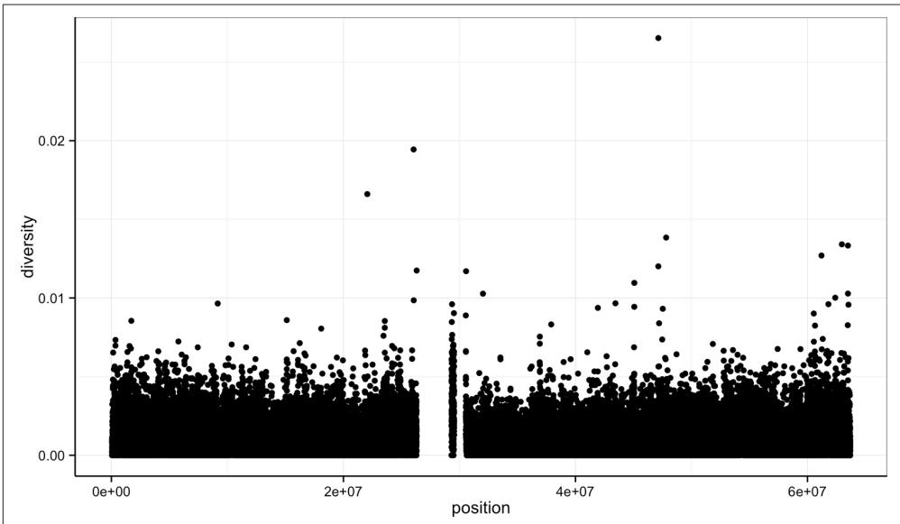


Figure 8-1. ggplot2 scatterplot nucleotide diversity by position for human chromosome 20


Second, with our data specified, we then add layers to our plot (remember: ggplot2 is layer-based). To add a layer, we use the same + operator that we use for addition in R. Each layer updates our plot by adding geometric objects such as the points in a scat‐ terplot, or the lines in a line plot. 

We add geom_point() as a layer because we want points to create a scatterplot. geom_point() is a type of geometric object (or geom in ggplot2 lingo). ggplot2 has many geoms (e.g., geom_line(), geom_bar(), geom_density(), geom_boxplot(), etc.), which we’ll see throughout this chapter. Geometric objects have many aesthetic attributes (e.g., x and y positions, color, shape, size, etc.). Different geometric objects will have different aesthetic attributes (ggplot2 documentation refers to these as aes‐ thetics). The beauty of ggplot2s grammar is that it allows you to map geometric objects’ aesthetics to columns in your dataframe. In our diversity by position scatter‐ plot, we mapped the x position aesthetic to the position column, and the y position to the diversity column. We specify the mapping of aesthetic attributes to columns in our dataframe using the function aes(). 


## Axis Labels, Plot Titles, and Scales

As my high school mathematics teacher Mr. Williams drilled into my head, no plot is complete without proper axis labels and a title. While ggplot2 chooses smart labels based on your column names, you might want to change this down the road. ggplot2 makes specifying labels easy: simply use the xlab(), ylab(), and ggti tle() functions to specify the x-axis label, y-axis label, and plot title. For example, we could change our x- and y-axis labels when plotting the diversity data with p + xlab("chromosome position (basepairs)") + ylab("nucleotide diversity"). To avoid clut‐ ter in examples in this book, I’ll just use the default labels. 

You can also set the limits for continuous axes using the function scale_x_continuous(limits=c(start, end)) where start and end are the start and end of the axes (and scale_y_continuous() for the y axis). Similarly, you can change an axis to a log10-scale using the functions scale_x_log10() and scale_y_log10(). ggplot2 has numerous other scale options for discrete scales, other axes transforms, and color scales; see http://docs.ggplot2.org for more detail. 

Aesthetic mappings can also be specified in the call to ggplot()—geoms will then use this mapping. Example 8-2 creates the exact same scatterplot as Figure 8-1. 

Example 8-2. Including aes() in ggplot() 

Notice the missing diversity estimates in the middle of this plot. What’s going on in this region? ggplot2’s strength is that it makes answering these types of questions with exploratory data analysis techniques effortless. We simply need to map a possi‐ ble confounder or explanatory variable to another aesthetic and see if this reveals any unexpected patterns. In this case, let’s map the color aesthetic of our point geometric objects to the column cent, which indicates whether the window falls in the centro‐ meric region of this chromosome (see Example 8-3). 

## Example 8-3. A simple diversity scatterplot with ggplot2

$$
> \text { ggplot } (d) + \text { geom\_point } (\text { aes } (x = \text { position }, y = \text { diversity }, \text { color } = \text { cent }))
$$

As you can see from Figure 8-2, the region with missing diversity estimates is around the centromere. This is intentional; centromeric and heterochromatic regions were excluded from this study. 

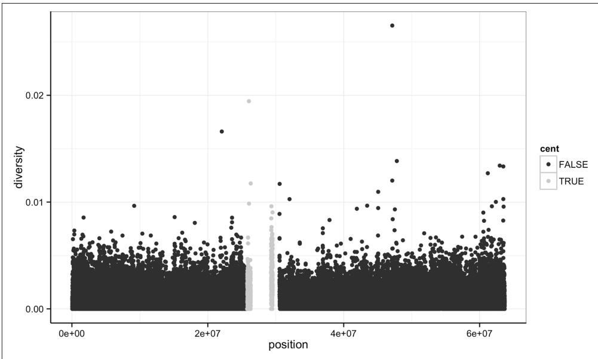


Figure 8-2. ggplot2 scatterplot nucleotide diversity by position coloring by whether win‐ dows are in the centromeric region


Throughout this chapter, I’ve used a slightly different ggplot theme than the default to optimize graphics for print and screen. All of the code to produce the plots exactly as they appear in this chapter is in this chapter’s directory on GitHub. 

A particularly nice feature of ggplot2 is that it has well-chosen default behaviors, which allow you to quickly create or adjust plots without having to consider technical details like color palettes or a legend (though these details are customizable). For example, in mapping the color aesthetic to the cent column, ggplot2 considered cent’s type (logical) when choosing a color palette. Discrete color palettes are auto‐ matically used with columns of logical or factor data mapped to the color aesthetic; continuous color palettes are used for numeric data. We’ll see further examples of mapping data to the color aesthetic later on in this chapter. 

As Tukey’s quote at the beginning of this chapter explains, exploratory analysis is an interactive, iterative process. Our first plot gives a quick first glance at what the data say, but we need to keep exploring to learn more. One problem with this plot is the degree of overplotting (data oversaturating a plot so as to obscure the information of other data points). We can’t get a sense of the distribution of diversity from this figure —everything is saturated from about 0.05 and below. 

One way to alleviate overplotting is to make points somewhat transparent (the trans‐ parency level is known as the alpha). Let’s make points almost entirely transparent so only regions with multiple overlapping points appear dark (this produces a plot like Figure 8-3): 

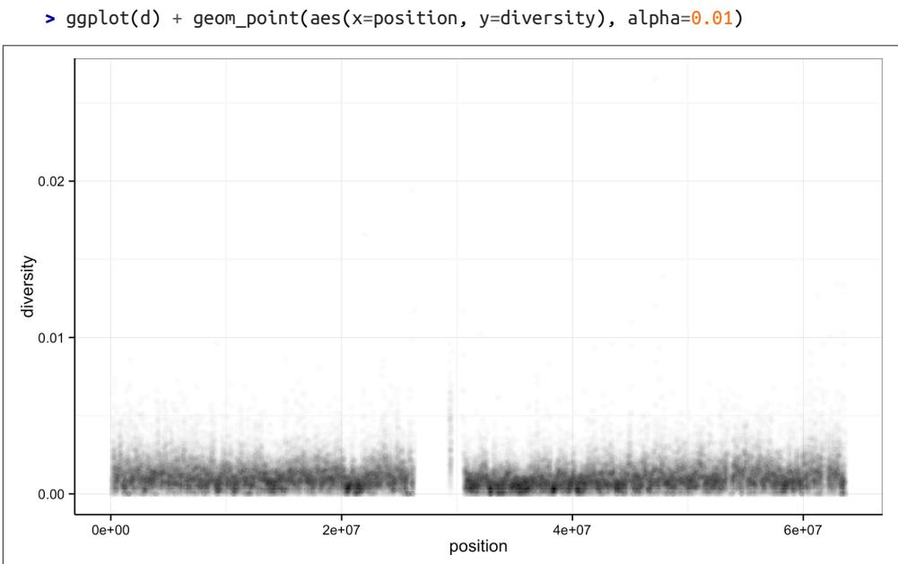


Figure 8-3. Using transparency to address overplotting


There’s a subtlety here that illustrates a very important ggplot2 concept: we set alpha=0.01 outside of the aesthetic mapping function aes(). This is because we’re not mapping the alpha aesthetic to a column of data in our dataframe, but rather giv‐ ing it a fixed value for all data points. 

Other than highlighting the lack of diversity estimates in centromeric windows, the position axes isn’t revealing any positional patterns in diversity. Part of the problem is still overplotting (which occurs often when visualizing genomic data). But the more severe issue is that these windows span 63 megabases, and it’s difficult to detect regional patterns with data at this scale. 

Let’s now look at the density of diversity across all positions. We’ll use a different geo‐ metric object, geom_density(), which is slightly different than geom_point() in that it takes the data and calculates a density from it for us (see Figure 8-4): 

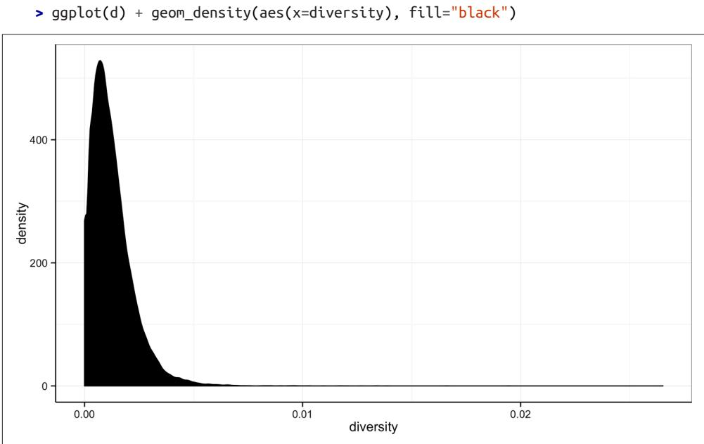


Figure 8-4. Density plot of diversity


By default, ggplot2 uses lines to draw densities. Setting fill="black" fills the density so it’s clearer to see (try running this same command without this fill argument). 

We can also map the color aesthetic of geom_density() to a discrete-valued column in our dataframe, just as we did with geom_point() in Example 8-3. geom_density() will create separate density plots, grouping data by the column mapped to the color aesthetic and using colors to indicate the different densities. To see both overlapping densities, we use alpha to set the transparency to half (see Figure 8-5): 

$$
> \text { ggplot } (d) + \text { geom\_density } (\text { aes } (x = \text { diversity }, \text { fill } = \text { cent }), \text { alpha } = 0. 4)
$$

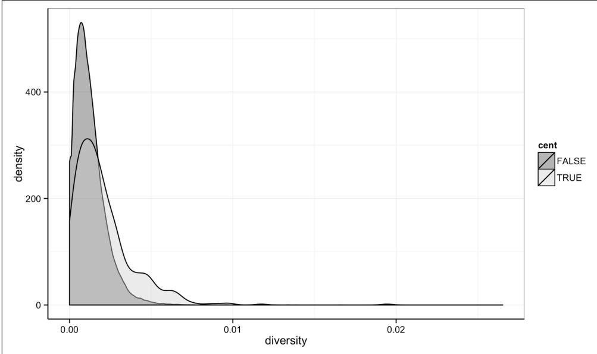


Figure 8-5. Densities of diversity, colored by whether a window is in the centromere or not


Immediately we’re able to see a trend that wasn’t clear by using a scatterplot: diversity is skewed to more extreme values in centromeric regions. Try plotting this same fig‐ ure without mapping the color aesthetic to cent—you’ll see there’s no indication of bimodality. Again (because this point is worth repeating), mapping columns to addi‐ tional aesthetic attributes can reveal patterns and information in the data that may not be apparent in simple plots. We’ll see this again and again throughout this chap‐ ter. 

## Exploring Data Visually with ggplot2 II: Smoothing

Let’s look at the Dataset_S1.txt data using another useful ggplot2 feature: smoothing. We’ll use ggplot2 in particular to investigate potential confounders in genomic data. There are numerous potential confounders in genomic data (e.g., sequencing read depth; GC content; mapability, or whether a region is capable of having reads cor‐ rectly align to it; batch effects; etc.). Often with large and high-dimension datasets, visualization is the easiest and best way to spot these potential issues. 

In the previous section, we saw how overplotting can obscure potential relationships between two variables in a scatterplot. The number of observations in whole genome datasets almost ensures that overplotting will be a problem during visualization. Ear‐ lier, we used transparency to give us a sense of the most dense regions. Another strat‐ egy is to use ggplot2’s geom_smooth() to add a smoothing line to plots and look for an unexpected trend. This geom requires x and y aesthetics, so it can fit the smoothed curve to the data. Because we often superimpose a smooth curve on a scatterplot cre‐ ated from the same x and y mappings, we can specify the aesthetic in ggplot() as we did in Example 8-2. Let’s use a scatterplot and smoothing curve to look at the rela‐ tionship between the sequencing depth (the depth column) and the total number of SNPs in a window (the total.SNPs column; see Figure 8-6): 

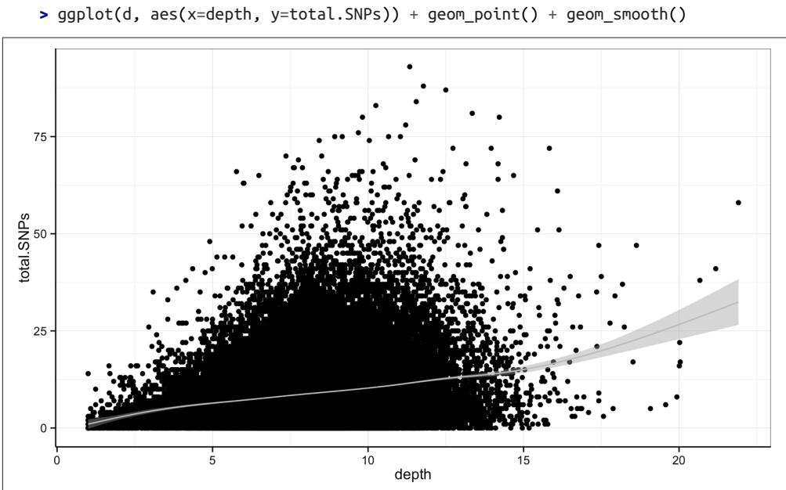


Figure 8-6. A scatterplot (demonstrating overplotting) and GAM smoothing curve illus‐ trating how total number of SNPs in a window depends on sequencing depth


By default, ggplot2 uses generalized additive models (GAM) to fit this smoothed curve for datasets with more than 1,000 rows (which ours has). You can manually specify the smoothing method through the method argument of geom_smooth() (see help(stat_smooth) for the method options). Also, ggplot2 adds confidence inter‐ vals around the smoothing curve; this can be disabled by using geom_smooth(se=FALSE). 

Visualizing the data this way reveals a well-known relationship between depth and SNPs: higher sequencing depth increases the power to detect and call SNPs, so in general more SNPs will be found in higher-depth regions. However, this isn’t the entire story—the relationship among these variables is made more complex by GC content. Both higher and lower GC content regions have been shown to decrease read coverage, likely through less efficient PCR in these regions (Aird et al., 2011). We can get a sense of the effect GC content has on depth in our own data through a similar scatterplot and smoothing curve plot: 

## > ggplot(d, aes(x=percent.GC, y=depth)) + geom_point() + geom_smooth()

The trajectory of the smoothing curve (in Figure 8-7) indicates that GC content does indeed have an effect on sequencing depth in this data. There’s less support in the data that low GC content leads to lower depth, as there are few windows that have a GC content below 25%. However, there’s clearly a sharp downward trend in depth for GC contents above 60%. 

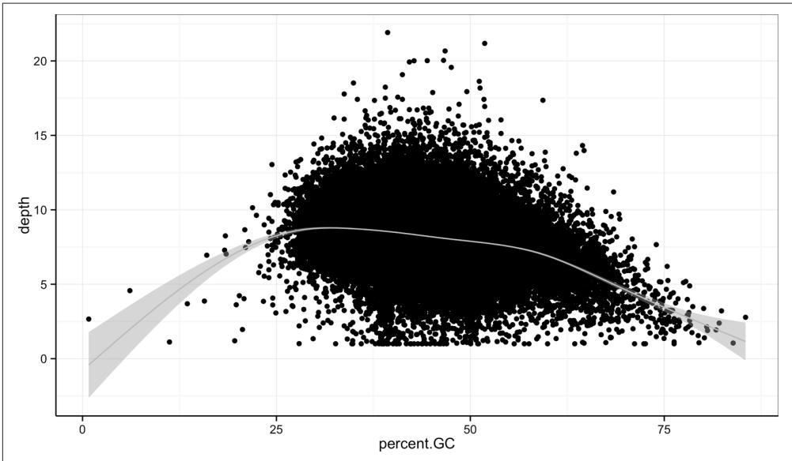


Figure 8-7. A scatterplot and GAM smoothing curve show a relationship between extreme GC content windows and sequencing depth


## Binning Data with cut() and Bar Plots with ggplot2

Another way we can extract information from complex datasets is by reducing the resolution of the data through binning (or discretization). Binning takes continuous numeric values and places them into a discrete number of ranged bins. At first, it might sound counterintuitive to reduce the resolution of the data through binning to learn more about the data. The benefit is that discrete bins facilitate conditioning on a variable. Conditioning is an incredibly powerful way to reveal patterns in data. This idea stems from William S. Cleveland’s concept of a coplot (a portmanteau of condi‐ tioning plot); I encourage you to read Cleveland’s Visualizing Data for more informa‐ tion if this topic is of interest. We’ll create plots like Cleveland’s coplots when we come to gplot2’s facets in “Using ggplot2 Facets” on page 224. 

In R, we bin data through the cut() function (see Example 8-4): 

Example 8-4. Using cut() to bin GC content 

```txt
> d$GC.binned <- cut(d$percent.GC, 5)
> d$GC.binned
[1] (51.6,68.5] (34.7,51.6] (34.7,51.6] (34.7,51.6] (34.7,51.6]
[...]
Levels: (0.716,17.7] (17.7,34.7] (34.7,51.6] (51.6,68.5] (68.5,85.6] 
```

When cut()’s second argument breaks is a single number, cut() divides the data into that number of equally sized bins. The returned object is a factor, which we introduced in “Factors and classes in R” on page 191. The levels of the factor returned from cut() will always have labels like (34.7,51.6], which indicate the particular bin that value falls in. We can count how many items fall into a bin using table(): 

> table(d$GC.binned) 

(0.716,17.7] (17.7,34.7] (34.7,51.6] (51.6,68.5] (68.5,85.6] 6 4976 45784 8122 252 

We can also use prespecified ranges when binning data with cut() by setting breaks to a vector. For example, we could cut the percent GC values with breaks at 0, 25, 50, 75, and 100: 

> cut(d$percent.GC, c(0, 25, 50, 75, 100)) [1] (50,75] (25,50] (25,50] (25,50] (25,50] (25,50] [...] Levels: (0,25] (25,50] (50,75] (75,100] 

An important gotcha to remember about cut() is that if you manually specify breaks that don’t fully enclose all values, values outside the range of breaks will be given the value NA. You can check if your manually specified breaks have created NA values using any(is.na(cut(x, breaks))) (for your particular vector x and breaks). 

Bar plots are the natural visualization tool to use when looking at count data like the number of occurrences in bins created with cut(). ggplot2’s geom_bar() can help us visualize the number of windows that fall into each GC bin we’ve created previously: 

```txt
> ggplot(d) + geom_bar(aes(x=GC.binned)) 
```

When geom_bar()’s x aesthetic is a factor (e.g., d$binned.GC), ggplot2 will create a bar plot of counts (see Figure 8-8, left). When geom_bar()’s x aesthetic is mapped to a continuous column (e.g., percent.GC) geom_bar() will automatically bin the data itself, creating a histogram (see Figure 8-8, right): 

> ggplot(d) + geom_bar(aes(x=percent.GC)) 

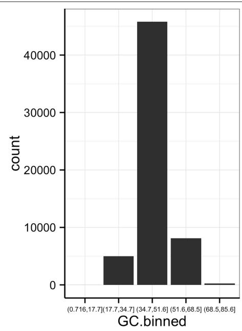


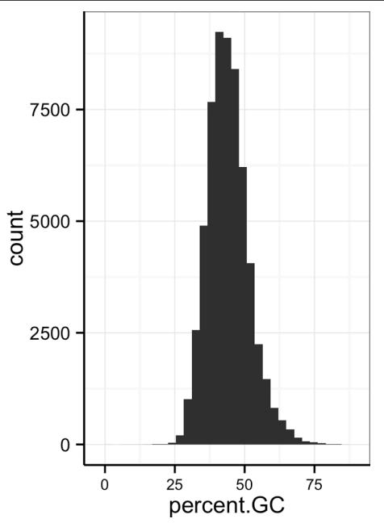


Figure 8-8. ggplot2’s geom_bar() used to visualize the GC.binned column we created with cut(), and the numeric percent.GC column using its own binning scheme


The bins created from cut() are useful in grouping data (a concept we often use in data analysis). For example, we can use the GC.binned column to group data by the 10 GC content bins to see how GC content has an impact on other variables. To do this, we map aesthetics like color, fill, or linetype to our GC.binned column. Again, looking at sequencing depth and GC content: 

$$
> g g p l o t (d) + \text { geom\_density } (a e s (x = \text { depth }, \text { linetype } = G C. b i n n e d), \text { alpha } = 0. 5)
$$

The same story of depth and GC content comes out in Figure 8-9: both the lowest GC content windows and the highest GC content windows have lower depth. Try to cre‐ ate this sample plot, except don’t group by GC.binned—the entire story disappears. Also, try plotting the densities of other variables like Pi and Total.SNPs, grouping by GC.binned again. 

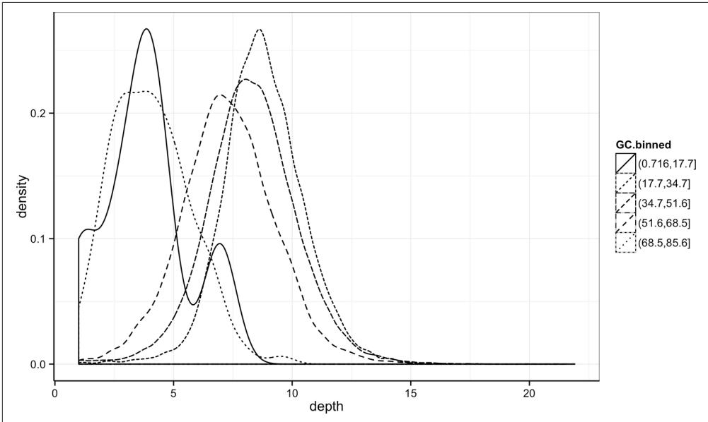


Figure 8-9. Density plots of depth, grouped by GC content bin


## Finding the Right Bin Width

Notice in Figure 8-8 how different bin widths can drastically change the way we view and understand the data. Try creating a histogram of Pi with varying binwidths using: ggplot(d) + geom_bar(aes(x=Pi), binwidth=1) + scale_x_continu ous(limits=c(0.01, 80)). 

Using scale_x_continuous() just ignores all windows with 0 Pi and zooms into the figure. Try binwidths of 0.05, 0.5, 1, 5, and 10. Smaller bin widths can fit the data better (revealing more subtle details about the distribution), but there’s a trade-off. As bin widths become narrower, each bin will contain fewer data points and con‐ sequently be more noisy (and undersmoothed). Using wider bins smooth over this noise. However, bins that are too wide result in oversmoothing, which can hide details about the data. This trade-off is a case of the more general bias-variance trade-of in statistics; see the Wikipedia pages on the bias–variance trade-off and histograms for more information on these topics. In your own data, be sure to explore a variety of bin widths. 

We can learn an incredible amount about our data by grouping by possible con‐ founding factors and creating simple summaries like densities by group. Because it’s a powerful exploratory data analysis skill, we’ll look at other ways to group and sum‐ marize data in “Working with the Split-Apply-Combine Pattern” on page 239. 

## Merging and Combining Data: Matching Vectors and Merging Dataframes

We’re now going to switch topics to merging and combining data so we can create example data for the next sections. Bioinformatics analyses involve connecting many numerous datasets: sequencing data, genomic features (e.g., gene annotation), func‐ tional genomics data, population genetic data, and so on. As data piles up in reposito‐ ries, the ability to connect different datasets together to tell a cohesive story will become an increasingly more important analysis skill. In this section, we’ll look at some canonical ways to combine datasets together in R. For more advanced joins (or data approaching the limits of what R can store in memory), using a database (which we learn about in Chapter 13) may be a better fit. 

The simplest operation to match two vectors is checking whether some of a vector’s values are in another vector using R’s %in% operator. x %in% y returns a logical vector indicating which of the values of x are in y. As a simple example: 

```txt
> c(3, 4, -1) %in% c(1, 3, 4, 8)
[1] TRUE TRUE FALSE 
```

We often use %in% to select rows from a dataframe by specifying the levels a factor column can take. We’ll use the dataset chrX_rmsk.txt, the repeats on human chromo‐ some X found by Repeat Masker, to illustrate this. Unlike Dataset_S1.txt, this data is on human reference genome version hg17 (because these same Repeat Masker files are used in a later example that replicates findings that also use hg17). Let’s load in and look at this file: 

```csv
> reps <- read.delim("chrX_rmsk.txt.gz", header=TRUE)
> head(reps, 3)
bin swScore milliDiv milliDel milliIns genoName genoStart genoEnd genoLeft
1 585 342 0 0 0 chrX 0 38 -154824226
2 585 392 109 0 0 chrX 41 105 -154824159
3 585 302 240 31 20 chrX 105 203 -154824061
strand repName repClass repFamily repStart repEnd repLeft id
1 + (CCCTAA)n Simple_repeat Simple_repeat 3 40 0 1
2 + LTR12C LTR ERV1 1090 1153 -425 2
3 + LTR30 LTR ERV1 544 642 -80 3 
```

repClass is an example of a factor column—try class(d$repClass) and levels(d $repClass) to verify for yourself. Suppose we wanted to select out rows for a few common repeat classes: DNA, LTR, LINE, SINE, and Simple_repeat. Even with just five repeat classes, it would be error prone and tedious to construct a statement to select these values using logical operators: reps$repClass == "SINE" | reps$repClass == "LINE" | reps$repClass == "LTR" | and so on. Instead, we can create a vector common_repclass and use %in%: 

```txt
> common_repclass <- c("SINE", "LINE", "LTR", "DNA", "Simple_repeat")
> reps[reps$repClass %in% common_repclass, ] 
```

```csv
bin swScore milliDiv milliDel milliIns genoName genoStart genoEnd genoLeft
1 585 342 0 0 0 chrX 0 38 -154824226
2 585 392 109 0 0 chrX 41 105 -154824159
3 585 302 240 31 20 chrX 105 203 -154824061
[...]
strand repName repClass repFamily repStart repEnd repLeft id
1 + (CCCTAA)n Simple_repeat Simple_repeat 3 40 0 1
2 + LTR12C LTR ERV1 1090 1153 -425 2
3 + LTR30 LTR ERV1 544 642 -80 3
[...] 
```

It’s worth noting that we can also create vectors like common_repclass programmati‐ cally. For example, we could always just directly calculate the five most common repeat classes using: 


> sort(table(reps$repClass), decreasing=TRUE)[1:5]


```txt
SINE LINE LTR DNA Simple_repeat
45709 30965 14854 11347 9163
> top5_repclass <- names(sort(table(reps$repClass), decreasing=TRUE)[1:5])
> top5_repclass
[1] "LINE" "SINE" "LTR" "Simple_repeat"
[5] "DNA" 
```

The %in% operator is a simplified version of another function, match(). x %in% y returns TRUE/FALSE for each value in x depending on whether it’s in y. In contrast, match(x, y) returns the first occurrence of each of x’s values in y. If match() can’t find one of x’s elements in y, it returns its nomatch argument (which by default has the value NA). 

It’s important to remember the directionality of match(x, y): the first argument x is what you’re searching for (the proverbial needle) in the second argument y (the hay‐ stack). The positions returned are always the first occurrences in y (if an occurrence was found). Here’s a simple example: 

```txt
> match(c("A", "C", "E", "A"), c("A", "B", "A", "E"))
[1] 1 NA 4 1 
```

Study this example carefully—to use match() safely, it’s important to understand its subtle behavior. First, although there are two “A” values in the second argument, the position of the first one is returned. Second, “C” does not occur in the second argu‐ ment, so match() returns NA. Lastly, the vector returned will always have the same length as the first argument and contains positions in the second argument. 

Because match() returns where it finds a particular value, match()’s output can be used to join two dataframes together by a shared column. We’ll see this in action by stepping through a merge of two datasets. I’ve intentionally chosen data that is a bit tricky to merge; the obstacles in this example are ones you’re likely to encounter with real data. I’ll review various guidelines you should follow when applying the lessons of this section. Our reward for merging these datasets is that we’ll use the result to replicate an important finding in human recombination biology. 

For this example, we’ll merge two datasets to explore recombination rates around a degenerate sequence motif that occurs in repeats. This motif has been shown to be enriched in recombination hotspots (see Myers et al., 2005; Myers et al., 2008) and is common in some repeat classes. The first dataset (motif_recombrates.txt in the Git‐ Hub directory) contains estimates of the recombination rate for all windows within 40kb of each motif (for two motif variants). The second dataset (motif_repeats.txt) contains which repeat each motif occurs in. Our goal is to merge these two datasets so that we can look at the local effect of recombination of each motif on specific repeat backgrounds. 


## Creating These Example Datasets

Both of these datasets were created using the GenomicRanges tools we will learn about in Chapter 9, from tracks downloaded directly from the UCSC Genome Browser. With the appropriate tools and bioinformatics data skills, it takes surprisingly few steps to replicate part of this important scientific finding (though the original paper did much more than this—see Myers et al., 2008). For the code to reproduce the data used in this example, see the motif-example/ directory in this chapter’s directory on GitHub. 

Let’s start by loading in both files and peeking at them with head(): 

```csv
> mtfs <- read.delim("motif_recombrates.txt", header=TRUE)
> head(mtfs, 3)
    chr motif_start motif_end dist recomb_start recomb_end recom
1 chrX 35471312 35471325 39323.0 35430651 35433340 0.0015
2 chrX 35471312 35471325 36977.0 35433339 35435344 0.0015
3 chrX 35471312 35471325 34797.5 35435343 35437699 0.0015
    motif
1 CCTCCCTGACCAC
2 CCTCCCTGACCAC
3 CCTCCCTGACCAC 
```

```txt
> rpts <- read.delim("motif_repeats.txt", header=TRUE)
> head(rpts, 3)
chr start end name motif_start
1 chrX 63005829 63006173 L2 63005830
2 chrX 67746983 67747478 L2 67747232
3 chrX 118646988 118647529 L2 118647199 
```

The first guideline of combining data is always to carefully consider the structure of both datasets. In mtfs, each motif is represented across multiple rows. Each row gives the distance between a focal motif and a window over which recombination rate was estimated (in centiMorgans). For example, in the first three rows of mtfs, we see recombination rate estimates across three windows, at 39,323, 36,977, and 34,797 bases away from the motif at position chrX:35471312-35471325. The dataframe rpts contains the positions of THE1 or L2 repeats that completely overlap motifs, and the start positions of the motifs they overlap. 

```txt
> table(mtfs$pos %in% rpts$pos)
FALSE TRUE
10832 9218 
```

Our goal is to merge the column name in the rpts dataframe into the mtfs column, so we know which repeat each motif is contained in (if any). The link between these two datasets are the positions of each motif, identified by the chromosome and motif start position columns chr and motif_start. When two or more columns are used as a link between datasets, concatenating these columns into a single key string column can simplify merging. We can merge these two columns into a string using the func‐ tion paste(), which takes vectors and combines them with a separating string speci‐ fied by sep: 

```csv
> mtfs$pos <- paste(mtfs$chr, mtfs$motif_start, sep="-")
> rpts$pos <- paste(rpts$chr, rpts$motif_start, sep="-")

> head(mtfs, 2) # results
    chr motif_start motif_end dist recomb_start recomb_end recom motif
1 chrX 35471312 35471325 39323 35430651 35433340 0.0015 CCTCCCTGACCAC
2 chrX 35471312 35471325 36977 35433339 35435344 0.0015 CCTCCCTGACCAC pos
1 chrX-35471312
2 chrX-35471312
> head(rpts, 2)
    chr start end name motif_start pos
1 chrX 63005829 63006173 L2 63005830 chrX-63005830
2 chrX 67746983 67747478 L2 67747232 chrX-67747232 
```

Now, this pos column functions as a common key between the two datasets. 

The second guideline in merging data is to validate that your keys overlap in the way you think they do before merging. One way to do this is to use table() and %in% to see how many motifs in mtfs have a corresponding entry in rpts: 

This means there are 9,218 motifs in mtfs with a corresponding entry in rpts and 10,832 without. Biologically speaking, this means 10,832 motifs in our dataset don’t overlap either the THE1 or L2 repeats. By the way I’ve set up this data, all repeats in rpts have a corresponding motif in mtfs, but you can see for yourself using table(rpts$pos %in% mtfs$pos). Remember: directionality matters—you don’t go looking for a haystack in a needle! 

Now, we use match() to find where each of the mtfs$pos keys occur in the rpts$pos. We’ll create this indexing vector first before doing the merge: 

```txt
> i <- match(mtfs$pos, rpts$pos) 
```

All motif positions without a corresponding entry in rpts are NA; our number of NAs is exactly the number of mts$pos elements not in rpts$pos: 

```txt
> table(is.na(i)) 
```

```txt
FALSE TRUE
9218 10832 
```

Finally, using this indexing vector we can select out the appropriate elements of rpts $name and merge these into mtfs: 

```txt
> mtfs$repeat_name <- rpts$name[i] 
```

Often in practice you might skip assigning match()’s results to i and use this directly: 

```txt
>mtfs$repeat_name <- rpts$name[match(mtfs pesos, rpts pesos)] 
```

The third and final guideline of merging data: validate, validate, validate. As this example shows, merging data is tricky; it’s easy to make mistakes. In our case, good external validation is easy: we can look at some rows where mtfs$repeat_name isn’t NA and check with the UCSC Genome Browser that these positions do indeed overlap these repeats (you’ll need to visit UCSC Genome Browser and do this yourself): 

```csv
> head(mtfs[!is.na(mtfs$repeat_name), ], 3)
chr motif_start motif_end dist recomb_start recomb_end recom
102 chrX 63005830 63005843 37772.0 62965644 62970485 1.4664
103 chrX 63005830 63005843 34673.0 62970484 62971843 0.0448
104 chrX 63005830 63005843 30084.5 62971842 62979662 0.0448
motif pos repeat_name
102 CCTCCCTGACCAC chrX-63005830 L2
103 CCTCCCTGACCAC chrX-63005830 L2
104 CCTCCCTGACCAC chrX-63005830 L2 
```

Our result is that we’ve combined the rpts$name vector directly into our mtfs data‐ frame (technically, this type of join is called a lef outer join). Not all motifs have entries in rpts, so some values in mfs$repeat_name are NA. We could easily remove these NAs with: 

```txt
> mtfs_inner <- mtfs[!is.na(mtfs $repeat_name), ]
> nrow(mtfs_inner)
[1] 9218 
```

In this case, only motifs in mtfs contained in a repeat in rpts are kept (technically, this type of join is called an inner join). Inner joins are the most common way to merge data. We’ll talk more about the different types of joins in Chapter 13. 

We’ve learned match() first because it’s a general, extensible way to merge data in R. match() reveals some of the gritty details involved in merging data necessary to avoid pitfalls. However, R does have a more user-friendly merging function: merge(). Merge can directly merge two datasets: 

```txt
> recm <- merge(mtfs, rpts, by.x="pos", by.y="pos")
> head(recm, 2)
    pos chr.x motif_start.x motif_end dist recomb_start recomb_end
1 chr1-101890123 chr1 101890123 101890136 34154.0 101855215 101856736
2 chr1-101890123 chr1 101890123 101890136 35717.5 101853608 101855216
    recom motif repeat_name chr.y start end name
1 0.0700 CCTCCCTAGCCAC THE1B chr1 101890032 101890381 THE1B
2 0.0722 CCTCCCTAGCCAC THE1B chr1 101890032 101890381 THE1B
    motif_start.y
1 101890123
2 101890123
> nrow(recm)
[1] 9218 
```

merge() takes two dataframes, x and y, and joins them by the columns supplied by by.x and by.y. If they aren’t supplied, merge() will try to infer what these columns are, but it’s much safer to supply them explicitly. By default, merge() behaves like our match() example after we removed the NA values in repeat_name (technically, merge() uses a variant of an inner join known as a natural join). But merge() can also perform joins similar to our first match() example (left outer joins), through the argument all.x=TRUE: 

```r
> recm <- merge(mtfs, rpts, by.x="pos", by.y="pos", all.x=TRUE) 
```

Similarly, merge() can also perform joins that keep all rows of the second argument (a join known as a right outer join) through the argument all.y=TRUE. If you want to keep all rows in both datasets, you can specify all=TRUE. See help(merge) for more details on how merge() works. To continue our recombination motif example, we’ll use mtfs because unlike the recm dataframe created by merge(), mtfs doesn’t have any duplicated columns. 

## Using ggplot2 Facets

After merging our two datasets in the last example, we’re ready to explore this data using visualization. One useful visualization technique we’ll introduce in this section is facets. Facets allow us to visualize grouped data by creating a series of separate adja‐ cent plots for each group. Let’s first glimpse at the relationship between recombina‐ tion rate and distance to a motif using the mtfs dataframe created in the previous section. We’ll construct this graphic in steps: 

```txt
> p <- ggplot(mtfs, aes(x=dist, y=recom)) + geom_point(size=1) 
```

```txt
> p <- p + geom_smooth(method="loess", se=FALSE, span=1/10)
> print(p) 
```

This creates Figure 8-10. Note that I’ve turned off geom_smooth()’s standard error estimates, adjusted the smoothing with span, and set the smoothing method to "loess". Try playing with these settings yourself to become familiar with how each changes the visualization and what we learn from the data. From this data, we only see a slight bump in the smoothing curve where the motifs reside. However, this data is a convolution of two different motif sequences on many different genomic back‐ grounds. In other words, there’s a large amount of heterogeneity we’re not accounting for, and this could be washing out our signal. Let’s use faceting to pick apart this data. 

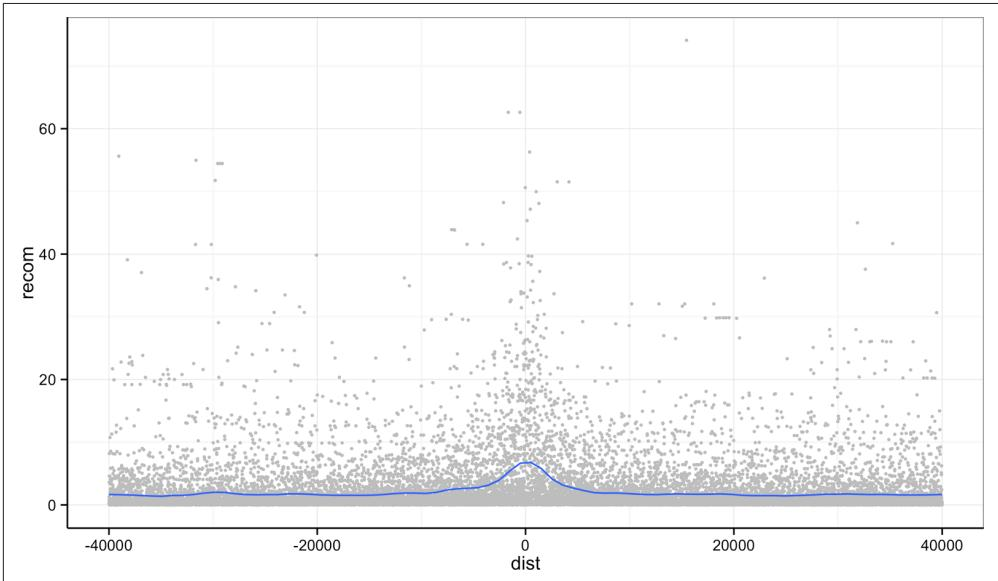


Figure 8-10. Recombination rate by distance to sequence motif


First, if you’ve explored the mtfs dataframe, you’ll notice that the mtfs$motif column contains two variations of the sequence motif: 

> unique(mtfs$motif) 

[1] CCTCCCTGACCAC CCTCCCTAGCCAC 

Levels: CCTCCCTAGCCAC CCTCCCTGACCAC 

We might wonder if these motifs have any noticeably different effects on local recom‐ bination. One way to compare these is by grouping and coloring the loess curves by motif sequence. I’ve omitted this plot to save space, but try this on your own: 

```prolog
> ggplot(mtfs, aes(x=dist, y=recom)) + geom_point(size=1) + geom_smooth(aes(color=motif), method="loess", se=FALSE, span=1/10) 
```

Alternatively, we can split these motifs apart visually with facets using ggplot2’s facet_wrap() (shown in Figure 8-11): 

```r
> p <- ggplot(mtfs, aes(x=dist, y=recom)) + geom_point(size=1, color="grey")
> p <- p + geom_smooth(method='loess', se=FALSE, span=1/10)
> p <- p + facet_wrap(~ motif)
> print(p) 
```

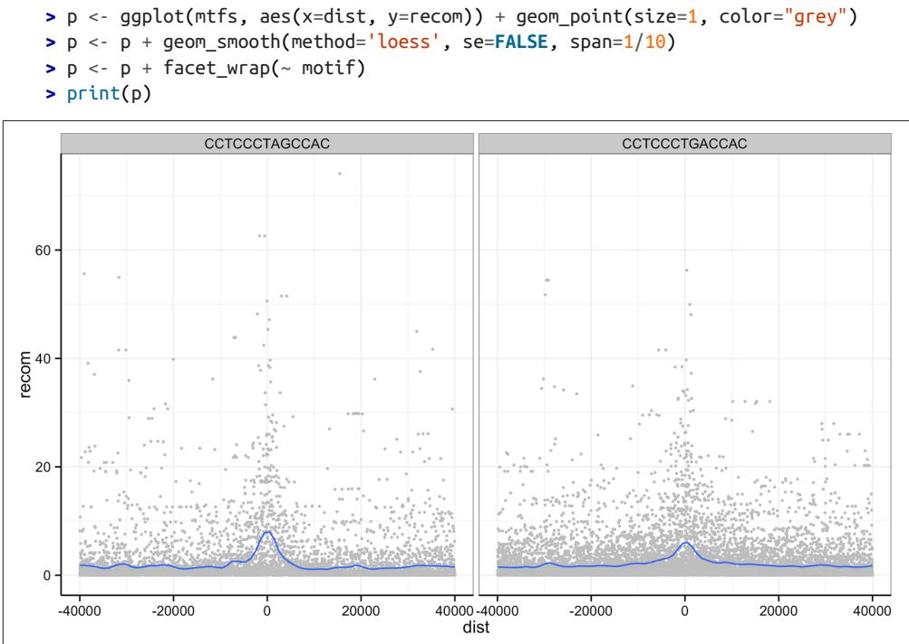


Figure 8-11. Faceting plots by motif sequence using facet_wrap()


ggplot2 has two facet methods: facet_wrap() and facet_grid(). facet_wrap() (used earlier) takes a factor column and creates a panel for each level and wraps around horizontally. facet_grid() allows finer control of facets by allowing you to specify the columns to use for vertical and horizontal facets. For example: 

```r
> p <- ggplot(mtfs, aes(x=dist, y=recom)) + geom_point(size=1, color="grey")
> p <- p + geom_smooth(method='loess', se=FALSE, span=1/16)
> p <- p + facet_grid(repeat_name ~ motif)
> print(p) 
```

Figure 8-12 shows some of the same patterns seen in Figure 1 of Myers et al., 2008. Motif CCTCCCTAGCCAC on a THE1B repeat background has a strong effect, as does CCTCCCTGACCAC on a L2 repeat background. You can get a sense of the data that goes into this plot with table(mtfs$repeat_name, mtfs$motif, useNA="ifany"). 

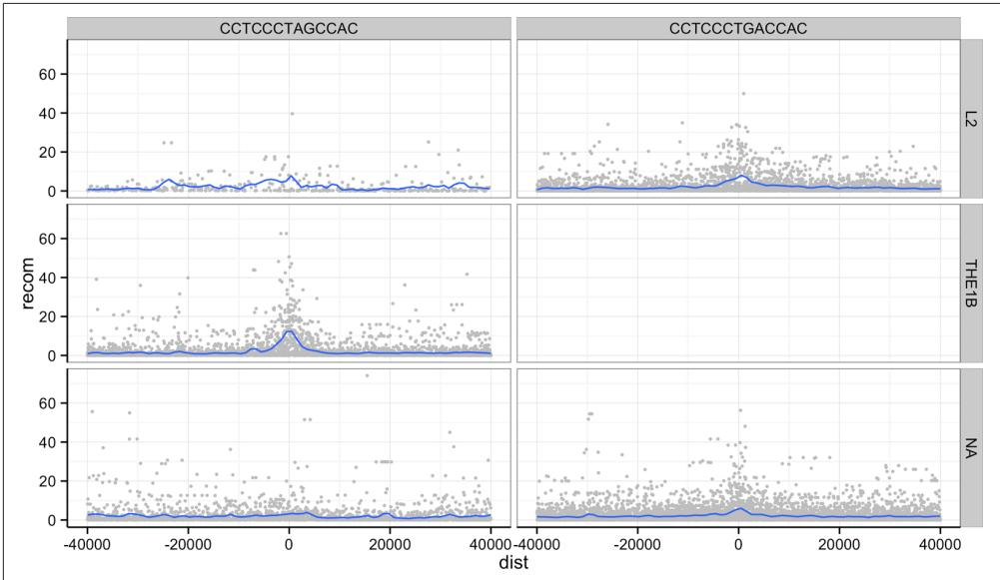


Figure 8-12. Using facet_grid() to facet by both repeat background and motif sequence; the empty panel indicates there is no data for this particular motif/repeat combination


The tilde (~) used with facet_wrap() and facet_grid() is how we specify model formula in R. If you’ve used R to fit linear models, you’ve encountered ~ before. We can ignore the specifics when using it in facet_wrap() (but see help(formula) if you’re curious). 

One important feature of facet_wrap() and facet_grid() is that by default, x- and y-scales will be the same across all panels. This is a good default because people have a natural tendency to compare adjacent graphics as if they’re on the same scale. How‐ ever, forcing facets to have fixed scales can obscure patterns that occur on different scales. Both facet_grid() and facet_wrap() have scales arguments that by default are "fixed". You can set scales to be free with scales="free_x" and scales="free_y" (to free the x- and y-scales, respectively), or scales="free" to free both axes. For example (see Figure 8-13): 

```r
> p <- ggplot(mtfs, aes(x=dist, y=recom)) + geom_point(size=1, color="grey")
> p <- p + geom_smooth(method='loess', se=FALSE, span=1/10)
> p <- p + facet_wrap(~ motif, scales="free_y")
> print(p) 
```

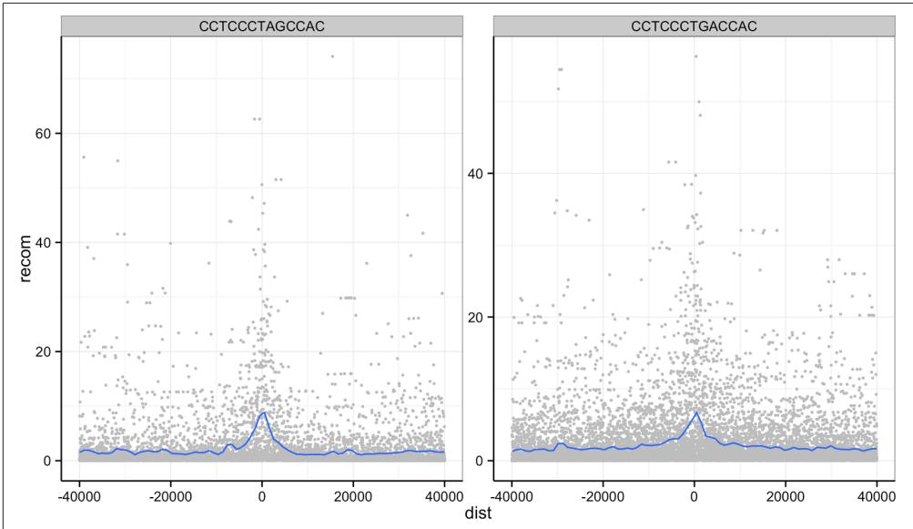


Figure 8-13. Recombination rates around two sequence motifs, with the y-scales free


Try using facets to look at this data when grouped by chromosome with facet_wrap( ~ chr). 

## More R Data Structures: Lists

Thus far, we’ve used two R data structures for everything: vectors and dataframes. In this section, we’ll learn about another R data structure as important as these two: the list. Recall the following points about R’s vectors: 

• R vectors require all elements to have the same data type (that is, vectors are homogenous) 

• They only support the six data types discussed earlier (integer, double, character, logical, complex, and raw) 

In contrast, R’s lists are more versatile: 

• Lists can contain elements of different types (they are heterogeneous) 

• Elements can be any object in R (vectors with different types, other lists, environ‐ ments, dataframes, matrices, functions, etc.) 

• Because lists can store other lists, they allow for storing data in a recursive way (in contrast, vectors cannot contain other vectors) 

The versatility of lists make them indispensable in programming and data analysis with R. You’ve actually been using lists already without knowing it—dataframes are built using R’s lists. This makes sense, because the columns of a dataframe are vectors and each column can have a different type. The R data structure used to store hetero‐ geneous elements is the list. See for yourself that dataframes are truly lists; try is.list(mtfs). 

We create lists with the list() function. Like creating dataframes with the data.frame() function or combining vectors with c(), list() will interpret named arguments as the names of the elements. For example, suppose we wanted to store a specific genomic position using a list: 

```txt
> adh <- list(chr="2L", start=14615555L, end=14618902L, name="Adh")
> adh
$chr
[1] "2L"
$start
[1] 14615555
$end
[1] 14618902
$name
[1] "Adh" 
```

Had we tried to store these three values in a vector, vector coercion would coerce them into a character vector. Lists allow heterogeneous typed elements, so the charac‐ ter vectors “chr2L” and “Adh”, and integer vectors 14,615,555 and 14,618,902 can exist in the same list without being coerced. 

As with R’s vectors, we can extract subsets of a list or change values of specific ele‐ ments using indexing. However, accessing elements from an R list is slightly different than with vectors. Because R’s lists can contain objects with different types, a subset containing multiple list elements could contain objects with different types. Conse‐ quently, the only way to return a subset of more than one list element is with another list. As a result, there are two indexing operators for lists: one for accessing a subset of multiple elements as a list (the single bracket; e.g., adh[1:2]) and one for accessing an element within a list (the double bracket; e.g., adh[[3]]). 

For example, if we were to access the first two elements of the list x we created before, we would use single bracket indexing: 

```txt
> adh[1:2]
$chr
[1] "2L"
$start
[1] 14615555 
```

## Peeking into R’s Structures with str()

Because R’s lists can be nested and can contain any type of data, list-based data struc‐ tures can grow to be quite complex. In some cases, it can be difficult to understand the overall structure of some lists. The function str() is a convenient R function for inspecting complex data structures. str() prints a line for each contained data struc‐ ture, complete with its type, length (or dimensions), and the first few elements it con‐ tains. We can see an example by creating an artificially complex nested list (for the sake of this example) and looking at its structure: 

```txt
> z <- list(a=list(rn1=rnorm(20), rn2=rnorm(20)), b=rnorm(10))
> str(z)
List of 2
    $ a:List of 2
    ..$ rn1:num [1:20] -2.8126 1.0328 -0.6777 0.0821 0.7532 ...
    ..$ rn2:num [1:20] 1.09 1.27 1.31 2.03 -1.05 ...
    $ b:num [1:10] 0.571 0.929 1.494 1.123 1.713 ... 
```

For deeply nested lists, you can simplify str()’s output by specifying the maximum depth of nested structured to return with str()’s second argument, max.level. By default, max.level is NA, which returns all nested structures. 

Note that this subset of the original list is returned as a list. We can verify this using the function is.list(). Additionally, note that single brackets return a list even if a single element is selected (for consistency): 

```txt
> is.list(adh[1:2])
[1] TRUE
> is.list(adh[1])
[1] TRUE 
```

Because the single bracket operator always returns subjects of a list as a list, R has the double bracket operator to extract an object from a list position (either by position or name): 

```txt
> adh[[2]]
[1] 14615555
> adh[['start']]
[1] 14615555 
```

Unlike the single bracket operator, the double bracket operator will return the value from inside a list position (e.g., not as a list). Because accessing list elements by name is quite common, R has a syntactic shortcut: 

```txt
> adh$chr
[1] "2L" 
```

You should be familiar with this syntax already—we used the same syntax to extract columns from a dataframe. This isn’t a coincidence: dataframes are built from lists, and each dataframe column is a vector stored as a list element. 

We can create new elements or change existing elements in a list using the familiar <-. Assigning a list element the value NULL removes it from the list. Some examples are shown here: 

```txt
> adh$id <- "FBgn0000055"
> adh$chr <- "chr2L"
> adh
$chr
[1] "chr2L"
$start
[1] 14615555
$end
[1] 14618902
$name
[1] "Adh"
$id
[1] "FBgn0000055"

> adh$id <- NULL # remove the FlyBase ID
> adh
$chr
[1] "chr2L"
$start
[1] 14615555
$end
[1] 14618902
$name
[1] "Adh" 
```

Similar to vectors, list names can be accessed with names() or changed using names(x) <-. We’ll use lists extensively in the next few sections of this book, so it’s important that you’re familiar with these basic operations. 

## Writing and Applying Functions to Lists with lapply() and sapply()

Understanding R’s data structures and how subsetting works are fundamental to hav‐ ing the freedom in R to explore data any way you like. In this section, we’ll cover another cornerstone of R: how to write and apply functions to data. This approach of applying functions to data rather than writing explicit loops follows from a functional-programming style that R inherited from one of its language influences, Scheme. Specifically, our focus will be on applying functions to R’s lists using lapply() and sapply(), but the same ideas extend to other R data structures through similar “apply” functions. Solving common data analysis problems with apply func‐ tions is tricky at first, but mastering it will serve you well in R. 

## Using lapply()

Let’s work through a simple example on artificial data first (we’ll see how to apply these concepts to real data in the next section). Suppose you have a list of numeric values (here, generated at random with rnorm()): 

```txt
> ll <- list(a=rnorm(6, mean=1), b=rnorm(6, mean=4), c=rnorm(6, mean=6))
> ll 
```

```txt
$a
[1] 2.2629543 0.6737666 2.3297993 2.2724293 1.4146414 -0.5399500
$b
[1] 3.071433 3.705280 3.994233 6.404653 4.763593 3.200991
$c
[1] 4.852343 5.710538 5.700785 5.588489 6.252223 5.108079 
```

How might we calculate the mean of each vector stored in this list? If you’re familiar with for loops in other languages, you may approach this problem using R’s for loops (a topic we save for “Control Flow: if, for, and while” on page 253): 

```r
# create an empty numeric vector for the means
ll_means <- numeric(length(ll))

# loop over each list element and calculate mean
for (i in seq_along(ll)) {
    ll_means[i] <- mean(ll[[i]])
} 
```

However, this is not idiomatic R; a better approach is to use an apply function that applies another function to each list element. For example, to calculate the mean of each list element, we’d want to apply the function mean() to each element. To do so, we can use the function lapply() (the l is for list, as lapply() returns the result as a list): 

```perl
> lapply(ll, mean)
$a
[1] 0.5103648
$b
[1] 0.09681026
$c
[1] -0.2847329 
```

lapply() has several advantages: it creates the output list for us, uses fewer lines of code, leads to clearer code, and is in some cases faster than using a for loop. While using lapply() rather than loops admittedly takes time getting used to, it’s worth the effort. 


## lapply() in Parallel

A great feature of using the lapply() approach is that parallelizing lapply()s is simple. R’s parallel package has a parallelized dropin version of lapply() called mclapply() (“mc” stands for multi‐ core). We can use mclapply() just as we would use lapply(): 

```r
> library(parallel)
> results <- mclapply(my_samples, slowFunction) 
```

This would run the function slowFunction on each of the elements of my_samples in parallel. By default, mclapply() will use as many cores as are set in your options (or two cores if this option is not set). You can explicitly set the number of cores to use by setting this option: 

```txt
> options(cores=3)
> getOption('cores')
[1] 3 
```

Even though for some tasks parallelization is absolutely indispensa‐ ble, it’s not a substitute for writing idiomatic, efficient R code. Often, efficient R code will lead to sizable performance gains without requiring parallelization. 

A few remarks: first, don’t call the function you pass to lapply()—for example, don’t do lapply(d_split, mean(x)) or lapply(d_split, mean()). Remember, you’re passing lapply() the function you want it to apply to each list element. It’s lapply()’s job to call the mean() function. Note that lapply() calls the supplied function using each list element as the function’s frst argument. 

Second, in some cases you will need to specify additional arguments to the function you’re passing to lapply(). For example, suppose an element of ll was a vector that contained an NA. In this case, mean() would return NA unless we ignore NA values by calling mean() with the argument na.rm=TRUE. To supply this argument to mean(), we could use: 

```txt
> ll$a[3] <- NA # replace an element with a missing value
> lapply(ll, mean)
$a
[1] NA
$b
[1] 4.19003
$c
[1] 5.53541
> lapply(ll, mean, na.rm=TRUE)
$a
[1] 1.216768
$b
[1] 4.19003 
```

```txt
$c
[1] 5.53541 
```

In general, it’s a good idea to pass arguments by name—both to help readers under‐ stand what’s going on and to prevent issues in argument matching. 

## Writing functions

There’s another way to specify additional arguments in functions that illustrates the flexibility of R’s functions: write a function that wraps another function. R makes writing functions very easy, both because you should be writing lots of them to orga‐ nize your code and applying functions is such a common operation in R. For exam‐ ple, we could write a simple version of R’s mean() function with na.rm=TRUE: 

```r
> meanRemoveNA <- function(x) mean(x, na.rm=TRUE)
> lapply(ll, meanRemoveNA)
$a
[1] 1.216768
$b
[1] 4.19003
$c
[1] 5.53541 
```

The syntax for meanRemoveNA() is a common shortened version of the general syntax for R functions: 

```r
fun_name <- function(args) {
    # body, containing R expressions
    return(value)
} 
```

Function definitions consist of arguments, a body, and a return value. Functions that contain only one line in their body can omit the braces (as the meanRemoveNA() func‐ tion does). Similarly, using return() to specify the return value is optional; R’s func‐ tions will automatically return the last evaluated expression in the body. These syntactic shortcuts are commonly used in R, as we often need to quickly write func‐ tions to apply to data. 

Alternatively, we could forgo creating a function named meanRemoveNA() in our global environment altogether and instead use an anonymous function (named so because anonymous functions are functions without a name). Anonymous functions are useful when we only need a function once for a specific task. For example, instead of writing meanRemoveNA(), we could use: 

```txt
> lapply(ll, function(x) mean(x, na.rm=TRUE))
$a
[1] 1.216768
$b
[1] 4.19003 
```

```txt
$c
[1] 5.53541 
```

In other cases, we might need to create polished functions that we’ll use repeatedly throughout our code. In theses cases, it pays off to carefully document your functions and add some extra features. For example, the following is a version of meanRemo veNA() that will warn the user when it encounters and automatically removes missing values. This more verbose behavior can be disabled by setting the argument warn=FALSE. Note how in constructing this meanRemoveNAVerbose() function, we specify that the argument warn is TRUE by default in the arguments: 

```r
meanRemoveNAVerbose <- function(x, warn=TRUE) {
    # A function that removes missing values when calculating the mean
    # and warns us about it.
    if (any(is.na(x)) && warn) {
    warning("removing some missing values!")
    }
    mean(x, na.rm=TRUE)
} 
```

Don’t try to type out long function definitions like meanRemoveNAVerbose() directly in the R interpreter: functions over one line should be kept in a file and sent to the interpreter. RStudio conveniently allows you to send a whole function definition at once with Command-Option-f on a Mac and Control-Alt-f on Windows. 


## Function Scope

One of the benefits of using functions in your code is that they organize code into separate units. One way functions separate code is through scoping, which is how R’s function finds the value of variables. The limited scope of R’s functions prevents mistakes due to name collisions; for example: 

```txt
> x <- 3
> fun <- function(y) {
    x <- 2.3
    x + y
}
> fun(x)
[1] 5.3
> x
[1] 3 
```

Note that although we’ve assigned x a new value in our fun() func‐ tion, this does not affect the value of x defined earlier in our global environment. The technical name for R scoping rules is lexical scoping. Fully understanding how lexical scoping works is outside of the scope of this introductory chapter, but there are many good resource on the subject. Hadley Wickham’s terrific book Advanced R is a good place to start. 

There are several benefits to using functions in code. Functions can easily turn com‐ plex code into neatly contained, reusable, easy-to-debug blocks of code. Functions also make code easier to read; it’s much easier to figure out what a function named normalizeRNASeqCounts() does than looking at its code (though you should still document your functions). In general, if you find yourself copying and pasting code, this is almost surely a sign you’re repeating code that should be turned into a func‐ tion. 

## Digression: Debugging R Code

Functions are great because they help organize code into reusable containers. But this can make debugging code more difficult, as without the right tools it can be hard to poke around in misbehaving functions. Fortunately, R has numerous debugging tools. Often it’s hard to convince new programmers to take the time to play around and learn these debugging tools. If you’re doubtful about taking the time to learn R’s debugging tools, I can promise you: you will have bugs in your code, and debugging tools help you find and fix these frustrating bugs faster. With that advice, let’s take a quick look. 

One of the best ways to debug a function is to pause execution at a breakpoint in code and poke around. With execution paused, you can step through code line by line, look at variables’ values, and inspect what functions called other functions (known as the call stack). The function browser() allows us to do this—let’s place a call to browser() in a fake function foo(): 

```r
foo <- function(x) {
    a <- 2
    browser()
    y <- x + a
    return(y)
} 
```

Load this function into R, and then run: 

```txt
> foo(1)
Called from: foo(1)
Browse[1]> 
```

We use one-letter commands to control stepping through code with browser(). The mostly frequently used are n (execute the next line), c (continue running the code), and Q (exit without continuing to run code). You can see help(browser) for other commands. Within browser(), we can view variables’ values: 

```txt
Browse[1]> ls() # list all variables in local scope
[1] "a" "x"
Browse[1]> a
[1] 2 
```

If we step to the two next lines, our function assigns a value to y, which we can inspect: 

```txt
Browse[1]> n
debug at #4: y <- x + a
Browse[2]> n
debug at #5: return(y)
Browse[2]> y
[1] 3 
```

Then, we can continue with c, and foo(1) runs normally and returns 3: 

```txt
Browse[2]> c
[1] 3 
```

Another useful debugging trick is to set options(error=recover). Setting this option will drop you into an interactive debugging session anytime an error is encountered. For example, if you were to have a buggy function bar(): 

```txt
> bar <- function(x) x + "1"
> bar(2)
Error in x + "1" : non-numeric argument to binary operator 
```

There’s not much we can do here. But setting options(error=recover) allows us to select which function (only one in this simple case) we’d like to enter to inspect: 

```txt
> options(error=recover)
> bar(2)
Error in x + "1" : non-numeric argument to binary operator 
```

```txt
Selection: 1
Selection: 1
Called from: top level
Browse[1]> # now at browser() prompt 
```

To turn this off, enter options(error=NULL). 

We’ve only scratched the surface of R’s debugging capabilities. See the help pages for browser(), debug(), traceback(), and recover() for more detail. 

## More list apply functions: sapply() and mapply()

In the same family as lapply() are the functions sapply() and mapply(). The sap ply() function is similar to lapply(), except that it simplifies the results into a vec‐ tor, array, or matrix (see “Other Apply Functions for Other R Data Structures” on page 238 for a quick note about these other data structures). For example, if we were to replace our earlier lapply() call with sapply(): 

```txt
> sapply(ll, function(x) mean(x, na.rm=TRUE))
    a    b    c
1.216768 4.190030 5.535410 
```

sapply() can simplify more complex data structures than this simple list, but occa‐ sionally sapply() simplifies something in a strange way, leading to more headaches than it’s worth. In “Working with the Split-Apply-Combine Pattern” on page 239, we’ll see other ways to combine data from lists into more interpretable structures. 

The last apply function we’ll discuss is mapply(). mapply() is a multivariate version of sapply(): the function you pass to mapply() can take in and use multiple argu‐ ments. Suppose you had two lists of genotypes and you wanted to see how many alleles are shared by calling intersect() pairwise on both lists: 

```txt
> ind_1 <- list(loci_1=c("T", "T"), loci_2=c("T", "G"), loci_3=c("C", "G"))
> ind_2 <- list(loci_1=c("A", "A"), loci_2=c("G", "G"), loci_3=c("C", "G"))
> mapply(function(a, b) length(intersect(a, b)), ind_1, ind_2)
loci_1 loci_2 loci_3
0 1 2 
```

Unlike lapply() and sapply(), mapply()’s first argument is the function you want to apply. mapply() then takes as many vectors as there are needed arguments in the function applied to the data. Here, each loci in these two lists is processed pairwise using an anonymous function across the two lists ind_1 and ind_2. intersect() is one of R’s set functions (see help(intersect) for some useful others). 

Like sapply(), mapply() tries to simplify the result as much as possible. Unfortu‐ nately, sometimes this will wreak havoc on your resulting data. To prevent this, spec‐ ify SIMPLIFY=FALSE. Also, mapply(fun, x, y, SIMPLIFY=FALSE) is equivalent to using the function Map() like Map(fun, x, y), which saves some typing. 

## Other Apply Functions for Other R Data Structures

There are two other R data structures we won’t cover in this chapter: arrays and matrices. Both are simply R vectors with dimensions. Arrays can be any number of dimensions; matrices are arrays with two dimensions (like the matrices from linear algebra). Because arrays and matrices are simply vectors, they follow the same coer‐ cion rules and are of homogeneous type. We use dataframes rather than matrices because most data we encounter has a mix of different column types. However, if you need to implement lower-level statistical or mathematical functionality, you’ll likely need to work with R’s arrays or matrices. While these topics are out of the scope of this introductory chapter, it’s worth mentioning that these data structures have their own useful apply functions—for example, see apply() and sweep(). 

## Working with the Split-Apply-Combine Pattern

Grouping data is a powerful method in exploratory data analysis. With data grouped by a factor, per-group summaries can reveal interesting patterns we may have missed by exploring ungrouped data. We’ve already used grouping implicitly with ggplot2, through coloring or faceting plots by a factor column (such as motif sequence, repeat, or the GC bins we created with cut()). For example, in Figure 8-9, binning GC con‐ tent and plotting depth densities per GC bin revealed that both low GC contents and high GC content windows have lower sequencing depth. In this section, we’ll learn a common data analysis pattern used to group data, apply a function to each group, and then combine the results. This pattern is split-apply-combine, a widely used strat‐ egy in data analysis (see Hadley Wickham’s paper “The Split-Apply-Combine Strategy for Data Analysis” for a nice detailed introduction). At first, we’ll use standard R functions to implement the split-apply-combine pattern, but later in “Exploring Dataframes with dplyr” on page 243 we’ll apply this same strategy using the dplyr package. 

Let’s get started with a simple example of split-apply-combine: finding the mean depth for the three GC bins we created in Example 8-4 for the d dataframe. This will give us some numeric summaries of the pattern we saw in Figure 8-9. 

The first step is to split our data. Splitting data combines observations into groups based on the levels of the grouping factor. We split a dataframe or vector using split(x, f), where x is a dataframe/vector and f is a factor. In this example, we’ll split the d$depth column into a list based on the factor column d$GC.binned: 

```txt
> d_split <- split(d$depth, d$GC.binned)
> str(d_split)
List of 5
$(0.716,17.7): num [1:6] 4.57 1.12 6.95 2.66 3.69 3.87
$(17.7,34.7): num [1:4976] 8 8.38 9.02 10.31 12.09 ...
$(34.7,51.6): num [1:45784] 6.68 9.06 10.26 8.06 7.05 ...
$(51.6,68.5): num [1:8122] 3.41 7 6.63 7.15 6.97 4.77 5.18 ...
$(68.5,85.6): num [1:252] 8.04 1.96 3.71 1.97 4.82 4.22 3.76 ... 
```

Be sure to understand what’s happened here: split() returns a list with each element containing all observations for a particular level of the factor used in grouping. The elements in the list returned from split() correspond to the levels of the grouping factor d$GC.binned. You can verify that the list returned by split() contains ele‐ ments corresponding to the levels of d$GC.binned using names(d_split), levels(d $GC.binned), length(d_split), and nlevels(d$GC.binned). 

With our data split into groups, we can then apply a function to each group using the lapply() function we learned earlier. Continuing our example, let’s find the mean depth of each GC bin by applying the function mean() to d_split: 

> lapply(d_split, mean) $(0.716, 17.7]$ [1] 3.81 $(17.7, 34.7]$ [1] 8.788244 $(34.7, 51.6]$ [1] 8.296699 $(51.6, 68.5]$ [1] 7.309941 $(68.5, 85.6]$ [1] 4.037698 

Finally, the last step is to combine this data together somehow (because it’s currently split). In this case, the data in this list is already understandable without combining it back together (though this won’t always be the case). But we can simplify our splitapply results by converting it to a vector. One way to do this is to call unlist(): 

```txt
> unlist(lapply(d_split, mean))
(0.716,17.7] (17.7,34.7] (34.7,51.6] (51.6,68.5] (68.5,85.6]
3.810000 8.788244 8.296699 7.309941 4.037698 
```

unlist() returns a vector with the highest type it can (following R’s coercion rules; see help(unlist) for more information). Equivalently, we could just replace our call to lapply() with sapply(): 

> sapply(d_split, mean) (0.716,17.7] (17.7,34.7] (34.7,51.6] (51.6,68.5] (68.5,85.6] 3.810000 8.788244 8.296699 7.309941 4.037698 

Now, let’s look at an example that involves a slightly trickier combine step: applying the summary() function to each group. We’ll run both the split and apply steps in one expression: 

```txt
> dpth_summ <- lapply(split(d$depth, d$GC.binned), summary)
> dpth_summ
\$ '(0.716,17.7]`
    Min. 1st Qu. Median Mean 3rd Qu. Max.
    1.120 2.918 3.780 3.810 4.395 6.950
\$ '(17.7,34.7]`
    Min. 1st Qu. Median Mean 3rd Qu. Max.
    1.000 7.740 8.715 8.788 9.800 17.780 
```

dpth_summ is a list of depth summary tables for each GC bin. The routine way to combine a list of vectors is by binding each element together into a matrix or data‐ frame using either cbind() (column bind) or rbind() (row bind). For example: 

```txt
> rbind(dpth_summ[[1]], dpth_summ[[2]])
Min. 1st Qu. Median Mean 3rd Qu. Max.
[1,] 1.12 2.918 3.780 3.810 4.395 6.95
[2,] 1.00 7.740 8.715 8.788 9.800 17.78 
```

```txt
> cbind(dpth_summ[[1]], dpth_summ[[2]])
    [,1]    [,2]
Min. 1.120 1.000
1st Qu. 2.918 7.740
Median 3.780 8.715
Mean 3.810 8.788
3rd Qu. 4.395 9.800
Max. 6.950 17.780 
```

However, this approach won’t scale if we needed to bind together many list elements. No one wants to type out rbind(x[[1]], x[[2]], x[[3]], … for a thousand list entries. Fortunately, R’s do.call() function takes a function and a list as arguments, and calls the function using the list as the function’s arguments (see the following tip). We can use do.call() with rbind() to merge the list our split-apply steps produces into a matrix: 

```csv
> do.call(rbind, lapply(split(d$depth, d$GC.binned), summary))
Min. 1st Qu. Median Mean 3rd Qu. Max.
(0.716,17.7] 1.12 2.918 3.780 3.810 4.395 6.95
(17.7,34.7] 1.00 7.740 8.715 8.788 9.800 17.78
(34.7,51.6] 1.00 7.100 8.260 8.297 9.470 21.91
(51.6,68.5] 1.00 6.030 7.250 7.310 8.540 21.18
(68.5,85.6] 1.00 2.730 3.960 4.038 5.152 9.71 
```

Combining this data such that the quantiles and means are columns is the natural way to represent it. Replacing rbind with cbind in do.call() would swap the rows and columns. 

There are a few other useful tricks to know about the split-apply-combine pattern built from split(), lapply(), and do.call() with rbind() that we don’t have the space to cover in detail here, but are worth mentioning. First, it’s possible to group by more than one factor—just provide split() with a list of factors. split() will split the data by all combinations of these factors. Second, you can unsplit a list back into its original vectors using the function unsplit(). unsplit() takes a list and the same factor (or list of factors) used as the second argument of split() to reconstruct the new list back into its original form (see help(split) for more information). Third, although we split single columns of a dataframe (which are just vectors), split() will happily split dataframes. Splitting entire dataframes is necessary when your apply step requires more than one column. For example, if you wanted to fit separate linear models for each set of observations in a group, you could write a function that takes each dataframe passed lapply() and fits a model using its column with lm(). 


## Understanding do.call()

If do.call() seems confusing, this is because it is at first. But understanding do.call() will provide you with an essential tool in problem solving in R. They key point about do.call() is that it constructs and executes a function call. Function calls have two parts: the name of the function you’re calling, and the arguments supplied to the function. For example, in the function call func(arg1, arg2, arg3), func is the name of the function and arg1, arg2, arg3 are the arguments. All do.call() does is allow you to construct and call a function using the function name and a list of arguments. For example, calling func(arg1, arg2, arg3) is the same as do.call(func, list(arg1, arg2, arg3)). If the list passed to do.call() has named elements, do.call() will match these named elements with named arguments in the function call. For example, one could build a call to rnorm() using: 

> do.call(rnorm, list(n=4, mean=3.3, sd=4)) [1] 8.351817 1.995067 8.619197 8.389717 

do.call() may seem like a complex way to construct and execute a function call, but it’s the most sensible way to handle situations where the arguments we want to pass to a function are already in a list. This usually occurs during data processing when we need to combine a list into a single data structure by using functions like cbind() or rbind() that take any number of arguments (e.g., their first argument is ...). 

Lastly, R has some convenience functions that wrap the split(), lapply(), and com‐ bine steps. For example, the functions tapply() and aggregate() can be used to cre‐ ate per-group summaries too: 

```csv
> tapply(d$depth, d$GC.binned, mean)
(0.716,17.7] (17.7,34.7] (34.7,51.6] (51.6,68.5] (68.5,85.6]
3.810000 8.788244 8.296699 7.309941 4.037698 
```

> aggregate(d$depth, list(gc=d$GC.binned), mean) gc x 1 (0.716,17.7] 3.810000 2 (17.7,34.7] 8.788244 3 (34.7,51.6] 8.296699 4 (51.6,68.5] 7.309941 5 (68.5,85.6] 4.037698 

Both tapply() and aggregate() have the same split-apply-combine pattern at their core, but vary slightly in the way they present their output. If you’re interested in sim ilar functions in R, see the help pages for aggregate(), tapply(), and by(). 

You may be wondering why we slogged through all of the split(), lapply(), and do.call() material given how much simpler it is to call tapply() or aggregate(). The answer is twofold. First, R’s base functions like split(), lapply(), and do.call() give you some raw power and flexibility in how you use the split-applycombine pattern. In working with genomics datasets (and with Bioconductor pack‐ ages), we often need this flexibility. Second, Hadley Wickham’s package dplyr (which we see in the next section) is both simpler and more powerful than R’s built-in splitapply-combine functions like tapply() and aggregate(). 

The take-home point of this section: the split-apply-combine pattern is an essential part of data analysis. As Hadley Wickham’s article points out, this strategy is similar to Google’s map-reduce framework and SQL’s GROUP BY and AGGREGATE functions (which we cover in “SQLite Aggregate Functions” on page 442). 

## Exploring Dataframes with dplyr

Every data analysis you conduct will likely involve manipulating dataframes at some point. Quickly extracting, transforming, and summarizing information from data‐ frames is an essential R skill. The split-apply-combine pattern implemented from R base functions like split() and lapply() is versatile, but not always the fastest or simplest approach. R’s split-apply-combine convenience functions like tapply() and aggregate() simplify the split-apply-combine, but their output still often requires some cleanup before the next analysis step. This is where Hadley Wickham’s dplyr package comes in: dplyr consolidates and simplifies many of the common operations we perform on dataframes. Also, dplyr is very fast; much of its key functionality is written in C++ for speed. 

dplyr has five basic functions for manipulating dataframes: arrange(), filter(), mutate(), select(), and summarize(). None of these functions perform tasks you can’t accomplish with R’s base functions. But dplyr’s advantage is in the added consis‐ tency, speed, and versatility of its data manipulation interface. dplyr’s design drasti‐ cally simplifies routine data manipulation and analysis tasks, allowing you to more easily and effectively explore your data. 

Because it’s common to work with dataframes with more rows and columns than fit in your screen, dplyr uses a simple class called tbl_df that wraps dataframes so that they don’t fill your screen when you print them (similar to using head()). Let’s con‐ vert our d dataframe into a tbl_df object with the tbl_df() function: 

```txt
> install.packages("dplyr") # install dplyr if it's not already installed
> library(dplyr)
> d_df <- tbl_df(d)
> d_df
Source: local data frame [59,140 x 20] 
```

<table><tr><td></td><td>start</td><td>end</td><td>total.SNPs</td><td>total.Bases</td><td>depth</td><td>unique.SNPs</td><td>dhSNPs</td><td>reference.Bases</td></tr><tr><td>1</td><td>55001</td><td>56000</td><td>0</td><td>1894</td><td>3.41</td><td>0</td><td>0</td><td>556</td></tr><tr><td>2</td><td>56001</td><td>57000</td><td>5</td><td>6683</td><td>6.68</td><td>2</td><td>2</td><td>1000</td></tr><tr><td>3</td><td>57001</td><td>58000</td><td>1</td><td>9063</td><td>9.06</td><td>1</td><td>0</td><td>1000</td></tr></table>

```txt
[...] 
```

Variables not shown: Theta (dbl), Pi (dbl), Heterozygosity (dbl), percent.GC (dbl), Recombination (dbl), Divergence (dbl), Constraint (int), SNPs (int), cent (lgl), diversity (dbl), position (dbl), GC.binned (fctr) 

Let’s start by selecting some columns from d_df using dplyr’s select() function: 

```txt
> select(d_df, start, end, Pi, Recombination, depth)
Source: local data frame [59,140 x 5] 
```

```txt
start end Pi Recombination depth
1 55001 56000 0.000 0.009601574 3.41
2 56001 57000 10.354 0.009601574 6.68
3 57001 58000 1.986 0.009601574 9.06
[...] 
```

This is equivalent to d[, c("start", "end", "Pi", "Recombination", "depth")], but dplyr uses special evaluation rules that allow you to omit quoting column names in select() (and the returned object is a tbl_df). select() also understands ranges of consecutive columns like select(d_df, start:total.Bases). Additionally, you can drop columns from a dataframe by prepending a negative sign in front of the col‐ umn name (and this works with ranges too): 

```txt
> select(d_df, -(start:cent))
Source: local data frame [59,140 x 3] 
```

```txt
position GC.binned diversity
1 55500.5 (51.6,68.5] 0.0000000
2 56500.5 (34.7,51.6] 0.0010354
3 57500.5 (34.7,51.6] 0.0001986
[...] 
```

Similarly, we can select specific rows as we did using dataframe subsetting in “Explor‐ ing Data Through Slicing and Dicing: Subsetting Dataframes” on page 203 using the dplyr function filter(). filter() is similar to subsetting dataframes using expres‐ sions like d[d$Pi > 16 & d$percent.GC > 80, ], though you can use multiple statements (separated by commas) instead of chaining them with &: 

```python
> filter(d_df, Pi > 16, percent.GC > 80)
Source: local data frame [3 x 20] 
```

```csv
start end total.SNPs total.Bases depth unique.SNPs dhSNPs
1 63097001 63098000 5 947 2.39 2 1
2 63188001 63189000 2 1623 3.21 2 0
3 63189001 63190000 5 1395 1.89 3 2 
```

```txt
Variables not shown: reference.Bases (int), Theta (dbl), Pi (dbl), Heterozygosity (dbl), percent.GC (dbl), Recombination (dbl), Divergence 
```

```txt
(dbl), Constraint (int), SNPs (int), cent (lgl), position (dbl), GC.binned (fctr), diversity (dbl) 
```

To connect statements with logical OR, you need to use the standard logical operator | we learned about in “Vectors, Vectorization, and Indexing” on page 183. 

dplyr also simplifies sorting by columns with the function arrange(), which behaves like d[order(d$percent.GC), ]: 

```txt
> arrange(d_df, depth)
Source: local data frame [59,140 x 20] 
```

<table><tr><td></td><td>start</td><td>end</td><td>total.SNPs</td><td>total.Bases</td><td>depth</td><td>unique.SNPs</td><td>dhSNPs</td></tr><tr><td>1</td><td>1234001</td><td>1235000</td><td>0</td><td>444</td><td>1</td><td>0</td><td>0</td></tr><tr><td>2</td><td>1584001</td><td>1585000</td><td>0</td><td>716</td><td>1</td><td>0</td><td>0</td></tr><tr><td>3</td><td>2799001</td><td>2800000</td><td>0</td><td>277</td><td>1</td><td>0</td><td>0</td></tr><tr><td colspan="8">[...]</td></tr></table>

You can sort a column in descending order using arrange() by wrapping its name in the function desc(). Also, additional columns can be specified to break ties: 

```txt
> arrange(d_df, desc(total.SNPs), desc(depth))
Source: local data frame [59,140 x 20] 
```

```txt
start end total.SNPs total.Bases depth unique.SNPs dhSNPs
1 2621001 2622000 93 11337 11.34 13 10
2 13023001 13024000 88 11784 11.78 11 1
3 47356001 47357000 87 12505 12.50 9 7
[...] 
```

Using dplyr’s mutate() function, we can add new columns to our dataframe: For example, we added a rescaled version of the Pi column as d$diversity—let’s drop d $diversity using select() and then recalculate it: 

```txt
> d_df <- select(d_df, -diversity) # remove our earlier diversity column
> d_df <- mutate(d_df, diversity = Pi/(10*1000))
> d_df
Source: local data frame [59, 140 x 20] 
```

```txt
start end total.SNPs total.Bases depth unique.SNPs dhSNPs reference.Bases
1 55001 56000 0 1894 3.41 0 0 556
2 56001 57000 5 6683 6.68 2 2 1000
3 57001 58000 1 9063 9.06 1 0 1000
[...] 
```

```txt
Variables not shown: Theta (dbl), Pi (dbl), Heterozygosity (dbl), percent.GC (dbl), Recombination (dbl), Divergence (dbl), Constraint (int), SNPs (int), cent (lgl), position (dbl), GC.binned (fctr), diversity (dbl) 
```

mutate() creates new columns by transforming existing columns. You can refer to existing columns directly by name, and not have to use notation like d$Pi. 

So far we’ve been using dplyr to get our dataframes into shape by selecting columns, filtering and arranging rows, and creating new columns. In daily work, you’ll need to use these and other dplyr functions to manipulate and explore your data. While we could assign output after each step to an intermediate variable, it’s easier (and more memory efficient) to chain dplyr operations. One way to do this is to nest functions (e.g., filter(select(hs_df, seqname, start, end, strand), strand == "+")). However, reading a series of data manipulation steps from the inside of a function outward is a bit unnatural. To make it easier to read and create data-processing pipe‐ lines, dplyr uses %>% (known as pipe) from the magrittr package. With these pipes, the lefthand side is passed as the first argument of the righthand side function, so d_df %>% filter(percent.GC > 40) becomes filter(d_df, percent.GC > 40. Using pipes in dplyr allows us to clearly express complex data manipulation opera‐ tions: 

```txt
> d_df %>% mutate(GC.scaled = scale(percent.GC)) %>%  
    filter(GC.scaled > 4, depth > 4) %>%  
    select(start, end, depth, GC.scaled, percent.GC) %>%  
    arrange(desc(depth)) 
```

```txt
Source: local data frame [18 x 5]
start end depth GC.scaled percent.GC
1 62535001 62536000 7.66 4.040263 73.9740
2 63065001 63066000 6.20 4.229954 75.3754
3 62492001 62493000 5.25 4.243503 75.4755
[...] 
```

Pipes are a recent innovation, but one that’s been quickly adopted by the R commu‐ nity. You can learn more about magrittr’s pipes in help('%>%'). 

dplyr’s raw power comes from the way it handles grouping and summarizing data. For these examples, let’s use the mtfs dataframe (loaded into R in “Merging and Com‐ bining Data: Matching Vectors and Merging Dataframes” on page 219), as it has some nice factor columns we can group by: 

```txt
>mtfs_df<-tbl_df(mtfs) 
```

Now let’s group by the chromosome column chr. We can group by one or more col‐ umns by calling group_by() with their names as arguments: 

```txt
> mtfs_df %>% group_by(chr)
Source: local data frame [20,050 x 10]
Groups: chr
chr motif_start motif_end dist recomb_start recomb_end recom
1 chrX 35471312 35471325 39323.0 35430651 35433340 0.0015
2 chrX 35471312 35471325 36977.0 35433339 35435344 0.0015
[...] 
```

Note that dplyr’s output now includes a line indicating which column(s) the dataset is grouped by. But this hasn’t changed the data; now dplyr’s functions will be applied per group rather than on all data (where applicable). The most common use case is to create summaries as we did with tapply() and aggregate() using the summarize() function: 

```erb
> mtfs_df %>%
    group_by(chr) %>%
    summarize(max_recom = max(recom), mean_recom = mean(recom), num=n())
Source: local data frame [23 x 4]
chr max_recom mean_recom num
1 chr1 41.5648 2.217759 2095
2 chr10 42.4129 2.162635 1029
3 chr11 36.1703 2.774918 560
[...] 
```

dplyr’s summarize() handles passing the relevant column to each function and auto‐ matically creates columns with the supplied argument names. Because we’ve grouped this data by chromosome, summarize() computes per-group summaries. Try this same expression without group_by(). 

dplyr provides some convenience functions that are useful in creating summaries. Earlier, we saw that n() returns the number of observations in each group. Similarly, n_distinct() returns the unique number of observations in each group, and first(), last() and nth() return the first, last, and n<sup>th</sup> observations, respectively. These latter three functions are mostly useful on data that has been sorted with arrange() (because specific rows are arbitrary in unsorted data). 

We can chain additional operations on these grouped and summarized results; for example, if we wanted to sort by the newly created summary column max_recom: 

```txt
> mtfs_df %>%
    group_by(chr) %>%
    summarize(max_recom = max(recom), mean_recom = mean(recom), num=n()) %>%
    arrange(desc(max_recom))

Source: local data frame [23 x 4]
    chr max_recom mean_recom num
1 chrX 74.0966 2.686840 693
2 chr8 62.6081 1.913325 1727
3 chr3 56.2775 1.889585 1409
4 chr16 54.9638 2.436250 535
[...] 
```

dplyr has a few other functions we won’t cover in depth: distinct() (which returns only unique values), and sampling functions like sample_n() and sample_frac() (which sample observations). Finally, one of the best features of dplyr is that all of these same methods also work with database connections. For example, you can manipulate a SQLite database (the subject of Chapter 13) with all of the same verbs we’ve used here. See dplyr’s databases vignette for more information on this. 

## Working with Strings

In bioinformatics, we often need to extract data from strings. R has several functions to manipulate strings that are handy when working with bioinformatics data in R. Note, however, that for most bioinformatics text-processing tasks, R is not the prefer‐ red language to use for a few reasons. First, R works with all data stored in memory; many bioinformatics text-processing tasks are best tackled with the stream-based approaches (discussed in Chapters 3 and 7), which explicitly avoid loading all data in memory at once. Second, R’s string processing functions are admittedly a bit clunky compared to Python’s. Even after using these functions for years, I still have to con‐ stantly refer to their documentation pages. 

Despite these limitations, there are many cases when working with strings in R is the best solution. If we’ve already loaded data into R to explore, it’s usually easier to use R’s string processing functions than to write and process data through a separate Python script. In terms of performance, we’ve already incurred the costs of reading data from disk, so it’s unlikely there will be performance gains from using Python or another language. With these considerations in mind, let’s jump into R’s string pro‐ cessing functions. 

First, remember that all strings in R are actually character vectors. Recall that this means a single string like “AGCTAG” has a length of 1 (try length("AGCTAG")). If you want to retrieve the number of characters of each element of a character vector, use nchar(). Like many of R’s functions, nchar() is vectorized: 

```lua
> nchar(c("AGCTAG", "ATA", "GATCTGAG", ""))
[1] 6 3 8 0 
```

We can search for patterns in character vectors using either grep() or regexpr(). These functions differ slightly in their behavior, making both useful under different circumstances. The function grep(pattern, x) returns the positions of all elements in x that match pattern: 

```txt
> re_sites <- c("CTGCAG", "CGATCG", "CAGCTG", "CCCACA")
> grep("CAG", re_sites)
[1] 1 3 
```

By default, grep() uses POSIX extended regular expressions, so we could use more sophisticated patterns: 

```erlang
> grep("CT[CG]", re_sites)
[1] 1 3 
```

grep() and R’s other regular-expression handling functions (which we’ll see later) support Perl Compatible Regular Expressions (PCRE) with the argument perl=TRUE, and fixed string matching (e.g., not interpreting special characters) with fixed=TRUE. If a regular expression you’re writing isn’t working, it may be using features only available in the more modern PCRE dialect; try enabling PCRE with perl=TRUE. 

Because grep() is returning indices that match the pattern, grep() is useful as a pattern-matching equivalent of match(). For example, we could use grep() to pull out chromosome 6 entries from a vector of chromosome names with sloppy, incon‐ sistent naming: 

```txt
> chrs <- c("chrom6", "chr2", "chr6", "chr4", "chr1", "chr16", "chrom8")
> grep("[^\d]6", chrs, perl=TRUE)
[1] 1 3
> chrs[grep("[^\d]6", chrs, perl=TRUE)]
[1] "chrom6" "chr6" 
```

There are some subtle details in this example worth discussing. First, we can’t use a simpler regular expression like chrs[grep("6", chrs)] because this would match entries like "chr16". We prevent this by writing a restrictive pattern that is any nonnumeric character ([^\\d]) followed by a 6. Note that we need an additional back‐ slash to escape the backslash in \d. Finally, \d is a special symbol available in Perl Compatible Regular Expressions, so we need to specify perl=TRUE. See help(regex) for more information on R’s regular expressions. 


## The Double Backslash

The double backslash is a very important part of writing regular expressions in R. Backslashes don’t represent themselves in R strings (i.e., they are used as escape characters as in "\"quote\" string" or the newline character \n). To actually include a black‐ slash in a string, we need to escape the backslash’s special meaning with another backslash. 

Unlike grep(), regexpr(pattern, x) returns where in each element of x it matched pattern. If an element doesn’t match the pattern, regexpr() returns –1. For example: 

```csv
> regexp("[^\d]6", chrs, perl=TRUE)
[1] 5 -1 3 -1 -1 -1 -1
attr(,"match.length")
[1] 2 -1 2 -1 -1 -1 -1
attr(,"useBytes")
[1] TRUE 
```

regexpr() also returns the length of the matching string using attributes. We haven’t discussed attributes, but they’re essentially a way to store meta-information alongside objects. You can access attributes with the function attributes(). For more informa‐ tion on regexpr’s output, see help(regexpr). 

Clearly, the vector chromosome named chrs is quite messy and needs tidying. One way to do this is to find the informative part of each name with regexpr() and extract this part of the string using substr(). substr(x, start, stop) takes a string x and returns the characters between start and stop: 

```javascript
> pos <- regexp("\\d+", chrs, perl=TRUE)
> pos
[1] 6 4 4 4 4 4 7
attr(,"match.length")
[1] 1 1 1 1 1 2 1
attr(,"useBytes")
[1] TRUE
> substr(chrs, pos, pos + attributes(pos)$match.length)
[1] "6" "2" "6" "4" "1" "16" "8" 
```

While this solution introduced the helpful substr() function, it is fragile code and we can improve upon it. The most serious flaw to this approach is that it isn’t robust to all valid chromosome names. We’ve written code that solves our immediate prob‐ lem, but may not be robust to data this code may encounter in the future. If our code were rerun on an updated input with chromosomes “chrY” or “chrMt,” our regular expression would fail to match these. While it may seem like a far-fetched case to worry about, consider the following points: 

• These types of errors can bite you and are time consuming to debug. 

• Our code should anticipate biologically realistic input data (like sex and mito‐ chondrial chromosomes). 

We can implement a cleaner, more robust solution with the sub() function. sub() allows us to substitute strings for other strings. Before we continue with our example, let’s learn about sub() through a simple example that doesn’t use regular expressions. sub(pattern, replacement, x) replaces the frst occurrence of pattern with replacement for each element in character vector x. Like regexpr() and grep(), sub() supports perl=TRUE and fixed=TRUE: 

> sub(pattern="Watson", replacement="Watson, Franklin,", 

x="Watson and Crick discovered DNA's structure.") 

[1] "Watson, Franklin, and Crick discovered DNA's structure." 

Here, we’ve replaced the string “Watson” with the string “Watson, Franklin,” using sub(). Fixed text substitution like this works well for some problems, but to tidy our chr vector we want to capture the informative part of chromosome name (e.g., 1, 2, X, Y, or M) and substitute it into a consistent naming scheme (e.g., chr1, chr2, chrX, or chrM). We do this with regular expression capturing groups. If you’re completely unfamiliar with these, do study how they work in other scripting languages you use; capturing groups are extremely useful in bioinformatics string processing tasks. In this case, the parts of our regular expression in parentheses are captured and can be used later by referencing which group they are. Let’s look at a few simple examples and then use sub() to help tidy our chromosomes: 

```c
> sub("gene=(\\w+)", "\\1", "gene=LEAFY", perl=TRUE) ①
[1] "LEAFY"

> sub(">[^ ] + *(.*)", "\\1", ">1 length=301354135 type=dna") ②
[1] "length=301354135 type=dna"

> sub(".*(\d+|X|Y|M)", "chr\\1", "chr19", perl=TRUE) ③
[1] "chr9"

> sub(" *[chrom]+(\d+|X|Y|M) *", "chr\\1", c("chr19", "chrY"), perl=TRUE) ④
[1] "chr19" "chrY" 
```

This line extracts a gene name from a string formatted as gene=<name>. We anchor our expression with gene=, and then use the word character \\w. This matches upper- and lowercase letters, digits, and underscores. Note that this reg‐ ular expression assumes our gene name will only include alphanumeric charac‐ ters and underscores; depending on the data, this regular expression may need to be changed. 

This expression extracts all text afer the first space. This uses a common idiom: specify a character class of characters not to match. In this case, [^ ]+ specifies match all characters that aren’t spaces. Then, match zero or more spaces, and capture one or more of any character (.*). 

③ Here, we show a common problem with regular expressions and sub(). Our intention was to extract the informative part of a chromosome name like “chr19” (in this case, “19”). However, our regular expression was too greedy. Because the part .* matches zero more of any character, this matches through to the “1” of “chr19.” The “9” is still matched by the rest of the regular expression, captured, and inserted into the replacement string. Note that this error is especially danger ous because it silently makes your data incorrect. 

④ This expression can be used to clean up the messy chromosome name data. Both “chr” and “chrom” (as well as other combinations of these characters) are matched. The informative part of each chromosome name is captured, and replaced into the string “chr” to give each entry a consistent name. We’re assum‐ ing that we only have numeric, X, Y, and mitochondrion (M) chromosomes in this example. 

Parsing inconsistent naming is always a daily struggle for bioinformaticians. Incon‐ sistent naming isn’t usually a problem with genome data resources like Ensembl or the UCSC Genome Browser; these resources are well curated and consistent. Data input by humans is often the cause of problems, and unfortunately, no regular expres‐ sion can handle all errors a human can make when inputting data. Our best strategy is to try to write general parsers and explicitly test that parsed values make sense (see the following tip). 


## Friendly Functions for Loud Code

The Golden Rule of Bioinformatics is to not trust your data (or tools). We can be proactive about this in code by using functions like stopifnot(), stop() warning(), and message() that stop exe‐ cution or let the user know of issues that occur when running code. The function stopifnot() errors out if any of its arguments don’t evaluate to TRUE. warning() and message() don’t stop execution, but pass warnings and messages to users. Occasionally, it’s useful to turn R warnings into errors so that they stop execution. We can enable this behavior with options(warn=2) (and set options(warn=0) to return to the default). 

Another useful function is paste(), which constructs strings by “pasting” together the parts. paste() takes any number of arguments and concatenates them together using the separating string specified by the sep argument (which is a space by default). Like many of R’s functions, paste() is vectorized: 

```txt
> paste("chr", c(1:22, "X", "Y"), sep="")
[1] "chr1" "chr2" "chr3" "chr4" "chr5" "chr6" "chr7" "chr8" "chr9"
[10] "chr10" "chr11" "chr12" "chr13" "chr14" "chr15" "chr16" "chr17" "chr18"
[19] "chr19" "chr20" "chr21" "chr22" "chrX" "chrY" 
```

Here, paste() pasted together the first vector (chr) and second vector (the autosome and sex chromosome names), recycling the shorter vector chr. paste() can also paste all these results together into a single string (see paste()’s argument collapse). 


## Extracting Multiple Values from a String

For some strings, like “chr10:158395-172881,” we might want to extract several chunks. Processing the same string many times to extract different parts is not efficient. A better solution is to com‐ bine sub() and strsplit(): 

```txt
> region <- "chr10:158395-172881"
> chunks <- sub("(chr[\d+MYX]+):(\\d+)-(\\d+)",    "\\1;;\\2;;\\3",    region, perl=TRUE)
> strsplit(chunks, ";;")
[[1]]
[1] "chr10" "158395" "172881" 
```

The final function essential to string processing in R is strsplit(x, split), which splits string x by split. Like R’s other string processing functions, strsplit() sup‐ ports optional perl and fixed arguments. For example, if we had a string like gene=LEAFY;locus=2159208;gene_model=AT5G61850.1 and we wished to extract each part, we’d need to split by “;”: 

```txt
> leafy <- "gene=LEAFY; locus=2159208; gene_model=AT5G61850.1"
> strsplit(leafy, ";")
[[1]]
[1] "gene=LEAFY"    "locus=2159208"    "gene_model=AT5G61850.1" 
```

Also, like all of R’s other string functions, strsplit() is vectorized, so it can process entire character vectors at once. Because the number of split chunks can vary, strsplit() always returns results in a list. 

## Developing Workfows with R Scripts

In the last part of this section, we’ll focus on some topics that will help you develop the data analysis techniques we’ve learned so far into reusable workflows stored in scripts. We’ll look at control flow, R scripts, workflows for working with many files, and exporting data. 

## Control Flow: if, for, and while

You might have noticed that we’ve come this far in the chapter without using any control flow statements common in other languages, such as if, for, or while. Many data analysis tasks in R don’t require modifying control flow, and we can avoid using loops by using R’s apply functions like lapply(), sapply(), and mapply(). Still, there are some circumstances where we need these classic control flow and looping state‐ ments. The basic syntax of if, for, and while are: 

```txt
if (x == some_value) {
    # do some stuff in here
} else {
    # else is optional
}

for (element in some_vector) {
    # iteration happens here
}

while (something_is_true) {
    # do some stuff
} 
```

You can break out of for and while loops with a break statement, and advance loops to the next iteration with next. If you do find you need loops in your R code, read the additional notes about loops and pre-allocation in this chapter’s README on Git‐ Hub. 


## Iterating over Vectors

In for loops, it’s common to create a vector of indexes like: 

```txt
for (i in 1:length(vec)) {
    # do something
} 
```

However, there’s a subtle gotcha here—if the vector vec has no ele‐ ments, it’s length is 0, and 1:0 would return the sequence 1, 0. The behavior we want is for the loop to not be evaluated at all. R pro‐ vides the function seq_along() to handle this situation safely: 

```txt
> vec <- rnorm(3)
> seq_along(vec)
[1] 1 2 3
> seq_along(numeric(0)) # numeric(0) returns an empty
# numeric vector
integer(0)
seq_len(length.out) is a similar function, which returns a sequence length.out elements long. 
```

R also has a vectorized version of if: the ifelse function. Rather than control pro‐ gram flow, ifelse(test, yes, no) returns the yes value for all TRUE cases of test, and no for all FALSE cases. For example: 

```txt
> x <- c(-3, 1, -5, 2)
> ifelse(x < 0, -1, 1)
[1] -1 1 -1 1 
```

## Working with R Scripts

Although we’ve learned R interactively though examples in this chapter, in practice your analyses should be kept in scripts that can be run many times throughout devel‐ opment. Scripts can be organized into project directories (see Chapter 2) and checked into Git repositories (see Chapter 5). There’s also a host of excellent R tools to help in creating well-documented, reproducible projects in R; see the following sidebar for examples. 

## Reproducibility with Knitr and Rmarkdown

For our work to be reproducible (and to make our lives easier if we need to revisit code in the future), it’s essential that our code is saved, version controlled, and well documented. Although in-code comments are a good form of documentation, R has two related packages that go a step further and create reproducible project reports: 

```txt
knitr and Rmarkdown. Both packages allow you to integrate chunks of R code into your text documents (such as a lab notebook or manuscript), so you can describe your data and analysis steps. Then, you can render (also known as “knit”) your document, which runs all R code and outputs the result in a variety of formats such as HTML or PDF (using LaTeX). Images, tables, and other output created by your R code will also appear in your finalized rendered document. Each document greatly improves reproducibility by integrating code and explanation (an approach inspired by Donald Knuth’s literate programming, which was discussed in “Unix Data Tools and the Unix One-Liner Approach: Lessons from Programming Pearls” on page 125).

While we don’t have the space to cover these packages in this chapter, both are easy to learn on your own with resources online. If you’re just beginning R, I’d recommend starting with Rmarkdown. Rmarkdown is well integrated into RStudio and is very easy to use. R code is simply woven between Markdown text using a simple syntax:

The following code draws 100 random normally distributed value and finds their mean:

```{r}
set.seed(0)
x <- rnorm(100)
mean(x)

````
Then, you can save and call Rmarkdown’s render() on this file—creating an HTML version containing the documentation, code, and the results of the R block between ‘‘’{r} and ‘‘’. There are numerous other options; the best introductions are:

• RStudio’s Rmarkdown tutorial
• Karl Broman’s knitr in a knutshell
• Minimal Examples of Knitr 
```

You can run R scripts from R using the function source(). For example, to execute an R script named my_analysis.R use: 

## > source("my_analysis.R")

As discussed in “Loading Data into R” on page 194, it’s important to mind R’s work‐ ing directory. Scripts should not use setwd() to set their working directory, as this is not portable to other systems (which won’t have the same directory structure). For the same reason, use relative paths like data/achievers.txt when loading in data, and not absolute paths like /Users/jlebowski/data/achievers.txt (as point also made in “Project Directories and Directory Structures” on page 21). Also, it’s a good idea to indicate (either in comments or a README file) which directory the user should set as their working directory. 

Alternatively, we can execute a script in batch mode from the command line with: 

```powershell
$ Rscript --vanilla my_analysis.R 
```

This comes in handy when you need to rerun an analysis on different files or with different arguments provided on the command line. I recommend using --vanilla because by default, Rscript will restore any past saved environments and save its cur‐ rent environment after the execution completes. Usually we don’t want R to restore any past state from previous runs, as this can lead to irreproducible results (because how a script runs depends on files only on your machine). Additionally, saved envi‐ ronments can make it a nightmare to debug a script. See R --help for more information. 

## Reproducibility and sessionInfo()

Versions of R and any R packages installed change over time. This can lead to repro‐ ducibility headaches, as the results of your analyses may change with the changing version of R and R packages. Solving these issues is an area of ongoing development (see, for example, the packrat package). At the very least, you should always record the versions of R and any packages you use for an analysis. R actually makes this incredibly easy to do—just call the sessionInfo() function: 

```txt
> sessionInfo()
R version 3.1.2 (2014-10-31)
Platform: x86_64-apple-darwin14.0.0 (64-bit)

locale:
[1] en_US.UTF-8/en_US.UTF-8/en_US.UTF-8/C/en_US.UTF-8/en_US.UTF-8
[...]

loaded via a namespace (and not attached):
[1] assertthat_0.1 colorspace_1.2-4 DBI_0.3.1 digest_0.6.4
[5] gtable_0.1.2 labeling_0.3 lattice_0.20-29 lazyeval_0.1.10
[17] scales_0.2.4 stringr_0.6.2 tools_3.1.2
[...] 
```

Lastly, if you want to retrieve command-line arguments passed to your script, use R’s commandArgs() with trailingOnly=TRUE. For example, this simple R script just prints all arguments: 

```markdown
## args.R -- a simple script to show command line args
args <- commandArgs(TRUE)
print(args) 
```

We run this with: 

```powershell
$ Rscript --vanilla args.R arg1 arg2 arg3 [1] "arg1" "arg2" "arg3" 
```

## Workfows for Loading and Combining Multiple Files

In bioinformatics projects, sometimes loading data into R can be half the battle. Loading data is nontrivial whenever data resides in large files and when it’s scattered across many files. We’ve seen some tricks to deal with large files in “Loading Data into R” on page 194 and we’ll see a different approach to this problem when we cover databases in Chapter 13. In this section, we’ll learn some strategies and workflows for loading and combining multiple files. These workflows tie together many of the R tools we’ve learned so far: lapply(), do.call(), rbind(), and string functions like sub(). 

Let’s step through how to load and combine multiple tab-delimited files in a direc‐ tory. Suppose you have a directory containing genome-wide hotspot data separated into different files by chromosome. Data split across many files is a common result of pipelines that have been parallelized by chromosome. I’ve created example data of this nature in this chapter’s GitHub repository under the hotspots/ directory: 

```txt
$ ls -l hotspots
[vinceb]% ls -l hotspots
total 1160
-rw-r--r-- 1 vinceb staff 42041 Feb 11 13:54 hotspots_chr1.bed
-rw-r--r-- 1 vinceb staff 26310 Feb 11 13:54 hotspots_chr10.bed
-rw-r--r-- 1 vinceb staff 24760 Feb 11 13:54 hotspots_chr11.bed
[...] 
```

The first step to loading this data into R is to programmatically access these files from R. If your project uses a well-organized directory structure and consistent filenames (see Chapter 2), this is easy. R’s function list.files() lists all files in a specific direc‐ tory. Optionally, list.files() takes a regular-expression pattern used to select matching files. In general, it’s wise to use this pattern argument to be as restrictive as possible so as to prevent problems if a file accidentally ends up in your data directory. For example, to load in all chromosomes’ .bed files: 

```txt
> list.files("hotspots", pattern="hotspots.*\\.bed")
[1] "hotspots_chr1.bed" "hotspots_chr10.bed" "hotspots_chr11.bed"
[4] "hotspots_chr12.bed" "hotspots_chr13.bed" "hotspots_chr14.bed"
[...] 
```

Note that our regular expression needs to use two backslashes to escape the period in the .bed extension. list.files() also has an argument that returns full relative paths to each file: 

```txt
> hs_files <- list.files("hotspots", pattern="hotspots.*\\.bed", full.names=TRUE)
> hs_files 
```

```txt
[3] "hotspots/hotspots_chr11.bed" "hotspots/hotspots_chr12.bed"
[...] 
```

We’ll use the hs_files vector because it includes the path to each file. list.files() has other useful arguments; see help(list.files) for more information. 

With list.files() programmatically listing our files, it’s then easy to lapply() a function that loads each file in. For example: 

```r
> bedcols <- c("chr", "start", "end")
> loadFile <- function(x) read.delim(x, header=FALSE, col.names=bedcols)
> hs <- lapply(hs_files, loadFile)
> head(hs[[1]])
    chr start end
1 chr1 1138865 1161866
2 chr1 2173749 2179750
3 chr1 2246749 2253750
[...] 
```

Often, it’s useful to name each list item with the filename (sans full path). For example: 

```txt
> names(hs) <- list.files("hotspots", pattern="hotspots.*\\.bed") 
```

Now, we can use do.call() and rbind to merge this data together: 

```txt
> hsd <- do.call(rbind, hs)
> head(hsd)
chr start end
hotspots_chr1.bed.1 chr1 1138865 1161866
hotspots_chr1.bed.2 chr1 2173749 2179750
hotspots_chr1.bed.3 chr1 2246749 2253750
[...]
> row.names(hsd) <- NULL 
```

rbind() has created some row names for us (which aren’t too helpful), but you can remove them with row.names(hsd) <- NULL. 

Often, we need to include a column in our dataframe containing meta-information about files that’s stored in each file’s filename. For example, if you had to load in mul‐ tiple samples’ data like sampleA_repl01.txt, sampleA_repl02.txt, …, sam‐ pleC_repl01.txt you will likely want to extract the sample name and replicate information and attach these as columns in your dataframe. As a simple example of this, let’s pretend we did not have the column chr in our hotspot files and needed to extract this information from each filename using sub(). We’ll modify our load File() function accordingly: 

```r
loadFile <- function(x) {
    # read in a BED file, extract the chromosome name from the file,
    # and add it as a column
    df <- read.delim(x, header=FALSE, col.names=bedcols)
    df$chr_name <- sub("hotspots_([^\.]+)\.\.bed", "\"1", basename(x)) 
```

```scss
df$file <- x
df
} 
```

This version of loadFile() uses sub() to extract part of each file’s name. Because we don’t care about the path of each file, we use basename() to extract the nondirectory part of each filepath (but depending on your directory structure, you may need to extract information from the full path!). basename() works like: 

```txt
> hs_files[[1]]
[1] "hotspots/hotspots_chr1.bed"
> basename(hs_files[[1]])
[1] "hotspots_chr1.bed" 
```

Now, applying this new version of loadFile() to our data: 

```txt
> hs <- lapply(hs_files, loadFile)
> head(hs[[1]])
chr start end chr_name file
1 chr1 1138865 1161866 chr1 hotspots/hotspots_chr1.bed
2 chr1 2173749 2179750 chr1 hotspots/hotspots_chr1.bed
3 chr1 2246749 2253750 chr1 hotspots/hotspots_chr1.bed
[...] 
```

Just as there’s more than one way to pet a cat, there are many ways to bulk load data into R. Alternatively, one might use mapply() or Map() to loop over both file paths (to load in files) and filenames (to extract relevant metadata from a filename). 

Lastly, for projects with many large files, it may not be feasible to load all data in at once and combine it into a single large dataframe. In this case, you might need to use lapply() to apply a per-file summarizing function to this data. As a simple example, let’s build a workflow that summarizes the number and average length of hotspots by chromosome file. Using lapply(), this is actually quite easy: 

```r
loadAndSummarizeFile <- function(x) {
    df <- read.table(x, header=FALSE, col.names=bedcols)
    data.frame(chr=unique(df$chr), n=nrow(df), mean_len=mean(df$end - df$start))
} 
```

After sourcing this function, let’s run it: 

```txt
> chr_hs_summaries <- lapply(hs_files, loadAndSummarizeFile)
> chr_hs_summaries[1:2]
[[1]]
    chr n mean_len
1 chr1 1753 10702.44

[[2]]
    chr n mean_len
1 chr10 1080 10181.56 
```

If needed, you could use do.call(rbind, chr_hs_summaries) to merge this data into a single dataframe. 

Processing files this way is very convenient for large files, and is even more powerful because it’s possible to parallelize data processing by simply replacing lapply() with mclapply(). 

## Exporting Data

At some point during an analysis, you’ll need to export data from R. We can export dataframes to plain-text files using the R function write.table(). Unfortunately, write.table() has some poorly chosen defaults that we usually need to adjust. For example, if we wanted to write our dataframe mtfs to a tab-delimited file named hot‐ spot_motifs.txt, we would use: 

```txt
> write.table(mtfs, file="hotspot_motifs.txt", quote=FALSE, sep="\t", row.names=FALSE, col.names=TRUE) 
```

write.table()’s first two arguments are the dataframe (or matrix) to write to file and the file path to save it to. By default, write.table() quotes factor and character col‐ umns and includes rownames—we disable these with quote=FALSE and row.names=FALSE. We also can set the column separators to tabs with the sep argu‐ ment. A header can be included or excluded with the col.names argument. 

Given how we saw in Chapters 6 and 7 that many Unix tools work well with Gzipped files, it’s worth mentioning you can write a compressed version of a file directly from R. In addition to a string file path, write.table’s file argument also handles open file connections. So to write our dataframe to a compressed file, we open a gzipped file connect with gzfile(). For example: 

```txt
> hs_gzf <- gzfile("hotspot_motifs.txt.gz")
> write.table(mtfs, file=hs_gzf, quote=FALSE, sep="\t", row.names=FALSE, col.names=TRUE) 
```

Functions like read.delim() and write.table() are for reading and writing plaintext data. Throughout the book, we’ve seen how plain text is preferable to specialty formats because it’s more portable, easy to read and understand, and works well with Unix data tools. While plain-text formats are the preferable way to share tabular data‐ sets, it’s not the best way to save complex R data structures like lists or special R objects. In these cases, it’s usually preferable to save R objects as R objects. Encoding and saving objects to disk in a way that allows them to be restored as the original object is known as serialization. R’s functions for saving and loading R objects are save() and load(). For the sake of this example, let’s create a simple R data structure using a list containing a vector and a dataframe and save this to file, remove the origi nal object, and then reload it: 

```txt
> tmp <- list(vec=rnorm(4), df=data.frame(a=1:3, b=3:5))
> save(tmp, file="example.Rdata")
> rm(tmp) # remove the original 'tmp' list
> load("example.Rdata") # this fully restores the 'tmp' list from file
> str(tmp)
List of 2
$ vec: num [1:4] -0.655 0.274 -1.724 -0.49
$ df :'data.frame':    3 obs. of  2 variables:
..$ a: int [1:3] 1 2 3
..$ b: int [1:3] 3 4 5 
```

The function save() has an analogous function called save.image() that saves all objects in your workspace rather than just the objects you specify. Combined with savehistory(), save.image() can be a quick way to store your past work in R in a rush (personally, save.history() has saved my skin a few times when I’ve needed to record past interactive work right before a server has crashed!). 

## Further R Directions and Resources

In this rapid R introduction, we’ve covered many key features of the R language and seen how they can be used to explore, visualize, and understand data. But we’ve only scratched the surface of R’s capabilities. As you continue to use and learn R, I recom‐ mend the following texts: 

• Hadley Wickham’s Advanced R (Chapman & Hall, 2014) 

• Joseph Adler’s R in a Nutshell (O’Reilly, 2010) 

• Hadley Wickham’s ggplot2: Elegant Graphics for Data Analysis (Springer, 2010) 

• Winston Chang’s R Graphics Cookbook (O’Reilly, 2012) 

• Norman Matloff ’s Te Art of R Programming: A Tour of Statistical Sofware Design (No Starch Press, 2011) 

One reason R is popular (and increasingly so) are the numerous R packages available to scientists. New statistical methods are routinely published with R packages imple‐ mentations released on CRAN. In Chapter 9, we’ll use packages created and main‐ tained by the Bioconductor project extensively. Bioconductor is an open source R software project focused on developing tools for high-throughput genomics and molecular biology data. Another useful project is rOpenSci, which develops packages that simplify accessing data from and submitting data to public repositories, mining journal articles, and visualizing data. These R software projects have each fostered healthy communities of scientists and statisticians creating and using R packages, which continue to improve and advance R’s capabilities in the sciences.