# Working with Range Data

Here is a problem related to yours and solved before. Could you use it? Could you use its result? Could you use its method? 

— How to Solve It George Pólya (1945) 

Luckily for bioinformaticians, every genome from every branch of life on earth con‐ sists of chromosome sequences that can be represented on a computer in the same way: as a set of nucleotide sequences (genomic variation and assembly uncertainty aside). Each separate sequence represents a reference DNA molecule, which may cor‐ respond to a fully assembled chromosome, or a scaffold or contig in a partially assembled genome. Although nucleotide sequences are linear, they may also repre‐ sent biologically circular chromosomes (e.g., with plasmids or mitochondria) that have been cut. In addition to containing nucleotide sequences (the As, Ts, Cs, and Gs of life), these reference sequences act as our coordinate system for describing the loca‐ tion of everything in a genome. Moreover, because the units of these chromosomal sequences are individual base pairs, there’s no finer resolution we could use to specify a location on a genome. 

Using this coordinate system, we can describe location or region on a genome as a range on a linear chromosome sequence. Why is this important? Many types of genomic data are linked to a specific genomic region, and this region can be repre‐ sented as a range containing consecutive positions on a chromosome. Annotation data and genomic features like gene models, genetic variants like SNPs and inser‐ tions/deletions, transposable elements, binding sites, and statistics like pairwise diversity and GC content can all be represented as ranges on a linear chromosome sequence. Sequencing read alignment data resulting from experiments like whole genome resequencing, RNA-Seq, ChIP-Seq, and bisulfite sequencing can also be rep resented as ranges. 

Once our genomic data is represented as ranges on chromosomes, there are numer‐ ous range operations at our disposal to tackle tasks like finding and counting over‐ laps, calculating coverage, finding nearest ranges, and extracting nucleotide sequences from specific ranges. Specific problems like finding which SNPs overlap coding sequences, or counting the number of read alignments that overlap an exon have simple, general solutions once we represent our data as ranges and reshape our problem into one we can solve with range operations. 

As we’ll see in this chapter, there are already software libraries (like R’s GenomicRanges) and command-line tools (bedtools) that implement range opera‐ tions to solve our problems. Under the hood, these implementations rely on special‐ ized data structures like interval trees to provide extremely fast range operations, making them not only the easiest way to solve many problems, but also the fastest. 

## A Crash Course in Genomic Ranges and Coordinate Systems

So what are ranges exactly? Ranges are integer intervals that represent a subsequence of consecutive positions on a sequence like a chromosome. We use integer intervals because base pairs are discrete—we can’t have a fractional genomic position like 50,403,503.53. Ranges alone only specify a region along a single sequence like a chro‐ mosome; to specify a genomic region or position, we need three necessary pieces of information: 

## Chromosome name

This is also known as sequence name (to allow for sequences that aren’t fully assembled, such as scaffolds or contigs). Each genome is made up of a set of chromosome sequences, so we need to specify which one a range is on. Rather unfortunately, there is no standard naming scheme for chromosome names across biology (and this will cause you headaches). Examples of chromosome names (in varying formats) include “chr17,” “22,” “chrX,” “Y,” and “MT” (for mitochondrion), or scaffolds like “HE667775” or “scaffold_1648.” These chromo‐ some names are always with respect to some particular genome assembly ver‐ sion, and may differ between versions. 

## Range

For example, 114,414,997 to 114,693,772 or 3,173,498 to 3,179,449. Ranges are how we specify a single subsequence on a chromosome sequence. Each range is composed of a start position and an end position. As with chromosome names, there’s no standard way to represent a range in bioinformatics. The technical details of ranges are quite important, so we’ll discuss them in more detail next. 

## Strand

Because chromosomal DNA is double-stranded, features can reside on either the forward (positive) or reverse (negative) strand. Many features on a chromosome are strand-specific. For example, because protein coding exons only make biolog‐ ical sense when translated on the appropriate strand, we need to specify which strand these features are on. 

These three components make up a genomic range (also know as a genomic interval). Note that because reference genomes are our coordinate system for ranges, ranges are completely linked to a specifc genome version. In other words, genomic locations are relative to reference genomes, so when working with and speaking about ranges we need to specify the version of genome they’re relative to. 

To get an idea of what ranges on a linear sequence look like, Figure 9-1 depicts three ranges along a stretch of chromosome. Ranges x and y overlap each other (with a one base pair overlap), while range z is not overlapping any other range (and spans just a single base pair). Ranges x and z are both on the forward DNA strand (note the directionality of the arrows), and their underlying nucleotide sequences are ACTT and C, respectively; range y is on the reverse strand, and its nucleotide sequence would be AGCCTTCGA. 

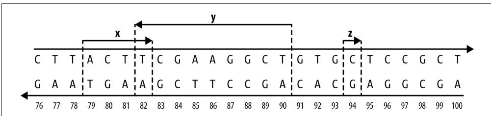


Figure 9-1. Tree ranges on an imaginary stretch of chromosome


## Reference Genome Versions

Assembling and curating reference genomes is a continuous effort, and reference genomes are perpetually changing and improving. Unfortunately, this also means that our coordinate system will often change between genome versions, so a genomic region like chr15:27,754,876-27,755,076 will not refer to the same genomic location across different genome versions. For example, this 200bp range on human genome version GRCh38 are at chr15:28,000,022-28,000,222 on version GRCh37/hg19, chr15:25,673,617-25,673,817 on versions NCBI36/hg18 and NCBI35/hg17, and chr15: 25,602,381-25,602,581 on version NCBI34/hg16! Thus genomic locations are always relative to specific reference genomes versions. For reproducibility’s sake (and to make your life easier later on), it’s vital to specify which version of reference genome you’re working with (e.g., human genome version GRCh38, Heliconius mel‐ pomene v1.1, or Zea mays AGPv3). It’s also imperative that you and collaborators use the same genome version so any shared data tied to a genomic regions is comparable. 

At some point, you’ll need to remap genomic range data from an older genome ver‐ sion’s coordinate system to a newer version’s coordinate system. This would be a tedi‐ ous undertaking, but luckily there are established tools for the task: 

• CrossMap is a command-line tool that converts many data formats (BED, GFF/ GTF, SAM/BAM, Wiggle, VCF) between coordinate systems of different assem‐ bly versions. 

• NCBI Genome Remapping Service is a web-based tool supporting a variety of genomes and formats. 

• LiftOver is also a web-based tool for converting between genomes hosted on the UCSC Genome Browser’s site. 

Despite the convenience that comes with representing and working with genomic ranges, there are unfortunately some gritty details we need to be aware of. First, there are two different flavors of range systems used by bioinformatics data formats (see Table 9-1 for a reference) and software programs: 

• 0-based coordinate system, with half-closed, half-open intervals. 

• 1-based coordinate system, with closed intervals. 

With 0-based coordinate systems, the first base of a sequence is position 0 and the last base’s position is the length of the sequence - 1. In this 0-based coordinate system, we use half-closed, half-open intervals. Admittedly, these half-closed, half-open intervals can be a little unintuitive at first—it’s easiest to borrow some notation from mathe‐ matics when explaining these intervals. For some start and end positions, half closed, half-open intervals are written as [start, end). Brackets indicate a position is included in the interval range (in other words, the interval is closed on this end), while parentheses indicate that a position is excluded in the interval range (the inter‐ val is open on this end). So a half-closed, half-open interval like [1, 5) includes the bases at positions 1, 2, 3, and 4 (illustrated in Figure 9-2). You may be wondering why on earth we’d ever use a system that excludes the end position, but we’ll come to that after discussing 1-based coordinate systems. In fact, if you’re familiar with Python, you’ve already seen this type of interval system: Python’s strings (and lists) are 0- indexed and use half-closed, half-open intervals for indexing portions of a string: 

```txt
>>> "CTTACTTCGAAGGCTG"[1:5]
'TTAC' 
```

The second flavor is 1-based. As you might have guessed, with 1-based systems the first base of a sequence is given the position 1. Because positions are counted as we do natural numbers, the last position in a sequence is always equal to its length. With the 1-based systems we encounter in bioinformatics, ranges are represented as closed intervals. In the notation we saw earlier, this is simply [start, end], meaning both the start and end positions are included in our range. As Figure 9-2 illustrates, the same bases that cover the 0-based range [1, 5) are covered in the 1-based range [2, 5]. R uses 1-based indexing for its vectors and strings, and extracting a portion of a string with substr() uses closed intervals: 

```txt
> substr("CTTACTTCGAAGGCTG", 2, 5)
[1] "TTAC" 
```

If your head is spinning a bit, don’t worry too much—this stuff is indeed confusing. For now, the important part is that you are aware of the two flavors and note which applies to the data you’re working with. 

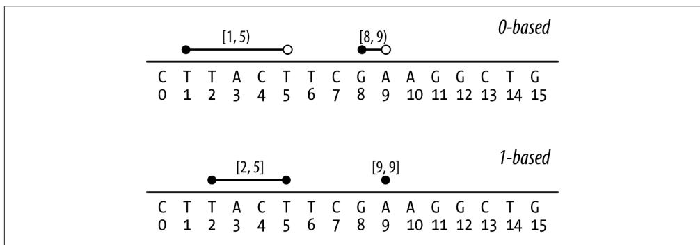


Figure 9-2. Ranges on 0-based and 1-based coordinate systems (lines indicate ranges, open circles indicate open interval endpoints, and closed circles indicate closed end‐ points)


Because most of us are accustomed to counting in natural numbers (i.e., 1, 2, 3, etc.), there is a tendency to lean toward the 1-based system initially. Yet both systems have advantages and disadvantages. For example, to calculate how many bases a range spans (sometimes known as the range width) in the 0-based system, we use end - start. This is simple and intuitive. With the 1-based system, we’d use the less intu‐ itive end - start + 1. Another nice feature of the 0-based system is that it supports zero-width features, whereas with a 1-based system the smallest supported width is 1 base (though sometimes ranges like [30,29] are used for zero-width features). Zerowidth features are useful if we need to represent features between bases, such as where a restriction enzyme would cut a DNA sequence. For example, a restriction enzyme that cut at position [12, 12) in Figure 9-2 would leave fragments CTTACTTCGAAGG and CTG. 


Table 9-1. Range types of common bioinformatics formats


<table><tr><td>Format/library</td><td>Type</td></tr><tr><td>BED</td><td>0-based</td></tr><tr><td>GTF</td><td>1-based</td></tr><tr><td>GFF</td><td>1-based</td></tr><tr><td>SAM</td><td>1-based</td></tr><tr><td>BAM</td><td>0-based</td></tr><tr><td>VCF</td><td>1-based</td></tr><tr><td>BCF</td><td>0-based</td></tr><tr><td>Wiggle</td><td>1-based</td></tr><tr><td>GenomicRanges</td><td>1-based</td></tr><tr><td>BLAST</td><td>1-based</td></tr><tr><td>GenBank/EMBL Feature Table</td><td>1-based</td></tr></table>

The second gritty detail we need to worry about is strand. There’s little to say except: you need to mind strand in your work. Because DNA is double stranded, genomic fea‐ tures can lie on either strand. Across nearly all range formats (BLAST results being the exception), a range’s coordinates are given on the forward strand of the reference sequence. However, a genomic feature can be either on the forward or reverse strand. For genomic features like protein coding regions, strand matters and must be speci‐ fied. For example, a range representing a protein coding region only makes biological sense given the appropriate strand. If the protein coding feature is on the forward strand, the nucleotide sequence underlying this range is the mRNA created during transcription. In contrast, if the protein coding feature is on the reverse strand, the reverse complement of the nucleotide sequence underlying this range is the mRNA sequence created during transcription. 

We also need to mind strand when comparing features. Suppose you’ve aligned sequencing reads to a reference genome, and you want to count how many reads overlap a specific gene. Each aligned read creates a range over the region it aligns to, and we want to count how many of these aligned read ranges overlap a gene range. However, information about which strand a sequencing read came from is lost during sequencing (though there are now strand-specific RNA-seq protocols). Aligned reads will map to both strands, and which strand they map to is uninformative. Conse quently, when computing overlaps with a gene region that we want to ignore strand, an overlap should be counted regardless of whether the aligned read’s strand and gene’s strand are identical. Only counting overlapping aligned reads that have the same strand as the gene would lead to an underestimate of the reads that likely came from this gene’s region. 

## An Interactive Introduction to Range Data with GenomicRanges

To get a feeling for representing and working with data as ranges on a chromosome, we’ll step through creating ranges and using range operations with the Bioconductor packages IRanges and GenomicRanges. Like those in Chapter 8, these examples will be interactive so you grow comfortable exploring and playing around with your data. Through interactive examples, we’ll also see subtle gotchas in working with range operations that are important to be aware of. 

## Installing and Working with Bioconductor Packages

Before we get started with working with range data, let’s learn a bit about Bioconduc‐ tor and install its requisite packages. Bioconductor is an open source software project that creates R bioinformatics packages and serves as a repository for them; it empha‐ sizes tools for high-throughput data. In this section, we’ll touch on some of Biocon‐ ductor’s core packages: 

## GenomicRanges

Used to represent and work with genomic ranges 

## GenomicFeatures

Used to represent and work with ranges that represent gene models and other features of a genome (genes, exons, UTRs, transcripts, etc.) 

## Biostrings and BSgenome

Used for manipulating genomic sequence data in R (we’ll cover the subset of these packages used for extracting sequences from ranges) 

## rtracklayer

Used for reading in common bioinformatics formats like BED, GTF/GFF, and WIG 

Bioconductor’s package system is a bit different than those on the Comprehensive R Archive Network (CRAN). Bioconductor packages are released on a set schedule, twice a year. Each release is coordinated with a version of R, making Bioconductor’s versions tied to specific R versions. The motivation behind this strict coordination is that it allows for packages to be thoroughly tested before being released for public use. Additionally, because there’s considerable code re-use within the Bioconductor project, this ensures that all package versions within a Bioconductor release are com‐ patible with one another. For users, the end result is that packages work as expected and have been rigorously tested before you use it (this is good when your scientific results depend on software reliability!). If you need the cutting-edge version of a package for some reason, it’s always possible to work with their development branch. 

When installing Bioconductor packages, we use the biocLite() function. bio cLite() installs the correct version of a package for your R version (and its corre‐ sponding Bioconductor version). We can install Bioconductor’s primary packages by running the following (be sure your R version is up to date first, though): 

> source("http://bioconductor.org/biocLite.R") 

> biocLite() 

One package installed by the preceding lines is BiocInstaller, which contains the function biocLite(). We can use biocLite() to install the GenomicRanges package, which we’ll use in this chapter: 

> biocLite("GenomicRanges") 

This is enough to get started with the ranges examples in this chapter. If you wish to install other packages later on (in other R sessions), load the BiocInstaller package with library(BiocInstaller) first. biocLite() will notify you when some of your packages are out of date and need to be upgraded (which it can do automatically for you). You can also use biocUpdatePackages() to manually update Bioconductor (and CRAN) packages . Because Bioconductor’s packages are all tied to a specific ver‐ sion, you can make sure your packages are consistent with biocValid(). If you run into an unexpected error with a Bioconductor package, it’s a good idea to run biocUp datePackages() and biocValid() before debugging. 

In addition to a careful release cycle that fosters package stability, Bioconductor also has extensive, excellent documentation. The best, most up-to-date documentation for each package will always be at Bioconductor. Each package has a full reference man‐ ual covering all functions and classes included in a package, as well as one or more in-depth vignettes. Vignettes step through many examples and common workflows using packages. For example, see the GenomicRanges reference manual and vignettes. I highly recommend that you read the vignettes for all Bioconductor packages you intend to use—they’re extremely well written and go into a lot of useful detail. 

## Storing Generic Ranges with IRanges

Before diving into working with genomic ranges, we’re going to get our feet wet with generic ranges (i.e., ranges that represent a contiguous subsequence of elements over any type of sequence). Beginning this way allows us to focus more on thinking abstractly about ranges and how to solve problems using range operations. The real 

power of using ranges in bioinformatics doesn’t come from a specific range library implementation, but in tackling problems using the range abstraction (recall Pólya’s quote at the beginning of this chapter). To use range libraries to their fullest potential in real-world bioinformatics, you need to master this abstraction and “range think ing.” 

The purpose of the first part of this chapter is to teach you range thinking through the use of use Bioconductor’s IRanges package. This package implements data struc‐ tures for generic ranges and sequences, as well as the necessary functions to work with these types of data in R. This section will make heavy use of visualizations to build your intuition about what range operations do. Later in this chapter, we’ll learn about the GenomicRanges package, which extends IRanges by handling biological details like chromosome name and strand. This approach is common in software development: implement a more general solution than the one you need, and then extend the general solution to solve a specific problem (see xkcd’s “The General Prob‐ lem” comic for a funny take on this). 

Let’s get started by creating some ranges using IRanges. First, load the IRanges pack‐ age. The IRanges package is a dependency of the GenomicRanges package we installed earlier with biocLite(), so it should already be installed: 

```txt
> library(IRanges) # you might see some package startup
# messages when you run this 
```

The ranges we create with the IRanges package are called IRanges objects. Each IRanges object has the two basic components of any range: a start and end position. We can create ranges with the IRanges() function. For example, a range starting at position 4 and ending at position 13 would be created with: 

```c
> rng <- IRanges(start=4, end=13)
> rng
IRanges of length 1
start end width
[1] 4 13 10 
```

The most important fact to note: IRanges (and GenomicRanges) is 1-based, and uses closed intervals. The 1-based system was adopted to be consistent with R’s 1-based system (recall the first element in an R vector has index 1). 

You can also create ranges by specifying their width, and either start or end position: 

```txt
> IRanges(start=4, width=3)
IRanges of length 1
    start end width
[1]    4    6    3
> IRanges(end=5, width=5)
IRanges of length 1
    start end width
[1]    1    5    5 
```

Also, the IRanges() constructor (a function that creates a new object) can take vector arguments, creating an IRanges object containing many ranges: 

```txt
> x <- IRanges(start=c(4, 7, 2, 20), end=c(13, 7, 5, 23))
> x
IRanges of length 4
start end width
[1]    4    13    10
[2]    7    7    1
[3]    2    5    4
[4]    20    23    4 
```

Like many R objects, each range can be given a name. This can be accomplished by setting the names argument in IRanges, or using the function names(): 

<table><tr><td colspan="5">&gt; names(x) &lt;- letters[1:4]</td></tr><tr><td colspan="5">&gt; x</td></tr><tr><td colspan="5">IRanges of length 4</td></tr><tr><td></td><td>start</td><td>end</td><td>width</td><td>names</td></tr><tr><td>[1]</td><td>4</td><td>13</td><td>10</td><td>a</td></tr><tr><td>[2]</td><td>7</td><td>7</td><td>1</td><td>b</td></tr><tr><td>[3]</td><td>2</td><td>5</td><td>4</td><td>c</td></tr><tr><td>[4]</td><td>20</td><td>23</td><td>4</td><td>d</td></tr></table>

These four ranges are depicted in Figure 9-3. If you wish to try plotting your ranges, the source for the function I’ve used to create these plots, plotIRanges(), is available in this chapter’s directory in the book’s GitHub repository. 

While on the outside x may look like a dataframe, it’s not—it’s a special object with class IRanges. In “Factors and classes in R” on page 191, we learned that an object’s class determines its behavior and how we interact with it in R. Much of Bioconductor is built from objects and classes. Using the function class(), we can see it’s an IRanges object: 

```txt
> class(x)
[1] "IRanges"
attr(,"package")
[1] "IRanges" 
```

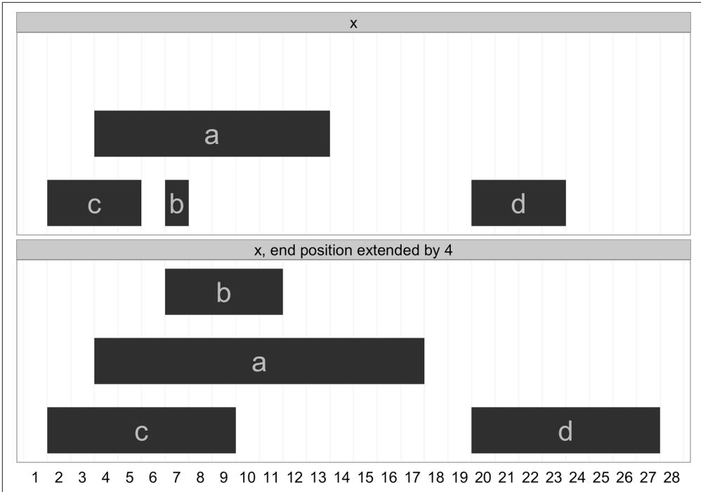


Figure 9-3. An IRanges object containing four ranges


IRanges objects contain all information about the ranges you’ve created internally. If you’re curious what’s under the hood, call str(x) to take a peek. Similar to how we used the accessor function levels() to access a factor’s levels (“Factors and classes in R” on page 191), we use accessor functions to get parts of an IRanges object. For example, you can access the start positions, end positions, and widths of each range in this object with the methods start(), end(), and width(): 

```txt
> start(x)
[1] 4 7 2 20
> end(x)
[1] 13 7 5 23
> width(x)
[1] 10 1 4 4 
```

These functions also work with <- to set start, end, and width position. For example, we could increment a range’s end position by 4 positions with: 

```txt
> end(x) <- end(x) + 4
> x
IRanges of length 4
start end width names
[1] 4 17 14 a
[2] 7 11 5 b 
```

```txt
[3] 2 9 8 c
[4] 20 27 8 d 
```


Figure 9-4 shows this IRanges object before and after extending the end position. Note that the y position in these plots is irrelevant; it’s chosen so that ranges can be visualized clearly.


```txt
x
a
c b
d
x, end position extended by 2
b
a
c d 
```


Figure 9-4. Before and afer extending the range end position by 4


The range() method returns the span of the ranges kept in an IRanges object: 

```txt
> range(x)
IRanges of length 1
start end width
[1] 2 27 26 
```

We can subset IRanges just as we would any other R objects (vectors, dataframes, matrices), using either numeric, logical, or character (name) index: 

```txt
> x[2:3]
IRanges of length 2
start end width names
[1] 7 11 5 b
[2] 2 9 8 c
> start(x) < 5
[1] TRUE FALSE TRUE FALSE
> x[start(x) < 5]
IRanges of length 2
start end width names
[1] 4 17 14 a
[2] 2 9 8 c
> x[width(x) > 8]
IRanges of length 1
start end width names
[1] 4 17 14 a 
```

```txt
> x['a']
IRanges of length 1
start end width names
[1] 4 17 14 a 
```

As with dataframes, indexing using logical vectors created by statements like width(x) > 8 is a powerful way to select the subset of ranges you’re interested in. 

Ranges can also be easily merged using the function c(), just as we used to combine vectors: 

```txt
> a <- IRanges(start=7, width=4)
> b <- IRanges(start=2, end=5)
> c(a, b)
IRanges of length 2
start end width
[1] 7 10 4
[2] 2 5 4 
```

With the basics of IRanges objects under our belt, we’re now ready to look at some basic range operations. 

## Basic Range Operations: Arithmetic, Transformations, and Set Operations

In the previous section, we saw how IRanges objects conveniently store generic range data. So far, IRanges may look like nothing more than a dataframe that holds range data; in this section, we’ll see why these objects are so much more. The purpose of using a special class for storing ranges is that it allows for methods to perform speci‐ alized operations on this type of data. The methods included in the IRanges package to work with IRanges objects simplify and solve numerous genomics data analysis tasks. These same methods are implemented in the GenomicRanges package, and work similarly on GRanges objects as they do generic IRanges objects. 

First, IRanges objects can be grown or shrunk using arithmetic operations like +, -, and * (the division operator, /, doesn’t make sense on ranges, so it’s not supported). Growing ranges is useful for adding a buffer region. For example, we might want to include a few kilobases of sequence up and downstream of a coding region rather than just the coding region itself. With IRanges objects, addition (subtraction) will grow (shrink) a range symmetrically by the value added (subtracted) to it: 

```c
> x <- IRanges(start=c(40, 80), end=c(67, 114))
> x + 4L
IRanges of length 2
start end width
[1] 36 71 36
[2] 76 118 43
> x - 10L
IRanges of length 2 
```

```txt
start end width
[1] 50 57 8
[2] 90 104 15 
```

The results of these transformations are depicted in Figure 9-5. Multiplication trans‐ forms with the width of ranges in a similar fashion. Multiplication by a positive num‐ ber “zooms in” to a range (making it narrower), while multiplication by a negative number “zooms out” (making it wider). In practice, most transformations needed in genomics are more easily expressed by adding or subtracting constant amounts. 

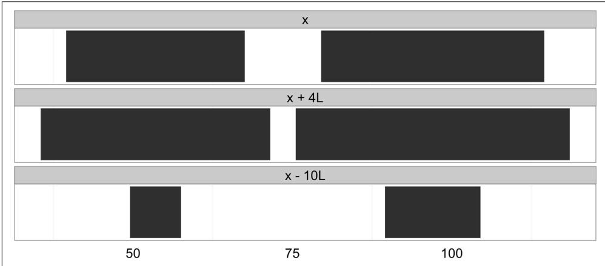


Figure 9-5. Ranges transformed by arithemetic operations


Sometimes, rather than growing ranges by some amount, we want to restrict ranges within a certain bound. The IRanges package method restrict() cuts a set of ranges such that they fall inside of a certain bound (pictured in Figure 9-6): 

```txt
> y <- IRanges(start=c(4, 6, 10, 12), width=13)
> y
IRanges of length 4
start end width
[1] 4 16 13
[2] 6 18 13
[3] 10 22 13
[4] 12 24 13
> restrict(y, 5, 10)
IRanges of length 3
start end width
[1] 5 10 6
[2] 6 10 5
[3] 10 10 1 
```

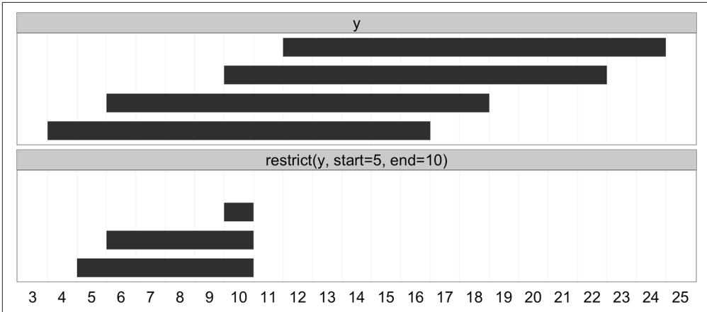


Figure 9-6. Ranges transformed by restrict


Another important transformation is flank(), which returns the regions that flank (are on the side of) each range in an IRanges object. flank() is useful in creating ranges upstream and downstream of protein coding genes that could contain pro‐ moter sequences. For example, if our ranges demarcate the transition start site (TSS) and transcription termination site (TTS) of a set of genes, flank() can be used to cre‐ ate a set of ranges upstream of the TSS that contain promoters. To make the example (and visualization) clearer, we’ll use ranges much narrower than real genes: 

```txt
> x
IRanges of length 2
start end width
[1] 40 67 28
[2] 80 114 35
> flank(x, width=7)
IRanges of length 2
start end width
[1] 33 39 7
[2] 73 79 7 
```

By default, flank() creates ranges width positions upstream of the ranges passed to it. Flanking ranges downstream can be created by setting start=FALSE: 

```txt
> flank(x, width=7, start=FALSE)
IRanges of length 2
start end width
[1] 68 74 7
[2] 115 121 7 
```

Both upstream and downstream flanking by 7 positions are visualized in Figure 9-7. flank() has many other options; see help(flank) for more detail. 

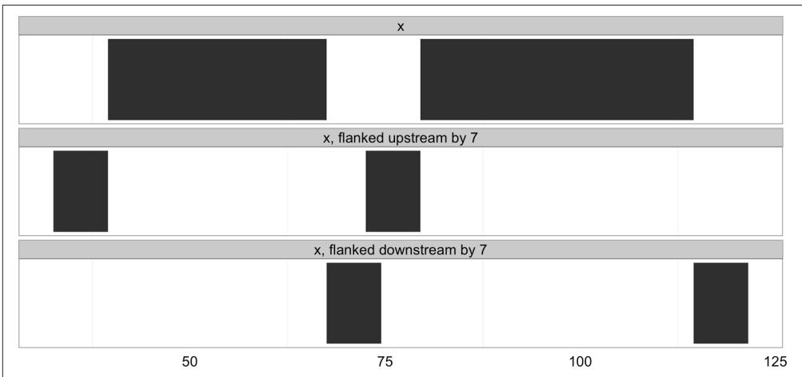


Figure 9-7. Ranges that have been fanked by 7 elements, both upstream and down‐ stream


Another common operation is reduce(). the reduce() operation takes a set of possi bly overlapping ranges and reduces them to a set of nonoverlapping ranges that cover the same positions. Any overlapping ranges are merged into a single range in the result. reduce() is useful when all we care about is what regions of a sequence are covered (and not about the specifics of the ranges themselves). Suppose we had many ranges corresponding to read alignments and we wanted to see which regions these reads cover. Again, for the sake of clarifying the example, we’ll use simple, small ranges (here, randomly sampled): 

```txt
> set.seed(0) # set the random number generator seed
> alns <- IRanges(start=sample(seq_len(50), 20), width=5)
> head(alns, 4)

IRanges of length 4
    start end width
[1]    45    49    5
[2]    14    18    5
[3]    18    22    5
[4]    27    31    5

> reduce(alns)

IRanges of length 3
    start end width
[1]    3    22    20
[2]    24    36    13
[3]    40    53    14 
```

See Figure 9-8 for a visualization of how reduce() transforms the ranges alns. 

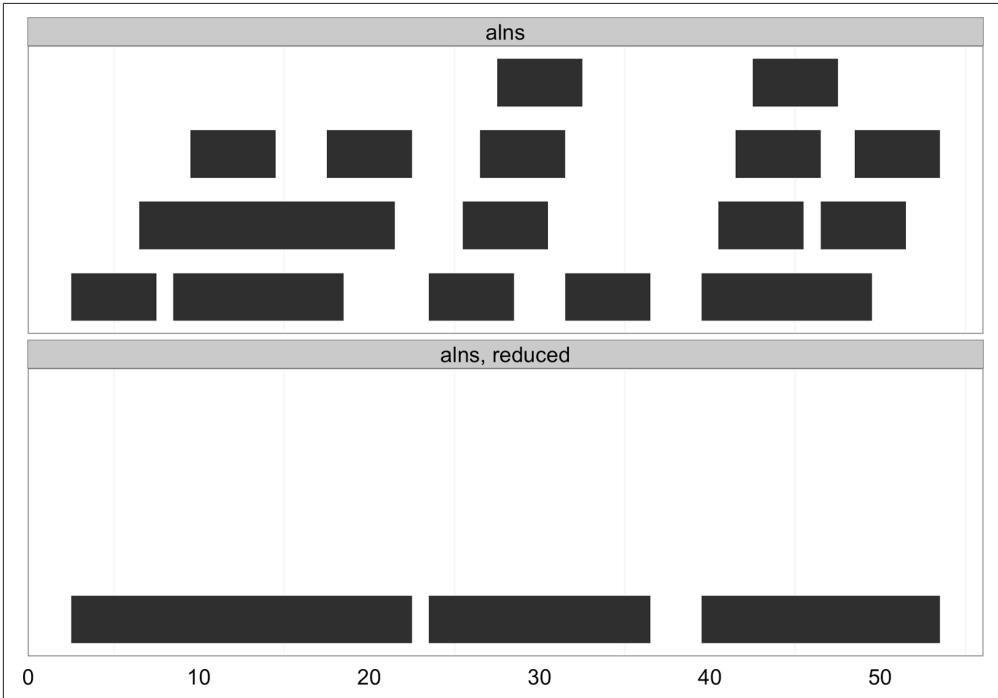


Figure 9-8. Ranges collapsed into nonoverlapping ranges with reduce


A similar operation to reduce() is gaps(), which returns the gaps (uncovered por‐ tions) between ranges. gaps() has numerous applications in genomics: creating intron ranges between exons ranges, finding gaps in coverage, defining intragenic regions between genic regions, and more. Here’s an example of how gaps() works (see Figure 9-9 for an illustration): 

<table><tr><td colspan="4">&gt; gaps(alns)</td></tr><tr><td colspan="4">IRanges of length 2</td></tr><tr><td></td><td>start</td><td>end</td><td>width</td></tr><tr><td>[1]</td><td>23</td><td>23</td><td>1</td></tr><tr><td>[2]</td><td>37</td><td>39</td><td>3</td></tr></table>

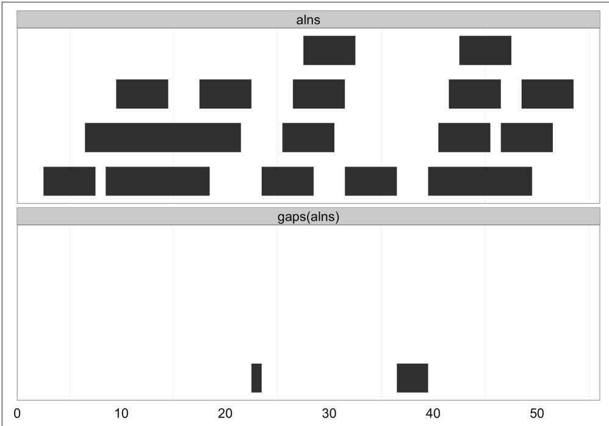


Figure 9-9. Gaps between ranges created with gaps


By default, gaps() only returns the gaps between ranges, and does not include those from the beginning of the sequence to the start position of the first range, and the end of the last range to the end of the sequence. IRanges has a good reason for behaving this way: IRanges doesn’t know where your sequence starts and ends. If you’d like gaps() to include these gaps, specify the start and end positions in gaps (e.g., gaps(alns, start=1, end=60)). 

Another class of useful range operations are analogous to set operations. Each range can be thought of as a set of consecutive integers, so an IRange object like IRange(start=4, end=7) is simply the integers 4, 5, 6, and 7. This opens up the abil‐ ity to think about range operations as set operations like difference (setdiff()), intersection (intersect()), union (union()), and complement (which is simply the function gaps() we saw earlier)—see Figure 9-10 for an illustration: 

```txt
> a <- IRanges(start=4, end=13)
> b <- IRanges(start=12, end=17)
> intersect(a, b)
IRanges of length 1
start end width
[1] 12 13 2
> setdiff(a, b)
IRanges of length 1 
```

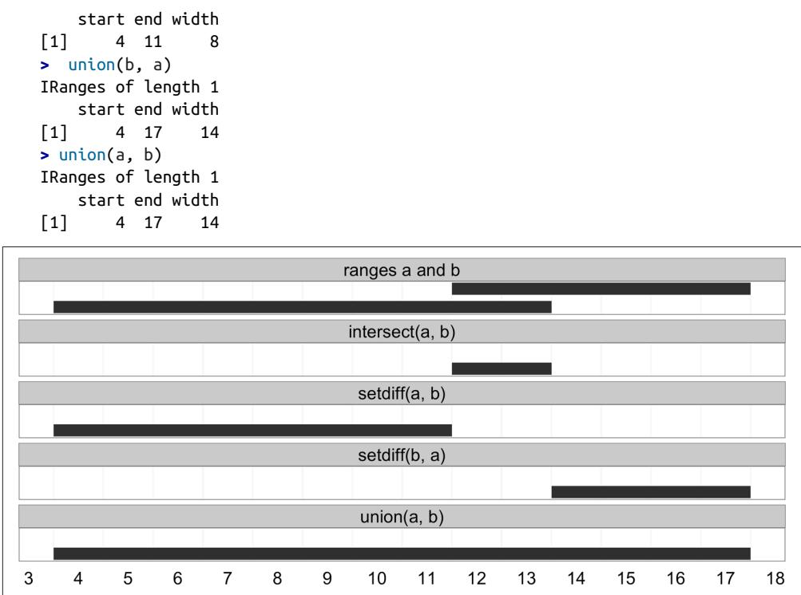


Figure 9-10. Set operations with ranges


Sets operations operate on IRanges with multiple ranges (rows) as if they’ve been col‐ lapsed with reduce() first (because mathematically, overlapping ranges make up the same set). IRanges also has a group of set operation functions that act pairwise, tak‐ ing two equal-length IRanges objects and working range-wise: psetdiff(), pinter sect(), punion(), and pgap(). To save space, I’ve omitted covering these in detail, but see help(psetdiff) for more information. 

The wealth of functionality to manipulate range data stored in IRanges should con‐ vince you of the power of representing data as IRanges. These methods provide the basic generalized operations to tackle common genomic data analysis tasks, saving you from having to write custom code to solve specific problems. All of these func‐ tions work with genome-specific range data kept in GRanges objects, too. 

## Finding Overlapping Ranges

Finding overlaps is an essential part of many genomics analysis tasks. Computing overlaps is how we connect experimental data in the form of aligned reads, inferred variants, or peaks of alignment coverage to annotated biological features of the genome like gene regions, methylation, chromatin status, evolutionarily conserved regions, and so on. For tasks like RNA-seq, overlaps are how we quantify our cellular activity like expression and identify different transcript isoforms. Computing over‐ laps also exemplifies why it’s important to use existing libraries: there are advanced data structures and algorithms that can make the computationally intensive task of comparing numerous (potentially billions) ranges to find overlaps efficient. There are also numerous very important technical details in computing overlaps that can have a drastic impact on the end result, so it’s vital to understand the different types of over‐ laps and consider which type is most appropriate for a specific task. 

We’ll start with the basic task of finding overlaps between two sets of IRanges objects using the findOverlaps() function. findOverlaps() takes query and subject IRanges objects as its first two arguments. We’ll use the following ranges (visualized in Figure 9-11): 

```txt
> qry <- IRanges(start=c(1, 26, 19, 11, 21, 7), end=c(16, 30, 19, 15, 24, 8), names=letters[1:6])
> sbj <- IRanges(start=c(1, 19, 10), end=c(5, 29, 16), names=letters[24:26])
> qry
IRanges of length 6
    start end width names
[1]    1   16   16    a
[2]    26   30   5    b
[3]    19   19   1    c
[4]    11   15   5    d
[5]    21   24   4    e
[6]    7   8   2    f
> sbj
IRanges of length 3
    start end width names
[1]    1   5   5    x
[2]    19   29   11    y
[3]    10   16   7    z 
```

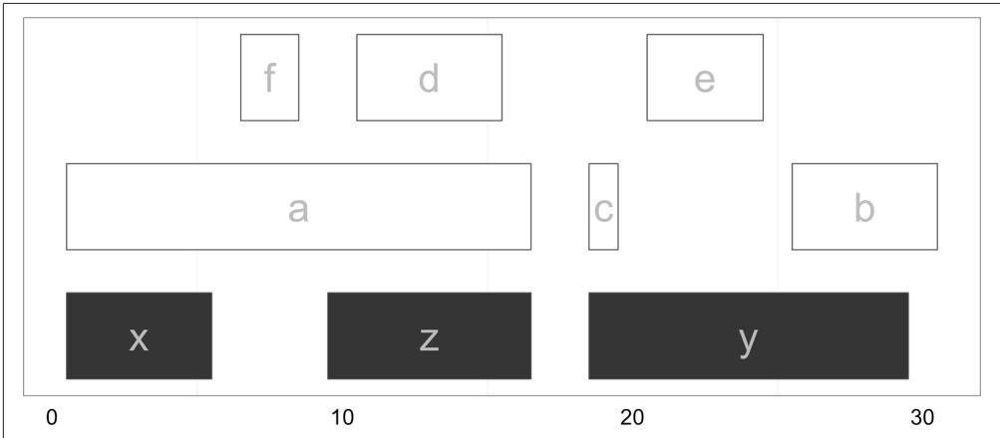


Figure 9-11. Subject ranges (x, y, and z) depicted in gray and query ranges (a through f) depicted in white


Using the IRanges qry and sbj, we can now find overlaps. Calling findOver laps(qry, sbj) returns an object with class Hits, which stores these overlaps: 

```txt
>hts<- findOverlaps(qry, sbj)  
>hts  
Hits of length 6  
queryLength: 6  
subjectLength: 3  
queryHits subjectHits  
<integer> <integer>  
1 1 1  
2 1 3  
3 2 2  
4 3 2  
5 4 3  
6 5 2 
```

Thinking abstractly, overlaps represent a mapping between query and subject. Depending on how we find overlaps, each query can have many hits in different sub‐ jects. A single subject range will always be allowed to have many query hits. Finding qry ranges that overlap sbj ranges leads to a mapping similar to that shown in Figure 9-12 (check that this follows your intuition from Figure 9-13). 

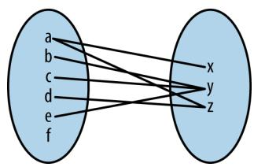


Figure 9-12. Mapping between qry and sbj ranges representing any overlap


The Hits object from findOverlaps() has two columns on indices: one for the query ranges and one for the subject ranges. Each row contains the index of a query range that overlaps a subject range, and the index of the subject range it overlaps. We can access these indices by using the accessor functions queryHits() and subjectHits(). For example, if we wanted to find the names of each query and subject range with an overlap, we could do: 

```scala
> names(qry)[queryHits(hts)]
[1] "a" "a" "b" "c" "d" "e"
> names(sbj)[subjectHits(hts)]
[1] "x" "z" "y" "y" "z" "y" 
```

Figure 9-13 shows which of the ranges in qry overlap the ranges in sbj. From this graphic, it’s easy to see how findOverlaps() is computing overlaps: a range is consid‐ ered to be overlapping if any part of it overlaps a subject range. This type of overlap behavior is set with the type argument to findOverlaps(), which is "any" by default. Depending on our biological task, type="any" may not be the best form of overlap. For example, we could limit our overlap results to only include query ranges that fall entirely within subject ranges with type=within (Figure 9-14): 

```txt
>hts_within<- findOverlaps(qry, sbj, type="within")
>hts_within
Hits of length 3
queryLength: 6
subjectLength: 3
    queryHits subjectHits
    <integer>    <integer>
1    3    2
2    4    3
3    5    2 
```

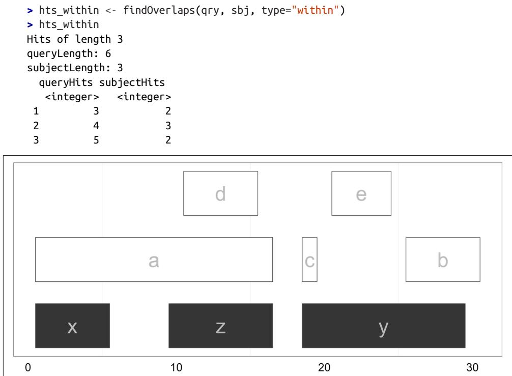


Figure 9-13. Ranges in qry that overlap sbj using fndOverlaps


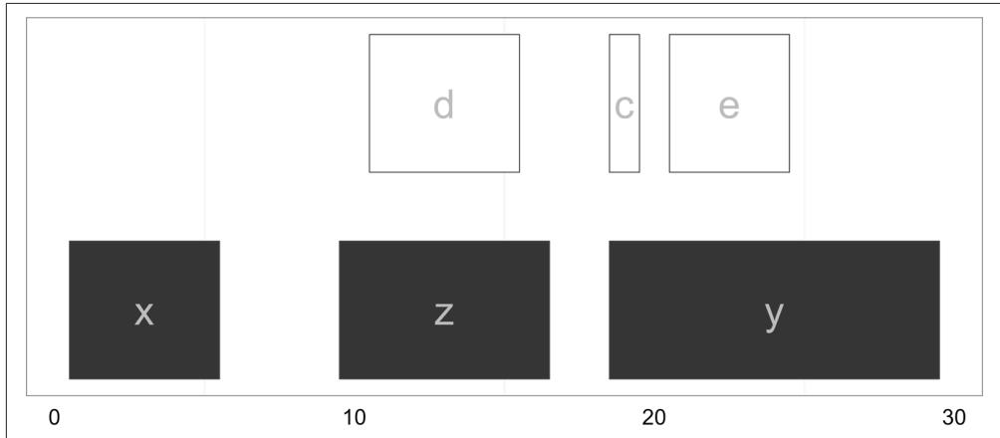


Figure 9-14. Ranges in qry that overlap entirely within sbj


While type="any" and type="within" are the most common options in day-to-day work, findOverlaps() supports other overlap types. See help(findOverlaps) to see the others (and much more information about findOverlaps() and related func‐ tions). 

Another findOverlaps() parameter that we need to consider when computing over‐ laps is select, which determines how findOverlaps() handles cases where a single query range overlaps more than one subject range. For example, the range named a in qry overlaps both x and y. By default, select="all", meaning that all overlapping ranges are returned. In addition, select allows the options "first", "last", and "arbitrary", which return the first, last, and an arbitrary subject hit, respectively. Because the options "first", "last", and "arbitrary" all lead findOverlaps() to return only one overlapping subject range per query (or NA if no overlap is found), results are returned in an integer vector where each element corresponds to a query range in qry: 

```txt
> findOverlaps(qry, sbj, select="first")
[1] 1 2 2 3 2 NA
> findOverlaps(qry, sbj, select="last")
[1] 3 2 2 3 2 NA
> findOverlaps(qry, sbj, select="arbitrary")
[1] 1 2 2 3 2 NA 
```


## Mind Your Overlaps (Part I)

What an overlap “is” may seem obvious at first, but the specifics can matter a lot in real-life genomic applications. For example, allowing for a query range to overlap any part of a subject range makes sense when we’re looking for SNPs in exons. However, clas‐ sifying a 1kb genomic window as coding because it overlaps a sin‐ gle base of a gene may make less sense (though depends on the application). It’s important to always relate your quantification methods to the underlying biology of what you’re trying to under‐ stand. 

The intricacies of overlap operations are especially important when we use overlaps to quantify something, such as expression in an RNA-seq study. For example, if two transcript regions overlap each other, a single alignment could overlap both transcripts and be counted twice—not good. Likewise, if we count how many align‐ ments overlap exons, it’s not clear how we should aggregate over‐ laps to obtain transcript or gene-level quantification. Again, different approaches can lead to sizable differences in statistical results. The take-home lessons are as follows: 

• Mind what your code is considering an overlap. 

• For quantification tasks, simple overlap counting is best thought of as an approximation (and more sophisticated meth‐ ods do exist). 

See Trapnell, et al., 2013 for a really nice introduction of these issues in RNA-seq quantification. 

Counting many overlaps can be a computationally expensive operation, especially when working with many query ranges. This is because the naïve solution is to take a query range, check to see if it overlaps any of the subject ranges, and then repeat across all other query ranges. If you had Q query ranges and S subject ranges, this would entail Q × S comparisons. However, there’s a trick we can exploit: ranges are naturally ordered along a sequence. If our query range has an end position of 230,193, there’s no need to check if it overlaps subject ranges with start positions larger than 230,193—it won’t overlap. By using a clever data structure that exploits this property, we can avoid having to check if each of our Q query ranges overlap our S subject ranges. The clever data structure behind this is the interval tree. It takes time to build an interval tree from a set of subject ranges, so interval trees are most appropriate for tasks that involve finding overlaps of many query ranges against a fixed set of subject ranges. In these cases, we can build the subject interval tree once and then we can use it over and over again when searching for overlaps with each of the query ranges. 

Implementing interval trees is an arduous task, but luckily we don’t have to utilize their massive computational benefits. IRanges has an IntervalTree class that uses interval trees under the hood. Creating an IntervalTree object from an IRanges object is simple: 

```csv
> sbj_it <- IntervalTree(sbj)
> sbj_it
IntervalTree of length 3
start end width
[1] 1 5 5
[2] 19 29 11
[3] 10 16 7
> class(sbj_it)
[1] "IntervalTree"
attr(,"package")
[1] "IRanges" 
```

Using this sbj_it object illustrates we can use findOverlaps() with IntervalTree objects just as we would a regular IRanges object—the interfaces are identical: 

```txt
> findOverlaps(qry, sbj_it)
Hits of length 6
queryLength: 6
subjectLength: 3
    queryHits subjectHits
    <integer>    <integer>
1    1    1
2    1    3
3    2    2
4    3    2
5    4    3
6    5    2 
```

Note that in this example, we won’t likely realize any computational benefits from using an interval tree, as we have few subject ranges. 

After running findOverlaps(), we need to work with Hits objects to extract infor‐ mation from the overlapping ranges. Hits objects support numerous helpful methods in addition to the queryHits() and subjectHits() accessor functions (see help(queryHits) for more information): 

```csv
> as.matrix(hts) ①
queryHits subjectHits
[1,] 1 1
[2,] 1 3
[3,] 2 2
[4,] 3 2
[5,] 4 3
[6,] 5 2
> countQueryHits(hts) ②
[1] 2 1 1 1 1 0 
```

```txt
> setNames(countQueryHits(hts), names(qry))
a b c d e f
2 1 1 1 1 0
> countSubjectHits(hts) ③
[1] 1 3 2
> setNames(countSubjectHits(hts), names(sbj))
x y z
1 3 2
> ranges(hts, qry, sbj) ④
IRanges of length 6
start end width
[1]    1    5    5
[2]    10    16    7
[3]    26    29    4
[4]    19    19    1
[5]    11    15    5
[6]    21    24    4 
```

Hits objects can be coerced to matrix using as.matrix(). 

countQueryHits() returns a vector of how many subject ranges each query IRanges object overlaps. Using the function setNames(), I’ve given the resulting vector the same names as our original ranges on the next line so the result is clearer. Look at Figure 9-11 and verify that these counts make sense. 

The function countSubjectHits() is like countQueryHits(), but returns how many query ranges overlap the subject ranges. As before, I’ve used setNames() to label these counts with the subject ranges’ names so these results are clearly label‐ led. 

④ Here, we create a set of ranges for overlapping regions by calling the ranges() function using the Hits object as the first argument, and the same query and subject ranges we passed to findOverlaps() as the second and third arguments. These intersecting ranges are depicted in Figure 9-15 in gray, alongside the origi‐ nal subject and query ranges. Note how these overlapping ranges differ from the set created by intersect(qry, sbj): while intersect() would create one range for the regions of ranges a and d that overlap z, using ranges() with a Hits object creates two separate ranges. 

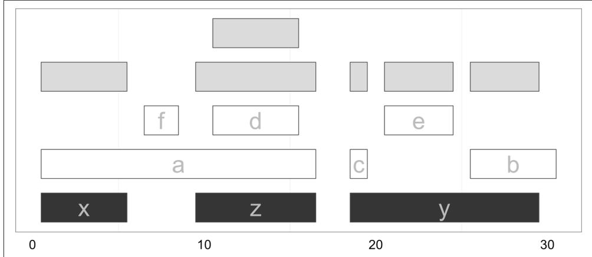


Figure 9-15. Overlapping ranges created from a Hits object using the function ranges


A nice feature of working with ranges in R is that we can leverage R’s full array of data analysis capabilities to explore these ranges. For example, after using ranges(hts, qry, sbj) to create a range corresponding to the region shared between each over‐ lapping query and subject range, you could use summary(width(ranges(hts, qry, sbj))) to get a summary of how large the overlaps are, or use ggplot2 to plot a histo‐ gram of all overlapping widths. This is one of the largest benefits of working with ranges within R—you can interactively explore and understand your results immedi‐ ately after generating them. 

The functions subsetByOverlaps() and countOverlaps() simplify some of the most common operations performed on ranges once overlaps are found: keeping only the subset of queries that overlap subjects, and counting overlaps. Both functions allow you to specify the same type of overlap to use via the type argument, just as findOverlaps() does. Here are some examples using the objects qry and sbj we cre‐ ated earlier: 

```txt
> countOverlaps(qry, sbj) ①
a b c d e f
2 1 1 1 1 0
> subsetByOverlaps(qry, sbj) ②
IRanges of length 5
start end width names
[1]    1    16    16    a
[2]    26    30    5    b
[3]    19    19    1    c
[4]    11    15    5    d
[5]    21    24    4    e 
```

countOverlaps is similar to the solution using countQueryOverlaps() and set Names(). 

subsetByOverlaps returns the same as qry[unique(queryHits(hts))]. You can verify this yourself (and think through why unique() is necessary). 

## Finding Nearest Ranges and Calculating Distance

Another common set of operations on ranges focuses on finding ranges that neighbor query ranges. In the IRanges package, there are three functions for this type of opera‐ tion: nearest(), precede(), and follow(). The nearest() function returns the near‐ est range, regardless of whether it’s upstream or downstream of the query. precede() and follow() return the nearest range that the query is upstream of or downstream of, respectively. Each of these functions take the query and subject ranges as their first and second arguments, and return an index to which subject matches (for each of the query ranges). This will be clearer with examples and visualization: 

```txt
> qry <- IRanges(start=6, end=13, name='query')
> sbj <- IRanges(start=c(2, 4, 18, 19), end=c(4, 5, 21, 24), names=1:4)
> qry
IRanges of length 1
    start end width names
[1]    6    13    8 query
> sbj
IRanges of length 4
    start end width names
[1]    2    4    3    1
[2]    4    5    2    2
[3]    18    21    4    3
[4]    19    24    6    4
> nearest(qry, sbj)
[1] 2
> precede(qry, sbj)
[1] 3
> follow(qry, sbj)
[1] 1 
```

To keep precede() and follow() straight, remember that these functions are with respect to the query: precede() finds ranges that the query precedes and follow() finds ranges that the query follows. Also, illustrated in this example (seen in Figure 9-16), the function nearest() behaves slightly differently than precede() and follow(). Unlike precede() and follow(), nearest() will return the nearest range even if it overlaps the query range. These subtleties demonstrate how vital it is to carefully read all function documentation before using libraries. 

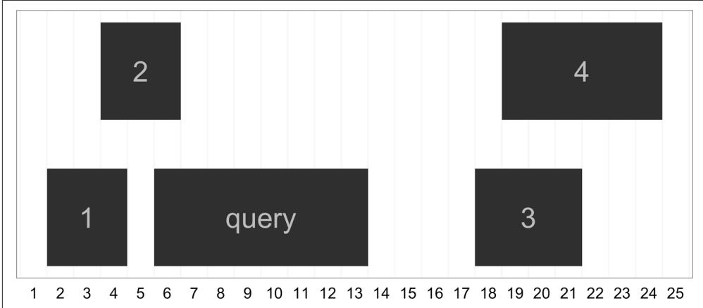


Figure 9-16. Te ranges used in nearest, precede, and follow example


Note too that these operations are all vectorized, so you can provide a query IRanges object with multiple ranges: 

```txt
> qry2 <- IRanges(start=c(6, 7), width=3)
> nearest(qry2, sbj)
[1] 2 2 
```

This family of functions for finding nearest ranges also includes distan ceToNearest() and distance(), which return the distance to the nearest range and the pairwise distances between ranges. We’ll create some random ranges to use in this example: 

```txt
> qry <- IRanges(sample(seq_len(1000), 5), width=10)
> sbj <- IRanges(sample(seq_len(1000), 5), width=10)
> qry
IRanges of length 5
start end width
[1] 897 906 10
[2] 266 275 10
[3] 372 381 10
[4] 572 581 10
[5] 905 914 10
> sbj
IRanges of length 5
start end width
[1] 202 211 10
[2] 898 907 10
[3] 943 952 10
[4] 659 668 10
[5] 627 636 10 
```

Now, let’s use distanceToNearest() to find neighboring ranges. It works a lot like findOverlaps()—for each query range, it finds the closest subject range, and returns everything in a Hits object with an additional column indicating the distance: 

<table><tr><td colspan="4">distanceToNearest(qry, sbj)</td></tr><tr><td colspan="4">Hits of length 5</td></tr><tr><td colspan="4">queryLength: 5</td></tr><tr><td colspan="4">subjectLength: 5</td></tr><tr><td colspan="4">queryHits subjectHits distance</td></tr><tr><td></td><td>&lt;integer&gt;</td><td>&lt;integer&gt;</td><td>&lt;integer&gt;</td></tr><tr><td>1</td><td>1</td><td>2</td><td>0</td></tr><tr><td>2</td><td>2</td><td>1</td><td>54</td></tr><tr><td>3</td><td>3</td><td>1</td><td>160</td></tr><tr><td>4</td><td>4</td><td>5</td><td>45</td></tr><tr><td>5</td><td>5</td><td>2</td><td>0</td></tr></table>

The method distance() returns each pairwise distance between query and subject ranges: 

> distance(qry, sbj) 

[1] 685 622 561 77 268 

## Run Length Encoding and Views

The generic ranges implemented by IRanges can be ranges over any type of sequence. In the context of genomic data, these ranges’ coordinates are based on the underlying nucleic acid sequence of a particular chromosome. Yet, many other types of genomic data form a sequence of numeric values over each position of a chromosome sequence. Some examples include: 

• Coverage, the depth of overlap of ranges across the length of a sequence. Cover‐ age is used extensively in genomics, from being an important factor in how var‐ iants are called to being used to discover coverage peaks that indicate the presence of some feature (as in a ChIP-seq study). 

• Conservation tracks, which are base-by-base evolutionary conservation scores between species, generated by a program like phastCons (see Siepel et al., 2005 as an example). 

• Per-base pair estimates of population genomics summary statistics like nucleo‐ tide diversity. 

In this section, we’ll take a closer look at working with coverage data, creating ranges from numeric sequence data, and a powerful abstraction called views. Each of these concepts provides a powerful new way to manipulate sequence and range data. How‐ ever, this section is a bit more advanced than earlier ones; if you’re feeling over‐ whelmed, you can skim the section on coverage and then skip ahead to “Storing Genomic Ranges with GenomicRanges” on page 299. 

## Run-length encoding and coverage()

Long sequences can grow quite large in memory. For example, a track containing numeric values over each of the 248,956,422 bases of chromosome 1 of the human genome version GRCh38 would be 1.9Gb in memory. To accommodate working with data this size in R, IRanges can work with sequences compressed using a clever trick: it compresses runs of the same value. For example, imagine a sequence of integers that represent the coverage of a region in a chromosome: 

```txt
4 4 4 3 3 2 1 1 1 1 1 0 0 0 0 0 0 0 0 1 1 1 4 4 4 4 4 4 4 
```

Data like coverage often exhibit runs: consecutive stretches of the same value. We can compress these runs using a scheme called run-length encoding. Run-length encoding compresses this sequence, storing it as: 3 fours, 2 threes, 1 two, 5 ones, 7 zeros, 3 ones, 7 fours. Let’s see how this looks in R: 

```txt
> x <- as.integer(c(4, 4, 4, 3, 3, 2, 1, 1, 1, 1, 1, 0, 0, 0,
    0, 0, 0, 0, 1, 1, 1, 4, 4, 4, 4, 4, 4, 4))
> xrle <- Rle(x)
> xrle
integer-Rle of length 28 with 7 runs
Lengths: 3 2 1 5 7 3 7
Values : 4 3 2 1 0 1 4 
```

The function Rle() takes a vector and returns a run-length encoded version. Rle() is a function from a low-level Bioconductor package called S4Vectors, which is auto‐ matically loaded with IRanges. We can revert back to vector form with as.vector(): 

```txt
> as.vector(xrle)
[1] 4 4 4 3 3 2 1 1 1 1 1 0 0 0 0 0 0 0 0 1 1 1 4 4 4 4 4 4 4 
```

Run-length encoded objects support most of the basic operations that regular R vec‐ tors do, including subsetting, arithemetic and comparison operations, summary functions, and math functions: 

```txt
> xrle + 4L
integer-Rle of length 28 with 7 runs
    Lengths: 3 2 1 5 7 3 7
    Values : 8 7 6 5 4 5 8
> xrle/2
numeric-Rle of length 28 with 7 runs
    Lengths: 3 2 1 5 7 3 7
    Values : 2 1.5 1 0.5 0 0.5 2
> xrle > 3
logical-Rle of length 28 with 3 runs
    Lengths: 3 18 7
    Values : TRUE FALSE TRUE
> xrle[xrle > 3]
numeric-Rle of length 11 with 3 runs
    Lengths: 3 1 7
    Values : 4 100 4
> sum(xrle) 
```

```txt
[1] 56
> summary(xrle)
    Min. 1st Qu. Median Mean 3rd Qu. Max.
    0.00 0.75 1.00 2.00 4.00 4.00
> round(cos(xrle), 2)
numeric-Rle of length 28 with 7 runs
Lengths: 3 2 1 5 7 3 7
Values: -0.65 -0.99 -0.42 0.54 1 0.54 -0.65 
```

We can also access an Rle object’s lengths and values using the functions run Lengths() and runValues(): 

```txt
> runLength(xrle)
[1] 3 2 1 5 7 3 7
> runValue(xrle)
[1] 4 3 2 1 0 1 4 
```

While we don’t save any memory by run-length encoding vectors this short, runlength encoding really pays off with genomic-sized data. 

One place where we encounter run-length encoded values is in working with cover age(). The coverage() function takes a set of ranges and returns their coverage as an Rle object (to the end of the rightmost range). Simulating 70 random ranges over a sequence of 100 positions: 

```txt
> set.seed(0)
> rngs <- IRanges(start=sample(seq_len(60), 10), width=7)
> names(rngs)[9] <- "A" # label one range for examples later
> rngs_cov <- coverage(rngs)
> rngs_cov
integer-Rle of length 63 with 18 runs
Lengths: 11 4 3 3 1 6 4 2 5 2 7 2 3 3 1 3 2 1
Values : 0 1 2 1 2 1 0 1 2 1 0 1 2 3 4 3 2 1 
```

These ranges and coverage can be seen in Figure 9-17 (as before, the y position of the ranges does not mean anything; it’s chosen so they can be viewed without overlap‐ ping). 

```solidity
0 15 20 35 40 55 60 
```


Figure 9-17. Ranges and their coverage plotted


In Chapter 8, we saw how powerful R’s subsetting is at allowing us to extract and work with specific subsets of vectors, matrices, and dataframes. We can work with subsets of a run-length encoded sequence using similar semantics: 

```ruby
> rngs_cov > 3 # where is coverage greater than 3?
logical-Rle of length 63 with 3 runs
    Lengths: 56 1 6
    Values : FALSE TRUE FALSE
> rngs_cov[as.vector(rngs_cov) > 3] # extract the depths that are greater than 3
integer-Rle of length 1 with 1 run
    Lengths: 1
    Values : 4 
```

Additionally, we also have the useful option of using IRanges objects to extract sub‐ sets of a run-length encoded sequence. Suppose we wanted to know what the cover‐ age was in the region overlapping the range labeled “A” in Figure 9-17. We can subset Rle objects directly with IRanges objects: 

```txt
> rngs_cov[rngs['A']]
integer-Rle of length 7 with 2 runs
    Lengths: 5 2
    Values : 2 1 
```

If instead we wanted the mean coverage within this range, we could simply pass the result to mean(): 

```txt
> mean(rngs_cov[rngs['A']])
[1] 1.714286 
```

Numerous analysis tasks in genomics involve calculating a summary of some sequence (coverage, GC content, nucleotide diversity, etc.) for some set of ranges (repetitive regions, protein coding sequences, low-recombination regions, etc.). These calculations are trivial once our data is expressed as ranges and sequences, and we use the methods in IRanges. Later in this chapter, we’ll see how GenomicRanges provides nearly identical methods tailored to these tasks on genomic data. 

## Going from run-length encoded sequences to ranges with slice()

Earlier, we used rngs_cov > 3 to create a run-length encoded vector of TRUE/FALSE values that indicate whether the coverage for a position was greater than 3. Suppose we wanted to now create an IRanges object containing all regions where coverage is greater than 3. What we want is an operation that’s the inverse of using ranges to sub‐ set a sequence—using a subset of sequence to define new ranges. In genomics, we use these types of operations that define new ranges quite frequently—for example, tak‐ ing coverage and defining ranges corresponding to extremely high-coverage peaks, or a map of per-base pair recombination estimates and defining a recombinational hot‐ spot region. 

It’s very easy to create ranges from run-length encoded vectors. The function slice() takes a run-length encoded numeric vector (e.g., of coverage) as its argument and sli‐ ces it, creating a set of ranges where the run-length encoded vector has some minimal value. For example, we could take our coverage Rle object rngs_cov and slice it to create ranges corresponding to regions with more than 2x coverage: 

```txt
> min_cov2 <- slice(rngs_cov, lower=2)
> min_cov2
Views on a 63-length Rle subject
views:
start end width
[1] 16 18 3 [2 2 2]
[2] 22 22 1 [2]
[3] 35 39 5 [2 2 2 2 2]
[4] 51 62 12 [2 2 2 3 3 3 4 3 3 3 2 2] 
```

This object that’s returned is called a view. Views combine a run-length encoded vec‐ tors and ranges, such that each range is a “view” of part of the sequence. In this case, each view is a view on to the part of the sequence that has more than 2x coverage. The numbers to the right of the ranges are the underlying elements of the run-length encoded vector in this range. If you’re simply interested in ranges, it’s easy to extract out the underlying ranges: 

```txt
> ranges(min_cov2)
IRanges of length 4
start end width
[1] 16 18 3
[2] 22 22 1 
```

```txt
[3] 35 39 5
[4] 51 62 12 
```

The slice() method is quite handy when we need to define coverage peaks—regions where coverage of experimental data like aligned reads is high such that could indi‐ cate something biologically interesting. For example, after looking at a histogram of genome-wide coverage, we could define a coverage threshold that encapsulates outli‐ ers, use slice() to find the regions with high coverage, and then see where these regions fall and if they overlap other interesting biological features. 

## Advanced IRanges: Views

Before we go any further, the end of this section goes into some deeper, slightly more complex material. If you’re struggling to keep up at this point, it may be worth skip‐ ping to “Storing Genomic Ranges with GenomicRanges” on page 299 and coming back later to this section. 

OK, intrepid reader, let’s dig a bit deeper into these Views objects we saw earlier. While they may seem a bit strange at first, views are incredibly handy. By combining a sequence vector and ranges, views simplify operations that involve aggregating a sequence vector by certain ranges. In this way, they’re similar to calculating per-group summaries as we did in Chapter 8, but groups are ranges. 

For example, we could summarize the views we created earlier using slice() using functions like viewMeans(), viewMaxs(), and even viewApply(), which applies an arbitrary function to views: 

```txt
> viewMeans(min_cov2)
[1] 2.000000 2.000000 2.000000 2.666667
> viewMaxs(min_cov2)
[1] 2 2 2 4
> viewApply(min_cov2, median)
[1] 2 2 2 3 
```

Each element of these returned vectors is a summary of a range’s underlying runlength encoded vector (in this case, our coverage vector min_cov2 summarized by the ranges we carved out using slice()). Also, there are a few other built-in view sum‐ marization methods; see help(viewMeans) for a full list. 

Using Views, we can also create summaries of sequences by window/bin. In the views lingo, we create a set of ranges for each window along a sequence and then summa‐ rize the views onto the underlying sequence these windows create. For example, if we wanted to calculate the average coverage for windows 5-positions wide: 

```r
> length(rngs_cov) ①
[1] 63
> bwidth <- 5L ②
> end <- bwidth * floor(length(rngs_cov) / bwidth) ③
> windows <- IRanges(start=seq(1, end, bwidth), width=bwidth) ④ 
```

```c
> head(windows)
IRanges of length 6
start end width
[1] 1 5 5
[2] 6 10 5
[3] 11 15 5
[4] 16 20 5
[5] 21 25 5
[6] 26 30 5
> cov_by_wnd <- Views(rngs_cov, windows) ⑤
> head(cov_by_wnd)
Views on a 63-length Rle subject 
```

```txt
views:
start end width
[1] 1 5 5 [0 0 0 0 0]
[2] 6 10 5 [0 0 0 0 0]
[3] 11 15 5 [0 1 1 1 1]
[4] 16 20 5 [2 2 2 1 1]
[5] 21 25 5 [1 2 1 1 1]
[6] 26 30 5 [1 1 1 0 0]
> viewMeans(cov_by_wnd) ⑥
[1] 0.0 0.0 0.8 1.6 1.2 0.6 0.8 1.8 0.2 0.4 2.4 3.2 
```

There’s a bit of subtle arithmetic going on here, so let’s step through piece by piece. 

1 First, note that our coverage vector is 63 elements long. We want to create con‐ secutive windows along this sequence, with each window containing 5 elements. If we do so, we’ll have 3 elements of the coverage vector hanging off the end (63 divided by 5 is 12, with a remainder of 3). These overhanging ends are a common occurrence when summarizing data by windows, and it’s common to just ignore these last elements. While cutting these elements off seems like a strange approach, a summary calculated over a smaller range will have a higher variance that can lead to strange results. Dropping this remainder is usually the simplest and best option. 

We’ll set bwidth to be our bin width. 

Now, we compute the end position of our window. To do so, we divide our cover‐ age vector length by the bin width, and chop off the remainder using the floor() function. Then, we multiply by the bin width to give the end position. 

④ Next, we create our windows using IRanges. We use seq() to generate the start positions: a start position from 1 to our end (60, as we just programmatically cal‐ culated), moving by 5 each time. If we wanted a different window step width, we could change the third (by) argument of seq() here. With our start position specified, we simply set width=bwidth to give each window range a width of 5. 

With our run-length encoded coverage vector and our windows as IRanges objects, we create our Views object. Views effectively groups each element of the coverage vector rngs_cov inside a window. 

Finally, we compute summaries on these Views. Here we use viewMeans() to get the mean coverage per window. We could use any other summarization view method (e.g., viewMaxs(), viewSums(), etc.) or use viewApply() to apply any function to each view. 

Summarizing a sequence of numeric values by window over a sequence such as a chromosome is a common task in genomics. The techniques used to implement the generic solution to this problem with ranges, run-length encoded vectors, and views are directly extensible to tackling this problem with real genomics data. 

Because GenomicRanges extends IRanges, everything we’ve learned in the previous sections can be directly applied to the genomic version of an IRanges object, GRanges. None of the function names nor behaviors differ much, besides two added complications: dealing with multiple chromosomes and strand. As we’ll see in the next sections, GenomicRanges manages these complications and greatly simplifies our lives when working with genomic data. 

## Storing Genomic Ranges with GenomicRanges

The GenomicRanges package introduces a new class called GRanges for storing genomic ranges. The GRanges builds off of IRanges. IRanges objects are used to store ranges of genomic regions on a single sequence, and GRanges objects contain the two other pieces of information necessary to specify a genomic location: sequence name (e.g., which chromosome) and strand. GRanges objects also have metadata columns, which are the data linked to each genomic range. We can create GRanges objects much like we did with IRanges objects: 

```txt
> library(GenomicRanges)
> gr <- GRanges(seqname=c("chr1", "chr1", "chr2", "chr3"),
    ranges=IRanges(start=5:8, width=10),
    strand=c("+", "-", "-", "+"))
> gr
GRanges with 4 ranges and 0 metadata columns:
    seqnames    ranges    strand
    <Rle>    <IRanges>    <Rle>
[1]    chr1    [5, 14]    +
[2]    chr1    [6, 15]    -
[3]    chr2    [7, 16]    -
[4]    chr3    [8, 17]    + 
```

seqlengths: 

```txt
chr1 chr2 chr3
NA NA NA 
```

Using the GRanges() constructor, we can also add arbitrary metadata columns by specifying additional named arguments: 

```txt
> gr <- GRanges(seqname=c("chr1", "chr1", "chr2", "chr3"),
    ranges=IRanges(start=5:8, width=10),
    strand=c("+", "-", "-", "+"), gc=round(runif(4), 3))
> gr
GRanges with 4 ranges and 1 metadata column:
    seqnames    ranges    strand    |    gc
    <Rle>    <IRanges>    <Rle>    |    <numeric>
[1]    chr1    [5, 14]    +    |    0.897
[2]    chr1    [6, 15]    -    |    0.266
[3]    chr2    [7, 16]    -    |    0.372
[4]    chr3    [8, 17]    +    |    0.573
---
seqlengths:
    chr1   chr2   chr3
    NA    NA    NA 
```

This illustrates the structure of GRanges objects: genomic location specified by sequence name, range, and strand (on the left of the dividing bar), and metadata col‐ umns (on the right). Each row of metadata corresponds to a range on the same row. 

All metadata attached to a GRanges object are stored in a DataFrame, which behaves identically to R’s base data.frame, but supports a wider variety of column types. For example, DataFrames allow for run-length encoded vectors to save memory (whereas R’s base data.frame does not). Whereas in the preceding example metadata columns are used to store numeric data, in practice we can store any type of data: identifiers and names (e.g., for genes, transcripts, SNPs, or exons), annotation data (e.g., conser‐ vation scores, GC content, repeat content, etc.), or experimental data (e.g., if ranges correspond to alignments, data like mapping quality and the number of gaps). As we’ll see throughout the rest of this chapter, the union of genomic location with any type of data is what makes GRanges so powerful. 

Also, notice seqlengths in the gr object we’ve just created. Because GRanges (and genomic range data in general) is always with respect to a particular genome version, we usually know beforehand what the length of each sequence/chromosome is. Knowing the length of chromosomes is necessary when computing coverage and gaps (because we need to know where the end of the sequence is, not just the last range). We can specify the sequence lengths in the GRanges constructor, or set it after the object has been created using the seqlengths() function: 

```python
> seqlens <- c(chr1=152, chr2=432, chr3=903)
> gr <- GRanges(seqname=c("chr1", "chr1", "chr2", "chr3"),
    ranges=IRanges(start=5:8, width=10),
    strand=c("+", "-", "-", "+"), 
```

```txt
gc=round(runif(4), 3),
    seqlengths=seqlens)
> seqlengths(gr) <- seqlens # another way to do the same as above
> gr 
```

GRanges with 4 ranges and 1 metadata column: 

```txt
seqnames ranges strand | gc
<Rle> <IRanges> <Rle> | <numeric>
[1] chr1 [5, 14] + | 0.897
[2] chr1 [6, 15] - | 0.266
[3] chr2 [7, 16] - | 0.372
[4] chr3 [8, 17] + | 0.573 
```

```txt
seqlengths:
chr1 chr2 chr3
152 432 903 
```

We access data in GRanges objects much like we access data from IRanges objects: with accessor functions. Accessors for start position, end position, and width are the same as with IRanges object: 

```txt
> start(gr)
[1] 5 6 7 8
> end(gr)
[1] 14 15 16 17
> width(gr)
[1] 10 10 10 10 
```

For the GRanges-specific data like sequence name and strand, there are new accessor functions—seqnames and strand: 

```txt
> seqnames(gr)
factor-Rle of length 4 with 3 runs
    Lengths: 2 1 1
    Values : chr1 chr2 chr3
Levels(3): chr1 chr2 chr3
> strand(gr)
factor-Rle of length 4 with 3 runs
    Lengths: 1 2 1
    Values : + - +
Levels(3): + - * 
```

The returned objects are all run-length encoded. If we wish to extract all IRanges ranges from a GRanges object, we can use the ranges accessor function: 

```txt
> ranges(gr)
IRanges of length 4
start end width
[1] 5 14 10
[2] 6 15 10
[3] 7 16 10
[4] 8 17 10 
```

Like most objects in R, GRanges has a length that can be accessed with length(), and supports names: 

```txt
> length(gr)
[1] 4
> names(gr) <- letters[1:length(gr)]
> gr
GRanges with 4 ranges and 1 metadata column:
    seqnames    ranges strand | gc
    <Rle>    <IRanges>    <Rle> | <numeric>
    a    chr1    [5, 14]    + | 0.897
    b    chr1    [6, 15]    - | 0.266
    c    chr2    [7, 16]    - | 0.372
    d    chr3    [8, 17]    + | 0.573
    ---
    seqlengths:
    chr1   chr2   chr3
    100   100   100 
```

The best part of all is that GRanges objects support the same style of subsetting you’re already familiar with (i.e., from working with other R objects like vectors and data‐ frames). For example, if you wanted all ranges with a start position greater than 7: 

```txt
> start(gr) > 7
[1] FALSE FALSE FALSE TRUE
> gr[start(gr) > 7]
GRanges with 1 range and 1 metadata column:
    seqnames ranges strand | gc
    <Rle> <IRanges> <Rle> | <numeric>
d chr3 [8, 17] + | 0.573
---
seqlengths:
chr1 chr2 chr3
100 100 100 
```

Once again, there’s no magic going on; GRanges simply interprets a logical vector of TRUE/FALSE values given by start(gr) > 7 as which rows to include/exclude. Using the seqname() accessor, we can count how many ranges there are per chromosome and then subset to include only ranges for a particular chromosome: 

```txt
> table(seqnames(gr))
chr1 chr2 chr3
2 1 1
> gr[seqnames(gr) == "chr1"]
GRanges with 2 ranges and 1 metadata column:
    seqnames ranges strand | gc
    <Rle> <IRanges> <Rle> | <numeric>
a chr1 [5, 14] + | 0.897
b chr1 [6, 15] - | 0.266
---
seqlengths: 
```

```txt
chr1 chr2 chr3
100 100 100 
```

The mcols() accessor is used access metadata columns: 

```txt
> mcols(gr)
DataFrame with 4 rows and 1 column
gc
<numeric>
1    0.897
2    0.266
3    0.372
4    0.573 
```

Because this returns a DataFrame and DataFrame objects closely mimic data.frame, $ works to access specific columns. The usual syntactic shortcut for accessing a column works too: 

```txt
> mcols(gr)$gc
[1] 0.897 0.266 0.372 0.573
> gr$gc
[1] 0.897 0.266 0.372 0.573 
```

The real power is when we combine subsetting with the data kept in our metadata columns. Combining these makes complex queries trivial. For example, we could easily compute the average GC content of all ranges on chr1: 

```txt
> mcols(gr[seqnames(gr) == "chr1"])$gc
[1] 0.897 0.266
> mean(mcols(gr[seqnames(gr) == "chr1"])$gc)
[1] 0.5815 
```

If we wanted to find the average GC content for all chromosomes, we would use the same split-apply-combine strategy we learned about in Chapter 9. We’ll see this later on. 

## Grouping Data with GRangesList

In Chapter 8, we saw how R’s lists can be used to group data together, such as after using split() to split a dataframe by a factor column. Grouping data this way is use‐ ful for both organizing data and processing it in chunks. GRanges objects also have their own version of a list, called GRangesList, which are similar to R’s lists. GRanges Lists can be created manually: 

```txt
> gr1 <- GRanges(c("chr1", "chr2"), IRanges(start=c(32, 95), width=c(24, 123)))
> gr2 <- GRanges(c("chr8", "chr2"), IRanges(start=c(27, 12), width=c(42, 34)))
> grl <- GRangesList(gr1, gr2)
> grl
GRangesList of length 2:
[[1]]
GRanges with 2 ranges and 0 metadata columns: 
```

```txt
seqnames ranges strand
<Rle> <IRanges> <Rle>
[1] chr1 [32, 55] *
[2] chr2 [95, 217] * 
```

```txt
[[2]]
GRanges with 2 ranges and 0 metadata columns:
    seqnames ranges strand
[1] chr8 [27, 68] *
[2] chr2 [12, 45] * 
```

```txt
---
seqlengths:
chr1 chr2 chr8
NA NA NA 
```

GRangesList objects behave almost identically to R’s lists: 

```txt
> unlist(grl) ①
GRanges with 4 ranges and 0 metadata columns:
    seqnames    ranges strand
    <Rle> <IRanges> <Rle>
[1] chr1 [32, 55] *
[2] chr2 [95, 217] *
[3] chr8 [27, 68] *
[4] chr2 [12, 45] *
---
seqlengths:
chr1 chr2 chr8
NA NA NA

> doubled_grl <- c(grl, grl) ②
> length(doubled_grl)
[1] 4 
```

unlist() combines all GRangesList elements into a single GRanges object (much like unlisting an R list of vectors to create one long vector). 

We can combine many GRangesList objects with c(). 

Accessing certain elements works exactly as it did with R’s lists. Single brackets return GRangesList objects, and double brackets return what’s in a list element—in this case, a GRanges object: 

```txt
> doubled_grl[2]
GRangesList of length 1:
[[1]]
GRanges with 2 ranges and 0 metadata columns:
    seqnames    ranges    strand
    <Rle>    <IRanges>    <Rle>
[1]    chr8    [27, 68]    *
[2]    chr2    [12, 45]    * 
```

```txt
---
seqlengths:
chr1 chr2 chr8
NA NA NA
> doubled_grl[[2]]
GRanges with 2 ranges and 0 metadata columns:
    seqnames ranges strand
    <Rle> <IRanges> <Rle>
[1] chr8 [27, 68] *
[2] chr2 [12, 45] *
---
seqlengths:
chr1 chr2 chr8
NA NA NA 
```

Like lists, we can also give and access list element names with the function names(). GRangesList objects also have some special features. For example, accessor functions for GRanges data (e.g., seqnames(), start(), end(), width(), ranges(), strand(), etc.) also work on GRangesList objects: 

```txt
> seqnames(grl)
RleList of length 2
[[1]]
factor-Rle of length 2 with 2 runs
    Lengths: 1 1
    Values : chr1 chr2
Levels(3): chr1 chr2 chr8

[[2]]
factor-Rle of length 2 with 2 runs
    Lengths: 1 1
    Values : chr8 chr2
Levels(3): chr1 chr2 chr8

> start(grl)
IntegerList of length 2
[[1]] 32 95
[[2]] 27 12 
```

Note the class of object Bioconductor uses for each of these: RleList and Integer List. While these are classes we haven’t seen before, don’t fret—both are analogous to GRangesList: a list for a specific type of data. Under the hood, both are specialized, low-level data structures from the S4Vectors package. RleList are lists for runlength encoded vectors, and IntegerList objects are lists for integers (with added features). Both RleList and IRangesList are a bit advanced for us now, but suffice to say they behave a lot like R’s lists and they’re useful for intermediate and advanced GenomicRanges users. I’ve included some resources about these in the README file in this chapter’s directory on GitHub. 

In practice, we’re usually working with too much data to create GRanges objects man‐ ually with GRangesList(). More often, GRangesLists come about as the result of using the function split() on GRanges objects. For example, I’ll create some random GRanges data, and demonstrate splitting by sequence name: 

```haskell
> chrs <- c("chr3", "chr1", "chr2", "chr2", "chr3", "chr1")
> gr <- GRanges(chrs, IRanges(sample(1:100, 6, replace=TRUE), width=sample(3:30, 6, replace=TRUE)))
> head(gr)
GRanges with 6 ranges and 0 metadata columns:
    seqnames    ranges strand
    <Rle> <IRanges> <Rle>
[1]    chr3 [90, 93] *
[2]    chr1 [27, 34] *
[3]    chr2 [38, 44] *
[4]    chr2 [58, 79] *
[5]    chr3 [91, 103] *
[6]    chr1 [21, 44] *
---
seqlengths:
    chr3 chr1 chr2
    NA    NA    NA

> gr_split <- split(gr, seqnames(gr))
> gr_split[[1]]
GRanges with 4 ranges and 0 metadata columns:
    seqnames    ranges strand
    <Rle> <IRanges> <Rle>
[1]    chr3 [90, 93] *
[2]    chr3 [91, 103] *
[3]    chr3 [90, 105] *
[4]    chr3 [95, 117] *
---
seqlengths:
    chr3 chr1 chr2
    NA    NA    NA
> names(gr_split)
[1] "chr3" "chr1" "chr2" 
```

Bioconductor also provides an unsplit() method to rejoin split data on the same factor that was used to split it. For example, because we created gr_split by splitting on seqnames(gr), we could unsplit gr_split with unsplit(gr_split, seq names(gr)). 

So why split GRanges objects into GRangesList objects? The primary reason is that GRangesList objects, like R’s base lists, are a natural way to group data. For example, if we had a GRanges object containing all exons, we may want to work with exons grouped by what gene or transcript they belong to. With all exons grouped in a GRangesList object, exons for a particular gene or transcript can be returned by accessing a particular list element. 

Grouped data is also the basis of the split-apply-combine pattern (covered in “Work‐ ing with the Split-Apply-Combine Pattern” on page 239). With R’s base lists, we could use lapply() and sapply() to iterate through all elements and apply a function. Both of these functions work with GRangesLists objects, too: 

```csv
> lapply(gr_split, function(x) order(width(x))) ①
$chr3
[1] 1 2 3 4

$chr1
[1] 1 2

$chr2
[1] 1 4 2 3
> sapply(gr_split, function(x) min(start(x))) ②
chr3 chr1 chr2
90 21 38
> sapply(gr_split, length) ③
chr3 chr1 chr2
4 2 4
> elementLengths(gr_split) ④
chr3 chr1 chr2
4 2 4 
```

Return the order of widths (smallest range to largest) of each GRanges element in a GRangesList. 

Return the start position of the earliest (leftmost) range. 

The number of ranges in every GRangesList object can be returned with this R idiom. 

However, a faster approach to calculating element lengths is with the specialized function elementLengths(). 

lapply() and sapply() (as well as mapply()) give you the most freedom to write and use your own functions to apply to data. However, for many overlap operation func‐ tions (e.g., reduce(), flank(), coverage(), and findOverlaps()), we don’t need to explicitly apply them—they can work directly with GRangesList objects. For exam‐ ple, reduce() called on a GRangesList object automatically works at the list-element level: 

```txt
> reduce(gr_split)
GRangesList of length 3:
$chr3
GRanges with 1 range and 0 metadata columns:
    seqnames    ranges strand
    <Rle> <IRanges> <Rle>
[1]    chr3 [90, 117] * 
```

```txt
$chr1
GRanges with 1 range and 0 metadata columns:
    seqnames ranges strand
[1] chr1 [21, 44] *
$chr2
GRanges with 2 ranges and 0 metadata columns:
    seqnames ranges strand
[1] chr2 [38, 44] *
[2] chr2 [58, 96] *
---
seqlengths:
chr3 chr1 chr2
NA NA NA 
```

reduce() illustrates an important (and extremely helpful) property of GRangesList objects: many methods applied to GRangesList objects work at the grouped-data level automatically. Had this list contained exons grouped by transcript, only overlap‐ ping exons within a list element (transcript) would be collapsed with reduce(). findO verlaps() behaves similarly; overlaps are caclulated at the list-element level. We’ll see a more detailed example of findOverlaps() with GRangesList objects once we start working with real annotation data in the next section. 

## Working with Annotation Data: GenomicFeatures and rtracklayer

We’ve been working a lot with toy data thus far to learn basic range concepts and operations we can perform on ranges. Because the GenomicRanges package shines when working interactively with moderately large amounts of data, let’s switch gears and learn about two Bioconductor packages for importing and working with external data. Both packages have different purposes and connect with GenomicRanges. The first, GenomicFeatures, is designed for working with transcript-based genomic anno‐ tations. The second, rtracklayer, is designed for importing and exporting annota‐ tion data into a variety of different formats. As with other software covered in this book, both of these packages have lots of functionality that just can’t be covered in a single section; I highly recommend that you consult both packages’ vignettes. 

GenomicFeatures is a Bioconductor package for creating and working with transcript-based annotation. GenomicFeatures provides methods for creating and working with TranscriptDb objects. These TranscriptDb objects wrap annotation data in a way that allows genomic features, like genes, transcripts, exons, and coding sequences (CDS), to be extracted in a consistent way, regardless of the organism and origin of the annotation data. In this section, we’ll use a premade TranscriptDb object, contained in one of Bioconductor’s transcript annotation packages. Later on, we’ll see some functions GenomicFeatures has for creating TranscriptDb objects (as well as transcript annotation packages) from external annotation data. 


## R Packages for Data

While it may sound strange to use an R package that contains data rather than R code, it’s actually a clever and appropriate use of an R package. Bioconductor uses packages for many types of data, including transcript and organism annotation data, experimental data, compressed reference genomes, and microarray and SNP platform details. Packages are a terrific way to unite data from mul‐ tiple sources into a single easily loaded and explicitly versioned shared resource. Using data packages can eliminate the hassle of coordinating which files and what versions (and from what web‐ sites) collaborators need to download and use for an analysis. Overall, working with data from packages facilitates reproducibil‐ ity; if you’re working with annotation data in R, use the appropriate package if it exists. 

Let’s start by installing GenomicFeatures and the transcript annotation package for mouse, Mus musculus. We’ve already installed Bioconductor’s package installer, so we can install GenomicFeatures with: 

> library(BiocInstaller) 

> biocLite("GenomicFeatures") 

Now, we need to install the appropriate Mus musculus transcript annotation package. We can check which annotation packages are available on the Bioconductor annota‐ tion package page. There are a few different packages for Mus musculus. At the time I’m writing this, TxDb.Mmusculus.UCSC.mm10.ensGene is the most recent. Let’s install this version: 

```txt
> biocLite("TxDb.Mmusculus.UCSC.mm10.ensGene") 
```

While this is installing, notice the package’s naming scheme. All transcript annotation packages use the same consistent naming scheme—that is, TxDb.<organism>.<annotation-source>.<annotation-version>. This annotation is for mouse genome version mm10 (Genome Reference Consortium version GRCm38), and the annotation comes from UCSC’s Ensembl track. Once these pack‐ ages have installed, we’re ready to load them and start working with their data: 

```txt
> library(TxDB.Mmusculus.UCSC.mm10.ensGene)
> txdb <- TxDB.Mmusculus.UCSC.mm10.ensGene
> txdb
TranscriptDb object:
| Db type: TranscriptDb
| Supporting package: GenomicFeatures
| Data source: UCSC 
```

```csv
| Genome: mm10
| Organism: Mus musculus
| UCSC Table: ensGene
| Resource URL: http://genome.ucsc.edu/
| Type of Gene ID: Ensembl gene ID
| Full dataset: yes
| miRBase build ID: NA
| transcript_nrow: 94647
| exon_nrow: 348801
| cds_nrow: 226282
| Db created by: GenomicFeatures package from Bioconductor
| Creation time: 2014-03-17 16:22:04 -0700 (Mon, 17 Mar 2014)
| GenomicFeatures version at creation time: 1.15.11
| RSQLite version at creation time: 0.11.4
| DBSCHEMAVERSION: 1.0
> class(txdb)
[1] "TranscriptDb"
attr(,"package")
[1] "GenomicFeatures" 
```

Loading TxDb.Mmusculus.UCSC.mm10.ensGene gives us access to a transcriptDb object with the same name as the package. The package name is quite long and would be a burden to type, so it’s conventional to alias it to txdb. When we look at the tran scriptDb object txdb, we get a lot of metadata about this annotation object’s version (how it was created, when it was created, etc.). Under the hood, this object simply represents a SQLite database contained inside this R package (we’ll learn more about these in Chapter 13). We don’t need to know any SQLite to interact with and extract data from this object; the GenomicFeatures package provides all methods we’ll need. This may sound a bit jargony now, but will be clear after we look at a few examples. 

First, suppose we wanted to access all gene regions in Mus musculus (in this version of Ensembl annotation). There’s a simple accessor function for this, unsurprisingly named genes(): 

```c
> mm_genes <- genes(txdb)
> head(mm_genes)
> head(mm_genes)
GRanges with 6 ranges and 1 metadata column: 
```

<table><tr><td></td><td>seqnames</td><td>ranges</td><td>strand</td><td>gene_id</td></tr><tr><td></td><td>&lt;Rle&gt;</td><td>&lt;IRanges&gt;</td><td>&lt;Rle&gt;</td><td>&lt;CharacterList&gt;</td></tr><tr><td>ENSMUSG00000000001</td><td colspan="2">chr3 [108107280, 108146146]</td><td>-</td><td>ENSMUSG00000000001</td></tr><tr><td>ENSMUSG00000000003</td><td colspan="2">chrX [ 77837901, 77853623]</td><td>-</td><td>ENSMUSG00000000003</td></tr><tr><td>ENSMUSG00000000028</td><td colspan="2">chr16 [ 18780447, 18811987]</td><td>-</td><td>ENSMUSG00000000028</td></tr><tr><td>ENSMUSG00000000031</td><td colspan="2">chr7 [142575529, 142578143]</td><td>-</td><td>ENSMUSG00000000031</td></tr><tr><td>ENSMUSG00000000037</td><td colspan="2">chrX [161117193, 161258213]</td><td>+</td><td>ENSMUSG00000000037</td></tr><tr><td>ENSMUSG00000000049</td><td colspan="2">chr11 [108343354, 108414396]</td><td>+</td><td>ENSMUSG00000000049</td></tr><tr><td colspan="5">---</td></tr><tr><td colspan="5">seqlengths:</td></tr><tr><td></td><td>chr1</td><td>chr2 ...</td><td colspan="2">chrUn_JH584304</td></tr><tr><td></td><td>195471971</td><td>182113224 ...</td><td colspan="2">114452</td></tr></table>

```txt
> length(mm_genes)
[1] 39017 
```

GenomicFeatures returns the data in a GRanges object, so all the tricks we’ve learned for working with GRanges can be used to work with this data. 

Note that the GRanges object containing all mouse genes has 39,014 ranges. This includes coding genes, short noncoding genes, long noncoding genes, and pseudo‐ genes—everything that comprises the entire ensGene track on UCSC (and all genes with an Ensembl gene identifier). It’s always a good idea to make sure you know what you’re getting with gene annotation; you should also validate that the totals make sense against an external source. For example, I’ve validated that the total number of genes is consistent with Ensembl’s gene annotation summary page for mouse genome version mm10. 

GenomicFeatures has other functions for retrieving all transcripts, exons, coding sequences (CDS), and promoters—the functions transcripts(), exons(), cds(), and promoters(). Consult the documentation for this family of functions for extract‐ ing information from transcriptDb objects at help(transcripts). 

It’s often more natural to work with a GRangesList object of these types of features grouped by some other type of feature than working with a massive GRanges list object of everything. For example, we might want to retrieve all exons grouped by transcript or gene: 

```c
> mm_exons_by_tx <- exonsBy(txdb, by="tx")
> mm_exons_by_gn <- exonsBy(txdb, by="gene")
> length(mm_exons_by_tx)
[1] 94647
> length(mm_exons_by_gn)
[1] 39017 
```

These functions that extract grouped features all take the transcriptDb object as their first argument and which type of feature to group by (e.g., gene, tx, exon, or cds) as their second argument. There are variety of these types of functions—for example, transcriptsBy(), exonsBy(), cdsBy(), intronsBy(), fiveUTRsByTranscript(), and threeUTRsByTranscript() (see help(transcriptsBy) for more information). 

GenomicFeatures also provides functions for extracting subsets of features that over‐ lap a specific chromosome or range. We can limit our queries to use a subset of chro‐ mosomes by setting which sequences our transcriptDb should query using the following approach: 

```r
> seqlevels(txdb, force=TRUE) <- "chr1"
> chr1_exons <- exonsBy(txdb, "tx")
> all(unlist(seqnames(chr1_exons)) == "chr1")
[1] TRUE
> txdb <- restoreSeqlevels(txdb) # restore txdb so it queries all sequences 
```

To extract feature data that only overlaps a specific region, use the following family of functions: transcriptsByOverlaps(), exonsByOverlaps(), and cdsByOverlaps() (see help(transcriptByOverlaps() for more information). For example, say a QTL study has identified a quantitative trait loci in the region roughly on chromosome 8, from 123,260,562 to 123,557,264. Our coordinates are rough, so we’ll add 10kbp. Recall that with IRanges, we grow ranges by a fixed number of bases by adding that number of bases to the object (from “Basic Range Operations: Arithmetic, Transfor‐ mations, and Set Operations” on page 275); the same method is used to resize GRanges objects. So we can get all genes within this expanded region with: 

```txt
> qtl_region <- GRanges("chr8", IRanges(123260562, 123557264))
> qtl_region_expanded <- qtl_region + 10e3
> transcriptsByOverlaps(txdb, qtl_region_expanded)
GRanges with 73 ranges and 2 metadata columns:
    seqnames    ranges strand | tx_id    tx_name
    <Rle>    <IRanges>    <Rle>    <integer>    <character>
[1]    chr8 [119910841, 124345722]    +    | 47374 ENSMUST00000127664
[2]    chr8 [123254195, 123269745]    +    | 47530 ENSMUST00000001092
[3]    chr8 [123254271, 123257636]    +    | 47531 ENSMUST00000150356
[4]    chr8 [123254284, 123269743]    +    | 47532 ENSMUST00000156896
[5]    chr8 [123254686, 123265070]    +    | 47533 ENSMUST00000154450
...    ...    ...    ...    ...    ...
[69]    chr8 [123559201, 123559319]    -    | 49320 ENSMUST00000178208
[70]    chr8 [123560888, 123561006]    -    | 49321 ENSMUST00000179143
[71]    chr8 [123562595, 123562713]    -    | 49322 ENSMUST00000178297
[72]    chr8 [123564286, 123564404]    -    | 49323 ENSMUST00000179019
[73]    chr8 [123565969, 123566087]    -    | 49324 ENSMUST00000179081
...
seqlengths:
    chr1    chr2 ...   chrUn_JH584304
    195471971    182113224 ...   114452 
```

transcriptByOverlaps() returns all transcripts overlapping this range. All functions in this family also take a maxgap argument, which can be used to specify how large a gap between ranges is considered an overlap (0 by default). Setting the maxgap argu‐ ment to 10kbp has the same effect as widening our ranges and then extracting ele‐ ments as we did in the preceding example. 

## Creating TranscriptDb Objects

If there isn’t a transcript annotation package containing a transcriptDb object for your organism, annotation track, or genome version of choice, GenomicFeatures pro‐ vides a multitude of methods to create one. If the annotation track you’d like to use is on the UCSC Genome Browser or a BioMart (e.g., a data management system used by databases Ensembl and WormBase), GenomicFeatures contains the functions make TranscriptDbFromUCSC() and makeTranscriptDbFromBiomart() for creating transcriptDb from these databases. For some nonmodel systems, annotation only exists as a Gene Transfer Format (GTF) or Gene Feature Format (GFF) file. In this case, a transcriptDb object can be created with the makeTranscriptDbFromGFF() method. Once you’ve created a transcriptDb object using one of these methods, you can save the underlying SQLite database with saveDb() and load it again with loadDb(). As a demonstration of how easy this is, the following line downloads all required annotation data from Ensembl to create a transcriptDb object for Platypus: 

```txt
> species <- "oanatinus_gene_ensembl"
> platypus_txdb <- makeTranscriptDbFromBiomart("ensembl", species)

Although creating transcriptDb directly and saving these objects as SQLite databases certainly works, GenomicFeatures makes it easy to create a transcript annotation package directly from tracks from the UCSC Genome Browser, Biomart, or from a transcriptDb object. See the functions makeTxDbPackageFromUCSC(), makeTxDbPackageFromBiomart(), and makeTxDbPackage(), and the GenomicFeatures vignette or documentation for more detail on how to use these functions. 
```

The transcriptDb objects and the methods provided by the GenomicFeatures pack‐ age provide a consistent representation of transcript-based annotation and consistent functions for interacting with these objects. However, like everything in life, there are trade-offs. Convenience and consistency can come at the cost of flexibility. The rtracklayer package includes flexible functions for importing and exporting data that stores ranges from a variety of formats like GTF/GFF, BED, BED Graph, and Wiggle. These functions automatically convert entries to GRanges objects and handle technicalities like missing values and assigning columns in the file to metadata col‐ umns—features that general solutions like read.delim() don’t have. Let’s look at how the rtracklayer function import() loads the Mus_musculus.GRCm38.75_chr1.gtf.gz file (available on this book’s GitHub page): 

```txt
> mm_gtf <- import('Mus_musculus.GRCm38.75_chr1.gtf.gz')
> colnames(mcols(mm_gtf)) # metadata columns read in
[1] "source"    "type"    "score"
[4] "phase"    "gene_id"    "gene_name"
[7] "gene_source"    "gene_biotype"    "transcript_id"
[10] "transcript_name"    "transcript_source"  "tag"
[13] "exon_number"    "exon_id"    "ccds_id"
[16] "protein_id" 
```

The function import() detects the file type (with hints from the file extension— another reason to use the proper extension) and imports all data as a GRanges object. There are also specific functions (e.g., import.bed(), import.gff(), import.wig(), etc.) that can you can use if you want to specify the format. 

The rtracklayer package also provides export methods, for taking range data and saving it to a variety of common range formats. For example, suppose we wanted to write five random pseudogenes to a GTF file. We could use: 

```r
> set.seed(0)
> pseudogene_i <- which(mm_gtf$gene_biotype == "pseudogene" & mm_gtf$type == "gene")
> pseudogene_sample <- sample(pseudogene_i, 5)
> export(mm_gtf[pseudogene_sample], con="five_random_pseudogene.gtf", format="GTF") 
```

If we didn’t care about the specifics of these ranges (e.g., the information stored in the metadata columns), the BED file format may be more appropriate. BED files require at a minimum three columns: chromosomes (or sequence name), start position, and end position (sometimes called the BED3 format). The easiest way to save only this information would be: 

```txt
> bed_data <- mm_gtf[pseudogene_sample] 
```

> mcols(bed_data) <- NULL # clear out metadata columns 

> export(bed_data, con="five_random_pseudogene.bed", format="BED") 

Finally, it’s worth noting that we’re just scratching the surface of rtracklayer’s capa‐ bilities. In addition to its import/export functions, rtracklayer also interfaces with genome browsers like UCSC’s Genome Browser. Using rtracklayer, one can create tracks for UCSC’s browser directly from GRanges objects and send these to a UCSC Genome Browser web session directly from R. If you find yourself using the UCSC Genome Browser frequently, it’s worth reading the rtracklayer vignette and learn‐ ing how to interact with it through R. 

## Retrieving Promoter Regions: Flank and Promoters

Now, let’s start seeing how the range operations in GenomicRanges can solve real bio‐ informatics problems. For example, suppose we wanted to grab the promoter regions of all protein-coding genes from the GRCh38 Mus musculus Ensembl GTF annota‐ tion track for chromosome 1 we loaded in using rtracklayer in the previous section. We’ll use this object rather than extracting genes from a transcriptDb object because it contains additional information about the type of transcript (such as the gene_bio type and type columns we used in the previous section to find pseudogenes). So, first we could find the subset of genes we’re interested in—in this case, let’s say all protein coding genes: 


> table(mm_gtf$gene_biotype)


<table><tr><td>antisense</td><td>lincRNA</td><td>miRNA</td></tr><tr><td>480</td><td>551</td><td>354</td></tr><tr><td>misc_RNA</td><td>polymorphic_pseudogene</td><td>processed_transcript</td></tr><tr><td>93</td><td>61</td><td>400</td></tr><tr><td>protein_coding</td><td>pseudogene</td><td>rRNA</td></tr><tr><td>77603</td><td>978</td><td>69</td></tr><tr><td>sense_intronic</td><td>sense_overlapping</td><td>snoRNA</td></tr><tr><td>21</td><td>4</td><td>297</td></tr><tr><td>snRNA</td><td></td><td></td></tr></table>

```txt
315
> chr1_pcg <- mm_gtf[mm_gtf$type == "gene" & ②
    mm_gtf$gene_biotype == "protein_coding"]
> summary(width(chr1_pcg))
    Min. 1st Qu. Median Mean 3rd Qu. Max.
    78 9429 25750 60640 62420 1076000
> length(chr1_pcg)
[1] 1240
> chr1_pcg_3kb_up <- flank(chr1_pcg, width=3000) ③
> 
```

0 First, let’s do some basic EDA. We know we want to select protein coding genes, which we can do by subsetting the gene_bioype column. Calling table() on it returns the number of features of each biotype. A full list of biotypes can be found on the GENCODE website. We see that there are around 78,000 features with the protein coding biotype. 

Next, we can subset all features that have type “gene” (rather than exon, CDS, transcript, etc.) and biotype “protein_coding.” As a sanity check, we make sure that the length distribution and number of features makes sense (remember, this is just chromosome 1 data). 

③ Then, we can use flank to grab 3kbp upstream of each feature. Read help(flank) to refresh your memory of this method. You first question should be, “how does flank() handle strand?” Looking at the documentation, we see that by default flank() takes strand into consideration (option ignore.strand=FALSE), so we just specify the width of our flanking region. Note that our promoter regions are those defined from the start of our gene region to 3kbp upstream. 

Extracting promoter regions is such a common operation that GenomicRanges pack‐ ages have a convenience function to make it even simpler: promoters(). promoters() default arguments extract 3kbp upstream of each range, and 200bp downstream. For example, we could mimic our flank() call and show that the results are identical with: 

> chr1_pcg_3kb_up2 <- promoters(chr1_pcg, upstream=3000, downstream=0) 

[1] TRUE 

## Retrieving Promoter Sequence: Connection GenomicRanges with Sequence Data

Once we’ve created promoter ranges using flank() (or promoters()), we can use these to grab the promoter nucleotide sequences from a genome. There are two dif‐ ferent ways we could do this: 

• Entirely through Bioconductor’s packages (as we’ll see in this section) 

• By exporting the GenomicRanges objects to a range file format like BED, and using a command-line tool like BEDTools 

Either method works, but the Bioconductor approach requires that genome sequen‐ ces be stored in a special R package (similar to the annotation packages we encoun‐ tered earlier). If your organism doesn’t have a premade genome package, it may be faster to write the promoter ranges to a file and use BEDTools. Because our example promoter regions are in mouse (a model organism), Bioconductor has a premade genome package we can download and use: 

```txt
> library(BiocInstaller)
> biocLite("BSgenome")
# Note: this file is about 712MB, so be ensure you have enough
# disk space before installing!
> biocLite("BSgenome.Mmusculus.UCSC.mm10") 
```

This is a BSgenome package, where BS stands for Biostrings, a Bioconductor package that contains classes for storing sequence data and methods for working with it. BSgenome packages contain the full reference genome for a particular organism, compressed and wrapped in a user-friendly package with common accessor methods. We’ll just scratch the surface of these packages in this section, so it’s definitely worth reading their vignettes on Bioconductor’s website. 

Let’s first load the BSgenome.Mmusculus.UCSC.mm10 package and poke around: 

```txt
> library(BSgenome.Mmusculus.UCSC.mm10)
> mm_gm <- BSgenome.Mmusculus.UCSC.mm10
> organism(mm_gm)
[1] "Mus musculus"
> providerVersion(mm_gm)
[1] "mm10"
> provider(mm_gm)
[1] "UCSC" 
```

organisim(), providerVersion(), and provider() are all accessor functions to extract information from BSgenome packages. 

We can use the accessor function seqinfo() to look at sequence information. BSge‐ nome packages contain sequences for each chromosome, stored in a list-like struc‐ ture we can access using indexing: 

```txt
> seqinfo(mm_gm)
Seqinfo of length 66
seqnames    seqlengths isCircular genome
chr1    195471971    FALSE    mm10
chr2    182113224    FALSE    mm10
[...]
> mm_gm$chrM 
```

```txt
16299-letter "DNAString" instance
seq: GTTAATGTAGCTTAATAACAAAGCAAAGCACTGAAA...TCTAATCATACTCTATTACGCAATAAACATTAACAA
> mm_gm[[22]]
16299-letter "DNAString" instance
seq: GTTAATGTAGCTTAATAACAAAGCAAAGCACTGAAA...TCTAATCATACTCTATTACGCAATAAACATTAACAA 
```

While we won’t go into this topic in detail, it’s worth mentioning that BSgenome objects can be searched using the string-matching and alignment functions in the Bio strings packages. These are meant for a few, quick queries (certainly not large-scale alignment or mapping!). For example: 

```txt
> library(Biostrings)
> matchPattern("GGCGCGCC", mm_gm$chr1)
Views on a 195471971-letter DNAString subject
subject: NNNNNNNNNNNNNNNNNNNNNNNNNNNNNN...NNNNNNNNNNNNNNNNNNNNNNNNNNNNN
views: 
```

<table><tr><td></td><td>start</td><td colspan="2">end width</td></tr><tr><td>[1]</td><td>4557138</td><td>4557145</td><td>8 [GGCGCGCC]</td></tr><tr><td>[2]</td><td>4567326</td><td>4567333</td><td>8 [GGCGCGCC]</td></tr><tr><td>[3]</td><td>6960128</td><td>6960135</td><td>8 [GGCGCGCC]</td></tr><tr><td>[4]</td><td>7397441</td><td>7397448</td><td>8 [GGCGCGCC]</td></tr><tr><td>[5]</td><td>7398352</td><td>7398359</td><td>8 [GGCGCGCC]</td></tr></table>

Using these promoter regions and the Mus musculus promoter regions we created in the previous section, we’re ready to extract promoter sequences. Unfortunately, we need to adjust our promoter GRanges object first because the genome annotation file Mus_musculus.GRCm38.75_chr1.gtf.gz uses chromosome names like “1”, “2”, etc. while the BSgenome.Mmusculus.UCSC.mm10 package uses names like “chr1”, “chr2”, etc. Having to remap one chromosome naming scheme to another is quite a common operation as there is no standard chromosome naming scheme. Bioconductor pro‐ vides some nice functions to make this as simple and safe as possible. We’ll see the problem, how to fix is manually, and how to fix it using convenience functions: 

```txt
> all(seqlevels(chr1_pcg_3kb_up) %in% seqlevels(mm_gm)) ①
[1] FALSE
> gr <- GRanges(c("chr1", "chr2"), IRanges(start=c(3, 4), width=10)) ②
> seqlevels(gr)
[1] "chr1" "chr2"
> seqlevels(gr) <- c("1", "2") ③
> seqlevels(gr)
[1] "1" "2"
> seqlevelsStyle(chr1_pcg_3kb_up) ④
[1] "NCBI"
> seq LevelsStyle(mm_gm)
[1] "UCSC"
> seq LevelsStyle(chr1_pcg_3kb_up) <- "UCSC" ⑤
> all(seq levels(chr1_pcg_3kb_up) %in% seq levels(mm_gm))
[1] TRUE 
```

```txt
> chr1_3kb_seqs <- getSeq(mm_gm, chr1_pcg_3kb_up)
> chr1_3kb_seqs
A DNAStringSet instance of length 1240
width seq
[1] 3000 ATTCTGAGATGTGGTTACTAGATCAATGGGAT...CGGCTAGCCGGGCCCAGCGCCCAGCCCCGCGG
[2] 3000 GAAGTGGTATATCTGCCTAGTCTAGGTGTGCA...GCTGTACTTAATCTGTGAGCACACATGCTAGT
[3] 3000 CTTAAAAACCTAGATATTCTATTTTTTTTTTT...CTTTGATAACGTCGTGAGCTCGGCTTCCAACA
[4] 3000 GAATTGGCACAGTTTCACATGATTGGTCCATT...GTACGGCCGCTGCAGCGCGACAGGGGCCGGGC
[5] 3000 AAATATAAAGTTAACATACAAAAACTAGTCGC...TCGGGGCGCGAGCTCGGGGCCGAACGCGAGGA 
```

```txt
[1236] 3000 CAACATGGGTAGTAGTGGGGGAGCTTTAGTTC...GAGGGGCTGGCCTCACCAAGACGCAACAGGGA
[1237] 3000 AGGTGTGTTATATAATAATTGGTTTGACACTG...CTTAAAACTTGCTCTCTGGCTTCCTGGCGCCC
[1238] 3000 TTGGCCAGGTGATTGATCTTGTCCAACTGGAA...GTAAGGCCGGGCTATATGCAAACCGAGTTCCC
[1239] 3000 GGCATTCCCCTATACTGGGGCATAGAACCTTC...ATTTAAGGGTCTGCTCCCCACTGCTTACAGCC
[1240] 3000 GTAAATTTTCAGGTATATTTCTTTCTACTCTT...CTTTGATATTTCTGTGGTCCTTATTTCTAGGT 
```

```txt
... ... ... ... 
```

0 First, always check that all sequences we want to grab are in the BSgenome object. Because the BSgenome.Mmusculus.UCSC.mm10 file uses the UCSC chro‐ mosome name style and our annotation file uses Ensembl/NCBI style, this is not the case. 

② Let’s create a test GRanges object so we can show how we can manually change chromosome names. Bioconductor packages treat sequence names much like the factors we saw in “Factors and classes in R” on page 191. We can access and set the names of these levels using the seqlevels() function. 

Here, we change the sequence levels using seqlevels(). We provide the sequence level names in the same order as the original sequence levels. 

④ Because having to switch between the style “chr1” (UCSC style) and “1” (Ensembl/NCBI style) is common, Bioconductor provides a convenience func‐ tion seqlevelsStyle(). Here, we see that the style of chr1_pcg_3kb_up is indeed “NCBI”. 

Now, we set the style to “UCSC”. After (as demonstrated on the next line), the sequence levels are consistent between the two objects. 

With our chromosome names consistent between our GRanges promoter regions and the mouse BSgenome package, it’s easy to grab the sequences for particular regions kept in a GRanges object: 

The method getSeq() takes a BSgenome object and a GRanges object, and returns the sequences for each range. We could then write these sequences to a FASTA file using: 

```txt
> writeXStringSet(chr1_3kb_seqs, file="mm10_chr1_3kb_promoters.fasta", format="fasta") 
```

```txt
> gr2 <- GRanges(c("chr1", "chr2"), IRanges(start=c(4, 12), width=6), strand=c(+", "-"), seqlengths=c(chr1=21, chr2=41))
> gr2 # so we can see what these ranges look like
GRanges with 2 ranges and 0 metadata columns:
    seqnames    ranges strand
    <Rle> <IRanges> <Rle>
[1]    chr1 [4, 9]    +
[2]    chr2 [12, 17]    -
...
seqlengths:
    chr1 chr2
    21    41
> gaps(gr2)
GRanges with 8 ranges and 0 metadata columns:
    seqnames    ranges strand
    <Rle> <IRanges> <Rle>
[1]    chr1 [1, 3]    +
[2]    chr1 [10, 21]    +
[3]    chr1 [1, 21]    -
[4]    chr1 [1, 21]    *
[5]    chr2 [1, 41]    +
[6]    chr2 [1, 11]    -
[7]    chr2 [18, 41]    -
[8]    chr2 [1, 41]    *
...
seqlengths:
    chr1 chr2
    21    41 
```

It’s worth mentioning that Bioconductor has many other packages for working with promoter sequences, extracting motifs, and creating sequence logo plots. This func‐ tionality is well documented in a detailed workflow on the Bioconductor website. 

## Getting Intergenic and Intronic Regions: Gaps, Reduce, and Setdifs in Practice

As another example, let’s look at gaps() applied to GRanges objects. The gaps() method illustrates a rather important point about applying range operations to genomic data: we need to consider how range operations will work with strand and work across diference chromosomes/sequences. With IRanges, gaps were simple: they’re just the areas of a sequence with a range on them. With genomic ranges, gaps are calculated on every combination of strand and sequence. Here’s an example of this on a toy GRanges object so it’s clear what’s happening: 

That’s a lot of gaps—a lot more than we’d expect from two ranges! What’s going on? This function is dealing with the complexities of strands. When applied to GRanges, gaps() creates ranges for all sequences (chr1 and chr2 here) and all strands (+, -, and ambiguous strand *). For sequence-strand combinations without any ranges, the gap spans the entire chromosome. GRanges does this because this is the safest way to return gaps: anything less would lead to a loss of information. If we just care about gaps irre‐ spective of strand, we could take the original gr2 ranges, ditch strand information, and then create gaps with these (ignoring the gaps across entire chromosome-strand combinations): 

```txt
> gr3 <- gr2
> strand(gr3) <- "*"
> gaps(gr3)[strand(gaps(gr3)) == "*"]
GRanges with 4 ranges and 0 metadata columns:
    seqnames    ranges    strand
    <Rle>    <IRanges>    <Rle>
[1]    chr1    [1, 3]    *
[2]    chr1    [10, 21]    *
[3]    chr2    [1, 11]    *
[4]    chr2    [18, 41]    *
---
seqlengths:
chr1 chr2
21    41 
```

Replacing strand with the ambiguous strand * is a common trick when we don’t care about keeping strand information. With gaps, we usually don’t care about the specifics of strand—we usually say a region is covered by a range, or it’s a gap. 

Another approach to creating gaps using range operations is to use the set operations covered in “Basic Range Operations: Arithmetic, Transformations, and Set Operations” on page 275. A good illustration of the advantage of using set operations on GRanges objects is creating intergenic regions from all transcripts. This can be thought of as taking a set of ranges that represent entire chromosomes, and taking the set difference of these and all transcripts: 

```txt
> chrom_grngs <- as(seqinfo(txdb), "GRanges") ①
> head(chrom_grngs, 2)
GRanges with 2 ranges and 0 metadata columns:
    seqnames    ranges strand
    <Rle>    <IRanges>    <Rle>
    chr1    chr1 [1, 195471971]    *
    chr2    chr2 [1, 182113224]    *
    ---
    seqlengths:
    chr1    chr2 ...    chrUn_JH584304
    195471971    182113224 ...    114452
> collapsed_tx <- reduce(transcripts(txdb)) ②
> strand(collapsed_tx) <- "*" ③
> intergenic <- setdiff(chrom_grngs, collapsed_tx) ④ 
```

First, we use the as() method to coerce the TranscriptDb object’s chromosome information (such as names, lengths, etc.) into a GRanges object representing the ranges for entire chromosomes. In general, Bioconductor packages include many helpful coercion methods through the as() method. As the next line demon‐ strates, the result of this is indeed a GRanges object representing entire chromo‐ somes. 

② Next, we take all transcripts from our txdb TranscriptDb object and reduce them, so overlapping transcripts are collapsed into a single range. We collapse these overlapping ranges because we don’t care about the gaps between each tran‐ script, but rather any region covered by a transcript (which is what reduce() returns). 

As before, we ditch strand because we want all regions uncovered by a transcript on either strand. 

4 Finally, we take the set difference between ranges representing an entire chromo‐ some, and those that represent transcripts on those ranges. This leaves all regions without a transcript, which are the intergenic regions. Technically, this is a more inclusive set of intergenic ranges, as we’re saying a “gene” is any transcript, not just protein coding transcripts. This is yet another example where a common bioinformatics task can be easily accomplished with range operations and rangethinking. Try drawing the reduced transcript ranges and chromosome ranges out and seeing what setdiff() does to understand what’s going on. 

Now, let’s look at how to create GRanges objects representing the introns of tran‐ scripts. We’re going to do this two ways: first, using a simple convenience function appropriately named intronsByTranscripts(), then using range set operations. The former method is simple and fast (it gives you a fish), while the latter method teaches you really important range manipulations that will allow you to solve many other range problems (it teaches you to fish). First, let’s consider the simple solution that uses the TranscriptDb object txdb we loaded earlier: 

```txt
> mm_introns <- intronsByTranscript(txdb)
> head(mm_introns[['18880']], 2) # get first two introns for transcript 18880
GRanges with 2 ranges and 0 metadata columns:
    seqnames    ranges strand
    <Rle>    <IRanges>    <Rle>
[1]    chr3 [113556174, 113558092]    -
[2]    chr3 [113558219, 113558321]    -
---
seqlengths:
    chr1    chr2 ...    chrUn_JH584304
    195471971    182113224 ...    114452 
```

We’ll now look at the manual approach that uses range set operations. This is a bit advanced, so if you’re feeling lost, you can skip ahead and come back to this later (but it does illustrate some awesome range manipulation tricks). We’ll make this example simpler by only creating the introns for a single gene, amylase 1 (which from the 

Ensembl website has gene identifier ENSMUSG00000074264). The set operation approach we’ll take considers introns as the set difference between transcripts range and the exons’ ranges for these transcripts. Each set difference is computed pairwise between the exons of a particular transcript and the transcript’s range. Let’s first get the transcripts for the amylase 1 gene: 

```txt
> amy1 <- transcriptsBy(txdb, 'gene')$ENSMUSG00000074264
> amy1
GRanges with 5 ranges and 2 metadata columns:
    seqnames    ranges strand | tx_id    tx_name
    <Rle>    <IRanges>    <Rle>    <integer>    <character>
[1]    chr3 [113555710, 113577830]    -    | 18879 ENSMUST00000067980
[2]    chr3 [113555953, 113574762]    -    | 18880 ENSMUST00000106540
[3]    chr3 [113556149, 113562018]    -    | 18881 ENSMUST00000172885
[4]    chr3 [113562690, 113574272]    -    | 18882 ENSMUST00000142505
[5]    chr3 [113564987, 113606699]    -    | 18883 ENSMUST00000174147
---
seqlengths:
    chr1    chr2 ...    chrUn_JH584304
    195471971    182113224 ...    114452 
```

There are five transcripts in the amylase 1 gene that we need to create introns for. Each of these transcripts contains a different set of exons. We’ll extract all exons from the TranscriptDb object first, and then subset out the ones we need for these tran‐ scripts later: 

```txt
> mm_exons <- exonsBy(txdb, "tx")
> mm_exons[[18881]] # an example exon GRanges object to see what it looks like GRanges object with 5 ranges and 3 metadata columns: 
```

<table><tr><td colspan="2">seqnames</td><td>ranges</td><td>strand</td><td>exon_id</td><td>exon_name</td><td>exon_rank</td></tr><tr><td></td><td>&lt;Rle&gt;</td><td>&lt;IRanges&gt;</td><td>&lt;Rle&gt;</td><td>&lt;integer&gt;</td><td>(character&gt;</td><td>&lt;integer&gt;</td></tr><tr><td>[1]</td><td colspan="2">chr3 [113561824, 113562018]</td><td>-</td><td>68132</td><td>&lt;NA&gt;</td><td>1</td></tr><tr><td>[2]</td><td colspan="2">chr3 [113561632, 113561731]</td><td>-</td><td>68130</td><td>&lt;NA&gt;</td><td>2</td></tr><tr><td>[3]</td><td colspan="2">chr3 [113558322, 113558440]</td><td>-</td><td>68129</td><td>&lt;NA&gt;</td><td>3</td></tr><tr><td>[4]</td><td colspan="2">chr3 [113558093, 113558218]</td><td>-</td><td>68128</td><td>&lt;NA&gt;</td><td>4</td></tr><tr><td>[5]</td><td colspan="2">chr3 [113556149, 113556173]</td><td>-</td><td>68127</td><td>&lt;NA&gt;</td><td>5</td></tr></table>

```txt
seqinfo: 66 sequences (1 circular) from mm10 genome 
```

mm_exons contains all mouse exons, so we first need to extract only the exons belong‐ ing to our amylase 1 gene transcripts. A nice feature of GRangesList objects created by the split() method is that each list element is given the name of the vector used to split the ranges. Similarly, each list element created by exonsBy(txdb, "tx") is also named, using the transcript names (because we used by="tx"). Thus, we can easily match up our transcripts and exons by transcript identifiers, which are the ele‐ ment names of both the GRangesList objects amy1_tx and mm_exons. Matching these two GRangesList objects is then just a matter of using match(): 

```txt
> amy1_exons <- mm_exons[match(names(amy1_tx), names(mm_exons))] 
```

Here’s what amy1_exons now looks like (only one transcript’s exons shown): 

```txt
> amy1_exons
GRangesList object of length 5:
$18879
GRanges object with 11 ranges and 3 metadata columns: 
```

```txt
seqnames    ranges strand | exon_id exon_name [...]  
<Rle> <IRanges> <Rle> | <integer> <character> [...]  
[1] chr3 [113577701, 113577830] - | 68142 <NA> [...]  
[2] chr3 [113569845, 113570057] - | 68139 <NA> [...]  
[3] chr3 [113569382, 113569528] - | 68138 <NA> [...]  
[4] chr3 [113564869, 113565066] - | 68136 <NA> [...]  
[5] chr3 [113563445, 113563675] - | 68135 <NA> [...]  
..] 
```

Now, we want to process each transcript and its exons pairwise. Our exons are already grouped by transcript, but our transcripts are in a single GRanges object (because these are transcripts grouped by gene, and we’re looking at one gene). So we split up transcript ranges into a GRangeList object, this time grouping by transcript identi‐ fier: 

```perl
> amy1_tx <- split(amy1, amy1$tx_id)
> amy1_tx
GRangesList object of length 5:
$18879
GRanges object with 1 range and 2 metadata columns:
    seqnames    ranges strand | tx_id    tx_name
    <Rle>    <IRanges>    <Rle>    | <integer>    <character>
[1]    chr3 [113555710, 113577830]    -    | 18879 ENSMUST00000067980 
```

```txt
$18880
GRanges object with 1 range and 2 metadata columns:
    seqnames    ranges strand | tx_id    tx_name
[1]    chr3 [113555953, 113574762] - | 18880 ENSMUST00000106540
[...] 
```

With both our exons and transcripts grouped by transcript, we can finally take the pairwise set difference (with psetdiff()) which creates the set of introns for each transcript. Remember, it’s imperative when using pairwise set functions to make sure your two objects are correctly matched up! 

```python
> all(names(amy1_tx) == names(amy1_exons))  # check everything's matched up
[1] TRUE
> amy1_introns <- psetdiff(amy1_tx, amy1_exons)
> head(amy1_introns[['18880']], 2)  # the first two introns of amylase
    # 1 transcript 18880
GRanges with 2 ranges and 0 metadata columns:
    seqnames    ranges strand
    <Rle>    <IRanges>    <Rle>
[1]    chr3 [113556174, 113558092]    -
[2]    chr3 [113558219, 113558321]    - 
```

seqlengths: chr1 chr2 ... chrUn_JH584304 195471971 182113224 ... 114452 

Are the introns we created manually for this gene identical to those created by the function intronsByTranscripts()? It’s always a good idea to validate your methods through comparison to another method or visual inspection using a genome browser. Here, we compare to the introns found with intronsByTranscript(): 

> identical(mm_introns[names(amy1_tx)], amy1_introns) [1] TRUE 

Indeed, the manual method using psetdiff() works. 

## Finding and Working with Overlapping Ranges

Finding and counting overlaps are probably the most important operations in work‐ ing with GRanges objects and ranges in general. Bioconductor’s GenomicRanges pack‐ age has functions for finding overlaps, subsetting by overlaps, and counting overlaps that are nearly identical to methods found in the IRanges package. There are a couple exceptions: 

• Overlap methods that work with GRanges objects. 

• Only consider overlaps of ranges on the same chromosome or sequence. 

• You have the choice to consider how strands are handled. 

## Mind Your Overlaps (Part II)

Overlaps get quite complex very quickly (as discussed in a warning earlier). Nowhere is this more apparent than with RNA-seq, where many technical issues can make the simple act of estimating transcript abundance (by counting how many aligned sequencing reads overlap a transcript region) incredibly complicated. First, counting overlaps in RNA-seq yields quantitative results that are used in downstream statistical analyses (e.g., the abundance of estimates for a particular transcript). This means that bias and noise that enter the range overlap quantification process could lead to inac‐ curacies in differential expression tests. Second, sequencing reads may align ambigu‐ ously—to multiple spots in the genome equally well. Do we count these multiple mapping reads (sometimes known as “multireads”)? Or discard them entirely? Some modern RNA-seq quantification methods like RSEM (Li et al., 2011) attempt to res‐ cue these multireads. Third, some reads may align uniquely, but overlap an exon that’s shared by two or more transcripts’ isoforms. Should we ignore this read, count it once for each transcript (leading to double counting), or assign it to a transcript? All of these rather technical decisions in finding and counting overlaps can unfortunately lead to different biological results. Accurate RNA-seq quantification is still an actively researched area, and methods are still being developed and improving. In general, the methods in this section are only appropriate for simple overlap operations, and may not be appropriate for quantification tasks like estimating transcript abundance for RNA-seq. 

Some popular RNA-seq quantification tools are: 

• RSEM, or RNA-Seq by Expectation Maximization (Li et al., 2011). 

• TopHat and The TopHat and Cufflinks suite of tools (Trapnell et al., 2009; Trap‐ nell et al., 2012). 

• HTSeq (Anders et al., 2014). 

• The GenomicAlignments Bioconductor package (Lawrence et al., 2013). This new package from Bioconductor has special structures for storing genomic align‐ ments and working with these alignments. This package also contains a summari zeOverlaps() method, which supports specific overlap options (and works directly on BAM files). 

To demonstrate how findOverlaps() can be used with GRanges objects, we’ll load in a BED file of dbSNP (build 137) variants (in addition to SNPs, dbSNP also includes other types of variants like insertions/deletions, short tandem repeats, multinucleotide polymorphisms) for mouse chromosome 1. This BED file is available in the book’s GitHub repository, in the directory for this chapter. Using rtracklayer, we’ll load these in: 

```txt
> library(rtracklayer)
> dbsnp137 <- import("mm10_snp137_chr1_trunc.bed.gz") 
```

Suppose we want to find out how many of these variants fall into exonic regions, and how many do not. Using the mouse TranscriptDb object we loaded earlier (txdb) we can extract and collapse all overlapping exons with reduce(). We’ll also subset so that we’re only looking at chromosome 1 exons (because our variants are only from chro‐ mosome 1): 

```r
> collapsed_exons <- reduce(exons(txdb), ignore.strand=TRUE)
> chr1Collapsed_exons <- collapsed_exons[seqnames(collapsed_exons) == "chr1"] 
```

Let’s explore our dbsnp137 object before looking for overlaps (remember the Golden Rule: don’t trust your data). Let’s look at the length distribution of our variants: 

```txt
> summary(width(dbsnp137))
    Min. 1st Qu. Median Mean 3rd Qu. Max.
0.000 1.000 1.000 1.138 1.000 732.000
> dbsnp137$name[which.max(width(dbsnp137))]
[1] "rs232497063" 
```

The variant that’s 732 bases long is a bit large, so we find out which entry it is and grab its RS identifier. Checking on the dbSNP website, we see that this is indeed a real variant—a rather large insertion/deletion on chromosome 1. From our summary(), we see that the vast majority of variants are 1 nucleotide long, which are either SNPs or 1 basepair insertons/deletions. Note that the minimum width is zero—there are also variants with zero widths. Using dbsnp137[width(dbsnp137) == 0], we can take look at a few of these. In most cases, these correspond to insertions into the reference genome (these can be easily verified with the dbSNP or UCSC Genome Browser web‐ sites). Zero-width ranges will not overlap any feature, as they don’t have any region to overlap another range (create some range with zero widths and validate this). These technical details are rather annoying, but illustrate why it’s important to inspect and understand our data and not just blindly apply functions. To count these zero-width features too, we’ll resize using the resize() function: 

```txt
> dbsnp137_resized <- dbsnp137
> zw_i <- width(dbsnp137_resized) == 0
> dbsnp137_resized[zw_i] <- resize(dbsnp137_resized[zw_i], width=1) 
```

With this set of ranges, it’s easy now to find out how many variants overlap our chro‐ mosome 1 exon regions. We’ll use findOverlaps() to create a Hits object. We’ll tell findOverlaps() to ignore strand: 

```txt
> hits <- findOverlaps(dbsnp137_resized, chr1Collapsed_exons, ignore.strand=TRUE)
> hits
Hits of length 58346
queryLength: 2700000
subjectLength: 15048
    queryHits subjectHits
    <integer>    <integer>
1    1250    1
2    1251    1
3    1252    1
4    1253    1
5    1254    1
[...]
> length(unique(queryHits(hits)))
[1] 58343
> length(unique(queryHits(hits)))/length(dbsnp137_resized)
[1] 0.02160852 
```

The number of dbSNP variants on chromosome 1 that overlap our exons is given by the number of unique query hits in the Hits object: 118,594. This represents about 2% of the variants on chromosome 1, a figure that makes sense given that exonic regions make up small proportion of chromosome 1 (you should be able to work out what proportion of this is using GenomicRanges methods fairly easily). 

Suppose we now wanted to look at the variants that do overlap these exons. We could do this by using the indices in the Hits object, but a simpler method is to use the method subsetByOverlaps(): 

> subsetByOverlaps(dbsnp137_resized, chr1_collapsed_exons, ignore.strand=TRUE) GRanges with 118594 ranges and 2 metadata columns: 

<table><tr><td colspan="2">seqnames</td><td colspan="2">ranges strand</td><td>name</td><td>score</td></tr><tr><td></td><td>&lt;Rle&gt;</td><td></td><td>&lt;Rle&gt;</td><td>&lt;character&gt;</td><td>&lt;numeric&gt;</td></tr><tr><td>[1]</td><td>chr1</td><td>[3054535, 3054535]</td><td>+</td><td>rs30525614</td><td>0</td></tr><tr><td>[2]</td><td>chr1</td><td>[3054556, 3054556]</td><td>+</td><td>rs233033126</td><td>0</td></tr><tr><td>[3]</td><td>chr1</td><td>[3054666, 3054666]</td><td>+</td><td>rs51218981</td><td>0</td></tr><tr><td>[4]</td><td>chr1</td><td>[3054674, 3054674]</td><td>+</td><td>rs49979360</td><td>0</td></tr><tr><td>[5]</td><td>chr1</td><td>[3054707, 3054707]</td><td>+</td><td>rs108510965</td><td>0</td></tr></table>

Note that the length of this GRanges object matches up with the number of overlap‐ ping variants that overlap exons earlier. 

GenomicRanges also includes a method for counting overlaps, countOverlaps(). So suppose we wanted to count the number of variants that overlap each exonic region. Because we want the counts to be based on the exonic regions (which were the sub‐ ject ranges in these operations), we reverse the order of the arguments: 

```txt
> var_counts <- countOverlaps(chr1Collapsed_exons, dbsnp137_resized, ignore.strand=TRUE)
> head(var_counts)
[1] 6 0 35 48 2 5 
```

To make these easier to follow, let’s append them to our chromosome 1 exonic regions GRanges object as a metadata column: 

```txt
> chr1Collapsed_exons$num_vars <- var_counts
> chr1collapsed_exons
GRanges with 15048 ranges and 1 metadata column: 
```

<table><tr><td colspan="2">seqnames</td><td colspan="2">ranges strand</td><td>num_vars</td></tr><tr><td></td><td>&lt;Rle&gt;</td><td>&lt;IRanges&gt;</td><td>&lt;Rle&gt;</td><td>&lt;integer&gt;</td></tr><tr><td>[1]</td><td>chr1</td><td>[3054233, 3054733]</td><td>*</td><td>6</td></tr><tr><td>[2]</td><td>chr1</td><td>[3102016, 3102125]</td><td>*</td><td>0</td></tr><tr><td>[3]</td><td>chr1</td><td>[3205901, 3207317]</td><td>*</td><td>35</td></tr><tr><td>[4]</td><td>chr1</td><td>[3213439, 3216968]</td><td>*</td><td>48</td></tr><tr><td>[5]</td><td>chr1</td><td>[3421702, 3421901]</td><td>*</td><td>2</td></tr></table>

At this point, it wouldn’t be a bad idea to visit some of these regions (like “chr1:3054233-3054733”) on the mouse UCSC Genome Browser and check that the number of variants on the dbSNP track matches up with the number we see here (6). 

## Calculating Coverage of GRanges Objects

The same coverage methods we saw with IRanges also work with GRanges and GRangesList objects. Let’s generate some random fake 150bp reads on chromosome 

19 (because it’s the smallest chromosome) of our mouse genome and then empirically measure their coverage. We’ll target 5x coverage. Using the famous Lander-Waterman coverage equation for coverage (C = LN/G, where C is coverage, L is the read length, N is the sequence length, and N is the number of reads), we see that for 150bp reads, a chromosome length of 61,431,566bp, and a target of 5x coverage, we need: 5*61,431,566/150 = 2,047,719 reads. Let’s generate these using R’s sample() function: 

```r
> set.seed(0)
> chr19_len <- seqlengths(txdb)['chr19']
> chr19_len
    chr19
61431566
> start_pos <- sample(1:(chr19_len-150), 2047719, replace=TRUE)
> reads <- GRanges("chr19", IRanges(start=start_pos, width=150)) 
```

Now, let’s use the coverage() method from GenomicRanges to calculate the coverage of these random reads: 

```txt
> cov_reads <- coverage(reads) 
```

Coverage is calculated per every chromosome in the ranges object, and returned as a run-length encoded list (much like sequence names are returned by seqnames() from a GRangesList). We can calculate mean coverage per chromosome easily: 

```txt
> mean(cov_reads)
chr19
5.000001 
```

It’s also easy to calculate how much of this chromosome has no reads covering it (this will happen with shotgun sequencing, due to the random nature of read placement). We can do this two ways. First, we could use == and table(): 

```txt
> table(cov_reads == 0)
FALSE TRUE
chr19 61025072 406487 
```

Or, we could use some run-length encoding tricks (these are faster, and scale to larger data better): 

```csv
> sum(runLength(cov_reads)[runValue(cov_reads) == 0])
chr19
406487
> 406487 / chr19_len
chr19
0.006616908 
```

So, about 0.6% of our chromosome 19 remains uncovered. Interestingly, this is very close to the proportion of uncovered bases expected under Lander-Waterman, which is Poisson distributed with λ = c (where c is coverage). Under the Poisson distribu‐ tion, the expected proportion of uncovered genome is e<sup>-c</sup> where c is coverage, which in this case is e<sup>-c</sup> ~ 0.0067 (where e is Napier/Euler’s constant). 

## Working with Ranges Data on the Command Line with BEDTools

While Bioconductor’s IRanges, GenomicRanges, and GenomicFeatures packages are all powerful libraries for working with genomic interval data in R, for some tasks working with range data on the command line can be more convenient. While GenomicRanges offers the huge advantage of allowing interactive work, there’s a cost to loading all data into memory at once so we can work with it. For example, suppose you wanted to calculate the coverage across a genome for each of 300 BED files. A single command that reads a BED file and calculates coverage would would be easier to run than loading the data into R, writing (simple) code to calculate coverage, and saving the results to file. While a custom solution allows more fine-tuned control, this means more work. A specialized command-line tool may offer less flexibility, but it’s easier to get up and running and parallelize in Unix (we’ll see how we could parallel‐ ize this in Chapter 12). 

The BEDTools suite is a set of command-line tools for working directly with data kept in range file formats like BED, GTF, and GFF. Much like Git, BEDTools is a sin‐ gle command that uses a series of subcommands that do specific tasks. Each of these subcommands has similarities with one or more range operations we’ve seen in IRanges and GenomicRanges. The skills you’ve learned for manipulating IRanges and GenomicRanges objects are directly applicable to the range operations you’ll perform with BEDTools. Because you’re likely very familiar with range operations and “rangethinking” by now, we’ll move through this material quickly, mostly as a demonstra‐ tion of how powerful BEDTools is and when it will be useful in your work. 

First, let’s download the toy data we’ll be playing with. All of these files are available in this chapter’s directory in the GitHub repository. We’ll continue using the data from Mus musculus, genome version mm10. Specifically, we’ll use the following files: 

• ranges-qry.bed is a simple BED file containing six ranges. These are the query ranges used in the GenomicRanges findOverlaps examples (except, because these are in BED format, they are 0-indexed). 

• ranges-sbj.bed is the counterpart of ranges-sbj; these are the subject ranges used in the GenomicRanges findOverlaps examples. Both ranges-sbj.bed and rangesqry.bed are depicted in Figure 9-11 (though, this visualization uses 1-based coor‐ dinates). 

• Mus_musculus.GRCm38.75_chr1.gtf.gz are features on chromosome 1 of Mus_musculus.GRCm38.75.gtf.gz. The latter file is Ensembl’s annotation file for mm10 (which is the same as GRCh38) and was downloaded from Ensembl’s FTP site. 

• Mus_musculus.GRCm38_genome.txt is a tab-delimited file of all chromosome names and lengths from the mm10/GRCm38 genome version. 

As a Unix command-line tool that works with plain-text range formats like BED, GTF, and GFF, BEDTools is desgined to be used in collaboration with other Unix tools like cut, sort, grep, and awk. For example, while BEDTools has its own sortBed command, it’s more efficient to use Unix sort. Also, BEDTools operations that can be applied to many independent files can also be parallelized using Unix tools like xargs or GNU parallel (covered in Chapter 12). 

## Computing Overlaps with BEDTools Intersect

Overlaps are the most commonly used range-based operations in bioinformatics, so they’re a natural place to start with BEDTools. The BEDTools intersect subcom‐ mand computes the overlaps between two sets of ranges. Run in the default mode, bedtools intersect works exactly like the GenomicRanges intersect() function. Let’s use the BED files ranges-qry.bed and ranges-sbj.bed, which contain the same ranges used in the findOverlaps() example. Rather than thinking about ranges as query and subject, BEDTools labels ranges “A” and “B.” We specify the input BED files “A” and “B” through the options -a and -b. We’ll use BED files, but a nice feature of BEDTools is that its commands also work with GTF/GFF files. 

Below, we calculate the intersection using bedtools intersect. 

```shell
$ cat ranges-qry.bed
chr1 0 15 a
chr1 25 29 b
chr1 18 18 c
chr1 10 14 d
chr1 20 23 e
chr1 6 7 f
$ cat ranges-sbj.bed
chr1 0 4 x
chr1 18 28 y
chr1 9 15 z
$ bedtools intersect -a ranges-qry.bed -b ranges-sbj.bed
chr1 0 4 a
chr1 9 15 a
chr1 25 28 b
chr1 18 18 c
chr1 10 14 d
chr1 20 23 e 
```

bedtools intersect returns the intersecting ranges with names from the file passed to the -a argument. Like GenomicRanges intersect(), only the overlap region is returned. For example, only the sections of range a in ranges-qry.bed that overlap the x and z ranges in ranges-sbj.bed are returned. 


## Alignment Files with BEDTools

While we’re focusing on annotation/track formats like BED and GFF/GTF, BEDTools also has full support to work with BAM files, a binary alignment format we’ll talk about in much detail in Chap‐ ter 10. For now, note that for subcommands like intersect and genomecov, you can also work with BAM files directly. BEDTools also has a subcommand to convert BAM files to BED files (bed tools bamtobed), but usually it’s best to work with BAM files directly: the conversion from BAM to BED loses information stored about each alignment. 

Often, we don’t want just the intersect of overlapping query and subject ranges, but the entire query range. This is akin to using findOverlaps() to create a Hits object, and taking all query ranges with an overlap (covered in “Finding Overlapping Ranges” on page 281). With BEDTools, we can do this using the option -wa, which returns the ranges in “A” that overlap “B”: 

```powershell
$ bedtools intersect -a ranges-qry.bed -b ranges-sbj.bed -wa
chr1 0 15 a
chr1 0 15 a
chr1 25 29 b
chr1 18 18 c
chr1 10 14 d
chr1 20 23 e 
```

Now, note that because the range “a” overlaps two subjects (x and z), the full “a” range is reported twice, one for each subject. If you don’t want these duplicates, you could specify the flag -u (for unique). 

Similarly, there’s a -wb option too: 

<table><tr><td colspan="8">$ bedtools intersect -a ranges-qry.bed -b ranges-sbj.bed -wb</td></tr><tr><td>chr1</td><td>0</td><td>4</td><td>a</td><td>chr1</td><td>0</td><td>4</td><td>x</td></tr><tr><td>chr1</td><td>9</td><td>15</td><td>a</td><td>chr1</td><td>9</td><td>15</td><td>z</td></tr><tr><td>chr1</td><td>25</td><td>28</td><td>b</td><td>chr1</td><td>18</td><td>28</td><td>y</td></tr><tr><td>chr1</td><td>18</td><td>18</td><td>c</td><td>chr1</td><td>18</td><td>28</td><td>y</td></tr><tr><td>chr1</td><td>10</td><td>14</td><td>d</td><td>chr1</td><td>9</td><td>15</td><td>z</td></tr><tr><td>chr1</td><td>20</td><td>23</td><td>e</td><td>chr1</td><td>18</td><td>28</td><td>y</td></tr></table>

Here, the overlapping region is first reported (this is the same as bedtools inter sect without any additional arguments), followed by the full ranges of “B” that “A” overlaps. Flags -wa and -wb can be combined to return the full “A” and “B” ranges that are overlapping: 

<table><tr><td colspan="8">$ bedtools intersect -a ranges-qry.bed -b ranges-sbj.bed -wa -wb</td></tr><tr><td>chr1</td><td>0</td><td>15</td><td>a</td><td>chr1</td><td>0</td><td>4</td><td>x</td></tr><tr><td>chr1</td><td>0</td><td>15</td><td>a</td><td>chr1</td><td>9</td><td>15</td><td>z</td></tr><tr><td>chr1</td><td>25</td><td>29</td><td>b</td><td>chr1</td><td>18</td><td>28</td><td>y</td></tr><tr><td>chr1</td><td>18</td><td>18</td><td>c</td><td>chr1</td><td>18</td><td>28</td><td>y</td></tr></table>

<table><tr><td>chr1</td><td>10</td><td>14</td><td>d</td><td>chr1</td><td>9</td><td>15</td><td>z</td></tr><tr><td>chr1</td><td>20</td><td>23</td><td>e</td><td>chr1</td><td>18</td><td>28</td><td>y</td></tr></table>

Running bedtools intersect on large files can use a lot of your system’s memory. For very large files, it can be much more efficient to first sort both “A” and “B” files by chromosome and position, and then compute intersects on these sorted input files. bedtools intersect has a special algorithm that works faster (and uses less mem‐ ory) on sorted input files; we enable this with -sorted. For example, using the fake files query-sorted.bed and subject-sorted.bed: 

```txt
$ bedtools intersect -a query-sorted.bed -b subject-sorted.bed --sorted 
```

These BED files would have to be sorted first, as we did in “Sorting Plain-Text Data with Sort” on page 147 with sort -k1,1 -k2,2n. Note that the performance benefits pay off most when intersecting large files; with small files, the benefits may be too small to notice or might be swamped out by fixed costs. 

BEDTools’s intersect has lots of functionality beyond just overlaps. For example, you can also return the number of overlapping bases with the -wo argument: 

<table><tr><td colspan="9">$ bedtools intersect -a ranges-qry.bed -b ranges-sbj.bed -wo</td></tr><tr><td>chr1</td><td>0</td><td>15</td><td>a</td><td>chr1</td><td>0</td><td>4</td><td>x</td><td>4</td></tr><tr><td>chr1</td><td>0</td><td>15</td><td>a</td><td>chr1</td><td>9</td><td>15</td><td>z</td><td>6</td></tr><tr><td>chr1</td><td>25</td><td>29</td><td>b</td><td>chr1</td><td>18</td><td>28</td><td>y</td><td>3</td></tr><tr><td>chr1</td><td>18</td><td>18</td><td>c</td><td>chr1</td><td>18</td><td>28</td><td>y</td><td>0</td></tr><tr><td>chr1</td><td>10</td><td>14</td><td>d</td><td>chr1</td><td>9</td><td>15</td><td>z</td><td>4</td></tr><tr><td>chr1</td><td>20</td><td>23</td><td>e</td><td>chr1</td><td>18</td><td>28</td><td>y</td><td>3</td></tr></table>

Like grep -v (which returns nonmatching lines), bedtools intersect also has a -v option, which returns all nonoverlapping ranges. 

```powershell
$ bedtools intersect -a ranges-qry.bed -b ranges-sbj.bed -v chr1 6 7 f 
```


## Getting Help in BEDTools

Much like Git, BEDTools has extensive documentation built into the BEDTools command (and luckily, it’s much less technical and easier to understand than Git’s documentation). We can see all BEDTools subcommands by simply running bedtools without any arguments. Running a subcommand such as bedtools intersect without any arguments prints out the arguments, options, and use‐ ful notes for this command. 

This test data isn’t stranded, but with real data we need to be concerned with strand. bedtools intersect does not consider strand by default, so if you want to only look for intersects of features on the same strand, you must specify -s. 

```powershell
$ bioawk -c fastx '{print $name"\t"length($seq)}' your_genome.fastq > genome.txt
So for our test data, we'd use: 
```

This is just a quick demonstration of bedtools intersect; see the full documenta‐ tion for much more information. 

## BEDTools Slop and Flank

Like GenomicRanges, BEDTools has support for increasing the size of features and extracting flanking sequences. Earlier we saw how we could grow GRanges objects using arithemetic operators like + or the resize() function. With BEDTools, we grow ranges with bedtools slop. Unlike bedtools intersect, slop takes a single input range file through the argument -i. We also need to provide bedtools slop with a tab-delimited genome file that specifies the length of each chromosome—this is what BEDTools uses to ensure that ranges don’t grow past the end of the of the chromo‐ some. For our fake test data, we’ll create this using echo, but in general we could use bioawk (discussed in “Bioawk: An Awk for Biological Formats” on page 163): 

```batch
echo -e "chr1\t100" > genome.txt
bedtools slop -i ranges-qry.bed -g genome.txt -b 4 ①
chr1 0 19 a
chr1 21 33 b
chr1 14 22 c
chr1 6 18 d
chr1 16 27 e
chr1 2 11 f
bedtools slop -i ranges-qry.bed -g genome.txt -l 3 -r 5 ②
chr1 0 20 a
chr1 22 34 b
chr1 15 23 c
chr1 7 19 d
chr1 17 28 e
chr1 3 12 f 
```

0 Here, the argument -b 4 tells bedtools slop to grow both sides of each range by 4 base pairs. If this runs past the beginning or end of the chromosome (as range a in ranges-qry.bed does), this will return 0 or the total chromosome length, respec‐ tively. 

Optionally, you can specify how many bases to add to the left (-l) and right (-r) sides of each range. Either can be set to zero to resize only one side. 

BEDTools also has a tool for extracting flanking ranges, which is handy for getting promoter sequences. As with slop, flank needs a genome file containing the lengths of each chromosome sequence. Let’s use bedtools flank to extract some promoter regions for genes. We’ll use the Mus_musculus.GRCm38.75_chr1.gtf.gz GTF file. 

However, this file contains all types of features: exons, transcripts, CDS, noncoding regions, and so on (look at it with zless for confirmation). If we only want to use promoters for each protein coding gene, we can use the Unix tricks of Chapter 7 to extract only these ranges: 

```shell
$ bioawk -cgff '{if ($feature == "gene") print $0}' \
Mus_musculus.GRCm38.75_chr1.gtf.gz | \
grep 'gene_biotype "protein_coding';' > mm_GRCm38.75_protein_coding_genes.gtf 
```


## Mind Your Chromosome Names

It’s very likely that when working with data (annotation or other data) from other sources, you’ll run into the different chromosome naming scheme problem. For example, the UCSC Genome Browser gives Mus musculus chromosome names like “chr1,” “chrX,” etc. while Ensembl uses named like “1,” “X,” etc. BEDTools is good about warning you when it can’t find a sequence length in a genome file, but it won’t warn for subcommands that don’t require a genome file (like intersect). Always check that your chromo‐ some names across different data sources are compatible. 

Now, using these protein coding gene feature and the mm10/GRCm38 genome file in this chapter’s GitHub repository, we can extract 3kbp left of each range: 

```powershell
$ bedtools flank -i mm_GRCm38.75_protein_coding_genes.gtf \
    -g Mus_musculus.GRCm38_genome.txt \
    -l 3000 -r 0 > mm_GRCm38_3kb_promoters.gtf
$ cut -f1,4,5,7 mm_GRCm38.75_protein_coding_genes.gtf | head -n 3
1    3205901 3671498 -
1    4343507 4360314 -
1    4490928 4496413 -
$ cut -f1,4,5,7 mm_GRCm38_3kb_promoters.gtf | head -n 3
1    3671499 3674498 -
1    4360315 4363314 -
1    4496414 4499413 - 
```

Check that these upstream ranges make sense, minding the very important fact that these are all on the negative strand (a common stumbling block). 

We can use the bedtools getfasta subcommand to extract sequences for a given set of ranges. For example, we could use bedtools getfasta to extract the promoter sequences for the ranges we’ve just created. Including the entire mouse genome in this book’s GitHub repository would be a bit too much, so rather than using the full genome, we’ll use the chromosome 1 file, Mus_musculus.GRCm38.75.dna_rm.tople‐ vel_chr1.fa. You’ll need to unzip this first from Mus_muscu‐ lus.GRCm38.75.dna_rm.toplevel_chr1.fa.gz, then run bedtools getfasta: 

```shell
$ gunzip Mus_musculus.GRCm38.75.dna_rm.toplevel_chr1.fa.gz
$ bedtools getfasta -fi Mus_musculus.GRCm38.75.dna_rm.toplevel_chr1.fa \
-bed mm_GRCm38_3kb_promoters.gtf -fo mm_GRCm38_3kb_promoters.fasta 
```

The input FASTA file with -fi. 

Input BED file is specified with -bed and output FASTA file of extracted sequen‐ ces is specified with -fo. 

## Coverage with BEDTools

BEDTools’s genomecov subcommand is a versatile tool for summarizing the coverage of features along chromosome sequences. By default, it summarizes the coverage per chromosome sequence (and across the entire genome) as a histogram. A simple example will make this clearer: 

```shell
$ cat ranges-cov.bed
chr1 4 9
chr1 1 6
chr1 8 19
chr1 25 30
chr2 0 20
$ cat cov.txt
chr1 30
chr2 20
$ bedtools genomecov -i ranges-cov.bed -g cov.txt
chr1 0 7 30 0.233333 ①
chr1 1 20 30 0.666667
chr1 2 3 30 0.1
chr2 1 20 20 1 ②
genome 0 7 50 0.14 ③
genome 1 40 50 0.8
genome 2 3 50 0.06 
```

0 By default, genomecov summarizes the number of bases covered at a certain depth, per chromosome. The columns are depth, how many bases covered at this depth, total number of bases per chromosome, and proportion of bases covered at this depth. Here, we see that 23% of chr1’s bases are not covered (coverage of zero); 7/30 is around 0.23. 

chr2 is entirely covered by the only range on this sequence, so its proportion cov‐ ered at depth 1 is 1. 

genomecov also includes genome-wide statistics on coverage. 


## Sorting Chromosomes

BEDTools genomecov requires that all ranges from a particular chromosome are grouped together—in other words, consecutive in the BED file. Because the first column of a BED file is the chromo‐ some, we can easily group features with Unix sort, using: sort - k1,1 ranges.bed > ranges.sorted.bed. See “Sorting Plain-Text Data with Sort” on page 147 for more information on Unix sort. 

With bedtools genomecov, it’s also possible to get per-base pair coverage. This is much like GenomicRanges coverage(): 

```shell
$ bedtools genomecov -i ranges-cov.bed -g cov.txt -d | head -n5
chr1 1 0
chr1 2 1
chr1 3 1
chr1 4 1
chr1 5 2 
```

These three columns correspond to the chromosome, the position on that chromo‐ some, and the coverage at that position. As you might imagine, this is not the most compact format for per-base coverage statistics. A much better solution is to use the BedGraph format. BedGraph is similar to the run-length encoding we encountered earlier, except runs of the same depth are stored as the ranges. We can tell genomecov to output data in BedGraph format using: 

```powershell
$ bedtools genomecov -i ranges-cov.bed -g cov.txt -bg
chr1 1 4 1
chr1 4 6 2
chr1 6 8 1
chr1 8 9 2
chr1 9 19 1
chr1 25 30 1
chr2 0 20 1 
```

## Other BEDTools Subcommands and pybedtools

There are many other useful subcommands in the BEDTools suite that we don’t have the space to discuss. BEDTools subcommands are extensively well documented though, both within the command itself (discussed earlier) and online at the BED‐ Tools documentation site. The following are a few useful subcommands worth read‐ ing about: 

## bedtools annotate

This is an incredibly useful command that takes a set of files (e.g., BED files for CpG islands, conservation tracks, methylation regions, etc.) and annotates how much coverage each of these files has over another input file (e.g., exonic regions). 

## bedtools merge

merge is a lot like the GenomicRanges reduce() method; it merges overlapping ranges into a single range. 

## bedtools closest

This subcommand is a lot like the GenomicRanges nearest() method. 

## bedtools complement

This is the BEDTools version of gaps() (similar to setdiff() too). 

## bedtools multicov

multicov counts the number of alignments in multiple BAM files that overlap a specified BED file. This is an incredibly useful tool for counting overlaps across numerous BED files, which could represent different samples or treatments. 

## bedtools multiinter

This subcommand is similar to bedtools intersect, but works with multiple file inputs. multiinter will return whether each input BED file overlaps a given feature. This is useful for comparing whether experimental data (e.g., ChIP-Seq peaks or DNase I hypersensitivity sites) for many samples intersect features dif‐ ferently across samples. Similarly, the subcommand bedtools jaccard can cal culate similarity metrics for pairs of datasets to summarize similarities across samples through a simple statistic (Jaccard Similarity). 

## bedtools unionbedg

This subcommand merges multiple BedGraph files into a single file. 

This is not an exhaustive subcommand list; see the full listing at the BEDTools docu‐ mentation website. 

Finally, it’s worth mentioning the Pybedtools library (Dale et al., 2011). Pybedtools is an excellent Python wrapper for BEDTools that allows you to employ BEDTools’s range operations from within Python.