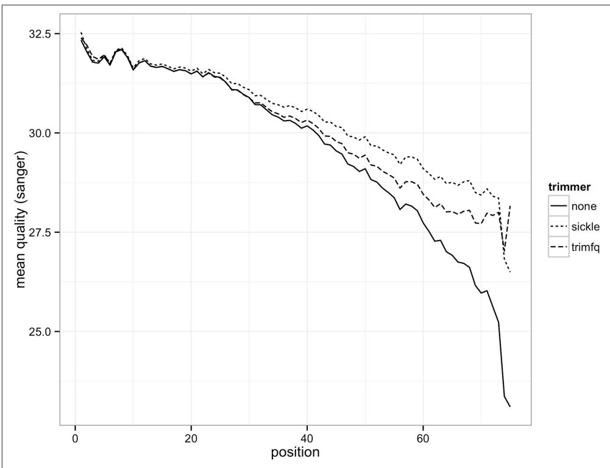
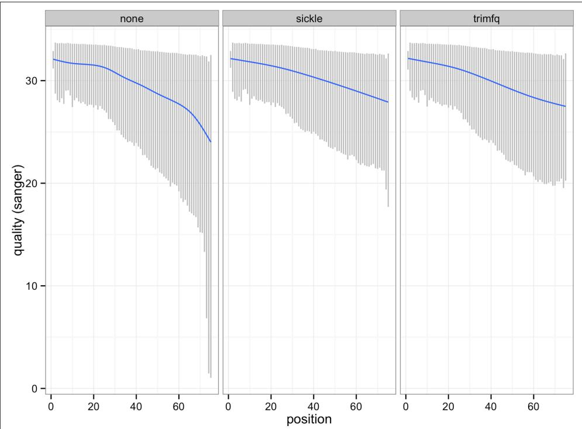

# Working with Sequence Data

One of the core issues of Bioinformatics is dealing with a profusion of (often poorly defined or ambiguous) file formats. Some ad hoc simple human readable formats have over time attained the status of de facto standards. 

—Peter Cock et al. (2010) 

Good programmers know what to write. Great ones know what to rewrite (and reuse). 

— Te Cathedral and the Bazaar Eric 

S. Raymond 

Nucleotide (and protein) sequences are stored in two plain-text formats widespread in bioinformatics: FASTA and FASTQ—pronounced fast-ah (or fast-A) and fast-Q, respectively. We’ll discuss each format and their limitations in this section, and then see some tools for working with data in these formats. This is a short chapter, but one with an important lesson: beware of common pitfalls when working with ad hoc bio‐ informatics formats. Simple mistakes over minor details like file formats can con‐ sume a disproportionate amount of time and energy to discover and fix, so mind these details early on. 

## The FASTA Format

The FASTA format originates from the FASTA alignment suite, created by William R. Pearson and David J. Lipman. The FASTA format is used to store any sort of sequence data not requiring per-base pair quality scores. This includes reference genome files, protein sequences, coding DNA sequences (CDS), transcript sequences, and so on. FASTA can also be used to store multiple alignment data, but we won’t discuss this specialized variant of the format here. We’ve encountered the FASTA format in earlier chapters, but in this section, we’ll cover the format in more detail, look at common pitfalls, and introduce some tools for working with this format. 

FASTA files are composed of sequence entries, each containing two parts: a descrip‐ tion and the sequence data. The description line begins with a greater than symbol (>) and contains the sequence identifier and other (optional) information. The sequence data begins on the next line after the description, and continues until there’s another description line (a line beginning with >) or the file ends. The egfr_fank.fasta file in this chapter’s GitHub directory is an example FASTA file: 

$ head -10 egfr_flank.fasta 

>ENSMUSG00000020122|ENSMUST00000138518 

CCCTCCTATCATGCTGTCAGTGTATCTCTAAATAGCACTCTCAACCCCCGTGAACTTGGT 

TATTAAAAACATGCCCAAAGTCTGGGAGCCAGGGCTGCAGGGAAATACCACAGCCTCAGT 

TCATCAAAACAGTTCATTGCCCAAAATGTTCTCAGCTGCAGCTTTCATGAGGTAACTCCA 

GGGCCCACCTGTTCTCTGGT 

>ENSMUSG00000020122|ENSMUST00000125984 

GAGTCAGGTTGAAGCTGCCCTGAACACTACAGAGAAGAGAGGCCTTGGTGTCCTGTTGTC 

TCCAGAACCCCAATATGTCTTGTGAAGGGCACACAACCCCTCAAAGGGGTGTCACTTCTT 

CTGATCACTTTTGTTACTGTTTACTAACTGATCCTATGAATCACTGTGTCTTCTCAGAGG 

CCGTGAACCACGTCTGCAAT 

The FASTA format’s simplicity and flexibility comes with an unfortunate downside: the FASTA format is a loosely defined ad hoc format (which unfortunately are quite common in bioinformatics). Consequently, you might encounter variations of the FASTA format that can lead to subtle errors unless your programs are robust to these variations. This is why it’s usually preferable to use existing FASTA/FASTQ parsing libraries instead of implementing your own; existing libraries have already been vet‐ ted by the open source community (more on this later). 

Most troubling about the FASTA format is that there’s no universal specification for the format of an identifier in the description. For example, should the following FASTA descriptions refer to the same entry? 

>ENSMUSG00000020122|ENSMUST00000138518 

> ENSMUSG00000020122|ENSMUST00000125984 

>ENSMUSG00000020122|ENSMUST00000125984|epidermal growth factor receptor 

>ENSMUSG00000020122|ENSMUST00000125984|Egfr 

>ENSMUSG00000020122|ENSMUST00000125984|11|ENSFM00410000138465 

Without a standard scheme for identifiers, we can’t use simple exact matching to check if an identifier matches a FASTA entry header line. Instead, we would need to rely on fuzzy matching between FASTA descriptions and our identifier. This could get quite messy quickly: how permissive should our pattern be? Do we run the risk of matching the wrong sequence with too permissive of a regular expression? Funda‐ mentally, fuzzy matching is a fragile strategy. 

Fortunately, there’s a better solution to this problem (and it’s quite simple, too): rather than relying on post-hoc fuzzy matching to correct inconsistent naming, start off with a strict naming convention and be consistent. Then, run any data from outside sources through a few sanity checks to ensure it follows your format. These checks don’t need to be complex (check for duplicate names, inspect some entries by hand, check for errant spaces between the > and the identifier, check the overlap in names between different files, etc.). 

If you need to tidy up outside data, always keep the original file and write a script that writes a corrected version to a new file. This way, the script can be easily rerun on any new version of the original dataset you receive (but you’ll still need to check every‐ thing—don’t blindly trust data!). 

A common naming convention is to split the description line into two parts at the first space: the identifier and the comment. A sequence in this format would look like: 

>gene_00284728 length=231;type=dna GAGAACTGATTCTGTTACCGCAGGGCATTCGGATGTGCTAAGGTAGTAATCCATTATAAGTAACATGCGCGGAATATCCG GAGGTCATAGTCGTAATGCATAATTATTCCCTCCCTCAGAAGGACTCCCTTGCGAGACGCCAATACCAAAGACTTTCGTA GCTGGAACGATTGGACGGCCCAACCGGGGGGAGTCGGCTATACGTCTGATTGCTACGCCTGGACTTCTCTT 

Here gene_00284728 is the identifier, and length=231;type=dna is the comment. Additionally, the ID should be unique. While certainly not a standard, the convention of treating everything before the first space as identifier and everything after as non‐ essential is common in bioinformatics programs (e.g., BEDtools, Samtools, and BWA all do this). With this convention in place, finding a particular sequence by identifier is easy—we’ll see how to do this efficiently with indexed FASTA files at the end of this chapter. 

## The FASTQ Format

The FASTQ format extends FASTA by including a numeric quality score to each base in the sequence. The FASTQ format is widely used to store high-throughput sequenc‐ ing data, which is reported with a per-base quality score indicating the confidence of each base call. Unfortunately like FASTA, FASTQ has variants and pitfalls that can make the seemingly simple format frustrating to work with. 

The FASTQ format looks like: 

```txt
@DJB775P1:248:D0MDGACXX:7:1202:12362:49613 ① TGCTTACTCTGCGTTGATACCACTGCTTAGATCGGAAGAGCACACGTCTGAA + ② JJJJJIIJJJJJHHHHGHFFFFFFCEEEEEDDB?DDDDDBDDDABDDCA ④ @DJB775P1:248:D0MDGACXX:7:1202:12782:49716 CTCTGCGTTGATACCACTGCTTACTCTGCGTTGATACCACTGCTTAGATCGG + IIIIIIIIIIIIIIIHHHHHHFFFFEECCCCBCECCCCCCCCCCCC 
```

The description line, beginning with @. This contains the record identifier and other information. 

Sequence data, which can be on one or many lines. 

The Ins and Outs of Counting FASTA/FASTQ Entries
As plain-text formats, it's easy to work with FASTQ and FASTA with Unix tools. A common command-line bioinformatics idiom is: $grep -c "^>" egfr_flank.fasta$ 5

As shown in "Pipes in Action: Creating Simple Programs with Grep and Pipes" on page 47 you must quote the > character to prevent the shell from interpreting it as a redirection operator (and overwriting your FASTA file!). This is a safe way to count FASTA files because, while the format is loosely defined, every sequence has a one-line description, and only these lines start with >.

We might be tempted to use a similar approach with FASTQ files, using @ instead of >: $grep -c "^@" untreated1_chr4.fq$ 208779

Which tells us untreated1_chr4.fq has 208,779 entries. But by perusing untreated1_chr4.fq, you'll notice that each FASTQ entry takes up four lines, but the total number of lines is: $wc -l untreated1_chr4.fq$ 817420 untreated1_chr4.fq

and 817,420/4 = 204,355 which is quite different from what grep -c gave us! What happened? Remember, @ is a valid quality character, and quality lines can begin with 

The line beginning with +, following the sequence line(s) indicates the end of the sequence. In older FASTQ files, it was common to repeat the description line here, but this is redundant and leads to unnecessarily large FASTQ files. 

④ The quality data, which can also be on one or many lines, but must be the same length as the sequence. Each numeric base quality is encoded with ASCII charac‐ ters using a scheme we’ll discuss later (“Base Qualities” on page 344). 

As with FASTA, it’s a common convention in FASTQ files to split description lines by the first space into two parts: the record identifier and comment. 

FASTQ is deceivingly tricky to parse correctly. A common pitfall is to treat every line that begins with @ as a description line. However, @ is also a valid quality character. FASTQ sequence and quality lines can wrap around to the next line, so it’s possible that a line beginning with @ could be a quality line and not a header line. Conse‐ quently, writing a parser that always treats lines beginning with @ as header lines can lead to fragile and incorrect parsing. However, we can use the fact that the number of quality score characters must be equal to the number of sequence characters to relia‐ bly parse this format—which is how the readfq parser introduced later on works. 

this character. You can use grep "^@" untreated1_chr4.fq | less to see examples of this. 

If you’re absolutely positive your FASTQ file uses four lines per sequence entry, you can estimate the number of sequences by estimating the number of lines with wc -l and dividing by four. If you’re unsure if some of your FASTQ entries wrap across many lines, a more robust way to count sequences is with bioawk: 

```txt
$ bioawk -cfastx 'END{print NR}' untreated1_chr4.fq 204355 
```

## Nucleotide Codes

With the basic FASTA/FASTQ formats covered, let’s look at the standards for encod‐ ing nucleotides and base quality scores in these formats. Clearly, encoding nucleoti‐ des is simple: A, T, C, G represent the nucleotides adenine, thymine, cytosine, and guanine. Lowercase bases are often used to indicate sof masked repeats or low com‐ plexity sequences (by programs like RepeatMasker and Tandem Repeats Finder). Repeats and low-complexity sequences may also be hard masked, where nucleotides are replaced with N (or sometimes an X). 

Degenerate (or ambiguous) nucleotide codes are used to represent two or more bases. For example, N is used to represent any base. The International Union of Pure and Applied Chemistry (IUPAC) has a standardized set of nucleotides, both unambiguous and ambiguous (see Table 10-1). 


Table 10-1. IUPAC nucleotide codes


<table><tr><td>IUPAC code</td><td>Base(s)</td><td>Mnemonic</td></tr><tr><td>A</td><td>Adenine</td><td>Adenine</td></tr><tr><td>T</td><td>Thymine</td><td>Thymine</td></tr><tr><td>C</td><td>Cytosine</td><td>Cytosine</td></tr><tr><td>G</td><td>Guanine</td><td>Guanine</td></tr><tr><td>N</td><td>A, T, C, G</td><td>aNy base</td></tr><tr><td>Y</td><td>C, T</td><td>pYrimidine</td></tr><tr><td>R</td><td>A, G</td><td>puRine</td></tr><tr><td>S</td><td>G, C</td><td>Strong bond</td></tr><tr><td>W</td><td>A, T</td><td>Weak bond</td></tr><tr><td>K</td><td>G, T</td><td>Keto</td></tr><tr><td>M</td><td>A, C</td><td>aMino</td></tr><tr><td>B</td><td>C, G, T</td><td>All bases except A, B follows A</td></tr><tr><td>D</td><td>A, G, T</td><td>All bases except C, D follows C</td></tr><tr><td>H</td><td>A, C, T</td><td>All bases except G, H follows G</td></tr><tr><td>V</td><td>A, C, G</td><td>All bases except T or U (for Uracil), V follows U</td></tr></table>

Some bioinformatics programs may handle ambiguous nucleotide differently. For example, the BWA read alignment tool converts ambiguous nucleotide characters in the reference genome to random bases (Li and Durbin, 2009), but with a random seed set so regenerating the alignment index twice will not lead to two different ver‐ sions. 

## Base Qualities

Each sequence base of a FASTQ entry has a corresponding numeric quality score in the quality line(s). Each base quality scores is encoded as a single ASCII character. Quality lines look like a string of random characters, like the fourth line here: 

@AZ1:233:B390NACCC:2:1203:7689:2153 

GTTGTTCTTGATGAGCCATGAGGAAGGCATGCCAAATTAAAATACTGGTGCGAATTTAAT 

## CCFFFFHHHHHJJJJJEIFJIJIJJJIJIJJJJCDGHIIIGIGIJIJIIIIJIJJIJIIH

## (This FASTQ entry is in this chapter’s README file if you want to follow along.)

Remember, ASCII characters are just represented as integers between 0 and 127 under the hood (see man ascii for more details). Because not all ASCII characters are printable to screen (e.g., character echoing "\07" makes a “ding” noise), qualities are restricted to the printable ASCII characters, ranging from 33 to 126 (the space character, 32, is omitted). 

All programming languages have functions to convert from a character to its decimal ASCII representation, and from ASCII decimal to character. In Python, these are the functions ord() and chr(), respectively. Let’s use ord() in Python’s interactive inter‐ preter to convert the quality characters to a list of ASCII decimal representations: 

>>> qual = "JJJJJJJJJJJJGJJJJJIIJJJJJIGJJJJJIJJJJJJJIJIJJJJHHHHHFFFDFCCC" >>> [ord(b) for b in qual] 

[74, 74, 74, 74, 74, 74, 74, 74, 74, 74, 74, 74, 71, 74, 74, 74, 74, 74, 73, 73, 74, 74, 74, 74, 74, 73, 71, 74, 74, 74, 74, 74, 73, 74, 74, 74, 74, 74, 74, 74, 73, 74, 73, 74, 74, 74, 74, 72, 72, 72, 72, 72, 70, 70, 70, 68, 70, 67, 67, 67] 

Unfortunately, converting these ASCII values to meaningful quality scores can be tricky because there are three different quality schemes: Sanger, Solexa, and Illumina (see Table 10-2). The Open Bioinformatics Foundation (OBF), which is responsible for projects like Biopython, BioPerl, and BioRuby, gives these the names fastqsanger, fastq-solexa, and fastq-illumina. Fortunately, the bioinformatics field has finally seemed to settle on the Sanger encoding (which is the format that the quality line shown here is in), so we’ll step through the conversion process using this scheme. 


Table 10-2. FASTQ quality schemes (adapted from Cock et al., 2010 with permission)


<table><tr><td>Name</td><td>ASCII character range</td><td>Offset</td><td>Quality score type</td><td>Quality score range</td></tr><tr><td>Sanger, Illumina (versions 1.8 onward)</td><td>33–126</td><td>33</td><td>PHRED</td><td>0–93</td></tr><tr><td>Solexa, early Illumina (before 1.3)</td><td>59–126</td><td>64</td><td>Solexa</td><td>5–62</td></tr><tr><td>Illumina (versions 1.3–1.7)</td><td>64–126</td><td>64</td><td>PHRED</td><td>0–62</td></tr></table>

First, we need to subtract an ofset to convert this Sanger quality score to a PHRED quality score. PHRED was an early base caller written by Phil Green, used for fluores‐ cence trace data written by Phil Green. Looking at Table 10-2, notice that the Sanger format’s offset is 33, so we subtract 33 from each quality score: 

```txt
>>> phred = [ord(b)-33 for b in qual]
>>> phred
[41, 41, 41, 41, 41, 41, 41, 41, 41, 41, 41, 38, 41, 41, 41, 41, 40, 40, 41, 41, 41, 41, 40, 38, 41, 41, 41, 41, 40, 41, 41, 41, 41, 41, 41, 40, 40, 41, 40, 41, 41, 41, 39, 39, 39, 39, 37, 37, 37, 35, 37, 34, 34, 34] 
```

Now, with our Sanger quality scores converted to PHRED quality scores, we can apply the following formula to convert quality scores to the estimated probability the base is correct: 

$$
P = 1 0 ^ {- Q / 1 0}
$$

To go from probabilities to qualities, we use the inverse of this function: 

$$
Q = - 1 0 \log_ {1 0} P
$$

In our case, we want the former equation. Applying this to our PHRED quality scores: 

```txt
>>> [10**(-q/10) for q in phred]
[1e-05, 1e-05, 1e-05, 1e-05, 1e-05, 1e-05, 1e-05, 1e-05, 1e-05, 1e-05, 1e-05, 1e-05, 0.0001, 1e-05, 1e-05, 1e-05, 1e-05, 1e-05, 1e-05, 1e-05, 1e-05, 1e-05, 0.0001, 1e-05, 1e-05, 1e-05, 1e-05] 
```

Converting between Illumina (version 1.3 to 1.7) quality data is an identical process, except we use the offset 64 (see Table 10-2). The Solexa conversion is a bit trickier because this scheme doesn’t use the PHRED function that maps quality scores to probabilities. Instead, it uses $Q = ( { { 1 0 ^ { P / 1 0 } } + { 1 } } ) ^ { - 1 }$ . See Cock et al., 2010 for more details about this format. 

## Example: Inspecting and Trimming Low-Quality Bases

Notice how the bases’ accuracies decline in the previous example; this a characteristic error distribution for Illumina sequencing. Essentially, the probability of a base being incorrect increases the further (toward the 3’ end) we are in a read produced by this sequencing technology. This can have a profound impact on downstream analyses! When working with sequencing data, you should always 

• Be aware of your sequencing technology’s error distributions and limitations (e.g., whether it’s affected by GC content) 

• Consider how this might impact your analyses 

All of this is experiment specific, and takes considerable planning. 

Our Python list of base accuracies is useful as a learning tool to see how to convert qualities to probabilities, but it won’t help us much to understand the quality profiles of millions of sequences. In this sense, a picture is worth a thousand words—and there’s software to help us see the quality distributions across bases in reads. The most popular is the Java program FastQC, which is easy to run and outputs useful graphics and quality metrics. If you prefer to work in R, you can use a Bioconductor package called qrqc (written by yours truly). We’ll use qrqc in examples so we can tinker with how we visualize this data ourselves. 

Let’s first install all the necessary programs for this example. First, install qrqc in R with: 

> library(BiocInstaller) 

> biocLite('qrqc') 

Next, let’s install two programs that will allow us to trim low-quality bases: sickle and seqtk. seqtk is a general-purpose sequence toolkit written by Heng Li that con‐ tains a subcommand for trimming low-quality bases off the end of sequences (in addition to many other useful functions). Both sickle and seqtk are easily installa‐ ble on Mac OS X with Homebrew (e.g., with brew install seqtk and brew install sickle). 

After getting these programs installed, let’s trim the untreated1_chr4.fq FASTQ file in this chapter’s directory in the GitHub repository. This FASTQ file was generated from the untreated1_chr4.bam BAM file in the pasillaBamSubset Bioconductor package (see the README file in this chapter’s directory for more information). To keep things simple, we’ll use each program’s default settings. Starting with sickle: 

```shell
$ sickle se -f untreated1_chr4.fq -t sanger -o untreated1_chr4_sickle.fq 
```

```txt
FastQ records kept: 202866
FastQ records discarded: 1489 
```

sickle takes an input file through -f, a quality type through -t, and trimmed output file with -o. 

Now, let’s run seqtk trimfq, which takes a single argument and outputs trimmed sequences through standard out: 

```txt
$ seqtk trimfq untreated1_chr4.fq > untreated1_chr4_trimfq.fq 
```

Let’s compare these results in R. We’ll use qrqc to collect the distributions of quality by position in these files, and then visualize these using ggplot2. We could load these in one at a time, but a nice workflow is to automate this with lapply(): 

```r
# trim_qual.R -- explore base qualities before and after trimming
library(qrqc)

# FASTQ files
fqfiles <- c(none="untreated1_chr4.fq",
    sickle="untreated1_chr4_sickle.fq",
    trimfq="untreated1_chr4_trimfq.fq")

# Load each file in, using qrqc's readSeqFile
# We only need qualities, so we turn off some of
# readSeqFile's other features.
seq_info <- lapply(fqfiles, function(file) {
    readSeqFile(file, hash=FALSE, kmer=FALSE)
})

# Extract the qualities as dataframe, and append
# a column of which trimmer (or none) was used. This
# is used in later plots.
quals <- mapply(function(sfq, name) {
    qs <- getQual(sfq)
    qs$trimmer <- name
    qs
}, seq_info, names(fqfiles), SIMPLIFY=FALSE) 
```

```r
# Combine separate dataframes in a list into single dataframe
d <- do.call(rbind, quals)

# Visualize qualities
p1 <- ggplot(d) + geom_line(aes(x=position, y=mean, linetype=trimmer))
p1 <- p1 + ylab("mean quality (sanger)") + theme_bw()
print(p1)

# Use qrqc's qualPlot with list produces panel plots
# Only shows 10% to 90% quantiles and lowess curve
p2 <- qualPlot(seq_info, quartile.color=NULL, mean.color=NULL) + theme_bw()
p2 <- p2 + scale_y_continuous("quality (sanger)")
print(p2) 
```

This script produces two plots: Figures 10-1 and 10-2. We see the effect both trim‐ ming programs have on our data’s quality distributions in Figure 10-2: by trimming low-quality bases, we narrow the quality ranges in base positions further in the read. In Figure 10-1, we see this increases mean quality across across the read, but we still see a decline in base quality over the length of the reads. 




Figure 10-1. Mean base quality by position in the read with no trimming, with sickle and with seqtk trimfq





Figure 10-2. 10% to 90% quality range for each base position, with lowess curve for reads with no trimming, with sickle and with seqtk trimfq


In one line, we can trim low-quality bases from the ends of these sequences—running the trimming commands is not difficult. The more important step is to visualize what these trimming programs did to our data by comparing the files before and after trimming. Checking how programs change our data rather than trusting they did the right thing is an essential part of robust bioinformatics and abides by the Golden Rule (don’t trust your tools). In this example, checking a small subset of data took fewer than 20 lines of code (ignoring blank lines and comments that improve readability) and only a few extra minutes—but it gives us valuable insight in what these programs do to our data and how they differ. If we like, we could also run both quality trim‐ ming programs with numerous different settings and compare how these affect our results. Much of careful bioinformatics is this process: run a program, compare out‐ put to original data, run a program, compare output, and so on. 

## A FASTA/FASTQ Parsing Example: Counting Nucleotides

It’s not too difficult to write your own FASTA/FASTQ parser and it’s a useful educa‐ tional programming exercise. But when it comes to using a parser for processing real data, it’s best to use a reliable existing library. Remember the quote at the beginning of this chapter: great programmers know when to reuse code. There are numerous open source, freely available, reliable parsers that have already been vetted by the open source community and tuned to be as fast as possible. We’ll use Heng Li’s readfq implementation because it parses both FASTA and FASTQ files, it’s simple to use, and is standalone (meaning it doesn’t require installing any dependencies). Biopython and BioPerl are two popular libraries with good alternative FASTA/FASTQ parsers. 

We’ll use the Python implementation of readfq, readfq.py. You can obtain this Python file by downloading it from GitHub (there’s also a copy included in this book’s reposi‐ tory). Although we could include readfq.py’s FASTA/FASTQ parsing routine using from readfq import readfq, for single file scripts it’s simpler to just copy and paste the routine into your script. In this book, we’ll use from readfq import readfq to avoid taking up space in examples. 

readfq’s readfq() function is simple to use. readfq() takes a file object (e.g., a file‐ name that’s been opened with open('filename.fa') or sys.stdin) and will generate FASTQ/FASTA entries until it reaches the end of the file or stream. Each FASTQ/ FASTA entry is returned by readfq() as a tuple containing that entry’s description, sequence, and quality. If readfq is reading a FASTA file, the quality line will be None. That’s all there is to reading FASTQ/FASTA lines with readfq(). 


If you dig into readfq()’s code, you’ll notice a yield statement. This is a hint that readfq() is a generator function. If you’re not familiar with Python’s generators, you might want to read up on these at some point (though you don’t need a detailed knowledge of these to use readfq()). I’ve included some resources in this chap‐ ter’s README file on GitHub. 

Let’s write a simple program that counts the number of each IUPAC nucleotide in a file: 

```python
#!/usr/bin/env python
# nucount.py -- tally nucleotides in a file
import sys
from collections import Counter ①
from readfq import readfq

IUPAC_BASES = "ACGTRYSWKMBDHVN-." ②

# initialize counter
counts = Counter() ③

for name, seq, qual in readfq(sys.stdin): ④
    # for each sequence entry, add all its bases to the counter counts.update(seq.upper()) ⑤ 
```

```python
# print the results
for base in IUPAC_BASES:
    print base + "\t" + str(counts[base]) ⑥ 
```

We use Counter in the collections module to count nucleotides. Counter works much like a Python dict (technically it’s a subclass of dict), with added features that make counting items easier. 

② This global variable defines all IUPAC nucleotides, which we’ll use later to print bases in a consistent order (because like Python’s dictionaries, Counter objects don’t maintain order). It’s a good practice to put constant variables like IUPAC_BASES in uppercase, and at the top of a script so they’re clear to readers. 

Create a new Counter object. 

④ This line uses the readfq function in the readfq module to read FASTQ/FASTQ entries from the file handle argument (in this case, sys.stdin, standard in) into the name, seq, and qual variables (through a Python feature known as tuple unpacking). 

⑤ The Counter.update() method takes any iterable object (in this case the string of sequence bases), and adds them to the counter. We could have also used a for loop over each character in seq, incrementing counts with counts[seq.upper()] += 1. Note that we convert all characters to uppercase with the upper() method, so that lowercase soft-masked bases are also counted. 

Finally, we iterate over all IUPAC bases and print their counts. 

This version takes input through standard in, so after saving this file and adding exe‐ cute permissions with chmod +x nuccount.py, we could run it with: 

```csv
$ cat contam.fastq | ./nuccount.py
A 103
C 110
G 94
T 109
R 0
Y 0
S 0
W 0
K 0
M 0
B 0
D 0
H 0
V 0
N 0 
```

Note that we don’t necessarily have to make the Python script executable; another option is to simply launch it with python nuccount.py. Either way leads to the same result, so this is ultimately a stylistic choice. But if you do want to make it an exe‐ cutable script, remember to do the following: 

• Include the shebang line #!/usr/bin/env python 

• Make the script executable with chmod +x <scriptname.py> 

There are many improvements we could add to this script: add support for persequence base composition statistics, take file arguments rather than input through standard in, count soft-masked (lowercase) characters, count CpG sites, or warn when a non-IUPAC nucleotide is found in a file. Counting nucleotides is simple—the most complex part of the script is readfq(). This is the beauty of reusing code: wellwritten functions and libraries prevent us from having to rewrite complex parsers. Instead, we use software the broader community has collaboratively developed, tes‐ ted, debugged, and made more efficient (see readfq’s GitHub commit history as an example). Reusing software isn’t cheating—it’s how the experts program. 

## Indexed FASTA Files

Very often we need efficient random access to subsequences of a FASTA file (given regions). At first glance, writing a script to do this doesn’t seem difficult. We could, for example, write a script that iterates through FASTA entries, extracting sequences that overlaps the range specified. However, this is not an efficient method when extracting a few random subsequences. To see why, consider accessing the sequence from position chromosome 8 (123,407,082 to 123,410,742) from the mouse genome. This approach would needlessly parse and load chromosomes 1 through 7 into mem‐ ory, even though we don’t need to extract subsequences from these chromosomes. Reading entire chromosomes from disk and copying them into memory can be quite inefficient—we would have to load all 125 megabytes of chromosome 8 to extract 3.6kb! Extracting numerous random subsequences from a FASTA file can be quite computationally costly. 

A common computational strategy that allows for easy and fast random access is indexing the file. Indexed files are ubiquitous in bioinformatics; in future chapters, we’ll index genomes so they can be used as an alignment reference and we’ll index files containing aligned reads for fast random access. In this section, we’ll look at how indexed FASTA files allow us to quickly and easily extract subsequences. Usually, we often index an entire genome but to simplify the examples in the rest of this chapter, we will work with only chromosome 8 of the mouse genome. Download the 

Mus_musculus.GRCm38.75.dna.chromosome.8.fa.gz file from this chapter’s GitHub directory and unzip it with gunzip. 


## Indexing Compressed FASTA Files

Although samtools faidx does work with compressed FASTA files, it only works with BGZF-compressed files (a more advanced topic, which we’ll cover in “Fast Access to Indexed Tab-Delimited Files with BGZF and Tabix” on page 425). 

We’ll index this file using Samtools, a popular suite of tools for manipulating the SAM and BAM alignment formats (which we’ll cover in much detail in Chapter 11). You can install samtools via a ports or packages manager (e.g., Mac OS X’s Hombrew or Ubuntu’s apt-get). Much like Git, Samtools uses subcommands to do different things. First, we need to index our FASTA file using the faidx subcommand: 

$ samtools faidx Mus_musculus.GRCm38.75.dna.chromosome.8.fa 

This creates an index file named Mus_musculus.GRCm38.75.dna.chromosome.8.fa.fai. We don’t have to worry about the specifics of this index file when extracting subse‐ quences—samtools faidx takes care of these details. To access the subsequence for a particular region, we use samtools faidx <in.fa> <region>, where <in.fa> is the FASTA file (you’ve just indexed) and <region> is in the format chromosome:startend. For example: 

$ samtools faidx Mus_musculus.GRCm38.75.dna.chromosome.8.fa 8:123407082-123410744 >8:123407082-123410744 GAGAAAAGCTCCCTTCTTCTCCAGAGTCCCGTCTACCCTGGCTTGGCGAGGGAAAGGAAC CAGACATATATCAGAGGCAAGTAACCAAGAAGTCTGGAGGTGTTGAGTTTAGGCATGTCT [...] 

Be sure to mind differences in chromosome syntax (e.g., UCSC’s chr8 format versus Ensembl’s 8). If no sequence is returned from samtools faidx, this could be why. 

samtools faidx allows for multiple regions at once, so we could do: 

$ samtools faidx Mus_musculus.GRCm38.75.dna.chromosome.8.fa \ 8:123407082-123410744 8:123518835-123536649 >8:123407082-123410744 GAGAAAAGCTCCCTTCTTCTCCAGAGTCCCGTCTACCCTGGCTTGGCGAGGGAAAGGAAC CAGACATATATCAGAGGCAAGTAACCAAGAAGTCTGGAGGTGTTGAGTTTAGGCATGTCT [...] >8:123518835-123536649 TCTCGCGAGGATTTGAGAACCAGCACGGGATCTAGTCGGAGTTGCCAGGAGACCGCGCAG CCTCCTCTGACCAGCGCCCATCCCGGATTAGTGGAAGTGCTGGACTGCTGGCACCATGGT [...] 

## What Makes Accessing Indexed Files Faster?

In Chapter 3 (see “The Almighty Unix Pipe: Speed and Beauty in One” on page 45), we discussed how reading from and writing to the disk is exceptionally slow com‐ pared to data kept in memory. We can avoid needlessly reading the entire file off of the disk by using an index that points to where certain blocks are in the file. In the case of our FASTA file, the index essentially stores the location of where each sequence begins in the file (as well as other necessary information). 

When we look up a range like chromosome 8 (123,407,082-123,410,744), samtools faidx uses the information in the index to quickly calculate exactly where in the file those bases are. Then, using an operation called a file seek, the program jumps to this exact position (called the ofset) in the file and starts reading the sequence. Having precomputed file offsets combined with the ability to jump to these exact positions is what makes accessing sections of an indexed file fast.