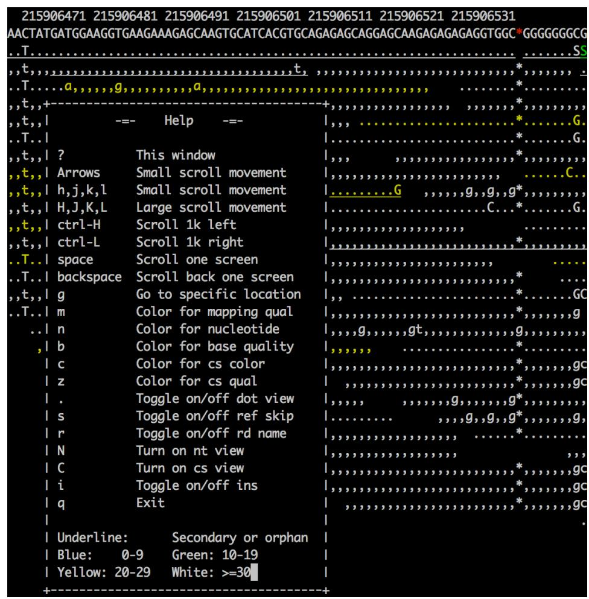
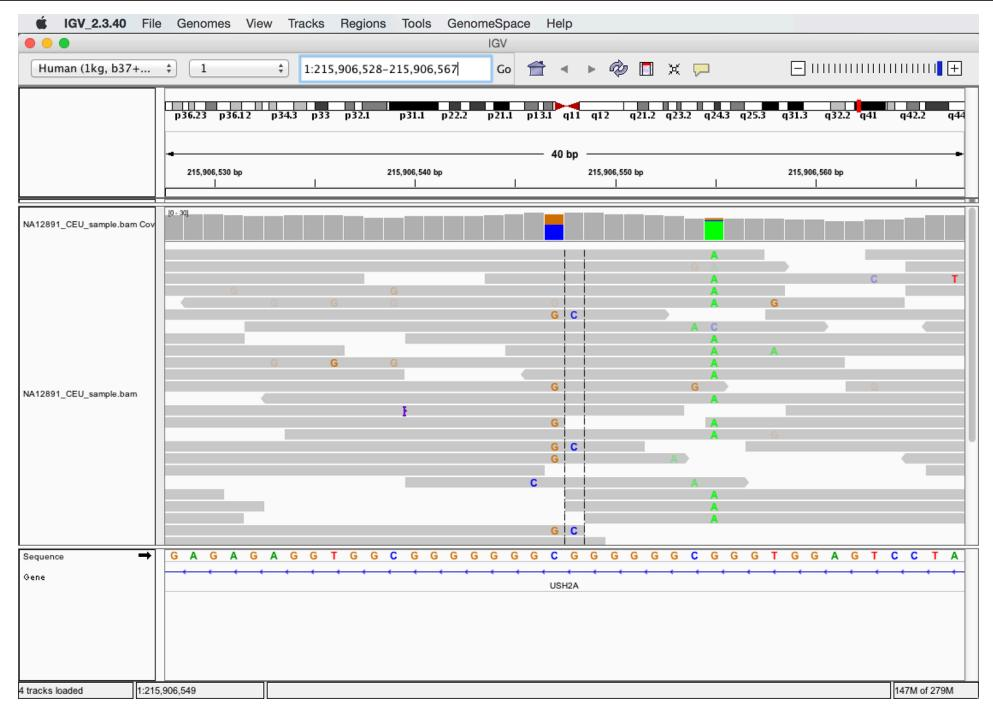
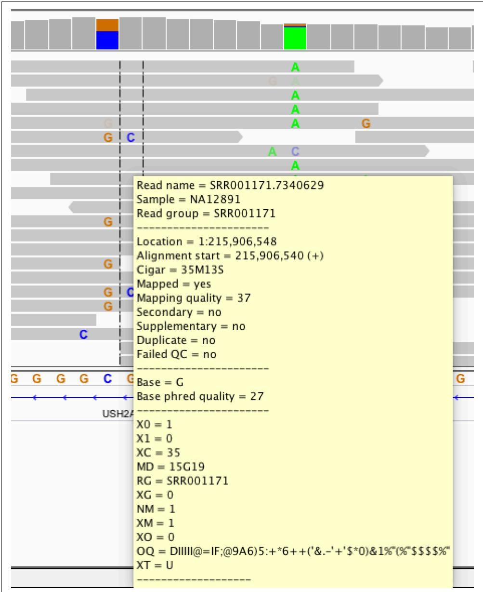

# Working with Alignment Data

In Chapter 9, we learned about range formats such as BED and GTF, which are often used to store genomic range data associated with genomic feature annotation data such as gene models. Other kinds of range-based formats are designed for storing large amounts of alignment data—for example, the results of aligning millions (or bil‐ lions) of high-throughput sequencing reads to a genome. In this chapter, we’ll look at the most common high-throughput data alignment format: the Sequence Alignment/ Mapping (SAM) format for mapping data (and its binary analog, BAM). The SAM and BAM formats are the standard formats for storing sequencing reads mapped to a reference. 

We study SAM and BAM for two reasons. First, a huge part of bioinformatics work is manipulating alignment files. Nearly every high-throughput sequencing experiment involves an alignment step that produces alignment data in the SAM/BAM formats. Because each sequencing read has an alignment entry, alignment data files are mas‐ sive and require space-efficient complex binary file formats. Furthermore, modern aligners output an incredible amount of useful information about each alignment. It’s vital to have the skills necessary to extract this information and explore data kept in these complex formats. 

Second, the skills developed through learning to work with SAM/BAM files are extensible and more widely applicable than to these specific formats. It would be unwise to bet that these formats won’t change (or even be replaced at some point)— the field of bioinformatics is notorious for inventing new data formats (the same goes with computing in general, see xkcd’s “Standards” comic). Some groups are already switching to storing alignments in CRAM format, a closely related alignment data format we’ll also discuss. So while learning how to work with specific bioinformatics formats may seem like a lost cause, skills such as following a format specification, manipulating binary files, extracting information from bitflags, and working with application programming interfaces (APIs) are essential skills when working with any format. 

## Getting to Know Alignment Formats: SAM and BAM

Before learning to work with SAM/BAM, we need to understand the structure of these formats. We’ll do this by using celegans.sam, a small example SAM file included in this chapter’s directory in the GitHub repository. 


The celegans.sam file was created by aligning reads simulated directly from the C. elegans genome (version WBcel235) using the wgsim read simulator. These reads differ slightly from the reference genome through simulated mutations and base errors. Simulating reads, realigning back to the reference, and calling SNPs is a very useful exercise in understanding the limitations of aligners and SNP callers; I encourage you to try this on your own. See the docu‐ mentation in this chapter’s directory on GitHub for more informa‐ tion on how these reads were simulated and why this is a useful exercise. 

We’ll step through the basic ideas of the SAM/BAM format, but note that as with any well-specified bioinformatics format, the ultimate reference is the original format specification and documentation, which is available on GitHub. The original SAM Format paper (Li et al., 2009) is also a good introduction. 

## The SAM Header

Files in the SAM format consist of a header section and an alignment section. Because SAM files are plain text (unlike their binary counterpart, BAM), we can take a peek at a few lines of the header with head: 

```txt
$ head -n 10 celegans.sam
@SQ SN:I LN:15072434 ①
@SQ SN:II LN:15279421
@SQ SN:III LN:13783801
@SQ SN:IV LN:17493829
@SQ SN:MtDNA LN:13794
@SQ SN:V LN:20924180
@SQ SN:X LN:17718942
@RG ID:VB00023_L001 SM:celegans-01 ②
@PG ID:bwa PN:bwa VN:0.7.10-r789 [...] ③
I_2011868_2012306_0:0:0_0:0:0_2489 83 I 2012257 40 50M [...] ④ 
```

Header lines contain vital metadata about the reference sequences, read and sample information, and (optionally) processing steps and comments. Each header line begins with an @, followed by a two-letter code that distinguishes the different type of metadata records in the header. Following this two-letter code are tab-delimited keyvalue pairs in the format KEY:VALUE (the SAM format specification names these tags and values). The celegans.sam file contains the most common header records types you’ll encounter in SAM/BAM files. Let’s step through some of the header compo‐ nents in more detail: 

① @SQ header entries store information about the reference sequences (e.g., the chromosomes if you’ve aligned to a reference genome). The required key-values are SN, which stores the sequence name (e.g., the C. elegans chromosome I), and LN, which stores the sequence length (e.g., 15,072,434 bases). All separate sequen‐ ces in your reference have a corresponding entry in the header. 

② @RG header entries contain important read group and sample metadata. The read group identifier ID is required and must be unique. This ID value contains infor‐ mation about the origin of a set of reads. Some software relies on read groups to indicate a technical groups of reads, to account for batch efects (undesirable technical artifacts in data). Consequently, it’s beneficial to create read groups related to the specific sequencing run (e.g., ID could be related to the name of the sequencing run and lane). 

Although ID is the only required key in @RG headers, in practice your SAM/BAM files should also keep track of sample information using the SM key. Sample infor‐ mation is the metadata about your experiment’s samples (e.g., individual, treat‐ ment group, replicate, etc.). Finally, it’s worth noting that the SAM format specification also allows a PL key for indicating sequencing platform such as ILLUMINA, PACBIO, and so on. (See the specification for a full list of valid values.) Read group, sample, and platform information should be added to your SAM/BAM during alignment (and aligners have options for this). 

@PG header entries contain metadata about the programs used to create and pro‐ cess a set of SAM/BAM files. Each program must have a unique ID value, and metadata such as program version number (via the VN key) and the exact com‐ mand line (via the CL key) can be saved in these header entries. Many programs will add these lines automatically. 

This is the first line of the alignment section (because this line does not begin with @). We’ll cover the alignment section in more detail in the following section. 

This is just an introduction to the basics of the SAM format’s header section; see the SAM format specification for more detail. 


## Read Groups

One of the best features of the SAM/BAM format is that it supports including an extensive amount of metadata about the samples, the alignment reference, processing steps, etc. to be included within the file. (Note that in contrast, the FASTQ format doesn’t provide a standard way to include this metadata; in practice, we use file‐ names to connect metadata kept in a separate spreadsheet or tabdelimited file.) Many downstream applications make use of the metadata contained in the SAM header (and many programs require it). Given that this metadata is important (and often required), you should add read group and sample metadata when you align reads to a reference. 

Luckily, most aligners allow you to specify this important metadata through your alignment command. For example, BWA allows (using made-up files in this example): 

```powershell
$ bwa mem -R'@RG\tID:readgroup_id\tSM:sample_id' ref.fa in.fq 
```

Bowtie2 similarly allows read group and sample information to be set with the --rg-id and --rg options. 

Although head works to take a quick peek at the top of a SAM file, keep the following points in mind: 

• head won’t always provide the entire header. 

• It won’t work with binary BAM files. 

The standard way of interacting with SAM/BAM files is through the SAMtools command-line program (samtools), which we’ll use extensively throughout the rest of this chapter. Like Git, samtools has many subcommands. samtools view is the general tool for viewing and converting SAM/BAM files. A universal way to look at an entire SAM/BAM header is with samtools view option -H: 

```txt
$ samtools view -H celegans.sam
@SQ SN:I LN:15072434
@SQ SN:II LN:15279421
@SQ SN:III LN:13783801
[...] 
```

This also works with BAM files, without any need to convert beforehand (samtools automatically detects whether the file is SAM or BAM): 

```txt
$ samtools view -H celegans.bam
@SQ SN:I LN:15072434
@SQ SN:II LN:15279421
@SQ SN:III LN:13783801
[...] 
```

Of course, all our usual Unix tricks can be combined with samtools commands through piping results to other commands. For example, we could see all read groups with: 

```txt
$ samtools view -H celegans.bam | grep "^@RG"
@RG ID:VB00023_L001 SM:celegans-01 
```

samtools view without any arguments returns the entire alignment section without the header: 

```powershell
$ samtools view celegans.sam | head -n 1
I_2011868_2012306_0:0:0_0:0:0_2489 83 I 2012257 40 50M 
```

## The SAM Alignment Section

The alignment section contains read alignments (and usually includes reads that did not align, but this depends on the aligner and file). Each alignment entry is composed of 11 required fields (and optional fields after this). 


We’ll step through the basic structure of an alignment entry, but it would be unnecessarily redundant to include all information in the original SAM format specification in this section. I highly recom‐ mend reading the alignment section of the SAM format specifica‐ tion for more detail. 

Let’s step through an alignment entry’s fields. Because these alignment lines are quite lengthy and would overflow the width of this page, I use tr to convert tabs to new‐ lines for a single alignment entry in celegans.sam: 

```powershell
$ samtools view celegans.sam | tr '\t' '\n' | head -n 11
I_2011868_2012306_0:0:0:0:0:0:2489 ①
83 ②
I ③
2012257 ④
40 ⑤
50M ⑥
= ⑦
2011868
-439 ⑧
CAAAAAATTTTGAAAAAAAAATTGAATAAAATTCACGGATTTCTGGCT ⑨
222222222222222222222222222222222222222222222 
```

QNAME, the query name (e.g., a sequence read’s name). 

FLAG, the bitwise fag, which contains information about the alignment. Bitwise flags are discussed in “Bitwise Flags” on page 360 in much more detail. 

RNAME, the reference name (e.g., which sequence the query aligned to, such as a specific chromosome name like “chr1”). The reference name must be in the SAM/BAM header as an SQ entry. If the read is unaligned, this entry may be *. 

POS, the position on the reference sequence (using 1-based indexing) of the first mapping base (leftmost) in the query sequence. This may be zero if the read does not align. 

⑤ MAPQ is the mapping quality, which is a measure of how likely the read is to actually originate from the position it maps to. Mapping quality is estimated by the aligner (and beware that different aligners have different estimation proce‐ dures!). Many tools downstream of aligners filter out reads that map with low mapping quality (because a low mapping quality score indicates the alignment program is not confident about the alignment’s position). Mapping qualities are an incredibly important topic that we’ll discuss in more depth later. Mapping quality is discussed in more depth in “Mapping Qualities” on page 365. 

CIGAR is the CIGAR string, which is a specialized format for describing the align‐ ment (e.g., matching bases, insertions/deletions, clipping, etc.). We discuss CIGAR strings in much more detail in “CIGAR Strings” on page 363. 

7 RNEXT and PNEXT (on the next line) are the reference name and position (the R and P in RNEXT and PNEXT) of a paired-end read’s partner. The value * indicates RNEXT is not available, and = indicates that RNEXT is the same as RNAME. PNEXT will be 0 when not available. 

TLEN is the template length for paired-end reads. 

0 SEQ stores the original read sequence. This sequence will always be in the orienta‐ tion it aligned in (and this may be the reverse complement of the original read sequence). Thus, if your read aligned to the reverse strand (which is information kept in the bitwise flag field), this sequence will be the reverse complement. 

QUAL stores the original read base quality (in the same format as Sanger FASTQ files). 

## Bitwise Flags

Many important pieces of information about an alignment are encoded using bitwise fags (also known as a bit feld). There’s a lot of important information encoded in SAM/BAM bitwise flags, so it’s essential you understand how these work. Further‐ more, bitwise flags are a very space-efficient and common way to encode attributes, so they’re worth understanding because you’re very likely to encounter them in other formats. 

Bitwise flags are much like a series of toggle switches, each of which can be either on or off. Each switch represents whether a particular attribute of an alignment is true or false, such as whether a read is unmapped, is paired-end, or whether it aligned in the reverse orientation. Table 11-1 shows these bitwise flags and the attributes they encode, but the most up-to-date source will be the SAM format specification or the samtools flag command: 

## $ samtools flags

About: Convert between textual and numeric flag representation Usage: samtools flags INT|STR[,...] 

```txt
Flags:
0x1 PAIRED .. paired-end (or multiple-segment) sequencing technology
0x2 PROPER_PAIR .. each segment properly aligned according to the aligner
0x4 UNMAP .. segment unmapped
[...] 
```

Under the hood, each of these toggle switches’ values are bits (0 or 1) of a binary number (the base-2 system of computing that uses 0s and 1s). Each bit in a bitfield represents a particular attribute about an alignment, with 1 indicating that the attribute is true and 0 indicating it’s false. 


Table 11-1. SAM bitwise fags


<table><tr><td>Flag (in hexadecimal)</td><td>Meaning</td></tr><tr><td>0x1</td><td>Paired-end sequence (or multiple-segment, as in strobe sequencing)</td></tr><tr><td>0x2</td><td>Aligned in proper pair (according to the aligner)</td></tr><tr><td>0x4</td><td>Unmapped</td></tr><tr><td>0x8</td><td>Mate pair unmapped (or next segment, if multiple-segment)</td></tr><tr><td>0x10</td><td>Sequence is reverse complemented</td></tr><tr><td>0x20</td><td>Sequence of mate pair is reversed</td></tr><tr><td>0x40</td><td>The first read in the pair (or segment, if multiple-segment)</td></tr><tr><td>0x80</td><td>The second read in the pair (or segment, if multiple-segment)</td></tr><tr><td>0x100</td><td>Secondary alignment</td></tr><tr><td>0x200</td><td>QC failure</td></tr><tr><td>0x400</td><td>PCR or optical duplicate</td></tr><tr><td>0x800</td><td>Supplementary alignment</td></tr></table>

As an example, suppose you encounter the bitflag 147 (0x93 in hexidecimal) and you want to know what this says about this alignment. In binary this number is repre‐ sented as 0x1001 0011 (the space is used to make this more readable). We see that the first, second, fifth, and eighth bits are 1 (in our switch analogy, these are the switches that are turned on). These specific bits correspond to the hexidecimal values 0x1, 0x2, 0x10, and 0x80. Looking at Table 11-1, we see these hexidecimal values correspond to the attributes paired-end, aligned in proper pair, the sequence is reverse complemen‐ ted, and that this is the second read in the pair—which describes how our read aligned. 


## Converting between Binary, Hexadecimal, and Decimal

I won’t cover the details of converting between binary, hexadeci‐ mal, and decimal number systems because the command samtools flags can translate bitflags for us. But if you continue to dig deeper into computing, it’s a handy and necessary skill. I’ve included some supplementary resources in the GitHub repository’s README file for this chapter. Many calculators, such as the OS X calculator in “programmer” mode will also convert these values for you. 

Working through this each time would be quite tedious, so the samtools command contains the subcommand samtools flags, which can translate decimal and hexi‐ decimal flags: 

```txt
$ samtools flags 147
0x93 147 PAIRED,PROPER_PAIR,REVERSE,READ2
$ samtools flags 0x93
0x93 147 PAIRED,PROPER_PAIR,REVERSE,READ2 
```

samtools flags can also convert attributes (of the prespecified list given by running samtools flags without arguments) to hexidecimal and decimal flags: 

```txt
$ samtools flags paired,read1,qcfail 0x241 577 PAIRED,READ1,QCFAIL 
```

Later on, we’ll see how PySAM simplifies this through an interface where properties about an alignment are stored as attributes of an AlignedSegment Python object, which allows for easier checking of bitflag values with a syntax like aln.is_proper_pair or aln.is_reverse. 

## CIGAR Strings

Like bitwise flags, SAM’s CIGAR strings are another specialized way to encode infor‐ mation about an aligned sequence. While bitwise flags store true/false properties about an alignment, CIGAR strings encode information about which bases of an alignment are matches/mismatches, insertions, deletions, soft or hard clipped, and so on. I’ll assume you are familiar with the idea of matches, mismatches, insertions, and deletions, but it’s worth describing soft and hard clipping (as SAM uses them). 

Soft clipping is when only part of the query sequence is aligned to the reference, leav‐ ing some portion of the query sequence unaligned. Soft clipping occurs when an aligner can partially map a read to a location, but the head or tail of the query sequence doesn’t match (or the alignment at the end of the sequence is questionable). Hard clipping is similar, but hard-clipped regions are not present in the sequence stored in the SAM field SEQ. A basic CIGAR string contains concatenated pairs of integer lengths and character operations (see Table 11-2 for a table of these opera‐ tions). 


Table 11-2. CIGAR operations


<table><tr><td>Operation</td><td>Value</td><td>Description</td></tr><tr><td>M</td><td>0</td><td>Alignment match (note that this could be a sequence match or mismatch!)</td></tr><tr><td>I</td><td>1</td><td>Insertion (to reference)</td></tr><tr><td>D</td><td>2</td><td>Deletion (from reference)</td></tr><tr><td>N</td><td>3</td><td>Skipped region (from reference)</td></tr><tr><td>S</td><td>4</td><td>Soft-clipped region (soft-clipped regions are present in sequence in SEQ field)</td></tr><tr><td>H</td><td>5</td><td>Hard-clipped region (not in sequence in SEQ field)</td></tr><tr><td>P</td><td>6</td><td>Padding (see section 3.1 of the SAM format specification for detail)</td></tr><tr><td>=</td><td>7</td><td>Sequence match</td></tr><tr><td>X</td><td>8</td><td>Sequence mismatch</td></tr></table>

For example, a fully aligned 51 base pair read without insertions or deletions would have a CIGAR string containing a single length/operation pair: 51M. By the SAM for‐ mat specification, M means there’s an alignment match, not that all bases in the query and reference sequence are identical (it’s a common mistake to assume this!). 


## Sequence Matches and Mismatches, and the NM and MD Tags

It’s important to remember that the SAM format specification sim‐ ply lists what’s possible with the format. Along these lines, aligners choose how to output their results in this format, and there are dif‐ ferences among aligners in how they use the CIGAR string (and other parts of the SAM format). It’s common for many aligners to forgo using = and X to indicate sequence matches and mismatches, and instead just report these as M. 

However, this isn’t as bad as it sounds—many aligners have differ‐ ent goals (e.g., general read mapping, splicing-aware aligning, aligning longer reads to find chromosomal breakpoints). These tasks don’t require the same level of detail about the alignment, so in some cases explicitly reporting matches and mismatches with = and X would lead to needlessly complicated CIGAR strings. 

Also, much of the information that = and X convey can be found in optional SAM tags that many aligners can include in their output. The NM tag is an integer that represents the edit distance between the aligned portion (which excludes clipped regions) and the refer‐ ence. Additionally, the MD tag encodes mismatching positions from the reference (and the reference’s sequence at mismatching posi‐ tions). See the SAM format specification for more detail. If your BAM file doesn’t have the NM and MD tags, samtools calmd can add them for you. 

Let’s look at a trickier example: 43S6M1I26M. First, let’s break this down into pairs: 43S, 6M, 1I, and 26M. Using Table 11-2, we see this CIGAR string tells us that the first 43 bases were soft clipped, the next 6 were matches/mismatches, then a 1 base pair inser‐ tion to the reference, and finally, 26 matches. The SAM format specification mandates that all M, I, S, =, and X operations’ lengths must add to the length of the sequence. We can validate that’s the case here: 43 + 6 + 1 + 26 = 76, which is the length of the sequence in this SAM entry. 

## Mapping Qualities

Our discussion of the SAM and BAM formats is not complete without mentioning mapping qualities (Li et al., 2008). Mapping qualities are one of the most important diagnostics in alignment. All steps downstream of alignment in all bioinformatics projects (e.g., SNP calling and genotyping, RNA-seq, etc.) critically depend on relia‐ ble mapping. Mapping qualities quantify mapping reliability by estimating how likely a read is to actually originate from the position the aligner has mapped it to. Similar to base quality, mapping quality is a log probability given by $Q = - 1 0 \ l o g _ { I 0 } P ( i n c o r r e c t$ mapping position). For example, a mapping quality of 20 translates to a $1 0 ^ { ( 2 0 / - I 0 ) } = 1 \%$ chance the alignment is incorrect. 

The idea of mapping quality is also related to the idea of mapping uniqueness. This is often defined as when a read’s second best hit has more mismatches than its first hit. However, this concept of uniqueness doesn’t account for the base qualities of mis‐ matches, which carry a lot of information about whether a mismatch is due to a base calling error or a true variant (Li et al., 2008). Mapping quality estimates do account for base qualities of mismatches, which makes them a far better metric for measuring mapping uniqueness (as well as general mapping reliability). 

We can use mapping qualities to filter out likely incorrect alignments (which we can do with samtools view, which we’ll learn about later), find regions where mapping quality is unusually low among most alignments (perhaps in repetitive or paralogous regions), or assess genome-wide mapping quality distributions (which could indicate alignment problems in highly repetitive or polyploid genomes). 

## Command-Line Tools for Working with Alignments in the SAM Format

In this section, we’ll learn about the Samtools suite of tools for manipulating and working with SAM, BAM, and CRAM files. These tools are incredibly powerful, and becoming skilled in working with these tools will allow you to both quickly move for‐ ward in file-processing tasks and explore the data in alignment files. All commands are well documented both online (see the Samtools website) and in the programs themselves (run a program without arguments or use --help for more information). 

## Using samtools view to Convert between SAM and BAM

Many samtools subcommands such as sort, index, depth, and mpileup all require input files (or streams) to be in BAM format for efficiency, so we often need to con‐ vert between plain-text SAM and binary BAM formats. samtools view allows us to convert SAM to BAM with the -b option: 

$ samtools view -b celegans.sam > celegans_copy.bam 

Similarly, we can go from BAM to SAM: 

```txt
$ samtools view celegans.bam > celegans_copy.sam
$ head -n 3 celegans_copy.sam
I_2011868_2012306_0:0:0_0:0:0_2489 83 I 2012257 40 [...] 
I_2011868_2012306_0:0:0_0:0:0_2489 163 I 2011868 60 [...] 
I_13330604_13331055_2:0:0_0:0:0_3dd5 83 I 13331006 60 [...] 
```

However, samtools view will not include the SAM header (see “The SAM Header” on page 356) by default. SAM files without headers cannot be turned back into BAM files: 

$ samtools view -b celegans_copy.sam > celegans_copy.bam 

[E::sam_parse1] missing SAM header 

[W::sam_read1] parse error at line 1 

[main_samview] truncated file. 

Converting BAM to SAM loses information when we don’t include the header. We can include the header with -h: 

$ samtools view -h celegans.bam > celegans_copy.sam 

$ samtools view -b celegans_copy.sam > celegans_copy.bam #now we can convert back 

Usually we only need to convert BAM to SAM when manually inspecting files. In general, it’s better to store files in BAM format, as it’s more space efficient, compatible with all samtools subcommands, and faster to process (because tools can directly read in binary values rather than require parsing SAM strings). 

## The CRAM Format

Samtools now supports (after version 1) a new, highly compressed file format known as CRAM (see Fritz et al., 2011). Compressing alignments with CRAM can lead to a 10%–30% filesize reduction compared to BAM (and quite remarkably, with no signif‐ icant increase in compression or decompression time compared to BAM). CRAM is a reference-based compression scheme, meaning only the aligned sequence that’s differ‐ ent from the reference sequence is recorded. This greatly reduces file size, as many sequences may align with minimal difference from the reference. As a consequence of this reference-based approach, it’s imperative that the reference is available and does not change, as this would lead to a loss of data kept in the CRAM format. Because the reference is so important, CRAM files contain an MD5 checksum of the reference file to ensure it has not changed. 

CRAM also has support for multiple different lossy compression methods. Lossy com‐ pression entails some information about an alignment and the original read is lost. For example, it’s possible to bin base quality scores using a lower resolution binning scheme to reduce the filesize. CRAM has other lossy compression models; see CRAMTools for more details. 

Overall, working with CRAM files is not much different than working with SAM or BAM files; CRAM support is integrated into the latest Samtools versions. See the doc‐ umentation for more details on CRAM-based Samtools workflows. 

## Samtools Sort and Index

In “Indexed FASTA Files” on page 352, we saw how we can index a FASTA file to allow for faster random access of the sequence at specific regions in a FASTA file. Similarly, we sort (by alignment position) and index a BAM file to allow for fast ran‐ dom access to reads aligned within a certain region (we’ll see how to extract these regions in the next section). 

We sort alignments by their alignment position with samtools sort: 

$ samtools sort celegans_unsorted.bam celegans_sorted 

Here, the second argument is the output filename prefix (samtools sort will append the .bam extension for you). 

Sorting a large number of alignments can be very computationally intensive, so sam tools sort has options that allow you to increase the memory allocation and paral‐ lelize sorting across multiple threads. Very often, large BAM files won’t fit entirely in memory, so samtools sort will divide the file into chunks, sort each chunk and write to a temporary file on disk, and then merge the results together; in computer science lingo, samtools sort uses a merge sort (which was also discussed in “Sorting Plain-Text Data with Sort” on page 147). Increasing the amount of memory samtools sort can use decreases the number of chunks samtools sort needs to divide the file into (because larger chunks can fit in memory), which makes sorting faster. Because merge sort algorithms sort each chunk independently until the final merge step, this can be parallelized. We can use the samtools sort option -m to increase the memory, and -@ to specify how many threads to use. For example: 

## $ samtools sort -m 4G -@ 2 celegans_unsorted.bam celegans_sorted

samtools sort’s -m option supports the suffixes K (kilobytes), M (megabytes), and G (gigabytes) to specify the units of memory. Also, note though that in this example, the toy data file celegans_unsorted.bam is far too small for there to be any benefits in increasing the memory or parallelization. 

Position-sorted BAM files are the starting point for most later processing steps such as SNP calling and extracting alignments from specific regions. Additionally, sorted BAM files are much more disk-space efficient than unsorted BAM files (and certainly more than plain-text SAM files). Most SAM/BAM processing tasks you’ll do in daily bioinformatics work will be to get you to this point. 

Often, we want to work with alignments within a particular region in the genome. For example, we may want to extract these reads using samtools view or only call SNPs within this region using FreeBayes (Garrison et al., 2012) or samtools mpileup. Iterating through an entire BAM file just to work with a subset of reads at a position would be inefficient; consequently, BAM files can be indexed like we did in “Indexed FASTA Files” on page 352 with FASTA files. The BAM file must be sorted first, and we cannot index SAM files. To index a position-sorted BAM file, we simply use: 

```txt
$ samtools index celegans_sorted.bam 
```

This creates a file named celegans_sorted.bam.bai, which contains the index for the celegans_sorted.bam file. 

## Extracting and Filtering Alignments with samtools view

Earlier, we saw how we can use samtools view to convert between SAM and BAM, but this is just scratching the surface of samtools view’s usefulness in working with alignment data. samtools view is a workhorse tool in extracting and filtering align‐ ments in SAM and BAM files, and mastering it will provide you with important skills needed to explore alignments in these formats. 

## Extracting alignments from a region with samtools view

With a position-sorted and indexed BAM file, we can extract specific regions of an alignment with samtools view. To make this example more interesting, let’s use a subset of the 1000 Genomes Project data (1000 Genomes Project Consortium, 2012) that’s included in this chapter’s repository on GitHub. First, let’s index it: 

```batch
$ samtools index NA12891_CEU_sample.bam 
```

Then, let’s take a look at some alignments in the region chromosome 1, 215,906,469-215,906,652: 

```txt
$ samtools view NA12891_CEU_sample.bam 1:215906469-215906652 | head -n 3
SRR003212.5855757 147 1 215906433 60 33S43M = 215906402 [...] 
SRR003206.18432241 163 1 215906434 60 43M8S = 215906468 [...] 
SRR014595.5642583 16 1 215906435 37 8S43M * 0 [...] 
```

We could also write these alignments in BAM format to disk with: 

```batch
$ samtools view -b NA12891_CEU_sample.bam 1:215906469-215906652 > USH2A_sample_alns.bam 
```

Lastly, note that if you have many regions stored in the BED format, samtools view can extract regions from a BED file with the -L option: 

```dockerfile
$ samtools view -L USH2A_exons.bed NA12891_CEU_sample.bam | head -n 3
SRR003214.11652876 163 1 215796180 60 76M = 215796224 92 [...] 
SRR010927.6484300 163 1 215796188 60 51M = 215796213 76 [...] 
SRR005667.2049283 163 1 215796190 60 51M = 215796340 201 [...] 
```

## Filtering alignments with samtools view

samtools view also has options for filtering alignments based on bitwise flags, map‐ ping quality, read group. samtools view’s filtering features are extremely useful; very often we need to query BAM files for reads that match some criteria such as “all aligned proper-paired end reads with a mapping quality over 30.” Using samtools view, we can stream through and filter reads, and either pipe the results directly into another command or write them to a file. 

First, note that samtools view (like other samtools subcommands) provides handy documentation within the program for all of its filtering options. You can see these any time by running the command without any arguments (to conserve space, I’ve included only a subset of the options): 

## $ samtools view

```txt
Usage: samtools view [options] <in.bam>|<in.sam>|<in.cram> [region ...]
Options: -b output BAM
-C output CRAM (requires -T)
-1 use fast BAM compression (implies -b)
-u uncompressed BAM output (implies -b)
-h include header in SAM output
-H print SAM header only (no alignments)
-c print only the count of matching records
[...] 
```

Let’s first see how we can use samtools view to filter based on bitwise flags. There are two options related to this: -f, which only outputs reads with the specified flag(s), and -F, which only outputs reads without the specified flag(s). Let’s work through an example, using the samtools flags command to assist in figuring out the flags we need. Suppose you want to output all reads that are unmapped. UNMAP is a flag accord‐ ing to samtools flags: 

```powershell
$ samtools flags unmap
0x4 4 UNMAP 
```

Then, we use samtools view -f 4 to output reads with this flag set: 

```txt
$ samtools view -f 4 NA12891_CEU_sample.bam | head -n 3
SRR003208.1496374 69 1 215623168 0 35M16S = 215623168 0 [...] 
SRR002141.16953736 181 1 215623191 0 40M11S = 215623191 0 [...] 
SRR002143.2512308 181 1 215623216 0 * = 215623216 0 [...] 
```

Note that each of these flags (the second column) have the bit corresponding to unmapped set. We could verify this with samtools flags: 

```csv
$ samtools flags 69
0x45 69 PAIRED,UNMAP,READ1 
```

It’s also possible to output reads with multiple bitwise flags set. For example, we could find the first reads that aligned in a proper pair alignment. First, we use samtools flags to find out what the decimal representation of these two flags is: 

```csv
$ samtools flags READ1,PROPER_PAIR
0x42 66 PROPER_PAIR,READ1 
```

Then, use samtools view’s -f option to extract these alignments: 

```dockerfile
$ samtools view -f 66 NA12891_CEU_sample.bam | head -n 3
SRR005672.8895 99 1 215622850 60 51M = 215623041 227 [...] 
SRR005674.4317449 99 1 215622863 37 51M = 215622987 175 [...] 
SRR010927.10846964 83 1 215622892 60 51M = 215622860 -83 [...] 
```

We can use the -F option to extract alignments that do not have any of the bits set of the supplied flag argument. For example, suppose we wanted to extract all aligned reads. We do this by filtering out all reads with the 0x4 bit (meaning unmapped) set: 

```txt
$ samtools flags UNMAP
0x4 4 UNMAP
$ samtools view -F 4 NA12891_CEU_sample.bam | head -n 3
SRR005672.8895 99 1 215622850 60 51M = 215623041 227 [...] 
SRR010927.10846964 163 1 215622860 60 35M16S = 215622892 83 [...] 
SRR005674.4317449 99 1 215622863 37 51M = 215622987 175 [...] 
```

Be aware that you will likely have to carefully combine bits to build queries that extract the information you want. For example, suppose you wanted to extract all reads that did not align in a proper pair. You might be tempted to approach this by filtering out all alignments that have the proper pair bit (0x2) set using: 

```dockerfile
$ samtools flags PROPER_PAIR
0x2 2 PROPER_PAIR
$ samtools view -F 2 NA12891_CEU_sample.bam | head -n 3
SRR005675.5348609 0 1 215622863 37 51M [...] 
SRR002133.11695147 0 1 215622876 37 48M [...] 
SRR002129.2750778 0 1 215622902 37 35M1S [...] 
```

But beware—this would be incorrect! Both unmapped reads and unpaired reads will also be included in this output. Neither unmapped reads, nor unpaired reads will be in a proper pair and have this bit set. 


## SAM Bitwise Flags and SAM Fields

It’s vital to consider how some bitflags may affect other bitflags (technically speaking, some bitflags are non-orthogonal). Similarly, if some bitflags are set, certain SAM fields may no longer apply. 

For example, 0x4 (unmapped) is the only reliable way to tell if an alignment is unaligned. In other words, one cannot tell if a read is aligned by looking at fields such as mapped position (POS and ref‐ erence RNAME); the SAM format specification does not limit these fields’ values if a read is unaligned. If the 0x4 bit is set (meaning the read is unmapped), the fields regarding alignment including posi‐ tion, CIGAR string, mapping quality, and reference name are not relevant and their values cannot be relied upon. Similarly, if the 0x4 bit is set, bits that only apply to mapped reads such as 0x2 (proper pair), 0x10 (aligned to reverse strand), and others cannot be relied upon. The primary lesson is you should carefully consider all flags that may apply when working with SAM entries, and start with low-level attributes (whether it’s aligned, paired). See the SAM for‐ mat specification for more detail on bitflags. 

Instead, we want to make sure the unmapped (0x4) and proper paired bits are unset (so the read is aligned and paired), and the paired end bit is set (so the read is not in a proper pair). We do this by combining bits: 

```txt
$ samtools flags paired
0x1 1 PAIRED
$ samtools flags unmap,proper_pair
0x6 6 PROPER_PAIR,UNMAP
$ samtools view -F 6 -f 1 NA12891_CEU_sample.bam | head -n 3
SRR003208.1496374 137 1 215623168 0 35M16S = 215623168 [...] 
ERR002297.5178166 177 1 215623174 0 36M = 215582813 [...] 
SRR002141.16953736 121 1 215623191 0 7S44M = 215623191 [...] 
```

One way to verify that these results make sense is to check the counts (note that this may be very time consuming for large files). In this case, our total number of reads that are mapped and paired should be equal to the sum of the number of reads that are mapped, paired, and properly paired, and the number of reads that are mapped, paired, and not properly paired: 

```shell
$ samtools view -F 6 NA12891_CEU_sample.bam | wc -l # total mapped and paired
233628
$ samtools view -F 7 NA12891_CEU_sample.bam | wc -l # total mapped, paired,
201101 # proper paired
$ samtools view -F 6 -f 1 NA12891_CEU_sample.bam | wc -l # total mapped, paired,
32527 # and not proper paired
$ echo "201101 + 32527" | bc
233628 
```

Summing these numbers with the command-line bench calculator bc validates that our totals add up. Also, for set operations like this drawing a Venn diagram can help you reason through what’s going on. 

## Visualizing Alignments with samtools tview and the Integrated Genomics Viewer

As we saw in Chapter 8, we can learn a lot about our data through visualization. The same applies with alignment data: one of the best ways to explore alignment data is through visualization. The samtools suite includes the useful tview subcommand for quickly looking at alignments in your terminal. We’ll take a brief look at tview first, then look at the Broad Institute’s Integrated Genomics Viewer (IGV) application. 

samtools tview requires position-sorted and indexed BAM files as input. We already indexed the position-sorted BAM file NA12891_CEU_sample.bam (in this chapter’s GitHub directory) in “Extracting alignments from a region with samtools view” on page 368, so we’re ready to visualize it with samtools tview. samtools tview can also load the reference genome alongside alignments so the reference sequence can be used in comparisons. The reference genome file used to align the reads in NA12891_CEU_sample.bam is human_g1k_v37.fasta, and although it’s too large to include in this chapter’s GitHub directory, it can be easily downloaded (see the direc‐ tory’s README.md for directions). So to view these alignments with samtools tview, we use: 

$ samtools tview NA12891_CEU_sample.bam human_g1k_v37.fasta 

However, this will view the very beginning of a chromosome; because NA12891_CEU_sample.bam is a subset of reads, let’s go to a specific region with the option -p: 

$ samtools tview -p 1:215906469-215906652 NA12891_CEU_sample.bam \ human_g1k_v37.fasta 

This will open up a terminal-based application. samtools tview has many options to navigate around, jump to particular regions, and change the output format and colors of alignments; press ? to see these options (and press again to close the help screen). Figure 11-1 shows an example of what tview looks like. 




Figure 11-1. A region in samtools tview with the help dialog box open


As a command-line visualization program, samtools tview is great for quickly inspecting a few alignments. However, if you need to spend more time investigating alignments, variants, and insertions/deletions in BAM data, the Integrated Genomics Viewer (IGV) may be more well suited. As an application with a graphical user inter‐ face, IGV is easy to use. IGV also has numerous powerful features we won’t cover in this brief introduction, so I encourage you to explore IGV’s excellent documentation. 

First, we need to install IGV. It’s distributed as a Java application, so you’ll need to have Java installed on your system. After Java is installed, you can install IGV through a package manager such as Homebrew on OS X or apt-get. See the README.md file in this chapter’s GitHub directory for more detail on installing IGV. 

If you’ve installed IGV through Homebrew or apt-get, you can launch the applica‐ tion with: 

## $ igv

The command igv calls a small shell script wrapper for the Java application and opens IGV. 

Once in IGV, we need load our reference genome before loading our alignments. Ref‐ erence genomes can be loaded from a file by navigating to Genomes → Load Genome from File, and then choosing your reference genome through the file browser. IGV also has prepared reference genomes for common species and versions; these can be accessed through Genomes → Load Genome From Server. Navigate to this menu and load the “Human (1kg, b37+decoy)” genome. This prepared genome file has some nice additional features used in display such as gene tracks and chromosome ideo‐ grams. 

Once our reference genome is loaded, we can load in the BAM alignments in NA12891_CEU_sample.bam by navigating to File → Load from File and choosing the reference genome through the file browser. Note that you will not see any alignments, as this file contains a subset of alignments in a region IGV’s not currently focused on. 

IGV’s graphical user interface provides many methods for navigation, zooming in and out of a chromosome, and jumping to particular regions. Let’s jump to a region that our alignments in NA12891_CEU_sample.bam overlap: 1:215,906,528-215,906,567 (there’s a copyable version of this region in this chapter’s README.md for convenience). Enter this region in the text box at the top of the win‐ dow, and press Enter; this region should look like Figure 11-2. 




Figure 11-2. A region in IGV that shows possible paralogous alignments


As shown in Figure 11-2, IGV shows an ideogram to indicate where on the chromo‐ some the region is and base pair positions in the top pane, coverage and alignment tracks in the middle pane, and the sequence and gene track information in the bot‐ tom pane. The colored letters in alignments indicate bases mismatched between the read sequence and the reference. These mismatching bases can be caused either by sequencing errors, misalignment, errors in library preparation, or an authentic SNP. In this case, we might make a ballpark guess that the stacked mismatches at positions 215,906,547, 215,906,548 and 215,906,555 are true polymorphisms. However, let’s use some of IGV’s features to take a closer look, specifically at the variants around 215,906,547–215,906,548. 

Let’s start our exploration by hovering over alignments in this region to reveal IGV’s pop-up window full of that alignment’s information (see Figure 11-3). This allows you to inspect useful information about each alignment such as the base qualities of mismatches and the alignment’s mapping quality. For example, hovering over the alignments in the region from 215,906,547–215,906,548 shows that some aligned with lower mapping quality. 




Figure 11-3. IGV’s pop-up window of alignment information


We can also learn a lot about our variants by looking at which reads they are carried on. For the potential variants at 215,906,547 and 215,906,548, mismatches are carried on three categories of reads that span these positions: 

• Reads with a reference base at 215,906,547 and a reference base at 215,906,548 (e.g., the first alignment from the top) 

• Reads with a G and a reference base (e.g., the twelfth alignment from the top) 

• Reads with a G and a C (e.g., the sixth alignment from the top) 

A single read contains a single continuous stretch of DNA, so the presence of three different combinations of mismatching bases in these reads indicates three diferent haplotypes in this region (ignoring for the moment the possibility that these mis‐ matches might be sequencing errors). Because these sequences come from a single diploid human individual, this indicates a likely problem—probably due to misalign‐ ment. 

The mismatches in this region could be due to misalignment caused by reads from a different region in the genome aligning to this region due to similar sequence (creat‐ ing that third haplotype). Misalignments of this nature can be caused by common repeats, paralogous sequences, or similar domains. Misalignments of this type are a major cause of false positive variant calls, and visual inspection with tools like IGV can greatly help in recognizing these issues. While somewhat tedious, manual inspec‐ tion of alignment data is especially important for entries at the top of lists of signifi‐ cant variants. However, for this particular region, it’s more likely a different misalignment mishap is creating these mismatches that look like variants. 

Note that IGV also displays the reference sequence track in the bottom pane, which gives us another clue as to what could be causing these variants. This region is com‐ posed of low-complexity sequences: GGCGGGGGGGCGGGGGGCGGG. Low-complexity sequences are composed of runs of bases or simple repeats, and are a major cause of erroneous variant calls (Li, 2014). In this low-complexity region, reads containing the mismatches G-C might actually contain an upstream G insertion. In low-complexity regions, an aligner may align a read with a single base mismatch rather than an indel, creating a false SNP. Indeed, there’s some evidence that this type of misalignment is occurring here: the only reads that carry the G-C mismatches are those that do not span the low-complexity region on the left. 

Finally, it’s worth noting that in addition to being a low-complexity sequence, the base composition in this region might be a concern as well. GGC sequences are known to generate sequence-specific errors in some Illumina data (see Nakamura et al., 2011). We can inspect the sequencing platform metadata in the BAM header and indeed see that this data comes from an Illumina sequencer: 

$ samtools view -H NA12891_CEU_sample.bam | grep PL | tail -n 1 

@RG ID:SRR035334 PL:ILLUMINA LB:Solexa-3628 [...] SM:NA12891 CN:BI 

## Pileups with samtools pileup, Variant Calling, and Base Alignment Quality

In this section, we’ll discuss the pileup format, a plain-text format that summarizes reads’ bases at each chromosome position by stacking or “piling up” aligned reads. The per-base summary of the alignment data created in a pileup can then be used to identify variants (regions different from the reference), and determine sample indi‐ viduals’ genotypes. samtools’s mpileup subcommand creates pileups from BAM files, and this tool is the first step in samtools-based variant calling pipelines. In this chap ter, we’ll introduce the pileup format and samtools variant calling tools through sim‐ ple examples that explore how the misalignments we saw in the previous section can lead to erroneous variant calls. We’ll also examine how samtools’s clever Base Align‐ ment Quality algorithm can prevent erroneous variant calls due to misalignment. Note that this chapter is not meant to teach variant calling, as this subject is complex, procedures are project- and organism-specific, and methods will rapidly change with improvements to sequencing technology and advancement in variant calling meth‐ ods. 

To begin, let’s look at how a “vanilla” (all extra features turned off) samtools variant calling pipeline handles this region. We’ll start by creating a pileup to learn more about this format. To do this, we run samtools mpileup in the same region we visualized in IGV in “Visualizing Alignments with samtools tview and the Integrated Genomics Viewer” on page 372 (again using the human_g1k_v37.fasta file): 

```txt
$ samtools mpileup --no-BAQ --region 1:215906528-215906567 \ ①
--fasta-ref human_g1k_v37.fasta NA12891_CEU_sample.bam
[mpileup] 1 samples in 1 input files
<mpileup> Set max per-file depth to 8000
1 215906528 G 21 ,,,,,,,,.,.,.,.,.,.;=?./:?>;=7?>>@A?:=: ②
1 215906529 A 18 ,,,,,,,,.,.,.,.,. D>AA:@A>9>?;;?>@=
[...]
1 215906547 C 15 gGg$,GggGG,,.... <;80;><9=86=C>= ③
1 215906548 G 19 c$,ccC.,.,.,.,.,.,...,^]. ;58610=7=>75=7<463;
[...]
1 215906555 G 16 .$aaaaa.A.AAAaAAA^:A 2@>?8?;<:335?:A> ④
[...] 
```

1 First, samtools mpileup requires an input BAM file (in this example, we use NA12891_CEU_sample.bam). We also supply a reference genome in FASTA for‐ mat through the --fasta-ref or -f options (be sure to use the exact same refer‐ ence used for mapping) so samtools mpileup knows each reference base. Additionally, we use the --region or -r options to limit our pileup to the same region we visualized with IGV. Lastly, we disable Base Alignment Quality (BAQ) with --no-BAQ or -B, an additional feature of samtools mpileup we’ll discuss later. 

This is is a typical line in the pileup format. The columns are: 

• Reference sequence name (e.g., chromosome 1 in this entry). 

• Position in reference sequence, 1-indexed (position 215,906,528 in this entry). 

• Reference sequence base at this position (G in this entry). 

• Depth of aligned reads at this position (the depth or coverage, 21 in this entry). 

• This column encodes the reference reads bases. Periods (.) indicate a refer‐ ence sequence match on the forward strand, commas (,) indicate a reference sequence match to the reverse strand, an uppercase base (either A, T, C, G, or N) indicates a mismatch on the forward strand, and a lowercase base (a, t, c, g, or n) indicates a mismatch on the reverse strand. The ^ and $ characters indicate the start and end of reads, respectively. Insertions are denoted with a plus sign (+), followed by the length of the insertion, followed by the sequence of the insertion. An insertion on a line indicates it’s between the current line and the next line. Similarly, deletions are encoded with a minus sign (-), followed by the length of the deletion and the deleted sequence. Lastly, the mapping quality of each alignment is specified after the beginning of the alignment character, ^ as the ASCII character value minus 33. 

• Finally, the last column indicates the base qualities (the ASCII value minus 33). 

③ On this line and the next line are the stacked mismatches we saw at positions 215,906,547 and 215,906,548 with IGV in Figure 11-2. These lines show the stacked mismatches as nucleotides in the fifth column. Note that variants in this column are both lower- and uppercase, indicating they are supported by both reads aligning to both the forward and reverse strands. 

④ Finally, note at this position most reads disagree with the reference base. Also, this line contains the start of a new read (indicated with the ^ mark), with map‐ ping quality 25 (the character : has ASCII code 58, and 58 - 33 = 25; try ord(:) - 33 in Python). 

Altering our mpileup command to output variant calls rather than a pileup is not dif‐ ficult (we’ll see how in a bit). However, while pileups are simply per-position summa‐ ries of the data in aligned reads, variant and genotype calls require making inferences from noisy alignment data. Most variant calling approaches utilize probabilistic frameworks to make reliable inferences in spite of low coverage, poor base qualities, possible misalignments, and other issues. Additionally, methods can increase power to detect variants by jointly calling variants on many individuals simultaneously. sam tools mpileup will jointly call SNPs and genotypes for multiple individuals—each individual simply needs to be identified through the SM tags in the @RG lines in the SAM header. 

Calling variants with samtools and its companion tool bcftools is a two-step pro‐ cess (excluding the very important steps of validation). In the first step, samtools mpi leup called with the -v or -g arguments will generate genotype likelihoods for every site in the genome (or all sites within a region if one is specified). These results will be returned in either a plain-text tab-delimited Variant Call Format (known more com‐ monly by its abbreviation, VCF) if -v is used, or BCF (the binary analog of VCF) if -g is used. In the second step, bcftools call will filter these results so only variant sites remain, and call genotypes for all individuals at these sites. Let’s see how the first step works by calling samtools mpileup with -v in the region we investigated earlier with IGV: 

```shell
$ samtools mpileup -v --no-BAQ --region 1:215906528-215906567 \
--fasta-ref human_g1k_v37.fasta NA12891_CEU_sample.bam \
> NA12891_CEU_sample.vcf.gz
[mpileup] 1 samples in 1 input files
<mpileup> Set max per-file depth to 8000 
```


## The VCF Format

VCF is a tab-delimited format that has three parts: 

• A metadata header consisting of lines that start with ## 

• A header line with the eight mandatory fields and if genotypes are called, the individuals’ sample names 

• The data lines, where each line consists of the information for a variant at a particular position and all individuals’ genotypes for this variant 

VCF can be a deceivingly complex format that comes in different versions and flavors (and is very likely to change, and may at some point be replaced entirely). For these reasons, the specifics of VCF won’t be covered in depth here, but see the format specification and the supplementary information in this chapter’s GitHub directory. I encourage you to become familiar with the VCF format, as it will aid in understanding these examples. 

This produces a gzipped VCF file full of intermediate variant and genotype data for every site in the region (or if you haven’t specified a region with --region or -r, the entire genome). Note that you can force samtools mpileup to output uncompressed results with -u. These intermediate results are then fed into bcftools call, which uses the estimated genotype likelihoods and other information to call certain sites as variant or not, and infer the genotypes of all individuals (in our example, our file only has one individual, NA12891). The VCF file produced is long and too wide to show in a book page, so I’ve used zgrep -v to remove the header and awk to select some columns of interest. Because VCF is a tab-delimited file, we can use all of our Unix tricks to manipulate and explore it: 

```txt
$ zgrep "^##" -v NA12891_CEU_sample.vcf.gz | \
awk 'BEGIN{OFS="\t"} {split($8, a, ";"); print $1,$2,$4,$5,$6,a[1],$9,$10}'
#CHROM POS REF ALT QUAL INFO FORMAT NA12891
1 215906528 G <X> 0 DP=21 PL 0,63,236
1 215906529 A <X> 0 DP=22 PL 0,54,251
[...]
1 215906547 C G,<X> 0 DP=22 PL 123,0,103,144,127,233
1 215906548 G C,<X> 0 DP=22 PL 23,0,163,68,175,207
[...]
1 215906555 G A,<X> 0 DP=19 PL 184,7,0,190,42,204
[...] 
```

First, note that some positions such as 215,906,528 and 215,906,528 only contain the alternative allele (in the ALT column) <X>. <X> represents the possibility that an alter‐ native allele has not been observed in the data due to under-sampling (e.g., low cover‐ age). Second, note how the sites 215,906,547, 215,906,548, and 215,906,555 all have an alternative allele other than <X>. These are the same sites we saw earlier in IGV that had multiple mismatches that looked like variants. The alternative alleles in col‐ umn ALT represent possible variants at these positions samtools mpileup has identi‐ fied. Additional information about these variants is passed in this intermediate VCF file to bcftools call, which uses this information to make an inference whether sites are really variant and what each individuals’ genotype is. Let’s run this bcftools call step, and then do some exploring of where we lose variants and why: 

$ bcftools call -v -m NA12891_CEU_sample.vcf.gz > NA12891_CEU_sample_calls.vcf.gz 

bcftools call run with -m uses the multiallelic caller (the other option is to use the original consensus caller with -c). The -v option only outputs variant sites, which is why our output is much shorter: 

```perl
$ zgrep "^^#" -v NA12891_CEU_sample_calls.vcf.gz | \
awk 'BEGIN{OFS="\t"} {split($8, a, ";"); print $1,$2,$4,$5,$6,a[1],$9,$10}'
#CHROM POS REF ALT QUAL INFO FORMAT NA12891
1 215906547 C G 90 DP=22 GT:PL 0/1:123,0,103
1 215906555 G A 157 DP=19 GT:PL 1/1:184,7,0 
```

We see that bcftools calls calls only two variant sites in this region, which is fewer sites than have alternative alleles in the intermediate VCF output from samtools mpileup. Noticeably, the site 215,906,548 is not called as a variant site after being pro‐ cessed through bcftools call’s multiallelic caller. This is good—looking at the align‐ ments in IGV (“Visualizing Alignments with samtools tview and the Integrated 

Genomics Viewer” on page 372), you can see that there are 4 C alleles and 20 refer‐ ence (G) alleles; hardly convincing evidence that this a true variant. More individuals with this alternative allele in a joint variant calling context may have tipped the bal‐ ance toward this being called a variant site. 

Additionally, bcftools call has estimated a quality score (the QUAL column) for each alternative allele in ALT. These quality scores are Phred-scaled values that esti‐ mate the probability that the alternative allele is incorrect (see “Base Qualities” on page 344 for more on Phred-scaled values). Higher QUAL scores indicate the variant caller is more confdent in a call. 

If the alternative allele in column ALT is . (representing no variant), this quality score reflects the probability that the site really does have a variant. We can see how bcftools call is less certain about the nonvariant call at position 215,906,548 by looking at the QUAL value for this variant. Omitting the flag -v with bcftools call to see all sites’ information is shown in Example 11-1: 

## Example 11-1. bcfools call with all sites

```txt
$ bcftools call -m NA12891_CEU_sample.vcf.gz | grep -v "^^#" | \
awk 'BEGIN{OFS="\t"} {split($8, a, ";"); print $1,$2,$4,$5,$6,a[1],$9,$10}'
#CHROM POS REF ALT QUAL INFO FORMAT NA12891
1 215906528 G . 999 DP=21 GT 0/0
1 215906529 A . 999 DP=22 GT 0/0
[...]
1 215906547 C G 90 DP=22 GT:PL 0/1:123,0,103
1 215906548 G . 12.1837 DP=22 GT 0/0
[...]
1 215906555 G A 157 DP=19 GT:PL 1/1:184,7,0
[...] 
```

Compared to other nonvariant sites like 215,906,528 and 215,906,529, and sites with visible stacked mismatches (like 215,906,547), 215,906,548 has a very low QUAL reflecting the variant caller’s uncertainty at this site (because there were four mis‐ matches of the same base). Recalculating this Phred-value into a probability using the formula Q = -10 log P(alternative call is incorrect), we see that P(alternative call is incorrect) = 10<sup>(-12.1837/10)</sup> ≈ 0.060, or about a 6% chance the call that this site is invari‐ ant is in incorrect—a fairly large chance. Compare that to the quality at 215,906,555 where the P(alternative call is incorrect) ≈ 2 x 10<sup>-16</sup>. 

A lot of information regarding each individual’s genotype call can be crammed into the VCF format. The VCF format supports variable numbers of information about genotypes (e.g., genotype call, genotype quality, likelihoods, etc.) by concatenating many values together into a single column per individual. Values are separated by colons (:), and the FORMAT column describes the order of each value in the genotype columns. For example, in Example 11-1, the entry for position 215,906,555 has a FOR 

MAT entry of GT:PL and the entry for individual NA12891 is 1/1:184,7,0. This means that the key GT has a value 1/1, and the key PL has a value 184,7,0. A really nice fea‐ ture of the VCF format is that all FORMAT keys are described in the header, so we can use grep to figure out what these keys mean: 

$ bcftools call -m NA12891_CEU_sample.vcf.gz > NA12891_CEU_sample_calls.vcf.gz 

```powershell
$ grep "FORMAT=<ID=GT" NA12891_CEU_sample_calls.vcf.gz
##FORMAT=<ID=GT, Number=1, Type=String, Description="Genotype">
$ grep "FORMAT=<ID=PL" NA12891_CEU_sample_calls.vcf.gz
##FORMAT=<ID=PL, Number=G, Type=Integer,
Description="List of Phred-scaled genotype likelihoods"> 
```

So we see that these values are the genotypes (key GT) and Phred-scaled genotype likelihoods (key PL) of each individual. These are always in the order ref/ref, ref/alt, and alt/alt alleles for biallelic loci (and a similar pattern for multiallelic loci; see the VCF format specification for an example). All genotype likelihoods (PL) are rescaled so the most likely genotype is 1 (so it’s Phred-scaled likelihood is 0). Thus, at position 215,906,555 the most likely genotype is alt/alt, the next most likely is ref/alt, and the least likely is ref/ref. There are additional resources on interpreting VCF genotype fields in this chapter’s README file. 

Lastly, let’s return to the idea that our reads may have misaligned around the low complexity region near the 215,906,547. Misalignments in low-complexity regions (usually due to indels being aligned as mismatches) are a major cause of erroneous SNP calls. To address this, samtools mpileup enables Base Alignment Quality (BAQ), which uses uses a Hidden Markov Model to adjust base qualities to reflect not only the probability of an incorrect base call, but also of a particular base being misaligned. We disabled this algorithm earlier in our simple pipeline, but let’s see how it affects our calls: 

```shell
$ samtools mpileup -u -v --region 1:215906528-215906567 \
--fasta-ref human_g1k_v37.fasta NA12891_CEU_sample.bam > \
NA12891_CEU_sample_baq.vcf.gz 
```

```txt
$ grep -v "^##" NA12891_CEU_sample_baq.vcf.gz | \
awk 'BEGIN{OFS="\t"} {split($8, a, ";"); print $1,$2,$4,$5,$6,a[1],$9,$10}'
#CHROM POS REF ALT QUAL INFO FORMAT NA12891
1 215906528 G <X> 0 DP=21 PL 0,63,236
1 215906529 A <X> 0 DP=22 PL 0,54,249
[...]
1 215906547 C <X> 0 DP=22 PL 0,21,141
1 215906548 G <X> 0 DP=22 PL 0,42,200
[...]
1 215906555 G A,<X> 0 DP=19 PL 194,36,0,194,36,194
[...] 
```

Note how both sites 215,906,547 and 215,906,548 are now not considered as possible variant sites—the BAQ algorithm has downweighted the bases around the low com‐ plexity region we saw in IGC sufficiently enough that samtools mpileup no longer considers these invariant sites. 

## Creating Your Own SAM/BAM Processing Tools with Pysam

In this section, we’ll learn about the basics of Pysam, an application programming interface (more commonly known as an API). As the name suggests, APIs provide a defined interface to some component (in this case, the data in SAM and BAM files) through a set of well-defined classes and functions. The Pysam API allows for us to quickly work with data in SAM and BAM files without having to implement parsers, write code to read binary BAM files, or parse bitflags. The classes and functions in the pysam module take care of all these intermediate steps for you, and provide a consis‐ tent interface for you to access the data kept in the lower-level SAM and BAM for‐ mats. 

Learning to work with software libraries (which implement APIs) is one of the most important steps in becoming a skilled programmer. Often, beginning programmers are eager to implement everything themselves—while this can be a good learning exercise, for production projects it’s far better to utilize libraries. Not only does using libraries save a considerable amount of time, libraries are community tested and less likely to contain bugs that can lead to incorrect results. Fundamentally, libraries allow you as the programmer to ignore lower-level details and work with higher-level abstractions. 

Let’s start by installing Pysam. While the source is available on GitHub, the easiest way to install Pysam is through PyPI (the Python Package Index): 

$ pip install pysam 

Once Pysam is installed, open its documentation. Using APIs efficiently is largely about learning how to effectively access information about classes and functions as you need them in the API’s documentation. This is one of the most vital skills to develop in working with APIs. 

## Opening BAM Files, Fetching Alignments from a Region, and Iterating Across Reads

Let’s start by opening our NA12891_CEU_sample.bam file using Pysam. We’ll do this interactively to introduce useful Python functions that help in exploring APIs: 

```txt
python
>>> import pysam
>>> fname = "NA12891_CEU_sample.bam"
>>> bamfile = pysam.AlignmentFile(filename=fname, mode="rb")
>>> type(bamfile)
<type 'pysam.calignmentfile.AlignmentFile'>
>>> dir(bamfile) 
```

```python
['__class__', '__delattr__', ..., 'close', 'count', 'fetch', 'filename', 'getrname', 'gettid', 'head', 'header', 'lengths', 'mapped', 'mate', 'next', 'nocoordinate', 'nreferences', 'pileup', 'references', 'reset', 'seek', 'tell', 'text', 'unmapped', 'write'] 
```

pysam.AlignmentFile opens the specified file and returns an AlignmentFile object. pysam.AlignmentFile’s default mode is to read plain-text SAM files; because we’re reading a BAM file here, we specify the mode as "rb", which opens a binary BAM file (b) for reading (r). We could also open SAM/BAM files for writing, but we won’t cover that in this quick introduction. 

As a well-designed higher-level API, Pysam abstracts away many lower-level technical details we shouldn’t have to worry about when writing higher-level applications. For example, we use the exact same pysam.AlignmentFile class and its methods when working with both SAM and BAM files. Similarly, when you open a BAM file, Pysam will check to see if the file has a corresponding .bai index and automatically load this. This allows for quick random access of position-sorted and indexed BAM files, much like we achieved earlier with samtools view. 

We could use the pysam.AlignmentFile.fetch() method to fetch aligned reads from a particular region of an indexed BAM file: 

```python
>>> for read in bamfile.fetch('1', start=215906528, end=215906567):
...    print read.qname, "aligned at position", read.pos
...
SRR005672.5788073 aligned at position 215906479
SRR005666.5830972 aligned at position 215906486
ERR002294.5383813 aligned at position 215906495
[...] 
```

Similarly, we can iterate through all reads in the BAM file (aligned and unaligned) with the code shown in Example 11-2: 

Example 11-2. Iterating through all reads with Pysam 

```txt
>>> bamfile = pysam.AlignmentFile(filename=fname, mode="rb")
>>> for read in bamfile:
...    status = "unaligned" if read.is_unmapped else "aligned"
...    print read.qname, "is", status
...
SRR005672.8895 is aligned
SRR010927.10846964 is aligned
SRR005674.4317449 is aligned
SRR005675.5348609 is aligned
[...] 
```

Each iteration returns a single AlignedSegment object, which contains all information kept in a single SAM/BAM entry. These objects contain attributes that store align‐ ment and read information, as well as many useful methods that simplify common tasks such as counting how many bases an AlignedSegment object overlaps a supplied region, or returning the reference positions this aligned read overlaps. We’ll cover AlignedSegment objects in “Working with AlignedSegment Objects” on page 388. 

There’s a very important but subtle behavior to remember: when we iterate through an AlignmentFile object this way, the current position in the file is remembered. If you iterate through half a file, break out of the loop, and then begin again, you will start where you lef of, not at the beginning of the fle. This should be no surprise if you’ve used iterators in Python before; state about the current position is also stored when you iterate through the lines of regular files in Python. But if you’re still rela‐ tively unfamiliar with Python, this is a common gotcha to remember. As a result of the file position being stored, if you iterate through an entire file, you’ll need to reset the file position with reset. Let’s demonstrate this gotcha and Alignment File.reset(): 

```python
>>> bamfile = pysam.AlignmentFile(filename=fname, mode="rb")
>>> nmapped = 0
>>> for read in bamfile: ①
...    nmapped += not read.is_unmapped
...
...
>>> bamfile.next() ②
Traceback (most recent call last):
    File "<stdin>", line 1, in <module>
    File "calignmentfile.pyx", line 1282, [...] 
StopIteration
>>> bamfile.reset() ③
0
>>> read = bamfile.next() ④
>>> read.qname
'SRR005672.8895' 
```

We iterate through each entry in the bamfile object in this for loop (which in the body simply counts how many mapped reads there are). 

② Once the for loop is complete, the bamfile object’s internal state is pointing at the end of the file (because we looped through everything). If we were to try to grab another entry in bamfile using the AlignmentFile.next() method, the Python exception StopIteration is raised signaling that there’s nothing left to iterate over. 

Calling the AlignmentFile.reset() method resets the file position to the head of the BAM file (below the header). 

④ After resetting the position, calling the AlignmentFile.next() method returns the first alignment. Note that the query name, given by the attribute AlignedSeg ment.qname, is the same as the first alignment in Example 11-2. 

Once you’re done working with an open SAM/BAM file, it’s a good idea to close it, which can be done with: 

```txt
>>> bamfile.close() 
```

Note, though, that all examples in this section will assume that bamfile is open (so if you’ve just executed the preceding line, reopen the file). 

## Extracting SAM/BAM Header Information from an AlignmentFile Object

AlignmentFile objects also contain all information in the SAM header, which can be accessed using a variety of the AlignmentFile’s attributes and methods. The entire header is kept in a Python dictionary, which has the same possible keys as a SAM header: 

```txt
>>> bamfile.header.keys()
['SQ', 'RG', 'PG', 'HD'] 
```

Each of the values corresponding to these keys contains a list of SAM header records. For example, the first record in the read group (RG) section and the third record in the sequence (SQ) section are: 

```python
>>> bamfile.header['RG'][0]
{'LB': 'g1k-sc-NA12891-CEU-1', 'CN': 'SC', 'DS': 'SRP000032',
'SM': 'NA12891', 'PI': '200', 'ID': 'ERR001776', 'PL': 'ILLUMINA'}
>>> bamfile.header['SQ'][0]
{'LN': 249250621, 'M5': '1b22b98cdeb4a9304cb5d48026a85128',
'AS': 'NCBI37', 'SN': '1',
'UR': 'file:/lustre/scratch102/projects/g1k/ref/main_project/
human_g1k_v37.fasta'} 
```

While the AlignmentFile.header dictionary contains all information in the header, there are higher-level and easier ways to access header information. For example, the reference sequence names and their lengths are stored in two tuples, Alignment File.references and AlignmentFile.lengths: 

```txt
>>> bamfile.references
('1', '2', '3', '4', '5', '6', '7', [...])
>>> bamfile.lengths
(249250621, 243199373, 198022430, 191154276, 180915260, 171115067, 159138663, [...]) 
```

When working with Pysam, one of the most common AlignmentFile methods you’ll use is AlignmentFile.getrname(). Whenever you process an AlignedSegment object, the reference is stored as a non-negative integer reference ID (also known as a target ID or tid in the documentation). The reference ID corresponds to a particular reference sequence. The AlignmentFile.getrname() method is used to retrieve the name of the reference corresponding to this this integer reference ID: 

```python
>>> # check if aligned (only aligned reads have meaningful reference)
>>> read.is_unmapped
False
>>> read.tid
0
>>> bamfile.getname(read.reference_id)
'1' 
```

It’s also possible to go the opposite direction, from name to reference ID: 

```txt
>>> bamfile.gettid('MT')
24 
```

Reference IDs can only be non-negative integers; a value of –1 indicates something is wrong (and your code should explicitly test for this possibility!). For example, if we attempted to access a reference named “Mt” by mistake: 

```txt
>>> bamfile.gettid('Mt')
-1 
```

There are numerous other useful AlignmentFile attributes we don’t have the space to cover here; see the Pysam documentation for a full list. 

## Working with AlignedSegment Objects

Most SAM/BAM processing tasks you’ll tackle with Pysam will involve heavy work with AlignedSegment objects. These objects contain information about individual alignment records, which is what most SAM/BAM processing is centered around. All information about an alignment record is stored in this AlignedSegment object’s attributes. We’ll explore some of these attributes by taking a closer look at one AlignedSegment object from the NA12891_CEU_sample.bam file in this section. But note, the best and most up-to-date information will always come from the API docu‐ mentation itself. This section quickly steps through the basics and highlights a few parts that can be tricky for those just starting out with Pysam. 

First, let’s load a sample read from this file: 

```txt
>>> bamfile = pysam.AlignmentFile(filename=fname, mode="rb")
>>> read = bamfile.next() 
```

Basic information about the read (also known as the query), including its name, sequence, base qualities, and length are all stored as attributes: 

```txt
>>> read.query_name ①
'SRR005672.8895'
>>> read.reference_start ② 
```

```txt
215622849
>>> read.query_sequence ③
'GGAATAAATATAGGAAATGTATAATATATAGGAAATATATATATATAGTAA'
>>> read.query qualities ④
array('B', [26, 28, 27, 29, 28, 27, 29, 27, 24, 27, [...]])
>>> read.query_length ⑤
51
>>> read.query_length == len(read.query_sequence)
True 
```

The AlignedSegment.query_name attribute returns the read (query) name. 

The AlignedSegment.reference_start attribute returns the alignment position (the column POS in the SAM/BAM file). 

AlignedSegment.query_sequence retrieves the read sequence. 

AlignedSegment.query_qualities retrieves the read qualities, as a Python array. These qualities have already been converted; there’s no need to subtract 33 from these values. 

The length of the query be accessed with AlignedSegment.query_length. This gives the entire query length, which as you see on the next line will be equal to the length of the sequence. 

Earlier, in “Bitwise Flags” on page 360, we learned how to extract information from the SAM format’s bitwise flags. Pysam makes this much simpler by providing a series of clearly named attributes that get at the values of these bitwise flags. The following are some examples, but see the Pysam documentation for a full list: 

```txt
>>> read.is_unmapped
False
>>> read.is_paired
True
>>> read.is_proper_pair
True
>>> read.mate_is_unmapped
False
>>> read.is_read1
True
>>> read.is_read2
False
>>> read.is_reverse
False
>>> read.mate_is_reverse
True
>>> read.is_qcfail
False 
```

There are two attributes to access an alignment’s CIGAR alignment details: Aligned Segment.cigartuples and AlignedSegment.cigarstring. The former returns a list of tuples that use integers to encode the CIGAR operation and its length (see the doc‐ umentation for these operation codes). The latter returns the CIGAR alignment as a string. 

One important consideration when working with Pysam’s AlignedSegment objects is how certain values handle soft-clipped alignments. With soft clipping, it’s possible that the length of the aligned query sequence is less than the original read sequence. Because we often want to work with only the aligned portion of query sequences when processing alignments, AlignedSegment has attributes that take soft clipping into account—be sure to use the correct attribute for your task! For example, let’s find a soft-clipped read by iterating over all reads until we find one with “S” in the CIGAR string, then break out of the loop: 

```txt
>>> bamfile = pysam.AlignmentFile('NA12891_CEU_sample.bam')
>>> for read in bamfile:
...    if 'S' in read.cigarstring:
...    break
...
>>> read.cigarstring
'35M16S' 
```

AlignedSegment objects have some attributes with “alignment” in the name to emphasize these exclude soft-clipped bases. For example, note the difference between AlignedSegment.query_sequence and AlignedSegment.query_align ment_sequence: 

```txt
>>> read.query_sequence
'TAGGAAATGTATAATATATAGGAAATATATATATATAGGAAATATATAATA'
>>> read.query_alignment_sequence
'TAGGAAATGTATAATATATAGGAAATATATATATA'
>>> len(read.query_sequence) - len(read.query_alignment_sequence)
16 
```

The difference between these two strings is the soft-clipped bases; AlignedSeg ment.query_alignment_sequence doesn’t include these soft-clipped bases and is 16 bases shorter. There are similar attributes, including AlignedSegment.query_align ment_start and AlignedSegment.query_alignment_end (which give the start and end indices in the aligned portion of the query sequence), AlignedSeg ment.query_alignment_length (which returns the alignment length), and Aligned Segment.query_alignment_qualities (which returns the sequence base qualities, excluding the soft-clipped bases). 

## Writing a Program to Record Alignment Statistics

We’re now ready to employ our knowledge of AlignedSegment objects to write a sim‐ ple short program that gathers alignment statistics from a SAM or BAM file. We’ll then validate this tool by comparing its results to those from samtools flagstat, a tool that reports statistics about SAM bitwise flags: 

```python
import sys
import pysam
from collections import Counter

if len(sys.argv) < 2:
    sys.exit("usage: alnstat.py in.bam")

fname = sys.argv[1]
bamfile = pysam.AlignmentFile(fname) ①

stats = Counter() ②
for read in bamfile:
    stats['total'] += 1
    stats['qcfail'] += int(read.is_qcfail) ③

# record paired end info
stats['paired'] += int(read.is_paired) ④
stats['read1'] += int(read.is_read1)
stats['read2'] += int(read.is_read2)

if read.is_unmapped: ⑤
    stats['unmapped'] += 1
    continue # other flags don't apply

# record if mapping quality <= 30 ⑥
stats["mapping quality <= 30"] += int(read.mapping_quality <= 30)

stats['mapped'] += 1 ⑦
stats['proper pair'] += int(read.is_proper_pair) ⑧

# specify the output order, since dicts don't have order ⑨
output_order = ("total", "mapped", "unmapped", "paired",
    "read1", "read2", "proper pair", "qcfail",
    "mapping quality <= 30")

# format output and print to standard out
for key in output_order:
    format_args = (key, stats[key], 100*stats[key]/float(stats["total"])) ⑩
    sys.stdout.write("%s: %d (%0.2f%%)\n" % format_args) ⑪ 
```

This is a quick script, without many bells and whistles. In general, when writing scripts for simple tasks like this, it’s best to follow the KISS principle. Don’t needlessly overcomplicate things or add extra features—these can all come in later revisions after daily use has shown an inadequacy. Let’s step through some key parts: 

0 After loading the necessary modules and checking there are a sufficient number of arguments to run the script, we open the SAM or BAM file. Here, we don’t explicitly specify a mode, because Pysam’s AlignmentFile can infer this (see the AlignmentFile documentation for more information). 

② Here, we initiate the Counter object from the collections module (Counter is an incredibly useful class in bioinformatics scripts!). Counter behaves much like a Python dictionary, which is how we see it used here. 

③ Here’s an example of incrementing a key in the Counter object depending on what the value of an AlignedSegment attribute is. The attribute AlignedSeg ment.is_qcfail returns whether the QC fail bit is set, which is a Boolean value (True or False). To be explicit, we convert this to an integer, and add this value (either 1 for True or 0 for False) to the current count kept in the Counter object stats. 

Similar to how we increment the key for QC fail, we increment the counters for whether a read is paired, is read 1, or is read 2. 

⑤ Some flags only make sense if a read mapped to the reference. At this point, we check if the read is unmapped, and increment the unmapped counter if so. Since the rest of the values we check in the for loop block depend on a read being aligned, if a read is unmapped we use continue to skip over this code (because none of these later keys should be incremented if a read is unmapped). 

At this point, all alignments are mapped. We increment a counter here recording whether the read mapped with mapping quality is less than 30 (any threshold can be used, but this is a common threshold for “low quality” alignments). 

Here we increment the 'mapped' key, since all alignments at this point are map‐ ped. We also increment if the read is in a proper pair (only aligned reads can be a proper pair). 

9 Counter objects are based on Python’s dictionaries, so keys are not in any partic‐ ular order. Here, we define the order to output keys (and their values) as a tuple. We’ll see how this is used in the next step. 

10 In this loop, we iterate over each of the keys in the tuple output_order, which defines the order of output values in the Counter object stats. Each line of out‐ put has three values: the key name, the total counts for that key in the Counter object stats, and that key’s percentage of the total number of SAM/BAM entries. 

This line creates a tuple of these values, which are used to propagate the string formatting values in the next line. 

① This line writes a formatted string (using the tuple format_args created in the previous line) to standard output. 

Let’s run this script on our NA12891_CEU_sample.bam file: 

```txt
$ python alnstat/alnstat.py NA12891_CEU_sample.bam
total: 636207 (100.00%)
mapped: 630875 (99.16%)
unmapped: 5332 (0.84%)
paired: 435106 (68.39%)
read1: 217619 (34.21%)
read2: 217487 (34.18%)
proper pair: 397247 (62.44%)
qcfail: 0 (0.00%)
mapping quality <= 30: 90982 (14.30%) 
```

Even for simple scripts such as this one, it’s essential to validate the results. For longer scripts, frequently used programs, or critical parts of a workflow, we might employ unit testing (because if something’s wrong, everything will be wrong). Unit testing involves breaking code up into separate functions, and writing code that automati‐ cally tests that each function is working by checking its values (called unit tests). For a small script like this, this might be overkill. Fortunately, there are two simpler (but less robust) alternatives: 

• Creating a small test dataset where you’ve worked out what the results should be by hand and can check your program’s results 

• Using another program or application to validate the results 

We’ll use the latter option, by validating our tool with samtools flagstat (which our program emulates): 

```txt
$ samtools flagstat NA12891_CEU_sample.bam
636207 + 0 in total (QC-passed reads + QC-failed reads)
0 + 0 secondary
0 + 0 supplementary
29826 + 0 duplicates
630875 + 0 mapped (99.16%:nan%)
435106 + 0 paired in sequencing
217619 + 0 read1
217487 + 0 read2
397247 + 0 properly paired (91.30%:nan%)
424442 + 0 with itself and mate mapped
5332 + 0 singletons (1.23%:nan%)
5383 + 0 with mate mapped to a different chr
2190 + 0 with mate mapped to a different chr (mapQ>=5) 
```

Looking at the raw counts (in the first column, before +) we can see that each our values check out. samtools flagstat doesn’t return a figure for how many reads have a mapping quality less than or equal to 30, so we have to validate our value another way. One way is to use samtools view’s -q option, which returns the number of alignments with a mapping quality greater than or equal to the supplied value. We combine this with -c, which returns the count, rather than the alignments them‐ selves: 

```txt
$ samtools view -c -q 31 NA12891_CEU_sample.bam 539893 
```

Now, to find the number of reads with mapping quality less than or equal to 30, we need to subtract this value from the total number of mapped reads. We count the total number of mapped reads with samtools flagstat, filtering out alignments with the unmapped bit (0x4) set: 

```batch
samtools view -c -F 4 NA12891_CEU_sample.bam 630875 
```

Note that 630,875 – 539,893 = 90,982, which is exactly what we found with our aln‐ stat.py script—this value checks out, too. 

## Additional Pysam Features and Other SAM/BAM APIs

In this introduction, we’ve skipped over some additional features of Pysam. For example, Pysam also includes an interface for creating and working with pileup data, through the AlignmentFile.pileup() method. In addition, Pysam implements some common samtools subcommands—for example, sort, view, and calmd are imple‐ mented as pysam.sort, pysam.view, pysam.calmd. Pysam also has a Python interface to Tabix files through pysam.TabixFile (we cover Tabix files later in “Fast Access to Indexed Tab-Delimited Files with BGZF and Tabix” on page 425), and FASTQ files through pysam.FastqFile. These are all well-written and easy-to-use interfaces; unfortunately, we don’t have the space to cover all of these in this section, so see Pysam’s excellent documentation for more details. 

Finally, Pysam is just one popular SAM/BAM API—there are numerous others avail‐ able in different languages. For example, Samtools has its own C API. If you work in Java, Picard offers a Java API for working with SAM and BAM files. Finally, Biocon‐ ductor has two excellent packages used for working with SAM and BAM files and genome alignments: Rsamtools and GenomicAlignment.