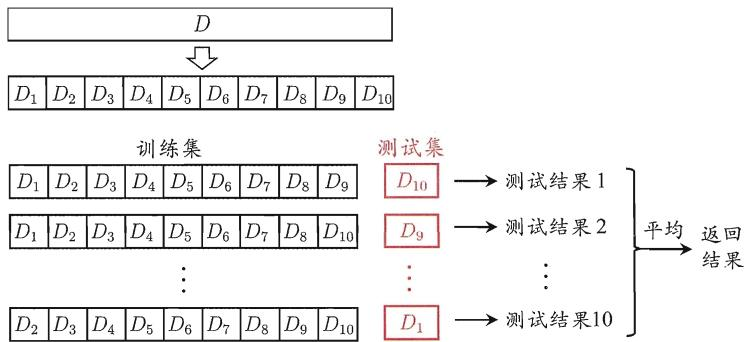
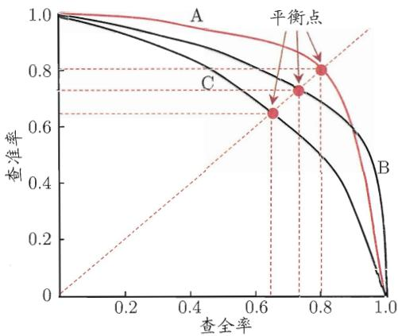
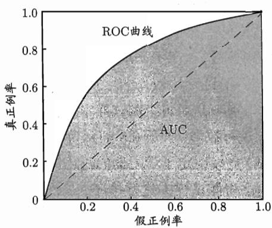
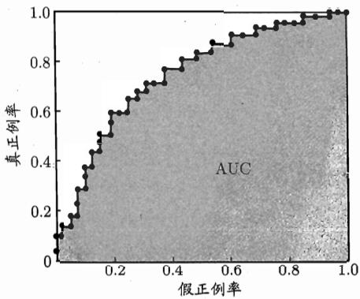
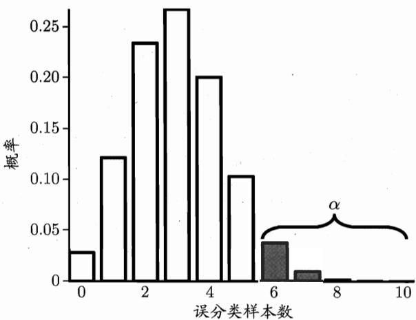
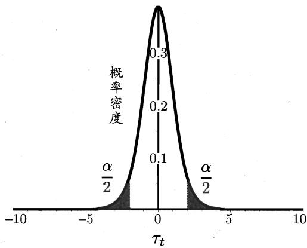
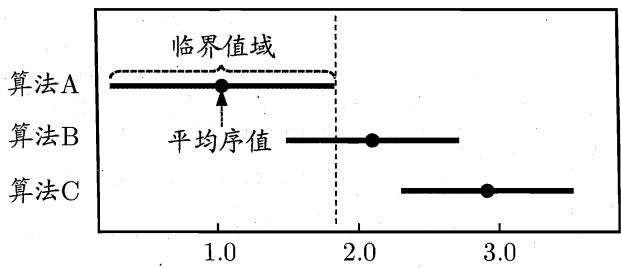
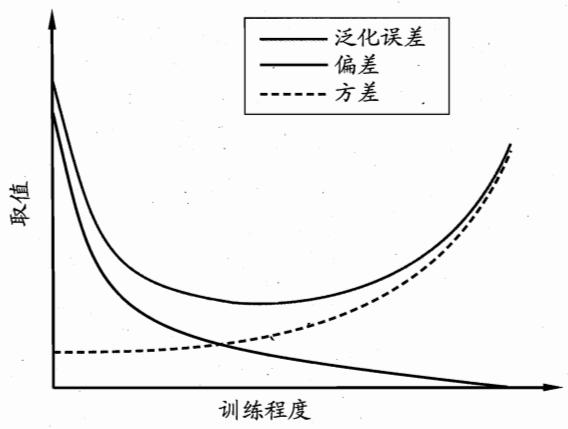

## 第2章 模型评估与选择

精度常写为百分比形式 $(1-\frac{a}{m})\times100\%$ .

这里所说的“误差”均指误差期望.

## 2.1 经验误差与过拟合

通常我们把分类错误的样本数占样本总数的比例称为“错误率”(error rate)，即如果在 $m$ 个样本中有 $a$ 个样本分类错误，则错误率 $E = a / m$ ；相应的， $1 - a / m$ 称为“精度”(accuracy)，即“精度 $= 1-$ 错误率”。更一般地，我们把学习器的实际预测输出与样本的真实输出之间的差异称为“误差”(error)，学习器在训练集上的误差称为“训练误差”(training error)或“经验误差”(empirical error)，在新样本上的误差称为“泛化误差”(generalization error)。显然，我们希望得到泛化误差小的学习器。然而，我们事先并不知道新样本是什么样，实际能做的是努力使经验误差最小化。在很多情况下，我们可以学得一个经验误差很小、在训练集上表现很好的学习器，例如甚至对所有训练样本都分类正确，即分类错误率为零，分类精度为 $100\%$ ，但这是不是我们想要的学习器呢？遗憾的是，这样的学习器在多数情况下都不好。

我们实际希望的, 是在新样本上能表现得很好的学习器. 为了达到这个目的, 应该从训练样本中尽可能学出适用于所有潜在样本的 “普遍规律”, 这样才能在遇到新样本时做出正确的判别. 然而, 当学习器把训练样本学得 “太好” 了的时候, 很可能已经把训练样本自身的一些特点当作了所有潜在样本都会具有的一般性质, 这样就会导致泛化性能下降. 这种现象在机器学习中称为 “过拟合” (overfitting). 与 “过拟合” 相对的是 “欠拟合” (underfitting), 这是指对训练样本的一般性质尚未学好. 图 2.1 给出了关于过拟合与欠拟合的一个便于直观理解的类比.

有多种因素可能导致过拟合, 其中最常见的情况是由于学习能力过于强大, 以至于把训练样本所包含的不太一般的特性都学到了, 而欠拟合则通常是由于学习能力低下而造成的. 欠拟合比较容易克服, 例如在决策树学习中扩展分支、在神经网络学习中增加训练轮数等, 而过拟合则很麻烦. 在后面的学习中我们将看到, 过拟合是机器学习面临的关键障碍, 各类学习算法都必然带有一些针对过拟合的措施; 然而必须认识到, 过拟合是无法彻底避免的, 我们所能做的只是 “缓解”, 或者说减小其风险. 关于这一点, 可大致这样理解: 机器学习面临的问题通常是 NP 难甚至更难, 而有效的学习算法必然是在多项式时间内运行完成, 若可彻底避免过拟合, 则通过经验误差最小化就能获最优解, 这就意味着我们构造性地证明了 “P=NP”; 因此, 只要相信 “P ≠ NP”, 过拟合就不可避免.

  
图 2.1 过拟合、欠拟合的直观类比

在现实任务中, 我们往往有多种学习算法可供选择, 甚至对同一个学习算法, 当使用不同的参数配置时, 也会产生不同的模型. 那么, 我们该选用哪一个学习算法、使用哪一种参数配置呢? 这就是机器学习中的 “模型选择” (model selection) 问题. 理想的解决方案当然是对候选模型的泛化误差进行评估, 然后选择泛化误差最小的那个模型. 然而如上面所讨论的, 我们无法直接获得泛化误差, 而训练误差又由于过拟合现象的存在而不适合作为标准, 那么, 在现实中如何进行模型评估与选择呢?

## 2.2 评估方法

在现实任务中往往还会考虑时间开销、存储开销、可解释性等方面的因素，这里暂且只考虑泛化误差.

通常, 我们可通过实验测试来对学习器的泛化误差进行评估并进而做出选择. 为此, 需使用一个 “测试集” (testing set) 来测试学习器对新样本的判别能力, 然后以测试集上的 “测试误差” (testing error) 作为泛化误差的近似. 通常我们假设测试样本也是从样本真实分布中独立同分布采样而得. 但需注意的是, 测试集应该尽可能与训练集互斥, 即测试样本尽量不在训练集中出现、未在训练过程中使用过.

测试样本为什么要尽可能不出现在训练集中呢？为理解这一点，不妨考虑这样一个场景：老师出了10道习题供同学们练习，考试时老师又用同样的这10道题作为试题，这个考试成绩能否有效反映出同学们学得好不好呢？答案是否定的，可能有的同学只会做这10道题却能得高分．回到我们的问题上来，我们希望得到泛化性能强的模型, 好比是希望同学们对课程学得很好、获得了对所学知识 “举一反三” 的能力; 训练样本相当于给同学们练习的习题, 测试过程则相当于考试. 显然, 若测试样本被用作训练了, 则得到的将是过于 “乐观” 的估计结果.

可是, 我们只有一个包含 $m$ 个样例的数据集 $D = \{(\pmb{x}_1, y_1), (\pmb{x}_2, y_2), \ldots, (\pmb{x}_m, y_m)\}$ , 既要训练, 又要测试, 怎样才能做到呢? 答案是: 通过对 $D$ 进行适当的处理, 从中产生出训练集 $S$ 和测试集 $T$ . 下面介绍几种常见的做法.

## 2.2.1 留出法

“留出法”(hold-out)直接将数据集 D 划分为两个互斥的集合, 其中一个集合作为训练集 S, 另一个作为测试集 T, 即 $D = S \cup T, S \cap T = \varnothing$ . 在 S 上训练出模型后, 用 T 来评估其测试误差, 作为对泛化误差的估计.

以二分类任务为例, 假定 $D$ 包含 1000 个样本, 将其划分为 $S$ 包含 700 个样本, $T$ 包含 300 个样本, 用 $S$ 进行训练后, 如果模型在 $T$ 上有 90 个样本分类错误, 那么其错误率为 $(90 / 300) \times 100\% = 30\%$ , 相应的, 精度为 $1 - 30\% = 70\%$ .

需注意的是, 训练/测试集的划分要尽可能保持数据分布的一致性, 避免因数据划分过程引入额外的偏差而对最终结果产生影响, 例如在分类任务中至少要保持样本的类别比例相似. 如果从采样(sampling)的角度来看待数据集的划分过程, 则保留类别比例的采样方式通常称为“分层采样”(stratified sampling). 例如通过对 $D$ 进行分层采样而获得含 $70\%$ 样本的训练集 $S$ 和含 $30\%$ 样本的测试集 $T$ , 若 $D$ 包含500个正例、500个反例, 则分层采样得到的 $S$ 应包含350个正例、350个反例, 而 $T$ 则包含150个正例和150个反例; 若 $S$ 、 $T$ 中样本类别比例差别很大, 则误差估计将由于训练/测试数据分布的差异而产生偏差.

另一个需注意的问题是, 即便在给定训练/测试集的样本比例后, 仍存在多种划分方式对初始数据集 $D$ 进行分割. 例如在上面的例子中, 可以把 $D$ 中的样本排序, 然后把前 350 个正例放到训练集中, 也可以把最后 350 个正例放到训练集中, ……这些不同的划分将导致不同的训练/测试集, 相应的, 模型评估的结果也会有差别. 因此, 单次使用留出法得到的估计结果往往不够稳定可靠, 在使用留出法时, 一般要采用若干次随机划分、重复进行实验评估后取平均值作为留出法的评估结果. 例如进行 100 次随机划分, 每次产生一个训练/测试集用于实验评估, 100 次后就得到 100 个结果, 而留出法返回的则是这 100 个结果的平均.

此外, 我们希望评估的是用 $D$ 训练出的模型的性能, 但留出法需划分训

可从 “偏差-方差” (参见 2.6 节) 的角度来理解: 测试集小时, 评估结果的方差较大; 训练集小时, 评估结果的偏差较大.

一般而言，测试集至少应含30个样例 [Mitchell, 1997].

练/测试集, 这就会导致一个窘境: 若令训练集 S 包含绝大多数样本, 则训练出的模型可能更接近于用 D 训练出的模型, 但由于 T 比较小, 评估结果可能不够稳定准确; 若令测试集 T 多包含一些样本, 则训练集 S 与 D 差别更大了, 被评估的模型与用 D 训练出的模型相比可能有较大差别, 从而降低了评估结果的保真性(fidelity). 这个问题没有完美的解决方案, 常见做法是将大约 $2/3 \sim 4/5$ 的样本用于训练, 剩余样本用于测试.

## 2.2.2 交叉验证法

“交叉验证法”(cross validation)先将数据集 D 划分为 k 个大小相似的互斥子集, 即 $D = D_{1} \cup D_{2} \cup \ldots \cup D_{k}, D_{i} \cap D_{j} = \varnothing (i \neq j)$ . 每个子集 $D_{i}$ 都尽可能保持数据分布的一致性, 即从 D 中通过分层采样得到. 然后, 每次用 k - 1 个子集的并集作为训练集, 余下的那个子集作为测试集; 这样就可获得 k 组训练/测试集, 从而可进行 k 次训练和测试, 最终返回的是这 k 个测试结果的均值. 显然, 交叉验证法评估结果的稳定性和保真性在很大程度上取决于 k 的取值, 为强调这一点, 通常把交叉验证法称为 “k 折交叉验证” (k-fold cross validation). k 最常用的取值是 10, 此时称为 10 折交叉验证; 其他常用的 k 值有 5、20 等. 图 2.2 给出了 10 折交叉验证的示意图.

  
图 2.2 10 折交叉验证示意图

与留出法相似, 将数据集 $D$ 划分为 $k$ 个子集同样存在多种划分方式. 为减小因样本划分不同而引入的差别, $k$ 折交叉验证通常要随机使用不同的划分重复 $p$ 次, 最终的评估结果是这 $p$ 次 $k$ 折交叉验证结果的均值, 例如常见的有“10次10折交叉验证”.

“10 次 10 折交叉验证法”与“100 次留出法”都是进行了 100 次训练/测试.

假定数据集 $D$ 中包含 $m$ 个样本, 若令 $k = m$ , 则得到了交叉验证法的一个特例: 留一法(Leave-One-Out, 简称 LOO). 显然, 留一法不受随机样本划分

参见习题2.2.

NFL 定理参见 1.4 节.

方式的影响, 因为 $m$ 个样本只有唯一的方式划分为 $m$ 个子集——每个子集包含一个样本; 留一法使用的训练集与初始数据集相比只少了一个样本, 这就使得在绝大多数情况下, 留一法中被实际评估的模型与期望评估的用 $D$ 训练出的模型很相似. 因此, 留一法的评估结果往往被认为比较准确. 然而, 留一法也有其缺陷: 在数据集比较大时, 训练 $m$ 个模型的计算开销可能是难以忍受的(例如数据集包含 1 百万个样本, 则需训练 1 百万个模型), 而这还是在未考虑算法调参的情况下. 另外, 留一法的估计结果也未必永远比其他评估方法准确; “没有免费的午餐”定理对实验评估方法同样适用.

关于样本复杂度与泛化性能之间的关系，参见第12章.

Bootstrap本意是“解靴带”；这里是在使用德国18世纪文学作品《吹牛大王历险记》中解靴带自助的典故，因此本书译为“自助法”。自助采样亦称“可重复采样”或“有放回采样”。

集成学习参见第8章.

## 2.2.3 自助法

我们希望评估的是用 $D$ 训练出的模型. 但在留出法和交叉验证法中, 由于保留了一部分样本用于测试, 因此实际评估的模型所使用的训练集比 $D$ 小, 这必然会引入一些因训练样本规模不同而导致的估计偏差. 留一法受训练样本规模变化的影响较小, 但计算复杂度又太高了. 有没有什么办法可以减少训练样本规模不同造成的影响, 同时还能比较高效地进行实验估计呢?

“自助法”(bootstrapping)是一个比较好的解决方案, 它直接以自助采样法(bootstrap sampling)为基础 [Efron and Tibshirani, 1993]. 给定包含 $m$ 个样本的数据集 $D$ , 我们对它进行采样产生数据集 $D'$ : 每次随机从 $D$ 中挑选一个样本, 将其拷贝放入 $D'$ , 然后再将该样本放回初始数据集 $D$ 中, 使得该样本在下次采样时仍有可能被采到; 这个过程重复执行 $m$ 次后, 我们就得到了包含 $m$ 个样本的数据集 $D'$ , 这就是自助采样的结果. 显然, $D$ 中有一部分样本会在 $D'$ 中多次出现, 而另一部分样本不出现. 可以做一个简单的估计, 样本在 $m$ 次采样中始终不被采到的概率是 $\left(1 - \frac{1}{m}\right)^m$ , 取极限得到

$$
\lim _ {m \to \infty} \left(1 - \frac {1}{m}\right) ^ {m} \mapsto \frac {1}{e} \approx 0. 3 6 8,\tag{2.1}
$$

即通过自助采样, 初始数据集 $D$ 中约有 $36.8\%$ 的样本未出现在采样数据集 $D'$ 中. 于是我们可将 $D'$ 用作训练集, $D \setminus D'$ 用作测试集; 这样, 实际评估的模型与期望评估的模型都使用 $m$ 个训练样本, 而我们仍有数据总量约 $1/3$ 的、没在训练集中出现的样本用于测试. 这样的测试结果, 亦称“包外估计” (out-of-bag estimate).

自助法在数据集较小、难以有效划分训练/测试集时很有用；此外，自助法能从初始数据集中产生多个不同的训练集，这对集成学习等方法有很大的好处。然而，自助法产生的数据集改变了初始数据集的分布，这会引入估计偏差。因此, 在初始数据量足够时, 留出法和交叉验证法更常用一些.

## 2.2.4 调参与最终模型

大多数学习算法都有些参数(parameter)需要设定, 参数配置不同, 学得模型的性能往往有显著差别. 因此, 在进行模型评估与选择时, 除了要对适用学习算法进行选择, 还需对算法参数进行设定, 这就是通常所说的“参数调节”或简称“调参”(parameter tuning).

读者可能马上想到, 调参和算法选择没什么本质区别: 对每种参数配置都训练出模型, 然后把对应最好模型的参数作为结果. 这样的考虑基本是正确的, 但有一点需注意: 学习算法的很多参数是在实数范围内取值, 因此, 对每种参数配置都训练出模型来是不可行的. 现实中常用的做法, 是对每个参数选定一个范围和变化步长, 例如在 $[0,0.2]$ 范围内以 $0.05$ 为步长, 则实际要评估的候选参数值有 5 个, 最终是从这 5 个候选值中产生选定值. 显然, 这样选定的参数值往往不是 “最佳” 值, 但这是在计算开销和性能估计之间进行折中的结果, 通过这个折中, 学习过程才变得可行. 事实上, 即便在进行这样的折中后, 调参往往仍很困难. 可以简单估算一下: 假定算法有 3 个参数, 每个参数仅考虑 5 个候选值, 这样对每一组训练/测试集就有 $5^{3} = 125$ 个模型需考察; 很多强大的学习算法有大量参数需设定, 这将导致极大的调参工程量, 以至于在不少应用任务中, 参数调得好不好往往对最终模型性能有关键性影响.

给定包含 $m$ 个样本的数据集 $D$ ，在模型评估与选择过程中由于需要留出一部分数据进行评估测试，事实上我们只使用了一部分数据训练模型。因此，在模型选择完成后，学习算法和参数配置已选定，此时应该用数据集 $D$ 重新训练模型。这个模型在训练过程中使用了所有 $m$ 个样本，这才是我们最终提交给用户的模型。

另外, 需注意的是, 我们通常把学得模型在实际使用中遇到的数据称为测试数据, 为了加以区分, 模型评估与选择中用于评估测试的数据集常称为 “验证集” (validation set). 例如, 在研究对比不同算法的泛化性能时, 我们用测试集上的判别效果来估计模型在实际使用时的泛化能力, 而把训练数据另外划分为训练集和验证集, 基于验证集上的性能来进行模型选择和调参.

## 2.3 性能度量

对学习器的泛化性能进行评估, 不仅需要有效可行的实验估计方法, 还需要有衡量模型泛化能力的评价标准, 这就是性能度量(performance measure).

性能度量反映了任务需求, 在对比不同模型的能力时, 使用不同的性能度量往往会导致不同的评判结果; 这意味着模型的 “好坏” 是相对的, 什么样的模型是好的, 不仅取决于算法和数据, 还决定于任务需求.

聚类的性能度量参见第9章.

在预测任务中, 给定样例集 $D = \{(\pmb{x}_1, y_1), (\pmb{x}_2, y_2), \ldots, (\pmb{x}_m, y_m)\}$ , 其中 $y_i$ 是示例 $\pmb{x}_i$ 的真实标记. 要评估学习器 $f$ 的性能, 就要把学习器预测结果 $f(\pmb{x})$ 与真实标记 $y$ 进行比较.

回归任务最常用的性能度量是“均方误差”(mean squared error)

$$
E (f; D) = \frac {1}{m} \sum_ {i = 1} ^ {m} \left(f \left(\boldsymbol {x} _ {i}\right) - y _ {i}\right) ^ {2}.\tag{2.2}
$$

更一般的, 对于数据分布 D 和概率密度函数 $p(\cdot)$ , 均方误差可描述为

$$
E (f; \mathcal {D}) = \int_ {\boldsymbol {x} \sim \mathcal {D}} (f (\boldsymbol {x}) - y) ^ {2} p (\boldsymbol {x}) \mathrm{d} \boldsymbol {x}.\tag{2.3}
$$

本节下面主要介绍分类任务中常用的性能度量.

## 2.3.1 错误率与精度

本章开头提到了错误率和精度, 这是分类任务中最常用的两种性能度量, 既适用于二分类任务, 也适用于多分类任务. 错误率是分类错误的样本数占样本总数的比例, 精度则是分类正确的样本数占样本总数的比例. 对样例集 $D$ , 分类错误率定义为

$$
E (f; D) = \frac {1}{m} \sum_ {i = 1} ^ {m} \mathbb {I} \left(f \left(\boldsymbol {x} _ {i}\right) \neq y _ {i}\right).\tag{2.4}
$$

精度则定义为

$$
\begin{array}{r c l} \operatorname{acc} (f; D) & = & \frac {1}{m} \sum_ {i = 1} ^ {m} \mathbb {I} (f (\boldsymbol {x} _ {i}) = y _ {i}) \\ & = & 1 - E (f; D). \end{array}\tag{2.5}
$$

更一般的, 对于数据分布 $\mathcal{D}$ 和概率密度函数 $p(\cdot)$ , 错误率与精度可分别描述为

$$
E (f; \mathcal {D}) = \int_ {\boldsymbol {x} \sim \mathcal {D}} \mathbb {I} (f (\boldsymbol {x}) \neq y) p (\boldsymbol {x}) \mathrm{d} \boldsymbol {x},\tag{2.6}
$$

$$
\begin{array}{r c l} \operatorname{acc} (f; \mathcal {D}) & = & \int_ {\boldsymbol {x} \sim \mathcal {D}} \mathbb {I} (f (\boldsymbol {x}) = y) p (\boldsymbol {x}) \mathrm{d} \boldsymbol {x} \\ & = & 1 - E (f; \mathcal {D}). \end{array}\tag{2.7}
$$

## 2.3.2 查准率、查全率与 $F1$

错误率和精度虽常用, 但并不能满足所有任务需求. 以西瓜问题为例, 假定瓜农拉来一车西瓜, 我们用训练好的模型对这些西瓜进行判别, 显然, 错误率衡量了多少比例的瓜被判别错误. 但是若我们关心的是 “挑出的西瓜中有多少比例是好瓜”, 或者 “所有好瓜中有多少比例被挑了出来”, 那么错误率显然就不够用了, 这时需要使用其他的性能度量.

类似的需求在信息检索、Web搜索等应用中经常出现, 例如在信息检索中, 我们经常会关心 “检索出的信息中有多少比例是用户感兴趣的” “用户感兴趣的信息中有多少被检索出来了”. “查准率” (precision)与“查全率” (recall)是更为适用于此类需求的性能度量.

查准率亦称“准确率”查全率亦称“召回率”.

对于二分类问题, 可将样例根据其真实类别与学习器预测类别的组合划分为真正例(true positive)、假正例(false positive)、真反例(true negative)、假反例(false negative)四种情形, 令 $TP$ 、 $FP$ 、 $TN$ 、 $FN$ 分别表示其对应的样例数, 则显然有 $TP + FP + TN + FN =$ 样例总数. 分类结果的“混淆矩阵”(confusion matrix)如表2.1所示.

表 2.1 分类结果混淆矩阵

<table><tr><td rowspan="2">真实情况</td><td colspan="2">预测结果</td></tr><tr><td>正例</td><td>反例</td></tr><tr><td>正例</td><td>TP(真正例)</td><td>FN(假反例)</td></tr><tr><td>反例</td><td>FP(假正例)</td><td>TN(真反例)</td></tr></table>

查准率 $P$ 与查全率 $R$ 分别定义为

$$
P = \frac {T P}{T P + F P},\tag{2.8}
$$

$$
R = \frac {T P}{T P + F N}.\tag{2.9}
$$

查准率和查全率是一对矛盾的度量。一般来说，查准率高时，查全率往往偏低；而查全率高时，查准率往往偏低。例如，若希望将好瓜尽可能多地选出来，则可通过增加选瓜的数量来实现，如果将所有西瓜都选上，那么所有的好瓜也必然都被选上了, 但这样查准率就会较低; 若希望选出的瓜中好瓜比例尽可能高, 则可只挑选最有把握的瓜, 但这样就难免会漏掉不少好瓜, 使得查全率较低. 通常只有在一些简单任务中, 才可能使查全率和查准率都很高.

以信息检索应用为例，逐条向用户反馈其可能感兴趣的信息，即可计算出查全率、查准率.

亦称“PR 曲线”或“PR 图”.

在很多情形下, 我们可根据学习器的预测结果对样例进行排序, 排在前面的是学习器认为 “最可能” 是正例的样本, 排在最后的则是学习器认为 “最不可能” 是正例的样本. 按此顺序逐个把样本作为正例进行预测, 则每次可以计算出当前的查全率、查准率. 以查准率为纵轴、查全率为横轴作图, 就得到了查准率-查全率曲线, 简称 “P-R曲线”, 显示该曲线的图称为 “P-R图”. 图2.3给出了一个示意图.

为绘图方便和美观，示意图显示出单调平滑曲线；但现实任务中的P-R曲线常是非单调、不平滑的，在很多局部有上下波动.

  
图 2.3 P-R 曲线与平衡点示意图

P-R 图直观地显示出学习器在样本总体上的查全率、查准率. 在进行比较时, 若一个学习器的 P-R 曲线被另一个学习器的曲线完全 “包住”, 则可断言后者的性能优于前者, 例如图 2.3 中学习器 A 的性能优于学习器 C; 如果两个学习器的 P-R 曲线发生了交叉, 例如图 2.3 中的 A 与 B, 则难以一般性地断言两者孰优孰劣, 只能在具体的查准率或查全率条件下进行比较. 然而, 在很多情形下, 人们往往仍希望把学习器 A 与 B 比出个高低. 这时一个比较合理的判据是比较 P-R 曲线下面积的大小, 它在一定程度上表征了学习器在查准率和查全率上取得相对 “双高” 的比例. 但这个值不太容易估算, 因此, 人们设计了一些综合考虑查准率、查全率的性能度量.

“平衡点”(Break-Event Point, 简称 BEP) 就是这样一个度量, 它是 “查准率=查全率” 时的取值, 例如图 2.3 中学习器 C 的 BEP 是 0.64, 而基于 BEP 的比较, 可认为学习器 A 优于 B.

但 BEP 还是过于简化了些, 更常用的是 F1 度量:

$$
F 1 = \frac {2 \times P \times R}{P + R} = \frac {2 \times T P}{\text {样例总数} + T P - T N}.\tag{2.10}
$$

F1 是基于查准率与查全率的调和平均(harmonic mean)定义的:

$$
\frac {1}{F 1} = \frac {1}{2} \cdot \left(\frac {1}{P} + \frac {1}{R}\right).
$$

在一些应用中, 对查准率和查全率的重视程度有所不同. 例如在商品推荐系统中, 为了尽可能少打扰用户, 更希望推荐内容确是用户感兴趣的, 此时查准率更重要; 而在逃犯信息检索系统中, 更希望尽可能少漏掉逃犯, 此时查全率更重要. $F1$ 度量的一般形式—— $F_{\beta}$ , 能让我们表达出对查准率/查全率的不同偏好, 它定义为

$F_{\beta}$ 则是加权调和平均：

$$
F _ {\beta} = \frac {(1 + \beta^ {2}) \times P \times R}{(\beta^ {2} \times P) + R},\tag{2.11}
$$

$$
\frac {1}{F _ {\beta}} = \frac {1}{1 + \beta^ {2}} \cdot \left(\frac {1}{P} + \frac {\beta^ {2}}{R}\right)
$$

其中 $\beta > 0$ 度量了查全率对查准率的相对重要性 [Van Rijsbergen, 1979]. $\beta = 1$ 时退化为标准的 $F1$ ; $\beta > 1$ 时查全率有更大影响; $\beta < 1$ 时查准率有更大影响.

与算术平均 $\left(\frac{P+R}{2}\right)$ 和几何平均 $(\sqrt{P\times R})$ 相比,调和平均更重视较小值.

很多时候我们有多个二分类混淆矩阵, 例如进行多次训练/测试, 每次得到一个混淆矩阵; 或是在多个数据集上进行训练/测试, 希望估计算法的 “全局” 性能; 甚或是执行多分类任务, 每两两类别的组合都对应一个混淆矩阵; ……总之, 我们希望在 n 个二分类混淆矩阵上综合考察查准率和查全率.

一种直接的做法是先在各混淆矩阵上分别计算出查准率和查全率，记为 $(P_{1}, R_{1}), (P_{2}, R_{2}), \ldots, (P_{n}, R_{n})$ ，再计算平均值，这样就得到“宏查准率”(macro-P)、“宏查全率”(macro-R)，以及相应的“宏 $F1$ ”(macro-F1):

$$
\mathrm{macro-} P = \frac {1}{n} \sum_ {i = 1} ^ {n} P _ {i},\tag{2.12}
$$

$$
\text { macro- } R = \frac {1}{n} \sum_ {i = 1} ^ {n} R _ {i},\tag{2.13}
$$

$$
\mathrm{macro-} F 1 = \frac {2 \times \mathrm{macro-} P \times \mathrm{macro-} R}{\mathrm{macro-} P + \mathrm{macro-} R}.\tag{2.14}
$$

还可先将各混淆矩阵的对应元素进行平均, 得到 $TP$ 、 $FP$ 、 $TN$ 、 $FN$ 的平均值, 分别记为 $\overline{TP}$ 、 $\overline{FP}$ 、 $\overline{TN}$ 、 $\overline{FN}$ , 再基于这些平均值计算出 “微查准率” (micro- $P$ )、“微查全率” (micro- $R$ ) 和 “微 $F1$ ” (micro- $F1$ ):

$$
\mathrm{micro-} P = \frac {\overline {{T P}}}{\overline {{T P}} + \overline {{F P}}} ,\tag{2.15}
$$

$$
\mathrm{micro-} R = \frac {\overline {{T P}}}{\overline {{T P}} + \overline {{F N}}} ,\tag{2.16}
$$

$$
\mathrm{micro-} F 1 = \frac {2 \times \mathrm{micro-} P \times \mathrm{micro-} R}{\mathrm{micro-} P + \mathrm{micro-} R}.\tag{2.17}
$$

## 2.3.3 ROC 与 AUC

神经网络参见第5章.

很多学习器是为测试样本产生一个实值或概率预测, 然后将这个预测值与一个分类阈值(threshold)进行比较, 若大于阈值则分为正类, 否则为反类. 例如, 神经网络在一般情形下是对每个测试样本预测出一个 $[0.0,1.0]$ 之间的实值, 然后将这个值与 0.5 进行比较, 大于 0.5 则判为正例, 否则为反例. 这个实值或概率预测结果的好坏, 直接决定了学习器的泛化能力. 实际上, 根据这个实值或概率预测结果, 我们可将测试样本进行排序, “最可能” 是正例的排在最前面, “最不可能” 是正例的排在最后面. 这样, 分类过程就相当于在这个排序中以某个 “截断点” (cut point) 将样本分为两部分, 前一部分判作正例, 后一部分则判作反例.

在不同的应用任务中, 我们可根据任务需求来采用不同的截断点, 例如若我们更重视 “查准率”, 则可选择排序中靠前的位置进行截断; 若更重视 “查全率”, 则可选择靠后的位置进行截断. 因此, 排序本身的质量好坏, 体现了综合考虑学习器在不同任务下的 “期望泛化性能” 的好坏, 或者说, “一般情况下” 泛化性能的好坏. ROC 曲线则是从这个角度出发来研究学习器泛化性能的有力工具.

ROC 全称是 “受试者工作特征” (Receiver Operating Characteristic) 曲线, 它源于 “二战” 中用于敌机检测的雷达信号分析技术, 二十世纪六七十年代开始被用于一些心理学、医学检测应用中, 此后被引入机器学习领域 [Spackman, 1989]. 与 2.3.2 节中介绍的 P-R 曲线相似, 我们根据学习器的预测结果对样例进行排序, 按此顺序逐个把样本作为正例进行预测, 每次计算出两个重要量的值, 分别以它们为横、纵坐标作图, 就得到了 “ROC 曲线”. 与 P-R 曲线使用查准率、查全率为纵、横轴不同, ROC 曲线的纵轴是 “真正例率” (True Positive Rate, 简称 TPR), 横轴是 “假正例率” (False Positive Rate, 简称 FPR), 基于表 2.1 中的符号, 两者分别定义为

$$
\mathrm{TPR} = \frac {T P}{T P + F N},\tag{2.18}
$$

$$
\mathrm{FPR} = \frac {F P}{T N + F P}.\tag{2.19}
$$

显示 ROC 曲线的图称为 “ROC 图”. 图 2.4(a) 给出了一个示意图, 显然, 对角线对应于 “随机猜测” 模型, 而点 (0, 1) 则对应于将所有正例排在所有反例之前的 “理想模型”.

  
(a) ROC 曲线与 AUC

  
(b) 基于有限样例绘制的 ROC 曲线与 AUC  
图 2.4 ROC 曲线与 AUC 示意图  
基于有限个测试样例绘制 P-R 图时有同样问题. 本书到这里才介绍近似曲线的绘制, 是为了便于下面介绍 AUC 的计算.

现实任务中通常是利用有限个测试样例来绘制 ROC 图, 此时仅能获得有限个(真正例率, 假正例率)坐标对, 无法产生图 2.4(a) 中的光滑 ROC 曲线, 只能绘制出如图 2.4(b) 所示的近似 ROC 曲线. 绘图过程很简单: 给定 $m^{+}$ 个正例和 $m^{-}$ 个反例, 根据学习器预测结果对样例进行排序, 然后把分类阈值设为最大, 即把所有样例均预测为反例, 此时真正例率和假正例率均为 0 , 在坐标 (0,0) 处标记一个点. 然后, 将分类阈值依次设为每个样例的预测值, 即依次将每个样例划分为正例. 设前一个标记点坐标为 $(x,y)$ , 当前若为真正例, 则对应标记点的坐标为 $(x,y + \frac{1}{m^{+}})$ ; 当前若为假正例, 则对应标记点的坐标为 $(x + \frac{1}{m^{-}},y)$ , 然后用线段连接相邻点即得.

进行学习器的比较时, 与 P-R 图相似, 若一个学习器的 ROC 曲线被另一个学习器的曲线完全 “包住”, 则可断言后者的性能优于前者; 若两个学习器的 ROC 曲线发生交叉, 则难以一般性地断言两者孰优孰劣. 此时如果一定要进行比较, 则较为合理的判据是比较 ROC 曲线下的面积, 即 AUC (Area Under ROC Curve), 如图 2.4 所示.

从定义可知, AUC 可通过对 ROC 曲线下各部分的面积求和而得. 假定 ROC 曲线是由坐标为 $\{(x_{1}, y_{1}), (x_{2}, y_{2}), \ldots, (x_{m}, y_{m})\}$ 的点按序连接而形成 $(x_{1} = 0, x_{m} = 1)$ , 参见图 2.4(b), 则 AUC 可估算为

$$
\mathrm{AUC} = \frac {1}{2} \sum_ {i = 1} ^ {m - 1} (x _ {i + 1} - x _ {i}) \cdot (y _ {i} + y _ {i + 1}).\tag{2.20}
$$

形式化地看, AUC 考虑的是样本预测的排序质量, 因此它与排序误差有紧密联系. 给定 $m^{+}$ 个正例和 $m^{-}$ 个反例, 令 $D^{+}$ 和 $D^{-}$ 分别表示正、反例集合, 则排序 “损失” (loss) 定义为

$$
\ell_ {r a n k} = \frac {1}{m ^ {+} m ^ {-}} \sum_ {\boldsymbol {x} ^ {+} \in D ^ {+}} \sum_ {\boldsymbol {x} ^ {-} \in D ^ {-}} \left(\mathbb {I} \left(f (\boldsymbol {x} ^ {+}) <   f (\boldsymbol {x} ^ {-})\right) + \frac {1}{2} \mathbb {I} \left(f (\boldsymbol {x} ^ {+}) = f (\boldsymbol {x} ^ {-})\right)\right)\tag{2.21}
$$

即考虑每一对正、反例, 若正例的预测值小于反例, 则记一个 “罚分”, 若相等, 则记 0.5 个 “罚分”. 容易看出, $\ell_{rank}$ 对应的是 ROC 曲线之上的面积: 若一个正例在 ROC 曲线上对应标记点的坐标为 $(x, y)$ , 则 $x$ 恰是排序在其之前的反例所占的比例, 即假正例率. 因此有

$$
\mathrm{AUC} = 1 - \ell_ {r a n k}.\tag{2.22}
$$

## 2.3.4 代价敏感错误率与代价曲线

在现实任务中常会遇到这样的情况: 不同类型的错误所造成的后果不同. 例如在医疗诊断中, 错误地把患者诊断为健康人与错误地把健康人诊断为患者, 看起来都是犯了 “一次错误”, 但后者的影响是增加了进一步检查的麻烦, 前者的后果却可能是丧失了拯救生命的最佳时机; 再如, 门禁系统错误地把可通行人员拦在门外, 将使得用户体验不佳, 但错误地把陌生人放进门内, 则会造成严重的安全事故. 为权衡不同类型错误所造成的不同损失, 可为错误赋予 “非均等代价” (unequal cost).

以二分类任务为例, 我们可根据任务的领域知识设定一个 “代价矩阵” (cost matrix), 如表 2.2 所示, 其中 $cost_{ij}$ 表示将第 $i$ 类样本预测为第 $j$ 类样本的代价. 一般来说, $cost_{ii} = 0$ ; 若将第 0 类判别为第 1 类所造成的损失更大, 则 $cost_{01} > cost_{10}$ ; 损失程度相差越大, $cost_{01}$ 与 $cost_{10}$ 值的差别越大.

一般情况下，重要的是代价比值而非绝对值，例如 $cost_{01}: cost_{10} = 5:1$ 与 $50:10$ 所起效果相当.

表 2.2 二分类代价矩阵

<table><tr><td rowspan="2">真实类别</td><td colspan="2">预测类别</td></tr><tr><td>第0类</td><td>第1类</td></tr><tr><td>第0类</td><td>0</td><td> $cost_{01}$ </td></tr><tr><td>第1类</td><td> $cost_{10}$ </td><td>0</td></tr></table>

回顾前面介绍的一些性能度量可看出, 它们大都隐式地假设了均等代价, 例如式(2.4)所定义的错误率是直接计算 “错误次数”, 并没有考虑不同错误会造成不同的后果. 在非均等代价下, 我们所希望的不再是简单地最小化错误次数, 而是希望最小化 “总体代价” (total cost). 若将表 2.2 中的第 0 类作为正类、第 1 类作为反类, 令 $D^{+}$ 与 $D^{-}$ 分别代表样例集 $D$ 的正例子集和反例子集, 则 “代价敏感” (cost-sensitive) 错误率为

$$
\begin{array}{l} E (f; D; \text {cost}) = \frac {1}{m} \left(\sum_ {\boldsymbol {x} _ {i} \in D ^ {+}} \mathbb {I} \left(f \left(\boldsymbol {x} _ {i}\right) \neq y _ {i}\right) \times \text {cost} _ {0 1} \right. \\ \left. + \sum_ {\boldsymbol {x} _ {i} \in D ^ {-}} \mathbb {I} \left(f \left(\boldsymbol {x} _ {i}\right) \neq y _ {i}\right) \times \text {cost} _ {1 0}\right). \end{array}\tag{2.23}
$$

类似的, 可给出基于分布定义的代价敏感错误率, 以及其他一些性能度量如精度的代价敏感版本. 若令 $cost_{ij}$ 中的 $i$ 、 $j$ 取值不限于0、1, 则可定义出多分类任务的代价敏感性能度量.

参见习题2.7.

在非均等代价下, ROC 曲线不能直接反映出学习器的期望总体代价, 而 “代价曲线” (cost curve) 则可达到该目的. 代价曲线图的横轴是取值为 [0,1] 的正例概率代价

$$
P (+) \text { cost } = \frac {p \times \text { cost } _ {0 1}}{p \times \text { cost } _ {0 1} + (1 - p) \times \text { cost } _ {1 0}},\tag{2.24}
$$

“规范化” (normalization) 是将不同变化范围的值映射到相同的固定范围中, 常见的是 [0,1], 此时亦称 “归一化”. 参见习题 2.8.

其中 $p$ 是样例为正例的概率; 纵轴是取值为 $[0,1]$ 的归一化代价

$$
c o s t _ {n o r m} = \frac {\mathrm{FNR} \times p \times c o s t _ {0 1} + \mathrm{FPR} \times (1 - p) \times c o s t _ {1 0}}{p \times c o s t _ {0 1} + (1 - p) \times c o s t _ {1 0}},\tag{2.25}
$$

其中 FPR 是式(2.19)定义的假正例率, FNR = 1 - TPR 是假反例率. 代价曲线的绘制很简单: ROC 曲线上每一点对应了代价平面上的一条线段, 设 ROC 曲线上点的坐标为 (TPR, FPR), 则可相应计算出 FNR, 然后在代价平面上绘制一条从 (0, FPR) 到 (1, FNR) 的线段, 线段下的面积即表示了该条件下的期望总体代价; 如此将 ROC 曲线上的每个点转化为代价平面上的一条线段, 然后取所有线段的下界, 围成的面积即为在所有条件下学习器的期望总体代价, 如图 2.5 所示.

  
图 2.5 代价曲线与期望总体代价

## 2.4 比较检验

有了实验评估方法和性能度量, 看起来就能对学习器的性能进行评估比较了: 先使用某种实验评估方法测得学习器的某个性能度量结果, 然后对这些结果进行比较. 但怎么来做这个 “比较” 呢? 是直接取得性能度量的值然后 “比大小” 吗? 实际上, 机器学习中性能比较这件事要比大家想象的复杂得多. 这里面涉及几个重要因素: 首先, 我们希望比较的是泛化性能, 然而通过实验评估方法我们获得的是测试集上的性能, 两者的对比结果可能未必相同; 第二, 测试集上的性能与测试集本身的选择有很大关系, 且不论使用不同大小的测试集会得到不同的结果, 即便用相同大小的测试集, 若包含的测试样例不同, 测试结果也会有不同; 第三, 很多机器学习算法本身有一定的随机性, 即便用相同的参数设置在同一个测试集上多次运行, 其结果也会有不同. 那么, 有没有适当的方法对学习器的性能进行比较呢?

更多关于假设检验的介绍可参见[Wellek, 2010].

统计假设检验(hypothesis test)为我们进行学习器性能比较提供了重要依据. 基于假设检验结果我们可推断出, 若在测试集上观察到学习器 A 比 B 好, 则 A 的泛化性能是否在统计意义上优于 B, 以及这个结论的把握有多大. 下面我们先介绍两种最基本的假设检验, 然后介绍几种常用的机器学习性能比较方法. 为便于讨论, 本节默认以错误率为性能度量, 用 $\epsilon$ 表示.

## 2.4.1 假设检验

假设检验中的“假设”是对学习器泛化错误率分布的某种判断或猜想，例如“ $\epsilon = \epsilon_0$ ”。现实任务中我们并不知道学习器的泛化错误率，只能获知其测试错误率 $\hat{\epsilon}$ 。泛化错误率与测试错误率未必相同，但直观上，二者接近的可能性应比较大, 相差很远的可能性比较小. 因此, 可根据测试错误率估推出泛化错误率的分布.

泛化错误率为 $\epsilon$ 的学习器在一个样本上犯错的概率是 $\epsilon$ ; 测试错误率 $\hat{\epsilon}$ 意味着在 $m$ 个测试样本中恰有 $\hat{\epsilon} \times m$ 个被误分类. 假定测试样本是从样本总体分布中独立采样而得, 那么泛化错误率为 $\epsilon$ 的学习器将其中 $m'$ 个样本误分类、其余样本全都分类正确的概率是 $\epsilon^{m'}(1 - \epsilon)^{m - m'}$ ; 由此可估算出其恰将 $\hat{\epsilon} \times m$ 个样本误分类的概率如下式所示, 这也表达了在包含 $m$ 个样本的测试集上, 泛化错误率为 $\epsilon$ 的学习器被测得测试错误率为 $\hat{\epsilon}$ 的概率:

$$
P (\hat {\epsilon}; \epsilon) = \binom {m} {\hat {\epsilon} \times m} \epsilon^ {\hat {\epsilon} \times m} (1 - \epsilon) ^ {m - \hat {\epsilon} \times m}.\tag{2.26}
$$

给定测试错误率, 则解 $\partial P(\hat{\epsilon};\epsilon) / \partial \epsilon = 0$ 可知, $P(\hat{\epsilon};\epsilon)$ 在 $\epsilon = \hat{\epsilon}$ 时最大, $|\epsilon -\hat{\epsilon}|$ 增大时 $P(\hat{\epsilon};\epsilon)$ 减小. 这符合二项(binomial)分布, 如图2.6所示, 若 $\epsilon = 0.3$ , 则10个样本中测得3个被误分类的概率最大.

  
图 2.6 二项分布示意图 $(m=10,\epsilon=0.3)$

$\alpha$ 的常用取值有0.05、0.1，图2.6中 $\alpha$ 较大是为了绘图方便.

我们可使用“二项检验”(binomial test)来对“ $\epsilon \leqslant 0.3$ ”(即“泛化错误率是否不大于0.3”)这样的假设进行检验。更一般的，考虑假设“ $\epsilon \leqslant \epsilon_0$ ”，则在 $1 - \alpha$ 的概率内所能观测到的最大错误率如下式计算。这里 $1 - \alpha$ 反映了结论的“置信度”(confidence)，直观地来看，相应于图2.6中非阴影部分的范围。

s.t. 是 “subject to” 的简写，使左边式子在右边条件满足时成立.

$$
\bar {\epsilon} = \max \epsilon \quad \text { s.t. } \quad \sum_ {i = \epsilon_ {0} \times m + 1} ^ {m} \binom {m} {i} \epsilon^ {i} (1 - \epsilon) ^ {m - i} <   \alpha .\tag{2.27}
$$

二项检验的临界值在 R 语言中可通过 qbinom(1 - α, m, ε₀) 计算，在 Matlab 中是 icdf('Binomial', 1 - α, m, ε₀).

R 语言是面向统计计算的开源脚本语言，参见 www.r-project.org.

此时若测试错误率 $\hat{\epsilon}$ 小于临界值 $\bar{\epsilon}$ , 则根据二项检验可得出结论: 在 $\alpha$ 的显著度下, 假设“ $\epsilon \leqslant \epsilon_0$ ”不能被拒绝, 即能以 $1 - \alpha$ 的置信度认为, 学习器的泛化错误率不大于 $\epsilon_0$ ; 否则该假设可被拒绝, 即在 $\alpha$ 的显著度下可认为学习器的泛化错误率大于 $\epsilon_0$ .

在很多时候我们并非仅做一次留出法估计, 而是通过多次重复留出法或是交叉验证法等进行多次训练/测试, 这样会得到多个测试错误率, 此时可使用 “t 检验” (t-test). 假定我们得到了 k 个测试错误率, $\hat{\epsilon}_{1}, \hat{\epsilon}_{2}, \ldots, \hat{\epsilon}_{k}$ , 则平均测试错误率 $\mu$ 和方差 $\sigma^{2}$ 为

$$
\mu = \frac {1}{k} \sum_ {i = 1} ^ {k} \hat {\epsilon} _ {i},\tag{2.28}
$$

$$
\sigma^ {2} = \frac {1}{k - 1} \sum_ {i = 1} ^ {k} (\hat {\epsilon} _ {i} - \mu) ^ {2}.\tag{2.29}
$$

考虑到这 k 个测试错误率可看作泛化错误率 $\epsilon_{0}$ 的独立采样, 则变量

$$
\tau_ {t} = \frac {\sqrt {k} (\mu - \epsilon_ {0})}{\sigma}\tag{2.30}
$$

服从自由度为 k-1 的 t 分布, 如图 2.7 所示.

  
图 2.7 t 分布示意图 $(k=10)$

对假设“ $\mu = \epsilon_0$ ”和显著度 $\alpha$ ，我们可计算出当测试错误率均值为 $\epsilon_0$ 时，在 $1 - \alpha$ 概率内能观测到的最大错误率，即临界值。这里考虑双边(two-tailed)假设，如图2.7所示，两边阴影部分各有 $\alpha / 2$ 的面积；假定阴影部分范围分别为 $[- \infty, t_{-\alpha / 2}]$ 和 $[t_{\alpha / 2}, \infty]$ 。若平均错误率 $\mu$ 与 $\epsilon_0$ 之差 $|\mu - \epsilon_0|$ 位于临界值范围$[t_{-\alpha /2}, t_{\alpha /2}]$ 内, 则不能拒绝假设“ $\mu = \epsilon_0$ ”, 即可认为泛化错误率为 $\epsilon_0$ , 置信度为 $1 - \alpha$ ; 否则可拒绝该假设, 即在该显著度下可认为泛化错误率与 $\epsilon_0$ 有显著不同. $\alpha$ 常用取值有 0.05 和 0.1. 表 2.3 给出了一些常用临界值.

临界值 $t_{\alpha/2}$ 在 R 语言中可通过 qt(1- $\alpha/2$ , k-1) 计算，在 Matlab 中是 icdf('T', 1- $\alpha/2$ , k-1).

表 2.3 双边 t 检验的常用临界值

<table><tr><td rowspan="2"> $\alpha$ </td><td colspan="5"> $k$ </td></tr><tr><td>2</td><td>5</td><td>10</td><td>20</td><td>30</td></tr><tr><td>0.05</td><td>12.706</td><td>2.776</td><td>2.262</td><td>2.093</td><td>2.045</td></tr><tr><td>0.10</td><td>6.314</td><td>2.132</td><td>1.833</td><td>1.729</td><td>1.699</td></tr></table>

上面介绍的两种方法都是对关于单个学习器泛化性能的假设进行检验, 而在现实任务中, 更多时候我们需对不同学习器的性能进行比较, 下面将介绍适用于此类情况的假设检验方法.

## 2.4.2 交叉验证 t 检验

对两个学习器 A 和 B，若我们使用 k 折交叉验证法得到的测试错误率分别为 $\epsilon_{1}^{A}, \epsilon_{2}^{A}, \ldots, \epsilon_{k}^{A}$ 和 $\epsilon_{1}^{B}, \epsilon_{2}^{B}, \ldots, \epsilon_{k}^{B}$ ，其中 $\epsilon_{i}^{A}$ 和 $\epsilon_{i}^{B}$ 是在相同的第 i 折训练/测试集上得到的结果，则可用 k 折交叉验证“成对 t 检验”(paired t-tests)来进行比较检验。这里的基本思想是若两个学习器的性能相同，则它们使用相同的训练/测试集得到的测试错误率应相同，即 $\epsilon_{i}^{A} = \epsilon_{i}^{B}$ 。

具体来说, 对 $k$ 折交叉验证产生的 $k$ 对测试错误率: 先对每对结果求差, $\Delta_{i} = \epsilon_{i}^{A} - \epsilon_{i}^{B}$ ; 若两个学习器性能相同, 则差值均值应为零. 因此, 可根据差值 $\Delta_{1}, \Delta_{2}, \ldots, \Delta_{k}$ 来对“学习器 A 与 B 性能相同”这个假设做 $t$ 检验, 计算出差值的均值 $\mu$ 和方差 $\sigma^{2}$ , 在显著度 $\alpha$ 下, 若变量

$$
\tau_ {t} = \left| \frac {\sqrt {k} \mu}{\sigma} \right|\tag{2.31}
$$

小于临界值 $t_{\alpha /2,k - 1}$ ，则假设不能被拒绝，即认为两个学习器的性能没有显著差别；否则可认为两个学习器的性能有显著差别，且平均错误率较小的那个学习器性能较优.这里 $t_{\alpha /2,k - 1}$ 是自由度为 $k - 1$ 的 $t$ 分布上尾部累积分布为 $\alpha /2$ 的临界值.

欲进行有效的假设检验, 一个重要前提是测试错误率均为泛化错误率的独立采样. 然而, 通常情况下由于样本有限, 在使用交叉验证等实验估计方法时, 不同轮次的训练集会有一定程度的重叠, 这就使得测试错误率实际上并不独立, 会导致过高估计假设成立的概率. 为缓解这一问题, 可采用 “5 × 2 交叉验证”

法 [Dietterich, 1998].

$5 \times 2$ 交叉验证是做5次2折交叉验证, 在每次2折交叉验证之前随机将数据打乱, 使得5次交叉验证中的数据划分不重复. 对两个学习器A和B, 第 $i$ 次2折交叉验证将产生两对测试错误率, 我们对它们分别求差, 得到第1折上的差值 $\Delta_{i}^{1}$ 和第2折上的差值 $\Delta_{i}^{2}$ . 为缓解测试错误率的非独立性, 我们仅计算第1次2折交叉验证的两个结果的平均值 $\mu = 0.5(\Delta_{1}^{1} + \Delta_{1}^{2})$ , 但对每次2折实验的结果都计算出其方差 $\sigma_{i}^{2} = \left(\Delta_{i}^{1} - \frac{\Delta_{i}^{1} + \Delta_{i}^{2}}{2}\right)^{2} + \left(\Delta_{i}^{2} - \frac{\Delta_{i}^{1} + \Delta_{i}^{2}}{2}\right)^{2}$ . 变量

$$
\tau_ {t} = \frac {\mu}{\sqrt {0 . 2 \sum_ {i = 1} ^ {5} \sigma_ {i} ^ {2}}}\tag{2.32}
$$

服从自由度为 5 的 t 分布, 其双边检验的临界值 $t_{\alpha/2,5}$ 当 $\alpha = 0.05$ 时为 2.5706, $\alpha = 0.1$ 时为 2.0150.

## 2.4.3 McNemar 检验

对二分类问题, 使用留出法不仅可估计出学习器 A 和 B 的测试错误率, 还可获得两学习器分类结果的差别, 即两者都正确、都错误、一个正确另一个错误的样本数, 如 “列联表” (contingency table) 2.4 所示.

表 2.4 两学习器分类差别列联表

<table><tr><td rowspan="2">算法 B</td><td colspan="2">算法 A</td></tr><tr><td>正确</td><td>错误</td></tr><tr><td>正确</td><td> $e_{00}$ </td><td> $e_{01}$ </td></tr><tr><td>错误</td><td> $e_{10}$ </td><td> $e_{11}$ </td></tr></table>

若我们做的假设是两学习器性能相同, 则应有 $e_{01} = e_{10}$ , 那么变量 $\left|e_{01} - e_{10}\right|$ 应当服从正态分布, 且均值为 1 , 方差为 $e_{01} + e_{10}$ . 因此变量

$$
\tau_ {\chi^ {2}} = \frac {(| e _ {0 1} - e _ {1 0} | - 1) ^ {2}}{e _ {0 1} + e _ {1 0}}\tag{2.33}
$$

中文称为“卡方分布”

临界值 $\chi_{\alpha}^{2}$ 在 $\mathbb{R}$ 语言中可通过qchisq(1- $\alpha ,k - 1)$ 计算，在Matlab中是icdf('Chisquare',1- $\alpha ,k - 1)$ .这里的 $k = 2$ 是进行比较的算法个数.

服从自由度为1的 $\chi^2$ 分布, 即标准正态分布变量的平方. 给定显著度 $\alpha$ , 当以上变量值小于临界值 $\chi_{\alpha}^{2}$ 时, 不能拒绝假设, 即认为两学习器的性能没有显著差别; 否则拒绝假设, 即认为两者性能有显著差别, 且平均错误率较小的那个学习器性能较优. 自由度为1的 $\chi^2$ 检验的临界值当 $\alpha = 0.05$ 时为3.8415, $\alpha = 0.1$ 时为2.7055.

## 2.4.4 Friedman 检验 与 Nemenyi 后续检验

交叉验证 $t$ 检验和 McNemar 检验都是在一个数据集上比较两个算法的性能, 而在很多时候, 我们会在一组数据集上对多个算法进行比较. 当有多个算法参与比较时, 一种做法是在每个数据集上分别列出两两比较的结果, 而在两两比较时可使用前述方法; 另一种方法更为直接, 即使用基于算法排序的 Friedman 检验.

假定我们用 $D_{1}$ 、 $D_{2}$ 、 $D_{3}$ 和 $D_{4}$ 四个数据集对算法 A、B、C 进行比较. 首先, 使用留出法或交叉验证法得到每个算法在每个数据集上的测试结果, 然后在每个数据集上根据测试性能由好到坏排序, 并赋予序值 1, 2, …; 若算法的测试性能相同, 则平分序值. 例如, 在 $D_{1}$ 和 $D_{3}$ 上, A 最好、B 其次、C 最差, 而在 $D_{2}$ 上, A 最好、B 与 C 性能相同, ……, 则可列出表 2.5, 其中最后一行通过对每一列的序值求平均, 得到平均序值.

表 2.5 算法比较序值表

<table><tr><td>数据集</td><td>算法A</td><td>算法B</td><td>算法C</td></tr><tr><td> $D_{1}$ </td><td>1</td><td>2</td><td>3</td></tr><tr><td> $D_{2}$ </td><td>1</td><td>2.5</td><td>2.5</td></tr><tr><td> $D_{3}$ </td><td>1</td><td>2</td><td>3</td></tr><tr><td> $D_{4}$ </td><td>1</td><td>2</td><td>3</td></tr><tr><td>平均序值</td><td>1</td><td>2.125</td><td>2.875</td></tr></table>

然后, 使用 Friedman 检验来判断这些算法是否性能都相同. 若相同, 则它们的平均序值应当相同. 假定我们在 $N$ 个数据集上比较 $k$ 个算法, 令 $r_i$ 表示第 $i$ 个算法的平均序值, 为简化讨论, 暂不考虑平分序值的情况, 则 $r_i$ 服从正态分布, 其均值和方差分别为 $(k + 1)/2$ 和 $(k^2 - 1)/12$ . 变量

$$
\begin{array}{r l} \tau_ {\chi^ {2}} & = \frac {k - 1}{k} \cdot \frac {1 2 N}{k ^ {2} - 1} \sum_ {i = 1} ^ {k} \left(r _ {i} - \frac {k + 1}{2}\right) ^ {2} \\ & = \frac {1 2 N}{k (k + 1)} \left(\sum_ {i = 1} ^ {k} r _ {i} ^ {2} - \frac {k (k + 1) ^ {2}}{4}\right) \end{array}\tag{2.34}
$$

在 $k$ 和 $N$ 都较大时, 服从自由度为 $k - 1$ 的 $\chi^2$ 分布.

然而, 上述这样的 “原始 Friedman 检验” 过于保守, 现在通常使用变量

$$
\tau_ {F} = \frac {(N - 1) \tau_ {\chi^ {2}}}{N (k - 1) - \tau_ {\chi^ {2}}} ,\tag{2.35}
$$

其中 $\tau_{\chi^2}$ 由式(2.34)得到. $\tau_F$ 服从自由度为 $k - 1$ 和 $(k - 1)(N - 1)$ 的 $F$ 分布，表2.6给出了一些常用临界值.

F 检验的临界值在 R 语言中可通过 $\mathbf{qf}(1-\alpha,k-1,(k-1)(N-1))$ 计算，在 Matlab 中是 icdf('F',1- $\alpha,k-1,(k-1)*(N-1)$ ).

表 2.6 F 检验的常用临界值

<table><tr><td colspan="10">α=0.05</td></tr><tr><td rowspan="2">数据集个数N</td><td colspan="9">算法个数k</td></tr><tr><td>2</td><td>3</td><td>4</td><td>5</td><td>6</td><td>7</td><td>8</td><td>9</td><td>10</td></tr><tr><td>4</td><td>10.128</td><td>5.143</td><td>3.863</td><td>3.259</td><td>2.901</td><td>2.661</td><td>2.488</td><td>2.355</td><td>2.250</td></tr><tr><td>5</td><td>7.709</td><td>4.459</td><td>3.490</td><td>3.007</td><td>2.711</td><td>2.508</td><td>2.359</td><td>2.244</td><td>2.153</td></tr><tr><td>8</td><td>5.591</td><td>3.739</td><td>3.072</td><td>2.714</td><td>2.485</td><td>2.324</td><td>2.203</td><td>2.109</td><td>2.032</td></tr><tr><td>10</td><td>5.117</td><td>3.555</td><td>2.960</td><td>2.634</td><td>2.422</td><td>2.272</td><td>2.159</td><td>2.070</td><td>1.998</td></tr><tr><td>15</td><td>4.600</td><td>3.340</td><td>2.827</td><td>2.537</td><td>2.346</td><td>2.209</td><td>2.104</td><td>2.022</td><td>1.955</td></tr><tr><td>20</td><td>4.381</td><td>3.245</td><td>2.766</td><td>2.492</td><td>2.310</td><td>2.179</td><td>2.079</td><td>2.000</td><td>1.935</td></tr><tr><td colspan="10">α=0.1</td></tr><tr><td rowspan="2">数据集个数N</td><td colspan="9">算法个数k</td></tr><tr><td>2</td><td>3</td><td>4</td><td>5</td><td>6</td><td>7</td><td>8</td><td>9</td><td>10</td></tr><tr><td>4</td><td>5.538</td><td>3.463</td><td>2.813</td><td>2.480</td><td>2.273</td><td>2.130</td><td>2.023</td><td>1.940</td><td>1.874</td></tr><tr><td>5</td><td>4.545</td><td>3.113</td><td>2.606</td><td>2.333</td><td>2.158</td><td>2.035</td><td>1.943</td><td>1.870</td><td>1.811</td></tr><tr><td>8</td><td>3.589</td><td>2.726</td><td>2.365</td><td>2.157</td><td>2.019</td><td>1.919</td><td>1.843</td><td>1.782</td><td>1.733</td></tr><tr><td>10</td><td>3.360</td><td>2.624</td><td>2.299</td><td>2.108</td><td>1.980</td><td>1.886</td><td>1.814</td><td>1.757</td><td>1.710</td></tr><tr><td>15</td><td>3.102</td><td>2.503</td><td>2.219</td><td>2.048</td><td>1.931</td><td>1.845</td><td>1.779</td><td>1.726</td><td>1.682</td></tr><tr><td>20</td><td>2.990</td><td>2.448</td><td>2.182</td><td>2.020</td><td>1.909</td><td>1.826</td><td>1.762</td><td>1.711</td><td>1.668</td></tr></table>

若 “所有算法的性能相同” 这个假设被拒绝, 则说明算法的性能显著不同. 这时需进行 “后续检验” (post-hoc test) 来进一步区分各算法. 常用的有 Nemenyi 后续检验.

Nemenyi 检验计算出平均序值差别的临界值域

$$
C D = q _ {\alpha} \sqrt {\frac {k (k + 1)}{6 N}},\tag{2.36}
$$

$q_{\alpha}$ 是Tukey分布的临界值，在R语言中可通过qtukey $(1 - \alpha, k, \operatorname{Inf}) / \operatorname{sqrt}(2)$ 计算.

表 2.7 给出了 $\alpha = 0.05$ 和 0.1 时常用的 $q_{\alpha}$ 值. 若两个算法的平均序值之差超出了临界值域 CD，则以相应的置信度拒绝“两个算法性能相同”这一假设.

表 2.7 Nemenyi 检验中常用的 $q_{\alpha}$ 值

<table><tr><td rowspan="2"> $\alpha$ </td><td colspan="9">算法个数  $k$ </td></tr><tr><td>2</td><td>3</td><td>4</td><td>5</td><td>6</td><td>7</td><td>8</td><td>9</td><td>10</td></tr><tr><td>0.05</td><td>1.960</td><td>2.344</td><td>2.569</td><td>2.728</td><td>2.850</td><td>2.949</td><td>3.031</td><td>3.102</td><td>3.164</td></tr><tr><td>0.1</td><td>1.645</td><td>2.052</td><td>2.291</td><td>2.459</td><td>2.589</td><td>2.693</td><td>2.780</td><td>2.855</td><td>2.920</td></tr></table>

以表 2.5 中的数据为例, 先根据式(2.34)和(2.35)计算出 $\tau_{F}=24.429$ , 由表 2.6 可知, 它大于 $\alpha=0.05$ 时的 F 检验临界值 5.143, 因此拒绝 “所有算法性能相同” 这个假设. 然后使用 Nemenyi 后续检验, 在表 2.7 中找到 k=3 时 $q_{0.05}=2.344$ , 根据式(2.36)计算出临界值域 CD=1.657, 由表 2.5 中的平均序值可知, 算法 A 与 B 的差距, 以及算法 B 与 C 的差距均未超过临界值域, 而算法 A 与 C 的差距超过临界值域, 因此检验结果认为算法 A 与 C 的性能显著不同, 而算法 A 与 B、以及算法 B 与 C 的性能没有显著差别.

上述检验比较可以直观地用 Friedman 检验图显示. 例如根据表 2.5 的序值结果可绘制出图 2.8, 图中纵轴显示各个算法, 横轴是平均序值. 对每个算法, 用一个圆点显示其平均序值, 以圆点为中心的横线段表示临界值域的大小. 然后就可从图中观察, 若两个算法的横线段有交叠, 则说明这两个算法没有显著差别, 否则即说明有显著差别. 从图 2.8 中可容易地看出, 算法 A 与 B 没有显著差别, 因为它们的横线段有交叠区域, 而算法 A 显著优于算法 C, 因为它们的横线段没有交叠区域.

  
图 2.8 Friedman 检验图

## 2.5 偏差与方差

对学习算法除了通过实验估计其泛化性能, 人们往往还希望了解它 “为什么” 具有这样的性能. “偏差-方差分解” (bias-variance decomposition) 是解释学习算法泛化性能的一种重要工具.

有可能出现噪声使得 $y_{D}\neq y$ .

偏差-方差分解试图对学习算法的期望泛化错误率进行拆解. 我们知道, 算法在不同训练集上学得的结果很可能不同, 即便这些训练集是来自同一个分布. 对测试样本 $\pmb{x}$ , 令 $y_{D}$ 为 $\pmb{x}$ 在数据集中的标记, $y$ 为 $\pmb{x}$ 的真实标记, $f(\pmb{x}; D)$ 为训练集 $D$ 上学得模型 $f$ 在 $\pmb{x}$ 上的预测输出. 以回归任务为例, 学习算法的期望预

测为

$$
\bar {f} (\boldsymbol {x}) = \mathbb {E} _ {D} [ f (\boldsymbol {x}; D) ],\tag{2.37}
$$

使用样本数相同的不同训练集产生的方差为

$$
\operatorname{var} (\boldsymbol {x}) = \mathbb {E} _ {D} \left[ \left(f (\boldsymbol {x}; D) - \bar {f} (\boldsymbol {x})\right) ^ {2} \right],\tag{2.38}
$$

噪声为

$$
\varepsilon^ {2} = \mathbb {E} _ {D} \left[ (y _ {D} - y) ^ {2} \right].\tag{2.39}
$$

期望输出与真实标记的差别称为偏差(bias)，即

$$
\operatorname{bias} ^ {2} (\boldsymbol {x}) = \left(\bar {f} (\boldsymbol {x}) - y\right) ^ {2}.\tag{2.40}
$$

为便于讨论, 假定噪声期望为零, 即 $\mathbb{E}_D[y_D - y] = 0$ . 通过简单的多项式展开合并, 可对算法的期望泛化误差进行分解:

由式(2.37)，最后项为0.

$$
\begin{array}{r l} & E (f; D) = \mathbb {E} _ {D} \left[ \left(f (\boldsymbol {x}; D) - y _ {D}\right) ^ {2} \right] \\ & \quad = \mathbb {E} _ {D} \left[ \left(f (\boldsymbol {x}; D) - \bar {f} (\boldsymbol {x}) + \bar {f} (\boldsymbol {x}) - y _ {D}\right) ^ {2} \right] \\ & \quad = \mathbb {E} _ {D} \left[ \left(f (\boldsymbol {x}; D) - \bar {f} (\boldsymbol {x})\right) ^ {2} \right] + \mathbb {E} _ {D} \left[ \left(\bar {f} (\boldsymbol {x}) - y _ {D}\right) ^ {2} \right] \\ & \quad + \mathbb {E} _ {D} \left[ 2 \left(f (\boldsymbol {x}; D) - \bar {f} (\boldsymbol {x})\right) \left(\bar {f} (\boldsymbol {x}) - y _ {D}\right) \right] \\ & \quad = \mathbb {E} _ {D} \left[ \left(f (\boldsymbol {x}; D) - \bar {f} (\boldsymbol {x})\right) ^ {2} \right] + \mathbb {E} _ {D} \left[ \left(\bar {f} (\boldsymbol {x}) - y _ {D}\right) ^ {2} \right] \\ & \qquad = \mathbb {E} _ {D} \left[ \left(f (\boldsymbol {x}; D) - \bar {f} (\boldsymbol {x})\right) ^ {2} \right] + \mathbb {E} _ {D} \left[ \left(\bar {f} (\boldsymbol {x}) - y + y - y _ {D}\right) ^ {2} \right] \\ & \quad = \mathbb {E} _ {D} \left[ \left(f (\boldsymbol {x}; D) - \bar {f} (\boldsymbol {x})\right) ^ {2} \right] + \mathbb {E} _ {D} \left[ \left(\bar {f} (\boldsymbol {x}) - y\right) ^ {2} \right] + \mathbb {E} _ {D} \left[ (y - y _ {D}) ^ {2} \right] \\ & \qquad + 2 \mathbb {E} _ {D} \left[ (\bar {f} (\boldsymbol {x}) - y) (y - y _ {D}) \right] \\ & \qquad = \mathbb {E} _ {D} \left[ (f (\boldsymbol {x}; D) - \bar {f} (\boldsymbol {x})) ^ {2} \right] + (\bar {f} (\boldsymbol {x}) - y) ^ {2} + \mathbb {E} _ {D} \left[ (y _ {D} - y) ^ {2} \right], \end{array}
$$

噪声期望为0, 因此最后项为0.

(2.41)

于是，

$$
E (f; D) = \text { bias } ^ {2} (\boldsymbol {x}) + \text { var } (\boldsymbol {x}) + \varepsilon^ {2},\tag{2.42}
$$

也就是说, 泛化误差可分解为偏差、方差与噪声之和.

回顾偏差、方差、噪声的含义: 偏差(2.40)度量了学习算法的期望预测与真实结果的偏离程度, 即刻画了学习算法本身的拟合能力; 方差(2.38)度量了同样大小的训练集的变动所导致的学习性能的变化, 即刻画了数据扰动所造成的影响; 噪声(2.39) 则表达了在当前任务上任何学习算法所能达到的期望泛化误差的下界, 即刻画了学习问题本身的难度. 偏差-方差分解说明, 泛化性能是由学习算法的能力、数据的充分性以及学习任务本身的难度所共同决定的. 给定学习任务, 为了取得好的泛化性能, 则需使偏差较小, 即能够充分拟合数据, 并且使方差较小, 即使得数据扰动产生的影响小.

很多学习算法都可控制训练程度, 例如决策树可控制层数, 神经网络可控制训练轮数, 集成学习方法可控制基学习器个数.

一般来说, 偏差与方差是有冲突的, 这称为偏差-方差窘境(bias-variance dilemma). 图 2.9 给出了一个示意图. 给定学习任务, 假定我们能控制学习算法的训练程度, 则在训练不足时, 学习器的拟合能力不够强, 训练数据的扰动不足以使学习器产生显著变化, 此时偏差主导了泛化错误率; 随着训练程度的加深, 学习器的拟合能力逐渐增强, 训练数据发生的扰动渐渐能被学习器学到, 方差逐渐主导了泛化错误率; 在训练程度充足后, 学习器的拟合能力已非常强, 训练数据发生的轻微扰动都会导致学习器发生显著变化, 若训练数据自身的、非全局的特性被学习器学到了, 则将发生过拟合.

  
图 2.9 泛化误差与偏差、方差的关系示意图

## 2.6 阅读材料

自助采样法在机器学习中有重要用途, [Efron and Tibshirani, 1993] 对此进行了详细的讨论.

ROC 曲线在二十世纪八十年代后期被引入机器学习 [Spackman, 1989], AUC 则是从九十年代中期起在机器学习领域广为使用 [Bradley, 1997], 但利用

ROC 曲线下面积来评价模型期望性能的做法在医疗检测中早已有之 [Hanley and McNeil, 1983]. [Hand and Till, 2001] 将 ROC 曲线从二分类任务推广到多分类任务. [Fawcett, 2006] 综述了 ROC 曲线的用途.

[Drummond and Holte, 2006] 发明了代价曲线. 需说明的是, 机器学习过程涉及许多类型的代价, 除了误分类代价, 还有测试代价、标记代价、属性代价等, 即便仅考虑误分类代价, 仍可进一步划分为基于类别的误分类代价以及基于样本的误分类代价. 代价敏感学习(cost-sensitive learning) [Elkan, 2001; Zhou and Liu, 2006] 专门研究非均等代价下的学习.

[Dietterich, 1998] 指出了常规 $k$ 折交叉验证法存在的风险, 并提出了 $5 \times 2$ 交叉验证法. [Demsar, 2006] 讨论了对多个算法进行比较检验的方法.

[Geman et al., 1992] 针对回归任务给出了偏差-方差-协方差分解 (bias-variance-covariance decomposition), 后来被简称为偏差-方差分解. 虽然偏差和方差确实反映了各类学习任务内在的误差决定因素, 但式(2.42)这样优美的形式仅在基于均方误差的回归任务中得以推导出. 对分类任务, 由于 0/1 损失函数的跳变性, 理论上推导出偏差-方差分解很困难. 已有多种方法可通过实验对偏差和方差进行估计 [Kong and Dietterich, 1995; Kohavi and Wolpert, 1996; Breiman, 1996; Friedman, 1997; Domingos, 2000].

## 习题

2.1 数据集包含 1000 个样本, 其中 500 个正例、500 个反例, 将其划分为包含 $70\%$ 样本的训练集和 $30\%$ 样本的测试集用于留出法评估, 试估算共有多少种划分方式.

2.2 数据集包含 100 个样本, 其中正、反例各一半, 假定学习算法所产生的模型是将新样本预测为训练样本数较多的类别(训练样本数相同时进行随机猜测), 试给出用 10 折交叉验证法和留一法分别对错误率进行评估所得的结果.

2.3 若学习器 A 的 F1 值比学习器 B 高, 试析 A 的 BEP 值是否也比 B 高.

2.4 试述真正例率(TPR)、假正例率(FPR)与查准率(P)、查全率(R)之间的联系.

2.5 试证明式(2.22).

2.6 试述错误率与 ROC 曲线的联系.

2.7 试证明任意一条 ROC 曲线都有一条代价曲线与之对应, 反之亦然.

2.8 Min-max 规范化和 $z$ -score 规范化是两种常用的规范化方法. 令 $x$ 和 $x'$ 分别表示变量在规范化前后的取值, 相应的, 令 $x_{min}$ 和 $x_{max}$ 表示规范化前的最小值和最大值, $x_{min}'$ 和 $x_{max}'$ 表示规范化后的最小值和最大值, $\bar{x}$ 和 $\sigma_x$ 分别表示规范化前的均值和标准差, 则 min-max 规范化、 $z$ -score 规范化分别如式(2.43)和(2.44)所示. 试析二者的优缺点.

$$
x ^ {\prime} = x _ {m i n} ^ {\prime} + \frac {x - x _ {m i n}}{x _ {m a x} - x _ {m i n}} \times (x _ {m a x} ^ {\prime} - x _ {m i n} ^ {\prime}),\tag{2.43}
$$

$$
x ^ {\prime} = \frac {x - \bar {x}}{\dot {\sigma} _ {x}}.\tag{2.44}
$$

2.9 试述 $\chi^2$ 检验过程.

2.10\* 试述在 Friedman 检验中使用式(2.34)与(2.35)的区别.

## 参考文献

Bradley, A. P. (1997). "The use of the area under the ROC curve in the evaluation of machine learning algorithms." Pattern Recognition, 30(7):1145-1159.

Breiman, L. (1996). "Bias, variance, and arcing classifiers." Technical Report 460, Statistics Department, University of California, Berkeley, CA.

Demsar, J. (2006). “Statistical comparison of classifiers over multiple data sets.” Journal of Machine Learning Research, 7:1–30.

Dietterich, T. G. (1998). “Approximate statistical tests for comparing supervised classification learning algorithms.” Neural Computation, 10(7):1895–1923.

Domingos, P. (2000). "A unified bias-variance decomposition." In Proceedings of the 17th International Conference on Machine Learning (ICML), 231–238, Stanford, CA.

Drummond, C. and R. C. Holte. (2006). “Cost curves: An improved method for visualizing classifier performance.” Machine Learning, 65(1):95–130.

Efron, B. and R. Tibshirani. (1993). An Introduction to the Bootstrap. Chapman & Hall, New York, NY.

Elkan, C. (2001). “The foundations of cost-sensitive learning.” In Proceedings of the 17th International Joint Conference on Artificial Intelligence (IJCAI), 973–978, Seattle, WA.

Fawcett, T. (2006). “An introduction to ROC analysis.” Pattern Recognition Letters, 27(8):861–874.

Friedman, J. H. (1997). “On bias, variance, 0/1-loss, and the curse-of-dimensionality.” Data Mining and Knowledge Discovery, 1(1):55–77.

Geman, S., E. Bienenstock, and R. Doursat. (1992). “Neural networks and the bias/variance dilemma.” Neural Computation, 4(1):1–58.

Hand, D. J. and R. J. Till. (2001). “A simple generalisation of the area under the ROC curve for multiple class classification problems.” Machine Learning, 45(2):171–186.

Hanley, J. A. and B. J. McNeil. (1983). "A method of comparing the areas under receiver operating characteristic curves derived from the same cases." Radiology, 148(3):839–843.

Kohavi, R. and D. H. Wolpert. (1996). "Bias plus variance decomposition for zero-one loss functions." In Proceeding of the 13th International Conference on Machine Learning (ICML), 275–283, Bari, Italy.

Kong, E. B. and T. G. Dietterich. (1995). "Error-correcting output coding corrects bias and variance." In Proceedings of the 12th International Conference on Machine Learning (ICML), 313–321, Tahoe City, CA.

Mitchell, T. (1997). Machine Learning. McGraw Hill, New York, NY.

Spackman, K. A. (1989). "Signal detection theory: Valuable tools for evaluating inductive learning." In Proceedings of the 6th International Workshop on Machine Learning (IWML), 160–163, Ithaca, NY.

Van Rijsbergen, C. J. (1979). Information Retrieval, 2nd edition. Butterworths, London, UK.

Wellek, S. (2010). Testing Statistical Hypotheses of Equivalence and Noninferiority, 2nd edition. Chapman & Hall/CRC, Boca Raton, FL.

Zhou, Z.-H. and X.-Y. Liu. (2006). "On multi-class cost-sensitive learning." In Proceeding of the 21st National Conference on Artificial Intelligence (AAAI), 567–572, Boston, WA.

## 休息一会儿

## 小故事：t 检验、啤酒、“学生”与威廉·戈瑟特

1899 年, 由于爱尔兰都柏林的吉尼斯啤酒厂热衷于聘用剑桥、牛津的优秀毕业生, 学化学的牛津毕业生威廉·戈瑟特 (William Gosset, 1876—1937) 到该厂就职, 希望将他的生物化学知识用于啤酒生产过程. 为降低啤酒质量监控的成本, 戈瑟特发明了 t 检验法, 1908 年在 Biometrika 发

表. 为防止泄漏商业机密, 戈瑟特发表文章时用了笔名 “学生”, 于是该方法被称为 “学生氏 t 检验” (Student's t-test).

吉尼斯啤酒厂是一家很有远见的企业，为保持技术人员的高水准，该厂像高校一样给予技术人员“学术假”，1906—1907年戈瑟特得以到“统计学之父”卡尔·皮尔逊(Karl Pearson, 1857—1936)教授在伦敦大学学院(University College London, 简称UCL)的实验室访问学习。因此，很难说t检验法是戈瑟特在啤酒厂还是在UCL访学期间提出的，但“学生”与戈瑟特之间的联系是被UCL的统计学家们发现的，尤其因为皮尔逊教授恰是Biometrika的主编。
