## 第4章 决策树

## 4.1 基本流程

亦称“判定树”。根据上下文，本书中的“决策树”有时是指学习方法，有时是指学得的树。

决策树(decision tree) 是一类常见的机器学习方法. 以二分类任务为例, 我们希望从给定训练数据集学得一个模型用以对新示例进行分类, 这个把样本分类的任务, 可看作对 “当前样本属于正类吗?” 这个问题的 “决策” 或 “判定” 过程. 顾名思义, 决策树是基于树结构来进行决策的, 这恰是人类在面临决策问题时一种很自然的处理机制. 例如, 我们要对 “这是好瓜吗?” 这样的问题进行决策时, 通常会进行一系列的判断或 “子决策”: 我们先看 “它是什么颜色?”, 如果是 “青绿色”, 则我们再看 “它的根蒂是什么形态?”, 如果是 “蜷缩”, 我们再判断 “它敲起来是什么声音?”, 最后, 我们得出最终决策: 这是个好瓜. 这个决策过程如图 4.1 所示.

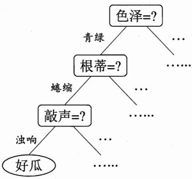  
图 4.1 西瓜问题的一棵决策树

显然, 决策过程的最终结论对应了我们所希望的判定结果, 例如 “是” 或 “不是” 好瓜; 决策过程中提出的每个判定问题都是对某个属性的 “测试”, 例如 “色泽=?” “根蒂=?”; 每个测试的结果或是导出最终结论, 或是导出进一步的判定问题, 其考虑范围是在上次决策结果的限定范围之内, 例如若在 “色泽=青绿” 之后再判断 “根蒂=?” , 则仅在考虑青绿色瓜的根蒂.

一般的, 一棵决策树包含一个根结点、若干个内部结点和若干个叶结点;

叶结点对应于决策结果, 其他每个结点则对应于一个属性测试; 每个结点包含的样本集合根据属性测试的结果被划分到子结点中; 根结点包含样本全集. 从根结点到每个叶结点的路径对应了一个判定测试序列. 决策树学习的目的是为了产生一棵泛化能力强, 即处理未见示例能力强的决策树, 其基本流程遵循简单且直观的 “分而治之” (divide-and-conquer) 策略, 如图 4.2 所示.

输入: 训练集 $D = \{(x_1, y_1), (x_2, y_2), \ldots, (x_m, y_m)\}$;
属性集 $A = \{a_1, a_2, \ldots, a_d\}$.

过程: 函数 TreeGenerate(D, A)
1: 生成结点 node;
2: if D 中样本全属于同一类别 C then
3: 将 node 标记为 C 类叶结点; return
4: end if
5: if $A = \varnothing$ OR D 中样本在 A 上取值相同 then
6: 将 node 标记为叶结点, 其类别标记为 D 中样本数最多的类; return
7: end if
8: 从 A 中选择最优划分属性 $a_*$;
9: for $a_*$ 的每一个值 $a_*^v$ do
10: 为 node 生成一个分支; 令 $D_v$ 表示 D 中在 $a_*$ 上取值为 $a_*^v$ 的样本子集;
11: if $D_v$ 为空 then
12: 将分支结点标记为叶结点, 其类别标记为 D 中样本最多的类; return
13: else
14: 以 TreeGenerate($D_v$, $A \setminus \{a_*\}$)为分支结点
15: end if
16: end for

输出: 以 node 为根结点的一棵决策树

图 4.2 决策树学习基本算法

显然, 决策树的生成是一个递归过程. 在决策树基本算法中, 有三种情形会导致递归返回: (1) 当前结点包含的样本全属于同一类别, 无需划分; (2) 当前属性集为空, 或是所有样本在所有属性上取值相同, 无法划分; (3) 当前结点包含的样本集合为空, 不能划分.

在第(2)种情形下, 我们把当前结点标记为叶结点, 并将其类别设定为该结点所含样本最多的类别; 在第(3)种情形下, 同样把当前结点标记为叶结点, 但将其类别设定为其父结点所含样本最多的类别. 注意这两种情形的处理实质不同: 情形(2)是在利用当前结点的后验分布, 而情形(3)则是把父结点的样本分布作为当前结点的先验分布.

## 4.2 划分选择

由算法 4.2 可看出, 决策树学习的关键是第 8 行, 即如何选择最优划分属性. 一般而言, 随着划分过程不断进行, 我们希望决策树的分支结点所包含的样本尽可能属于同一类别, 即结点的 “纯度” (purity) 越来越高.

## 4.2.1 信息增益

“信息熵”(information entropy)是度量样本集合纯度最常用的一种指标.假定当前样本集合 $D$ 中第 $k$ 类样本所占的比例为 $p_k$ ( $k = 1,2,\ldots,|\mathcal{Y}|$ ), 则 $D$ 的信息熵定义为

计算信息熵时约定：若 $p = 0$ ，则 $p\log_2p = 0$

$$
\operatorname{Ent} (D) = - \sum_ {k = 1} ^ {| \mathcal {Y} |} p _ {k} \log_ {2} p _ {k}.\tag{4.1}
$$

Ent(D) 的最小值为 0, 最大值为 $\log_2 |\mathcal{Y}|$ .

Ent(D) 的值越小, 则 D 的纯度越高.

假定离散属性 $a$ 有 $V$ 个可能的取值 $\{a^1, a^2, \ldots, a^V\}$ , 若使用 $a$ 来对样本集 $D$ 进行划分, 则会产生 $V$ 个分支结点, 其中第 $v$ 个分支结点包含了 $D$ 中所有在属性 $a$ 上取值为 $a^v$ 的样本, 记为 $D^v$ . 我们可根据式(4.1)计算出 $D^v$ 的信息熵, 再考虑到不同的分支结点所包含的样本数不同, 给分支结点赋予权重 $|D^v| / |D|$ , 即样本数越多的分支结点的影响越大, 于是可计算出用属性 $a$ 对样本集 $D$ 进行划分所获得的“信息增益” (information gain)

$$
\operatorname{Gain} (D, a) = \operatorname{Ent} (D) - \sum_ {v = 1} ^ {V} \frac {| D ^ {v} |}{| D |} \operatorname{Ent} (D ^ {v}).\tag{4.2}
$$

一般而言, 信息增益越大, 则意味着使用属性 $a$ 来进行划分所获得的“纯度提升”越大. 因此, 我们可用信息增益来进行决策树的划分属性选择, 即在图4.2算法第8行选择属性 $a_{*} = \arg \max_{a \in A} \operatorname{Gain}(D, a)$ . 著名的ID3决策树学习算法 [Quinlan, 1986] 就是以信息增益为准则来选择划分属性.

ID3 名字中的 ID 是 Iterative Dichotomiser (迭代二分器)的简称.

以表4.1中的西瓜数据集2.0为例, 该数据集包含17个训练样例, 用以学习一棵能预测没剖开的是不是好瓜的决策树. 显然, $|\mathcal{Y}| = 2$ . 在决策树学习开始时, 根结点包含 $D$ 中的所有样例, 其中正例占 $p_1 = \frac{8}{17}$ , 反例占 $p_2 = \frac{9}{17}$ . 于是, 根据式(4.1)可计算出根结点的信息熵为

$$
\operatorname{Ent} (D) = - \sum_ {k = 1} ^ {2} p _ {k} \log_ {2} p _ {k} = - \left(\frac {8}{1 7} \log_ {2} \frac {8}{1 7} + \frac {9}{1 7} \log_ {2} \frac {9}{1 7}\right) = 0. 9 9 8.
$$

表 4.1 西瓜数据集 2.0

<table><tr><td>编号</td><td>色泽</td><td>根蒂</td><td>敲声</td><td>纹理</td><td>脐部</td><td>触感</td><td>好瓜</td></tr><tr><td>1</td><td>青绿</td><td>蜷缩</td><td>浊响</td><td>清晰</td><td>凹陷</td><td>硬滑</td><td>是</td></tr><tr><td>2</td><td>乌黑</td><td>蜷缩</td><td>沉闷</td><td>清晰</td><td>凹陷</td><td>硬滑</td><td>是</td></tr><tr><td>3</td><td>乌黑</td><td>蜷缩</td><td>浊响</td><td>清晰</td><td>凹陷</td><td>硬滑</td><td>是</td></tr><tr><td>4</td><td>青绿</td><td>蜷缩</td><td>沉闷</td><td>清晰</td><td>凹陷</td><td>硬滑</td><td>是</td></tr><tr><td>5</td><td>浅白</td><td>蜷缩</td><td>浊响</td><td>清晰</td><td>凹陷</td><td>硬滑</td><td>是</td></tr><tr><td>6</td><td>青绿</td><td>稍蜷</td><td>浊响</td><td>清晰</td><td>稍凹</td><td>软粘</td><td>是</td></tr><tr><td>7</td><td>乌黑</td><td>稍蜷</td><td>浊响</td><td>稍糊</td><td>稍凹</td><td>软粘</td><td>是</td></tr><tr><td>8</td><td>乌黑</td><td>稍蜷</td><td>浊响</td><td>清晰</td><td>稍凹</td><td>硬滑</td><td>是</td></tr><tr><td>9</td><td>乌黑</td><td>稍蜷</td><td>沉闷</td><td>稍糊</td><td>稍凹</td><td>硬滑</td><td>否</td></tr><tr><td>10</td><td>青绿</td><td>硬挺</td><td>清脆</td><td>清晰</td><td>平坦</td><td>软粘</td><td>否</td></tr><tr><td>11</td><td>浅白</td><td>硬挺</td><td>清脆</td><td>模糊</td><td>平坦</td><td>硬滑</td><td>否</td></tr><tr><td>12</td><td>浅白</td><td>蜷缩</td><td>浊响</td><td>模糊</td><td>平坦</td><td>软粘</td><td>否</td></tr><tr><td>13</td><td>青绿</td><td>稍蜷</td><td>浊响</td><td>稍糊</td><td>凹陷</td><td>硬滑</td><td>否</td></tr><tr><td>14</td><td>浅白</td><td>稍蜷</td><td>沉闷</td><td>稍糊</td><td>凹陷</td><td>硬滑</td><td>否</td></tr><tr><td>15</td><td>乌黑</td><td>稍蜷</td><td>浊响</td><td>清晰</td><td>稍凹</td><td>软粘</td><td>否</td></tr><tr><td>16</td><td>浅白</td><td>蜷缩</td><td>浊响</td><td>模糊</td><td>平坦</td><td>硬滑</td><td>否</td></tr><tr><td>17</td><td>青绿</td><td>蜷缩</td><td>沉闷</td><td>稍糊</td><td>稍凹</td><td>硬滑</td><td>否</td></tr></table>

然后, 我们要计算出当前属性集合 {色泽, 根蒂, 敲声, 纹理, 脐部, 触感} 中每个属性的信息增益. 以属性 “色泽” 为例, 它有 3 个可能的取值: {青绿, 乌黑, 浅白}. 若使用该属性对 $D$ 进行划分, 则可得到 3 个子集, 分别记为: $D^{1}$ (色泽=青绿), $D^{2}$ (色泽=乌黑), $D^{3}$ (色泽=浅白).

子集 $D^{1}$ 包含编号为 $\{1, 4, 6, 10, 13, 17\}$ 的 6 个样例, 其中正例占 $p_{1} = \frac{3}{6}$ , 反例占 $p_{2} = \frac{3}{6}$ ; $D^{2}$ 包含编号为 $\{2, 3, 7, 8, 9, 15\}$ 的 6 个样例, 其中正、反例分别占 $p_{1} = \frac{4}{6}$ , $p_{2} = \frac{2}{6}$ ; $D^{3}$ 包含编号为 $\{5, 11, 12, 14, 16\}$ 的 5 个样例, 其中正、反例分别占 $p_{1} = \frac{1}{5}$ , $p_{2} = \frac{4}{5}$ . 根据式(4.1)可计算出用“色泽”划分之后所获得的 3 个分支结点的信息熵为

$$
\operatorname{Ent} (D ^ {1}) = - \left(\frac {3}{6} \log_ {2} \frac {3}{6} + \frac {3}{6} \log_ {2} \frac {3}{6}\right) = 1. 0 0 0,
$$

$$
\operatorname{Ent} (D ^ {2}) = - \left(\frac {4}{6} \log_ {2} \frac {4}{6} + \frac {2}{6} \log_ {2} \frac {2}{6}\right) = 0. 9 1 8,
$$

$$
\operatorname{Ent} (D ^ {3}) = - \left(\frac {1}{5} \log_ {2} \frac {1}{5} + \frac {4}{5} \log_ {2} \frac {4}{5}\right) = 0. 7 2 2,
$$

于是, 根据式(4.2)可计算出属性 “色泽” 的信息增益为

$$
\begin{array}{r l} \mathrm{Gain} (D, \text {色泽}) & = \mathrm{Ent} (D) - \sum_ {v = 1} ^ {3} \frac {| D ^ {v} |}{| D |} \mathrm{Ent} (D ^ {v}) \\ & = 0. 9 9 8 - \left(\frac {6}{1 7} \times 1. 0 0 0 + \frac {6}{1 7} \times 0. 9 1 8 + \frac {5}{1 7} \times 0. 7 2 2\right) \\ & = 0. 1 0 9. \end{array}
$$

类似的, 我们可计算出其他属性的信息增益:

$$
\operatorname{Gain} (D, \text { 根蒂 }) = 0. 1 4 3; \quad \operatorname{Gain} (D, \text { 敲声 }) = 0. 1 4 1;
$$

$$
\operatorname{Gain} (D, \text { 纹理 }) = 0. 3 8 1; \operatorname{Gain} (D, \text { 脐部 }) = 0. 2 8 9;
$$

$$
\operatorname{Gain} (D, \text {触感}) = 0. 0 0 6.
$$

显然, 属性 “纹理” 的信息增益最大, 于是它被选为划分属性. 图 4.3 给出了基于 “纹理” 对根结点进行划分的结果, 各分支结点所包含的样例子集显示在结点中.

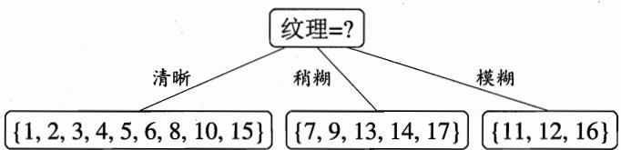  
图 4.3 基于 “纹理” 属性对根结点划分

然后, 决策树学习算法将对每个分支结点做进一步划分. 以图4.3中第一个分支结点(“纹理=清晰”)为例, 该结点包含的样例集合 $D^{1}$ 中有编号为 $\{1, 2, 3, 4, 5, 6, 8, 10, 15\}$ 的9个样例, 可用属性集合为 $\{\text{色泽}, \text{根蒂}, \text{敲声}, \text{脐部}, \text{触感}\}$ . 基于 $D^{1}$ 计算出各属性的信息增益:

“纹理”不再作为候选划分属性.

$$
\begin{array}{l l} {{\mathrm{Gain} (D ^ {1}, \text {色泽}) = 0. 0 4 3;}} & {{\mathrm{Gain} (D ^ {1}, \text {根蒂}) = 0. 4 5 8;}} \\ {{\mathrm{Gain} (D ^ {1}, \text {敲声}) = 0. 3 3 1;}} & {{\mathrm{Gain} (D ^ {1}, \text {脐部}) = 0. 4 5 8;}} \\ {{\mathrm{Gain} (D ^ {1}, \text {触感}) = 0. 4 5 8.}} \end{array}
$$

“根蒂”、“脐部”、“触感”3个属性均取得了最大的信息增益, 可任选其中之一作为划分属性. 类似的, 对每个分支结点进行上述操作, 最终得到的决策树如图4.4所示.

## 4.2.2 增益率

在上面的介绍中, 我们有意忽略了表 4.1 中的 “编号” 这一列. 若把 “编号”也作为一个候选划分属性, 则根据式(4.2)可计算出它的信息增益为 0.998, 远大于其他候选划分属性. 这很容易理解: “编号” 将产生 17 个分支, 每个分支结点仅包含一个样本, 这些分支结点的纯度已达最大. 然而, 这样的决策树显然不具有泛化能力, 无法对新样本进行有效预测.

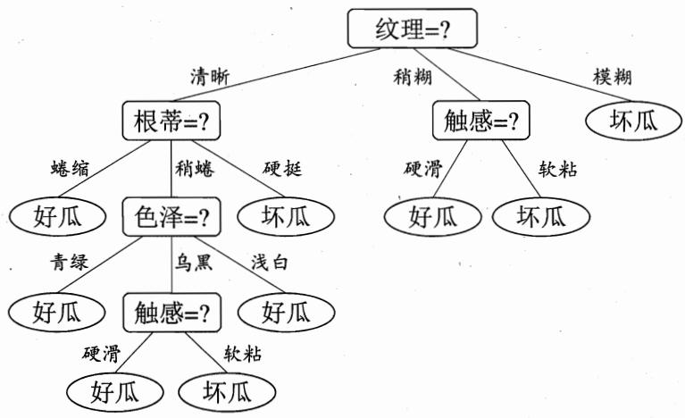  
图 4.4 在西瓜数据集 2.0 上基于信息增益生成的决策树

实际上, 信息增益准则对可取值数目较多的属性有所偏好, 为减少这种偏好可能带来的不利影响, 著名的 C4.5 决策树算法 [Quinlan, 1993] 不直接使用信息增益, 而是使用 “增益率” (gain ratio) 来选择最优划分属性. 采用与式(4.2)相同的符号表示, 增益率定义为

$$
\text { Gain\_ratio } (D, a) = \frac {\text { Gain } (D , a)}{\text { IV } (a)}  ,\tag{4.3}
$$

其中

$$
\operatorname{IV} (a) = - \sum_ {v = 1} ^ {V} \frac {| D ^ {v} |}{| D |} \log_ {2} \frac {| D ^ {v} |}{| D |}\tag{4.4}
$$

称为属性 $a$ 的“固有值”(intrinsic value) [Quinlan, 1993]. 属性 $a$ 的可能取值数目越多(即 $V$ 越大), 则 $\mathrm{IV}(a)$ 的值通常会越大. 例如, 对表4.1的西瓜数据集2.0, 有 $\mathrm{IV}(\text{触感}) = 0.874 (V = 2)$ , $\mathrm{IV}(\text{色泽}) = 1.580 (V = 3)$ , $\mathrm{IV}(\text{编号}) = 4.088 (V = 17)$ .

需注意的是, 增益率准则对可取值数目较少的属性有所偏好, 因此, C4.5 算法并不是直接选择增益率最大的候选划分属性, 而是使用了一个启发式[Quinlan, 1993]: 先从候选划分属性中找出信息增益高于平均水平的属性, 再从中选择增益率最高的.

CART 是 Classification and Regression Tree 的简称, 这是一种著名的决策树学习算法, 分类和回归任务都可用.

## 4.2.3 基尼指数

CART 决策树 [Breiman et al., 1984] 使用 “基尼指数” (Gini index) 来选择划分属性. 采用与式(4.1) 相同的符号, 数据集 D 的纯度可用基尼值来度量:

$$
\begin{array}{c} \operatorname{Gini} (D) = \sum_ {k = 1} ^ {| \mathcal {Y} |} \sum_ {k ^ {\prime} \neq k} p _ {k} p _ {k ^ {\prime}} \\ = 1 - \sum_ {k = 1} ^ {| \mathcal {Y} |} p _ {k} ^ {2}. \end{array}\tag{4.5}
$$

直观来说, $\operatorname{Gini}(D)$ 反映了从数据集 $D$ 中随机抽取两个样本, 其类别标记不一致的概率. 因此, $\operatorname{Gini}(D)$ 越小, 则数据集 $D$ 的纯度越高.

采用与式(4.2)相同的符号表示, 属性 a 的基尼指数定义为

$$
\text { Gini\_index } (D, a) = \sum_ {v = 1} ^ {V} \frac {| D ^ {v} |}{| D | .} \text { Gini } (D ^ {v}) .\tag{4.6}
$$

于是, 我们在候选属性集合 $A$ 中, 选择那个使得划分后基尼指数最小的属性作为最优划分属性, 即 $a_{*} = \underset{a \in A}{\arg \min} \operatorname{Gini\_index}(D, a)$ .

## 4.3 剪枝处理

关于过拟合,参见2.1节.

剪枝(pruning)是决策树学习算法对付“过拟合”的主要手段. 在决策树学习中, 为了尽可能正确分类训练样本, 结点划分过程将不断重复, 有时会造成决策树分支过多, 这时就可能因训练样本学得“太好”了, 以致于把训练集自身的一些特点当作所有数据都具有的一般性质而导致过拟合. 因此, 可通过主动去掉一些分支来降低过拟合的风险.

决策树剪枝的基本策略有“预剪枝”(prepruning)和“后剪枝”(post-pruning)[Quinlan, 1993]. 预剪枝是指在决策树生成过程中, 对每个结点在划分前先进行估计, 若当前结点的划分不能带来决策树泛化性能提升, 则停止划分并将当前结点标记为叶结点; 后剪枝则是先从训练集生成一棵完整的决策树, 然后自底向上地对非叶结点进行考察, 若将该结点对应的子树替换为叶结点能带来决策树泛化性能提升, 则将该子树替换为叶结点.

如何判断决策树泛化性能是否提升呢？这可使用2.2节介绍的性能评估方法。本节假定采用留出法，即预留一部分数据用作“验证集”以进行性能评估。例如对表4.1的西瓜数据集2.0，我们将其随机划分为两部分，如表4.2所示，编号为 $\{1,2,3,6,7,10,14,15,16,17\}$ 的样例组成训练集，编号为 $\{4,5,8,9,11,12,13\}$ 的样例组成验证集。

表 4.2 西瓜数据集 2.0 划分出的训练集(双线上部)与验证集(双线下部)

<table><tr><td>编号</td><td>色泽</td><td>根蒂</td><td>敲声</td><td>纹理</td><td>脐部</td><td>触感</td><td>好瓜</td></tr><tr><td>1</td><td>青绿</td><td>蜷缩</td><td>浊响</td><td>清晰</td><td>凹陷</td><td>硬滑</td><td>是</td></tr><tr><td>2</td><td>乌黑</td><td>蜷缩</td><td>沉闷</td><td>清晰</td><td>凹陷</td><td>硬滑</td><td>是</td></tr><tr><td>3</td><td>乌黑</td><td>蜷缩</td><td>浊响</td><td>清晰</td><td>凹陷</td><td>硬滑</td><td>是</td></tr><tr><td>6</td><td>青绿</td><td>稍蜷</td><td>浊响</td><td>清晰</td><td>稍凹</td><td>软粘</td><td>是</td></tr><tr><td>7</td><td>乌黑</td><td>稍蜷</td><td>浊响</td><td>稍糊</td><td>稍凹</td><td>软粘</td><td>是</td></tr><tr><td>10</td><td>青绿</td><td>硬挺</td><td>清脆</td><td>清晰</td><td>平坦</td><td>软粘</td><td>否</td></tr><tr><td>14</td><td>浅白</td><td>稍蜷</td><td>沉闷</td><td>稍糊</td><td>凹陷</td><td>硬滑</td><td>否</td></tr><tr><td>15</td><td>乌黑</td><td>稍蜷</td><td>浊响</td><td>清晰</td><td>稍凹</td><td>软粘</td><td>否</td></tr><tr><td>16</td><td>浅白</td><td>蜷缩</td><td>浊响</td><td>模糊</td><td>平坦</td><td>硬滑</td><td>否</td></tr><tr><td>17</td><td>青绿</td><td>蜷缩</td><td>沉闷</td><td>稍糊</td><td>稍凹</td><td>硬滑</td><td>否</td></tr><tr><td>编号</td><td>色泽</td><td>根蒂</td><td>敲声</td><td>纹理</td><td>脐部</td><td>触感</td><td>好瓜</td></tr><tr><td>4</td><td>青绿</td><td>蜷缩</td><td>沉闷</td><td>清晰</td><td>凹陷</td><td>硬滑</td><td>是</td></tr><tr><td>5</td><td>浅白</td><td>蜷缩</td><td>浊响</td><td>清晰</td><td>凹陷</td><td>硬滑</td><td>是</td></tr><tr><td>8</td><td>乌黑</td><td>稍蜷</td><td>浊响</td><td>清晰</td><td>稍凹</td><td>硬滑</td><td>是</td></tr><tr><td>9</td><td>乌黑</td><td>稍蜷</td><td>沉闷</td><td>稍糊</td><td>稍凹</td><td>硬滑</td><td>否</td></tr><tr><td>11</td><td>浅白</td><td>硬挺</td><td>清脆</td><td>模糊</td><td>平坦</td><td>硬滑</td><td>否</td></tr><tr><td>12</td><td>浅白</td><td>蜷缩</td><td>浊响</td><td>模糊</td><td>平坦</td><td>软粘</td><td>否</td></tr><tr><td>13</td><td>青绿</td><td>稍蜷</td><td>浊响</td><td>稍糊</td><td>凹陷</td><td>硬滑</td><td>否</td></tr></table>

假定我们采用4.2.1节的信息增益准则来进行划分属性选择, 则从表4.2的训练集将会生成一棵如图4.5所示的决策树. 为便于讨论, 我们对图中的部分结点做了编号.

## 4.3.1 预剪枝

我们先讨论预剪枝. 基于信息增益准则, 我们会选取属性 “脐部” 来对训练集进行划分, 并产生 3 个分支, 如图 4.6 所示. 然而, 是否应该进行这个划分呢? 预剪枝要对划分前后的泛化性能进行估计.

在划分之前, 所有样例集中在根结点. 若不进行划分, 则根据算法 4.2 第 6 行, 该结点将被标记为叶结点, 其类别标记为训练样例数最多的类别, 假设我们将这个叶结点标记为“好瓜”。用表4.2的验证集对这个单结点决策树进行评估, 则编号为 $\{4,5,8\}$ 的样例被分类正确, 另外4个样例分类错误, 于是, 验证集精度为 $\frac{3}{7} \times 100\% = 42.9\%$ .

图 4.5 基于表 4.2 生成的未剪枝决策树  
  
图 4.6 基于表 4.2 生成的预剪枝决策树  
当样例最多的类不唯一时, 可任选其中一类.

在用属性“脐部”划分之后，图4.6中的结点②、③、④分别包含编号为 $\{1,2,3,14\}$ 、 $\{6,7,15,17\}$ 、 $\{10,16\}$ 的训练样例，因此这3个结点分别被标记为叶结点“好瓜”、“好瓜”、“坏瓜”。此时，验证集中编号为 $\{4,5,8,11,12\}$ 的样例被分类正确，验证集精度为 $\frac{5}{7} \times 100\% = 71.4\% >42.9\%$ 。于是，用“脐部”进行划分得以确定。

然后, 决策树算法应该对结点②进行划分, 基于信息增益准则将挑选出划分属性 “色泽”. 然而, 在使用 “色泽” 划分后, 编号为 {5} 的验证集样本分类结果会由正确转为错误, 使得验证集精度下降为 57.1%. 于是, 预剪枝策略将禁止结点②被划分.

对结点③, 最优划分属性为 “根蒂”, 划分后验证集精度仍为 71.4%. 这个划分不能提升验证集精度, 于是, 预剪枝策略禁止结点③被划分.

对结点④, 其所含训练样例已属于同一类, 不再进行划分.

于是, 基于预剪枝策略从表 4.2 数据所生成的决策树如图 4.6 所示, 其验证集精度为 71.4%. 这是一棵仅有一层划分的决策树, 亦称 “决策树桩” (decision stump).

对比图 4.6 和图 4.5 可看出, 预剪枝使得决策树的很多分支都没有 “展开”, 这不仅降低了过拟合的风险, 还显著减少了决策树的训练时间开销和测试时间开销. 但另一方面, 有些分支的当前划分虽不能提升泛化性能、甚至可能导致泛化性能暂时下降, 但在其基础上进行的后续划分却有可能导致性能显著提高; 预剪枝基于 “贪心” 本质禁止这些分支展开, 给预剪枝决策树带来了欠拟合的风险.

## 4.3.2 后剪枝

后剪枝先从训练集生成一棵完整决策树, 例如基于表 4.2 的数据我们得到如图 4.5 所示的决策树. 易知, 该决策树的验证集精度为 42.9%.

后剪枝首先考察图 4.5 中的结点⑥. 若将其领衔的分支剪除, 则相当于把⑥替换为叶结点. 替换后的叶结点包含编号为 $\{7,15\}$ 的训练样本, 于是, 该叶结点的类别标记为“好瓜”, 此时决策树的验证集精度提高至 $57.1\%$ . 于是, 后剪枝策略决定剪枝, 如图 4.7 所示.

此种情形下验证集精度虽无提高，但根据奥卡姆剃刀准则，剪枝后的模型更好。因此，实际的决策树算法在此种情形下通常要进行剪枝。本书为绘图的方便，采取了不剪枝的保守策略。

然后考察结点⑤, 若将其领衔的子树替换为叶结点, 则替换后的叶结点包含编号为 $\{6,7,15\}$ 的训练样例, 叶结点类别标记为“好瓜”, 此时决策树验证集精度仍为 $57.1\%$ . 于是, 可以不进行剪枝.

对结点②, 若将其领衔的子树替换为叶结点, 则替换后的叶结点包含编号为 $\{1,2,3,14\}$ 的训练样例, 叶结点标记为“好瓜”. 此时决策树的验证集精度提高至 $71.4\%$ . 于是, 后剪枝策略决定剪枝.

对结点③和①, 若将其领衔的子树替换为叶结点, 则所得决策树的验证集精度分别为 $71.4\%$ 与 $42.9\%$ , 均未得到提高. 于是它们被保留.

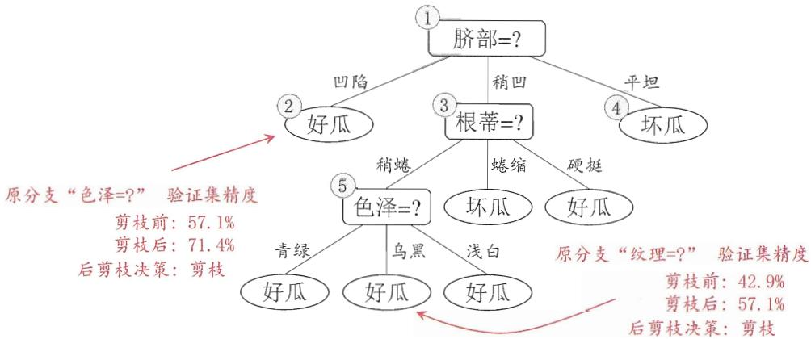  
图 4.7 基于表 4.2 生成的后剪枝决策树

最终, 基于后剪枝策略从表 4.2 数据所生成的决策树如图 4.7 所示, 其验证集精度为 71.4%.

对比图 4.7 和图 4.6 可看出, 后剪枝决策树通常比预剪枝决策树保留了更多的分支. 一般情形下, 后剪枝决策树的欠拟合风险很小, 泛化性能往往优于预剪枝决策树. 但后剪枝过程是在生成完全决策树之后进行的, 并且要自底向上地对树中的所有非叶结点进行逐一考察, 因此其训练时间开销比未剪枝决策树和预剪枝决策树都要大得多.

## 4.4 连续与缺失值

## 4.4.1 连续值处理

到目前为止我们仅讨论了基于离散属性来生成决策树. 现实学习任务中常会遇到连续属性, 有必要讨论如何在决策树学习中使用连续属性.

由于连续属性的可取值数目不再有限, 因此, 不能直接根据连续属性的可取值来对结点进行划分. 此时, 连续属性离散化技术可派上用场. 最简单的策略是采用二分法(bi-partition)对连续属性进行处理, 这正是 C4.5 决策树算法中采用的机制 [Quinlan, 1993].

给定样本集 $D$ 和连续属性 $a$ , 假定 $a$ 在 $D$ 上出现了 $n$ 个不同的取值, 将这些值从小到大进行排序, 记为 $\{a^1, a^2, \ldots, a^n\}$ . 基于划分点 $t$ 可将 $D$ 分为子集 $D_t^-$ 和 $D_t^+$ , 其中 $D_t^-$ 包含那些在属性 $a$ 上取值不大于 $t$ 的样本, 而 $D_t^+$ 则包含那些在属性 $a$ 上取值大于 $t$ 的样本. 显然, 对相邻的属性取值 $a^i$ 与 $a^{i+1}$ 来说, $t$ 在区间 $[a^i, a^{i+1})$ 中取任意值所产生的划分结果相同. 因此, 对连续属性 $a$ , 我们可考察包含 $n-1$ 个元素的候选划分点集合

$$
T _ {a} = \left\{\frac {a ^ {i} + a ^ {i + 1}}{2} \mid 1 \leqslant i \leqslant n - 1 \right\},\tag{4.7}
$$

可将划分点设为该属性在训练集中出现的不大于中位点的最大值，从而使得最终决策树使用的划分点都在训练集中出现过[Quinlan, 1993].

即把区间 $[a^i, a^{i+1})$ 的中位点 $\frac{a^i + a^{i+1}}{2}$ 作为候选划分点. 然后, 我们就可像离散属性值一样来考察这些划分点, 选取最优的划分点进行样本集合的划分. 例如, 可对式(4.2)稍加改造:

$$
\begin{array}{l} \operatorname{Gain} (D, a) = \max _ {t \in T _ {a}} \operatorname{Gain} (D, a, t) \\ = \max _ {t \in T _ {a}} \operatorname{Ent} (D) - \sum_ {\lambda \in \{-, + \}} \frac {| D _ {t} ^ {\lambda} |}{| D |} \operatorname{Ent} (D _ {t} ^ {\lambda}), \end{array}\tag{4.8}
$$

其中 $\operatorname{Gain}(D, a, t)$ 是样本集 $D$ 基于划分点 $t$ 二分后的信息增益. 于是, 我们就可选择使 $\operatorname{Gain}(D, a, t)$ 最大化的划分点.

作为一个例子, 我们在表 4.1 的西瓜数据集 2.0 上增加两个连续属性 “密度” 和 “含糖率”, 得到表 4.3 所示的西瓜数据集 3.0. 下面我们用这个数据集来生成一棵决策树.

表 4.3 西瓜数据集 3.0

<table><tr><td>编号</td><td>色泽</td><td>根蒂</td><td>敲声</td><td>纹理</td><td>脐部</td><td>触感</td><td>密度</td><td>含糖率</td><td>好瓜</td></tr><tr><td>1</td><td>青绿</td><td>蜷缩</td><td>浊响</td><td>清晰</td><td>凹陷</td><td>硬滑</td><td>0.697</td><td>0.460</td><td>是</td></tr><tr><td>2</td><td>乌黑</td><td>蜷缩</td><td>沉闷</td><td>清晰</td><td>凹陷</td><td>硬滑</td><td>0.774</td><td>0.376</td><td>是</td></tr><tr><td>3</td><td>乌黑</td><td>蜷缩</td><td>浊响</td><td>清晰</td><td>凹陷</td><td>硬滑</td><td>0.634</td><td>0.264</td><td>是</td></tr><tr><td>4</td><td>青绿</td><td>蜷缩</td><td>沉闷</td><td>清晰</td><td>凹陷</td><td>硬滑</td><td>0.608</td><td>0.318</td><td>是</td></tr><tr><td>5</td><td>浅白</td><td>蜷缩</td><td>浊响</td><td>清晰</td><td>凹陷</td><td>硬滑</td><td>0.556</td><td>0.215</td><td>是</td></tr><tr><td>6</td><td>青绿</td><td>稍蜷</td><td>浊响</td><td>清晰</td><td>稍凹</td><td>软粘</td><td>0.403</td><td>0.237</td><td>是</td></tr><tr><td>7</td><td>乌黑</td><td>稍蜷</td><td>浊响</td><td>稍糊</td><td>稍凹</td><td>软粘</td><td>0.481</td><td>0.149</td><td>是</td></tr><tr><td>8</td><td>乌黑</td><td>稍蜷</td><td>浊响</td><td>清晰</td><td>稍凹</td><td>硬滑</td><td>0.437</td><td>0.211</td><td>是</td></tr><tr><td>9</td><td>乌黑</td><td>稍蜷</td><td>沉闷</td><td>稍糊</td><td>稍凹</td><td>硬滑</td><td>0.666</td><td>0.091</td><td>否</td></tr><tr><td>10</td><td>青绿</td><td>硬挺</td><td>清脆</td><td>清晰</td><td>平坦</td><td>软粘</td><td>0.243</td><td>0.267</td><td>否</td></tr><tr><td>11</td><td>浅白</td><td>硬挺</td><td>清脆</td><td>模糊</td><td>平坦</td><td>硬滑</td><td>0.245</td><td>0.057</td><td>否</td></tr><tr><td>12</td><td>浅白</td><td>蜷缩</td><td>浊响</td><td>模糊</td><td>平坦</td><td>软粘</td><td>0.343</td><td>0.099</td><td>否</td></tr><tr><td>13</td><td>青绿</td><td>稍蜷</td><td>浊响</td><td>稍糊</td><td>凹陷</td><td>硬滑</td><td>0.639</td><td>0.161</td><td>否</td></tr><tr><td>14</td><td>浅白</td><td>稍蜷</td><td>沉闷</td><td>稍糊</td><td>凹陷</td><td>硬滑</td><td>0.657</td><td>0.198</td><td>否</td></tr><tr><td>15</td><td>乌黑</td><td>稍蜷</td><td>浊响</td><td>清晰</td><td>稍凹</td><td>软粘</td><td>0.360</td><td>0.370</td><td>否</td></tr><tr><td>16</td><td>浅白</td><td>蜷缩</td><td>浊响</td><td>模糊</td><td>平坦</td><td>硬滑</td><td>0.593</td><td>0.042</td><td>否</td></tr><tr><td>17</td><td>青绿</td><td>蜷缩</td><td>沉闷</td><td>稍糊</td><td>稍凹</td><td>硬滑</td><td>0.719</td><td>0.103</td><td>否</td></tr></table>

对属性“密度”，在决策树学习开始时，根结点包含的17个训练样本在该属性上取值均不同。根据式(4.7)，该属性的候选划分点集合包含16个候选值： $T_{\text{密度}} = \{0.244, 0.294, 0.351, 0.381, 0.420, 0.459, 0.518, 0.574, 0.600, 0.621, 0.636, 0.648, 0.661, 0.681, 0.708, 0.746\}$ 。由式(4.8)可计算出属性“密度”的信息增益为0.262，对应于划分点0.381。

对属性 “含糖率”，其候选划分点集合也包含 16 个候选值: $T_{\text{含糖率}} = \{0.049, 0.074, 0.095, 0.101, 0.126, 0.155, 0.179, 0.204, 0.213, 0.226, 0.250, 0.265, 0.292, 0.344, 0.373, 0.418\}$ . 类似的，根据式(4.8)可计算出其信息增益为 0.349，对应于划分点 0.126.

再由 4.2.1 节可知, 表 4.3 的数据上各属性的信息增益为

$$
\operatorname{Gain} (D, \text {色泽}) = 0. 1 0 9; \quad \operatorname{Gain} (D, \text {根蒂}) = 0. 1 4 3;
$$

$$
\operatorname{Gain} (D, \text { 敲声 }) = 0. 1 4 1; \quad \operatorname{Gain} (D, \text { 纹理 }) = 0. 3 8 1;
$$

$$
\operatorname{Gain} (D, \mathrm{脐部}) = 0. 2 8 9; \operatorname{Gain} (D, \mathrm{触感}) = 0. 0 0 6;
$$

$$
\operatorname{Gain} (D, \text {密度}) = 0. 2 6 2; \quad \operatorname{Gain} (D, \text {含糖率}) = 0. 3 4 9.
$$

于是，“纹理”被选作根结点划分属性，此后结点划分过程递归进行，最终生成如图4.8所示的决策树.

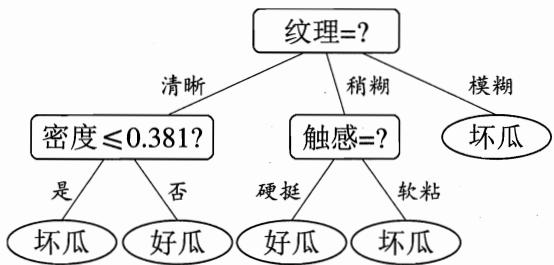  
图4.8 在西瓜数据集3.0上基于信息增益生成的决策树

例如在父结点上使用了“密度 $\leqslant0.381$ ”，不会禁止在子结点上使用“密度 $\leqslant0.294$ ”.

需注意的是, 与离散属性不同, 若当前结点划分属性为连续属性, 该属性还可作为其后代结点的划分属性.

## 4.4.2 缺失值处理

现实任务中常会遇到不完整样本, 即样本的某些属性值缺失. 例如由于诊测成本、隐私保护等因素, 患者的医疗数据在某些属性上的取值(如 HIV 测试结果)未知; 尤其是在属性数目较多的情况下, 往往会有大量样本出现缺失值. 如果简单地放弃不完整样本, 仅使用无缺失值的样本来进行学习, 显然是对数据信息极大的浪费. 例如, 表 4.4 是表 4.1 中的西瓜数据集 2.0 出现缺失值的版本, 如果放弃不完整样本, 则仅有编号 $\{4, 7, 14, 16\}$ 的 4 个样本能被使用. 显然, 有必要考虑利用有缺失属性值的训练样例来进行学习.

表 4.4 西瓜数据集 ${2.0\alpha }$

<table><tr><td>编号</td><td>色泽</td><td>根蒂</td><td>敲声</td><td>纹理</td><td>脐部</td><td>触感</td><td>好瓜</td></tr><tr><td>1</td><td>-</td><td>蜷缩</td><td>浊响</td><td>清晰</td><td>凹陷</td><td>硬滑</td><td>是</td></tr><tr><td>2</td><td>乌黑</td><td>蜷缩</td><td>沉闷</td><td>清晰</td><td>凹陷</td><td>-</td><td>是</td></tr><tr><td>3</td><td>乌黑</td><td>蜷缩</td><td>-</td><td>清晰</td><td>凹陷</td><td>硬滑</td><td>是</td></tr><tr><td>4</td><td>青绿</td><td>蜷缩</td><td>沉闷</td><td>清晰</td><td>凹陷</td><td>硬滑</td><td>是</td></tr><tr><td>5</td><td>-</td><td>蜷缩</td><td>浊响</td><td>清晰</td><td>凹陷</td><td>硬滑</td><td>是</td></tr><tr><td>6</td><td>青绿</td><td>稍蜷</td><td>浊响</td><td>清晰</td><td>-</td><td>软粘</td><td>是</td></tr><tr><td>7</td><td>乌黑</td><td>稍蜷</td><td>浊响</td><td>稍糊</td><td>稍凹</td><td>软粘</td><td>是</td></tr><tr><td>8</td><td>乌黑</td><td>稍蜷</td><td>浊响</td><td>-</td><td>稍凹</td><td>硬滑</td><td>是</td></tr><tr><td>9</td><td>乌黑</td><td>-</td><td>沉闷</td><td>稍糊</td><td>稍凹</td><td>硬滑</td><td>否</td></tr><tr><td>10</td><td>青绿</td><td>硬挺</td><td>清脆</td><td>-</td><td>平坦</td><td>软粘</td><td>否</td></tr><tr><td>11</td><td>浅白</td><td>硬挺</td><td>清脆</td><td>模糊</td><td>平坦</td><td>-</td><td>否</td></tr><tr><td>12</td><td>浅白</td><td>蜷缩</td><td>-</td><td>模糊</td><td>平坦</td><td>软粘</td><td>否</td></tr><tr><td>13</td><td>-</td><td>稍蜷</td><td>浊响</td><td>稍糊</td><td>凹陷</td><td>硬滑</td><td>否</td></tr><tr><td>14</td><td>浅白</td><td>稍蜷</td><td>沉闷</td><td>稍糊</td><td>凹陷</td><td>硬滑</td><td>否</td></tr><tr><td>15</td><td>乌黑</td><td>稍蜷</td><td>浊响</td><td>清晰</td><td>-</td><td>软粘</td><td>否</td></tr><tr><td>16</td><td>浅白</td><td>蜷缩</td><td>浊响</td><td>模糊</td><td>平坦</td><td>硬滑</td><td>否</td></tr><tr><td>17</td><td>青绿</td><td>-</td><td>沉闷</td><td>稍糊</td><td>稍凹</td><td>硬滑</td><td>否</td></tr></table>

我们需解决两个问题: (1) 如何在属性值缺失的情况下进行划分属性选择? (2) 给定划分属性, 若样本在该属性上的值缺失, 如何对样本进行划分?

在决策树学习开始阶段,根结点中各样本的权重初始化为 1.

给定训练集 $D$ 和属性 $a$ , 令 $\tilde{D}$ 表示 $D$ 中在属性 $a$ 上没有缺失值的样本子集. 对问题(1), 显然我们仅可根据 $\tilde{D}$ 来判断属性 $a$ 的优劣. 假定属性 $a$ 有 $V$ 个可取值 $\{a^1, a^2, \ldots, a^V\}$ , 令 $\tilde{D}^v$ 表示 $\tilde{D}$ 中在属性 $a$ 上取值为 $a^v$ 的样本子集, $\tilde{D}_k$ 表示 $\tilde{D}$ 中属于第 $k$ 类 ( $k = 1, 2, \ldots, |\mathcal{Y}|$ ) 的样本子集, 则显然有 $\tilde{D} = \bigcup_{k=1}^{|\mathcal{Y}|} \tilde{D}_k$ , $\tilde{D} = \bigcup_{v=1}^{V} \tilde{D}^v$ . 假定我们为每个样本 $x$ 赋予一个权重 $w_x$ , 并定义

$$
\rho = \frac {\sum_ {\boldsymbol {x} \in \tilde {D}} w _ {\boldsymbol {x}}}{\sum_ {\boldsymbol {x} \in D} w _ {\boldsymbol {x}}}  ,\tag{4.9}
$$

$$
\tilde {p} _ {k} = \frac {\sum_ {\boldsymbol {x} \in \tilde {D} _ {k}} w _ {\boldsymbol {x}}}{\sum_ {\boldsymbol {x} \in \tilde {D}} w _ {\boldsymbol {x}}} \quad (1 \leqslant k \leqslant | \mathcal {Y} |),\tag{4.10}
$$

$$
\tilde {r} _ {v} = \frac {\sum_ {\boldsymbol {x} \in \tilde {D} ^ {v}} w _ {\boldsymbol {x}}}{\sum_ {\boldsymbol {x} \in \tilde {D}} w _ {\boldsymbol {x}}} \quad (1 \leqslant v \leqslant V) .\tag{4.11}
$$

直观地看, 对属性 $a$ , $\rho$ 表示无缺失值样本所占的比例, $\tilde{p}_k$ 表示无缺失值样本中第 $k$ 类所占的比例, $\tilde{r}_v$ 则表示无缺失值样本中在属性 $a$ 上取值 $a^v$ 的样本所占的比例. 显然, $\sum_{k=1}^{|\mathcal{Y}|} \tilde{p}_k = 1$ , $\sum_{v=1}^{V} \tilde{r}_v = 1$ .

基于上述定义, 我们可将信息增益的计算式(4.2)推广为

$$
\begin{array}{l} \operatorname{Gain} (D, a) = \rho \times \operatorname{Gain} (\tilde {D}, a) \\ = \rho \times \left(\operatorname{Ent} (\tilde {D}) - \sum_ {v = 1} ^ {V} \tilde {r} _ {v} \operatorname{Ent} (\tilde {D} ^ {v})\right), \end{array}\tag{4.12}
$$

其中由式(4.1)，有

$$
\operatorname{Ent} (\tilde {D}) = - \sum_ {k = 1} ^ {| \mathcal {Y} |} \tilde {p} _ {k} \log_ {2} \tilde {p} _ {k}.
$$

对问题(2), 若样本 $\pmb{x}$ 在划分属性 $a$ 上的取值已知, 则将 $\pmb{x}$ 划入与其取值对应的子结点, 且样本权值在子结点中保持为 $w_{\pmb{x}}$ . 若样本 $\pmb{x}$ 在划分属性 $a$ 上的取值未知, 则将 $\pmb{x}$ 同时划入所有子结点, 且样本权值在与属性值 $a^v$ 对应的子结点中调整为 $\tilde{r}_v \cdot w_{\pmb{x}}$ ; 直观地看, 这就是让同一个样本以不同的概率划入到不同的子结点中去.

C4.5 算法使用了上述解决方案 [Quinlan, 1993]. 下面我们以表 4.4 的数据集为例来生成一棵决策树.

在学习开始时, 根结点包含样本集 $D$ 中全部 17 个样例, 各样例的权值均为 1. 以属性 “色泽” 为例, 该属性上无缺失值的样例子集 $\tilde{D}$ 包含编号为 $\{2,3,4,6,7,8,9,10,11,12,14,15,16,17\}$ 的 14 个样例. 显然, $\tilde{D}$ 的信息熵为

$$
\begin{array}{r l} \operatorname{Ent} (\tilde {D}) & = - \sum_ {k = 1} ^ {2} \tilde {p} _ {k} \log_ {2} \tilde {p} _ {k} \\ & = - \left(\frac {6}{1 4} \log_ {2} \frac {6}{1 4} + \frac {8}{1 4} \log_ {2} \frac {8}{1 4}\right) = 0. 9 8 5. \end{array}
$$

令 $\tilde{D}^{1}, \tilde{D}^{2}$ 与 $\tilde{D}^{3}$ 分别表示在属性 “色泽” 上取值为 “青绿” “乌黑” 以及 “浅白” 的样本子集, 有

$$
\operatorname{Ent} \left(\tilde {D} ^ {1}\right) = - \left(\frac {2}{4} \log_ {2} \frac {2}{4} + \frac {2}{4} \log_ {2} \frac {2}{4}\right) = 1. 0 0 0,
$$

$$
\operatorname{Ent} \left(\tilde {D} ^ {2}\right) = - \left(\frac {4}{6} \log_ {2} \frac {4}{6} + \frac {2}{6} \log_ {2} \frac {2}{6}\right) = 0. 9 1 8,
$$

$$
\operatorname{Ent} \left(\tilde {D} ^ {3}\right) = - \left(\frac {0}{4} \log_ {2} \frac {0}{4} + \frac {4}{4} \log_ {2} \frac {4}{4}\right) = 0. 0 0 0,
$$

因此, 样本子集 $\tilde{D}$ 上属性 “色泽” 的信息增益为

$$
\begin{array}{r l} \mathrm{Gain} (\tilde {D}, \text {色泽}) & = \mathrm{Ent} (\tilde {D}) - \sum_ {v = 1} ^ {3} \tilde {r} _ {v}   \mathrm{Ent} (\tilde {D} ^ {v}) \\ & = 0. 9 8 5 - \left(\frac {4}{1 4} \times 1. 0 0 0 + \frac {6}{1 4} \times 0. 9 1 8 + \frac {4}{1 4} \times 0. 0 0 0\right) \\ & = 0. 3 0 6 . \end{array}
$$

于是, 样本集 D 上属性 “色泽” 的信息增益为

$$
\operatorname{Gain} (D, \text {色泽}) = \rho \times \operatorname{Gain} (\tilde {D}, \text {色泽}) = \frac {1 4}{1 7} \times 0. 3 0 6 = 0. 2 5 2 .
$$

类似地可计算出所有属性在 D 上的信息增益:

$$
\operatorname{Gain} (D, \text {色泽}) = 0. 2 5 2; \quad \operatorname{Gain} (D, \text {根蒂}) = 0. 1 7 1;
$$

$$
\operatorname{Gain} (D, \mathrm{敲声}) = 0. 1 4 5; \operatorname{Gain} (D, \mathrm{纹理}) = 0. 4 2 4;
$$

$$
\operatorname{Gain} (D, \text { 脐部 }) = 0. 2 8 9; \quad \operatorname{Gain} (D, \text { 触感 }) = 0. 0 0 6.
$$

“纹理”在所有属性中取得了最大的信息增益, 被用于对根结点进行划分. 划分结果是使编号为 $\{1,2,3,4,5,6,15\}$ 的样本进入 “纹理= 清晰” 分支, 编号为 $\{7,9,13,14,17\}$ 的样本进入 “纹理= 稍糊” 分支, 而编号为 $\{11,12,16\}$ 的样本进入 “纹理= 模糊” 分支, 且样本在各子结点中的权重保持为 1. 需注意的是, 编号为 $\{8\}$ 的样本在属性 “纹理” 上出现了缺失值, 因此它将同时进入三个分支中, 但权重在三个子结点中分别调整为 $\frac{7}{15}$ 、 $\frac{5}{15}$ 和 $\frac{3}{15}$ . 编号为 $\{10\}$ 的样本有类似划分结果.

上述结点划分过程递归执行, 最终生成的决策树如图 4.9 所示.

## 4.5 多变量决策树

若我们把每个属性视为坐标空间中的一个坐标轴, 则 $d$ 个属性描述的样本就对应了 $d$ 维空间中的一个数据点, 对样本分类则意味着在这个坐标空间中寻找不同类样本之间的分类边界. 决策树所形成的分类边界有一个明显的特点: 轴平行(axis-parallel), 即它的分类边界由若干个与坐标轴平行的分段组成.

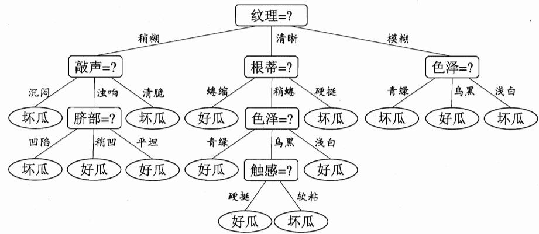  
图 4.9 在西瓜数据集 $2.0\alpha$ 上基于信息增益生成的决策树

以表 4.5 中的西瓜数据 $3.0\alpha$ 为例, 将它作为训练集可学得图 4.10 所示的决策树, 这棵树所对应的分类边界如图 4.11 所示.

西瓜数据集 $3.0\alpha$ 是由表4.3的西瓜数据集3.0忽略离散属性而得.

表 4.5 西瓜数据集 $3.0\alpha$

<table><tr><td>编号</td><td>密度</td><td>含糖率</td><td>好瓜</td></tr><tr><td>1</td><td>0.697</td><td>0.460</td><td>是</td></tr><tr><td>2</td><td>0.774</td><td>0.376</td><td>是</td></tr><tr><td>3</td><td>0.634</td><td>0.264</td><td>是</td></tr><tr><td>4</td><td>0.608</td><td>0.318</td><td>是</td></tr><tr><td>5</td><td>0.556</td><td>0.215</td><td>是</td></tr><tr><td>6</td><td>0.403</td><td>0.237</td><td>是</td></tr><tr><td>7</td><td>0.481</td><td>0.149</td><td>是</td></tr><tr><td>8</td><td>0.437</td><td>0.211</td><td>是</td></tr><tr><td>9</td><td>0.666</td><td>0.091</td><td>否</td></tr><tr><td>10</td><td>0.243</td><td>0.267</td><td>否</td></tr><tr><td>11</td><td>0.245</td><td>0.057</td><td>否</td></tr><tr><td>12</td><td>0.343</td><td>0.099</td><td>否</td></tr><tr><td>13</td><td>0.639</td><td>0.161</td><td>否</td></tr><tr><td>14</td><td>0.657</td><td>0.198</td><td>否</td></tr><tr><td>15</td><td>0.360</td><td>0.370</td><td>否</td></tr><tr><td>16</td><td>0.593</td><td>0.042</td><td>否</td></tr><tr><td>17</td><td>0.719</td><td>0.103</td><td>否</td></tr></table>

显然, 分类边界的每一段都是与坐标轴平行的. 这样的分类边界使得学习结果有较好的可解释性, 因为每一段划分都直接对应了某个属性取值. 但在学习任务的真实分类边界比较复杂时, 必须使用很多段划分才能获得较好的近似,如图 4.12 所示; 此时的决策树会相当复杂, 由于要进行大量的属性测试, 预测时间开销会很大.

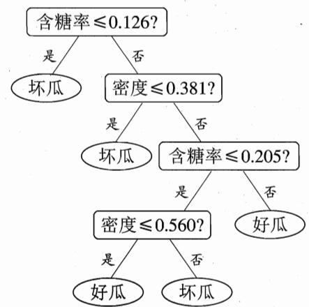

图 4.10 在西瓜数据集 $3.0\alpha$ 上生成的决策树  
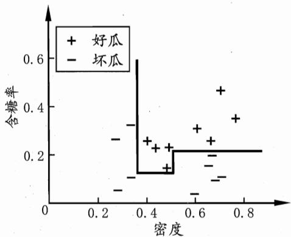  
图 4.11 图 4.10 决策树对应的分类边界

这样的多变量决策树亦称“斜决策树”(oblique decision tree).

若能使用斜的划分边界, 如图 4.12 中红色线段所示, 则决策树模型将大为简化. “多变量决策树” (multivariate decision tree) 就是能实现这样的“斜划分”甚至更复杂划分的决策树. 以实现斜划分的多变量决策树为例, 在此类决策树中, 非叶结点不再是仅对某个属性, 而是对属性的线性组合进行测试; 换言之, 每个非叶结点是一个形如 $\sum_{i=1}^{d} w_i a_i = t$ 的线性分类器, 其中 $w_i$ 是属性 $a_i$ 的权重, $w_i$ 和 $t$ 可在该结点所含的样本集和属性集上学得. 于是, 与传统的“单变量决策树” (univariate decision tree) 不同, 在多变量决策树的学习过程中, 不是为每个非叶结点寻找一个最优划分属性, 而是试图建立一个合适的线性分类器. 例如对西瓜数据 $3.0\alpha$ , 我们可学得图4.13这样的多变量决策树, 其分类边界如图4.14所示.

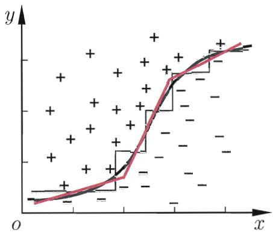  
图 4.12 决策树对复杂分类边界的分段近似

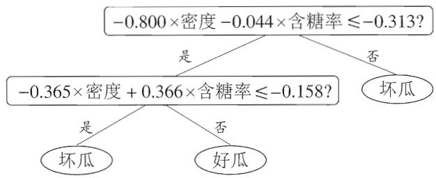

图4.13 在西瓜数据集 $3.0\alpha$ 上生成的多变量决策树  
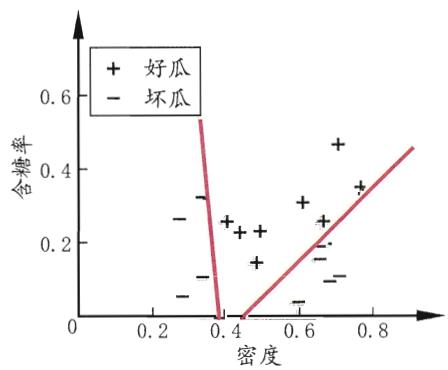  
图 4.14 图 4.13 多变量决策树对应的分类边界

## 4.6 阅读材料

决策树学习算法最著名的代表是 ID3 [Quinlan, 1979, 1986]、C4.5 [Quinlan, 1993] 和 CART [Breiman et al., 1984]. [Murthy, 1998] 提供了一个关于决策树文献的阅读指南. C4.5 Rule 是一个将 C4.5 决策树转化为符号规则的算法 [Quinlan, 1993], 决策树的每个分支可以容易地重写为一条规则, 但 C4.5 Rule 算法在转化过程中会进行规则前件合并、删减等操作, 因此最终规则集的泛化性能甚至可能优于原决策树.

在信息增益、增益率、基尼指数之外，人们还设计了许多其他的准则用于决策树划分选择，然而有实验研究表明 [Mingers, 1989b]，这些准则虽然对决策树的尺寸有较大影响，但对泛化性能的影响很有限。[Raileanu and Stoffel, 2004] 对信息增益和基尼指数进行的理论分析也显示出，它们仅在 $2\%$ 的情况下会有所不同。4.3 节介绍了决策树剪枝的基本策略；剪枝方法和程度对决策树泛化性能的影响相当显著，有实验研究表明 [Mingers, 1989a]，在数据带有噪声时通过剪枝甚至可将决策树的泛化性能提高 $25\%$ 。

多变量决策树算法主要有 OC1 [Murthy et al., 1994] 和 [Brodley and Ut-goff, 1995] 提出的一系列算法. OC1 先贪心地寻找每个属性的最优权值, 在局部优化的基础上再对分类边界进行随机扰动以试图找到更好的边界; [Brodley and Utgoff, 1995] 则直接引入了线性分类器学习的最小二乘法. 还有一些算法试图在决策树的叶结点上嵌入神经网络, 以结合这两种学习机制的优势, 例如 “感知机树” (Perceptron tree) [Utgoff, 1989b] 在决策树的每个叶结点上训练一个感知机, 而 [Guo and Gelfand, 1992] 则直接在叶结点上嵌入多层神经网络.

有一些决策树学习算法可进行“增量学习”(incremental learning)，即在接收到新样本后可对已学得的模型进行调整，而不用完全重新学习。主要机制是通过调整分支路径上的划分属性次序来对树进行部分重构，代表性算法有ID4 [Schlimmer and Fisher, 1986]、ID5R [Utgoff, 1989a]、ITI [Utgoff et al., 1997]等。增量学习可有效地降低每次接收到新样本后的训练时间开销，但多步增量学习后的模型会与基于全部数据训练而得的模型有较大差别。

## 习题

4.1 试证明对于不含冲突数据(即特征向量完全相同但标记不同)的训练集, 必存在与训练集一致(即训练误差为 0)的决策树.

4.2 试析使用“最小训练误差”作为决策树划分选择准则的缺陷.

4.3 试编程实现基于信息熵进行划分选择的决策树算法, 并为表 4.3 中数据生成一棵决策树.

4.4 试编程实现基于基尼指数进行划分选择的决策树算法, 为表 4.2 中数据生成预剪枝、后剪枝决策树, 并与未剪枝决策树进行比较.

4.5 试编程实现基于对率回归进行划分选择的决策树算法, 并为表 4.3 中数据生成一棵决策树.

4.6 试选择4个UCI数据集, 对上述3种算法所产生的未剪枝、预剪枝、后剪枝决策树进行实验比较, 并进行适当的统计显著性检验.

4.7 图 4.2 是一个递归算法, 若面临巨量数据, 则决策树的层数会很深, 使用递归方法易导致 “栈” 溢出. 试使用 “队列” 数据结构, 以参数 MaxDepth 控制树的最大深度, 写出与图 4.2 等价、但不使用递归的决策树生成算法.

4.8\* 试将决策树生成的深度优先搜索过程修改为广度优先搜索, 以参数 MaxNode 控制树的最大结点数, 将题 4.7 中基于队列的决策树算法进行改写. 对比题 4.7 中的算法, 试析哪种方式更易于控制决策树所需存储不超出内存.

4.9 试将4.4.2节对缺失值的处理机制推广到基尼指数的计算中去.

4.10 从网上下载或自己编程实现任意一种多变量决策树算法, 并观察其在西瓜数据集 3.0 上产生的结果.

## 参考文献

Breiman, L., J. Friedman, C. J. Stone, and R. A. Olshen. (1984). Classification and Regression Trees. Chapman & Hall/CRC, Boca Raton, FL.

Brodley, C. E. and P. E. Utgoff. (1995). “Multivariate decision trees.” Machine Learning, 19(1):45–77.

Guo, H. and S. B. Gelfand. (1992). “Classification trees with neural network feature extraction.” IEEE Transactions on Neural Networks, 3(6):923–933.

Mingers, J. (1989a). “An empirical comparison of pruning methods for decision tree induction.” Machine Learning, 4(2):227–243.

Mingers, J. (1989b). “An empirical comparison of selection measures for decision-tree induction.” Machine Learning, 3(4):319–342.

Murthy, S. K. (1998). “Automatic construction of decision trees from data: A multi-disciplinary survey.” Data Mining and Knowledge Discovery, 2(4):345–389.

Murthy, S. K., S. Kasif, and S. Salzberg. (1994). “A system for induction of oblique decision trees.” Journal of Artificial Intelligence Research, 2:1–32.

Quinlan, J. R. (1979). “Discovering rules by induction from large collections of examples.” In Expert Systems in the Micro-electronic Age (D. Michie, ed.), 168–201, Edinburgh University Press, Edinburgh, UK.

Quinlan, J. R. (1986). “Induction of decision trees.” Machine Learning, 1(1): 81–106.

Quinlan, J. R. (1993). C4.5: Programs for Machine Learning. Morgan Kaufmann, San Mateo, CA.

Raileanu, L. E. and K. Stoffel. (2004). “Theoretical comparison between the Gini index and information gain criteria.” Annals of Mathematics and Artificial Intelligence, 41(1):77–93.

Schlimmer, J. C. and D. Fisher. (1986). “A case study of incremental concept induction.” In Proceedings of the 5th National Conference on Artificial Intelligence (AAAI), 495–501, Philadelphia, PA.

Utgoff, P. E. (1989a). “Incremental induction of decision trees.” Machine Learning, 4(2):161–186.

Utgoff, P. E. (1989b). “Perceptron trees: A case study in hybrid concept represenations.” Connection Science, 1(4):377–391.

Utgoff, P. E., N. C. Berkman, and J. A. Clouse. (1997). “Decision tree induction based on efficient tree restructuring.” Machine Learning, 29(1):5–44.

## 休息一会儿

## 小故事：决策树与罗斯·昆兰

说起决策树学习, 就必然要谈到澳大利亚计算机科学家罗斯·昆兰 (J. Ross Quinlan, 1943—).

最初的决策树算法是心理学家兼计算机科学家 E. B. Hunt 1962 年在研究人类的概念学习过程时提出的 CLS (Concept Learning System), 这个算法确立了决策树 “分而

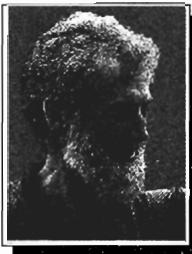

治之”的学习策略. 罗斯·昆兰在Hunt的指导下于1968年在美国华盛顿大学获得计算机博士学位, 然后到悉尼大学任教. 1978年他在学术假时到斯坦福大学访问, 选修了图灵的助手D. Michie开设的一门研究生课程. 课上有一个大作业, 要求写程序来学习出完备正确的规则, 以判断国际象棋残局中一方是否会在两步棋后被将死. 昆兰写了一个类似于CLS的程序来完成作业, 其中最重要的改进是引入了信息增益准则. 后来他把这个工作整理出来在1979年发表, 这就是ID3算法.

1986 年 Machine Learning 杂志创刊, 昆兰应邀在创刊号上重新发表了 ID3 算法, 掀起了决策树研究的热潮. 短短几年间众多决策树算法问世, ID4、ID5 等名字迅速被其他研究者提出的算法占用, 昆兰只好将自己的 ID3 后继算法命名为 C4.0, 在此基础上进一步提出了著名的 C4.5. 有趣的是, 昆兰自称 C4.5 仅是对 C4.0 做了些小改进, 因此将它命名为 “第 4.5 代分类器”, 而将后续的商业化版本称为 C5.0.
