## 第8章 集成学习

## 8.1 个体与集成

ensemble 读音似 “昂桑宝” 而非 “因桑宝”.

集成学习(ensemble learning)通过构建并结合多个学习器来完成学习任务, 有时也被称为多分类器系统(multi-classifier system)、基于委员会的学习(committee-based learning)等.

图 8.1 显示出集成学习的一般结构: 先产生一组 “个体学习器” (individual learner), 再用某种策略将它们结合起来. 个体学习器通常由一个现有的学习算法从训练数据产生, 例如 C4.5 决策树算法、BP 神经网络算法等, 此时集成中只包含同种类型的个体学习器, 例如 “决策树集成” 中全是决策树, “神经网络集成” 中全是神经网络, 这样的集成是 “同质” 的 (homogeneous). 同质集成中的个体学习器亦称 “基学习器” (base learner), 相应的学习算法称为 “基学习算法” (base learning algorithm). 集成也可包含不同类型的个体学习器, 例如同时包含决策树和神经网络, 这样的集成是 “异质” 的 (heterogenous). 异质集成中的个体学习器由不同的学习算法生成, 这时就不再有基学习算法; 相应的, 个体学习器一般不称为基学习器, 常称为 “组件学习器” (component learner) 或直接称为个体学习器.

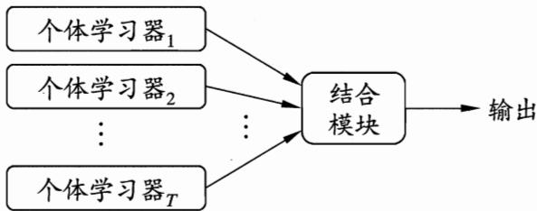  
图 8.1 集成学习示意图

弱学习器常指泛化性能略优于随机猜测的学习器；例如在二分类问题上精度略高于50%的分类器.

集成学习通过将多个学习器进行结合, 常可获得比单一学习器显著优越的泛化性能. 这对 “弱学习器” (weak learner) 尤为明显, 因此集成学习的很多理论研究都是针对弱学习器进行的, 而基学习器有时也被直接称为弱学习器. 但需注意的是, 虽然从理论上来说使用弱学习器集成足以获得好的性能, 但在实践中出于种种考虑, 例如希望使用较少的个体学习器, 或是重用关于常见学习器的一些经验等, 人们往往会使用比较强的学习器.

在一般经验中, 如果把好坏不等的东西掺到一起, 那么通常结果会是比最坏的要好一些, 比最好的要坏一些. 集成学习把多个学习器结合起来, 如何能获得比最好的单一学习器更好的性能呢?

考虑一个简单的例子: 在二分类任务中, 假定三个分类器在三个测试样本上的表现如图 8.2 所示, 其中 √ 表示分类正确, × 表示分类错误, 集成学习的结果通过投票法(voting)产生, 即 “少数服从多数”. 在图 8.2(a) 中, 每个分类器都只有 66.6% 的精度, 但集成学习却达到了 100%; 在图 8.2(b) 中, 三个分类器没有差别, 集成之后性能没有提高; 在图 8.2(c) 中, 每个分类器的精度都只有 33.3%, 集成学习的结果变得更糟. 这个简单的例子显示出: 要获得好的集成, 个体学习器应 “好而不同”, 即个体学习器要有一定的 “准确性”, 即学习器不能太坏, 并且要有 “多样性” (diversity), 即学习器间具有差异.

个体学习器至少不差于弱学习器.

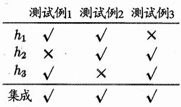  
(a) 集成提升性能

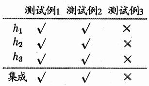  
(b) 集成不起作用

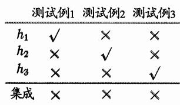  
(c) 集成起负作用  
图 8.2 集成个体应 “好而不同” ( $h_{i}$ 表示第 i 个分类器)

我们来做个简单的分析. 考虑二分类问题 $y \in \{-1, +1\}$ 和真实函数 $f$ , 假定基分类器的错误率为 $\epsilon$ , 即对每个基分类器 $h_i$ 有

$$
P \left(h _ {i} (\boldsymbol {x}) \neq f (\boldsymbol {x})\right) = \epsilon .\tag{8.1}
$$

假设集成通过简单投票法结合 $T$ 个基分类器, 若有超过半数的基分类器正确, 则集成分类就正确:

$$
H (\boldsymbol {x}) = \operatorname{sign} \left(\sum_ {i = 1} ^ {T} h _ {i} (\boldsymbol {x})\right).\tag{8.2}
$$

参见习题8.1.

假设基分类器的错误率相互独立, 则由 Hoeffding 不等式可知, 集成的错误率为

$$
\begin{array}{l} P (H (\boldsymbol {x}) \neq f (\boldsymbol {x})) = \sum_ {k = 0} ^ {\lfloor T / 2 \rfloor} \binom {T} {k} (1 - \epsilon) ^ {k} \epsilon^ {T - k} \\ \leqslant \exp \left(- \frac {1}{2} T (1 - 2 \epsilon) ^ {2}\right). \end{array}\tag{8.3}
$$

上式显示出, 随着集成中个体分类器数目 T 的增大, 集成的错误率将指数级下降, 最终趋向于零.

然而我们必须注意到, 上面的分析有一个关键假设: 基学习器的误差相互独立. 在现实任务中, 个体学习器是为解决同一个问题训练出来的, 它们显然不可能相互独立! 事实上, 个体学习器的 “准确性” 和 “多样性” 本身就存在冲突. 一般的, 准确性很高之后, 要增加多样性就需牺牲准确性. 事实上, 如何产生并结合 “好而不同” 的个体学习器, 恰是集成学习研究的核心.

根据个体学习器的生成方式, 目前的集成学习方法大致可分为两大类, 即个体学习器间存在强依赖关系、必须串行生成的序列化方法, 以及个体学习器间不存在强依赖关系、可同时生成的并行化方法; 前者的代表是 Boosting, 后者的代表是 Bagging 和 “随机森林” (Random Forest).

## 8.2 Boosting

Boosting 是一族可将弱学习器提升为强学习器的算法. 这族算法的工作机制类似: 先从初始训练集训练出一个基学习器, 再根据基学习器的表现对训练样本分布进行调整, 使得先前基学习器做错的训练样本在后续受到更多关注, 然后基于调整后的样本分布来训练下一个基学习器; 如此重复进行, 直至基学习器数目达到事先指定的值 T, 最终将这 T 个基学习器进行加权结合.

Boosting 族算法最著名的代表是 AdaBoost [Freund and Schapire, 1997], 其描述如图 8.3 所示, 其中 $y_i \in \{-1, +1\}$ , $f$ 是真实函数.

AdaBoost 算法有多种推导方式, 比较容易理解的是基于 “加性模型” (additive model), 即基学习器的线性组合

$$
H (\pmb {x}) = \sum_ {t = 1} ^ {T} \alpha_ {t} h _ {t} (\pmb {x})\tag{8.4}
$$

来最小化指数损失函数(exponential loss function) [Friedman et al., 2000]

$$
\ell_ {\exp} (H \mid \mathcal {D}) = \mathbb {E} _ {\boldsymbol {x} \sim \mathcal {D}} [ e ^ {- f (\boldsymbol {x}) H (\boldsymbol {x})} ].\tag{8.5}
$$

初始化样本权值分布. 基于分布 $\mathcal{D}_t$ 从数据集 $D$ 中训练出分类器 $h_t$ . 估计 $h_t$ 的误差.

确定分类器 $h_t$ 的权重.

更新样本分布, 其中 $Z_{t}$ 是规范化因子, 以确保 $D_{t+1}$ 是一个分布.

输入：训练集  $D = \{(\mathbf{x}_{1}, y_{1}), (\mathbf{x}_{2}, y_{2}), \ldots, (\mathbf{x}_{m}, y_{m})\}$ ;
基学习算法 L;
训练轮数 T.
过程：
1:  $\mathcal{D}_{1}(\boldsymbol{x}) = 1/m.$ 
2: for  $t = 1, 2, \ldots, T$  do
3:  $h_{t} = \mathfrak{L}(D, \mathcal{D}_{t})$ ;
4:  $\epsilon_{t} = P_{\boldsymbol{x} \sim \mathcal{D}_{t}}(h_{t}(\boldsymbol{x}) \neq f(\boldsymbol{x}))$ ;
5: if  $\epsilon_{t} &gt; 0.5$  then break
6:  $\alpha_{t} = \frac{1}{2} \ln \left( \frac{1 - \epsilon_{t}}{\epsilon_{t}} \right)$ ;
7:  $\mathcal{D}_{t+1}(\boldsymbol{x}) = \frac{\mathcal{D}_{t}(\boldsymbol{x})}{Z_{t}} \times \left\{ \begin{aligned} &amp; \exp(-\alpha_{t}), &amp; \text{if } h_{t}(\boldsymbol{x}) = f(\boldsymbol{x}) \\ &amp; \exp(\alpha_{t}), &amp; \text{if } h_{t}(\boldsymbol{x}) \neq f(\boldsymbol{x}) \\ &amp; = \frac{\mathcal{D}_{t}(\boldsymbol{x}) \exp(-\alpha_{t} f(\boldsymbol{x}) h_{t}(\boldsymbol{x}))}{Z_{t}} \end{aligned} \right.$ 
8: end for
输出： $H(\boldsymbol{x}) = \text{sign}\left(\sum_{t=1}^{T} \alpha_{t} h_{t}(\boldsymbol{x})\right)$

图8.3 AdaBoost算法

若 $H(\boldsymbol{x})$ 能令指数损失函数最小化, 则考虑式(8.5)对 $H(\boldsymbol{x})$ 的偏导

$$
\frac {\partial \ell_ {\exp} (H \mid \mathcal {D})}{\partial H (\boldsymbol {x})} = - e ^ {- H (\boldsymbol {x})} P (f (\boldsymbol {x}) = 1 \mid \boldsymbol {x}) + e ^ {H (\boldsymbol {x})} P (f (\boldsymbol {x}) = - 1 \mid \boldsymbol {x}),\tag{8.6}
$$

令式(8.6)为零可解得

$$
H (\boldsymbol {x}) = \frac {1}{2} \ln \frac {P (f (x) = 1 \mid \boldsymbol {x})}{P (f (x) = - 1 \mid \boldsymbol {x})},\tag{8.7}
$$

因此, 有

这里忽略了 $P(f(x) = 1 \mid x) = P(f(x) = -1 \mid x)$ 的情形.

替代损失函数的“一致性”参见6.7节.

$$
\begin{array}{r l} \operatorname{sign} \left(H (\boldsymbol {x})\right) & = \operatorname{sign} \left(\frac {1}{2} \ln \frac {P (f (x) = 1 \mid \boldsymbol {x})}{P (f (x) = - 1 \mid \boldsymbol {x})}\right) \\ & = \left\{ \begin{array}{l l} 1, & P (f (x) = 1 \mid \boldsymbol {x}) > P (f (x) = - 1 \mid \boldsymbol {x}) \\ - 1, & P (f (x) = 1 \mid \boldsymbol {x}) <   P (f (x) = - 1 \mid \boldsymbol {x}) \end{array} \right. \\ & = \underset {y \in \{- 1, 1 \}} {\arg \max} P (f (x) = y \mid \boldsymbol {x}), \end{array}\tag{8.8}
$$

这意味着 $\operatorname{sign}(H(\pmb{x}))$ 达到了贝叶斯最优错误率. 换言之, 若指数损失函数最小化, 则分类错误率也将最小化; 这说明指数损失函数是分类任务原本 0/1 损失函数的一致的 (consistent) 替代损失函数. 由于这个替代函数有更好的数学性质, 例如它是连续可微函数, 因此我们用它替代 0/1 损失函数作为优化目标.

在 AdaBoost 算法中, 第一个基分类器 $h_1$ 是通过直接将基学习算法用于初始数据分布而得; 此后迭代地生成 $h_t$ 和 $\alpha_t$ , 当基分类器 $h_t$ 基于分布 $\mathcal{D}_t$ 产生后, 该基分类器的权重 $\alpha_t$ 应使得 $\alpha_t h_t$ 最小化指数损失函数

$$
\begin{array}{r l} \ell_ {\exp} (\alpha_ {t} h _ {t} \mid \mathcal {D} _ {t}) & = \mathbb {E} _ {\boldsymbol {x} \sim \mathcal {D} _ {t}} \left[ e ^ {- f (\boldsymbol {x}) \alpha_ {t} h _ {t} (\boldsymbol {x})} \right] \\ & = \mathbb {E} _ {\boldsymbol {x} \sim \mathcal {D} _ {t}} \left[ e ^ {- \alpha_ {t}} \mathbb {I} (f (\boldsymbol {x}) = h _ {t} (\boldsymbol {x})) + e ^ {\alpha_ {t}} \mathbb {I} (f (\boldsymbol {x}) \neq h _ {t} (\boldsymbol {x})) \right] \\ & = e ^ {- \alpha_ {t}} P _ {\boldsymbol {x} \sim \mathcal {D} _ {t}} (f (\boldsymbol {x}) = h _ {t} (\boldsymbol {x})) + e ^ {\alpha_ {t}} P _ {\boldsymbol {x} \sim \mathcal {D} _ {t}} (f (\boldsymbol {x}) \neq h _ {t} (\boldsymbol {x})) \\ & = e ^ {- \alpha_ {t}} (1 - \epsilon_ {t}) + e ^ {\alpha_ {t}} \epsilon_ {t}, \end{array} \tag {8}\tag{8.9}
$$

其中 $\epsilon_t = P_{\pmb{x} \sim \mathcal{D}_t}(h_t(\pmb{x}) \neq f(\pmb{x}))$ 。考虑指数损失函数的导数

$$
\frac {\partial \ell_ {\exp} (\alpha_ {t} h _ {t} \mid \mathcal {D} _ {t})}{\partial \alpha_ {t}} = - e ^ {- \alpha_ {t}} (1 - \epsilon_ {t}) + e ^ {\alpha_ {t}} \epsilon_ {t},\tag{8.10}
$$

令式(8.10)为零可解得

$$
\alpha_ {t} = \frac {1}{2} \ln \left(\frac {1 - \epsilon_ {t}}{\epsilon_ {t}}\right),\tag{8.11}
$$

这恰是图8.3中算法第6行的分类器权重更新公式.

AdaBoost 算法在获得 $H_{t-1}$ 之后样本分布将进行调整, 使下一轮的基学习器 $h_{t}$ 能纠正 $H_{t-1}$ 的一些错误. 理想的 $h_{t}$ 能纠正 $H_{t-1}$ 的全部错误, 即最小化

$$
\begin{array}{r l} \ell_ {\exp} (H _ {t - 1} + h _ {t} \mid \mathcal {D}) & = \mathbb {E} _ {\boldsymbol {x} \sim \mathcal {D}} [ e ^ {- f (\boldsymbol {x}) (H _ {t - 1} (\boldsymbol {x}) + h _ {t} (\boldsymbol {x}))} ] \\ & = \mathbb {E} _ {\boldsymbol {x} \sim \mathcal {D}} [ e ^ {- f (\boldsymbol {x}) H _ {t - 1} (\boldsymbol {x})} e ^ {- f (\boldsymbol {x}) h _ {t} (\boldsymbol {x})} ]. \end{array}\tag{8.12}
$$

注意到 $f^2 (\pmb {x}) = h_t^2 (\pmb {x}) = 1$ ，式(8.12)可使用 $e^{-f(\pmb {x})h_t(\pmb {x})}$ 的泰勒展式近似为

$$
\begin{array}{r l} \ell_ {\exp} (H _ {t - 1} + h _ {t} \mid \mathcal {D}) & \simeq \mathbb {E} _ {\boldsymbol {x} \sim \mathcal {D}} \left[ e ^ {- f (\boldsymbol {x}) H _ {t - 1} (\boldsymbol {x})} \left(1 - f (\boldsymbol {x}) h _ {t} (\boldsymbol {x}) + \frac {f ^ {2} (\boldsymbol {x}) h _ {t} ^ {2} (\boldsymbol {x})}{2}\right) \right] \\ & = \mathbb {E} _ {\boldsymbol {x} \sim \mathcal {D}} \left[ e ^ {- f (\boldsymbol {x}) H _ {t - 1} (\boldsymbol {x})} \left(1 - f (\boldsymbol {x}) h _ {t} (\boldsymbol {x}) + \frac {1}{2}\right) \right]. \end{array} \tag {8.13}
$$

于是, 理想的基学习器

$$
h _ {t} (\boldsymbol {x}) = \underset {h} {\arg \min} \ell_ {\exp} (H _ {t - 1} + h \mid \mathcal {D})
$$

$$
\begin{array}{l} = \underset {h} {\arg \min} \mathbb {E} _ {\boldsymbol {x} \sim \mathcal {D}} \left[ e ^ {- f (\boldsymbol {x}) H _ {t - 1} (\boldsymbol {x})} \left(1 - f (\boldsymbol {x}) h (\boldsymbol {x}) + \frac {1}{2}\right) \right] \\ = \underset {h} {\arg \max} \mathbb {E} _ {\boldsymbol {x} \sim \mathcal {D}} \left[ e ^ {- f (\boldsymbol {x}) H _ {t - 1} (\boldsymbol {x})} f (\boldsymbol {x}) h (\boldsymbol {x}) \right] \\ = \underset {h} {\arg \max} \mathbb {E} _ {\boldsymbol {x} \sim \mathcal {D}} \left[ \frac {e ^ {- f (\boldsymbol {x}) H _ {t - 1} (\boldsymbol {x})}}{\mathbb {E} _ {\boldsymbol {x} \sim \mathcal {D}} [ e ^ {- f (\boldsymbol {x}) H _ {t - 1} (\boldsymbol {x})} ]} f (\boldsymbol {x}) h (\boldsymbol {x}) \right], \end{array}\tag{8.14}
$$

注意到 $\mathbb{E}_{\pmb{x}\sim \mathcal{D}}[e^{-f(\pmb {x})H_{t - 1}(\pmb {x})}]$ 是一个常数.令 $\mathcal{D}_t$ 表示一个分布

$$
\mathcal {D} _ {t} (\boldsymbol {x}) = \frac {\mathcal {D} (\boldsymbol {x}) e ^ {- f (\boldsymbol {x}) H _ {t - 1} (\boldsymbol {x})}}{\mathbb {E} _ {\boldsymbol {x} \sim \mathcal {D}} \left[ e ^ {- f (\boldsymbol {x}) H _ {t - 1} (\boldsymbol {x})} \right]},\tag{8.15}
$$

则根据数学期望的定义, 这等价于令

$$
\begin{array}{r l} & {h _ {t} (\pmb {x}) = \underset {h} {\arg \max} \mathbb {E} _ {\pmb {x} \sim \mathcal {D}} \left[ \frac {e ^ {- f (\pmb {x}) H _ {t - 1} (\pmb {x})}}{\mathbb {E} _ {\pmb {x} \sim \mathcal {D}} [ e ^ {- f (\pmb {x}) H _ {t - 1} (\pmb {x})} ]} f (\pmb {x}) h (\pmb {x}) \right]} \\ & {\qquad = \underset {h} {\arg \max} \mathbb {E} _ {\pmb {x} \sim \mathcal {D} _ {t}} [ f (\pmb {x}) h (\pmb {x}) ].} \end{array}\tag{8.16}
$$

由 $f(\pmb {x}),h(\pmb {x})\in \{-1, + 1\}$ ，有

$$
f (\boldsymbol {x}) h (\boldsymbol {x}) = 1 - 2 \mathbb {I} \big (f (\boldsymbol {x}) \neq h (\boldsymbol {x}) \big),\tag{8.17}
$$

则理想的基学习器

$$
h _ {t} (\boldsymbol {x}) = \underset {h} {\arg \min} \mathbb {E} _ {\boldsymbol {x} \sim \mathcal {D} _ {t}} \left[ \mathbb {I} \big (f (\boldsymbol {x}) \neq h (\boldsymbol {x}) \big) \right].\tag{8.18}
$$

由此可见, 理想的 $h_t$ 将在分布 $\mathcal{D}_t$ 下最小化分类误差. 因此, 弱分类器将基于分布 $\mathcal{D}_t$ 来训练, 且针对 $\mathcal{D}_t$ 的分类误差应小于0.5. 这在一定程度上类似“残差逼近”的思想. 考虑到 $\mathcal{D}_t$ 和 $\mathcal{D}_{t+1}$ 的关系, 有

$$
\begin{array}{r l} \mathcal {D} _ {t + 1} (\boldsymbol {x}) & = \frac {\mathcal {D} (\boldsymbol {x}) e ^ {- f (\boldsymbol {x}) H _ {t} (\boldsymbol {x})}}{\mathbb {E} _ {\boldsymbol {x} \sim \mathcal {D}} [ e ^ {- f (\boldsymbol {x}) H _ {t} (\boldsymbol {x})} ]} \\ & = \frac {\mathcal {D} (\boldsymbol {x}) e ^ {- f (\boldsymbol {x}) H _ {t - 1} (\boldsymbol {x})} e ^ {- f (\boldsymbol {x}) \alpha_ {t} h _ {t} (\boldsymbol {x})}}{\mathbb {E} _ {\boldsymbol {x} \sim \mathcal {D}} [ e ^ {- f (\boldsymbol {x}) H _ {t} (\boldsymbol {x})} ]} \\ & = \mathcal {D} _ {t} (\boldsymbol {x}) \cdot e ^ {- f (\boldsymbol {x}) \alpha_ {t} h _ {t} (\boldsymbol {x})} \frac {\mathbb {E} _ {\boldsymbol {x} \sim \mathcal {D}} [ e ^ {- f (\boldsymbol {x}) H _ {t - 1} (\boldsymbol {x})} ]}{\mathbb {E} _ {\boldsymbol {x} \sim \mathcal {D}} [ e ^ {- f (\boldsymbol {x}) H _ {t} (\boldsymbol {x})} ]}, \end{array}\tag{8.19}
$$

这恰是图8.3中算法第7行的样本分布更新公式.

于是, 由式(8.11)和(8.19)可见, 我们从基于加性模型迭代式优化指数损失函数的角度推导出了图 8.3 的 AdaBoost 算法.

Boosting算法要求基学习器能对特定的数据分布进行学习, 这可通过“重赋权法”(re-weighting)实施, 即在训练过程的每一轮中, 根据样本分布为每个训练样本重新赋予一个权重. 对无法接受带权样本的基学习算法, 则可通过“重采样法”(re-sampling)来处理, 即在每一轮学习中, 根据样本分布对训练集重新进行采样, 再用重采样而得的样本集对基学习器进行训练. 一般而言, 这两种做法没有显著的优劣差别. 需注意的是, Boosting算法在训练的每一轮都要检查当前生成的基学习器是否满足基本条件(例如图8.3的第5行, 检查当前基分类器是否是比随机猜测好), 一旦条件不满足, 则当前基学习器即被抛弃, 且学习过程停止. 在此种情形下, 初始设置的学习轮数 $T$ 也许还远未达到, 可能导致最终集成中只包含很少的基学习器而性能不佳. 若采用“重采样法”, 则可获得“重启动”机会以避免训练过程过早停止 [Kohavi and Wolpert, 1996], 即在抛弃不满足条件的当前基学习器之后, 可根据当前分布重新对训练样本进行采样, 再基于新的采样结果重新训练出基学习器, 从而使得学习过程可以持续到预设的 $T$ 轮完成.

偏差/方差参见2.5节. 决策树桩即单层决策树, 参见4.3节.

从偏差-方差分解的角度看, Boosting 主要关注降低偏差, 因此 Boosting 能基于泛化性能相当弱的学习器构建出很强的集成. 我们以决策树桩为基学习器, 在表 4.5 的西瓜数据集 $3.0\alpha$ 上运行 AdaBoost 算法, 不同规模(size)的集成及其基学习器所对应的分类边界如图 8.4 所示.

集成的规模指集成中包含的个体学习器数目.

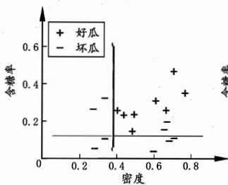  
(a) 3个基学习器

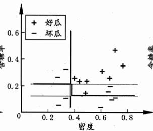  
(b) 5个基学习器

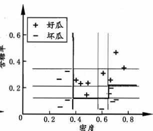  
(c) 11个基学习器  
图 8.4 西瓜数据集 $3.0\alpha$ 上 AdaBoost 集成规模为 3、5、11 时, 集成(红色)与基学习器(黑色)的分类边界.

## 8.3 Bagging与随机森林

由8.1节可知, 欲得到泛化性能强的集成, 集成中的个体学习器应尽可能相互独立; 虽然“独立”在现实任务中无法做到, 但可以设法使基学习器尽可能具有较大的差异. 给定一个训练数据集, 一种可能的做法是对训练样本进行采样, 产生出若干个不同的子集, 再从每个数据子集中训练出一个基学习器. 这样, 由于训练数据不同, 我们获得的基学习器可望具有比较大的差异. 然而, 为获得好的集成, 我们同时还希望个体学习器不能太差. 如果采样出的每个子集都完全不同, 则每个基学习器只用到了一小部分训练数据, 甚至不足以进行有效学习, 这显然无法确保产生出比较好的基学习器. 为解决这个问题, 我们可考虑使用相互有交叠的采样子集.

## 8.3.1 Bagging

Bagging [Breiman, 1996a] 是并行式集成学习方法最著名的代表. 从名字即可看出, 它直接基于我们在 2.2.3 节介绍过的自助采样法 (bootstrap sampling). 给定包含 $m$ 个样本的数据集, 我们先随机取出一个样本放入采样集中, 再把该样本放回初始数据集, 使得下次采样时该样本仍有可能被选中, 这样, 经过 $m$ 次随机采样操作, 我们得到含 $m$ 个样本的采样集, 初始训练集中有的样本在采样集里多次出现, 有的则从未出现. 由式(2.1)可知, 初始训练集中约有 $63.2\%$ 的样本出现在采样集中.

照这样, 我们可采样出 $T$ 个含 $m$ 个训练样本的采样集, 然后基于每个采样集训练出一个基学习器, 再将这些基学习器进行结合. 这就是 Bagging 的基本流程. 在对预测输出进行结合时, Bagging 通常对分类任务使用简单投票法, 对回归任务使用简单平均法. 若分类预测时出现两个类收到同样票数的情形, 则最简单的做法是随机选择一个, 也可进一步考察学习器投票的置信度来确定最终胜者. Bagging 的算法描述如图 8.5 所示.

输入：训练集  $D = \{(\boldsymbol{x}_{1}, y_{1}), (\boldsymbol{x}_{2}, y_{2}), \ldots, (\boldsymbol{x}_{m}, y_{m})\}$ ;
基学习算法 L;
训练轮数 T.
过程：
1: for  $t = 1, 2, \ldots, T$  do
2:  $h_{t} = \mathfrak{L}(D, \mathcal{D}_{bs})$ 
3: end for
输出： $H(x) = \arg\max_{y \in \mathcal{Y}} \sum_{t=1}^{T} \mathbb{I}(h_{t}(x) = y)$

图8.5 Bagging算法

假定基学习器的计算复杂度为 $O(m)$ , 则 Bagging 的复杂度大致为 $T(O(m) + O(s))$ , 考虑到采样与投票/平均过程的复杂度 $O(s)$ 很小, 而 $T$ 通常是一个不太大的常数, 因此, 训练一个 Bagging 集成与直接使用基学习算法训练一个学习器的复杂度同阶, 这说明 Bagging 是一个很高效的集成学习算法. 另外, 与标准 AdaBoost 只适用于二分类任务不同, Bagging 能不经修改地用于多分类、回归等任务.

为处理多分类或回归任务, AdaBoost 需进行修改; 目前已有适用的变体算法 [Zhou, 2012].

包外估计参见 2.2.3 节.

值得一提的是, 自助采样过程还给 Bagging 带来了另一个优点: 由于每个基学习器只使用了初始训练集中约 $63.2\%$ 的样本, 剩下约 $36.8\%$ 的样本可用作验证集来对泛化性能进行 “包外估计” (out-of-bag estimate) [Breiman, 1996a; Wolpert and Macready, 1999]. 为此需记录每个基学习器所使用的训练样本. 不妨令 $D_{t}$ 表示 $h_{t}$ 实际使用的训练样本集, 令 $H^{oob}(\pmb{x})$ 表示对样本 $\pmb{x}$ 的包外预测, 即仅考虑那些未使用 $\pmb{x}$ 训练的基学习器在 $\pmb{x}$ 上的预测, 有

$$
H ^ {o o b} (\pmb {x}) = \underset {y \in \mathcal {Y}} {\arg \max} \sum_ {t = 1} ^ {T} \mathbb {I} (h _ {t} (\pmb {x}) = y) \cdot \mathbb {I} (\pmb {x} \notin D _ {t}),\tag{8.20}
$$

则 Bagging 泛化误差的包外估计为

$$
\epsilon^ {o o b} = \frac {1}{| D |} \sum_ {(\boldsymbol {x}, y) \in D} \mathbb {I} (H ^ {o o b} (\boldsymbol {x}) \neq y).\tag{8.21}
$$

事实上, 包外样本还有许多其他用途. 例如当基学习器是决策树时, 可使用包外样本来辅助剪枝, 或用于估计决策树中各结点的后验概率以辅助对零训练样本结点的处理; 当基学习器是神经网络时, 可使用包外样本来辅助早期停止以减小过拟合风险.

偏差/方差参见2.5节.
关于样本扰动，参见8.5.3节.

从偏差-方差分解的角度看, Bagging 主要关注降低方差, 因此它在不剪枝决策树、神经网络等易受样本扰动的学习器上效用更为明显. 我们以基于信息增益划分的决策树为基学习器, 在表 4.5 的西瓜数据集 $3.0\alpha$ 上运行 Bagging 算法, 不同规模的集成及其基学习器所对应的分类边界如图 8.6 所示.

## 8.3.2 随机森林

随机森林(Random Forest, 简称 RF) [Breiman, 2001a] 是 Bagging 的一个扩展变体. RF 在以决策树为基学习器构建 Bagging 集成的基础上, 进一步在决策树的训练过程中引入了随机属性选择. 具体来说, 传统决策树在选择划分属性时是在当前结点的属性集合(假定有 $d$ 个属性)中选择一个最优属性; 而在 RF 中, 对基决策树的每个结点, 先从该结点的属性集合中随机选择一个包含 $k$ 个属性的子集, 然后再从这个子集中选择一个最优属性用于划分. 这里的参数 $k$ 控制了随机性的引入程度: 若令 $k = d$ , 则基决策树的构建与传统决策树相同; 若令 $k = 1$ , 则是随机选择一个属性用于划分; 一般情况下, 推荐值 $k = \log_2 d$ [Breiman, 2001a].

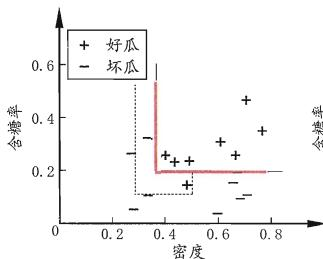  
(a) 3个基学习器

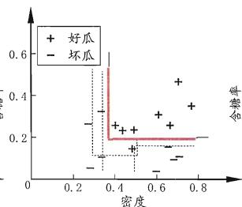  
(b) 5个基学习器

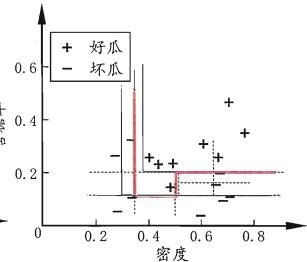  
(b) 11个基学习器  
图 8.6 西瓜数据集 $3.0\alpha$ 上 Bagging 集成规模为 3、5、11 时, 集成(红色)与基学习器(黑色)的分类边界.

随机森林简单、容易实现、计算开销小, 令人惊奇的是, 它在很多现实任务中展现出强大的性能, 被誉为 “代表集成学习技术水平的方法”. 可以看出, 随机森林对 Bagging 只做了小改动, 但是与 Bagging 中基学习器的 “多样性” 仅通过样本扰动(通过对初始训练集采样)而来不同, 随机森林中基学习器的多样性不仅来自样本扰动, 还来自属性扰动, 这就使得最终集成的泛化性能可通过个体学习器之间差异度的增加而进一步提升.

关于样本扰动、属性扰动等, 参见 8.5.3 节.

随机森林的收敛性与 Bagging 相似. 如图 8.7 所示, 随机森林的起始性能往往相对较差, 特别是在集成中只包含一个基学习器时. 这很容易理解, 因为通过引入属性扰动, 随机森林中个体学习器的性能往往有所降低. 然而, 随着个体学习器数目的增加, 随机森林通常会收敛到更低的泛化误差. 值得一提的是, 随机森林的训练效率常优于 Bagging, 因为在个体决策树的构建过程中, Bagging 使用的是 “确定型” 决策树, 在选择划分属性时要对结点的所有属性进行考察, 而随机森林使用的 “随机型” 决策树则只需考察一个属性子集.

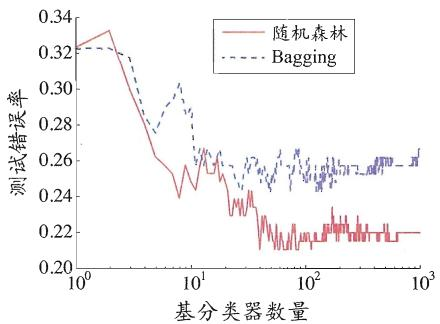  
(a) glass 数据集

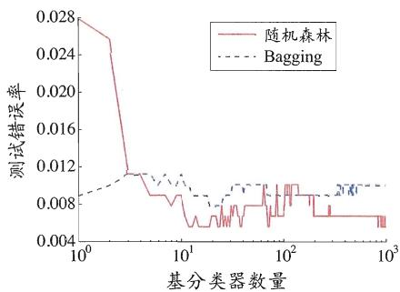  
(b) auto-mpg 数据集  
图 8.7 在两个 UCI 数据上, 集成规模对随机森林与 Bagging 的影响

## 8.4 结合策略

学习器结合可能会从三个方面带来好处 [Dietterich, 2000]: 首先, 从统计的方面来看, 由于学习任务的假设空间往往很大, 可能有多个假设在训练集上达到同等性能, 此时若使用单学习器可能因误选而导致泛化性能不佳, 结合多个学习器则会减小这一风险; 第二, 从计算的方面来看, 学习算法往往会陷入局部极小, 有的局部极小点所对应的泛化性能可能很糟糕, 而通过多次运行之后进行结合, 可降低陷入糟糕局部极小点的风险; 第三, 从表示的方面来看, 某些学习任务的真实假设可能不在当前学习算法所考虑的假设空间中, 此时若使用单学习器则肯定无效, 而通过结合多个学习器, 由于相应的假设空间有所扩大, 有可能学得更好的近似. 图 8.8 给出了一个直观示意图.

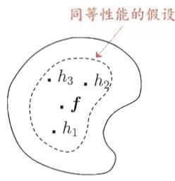  
(a) 统计的原因

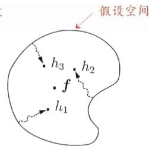  
(b) 计算的原因

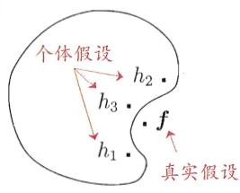  
(c) 表示的原因  
图 8.8 学习器结合可能从三个方面带来好处 [Dietterich, 2000]

假定集成包含 $T$ 个基学习器 $\{h_1, h_2, \ldots, h_T\}$ , 其中 $h_i$ 在示例 $\pmb{x}$ 上的输出为 $h_i(\pmb{x})$ . 本节介绍几种对 $h_i$ 进行结合的常见策略.

## 8.4.1 平均法

对数值型输出 $h_i(\pmb{x}) \in \mathbb{R}$ , 最常见的结合策略是使用平均法 (averaging).

\- 简单平均法(simple averaging)

$$
H (\boldsymbol {x}) = \frac {1}{T} \sum_ {i = 1} ^ {T} h _ {i} (\boldsymbol {x}).\tag{8.22}
$$

\- 加权平均法(weighted averaging)

(8.23)

Breiman [1996b] 在研究 Stacking 回归时发现, 必须使用非负权重才能确保集成性能优于单一最佳个体学习器, 因此在集成学习中一般对学习器的权重施以非负约束.

$$
H (\boldsymbol {x}) = \sum_ {i = 1} ^ {T} w _ {i} h _ {i} (\boldsymbol {x}).
$$

例如估计出个体学习器的误差，然后令权重大小与误差大小成反比.

其中 $w_{i}$ 是个体学习器 $h_i$ 的权重, 通常要求 $w_{i} \geqslant 0$ , $\sum_{i=1}^{T} w_{i} = 1$ .

显然, 简单平均法是加权平均法令 $w_{i} = 1 / T$ 的特例. 加权平均法在二十世纪五十年代已被广泛使用 [Markowitz, 1952], [Perrone and Cooper, 1993] 正式将其用于集成学习. 它在集成学习中具有特别的意义, 集成学习中的各种结合方法都可视为其特例或变体. 事实上, 加权平均法可认为是集成学习研究的基本出发点, 对给定的基学习器, 不同的集成学习方法可视为通过不同的方式来确定加权平均法中的基学习器权重.

加权平均法的权重一般是从训练数据中学习而得, 现实任务中的训练样本通常不充分或存在噪声, 这将使得学出的权重不完全可靠. 尤其是对规模比较大的集成来说, 要学习的权重比较多, 较容易导致过拟合. 因此, 实验和应用均显示出, 加权平均法未必一定优于简单平均法 [Xu et al., 1992; Ho et al., 1994; Kittler et al., 1998]. 一般而言, 在个体学习器性能相差较大时宜使用加权平均法, 而在个体学习器性能相近时宜使用简单平均法.

## 8.4.2 投票法

对分类任务来说, 学习器 $h_i$ 将从类别标记集合 $\{c_1, c_2, \ldots, c_N\}$ 中预测出一个标记, 最常见的结合策略是使用投票法(voting). 为便于讨论, 我们将 $h_i$ 在样本 $\pmb{x}$ 上的预测输出表示为一个 $N$ 维向量 $(h_i^1(\pmb{x}); h_i^2(\pmb{x}); \ldots; h_i^N(\pmb{x}))$ , 其中 $h_i^j(\pmb{x})$ 是 $h_i$ 在类别标记 $c_j$ 上的输出.

\- 绝对多数投票法(majority voting)

$$
H (\boldsymbol {x}) = \left\{ \begin{array}{l l} c _ {j}, & \text { if } \sum_ {i = 1} ^ {T} h _ {i} ^ {j} (\boldsymbol {x}) > 0. 5 \sum_ {k = 1} ^ {N} \sum_ {i = 1} ^ {T} h _ {i} ^ {k} (\boldsymbol {x}); \\ \text { reject }, & \text { otherwise }. \end{array} \right.\tag{8.24}
$$

即若某标记得票过半数, 则预测为该标记; 否则拒绝预测.

\- 相对多数投票法(plurality voting)

$$
H (\boldsymbol {x}) = c _ {\underset {j} {\arg \max} \sum_ {i = 1} ^ {T} h _ {i} ^ {j} (\boldsymbol {x})}.\tag{8.25}
$$

即预测为得票最多的标记, 若同时有多个标记获最高票, 则从中随机选取一个.

\- 加权投票法(weighted voting)

$$
H (\boldsymbol {x}) = c _ {\underset {j} {\arg \max} \sum_ {i = 1} ^ {T} w _ {i} h _ {i} ^ {j} (\boldsymbol {x})}.\tag{8.26}
$$

与加权平均法类似, $w_{i}$ 是 $h_i$ 的权重, 通常 $w_{i} \geqslant 0$ , $\sum_{i=1}^{T} w_{i} = 1$ .

标准的绝对多数投票法(8.24)提供了“拒绝预测”选项, 这在可靠性要求较高的学习任务中是一个很好的机制. 但若学习任务要求必须提供预测结果, 则绝对多数投票法将退化为相对多数投票法. 因此, 在不允许拒绝预测的任务中, 绝对多数、相对多数投票法统称为“多数投票法”.

“多数投票法”的英文术语使用不太一致: 有文献称为 majority voting, 也有直接称为 voting.

式(8.24)\~(8.26)没有限制个体学习器输出值的类型。在现实任务中，不同类型个体学习器可能产生不同类型的 $h_i^j (\pmb {x})$ 值，常见的有：

\- 类标记: $h_i^j (\pmb {x})\in \{0,1\}$ ，若 $h_i$ 将样本 $\pmb{x}$ 预测为类别 $c_{j}$ 则取值为1，否则为0.使用类标记的投票亦称“硬投票”(hard voting).

\- 类概率: $h_i^j(\pmb{x}) \in [0,1]$ , 相当于对后验概率 $P(c_j \mid \pmb{x})$ 的一个估计. 使用类概率的投票亦称“软投票” (soft voting).

不同类型的 $h_i^j (\pmb{x})$ 值不能混用．对一些能在预测出类别标记的同时产生分类置信度的学习器，其分类置信度可转化为类概率使用．若此类值未进行规范化，例如支持向量机的分类间隔值，则必须使用一些技术如Platt缩放(Platt scaling)[Platt,2000]、等分回归(isotonic regression)[Zadrozny and Elkan,2001]等进行“校准”(calibration)后才能作为类概率使用．有趣的是，虽然分类器估计出的类概率值一般都不太准确，但基于类概率进行结合却往往比直接基于类标记进行结合性能更好.需注意的是，若基学习器的类型不同，则其类概率值不能直接进行比较；在此种情形下，通常可将类概率输出转化为类标记输出(例如将类概率输出最大的 $h_i^j (\pmb{x})$ 设为1,其他设为0)然后再投票.

例如异质集成中不同类型的个体学习器.

## 8.4.3 学习法

Stacking 本身是一种著名的集成学习方法，且有不少集成学习算法可视为其变体或特例。它也可看作一种特殊的结合策略，因此本书在此介绍。

当训练数据很多时, 一种更为强大的结合策略是使用 “学习法”, 即通过另一个学习器来进行结合. Stacking [Wolpert, 1992; Breiman, 1996b] 是学习法的典型代表. 这里我们把个体学习器称为初级学习器, 用于结合的学习器称为次级学习器或元学习器 (meta-learner).

初级学习器也可是同质的.

Stacking 先从初始数据集训练出初级学习器, 然后 “生成” 一个新数据集用于训练次级学习器. 在这个新数据集中, 初级学习器的输出被当作样例输入特征, 而初始样本的标记仍被当作样例标记. Stacking 的算法描述如图 8.9 所示, 这里我们假定初级学习器使用不同学习算法产生, 即初级集成是异质的.

$$
\mathfrak {L} _ {t}
$$

$$
h _ {t}.
$$

WEKA 中的 StackingC 算法就是这样实现的.

MLR 是基于线性回归的分类器, 它对每个类分别进行线性回归, 属于该类的训练样例所对应的输出被置为 1, 其他类置为 0; 测试示例将被分给输出值最大的类.

输入：训练集  $D = \{(\mathbf{x}_{1}, y_{1}), (\mathbf{x}_{2}, y_{2}), \ldots, (\mathbf{x}_{m}, y_{m})\}$ ;
初级学习算法  $L_{1}, L_{2}, \ldots, L_{T};$ 
次级学习算法 L.
过程：
1: for  $t = 1, 2, \ldots, T$  do
2:  $h_{t} = \mathfrak{L}_{t}(D);$ 
3: end for
4:  $D' = \varnothing;$ 
5: for  $i = 1, 2, \ldots, m$  do
6: for  $t = 1, 2, \ldots, T$  do
7:  $z_{it} = h_{t}(\mathbf{x}_{i});$ 
8: end for
9:  $D' = D' \cup ((z_{i1}, z_{i2}, \ldots, z_{iT}), y_{i});$ 
10: end for
11:  $h' = \mathfrak{L}(D')$ ;
输出： $H(\mathbf{x}) = h'(h_{1}(\mathbf{x}), h_{2}(\mathbf{x}), \ldots, h_{T}(\mathbf{x}))$

图8.9 Stacking算法

在训练阶段, 次级训练集是利用初级学习器产生的, 若直接用初级学习器的训练集来产生次级训练集, 则过拟合风险会比较大; 因此, 一般是通过使用交叉验证或留一法这样的方式, 用训练初级学习器未使用的样本来产生次级学习器的训练样本. 以 $k$ 折交叉验证为例, 初始训练集 $D$ 被随机划分为 $k$ 个大小相似的集合 $D_{1}, D_{2}, \ldots, D_{k}$ . 令 $D_{j}$ 和 $\bar{D}_{j} = D \setminus D_{j}$ 分别表示第 $j$ 折的测试集和训练集. 给定 $T$ 个初级学习算法, 初级学习器 $h_{t}^{(j)}$ 通过在 $\bar{D}_{j}$ 上使用第 $t$ 个学习算法而得. 对 $D_{j}$ 中每个样本 $\pmb{x}_{i}$ , 令 $z_{it} = h_{t}^{(j)}(\pmb{x}_{i})$ , 则由 $\pmb{x}_{i}$ 所产生的次级训练样例的示例部分为 $\pmb{z}_{i} = (z_{i1}; z_{i2}; \ldots; z_{iT})$ , 标记部分为 $y_{i}$ . 于是, 在整个交叉验证过程结束后, 从这 $T$ 个初级学习器产生的次级训练集是 $D' = \{(z_{i}, y_{i})\}_{i=1}^{m}$ , 然后 $D'$ 将用于训练次级学习器.

次级学习器的输入属性表示和次级学习算法对Stacking集成的泛化性能有很大影响.有研究表明，将初级学习器的输出类概率作为次级学习器的输入属性，用多响应线性回归(Multi-response Linear Regression,简称MLR)作为次级学习算法效果较好[Ting and Witten,1999],在MLR中使用不同的属性集更佳[Seewald,2002].
贝叶斯模型平均(Bayes Model Averaging, 简称 BMA)基于后验概率来为不同模型赋予权重, 可视为加权平均法的一种特殊实现. [Clarke, 2003] 对 Stacking 和 BMA 进行了比较. 理论上来说, 若数据生成模型恰在当前考虑的模型中, 且数据噪声很少, 则 BMA 不差于 Stacking; 然而, 在现实应用中无法确保数据生成模型一定在当前考虑的模型中, 甚至可能难以用当前考虑的模型来进行近似, 因此, Stacking 通常优于 BMA, 因为其鲁棒性比 BMA 更好, 而且 BMA 对模型近似误差非常敏感.

## 8.5 多样性

## 8.5.1 误差-分歧分解

8.1 节提到, 欲构建泛化能力强的集成, 个体学习器应 “好而不同”. 现在我们来做一个简单的理论分析.

假定我们用个体学习器 $h_1, h_2, \ldots, h_T$ 通过加权平均法(8.23)结合产生的集成来完成回归学习任务 $f: \mathbb{R}^d \mapsto \mathbb{R}$ . 对示例 $\pmb{x}$ , 定义学习器 $h_i$ 的“分歧” (ambiguity)为

$$
A (h _ {i} \mid \boldsymbol {x}) = \left(h _ {i} (\boldsymbol {x}) - H (\boldsymbol {x})\right) ^ {2},\tag{8.27}
$$

则集成的“分歧”是

$$
\begin{array}{r l} \overline {{{A}}} (h \mid \boldsymbol {x}) & = \sum_ {i = 1} ^ {T} w _ {i} A (h _ {i} \mid \boldsymbol {x}) \\ & = \sum_ {i = 1} ^ {T} w _ {i} \big (h _ {i} (\boldsymbol {x}) - H (\boldsymbol {x}) \big) ^ {2}. \end{array}\tag{8.28}
$$

显然, 这里的 “分歧” 项表征了个体学习器在样本 x 上的不一致性, 即在一定程度上反映了个体学习器的多样性. 个体学习器 $h_{i}$ 和集成 H 的平方误差分别为

$$
E (h _ {i} \mid \boldsymbol {x}) = \left(f (\boldsymbol {x}) - h _ {i} (\boldsymbol {x})\right) ^ {2},\tag{8.29}
$$

$$
E (H \mid \boldsymbol {x}) = \left(f (\boldsymbol {x}) - H (\boldsymbol {x})\right) ^ {2}.\tag{8.30}
$$

令 $\overline{E}(h \mid \boldsymbol{x}) = \sum_{i=1}^{T} w_{i} \cdot E(h_{i} \mid \boldsymbol{x})$ 表示个体学习器误差的加权均值, 有

$$
\begin{array}{r l} \overline {{{A}}} (h \mid \pmb {x}) & = \sum_ {i = 1} ^ {T} w _ {i} E (h _ {i} \mid \pmb {x}) - E (H \mid \pmb {x}) \\ & = \overline {{{E}}} (h \mid \pmb {x}) - E (H \mid \pmb {x}). \end{array}\tag{8.31}
$$

式(8.31)对所有样本 $\pmb{x}$ 均成立, 令 $p(\pmb{x})$ 表示样本的概率密度, 则在全样本上有

$$
\sum_ {i = 1} ^ {T} w _ {i} \int A (h _ {i} \mid \boldsymbol {x}) p (\boldsymbol {x}) d \boldsymbol {x} = \sum_ {i = 1} ^ {T} w _ {i} \int E (h _ {i} \mid \boldsymbol {x}) p (\boldsymbol {x}) d \boldsymbol {x} - \int E (H \mid \boldsymbol {x}) p (\boldsymbol {x}) d \boldsymbol {x}.\tag{8.32}
$$

这里我们用 $E_{i}$ 和 $A_{i}$ 简化表示 $E(h_{i})$ 和 $A(h_{i})$ .

类似的, 个体学习器 $h_i$ 在全样本上的泛化误差和分歧项分别为

$$
E _ {i} = \int E (h _ {i} \mid \pmb {x}) p (\pmb {x}) d \pmb {x},\tag{8.33}
$$

$$
A _ {i} = \int A (h _ {i} \mid \boldsymbol {x}) p (\boldsymbol {x}) d \boldsymbol {x}.\tag{8.34}
$$

集成的泛化误差为

这里我们用 E 简化表示 $E(H)$ .

$$
E = \int E (H \mid \boldsymbol {x}) p (\boldsymbol {x}) d \boldsymbol {x}.\tag{8.35}
$$

将式(8.33)\~(8.35)代入式(8.32)，再令 $\overline{E} = \sum_{i=1}^{T} w_i E_i$ 表示个体学习器泛化误差的加权均值， $\overline{A} = \sum_{i=1}^{T} w_i A_i$ 表示个体学习器的加权分歧值，有

$$
E = \overline {{{{E}}}} - \overline {{{{A}}}}.\tag{8.36}
$$

式(8.36)这个漂亮的式子明确提示出: 个体学习器准确性越高、多样性越大, 则集成越好. 上面这个分析首先由 [Krogh and Vedelsby, 1995] 给出, 称为 “误差-分歧分解” (error-ambiguity decomposition).

至此, 读者可能很高兴: 我们直接把 $\overline{E} - \overline{A}$ 作为优化目标来求解, 不就能得到最优的集成了? 遗憾的是, 在现实任务中很难直接对 $\overline{E} - \overline{A}$ 进行优化, 不仅由于它们是定义在整个样本空间上, 还由于 $\overline{A}$ 不是一个可直接操作的多样性度量, 它仅在集成构造好之后才能进行估计. 此外需注意的是, 上面的推导过程只适用于回归学习, 难以直接推广到分类学习任务上去.

## 8.5.2 多样性度量

亦称“差异性度量”

顾名思义, 多样性度量(diversity measure)是用于度量集成中个体分类器的多样性, 即估算个体学习器的多样化程度. 典型做法是考虑个体分类器的两两相似/不相似性.

参见 2.3.2 节混淆矩阵.

给定数据集 $D = \{(x_{1},y_{1}),(x_{2},y_{2}),\ldots ,(x_{m},y_{m})\}$ ，对二分类任务， $y_{i}\in$ $\{-1, + 1\}$ ，分类器 $h_i$ 与 $h_j$ 的预测结果列联表(contingency table)为

<table><tr><td></td><td> $h_{i} = +1$ </td><td> $h_{i} = -1$ </td></tr><tr><td> $h_{j} = +1$ </td><td>a</td><td>c</td></tr><tr><td> $h_{j} = -1$ </td><td>b</td><td>d</td></tr></table>

其中，a 表示 $h_{i}$ 与 $h_{j}$ 均预测为正类的样本数目；b、c、d 含义由此类推； $a + b + c + d = m$ 。基于这个列联表，下面给出一些常见的多样性度量。

\- 不合度量(disagreement measure)

$$
d i s _ {i j} = \frac {b + c}{m}.\tag{8.37}
$$

$dis_{ij}$ 的值域为 [0,1]. 值越大则多样性越大.

\- 相关系数(correlation coefficient)

$$
\rho_ {i j} = \frac {a d - b c}{\sqrt {(a + b) (a + c) (c + d) (b + d)}}.\tag{8.38}
$$

$\rho_{ij}$ 的值域为 $[-1, 1]$ . 若 $h_i$ 与 $h_j$ 无关, 则值为 0; 若 $h_i$ 与 $h_j$ 正相关则值为正, 否则为负.

\- $Q$ -统计量( $Q$ -statistic)

$$
Q _ {i j} = \frac {a d - b c}{a d + b c}.\tag{8.39}
$$

$Q_{ij}$ 与相关系数 $\rho_{ij}$ 的符号相同，且 $|Q_{ij}| \leqslant |\rho_{ij}|$ .

\- $\kappa$ -统计量( $\kappa$ -statistic)

$$
\kappa = \frac {p _ {1} - p _ {2}}{1 - p _ {2}}.\tag{8.40}
$$

其中, $p_1$ 是两个分类器取得一致的概率; $p_2$ 是两个分类器偶然达成一致的概率, 它们可由数据集 $D$ 估算:

$$
\begin{array}{r c l} p _ {1} & = & \frac {a + d}{m}, \\ p _ {2} & = & \frac {(a + b) (a + c) + (c + d) (b + d)}{m ^ {2}}. \end{array}\tag{8.41}
$$

(8.42)

若分类器 $h_i$ 与 $h_j$ 在 $D$ 上完全一致, 则 $\kappa = 1$ ; 若它们仅是偶然达成一致,则 $\kappa = 0$ . $\kappa$ 通常为非负值, 仅在 $h_{i}$ 与 $h_{j}$ 达成一致的概率甚至低于偶然性的情况下取负值.

以上介绍的都是“成对型”(pairwise)多样性度量, 它们可以容易地通过2维图绘制出来. 例如著名的“ $\kappa$ -误差图”, 就是将每一对分类器作为图上的一个点, 横坐标是这对分类器的 $\kappa$ 值, 纵坐标是它们的平均误差, 图8.10给出了一个例子. 显然, 数据点云的位置越高, 则个体分类器准确性越低; 点云的位置越靠右, 则个体学习器的多样性越小.

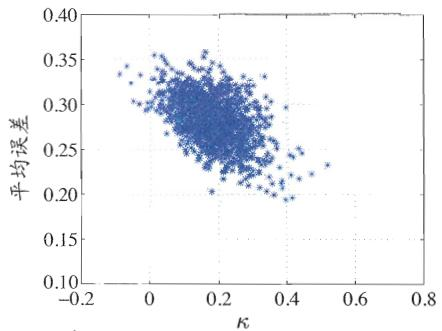  
(a) AdaBoost 集成

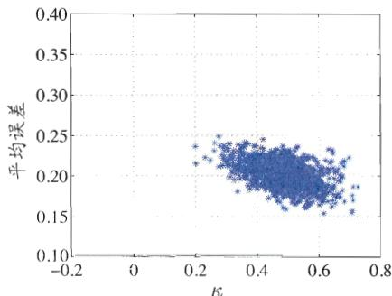  
(b) Bagging 集成  
图8.10 在UCI数据集tic-tac-toe上的 $\kappa$ -误差图.每个集成含50棵C4.5决策树

## 8.5.3 多样性增强

在集成学习中需有效地生成多样性大的个体学习器. 与简单地直接用初始数据训练出个体学习器相比, 如何增强多样性呢? 一般思路是在学习过程中引入随机性, 常见做法主要是对数据样本、输入属性、输出表示、算法参数进行扰动.

## - 数据样本扰动

给定初始数据集, 可从中产生出不同的数据子集, 再利用不同的数据子集训练出不同的个体学习器. 数据样本扰动通常是基于采样法, 例如在 Bagging 中使用自助采样, 在 AdaBoost 中使用序列采样. 此类做法简单高效, 使用最广. 对很多常见的基学习器, 例如决策树、神经网络等, 训练样本稍加变化就会导致学习器有显著变动, 数据样本扰动法对这样的 “不稳定基学习器” 很有效; 然而, 有一些基学习器对数据样本的扰动不敏感, 例如线性学习器、支持向量机、朴素贝叶斯、k 近邻学习器等, 这样的基学习器称为稳定基学习器(stable base learner), 对此类基学习器进行集成往往需使用输入属性扰动等其他机制.

## - 输入属性扰动

子空间一般指从初始的高维属性空间投影产生的低维属性空间，描述低维空间的属性是通过初始属性投影变换而得，未必是初始属性。参见第10章。

$F_{t}$ 包含 $d'$ 个随机选取的属性, $D_{t}$ 仅保留 $F_{t}$ 中的属性.

训练样本通常由一组属性描述, 不同的“子空间”(subspace, 即属性子集)提供了观察数据的不同视角. 显然, 从不同子空间训练出的个体学习器必然有所不同. 著名的随机子空间(random subspace)算法 [Ho, 1998] 就依赖于输入属性扰动, 该算法从初始属性集中抽取出若干个属性子集, 再基于每个属性子集训练一个基学习器, 算法描述如图 8.11 所示. 对包含大量冗余属性的数据, 在子空间中训练个体学习器不仅能产生多样性大的个体, 还会因属性数的减少而大幅节省时间开销, 同时, 由于冗余属性多, 减少一些属性后训练出的个体学习器也不至于太差. 若数据只包含少量属性, 或者冗余属性很少, 则不宜使用输入属性扰动法.

输入：训练集  $D = \{(\mathbf{x}_{1}, y_{1}), (\mathbf{x}_{2}, y_{2}), \cdots, (\mathbf{x}_{m}, y_{m})\}$ ;
基学习算法 L;
基学习器数 T;
子空间属性数  $d'$ .
过程：
1: for  $t = 1, 2, \ldots, T$  do
2:  $\mathcal{F}_{t} = \text{RS}(D, d')$ 
3:  $D_{t} = \text{Map}_{\mathcal{F}_{t}}(D)$ 
4:  $h_{t} = \mathfrak{L}(D_{t})$ 
5: end for
输出： $H(\boldsymbol{x}) = \arg\max_{y \in \mathcal{Y}} \sum_{t=1}^{T} \mathbb{I}\left(h_{t}\left(\text{Map}_{\mathcal{F}_{t}}(\boldsymbol{x})\right)=y\right)$

图 8.11 随机子空间算法

## - 输出表示扰动

此类做法的基本思路是对输出表示进行操纵以增强多样性。可对训练样本的类标记稍作变动，如“翻转法”(Flipping Output) [Breiman, 2000] 随机改变一些训练样本的标记；也可对输出表示进行转化，如“输出调制法”(Output Smearing) [Breiman, 2000] 将分类输出转化为回归输出后构建个体学习器；还可将原任务拆解为多个可同时求解的子任务，如 ECOC 法 [Dietterich and Bakiri, 1995] 利用纠错输出码将多分类任务拆解为一系列二分类任务来训练基学习器。

## - 算法参数扰动

基学习算法一般都有参数需进行设置, 例如神经网络的隐层神经元数、初始连接权值等, 通过随机设置不同的参数, 往往可产生差别较大的个体学习器.

例如“负相关法”(Negative Correlation) [Liu and Yao, 1999] 显式地通过正则化项来强制个体神经网络使用不同的参数。对参数较少的算法，可通过将其学习过程中某些环节用其他类似方式代替，从而达到扰动的目的，例如可将决策树使用的属性选择机制替换成其他的属性选择机制。值得指出的是，使用单一学习器时通常需使用交叉验证等方法来确定参数值，这事实上已使用了不同参数训练出多个学习器，只不过最终仅选择其中一个学习器进行使用，而集成学习则相当于把这些学习器都利用起来；由此也可看出，集成学习技术的实际计算开销并不比使用单一学习器大很多。

不同的多样性增强机制可同时使用, 例如 8.3.2 节介绍的随机森林中同时使用了数据样本扰动和输入属性扰动, 有些方法甚至同时使用了更多机制 [Zhou, 2012].

## 8.6 阅读材料

集成学习方面的主要推荐读物是 [Zhou, 2012], 本章提及的所有内容在该书中都有更深入详细的介绍. [Kuncheva, 2004; Rokach, 2010b] 可供参考. [Schapire and Freund, 2012] 则是专门关于 Boosting 的著作.

Boosting 源于 [Schapire, 1990] 对 [Kearns and Valiant, 1989] 提出的“弱学习是否等价于强学习”这个重要理论问题的构造性证明。最初的 Boosting 算法仅有理论意义，经数年努力后 [Freund and Schapire, 1997] 提出 AdaBoost，并因此获得理论计算机科学方面的重要奖项——哥德尔奖。不同集成学习方法的工作机理和理论性质往往有显著不同，例如从偏差-方差分解的角度看，Boosting 主要关注降低偏差，而 Bagging 主要关注降低方差。MultiBoosting [Webb, 2000] 等方法尝试将二者的优点加以结合。关于 Boosting 和 Bagging 已有很多理论研究结果，可参阅 [Zhou, 2012] 第 2\~3 章。

这个现象的严格表述是“为什么 AdaBoost 在训练误差达到零之后继续训练仍能提高泛化性能”；若一直训练下去，过拟合最终仍会出现.

8.2 节给出的 AdaBoost 推导源于 “统计视角” (statistical view) [Friedman et al., 2000], 此派理论认为 AdaBoost 实质上是基于加性模型(additive model)以类似牛顿迭代法来优化指数损失函数. 受此启发, 通过将迭代优化过程替换为其他优化方法, 产生了 GradientBoosting [Friedman, 2001]、LPBoost [Demiriz et al., 2008] 等变体算法. 然而, 这派理论产生的推论与 AdaBoost 实际行为有相当大的差别 [Mease and Wyner, 2008], 尤其是它不能解释 AdaBoost 为什么没有过拟合这个重要现象, 因此不少人认为, 统计视角本身虽很有意义, 但其阐释的是一个与 AdaBoost 相似的学习过程而并非 AdaBoost 本身. “间隔理论” (margin theory) [Schapire et al., 1998] 能直观地解释这个重要现象,但过去 15 年中一直存有争论, 直到最近的研究结果使它最终得以确立, 并对新型学习方法的设计给出了启示; 相关内容可参阅 [Zhou, 2014].

本章仅介绍了最基本的几种结合方法, 常见的还有基于 D-S 证据理论的方法、动态分类器选择、混合专家(mixture of experts) 等. 本章仅介绍了成对型多样性度量. [Kuncheva and Whitaker, 2003; Tang et al., 2006] 显示出, 现有多样性度量都存在显著缺陷. 如何理解多样性, 被认为是集成学习中的圣杯问题. 关于结合方法和多样性方面的内容, 可参阅 [Zhou, 2012] 第 4\~5 章.

对并行化集成的修剪亦称“选择性集成”（selective ensemble），但现在一般将选择性集成用作集成修剪的同义语，亦称“集成选择”（ensemble selection）。

在集成产生之后再试图通过去除一些个体学习器来获得较小的集成, 称为集成修剪(ensemble pruning). 这有助于减小模型的存储开销和预测时间开销. 早期研究主要针对序列化集成进行, 减小集成规模后常导致泛化性能下降[Rokach, 2010a]; [Zhou et al., 2002] 揭示出对并行化集成进行修剪能在减小规模的同时提升泛化性能, 并催生了基于优化的集成修剪技术. 这方面的内容可参阅 [Zhou, 2012] 第6章.

关于聚类、半监督学习、代价敏感学习等任务中集成学习的内容, 可参阅 [Zhou, 2012] 第 7\~8 章. 事实上, 集成学习已被广泛用于几乎所有的学习任务. 著名数据挖掘竞赛 KDDCup 历年的冠军几乎都使用了集成学习.

由于集成包含多个学习器, 即便个体学习器有较好的可解释性, 集成仍是黑箱模型. 已有一些工作试图改善集成的可解释性, 例如将集成转化为单模型、从集成中抽取符号规则等, 这方面的研究衍生出了能产生性能超越集成的单学习器的 “二次学习” (twice-learning) 技术, 例如 NeC4.5 算法 [Zhou and Jiang, 2004]. 可视化技术也对改善可解释性有一定帮助. 可参阅 [Zhou, 2012] 第 8 章.

习题

8.1 假设抛硬币正面朝上的概率为 $p$ , 反面朝上的概率为 $1 - p$ . 令 $H(n)$ 代表抛 $n$ 次硬币所得正面朝上的次数, 则最多 $k$ 次正面朝上的概率为

$$
P \big (H (n) \leqslant k \big) = \sum_ {i = 0} ^ {k} {\binom {n} {i}} p ^ {i} (1 - p) ^ {n - i}.\tag{8.43}
$$

对 $\delta > 0, k = (p - \delta)n$ , 有 Hoeffding 不等式

$$
P \big (H (n) \leqslant (p - \delta) n \big) \leqslant e ^ {- 2 \delta^ {2} n}.\tag{8.44}
$$

试推导出式(8.3).

8.2 对于 0/1 损失函数来说, 指数损失函数并非仅有的一致替代函数. 考虑式(8.5), 试证明: 任意损失函数 $\ell(-f(x)H(x))$ , 若对于 $H(x)$ 在区间 $[- \infty, \delta]$ ( $\delta > 0$ ) 上单调递减, 则 $\ell$ 是 0/1 损失函数的一致替代函数.

8.3 从网上下载或自己编程实现 AdaBoost, 以不剪枝决策树为基学习器, 在西瓜数据集 $3.0\alpha$ 上训练一个 AdaBoost 集成, 并与图 8.4 进行比较.

8.4 GradientBoosting [Friedman, 2001] 是一种常用的 Boosting 算法, 试析其与 AdaBoost 的异同.

8.5 试编程实现 Bagging, 以决策树桩为基学习器, 在西瓜数据集 $3.0\alpha$ 上训练一个 Bagging 集成, 并与图 8.6 进行比较.

8.6 试析 Bagging 通常为何难以提升朴素贝叶斯分类器的性能.

8.7 试析随机森林为何比决策树 Bagging 集成的训练速度更快.

8.8 MultiBoosting 算法 [Webb, 2000] 将 AdaBoost 作为 Bagging 的基学习器, Iterative Bagging 算法 [Breiman, 2001b] 则是将 Bagging 作为 AdaBoost 的基学习器. 试比较二者的优缺点.

8.9\* 试设计一种可视的多样性度量, 对习题 8.3 和习题 8.5 中得到的集成进行评估, 并与 $\kappa$ -误差图比较.

8.10\* 试设计一种能提升 $k$ 近邻分类器性能的集成学习算法.

## 参考文献

Breiman, L. (1996a). “Bagging predictors.” Machine Learning, 24(2):123–140.

Breiman, L. (1996b). “Stacked regressions.” Machine Learning, 24(1):49–64.

Breiman, L. (2000). “Randomizing outputs to increase prediction accuracy.” Machine Learning, 40(3):113–120.

Breiman, L. (2001a). “Random forests.” Machine Learning, 45(1):5–32.

Breiman, L. (2001b). "Using iterated bagging to debias regressions." Machine Learning, 45(3):261–277.

Clarke, B. (2003). "Comparing Bayes model averaging and stacking when model approximation error cannot be ignored." Journal of Machine Learning Research, 4:683–712.

Demiriz, A., K. P. Bennett, and J. Shawe-Taylor. (2008). "Linear programming Boosting via column generation." Machine Learning, 46(1-3):225–254.

Dietterich, T. G. (2000). “Ensemble methods in machine learning.” In Proceedings of the 1st International Workshop on Multiple Classifier Systems (MCS), 1–15, Cagliari, Italy.

Dietterich, T. G. and G. Bakiri. (1995). "Solving multiclass learning problems via error-correcting output codes." Journal of Artificial Intelligence Research, 2:263–286.

Freund, Y. and R. E. Schapire. (1997). “A decision-theoretic generalization of on-line learning and an application to boosting.” Journal of Computer and System Sciences, 55(1):119–139.

Friedman, J., T. Hastie, and R. Tibshirani. (2000). “Additive logistic regression: A statistical view of boosting (with discussions).” Annals of Statistics, 28(2):337–407.

Friedman, J. H. (2001). “Greedy function approximation: A gradient Boosting machine.” Annals of Statistics, 29(5):1189–1232.

Ho, T. K. (1998). “The random subspace method for constructing decision forests.” IEEE Transactions on Pattern Analysis and Machine Intelligence, 20(8):832–844.

Ho, T. K., J. J. Hull, and S. N. Srihari. (1994). “Decision combination in multi-

ple classifier systems." IEEE Transaction on Pattern Analysis and Machine Intelligence, 16(1):66–75.

Kearns, M. and L. G. Valiant. (1989). "Cryptographic limitations on learning Boolean formulae and finite automata." In Proceedings of the 21st Annual ACM Symposium on Theory of Computing (STOC), 433–444, Seattle, WA.

Kittler, J., M. Hatef, R. Duin, and J. Matas. (1998). "On combining classifiers." IEEE Transactions on Pattern Analysis and Machine Intelligence, 20(3): 226–239.

Kohavi, R. and D. H. Wolpert. (1996). “Bias plus variance decomposition for zero-one loss functions.” In Proceedings of the 13th International Conference on Machine Learning (ICML), 275–283, Bari, Italy.

Krogh, A. and J. Vedelsby. (1995). "Neural network ensembles, cross validation, and active learning." In Advances in Neural Information Processing Systems 7 (NIPS) (G. Tesauro, D. S. Touretzky, and T. K. Leen, eds.), 231–238, MIT Press, Cambridge, MA.

Kuncheva, L. I. (2004). Combining Pattern Classifiers: Methods and Algorithms. John Wiley & Sons, Hoboken, NJ.

Kuncheva, L. I. and C. J. Whitaker. (2003). "Measures of diversity in classifier ensembles and their relationship with the ensemble accuracy." Machine Learning, 51(2):181–207.

Liu, Y. and X. Yao. (1999). “Ensemble learning via negative correlation.” Neural Networks, 12(10):1399–1404.

Markowitz, H. (1952). "Portfolio selection." Journal of Finance, 7(1):77–91.

Mease, D. and A. Wyner. (2008). “Evidence contrary to the statistical view of boosting (with discussions).” Journal of Machine Learning Research, 9:131–201.

Perrone, M. P. and L. N. Cooper. (1993). “When networks disagree: Ensemble method for neural networks.” In Artificial Neural Networks for Speech and Vision (R. J. Mammone, ed.), 126–142, Chapman & Hall, New York, NY.

Platt, J. C. (2000). "Probabilities for SV machines." In Advances in Large Margin Classifiers (A. J. Smola, P. L. Bartlett, B. Schölkopf, and D. Schuurmans, eds.), 61–74, MIT Press, Cambridge, MA.

Rokach, L. (2010a). “Ensemble-based classifiers.” Artificial Intelligence Review, 33(1):1–39.

Rokach, L. (2010b). Pattern Classification Using Ensemble Methods. World Scientific, Singapore.

Schapire, R. E. (1990). “The strength of weak learnability.” Machine Learning, 5(2):197–227.

Schapire, R. E. and Y. Freund. (2012). Boosting: Foundations and Algorithms. MIT Press, Cambridge, MA.

Schapire, R. E., Y. Freund, P. Bartlett, and W. S. Lee. (1998). “Boosting the margin: A new explanation for the effectiveness of voting methods.” Annals of Statistics, 26(5):1651–1686.

Seewald, A. K. (2002). “How to make Stacking better and faster while also taking care of an unknown weakness.” In Proceedings of the 19th International Conference on Machine Learning (ICML), 554–561, Sydney, Australia.

Tang, E. K., P. N. Suganthan, and X. Yao. (2006). “An analysis of diversity measures.” Machine Learning, 65(1):247–271.

Ting, K. M. and I. H. Witten. (1999). “Issues in stacked generalization.” Journal of Artificial Intelligence Research, 10:271–289.

Webb, G. I. (2000). “MultiBoosting: A technique for combining boosting and wagging.” Machine Learning, 40(2):159–196.

Wolpert, D. H. (1992). “Stacked generalization.” Neural Networks, 5(2):241–260.

Wolpert, D. H. and W. G. Macready. (1999). “An efficient method to estimate Bagging’s generalization error.” Machine Learning, 35(1):41–55.

Xu, L., A. Krzyzak, and C. Y. Suen. (1992). "Methods of combining multiple classifiers and their applications to handwriting recognition." IEEE Transactions on Systems, Man, and Cybernetics, 22(3):418–435.

Zadrozny, B. and C. Elkan. (2001). “Obtaining calibrated probability estimates from decision trees and naïve Bayesian classifiers.” In Proceedings of the 18th International Conference on Machine Learning (ICML), 609–616, Williamstown, MA.

Zhou, Z.-H. (2012). Ensemble Methods: Foundations and Algorithms.

Chapman & Hall/CRC, Boca Raton, FL.

Zhou, Z.-H. (2014). “Large margin distribution learning.” In Proceedings of the 6th IAPR International Workshop on Artificial Neural Networks in Pattern Recognition (ANNPR), 1–11, Montreal, Canada.

Zhou, Z.-H. and Y. Jiang. (2004). "NeC4.5: Neural ensemble based C4.5." IEEE Transactions on Knowledge and Data Engineering, 16(6):770-773.

Zhou, Z.-H., J. Wu, and W. Tang. (2002). “Ensembling neural networks: Many could be better than all.” Artificial Intelligence, 137(1-2):239–263.

## 休息一会儿

## 小故事：老当益壮的李奥·布瑞曼

李奥·布瑞曼 (Leo Breiman, 1928-2005) 是二十世纪伟大的统计学家。他在二十世纪末公开宣称，统计学界把统计搞成了抽象数学，这偏离了初衷，统计学本该是关于预测、解释和处理数据的学问。他自称与机器学习走得更近，因为这一行是在处理有挑战的数据问题。事实上，布瑞曼是

一位卓越的机器学习学家, 他不仅是 CART 决策树的作者, 还对集成学习有三大贡献: Bagging、随机森林以及关于 Boosting 的理论探讨. 有趣的是, 这些都是在他 1993 年从加州大学伯克利分校统计系退休后完成的.

布瑞曼早年在加州理工学院获物理学士学位, 然后打算到哥伦比亚大学念哲学, 但哲学系主任告诉他, 自己最优秀的两个博士生没找到工作, 于是布瑞曼改学数学, 先后在哥伦比亚大学和加州大学伯克利分校获得数学硕士、博士学位. 他先是研究概率论, 但在加州大学洛杉矶分校(UCLA)做了7年教授后他厌倦了概率论, 于是主动辞职. 为了向概率论告别, 辞职后他把自己关在家里半年写了本关于概率论的书, 然后他到工业界做了13年咨询, 再回到加州大学伯克利分校统计系做教授. 布瑞曼的经历极为丰富, 他曾在UCLA学术假期间主动到联合国教科文组织工作, 被安排到非洲利比里亚统计失学儿童数. 他是一位业余雕塑家, 甚至还与人合伙在墨西哥开过制冰厂. 他自认为一生最重要的研究成果——随机森林, 是70多岁时做出来的.
