## 第9章 聚类

## 9.1 聚类任务

常见的无监督学习任务还有密度估计 (density estimation)、异常检测 (anomaly detection) 等.

对聚类算法而言，样本簇亦称“类”.

在 “无监督学习” (unsupervised learning) 中, 训练样本的标记信息是未知的, 目标是通过对无标记训练样本的学习来揭示数据的内在性质及规律, 为进一步的数据分析提供基础. 此类学习任务中研究最多、应用最广的是 “聚类” (clustering).

聚类试图将数据集中的样本划分为若干个通常是不相交的子集, 每个子集称为一个 “簇” (cluster). 通过这样的划分, 每个簇可能对应于一些潜在的概念(类别), 如 “浅色瓜” “深色瓜”, “有籽瓜” “无籽瓜”, 甚至 “本地瓜” “外地瓜” 等; 需说明的是, 这些概念对聚类算法而言事先是未知的, 聚类过程仅能自动形成簇结构, 簇所对应的概念语义需由使用者来把握和命名.

聚类任务中也可使用有标记训练样本, 如 9.4.2 与 13.6 节, 但样本的类标记与聚类产生的簇有所不同.

形式化地说, 假定样本集 $D = \{x_1, x_2, \ldots, x_m\}$ 包含 $m$ 个无标记样本, 每个样本 $x_i = (x_{i1}; x_{i2}; \ldots; x_{in})$ 是一个 $n$ 维特征向量, 则聚类算法将样本集 $D$ 划分为 $k$ 个不相交的簇 $\{C_l \mid l = 1, 2, \ldots, k\}$ , 其中 $C_{l'} \bigcap_{l' \neq l} C_l = \varnothing$ 且 $D = \bigcup_{l=1}^{k} C_l$ . 相应地, 我们用 $\lambda_j \in \{1, 2, \ldots, k\}$ 表示样本 $x_j$ 的“簇标记”(cluster label), 即 $x_j \in C_{\lambda_j}$ . 于是, 聚类的结果可用包含 $m$ 个元素的簇标记向量 $\boldsymbol{\lambda} = (\lambda_1; \lambda_2; \ldots; \lambda_m)$ 表示.

聚类既能作为一个单独过程, 用于找寻数据内在的分布结构, 也可作为分类等其他学习任务的前驱过程. 例如, 在一些商业应用中需对新用户的类型进行判别, 但定义 “用户类型” 对商家来说却可能不太容易, 此时往往可先对用户数据进行聚类, 根据聚类结果将每个簇定义为一个类, 然后再基于这些类训练分类模型, 用于判别新用户的类型.

基于不同的学习策略, 人们设计出多种类型的聚类算法. 本章后半部分将对不同类型的代表性算法进行介绍, 但在此之前, 我们先讨论聚类算法涉及的两个基本问题——性能度量和距离计算.

## 9.2 性能度量

聚类性能度量亦称聚类“有效性指标”(validity index). 与监督学习中的性能度量作用相似, 对聚类结果, 我们需通过某种性能度量来评估其好坏; 另一方面, 若明确了最终将要使用的性能度量, 则可直接将其作为聚类过程的优化目标, 从而更好地得到符合要求的聚类结果.

聚类是将样本集 $D$ 划分为若干互不相交的子集, 即样本簇. 那么, 什么样的聚类结果比较好呢? 直观上看, 我们希望“物以类聚”, 即同一簇的样本尽可能彼此相似, 不同簇的样本尽可能不同. 换言之, 聚类结果的“簇内相似度” (intra-cluster similarity) 高且“簇间相似度” (inter-cluster similarity) 低.

例如将领域专家给出的划分结果作为参考模型.

聚类性能度量大致有两类. 一类是将聚类结果与某个“参考模型”(reference model)进行比较, 称为“外部指标”(external index); 另一类是直接考察聚类结果而不利用任何参考模型, 称为“内部指标”(internal index).

通常 $k \neq s$ .

对数据集 $D = \{\pmb{x}_1, \pmb{x}_2, \dots, \pmb{x}_m\}$ , 假定通过聚类给出的簇划分为 $\mathcal{C} = \{C_1, C_2, \dots, C_k\}$ , 参考模型给出的簇划分为 $\mathcal{C}^* = \{C_1^*, C_2^*, \dots, C_s^*\}$ . 相应地, 令 $\pmb{\lambda}$ 与 $\pmb{\lambda}^*$ 分别表示与 $\mathcal{C}$ 和 $\mathcal{C}^*$ 对应的簇标记向量. 我们将样本两两配对考虑, 定义

$$
a = | S S |, \quad S S = \left\{\left(\boldsymbol {x} _ {i}, \boldsymbol {x} _ {j}\right) \mid \lambda_ {i} = \lambda_ {j}, \lambda_ {i} ^ {*} = \lambda_ {j} ^ {*}, i <   j) \right\},\tag{9.1}
$$

$$
b = | S D |, \quad S D = \left\{\left(\boldsymbol {x} _ {i}, \boldsymbol {x} _ {j}\right) \mid \lambda_ {i} = \lambda_ {j}, \lambda_ {i} ^ {*} \neq \lambda_ {j} ^ {*}, i <   j) \right\},\tag{9.2}
$$

$$
c = | D S |, \quad D S = \left\{\left(\boldsymbol {x} _ {i}, \boldsymbol {x} _ {j}\right) \mid \lambda_ {i} \neq \lambda_ {j}, \lambda_ {i} ^ {*} = \lambda_ {j} ^ {*}, i <   j\right) \},\tag{9.3}
$$

$$
d = | D D |, \quad D D = \left\{\left(\boldsymbol {x} _ {i}, \boldsymbol {x} _ {j}\right) \mid \lambda_ {i} \neq \lambda_ {j}, \lambda_ {i} ^ {*} \neq \lambda_ {j} ^ {*}, i <   j) \right\},\tag{9.4}
$$

其中集合 $SS$ 包含了在 $\mathcal{C}$ 中隶属于相同簇且在 $\mathcal{C}^*$ 中也隶属于相同簇的样本对, 集合 $SD$ 包含了在 $\mathcal{C}$ 中隶属于相同簇但在 $\mathcal{C}^*$ 中隶属于不同簇的样本对, ……由于每个样本对 $(\pmb{x}_i, \pmb{x}_j) (i < j)$ 仅能出现在一个集合中, 因此有 $a + b + c + d = m(m - 1)/2$ 成立.

基于式(9.1)\~(9.4)可导出下面这些常用的聚类性能度量外部指标:

\- Jaccard 系数(Jaccard Coefficient, 简称 JC)

$$
\mathrm{JC} = \frac {a}{a + b + c}.\tag{9.5}
$$

\- FM 指数(Fowlkes and Mallows Index, 简称 FMI)

$$
\mathrm{FMI} = \sqrt {\frac {a}{a + b} \cdot \frac {a}{a + c}}.\tag{9.6}
$$

\- Rand 指数(Rand Index, 简称 RI)

$$
\mathrm{RI} = \frac {2 (a + d)}{m (m - 1)}.\tag{9.7}
$$

显然, 上述性能度量的结果值均在 $[0,1]$ 区间, 值越大越好.

考虑聚类结果的簇划分 $C=\{C_{1},C_{2},\ldots,C_{k}\}$ ，定义

$$
\operatorname{avg} (C) = \frac {2}{| C | (| C | - 1)} \sum_ {1 \leqslant i <   j \leqslant | C |} \operatorname{dist} (\boldsymbol {x} _ {i}, \boldsymbol {x} _ {j}),\tag{9.8}
$$

$$
\operatorname{diam} (C) = \max _ {1 \leqslant i <   j \leqslant | C |} \operatorname{dist} (\boldsymbol {x} _ {i}, \boldsymbol {x} _ {j}),\tag{9.9}
$$

$$
d _ {\min} (C _ {i}, C _ {j}) = \min _ {\boldsymbol {x} _ {i} \in C _ {i}, \boldsymbol {x} _ {j} \in C _ {j}} \operatorname{dist} (\boldsymbol {x} _ {i}, \boldsymbol {x} _ {j}),\tag{9.10}
$$

$$
d _ {\mathrm{cen}} (C _ {i}, C _ {j}) = \operatorname{dist} (\boldsymbol {\mu} _ {i}, \boldsymbol {\mu} _ {j}),\tag{9.11}
$$

距离越大则样本的相似度越低; 距离计算见下节.

其中， $\mathrm{dist}(\cdot, \cdot)$ 用于计算两个样本之间的距离； $\pmb{\mu}$ 代表簇 $C$ 的中心点 $\pmb{\mu} = \frac{1}{|C|} \sum_{1 \leqslant i \leqslant |C|} \pmb{x}_i$ 。显然， $\mathrm{avg}(C)$ 对应于簇 $C$ 内样本间的平均距离， $\mathrm{diam}(C)$ 对应于簇 $C$ 内样本间的最远距离， $d_{\min}(C_i, C_j)$ 对应于簇 $C_i$ 与簇 $C_j$ 最近样本间的距离， $d_{\mathrm{cen}}(C_i, C_j)$ 对应于簇 $C_i$ 与簇 $C_j$ 中心点间的距离。

基于式(9.8)\~(9.11)可导出下面这些常用的聚类性能度量内部指标:

\- DB 指数(Davies-Bouldin Index, 简称 DBI)

$$
\mathrm{DBI} = \frac {1}{k} \sum_ {i = 1} ^ {k} \max _ {j \neq i} \left(\frac {\operatorname{avg} (C _ {i}) + \operatorname{avg} (C _ {j})}{d _ {\text { cen }} (\boldsymbol {\mu} _ {i} , \boldsymbol {\mu} _ {j})}\right).\tag{9.12}
$$

\- Dunn 指数(Dunn Index, 简称 DI)

$$
\mathrm{DI} = \min _ {1 \leqslant i \leqslant k} \left\{\min _ {j \neq i} \left(\frac {d _ {\min} (C _ {i} , C _ {j})}{\max _ {1 \leqslant l \leqslant k} \operatorname{diam} (C _ {l})}\right) \right\}.\tag{9.13}
$$

显然, DBI 的值越小越好, 而 DI 则相反, 值越大越好.

## 9.3 距离计算

对函数 $\text{dist}(\cdot,\cdot)$ ，若它是一个“距离度量”(distance measure)，则需满足一些基本性质：

$$
\text { 非负性: } \mathrm{dist} (\pmb {x} _ {i}, \pmb {x} _ {j}) \geqslant 0;\tag{9.14}
$$

$$
\text { 同一性: } \mathrm{dist} (\pmb {x} _ {i}, \pmb {x} _ {j}) = 0 \text { 当且仅当 } \pmb {x} _ {i} = \pmb {x} _ {j};\tag{9.15}
$$

$$
\text { 对称性: } \mathrm{dist} (\pmb {x} _ {i}, \pmb {x} _ {j}) = \mathrm{dist} (\pmb {x} _ {j}, \pmb {x} _ {i});\tag{9.16}
$$

直递性常被直接称为“三角不等式”.

$$
\text { 直递性: } \mathrm{dist} (\pmb {x} _ {i}, \pmb {x} _ {j}) \leqslant \mathrm{dist} (\pmb {x} _ {i}, \pmb {x} _ {k}) + \mathrm{dist} (\pmb {x} _ {k}, \pmb {x} _ {j}).\tag{9.17}
$$

给定样本 $\boldsymbol{x}_{i}=(x_{i1};x_{i2};\ldots;x_{in})$ 与 $\boldsymbol{x}_{j}=(x_{j1};x_{j2};\ldots;x_{jn})$ ，最常用的是“闵可夫斯基距离”(Minkowski distance)

式(9.18)即为 $x_{i}-x_{j}$ 的 $L_{p}$ 范数 $\|x_{i}-x_{j}\|_{p}$ .

$$
\operatorname{dist} _ {\mathrm{mk}} \left(\boldsymbol {x} _ {i}, \boldsymbol {x} _ {j}\right) = \left(\sum_ {u = 1} ^ {n} \left| x _ {i u} - x _ {j u} \right| ^ {p}\right) ^ {\frac {1}{p}}.\tag{9.18}
$$

对 $p \geqslant 1$ , 式(9.18)显然满足式(9.14)\~(9.17)的距离度量基本性质.

$p \mapsto \infty$ 时则得到切比雪夫距离.

p=2 时, 闵可夫斯基距离即欧氏距离(Euclidean distance)

$$
\mathrm{dist} _ {\mathrm{ed}} (\boldsymbol {x} _ {i}, \boldsymbol {x} _ {j}) = | | \boldsymbol {x} _ {i} - \boldsymbol {x} _ {j} | | _ {2} = \sqrt {\sum_ {u = 1} ^ {n} | x _ {i u} - x _ {j u} | ^ {2}}.\tag{9.19}
$$

亦称 “街区距离” (city block distance).

p = 1 时, 闵可夫斯基距离即曼哈顿距离(Manhattan distance)

$$
\mathrm{dist} _ {\mathrm{man}} (\pmb {x} _ {i}, \pmb {x} _ {j}) = | | \pmb {x} _ {i} - \pmb {x} _ {j} | | _ {1} = \sum_ {u = 1} ^ {n} | x _ {i u} - x _ {j u} |.\tag{9.20}
$$

连续属性亦称“数值属性”(numerical attribute), “离散属性”亦称“列名属性”(nominal attribute).

我们常将属性划分为“连续属性”(continuous attribute)和“离散属性”(categorical attribute)，前者在定义域上有无穷多个可能的取值，后者在定义域上是有限个取值。然而，在讨论距离计算时，属性上是否定义了“序”关系更为重要。例如定义域为 $\{1,2,3\}$ 的离散属性与连续属性的性质更接近一些，能直接在属性值上计算距离：“1”与“2”比较接近、与“3”比较远，这样的属性称为“有序属性”(ordinal attribute)；而定义域为{飞机，火车，轮船}这样的离散属性则不能直接在属性值上计算距离，称为“无序属性”(non-ordinal attribute)。显然，闵可夫斯基距离可用于有序属性。

对无序属性可采用 VDM (Value Difference Metric) [Stanfill and Waltz, 1986]. 令 $m_{u,a}$ 表示在属性 $u$ 上取值为 $a$ 的样本数, $m_{u,a,i}$ 表示在第 $i$ 个样本簇中在属性 $u$ 上取值为 $a$ 的样本数, $k$ 为样本簇数, 则属性 $u$ 上两个离散值 $a$ 与 $b$ 之间的 VDM 距离为

样本类别已知时 $k$ 通常设置为类别数.

$$
\mathrm{VDM} _ {p} (a, b) = \sum_ {i = 1} ^ {k} \left| \frac {m _ {u , a , i}}{m _ {u , a}} - \frac {m _ {u , b , i}}{m _ {u , b}} \right| ^ {p}.\tag{9.21}
$$

于是, 将闵可夫斯基距离和 VDM 结合即可处理混合属性. 假定有 $n_{c}$ 个有序属性、 $n - n_{c}$ 个无序属性, 不失一般性, 令有序属性排列在无序属性之前, 则

$$
\mathrm{MinkovDM} _ {p} (\boldsymbol {x} _ {i}, \boldsymbol {x} _ {j}) = \left(\sum_ {u = 1} ^ {n _ {c}} | x _ {i u} - x _ {j u} | ^ {p} + \sum_ {u = n _ {c} + 1} ^ {n} \mathrm{VDM} _ {p} (x _ {i u}, x _ {j u})\right) ^ {\frac {1}{p}}\tag{9.22}
$$

当样本空间中不同属性的重要性不同时, 可使用 “加权距离” (weighted distance). 以加权闵可夫斯基距离为例:

$$
\mathrm{dist} _ {\mathrm{wmk}} (\pmb {x} _ {i}, \pmb {x} _ {j}) = \left(w _ {1} \cdot | x _ {i 1} - x _ {j 1} | ^ {p} + \ldots + w _ {n} \cdot | x _ {i n} - x _ {j n} | ^ {p}\right) ^ {\frac {1}{p}},\tag{9.23}
$$

其中权重 $w_{i} \geqslant 0 (i = 1, 2, \ldots, n)$ 表征不同属性的重要性, 通常 $\sum_{i=1}^{n} w_{i} = 1$ .

需注意的是, 通常我们是基于某种形式的距离来定义 “相似度度量” (similarity measure), 距离越大, 相似度越小. 然而, 用于相似度度量的距离未必一定要满足距离度量的所有基本性质, 尤其是直递性(9.17). 例如在某些任务中我们可能希望有这样的相似度度量: “人” “马” 分别与 “人马” 相似, 但 “人” 与 “马” 很不相似; 要达到这个目的, 可以令 “人” “马” 与 “人马” 之间的距离都比较小, 但 “人” 与 “马” 之间的距离很大, 如图 9.1 所示, 此时该距离不再满足直递性; 这样的距离称为 “非度量距离” (non-metric distance). 此外, 本节介绍的距离计算式都是事先定义好的, 但在不少现实任务中, 有必要基于数据样本来确定合适的距离计算式, 这可通过 “距离度量学习” (distance metric learning) 来实现.

参见 10.6 节.

这个例子中，从数学上看，令 $d_{3} = 3$ 即可满足直递性；但从语义上看， $d_{3}$ 应远大于 $d_{1}$ 与 $d_{2}$ .

  
图9.1 非度量距离的一个例子

## 9.4 原型聚类

“原型”是指样本空间中具有代表性的点.

原型聚类亦称“基于原型的聚类”(prototype-based clustering)，此类算法假设聚类结构能通过一组原型刻画，在现实聚类任务中极为常用。通常情形下，算法先对原型进行初始化，然后对原型进行迭代更新求解。采用不同的原型表示、不同的求解方式，将产生不同的算法。下面介绍几种著名的原型聚类算法。

## 9.4.1 $k$ 均值算法

给定样本集 $D = \{x_{1}, x_{2}, \ldots, x_{m}\}$ ，“k 均值” (k-means) 算法针对聚类所得簇划分 $C = \{C_{1}, C_{2}, \ldots, C_{k}\}$ 最小化平方误差

$$
E = \sum_ {i = 1} ^ {k} \sum_ {\boldsymbol {x} \in C _ {i}} | | \boldsymbol {x} - \boldsymbol {\mu} _ {i} | | _ {2} ^ {2},\tag{9.24}
$$

其中 $\pmb{\mu}_i = \frac{1}{|C_i|}\sum_{\pmb{x}\in C_i}\pmb{x}$ 是簇 $C_i$ 的均值向量. 直观来看, 式(9.24) 在一定程度上刻画了簇内样本围绕簇均值向量的紧密程度, $E$ 值越小则簇内样本相似度越高.

最小化式(9.24)并不容易, 找到它的最优解需考察样本集 $D$ 所有可能的簇划分, 这是一个 NP 难问题[Aloise et al., 2009]. 因此, $k$ 均值算法采用了贪心策略, 通过迭代优化来近似求解式(9.24). 算法流程如图 9.2 所示, 其中第 1 行对均值向量进行初始化, 在第 4-8 行与第 9-16 行依次对当前簇划分及均值向量迭代更新, 若迭代更新后聚类结果保持不变, 则在第 18 行将当前簇划分结果返回.

下面以表 9.1 的西瓜数据集 4.0 为例来演示 k 均值算法的学习过程. 为方便叙述, 我们将编号为 i 的样本称为 $x_{i}$ , 这是一个包含 “密度” 与 “含糖率” 两个属性值的二维向量.

p.89 的西瓜数据集 $3.0\alpha$ 是西瓜数据集 4.0 的子集.

样本 9\~21 的类别是“好瓜=否”，其他样本的类别是“好瓜=是”。由于本节使用无标记样本，因此类别标记信息未在表中给出。

表 9.1 西瓜数据集 4.0

<table><tr><td>编号</td><td>密度</td><td>含糖率</td><td>编号</td><td>密度</td><td>含糖率</td><td>编号</td><td>密度</td><td>含糖率</td></tr><tr><td>1</td><td>0.697</td><td>0.460</td><td>11</td><td>0.245</td><td>0.057</td><td>21</td><td>0.748</td><td>0.232</td></tr><tr><td>2</td><td>0.774</td><td>0.376</td><td>12</td><td>0.343</td><td>0.099</td><td>22</td><td>0.714</td><td>0.346</td></tr><tr><td>3</td><td>0.634</td><td>0.264</td><td>13</td><td>0.639</td><td>0.161</td><td>23</td><td>0.483</td><td>0.312</td></tr><tr><td>4</td><td>0.608</td><td>0.318</td><td>14</td><td>0.657</td><td>0.198</td><td>24</td><td>0.478</td><td>0.437</td></tr><tr><td>5</td><td>0.556</td><td>0.215</td><td>15</td><td>0.360</td><td>0.370</td><td>25</td><td>0.525</td><td>0.369</td></tr><tr><td>6</td><td>0.403</td><td>0.237</td><td>16</td><td>0.593</td><td>0.042</td><td>26</td><td>0.751</td><td>0.489</td></tr><tr><td>7</td><td>0.481</td><td>0.149</td><td>17</td><td>0.719</td><td>0.103</td><td>27</td><td>0.532</td><td>0.472</td></tr><tr><td>8</td><td>0.437</td><td>0.211</td><td>18</td><td>0.359</td><td>0.188</td><td>28</td><td>0.473</td><td>0.376</td></tr><tr><td>9</td><td>0.666</td><td>0.091</td><td>19</td><td>0.339</td><td>0.241</td><td>29</td><td>0.725</td><td>0.445</td></tr><tr><td>10</td><td>0.243</td><td>0.267</td><td>20</td><td>0.282</td><td>0.257</td><td>30</td><td>0.446</td><td>0.459</td></tr></table>

输入: 样本集 $D = \{x_1, x_2, \ldots, x_m\}$; 聚类簇数 $k$.

过程:
1: 从 $D$ 中随机选择 $k$ 个样本作为初始均值向量 $\{\mu_1, \mu_2, \ldots, \mu_k\}$
2: repeat
3: 令 $C_i = \varnothing (1 \leqslant i \leqslant k)$
4: for $j = 1, 2, \ldots, m$ do
5: 计算样本 $x_j$ 与各均值向量 $\mu_i (1 \leqslant i \leqslant k)$ 的距离: $d_{ji} = ||x_j - \mu_i||_2$;
6: 根据距离最近的均值向量确定 $x_j$ 的簇标记: $\lambda_j = \arg \min_{i \in \{1, 2, \ldots, k\}} d_{ji}$;
7: 将样本 $x_j$ 划入相应的簇: $C_{\lambda_j} = C_{\lambda_j} \cup \{x_j\}$;
8: end for
9: for $i = 1, 2, \ldots, k$ do
10: 计算新均值向量: $\mu_i' = \frac{1}{|C_i|} \sum_{x \in C_i} x$;
11: if $\mu_i' \neq \mu_i$ then
12: 将当前均值向量 $\mu_i$ 更新为 $\mu_i'$
13: else
14: 保持当前均值向量不变
15: end if
16: end for
17: until 当前均值向量均未更新
输出: 簇划分 $\mathcal{C} = \{C_1, C_2, \ldots, C_k\}$

图9.2 $k$ 均值算法

假定聚类簇数 $k = 3$ , 算法开始时随机选取三个样本 $\pmb{x}_6, \pmb{x}_{12}, \pmb{x}_{27}$ 作为初始均值向量, 即

$$
\boldsymbol {\mu} _ {1} = (0. 4 0 3; 0. 2 3 7), \boldsymbol {\mu} _ {2} = (0. 3 4 3; 0. 0 9 9), \boldsymbol {\mu} _ {3} = (0. 5 3 2; 0. 4 7 2).
$$

考察样本 $x_{1}=(0.697;0.460)$ ，它与当前均值向量 $\mu_{1},\mu_{2},\mu_{3}$ 的距离分别为 0.369, 0.506, 0.166，因此 $x_{1}$ 将被划入簇 $C_{3}$ 中。类似的，对数据集中的所有样本考察一遍后，可得当前簇划分为

$$
\begin{array}{l} C _ {1} = \{\pmb {x} _ {5}, \pmb {x} _ {6}, \pmb {x} _ {7}, \pmb {x} _ {8}, \pmb {x} _ {9}, \pmb {x} _ {1 0}, \pmb {x} _ {1 3}, \pmb {x} _ {1 4}, \pmb {x} _ {1 5}, \pmb {x} _ {1 7}, \pmb {x} _ {1 8}, \pmb {x} _ {1 9}, \pmb {x} _ {2 0}, \pmb {x} _ {2 3} \}; \\ C _ {2} = \{\pmb {x} _ {1 1}, \pmb {x} _ {1 2}, \pmb {x} _ {1 6} \}; \\ C _ {3} = \{\pmb {x} _ {1}, \pmb {x} _ {2}, \pmb {x} _ {3}, \pmb {x} _ {4}, \pmb {x} _ {2 1}, \pmb {x} _ {2 2}, \pmb {x} _ {2 4}, \pmb {x} _ {2 5}, \pmb {x} _ {2 6}, \pmb {x} _ {2 7}, \pmb {x} _ {2 8}, \pmb {x} _ {2 9}, \pmb {x} _ {3 0} \}. \end{array}
$$

于是, 可从 $C_{1}$ 、 $C_{2}$ 、 $C_{3}$ 分别求出新的均值向量

$$
\boldsymbol {\mu} _ {1} ^ {\prime} = (0. 4 7 3; 0. 2 1 4), \boldsymbol {\mu} _ {2} ^ {\prime} = (0. 3 9 4; 0. 0 6 6), \boldsymbol {\mu} _ {3} ^ {\prime} = (0. 6 2 3; 0. 3 8 8).
$$

更新当前均值向量后, 不断重复上述过程, 如图 9.3 所示, 第五轮迭代产生的结果与第四轮迭代相同, 于是算法停止, 得到最终的簇划分.

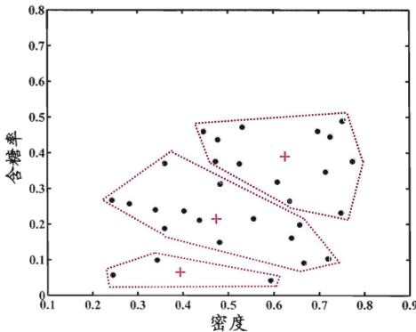  
(a) 第一轮迭代后

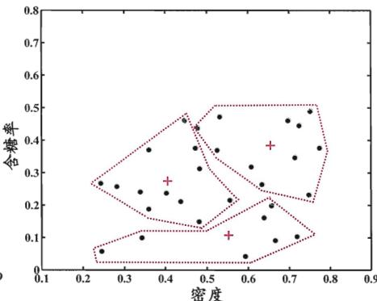  
(b) 第二轮迭代后

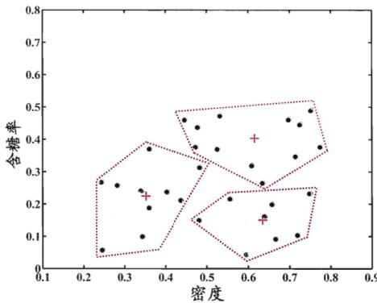  
(c) 第三轮迭代后

  
(d) 第四轮迭代后  
图 9.3 西瓜数据集 4.0 上 k 均值算法 $(k = 3)$ 在各轮迭代后的结果. 样本点与均值向量分别用 “•” 与 “+” 表示, 红色虚线显示出簇划分.

## 9.4.2 学习向量量化

可看作通过聚类来形成类别“子类”结构，每个子类对应一个聚类簇.

与 k 均值算法类似，“学习向量量化”(Learning Vector Quantization, 简称 LVQ)也是试图找到一组原型向量来刻画聚类结构, 但与一般聚类算法不同的是, LVQ 假设数据样本带有类别标记, 学习过程利用样本的这些监督信息来辅助聚类.

给定样本集 $D = \{(\boldsymbol{x}_{1}, y_{1}), (\boldsymbol{x}_{2}, y_{2}), \ldots, (\boldsymbol{x}_{m}, y_{m})\}$ ，每个样本 $x_{j}$ 是由 n 个属性描述的特征向量 $(x_{j1}; x_{j2}; \ldots; x_{jn})$ ， $y_{j} \in Y$ 是样本 $x_{j}$ 的类别标记。LVQ 的目标是学得一组 n 维原型向量 $\{p_{1}, p_{2}, \ldots, p_{q}\}$ ，每个原型向量代表一个聚类簇，簇标记 $t_{i} \in Y$ 。

LVQ 算法描述如图 9.4 所示. 算法第 1 行先对原型向量进行初始化, 例如对第 q 个簇可从类别标记为 $t_{q}$ 的样本中随机选取一个作为原型向量. 算法第

输入: 样本集 $D = \{(\boldsymbol{x}_1, y_1), (\boldsymbol{x}_2, y_2), \ldots, (\boldsymbol{x}_m, y_m)\}$; 原型向量个数 $q$, 各原型向量预设的类别标记 $\{t_1, t_2, \ldots, t_q\}$; 学习率 $\eta \in (0, 1)$.

过程:
1: 初始化一组原型向量 $\{\boldsymbol{p}_1, \boldsymbol{p}_2, \ldots, \boldsymbol{p}_q\}$
2: repeat
3: 从样本集 $D$ 随机选取样本 $(\boldsymbol{x}_j, y_j)$;
4: 计算样本 $\boldsymbol{x}_j$ 与 $\boldsymbol{p}_i$ ($1 \leqslant i \leqslant q$) 的距离: $d_{ji} = ||\boldsymbol{x}_j - \boldsymbol{p}_i||_2$;
5: 找出与 $\boldsymbol{x}_j$ 距离最近的原型向量 $p_{i^*}$, $i^* = \arg \min_{i \in \{1, 2, \ldots, q\}} d_{ji}$;
6: if $y_j = t_{i^*}$ then
7: $p' = p_{i^*} + \eta \cdot (\boldsymbol{x}_j - p_{i^*})$
8: else
9: $p' = p_{i^*} - \eta \cdot (\boldsymbol{x}_j - p_{i^*})$
10: end if
11: 将原型向量 $p_{i^*}$ 更新为 $p'$
如达到最大迭代轮数.
12: until 满足停止条件
输出: 原型向量 $\{p_1, p_2, \ldots, p_q\}$

图 9.4 学习向量量化算法  
第 5 行是竞争学习的“胜者为王”策略. SOM 是基于无标记样本的聚类算法, 而 LVQ 可看作 SOM 基于监督信息的扩展. 关于竞争学习与 SOM, 参见 5.5.2 和 5.5.3 节.

2\~12 行对原型向量进行迭代优化. 在每一轮迭代中, 算法随机选取一个有标记训练样本, 找出与其距离最近的原型向量, 并根据两者的类别标记是否一致来对原型向量进行相应的更新. 在第 12 行中, 若算法的停止条件已满足(例如已达到最大迭代轮数, 或原型向量更新很小甚至不再更新), 则将当前原型向量作为最终结果返回.

显然, LVQ 的关键是第 6-10 行, 即如何更新原型向量. 直观上看, 对样本 $x_{j}$ , 若最近的原型向量 $\pmb{p}_{i^{*}}$ 与 $x_{j}$ 的类别标记相同, 则令 $\pmb{p}_{i^{*}}$ 向 $x_{j}$ 的方向靠拢, 如第 7 行所示, 此时新原型向量为

$$
\boldsymbol {p} ^ {\prime} = \boldsymbol {p} _ {i ^ {*}} + \eta \cdot (\boldsymbol {x} _ {j} - \boldsymbol {p} _ {i ^ {*}}),\tag{9.25}
$$

$p'$ 与 $x_{j}$ 之间的距离为

$$
\begin{array}{r l} & {| | \pmb {p} ^ {\prime} - \pmb {x} _ {j} | | _ {2} = | | \pmb {p} _ {i ^ {*}} + \eta \cdot (\pmb {x} _ {j} - \pmb {p} _ {i ^ {*}}) - \pmb {x} _ {j} | | _ {2}} \\ & {\qquad = (1 - \eta) \cdot | | \pmb {p} _ {i ^ {*}} - \pmb {x} _ {j} | | _ {2}.} \end{array}\tag{9.26}
$$

令学习率 $\eta \in (0,1)$ , 则原型向量 $p_{i*}$ 在更新为 $p'$ 之后将更接近 $x_j$ .

类似的, 若 $p_{i*}$ 与 $x_{j}$ 的类别标记不同, 则更新后的原型向量与 $x_{j}$ 之间的距离将增大为 $(1+\eta)\cdot||\boldsymbol{p}_{i*}-\boldsymbol{x}_{j}||_{2}$ , 从而更远离 $x_{j}$ .

在学得一组原型向量 $\{p_{1}, p_{2}, \ldots, p_{q}\}$ 后，即可实现对样本空间 X 的簇划

若将 $R_{i}$ 中样本全用原型向量 $p_{i}$ 表示，则可实现数据的“有损压缩”(lossy compression)，这称为“向量量化”(vector quantization); LVQ 由此而得名.

分．对任意样本 x，它将被划入与其距离最近的原型向量所代表的簇中；换言之，每个原型向量 $p_{i}$ 定义了与之相关的一个区域 $R_{i}$ ，该区域中每个样本与 $p_{i}$ 的距离不大于它与其他原型向量 $p_{i'} (i' \neq i)$ 的距离，即

$$
R _ {i} = \left\{\boldsymbol {x} \in \mathcal {X} \mid | | \boldsymbol {x} - \boldsymbol {p} _ {i} | | _ {2} \leqslant | | \boldsymbol {x} - \boldsymbol {p} _ {i ^ {\prime}} | | _ {2}, i ^ {\prime} \neq i \right\}.\tag{9.27}
$$

由此形成了对样本空间 $\mathcal{X}$ 的簇划分 $\{R_1, R_2, \ldots, R_q\}$ ，该划分通常称为“Voronoi剖分”(Voronoi tessellation).

下面我们以表9.1的西瓜数据集4.0为例来演示LVQ的学习过程. 令9-21号样本的类别标记为 $c_{2}$ , 其他样本的类别标记为 $c_{1}$ . 假定 $q = 5$ , 即学习目标是找到5个原型向量 $\pmb{p}_{1}, \pmb{p}_{2}, \pmb{p}_{3}, \pmb{p}_{4}, \pmb{p}_{5}$ , 并假定其对应的类别标记分别为 $c_{1}, c_{2}, c_{2}, c_{1}, c_{1}$ .

即希望为“好瓜=是”找到3个簇，“好瓜=否”找到2个簇.

算法开始时, 根据样本的类别标记和簇的预设类别标记对原型向量进行随机初始化, 假定初始化为样本 $x_{5}, x_{12}, x_{18}, x_{23}, x_{29}$ . 在第一轮迭代中, 假定随机选取的样本为 $x_{1}$ , 该样本与当前原型向量 $p_{1}, p_{2}, p_{3}, p_{4}, p_{5}$ 的距离分别为 0.283, 0.506, 0.434, 0.260, 0.032. 由于 $p_{5}$ 与 $x_{1}$ 距离最近且两者具有相同的类别标记 $c_{2}$ , 假定学习率 $\eta = 0.1$ , 则 LVQ 更新 $p_{5}$ 得到新原型向量

$$
\begin{array}{r l} \pmb {p} ^ {\prime} & = \pmb {p} _ {5} + \eta \cdot (\pmb {x} _ {1} - \pmb {p} _ {5}) \\ & = (0. 7 2 5; 0. 4 4 5) + 0. 1 \cdot ((0. 6 9 7; 0. 4 6 0) - (0. 7 2 5; 0. 4 4 5)) \\ & = (0. 7 2 2; 0. 4 4 2). \end{array}
$$

将 $p_{5}$ 更新为 $p'$ 后, 不断重复上述过程, 不同轮数之后的聚类结果如图 9.5 所示.

## 9.4.3 高斯混合聚类

与 k 均值、LVQ 用原型向量来刻画聚类结构不同, 高斯混合(Mixture-of-Gaussian)聚类采用概率模型来表达聚类原型.

记为 $\pmb{x} \sim \mathcal{N}(\pmb{\mu}, \pmb{\Sigma})$ .

我们先简单回顾一下(多元)高斯分布的定义. 对 $n$ 维样本空间 $\mathcal{X}$ 中的随机向量 $\pmb{x}$ , 若 $\pmb{x}$ 服从高斯分布, 其概率密度函数为

$\pmb{\Sigma}$ : 对称正定矩阵; $|\pmb{\Sigma}|$ : $\pmb{\Sigma}$ 的行列式; $\pmb{\Sigma}^{-1}$ : $\pmb{\Sigma}$ 的逆矩阵.

$$
p (\boldsymbol {x}) = \frac {1}{(2 \pi) ^ {\frac {n}{2}} | \boldsymbol {\Sigma} | ^ {\frac {1}{2}}} e ^ {- \frac {1}{2} (\boldsymbol {x} - \boldsymbol {\mu}) ^ {\mathrm{T}} \boldsymbol {\Sigma} ^ {- 1} (\boldsymbol {x} - \boldsymbol {\mu})},\tag{9.28}
$$

其中 $\pmb{\mu}$ 是 $n$ 维均值向量, $\pmb{\Sigma}$ 是 $n \times n$ 的协方差矩阵. 由式(9.28)可看出, 高斯分布完全由均值向量 $\pmb{\mu}$ 和协方差矩阵 $\pmb{\Sigma}$ 这两个参数确定. 为了明确显示高斯分布与相应参数的依赖关系, 将概率密度函数记为 $p(\boldsymbol{x} \mid \boldsymbol{\mu}, \boldsymbol{\Sigma})$ .

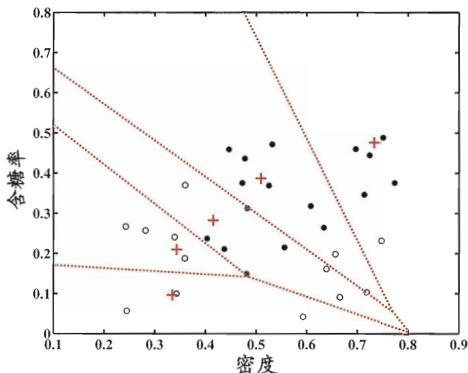  
(a) 50 轮迭代后

  
(b) 100 轮迭代后

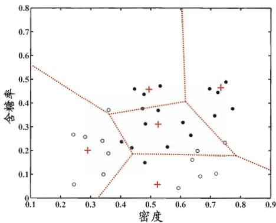  
(c) 200 轮迭代后

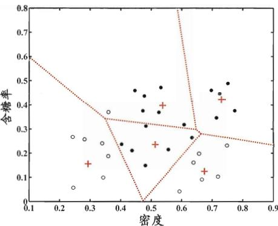  
(d) 400 轮迭代后  
图 9.5 西瓜数据集 4.0 上 LVQ 算法 $(q=5)$ 在不同轮数迭代后的聚类结果. $c_{1}, c_{2}$ 类样本点与原型向量分别用 “•”, “○” 与 “+” 表示, 红色虚线显示出聚类形成的 Voronoi 剖分.

我们可定义高斯混合分布

$p_{\mathcal{M}}(\cdot)$ 也是概率密度函数, $\int p_{\mathcal{M}}(\pmb{x})\mathrm{d}\pmb{x} = 1$

$$
p _ {\mathcal {M}} (\boldsymbol {x}) = \sum_ {i = 1} ^ {k} \alpha_ {i} \cdot p (\boldsymbol {x} \mid \boldsymbol {\mu} _ {i}, \boldsymbol {\Sigma} _ {i}),\tag{9.29}
$$

该分布共由 $k$ 个混合成分组成, 每个混合成分对应一个高斯分布. 其中 $\pmb{\mu}_i$ 与 $\pmb{\Sigma}_i$ 是第 $i$ 个高斯混合成分的参数, 而 $\alpha_i > 0$ 为相应的“混合系数”(mixture coefficient), $\sum_{i=1}^{k} \alpha_i = 1$ .

假设样本的生成过程由高斯混合分布给出: 首先, 根据 $\alpha_{1}, \alpha_{2}, \ldots, \alpha_{k}$ 定义的先验分布选择高斯混合成分, 其中 $\alpha_{i}$ 为选择第 i 个混合成分的概率; 然后, 根据被选择的混合成分的概率密度函数进行采样, 从而生成相应的样本.

若训练集 $D = \{\pmb{x}_1, \pmb{x}_2, \dots, \pmb{x}_m\}$ 由上述过程生成，令随机变量 $z_j \in \{1, 2, \dots, k\}$ 表示生成样本 $\pmb{x}_j$ 的高斯混合成分，其取值未知。显然， $z_j$ 的先验概率 $P(z_j = i)$ 对应于 $\alpha_i (i = 1, 2, \dots, k)$ 。根据贝叶斯定理， $z_j$ 的后验分布对应于

$$
\begin{array}{r l} p _ {\mathcal {M}} (z _ {j} = i \mid \boldsymbol {x} _ {j}) & = \frac {P (z _ {j} = i) \cdot p _ {\mathcal {M}} (\boldsymbol {x} _ {j} \mid z _ {j} = i)}{p _ {\mathcal {M}} (\boldsymbol {x} _ {j})} \\ & = \frac {\alpha_ {i} \cdot p (\boldsymbol {x} _ {j} \mid \boldsymbol {\mu} _ {i} , \boldsymbol {\Sigma} _ {i})}{\sum_ {l = 1} ^ {k} \alpha_ {l} \cdot p (\boldsymbol {x} _ {j} \mid \boldsymbol {\mu} _ {l} , \boldsymbol {\Sigma} _ {l})}. \end{array}\tag{9.30}
$$

换言之, $p_{\mathcal{M}}(z_j = i \mid \boldsymbol{x}_j)$ 给出了样本 $\boldsymbol{x}_j$ 由第 $i$ 个高斯混合成分生成的后验概率. 为方便叙述, 将其简记为 $\gamma_{ji} (i = 1,2,\ldots,k)$ .

当高斯混合分布(9.29)已知时, 高斯混合聚类将把样本集 $D$ 划分为 $k$ 个簇 $\mathcal{C} = \{C_1, C_2, \ldots, C_k\}$ , 每个样本 $\pmb{x}_j$ 的簇标记 $\lambda_j$ 如下确定:

$$
\lambda_ {j} = \underset {i \in \{1, 2, \dots , k \}} {\arg \max} \gamma_ {j i}.\tag{9.31}
$$

因此, 从原型聚类的角度来看, 高斯混合聚类是采用概率模型(高斯分布)对原型进行刻画, 簇划分则由原型对应后验概率确定.

极大似然估计参见7.2节.

那么, 对于式(9.29), 模型参数 $\{(\alpha_i, \pmb{\mu}_i, \pmb{\Sigma}_i) \mid 1 \leqslant i \leqslant k\}$ 如何求解呢? 显然, 给定样本集 $D$ , 可采用极大似然估计, 即最大化(对数)似然

$$
\begin{array}{l} L L (D) = \ln \left(\prod_ {j = 1} ^ {m} p _ {\mathcal {M}} (\boldsymbol {x} _ {j})\right) \\ = \sum_ {j = 1} ^ {m} \ln \left(\sum_ {i = 1} ^ {k} \alpha_ {i} \cdot p (\boldsymbol {x} _ {j} \mid \boldsymbol {\mu} _ {i}, \boldsymbol {\Sigma} _ {i})\right), \end{array}\tag{9.32}
$$

EM 算法参见 7.6 节.

常采用 EM 算法进行迭代优化求解. 下面我们做一个简单的推导.

若参数 $\{(\alpha_i, \pmb{\mu}_i, \pmb{\Sigma}_i) \mid 1 \leqslant i \leqslant k\}$ 能使式(9.32)最大化，则由 $\frac{\partial LL(D)}{\partial \pmb{\mu}_i} = 0$ 有

$$
\sum_ {j = 1} ^ {m} \frac {\alpha_ {i} \cdot p (\boldsymbol {x} _ {j} \mid \boldsymbol {\mu} _ {i} , \boldsymbol {\Sigma} _ {i})}{\sum_ {l = 1} ^ {k} \alpha_ {l} \cdot p (\boldsymbol {x} _ {j} \mid \boldsymbol {\mu} _ {l} , \boldsymbol {\Sigma} _ {l})} (\boldsymbol {x} _ {j} - \boldsymbol {\mu} _ {i}) = 0,\tag{9.33}
$$

由式(9.30)以及 $\gamma_{ji} = p_{\mathcal{M}}(z_j = i \mid \pmb{x}_j)$ , 有

$$
\boldsymbol {\mu} _ {i} = \frac {\sum_ {j = 1} ^ {m} \gamma_ {j i} \boldsymbol {x} _ {j}}{\sum_ {j = 1} ^ {m} \gamma_ {j i}},\tag{9.34}
$$

即各混合成分的均值可通过样本加权平均来估计, 样本权重是每个样本属于该成分的后验概率. 类似的, 由 $\frac{\partial LL(D)}{\partial \Sigma_i} = 0$ 可得

$$
\boldsymbol {\Sigma} _ {i} = \frac {\sum_ {j = 1} ^ {m} \gamma_ {j i} (\boldsymbol {x} _ {j} - \boldsymbol {\mu} _ {i}) (\boldsymbol {x} _ {j} - \boldsymbol {\mu} _ {i}) ^ {\mathrm{T}}}{\sum_ {j = 1} ^ {m} \gamma_ {j i}}.\tag{9.35}
$$

对于混合系数 $\alpha_{i}$ , 除了要最大化 $LL(D)$ , 还需满足 $\alpha_{i} \geqslant 0$ , $\sum_{i=1}^{k} \alpha_{i} = 1$ . 考虑 $LL(D)$ 的拉格朗日形式

$$
L L (D) + \lambda \left(\sum_ {i = 1} ^ {k} \alpha_ {i} - 1\right),\tag{9.36}
$$

其中 $\lambda$ 为拉格朗日乘子. 由式(9.36)对 $\alpha_{i}$ 的导数为 0, 有

$$
\sum_ {j = 1} ^ {m} \frac {p (\boldsymbol {x} _ {j} \mid \boldsymbol {\mu} _ {i} , \boldsymbol {\Sigma} _ {i})}{\sum_ {l = 1} ^ {k} \alpha_ {l} \cdot p (\boldsymbol {x} _ {j} \mid \boldsymbol {\mu} _ {l} , \boldsymbol {\Sigma} _ {l})} + \lambda = 0,\tag{9.37}
$$

两边同乘以 $\alpha_{i}$ , 对所有样本求和可知 $\lambda = -m$ , 有

$$
\alpha_ {i} = \frac {1}{m} \sum_ {j = 1} ^ {m} \gamma_ {j i},\tag{9.38}
$$

即每个高斯成分的混合系数由样本属于该成分的平均后验概率确定.

由上述推导即可获得高斯混合模型的 EM 算法: 在每步迭代中, 先根据当前参数来计算每个样本属于每个高斯成分的后验概率 $\gamma_{ji}$ (E 步), 再根据式(9.34)、(9.35)和(9.38)更新模型参数 $\{(\alpha_{i}, \boldsymbol{\mu}_{i}, \boldsymbol{\Sigma}_{i}) \mid 1 \leqslant i \leqslant k\}$ (M 步).

高斯混合聚类算法描述如图9.6所示. 算法第1行对高斯混合分布的模型参数进行初始化. 然后, 在第2-12行基于EM算法对模型参数进行迭代更新. 若EM算法的停止条件满足(例如已达到最大迭代轮数, 或似然函数 $LL(D)$ 增长很少甚至不再增长), 则在第 14-17 行根据高斯混合分布确定簇划分, 在第 18 行返回最终结果.

输入: 样本集 $D = \{x_1, x_2, \ldots, x_m\}$;
高斯混合成分个数 $k$.

过程:
1: 初始化高斯混合分布的模型参数 $\{(\alpha_i, \mu_i, \Sigma_i) \mid 1 \leqslant i \leqslant k\}$
2: repeat
3: for $j = 1, 2, \ldots, m$ do
4: 根据式(9.30)计算 $x_j$ 由各混合成分生成的后验概率, 即
$\gamma_{ji} = p_M(z_j = i \mid x_j) (1 \leqslant i \leqslant k)$
5: end for
6: for $i = 1, 2, \ldots, k$ do
7: 计算新均值向量: $\mu_i' = \frac{\sum_{j=1}^{m} \gamma_{ji} x_j}{\sum_{j=1}^{m} \gamma_{ji}}$;
8: 计算新协方差矩阵: $\Sigma_i' = \frac{\sum_{j=1}^{m} \gamma_{ji} (x_j - \mu_i') (x_j - \mu_i')^T}{\sum_{j=1}^{m} \gamma_{ji}}$;
9: 计算新混合系数: $\alpha_i' = \frac{\sum_{j=1}^{m} \gamma_{ji}}{m}$;
10: end for
11: 将模型参数 $\{(\alpha_i, \mu_i, \Sigma_i) \mid 1 \leqslant i \leqslant k\}$ 更新为 $\{(\alpha_i', \mu_i', \Sigma_i') \mid 1 \leqslant i \leqslant k\}$
例如达到最大迭代轮数.
12: until 满足停止条件
13: $C_i = \varnothing (1 \leqslant i \leqslant k)$
14: for $j = 1, 2, \ldots, m$ do
15: 根据式(9.31)确定 $x_j$ 的簇标记 $\lambda_j$;
16: 将 $x_j$ 划入相应的簇: $C_{\lambda_j} = C_{\lambda_j} \cup \{x_j\}$
17: end for
输出: 簇划分 $C = \{C_1, C_2, \ldots, C_k\}$

图 9.6 高斯混合聚类算法

以表 9.1 的西瓜数据集 4.0 为例, 令高斯混合成分的个数 k = 3. 算法开始时, 假定将高斯混合分布的模型参数初始化为: $\alpha_{1} = \alpha_{2} = \alpha_{3} = \frac{1}{3}$ ; $\mu_{1} = x_{6}$ , $\mu_{2} = x_{22}$ , $\mu_{3} = x_{27}$ ; $\Sigma_{1} = \Sigma_{2} = \Sigma_{3} = \begin{pmatrix} 0.1 & 0.0 \\ 0.0 & 0.1 \end{pmatrix}$ .

在第一轮迭代中, 先计算样本由各混合成分生成的后验概率. 以 $x_{1}$ 为例, 由式(9.30)算出后验概率 $\gamma_{11} = 0.219$ , $\gamma_{12} = 0.404$ , $\gamma_{13} = 0.377$ . 所有样本的后验概率算完后, 得到如下新的模型参数:

$$
\alpha_ {1} ^ {\prime} = 0. 3 6 1, \alpha_ {2} ^ {\prime} = 0. 3 2 3, \alpha_ {3} ^ {\prime} = 0. 3 1 6
$$

$$
\boldsymbol {\mu} _ {1} ^ {\prime} = (0. 4 9 1; 0. 2 5 1), \boldsymbol {\mu} _ {2} ^ {\prime} = (0. 5 7 1; 0. 2 8 1), \boldsymbol {\mu} _ {3} ^ {\prime} = (0. 5 3 4; 0. 2 9 5)
$$

$$
\boldsymbol {\Sigma} _ {1} ^ {\prime} = \left( \begin{array}{l l} 0. 0 2 5 & 0. 0 0 4 \\ 0. 0 0 4 & 0. 0 1 6 \end{array} \right), \boldsymbol {\Sigma} _ {2} ^ {\prime} = \left( \begin{array}{l l} 0. 0 2 3 & 0. 0 0 4 \\ 0. 0 0 4 & 0. 0 1 7 \end{array} \right), \boldsymbol {\Sigma} _ {3} ^ {\prime} = \left( \begin{array}{l l} 0. 0 2 4 & 0. 0 0 5 \\ 0. 0 0 5 & 0. 0 1 6 \end{array} \right)
$$

模型参数更新后, 不断重复上述过程, 不同轮数之后的聚类结果如图 9.7 所示.

  
(a) 5 轮迭代后

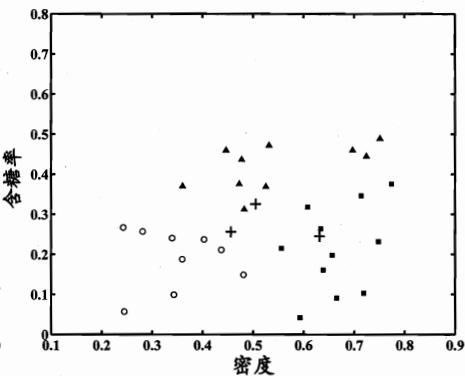  
(b) 10 轮迭代后

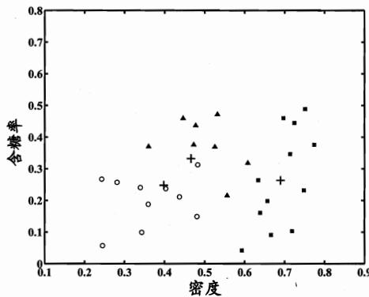  
(c) 20 轮迭代后

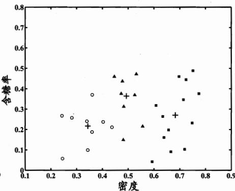  
(d) 50 轮迭代后  
图 9.7 高斯混合聚类 $(k=3)$ 在不同轮数迭代后的聚类结果. 其中样本簇 $C_{1}, C_{2}$ 与 $C_{3}$ 中的样本点分别用 “○”, “■” 与 “▲” 表示, 各高斯混合成分的均值向量用 “+” 表示.

## 9.5 密度聚类

密度聚类亦称“基于密度的聚类”(density-based clustering)，此类算法假设聚类结构能通过样本分布的紧密程度确定。通常情形下，密度聚类算法从样本密度的角度来考察样本之间的可连接性，并基于可连接样本不断扩展聚类簇以获得最终的聚类结果。

全称 “Density-Based Spatial Clustering of Applications with Noise”.

DBSCAN 是一种著名的密度聚类算法, 它基于一组 “邻域” (neighborhood) 参数 $(\epsilon, MinPts)$ 来刻画样本分布的紧密程度. 给定数据集 $D = \{x_{1}, x_{2}, \ldots, x_{m}\}$ , 定义下面这几个概念:

在本章后续内容中，距离函数 $\text{dist}(\cdot,\cdot)$ 在默认情形下设为欧氏距离.

\- $\epsilon$ -邻域: 对 $x_{j} \in D$ , 其 $\epsilon$ -邻域包含样本集 $D$ 中与 $x_{j}$ 的距离不大于 $\epsilon$ 的样本, 即 $N_{\epsilon}(x_{j}) = \{x_{i} \in D \mid \text{dist}(x_{i}, x_{j}) \leqslant \epsilon\}$ ;

\- 核心对象(core object): 若 $x_{j}$ 的 $\epsilon$ -邻域至少包含 MinPts 个样本, 即 $|N_{\epsilon}(x_{j})| \geqslant MinPts$ , 则 $x_{j}$ 是一个核心对象;

密度直达关系通常不满足对称性.

\- 密度直达(directly density-reachable): 若 $x_{j}$ 位于 $x_{i}$ 的 $\epsilon$ -邻域中, 且 $x_{i}$ 是核心对象, 则称 $x_{j}$ 由 $x_{i}$ 密度直达;

密度可达关系满足直递性, 但不满足对称性.

密度相连关系满足对称性.

\- 密度可达(density-reachable): 对 $x_{i}$ 与 $x_{j}$ , 若存在样本序列 $p_{1}, p_{2}, \ldots, p_{n}$ , 其中 $p_{1} = x_{i}, p_{n} = x_{j}$ 且 $p_{i+1}$ 由 $p_{i}$ 密度直达, 则称 $x_{j}$ 由 $x_{i}$ 密度可达;

\- 密度相连(density-connected): 对 $x_{i}$ 与 $x_{j}$ , 若存在 $x_{k}$ 使得 $x_{i}$ 与 $x_{j}$ 均由 $x_{k}$ 密度可达, 则称 $x_{i}$ 与 $x_{j}$ 密度相连.

图 9.8 给出了上述概念的直观显示.

  
图 9.8 DBSCAN 定义的基本概念(MinPts = 3): 虚线显示出 $\epsilon$ -邻域, $x_{1}$ 是核心对象, $x_{2}$ 由 $x_{1}$ 密度直达, $x_{3}$ 由 $x_{1}$ 密度可达, $x_{3}$ 与 $x_{4}$ 密度相连.  
D 中不属于任何簇的样本被认为是噪声(noise)或异常(anomaly)样本.

基于这些概念, DBSCAN 将 “簇” 定义为: 由密度可达关系导出的最大的密度相连样本集合. 形式化地说, 给定邻域参数 $(\epsilon, MinPts)$ , 簇 $C \subseteq D$ 是满足以下性质的非空样本子集:

$$
\text { 连接性 } (\text { connectivity }): \boldsymbol {x} _ {i} \in C,   \boldsymbol {x} _ {j} \in C \Rightarrow \boldsymbol {x} _ {i} \text { 与 } \boldsymbol {x} _ {j} \text { 密度相连 }\tag{9.39}
$$

$$
\text { 最大性(maximality): }   \pmb {x} _ {i} \in C,   \pmb {x} _ {j}   \text { 由 }   \pmb {x} _ {i}   \text { 密度可达 }   \Rightarrow   \pmb {x} _ {j} \in C\tag{9.40}
$$

那么, 如何从数据集 $D$ 中找出满足以上性质的聚类簇呢? 实际上, 若 $\pmb{x}$ 为核心对象, 由 $\pmb{x}$ 密度可达的所有样本组成的集合记为 $X = \{\pmb{x}' \in D \mid \pmb{x}'$ 由 $\pmb{x}$ 密度可达\}, 则不难证明 $X$ 即为满足连接性与最大性的簇.

于是, DBSCAN 算法先任选数据集中的一个核心对象为 “种子” (seed), 再由此出发确定相应的聚类簇, 算法描述如图 9.9 所示. 在第 1\~7 行中, 算法先根据给定的邻域参数 ( $\epsilon$ , MinPts) 找出所有核心对象; 然后在第 10\~24 行中, 以任一核心对象为出发点, 找出由其密度可达的样本生成聚类簇, 直到所有核心对象均被访问过为止.

输入: 样本集  $D = \{x_{1}, x_{2}, \ldots, x_{m}\}$ ;
邻域参数 ( $\epsilon, MinPts$ ).
过程:
1: 初始化核心对象集合:  $\Omega = \varnothing$ 
2: for  $j = 1, 2, \ldots, m$  do
3: 确定样本  $x_{j}$  的  $\epsilon$ -邻域  $N_{\epsilon}(x_{j})$ ;
4: if  $|N_{\epsilon}(x_{j})| \geqslant MinPts$  then
5: 将样本  $x_{j}$  加入核心对象集合:  $\Omega = \Omega \cup \{x_{j}\}$ 
6: end if
7: end for
8: 初始化聚类簇数: k = 0
9: 初始化未访问样本集合:  $\Gamma = D$ 
10: while  $\Omega \neq \varnothing$  do
11: 记录当前未访问样本集合:  $\Gamma_{old} = \Gamma$ ;
12: 随机选取一个核心对象  $o \in \Omega$ , 初始化队列 Q = &lt;o&gt;;
13:  $\Gamma = \Gamma \setminus \{o\}$ ;
14: while  $Q \neq \varnothing$  do
15: 取出队列 Q 中的首个样本 q;
16: if  $|N_{\epsilon}(q)| \geqslant MinPts$  then
17: 令  $\Delta = N_{\epsilon}(q) \cap \Gamma$ ;
18: 将  $\Delta$  中的样本加入队列 Q;
19:  $\Gamma = \Gamma \setminus \Delta$ ;
20: end if
21: end while
22:  $k = k + 1$ , 生成聚类簇  $C_{k} = \Gamma_{old} \setminus \Gamma$ ;
23:  $\Omega = \Omega \setminus C_{k}$ 
24: end while
输出: 簇划分  $C = \{C_{1}, C_{2}, \ldots, C_{k}\}$

图 9.9 DBSCAN 算法

以表 9.1 的西瓜数据集 4.0 为例, 假定邻域参数 $(\epsilon, MinPts)$ 设置为 $\epsilon = 0.11$ , MinPts = 5. DBSCAN 算法先找出各样本的 $\epsilon$ -邻域并确定核心对象集合: $\Omega = \{x_{3}, x_{5}, x_{6}, x_{8}, x_{9}, x_{13}, x_{14}, x_{18}, x_{19}, x_{24}, x_{25}, x_{28}, x_{29}\}$ . 然后, 从 $\Omega$ 中随机选取一个核心对象作为种子, 找出由它密度可达的所有样本, 这就构成了第一个聚类簇. 不失一般性, 假定核心对象 $x_{8}$ 被选中作为种子, 则 DBSCAN 生成的第一个聚类簇为

$$
C _ {1} = \left\{\boldsymbol {x} _ {6}, \boldsymbol {x} _ {7}, \boldsymbol {x} _ {8}, \boldsymbol {x} _ {1 0}, \boldsymbol {x} _ {1 2}, \boldsymbol {x} _ {1 8}, \boldsymbol {x} _ {1 9}, \boldsymbol {x} _ {2 0}, \boldsymbol {x} _ {2 3} \right\}.
$$

然后, DBSCAN 将 $C_1$ 中包含的核心对象从 $\Omega$ 中去除: $\Omega = \Omega \setminus C_1 = \{x_3, x_5, x_9, x_{13}, x_{14}, x_{24}, x_{25}, x_{28}, x_{29}\}$ . 再从更新后的集合 $\Omega$ 中随机选取一个核心对象作为种子来生成下一个聚类簇. 上述过程不断重复, 直至 $\Omega$ 为空. 图9.10显示出DBSCAN先后生成聚类簇的情况. $C_1$ 之后生成的聚类簇为

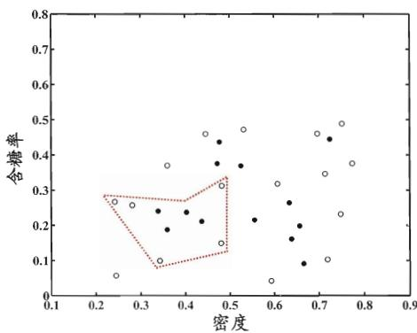  
(a) 生成聚类簇 $C_1$

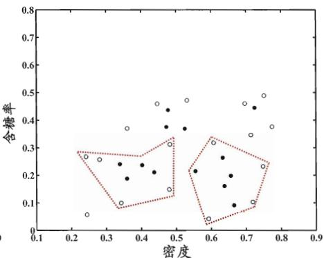  
(b) 生成聚类簇 $C_2$

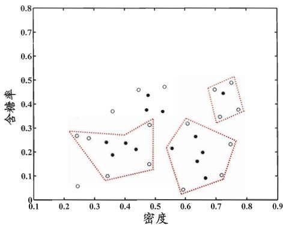  
(c) 生成聚类簇 $C_3$

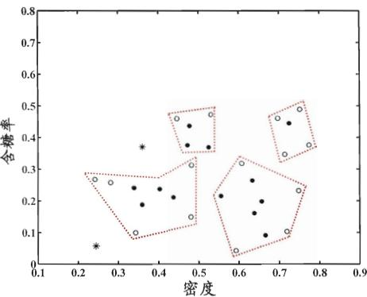  
(d) 生成聚类簇 $C_4$  
图 9.10 DBSCAN 算法( $\epsilon=0.11,\ MinPts=5$ )生成聚类簇的先后情况. 核心对象、非核心对象、噪声样本分别用“•”“○”“\*”表示, 红色虚线显示出簇划分.

$$
\begin{array}{l} C _ {2} = \{\boldsymbol {x} _ {3}, \boldsymbol {x} _ {4}, \boldsymbol {x} _ {5}, \boldsymbol {x} _ {9}, \boldsymbol {x} _ {1 3}, \boldsymbol {x} _ {1 4}, \boldsymbol {x} _ {1 6}, \boldsymbol {x} _ {1 7}, \boldsymbol {x} _ {2 1} \}; \\ C _ {3} = \{\boldsymbol {x} _ {1}, \boldsymbol {x} _ {2}, \boldsymbol {x} _ {2 2}, \boldsymbol {x} _ {2 6}, \boldsymbol {x} _ {2 9} \}; \\ C _ {4} = \{\boldsymbol {x} _ {2 4}, \boldsymbol {x} _ {2 5}, \boldsymbol {x} _ {2 7}, \boldsymbol {x} _ {2 8}, \boldsymbol {x} _ {3 0} \}. \end{array}
$$

## 9.6 层次聚类

层次聚类(hierarchical clustering)试图在不同层次对数据集进行划分, 从而形成树形的聚类结构. 数据集的划分可采用 “自底向上” 的聚合策略, 也可采用 “自顶向下” 的分拆策略.

AGNES 是 AGglomera-tive NESting 的简写.

AGNES 是一种采用自底向上聚合策略的层次聚类算法. 它先将数据集中的每个样本看作一个初始聚类簇, 然后在算法运行的每一步中找出距离最近的

集合间的距离计算常采用豪斯多夫距离 (Hausdorff distance), 参见习题 9.2.

两个聚类簇进行合并, 该过程不断重复, 直至达到预设的聚类簇个数. 这里的关键是如何计算聚类簇之间的距离. 实际上, 每个簇是一个样本集合, 因此, 只需采用关于集合的某种距离即可. 例如, 给定聚类簇 $C_i$ 与 $C_j$ , 可通过下面的式子来计算距离:

$$
\text { 最小距离: } d _ {\min} (C _ {i}, C _ {j}) = \min _ {\pmb {x} \in C _ {i}, \pmb {z} \in C _ {j}} \mathrm{dist} (\pmb {x}, \pmb {z}),\tag{9.41}
$$

$$
\text {最大距离:} d _ {\max} (C _ {i}, C _ {j}) = \max _ {\pmb {x} \in C _ {i}, \pmb {z} \in C _ {j}} \mathrm{dist} (\pmb {x}, \pmb {z}),\tag{9.42}
$$

$$
\text { 平均距离: } d _ {\mathrm{avg}} (C _ {i}, C _ {j}) = \frac {1}{| C _ {i} | | C _ {j} |} \sum_ {\pmb {x} \in C _ {i}} \sum_ {\pmb {z} \in C _ {j}} \mathrm{dist} (\pmb {x}, \pmb {z}).\tag{9.43}
$$

显然, 最小距离由两个簇的最近样本决定, 最大距离由两个簇的最远样本决定, 而平均距离则由两个簇的所有样本共同决定. 当聚类簇距离由 $d_{min}$ 、 $d_{max}$ 或$d_{avg}$ 计算时, AGNES 算法被相应地称为 “单链接” (single-linkage)、“全链接” (complete-linkage) 或 “均链接” (average-linkage) 算法.

通常使用  $d_{min}, d_{max}$ 

或  $d_{avg}$ .

输入: 样本集  $D = \{x_1, x_2, \ldots, x_m\}$ ;

聚类簇距离度量函数 d;

聚类簇数 k.

过程:

1: for  $j = 1, 2, \ldots, m$  do

2:  $C_j = \{x_j\}$ 

3: end for

4: for  $i = 1, 2, \ldots, m$  do

5: for  $j = 1, 2, \ldots, m$  do

6:  $M(i, j) = d(C_i, C_j)$ ;

7:  $M(j, i) = M(i, j)$ 

8: end for

9: end for

10: 设置当前聚类簇个数: q = m

11: while q &gt; k do

12: 找出距离最近的两个聚类簇  $C_i*$  和  $C_j*$ ;

13: 合并  $C_i*$  和  $C_j*: C_i* = C_i* \cup C_j*$ ;

14: for  $j = j^* + 1, j^* + 2, \ldots, q$  do

15: 将聚类簇  $C_j$  重编号为  $C_{j-1}$ 

16: end for

17: 删除距离矩阵 M 的第  $j^*$  行与第  $j^*$  列;

18: for  $j = 1, 2, \ldots, q - 1$  do

19:  $M(i^*, j) = d(C_i^*, C_j)$ ;

20:  $M(j, i^*) = M(i^*, j)$ 

21: end for

22: q = q - 1

23: end while

输出: 簇划分  $C = \{C_1, C_2, \ldots, C_k\}$

图9.11 AGNES算法

AGNES 算法描述如图 9.11 所示. 在第 1-9 行, 算法先对仅含一个样本的初始聚类簇和相应的距离矩阵进行初始化; 然后在第 11-23 行, AGNES 不断合并距离最近的聚类簇, 并对合并得到的聚类簇的距离矩阵进行更新; 上述过程不断重复, 直至达到预设的聚类簇数.

西瓜数据集4.0见p.202的表9.1.

以西瓜数据集 4.0 为例, 令 AGNES 算法一直执行到所有样本出现在同一个簇中, 即 k = 1, 则可得到图 9.12 所示的 “树状图” (dendrogram), 其中每层链接一组聚类簇.

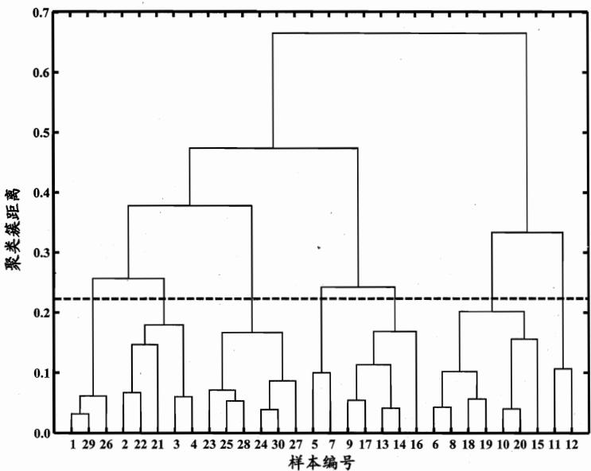  
图 9.12 西瓜数据集 4.0 上 AGNES 算法生成的树状图(采用 $d_{max}$ ). 横轴对应于样本编号, 纵轴对应于聚类簇距离.

在树状图的特定层次上进行分割, 则可得到相应的簇划分结果. 例如, 以图9.12中所示虚线分割树状图, 将得到包含7个聚类簇的结果:

$$
\begin{array}{l} {C _ {1} = \{\pmb {x} _ {1}, \pmb {x} _ {2 6}, \pmb {x} _ {2 9} \}; C _ {2} = \{\pmb {x} _ {2}, \pmb {x} _ {3}, \pmb {x} _ {4}, \pmb {x} _ {2 1}, \pmb {x} _ {2 2} \};} \\ {C _ {3} = \{\pmb {x} _ {2 3}, \pmb {x} _ {2 4}, \pmb {x} _ {2 5}, \pmb {x} _ {2 7}, \pmb {x} _ {2 8}, \pmb {x} _ {3 0} \}; C _ {4} = \{\pmb {x} _ {5}, \pmb {x} _ {7} \};} \\ {C _ {5} = \{\pmb {x} _ {9}, \pmb {x} _ {1 3}, \pmb {x} _ {1 4}, \pmb {x} _ {1 6}, \pmb {x} _ {1 7} \}; C _ {6} = \{\pmb {x} _ {6}, \pmb {x} _ {8}, \pmb {x} _ {1 0}, \pmb {x} _ {1 5}, \pmb {x} _ {1 8}, \pmb {x} _ {1 9}, \pmb {x} _ {2 0} \};} \\ {C _ {7} = \{\pmb {x} _ {1 1}, \pmb {x} _ {1 2} \}.} \end{array}
$$

将分割层逐步提升, 则可得到聚类簇逐渐减少的聚类结果. 例如图 9.13 显示出了从图 9.12 中产生 7 至 4 个聚类簇的划分结果.

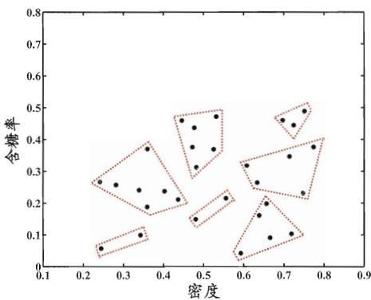  
(a) 聚类簇数 $k = 7$

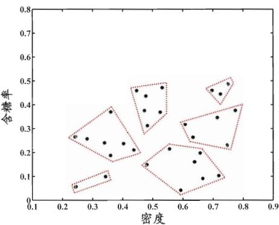  
(b) 聚类簇数 $k = 6$

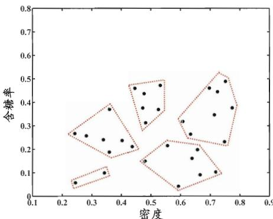  
(c) 聚类簇数 $k = 5$

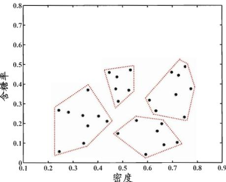  
(d) 聚类簇数 $k = 4$  
图 9.13 西瓜数据集 4.0 上 AGNES 算法(采用 $d_{max}$ ) 在不同聚类簇数 $(k = 7, 6, 5, 4)$ 时的簇划分结果. 样本点用 “●” 表示, 红色虚线显示出簇划分.

## 9.7 阅读材料

例如同一堆水果, 既能按大小, 也能按颜色, 甚至能按产地聚类.

聚类也许是机器学习中“新算法”出现最多、最快的领域。一个重要原因是聚类不存在客观标准；给定数据集，总能从某个角度找到以往算法未覆盖的某种标准从而设计出新算法[Estivill-Castro, 2002]。相对于机器学习其他分支来说，聚类的知识还不够系统化，因此著名教科书[Mitchell, 1997]中甚至没有关于聚类的章节。但聚类技术本身在现实任务中非常重要，因此本章勉强采用了“列举式”的叙述方式，相较于其他各章给出了更多的算法描述。关于聚类更多的内容, 可参阅这方面的专门书籍和综述文章如 [Jain and Dubes, 1988; Jain et al., 1999; Xu and Wunsch II, 2005; Jain, 2009] 等.

聚类性能度量除 9.2 节的内容外, 常见的还有 F 值、互信息 (mutual information)、平均廓宽 (average silhouette width) [Rousseeuw, 1987] 等, 可参阅 [Jain and Dubes, 1988; Halkidi et al., 2001; Maulik and Bandyopadhyay, 2002].

距离计算是很多学习任务的核心技术. 闵可夫斯基距离提供了距离计算的一般形式. 除闵可夫斯基距离之外, 内积距离、余弦距离等也很常用, 可参阅 [Deza and Deza, 2009]. MinkovDM 在 [Zhou and Yu, 2005] 中正式给出. 模式识别、图像检索等涉及复杂语义的应用中常会涉及非度量距离 [Jacobs et al., 2000; Tan et al., 2009]. 距离度量学习可直接嵌入到聚类学习过程中 [Xing et al., 2003].

k 均值算法可看作高斯混合聚类在混合成分方差相等、且每个样本仅指派给一个混合成分时的特例。该算法在历史上曾被不同领域的学者多次重新发明，如 Steinhaus 在 1956 年、Lloyd 在 1957 年、McQueen 在 1967 年等 [Jain and Dubes, 1988; Jain, 2009]。k 均值算法有大量变体，如 k-medoids 算法 [Kaufman and Rousseeuw, 1987] 强制原型向量必为训练样本，k-modes 算法 [Huang, 1998] 可处理离散属性，Fuzzy C-means (简称 FCM) [Bezdek, 1981] 则是“软聚类”(soft clustering) 算法，允许每个样本以不同程度同时属于多个原型。需注意的是，k 均值类算法仅在凸形簇结构上效果较好。最近研究表明，若采用某种 Bregman 距离，则可显著增强此类算法对更多类型簇结构的适用性 [Banerjee et al., 2005]。引入核技巧则可得到核 k 均值 (kernel k-means) 算法 [Schölkopf et al., 1998]，这与谱聚类 (spectral clustering) [von Luxburg, 2007] 有密切联系 [Dhillon et al., 2004]，后者可看作在拉普拉斯特征映射 (Laplacian Eigenmap) 降维后执行 k 均值聚类。聚类簇数 k 通常需由用户提供，有一些启发式用于自动确定 k [Pelleg and Moore, 2000; Tibshirani et al., 2001]，但常用的仍是基于不同 k 值多次运行后选取最佳结果。

LVQ算法在每轮迭代中仅更新与当前样本距离最近的原型向量。同时更新多个原型向量能显著提高收敛速度，相应的改进算法有LVQ2、LVQ3等[Kohonen, 2001]. [McLachlan and Peel, 2000]详细介绍了高斯混合聚类，算法中EM迭代优化的推导过程可参阅[Bilmes, 1998; Jain and Dubes, 1988].

采用不同方式表征样本分布的紧密程度, 可设计出不同的密度聚类算法, 除 DBSCAN [Ester et al., 1996] 外, 较常用的还有 OPTICS [Ankerst et al.,

1999]、DENCLUE [Hinneburg and Keim, 1998] 等. AGNES [Kaufman and Rousseeuw, 1990] 采用了自底向上的聚合策略来产生层次聚类结构, 与之相反, DIANA [Kaufman and Rousseeuw, 1990] 则是采用自顶向下的分拆策略. AGNES 和 DIANA 都不能对已合并或已分拆的聚类簇进行回溯调整, 常用的层次聚类算法如 BIRCH [Zhang et al., 1996]、ROCK [Guha et al., 1999] 等对此进行了改进.

聚类集成 (clustering ensemble) 通过对多个聚类学习器进行集成, 能有效降低聚类假设与真实聚类结构不符、聚类过程中的随机性等因素带来的不利影响, 可参阅 [Zhou, 2012] 第 7 章.

异常检测 (anomaly detection) [Hodge and Austin, 2004; Chandola et al., 2009] 常借助聚类或距离计算进行, 如将远离所有簇中心的样本作为异常点, 或将密度极低处的样本作为异常点. 最近有研究提出基于 “隔离性” (isolation) 可快速检测出异常点 [Liu et al., 2012].

## 习题

9.1 试证明: $p \geqslant 1$ 时, 闵可夫斯基距离满足距离度量的四条基本性质; $0 \leqslant p < 1$ 时, 闵可夫斯基距离不满足直递性, 但满足非负性、同一性、对称性; $p$ 趋向无穷大时, 闵可夫斯基距离等于对应分量的最大绝对距离, 即

$$
\lim _ {p \to + \infty} \left(\sum_ {u = 1} ^ {n} | x _ {i u} - x _ {j u} | ^ {p}\right) ^ {\frac {1}{p}} = \max _ {u} | x _ {i u} - x _ {j u} |.
$$

9.2 同一样本空间中的集合 $X$ 与 $Z$ 之间的距离可通过“豪斯多夫距离”(Hausdorff distance)计算:

$$
\mathrm{dist} _ {\mathrm{H}} (X, Z) = \max \left(\mathrm{dist} _ {\mathrm{h}} (X, Z), \mathrm{dist} _ {\mathrm{h}} (Z, X)\right),\tag{9.44}
$$

其中

$$
\operatorname{dist} _ {\mathrm{h}} (X, Z) = \max _ {\boldsymbol {x} \in X} \min _ {\boldsymbol {z} \in Z} | | \boldsymbol {x} - \boldsymbol {z} | | _ {2}.\tag{9.45}
$$

试证明：豪斯多夫距离满足距离度量的四条基本性质.

9.3 试析 $k$ 均值算法能否找到最小化式(9.24)的最优解.

9.4 试编程实现 $k$ 均值算法, 设置三组不同的 $k$ 值、三组不同初始中心点, 在西瓜数据集4.0上进行实验比较, 并讨论什么样的初始中心有利于取得好结果.

9.5 基于 DBSCAN 的概念定义, 若 $x$ 为核心对象, 由 $x$ 密度可达的所有样本构成的集合为 $X$ . 试证明: $X$ 满足连接性(9.39)与最大性(9.40).

9.6 试析 AGNES 算法使用最小距离和最大距离的区别.

9.7 聚类结果中若每个簇都有一个凸包(包含簇样本的凸多面体), 且这些凸包不相交, 则称为凸聚类. 试析本章介绍的哪些聚类算法只能产生凸聚类, 哪些能产生非凸聚类.

9.8 试设计一个聚类性能度量指标, 并与 9.2 节中的指标比较.

9.9\* 试设计一个能用于混合属性的非度量距离.

9.10\* 试设计一个能自动确定聚类数的改进 $k$ 均值算法, 编程实现并在西瓜数据集4.0上运行.

## 参考文献

Aloise, D., A. Deshpande, P. Hansen, and P. Popat. (2009). “NP-hardness of Euclidean sum-of-squares clustering.” Machine Learning, 75(2):245–248.

Ankerst, M., M. Breunig, H.-P. Kriegel, and J. Sander. (1999). "OPTICS: Ordering points to identify the clustering structure." In Proceedings of the ACM SIGMOD International Conference on Management of Data (SIGMOD), 49–60, Philadelphia, PA.

Banerjee, A., S. Merugu, I. Dhillon, and J. Ghosh. (2005). “Clustering with Bregman divergences.” Journal of Machine Learning Research, 6:1705–1749.

Bezdek, J. C. (1981). Pattern Recognition with Fuzzy Objective Function Algorithms. Plenum Press, New York, NY.

Bilmes, J. A. (1998). “A gentle tutorial of the EM algorithm and its applications to parameter estimation for Gaussian mixture and hidden Markov models.” Technical Report TR-97-021, Department of Electrical Engineering and Computer Science, University of California at Berkeley, Berkeley, CA.

Chandola, V., A. Banerjee, and V. Kumar. (2009). “Anomaly detection: A survey.” ACM Computing Surveys, 41(3):Article 15.

Deza, M. and E. Deza. (2009). Encyclopedia of Distances. Springer, Berlin.

Dhillon, I. S., Y. Guan, and B. Kulis. (2004). "Kernel $k$ -means: Spectral clustering and normalized cuts." In Proceedings of the 10th ACM SIGKDD International Conference on Knowledge Discovery and Data Mining (KDD), 551-556, Seattle, WA.

Ester, M., H. P. Kriegel, J. Sander, and X. Xu. (1996). "A density-based algorithm for discovering clusters in large spatial databases." In Proceedings of the 2nd International Conference on Knowledge Discovery and Data Mining (KDD), 226–231, Portland, OR.

Estivill-Castro, V. (2002). “Why so many clustering algorithms - a position paper.” SIGKDD Explorations, 1(4):65–75.

Guha, S., R. Rastogi, and K. Shim. (1999). “ROCK: A robust clustering algorithm for categorical attributes.” In Proceedings of the 15th International Conference on Data Engineering (ICDE), 512–521, Sydney, Australia.

Halkidi, M., Y. Batistakis, and M. Vazirgiannis. (2001). "On clustering valida-

tion techniques." Journal of Intelligent Information Systems, 27(2-3):107-145.

Hinneburg, A. and D. A. Keim. (1998). “An efficient approach to clustering in large multimedia databases with noise.” In Proceedings of the 4th International Conference on Knowledge Discovery and Data Mining (KDD), 58–65, New York, NY.

Hodge, V. J. and J. Austin. (2004). “A survey of outlier detection methodologies.” Artificial Intelligence Review, 22(2):85–126.

Huang, Z. (1998). “Extensions to the k-means algorithm for clustering large data sets with categorical values.” Data Mining and Knowledge Discovery, 2(3):283–304.

Jacobs, D. W., D. Weinshall, and Y. Gdalyahu. (2000). “Classification with non-metric distances: Image retrieval and class representation.” IEEE Transactions on Pattern Analysis and Machine Intelligence, 6(22):583–600.

Jain, A. K. (2009). “Data clustering: 50 years beyond k-means.” Pattern Recognition Letters, 31(8):651–666.

Jain, A. K. and R. C. Dubes. (1988). Algorithms for Clustering Data. Prentice Hall, Upper Saddle River, NJ.

Jain, A. K., M. N. Murty, and P. J. Flynn. (1999). "Data clustering: A review." ACM Computing Surveys, 3(31):264–323.

Kaufman, L. and P. J. Rousseeuw. (1987). “Clustering by means of medoids.” In Statistical Data Analysis Based on the $L_{1}$ -Norm and Related Methods (Y. Dodge, ed.), 405–416, Elsevier, Amsterdam, The Netherlands.

Kaufman, L. and P. J. Rousseeuw. (1990). Finding Groups in Data: An Introduction to Cluster Analysis. John Wiley & Sons, New York, NY.

Kohonen, T. (2001). Self-Organizing Maps, 3rd edition. Springer, Berlin.

Liu, F. T., K. M. Ting, and Z.-H. Zhou. (2012). “Isolation-based anomaly detection.” ACM Transactions on Knowledge Discovery from Data, 6(1):Article 3.

Maulik, U. and S. Bandyopadhyay. (2002). "Performance evaluation of some clustering algorithms and validity indices." IEEE Transactions on Pattern Analysis and Machine Intelligence, 24(12):1650–1654.

McLachlan, G. and D. Peel. (2000). Finite Mixture Models. John Wiley & Sons, New York, NY.

Mitchell, T. (1997). Machine Learning. McGraw Hill, New York, NY.

Pelleg, D. and A. Moore. (2000). "X-means: Extending $k$ -means with efficient estimation of the number of clusters." In Proceedings of the 17th International Conference on Machine Learning (ICML), 727-734, Stanford, CA.

Rousseeuw, P. J. (1987). “Silhouettes: A graphical aid to the interpretation and validation of cluster analysis.” Journal of Computational and Applied Mathematics, 20:53–65.

Schölkopf, B., A. Smola, and K.-R. Müller. (1998). “Nonlinear component analysis as a kernel eigenvalue problem.” Neural Computation, 10(5):1299–1319.

Stanfill, C. and D. Waltz. (1986). “Toward memory-based reasoning.” Communications of the ACM, 29(12):1213–1228.

Tan, X., S. Chen, Z.-H. Zhou, and J. Liu. (2009). "Face recognition under occlusions and variant expressions with partial similarity." IEEE Transactions on Information Forensics and Security, 2(4):217–230.

Tibshirani, R., G. Walther, and T. Hastie. (2001). “Estimating the number of clusters in a data set via the gap statistic.” Journal of the Royal Statistical Society - Series B, 63(2):411–423.

von Luxburg, U. (2007). "A tutorial on spectral clustering." Statistics and Computing, 17(4):395–416.

Xing, E. P., A. Y. Ng, M. I. Jordan, and S. Russell. (2003). “Distance metric learning, with application to clustering with side-information.” In Advances in Neural Information Processing Systems 15 (NIPS) (S. Becker, S. Thrun, and K. Obermayer, eds.), 505–512, MIT Press, Cambridge, MA.

Xu, R. and D. Wunsch II. (2005). "Survey of clustering algorithms." IEEE Transactions on Neural Networks, 3(16):645–678.

Zhang, T., R. Ramakrishnan, and M. Livny. (1996). "BIRCH: An efficient data clustering method for very large databases." In Proceedings of the ACM SIGMOD International Conference on Management of Data (SIGMOD), 103–114, Montreal, Canada.

Zhou, Z.-H. (2012). Ensemble Methods: Foundations and Algorithms. Chap-

man & Hall/CRC, Boca Raton, FL.

Zhou, Z.-H. and Y. Yu. (2005). “Ensembling local learners through multimodal perturbation.” IEEE Transactions on Systems, Man, and Cybernetics - Part B: Cybernetics, 35(4):725–735.

## 休息一会儿

## 小故事：曼哈顿距离与赫尔曼·闵可夫斯基

曼哈顿距离(Manhattan distance)亦称“出租车几何”(Taxicab geometry)，是德国大数学家赫尔曼·闵可夫斯基(Hermann Minkowski, 1864—1909)所创的词汇，其得名是由于该距离标明了几何度量空间中两点在标准坐标系上的绝对轴距总和，这恰是规划为方形区块的城市里两点

之间的最短行程, 例如从曼哈顿的第五大道与 33 街交点前往第三大道与 23 街交点, 需走过 $(5 - 3) + (33 - 23) = 12$ 个街区.

哥尼斯堡是著名的“七桥问题”发源地，今俄罗斯加里宁格勒.

闵可夫斯基出生于俄国亚力克索塔斯(Alexotas)的一个犹太人家庭，由于当时俄国政府迫害犹太人，他八岁时随全家移居普鲁士哥尼斯堡，与后来成为大数学家的希尔伯特一河之隔。闵可夫斯基从小就是著名神童，他熟读莎士比亚、席勒和歌德的作品，几乎能全文背诵《浮士德》；八岁进入预科学校，仅用五年半就完成了八年的学业；十七岁时建立了 $n$ 元二次型的完整理论体系，解决了法国科学院公开悬赏的数学难题。1908年9月他在科隆的一次学术会议上做了《空间与时间》的著名演讲，提出了四维时空理论，为广义相对论的建立开辟了道路。不幸的是，三个月后他死于急性阑尾炎。

四维时空亦称“闵可夫斯基时空”或“闵可夫斯基空间”.

1896 年闵可夫斯基在苏黎世大学任教期间, 是爱因斯坦的数学老师. 诺贝尔物理学奖得主玻恩曾说, 在闵可夫斯基的数学工作中找到了 “相对论的整个武器库”. 闵可夫斯基去世后, 其生前好友希尔伯特整理了他的遗作, 于 1911 年出版了《闵可夫斯基全集》. 闵可夫斯基的哥哥奥斯卡是 “胰岛素之父”, 侄子鲁道夫是美国著名天文学家.
