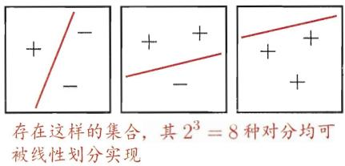

## 第 12 章 计算学习理论

## 12.1 基础知识

顾名思义, 计算学习理论(computational learning theory)研究的是关于通过 “计算” 来进行 “学习” 的理论, 即关于机器学习的理论基础, 其目的是分析学习任务的困难本质, 为学习算法提供理论保证, 并根据分析结果指导算法设计.

给定样例集 $D = \{(\pmb{x}_1, y_1), (\pmb{x}_2, y_2), \ldots, (\pmb{x}_m, y_m)\}$ , $\pmb{x}_i \in \mathcal{X}$ , 本章主要讨论二分类问题, 若无特别说明, $y_i \in \mathcal{Y} = \{-1, +1\}$ . 假设 $\mathcal{X}$ 中的所有样本服从一个隐含未知的分布 $\mathcal{D}$ , $D$ 中所有样本都是独立地从这个分布上采样而得, 即独立同分布 (independent and identically distributed, 简称 i.i.d.) 样本.

令 $h$ 为从 $\mathcal{X}$ 到 $\mathcal{Y}$ 的一个映射, 其泛化误差为

$$
E (h; \mathcal {D}) = P _ {\pmb {x} \sim \mathcal {D}} \big (h (\pmb {x}) \neq y \big),\tag{12.1}
$$

$h$ 在 $D$ 上的经验误差为

$$
\widehat {E} (h; D) = \frac {1}{m} \sum_ {i = 1} ^ {m} \mathbb {I} \bigl (h (\pmb {x} _ {i}) \neq y _ {i} \bigr).\tag{12.2}
$$

由于 $D$ 是 $\mathcal{D}$ 的独立同分布采样, 因此 $h$ 的经验误差的期望等于其泛化误差. 在上下文明确时, 我们将 $E(h; \mathcal{D})$ 和 $\widehat{E}(h; D)$ 分别简记为 $E(h)$ 和 $\widehat{E}(h)$ . 令 $\epsilon$ 为 $E(h)$ 的上限, 即 $E(h) \leqslant \epsilon$ ; 我们通常用 $\epsilon$ 表示预先设定的学得模型所应满足的误差要求, 亦称“误差参数”.

本章后面部分将研究经验误差与泛化误差之间的逼近程度. 若 $h$ 在数据集 $D$ 上的经验误差为 0, 则称 $h$ 与 $D$ 一致, 否则称其与 $D$ 不一致. 对任意两个映射 $h_1, h_2 \in \mathcal{X} \to \mathcal{Y}$ , 可通过其“不合” (disagreement) 来度量它们之间的差别:

$$
d (h _ {1}, h _ {2}) = P _ {\boldsymbol {x} \sim \mathcal {D}} (h _ {1} (\boldsymbol {x}) \neq h _ {2} (\boldsymbol {x})) .\tag{12.3}
$$

我们会用到几个常用不等式:

\- Jensen 不等式: 对任意凸函数 $f(x)$ , 有

$$
f \big (\mathbb {E} (x) \big) \leqslant \mathbb {E} \big (f (x) \big).\tag{12.4}
$$

\- Hoeffding 不等式 [Hoeffding, 1963]: 若 $x_{1}, x_{2}, \ldots, x_{m}$ 为 $m$ 个独立随机变量, 且满足 $0 \leqslant x_{i} \leqslant 1$ , 则对任意 $\epsilon > 0$ , 有

$$
P \left(\frac {1}{m} \sum_ {i = 1} ^ {m} x _ {i} - \frac {1}{m} \sum_ {i = 1} ^ {m} \mathbb {E} (x _ {i}) \geqslant \epsilon\right) \leqslant \exp (- 2 m \epsilon^ {2}),\tag{12.5}
$$

$$
P \left(\left| \frac {1}{m} \sum_ {i = 1} ^ {m} x _ {i} - \frac {1}{m} \sum_ {i = 1} ^ {m} \mathbb {E} (x _ {i}) \right| \geqslant \epsilon\right) \leqslant 2 \exp (- 2 m \epsilon^ {2}).\tag{12.6}
$$

\- McDiarmid 不等式 [McDiarmid, 1989]: 若 $x_{1}, x_{2}, \ldots, x_{m}$ 为 $m$ 个独立随机变量, 且对任意 $1 \leqslant i \leqslant m$ , 函数 $f$ 满足

$$
\sup _ {x _ {1}, \dots , x _ {m}, x _ {i} ^ {\prime}} | f (x _ {1}, \dots , x _ {m}) - f (x _ {1}, \dots , x _ {i - 1}, x _ {i} ^ {\prime}, x _ {i + 1}, \dots , x _ {m}) | \leqslant c _ {i},
$$

则对任意 $\epsilon > 0$ ，有

$$
P \left(f \left(x _ {1}, \dots , x _ {m}\right) - \mathbb {E} \left(f \left(x _ {1}, \dots , x _ {m}\right)\right) \geqslant \epsilon\right) \leqslant \exp \left(\frac {- 2 \epsilon^ {2}}{\sum_ {i} c _ {i} ^ {2}}\right),\tag{12.7}
$$

$$
P \left(\left| f \left(x _ {1}, \dots , x _ {m}\right) - \mathbb {E} \left(f \left(x _ {1}, \dots , x _ {m}\right)\right) \right| \geqslant \epsilon\right) \leqslant 2 \exp \left(\frac {- 2 \epsilon^ {2}}{\sum_ {i} c _ {i} ^ {2}}\right)\tag{12.8}
$$

## 12.2 PAC学习

计算学习理论中最基本的是概率近似正确 (Probably Approximately Correct, 简称 PAC) 学习理论 [Valiant, 1984]. “概率近似正确” 这个名字看起来有点古怪, 我们稍后再解释.

令 $c$ 表示“概念”(concept), 这是从样本空间 $\mathcal{X}$ 到标记空间 $\mathcal{Y}$ 的映射, 它决定示例 $\pmb{x}$ 的真实标记 $y$ , 若对任何样例 $(\pmb{x}, y)$ 有 $c(\pmb{x}) = y$ 成立, 则称 $c$ 为目标概念; 所有我们希望学得的目标概念所构成的集合称为“概念类”(concept class), 用符号 $\mathcal{C}$ 表示.

学习算法 $\mathfrak{L}$ 的假设空间不是1.3节所讨论的学习任务本身对应的假设空间.

给定学习算法 $\mathfrak{L}$ , 它所考虑的所有可能概念的集合称为“假设空间”(hypothesis space), 用符号 $\mathcal{H}$ 表示. 由于学习算法事先并不知道概念类的真实存在, 因此 $\mathcal{H}$ 和 $\mathcal{C}$ 通常是不同的, 学习算法会把自认为可能的目标概念集中起来构成 $\mathcal{H}$ , 对 $h \in \mathcal{H}$ , 由于并不能确定它是否真是目标概念, 因此称为“假设” (hypothesis). 显然, 假设 $h$ 也是从样本空间 $\mathcal{X}$ 到标记空间 $\mathcal{Y}$ 的映射.

若目标概念 $c \in \mathcal{H}$ , 则 $\mathcal{H}$ 中存在假设能将所有示例按与真实标记一致的方式完全分开, 我们称该问题对学习算法 $\mathfrak{L}$ 是“可分的” (separable), 亦称“一致的” (consistent); 若 $c \notin \mathcal{H}$ , 则 $\mathcal{H}$ 中不存在任何假设能将所有示例完全正确分开, 称该问题对学习算法 $\mathfrak{L}$ 是“不可分的” (non-separable), 亦称“不一致的” (non-consistent).

给定训练集 $D$ , 我们希望基于学习算法 $\mathfrak{L}$ 学得的模型所对应的假设 $h$ 尽可能接近目标概念 $c$ . 读者可能会问: 为什么不是希望精确地学到目标概念 $c$ 呢? 这是由于机器学习过程受到很多因素的制约, 例如我们获得的训练集 $D$ 往往仅包含有限数量的样例, 因此, 通常会存在一些在 $D$ 上 “等效” 的假设, 学习算法对它们无法区别; 再如, 从分布 $\mathcal{D}$ 采样得到 $D$ 的过程有一定偶然性, 可以想象, 即便对同样大小的不同训练集, 学得结果也可能有所不同. 因此, 我们是希望以比较大的把握学得比较好的模型, 也就是说, 以较大的概率学得误差满足预设上限的模型; 这就是 “概率” “近似正确” 的含义. 形式化地说, 令 $\delta$ 表示置信度, 可定义:

一般来说, 训练样例越少, 采样偶然性越大.

定义 12.1 PAC 辨识 (PAC Identify): 对 $0 < \epsilon, \delta < 1$ , 所有 $c \in C$ 和分布 D, 若存在学习算法 L, 其输出假设 $h \in H$ 满足

$$
P (E (h) \leqslant \epsilon) \geqslant 1 - \delta ,\tag{12.9}
$$

则称学习算法 $\mathfrak{L}$ 能从假设空间 $\mathcal{H}$ 中PAC辨识概念类 $\mathcal{C}$ .

这样的学习算法 $\mathfrak{L}$ 能以较大的概率 (至少 $1 - \delta$ ) 学得目标概念 $c$ 的近似 (误差最多为 $\epsilon$ ). 在此基础上可定义:

样例数目 m 与误差 $\epsilon$ 、置信度 $\delta$ 、数据本身的复杂度 size(x)、目标概念的复杂度 size(c) 都有关.

定义 12.2 PAC 可学习 (PAC Learnable): 令 m 表示从分布 D 中独立同分布采样得到的样例数目, $0 < \epsilon, \delta < 1$ , 对所有分布 D, 若存在学习算法 L 和多项式函数 $\text{poly}(\cdot, \cdot, \cdot, \cdot)$ , 使得对于任何 $m \geqslant \text{poly}(1/\epsilon, 1/\delta, \text{size}(\boldsymbol{x}), \text{size}(c))$ , L 能从假设空间 H 中 PAC 辨识概念类 C, 则称概念类 C 对假设空间 H 而言是 PAC 可学习的, 有时也简称概念类 C 是 PAC 可学习的.

对计算机算法来说, 必然要考虑时间复杂度, 于是:

定义 12.3 PAC 学习算法 (PAC Learning Algorithm): 若学习算法 L 使概念类 C 为 PAC 可学习的, 且 L 的运行时间也是多项式函数 poly(1/ $\epsilon$ , 1/ $\delta$ , size(x), size(c)), 则称概念类 C 是高效 PAC 可学习 (efficiently PAC learnable) 的, 称 L 为概念类 C 的 PAC 学习算法.

假定学习算法 $\mathfrak{L}$ 处理每个样本的时间为常数, 则 $\mathfrak{L}$ 的时间复杂度等价于样本复杂度. 于是, 我们对算法时间复杂度的关心就转化为对样本复杂度的关心:

定义 12.4 样本复杂度 (Sample Complexity): 满足 PAC 学习算法 L 所需的 $m \geqslant \text{poly}(1/\epsilon, 1/\delta, \text{size}(\boldsymbol{x}), \text{size}(c))$ 中最小的 m, 称为学习算法 L 的样本复杂度.

显然, PAC 学习给出了一个抽象地刻画机器学习能力的框架, 基于这个框架能对很多重要问题进行理论探讨, 例如研究某任务在什么样的条件下可学得较好的模型? 某算法在什么样的条件下可进行有效的学习? 需多少训练样例才能获得较好的模型?

PAC 学习中一个关键因素是假设空间 H 的复杂度. H 包含了学习算法 L 所有可能输出的假设, 若在 PAC 学习中假设空间与概念类完全相同, 即 H = C, 这称为 “恰 PAC 可学习” (properly PAC learnable); 直观地看, 这意味着学习算法的能力与学习任务 “恰好匹配”. 然而, 这种让所有候选假设都来自概念类的要求看似合理, 但却并不实际, 因为在现实应用中我们对概念类 C 通常一无所知, 更别说获得一个假设空间与概念类恰好相同的学习算法. 显然, 更重要的是研究假设空间与概念类不同的情形, 即 $H \neq C$ . 一般而言, H 越大, 其包含任意目标概念的可能性越大, 但从中找到某个具体目标概念的难度也越大. $|H|$ 有限时, 我们称 H 为 “有限假设空间”, 否则称为 “无限假设空间”.

## 12.3 有限假设空间

## 12.3.1 可分情形

可分情形意味着目标概念 $c$ 属于假设空间 $\mathcal{H}$ , 即 $c \in \mathcal{H}$ . 给定包含 $m$ 个样例的训练集 $D$ , 如何找出满足误差参数的假设呢?

容易想到一种简单的学习策略: 既然 $D$ 中样例标记都是由目标概念 $c$ 赋予的, 并且 $c$ 存在于假设空间 $\mathcal{H}$ 中, 那么, 任何在训练集 $D$ 上出现标记错误的假设肯定不是目标概念 $c$ . 于是, 我们只需保留与 $D$ 一致的假设, 剔除与 $D$ 不一致的假设即可. 若训练集 $D$ 足够大, 则可不断借助 $D$ 中的样例剔除不一致的假设, 直到 $\mathcal{H}$ 中仅剩下一个假设为止, 这个假设就是目标概念 $c$ . 通常情形下, 由于训练集规模有限, 假设空间 $\mathcal{H}$ 中可能存在不止一个与 $D$ 一致的“等效”假设, 对这些等效假设, 无法根据 $D$ 来对它们的优劣做进一步区分.

到底需多少样例才能学得目标概念 $c$ 的有效近似呢？对PAC学习来说，只要训练集 $D$ 的规模能使学习算法 $\mathfrak{L}$ 以概率 $1 - \delta$ 找到目标假设的 $\epsilon$ 近似即可.

我们先估计泛化误差大于 $\epsilon$ 但在训练集上仍表现完美的假设出现的概率. 假定 $h$ 的泛化误差大于 $\epsilon$ , 对分布 $\mathcal{D}$ 上随机采样而得的任何样例 $(x, y)$ , 有

$$
\begin{array}{r l} P \big (h (\boldsymbol {x}) = y \big) & = 1 - P \big (h (\boldsymbol {x}) \neq y \big) \\ & = 1 - E (h) \\ & <   1 - \epsilon . \end{array}\tag{12.10}
$$

由于 $D$ 包含 $m$ 个从 $\mathcal{D}$ 独立同分布采样而得的样例, 因此, $h$ 与 $D$ 表现一致的概率为

$$
\begin{array}{r l} P \big ((h (\boldsymbol {x} _ {1}) = y _ {1}) \wedge \dots \wedge (h (\boldsymbol {x} _ {m}) = y _ {m}) \big) & = \big (1 - P (h (\boldsymbol {x}) \neq y) \big) ^ {m} \\ & <   (1 - \epsilon) ^ {m}. \end{array}\tag{12.11}
$$

我们事先并不知道学习算法 $\mathfrak{L}$ 会输出 $\mathcal{H}$ 中的哪个假设, 但仅需保证泛化误差大于 $\epsilon$ , 且在训练集上表现完美的所有假设出现概率之和不大于 $\delta$ 即可:

$$
\begin{array}{r l} P \big (h \in \mathcal {H}: E (h) > \epsilon \wedge \widehat {E} (h) = 0 \big) & <   | \mathcal {H} | (1 - \epsilon) ^ {m} \\ & <   | \mathcal {H} | e ^ {- m \epsilon}, \end{array}\tag{12.12}
$$

令式(12.12)不大于 $\delta$ ，即

$$
| \mathcal {H} | e ^ {- m \epsilon} \leqslant \delta ,\tag{12.13}
$$

可得

$$
m \geqslant \frac {1}{\epsilon} \big (\ln | \mathcal {H} | + \ln \frac {1}{\delta} \big).\tag{12.14}
$$

由此可知, 有限假设空间 $\mathcal{H}$ 都是 PAC 可学习的, 所需的样例数目如式(12.14)所示, 输出假设 $h$ 的泛化误差随样例数目的增多而收敛到 0 , 收敛速率为 $O\left(\frac{1}{m}\right)$ .

## 12.3.2 不可分情形

对较为困难的学习问题, 目标概念 $c$ 往往不存在于假设空间 $\mathcal{H}$ 中. 假定对于任何 $h \in \mathcal{H}$ , $\widehat{E}(h) \neq 0$ , 也就是说, $\mathcal{H}$ 中的任意一个假设都会在训练集上出现或多或少的错误. 由 Hoeffding 不等式易知:

引理 12.1 若训练集 D 包含 m 个从分布 D 上独立同分布采样而得的样例, $0 < \epsilon < 1$ , 则对任意 $h \in H$ , 有

$$
P \big (\widehat {E} (h) - E (h) \geqslant \epsilon \big) \leqslant \exp (- 2 m \epsilon^ {2}),\tag{12.15}
$$

$$
P \big (E (h) - \widehat {E} (h) \geqslant \epsilon \big) \leqslant \exp (- 2 m \epsilon^ {2}),\tag{12.16}
$$

$$
P \Big (\big | E (h) - \widehat {E} (h) \big | \geqslant \epsilon \Big) \leqslant 2 \exp (- 2 m \epsilon^ {2}).\tag{12.17}
$$

推论 12.1 若训练集 D 包含 m 个从分布 D 上独立同分布采样而得的样例, $0 < \epsilon < 1$ , 则对任意 $h \in H$ , 式(12.18)以至少 $1 - \delta$ 的概率成立:

$$
\widehat {E} (h) - \sqrt {\frac {\ln {(2 / \delta)}}{2 m}} \leqslant E (h) \leqslant \widehat {E} (h) + \sqrt {\frac {\ln {(2 / \delta)}}{2 m}}.\tag{12.18}
$$

推论12.1表明, 样例数目 $m$ 较大时, $h$ 的经验误差是其泛化误差很好的近似. 对于有限假设空间 $\mathcal{H}$ , 我们有

定理 12.1 若 H 为有限假设空间, $0 < \delta < 1$ , 则对任意 $h \in H$ , 有

$$
P \Big (\big | E (h) - \widehat {E} (h) \big | \leqslant \sqrt {\frac {\ln | \mathcal {H} | + \ln (2 / \delta)}{2 m}} \Big) \geqslant 1 - \delta .\tag{12.19}
$$

证明 令 $h_1, h_2, \ldots, h_{|\mathcal{H}|}$ 表示假设空间 $\mathcal{H}$ 中的假设, 有

$$
\begin{array}{l} P \big (\exists h \in \mathcal {H}: \big | E (h) - \widehat {E} (h) \big | > \epsilon \big) \\ = P \Big (\big (\big | E _ {h _ {1}} - \widehat {E} _ {h _ {1}} \big | > \epsilon \big) \vee \ldots \vee \big (\big | E _ {h _ {| \mathcal {H} |}} - \widehat {E} _ {h _ {| \mathcal {H} |}} \big | > \epsilon \big) \Big) \\ \leqslant \sum_ {h \in \mathcal {H}} P \big (\big | E (h) - \widehat {E} (h) \big | > \epsilon \big), \end{array}
$$

由式(12.17)可得

$$
\sum_ {h \in \mathcal {H}} P \big (\big | E (h) - \widehat {E} (h) \big | > \epsilon \big) \leqslant 2 | \mathcal {H} | \exp (- 2 m \epsilon^ {2}),
$$

于是, 令 $\delta = 2|\mathcal{H}| \exp(-2m\epsilon^2)$ 即可得式(12.19).

即在 $\mathcal{H}$ 的所有假设中找出最好的一个.

显然, 当 $c \notin \mathcal{H}$ 时, 学习算法 $\mathfrak{L}$ 无法学得目标概念 $c$ 的 $\epsilon$ 近似. 但是, 当假设空间 $\mathcal{H}$ 给定时, 其中必存在一个泛化误差最小的假设, 找出此假设的 $\epsilon$ 近似也不失为一个较好的目标. $\mathcal{H}$ 中泛化误差最小的假设是 $\arg \min_{h \in \mathcal{H}} E(h)$ , 于是, 以此为目标可将 PAC 学习推广到 $c \notin \mathcal{H}$ 的情况, 这称为 “不可知学习” (agnostic learning). 相应的, 我们有

定义 12.5 不可知 PAC 可学习 (agnostic PAC learnable): 令 m 表示从分布 D 中独立同分布采样得到的样例数目, $0 < \epsilon$ , $\delta < 1$ , 对所有分布 D, 若存在学习算法 L 和多项式函数 poly( $\cdot$ , $\cdot$ , $\cdot$ , $\cdot$ ), 使得对于任何 $m \geqslant \text{poly}(1/\epsilon, 1/\delta, \text{size}(\boldsymbol{x}), \text{size}(c))$ , L 能从假设空间 H 中输出满足式(12.20)的假设 h:

$$
P \big (E (h) - \min _ {h ^ {\prime} \in \mathcal {H}} E (h ^ {\prime}) \leqslant \epsilon \big) \geqslant 1 - \delta ,\tag{12.20}
$$

则称假设空间 H 是不可知 PAC 可学习的.

与 PAC 可学习类似, 若学习算法 $\mathfrak{L}$ 的运行时间也是多项式函数 poly(1/ε, 1/δ, size(x), size(c)), 则称假设空间 $\mathcal{H}$ 是高效不可知 PAC 可学习的, 学习算法 $\mathfrak{L}$ 则称为假设空间 $\mathcal{H}$ 的不可知 PAC 学习算法, 满足上述要求的最小 $m$ 称为学习算法 $\mathfrak{L}$ 的样本复杂度.

## 12.4 VC维

现实学习任务所面临的通常是无限假设空间, 例如实数域中的所有区间、 $\mathbb{R}^d$ 空间中的所有线性超平面. 欲对此种情形的可学习性进行研究, 需度量假设空间的复杂度. 最常见的办法是考虑假设空间的“VC维” (Vapnik-Chervonenkis dimension) [Vapnik and Chervonenkis, 1971].

介绍 VC 维之前, 我们先引入几个概念: 增长函数 (growth function)、对分 (dichotomy) 和打散 (shattering).

给定假设空间 $\mathcal{H}$ 和示例集 $D = \{\pmb{x}_1, \pmb{x}_2, \dots, \pmb{x}_m\}$ , $\mathcal{H}$ 中每个假设 $h$ 都能对 $D$ 中示例赋予标记, 标记结果可表示为

$$
h | _ {D} = \left\{\left(h \left(\boldsymbol {x} _ {1}\right), h \left(\boldsymbol {x} _ {2}\right), \dots , h \left(\boldsymbol {x} _ {m}\right)\right) \right\}.
$$

例如, 对二分类问题, 若 $D$ 中只有 2 个示例, 则赋予标记的可能结果只有 4 种; 若有 3 个示例, 则可能结果有 8 种.

$\mathbb{N}$ 为自然数域.

随着 $m$ 的增大, $\mathcal{H}$ 中所有假设对 $D$ 中的示例所能赋予标记的可能结果数也会增大.

定义12.6 对所有 $m \in \mathbb{N}$ , 假设空间 $\mathcal{H}$ 的增长函数 $\Pi_{\mathcal{H}}(m)$ 为

$$
\Pi_ {\mathcal {H}} (m) = \max _ {\left\{\boldsymbol {x} _ {1}, \dots , \boldsymbol {x} _ {m} \right\} \subseteq \mathcal {X}} \left| \left\{\left(h \left(\boldsymbol {x} _ {1}\right), \dots , h \left(\boldsymbol {x} _ {m}\right)\right) \mid h \in \mathcal {H} \right\} \right|.\tag{12.21}
$$

增长函数 $\Pi_{\mathcal{H}}(m)$ 表示假设空间 $\mathcal{H}$ 对 $m$ 个示例所能赋予标记的最大可能结果数. 显然, $\mathcal{H}$ 对示例所能赋予标记的可能结果数越大, $\mathcal{H}$ 的表示能力越强, 对学习任务的适应能力也越强. 因此, 增长函数描述了假设空间 $\mathcal{H}$ 的表示能力, 由此反映出假设空间的复杂度. 我们可利用增长函数来估计经验误差与泛化误差之间的关系:

定理12.2 对假设空间 $\mathcal{H}, m \in \mathbb{N}, 0 < \epsilon < 1$ 和任意 $h \in \mathcal{H}$ 有

证明过程参阅[Vapnik and Chervonenkis, 1971].

$$
P \big (\big | E (h) - \widehat {E} (h) \big | > \epsilon \big) \leqslant 4 \Pi_ {\mathcal {H}} (2 m) \exp \big (- \frac {m \epsilon^ {2}}{8} \big).\tag{12.22}
$$

每个假设会把 $D$ 中示例分为两类，因此称为对分.

假设空间 $\mathcal{H}$ 中不同的假设对于 $D$ 中示例赋予标记的结果可能相同, 也可能不同; 尽管 $\mathcal{H}$ 可能包含无穷多个假设, 但其对 $D$ 中示例赋予标记的可能结果数是有限的: 对 $m$ 个示例, 最多有 $2^{m}$ 个可能结果. 对二分类问题来说, $\mathcal{H}$ 中的假设对 $D$ 中示例赋予标记的每种可能结果称为对 $D$ 的一种“对分”. 若假设空间 $\mathcal{H}$ 能实现示例集 $D$ 上的所有对分, 即 $\Pi_{\mathcal{H}}(m) = 2^{m}$ , 则称示例集 $D$ 能被假设空间 $\mathcal{H}$ “打散”.

现在我们可以正式定义 VC 维了:

定义 12.7 假设空间 H 的 VC 维是能被 H 打散的最大示例集的大小, 即

$$
\operatorname{VC} (\mathcal {H}) = \max \left\{m: \Pi_ {\mathcal {H}} (m) = 2 ^ {m} \right\}.\tag{12.23}
$$

$\mathrm{VC}(\mathcal{H}) = d$ 表明存在大小为 $d$ 的示例集能被假设空间 $\mathcal{H}$ 打散. 注意: 这并不意味着所有大小为 $d$ 的示例集都能被假设空间 $\mathcal{H}$ 打散. 细心的读者可能已发现, VC维的定义与数据分布 $\mathcal{D}$ 无关! 因此, 在数据分布未知时仍能计算出假设空间 $\mathcal{H}$ 的 VC 维.

通常这样来计算 $\mathcal{H}$ 的VC维: 若存在大小为 $d$ 的示例集能被 $\mathcal{H}$ 打散, 但不存在任何大小为 $d + 1$ 的示例集能被 $\mathcal{H}$ 打散, 则 $\mathcal{H}$ 的VC维是 $d$ . 下面给出两个计算VC维的例子:

例12.1 实数域中的区间 $[a, b]$ : 令 $\mathcal{H}$ 表示实数域中所有闭区间构成的集合 $\{h_{[a,b]} : a, b \in \mathbb{R}, a \leqslant b\}$ , $\mathcal{X} = \mathbb{R}$ . 对 $x \in \mathcal{X}$ , 若 $x \in [a, b]$ , 则 $h_{[a,b]}(x) = +1$ , 否则 $h_{[a,b]}(x) = -1$ . 令 $x_1 = 0.5$ , $x_2 = 1.5$ , 则假设空间 $\mathcal{H}$ 中存在假设 $\{h_{[0,1]}, h_{[0,2]}, h_{[1,2]}, h_{[2,3]}\}$ 将 $\{x_1, x_2\}$ 打散, 所以假设空间 $\mathcal{H}$ 的 VC 维至少为 2; 对任意大小为 3 的示例集 $\{x_3, x_4, x_5\}$ , 不妨设 $x_3 < x_4 < x_5$ , 则 $\mathcal{H}$ 中不存在任何假设 $h_{[a,b]}$ 能实现对分结果 $\{(x_3, +), (x_4, -), (x_5, +)\}$ . 于是, $\mathcal{H}$ 的 VC 维为 2.

例 12.2 二维实平面上的线性划分: 令 H 表示二维实平面上所有线性划分构成的集合, $X = R^{2}$ . 由图 12.1 可知, 存在大小为 3 的示例集可被 H 打散, 但不存在大小为 4 的示例集可被 H 打散. 于是, 二维实平面上所有线性划分构成的假设空间 H 的 VC 维为 3.

  
(a) 示例集大小为 3

  
(b) 示例集大小为 4  
图12.1 二维实平面上所有线性划分构成的假设空间的VC维为3

由定义 12.7 可知, VC 维与增长函数有密切联系, 引理 12.2 给出了二者之间的定量关系 [Sauer, 1972]:

亦称“Sauer引理”

引理 12.2 若假设空间 H 的 VC 维为 d, 则对任意 $m \in N$ 有

$$
\Pi_ {\mathcal {H}} (m) \leqslant \sum_ {i = 0} ^ {d} \binom{m}{i}.\tag{12.24}
$$

证明 由数学归纳法证明. 当 $m = 1, d = 0$ 或 $d = 1$ 时, 定理成立. 假设定理对 $(m - 1, d - 1)$ 和 $(m - 1, d)$ 成立. 令 $D = \{\pmb{x}_1, \pmb{x}_2, \dots, \pmb{x}_m\}$ , $D' = \{\pmb{x}_1, \pmb{x}_2, \dots, \pmb{x}_{m-1}\}$ ,

$$
\begin{array}{l} \mathcal {H} _ {| D} = \left\{\left(h \left(\boldsymbol {x} _ {1}\right), h \left(\boldsymbol {x} _ {2}\right), \ldots , h \left(\boldsymbol {x} _ {m}\right)\right) | h \in \mathcal {H} \right\}, \\ \mathcal {H} _ {| D ^ {\prime}} = \left\{\left(h \left(\boldsymbol {x} _ {1}\right), h \left(\boldsymbol {x} _ {2}\right), \ldots , h \left(\boldsymbol {x} _ {m - 1}\right)\right) | h \in \mathcal {H} \right\}. \end{array}
$$

任何假设 $h \in \mathcal{H}$ 对 $\pmb{x}_m$ 的分类结果或为 $+1$ , 或为 $-1$ , 因此任何出现在$\mathcal{H}_{|D'}$ 中的串都会在 $\mathcal{H}_{|D}$ 中出现一次或两次. 令 $\mathcal{H}_{D'|D}$ 表示在 $\mathcal{H}_{|D}$ 中出现两次的 $\mathcal{H}_{|D'}$ 中串组成的集合, 即

$$
\begin{array}{r l} & {\mathcal {H} _ {D ^ {\prime} | D} = \big \{(y _ {1}, y _ {2}, \dots , y _ {m - 1}) \in \mathcal {H} _ {| D ^ {\prime}} \mid \exists h, h ^ {\prime} \in \mathcal {H},} \\ & {\qquad \big (h (\pmb {x} _ {i}) = h ^ {\prime} (\pmb {x} _ {i}) = y _ {i} \big) \land \big (h (\pmb {x} _ {m}) \neq h ^ {\prime} (\pmb {x} _ {m}) \big), 1 \leqslant i \leqslant m - 1 \big \}.} \end{array}
$$

考虑到 $\mathcal{H}_{D'|D}$ 中的串在 $\mathcal{H}_{|D}$ 中出现了两次, 但在 $\mathcal{H}_{|D'}$ 中仅出现了一次, 有

$$
| \mathcal {H} _ {| D} | = | \mathcal {H} _ {| D ^ {\prime}} | + | \mathcal {H} _ {D ^ {\prime} | D} |.\tag{12.25}
$$

$D^{\prime}$ 的大小为 $m - 1$ ，由假设可得

$$
| \mathcal {H} _ {| D ^ {\prime}} | \leqslant \Pi_ {\mathcal {H}} (m - 1) \leqslant \sum_ {i = 0} ^ {d} \binom {m - 1} {i}.\tag{12.26}
$$

令 $Q$ 表示能被 $\mathcal{H}_{D'|D}$ 打散的集合, 由 $\mathcal{H}_{D'|D}$ 定义可知 $Q \cup \{\pmb{x}_m\}$ 必能被 $\mathcal{H}_{|D}$ 打散. 由于 $\mathcal{H}$ 的 VC 维为 $d$ , 因此 $\mathcal{H}_{D'|D}$ 的 VC 维最大为 $d - 1$ , 于是有

$$
| \mathcal {H} _ {D ^ {\prime} | D} | \leqslant \Pi_ {\mathcal {H}} (m - 1) \leqslant \sum_ {i = 0} ^ {d - 1} \binom {m - 1} {i}.\tag{12.27}
$$

由式(12.25)\~(12.27)可得

$$
\begin{array}{r l} | \mathcal {H} _ {| D} | & \leqslant \sum_ {i = 0} ^ {d} \binom {m - 1} {i} + \sum_ {i = 0} ^ {d - 1} \binom {m - 1} {i} \\ & = \sum_ {i = 0} ^ {d} \left(\binom {m - 1} {i} + \binom {m - 1} {i - 1}\right) \\ & = \sum_ {i = 0} ^ {d} \binom {m} {i}, \end{array}\tag{\(\binom{m-1}{-1}=0.\}
$$

由集合 D 的任意性, 引理 12.2 得证.

从引理 12.2 可计算出增长函数的上界:

推论 12.2 若假设空间 H 的 VC 维为 d，则对任意整数 $m \geqslant d$ 有

e 为自然常数.

$$
\Pi_ {\mathcal {H}} (m) \leqslant \left(\frac {e \cdot m}{d}\right) ^ {d}.\tag{12.28}
$$

证明

$m \geqslant d$ .

$$
\begin{array}{r l} \Pi_ {\mathcal {H}} (m) & \leqslant \sum_ {i = 0} ^ {d} \binom {m} {i} \\ & \leqslant \sum_ {i = 0} ^ {d} \binom {m} {i} \left(\frac {m}{d}\right) ^ {d - i} \\ & = \left(\frac {m}{d}\right) ^ {d} \sum_ {i = 0} ^ {d} \binom {m} {i} \left(\frac {d}{m}\right) ^ {i} \\ & \leqslant \left(\frac {m}{d}\right) ^ {d} \sum_ {i = 0} ^ {m} \binom {m} {i} \left(\frac {d}{m}\right) ^ {i} \\ & = \left(\frac {m}{d}\right) ^ {d} \left(1 + \frac {d}{m}\right) ^ {m} \\ & \leqslant \left(\frac {e \cdot m}{d}\right) ^ {d} \end{array}
$$

根据推论 12.2 和定理 12.2 可得基于 VC 维的泛化误差界:

定理 12.3 若假设空间 H 的 VC 维为 d, 则对任意 m > d, $0 < \delta < 1$ 和 $h \in H$ 有

$$
P \left(E (h) - \widehat {E} (h) \leqslant \sqrt {\frac {8 d \ln \frac {2 e m}{d} + 8 \ln \frac {4}{\delta}}{m}}\right) \geqslant 1 - \delta .\tag{12.29}
$$

证明 令 $4\Pi_{\mathcal{H}}(2m)\exp (-\frac{m\epsilon^2}{8})\leqslant 4(\frac{2em}{d})^d\exp (-\frac{m\epsilon^2}{8}) = \delta ,$ 解得

$$
\epsilon = \sqrt {\frac {8 d \ln \frac {2 e m}{d} + 8 \ln \frac {4}{\delta}}{m}},
$$

代入定理 12.2, 于是定理 12.3 得证.

由定理 12.3 可知, 式(12.29)的泛化误差界只与样例数目 m 有关, 收敛速率为 $O(\frac{1}{\sqrt{m}})$ , 与数据分布 D 和样例集 D 无关. 因此, 基于 VC 维的泛化误差界是分布无关 (distribution-free)、数据独立 (data-independent) 的.

令 h 表示学习算法 L 输出的假设, 若 h 满足

$$
\widehat {E} (h) = \min _ {h ^ {\prime} \in \mathcal {H}} \widehat {E} (h ^ {\prime}),\tag{12.30}
$$

则称 $\mathfrak{L}$ 为满足经验风险最小化 (Empirical Risk Minimization, 简称ERM) 原则的算法. 我们有下面的定理:

定理 12.4 任何 VC 维有限的假设空间 H 都是(不可知) PAC 可学习的.

证明 假设 $\mathfrak{L}$ 为满足经验风险最小化原则的算法, $h$ 为学习算法 $\mathfrak{L}$ 输出的假设. 令 $g$ 表示 $\mathcal{H}$ 中具有最小泛化误差的假设, 即

$$
E (g) = \min _ {h \in \mathcal {H}} E (h).\tag{12.31}
$$

令

$$
\delta^ {\prime} = \frac {\delta}{2},
$$

$$
\sqrt {\frac {(\ln 2 / \delta^ {\prime})}{2 m}} = \frac {\epsilon}{2},\tag{12.32}
$$

由推论12.1可知

$$
\widehat {E} (g) - \frac {\epsilon}{2} \leqslant E (g) \leqslant \widehat {E} (g) + \frac {\epsilon}{2}
$$

至少以 $1 - \delta /2$ 的概率成立. 令

$$
\sqrt {\frac {8 d \ln \frac {2 e m}{d} + 8 \ln \frac {4}{\delta^ {\prime}}}{m}} = \frac {\epsilon}{2},\tag{12.34}
$$

则由定理12.3可知

$$
P \Big (E (h) - \widehat {E} (\dot {h}) \leqslant \frac {\epsilon}{2} \Big) \geqslant 1 - \frac {\delta}{2}.
$$

从而可知

$$
\begin{array}{r l} E (h) - E (g) & \leqslant \widehat {E} (h) + \frac {\epsilon}{2} - \left(\widehat {E} (g) - \frac {\epsilon}{2}\right) \\ & = \widehat {E} (h) - \widehat {E} (g) + \epsilon \\ & \leqslant \epsilon \end{array}
$$

以至少 $1 - \delta$ 的概率成立. 由式(12.32)和(12.34)可以解出 $m$ , 再由 $\mathcal{H}$ 的任意性可知定理 12.4 得证.

## 12.5 Rademacher复杂度

12.4 节提到, 基于 VC 维的泛化误差界是分布无关、数据独立的, 也就是说, 对任何数据分布都成立. 这使得基于 VC 维的可学习性分析结果具有一定的 “普适性”; 但从另一方面来说, 由于没有考虑数据自身, 基于 VC 维得到的泛化误差界通常比较 “松”, 对那些与学习问题的典型情况相差甚远的较 “坏” 分布来说尤其如此.

这个名字是为了纪念德国数学家H. Rademacher (1892-1969).

Rademacher 复杂度 (Rademacher complexity) 是另一种刻画假设空间复杂度的途径, 与 VC 维不同的是, 它在一定程度上考虑了数据分布.

给定训练集 $D = \{(\pmb{x}_1, y_1), (\pmb{x}_2, y_2), \ldots, (\pmb{x}_m, y_m)\}$ , 假设 $h$ 的经验误差为

$$
\begin{array}{r l} \widehat {E} (h) & = \frac {1}{m} \sum_ {i = 1} ^ {m} \mathbb {I} (h (\boldsymbol {x} _ {i}) \neq y _ {i}) \\ & = \frac {1}{m} \sum_ {i = 1} ^ {m} \frac {1 - y _ {i} h (\boldsymbol {x} _ {i})}{2} \\ & = \frac {1}{2} - \frac {1}{2 m} \sum_ {i = 1} ^ {m} y _ {i} h (\boldsymbol {x} _ {i}), \end{array}\tag{12.36}
$$

其中 $\frac{1}{m} \sum_{i=1}^{m} y_i h(x_i)$ 体现了预测值 $h(x_i)$ 与样例真实标记 $y_i$ 之间的一致性, 若对于所有 $i \in \{1, 2, \ldots, m\}$ 都有 $h(x_i) = y_i$ , 则 $\frac{1}{m} \sum_{i=1}^{m} y_i h(x_i)$ 取最大值 1. 也就是说, 经验误差最小的假设是

$$
\underset {h \in \mathcal {H}} {\arg \max} \frac {1}{m} \sum_ {i = 1} ^ {m} y _ {i} h (\boldsymbol {x} _ {i}).\tag{12.37}
$$

然而, 现实任务中样例的标记有时会受到噪声影响, 即对某些样例 $(\pmb{x}_i, y_i)$ , 其 $y_i$ 或许已受到随机因素的影响, 不再是 $\pmb{x}_i$ 的真实标记. 在此情形下, 选择假设空间 $\mathcal{H}$ 中在训练集上表现最好的假设, 有时还不如选择 $\mathcal{H}$ 中事先已考虑了随机噪声影响的假设.

考虑随机变量 $\sigma_{i}$ ，它以 0.5 的概率取值 -1，0.5 的概率取值 +1，称为

Rademacher 随机变量. 基于 $\sigma_{i}$ , 可将式(12.37)重写为

$\mathcal{H}$ 是无限假设空间，有可能取不到最大值，因此使用上确界代替最大值.

$$
\sup _ {h \in \mathcal {H}} \frac {1}{m} \sum_ {i = 1} ^ {m} \sigma_ {i} h (\boldsymbol {x} _ {i}).\tag{12.38}
$$

考虑 H 中的所有假设, 对式(12.38)取期望可得

$$
\mathbb {E} _ {\boldsymbol {\sigma}} \left[ \sup _ {h \in \mathcal {H}} \frac {1}{m} \sum_ {i = 1} ^ {m} \sigma_ {i} h (\boldsymbol {x} _ {i}) \right],\tag{12.39}
$$

其中 $\pmb{\sigma} = \{\sigma_1, \sigma_2, \dots, \sigma_m\}$ . 式(12.39)的取值范围是[0,1], 它体现了假设空间 $\mathcal{H}$ 的表达能力, 例如, 当 $|\mathcal{H}| = 1$ 时, $\mathcal{H}$ 中仅有一个假设, 这时可计算出式(12.39)的值为0; 当 $|\mathcal{H}| = 2^m$ 且 $\mathcal{H}$ 能打散 $D$ 时, 对任意 $\pmb{\sigma}$ 总有一个假设使得 $h(\pmb{x}_i) = \sigma_i$ ( $i = 1, 2, \dots, m$ ), 这时可计算出式(12.39)的值为1.

考虑实值函数空间 $\mathcal{F}\colon \mathcal{Z}\to \mathbb{R}$ .令 $Z = \{z_{1},z_{2},\dots ,z_{m}\}$ ，其中 $z_{i}\in \mathcal{Z}$ ，将式(12.39)中的 $\mathcal{X}$ 和 $\mathcal{H}$ 替换为 $\mathcal{Z}$ 和 $\mathcal{F}$ 可得

定义12.8 函数空间 $\mathcal{F}$ 关于 $Z$ 的经验Rademacher复杂度

$$
\widehat {R} _ {Z} (\mathcal {F}) = \mathbb {E} _ {\sigma} \left[ \sup _ {f \in \mathcal {F}} \frac {1}{m} \sum_ {i = 1} ^ {m} \sigma_ {i} f (z _ {i}) \right].\tag{12.40}
$$

经验 Rademacher 复杂度衡量了函数空间 $\mathcal{F}$ 与随机噪声在集合 $Z$ 中的相关性. 通常我们希望了解函数空间 $\mathcal{F}$ 在 $\mathcal{Z}$ 上关于分布 $\mathcal{D}$ 的相关性, 因此, 对所有从 $\mathcal{D}$ 独立同分布采样而得的大小为 $m$ 的集合 $Z$ 求期望可得

定义12.9 函数空间 $\mathcal{F}$ 关于 $\mathcal{Z}$ 上分布 $\mathcal{D}$ 的Rademacher复杂度

$$
R _ {m} (\mathcal {F}) = \mathbb {E} _ {Z \subseteq \mathcal {Z}: | Z | = m} \left[ \widehat {R} _ {Z} (\mathcal {F}) \right].\tag{12.41}
$$

基于 Rademacher 复杂度可得关于函数空间 $\mathcal{F}$ 的泛化误差界 [Mohri et al., 2012]:

定理12.5 对实值函数空间 $\mathcal{F}:\mathcal{Z}\to [0,1]$ ，根据分布 $\mathcal{D}$ 从 $\mathcal{Z}$ 中独立同分布采样得到示例集 $Z = \{z_{1},z_{2},\ldots ,z_{m}\}$ ， $z_{i}\in \mathcal{Z},0 < \delta < 1,$ 对任意 $f\in \mathcal{F}$ ，以

至少 $1 - \delta$ 的概率有

$$
\mathbb {E} \big [ f (\boldsymbol {z}) \big ] \leqslant \frac {1}{m} \sum_ {i = 1} ^ {m} f (\boldsymbol {z} _ {i}) + 2 R _ {m} (\mathcal {F}) + \sqrt {\frac {\ln (1 / \delta)}{2 m}},\tag{12.42}
$$

$$
\mathbb {E} [ f (z) ] \leqslant \frac {1}{m} \sum_ {i = 1} ^ {m} f (z _ {i}) + 2 \widehat {R} _ {Z} (\mathcal {F}) + 3 \sqrt {\frac {\ln (2 / \delta)}{2 m}}.\tag{12.43}
$$

证明 令

$$
\begin{array}{l} \widehat {E} _ {Z} (f) = \frac {1}{m} \sum_ {i = 1} ^ {m} f (\boldsymbol {z} _ {i}), \\ \Phi (Z) = \sup _ {f \in \mathcal {F}} \mathbb {E} [ f ] - \widehat {E} _ {Z} (f), \end{array}
$$

同时, 令 $Z'$ 为只与 $Z$ 有一个示例不同的训练集, 不妨设 $\pmb{z}_m \in Z$ 和 $\pmb{z}_m' \in Z'$ 为不同示例, 可得

$$
\begin{array}{l} \Phi (Z ^ {\prime}) - \Phi (Z) = \left(\sup _ {f \in \mathcal {F}} \mathbb {E} [ f ] - \widehat {E} _ {Z ^ {\prime}} (f)\right) - \left(\sup _ {f \in \mathcal {F}} \mathbb {E} [ f ] - \widehat {E} _ {Z} (f)\right) \\ \leqslant \sup _ {f \in \mathcal {F}} \widehat {E} _ {Z} (f) - \widehat {E} _ {Z ^ {\prime}} (f) \\ = \sup _ {f \in \mathcal {F}} \frac {f (\boldsymbol {z} _ {m}) - f (\boldsymbol {z} _ {m} ^ {\prime})}{m} \\ \leqslant \frac {1}{m}. \end{array}
$$

同理可得

$$
\begin{array}{c} {\Phi (Z) - \Phi (Z ^ {'}) \leqslant \frac {1}{m},} \\ {| \Phi (Z) - \Phi (Z ^ {'}) | \leqslant \frac {1}{m}.} \end{array}
$$

根据 McDiarmid 不等式(12.7)可知, 对任意 $\delta \in (0,1)$ ,

$$
\Phi (Z) \leqslant \mathbb {E} _ {Z} [ \Phi (Z) ] + \sqrt {\frac {\ln (1 / \delta)}{2 m}}\tag{12.44}
$$

以至少 $1 - \delta$ 的概率成立. 下面来估计 $\mathbb{E}_Z[\Phi(Z)]$ 的上界:

利用Jensen不等式(12.4)和上确界函数的凸性.

$$
\begin{array}{r l} & {\mathbb {E} _ {Z} [ \Phi (Z) ] = \mathbb {E} _ {Z} \Big [ \sup _ {f \in \mathcal {F}} \mathbb {E} \big [ f \big ] - \widehat {E} _ {Z} (f) \Big ]} \\ & {\qquad = \mathbb {E} _ {Z} \Big [ \sup _ {f \in \mathcal {F}} \mathbb {E} _ {Z ^ {\prime}} \big [ \widehat {E} _ {Z ^ {\prime}} (f) - \widehat {E} _ {Z} (f) \big ] \Big ]} \\ & {\qquad \leqslant \mathbb {E} _ {Z, Z ^ {\prime}} \Big [ \sup _ {f \in \mathcal {F}} \widehat {E} _ {Z ^ {\prime}} (f) - \widehat {E} _ {Z} (f) \Big ]} \\ & {\qquad = \mathbb {E} _ {Z, Z ^ {\prime}} \Big [ \sup _ {f \in \mathcal {F}} \frac {1}{m} \sum_ {i = 1} ^ {m} (f (\boldsymbol {z} _ {i} ^ {\prime}) - f (\boldsymbol {z} _ {i})) \Big ]} \\ & {\qquad = \mathbb {E} _ {\sigma , Z, Z ^ {\prime}} \Big [ \sup _ {f \in \mathcal {F}} \frac {1}{m} \sum_ {i = 1} ^ {m} \sigma_ {i} (f (\boldsymbol {z} _ {i} ^ {\prime}) - f (\boldsymbol {z} _ {i})) \Big ]} \\ & {\qquad \leqslant \mathbb {E} _ {\sigma , Z ^ {\prime}} \Big [ \sup _ {f \in \mathcal {F}} \frac {1}{m} \sum_ {i = 1} ^ {m} \sigma_ {i} f (\boldsymbol {z} _ {i} ^ {\prime}) \Big ] + \mathbb {E} _ {\sigma , Z} \Big [ \sup _ {f \in \mathcal {F}} \frac {1}{m} \sum_ {i = 1} ^ {m} - \sigma_ {i} f (\boldsymbol {z} _ {i}) \Big ]} \\ & {\qquad = 2 \mathbb {E} _ {\sigma , Z} \Big [ \sup _ {f \in \mathcal {F}} \frac {1}{m} \sum_ {i = 1} ^ {m} \sigma_ {i} f (\boldsymbol {z} _ {i}) \Big ]} \\ & {\qquad = 2 R _ {m} (\mathcal {F}).} \end{array}
$$

$\sigma_{i}$ 与 $-\sigma_{i}$ 分布相同.

至此, 式(12.42)得证. 由定义 12.9 可知, 改变 $Z$ 中的一个示例对 $\widehat{R}_Z(\mathcal{F})$ 的值所造成的改变最多为 $1 / m$ . 由 McDiarmid 不等式(12.7)可知,

$$
R _ {m} (\mathcal {F}) \leqslant \widehat {R} _ {Z} (\mathcal {F}) + \sqrt {\frac {\ln (2 / \delta)}{2 m}}\tag{12.45}
$$

以至少 $1 - \delta / 2$ 的概率成立. 再由式(12.44)可知,

$$
\Phi (Z) \leqslant \mathbb {E} _ {Z} [ \Phi (Z) ] + \sqrt {\frac {\ln (2 / \delta)}{2 m}}
$$

以至少 $1 - \delta / 2$ 的概率成立. 于是,

$$
\Phi (Z) \leqslant 2 \widehat {R} _ {Z} (\mathcal {F}) + 3 \sqrt {\frac {\ln (2 / \delta)}{2 m}}\tag{12.46}
$$

以至少 $1 - \delta$ 的概率成立. 至此, 式(12.43)得证.

需注意的是, 定理 12.5 中的函数空间 F 是区间 $[0, 1]$ 上的实值函数, 因此定理 12.5 只适用于回归问题. 对二分类问题, 我们有下面的定理:

定理 12.6 对假设空间 $H: X \to \{-1, +1\}$ ，根据分布 D 从 X 中独立同分布采样得到示例集 $D = \{x_{1}, x_{2}, \ldots, x_{m}\}$ ， $x_{i} \in X, 0 < \delta < 1$ ，对任意 $h \in H$ ，以至少 $1 - \delta$ 的概率有

$$
E (h) \leqslant \widehat {E} (h) + R _ {m} (\mathcal {H}) + \sqrt {\frac {\ln (1 / \delta)}{2 m}},\tag{12.47}
$$

$$
E (h) \leqslant \widehat {E} (h) + \widehat {R} _ {D} (\mathcal {H}) + 3 \sqrt {\frac {\ln (2 / \delta)}{2 m}}.\tag{12.48}
$$

证明 对二分类问题的假设空间 $\mathcal{H}$ , 令 $\mathcal{Z} = \mathcal{X} \times \{-1, +1\}$ , 则 $\mathcal{H}$ 中的假设 $h$ 变形为

$$
f _ {h} (\boldsymbol {z}) = f _ {h} (\boldsymbol {x}, y) = \mathbb {I} (h (\boldsymbol {x}) \neq y),\tag{12.49}
$$

于是就可将值域为 $\{-1, +1\}$ 的假设空间 $\mathcal{H}$ 转化为值域为 $[0, 1]$ 的函数空间 $\mathcal{F}_{\mathcal{H}} = \{f_h : h \in \mathcal{H}\}$ . 由定义12.8, 有

$$
\begin{array}{l} \widehat {R} _ {Z} (\mathcal {F} _ {\mathcal {H}}) = \mathbb {E} _ {\sigma} \Big [ \sup _ {f _ {h} \in \mathcal {F} _ {\mathcal {H}}} \frac {1}{m} \sum_ {i = 1} ^ {m} \sigma_ {i} f _ {h} (x _ {i}, y _ {i}) \Big ]. \\ \qquad = \mathbb {E} _ {\sigma} \Big [ \sup _ {h \in \mathcal {H}} \frac {1}{m} \sum_ {i = 1} ^ {m} \sigma_ {i} \mathbb {I} (h (x _ {i}) \neq y _ {i}) \Big ] \\ \qquad = \mathbb {E} _ {\sigma} \Big [ \sup _ {h \in \mathcal {H}} \frac {1}{m} \sum_ {i = 1} ^ {m} \sigma_ {i} \frac {1 - y _ {i} h (x _ {i})}{2} \Big ] \\ \qquad = \frac {1}{2} \mathbb {E} _ {\sigma} \Big [ \frac {1}{m} \sum_ {i = 1} ^ {m} \sigma_ {i} + \sup _ {h \in \mathcal {H}} \frac {1}{m} \sum_ {i = 1} ^ {m} (- y _ {i} \sigma_ {i} h (x _ {i})) \Big ] \\ \qquad = \frac {1}{2} \mathbb {E} _ {\sigma} \Big [ \sup _ {h \in \mathcal {H}} \frac {1}{m} \sum_ {i = 1} ^ {m} (- y _ {i} \sigma_ {i} h (x _ {i})) \Big ] \\ \qquad = \frac {1}{2} \mathbb {E} _ {\sigma} \Big [ \sup _ {h \in \mathcal {H}} \frac {1}{m c m} \sum_ {i = 1} ^ {m} (\sigma_ {i} h (x _ {i})) \Big ] \\ \qquad = \frac {1}{2} \widehat {R} _ {D} (\mathcal {H}). \end{array}
$$

$-y_{i}\sigma_{i}$ 与 $\sigma_{i}$ 分布相同.

(12.50)

对式(12.50)求期望后可得

$$
R _ {m} (\mathcal {F} _ {\mathcal {H}}) = \frac {1}{2} R _ {m} (\mathcal {H}).\tag{12.51}
$$

由定理 12.5 和式(12.50)\~(12.51)，定理 12.6 得证.

定理 12.6 给出了基于 Rademacher 复杂度的泛化误差界. 与定理 12.3 对比可知, 基于 VC 维的泛化误差界是分布无关、数据独立的, 而基于 Rademacher 复杂度的泛化误差界(12.47)与分布 D 有关, 式(12.48)与数据 D 有关. 换言之, 基于 Rademacher 复杂度的泛化误差界依赖于具体学习问题上的数据分布, 有点类似于为该学习问题 “量身定制” 的, 因此它通常比基于 VC 维的泛化误差界更紧一些.

值得一提的是, 关于 Rademacher 复杂度与增长函数, 有如下定理:

证明过程参阅 [Mohri et al., 2012].

定理12.7 假设空间 $\mathcal{H}$ 的Rademacher复杂度 $R_{m}(\mathcal{H})$ 与增长函数 $\Pi_{\mathcal{H}}(m)$ 满足

$$
R _ {m} (\mathcal {H}) \leqslant \sqrt {\frac {2 \ln \Pi_ {\mathcal {H}} (m)}{m}}.\tag{12.52}
$$

由式(12.47)，(12.52)和推论12.2可得

$$
E (h) \leqslant \widehat {E} (h) + \sqrt {\frac {2 d \ln \frac {e m}{d}}{m}} + \sqrt {\frac {\ln (1 / \delta)}{2 m}},\tag{12.53}
$$

也就是说, 我们从 Rademacher 复杂度和增长函数能推导出基于 VC 维的泛化误差界.

## 12.6 稳定性

无论是基于 VC 维还是 Rademacher 复杂度来推导泛化误差界, 所得到的结果均与具体学习算法无关, 对所有学习算法都适用. 这使得人们能够脱离具体学习算法的设计来考虑学习问题本身的性质, 但在另一方面, 若希望获得与算法有关的分析结果, 则需另辟蹊径. 稳定性 (stability) 分析是这方面一个值得关注的方向.

顾名思义, 算法的 “稳定性” 考察的是算法在输入发生变化时, 输出是否会随之发生较大的变化. 学习算法的输入是训练集, 因此下面我们先定义训练集的两种变化.

给定 $D = \{z_{1} = (x_{1},y_{1}),z_{2} = (x_{2},y_{2}),\ldots ,z_{m} = (x_{m},y_{m})\}$ ， $\pmb{x}_i\in \mathcal{X}$ 是来自分布 $\mathcal{D}$ 的独立同分布示例， $y_{i} = \{-1, + 1\}$ .对假设空间 $\mathcal{H}:\mathcal{X}\to \{-1, + 1\}$ 和学习算法 $\mathfrak{L}$ ，令 $\mathfrak{L}_D\in \mathcal{H}$ 表示基于训练集 $D$ 从假设空间 $\mathcal{H}$ 中学得的假设.考虑 $D$ 的以下变化：

\- $D^{\backslash i}$ 表示移除 $D$ 中第 $i$ 个样例得到的集合

$$
D ^ {\backslash i} = \left\{\boldsymbol {z} _ {1}, \boldsymbol {z} _ {2}, \dots , \boldsymbol {z} _ {i - 1}, \boldsymbol {z} _ {i + 1}, \dots , \boldsymbol {z} _ {m} \right\},
$$

\- $D^{i}$ 表示替换 $D$ 中第 $i$ 个样例得到的集合

$$
D ^ {i} = \left\{\boldsymbol {z} _ {1}, \boldsymbol {z} _ {2}, \dots , \boldsymbol {z} _ {i - 1}, \boldsymbol {z} _ {i} ^ {\prime}, \boldsymbol {z} _ {i + 1}, \dots , \boldsymbol {z} _ {m} \right\},
$$

其中 $z_{i}^{\prime}=(x_{i}^{\prime},y_{i}^{\prime})$ , $x_{i}^{\prime}$ 服从分布 D 并独立于 D.

损失函数 $\ell (\mathfrak{L}_D(x),y):\mathcal{Y}\times \mathcal{Y}\to \mathbb{R}^+$ 刻画了假设 $\mathfrak{L}_D$ 的预测标记 $\mathfrak{L}_D(x)$ 与真实标记 $y$ 之间的差别, 简记为 $\ell (\mathfrak{L}_D,z)$ . 下面定义关于假设 $\mathfrak{L}_D$ 的几种损失.

\- 泛化损失

$$
\ell (\mathfrak {L}, \mathcal {D}) = \mathbb {E} _ {\boldsymbol {x} \in \mathcal {X}, \boldsymbol {z} = (\boldsymbol {x}, y)} [ \ell (\mathfrak {L} _ {D}, \boldsymbol {z}) ].\tag{12.54}
$$

\- 经验损失

$$
\widehat {\ell} (\mathfrak {L}, D) = \frac {1}{m} \sum_ {i = 1} ^ {m} \ell (\mathfrak {L} _ {D}, z _ {i}).\tag{12.55}
$$

\- 留一(leave-one-out)损失

$$
\ell_ {l o o} (\mathfrak {L}, D) = \frac {1}{m} \sum_ {i = 1} ^ {m} \ell \left(\mathfrak {L} _ {D \backslash i}, z _ {i}\right).\tag{12.56}
$$

下面定义算法的均匀稳定性 (uniform stability):

定义 12.10 对任何 $x \in X, z = (x, y)$ ，若学习算法 L 满足

$$
\left| \ell (\mathfrak {L} _ {D}, z) - \ell (\mathfrak {L} _ {D \setminus i}, z) \right| \leqslant \beta , i = 1, 2, \dots , m,\tag{12.57}
$$

则称 L 关于损失函数 $\ell$ 满足 $\beta$ -均匀稳定性.

显然, 若算法 $\mathfrak{L}$ 关于损失函数 $\ell$ 满足 $\beta$ -均匀稳定性, 则有

$$
\begin{array}{l} \left| \ell (\mathfrak {L} _ {D}, z) - \ell (\mathfrak {L} _ {D ^ {i}}, z) \right| \\ \leqslant \left| \ell (\mathfrak {L} _ {D}, z) - \ell (\mathfrak {L} _ {D ^ {\setminus i}}, z) \right| + \left| \ell (\mathfrak {L} _ {D ^ {i}}, z) - \ell (\mathfrak {L} _ {D ^ {\setminus i}}, z) \right| \\ \leqslant 2 \beta , \end{array}
$$

也就是说, 移除示例的稳定性包含替换示例的稳定性.

若损失函数 $\ell$ 有界, 即对所有 $D$ 和 $z = (x, y)$ 有 $0 \leqslant l(\mathfrak{L}_D, z) \leqslant M$ , 则有 [Bousquet and Elisseeff, 2002]:

证明过程参阅 [Bous-quet and Elisseeff, 2002].

定理12.8 给定从分布 $\mathcal{D}$ 上独立同分布采样得到的大小为 $m$ 的示例集 $D$ , 若学习算法 $\mathfrak{L}$ 满足关于损失函数 $\ell$ 的 $\beta$ -均匀稳定性, 且损失函数 $\ell$ 的上界为 $M, 0 < \delta < 1$ , 则对任意 $m \geqslant 1$ , 以至少 $1 - \delta$ 的概率有

$$
\ell (\mathfrak {L}, \mathcal {D}) \leqslant \widehat {\ell} (\mathfrak {L}, D) + 2 \beta + (4 m \beta + M) \sqrt {\frac {\ln (1 / \delta)}{2 m}},\tag{12.58}
$$

$$
\ell (\mathfrak {L}, \mathcal {D}) \leqslant \ell_ {l o o} (\mathfrak {L}, D) + \beta + (4 m \beta + M) \sqrt {\frac {\ln (1 / \delta)}{2 m}}.\tag{12.59}
$$

定理 12.8 给出了基于稳定性分析推导出的学习算法 ℒ 学得假设的泛化误差界. 从式(12.58)可看出, 经验损失与泛化损失之间差别的收敛率为 $\beta \sqrt{m}$ ; 若 $\beta = O\left(\frac{1}{m}\right)$ , 则可保证收敛率为 $O\left(\frac{1}{\sqrt{m}}\right)$ . 与定理 12.3 和定理 12.6 比较可知, 这与基于 VC 维和 Rademacher 复杂度得到的收敛率一致.

需注意, 学习算法的稳定性分析所关注的是 $|\widehat{\ell}(\mathfrak{L}, D) - \ell(\mathfrak{L}, \mathcal{D})|$ , 而假设空间复杂度分析所关注的是 $\sup_{h \in \mathcal{H}} |\widehat{E}(h) - E(h)|$ ; 也就是说, 稳定性分析不必考虑假设空间中所有可能的假设, 只需根据算法自身的特性(稳定性)来讨论输出假设 $\mathfrak{L}_D$ 的泛化误差界. 那么, 稳定性与可学习性之间有什么关系呢?

首先, 必须假设 $\beta \sqrt{m} \to 0$ , 这样才能保证稳定的学习算法 $\mathfrak{L}$ 具有一定的泛化能力, 即经验损失收敛于泛化损失, 否则可学习性无从谈起. 为便于计算, 我们假定 $\beta = \frac{1}{m}$ , 代入式(12.58)可得

$$
\ell (\mathfrak {L}, \mathcal {D}) \leqslant \widehat {\ell} (\mathfrak {L}, D) + \frac {2}{m} + (4 + M) \sqrt {\frac {\ln (1 / \delta)}{2 m}}.\tag{12.60}
$$

最小化经验误差和最小化经验损失有时并不相同，这是由于存在某些病态的损失函数 $\ell$ 使得最小化经验损失并不是最小化经验误差。为简化讨论，本章假定最小化经验损失的同时会最小化经验误差。

对损失函数 $\ell$ , 若学习算法 $\mathfrak{L}$ 所输出的假设满足经验损失最小化, 则称算法 $\mathfrak{L}$ 满足经验风险最小化 (Empirical Risk Minimization) 原则, 简称算法是 ERM 的. 关于学习算法的稳定性和可学习性, 有如下定理:

定理 12.9 若学习算法 L 是 ERM 且稳定的, 则假设空间 H 可学习.

证明 令 g 表示 H 中具有最小泛化损失的假设, 即

$$
\ell (g, \mathcal {D}) = \min _ {h \in \mathcal {H}} \ell (h, \mathcal {D}).
$$

再令

$$
\epsilon^ {\prime} = \frac {\epsilon}{2},
$$

$$
\frac {\delta}{2} = 2 \exp \left(- 2 m (\epsilon^ {'}) ^ {2}\right),
$$

由Hoeffding不等式(12.6)可知，当 $m\geqslant \frac{2}{\epsilon^2}\ln \frac{4}{\delta}$ 时，

$$
\left| \ell (g, \mathcal {D}) - \widehat {\ell} (g, D) \right| \leqslant \frac {\epsilon}{2}
$$

以至少 $1 - \delta /2$ 的概率成立. 令式(12.60)中

$$
\frac {2}{m} + (4 + M) \sqrt {\frac {\ln (2 / \delta)}{2 m}} = \frac {\epsilon}{2},
$$

解得 $m = O\left(\frac{1}{\epsilon^2}\ln \frac{1}{\delta}\right)$ 使

$$
\ell (\mathfrak {L}, \mathcal {D}) \leqslant \widehat {\ell} (\mathfrak {L}, D) + \frac {\epsilon}{2}
$$

以至少 $1 - \delta /2$ 的概率成立. 从而可得

$$
\begin{array}{r l} \ell (\mathfrak {L}, \mathcal {D}) - \ell (g, \mathcal {D}) & \leqslant \widehat {\ell} (\mathfrak {L}, D) + \frac {\epsilon}{2} - \left(\widehat {\ell} (g, D) - \frac {\epsilon}{2}\right) \\ & \leqslant \widehat {\ell} (\mathfrak {L}, D) - \widehat {\ell} (g, D) + \epsilon \\ & \leqslant \epsilon \end{array}
$$

以至少 $1 - \delta$ 的概率成立. 定理12.9得证.

对上面这个定理读者也许会纳闷, 为什么学习算法的稳定性能导出假设空间的可学习性? 学习算法和假设空间是两码事呀. 事实上, 要注意到稳定性与假设空间并非无关, 由稳定性的定义可知两者通过损失函数 $\ell$ 联系起来.

## 12.7 阅读材料

[Valiant, 1984] 提出 PAC 学习, 由此产生了 “计算学习理论” 这个机器学习的分支领域. [Kearns and Vazirani, 1994] 是一本很好的入门教材. 该领域最重要的学术会议是国际计算学习理论会议 (COLT).

VC 维由 [Vapnik and Chervonenkis, 1971] 提出, 它的出现使研究无限假设空间的复杂度成为可能. Sauer 引理由于 [Sauer, 1972] 而命名, 但 [Vapnik and Chervonenkis, 1971] 和 [Shelah, 1972] 也分别独立地推导出了该结果. 本章主要讨论了二分类问题, 对多分类问题, 可将 VC 维扩展为 Natarajan 维 [Natarajan, 1989; Ben-David et al., 1995].

Rademacher 复杂度最早被 [Koltchinskii and Panchenko, 2000] 引入机器学习, 由 [Bartlett and Mendelson, 2003] 而受到重视. [Bartlett et al., 2002] 提出了局部 Rademacher 复杂度, 对噪声数据可推导出更紧的泛化误差界.

机器学习算法稳定性分析方面的研究始于 [Bousquet and Elisseeff, 2002] 的工作, 此后很多学者对稳定性与可学习性之间的关系进行了讨论, [Mukherjee et al., 2006] 和 [Shalev-Shwartz et al., 2010] 证明了 ERM 稳定性与 ERM 可学习性之间的等价关系; 但并非所有学习算法都是 ERM 的, 因此 [Shalev-Shwartz et al., 2010] 进一步研究了 AERM (Asymptotical Empirical Risk Minimization) 稳定性与可学习性之间的关系.

本章介绍的内容都是关于确定性 (deterministic) 学习问题, 即对于每个示例 $x$ 都有一个确定的标记 $y$ 与之对应; 大多数监督学习都属于确定性学习问题. 但还有一种随机性 (stochastic) 学习问题, 其中示例的标记可认为是属性的后验概率函数, 而不再是简单确定地属于某一类. 随机性学习问题的泛化误差界分析可参见 [Devroye et al., 1996].

## 习题

12.1 试证明 Jensen不等式(12.4).

12.2 试证明引理 12.1.

提示: 令 $\delta = 2e^{-2m\epsilon^2}$ .

12.3 试证明推论 12.1.

12.4 试证明: $\mathbb{R}^d$ 空间中线性超平面构成的假设空间的 VC 维是 $d + 1$ .

12.5 试计算决策树桩假设空间的 VC 维.

12.6 试证明: 决策树分类器的假设空间 VC 维可以为无穷大.

12.7 试证明: 最近邻分类器的假设空间 VC 维为无穷大.

12.8 试证明常数函数 $c$ 的Rademacher复杂度为0.

12.9 给定函数空间 $\mathcal{F}_1$ 、 $\mathcal{F}_2$ ，试证明 Rademacher 复杂度 $R_m(\mathcal{F}_1 + \mathcal{F}_2) \leqslant R_m(\mathcal{F}_1) + R_m(\mathcal{F}_2)$ .

12.10\* 考虑定理 12.8, 试讨论通过交叉验证法来估计学习算法泛化能力的合理性.

## 参考文献

Bartlett, P. L., O. Bousquet, and S. Mendelson. (2002). "Localized Rademacher complexities." In Proceedings of the 15th Annual Conference on Learning Theory (COLT), 44–58, Sydney, Australia.

Bartlett, P. L. and S. Mendelson. (2003). “Rademacher and Gaussian complexities: Risk bounds and structural results.” Journal of Machine Learning Research, 3:463–482.

Ben-David, S., N. Cesa-Bianchi, D. Haussler, and P. M. Long. (1995). “Characterizations of learnability for classes of $\{0,\ldots,n\}$ -valued functions.” Journal of Computer and System Sciences, 50(1):74–86.

Bousquet, O. and A. Elisseeff. (2002). "Stability and generalization." Journal of Machine Learning Research, 2:499–526.

Devroye, L., L. Gyorfi, and G. Lugosi, eds. (1996). A Probabilistic Theory of Pattern Recognition. Springer, New York, NY.

Hoeffding, W. (1963). “Probability inequalities for sums of bounded random variables.” Journal of the American Statistical Association, 58(301):13–30.

Kearns, M. J. and U. V. Vazirani. (1994). An Introduction to Computational Learning Theory. MIT Press, Cambridge, MA.

Koltchinskii, V. and D. Panchenko. (2000). "Rademacher processes and bounding the risk of function learning." In High Dimensional Probability II (E. Giné, D. M. Mason, and J. A. Wellner, eds.), 443–457, Birkhäuser Boston, Cambridge, MA.

McDiarmid, C. (1989). “On the method of bounded differences.” Surveys in Combinatorics, 141(1):148–188.

Mohri, M., A. Rostamizadeh, and A. Talwalkar, eds. (2012). Foundations of Machine Learning. MIT Press, Cambridge, MA.

Mukherjee, S., P. Niyogi, T. Poggio, and R. M. Rifkin. (2006). “Learning theory: Stability is sufficient for generalization and necessary and sufficient for consistency of empirical risk minimization.” Advances in Computational Mathematics, 25(1-3):161–193.

Natarajan, B. K. (1989). “On learning sets and functions.” Machine Learning, 4(1):67–97.

Sauer, N. (1972). “On the density of families of sets.” Journal of Combinatorial Theory - Series A, 13(1):145–147.

Shalev-Shwartz, S., O. Shamir, N. Srebro, and K. Sridharan. (2010). “Learnability, stability and uniform convergence.” Journal of Machine Learning Research, 11:2635–2670.

Shelah, S. (1972). “A combinatorial problem; stability and order for models and theories in infinitary languages.” Pacific Journal of Mathematics, 41(1):247–261.

Valiant, L. G. (1984). “A theory of the learnable.” Communications of the ACM, 27(11):1134–1142.

Vapnik, V. N. and A. Chervonenkis. (1971). “On the uniform convergence of relative frequencies of events to their probabilities.” Theory of Probability and Its Applications, 16(2):264–280.

## 休息一会儿

## 小故事：计算学习理论之父莱斯利·维利昂特

计算机科学的绝大多数分支领域中都既有理论研究, 也有应用研究, 但当人们说到 “理论计算机科学” 时, 通常是指一个特定的研究领域——TCS (Theoretical Computer Science), 它可看作计算机科学与数学的交叉, 该领域中最著名的问题是 “P?=NP”.

计算学习理论是机器学习的一个分支, 它可认为是机器学习与理论计算机科学的交叉. 提起计算学习理论, 就必然要谈到英国计算机科学家莱斯利·维利昂特 (Leslie G. Valiant, 1949—). 维利昂特先后在剑桥大学国王学院、帝国理工学院学习, 1974 年在华威大学获计算机科学博士学位, 此后曾在卡耐基梅隆大学、利兹大学和爱丁堡大学任教, 1982 年来到哈佛大学任计算机与应用数学讲席教授. 1984 年他在《ACM通讯》发表了论文 “A theory of the learnable”. 这篇论文首次提出了 PAC 学习, 从而开创了计算学习理论的研究. 2010 年 ACM 授予维利昂特图灵奖, 以表彰他对 PAC 学习理论的开创性贡献, 以及他对枚举和计算代数复杂性等其他一些理论计算机科学问题的重要贡献. 颁奖词特别指出, 维利昂特在 1984 年发表的论文创立了计算学习理论这个研究领域, 使机器学习有了坚实的数学基础, 扫清了学科发展的障碍. 《ACM新闻》则以 “ACM Turing Award Goes to Innovator in Machine Learning” 为题对这位机器学习领域首位图灵奖得主的功绩大加褒扬.
