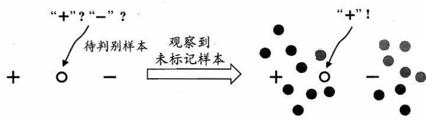
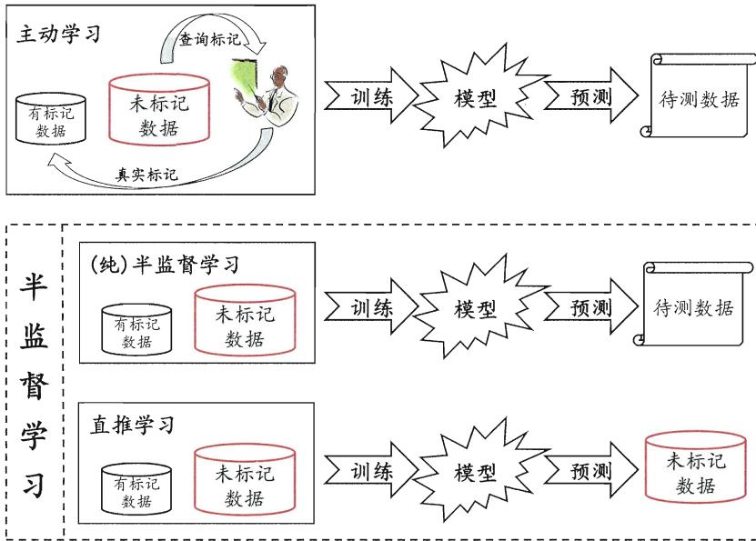
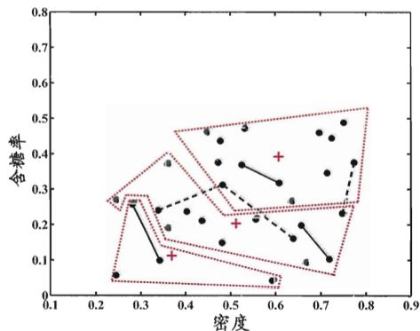
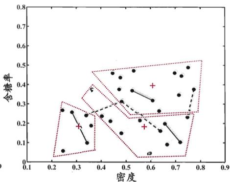
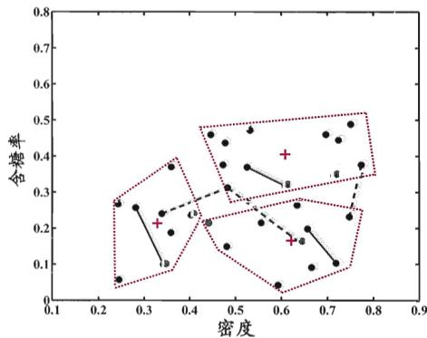
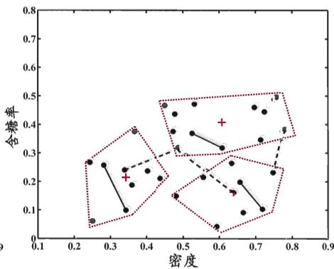
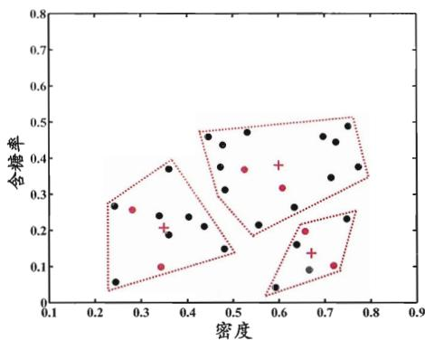
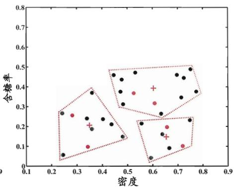
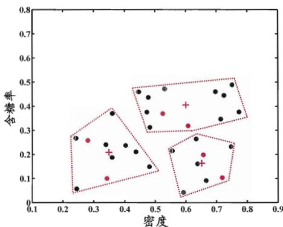
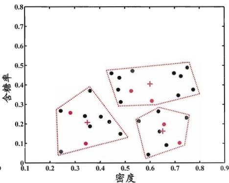

## 第 13 章 半监督学习

## 13.1 未标记样本

我们在丰收季节来到瓜田, 满地都是西瓜, 瓜农抱来三四个瓜说这都是好瓜, 然后再指着地里的五六个瓜说这些还不好, 还需再生长若干天. 基于这些信息, 我们能否构建一个模型, 用于判别地里的哪些瓜是已该采摘的好瓜? 显然, 可将瓜农告诉我们的好瓜、不好的瓜分别作为正例和反例来训练一个分类器. 然而, 只用这不到十个瓜做训练样本, 有点太少了吧? 能不能把地里的那些瓜也用上呢?

形式化地看, 我们有训练样本集 $D_{l} = \{(\pmb{x}_{1}, y_{1}), (\pmb{x}_{2}, y_{2}), \ldots, (\pmb{x}_{l}, y_{l})\}$ , 这 $l$ 个样本的类别标记(即是否好瓜)已知, 称为“有标记”(labeled)样本; 此外, 还有 $D_{u} = \{\pmb{x}_{l+1}, \pmb{x}_{l+2}, \ldots, \pmb{x}_{l+u}\}, l \ll u$ , 这 $u$ 个样本的类别标记未知(即不知是否好瓜), 称为“未标记”(unlabeled)样本. 若直接使用传统监督学习技术, 则仅有 $D_{l}$ 能用于构建模型, $D_{u}$ 所包含的信息被浪费了; 另一方面, 若 $D_{l}$ 较小, 则由于训练样本不足, 学得模型的泛化能力往往不佳. 那么, 能否在构建模型的过程中将 $D_{u}$ 利用起来呢?

一个简单的做法, 是将 $D_{u}$ 中的示例全部标记后用于学习. 这就相当于请瓜农把地里的瓜全都检查一遍, 告诉我们哪些是好瓜, 哪些不是好瓜, 然后再用于模型训练. 显然, 这样做需耗费瓜农大量时间和精力. 有没有“便宜”一点的办法呢?

例如基于 $D_{l}$ 训练一个SVM，挑选距离分类超平面最近的未标记样本来进行查询.

我们可以用 $D_{l}$ 先训练一个模型, 拿这个模型去地里挑一个瓜, 询问瓜农好不好, 然后把这个新获得的有标记样本加入 $D_{l}$ 中重新训练一个模型, 再去挑瓜, ……这样, 若每次都挑出对改善模型性能帮助大的瓜, 则只需询问瓜农比较少的瓜就能构建出比较强的模型, 从而大幅降低标记成本. 这样的学习方式称为 “主动学习” (active learning), 其目标是使用尽量少的 “查询” (query) 来获得尽量好的性能.

即尽量少向瓜农询问.

显然, 主动学习引入了额外的专家知识, 通过与外界的交互来将部分未标记样本转变为有标记样本. 若不与专家交互, 没有获得额外信息, 还能利用未标记样本来提高泛化性能吗?

答案是 “Yes !”，有点匪夷所思？

事实上, 未标记样本虽未直接包含标记信息, 但若它们与有标记样本是从同样的数据源独立同分布采样而来, 则它们所包含的关于数据分布的信息对建立模型将大有裨益. 图 13.1 给出了一个直观的例示. 若仅基于图中的一个正例和一个反例, 则由于待判别样本恰位于两者正中间, 大体上只能随机猜测; 若能观察到图中的未标记样本, 则将很有把握地判别为正例.

  
图13.1 未标记样本效用的例示. 右边的灰色点表示未标记样本

让学习器不依赖外界交互、自动地利用未标记样本来提升学习性能, 就是半监督学习(semi-supervised learning). 半监督学习的现实需求非常强烈, 因为在现实应用中往往能容易地收集到大量未标记样本, 而获取 “标记” 却需耗费人力、物力. 例如, 在进行计算机辅助医学影像分析时, 可以从医院获得大量医学影像, 但若希望医学专家把影像中的病灶全都标识出来则是不现实的. “有标记数据少, 未标记数据多” 这个现象在互联网应用中更明显, 例如在进行网页推荐时需请用户标记出感兴趣的网页, 但很少有用户愿花很多时间来提供标记, 因此, 有标记网页样本少, 但互联网上存在无数网页可作为未标记样本来使用. 半监督学习恰是提供了一条利用 “廉价” 的未标记样本的途径.

要利用未标记样本, 必然要做一些将未标记样本所揭示的数据分布信息与类别标记相联系的假设. 最常见的是“聚类假设”(cluster assumption), 即假设数据存在簇结构, 同一个簇的样本属于同一个类别. 图 13.1 就是基于聚类假设来利用未标记样本, 由于待预测样本与正例样本通过未标记样本的“撮合”聚在一起, 与相对分离的反例样本相比, 待判别样本更可能属于正类. 半监督学习中另一种常见的假设是“流形假设”(manifold assumption), 即假设数据分布在一个流形结构上, 邻近的样本拥有相似的输出值. “邻近”程度常用“相似”程度来刻画, 因此, 流形假设可看作聚类假设的推广, 但流形假设对输出值没有限制, 因此比聚类假设的适用范围更广, 可用于更多类型的学习任务. 事实上, 无论聚类假设还是流形假设, 其本质都是“相似的样本拥有相似的输出”这个基本假设.

半监督学习可进一步划分为纯(pure)半监督学习和直推学习(transductive learning)，前者假定训练数据中的未标记样本并非待预测的数据，而后者则假定学习过程中所考虑的未标记样本恰是待预测数据，学习的目的就是在这些未标记样本上获得最优泛化性能。换言之，纯半监督学习是基于“开放世界”假设，希望学得模型能适用于训练过程中未观察到的数据；而直推学习是基于“封闭世界”假设，仅试图对学习过程中观察到的未标记数据进行预测。图13.2直观地显示出主动学习、纯半监督学习、直推学习的区别。需注意的是，纯半监督学习和直推学习常合称为半监督学习，本书也采取这一态度，在需专门区分时会特别说明。

  
图 13.2 主动学习、(纯)半监督学习、直推学习

## 13.2 生成式方法

EM 算法参见 7.6 节.

生成式方法(generative methods)是直接基于生成式模型的方法。此类方法假设所有数据(无论是否有标记)都是由同一个潜在的模型“生成”的。这个假设使得我们能通过潜在模型的参数将未标记数据与学习目标联系起来，而未标记数据的标记则可看作模型的缺失参数，通常可基于EM算法进行极大似然估计求解。此类方法的区别主要在于生成式模型的假设，不同的模型假设将产生不同的方法。

这个假设意味着混合成分与类别之间一一对应.

给定样本 $\pmb{x}$ , 其真实类别标记为 $y \in \mathcal{Y}$ , 其中 $\mathcal{Y} = \{1, 2, \ldots, N\}$ 为所有可能的类别. 假设样本由高斯混合模型生成, 且每个类别对应一个高斯混合成分. 换言之, 数据样本是基于如下概率密度生成:

$$
p (\boldsymbol {x}) = \sum_ {i = 1} ^ {N} \alpha_ {i} \cdot p (\boldsymbol {x} \mid \boldsymbol {\mu} _ {i}, \boldsymbol {\Sigma} _ {i}),\tag{13.1}
$$

高斯混合模型参见 9.4 节.

其中, 混合系数 $\alpha_{i} \geqslant 0$ , $\sum_{i=1}^{N} \alpha_{i} = 1$ ; $p(\boldsymbol{x} \mid \boldsymbol{\mu}_{i}, \boldsymbol{\Sigma}_{i})$ 是样本 $\boldsymbol{x}$ 属于第 $i$ 个高斯混合成分的概率; $\boldsymbol{\mu}_{i}$ 和 $\boldsymbol{\Sigma}_{i}$ 为该高斯混合成分的参数.

令 $f(\pmb{x}) \in \mathcal{Y}$ 表示模型 $f$ 对 $\pmb{x}$ 的预测标记, $\Theta \in \{1,2,\dots,N\}$ 表示样本 $\pmb{x}$ 隶属的高斯混合成分. 由最大化后验概率可知

$$
\begin{array}{l} f (\boldsymbol {x}) = \underset {j \in \mathcal {Y}} {\arg \max} p (y = j \mid \boldsymbol {x}) \\ = \underset {j \in \mathcal {Y}} {\arg \max} \sum_ {i = 1} ^ {N} p (y = j, \Theta = i \mid \boldsymbol {x}) \\ = \underset {j \in \mathcal {Y}} {\arg \max} \sum_ {i = 1} ^ {N} p (y = j \mid \Theta = i, \boldsymbol {x}) \cdot p (\Theta = i \mid \boldsymbol {x}), \end{array}\tag{13.2}
$$

其中

$$
p (\Theta = i \mid \boldsymbol {x}) = \frac {\alpha_ {i} \cdot p (\boldsymbol {x} \mid \boldsymbol {\mu} _ {i} , \boldsymbol {\Sigma} _ {i})}{\sum_ {i = 1} ^ {N} \alpha_ {i} \cdot p (\boldsymbol {x} \mid \boldsymbol {\mu} _ {i} , \boldsymbol {\Sigma} _ {i})}\tag{13.3}
$$

为样本 $\pmb{x}$ 由第 $i$ 个高斯混合成分生成的后验概率, $p(y = j\mid \Theta = i,\pmb {x})$ 为 $\pmb{x}$ 由第 $i$ 个高斯混合成分生成且其类别为 $j$ 的概率.由于假设每个类别对应一个高斯混合成分,因此 $p(y = j\mid \Theta = i,\pmb {x})$ 仅与样本 $\pmb{x}$ 所属的高斯混合成分 $\Theta$ 有关,可用 $p(y = j\mid \Theta = i)$ 代替.不失一般性，假定第 $i$ 个类别对应于第 $i$ 个高斯混合成分，即 $p(y = j\mid \Theta = i) = 1$ 当且仅当 $i = j$ ，否则 $p(y = j\mid \Theta = i) = 0.$

不难发现, 式(13.2)中估计 $p(y = j \mid \Theta = i, x)$ 需知道样本的标记, 因此仅能使用有标记数据; 而 $p(\Theta = i \mid x)$ 不涉及样本标记, 因此有标记和未标记数据均可利用, 通过引入大量的未标记数据, 对这一项的估计可望由于数据量的增长而更为准确, 于是式(13.2)整体的估计可能会更准确. 由此可清楚地看出未标记数据何以能辅助提高分类模型的性能.

给定有标记样本集 $D_{l}=\left\{(\boldsymbol{x}_{1},y_{1}),(\boldsymbol{x}_{2},y_{2}),\ldots,(\boldsymbol{x}_{l},y_{l})\right\}$ 和未标记样本集

半监督学习中通常假设未标记样本数远大于有标记样本数, 虽然此假设实际并非必须.

$D_{u} = \{\pmb{x}_{l + 1},\pmb{x}_{l + 2},\dots ,\pmb{x}_{l + u}\} , l\ll u,l + u = m.$ 假设所有样本独立同分布，且都是由同一个高斯混合模型生成的．用极大似然法来估计高斯混合模型的参数 $\{(\alpha_i,\pmb {\mu}_i,\pmb {\Sigma}_i)\mid 1\leqslant i\leqslant N\} ,D_l\cup D_u$ 的对数似然是

$$
\begin{array}{l} L L (D _ {l} \cup D _ {u}) = \sum_ {\left(\boldsymbol {x} _ {j}, y _ {j}\right) \in D _ {l}} \ln \left(\sum_ {i = 1} ^ {N} \alpha_ {i} \cdot p \left(\boldsymbol {x} _ {j} \mid \boldsymbol {\mu} _ {i}, \boldsymbol {\Sigma} _ {i}\right) \cdot p \left(y _ {j} \mid \Theta = i, \boldsymbol {x} _ {j}\right)\right) \\ + \sum_ {\boldsymbol {x} _ {j} \in D _ {u}} \ln \left(\sum_ {i = 1} ^ {N} \alpha_ {i} \cdot p \left(\boldsymbol {x} _ {j} \mid \boldsymbol {\mu} _ {i}, \boldsymbol {\Sigma} _ {i}\right)\right). \end{array} \tag {1}\tag{13.4}
$$

高斯混合模型聚类的EM算法参见9.4节.

式(13.4)由两项组成: 基于有标记数据 $D_{l}$ 的有监督项和基于未标记数据 $D_{u}$ 的无监督项. 显然, 高斯混合模型参数估计可用 EM 算法求解, 迭代更新式如下:

\- E步：根据当前模型参数计算未标记样本 $x_{j}$ 属于各高斯混合成分的概率

可通过有标记数据对模型参数进行初始化.

$$
\gamma_ {j i} = \frac {\alpha_ {i} \cdot p (\boldsymbol {x} _ {j} \mid \boldsymbol {\mu} _ {i} , \boldsymbol {\Sigma} _ {i})}{\sum_ {i = 1} ^ {N} \alpha_ {i} \cdot p (\boldsymbol {x} _ {j} \mid \boldsymbol {\mu} _ {i} , \boldsymbol {\Sigma} _ {i})};\tag{13.5}
$$

\- M步：基于 $\gamma_{ji}$ 更新模型参数，其中 $l_{i}$ 表示第 $i$ 类的有标记样本数目

(13.6)

$$
\begin{array}{l} \boldsymbol {\mu} _ {i} = \frac {1}{\sum_ {\boldsymbol {x} _ {j} \in D _ {u}} \gamma_ {j i} + l _ {i}} \left(\sum_ {\boldsymbol {x} _ {j} \in D _ {u}} \gamma_ {j i} \boldsymbol {x} _ {j} + \sum_ {(\boldsymbol {x} _ {j}, y _ {j}) \in D _ {l} \wedge y _ {j} = i} \boldsymbol {x} _ {j}\right), \\ \boldsymbol {\Sigma} _ {i} = \frac {1}{\sum_ {\boldsymbol {x} _ {j} \in D _ {u}} \gamma_ {j i} + l _ {i}} \left(\sum_ {\boldsymbol {x} _ {j} \in D _ {u}} \gamma_ {j i} (\boldsymbol {x} _ {j} - \boldsymbol {\mu} _ {i}) (\boldsymbol {x} _ {j} - \boldsymbol {\mu} _ {i}) ^ {\mathrm{T}} \right. \\ \left. + \sum_ {(\boldsymbol {x} _ {j}, y _ {j}) \in D _ {l} \wedge y _ {j} = i} (\boldsymbol {x} _ {j} - \boldsymbol {\mu} _ {i}) (\boldsymbol {x} _ {j} - \boldsymbol {\mu} _ {i}) ^ {\mathrm{T}}\right) \\ \alpha_ {i} = \frac {1}{m} \left(\sum_ {\boldsymbol {x} _ {j} \in D _ {u}} \gamma_ {j i} + l _ {i}\right). \end{array}\tag{13.7}
$$

(13.8)

以上过程不断迭代直至收敛, 即可获得模型参数. 然后由式(13.3)和(13.2)就能对样本进行分类.

将上述过程中的高斯混合模型换成混合专家模型 [Miller and Uyar, 1997]、朴素贝叶斯模型 [Nigam et al., 2000] 等即可推导出其他的生成式半监督学习方法. 此类方法简单, 易于实现, 在有标记数据极少的情形下往往比其他方法性能更好. 然而, 此类方法有一个关键: 模型假设必须准确, 即假设的生成式模型必须与真实数据分布吻合; 否则利用未标记数据反倒会降低泛化性能 [Cozman and Cohen, 2002]. 遗憾的是, 在现实任务中往往很难事先做出准确的模型假设, 除非拥有充分可靠的领域知识.

## 13.3 半监督SVM

半监督支持向量机 (Semi-Supervised Support Vector Machine, 简称 S3VM) 是支持向量机在半监督学习上的推广。在不考虑未标记样本时，支持向量机试图找到最大间隔划分超平面，而在考虑未标记样本后，S3VM 试图找到能将两类有标记样本分开，且穿过数据低密度区域的划分超平面，如图 13.3 所示，这里的基本假设是“低密度分隔”(low-density separation)，显然，这是聚类假设在考虑了线性超平面划分后的推广。

  
图 13.3 半监督支持向量机与低密度分隔（“+”“-”分别表示有标记的正、反例，灰色点表示未标记样本）

半监督支持向量机中最著名的是TSVM(Transductive Support Vector Machine)[Joachims,1999].与标准SVM一样，TSVM也是针对二分类问题的学习方法．TSVM试图考虑对未标记样本进行各种可能的标记指派(label assignment)，即尝试将每个未标记样本分别作为正例或反例，然后在所有这些结果中，寻求一个在所有样本(包括有标记样本和进行了标记指派的未标记样本)上间隔最大化的划分超平面．一旦划分超平面得以确定，未标记样本的最终标记指派就是其预测结果.

形式化地说, 给定 $D_{l} = \{(\pmb{x}_{1}, y_{1}), (\pmb{x}_{2}, y_{2}), \ldots, (\pmb{x}_{l}, y_{l})\}$ 和 $D_{u} = \{\pmb{x}_{l+1}, \pmb{x}_{l+2}, \ldots, \pmb{x}_{l+u}\}$ , 其中 $y_{i} \in \{-1, +1\}$ , $l \ll u$ , $l + u = m$ . TSVM 的学习目标是为 $D_{u}$ 中的样本给出预测标记 $\hat{\pmb{y}} = (\hat{y}_{l+1}, \hat{y}_{l+2}, \ldots, \hat{y}_{l+u})$ , $\hat{y}_{i} \in \{-1, +1\}$ , 使得

$$
\begin{array}{l l} \min _ {\boldsymbol {w}, b, \hat {\boldsymbol {y}}, \boldsymbol {\xi}} & \frac {1}{2} \| \boldsymbol {w} \| _ {2} ^ {2} + C _ {l} \sum_ {i = 1} ^ {l} \xi_ {i} + C _ {u} \sum_ {i = l + 1} ^ {m} \xi_ {i} \\ \text {s.t.} & y _ {i} (\boldsymbol {w} ^ {\mathrm{T}} \boldsymbol {x} _ {i} + b) \geqslant 1 - \xi_ {i}, i = 1, 2, \dots , l, \\ & \hat {y} _ {i} (\boldsymbol {w} ^ {\mathrm{T}} \boldsymbol {x} _ {i} + b) \geqslant 1 - \xi_ {i}, i = l + 1, l + 2, \dots , m, \\ & \xi_ {i} \geqslant 0, i = 1, 2, \dots , m, \end{array}\tag{13.9}
$$

其中， $(w, b)$ 确定了一个划分超平面； $\pmb{\xi}$ 为松弛向量， $\xi_{i} (i = 1,2,\ldots,l)$ 对应于有标记样本， $\xi_{i} (i = l + 1, l + 2, \ldots, m)$ 对应于未标记样本； $C_{l}$ 与 $C_{u}$ 是由用户指定的用于平衡模型复杂度、有标记样本与未标记样本重要程度的折中参数。

显然, 尝试未标记样本的各种标记指派是一个穷举过程, 仅当未标记样本很少时才有可能直接求解. 在一般情形下, 必须考虑更高效的优化策略.

TSVM 采用局部搜索来迭代地寻找式(13.9)的近似解。具体来说，它先利用有标记样本学得一个 SVM，即忽略式(13.9)中关于 $D_u$ 与 $\hat{y}$ 的项及约束。然后，利用这个 SVM 对未标记数据进行标记指派(label assignment)，即将 SVM 预测的结果作为“伪标记”(pseudo-label)赋予未标记样本。此时 $\hat{y}$ 成为已知，将其代入式(13.9)即得到一个标准 SVM 问题，于是可求解出新的划分超平面和松弛向量；注意到此时未标记样本的伪标记很可能不准确，因此 $C_u$ 要设置为比 $C_l$ 小的值，使有标记样本所起作用更大。接下来，TSVM 找出两个标记指派为异类且很可能发生错误的未标记样本，交换它们的标记，再重新基于式(13.9)求解出更新后的划分超平面和松弛向量，然后再找出两个标记指派为异类且很可能发生错误的未标记样本，……标记指派调整完成后，逐渐增大 $C_u$ 以提高未标记样本对优化目标的影响，进行下一轮标记指派调整，直至 $C_u = C_l$ 为止。此时求解得到的 SVM 不仅给未标记样本提供了标记，还能对训练过程中未见的示例进行预测。TSVM 的算法描述如图 13.4 所示。

类别不平衡问题及式(13.10)的缘由见3.6节.

在对未标记样本进行标记指派及调整的过程中, 有可能出现类别不平衡问题, 即某类的样本远多于另一类, 这将对 SVM 的训练造成困扰. 为了减轻类别不平衡性所造成的不利影响, 可对图 13.4 的算法稍加改进: 将优化目标中的 $C_u$ 项拆分为 $C_u^+$ 与 $C_u^-$ 两项, 分别对应基于伪标记而当作正、反例使用的未标记样本, 并在初始化时令

输入：有标记样本集  $D_{l}=\{(x_{1},y_{1}),(x_{2},y_{2}),\ldots,(x_{l},y_{l})\}$ ;
未标记样本集  $D_{u}=\{x_{l+1},x_{l+2},\ldots,x_{l+u}\}$ ;
折中参数  $C_{l}, C_{u}$ .
过程：
1: 用  $D_{l}$  训练一个 SVM $_{l}$ ;
2: 用 SVM $_{l}$  对  $D_{u}$  中样本进行预测, 得到  $\hat{\mathbf{y}}=(\hat{y}_{l+1},\hat{y}_{l+2},\ldots,\hat{y}_{l+u})$ ;
3: 初始化  $C_{u} \ll C_{l}$ ;
4: while  $C_{u} &lt; C_{l}$  do
5: 基于  $D_{l}, D_{u}, \hat{y}, C_{l}, C_{u}$  求解式(13.9), 得到  $(\boldsymbol{w}, b)$ ,  $\xi$ ;
6: while  $\exists\{i,j\mid(\hat{y}_{i}\hat{y}_{j}&lt;0)\land(\xi_{i}&gt;0)\land(\xi_{j}&gt;0)\land(\xi_{i}+\xi_{j}&gt;2)\}$  do
7:  $\hat{y}_{i}=-\hat{y}_{i};$ 
8:  $\hat{y}_{j}=-\hat{y}_{j};$ 
9: 基于  $D_{l}, D_{u}, \hat{y}, C_{l}, C_{u}$  重新求解式(13.9), 得到  $(\boldsymbol{w}, b)$ ,  $\xi$ 
10: end while
11:  $C_{u}=\min\{2C_{u},C_{l}\}$ 
12: end while
输出：未标记样本的预测结果： $\hat{\mathbf{y}}=(\hat{y}_{l+1},\hat{y}_{l+2},\ldots,\hat{y}_{l+u})$

图13.4 TSVM算法

$$
C _ {u} ^ {+} = \frac {u _ {-}}{u _ {+}} C _ {u} ^ {-},\tag{13.10}
$$

其中 $u_{+}$ 与 $u_{-}$ 为基于伪标记而当作正、反例使用的未标记样本数.

在图 13.4 算法的第 6–10 行中, 若存在一对未标记样本 $x_{i}$ 与 $x_{j}$ , 其标记指派 $\hat{y}_{i}$ 与 $\hat{y}_{j}$ 不同, 且对应的松弛变量满足 $\xi_{i} + \xi_{j} > 2$ , 则意味着 $\hat{y}_{i}$ 与 $\hat{y}_{j}$ 很可能是错误的, 需对二者进行交换后重新求解式(13.9), 这样每轮迭代后均可使式(13.9)的目标函数值下降.

显然, 搜寻标记指派可能出错的每一对未标记样本进行调整, 是一个涉及巨大计算开销的大规模优化问题. 因此, 半监督 SVM 研究的一个重点是如何设计出高效的优化求解策略, 由此发展出很多方法, 如基于图核(graph kernel)函数梯度下降的 LDS [Chapelle and Zien, 2005]、基于标记均值估计的 meanS3VM [Li et al., 2009] 等.

## 13.4 图半监督学习

给定一个数据集, 我们可将其映射为一个图, 数据集中每个样本对应于图中一个结点, 若两个样本之间的相似度很高(或相关性很强), 则对应的结点之间存在一条边, 边的“强度”(strength)正比于样本之间的相似度(或相关性). 我们可将有标记样本所对应的结点想象为染过色, 而未标记样本所对应的结点尚未染色. 于是, 半监督学习就对应于 “颜色” 在图上扩散或传播的过程. 由于一个图对应了一个矩阵, 这就使得我们能基于矩阵运算来进行半监督学习算法的推导与分析.

给定 $D_{l} = \{(\pmb{x}_{1},y_{1}),(\pmb{x}_{2},y_{2}),\dots ,(\pmb{x}_{l},y_{l})\}$ 和 $D_{u} = \{\pmb{x}_{l + 1},\pmb{x}_{l + 2},\dots ,\pmb{x}_{l + u}\}$ , $l\ll u,l + u = m$ .我们先基于 $D_{l}\cup D_{u}$ 构建一个图 $G = (V,E)$ ，其中结点集 $V = \{\pmb{x}_1,\dots ,\pmb{x}_l,\pmb{x}_{l + 1},\dots ,\pmb{x}_{l + u}\}$ ，边集 $E$ 可表示为一个亲和矩阵(affinity matrix)，常基于高斯函数定义为

$$
(\mathbf {W}) _ {i j} = \left\{ \begin{array}{l l} \exp \left(\frac {- \| \boldsymbol {x} _ {i} - \boldsymbol {x} _ {j} \| _ {2} ^ {2}}{2 \sigma^ {2}}\right), & \text { if } i \neq j; \\ 0, & \text { otherwise }, \end{array} \right.\tag{13.11}
$$

其中 $i, j \in \{1, 2, \ldots, m\}$ ， $\sigma > 0$ 是用户指定的高斯函数带宽参数.

假定从图 $G = (V, E)$ 将学得一个实值函数 $f: V \to \mathbb{R}$ , 其对应的分类规则为: $y_{i} = \mathrm{sign}(f(\pmb{x}_{i}))$ , $y_{i} \in \{-1, +1\}$ . 直观上看, 相似的样本应具有相似的标记, 于是可定义关于 $f$ 的“能量函数” (energy function) [Zhu et al., 2003]:

能量函数最小化时即得到最优结果.

$$
\begin{array}{l} E (f) = \frac {1}{2} \sum_ {i = 1} ^ {m} \sum_ {j = 1} ^ {m} (\mathbf {W}) _ {i j} \left(f (\boldsymbol {x} _ {i}) - f (\boldsymbol {x} _ {j})\right) ^ {2} \\ = \frac {1}{2} \left(\sum_ {i = 1} ^ {m} d _ {i} f ^ {2} (\boldsymbol {x} _ {i}) + \sum_ {j = 1} ^ {m} d _ {j} f ^ {2} (\boldsymbol {x} _ {j}) - 2 \sum_ {i = 1} ^ {m} \sum_ {j = 1} ^ {m} (\mathbf {W}) _ {i j} f (\boldsymbol {x} _ {i}) f (\boldsymbol {x} _ {j})\right) \\ = \sum_ {i = 1} ^ {m} d _ {i} f ^ {2} (\boldsymbol {x} _ {i}) - \sum_ {i = 1} ^ {m} \sum_ {j = 1} ^ {m} (\mathbf {W}) _ {i j} f (\boldsymbol {x} _ {i}) f (\boldsymbol {x} _ {j}) \\ = \boldsymbol {f} ^ {\mathrm{T}} (\mathbf {D} - \mathbf {W}) \boldsymbol {f}, \end{array} \tag {13}\tag{13.12}
$$

其中 $\boldsymbol{f} = (\boldsymbol{f}_{l}^{\mathrm{T}} \boldsymbol{f}_{u}^{\mathrm{T}})^{\mathrm{T}}, \boldsymbol{f}_{l} = (f(\boldsymbol{x}_{1}); f(\boldsymbol{x}_{2}); \ldots; f(\boldsymbol{x}_{l}))$ , $\boldsymbol{f}_{u} = (f(\boldsymbol{x}_{l+1}); f(\boldsymbol{x}_{l+2}); \ldots; f(\boldsymbol{x}_{l+u}))$ 分别为函数 f 在有标记样本与未标记样本上的预测结果, $\mathbf{D} = \operatorname{diag}(d_{1}, d_{2}, \ldots, d_{l+u})$ 是一个对角矩阵, 其对角元素 $d_{i} = \sum_{j=1}^{l+u} (\mathbf{W})_{ij}$ 为矩阵 W 的第 i 行元素之和.

W 为对称矩阵, 因此 $d_{i}$ 亦为 W 第 i 列元素之和.

具有最小能量的函数 f 在有标记样本上满足 $f(\boldsymbol{x}_{i}) = y_{i} (i = 1, 2, \ldots, l)$ ，在未标记样本上满足 $\Delta f = 0$ ，其中 $\Delta = D - W$ 为拉普拉斯矩阵 (Laplacian matrix). 以第 l 行与第 l 列为界，采用分块矩阵表示方式： $W = \begin{bmatrix} W_{ll} & W_{lu} \\ W_{ul} & W_{uu} \end{bmatrix}$ ,$\mathbf{D} = \begin{bmatrix} \mathbf{D}_{ll} & \mathbf{0}_{lu} \\ \mathbf{0}_{ul} & \mathbf{D}_{uu} \end{bmatrix}$ , 则式(13.12)可重写为

$$
\begin{array}{r l} & E (f) = (\boldsymbol {f} _ {l} ^ {\mathrm{T}} \boldsymbol {f} _ {u} ^ {\mathrm{T}}) \left(\left[ \begin{array}{c c} \mathbf {D} _ {l l} & \mathbf {0} _ {l u} \\ \mathbf {0} _ {u l} & \mathbf {D} _ {u u} \end{array} \right] - \left[ \begin{array}{c c} \mathbf {W} _ {l l} & \mathbf {W} _ {l u} \\ \mathbf {W} _ {u l} & \mathbf {W} _ {u u} \end{array} \right]\right) \left[ \begin{array}{c} \boldsymbol {f} _ {l} \\ \boldsymbol {f} _ {u} \end{array} \right] \\ & = \boldsymbol {f} _ {l} ^ {\mathrm{T}} (\mathbf {D} _ {l l} - \mathbf {W} _ {l l}) \boldsymbol {f} _ {l} - 2 \boldsymbol {f} _ {u} ^ {\mathrm{T}} \mathbf {W} _ {u l} \boldsymbol {f} _ {l} + \boldsymbol {f} _ {u} ^ {\mathrm{T}} (\mathbf {D} _ {u u} - \mathbf {W} _ {u u}) \boldsymbol {f} _ {u}. \end{array}\tag{13.13}
$$

(13.14)

由 $\frac{\partial E(f)}{\partial f_u} = 0$ 可得

$$
\boldsymbol {f} _ {u} = \left(\mathbf {D} _ {u u} - \mathbf {W} _ {u u}\right) ^ {- 1} \mathbf {W} _ {u l} \boldsymbol {f} _ {l}.\tag{13.15}
$$

令

$$
\begin{array}{r l} & {\mathbf {P} = \mathbf {D} ^ {- 1} \mathbf {W} = \left[ \begin{array}{c c} \mathbf {D} _ {l l} ^ {- 1} & \mathbf {0} _ {l u} \\ \mathbf {0} _ {u l} & \mathbf {D} _ {u u} ^ {- 1} \end{array} \right] \left[ \begin{array}{c c} \mathbf {W} _ {l l} & \mathbf {W} _ {l u} \\ \mathbf {W} _ {u l} & \mathbf {W} _ {u u} \end{array} \right]} \\ & {\qquad = \left[ \begin{array}{c c} \mathbf {D} _ {l l} ^ {- 1} \mathbf {W} _ {l l} & \mathbf {D} _ {l l} ^ {- 1} \mathbf {W} _ {l u} \\ \mathbf {D} _ {u u} ^ {- 1} \mathbf {W} _ {u l} & \mathbf {D} _ {u u} ^ {- 1} \mathbf {W} _ {u u} \end{array} \right],} \end{array}\tag{13.16}
$$

即 $\mathbf{P}_{uu} = \mathbf{D}_{uu}^{-1}\mathbf{W}_{uu},\mathbf{P}_{ul} = \mathbf{D}_{uu}^{-1}\mathbf{W}_{ul}$ ，则式(13.15)可重写为

$$
\begin{array}{r l} \boldsymbol {f} _ {u} & = (\mathbf {D} _ {u u} (\mathbf {I} - \mathbf {D} _ {u u} ^ {- 1} \mathbf {W} _ {u u})) ^ {- 1} \mathbf {W} _ {u l} \boldsymbol {f} _ {l} \\ & = (\mathbf {I} - \mathbf {D} _ {u u} ^ {- 1} \mathbf {W} _ {u u}) ^ {- 1} \mathbf {D} _ {u u} ^ {- 1} \mathbf {W} _ {u l} \boldsymbol {f} _ {l} \\ & = (\mathbf {I} - \mathbf {P} _ {u u}) ^ {- 1} \mathbf {P} _ {u l} \boldsymbol {f} _ {l}. \end{array}\tag{13.17}
$$

于是, 将 $D_{l}$ 上的标记信息作为 $\pmb{f}_{l} = (y_{1}; y_{2}; \ldots; y_{l})$ 代入式(13.17), 即可利用求得的 $\pmb{f}_{u}$ 对未标记样本进行预测.

上面描述的是一个针对二分类问题的标记传播(label propagation)方法, 下面来看一个适用于多分类问题的标记传播方法 [Zhou et al., 2004].

假定 $y_{i} \in \mathcal{Y}$ , 仍基于 $D_{l} \cup D_{u}$ 构建一个图 $G = (V, E)$ , 其中结点集 $V = \{\pmb{x}_{1}, \ldots, \pmb{x}_{l}, \ldots, \pmb{x}_{l + u}\}$ , 边集 $E$ 所对应的 $\mathbf{W}$ 仍使用式(13.11), 对角矩阵 $\mathbf{D} = \mathrm{diag}(d_{1}, d_{2}, \ldots, d_{l + u})$ 的对角元素 $d_{i} = \sum_{j=1}^{l + u} (\mathbf{W})_{ij}$ . 定义一个 $(l + u) \times |\mathcal{Y}|$ 的非负标记矩阵 $\mathbf{F} = (\mathbf{F}_{1}^{\mathrm{T}}, \mathbf{F}_{2}^{\mathrm{T}}, \ldots, \mathbf{F}_{l + u}^{\mathrm{T}})^{\mathrm{T}}$ , 其第 $i$ 行元素 $\mathbf{F}_{i} = ((\mathbf{F})_{i1}, (\mathbf{F})_{i2}, \ldots, (\mathbf{F})_{i|\mathcal{Y}|})$ 为示例 $\pmb{x}_{i}$ 的标记向量, 相应的分类规则为: $y_{i} = \arg \max_{1 \leqslant j \leqslant |\mathcal{Y}|} (\mathbf{F})_{ij}$ .

对 $i = 1,2,\ldots ,m,j = 1,2,\ldots ,|\mathcal{Y}|$ ，将 $\mathbf{F}$ 初始化为

$$
\mathbf {F} (0) = (\mathbf {Y}) _ {i j} = \left\{ \begin{array}{l l} 1, & \text { if } (1 \leqslant i \leqslant l) \wedge (y _ {i} = j); \\ 0, & \text { otherwise }. \end{array} \right.\tag{13.18}
$$

显然, Y 的前 l 行就是 l 个有标记样本的标记向量.

基于 W 构造一个标记传播矩阵 $S = D^{-\frac{1}{2}}WD^{-\frac{1}{2}}$ ，其中 $D^{-\frac{1}{2}} = diag\left(\frac{1}{\sqrt{d_{1}}}, \frac{1}{\sqrt{d_{2}}}, \ldots, \frac{1}{\sqrt{d_{l+u}}}\right)$ ，于是有迭代计算式

$$
\mathbf {F} (t + 1) = \alpha \mathbf {S F} (t) + (1 - \alpha) \mathbf {Y},\tag{13.19}
$$

其中 $\alpha \in (0,1)$ 为用户指定的参数，用于对标记传播项 $\mathbf{SF}(t)$ 与初始化项 $\mathbf{Y}$ 的重要性进行折中. 基于式(13.19)迭代至收敛可得

$$
\mathbf {F} ^ {*} = \lim _ {t \to \infty} \mathbf {F} (t) = (1 - \alpha) (\mathbf {I} - \alpha \mathbf {S}) ^ {- 1} \mathbf {Y},\tag{13.20}
$$

由 $F^{*}$ 可获得 $D_{u}$ 中样本的标记 $(\hat{y}_{l+1},\hat{y}_{l+2},\ldots,\hat{y}_{l+u})$ . 算法描述如图 13.5 所示.

输入：有标记样本集  $D_{l}=\{(x_{1},y_{1}),(x_{2},y_{2}),\ldots,(x_{l},y_{l})\}$ ;
未标记样本集  $D_{u}=\{x_{l+1},x_{l+2},\ldots,x_{l+u}\}$ ;
构图参数  $\sigma;$ 
折中参数  $\alpha.$ 
过程：
1: 基于式(13.11)和参数  $\sigma$  得到 W;
2: 基于 W 构造标记传播矩阵  $S=D^{-\frac{1}{2}}WD^{-\frac{1}{2}}$ ;
3: 根据式(13.18)初始化 F(0);
4: t=0;
5: repeat
6:  $\mathbf{F}(t+1)=\alpha\mathbf{SF}(t)+(1-\alpha)\mathbf{Y};$ 
7:  $t=t+1$ 
8: until 迭代收敛至  $F^{*}$ 
9: for  $i=l+1,l+2,\ldots,l+u$  do
10:  $y_{i}=\arg\max_{1\leqslant j\leqslant|y|}(\mathbf{F}^{*})_{ij}$ 
11: end for
输出：未标记样本的预测结果： $\hat{\mathbf{y}}=(\hat{y}_{l+1},\hat{y}_{l+2},\ldots,\hat{y}_{l+u})$

图 13.5 迭代式标记传播算法

事实上, 图 13.5 的算法对应于正则化框架 [Zhou et al., 2004]

$$
\min _ {\mathbf {F}} \frac {1}{2} \left(\sum_ {i, j = 1} ^ {l + u} (\mathbf {W}) _ {i j} \left\| \frac {1}{\sqrt {d _ {i}}} \mathbf {F} _ {i} - \frac {1}{\sqrt {d _ {j}}} \mathbf {F} _ {j} \right\| ^ {2}\right) + \mu \sum_ {i = 1} ^ {l} \| \mathbf {F} _ {i} - \mathbf {Y} _ {i} \| ^ {2},\tag{13.21}
$$

其中 $\mu > 0$ 为正则化参数. 当 $\mu = \frac{1 - \alpha}{\alpha}$ 时, 式(13.21)的最优解恰为图13.5算法的迭代收敛解 $\mathbf{F}^*$ .

式(13.21)右边第二项是迫使学得结果在有标记样本上的预测与真实标记尽可能相同, 而第一项则迫使相近样本具有相似的标记, 显然, 它与式(13.12)都是基于半监督学习的基本假设, 不同的是式(13.21)考虑离散的类别标记, 而式(13.12)则是考虑输出连续值.

图半监督学习方法在概念上相当清晰, 且易于通过对所涉矩阵运算的分析来探索算法性质. 但此类算法的缺陷也相当明显. 首先是在存储开销上, 若样本数为 $O(m)$ , 则算法中所涉及的矩阵规模为 $O(m^2)$ , 这使得此类算法很难直接处理大规模数据; 另一方面, 由于构图过程仅能考虑训练样本集, 难以判知新样本在图中的位置, 因此, 在接收到新样本时, 或是将其加入原数据集对图进行重构并重新进行标记传播, 或是需引入额外的预测机制, 例如将 $D_l$ 和经标记传播后得到标记的 $D_u$ 合并作为训练集, 另外训练一个学习器例如支持向量机来对新样本进行预测.

## 13.5 基于分歧的方法

与生成式方法、半监督 SVM、图半监督学习等基于单学习器利用未标记数据不同, 基于分歧的方法(disagreement-based methods) 使用多学习器, 而学习器之间的“分歧”(disagreement)对未标记数据的利用至关重要.

“协同训练”(co-training) [Blum and Mitchell, 1998] 是此类方法的重要代表, 它最初是针对 “多视图” (multi-view) 数据设计的, 因此也被看作 “多视图学习” (multi-view learning) 的代表. 在介绍协同训练之前, 我们先看看什么是多视图数据.

在不少现实应用中, 一个数据对象往往同时拥有多个 “属性集” (attribute set), 每个属性集就构成了一个 “视图” (view). 例如对一部电影来说, 它拥有多个属性集: 图像画面信息所对应的属性集、声音信息所对应的属性集、字幕信息所对应的属性集、甚至网上的宣传讨论所对应的属性集等. 每个属性集都可看作一个视图. 为简化讨论, 暂且仅考虑图像画面属性集所构成的视图和声音属性集所构成的视图. 于是, 一个电影片段可表示为样本 ( $\langle x^{1}, x^{2} \rangle, y$ ), 其中 $x^{i}$ 是样本在视图 $i$ 中的示例, 即基于该视图属性描述而得的属性向量, 不妨假定 $x^{1}$ 为图像视图中的属性向量, $x^{2}$ 为声音视图中的属性向量; $y$ 是标记, 假定是电影的类型, 例如 “动作片”、“爱情片” 等. ( $\langle x^{1}, x^{2} \rangle, y$ ) 这样的数据就是多视图数据.

假设不同视图具有“相容性”(compatibility)，即其所包含的关于输出空间 $\mathcal{Y}$ 的信息是一致的：令 $\mathcal{Y}^1$ 表示从图像画面信息判别的标记空间， $\mathcal{Y}^2$ 表示从声音信息判别的标记空间，则有 $\mathcal{Y} = \mathcal{Y}^1 = \mathcal{Y}^2$ ，例如两者都是{爱情片，动作片}，而不能是 $\mathcal{Y}^1 = \{\text{爱情片}, \text{动作片}\}$ 而 $\mathcal{Y}^2 = \{\text{文艺片}, \text{惊悚片}\}$ 。在此假设下，显式地考虑多视图有很多好处。仍以电影为例，某个片段上有两人对视，仅凭图像画面信息难以分辨其类型，但此时若从声音信息听到“我爱你”，则可判断出该片段很可能属于“爱情片”；另一方面，若仅凭图像画面信息认为“可能是动作片”，仅凭声音信息也认为“可能是动作片”，则当两者一起考虑时就有很大的把握判别为“动作片”。显然，在“相容性”基础上，不同视图信息的“互补性”会给学习器的构建带来很多便利。

协同训练正是很好地利用了多视图的“相容互补性”。假设数据拥有两个充分(sufficient)且条件独立视图，“充分”是指每个视图都包含足以产生最优学习器的信息，“条件独立”则是指在给定类别标记条件下两个视图独立。在此情形下，可用一个简单的办法来利用未标记数据：首先在每个视图上基于有标记样本分别训练出一个分类器，然后让每个分类器分别去挑选自己“最有把握的”未标记样本赋予伪标记，并将伪标记样本提供给另一个分类器作为新增的有标记样本用于训练更新……这个“互相学习、共同进步”的过程不断迭代进行，直到两个分类器都不再发生变化，或达到预先设定的迭代轮数为止。算法描述如图13.6所示。若在每轮学习中都考察分类器在所有未标记样本上的分类置信度，会有很大的计算开销，因此在算法中使用了未标记样本缓冲池[Blum and Mitchell, 1998]。分类置信度的估计则因基学习算法 $\mathfrak{L}$ 而异，例如若使用朴素贝叶斯分类器，则可将后验概率转化为分类置信度；若使用支持向量机，则可将间隔大小转化为分类置信度。

协同训练过程虽简单, 但令人惊讶的是, 理论证明显示出, 若两个视图充分且条件独立, 则可利用未标记样本通过协同训练将弱分类器的泛化性能提升到任意高[Blum and Mitchell, 1998]. 不过, 视图的条件独立性在现实任务中通常很难满足, 因此性能提升幅度不会那么大, 但研究表明, 即便在更弱的条件下, 协同训练仍可有效地提升弱分类器的性能 [周志华, 2013].

协同训练算法本身是为多视图数据而设计的, 但此后出现了一些能在单视图数据上使用的变体算法, 它们或是使用不同的学习算法 [Goldman and Zhou, 2000], 或使用不同的数据采样 [Zhou and Li, 2005b], 甚至使用不同的参数设置 [Zhou and Li, 2005a] 来产生不同的学习器, 也能有效地利用未标记数据来提升性能. 后续理论研究发现, 此类算法事实上无需数据拥有多视图, 仅需弱学习器之间具有显著的分歧(或差异), 即可通过相互提供伪标记样本的方式来提升泛化性能 [周志华, 2013]; 不同视图、不同算法、不同数据采样、不同参数设置等, 都仅是产生差异的渠道, 而非必备条件.

$x_i$ 的上标仅用于指代两个视图, 不表示序关系, 即 $\langle x_i^1, x_i^2 \rangle$ 与 $\langle x_i^2, x_i^1 \rangle$ 表示的是同一个样本.

令 $p, n \ll s$.

过程:
1: 从 $D_u$ 中随机抽取 $s$ 个样本构成缓冲池 $D_s$;
2: $D_u = D_u \setminus D_s$;
3: for $j = 1, 2$ do
4: $D_l^j = \{ (x_i^j, y_i) \mid (\langle x_i^j, x_i^{3-j} \rangle, y_i) \in D_l \}$;
5: end for
6: for $t = 1, 2, \ldots, T$ do
7: for $j = 1, 2$ do
8: $h_j \leftarrow \mathfrak{L}(D_l^j)$;
9: 考察 $h_j$ 在 $D_s^j = \{ x_i^j \mid \langle x_i^j, x_i^{3-j} \rangle \in D_s \}$ 上的分类置信度, 挑选 $p$ 个正例置信度最高的样本 $D_p \subset D_s$、$n$ 个反例置信度最高的样本 $D_n \subset D_s$;
10: 由 $D_p^j$ 生成伪标记正例 $\tilde{D}_p^{3-j} = \{ (x_i^{3-j}, +1) \mid x_i^j \in D_p^j \}$;
11: 由 $D_n^j$ 生成伪标记反例 $\tilde{D}_n^{3-j} = \{ (x_i^{3-j}, -1) \mid x_i^j \in D_n^j \}$;
12: $D_s = D_s \setminus (D_p \cup D_n)$;
13: end for
14: if $h_1, h_2$ 均未发生改变 then
15: break
16: else
17: for $j = 1, 2$ do
18: $D_l^j = D_l^j \cup (\tilde{D}_p^j \cup \tilde{D}_n^j)$;
19: end for
20: 从 $D_u$ 中随机抽取 $2p + 2n$ 个样本加入 $D_s$
21: end if
22: end for

输出: 分类器 $h_1, h_2$

图13.6 协同训练算法

基于分歧的方法只需采用合适的基学习器, 就能较少受到模型假设、损失函数非凸性和数据规模问题的影响, 学习方法简单有效、理论基础相对坚实、适用范围较为广泛. 为了使用此类方法, 需能生成具有显著分歧、性能尚可的多个学习器, 但当有标记样本很少, 尤其是数据不具有多视图时, 要做到这一点并不容易, 需有巧妙的设计.

## 13.6 半监督聚类

聚类是一种典型的无监督学习任务, 然而在现实聚类任务中我们往往能获得一些额外的监督信息, 于是可通过半监督聚类(semi-supervised clustering)来利用监督信息以获得更好的聚类效果.

聚类任务中获得的监督信息大致有两种类型．第一种类型是“必连”(must-link)与“勿连”(cannot-link)约束，前者是指样本必属于同一个簇，后者是指样本必不属于同一个簇；第二种类型的监督信息则是少量的有标记样本.

约束 $k$ 均值 (Constrained $k$ -means) 算法 [Wagstaff et al., 2001] 是利用第一类监督信息的代表. 给定样本集 $D = \{x_1, x_2, \ldots, x_m\}$ 以及“必连”关系

输入：样本集  $D = \{x_{1}, x_{2}, \ldots, x_{m}\}$ ;
必连约束集合 M；
勿连约束集合 C；
聚类簇数 k.
过程：
1: 从 D 中随机选取 k 个样本作为初始均值向量  $\{\mu_{1}, \mu_{2}, \ldots, \mu_{k}\}$ ;
2: repeat
3:  $C_{j} = \varnothing (1 \leqslant j \leqslant k)$ ;
4: for  $i = 1, 2, \ldots, m$  do
5: 计算样本  $x_{i}$  与各均值向量  $\mu_{j} (1 \leqslant j \leqslant k)$  的距离:  $d_{ij} = ||x_{i} - \mu_{j}||_{2}$ ;
6:  $K = \{1, 2, \ldots, k\}$ ;
7: is_merged=false;
8: while  $\neg$  is_merged do
9: 基于 K 找出与样本  $x_{i}$  距离最近的簇:  $r = \arg\min_{j \in K} d_{ij}$ ;
10: 检测将  $x_{i}$  划入聚类簇  $C_{r}$  是否会违背 M 与 C 中的约束;
11: if  $\neg$  is_voilated then
12:  $C_{r} = C_{r} \cup \{x_{i}\}$ ;
13: is_merged=true
14: else
15:  $K = K \setminus \{r\}$ ;
16: if  $K = \varnothing$  then
17: break 并返回错误提示
18: end if
19: end if
20: end while
21: end for
22: for  $j = 1, 2, \ldots, k$  do
23:  $\mu_{j} = \frac{1}{|C_{j}|} \sum_{x \in C_{j}} x$ ;
24: end for
25: until 均值向量均未更新
输出：簇划分  $\{C_{1}, C_{2}, \ldots, C_{k}\}$

图13.7 约束 $k$ 均值算法

k 均值算法见 9.4.1 节.

集合 $\mathcal{M}$ 和“勿连”关系集合 $\mathcal{C}, (\pmb{x}_i, \pmb{x}_j) \in \mathcal{M}$ 表示 $\pmb{x}_i$ 与 $\pmb{x}_j$ 必属于同簇， $(\pmb{x}_i, \pmb{x}_j) \in \mathcal{C}$ 表示 $\pmb{x}_i$ 与 $\pmb{x}_j$ 必不属于同簇。该算法是 $k$ 均值算法的扩展，它在聚类过程中要确保 $\mathcal{M}$ 与 $\mathcal{C}$ 中的约束得以满足，否则将返回错误提示，算法如图13.7所示。

见 p.202 表 9.1.

以西瓜数据集 4.0 为例, 令样本 $x_{4}$ 与 $x_{25}, x_{12}$ 与 $x_{20}, x_{14}$ 与 $x_{17}$ 之间存在必连约束, $x_{2}$ 与 $x_{21}, x_{13}$ 与 $x_{23}, x_{19}$ 与 $x_{23}$ 之间存在勿连约束, 即

$$
\begin{array}{c} \mathcal {M} = \{(x _ {4}, x _ {2 5}), (x _ {2 5}, x _ {4}), (x _ {1 2}, x _ {2 0}), (x _ {2 0}, x _ {1 2}), (x _ {1 4}, x _ {1 7}), (x _ {1 7}, x _ {1 4}) \}, \\ \mathcal {C} = \{(x _ {2}, x _ {2 1}), (x _ {2 1}, x _ {2}), (x _ {1 3}, x _ {2 3}), (x _ {2 3}, x _ {1 3}), (x _ {1 9}, x _ {2 3}), (x _ {2 3}, x _ {1 9}) \}. \end{array}
$$

设聚类簇数 k = 3，随机选取样本 $x_{6}, x_{12}, x_{27}$ 作为初始均值向量，图 13.8显示出约束 k 均值算法在不同迭代轮数后的聚类结果. 经 5 轮迭代后均值向量不再发生变化(与第 4 轮迭代相同), 于是得到最终聚类结果

  
(a) 第 1 轮迭代后

  
(c) 第 3 轮迭代后

(b) 第 2 轮迭代后  
  
(d) 第 4 轮迭代后  
图 13.8 西瓜数据集 4.0 上约束 k 均值算法 $(k=3)$ 在各轮迭代后的结果. 样本点与均值向量分别用 “●” 与 “+” 表示, 必连约束和勿连约束分别用实线段与虚线段表示, 红色虚线显示出簇划分.

$C_1 = \{\pmb{x}_3,\pmb{x}_5,\pmb{x}_7,\pmb{x}_9,\pmb{x}_{13},\pmb{x}_{14},\pmb{x}_{16},\pmb{x}_{17},\pmb{x}_{21}\};$ $C_2 = \{\pmb {x}_6,\pmb {x}_8,\pmb {x}_{10},\pmb {x}_{11},\pmb {x}_{12},\pmb {x}_{15},\pmb {x}_{18},\pmb {x}_{19},\pmb {x}_{20}\} ;$ $C_3 = \{\pmb {x}_1,\pmb {x}_2,\pmb {x}_4,\pmb {x}_{22},\pmb {x}_{23},\pmb {x}_{24},\pmb {x}_{25},\pmb {x}_{26},\pmb {x}_{27},\pmb {x}_{28},\pmb {x}_{29},\pmb {x}_{30}\} .$

此处样本标记指簇标记(cluster label), 不是类别标记 (class label).

第二种监督信息是少量有标记样本. 给定样本集 $D = \{\pmb{x}_1, \pmb{x}_2, \dots, \pmb{x}_m\}$ , 假定少量的有标记样本为 $S = \bigcup_{j=1}^{k} S_j \subset D$ , 其中 $S_j \neq \varnothing$ 为隶属于第 $j$ 个聚类簇的样本. 这样的监督信息利用起来很容易: 直接将它们作为“种子”, 用它们初始化 $k$ 均值算法的 $k$ 个聚类中心, 并且在聚类簇迭代更新过程中不改变种子样本的簇隶属关系. 这样就得到了约束种子 $k$ 均值 (Constrained Seed $k$ -means) 算法 [Basu et al., 2002], 其算法描述如图 13.9 所示.

输入: 样本集 $D = \{x_1, x_2, \ldots, x_m\}$;
少量有标记样本 $S = \bigcup_{j=1}^k S_j$;
聚类簇数 $k$.

过程:
1: for $j = 1, 2, \ldots, k$ do
2: $\mu_j = \frac{1}{|S_j|} \sum_{x \in S_j} x$
3: end for
4: repeat
5: $C_j = \varnothing (1 \leqslant j \leqslant k)$;
6: for $j = 1, 2, \ldots, k$ do
7: for all $x \in S_j$ do
8: $C_j = C_j \bigcup \{x\}$
9: end for
10: end for
11: for all $x_i \in D \setminus S$ do
12: 计算样本 $x_i$ 与各均值向量 $\mu_j (1 \leqslant j \leqslant k)$ 的距离: $d_{ij} = ||x_i - \mu_j||_2$;
13: 找出与样本 $x_i$ 距离最近的簇: $r = \arg \min_{j \in \{1, 2, \ldots, k\}} d_{ij}$;
14: 将样本 $x_i$ 划入相应的簇: $C_r = C_r \bigcup \{x_i\}$
15: end for
16: for $j = 1, 2, \ldots, k$ do
17: $\mu_j = \frac{1}{|C_j|} \sum_{x \in C_j} x$;
18: end for
19: until 均值向量均未更新
输出: 簇划分 $\{C_1, C_2, \ldots, C_k\}$

图13.9 约束种子 $k$ 均值算法

仍以西瓜数据集 4.0 为例, 假定作为种子的有标记样本为

$$
S _ {1} = \{\boldsymbol {x} _ {4}, \boldsymbol {x} _ {2 5} \}, S _ {2} = \{\boldsymbol {x} _ {1 2}, \boldsymbol {x} _ {2 0} \}, S _ {3} = \{\boldsymbol {x} _ {1 4}, \boldsymbol {x} _ {1 7} \}.
$$

以这三组种子样本的平均向量作为初始均值向量, 图 13.10 显示出约束种子 k 均值算法在不同迭代轮数后的聚类结果. 经 4 轮迭代后均值向量不再发生变化(与第 3 轮迭代相同), 于是得到最终聚类结果

$$
\begin{array}{l} C _ {1} = \{\boldsymbol {x} _ {1}, \boldsymbol {x} _ {2}, \boldsymbol {x} _ {4}, \boldsymbol {x} _ {2 2}, \boldsymbol {x} _ {2 3}, \boldsymbol {x} _ {2 4}, \boldsymbol {x} _ {2 5}, \boldsymbol {x} _ {2 6}, \boldsymbol {x} _ {2 7}, \boldsymbol {x} _ {2 8}, \boldsymbol {x} _ {2 9}, \boldsymbol {x} _ {3 0} \}; \\ C _ {2} = \{\boldsymbol {x} _ {6}, \boldsymbol {x} _ {7}, \boldsymbol {x} _ {8}, \boldsymbol {x} _ {1 0}, \boldsymbol {x} _ {1 1}, \boldsymbol {x} _ {1 2}, \boldsymbol {x} _ {1 5}, \boldsymbol {x} _ {1 8}, \boldsymbol {x} _ {1 9}, \boldsymbol {x} _ {2 0} \}; \\ C _ {3} = \{\boldsymbol {x} _ {3}, \boldsymbol {x} _ {5}, \boldsymbol {x} _ {9}, \boldsymbol {x} _ {1 3}, \boldsymbol {x} _ {1 4}, \boldsymbol {x} _ {1 6}, \boldsymbol {x} _ {1 7}, \boldsymbol {x} _ {2 1} \}. \end{array}
$$

  
(a) 第 1 轮迭代后

  
(b) 第 2 轮迭代后

  
(c) 第 3 轮迭代后

  
(d) 第 4 轮迭代后  
图 13.10 西瓜数据集 4.0 上约束种子 k 均值算法 $(k=3)$ 在各轮迭代后的结果. 样本点与均值向量分别用 “•” 与 “+” 表示, 种子样本点为红色, 红色虚线显示出簇划分.

许多集成学习研究者认为: 只要能使用多个学习器即可将弱学习器性能提升到极高, 无须使用未标记样本; 许多半监督学习研究者认为: 只要能使用未标记样本即可将弱学习器性能提升到极高, 无须使用多学习器. 但这两种看法都有其局限.

## 13.7 阅读材料

半监督学习的研究一般认为始于 [Shahshahani and Landgrebe, 1994], 该领域在二十世纪末、二十一世纪初随着现实应用中利用未标记数据的巨大需求涌现而蓬勃发展. 国际机器学习大会(ICML)从 2008 年开始评选 “十年最佳论文”, 在短短 6 年中, 半监督学习四大范型(paradigm)中基于分歧的方法、半监督 SVM、图半监督学习的代表性工作先后于 2008 年 [Blum and Mitchell, 1998]、2009 年 [Joachims, 1999]、2013 年 [Zhu et al., 2003] 获奖.

生成式半监督学习方法出现最早 [Shahshahani and Landgrebe, 1994]. 由于需有充分可靠的领域知识才能确保模型假设不至于太坏, 因此该范型后来主要是在具体的应用领域加以研究.

半监督 SVM 的目标函数非凸, 有不少工作致力于减轻非凸性造成的不利影响, 例如使用连续统(continuation)方法, 从优化一个简单的凸目标函数开始, 逐步变形为非凸的 S3VM 目标函数 [Chapelle et al., 2006a]; 使用确定性退火(deterministic annealing)过程, 将非凸问题转化为一系列凸优化问题, 然后由易到难地顺序求解 [Sindhwani et al., 2006]; 利用 CCCP 方法优化非凸函数 [Collobert et al., 2006] 等.

最早的图半监督学习方法 [Blum and Chawla, 2001] 直接基于聚类假设，将学习目标看作找出图的最小割 (mincut). 对此类方法来说，图的质量极为重要，13.4 节的高斯距离图以及 $k$ 近邻图、 $\epsilon$ 近邻图都较为常用，此外已有一些关于构图的研究 [Wang and Zhang, 2006; Jebara et al., 2009], 基于图核 (graph kernel) 的方法也与此有密切联系 [Chapelle et al., 2003].

基于分歧的方法起源于协同训练, 最初设计是仅选取一个学习器用于预测 [Blum and Mitchell, 1998]. 三体训练 (tri-training) 使用三个学习器, 通过 “少数服从多数” 来产生伪标记样本, 并将学习器进行集成 [Zhou and Li, 2005b]. 后续研究进一步显示出将学习器集成起来更有助于性能提升, 并出现了使用更多学习器的方法. 更为重要的是, 这将集成学习与半监督学习这两个长期独立发展的领域联系起来 [Zhou, 2009]. 此外, 这些方法能容易地用于多视图数据, 并可自然地与主动学习进行结合 [周志华, 2013].

[Belkin et al., 2006] 在半监督学习中提出了流形正则化(manifold regularization)框架, 直接基于局部光滑性假设对定义在有标记样本上的损失函数进行正则化, 使学得的预测函数具有局部光滑性.

半监督学习在利用未标记样本后并非必然提升泛化性能, 在有些情形下甚至会导致性能下降. 对生成式方法, 其成因被认为是模型假设不准确 [Cozman and Cohen, 2002], 因此需依赖充分可靠的领域知识来设计模型. 对半监督 SVM, 其成因被认为是训练数据中存在多个 “低密度划分”, 而学习算法有可能做出不利的选择; S4VM [Li and Zhou, 2015] 通过优化最坏情形性能来综合利用多个低密度划分, 提升了此类技术的安全性. 更一般的 “安全” (safe) 半监督学习仍是一个未决问题.

本章主要介绍了半监督分类和聚类, 但半监督学习已普遍用于各类机器学习任务, 例如在半监督回归 [Zhou and Li, 2005a]、降维 [Zhang et al., 2007] 等方面都有相关研究. 更多关于半监督学习的内容可参见 [Chapelle et al., 2006b; Zhu, 2006], [Zhou and Li, 2010; 周志华, 2013] 专门介绍了基于分歧的方法. [Settles, 2009] 是一个关于主动学习的介绍.

## 习题

13.1 试推导出式(13.5)\~(13.8).

13.2 试基于朴素贝叶斯模型推导出生成式半监督学习算法.

13.3 假设数据由混合专家(mixture of experts)模型生成, 即数据是基于 $k$ 个成分混合而得的概率密度生成:

$$
p (\boldsymbol {x} \mid \boldsymbol {\theta}) = \sum_ {i = 1} ^ {k} \alpha_ {i} \cdot p (\boldsymbol {x} \mid \boldsymbol {\theta} _ {i}),\tag{13.22}
$$

其中 $\pmb{\theta} = \{\pmb{\theta}_1, \pmb{\theta}_2, \dots, \pmb{\theta}_k\}$ 是模型参数， $p(\pmb{x} \mid \pmb{\theta}_i)$ 是第 $i$ 个混合成分的概率密度，混合系数 $\alpha_i \geqslant 0, \sum_{i=1}^{k} \alpha_i = 1$ 。假设每个混合成分对应一个类别，但每个类别可包含多个混合成分。试推导相应的生成式半监督学习算法。

从网上下载或自己编程实现 TSVM 算法, 选择两个 UCI 数据集, 将其中 30% 的样例用作测试样本, 10% 的样例用作有标记样本, 60% 的样例用作无标记样本, 分别训练出利用无标记样本的 TSVM 以及仅利用有标记样本的 SVM, 并比较其性能.

13.5 对未标记样本进行标记指派与调整的过程中有可能出现类别不平衡问题, 试给出考虑该问题后的改进 TSVM 算法.

13.6\* TSVM 对未标记样本进行标记指派与调整的过程涉及很大的计算开销, 试设计一个高效的改进算法.

13.7\* 试设计一个能对新样本进行分类的图半监督学习方法.

13.8 自训练(self-training)是一种比较原始的半监督学习方法: 它先在有标记样本上学习, 然后用学得分类器对未标记样本进行判别以获得其伪标记, 再在有标记与伪标记样本的合集上重新训练, 如此反复. 试析该方法有何缺陷.

13.9\* 给定一个数据集, 假设其属性集包含两个视图, 但事先并不知道哪些属性属于哪个视图, 试设计一个算法将这两个视图分离出来.

13.10 试为图 13.7 算法的第 10 行写出违约检测算法(用于检测是否有约束未被满足).

## 参考文献

周志华. (2013). “基于分歧的半监督学习.” 自动化学报, 39(11):1871-1878.

Basu, S., A. Banerjee, and R. J. Mooney. (2002). “Semi-supervised clustering by seeding.” In Proceedings of the 19th International Conference on Machine Learning (ICML), 19–26, Sydney, Australia.

Belkin, M., P. Niyogi, and V. Sindhwani. (2006). “Manifold regularization: A geometric framework for learning from labeled and unlabeled examples.” Journal of Machine Learning Research, 7:2399–2434.

Blum, A. and S. Chawla. (2001). "Learning from labeled and unlabeled data using graph mincuts." In Proceedings of the 18th International Conference on Machine Learning (ICML), 19–26, Williamston, MA.

Blum, A. and T. Mitchell. (1998). "Combining labeled and unlabeled data with co-training." In Proceedings of the 11th Annual Conference on Computational Learning Theory (COLT), 92–100, Madison, WI.

Chapelle, O., M. Chi, and A. Zien. (2006a). “A continuation method for semi-supervised SVMs.” In Proceedings of the 23rd International Conference on Machine Learning (ICML), 185–192, Pittsburgh, PA.

Chapelle, O., B. Schölkopf, and A. Zien, eds. (2006b). Semi-Supervised Learning. MIT Press, Cambridge, MA.

Chapelle, O., J. Weston, and B. Schölkopf. (2003). “Cluster kernels for semi-supervised learning.” In Advances in Neural Information Processing Systems 15 (NIPS) (S. Becker, S. Thrun, and K. Obermayer, eds.), 585–592, MIT Press, Cambridge, MA.

Chapelle, O. and A. Zien. (2005). “Semi-supervised learning by low density separation.” In Proceedings of the 10th International Workshop on Artificial Intelligence and Statistics (AISTATS), 57–64, Savannah Hotel, Barbados.

Collobert, R., F. Sinz, J. Weston, and L. Bottou. (2006). “Trading convexity for scalability.” In Proceedings of the 23rd International Conference on Machine Learning (ICML), 201–208, Pittsburgh, PA.

Cozman, F. G. and I. Cohen. (2002). "Unlabeled data can degrade classification performance of generative classifiers." In Proceedings of the 15th International Conference of the Florida Artificial Intelligence Research Society

(FLAIRS), 327–331, Pensacola, FL.

Goldman, S. and Y. Zhou. (2000). “Enhancing supervised learning with unlabeled data.” In Proceedings of the 17th International Conference on Machine Learning (ICML), 327–334, San Francisco, CA.

Jebara, T., J. Wang, and S. F. Chang. (2009). “Graph construction and b-matching for semi-supervised learning.” In Proceedings of the 26th International Conference on Machine Learning (ICML), 441–448, Montreal, Canada.

Joachims, T. (1999). “Transductive inference for text classification using support vector machines.” In Proceedings of the 16th International Conference on Machine Learning (ICML), 200–209, Bled, Slovenia.

Li, Y.-F., J. T. Kwok, and Z.-H. Zhou. (2009). “Semi-supervised learning using label mean.” In Proceedings of the 26th International Conference on Machine Learning (ICML), 633–640, Montreal, Canada.

Li, Y.-F. and Z.-H. Zhou. (2015). “Towards making unlabeled data never hurt.” IEEE Transactions on Pattern Analysis and Machine Intelligence, 37(1): 175–188.

Miller, D. J. and H. S. Uyar. (1997). "A mixture of experts classifier with learning based on both labelled and unlabelled data." In Advances in Neural Information Processing Systems 9 (NIPS) (M. Mozer, M. I. Jordan, and T. Petsche, eds.), 571–577, MIT Press, Cambridge, MA.

Nigam, K., A. McCallum, S. Thrun, and T. Mitchell. (2000). “Text classification from labeled and unlabeled documents using EM.” Machine Learning, 39(2-3):103–134.

Settles, B. (2009). “Active learning literature survey.” Technical Report 1648, Department of Computer Sciences, University of Wisconsin at Madison, Wisconsin, WI. http://pages.cs.wisc.edu/\~bsettles/pub/settles.activelearning.pdf.

Shahshahani, B. and D. Landgrebe. (1994). “The effect of unlabeled samples in reducing the small sample size problem and mitigating the Hughes phenomenon.” IEEE Transactions on Geoscience and Remote Sensing, 32(5):1087–1095.

Sindhwani, V., S. S. Keerthi, and O. Chapelle. (2006). “Deterministic annealing for semi-supervised kernel machines.” In Proceedings of the 23rd International Conference on Machine Learning (ICML), 123–130, Pittsburgh, PA.

Wagstaff, K., C. Cardie, S. Rogers, and S. Schrödl. (2001). “Constrained k-means clustering with background knowledge.” In Proceedings of the 18th International Conference on Machine Learning (ICML), 577–584, Williamstown, MA.

Wang, F. and C. Zhang. (2006). "Label propagation through linear neighborhoods." In Proceedings of the 23rd International Conference on Machine Learning (ICML), 985–992, Pittsburgh, PA.

Zhang, D., Z.-H. Zhou, and S. Chen. (2007). “Semi-supervised dimensionality reduction.” In Proceedings of the 7th SIAM International Conference on Data Mining (SDM), 629–634, Minneapolis, MN.

Zhou, D., O. Bousquet, T. N. Lal, J. Weston, and B. Schölkopf. (2004). “Learning with local and global consistency.” In Advances in Neural Information Processing Systems 16 (NIPS) (S. Thrun, L. Saul, and B. Schölkopf, eds.), 284–291, MIT Press, Cambridge, MA.

Zhou, Z.-H. (2009). “When semi-supervised learning meets ensemble learning.” In Proceedings of the 8th International Workshop on Multiple Classifier Systems, 529–538, Reykjavik, Iceland.

Zhou, Z.-H. and M. Li. (2005a). “Semi-supervised regression with co-training.” In Proceedings of the 19th International Joint Conference on Artificial Intelligence (IJCAI), 908–913, Edinburgh, Scotland.

Zhou, Z.-H. and M. Li. (2005b). “Tri-training: Exploiting unlabeled data using three classifiers.” IEEE Transactions on Knowledge and Data Engineering, 17(11):1529–1541.

Zhou, Z.-H. and M. Li. (2010). “Semi-supervised learning by disagreement.” Knowledge and Information Systems, 24(3):415–439.

Zhu, X. (2006). “Semi-supervised learning literature survey.” Technical Report 1530, Department of Computer Sciences, University of Wisconsin at Madison, Madison, WI. http://www.cs.wisc.edu/\~jerryzhu/pub/ssl\_survey.pdf.

Zhu, X., Z. Ghahramani, and J. Lafferty. (2003). "Semi-supervised learning

using Gaussian fields and harmonic functions." In Proceedings of the 20th International Conference on Machine Learning (ICML), 912–919, Washington, DC.

## 休息一会儿

小故事：流形与伯恩哈德·黎曼

“流形”(manifold) 这个名字源于德语 Mannig-faltigkeit, 是伟大的德国数学家伯恩哈德·黎曼 (Bernhard Riemann, 1826—1866) 提出的, 其译名则是我国拓扑学奠基人江泽涵先生借鉴文天祥《正气歌》“天地有正气, 杂然赋流形”而来, 可能是由于光滑流形恰与“气”相似, 整体上看可流动、变形.

黎曼出生于德国汉诺威的布列斯伦茨(Breselenz)，幼年时就展现出惊人的数学天赋。1846年父亲送他到哥廷根大学攻读神学，在旁听了高斯关于最小二乘法的讲座后，他决定转攻数学，并在高斯指导下于1851年获博士学位。期间有两年他在柏林大学学习，受到了雅可比、狄利克雷等大数学家的影响。1853年，高斯让黎曼在几何学基础方面准备一个报告，以便取得哥廷根大学的教职；1854年，黎曼做了“论作为几何基础的假设”的著名演讲，这个报告开创了黎曼几何，提出了黎曼积分，并首次使用了Mannigfaltigkeit这个词。此后黎曼一直在哥廷根大学任教，并在1859年接替去世的狄利克雷担任数学教授。

传统的德国大学中一个系只有一位“教授”，相当于系主任。高斯长期担任哥廷根大学数学教授，1855年他去世后由狄利克雷接任。

7个千禧年数学难题中，已被证明的“庞加莱猜想”直接与流形有关：任何一个单连通、闭的三维流形一定同胚于一个三维球面.

黎曼是黎曼几何的创立者、复变函数论的奠基人，并对微积分、解析数论、组合拓扑、代数几何、数学物理方法均做出了开创性贡献，他的工作直接影响了近百年数学的发展，许多杰出的数学家前赴后继地努力论证黎曼断言过的定理。1900年希尔伯特列出的23个世纪数学问题与2000年美国克雷数学研究所列出的7个千禧年数学难题中，有一个问题是相同的，这就是黎曼1859年因当选院士而提交给柏林科学院的文章中提出的“黎曼猜想”。这是关于黎曼ζ函数非平凡零点的猜想。目前已有不同数学分支的千余个数学命题以黎曼猜想为前提，若黎曼猜想正确，它们将全部升格为定理。一个猜想联系了如此多不同数学分支、如此多命题，在数学史上是极为罕见的，因此它被公认为当前最重要的数学难题。
