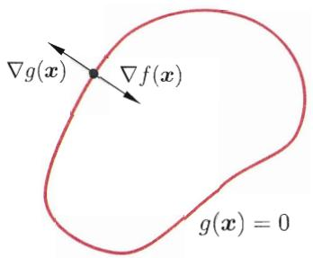
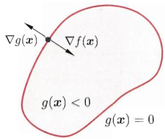
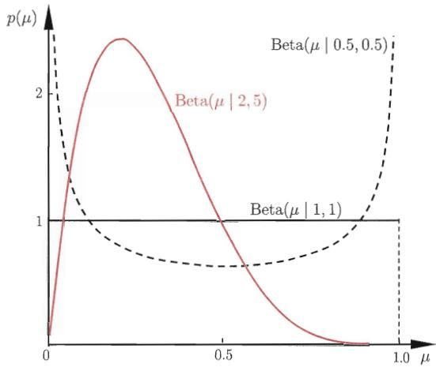
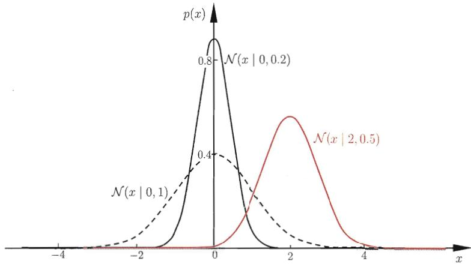

## 附录

## A 矩阵

## A.1 基本演算

记实矩阵 $\mathbf{A} \in \mathbb{R}^{m \times n}$ 第 $i$ 行第 $j$ 列的元素为 $(\mathbf{A})_{ij} = A_{ij}$ . 矩阵 $\mathbf{A}$ 的转置(transpose)记为 $\mathbf{A}^{\mathrm{T}}$ , $(\mathbf{A}^{\mathrm{T}})_{ij} = A_{ji}$ . 显然,

$$
\left(\mathbf {A} + \mathbf {B}\right) ^ {\mathrm{T}} = \mathbf {A} ^ {\mathrm{T}} + \mathbf {B} ^ {\mathrm{T}},\tag{A.1}
$$

$$
\left(\mathbf {A} \mathbf {B}\right) ^ {\mathrm{T}} = \mathbf {B} ^ {\mathrm{T}} \mathbf {A} ^ {\mathrm{T}}.\tag{A.2}
$$

对于矩阵 $\mathbf{A} \in \mathbb{R}^{m \times n}$ , 若 $m = n$ 则称为 $n$ 阶方阵. 用 $\mathbf{I}_n$ 表示 $n$ 阶单位阵, 方阵 $\mathbf{A}$ 的逆矩阵 $\mathbf{A}^{-1}$ 满足 $\mathbf{A}\mathbf{A}^{-1} = \mathbf{A}^{-1}\mathbf{A} = \mathbf{I}$ . 不难发现,

常直接用 I 表示单位阵.

$$
(\mathbf {A} ^ {\mathrm{T}}) ^ {- 1} = (\mathbf {A} ^ {- 1}) ^ {\mathrm{T}},\tag{A.3}
$$

$$
(\mathbf {A B}) ^ {- 1} = \mathbf {B} ^ {- 1} \mathbf {A} ^ {- 1}.\tag{A.4}
$$

对于 $n$ 阶方阵 $\mathbf{A}$ , 它的迹(trace)是主对角线上的元素之和, 即 $\operatorname{tr}(\mathbf{A}) = \sum_{i=1}^{n} A_{ii}$ . 迹有如下性质:

$$
\operatorname{tr} (\mathbf {A} ^ {\mathrm{T}}) = \operatorname{tr} (\mathbf {A}),\tag{A.5}
$$

$$
\operatorname{tr} (\mathbf {A} + \mathbf {B}) = \operatorname{tr} (\mathbf {A}) + \operatorname{tr} (\mathbf {B}),\tag{A.6}
$$

$$
\operatorname{tr} (\mathbf {A B}) = \operatorname{tr} (\mathbf {B A}),\tag{A.7}
$$

$$
\operatorname{tr} (\mathbf {A B C}) = \operatorname{tr} (\mathbf {B C A}) = \operatorname{tr} (\mathbf {C A B}).\tag{A.8}
$$

$n$ 阶方阵 $\mathbf{A}$ 的行列式(determinant)定义为

$$
\det (\mathbf {A}) = \sum_ {\boldsymbol {\sigma} \in S _ {n}} \operatorname{par} (\boldsymbol {\sigma}) A _ {1 \sigma_ {1}} A _ {2 \sigma_ {2}} \dots A _ {1 \sigma_ {n}},\tag{A.9}
$$

其中 $S_{n}$ 为所有 $n$ 阶排列(permutation)的集合, $\operatorname{par}(\sigma)$ 的值为-1或+1取决于 $\sigma = (\sigma_1, \sigma_2, \ldots, \sigma_n)$ 为奇排列或偶排列, 即其中出现降序的次数为奇数或偶数, 例如 $(1,3,2)$ 中降序次数为 $1$ , $(1,4,3,2)$ 中降序次数为 2. 对于单位阵, 有 $\operatorname{det}(\mathbf{I}) = 1$ . 对于 2 阶方阵, 有

$$
\det (\mathbf {A}) = \det \left( \begin{array}{c c} A _ {1 1} & A _ {1 2} \\ A _ {2 1} & A _ {2 2} \end{array} \right) = A _ {1 1} A _ {2 2} - A _ {1 2} A _ {2 1}.
$$

n 阶方阵 A 的行列式有如下性质:

$$
\det (c \mathbf {A}) = c ^ {n} \det (\mathbf {A}),\tag{A.10}
$$

$$
\det (\mathbf {A} ^ {\mathrm{T}}) = \det (\mathbf {A}),\tag{A.11}
$$

$$
\det (\mathbf {A B}) = \det (\mathbf {A}) \det (\mathbf {B}),\tag{A.12}
$$

$$
\det (\mathbf {A} ^ {- 1}) = \det (\mathbf {A}) ^ {- 1},\tag{A.13}
$$

$$
\det (\mathbf {A} ^ {n}) = \det (\mathbf {A}) ^ {n}.\tag{A.14}
$$

矩阵 $\mathbf{A} \in \mathbb{R}^{m \times n}$ 的 Frobenius 范数定义为

$$
\left\| \mathbf {A} \right\| _ {F} = \left(\operatorname{tr} \left(\mathbf {A} ^ {\mathrm{T}} \mathbf {A}\right)\right) ^ {1 / 2} = \left(\sum_ {i = 1} ^ {m} \sum_ {j = 1} ^ {n} A _ {i j} ^ {2}\right) ^ {1 / 2}.\tag{A.15}
$$

容易看出, 矩阵的 Frobenius 范数就是将矩阵张成向量后的 $L_{2}$ 范数.

## A.2 导数

向量 $\pmb{a}$ 相对于标量 $x$ 的导数(derivative)，以及 $x$ 相对于 $\pmb{a}$ 的导数都是向量，其第 $i$ 个分量分别为

$$
\left(\frac {\partial \boldsymbol {a}}{\partial x}\right) _ {i} = \frac {\partial a _ {i}}{\partial x},\tag{A.16}
$$

$$
\left(\frac {\partial x}{\partial \boldsymbol {a}}\right) _ {i} = \frac {\partial x}{\partial a _ {i}}\tag{A.17}
$$

类似的, 矩阵 $\mathbf{A}$ 对于标量 $x$ 的导数, 以及 $x$ 对于 $\mathbf{A}$ 的导数都是矩阵, 其第 $i$ 行第 $j$ 列上的元素分别为

$$
\left(\frac {\partial \mathbf {A}}{\partial x}\right) _ {i j} = \frac {\partial A _ {i j}}{\partial x},\tag{A.18}
$$

$$
\left(\frac {\partial x}{\partial \mathbf {A}}\right) _ {i j} = \frac {\partial x}{\partial A _ {i j}}.\tag{A.19}
$$

对于函数 $f(\pmb{x})$ ，假定其对向量的元素可导，则 $f(\pmb{x})$ 关于 $\pmb{x}$ 的一阶导数是一个向量，其第 $i$ 个分量为

$$
\left(\nabla f (\boldsymbol {x})\right) _ {i} = \frac {\partial f (\boldsymbol {x})}{\partial x _ {i}},\tag{A.20}
$$

$f(\pmb{x})$ 关于 $\pmb{x}$ 的二阶导数是称为海森矩阵(Hessian matrix)的一个方阵, 其第 $i$ 行第 $j$ 列上的元素为

$$
\left(\nabla^ {2} f (\boldsymbol {x})\right) _ {i j} = \frac {\partial^ {2} f (\boldsymbol {x})}{\partial x _ {i} \partial x _ {j}}.\tag{A.21}
$$

向量和矩阵的导数满足乘法法则(product rule)

$\pmb{a}$ 相对于 $\pmb{x}$ 为常向量.

$$
\frac {\partial \boldsymbol {x} ^ {\mathrm{T}} \boldsymbol {a}}{\partial \boldsymbol {x}} = \frac {\partial \boldsymbol {a} ^ {\mathrm{T}} \boldsymbol {x}}{\partial \boldsymbol {x}} = \boldsymbol {a},\tag{A.22}
$$

$$
\frac {\partial \mathbf {A B}}{\partial x} = \frac {\partial \mathbf {A}}{\partial x} \mathbf {B} + \mathbf {A} \frac {\partial \mathbf {B}}{\partial x}.\tag{A.23}
$$

由 $\mathbf{A}^{-1}\mathbf{A} = \mathbf{I}$ 和式(A.23)，逆矩阵的导数可表示为

$$
\frac {\partial \mathbf {A} ^ {- 1}}{\partial x} = - \mathbf {A} ^ {- 1} \frac {\partial \mathbf {A}}{\partial x} \mathbf {A} ^ {- 1}.\tag{A.24}
$$

若求导的标量是矩阵 A 的元素, 则有

$$
\frac {\partial \operatorname{tr} (\mathbf {A B})}{\partial A _ {i j}} = B _ {j i},\tag{A.25}
$$

$$
\frac {\partial \operatorname{tr} (\mathbf {A B})}{\partial \mathbf {A}} = \mathbf {B} ^ {\mathrm{T}}.\tag{A.26}
$$

进而有

$$
\frac {\partial \operatorname{tr} (\mathbf {A} ^ {\mathrm{T}} \mathbf {B})}{\partial \mathbf {A}} = \mathbf {B},\tag{A.27}
$$

$$
\frac {\partial \operatorname{tr} (\mathbf {A})}{\partial \mathbf {A}} = \mathbf {I},\tag{A.28}
$$

$$
\frac {\partial \operatorname{tr} (\mathbf {A B A} ^ {\mathrm{T}})}{\partial \mathbf {A}} = \mathbf {A} (\mathbf {B} + \mathbf {B} ^ {\mathrm{T}}).\tag{A.29}
$$

由式(A.15)和(A.29)有

$$
\frac {\partial \| \mathbf {A} \| _ {F} ^ {2}}{\partial \mathbf {A}} = \frac {\partial \operatorname{tr} (\mathbf {A A} ^ {\mathrm{T}})}{\partial \mathbf {A}} = 2 \mathbf {A}.\tag{A.30}
$$

链式法则(chain rule)是计算复杂导数时的重要工具. 简单地说, 若函数 $f$ 是 $g$ 和 $h$ 的复合, 即 $f(x) = g(h(x))$ , 则有

$$
\frac {\partial f (x)}{\partial x} = \frac {\partial g (h (x))}{\partial h (x)} \cdot \frac {\partial h (x)}{\partial x}.\tag{A.31}
$$

例如在计算下式时, 将 Ax-b 看作一个整体可简化计算:

$$
\begin{array}{r l} \frac {\partial}{\partial x} (\mathbf {A} x - b) ^ {\mathrm{T}} \mathbf {W} (\mathbf {A} x - b) & = \frac {\partial (\mathbf {A} x - b)}{\partial x} \cdot 2 \mathbf {W} (\mathbf {A} x - b) \\ & = 2 \mathbf {A} \mathbf {W} (\mathbf {A} x - b). \end{array}\tag{A.32}
$$

## A.3 奇异值分解

任意实矩阵 $\mathbf{A} \in \mathbb{R}^{m \times n}$ 都可分解为

$$
\mathbf {A} = \mathbf {U} \boldsymbol {\Sigma} \mathbf {V} ^ {\mathrm{T}},\tag{A.33}
$$

其中， $\mathbf{U} \in \mathbb{R}^{m \times m}$ 是满足 $\mathbf{U}^{\mathrm{T}}\mathbf{U} = \mathbf{I}$ 的 $m$ 阶酉矩阵(unitary matrix); $\mathbf{V} \in \mathbb{R}^{n \times n}$ 是满足 $\mathbf{V}^{\mathrm{T}}\mathbf{V} = \mathbf{I}$ 的 $n$ 阶酉矩阵; $\boldsymbol{\Sigma} \in \mathbb{R}^{m \times n}$ 是 $m \times n$ 的矩阵, 其中 $(\boldsymbol{\Sigma})_{ii} = \sigma_i$ 且其他位置的元素均为 $0, \sigma_i$ 为非负实数且满足 $\sigma_1 \geqslant \sigma_2 \geqslant \ldots \geqslant 0$ .

常将奇异值按降序排列以确保 $\Sigma$ 的唯一性.

当 A 为对称正定矩阵时，奇异值分解与特征值分解结果相同.

式(A.33)中的分解称为奇异值分解(Singular Value Decomposition, 简称SVD), 其中 $\mathbf{U}$ 的列向量 $\pmb{u}_i \in \mathbb{R}^m$ 称为 $\mathbf{A}$ 的左奇异向量(left-singular vector), $\mathbf{V}$ 的列向量 $\pmb{v}_i \in \mathbb{R}^n$ 称为 $\mathbf{A}$ 的右奇异向量(right-singular vector), $\sigma_i$ 称为奇异值(singular value). 矩阵 $\mathbf{A}$ 的秩(rank)就等于非零奇异值的个数.

奇异值分解有广泛的用途, 例如对于低秩矩阵近似(low-rank matrix approximation)问题, 给定一个秩为 $r$ 的矩阵 $\mathbf{A}$ , 欲求其最优 $k$ 秩近似矩阵 $\widetilde{\mathbf{A}}$ , $k \leqslant r$ , 该问题可形式化为

$$
\begin{array}{l l} \min _ {\widetilde {\mathbf {A}} \in \mathbb {R} ^ {m \times n}} & \| \mathbf {A} - \widetilde {\mathbf {A}} \| _ {F} \\ \text { s.t. } & \operatorname{rank} (\widetilde {\mathbf {A}}) = k . \end{array}\tag{A.34}
$$

奇异值分解提供了上述问题的解析解: 对矩阵 A 进行奇异值分解后, 将矩阵 $\Sigma$ 中的 r-k 个最小的奇异值置零获得矩阵 $\Sigma_{k}$ , 即仅保留最大的 k 个奇异值, 则

$$
\mathbf {A} _ {k} = \mathbf {U} _ {k} \boldsymbol {\Sigma} _ {k} \mathbf {V} _ {k} ^ {\mathrm{T}}\tag{A.35}
$$

就是式(A.34)的最优解, 其中 $\mathbf{U}_k$ 和 $\mathbf{V}_k$ 分别是式(A.33)中的前 $k$ 列组成的矩阵. 这个结果称为 Eckart-Young-Mirsky 定理.

## B 优化

## B.1 拉格朗日乘子法

拉格朗日乘子法(Lagrange multipliers)是一种寻找多元函数在一组约束下的极值的方法. 通过引入拉格朗日乘子, 可将有 $d$ 个变量与 $k$ 个约束条件的最优化问题转化为具有 $d + k$ 个变量的无约束优化问题求解.

先考虑一个等式约束的优化问题. 假定 $\pmb{x}$ 为 $d$ 维向量, 欲寻找 $\pmb{x}$ 的某个取值 $\pmb{x}^*$ , 使目标函数 $f(\pmb{x})$ 最小且同时满足 $g(\pmb{x}) = 0$ 的约束. 从几何角度看, 该问题的目标是在由方程 $g(\pmb{x}) = 0$ 确定的 $d - 1$ 维曲面上寻找能使目标函数 $f(\pmb{x})$ 最小化的点. 此时不难得到如下结论:

函数等值线与约束曲面相切.

可通过反证法证明：若梯度 $\nabla f(x^{*})$ 与约束曲面不正交，则仍可在约束曲面上移动该点使函数值进一步下降.

\- 对于约束曲面上的任意点 $\pmb{x}$ , 该点的梯度 $\nabla g(\pmb{x})$ 正交于约束曲面;

\- 在最优点 $x^{*}$ , 目标函数在该点的梯度 $\nabla f(x^{*})$ 正交于约束曲面.

由此可知, 在最优点 $\pmb{x}^{*}$ , 如附图B.1所示, 梯度 $\nabla g(\pmb{x})$ 和 $\nabla f(\pmb{x})$ 的方向必相同或相反, 即存在 $\lambda \neq 0$ 使得

$$
\nabla f (\boldsymbol {x} ^ {*}) + \lambda \nabla g (\boldsymbol {x} ^ {*}) = 0,\tag{B.1}
$$

对等式约束, $\lambda$ 可能为正也可能为负.

$\lambda$ 称为拉格朗日乘子. 定义拉格朗日函数

$$
L (\boldsymbol {x}, \lambda) = f (\boldsymbol {x}) + \lambda g (\boldsymbol {x}),\tag{B.2}
$$

不难发现, 将其对 $\pmb{x}$ 的偏导数 $\nabla_{\pmb{x}}L(\pmb{x},\lambda)$ 置零即得式(B.1), 同时, 将其对 $\lambda$ 的偏导数 $\nabla_{\lambda}L(\pmb{x},\lambda)$ 置零即得约束条件 $g(\pmb{x}) = 0$ . 于是, 原约束优化问题可转化为对拉格朗日函数 $L(\pmb{x},\lambda)$ 的无约束优化问题.

  
(a) 等式约束

  
(b) 不等式约束  
附图B.1 拉格朗日乘子法的几何含义: 在 (a) 等式约束 $g(\boldsymbol{x}) = 0$ 或 (b) 不等式约束 $g(\boldsymbol{x}) \leqslant 0$ 下, 最小化目标函数 $f(\boldsymbol{x})$ . 红色曲线表示 $g(\boldsymbol{x}) = 0$ 构成的曲面, 而其围成的阴影区域表示 $g(\boldsymbol{x}) < 0$ .

现在考虑不等式约束 $g(\pmb{x}) \leqslant 0$ ，如附图B.1所示，此时最优点 $\pmb{x}^*$ 或在 $g(\pmb{x}) < 0$ 的区域中，或在边界 $g(\pmb{x}) = 0$ 上。对于 $g(\pmb{x}) < 0$ 的情形，约束 $g(\pmb{x}) \leqslant 0$ 不起作用，可直接通过条件 $\nabla f(\pmb{x}) = 0$ 来获得最优点；这等价于将 $\lambda$ 置零然后对 $\nabla_{\pmb{x}} L(\pmb{x}, \lambda)$ 置零得到最优点。 $g(\pmb{x}) = 0$ 的情形类似于上面等式约束的分析，但需注意的是，此时 $\nabla f(\pmb{x}^*)$ 的方向必与 $\nabla g(\pmb{x}^*)$ 相反，即存在常数 $\lambda > 0$ 使得 $\nabla f(\pmb{x}^*) + \lambda \nabla g(\pmb{x}^*) = 0$ 。整合这两种情形，必满足 $\lambda g(\pmb{x}) = 0$ 。因此，在约束 $g(\pmb{x}) \leqslant 0$ 下最小化 $f(\pmb{x})$ ，可转化为在如下约束下最小化式(B.2)的拉格朗日函数：

$$
\left\{ \begin{array}{l} g (\boldsymbol {x}) \leqslant 0; \\ \lambda \geqslant 0; \\ \mu_ {j} g _ {j} (\boldsymbol {x}) = 0. \end{array} \right.\tag{B.3}
$$

式(B.3)称为 Karush-Kuhn-Tucker (简称KKT)条件.

上述做法可推广到多个约束. 考虑具有 $m$ 个等式约束和 $n$ 个不等式约束, 且可行域 $\mathbb{D} \subset \mathbb{R}^d$ 非空的优化问题

$$
\begin{array}{l l} \underset {\boldsymbol {x}} {\min} & f (\boldsymbol {x}) \\ \text {s.t.} & h _ {i} (\boldsymbol {x}) = 0 \quad (i = 1, \ldots , m) , \\ & g _ {j} (\boldsymbol {x}) \leqslant 0 \quad (j = 1, \ldots , n) . \end{array}\tag{B.4}
$$

引入拉格朗日乘子 $\boldsymbol{\lambda}=(\lambda_{1},\lambda_{2},\ldots,\lambda_{m})^{\mathrm{T}}$ 和 $\boldsymbol{\mu}=(\mu_{1},\mu_{2},\ldots,\mu_{n})^{\mathrm{T}}$ ，相应的拉格

朗日函数为

$$
L (\boldsymbol {x}, \boldsymbol {\lambda}, \boldsymbol {\mu}) = f (\boldsymbol {x}) + \sum_ {i = 1} ^ {m} \lambda_ {i} h _ {i} (\boldsymbol {x}) + \sum_ {j = 1} ^ {n} \mu_ {j} g _ {j} (\boldsymbol {x}),\tag{B.5}
$$

由不等式约束引入的 KKT 条件 $(j=1,2,\ldots,n)$ 为

$$
\left\{ \begin{array}{l} g _ {j} (\boldsymbol {x}) \leqslant 0; \\ \mu_ {j} \geqslant 0; \\ \mu_ {j} g _ {j} (\boldsymbol {x}) = 0. \end{array} \right.\tag{B.6}
$$

一个优化问题可以从两个角度来考察, 即 “主问题” (primal problem) 和 “对偶问题” (dual problem). 对主问题(B.4), 基于式(B.5), 其拉格朗日 “对偶函数” (dual function) $\Gamma: \mathbb{R}^m \times \mathbb{R}^n \mapsto \mathbb{R}$ 定义为

在推导对偶问题时，常通过将拉格朗日乘子 $L(\pmb {x},\lambda ,\mu)$ 对 $\pmb{x}$ 求导并令导数为0，来获得对偶函数的表达形式.

$$
\begin{array}{l} \Gamma (\boldsymbol {\lambda}, \boldsymbol {\mu}) = \inf _ {\boldsymbol {x} \in \mathbb {D}} L (\boldsymbol {x}, \boldsymbol {\lambda}, \boldsymbol {\mu}) \\ = \inf _ {\boldsymbol {x} \in \mathbb {D}} \left(f (\boldsymbol {x}) + \sum_ {i = 1} ^ {m} \lambda_ {i} h _ {i} (\boldsymbol {x}) + \sum_ {j = 1} ^ {n} \mu_ {j} g _ {j} (\boldsymbol {x})\right) \end{array}\tag{B.7}
$$

$\mu \succeq 0$ 表示 $\pmb{\mu}$ 的分量均为非负.

若 $\tilde{\pmb{x}}\in \mathbb{D}$ 为主问题(B.4)可行域中的点, 则对任意 $\pmb {\mu}\succeq 0$ 和 $\pmb{\lambda}$ 都有

$$
\sum_ {i = 1} ^ {m} \lambda_ {i} h _ {i} (\boldsymbol {x}) + \sum_ {j = 1} ^ {n} \mu_ {j} g _ {j} (\boldsymbol {x}) \leqslant 0,\tag{B.8}
$$

进而有

$$
\Gamma (\boldsymbol {\lambda}, \boldsymbol {\mu}) = \inf _ {\boldsymbol {x} \in \mathbb {D}} L (\boldsymbol {x}, \boldsymbol {\lambda}, \boldsymbol {\mu}) \leqslant L (\tilde {\boldsymbol {x}}, \boldsymbol {\lambda}, \boldsymbol {\mu}) \leqslant f (\tilde {\boldsymbol {x}}).\tag{B.9}
$$

若主问题(B.4)的最优值为 $p^*$ ，则对任意 $\mu \succeq 0$ 和 $\lambda$ 都有

$$
\Gamma (\boldsymbol {\lambda}, \boldsymbol {\mu}) \leqslant p ^ {*},\tag{B.10}
$$

即对偶函数给出了主问题最优值的下界. 显然, 这个下界取决于 $\pmb{\mu}$ 和 $\pmb{\lambda}$ 的值. 于是, 一个很自然的问题是: 基于对偶函数能获得的最好下界是什么? 这就引出了优化问题

$$
\max _ {\boldsymbol {\lambda}, \boldsymbol {\mu}} \Gamma (\boldsymbol {\lambda}, \boldsymbol {\mu}) \text { s.t. } \boldsymbol {\mu} \succeq 0 .\tag{B.11}
$$

式(B.11)就是主问题(B.4)的对偶问题, 其中 $\lambda$ 和 $\mu$ 称为 “对偶变量” (dual variable). 无论主问题(B.4)的凸性如何, 对偶问题(B.11)始终是凸优化问题.

考虑式(B.11)的最优值 $d^{*}$ , 显然有 $d^{*} \leqslant p^{*}$ , 这称为“弱对偶性”(weak duality)成立; 若 $d^{*} = p^{*}$ , 则称为“强对偶性”(strong duality)成立, 此时由对偶问题能获得主问题的最优下界. 对于一般的优化问题, 强对偶性通常不成立. 但是, 若主问题为凸优化问题, 如式(B.4)中 $f(\pmb{x})$ 和 $g_{j}(\pmb{x})$ 均为凸函数, $h_{i}(\pmb{x})$ 为仿射函数, 且其可行域中至少有一点使不等式约束严格成立, 则此时强对偶性成立. 值得注意的是, 在强对偶性成立时, 将拉格朗日函数分别对原变量和对偶变量求导, 再并令导数等于零, 即可得到原变量与对偶变量的数值关系. 于是, 对偶问题解决了, 主问题也就解决了.

这称为 Slater 条件.

## B.2 二次规划

二次规划(Quadratic Programming, 简称 QP)是一类典型的优化问题, 包括凸二次优化和非凸二次优化. 在此类问题中, 目标函数是变量的二次函数, 而约束条件是变量的线性不等式.

非标准二次规划问题中可以包含等式约束。注意到等式约束能用两个不等式约束来代替；不等式约束可通过增加松弛变量的方式转化为等式约束。

假定变量个数为 $d$ ，约束条件的个数为 $m$ ，则标准的二次规划问题形如

$$
\begin{array}{l l} \min _ {\boldsymbol {x}} & \frac {1}{2} \boldsymbol {x} ^ {\mathrm{T}} \mathbf {Q} \boldsymbol {x} + \boldsymbol {c} ^ {\mathrm{T}} \boldsymbol {x} \\ \text {s.t.} & \mathbf {A} \boldsymbol {x} \leqslant \boldsymbol {b}, \end{array}\tag{B.12}
$$

其中 $\pmb{x}$ 为 $d$ 维向量, $\mathbf{Q} \in \mathbb{R}^{d \times d}$ 为实对称矩阵, $\mathbf{A} \in \mathbb{R}^{m \times d}$ 为实矩阵, $\pmb{b} \in \mathbb{R}^m$ 和 $\pmb{c} \in \mathbb{R}^d$ 为实向量, $\mathbf{A}\pmb{x} \leqslant \pmb{b}$ 的每一行对应一个约束.

若 $\mathbf{Q}$ 为半正定矩阵, 则式(B.12)目标函数是凸函数, 相应的二次规划是凸二次优化问题; 此时若约束条件 $Ax \leqslant b$ 定义的可行域不为空, 且目标函数在此可行域有下界, 则该问题将有全局最小值. 若 $\mathbf{Q}$ 为正定矩阵, 则该问题有唯一的全局最小值. 若 $\mathbf{Q}$ 为非正定矩阵, 则式(B.12)是有多个平稳点和局部极小点的 NP 难问题.

常用的二次规划解法有椭球法(ellipsoid method)、内点法(interior point)、增广拉格朗日法(augmented Lagrangian)、梯度投影法(gradient projection)等. 若 $\mathbf{Q}$ 为正定矩阵, 则相应的二次规划问题可由椭球法在多项式时间内求解.

## B.3 半正定规划

半正定规划(Semi-Definite Programming, 简称SDP)是一类凸优化问题, 其中的变量可组织成半正定对称矩阵形式, 且优化问题的目标函数和约束都是这些变量的线性函数.

给定 $d \times d$ 的对称矩阵 $\mathbf{X}$ 、 $\mathbf{C}$ ,

$$
\mathbf {C} \cdot \mathbf {X} = \sum_ {i = 1} ^ {d} \sum_ {j = 1} ^ {d} C _ {i j} X _ {i j},\tag{B.13}
$$

若 $\mathbf{A}_i (i = 1,2,\ldots,m)$ 也是 $d \times d$ 的对称矩阵, $b_i (i = 1,2,\ldots,m)$ 为 $m$ 个实数, 则半正定规划问题形如

$$
\begin{array}{l l} \underset {\mathbf {X}} {\min} & \mathbf {C} \cdot \mathbf {X} \\ \text {s.t.} & \mathbf {A} _ {i} \cdot \mathbf {X} = b _ {i}, i = 1, 2, \dots , m \\ & \mathbf {X} \succeq 0. \end{array}\tag{B.14}
$$

$X \succeq 0$ 表示 X 半正定.

半正定规划与线性规划都拥有线性的目标函数和约束, 但半正定规划中的约束 $\mathbf{X} \succeq 0$ 是一个非线性、非光滑约束条件. 在优化理论中, 半正定规划具有一定的一般性, 能将几种标准的优化问题(如线性规划、二次规划)统一起来.

常见的用于求解线性规划的内点法经过少许改造即可求解半正定规划问题, 但半正定规划的计算复杂度较高, 难以直接用于大规模问题.

## B.4 梯度下降法

一阶方法仅使用目标函数的一阶导数, 不利用其高阶导数.

梯度下降法(gradient descent)是一种常用的一阶(first-order)优化方法, 是求解无约束优化问题最简单、最经典的方法之一.

考虑无约束优化问题 $\min_{\pmb{x}}f(\pmb {x})$ ，其中 $f(\pmb {x})$ 为连续可微函数.若能构造一个序列 $\pmb{x}^0,\pmb{x}^1,\pmb{x}^2,\ldots$ 满足

$$
f (\boldsymbol {x} ^ {t + 1}) <   f (\boldsymbol {x} ^ {t}), t = 0, 1, 2, \dots\tag{B.15}
$$

则不断执行该过程即可收敛到局部极小点. 欲满足式(B.15), 根据泰勒展式有

$$
f (\boldsymbol {x} + \Delta \boldsymbol {x}) \simeq f (\boldsymbol {x}) + \Delta \boldsymbol {x} ^ {\mathrm{T}} \nabla f (\boldsymbol {x}),\tag{B.16}
$$

于是, 欲满足 $f(\pmb{x} + \Delta \pmb{x}) < f(\pmb{x})$ , 可选择

$$
\Delta \boldsymbol {x} = - \gamma \nabla f (\boldsymbol {x}),\tag{B.17}
$$

每步的步长 $\gamma_{t}$ 可不同.

其中步长 $\gamma$ 是一个小常数. 这就是梯度下降法.

L-Lipschitz条件是指对于任意 x，存在常数 L 使得 $\|\nabla f(x)\|\leqslant L$ 成立.

若目标函数 $f(\pmb{x})$ 满足一些条件, 则通过选取合适的步长, 就能确保通过梯度下降收敛到局部极小点. 例如若 $f(\pmb{x})$ 满足 $L$ -Lipschitz 条件, 则将步长设置为 $1 / (2L)$ 即可确保收敛到局部极小点. 当目标函数为凸函数时, 局部极小点就对应着函数的全局最小点, 此时梯度下降法可确保收敛到全局最优解.

当目标函数 $f(\pmb{x})$ 二阶连续可微时, 可将式(B.16)替换为更精确的二阶泰勒展式, 这样就得到了牛顿法(Newton's method). 牛顿法是典型的二阶方法, 其迭代轮数远小于梯度下降法. 但牛顿法使用了二阶导数 $\nabla^2 f(\pmb{x})$ , 其每轮迭代中涉及到海森矩阵(A.21)的求逆, 计算复杂度相当高, 尤其在高维问题中几乎不可行. 若能以较低的计算代价寻找海森矩阵的近似逆矩阵, 则可显著降低计算开销, 这就是拟牛顿法(quasi-Newton method).

## B.5 坐标下降法

求解极大值问题时亦称“坐标上升法”（coordinate ascent).

坐标下降法(coordinate descent)是一种非梯度优化方法, 它在每步迭代中沿一个坐标方向进行搜索, 通过循环使用不同的坐标方向来达到目标函数的局部极小值.

不妨假设目标是求解函数 $f(\pmb{x})$ 的极小值, 其中 $\pmb{x} = (x_{1}, x_{2}, \ldots, x_{d})^{\mathrm{T}} \in \mathbb{R}^{d}$ 是一个 $d$ 维向量. 从初始点 $\pmb{x}^{0}$ 开始, 坐标下降法通过迭代地构造序列 $\pmb{x}^{0}, \pmb{x}^{1}, \pmb{x}^{2}, \ldots$ 来求解该问题, $\pmb{x}^{t+1}$ 的第 $i$ 个分量 $x_{i}^{t+1}$ 构造为

$$
x _ {i} ^ {t + 1} = \underset {y \in \mathbb {R}} {\arg \min} f (x _ {1} ^ {t + 1}, \dots , x _ {i - 1} ^ {t + 1}, y, x _ {i + 1} ^ {t}, \dots , x _ {d} ^ {t}).\tag{B.18}
$$

通过执行此操作, 显然有

$$
f (\pmb {x} ^ {0}) \geqslant f (\pmb {x} ^ {1}) \geqslant f (\pmb {x} ^ {2}) \geqslant \dots\tag{B.19}
$$

与梯度下降法类似, 通过迭代执行该过程, 序列 $x^0, x^1, x^2, \ldots$ 能收敛到所期望的局部极小点或驻点(stationary point).

坐标下降法不需计算目标函数的梯度, 在每步迭代中仅需求解一维搜索问题, 对于某些复杂问题计算较为简便. 但若目标函数不光滑, 则坐标下降法有可能陷入非驻点(non-stationary point).

## C 概率分布

## C.1 常见概率分布

本节简要介绍几种常见概率分布. 对于每种分布, 我们将给出概率密度函数以及期望 $E[\cdot]$ 、方差 var[·] 和协方差 cov[·,·] 等几个主要的统计量.

## C.1.1 均匀分布

这里仅介绍连续均匀分布.

均匀分布(uniform distribution)是关于定义在区间 $[a, b] (a < b)$ 上连续变量的简单概率分布, 其概率密度函数如附图C.1所示.

  
附图C.1 均匀分布的概率密度函数

$$
p (x \mid a, b) = \mathrm{U} (x \mid a, b) = \frac {1}{b - a};\tag{C.1}
$$

$$
\mathbb {E} [ x ] = \frac {a + b}{2};\tag{C.2}
$$

$$
\operatorname{var} [ x ] = \frac {(b - a) ^ {2}}{1 2}.\tag{C.3}
$$

不难发现, 若变量 $x$ 服从均匀分布 $\mathrm{U}(x \mid 0,1)$ 且 $a < b$ , 则 $a + (b - a)x$ 服从均匀分布 $\mathrm{U}(x \mid a,b)$ .

## C.1.2 伯努利分布

以瑞士数学家雅各布.伯努利 (Jacob Bernoulli, 1654–1705) 的名字命名.

伯努利分布(Bernoulli distribution)是关于布尔变量 $x \in \{0,1\}$ 的概率分布, 其连续参数 $\mu \in [0,1]$ 表示变量 $x = 1$ 的概率.

$$
P (x \mid \mu) = \operatorname{Bern} (x \mid \mu) = \mu^ {x} (1 - \mu) ^ {1 - x};\tag{C.4}
$$

$$
\mathbb {E} [ x ] = \mu ;
$$

$$
\operatorname{var} [ x ] = \mu (1 - \mu).\tag{C.5}
$$

(C.6)

## C.1.3 二项分布

二项分布(binomial distribution)用以描述 $N$ 次独立的伯努利实验中有 $m$ 次成功(即 $x = 1$ ) 的概率, 其中每次伯努利实验成功的概率为 $\mu \in [0,1]$ .

$$
P (m \mid N, \mu) = \operatorname{Bin} (m \mid N, \mu) = \binom {N} {m} \mu^ {m} (1 - \mu) ^ {N - m};\tag{C.7}
$$

$$
\mathbb {E} [ x ] = N \mu ;\tag{C.8}
$$

$$
\operatorname{var} [ x ] = N \mu (1 - \mu).\tag{C.9}
$$

对于参数 $\mu$ ，二项分布的共轭先验分布是贝塔分布。共轭分布参见 C.2.

## C.1.4 多项分布

当 N = 1 时, 二项分布退化为伯努利分布.

若将伯努利分布由单变量扩展为 $d$ 维向量 $\pmb{x}$ , 其中 $x_{i} \in \{0,1\}$ 且 $\sum_{i=1}^{d} x_{i} = 1$ , 并假设 $x_{i}$ 取 1 的概率为 $\mu_{i} \in [0,1]$ , $\sum_{i=1}^{d} \mu_{i} = 1$ , 则将得到离散概率分布

$$
P (\boldsymbol {x} \mid \boldsymbol {\mu}) = \prod_ {i = 1} ^ {d} \mu_ {i} ^ {x _ {i}};\tag{C.10}
$$

对于参数 $\mu$ ，多项分布的共轭先验分布是狄利克雷分布。共轭分布参见 C.2.

$$
\mathbb {E} [ x _ {i} ] = \mu_ {i};\tag{C.11}
$$

$$
\operatorname{var} [ x _ {i} ] = \mu_ {i} (1 - \mu_ {i});\tag{C.12}
$$

$$
\operatorname{cov} [ x _ {j}, x _ {i} ] = \mathbb {I} [ j = i ] \mu_ {i}.\tag{C.13}
$$

在此基础上扩展二项分布则得到多项分布(multinomial distribution)，它描述了在 $N$ 次独立实验中有 $m_{i}$ 次 $x_{i} = 1$ 的概率.

$$
\begin{array}{r l} P (m _ {1}, m _ {2}, \dots , m _ {d} \mid N, \boldsymbol {\mu}) & = \mathrm{Mult} (m _ {1}, m _ {2}, \dots , m _ {d} \mid N, \boldsymbol {\mu}) \\ & = \frac {N !}{m _ {1} !   m _ {2} !   \dots   m _ {d} !} \prod_ {i = 1} ^ {d} \mu_ {i} ^ {m _ {i}}; \end{array}\tag{C.14}
$$

$$
\mathbb {E} [ m _ {i} ] = N \mu_ {i};\tag{C.15}
$$

$$
\operatorname{var} [ m _ {i} ] = N \mu_ {i} (1 - \mu_ {i});\tag{C.16}
$$

$$
\operatorname{cov} [ m _ {j}, m _ {i} ] = - N \mu_ {j} \mu_ {i}.\tag{C.17}
$$

## C.1.5 贝塔分布

贝塔分布(Beta distribution)是关于连续变量 $\mu \in [0,1]$ 的概率分布, 它由两个参数 a > 0 和 b > 0 确定, 其概率密度函数如附图C.2所示.

  
附图C.2 贝塔分布的概率密度函数

$$
p (\mu \mid a, b) = \operatorname{Beta} (\mu \mid a, b) = \frac {\Gamma (a + b)}{\Gamma (a) \Gamma (b)} \mu^ {a - 1} (1 - \mu) ^ {b - 1}
$$

$$
= \frac {1}{B (a , b)} \mu^ {a - 1} (1 - \mu) ^ {b - 1};\tag{C.18}
$$

$$
\mathbb {E} [ \mu ] = \frac {a}{a + b};\tag{C.19}
$$

$$
\mathrm{var} [ \mu ] = \frac {a b}{(a + b) ^ {2} (a + b + 1)},\tag{C.20}
$$

其中 $\Gamma(a)$ 为 Gamma 函数

$$
\Gamma (a) = \int_ {0} ^ {+ \infty} t ^ {a - 1} e ^ {- t} \mathrm{d} t,\tag{C.21}
$$

$B(a,b)$ 为Beta函数

$$
B (a, b) = \frac {\Gamma (a) \Gamma (b)}{\Gamma (a + b)}.\tag{C.22}
$$

当 $a = b = 1$ 时，贝塔分布退化为均匀分布.

## C.1.6 狄利克雷分布

以德国数学家狄利克雷(1805—1859)的名字命名.

狄利克雷分布(Dirichlet distribution) 是关于一组 $d$ 个连续变量 $\mu_i \in [0,1]$ 的概率分布, $\sum_{i=1}^{d} \mu_i = 1$ . 令 $\boldsymbol{\mu} = (\mu_1; \mu_2; \ldots; \mu_d)$ , 参数 $\boldsymbol{\alpha} = (\alpha_1; \alpha_2; \ldots; \alpha_d)$ , $\alpha_i > 0$ , $\hat{\alpha} = \sum_{i=1}^{d} \alpha_i$ .

$$
p (\boldsymbol {\mu} \mid \boldsymbol {\alpha}) = \operatorname{Dir} (\boldsymbol {\mu} \mid \boldsymbol {\alpha}) = \frac {\Gamma (\hat {\alpha})}{\Gamma (\alpha_ {1}) \dots \Gamma (\alpha_ {i})} \prod_ {i = 1} ^ {d} \mu_ {i} ^ {\alpha_ {i} - 1};\tag{C.23}
$$

$$
\mathbb {E} [ \mu_ {i} ] = \frac {\alpha_ {i}}{\hat {\alpha}};\tag{C.24}
$$

$$
\operatorname{var} [ \mu_ {i} ] = \frac {\alpha_ {i} (\hat {\alpha} - \alpha_ {i})}{\hat {\alpha} ^ {2} (\hat {\alpha} + 1)};\tag{C.25}
$$

$$
\operatorname{cov} [ \mu_ {j}, \mu_ {i} ] = \frac {\alpha_ {j} \alpha_ {i}}{\hat {\alpha} ^ {2} (\hat {\alpha} + 1)}.\tag{C.26}
$$

当 d=2 时, 狄利克雷分布退化为贝塔分布.

## C.1.7 高斯分布

高斯分布(Gaussian distribution)亦称正态分布(normal distribution), 是应用最为广泛的连续概率分布.

$\sigma$ 为标准差.

对于单变量 $x \in (-\infty, \infty)$ , 高斯分布的参数为均值 $\mu \in (-\infty, \infty)$ 和方差 $\sigma^2 > 0$ . 附图C.3给出了在几组不同参数下高斯分布的概率密度函数.

$$
p (x \mid \mu , \sigma^ {2}) = \mathcal {N} (x \mid \mu , \sigma^ {2}) = \frac {1}{\sqrt {2 \pi \sigma^ {2}}} \exp \left\{- \frac {(x - \mu) ^ {2}}{2 \sigma^ {2}} \right\};\tag{C.27}
$$

$$
\mathbb {E} [ x ] = \mu ;\tag{C.28}
$$

$$
\operatorname{var} [ x ] = \sigma^ {2}.\tag{C.29}
$$

对于 d 维向量 x, 多元高斯分布的参数为 d 维均值向量 $\mu$ 和 $d \times d$ 的对称正定协方差矩阵 $\Sigma$ .

$$
\begin{array}{r l} p (\boldsymbol {x} \mid \boldsymbol {\mu}, \boldsymbol {\Sigma}) & = \mathcal {N} (\boldsymbol {x} \mid \boldsymbol {\mu}, \boldsymbol {\Sigma}) \\ & = \frac {1}{\sqrt {(2 \pi) ^ {d} \det (\boldsymbol {\Sigma})}} \exp \left\{- \frac {1}{2} (\boldsymbol {x} - \boldsymbol {\mu}) ^ {\mathrm{T}} \boldsymbol {\Sigma} ^ {- 1} (\boldsymbol {x} - \boldsymbol {\mu}) \right\}; \end{array}\tag{C.30}
$$

  
附图C.3 高斯分布的概率密度函数

$$
\mathbb {E} [ \boldsymbol {x} ] = \boldsymbol {\mu};\tag{C.31}
$$

$$
\operatorname{cov} [ \boldsymbol {x} ] = \boldsymbol {\Sigma}.\tag{C.32}
$$

## C.2 共轭分布

假设变量 $x$ 服从分布 $P(x \mid \Theta)$ , 其中 $\Theta$ 为参数, $X = \{x_1, x_2, \ldots, x_m\}$ 为变量 $x$ 的观测样本, 假设参数 $\Theta$ 服从先验分布 $\Pi(\Theta)$ . 若由先验分布 $\Pi(\Theta)$ 和抽样分布 $P(X \mid \Theta)$ 决定的后验分布 $F(\Theta \mid X)$ 与 $\Pi(\Theta)$ 是同种类型的分布, 则称先验分布 $\Pi(\Theta)$ 为分布 $P(x \mid \Theta)$ 或 $P(X \mid \Theta)$ 的共轭分布(conjugate distribution).

例如, 假设 $x \sim \operatorname{Bern}(x \mid \mu)$ , $X = \{x_1, x_2, \ldots, x_m\}$ 为观测样本, $\bar{x}$ 为观测样本的均值, $\mu \sim \operatorname{Beta}(\mu \mid a, b)$ , 其中 $a, b$ 为已知参数, 则 $\mu$ 的后验分布

$$
\begin{array}{l} F (\mu \mid X) \propto \operatorname{Beta} (\mu \mid a, b) P (X \mid \mu) \\ = \frac {\mu^ {a - 1} (1 - \mu) ^ {b - 1}}{B (a , b)} \mu^ {m \bar {x}} (1 - \mu) ^ {m - m \bar {x}} \\ = \frac {1}{B (a + m \bar {x} , b + m - m \bar {x})} \mu^ {a + m \bar {x} - 1} (1 - \mu) ^ {b + m - m \bar {x} - 1} \\ = \operatorname{Beta} (\mu \mid a ^ {\prime}, b ^ {\prime}), \end{array}\tag{C.33}
$$

这里仅考虑高斯分布方差已知、均值服从先验的情形.

亦为贝塔分布, 其中 $a' = a + m\bar{x}, b' = b + m - m\bar{x}$ , 这意味着贝塔分布与伯努利分布共轭. 类似可知, 多项分布的共轭分布是狄利克雷分布, 而高斯分布的共轭分布仍是高斯分布.

先验分布反映了某种先验信息, 后验分布既反映了先验分布提供的信息、又反映了样本提供的信息. 当先验分布与抽样分布共轭时, 后验分布与先验分布属于同种类型, 这意味着先验信息与样本提供的信息具有某种同一性. 于是, 若使用后验分布作为进一步抽样的先验分布, 则新的后验分布仍将属于同种类型. 因此, 共轭分布在不少情形下会使问题得以简化. 例如在式(C.33)的例子中, 对服从伯努利分布的事件 $X$ 使用贝塔先验分布, 则贝塔分布的参数值 $a$ 和 $b$ 可视为对伯努利分布的真实情况(事件发生和不发生)的预估. 随着“证据”(样本)的不断到来, 贝塔分布的参数值从 $a, b$ 变化为 $a + m\bar{x}, b + m - m\bar{x}$ , 且 $a / (a + b)$ 将随着 $m$ 的增大趋近于伯努利分布的真实参数值 $\bar{x}$ . 显然, 使用共轭先验之后, 只需调整 $a$ 和 $b$ 这两个预估值即可方便地进行模型更新.

## C.3 KL散度

KL散度(Kullback-Leibler divergence), 亦称相对熵(relative entropy)或信息散度(information divergence), 可用于度量两个概率分布之间的差异. 给定两个概率分布 $P$ 和 $Q$ , 二者之间的KL散度定义为

这里假设两个分布均为连续型概率分布；对于离散型概率分布，只需将定义中的积分替换为对所有离散值遍历求和.

$$
\operatorname{KL} (P \| Q) = \int_ {- \infty} ^ {\infty} p (x) \log \frac {p (x)}{q (x)} \mathrm{d} x,\tag{C.34}
$$

其中 $p(x)$ 和 $q(x)$ 分别为 P 和 Q 的概率密度函数.

KL散度满足非负性, 即

$$
\operatorname{KL} (P \| Q) \geqslant 0,\tag{C.35}
$$

当且仅当 P = Q 时 $\mathrm{KL}(P \| Q) = 0$ . 但是, KL 散度不满足对称性, 即

$$
\operatorname{KL} (P \| Q) \neq \operatorname{KL} (Q \| P),\tag{C.36}
$$

度量应满足四个基本性质, 参见9.3节.

因此, KL散度不是一个度量(metric).

若将KL散度的定义(C.34)展开, 可得

$$
\begin{array}{r l} \mathrm{KL} (P \| Q) & = \int_ {- \infty} ^ {\infty} p (x) \log p (x) \mathrm{d} x - \int_ {- \infty} ^ {\infty} p (x) \log q (x) \mathrm{d} x \\ & = - H (P) + H (P, Q), \end{array}\tag{C.37}
$$

其中 $H(P)$ 为熵(entropy), $H(P, Q)$ 为 $P$ 和 $Q$ 的交叉熵(cross entropy). 在信息论中, 熵 $H(P)$ 表示对来自 $P$ 的随机变量进行编码所需的最小字节数, 而交叉熵 $H(P, Q)$ 则表示使用基于 $Q$ 的编码对来自 $P$ 的变量进行编码所需的字节数. 因此, KL散度可认为是使用基于 $Q$ 的编码对来自 $P$ 的变量进行编码所需的“额外”字节数; 显然, 额外字节数必然非负, 当且仅当 $P = Q$ 时额外字节数为零.
